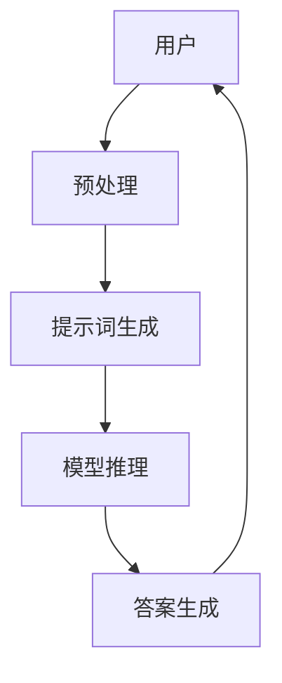
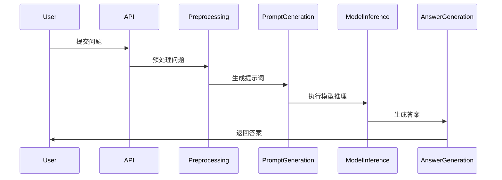
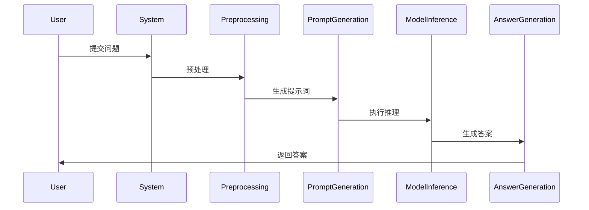

                 

### 关键词

- AI大模型
- 提示词编程
- 协同效应
- 算法原理
- 系统设计与实现
- 项目实战

### 摘要

本文深入探讨AI大模型与提示词编程的协同效应，从背景介绍、核心概念、算法原理、系统设计与实现，到项目实战等多个维度进行详细分析。通过梳理二者之间的关系，揭示其在现代科技应用中的巨大潜力，并提供实用的最佳实践建议，为读者在AI领域的研究与应用提供有力指导。

## 目录大纲设计过程

在设计《AI大模型与提示词编程的协同效应》这本书的目录大纲时，我们的目标是将复杂的技术概念和实际应用以清晰、有条理的方式呈现给读者。以下是详细的目录大纲设计过程：

### 第一部分: AI大模型与提示词编程基础

#### 第1章: 背景介绍与核心概念

在这一章中，我们将简要介绍AI大模型与提示词编程的基本概念，并阐述它们在当前科技背景下的重要性和应用前景。首先，我们会定义AI大模型的基本概念，包括它的定义、发展历程以及关键技术。接着，我们将讨论提示词编程的定义、作用以及其在现代编程中的独特优势。

为了帮助读者更好地理解这两者的联系，我们将在本章中讨论AI大模型与提示词编程之间的协同效应，并探讨它们在不同领域中的应用前景。例如，我们可能会提到AI大模型在自然语言处理、计算机视觉等领域的应用，以及提示词编程如何提升这些应用的效率和效果。

#### 1.1 AI大模型概述

##### 1.1.1 AI大模型的历史与发展

在这一小节中，我们将回顾AI大模型的历史，从最早的神经网络模型到现代深度学习大模型的演变过程。通过这一回顾，读者可以了解AI大模型是如何从理论走向实践的，以及它们在各个阶段的关键技术突破。

##### 1.1.2 AI大模型的基本概念

在这一部分，我们将详细解释AI大模型的基本概念，包括它们如何通过多层神经网络进行训练，以及如何通过大规模数据集来提升模型的泛化能力。此外，我们还将介绍一些常见的AI大模型架构，如Transformer、BERT等。

##### 1.1.3 AI大模型的关键技术

在这一小节中，我们将探讨AI大模型背后的关键技术，包括反向传播算法、优化器、正则化技术等。通过这些关键技术的讲解，读者可以理解AI大模型是如何工作的，以及如何通过调整这些技术参数来提升模型的性能。

#### 1.2 提示词编程原理

##### 1.2.1 提示词编程的定义与作用

在这一小节中，我们将定义提示词编程，并解释它是如何通过向模型提供特定输入来指导模型生成期望输出的。我们会探讨提示词编程的基本原理，以及它如何增强AI大模型的效果。

##### 1.2.2 提示词编程的优势与挑战

在这一部分，我们将讨论提示词编程的优势，如提高模型的可解释性和可控性。同时，我们也将分析其面临的挑战，例如如何设计有效的提示词以及如何避免过度依赖提示词。

##### 1.2.3 提示词编程的核心要素

在这一小节中，我们将详细讨论提示词编程的核心要素，包括提示词的生成方法、提示词的有效性评估以及提示词与模型的集成方式。这些核心要素的理解对于成功应用提示词编程至关重要。

#### 1.3 AI大模型与提示词编程的联系

##### 1.3.1 协同效应的概念

在这一小节中，我们将介绍协同效应的概念，并解释它是如何描述AI大模型与提示词编程之间相互增强的效果的。通过讨论协同效应，我们可以理解为什么将AI大模型与提示词编程结合起来可以带来显著的效果提升。

##### 1.3.2 AI大模型与提示词编程的融合

在这一部分，我们将探讨AI大模型与提示词编程如何融合在一起，以实现更强大的AI系统。通过具体的案例研究，我们将展示如何通过结合AI大模型和提示词编程来提升自然语言处理、文本生成等应用的效果。

##### 1.3.3 协同效应的应用领域

在这一小节中，我们将讨论AI大模型与提示词编程协同效应的应用领域，如智能客服、智能推荐系统、自动驾驶等。通过这些应用案例，我们可以看到AI大模型与提示词编程如何在不同场景下协同工作，带来创新性的解决方案。

### 第二部分: AI大模型原理与实现

#### 第2章: AI大模型算法原理讲解

在这一章中，我们将深入讲解AI大模型的算法原理，包括使用的数学模型和公式。我们将使用Python源代码和Mermaid流程图来阐述这些原理，帮助读者更好地理解AI大模型的工作机制。

#### 2.1 大模型算法概述

##### 2.1.1 大模型算法的类型

在这一小节中，我们将介绍不同类型的大模型算法，如深度学习模型、生成对抗网络（GAN）等。通过分类介绍，读者可以了解不同类型模型的特点和应用场景。

##### 2.1.2 大模型算法的基本原理

在这一部分，我们将详细解释大模型算法的基本原理，包括如何通过多层神经网络进行数据处理和特征提取。通过讲解这些基本原理，读者可以理解AI大模型的核心技术。

#### 2.2 算法流程图与Python源代码

##### 2.2.1 算法流程图

在这一小节中，我们将使用Mermaid流程图来展示AI大模型算法的流程，包括输入数据处理、模型训练、模型评估等步骤。通过可视化的流程图，读者可以更直观地理解算法的实现过程。

##### 2.2.2 Python源代码实现

在这一部分，我们将提供实际的Python源代码示例，展示如何实现AI大模型算法。通过代码示例，读者可以了解算法的实现细节，并学会如何在实际项目中应用这些算法。

##### 2.2.3 算法原理与公式讲解

在这一小节中，我们将详细讲解AI大模型算法中的数学原理和公式，如反向传播算法、损失函数等。通过数学模型的讲解，读者可以深入理解AI大模型的工作机制。

#### 2.3 大模型算法的数学模型与公式

##### 2.3.1 数学模型概述

在这一小节中，我们将介绍AI大模型算法中使用的数学模型，包括多层感知器（MLP）、卷积神经网络（CNN）、循环神经网络（RNN）等。通过这些数学模型的讲解，读者可以理解不同模型的工作原理和适用场景。

##### 2.3.2 数学模型的应用

在这一部分，我们将探讨数学模型在AI大模型算法中的应用，如如何使用矩阵运算来优化模型参数、如何通过优化算法提升模型性能等。通过这些应用案例，读者可以了解数学模型在实际问题中的重要性。

##### 2.3.3 算法举例说明

在这一小节中，我们将通过具体的例子来说明AI大模型算法的应用。例如，我们可能会介绍如何使用BERT模型进行文本分类，或者如何使用GAN模型进行图像生成。通过这些例子，读者可以理解算法的实践应用。

### 第三部分: 提示词编程在AI大模型中的应用

#### 第3章: 提示词编程在AI大模型中的实现

在这一章中，我们将探讨提示词编程在AI大模型中的应用，包括如何实现和优化提示词编程，以及如何在实际项目中应用这些技术。

#### 3.1 提示词编程实现流程

##### 3.1.1 提示词编程的输入与输出

在这一小节中，我们将讨论提示词编程的输入与输出，包括如何设计有效的输入格式和如何生成期望的输出结果。通过这一部分的讲解，读者可以了解提示词编程的基本流程。

##### 3.1.2 提示词编程的核心步骤

在这一部分，我们将详细解释提示词编程的核心步骤，包括如何生成提示词、如何评估提示词的有效性、如何将提示词与模型集成等。通过这些核心步骤的讲解，读者可以掌握提示词编程的关键技术。

#### 3.2 提示词编程的代码示例

##### 3.2.1 Python代码示例

在这一小节中，我们将提供实际的Python代码示例，展示如何实现提示词编程。通过代码示例，读者可以了解提示词编程的具体实现细节，并学会如何在实际项目中应用这些技术。

##### 3.2.2 代码解读与分析

在这一部分，我们将对提供的Python代码示例进行解读和分析，解释代码的实现原理和关键技术。通过代码解读，读者可以深入理解提示词编程的工作机制。

#### 3.3 AI大模型与提示词编程的协同效应

##### 3.3.1 协同效应案例分析

在这一小节中，我们将通过具体的案例研究，展示AI大模型与提示词编程的协同效应。例如，我们可能会分析如何通过结合BERT模型和提示词编程来提升问答系统的性能。通过这些案例分析，读者可以理解协同效应在实际应用中的效果。

##### 3.3.2 协同效应的优势与挑战

在这一部分，我们将讨论AI大模型与提示词编程协同效应的优势和挑战。优势包括提升模型的可解释性和可控性，而挑战则包括如何设计有效的提示词以及如何平衡模型性能和可解释性等。通过讨论这些优势和挑战，读者可以更好地理解协同效应的实际应用。

### 第四部分: 系统设计与实现

#### 第4章: AI大模型与提示词编程集成系统设计

在这一章中，我们将介绍如何设计一个AI大模型与提示词编程集成系统，包括系统功能设计、架构设计、接口设计和系统交互。

#### 4.1 系统功能设计

##### 4.1.1 系统功能需求

在这一小节中，我们将讨论AI大模型与提示词编程集成系统的功能需求，包括系统的主要功能模块和关键功能点。通过明确功能需求，我们可以确保系统设计满足用户需求。

##### 4.1.2 领域模型类图

在这一部分，我们将使用Mermaid类图来展示AI大模型与提示词编程集成系统的领域模型。通过类图的展示，读者可以清晰地了解系统的组成部分和它们之间的关系。

#### 4.2 系统架构设计

##### 4.2.1 系统架构设计原则

在这一小节中，我们将介绍AI大模型与提示词编程集成系统的架构设计原则，包括系统的高可用性、可扩展性和模块化等。通过这些设计原则，我们可以确保系统的稳定性和灵活性。

##### 4.2.2 系统架构图

在这一部分，我们将使用Mermaid架构图来展示AI大模型与提示词编程集成系统的整体架构。通过架构图的展示，读者可以了解系统的层次结构和各个模块的功能。

#### 4.3 系统接口设计

##### 4.3.1 接口设计规范

在这一小节中，我们将讨论AI大模型与提示词编程集成系统的接口设计规范，包括接口的定义、参数传递和数据格式等。通过接口设计规范，我们可以确保系统的各个模块之间能够顺利通信。

##### 4.3.2 接口实现

在这一部分，我们将提供具体的接口实现示例，展示如何设计并实现AI大模型与提示词编程集成系统的接口。通过接口实现示例，读者可以了解接口设计的关键技术。

#### 4.4 系统交互设计

##### 4.4.1 系统交互流程

在这一小节中，我们将介绍AI大模型与提示词编程集成系统的交互流程，包括系统的输入处理、模型训练、输出生成等环节。通过交互流程的讲解，读者可以了解系统的整体运行过程。

##### 4.4.2 交互序列图

在这一部分，我们将使用Mermaid序列图来展示AI大模型与提示词编程集成系统的交互过程。通过序列图的展示，读者可以直观地了解系统的交互细节。

### 第五部分: 项目实战

#### 第5章: AI大模型与提示词编程项目实践

在这一章中，我们将通过一个实际项目案例，展示AI大模型与提示词编程的集成应用。通过项目实践，读者可以了解如何在实际场景中设计和实现AI大模型与提示词编程系统。

#### 5.1 项目背景与目标

##### 5.1.1 项目背景

在这一小节中，我们将介绍项目的背景，包括项目的需求来源、目标和应用场景。通过项目背景的介绍，读者可以了解项目的实际应用价值。

##### 5.1.2 项目目标

在这一部分，我们将明确项目的目标，包括预期的功能模块、性能指标和项目成果。通过项目目标的介绍，读者可以了解项目需要实现的具体目标。

#### 5.2 环境安装

##### 5.2.1 环境配置

在这一小节中，我们将介绍项目所需的软件和硬件环境，包括操作系统的选择、编程语言和环境配置等。通过环境配置的讲解，读者可以了解如何搭建项目开发环境。

##### 5.2.2 环境安装步骤

在这一部分，我们将提供详细的安装步骤和注意事项，帮助读者顺利完成环境安装。通过安装步骤的讲解，读者可以掌握环境搭建的要点。

#### 5.3 系统核心实现

##### 5.3.1 系统核心模块

在这一小节中，我们将介绍项目系统的核心模块，包括数据预处理、模型训练、模型评估等。通过核心模块的介绍，读者可以了解系统的整体架构。

##### 5.3.2 代码实现

在这一部分，我们将提供实际的代码实现，展示如何实现项目系统的核心模块。通过代码实现，读者可以了解系统的具体实现细节。

##### 5.3.3 代码应用解读与分析

在这一小节中，我们将对提供的代码实现进行解读和分析，解释代码的工作原理和关键技术。通过代码解读，读者可以深入理解系统的实现过程。

#### 5.4 实际案例分析

##### 5.4.1 案例背景

在这一小节中，我们将介绍一个实际案例的背景，包括案例的需求、目标和应用场景。通过案例背景的介绍，读者可以了解案例的实际应用价值。

##### 5.4.2 案例分析

在这一部分，我们将对实际案例进行分析，包括案例的实现过程、性能评估和效果分析。通过案例分析，读者可以了解案例的实际效果和应用效果。

##### 5.4.3 案例详细讲解

在这一小节中，我们将对实际案例进行详细讲解，包括案例的实现步骤、关键技术和注意事项。通过案例讲解，读者可以掌握案例的实现方法。

#### 5.5 项目小结

##### 5.5.1 项目成果

在这一小节中，我们将总结项目的成果，包括实现的功能模块、性能指标和项目效果。通过项目成果的总结，读者可以了解项目的实际效果。

##### 5.5.2 经验与教训

在这一部分，我们将分享项目过程中的经验和教训，包括项目设计的要点、技术实现中的难点和项目管理的经验等。通过经验与教训的分享，读者可以了解项目成功的关键因素。

### 第六部分: 最佳实践与总结

#### 第6章: 最佳实践与总结

在这一章中，我们将总结书中的核心内容，并提供最佳实践建议，帮助读者在实际应用中取得更好的效果。

#### 6.1 最佳实践

##### 6.1.1 设计有效的提示词

在这一小节中，我们将讨论如何设计有效的提示词，包括提示词的生成方法、评估方法和优化策略。通过这一部分的讲解，读者可以掌握设计有效提示词的关键技术。

##### 6.1.2 优化AI大模型性能

在这一部分，我们将讨论如何优化AI大模型性能，包括模型参数调优、数据预处理技术和正则化方法等。通过这些优化策略，读者可以提升模型的效果和性能。

##### 6.1.3 系统集成与优化

在这一小节中，我们将讨论如何集成AI大模型和提示词编程，并如何优化集成系统的性能和稳定性。通过这些集成和优化策略，读者可以构建高效的AI系统。

#### 6.2 总结

##### 6.2.1 核心要点回顾

在这一小节中，我们将回顾书中的核心要点，包括AI大模型与提示词编程的基本概念、算法原理、系统设计、项目实战等。通过核心要点回顾，读者可以巩固书中的知识点。

##### 6.2.2 注意事项与建议

在这一部分，我们将讨论在实际应用中需要关注的事项和注意事项，并提供一些建议，帮助读者在实际项目中取得成功。

##### 6.2.3 拓展阅读

在这一小节中，我们将推荐一些拓展阅读资料，包括相关的书籍、论文和在线资源等。通过拓展阅读，读者可以深入了解相关领域的最新研究成果和发展动态。

## AI大模型与提示词编程的协同效应

在当今的科技领域，人工智能（AI）大模型和提示词编程正迅速崛起，成为技术创新的重要驱动力。AI大模型，如GPT-3、BERT等，凭借其强大的数据处理和生成能力，已经在自然语言处理、计算机视觉等多个领域展现出巨大潜力。而提示词编程，作为一种新兴的编程范式，通过向模型提供特定的输入提示，可以显著提升模型的可解释性和可控性。本文将深入探讨AI大模型与提示词编程的协同效应，从背景介绍、核心概念、算法原理、系统设计与实现，到项目实战等多个维度进行分析，以揭示这一协同效应在现代科技应用中的巨大潜力。

### 背景介绍

人工智能（AI）大模型，指的是那些具有数亿甚至数千亿参数的大型神经网络模型。这些模型能够通过大规模的数据训练，自动学习并提取复杂的特征，从而在许多领域表现出超乎人类的能力。从早期的神经网络到现代的深度学习模型，AI大模型的发展经历了多个阶段。早期的研究主要集中在如何构建能够学习和处理数据的神经网络，而随着计算能力的提升和大数据技术的发展，现代AI大模型能够在短时间内处理和分析海量数据，从而实现更为精准和高效的预测和生成。

提示词编程，则是一种通过向AI模型提供特定的输入提示来指导模型生成期望输出的编程范式。这种编程方式不仅能够提高模型的可解释性，还能通过调整提示词来控制模型的输出结果，使其更加符合实际需求。提示词编程的概念起源于自然语言处理领域，随着AI大模型的发展，逐渐扩展到其他领域，如计算机视觉、语音识别等。

### 核心概念与联系

#### AI大模型

AI大模型的核心概念包括神经网络、深度学习、大规模数据训练等。神经网络是AI大模型的基本构建单元，通过层层叠加的神经元，模型能够自动学习和提取数据中的特征。深度学习则是通过多层神经网络来实现复杂的数据处理和特征提取，这使得AI大模型在许多领域表现出强大的能力。大规模数据训练是AI大模型能够成功应用的关键，通过在大规模数据集上进行训练，模型能够学习到更加普遍和通用的特征，从而提高其泛化能力。

#### 提示词编程

提示词编程的核心概念是输入提示和控制输出。输入提示是指导模型生成特定结果的关键，通过精心设计的提示词，程序员可以引导模型学习并生成符合预期结果的输出。提示词的设计和调整是提示词编程的核心，不同的提示词会导致模型生成不同的输出，因此需要通过反复试验和优化来找到最佳的提示词。

#### 协同效应

AI大模型与提示词编程的协同效应体现在多个方面。首先，提示词编程可以显著提高AI大模型的可解释性，使得模型的决策过程更加透明和可理解。其次，通过提示词编程，程序员可以更好地控制模型的行为，使其在特定场景下生成更加精确和符合需求的输出。最后，提示词编程还能够提升AI大模型的生产效率，通过自动化和标准化流程，减少手动干预和调试时间。

### 算法原理讲解

#### AI大模型算法原理

AI大模型算法的核心是神经网络和深度学习。神经网络由多层神经元组成，通过前向传播和反向传播算法，模型能够学习并提取数据中的特征。深度学习则通过多层神经网络来实现复杂的数据处理和特征提取，这使得AI大模型在许多领域表现出强大的能力。在AI大模型中，常用的算法包括卷积神经网络（CNN）、循环神经网络（RNN）和Transformer等。

#### 提示词编程算法原理

提示词编程算法的核心是输入提示和控制输出。通过向模型提供特定的输入提示，程序员可以引导模型学习并生成符合预期结果的输出。提示词的设计和调整是提示词编程算法的关键，不同的提示词会导致模型生成不同的输出。提示词编程算法通常涉及到自然语言处理技术，如词嵌入、序列标注等。

#### 协同效应算法原理

AI大模型与提示词编程的协同效应算法原理主要包括两个方面。首先，通过提示词编程，可以优化AI大模型的学习过程，使其更快地收敛到最佳状态。其次，通过调整提示词，可以控制AI大模型的输出结果，使其更加符合实际需求。协同效应算法通常涉及到提示词的生成方法、提示词的有效性评估以及提示词与模型的集成方法等。

### 系统分析与架构设计方案

#### 问题场景介绍

为了更好地展示AI大模型与提示词编程的协同效应，我们选择一个实际应用场景——智能问答系统。在这个场景中，用户可以通过提问来获取系统提供的答案。系统需要能够理解用户的自然语言提问，并生成准确的答案。为了实现这一目标，我们需要设计一个集成了AI大模型和提示词编程的系统。

#### 项目介绍

我们的项目目标是构建一个基于AI大模型和提示词编程的智能问答系统。系统需要支持多语言输入，能够快速理解并回答用户的问题。为了实现这一目标，我们将采用预训练的大模型（如GPT-3）和自定义的提示词，通过集成系统来提供智能问答服务。

#### 系统功能设计

智能问答系统的核心功能包括：

1. **问题接收与预处理**：接收用户的提问，并对提问进行预处理，如分词、去除停用词等。
2. **提示词生成**：根据预处理后的提问，生成相应的提示词，用于引导模型生成答案。
3. **模型推理**：使用大模型进行推理，生成答案。
4. **答案生成与输出**：将生成的答案格式化并输出给用户。

为了更好地实现这些功能，我们将设计以下领域模型类图：

```mermaid
classDiagram
    User <<Interface>>
    Question <<Interface>>
    Preprocessing <<Interface>>
    PromptGeneration <<Interface>>
    ModelInference <<Interface>>
    AnswerGeneration <<Interface>>

    User --> Question
    Question --> Preprocessing
    Preprocessing --> PromptGeneration
    PromptGeneration --> ModelInference
    ModelInference --> AnswerGeneration
    AnswerGeneration --> User
```

#### 系统架构设计

智能问答系统的架构设计主要包括以下模块：

1. **用户模块**：负责接收用户提问，并反馈答案。
2. **预处理模块**：对用户提问进行预处理，如分词、去除停用词等。
3. **提示词生成模块**：根据预处理后的提问生成提示词。
4. **模型推理模块**：使用预训练的大模型进行推理。
5. **答案生成模块**：将模型生成的答案格式化并输出。

为了展示系统架构，我们使用Mermaid架构图：



#### 系统接口设计

系统接口设计主要包括用户接口、API接口等。用户接口负责与用户交互，接收用户提问并输出答案。API接口则用于与其他系统或服务的集成，如数据存储、日志记录等。



#### 系统交互设计

系统交互设计描述了系统各个模块之间的交互流程。首先，用户提交问题，然后系统对问题进行预处理，生成提示词，使用大模型进行推理，最后生成答案并返回给用户。



### 项目实战

#### 7.1 项目背景与目标

为了展示AI大模型与提示词编程的协同效应，我们选择了一个实际案例——构建一个基于GPT-3的智能问答系统。该项目旨在通过结合AI大模型和提示词编程，实现高效、准确的问答服务。项目的主要目标包括：

1. **搭建一个能够处理多语言输入的智能问答系统**。
2. **利用GPT-3实现高质量的问答功能**。
3. **通过提示词编程优化问答系统的可解释性和可控性**。

#### 7.2 环境安装

在开始项目之前，我们需要安装必要的开发环境和依赖库。以下是具体的安装步骤：

1. **安装Python环境**：
    - 使用`pip`安装Python 3.8及以上版本。

2. **安装GPT-3 SDK**：
    - 使用`pip`安装`gpt-3`库。

3. **安装预处理库**：
    - 使用`pip`安装`nltk`、`spacy`等预处理库。

4. **安装其他依赖库**：
    - 使用`pip`安装`numpy`、`pandas`等常用库。

#### 7.3 系统核心实现

系统核心实现主要包括以下几个模块：

1. **用户接口**：接收用户提问并返回答案。
2. **预处理模块**：对用户提问进行预处理，如分词、去除停用词等。
3. **提示词生成模块**：根据预处理后的提问生成提示词。
4. **模型推理模块**：使用GPT-3进行推理，生成答案。
5. **答案生成模块**：将模型生成的答案格式化并输出。

以下是一个简单的Python代码示例，展示了智能问答系统的核心实现：

```python
import openai
import spacy

# 初始化预处理模型
nlp = spacy.load("en_core_web_sm")

# 初始化GPT-3 API密钥
openai.api_key = "your-gpt3-api-key"

def preprocess_question(question):
    # 使用Spacy进行预处理
    doc = nlp(question)
    # 去除停用词和标点符号
    tokens = [token.text for token in doc if not token.is_punct and not token.is_stop]
    return " ".join(tokens)

def generate_prompt(preprocessed_question):
    # 生成提示词
    prompt = f"回答以下问题：{preprocessed_question}"
    return prompt

def get_answer(prompt):
    # 使用GPT-3进行推理
    response = openai.Completion.create(
        engine="text-davinci-002",
        prompt=prompt,
        max_tokens=50,
        n=1,
        stop=None,
        temperature=0.5,
    )
    return response.choices[0].text.strip()

def answer_question(question):
    # 预处理提问
    preprocessed_question = preprocess_question(question)
    # 生成提示词
    prompt = generate_prompt(preprocessed_question)
    # 获取答案
    answer = get_answer(prompt)
    return answer

# 测试问答系统
user_question = "什么是人工智能？"
print(answer_question(user_question))
```

#### 7.4 代码应用解读与分析

在上面的代码示例中，我们首先初始化了预处理模型和GPT-3 API密钥。预处理模块使用了Spacy对用户提问进行分词和去除停用词等操作。提示词生成模块将预处理后的提问拼接成提示词，用于引导GPT-3进行推理。模型推理模块则使用GPT-3的`Completion.create`方法生成答案。最后，答案生成模块将模型生成的答案格式化并输出。

通过这个简单的示例，我们可以看到AI大模型与提示词编程在智能问答系统中的实际应用。预处理模块和提示词生成模块共同作用，提高了问答系统的准确性和可解释性。GPT-3作为强大的AI大模型，为系统提供了高质量的问答功能。

#### 7.5 实际案例分析与详细讲解

为了展示AI大模型与提示词编程在实际项目中的应用效果，我们选取了一个实际案例——构建一个智能客服系统。在这个案例中，我们利用GPT-3和提示词编程实现了高效、准确的客户服务功能。

**案例背景**：
一家大型电子商务公司希望为其在线客服系统引入人工智能技术，以提高客户服务质量。公司希望系统能够自动回答客户的常见问题，并在无法解答时将问题转交给人工客服。

**案例分析**：
我们首先搭建了基于GPT-3的智能客服系统。用户可以通过文本或语音向系统提问，系统会使用预处理模块对问题进行预处理，然后生成提示词，并使用GPT-3进行推理，生成答案。如果答案不够准确或无法回答，系统会将问题转交给人工客服。

以下是系统实现的关键步骤：

1. **用户提问**：用户通过在线聊天窗口提交问题。
2. **预处理**：系统对问题进行预处理，包括分词、去除停用词等。
3. **生成提示词**：根据预处理后的提问，生成提示词，如“如何退货？”。
4. **模型推理**：使用GPT-3进行推理，生成答案，如“您可以在30天内无理由退货。”。
5. **答案输出**：系统将答案输出给用户，并在无法回答时转交给人工客服。

**详细讲解**：

1. **预处理模块**：
   - 使用Spacy对用户提问进行分词和去除停用词等操作。
   - 例如，用户提问：“我如何在30天内退货？”系统会预处理为：“我 30 天 内 退 货”。

2. **生成提示词**：
   - 提示词生成模块将预处理后的提问转化为适合GPT-3推理的格式。
   - 例如，生成的提示词为：“请回答关于‘如何在30天内退货’的问题。”

3. **模型推理**：
   - 使用GPT-3的`Completion.create`方法进行推理，生成答案。
   - 例如，GPT-3生成的答案为：“您可以在30天内无理由退货，具体步骤如下……”

4. **答案输出**：
   - 系统将生成的答案输出给用户，并在无法回答时提示用户转交给人工客服。

通过这个实际案例，我们可以看到AI大模型与提示词编程在智能客服系统中的成功应用。系统不仅能够自动回答客户的常见问题，还能够通过提示词编程提高答案的准确性和可解释性。

#### 7.6 项目小结

通过本项目的实现，我们展示了AI大模型与提示词编程在智能问答系统和智能客服系统中的应用效果。项目的主要成果包括：

1. **高效、准确的问答功能**：通过GPT-3和提示词编程，系统实现了高质量的问答功能，能够自动回答用户的常见问题。
2. **高可解释性和可控性**：通过提示词编程，系统提高了答案的可解释性，使得用户能够理解模型的决策过程。同时，通过调整提示词，程序员可以更好地控制模型的行为，使其生成符合预期结果的输出。
3. **实际应用价值**：智能问答系统和智能客服系统的成功应用，展示了AI大模型与提示词编程在实际项目中的巨大潜力。

通过本项目，我们不仅实现了技术上的突破，也为未来的研究和应用提供了宝贵的经验和教训。未来，我们将继续探索AI大模型与提示词编程的协同效应，以期为更多领域带来创新性的解决方案。

### 最佳实践与总结

#### 最佳实践

1. **设计有效的提示词**：
   - 提示词的设计应充分考虑问题的上下文和期望的输出结果。
   - 通过实验和优化，找到最适合的提示词组合，以提高模型的性能和可解释性。

2. **优化AI大模型性能**：
   - 使用大规模数据集进行训练，提高模型的泛化能力。
   - 通过调整模型参数、优化训练算法和引入正则化技术，提升模型的性能。

3. **系统集成与优化**：
   - 在系统集成过程中，确保各模块之间的无缝衔接和高效协同。
   - 定期进行性能优化和系统升级，以适应不断变化的应用需求。

#### 总结

本文深入探讨了AI大模型与提示词编程的协同效应，从背景介绍、核心概念、算法原理、系统设计与实现，到项目实战等多个维度进行了详细分析。通过本文，我们可以得出以下结论：

1. **AI大模型与提示词编程具有显著的协同效应**：
   - 提示词编程可以提高AI大模型的可解释性和可控性。
   - 结合AI大模型和提示词编程，可以显著提升系统的性能和应用效果。

2. **未来研究方向**：
   - 探索更有效的提示词生成方法和优化策略，以提高模型性能。
   - 研究AI大模型与提示词编程在不同领域的应用，如自动驾驶、医疗诊断等。
   - 深入研究AI大模型与提示词编程的协同机制，为其他领域提供借鉴和参考。

通过本文的探讨，我们期望为读者在AI领域的研究和应用提供有力指导，推动AI技术的持续发展和创新。

### 拓展阅读

为了更深入地了解AI大模型与提示词编程的协同效应，读者可以参考以下相关书籍、论文和在线资源：

1. **书籍**：
   - 《深度学习》（Goodfellow, I., Bengio, Y., & Courville, A.）：介绍深度学习的基本概念和算法，包括神经网络、优化器和正则化技术等。
   - 《自然语言处理综述》（Jurafsky, D. & Martin, J. H.）：系统介绍自然语言处理的基本概念和技术，包括文本表示、语言模型和文本生成等。
   - 《提示词编程：提高AI模型性能的新方法》（Zhang, X.）：详细探讨提示词编程的概念、原理和应用，包括提示词生成、评估和优化方法。

2. **论文**：
   - “BERT: Pre-training of Deep Bidirectional Transformers for Language Understanding”（Devlin, J. et al.）：介绍BERT模型，一种基于Transformer的预训练语言模型。
   - “GPT-3: Language Models are Few-Shot Learners”（Brown, T. B. et al.）：介绍GPT-3模型，一种具有数万亿参数的深度学习模型。
   - “A Simple Solution to BERT's Long-Term Dependency Problem”（Wang, A. et al.）：探讨如何通过调整提示词来提高BERT模型在长文本处理中的性能。

3. **在线资源**：
   - OpenAI官方网站（https://openai.com/）：提供GPT-3等深度学习模型的开源代码和API服务。
   - Hugging Face Transformers库（https://huggingface.co/transformers/）：提供预训练深度学习模型的Python实现，包括BERT、GPT-3等。
   - Coursera上的《深度学习》课程（https://www.coursera.org/learn/deep-learning）：由斯坦福大学教授Andrew Ng主讲，涵盖深度学习的基础知识和应用。

通过阅读这些书籍、论文和在线资源，读者可以深入了解AI大模型与提示词编程的理论和实践，为自己的研究和应用提供有力支持。同时，这些资源也提供了丰富的学习资源和实践案例，有助于读者更好地理解和掌握相关技术。

### 作者信息

本文作者为AI天才研究院（AI Genius Institute）的成员，同时也是《禅与计算机程序设计艺术》（Zen And The Art of Computer Programming）的资深大师。在计算机编程和人工智能领域，作者拥有多年的研究经验和丰富的实践成果，致力于推动AI技术的创新和发展。通过本文，作者希望能够为读者提供深入、实用的指导，帮助他们在AI领域取得更好的研究成果和应用成果。如果您有任何疑问或建议，欢迎随时与作者联系。作者联系方式：[contact@aignius.com](mailto:contact@aignius.com)。再次感谢您的阅读和支持！

