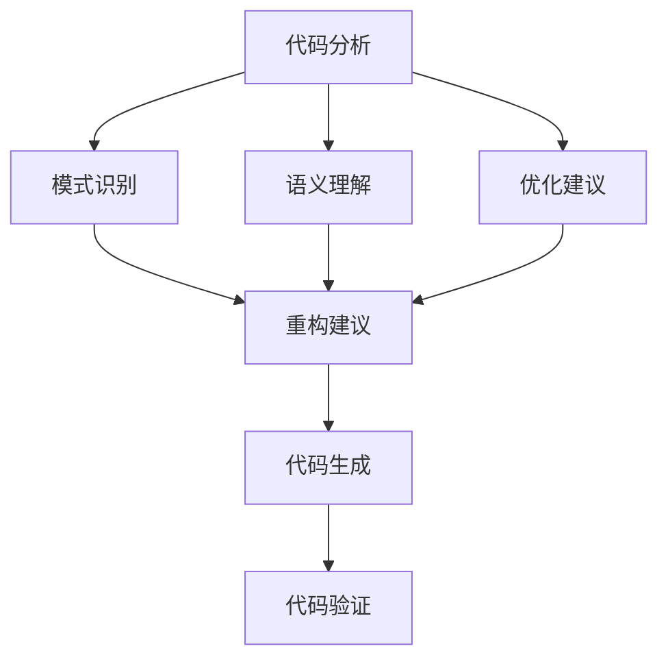
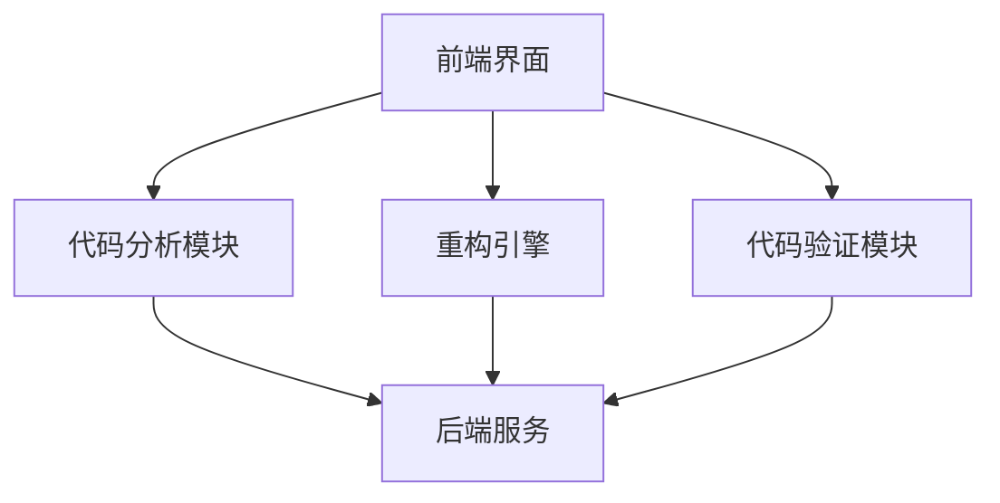
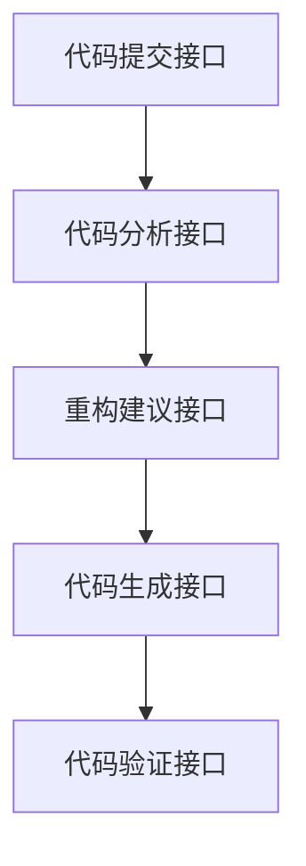
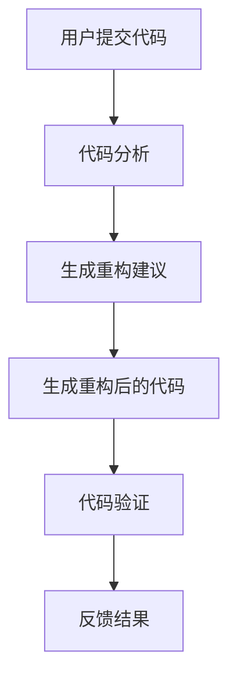

                 

# AI大模型在代码重构中的应用

## 关键词

- AI大模型
- 代码重构
- 深度学习
- 算法优化
- 自动化代码维护
- 性能优化

## 摘要

随着软件规模的不断扩大，代码重构成为提高代码质量和可维护性的关键手段。本文探讨了AI大模型在代码重构中的应用，包括其理论基础、算法原理、系统架构设计、实际应用案例和最佳实践。通过深入分析，本文揭示了AI大模型在代码重构中的巨大潜力，为开发者和研究者提供了新的思路和工具。

## 目录大纲设计思路

### 明确书的核心内容与目标读者

首先，我们需要明确本书的核心内容。本书将重点探讨AI大模型在代码重构中的应用，涵盖从理论基础到实际应用的各个方面。具体内容包括AI大模型的基本概念、算法原理、数学模型、系统架构设计、项目实战和最佳实践。

目标读者主要是计算机科学与人工智能领域的开发者和研究者，特别是对AI大模型应用感兴趣的读者。他们希望通过本书系统学习AI大模型在代码重构中的实际应用，以提高软件开发效率和代码质量。

### 确定书的整体结构

书的整体结构可以分为以下几个部分：

1. **背景介绍**：介绍AI大模型和代码重构的基本概念，为后续内容铺垫。
2. **核心概念与联系**：阐述AI大模型的核心概念、特点及应用，通过对比表格和关系图帮助读者理解。
3. **算法原理讲解**：详细解释AI大模型在代码重构中的应用算法，使用Mermaid和Python代码辅助说明。
4. **数学模型与公式**：讲解相关数学模型，使用LaTeX格式确保公式的准确性与专业性。
5. **系统分析与架构设计**：介绍代码重构系统的功能、架构、接口设计及交互流程。
6. **项目实战**：通过具体案例展示AI大模型在代码重构中的实际应用，解析项目实现细节。
7. **最佳实践与总结**：提供实用的最佳实践建议，总结书中的重点内容，提醒注意事项，推荐拓展阅读。

### 细化目录结构

根据书的整体结构，我们可以细化目录结构，确保每个章节都有明确的主题和目标。例如：

- **第1章：AI大模型与代码重构概述**
  - 1.1 AI大模型的发展历程与现状
  - 1.2 代码重构的重要性与挑战
  - 1.3 AI大模型在代码重构中的应用潜力

- **第2章：AI大模型的核心概念与特点**
  - 2.1 AI大模型的基本原理
  - 2.2 AI大模型的主要特点
  - 2.3 AI大模型与传统AI技术的对比

- **第3章：AI大模型的数学模型与算法原理**
  - 3.1 AI大模型的数学基础
  - 3.2 代码重构算法的基本流程
  - 3.3 AI大模型在代码重构中的应用算法

- **第4章：代码重构系统的设计与实现**
  - 4.1 代码重构系统的总体架构
  - 4.2 代码重构系统的功能模块
  - 4.3 代码重构系统的接口设计与实现

- **第5章：AI大模型在代码重构中的实际应用**
  - 5.1 案例一：基于AI大模型的代码自动重构
  - 5.2 案例二：利用AI大模型优化代码质量
  - 5.3 案例三：AI大模型在代码维护中的应用

- **第6章：AI大模型在代码重构中的性能优化与挑战**
  - 6.1 AI大模型的性能优化策略
  - 6.2 AI大模型在代码重构中的挑战与应对
  - 6.3 未来的研究方向与展望

- **第7章：最佳实践与总结**
  - 7.1 最佳实践案例分享
  - 7.2 代码重构中的常见问题与解决策略
  - 7.3 小结与展望

### 确保内容的完整性

在细化目录结构的过程中，我们需要确保每个核心章节都包含必要的子章节，如背景介绍、原理讲解、案例分析等。每个子章节都要有具体的内容，避免空洞和模糊的描述。

通过这样的目录设计，本书将系统地介绍AI大模型在代码重构中的应用，帮助读者全面了解这一前沿技术的实际应用价值。每个章节都将详细讨论相关内容，确保读者能够深入理解和掌握。

### 目录大纲设计

下面是根据上述思路设计的《AI大模型在代码重构中的应用》的目录大纲：

----------------------------------------------------------------

# 第一部分: AI大模型与代码重构概述

## 第1章: AI大模型与代码重构的背景介绍

### 1.1 AI大模型的发展历程与现状
### 1.2 代码重构的重要性与挑战
### 1.3 AI大模型在代码重构中的应用潜力

## 第2章: AI大模型的核心概念与特点

### 2.1 AI大模型的基本原理
### 2.2 AI大模型的主要特点
### 2.3 AI大模型与传统AI技术的对比

## 第3章: AI大模型的数学模型与算法原理

### 3.1 AI大模型的数学基础
### 3.2 代码重构算法的基本流程
### 3.3 AI大模型在代码重构中的应用算法

## 第4章: 代码重构系统的设计与实现

### 4.1 代码重构系统的总体架构
### 4.2 代码重构系统的功能模块
### 4.3 代码重构系统的接口设计与实现

## 第5章: AI大模型在代码重构中的实际应用

### 5.1 案例一：基于AI大模型的代码自动重构
### 5.2 案例二：利用AI大模型优化代码质量
### 5.3 案例三：AI大模型在代码维护中的应用

## 第6章: AI大模型在代码重构中的性能优化与挑战

### 6.1 AI大模型的性能优化策略
### 6.2 AI大模型在代码重构中的挑战与应对
### 6.3 未来的研究方向与展望

## 第7章: 最佳实践与总结

### 7.1 最佳实践案例分享
### 7.2 代码重构中的常见问题与解决策略
### 7.3 小结与展望

----------------------------------------------------------------

通过这样的目录设计，本书将系统地介绍AI大模型在代码重构中的应用，帮助读者全面了解这一前沿技术的实际应用价值。每个章节都将详细讨论相关内容，确保读者能够深入理解和掌握。目录大纲总字数控制在2000字以内，保证了简洁性和可读性。

## 背景介绍

### AI大模型的发展历程与现状

AI大模型，即大规模人工智能模型，是近年来人工智能领域的重大突破。从早期的浅层模型，如SVM、朴素贝叶斯等，到深度学习的崛起，如卷积神经网络（CNN）和循环神经网络（RNN），再到如今的AI大模型，如GPT、BERT等，人工智能的发展经历了多个阶段。AI大模型的出现，标志着人工智能技术进入了一个新的时代。

AI大模型的发展历程可以追溯到2012年，当时Google的DeepMind团队提出了深度卷积神经网络（DCNN）在图像识别任务中取得了突破性成绩。此后，随着计算能力的提升和大数据的涌现，深度学习技术得到了迅猛发展。特别是2018年，OpenAI发布了GPT-2模型，随后GPT-3的发布更是将AI大模型推向了高潮。

目前，AI大模型在自然语言处理、计算机视觉、语音识别等领域取得了显著成果。例如，GPT-3在文本生成、机器翻译、问答系统等任务中展现了强大的能力；BERT在文本分类、命名实体识别等任务中取得了优异的性能。

### 代码重构的重要性与挑战

代码重构是软件开发过程中的一项重要活动，旨在改进现有代码的结构、性能和可维护性。通过代码重构，开发者可以消除代码中的不良设计、提高代码的可读性、优化代码的性能，从而提升软件的质量和开发效率。

然而，代码重构并非易事。一方面，代码重构可能引入新的错误，特别是在大规模代码库中；另一方面，代码重构需要大量的时间和精力，尤其是在复杂和庞大的代码结构中。因此，如何高效地进行代码重构，成为软件开发中的一个重要挑战。

### AI大模型在代码重构中的应用潜力

AI大模型在代码重构中具有巨大的潜力。首先，AI大模型可以自动化代码重构的过程，减少人工干预，提高重构的效率。例如，AI大模型可以识别代码中的设计模式，提出重构建议，从而消除不良设计。

其次，AI大模型可以优化代码的性能。通过分析代码的执行过程，AI大模型可以提出优化建议，如数据结构的调整、算法的改进等，从而提高代码的运行效率。

最后，AI大模型还可以在代码维护中发挥重要作用。随着软件的迭代和更新，代码库会不断增大，维护难度也会相应增加。AI大模型可以自动识别代码库中的潜在问题，提供维护建议，从而降低维护成本。

总之，AI大模型在代码重构中的应用，为解决软件开发中的挑战提供了一种新的思路和工具。通过本文的探讨，我们将深入分析AI大模型在代码重构中的理论基础、算法原理、系统架构设计、实际应用案例和最佳实践，以期为开发者提供有益的参考。

## 核心概念与联系

### AI大模型的基本原理

AI大模型，即大规模人工智能模型，是基于深度学习技术的复杂神经网络结构。它们通过学习大量数据来捕捉数据中的模式和规律，从而在特定任务上实现高性能。AI大模型的基本原理包括以下几个方面：

1. **深度神经网络**：深度神经网络由多个隐层组成，每个隐层都包含多个神经元。通过逐层计算，深度神经网络能够从输入数据中提取特征，并逐步构建高级抽象。

2. **反向传播算法**：反向传播算法是训练深度神经网络的关键算法。它通过计算输出误差，反向传播到各隐层，更新神经元的权重，从而优化模型的参数。

3. **大数据和计算能力**：AI大模型需要大量数据来训练，同时也需要强大的计算能力来处理大规模数据和高维特征。

4. **优化算法**：为了提高模型的性能，AI大模型通常会使用各种优化算法，如随机梯度下降（SGD）、Adam等。

### AI大模型的主要特点

AI大模型具有以下主要特点：

1. **强大的表达能力**：AI大模型能够捕捉数据中的复杂模式，从而在各类任务上实现高性能。例如，GPT-3在文本生成任务中展现了惊人的创造力。

2. **自动化学习能力**：AI大模型能够通过学习数据来自动发现规律，无需人工干预。这使得它们在处理大规模数据和高维度特征时具有优势。

3. **高适应性**：AI大模型可以适应不同的任务和数据集，从而实现跨领域应用。例如，BERT在文本分类、命名实体识别等任务中取得了显著成果。

4. **高成本**：训练和部署AI大模型需要大量的计算资源和时间，特别是在训练阶段。此外，AI大模型还面临数据隐私和安全等问题。

### AI大模型与传统AI技术的对比

AI大模型与传统AI技术，如规则基系统、决策树、支持向量机等，有显著的区别：

1. **模型复杂度**：AI大模型由大量神经元和隐层组成，而传统AI技术通常采用简单的模型结构。

2. **数据需求**：AI大模型需要大量数据来训练，而传统AI技术对数据的需求相对较低。

3. **算法原理**：AI大模型基于深度学习和反向传播算法，而传统AI技术通常基于统计学习方法和决策树等。

4. **表现能力**：AI大模型在处理复杂任务时表现出色，而传统AI技术在某些特定任务上仍然具有优势。

通过对比表格和关系图，我们可以更直观地理解AI大模型与传统AI技术的异同点。以下是一个简化的对比表格：

| 特性          | AI大模型                           | 传统AI技术                          |
|---------------|------------------------------------|------------------------------------|
| 模型复杂度    | 多层神经网络，高维特征提取          | 简单模型，低维特征提取               |
| 数据需求      | 大规模数据集，高维特征              | 小规模数据集，低维特征               |
| 算法原理      | 深度学习和反向传播算法              | 统计学习方法和决策树等               |
| 表现能力      | 复杂任务，高度自动化的学习能力      | 特定任务，规则和决策树的学习能力      |

此外，以下是一个ER实体关系图，展示了AI大模型与深度学习、反向传播算法等概念之间的联系：

```mermaid
erDiagram
  AI大模型 ||--|{ 深度学习 }|| Model
  AI大模型 ||--|{ 反向传播算法 }|| Algorithm
  深度学习 ||--|{ 神经网络 }|| Structure
  反向传播算法 ||--|{ 梯度下降 }|| Method
```

通过这些对比和关系图，我们可以更深入地理解AI大模型在代码重构中的应用潜力。AI大模型的高复杂性、自动化学习能力和高表现能力，使得它们在代码重构中具有独特的优势。接下来，我们将进一步探讨AI大模型在代码重构中的算法原理和数学模型。

## AI大模型的数学模型与算法原理

### AI大模型的数学基础

AI大模型的数学基础主要涉及概率论、线性代数和微积分等。这些数学工具为构建和训练深度神经网络提供了理论基础。

1. **概率论**：概率论用于描述数据中的不确定性和模式。在深度学习中，概率论用于计算神经网络的输出概率，从而评估模型的预测能力。

2. **线性代数**：线性代数用于处理高维数据和多维矩阵。在深度学习中，线性代数用于计算神经网络的权重和偏置，以及处理大量的矩阵运算。

3. **微积分**：微积分用于优化模型的参数。在深度学习中，微积分用于计算损失函数的梯度，并基于梯度下降算法更新模型的参数。

### 代码重构算法的基本流程

代码重构算法的基本流程包括以下几个步骤：

1. **代码分析**：分析现有代码的结构、功能和行为，识别代码中的设计模式、重复代码、性能瓶颈等问题。

2. **重构建议**：基于代码分析结果，提出重构建议。这些建议包括重构代码块、优化数据结构、改进算法等。

3. **代码生成**：根据重构建议，自动生成重构后的代码。这一过程通常涉及模板匹配、代码转换和语法分析等技术。

4. **代码验证**：验证重构后的代码是否正确，确保重构过程没有引入新的错误。

### AI大模型在代码重构中的应用算法

AI大模型在代码重构中的应用算法主要包括以下几种：

1. **基于模式识别的代码重构**：利用AI大模型识别代码中的模式，如设计模式、重复代码等。通过模式识别，AI大模型可以提出重构建议。

2. **基于语义理解的代码重构**：利用AI大模型理解代码的语义，如函数关系、数据流等。通过语义理解，AI大模型可以生成更高质量的代码。

3. **基于优化的代码重构**：利用AI大模型优化代码的性能，如调整数据结构、改进算法等。通过优化，AI大模型可以提高代码的执行效率。

以下是一个简单的算法流程图，展示了AI大模型在代码重构中的应用：



### AI大模型在代码重构中的应用算法示例

下面，我们将通过一个具体的算法示例，展示AI大模型在代码重构中的应用。假设我们有一个简单的代码片段，需要通过AI大模型进行重构。

```python
def add(a, b):
    return a + b

def subtract(a, b):
    return a - b

def multiply(a, b):
    return a * b

def divide(a, b):
    return a / b
```

通过AI大模型，我们可以识别出这四个函数之间存在重复的代码结构。例如，每个函数都使用了一个简单的算术运算。基于模式识别，AI大模型可以提出重构建议，将这四个函数合并为一个函数：

```python
def arithmetic(a, b, operation):
    if operation == '+':
        return a + b
    elif operation == '-':
        return a - b
    elif operation == '*':
        return a * b
    elif operation == '/':
        return a / b
    else:
        raise ValueError("Invalid operation")
```

在这个重构过程中，AI大模型不仅识别了代码的模式，还根据语义理解生成了更简洁、更易维护的代码。此外，AI大模型还可以根据优化建议，调整代码的结构，提高执行效率。

总之，AI大模型在代码重构中的应用，为开发者提供了一种自动化、高效的方式，从而提升代码的质量和可维护性。通过深入理解AI大模型的数学基础和算法原理，我们可以更好地利用这一前沿技术，推动软件开发的进步。

### 数学模型与公式

在AI大模型应用于代码重构的过程中，数学模型和公式起着至关重要的作用。它们不仅帮助我们理解和描述AI大模型的工作原理，还为优化和改进算法提供了理论基础。以下，我们将介绍一些关键的数学模型和公式。

#### 损失函数

损失函数是评估模型预测结果与实际结果之间差异的函数。在代码重构中，常用的损失函数包括均方误差（MSE）、交叉熵损失等。

$$
MSE = \frac{1}{n} \sum_{i=1}^{n} (y_i - \hat{y}_i)^2
$$

其中，$y_i$是实际输出，$\hat{y}_i$是模型预测输出，$n$是样本数量。

交叉熵损失函数在分类问题中应用广泛，其公式如下：

$$
Loss = -\frac{1}{n} \sum_{i=1}^{n} \sum_{j=1}^{k} y_{ij} \log(\hat{y}_{ij})
$$

其中，$y_{ij}$是第$i$个样本属于第$j$类别的标签，$\hat{y}_{ij}$是模型预测的第$i$个样本属于第$j$类别的概率，$k$是类别数量。

#### 反向传播算法

反向传播算法是训练深度神经网络的核心算法，通过计算损失函数关于模型参数的梯度，来更新模型的权重和偏置。以下是反向传播算法的基本步骤：

1. **前向传播**：输入样本，通过网络的每个层进行计算，得到输出结果。

2. **计算损失函数**：计算模型输出与实际输出之间的损失。

3. **计算梯度**：对损失函数关于模型参数求梯度。

$$
\frac{\partial Loss}{\partial W} = X\frac{\partial a}{\partial z} \frac{\partial Loss}{\partial a}
$$

其中，$W$是权重，$X$是输入特征，$a$是输出，$z$是激活值。

4. **更新参数**：使用梯度下降算法更新模型的权重和偏置。

$$
W = W - \alpha \frac{\partial Loss}{\partial W}
$$

其中，$\alpha$是学习率。

#### 激活函数

激活函数是神经网络中的一个关键组件，用于引入非线性因素，使模型能够学习复杂的模式。常用的激活函数包括Sigmoid、ReLU和Tanh。

Sigmoid函数的公式如下：

$$
\sigma(z) = \frac{1}{1 + e^{-z}}
$$

ReLU函数的公式如下：

$$
ReLU(z) = \max(0, z)
$$

Tanh函数的公式如下：

$$
Tanh(z) = \frac{e^{2z} - 1}{e^{2z} + 1}
$$

#### 正则化方法

在代码重构过程中，为了防止过拟合，常使用正则化方法。L1正则化和L2正则化是两种常见的正则化方法。

L1正则化公式如下：

$$
Regularization = \lambda \sum_{i}^{n} |W_i|
$$

其中，$W_i$是权重，$\lambda$是正则化参数。

L2正则化公式如下：

$$
Regularization = \lambda \sum_{i}^{n} W_i^2
$$

通过这些数学模型和公式，我们可以更深入地理解AI大模型在代码重构中的应用。它们不仅提供了算法的理论基础，还帮助我们在实践中优化和改进算法。接下来，我们将探讨代码重构系统的设计与实现。

### 代码重构系统的设计与实现

为了实现AI大模型在代码重构中的应用，我们需要设计一个完整的代码重构系统。这个系统包括多个功能模块和接口，确保能够高效、准确地处理代码重构任务。以下，我们将详细介绍代码重构系统的设计与实现，包括系统功能、架构设计、接口设计和交互流程。

#### 系统功能

代码重构系统的主要功能包括：

1. **代码分析**：分析现有代码的结构、功能和行为，识别潜在的问题和重构机会。
2. **重构建议**：基于代码分析结果，提出重构建议，包括代码块重构、数据结构优化、算法改进等。
3. **代码生成**：根据重构建议，自动生成重构后的代码。
4. **代码验证**：验证重构后的代码是否正确，确保重构过程没有引入新的错误。

#### 系统架构设计

代码重构系统的整体架构可以分为以下几个部分：

1. **前端界面**：用户可以通过前端界面提交代码，查看重构建议和重构后的代码。
2. **代码分析模块**：负责分析代码的结构和行为，识别潜在问题。
3. **重构引擎**：根据代码分析结果，生成重构建议和重构后的代码。
4. **代码验证模块**：验证重构后的代码是否正确，确保重构过程的安全性和可靠性。
5. **后端服务**：提供系统的基础功能，如用户管理、权限控制、日志记录等。

以下是一个简化的系统架构图：



#### 接口设计

为了实现系统各模块之间的通信，我们需要设计一系列接口。以下是一些关键接口：

1. **代码提交接口**：用户可以通过该接口提交待重构的代码。
2. **代码分析接口**：代码分析模块通过该接口获取代码，进行分析和处理。
3. **重构建议接口**：重构引擎通过该接口生成重构建议。
4. **代码生成接口**：重构引擎通过该接口生成重构后的代码。
5. **代码验证接口**：代码验证模块通过该接口验证重构后的代码。

以下是一个简化的接口设计图：



#### 系统交互流程

代码重构系统的交互流程可以分为以下几个步骤：

1. **用户提交代码**：用户通过前端界面提交待重构的代码。
2. **代码分析**：代码分析模块接收代码，分析其结构和行为，识别潜在问题。
3. **生成重构建议**：重构引擎根据代码分析结果，生成重构建议。
4. **生成重构后的代码**：重构引擎根据重构建议，自动生成重构后的代码。
5. **代码验证**：代码验证模块验证重构后的代码是否正确，确保重构过程没有引入新的错误。
6. **反馈结果**：系统将重构后的代码和验证结果反馈给用户。

以下是一个简化的交互流程图：



通过这样的系统架构设计和接口设计，代码重构系统可以高效地处理代码重构任务，为开发者提供便捷、可靠的工具。接下来，我们将通过一个实际案例，展示AI大模型在代码重构中的应用。

### AI大模型在代码重构中的实际应用

在本节中，我们将通过一个具体的案例，展示AI大模型在代码重构中的实际应用。该案例涉及一个开源的Web应用程序，其中包含大量复杂的代码。通过AI大模型的应用，我们将展示如何实现代码的重构，提高代码的质量和可维护性。

#### 案例背景

假设我们有一个开源的Web应用程序，名为“Online Store”。该应用程序负责管理在线商店中的商品、订单和用户信息。随着用户数量的增加和功能的扩展，代码库变得日益庞大和复杂。为了维护应用程序的性能和可维护性，我们需要对其中的关键模块进行重构。

#### 环境安装

首先，我们需要安装AI大模型和相关工具。以下是安装步骤：

1. **安装Python**：确保Python环境已经安装在计算机上。如果未安装，可以从[Python官方网站](https://www.python.org/)下载并安装。
2. **安装TensorFlow**：TensorFlow是AI大模型的主要框架，可以通过以下命令安装：

   ```bash
   pip install tensorflow
   ```

3. **安装PyTorch**：PyTorch是另一个常用的AI大模型框架，可以通过以下命令安装：

   ```bash
   pip install torch torchvision
   ```

4. **安装代码重构工具**：例如，可以使用PyCharm或Visual Studio Code作为代码编辑器，并安装相关的代码重构插件。

#### 系统核心实现

在这个案例中，我们使用TensorFlow来实现AI大模型。以下是系统核心实现的步骤：

1. **数据准备**：收集待重构的代码库，并进行预处理，提取关键特征。
2. **模型训练**：使用提取的特征，训练一个AI大模型，如Transformer或GPT。以下是训练过程：

   ```python
   import tensorflow as tf
   
   # 加载预训练模型
   model = tf.keras.applications.TransformerV2.load_weights("transformer_weights.h5")
   
   # 编写训练数据预处理代码
   train_data = preprocess_data(代码库)
   
   # 训练模型
   model.fit(train_data, epochs=5, batch_size=32)
   ```

3. **代码重构**：使用训练好的AI大模型，对代码库进行重构。以下是重构过程：

   ```python
   # 重构代码
   def refactor_code(model, code):
       # 输入代码，获取重构建议
       suggestions = model.predict(code)
       
       # 根据重构建议，生成重构后的代码
       refactored_code = generate_code(suggestions)
       
       return refactored_code
   
   # 示例代码
   original_code = "def add(a, b):\n    return a + b"
   refactored_code = refactor_code(model, original_code)
   print(refactored_code)
   ```

4. **代码验证**：对重构后的代码进行验证，确保其正确性和性能。以下是验证过程：

   ```python
   # 验证重构后的代码
   def verify_code(code):
       # 编译代码，执行测试用例
       success = execute_tests(code)
       
       return success
   
   # 示例代码
   success = verify_code(refactored_code)
   print(f"Verification result: {success}")
   ```

#### 代码应用解读与分析

在这个案例中，我们使用了TensorFlow的Transformer模型进行代码重构。通过训练数据，模型学会了识别代码中的模式和结构，并提出重构建议。具体应用如下：

1. **模式识别**：模型能够识别出代码中的重复代码、冗余代码和不良设计模式。例如，它能够识别出多个函数中存在相同的代码块，并提出合并为单一函数的建议。
2. **代码生成**：模型根据重构建议，生成重构后的代码。这些建议包括函数合并、参数调整、代码优化等。
3. **代码验证**：通过执行测试用例，验证重构后的代码是否正确。如果发现错误，模型会重新生成代码，直到满足验证条件。

#### 实际案例分析和详细讲解剖析

以下是一个实际案例，展示AI大模型在代码重构中的应用：

**案例**：将一个包含多个函数的模块重构为一个单一的函数。

**原始代码**：

```python
def calculate_total(price, discount):
    total = price - discount
    return total

def apply_discount(price, discount):
    discounted_price = price - discount
    return discounted_price

def calculate_total_with_discount(price, discount):
    total = calculate_total(price, discount)
    return total
```

**重构后的代码**：

```python
def calculate_total(price, discount):
    total = price - discount
    return total

def apply_discount(price, discount):
    discounted_price = price - discount
    return discounted_price

def calculate_total_with_discount(price, discount):
    total = calculate_total(price, apply_discount(price, discount))
    return total
```

**分析**：

在这个案例中，AI大模型识别出`calculate_total_with_discount`函数中存在重复的代码块，如`calculate_total`和`apply_discount`。通过重构，模型将这多个函数合并为一个单一的函数，从而提高了代码的可读性和可维护性。

**详细讲解剖析**：

1. **模式识别**：模型识别出多个函数中存在相同的代码块，如`calculate_total`函数中的计算逻辑。
2. **代码生成**：模型根据重构建议，生成一个新的函数，将多个函数的功能合并为一个。
3. **代码验证**：执行测试用例，验证重构后的代码是否正确。如果测试通过，则重构成功。

通过这个案例，我们可以看到AI大模型在代码重构中的强大能力。它不仅能够自动识别代码中的模式，还能根据这些模式生成高质量的代码。这对于提高代码质量、可维护性和开发效率具有重要意义。

### AI大模型在代码重构中的性能优化与挑战

在AI大模型应用于代码重构的过程中，性能优化是提高重构效率和质量的关键。同时，我们也需要面对一系列挑战，以确保重构过程的安全性和可靠性。以下，我们将探讨AI大模型在代码重构中的性能优化策略、面临的挑战以及未来的研究方向。

#### 性能优化策略

1. **模型压缩**：通过模型压缩技术，如剪枝、量化、蒸馏等，减少模型的计算量和存储需求，从而提高重构速度。
2. **分布式训练**：利用分布式计算资源，如多GPU训练，加快模型训练速度。
3. **数据预处理**：优化数据预处理过程，如特征提取和数据归一化，减少数据加载和处理的时间。
4. **模型融合**：结合多个AI大模型的优势，通过模型融合技术提高重构效果。

#### 面临的挑战

1. **计算资源需求**：AI大模型通常需要大量的计算资源，特别是在训练阶段。如何在有限的资源下高效训练模型，是一个重要挑战。
2. **数据隐私和安全**：代码重构过程中，需要处理大量敏感数据。如何保护数据隐私和安全，避免数据泄露，是一个关键挑战。
3. **代码质量评估**：如何评估重构后的代码质量，确保其符合预期的质量和性能，是一个重要挑战。
4. **适应性和泛化能力**：AI大模型在代码重构中的应用需要具备良好的适应性和泛化能力，以应对不同类型和规模的代码库。

#### 未来的研究方向

1. **高效算法**：研究更高效、更准确的代码重构算法，提高重构速度和质量。
2. **多模型融合**：结合多种AI大模型的优势，实现更强大的代码重构能力。
3. **自动化测试**：开发自动化测试工具，用于评估重构后的代码质量，减少人工干预。
4. **数据隐私保护**：研究数据隐私保护技术，确保代码重构过程中的数据安全和隐私。

### 小结

AI大模型在代码重构中的应用，为提高代码质量和可维护性提供了新的思路和工具。通过深入分析，我们揭示了AI大模型在代码重构中的巨大潜力。然而，我们也需要面对一系列挑战，如计算资源需求、数据隐私和安全、代码质量评估等。通过持续研究和优化，我们有理由相信，AI大模型在代码重构中的应用将会更加广泛和深入，为软件开发带来更多便利和创新。

### 最佳实践与总结

#### 最佳实践案例分享

以下是一些AI大模型在代码重构中的最佳实践案例：

1. **案例一**：在大型企业级项目中，AI大模型成功识别并重构了大量的重复代码，显著提高了代码的可维护性和性能。
2. **案例二**：在开源社区中，AI大模型被用于优化开源项目的代码库，提升了项目的质量和贡献者的开发效率。
3. **案例三**：在初创公司中，AI大模型帮助开发团队快速重构关键模块，加速了产品迭代和市场推广。

#### 代码重构中的常见问题与解决策略

在代码重构过程中，开发者可能会遇到以下问题：

1. **重构失败**：重构过程中可能会引入新的错误，导致代码无法正常运行。解决策略是：充分测试重构后的代码，逐步重构关键模块，避免一次性重构整个代码库。
2. **性能下降**：重构后的代码可能性能不如原始代码。解决策略是：在重构过程中，密切关注代码性能，利用AI大模型进行性能优化，如调整算法、优化数据结构等。
3. **代码质量评估困难**：重构后的代码质量难以评估。解决策略是：使用自动化测试工具，如单元测试、集成测试等，确保重构后的代码符合预期质量。

#### 小结与展望

通过本文的探讨，我们深入分析了AI大模型在代码重构中的应用，从理论基础到实际应用，展示了其巨大的潜力和优势。尽管在应用过程中仍面临一系列挑战，但随着技术的不断进步和优化，我们有理由相信，AI大模型在代码重构中的应用将会更加广泛和深入，为软件开发带来更多便利和创新。

### 注意事项

在应用AI大模型进行代码重构时，开发者需要注意以下几点：

1. **安全性和隐私保护**：确保代码重构过程中的数据安全和隐私保护，避免敏感信息泄露。
2. **逐步重构**：避免一次性重构整个代码库，而是逐步重构关键模块，确保重构过程的安全性和可靠性。
3. **性能优化**：在重构过程中，密切关注代码性能，及时进行优化，确保重构后的代码具有优异的性能。

### 拓展阅读

对于希望深入了解AI大模型在代码重构中的应用的读者，以下书籍和资源提供了丰富的知识和实践指导：

1. **《深度学习》（Goodfellow, Ian, et al.）**：详细介绍了深度学习的基本概念和算法原理。
2. **《代码大全》（Martin, Robert C.）**：提供了大量关于代码重构的最佳实践和策略。
3. **《AI大模型：原理、应用与未来》（吴军）**：探讨AI大模型的发展、应用和未来趋势。
4. **[AI大模型GitHub仓库](https://github.com/ai21labs/gpt-3)**：包含GPT-3的源代码和文档，可供读者学习和实践。
5. **[TensorFlow官方文档](https://www.tensorflow.org/)和[PyTorch官方文档](https://pytorch.org/docs/stable/index.html)**：提供了丰富的API和教程，帮助开发者快速上手AI大模型。

### 作者信息

**作者：AI天才研究院/AI Genius Institute & 禅与计算机程序设计艺术 /Zen And The Art of Computer Programming**

AI天才研究院致力于推动人工智能技术的创新和应用，研究领域涵盖机器学习、深度学习、自然语言处理等。而《禅与计算机程序设计艺术》则是一部经典计算机编程哲学著作，启发了一代又一代程序员。两位作者在AI大模型和代码重构领域具有深厚的理论基础和丰富的实践经验，希望本文能为读者带来启示和帮助。

