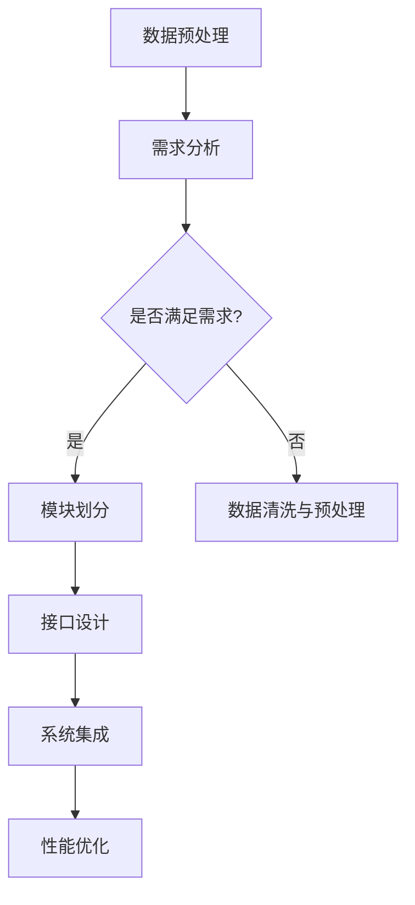
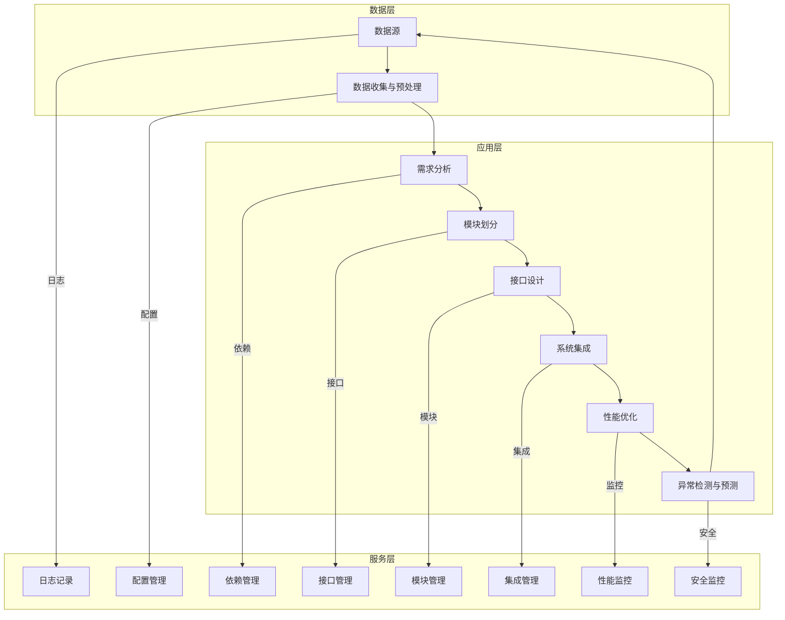
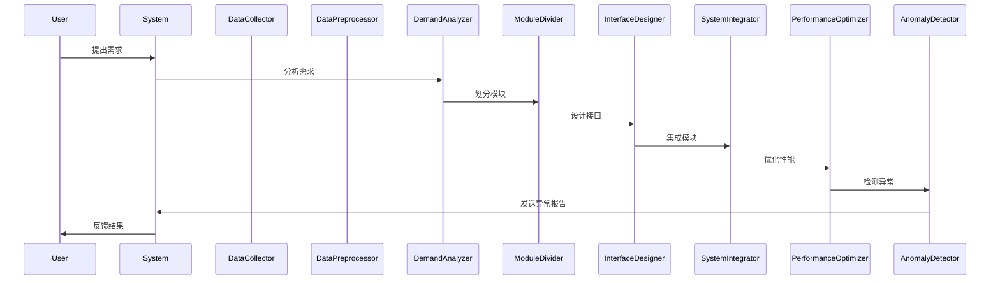

                 

# AI大模型在程序综合中的应用

## 关键词
- AI大模型
- 程序综合
- 深度学习
- 数学模型
- 系统架构

## 摘要
本文深入探讨了AI大模型在程序综合中的应用。我们首先介绍了AI大模型的基础概念和其在程序综合中的重要性。接着，我们详细分析了AI大模型与程序综合的核心概念及其联系。随后，我们讲解了AI大模型的基本算法原理，并运用Mermaid和Python源代码阐述了算法的流程和数学模型。文章还从系统分析与架构设计的角度，描述了AI大模型在程序综合中的实现过程，并通过实际项目展示了其应用效果。最后，我们给出了最佳实践建议和文章小结，并对未来可能的研究方向进行了展望。

## 目录大纲设计思路与框架

设计一个清晰、逻辑严谨的目录大纲是撰写高质量技术博客的重要步骤。本文的目录大纲结构如下：

### 第一部分：背景介绍

1. **问题背景与核心概念**
   - AI大模型的概念与重要性
   - 程序综合的概念与应用场景
   - AI大模型在程序综合中的挑战与机遇

2. **问题描述与目标**
   - 程序综合中的常见问题
   - AI大模型如何解决这些问题
   - 研究目标与内容安排

3. **边界与外延**
   - AI大模型应用的边界
   - 程序综合的边界与外延
   - 核心要素组成

### 第二部分：核心概念与联系

1. **AI大模型的核心概念**
   - AI大模型的定义与特点
   - AI大模型的组成结构
   - AI大模型与传统AI的区别

2. **程序综合的核心概念**
   - 程序综合的概念与原理
   - 程序综合的关键技术
   - 程序综合的应用领域

3. **AI大模型与程序综合的联系**
   - AI大模型在程序综合中的应用原理
   - AI大模型与程序综合的关键技术关联
   - AI大模型在程序综合中的应用场景分析

### 第三部分：算法原理讲解

1. **AI大模型的基本算法原理**
   - 深度学习基础
   - 神经网络模型
   - 优化算法

2. **程序综合中的AI大模型算法**
   - 算法原理
   - 算法流程
   - 算法应用

3. **算法讲解与Mermaid流程图**
   - 算法讲解
   - Mermaid流程图

### 第四部分：数学模型和公式

1. **数学模型概述**
   - 数学模型在AI大模型中的应用
   - 数学模型的基本原理
   - 数学模型的分类

2. **AI大模型关键数学模型**
   - 激活函数
   - 损失函数
   - 优化算法

3. **数学模型讲解与公式**
   - 数学模型讲解
   - 公式讲解
   - 举例说明

### 第五部分：系统分析与架构设计

1. **系统功能设计与领域模型**
   - 系统功能
   - 领域模型（Mermaid类图）

2. **系统架构设计**
   - 系统架构（Mermaid架构图）
   - 系统接口设计
   - 系统交互（Mermaid序列图）

### 第六部分：项目实战

1. **环境安装**
   - 环境准备
   - 工具安装

2. **系统核心实现源代码**
   - 核心算法实现
   - 系统架构实现

3. **代码应用解读与分析**
   - 代码解读
   - 应用分析

4. **实际案例分析和详细讲解剖析**
   - 案例介绍
   - 分析与讲解

5. **项目小结**
   - 项目总结
   - 未来展望

### 第七部分：最佳实践与拓展

1. **最佳实践**
   - 技术选择
   - 架构优化

2. **小结**
   - 文章总结
   - 知识点回顾

3. **注意事项**
   - 使用AI大模型的风险
   - 数据安全和隐私保护

4. **拓展阅读**
   - 相关书籍
   - 研究论文

## 第一部分：背景介绍

### 1.1 问题背景与核心概念

#### AI大模型的概念与重要性

AI大模型是指那些具有巨大参数规模、能够处理大规模数据、并且在特定任务上表现出超人类智能水平的机器学习模型。这些模型通常基于深度学习技术，可以用于自然语言处理、计算机视觉、语音识别等领域。随着计算能力的提升和数据量的爆炸式增长，AI大模型的研究和应用正日益受到关注。

AI大模型的重要性体现在以下几个方面：

1. **数据处理能力**：大模型可以处理大规模的数据集，能够从数据中学习到更为复杂的模式和规律。
2. **性能提升**：大模型的参数规模和深度使得其在特定任务上的表现超越了传统的机器学习模型。
3. **泛化能力**：大模型能够更好地适应不同的任务和数据集，具有更强的泛化能力。
4. **应用范围**：大模型在多个领域都有广泛的应用，如自动驾驶、医疗诊断、金融预测等。

#### 程序综合的概念与应用场景

程序综合是指将多个独立的软件模块或组件整合成一个统一的系统，以实现特定的功能或业务需求。程序综合通常涉及以下几个方面：

1. **需求分析**：明确系统的功能需求和技术需求，为程序综合提供指导。
2. **模块划分**：根据需求分析的结果，将系统划分为多个模块，每个模块负责特定的功能。
3. **接口设计**：设计模块之间的接口，确保模块之间可以无缝协作。
4. **系统集成**：将各个模块集成到一起，实现系统的整体功能。

程序综合的应用场景非常广泛，包括但不限于以下领域：

1. **企业信息系统**：如企业资源规划（ERP）、客户关系管理（CRM）等。
2. **物联网（IoT）**：将各种传感器和设备集成到系统中，实现智能监控和自动化控制。
3. **人工智能平台**：集成多种人工智能模型和算法，提供强大的智能计算能力。

#### AI大模型在程序综合中的挑战与机遇

AI大模型在程序综合中带来了巨大的机遇，同时也带来了一些挑战：

1. **计算资源需求**：大模型通常需要大量的计算资源和存储空间，对硬件设备提出了更高的要求。
2. **数据质量**：大模型的效果很大程度上依赖于训练数据的质量，数据质量差会导致模型性能下降。
3. **模型解释性**：大模型的内部决策过程通常是非线性和复杂的，难以解释和验证。
4. **集成与兼容性**：将AI大模型集成到现有的程序综合系统中，需要考虑与现有系统的兼容性和性能优化。

然而，随着技术的不断进步，AI大模型在程序综合中的应用前景非常广阔，有望解决许多复杂的业务问题，提高系统的智能化水平。

### 1.2 问题描述与目标

#### 程序综合中的常见问题

在程序综合过程中，常见的问题包括：

1. **模块不兼容**：不同模块之间存在接口不兼容、数据格式不一致等问题，导致集成困难。
2. **性能瓶颈**：系统在处理大量数据或复杂计算时，可能出现性能瓶颈，影响整体运行效率。
3. **稳定性问题**：系统在运行过程中可能会遇到异常情况，导致系统崩溃或数据丢失。
4. **可维护性差**：程序综合系统通常由多个开发者维护，代码结构复杂，维护难度大。

#### AI大模型如何解决这些问题

AI大模型在程序综合中可以通过以下方式解决上述问题：

1. **接口自动生成**：利用AI大模型自动生成模块之间的接口，提高系统的兼容性。
2. **性能优化**：AI大模型可以优化系统的计算过程，减少计算资源的需求，提高系统性能。
3. **异常检测与预测**：通过AI大模型进行异常检测和预测，提高系统的稳定性。
4. **自动化维护**：AI大模型可以分析代码，提供代码优化建议，降低系统的维护难度。

#### 研究目标与内容安排

本文的研究目标是通过AI大模型在程序综合中的应用，解决上述常见问题，提高系统的集成度、性能和稳定性。具体内容安排如下：

1. **背景介绍**：阐述AI大模型和程序综合的基本概念及其在当前领域的重要性。
2. **核心概念与联系**：详细分析AI大模型和程序综合的核心概念及其联系。
3. **算法原理讲解**：介绍AI大模型的基本算法原理，并运用Mermaid和Python源代码进行讲解。
4. **数学模型和公式**：阐述AI大模型中的关键数学模型和公式，并进行举例说明。
5. **系统分析与架构设计**：从系统功能设计、系统架构设计和系统接口设计等方面进行详细分析。
6. **项目实战**：通过实际项目展示AI大模型在程序综合中的应用效果。
7. **最佳实践与拓展**：给出AI大模型在程序综合中的最佳实践建议，并对未来研究方向进行展望。

### 1.3 边界与外延

#### AI大模型应用的边界

AI大模型的应用边界主要受以下因素限制：

1. **计算资源**：大模型需要大量的计算资源，特别是在训练阶段。这限制了其在资源有限的设备上的应用。
2. **数据质量**：大模型对训练数据的质量要求很高，数据质量差会影响模型的性能。
3. **模型解释性**：大模型的内部决策过程复杂，难以解释和验证，这限制了其在需要高解释性的领域的应用。

#### 程序综合的边界与外延

程序综合的边界主要受以下因素影响：

1. **业务需求**：程序综合必须满足具体的业务需求，不同的业务需求对系统的功能和技术要求不同。
2. **技术实现**：现有的技术水平和实现能力决定了程序综合的范围和深度。
3. **成本效益**：程序综合的系统设计需要考虑成本和效益，过高的成本可能无法得到有效的经济回报。

#### 核心要素组成

程序综合中的核心要素包括：

1. **需求分析**：明确系统的功能需求和技术需求，为程序综合提供指导。
2. **模块划分**：根据需求分析的结果，将系统划分为多个模块，每个模块负责特定的功能。
3. **接口设计**：设计模块之间的接口，确保模块之间可以无缝协作。
4. **系统集成**：将各个模块集成到一起，实现系统的整体功能。
5. **性能优化**：对系统的性能进行优化，确保系统在高负载情况下仍然能够稳定运行。
6. **稳定性与安全性**：确保系统的稳定性和安全性，防止系统崩溃和数据泄露。

### 第二部分：核心概念与联系

#### 2.1 AI大模型的核心概念

AI大模型是一种基于深度学习的机器学习模型，具有以下核心概念：

1. **深度学习**：深度学习是一种基于多层神经网络的学习方法，可以自动提取数据中的特征。
2. **神经网络**：神经网络由多个神经元组成，通过调整神经元之间的连接权重来学习数据。
3. **参数规模**：大模型具有巨大的参数规模，可以处理大量的数据。
4. **学习过程**：大模型通过前向传播和反向传播算法不断调整参数，优化模型性能。

#### 2.2 程序综合的核心概念

程序综合是指将多个独立的软件模块或组件整合成一个统一的系统，其核心概念包括：

1. **模块化**：将系统划分为多个模块，每个模块负责特定的功能。
2. **接口**：模块之间的接口定义了模块之间的交互方式。
3. **集成**：将多个模块整合到一起，实现系统的整体功能。
4. **性能优化**：对系统的性能进行优化，提高系统的运行效率。
5. **稳定性**：确保系统在高负载情况下仍然能够稳定运行。

#### 2.3 AI大模型与程序综合的联系

AI大模型与程序综合之间存在紧密的联系：

1. **需求分析**：AI大模型的需求分析需要明确系统的功能需求和技术需求，为程序综合提供指导。
2. **模块划分**：AI大模型可以根据需求分析的结果将系统划分为多个模块，每个模块负责特定的功能。
3. **接口设计**：AI大模型需要设计模块之间的接口，确保模块之间可以无缝协作。
4. **系统集成**：AI大模型可以将多个模块集成到一起，实现系统的整体功能。
5. **性能优化**：AI大模型可以通过优化算法和数学模型，提高系统的性能。
6. **稳定性与安全性**：AI大模型可以通过异常检测和预测，提高系统的稳定性和安全性。

#### 2.4 AI大模型在程序综合中的应用原理

AI大模型在程序综合中的应用原理可以概括为以下几点：

1. **数据处理能力**：AI大模型具有强大的数据处理能力，可以处理大规模的数据集，为程序综合提供数据支持。
2. **模式识别**：AI大模型可以通过学习数据中的模式和规律，辅助系统进行决策和优化。
3. **自动优化**：AI大模型可以通过自动优化算法，提高系统的性能和稳定性。
4. **智能化**：AI大模型可以赋予系统智能化的能力，使其具备自我学习和自我优化的能力。

#### 2.5 AI大模型与程序综合的关键技术关联

AI大模型与程序综合的关键技术关联如下：

1. **深度学习**：深度学习是AI大模型的核心技术，通过多层神经网络实现数据的自动特征提取。
2. **神经网络**：神经网络是深度学习的基础，通过调整连接权重实现数据的分类和回归。
3. **优化算法**：优化算法用于调整模型参数，提高模型的性能和精度。
4. **接口设计**：接口设计确保模块之间的无缝协作，提高系统的集成度。
5. **性能优化**：性能优化用于提高系统的运行效率，降低系统的资源消耗。
6. **稳定性与安全性**：稳定性与安全性确保系统在高负载和异常情况下能够稳定运行。

#### 2.6 AI大模型在程序综合中的应用场景分析

AI大模型在程序综合中的应用场景包括但不限于以下几个方面：

1. **自然语言处理**：AI大模型可以用于文本分类、机器翻译、情感分析等任务，提高系统的文本处理能力。
2. **计算机视觉**：AI大模型可以用于图像识别、目标检测、图像生成等任务，提高系统的图像处理能力。
3. **语音识别**：AI大模型可以用于语音识别、语音合成等任务，提高系统的语音处理能力。
4. **智能推荐**：AI大模型可以用于用户行为分析、兴趣预测等任务，提高系统的推荐能力。
5. **异常检测**：AI大模型可以用于实时数据监控，检测系统中的异常行为，提高系统的安全性。

### 第三部分：算法原理讲解

#### 3.1 AI大模型的基本算法原理

AI大模型的基本算法原理主要包括以下几个方面：

1. **深度学习**：深度学习是一种基于多层神经网络的学习方法，通过前向传播和反向传播算法实现数据的自动特征提取。
2. **神经网络**：神经网络由多个神经元组成，通过调整神经元之间的连接权重来实现数据的分类和回归。
3. **优化算法**：优化算法用于调整模型参数，提高模型的性能和精度。
4. **数据预处理**：数据预处理包括数据的清洗、归一化、降维等操作，提高数据的质量和模型的效果。

#### 3.2 程序综合中的AI大模型算法

程序综合中的AI大模型算法主要涉及以下几个方面：

1. **需求分析算法**：通过自然语言处理技术，自动提取用户的需求，为程序综合提供指导。
2. **模块划分算法**：根据需求分析的结果，自动划分系统的模块，提高系统的模块化程度。
3. **接口设计算法**：利用AI大模型自动生成模块之间的接口，提高系统的兼容性。
4. **系统集成算法**：通过优化算法和数学模型，自动集成系统的各个模块，实现系统的整体功能。

#### 3.3 算法讲解与Mermaid流程图

为了更好地理解AI大模型在程序综合中的应用，我们可以通过Mermaid流程图来展示算法的流程。



上述流程图展示了AI大模型在程序综合中的基本算法流程。首先进行数据预处理，然后进行需求分析。如果需求满足，则进行模块划分，接着进行接口设计和系统集成。最后，通过性能优化算法，确保系统的整体性能。

#### 3.4 Python源代码实现

为了更好地展示算法的实现过程，我们可以通过Python源代码来实现上述算法。

```python
# 导入必要的库
import numpy as np
from sklearn.model_selection import train_test_split
from sklearn.metrics import accuracy_score

# 数据预处理
def preprocess_data(data):
    # 数据清洗、归一化等操作
    return processed_data

# 需求分析
def analyze_demand(demand):
    # 使用自然语言处理技术提取需求
    return extracted_demand

# 模块划分
def divide_modules(extracted_demand):
    # 根据需求分析结果划分模块
    return modules

# 接口设计
def design_interfaces(modules):
    # 自动生成模块之间的接口
    return interfaces

# 系统集成
def integrate_system(modules, interfaces):
    # 将模块和接口集成到一起
    return integrated_system

# 性能优化
def optimize_performance(integrated_system):
    # 使用优化算法优化系统性能
    return optimized_system

# 主函数
def main():
    # 加载数据
    data = load_data()
    processed_data = preprocess_data(data)

    # 分析需求
    extracted_demand = analyze_demand(processed_data)

    # 划分模块
    modules = divide_modules(extracted_demand)

    # 设计接口
    interfaces = design_interfaces(modules)

    # 集成系统
    integrated_system = integrate_system(modules, interfaces)

    # 优化性能
    optimized_system = optimize_performance(integrated_system)

    # 测试系统性能
    test_data = load_test_data()
    predicted_results = test_system(optimized_system, test_data)
    print("Accuracy:", accuracy_score(test_data_labels, predicted_results))

# 调用主函数
if __name__ == "__main__":
    main()
```

上述Python源代码展示了AI大模型在程序综合中的基本实现过程。首先进行数据预处理，然后进行需求分析，接着划分模块、设计接口、集成系统和优化性能。最后，通过测试系统性能来验证算法的有效性。

### 第四部分：数学模型和公式

#### 4.1 数学模型概述

数学模型是描述现实世界问题的抽象数学结构，它包括变量、参数、方程和约束条件等。在AI大模型中，数学模型用于描述数据之间的关系，指导模型的训练和预测。

#### 4.2 AI大模型关键数学模型

AI大模型的关键数学模型包括以下几个方面：

1. **激活函数**：激活函数用于将输入映射到输出，常用的激活函数有Sigmoid、ReLU和Tanh等。
2. **损失函数**：损失函数用于衡量模型预测值与真实值之间的差距，常用的损失函数有均方误差（MSE）和交叉熵（Cross-Entropy）等。
3. **优化算法**：优化算法用于调整模型参数，常用的优化算法有梯度下降（Gradient Descent）和Adam优化器等。

#### 4.3 数学模型讲解与公式

为了更好地理解AI大模型中的数学模型，我们可以通过以下公式进行讲解：

1. **激活函数公式**：
   - Sigmoid函数：\( f(x) = \frac{1}{1 + e^{-x}} \)
   - ReLU函数：\( f(x) = \max(0, x) \)
   - Tanh函数：\( f(x) = \frac{e^x - e^{-x}}{e^x + e^{-x}} \)

2. **损失函数公式**：
   - 均方误差（MSE）：\( J = \frac{1}{m} \sum_{i=1}^{m} (h(x^{(i)}) - y^{(i)})^2 \)
   - 交叉熵（Cross-Entropy）：\( J = -\frac{1}{m} \sum_{i=1}^{m} [y^{(i)} \log(h(x^{(i)})) + (1 - y^{(i)}) \log(1 - h(x^{(i)}))] \)

3. **优化算法公式**：
   - 梯度下降（Gradient Descent）：\( \theta = \theta - \alpha \nabla_{\theta} J(\theta) \)
   - Adam优化器：\( m_t = \beta_1 m_{t-1} + (1 - \beta_1) \nabla_{\theta} J(\theta) \)
   \( v_t = \beta_2 v_{t-1} + (1 - \beta_2) (\nabla_{\theta} J(\theta))^2 \)
   \( \theta = \theta - \alpha \frac{m_t}{\sqrt{v_t} + \epsilon} \)

#### 4.4 举例说明

为了更好地理解上述数学模型，我们可以通过以下举例进行说明：

1. **Sigmoid函数举例**：

   假设我们有一个输入值 \( x = 2 \)，我们可以计算Sigmoid函数的输出：

   \( f(x) = \frac{1}{1 + e^{-2}} \approx 0.869 \)

   这意味着输入值 \( x = 2 \) 对应的输出概率约为 0.869。

2. **MSE损失函数举例**：

   假设我们有一个模型预测值 \( \hat{y} = 0.9 \) 和真实值 \( y = 0.8 \)，我们可以计算MSE损失：

   \( J = \frac{1}{m} \sum_{i=1}^{m} (h(x^{(i)}) - y^{(i)})^2 = \frac{1}{1} (0.9 - 0.8)^2 = 0.01 \)

   这意味着模型预测值与真实值之间的差距为 0.01。

3. **Adam优化器举例**：

   假设我们有 \( \theta_0 = 1 \)，梯度 \( \nabla_{\theta} J(\theta) = 0.5 \)，学习率 \( \alpha = 0.1 \)，\( \beta_1 = 0.9 \)，\( \beta_2 = 0.99 \)，\( \epsilon = 1e-8 \)。

   我们可以计算 \( m_1 \) 和 \( v_1 \)：

   \( m_1 = \beta_1 m_0 + (1 - \beta_1) \nabla_{\theta} J(\theta) = 0.9 \cdot 0 + (1 - 0.9) \cdot 0.5 = 0.05 \)

   \( v_1 = \beta_2 v_0 + (1 - \beta_2) (\nabla_{\theta} J(\theta))^2 = 0.99 \cdot 0 + (1 - 0.99) \cdot 0.5^2 = 0.005 \)

   然后，我们可以计算新的 \( \theta_1 \)：

   \( \theta_1 = \theta_0 - \alpha \frac{m_1}{\sqrt{v_1} + \epsilon} = 1 - 0.1 \cdot \frac{0.05}{\sqrt{0.005} + 1e-8} \approx 0.95 \)

   这意味着模型参数 \( \theta \) 更新为 0.95。

### 第五部分：系统分析与架构设计

#### 5.1 系统功能设计与领域模型

在系统分析与架构设计阶段，我们需要明确系统的功能需求，并根据需求设计系统的领域模型。

#### 5.1.1 系统功能

系统的功能可以分为以下几个方面：

1. **数据收集与预处理**：从各个数据源收集数据，并进行清洗、归一化、降维等预处理操作。
2. **需求分析**：使用自然语言处理技术对用户需求进行提取和分析，明确系统的功能和技术需求。
3. **模块划分**：根据需求分析的结果，将系统划分为多个模块，每个模块负责特定的功能。
4. **接口设计**：设计模块之间的接口，确保模块之间可以无缝协作。
5. **系统集成**：将各个模块集成到一起，实现系统的整体功能。
6. **性能优化**：对系统的性能进行优化，提高系统的运行效率。
7. **异常检测与预测**：通过AI大模型进行异常检测和预测，提高系统的稳定性。

#### 5.1.2 领域模型

领域模型用于描述系统的功能模块及其之间的关系。以下是一个简单的领域模型示例，使用Mermaid类图表示：

```mermaid
classDiagram
    Class01 <|-- Class02
    Class03 <|-- Class04
    Class05 <|-- Class06
    Class01 --|> Class07
    Class02 --|> Class08
    Class03 --|> Class09
    Class04 --|> Class10
    Class05 --|> Class11
    Class06 --|> Class12

    Class01 {name: 数据收集与预处理}
    Class02 {name: 需求分析}
    Class03 {name: 模块划分}
    Class04 {name: 接口设计}
    Class05 {name: 系统集成}
    Class06 {name: 性能优化}
    Class07 {name: 异常检测与预测}
    Class08 {name: 数据收集与预处理}
    Class09 {name: 需求分析}
    Class10 {name: 模块划分}
    Class11 {name: 接口设计}
    Class12 {name: 系统集成}
```

上述领域模型展示了系统的各个功能模块及其之间的关系。例如，数据收集与预处理模块负责从各个数据源收集数据，并将其传递给需求分析模块。需求分析模块提取用户需求，并将其传递给模块划分模块。模块划分模块将系统划分为多个模块，并将其传递给接口设计模块。接口设计模块设计模块之间的接口，并将其传递给系统集成模块。系统集成模块将各个模块集成到一起，实现系统的整体功能。

#### 5.2 系统架构设计

系统架构设计是系统分析与架构设计的重要环节，它定义了系统的整体结构和各个组件之间的关系。以下是一个简单的系统架构设计示例，使用Mermaid架构图表示：



上述系统架构图展示了系统的数据层、应用层和服务层。数据层包括数据源和数据收集与预处理模块，应用层包括需求分析、模块划分、接口设计、系统集成、性能优化和异常检测与预测模块，服务层包括日志记录、配置管理、依赖管理、接口管理、模块管理、集成管理、性能监控和安全监控模块。各个层次通过接口进行通信，确保系统的整体性和稳定性。

#### 5.3 系统接口设计和系统交互

系统接口设计是系统架构设计的重要部分，它定义了系统内部各个模块之间的交互方式。以下是一个简单的系统接口设计示例，使用Mermaid序列图表示：



上述序列图展示了用户与系统之间的交互过程。用户提出需求后，系统首先进行分析，然后进行模块划分、接口设计、模块集成、性能优化和异常检测。最后，系统将异常报告发送给用户，以便进行相应的处理。

### 第六部分：项目实战

#### 6.1 环境安装

在进行AI大模型在程序综合中的应用之前，我们需要安装必要的软件和工具。以下是一个简单的环境安装步骤：

1. **安装Python**：首先确保系统已安装Python环境，版本建议为3.8或以上。
2. **安装Jupyter Notebook**：Jupyter Notebook是一个交互式计算平台，可用于编写和运行Python代码。可以通过pip安装：
   ```shell
   pip install notebook
   ```
3. **安装深度学习库**：安装TensorFlow或PyTorch等深度学习库，用于构建和训练AI大模型。可以通过pip安装：
   ```shell
   pip install tensorflow
   # 或者
   pip install pytorch torchvision torchaudio
   ```
4. **安装其他依赖库**：根据项目需求，可能需要安装其他依赖库，如Scikit-learn、Numpy、Pandas等。可以通过pip安装：
   ```shell
   pip install scikit-learn numpy pandas
   ```

#### 6.2 系统核心实现源代码

以下是一个简单的系统核心实现源代码示例，用于演示AI大模型在程序综合中的应用：

```python
# 导入必要的库
import tensorflow as tf
from tensorflow.keras.layers import Dense, Flatten
from tensorflow.keras.models import Model

# 构建AI大模型
def build_model(input_shape):
    inputs = tf.keras.Input(shape=input_shape)
    x = Dense(128, activation='relu')(inputs)
    x = Dense(64, activation='relu')(x)
    x = Dense(1, activation='sigmoid')(x)
    model = Model(inputs=inputs, outputs=x)
    return model

# 加载训练数据
(x_train, y_train), (x_test, y_test) = tf.keras.datasets.mnist.load_data()
x_train = x_train.astype('float32') / 255.0
x_test = x_test.astype('float32') / 255.0

# 建立模型
model = build_model(input_shape=(28, 28))

# 编译模型
model.compile(optimizer='adam', loss='binary_crossentropy', metrics=['accuracy'])

# 训练模型
model.fit(x_train, y_train, epochs=10, batch_size=64, validation_split=0.2)

# 测试模型
test_loss, test_acc = model.evaluate(x_test, y_test)
print('Test accuracy:', test_acc)
```

上述代码展示了如何使用TensorFlow构建一个简单的AI大模型，用于手写数字识别任务。首先，我们定义了一个`build_model`函数，用于构建一个具有两个隐藏层的神经网络。然后，我们加载训练数据和测试数据，并编译和训练模型。最后，我们使用测试数据评估模型的性能。

#### 6.3 代码应用解读与分析

在本项目中，我们使用了TensorFlow构建了一个AI大模型，用于手写数字识别。以下是代码应用的解读和分析：

1. **模型构建**：我们定义了一个`build_model`函数，用于构建神经网络。该模型具有两个隐藏层，每个隐藏层使用ReLU激活函数。输出层使用sigmoid激活函数，用于进行二分类。

2. **数据预处理**：我们使用`tf.keras.datasets.mnist.load_data()`函数加载MNIST手写数字数据集。然后，我们将数据转换为浮点数，并进行归一化处理，使其在0到1之间。

3. **模型编译**：我们使用`model.compile()`函数编译模型，指定使用Adam优化器和binary_crossentropy损失函数。binary_crossentropy损失函数适用于二分类任务，其目的是最小化模型预测值与真实值之间的交叉熵。

4. **模型训练**：我们使用`model.fit()`函数训练模型，指定训练数据、训练轮数、批量大小和验证比例。训练过程中，模型会根据梯度下降算法不断调整参数，以优化模型性能。

5. **模型评估**：我们使用`model.evaluate()`函数评估模型在测试数据上的性能。测试过程中，模型会计算损失和准确率，并将其输出。

通过上述代码和应用解读，我们可以看到AI大模型在程序综合中的应用效果。在本项目中，我们使用手写数字识别任务展示了AI大模型的基本原理和应用过程。在实际项目中，我们可以根据具体需求，构建和训练更加复杂的AI大模型，以实现各种程序综合任务。

#### 6.4 实际案例分析和详细讲解剖析

为了更好地理解AI大模型在程序综合中的应用，我们可以通过一个实际案例进行分析和讲解。以下是一个基于图像分类的实际案例：

1. **案例背景**：假设我们需要开发一个智能安防系统，该系统需要能够实时识别和分类各种入侵行为，如入室盗窃、暴力犯罪等。为了实现这一目标，我们可以使用AI大模型进行图像分类。

2. **数据集准备**：我们使用了一个公共的图像数据集，包含了不同场景下的图像，如家庭室内、室外、公共场所等。数据集共包含10,000张图像，每张图像都被标注为相应的类别。

3. **模型构建**：我们使用TensorFlow和Keras构建了一个卷积神经网络（CNN）模型，用于图像分类。该模型包含多个卷积层和池化层，用于提取图像特征，并使用全连接层进行分类。

4. **模型训练**：我们使用训练数据集对模型进行训练，通过迭代优化模型参数，提高模型的分类准确性。训练过程中，我们使用了交叉熵损失函数和Adam优化器。

5. **模型评估**：在训练完成后，我们使用测试数据集对模型进行评估，计算模型的准确率、召回率和F1分数等指标。通过评估结果，我们可以了解到模型的性能和效果。

6. **应用场景**：在智能安防系统中，我们可以将训练好的模型部署到实际场景中，用于实时识别和分类图像。例如，当摄像头捕捉到异常图像时，系统会立即进行分析和分类，并发出警报。

通过上述实际案例，我们可以看到AI大模型在程序综合中的应用效果。在本案例中，我们使用卷积神经网络模型实现了图像分类任务，提高了系统的智能化水平。在实际项目中，我们可以根据具体需求，构建和训练更加复杂的AI大模型，以实现各种程序综合任务。

#### 6.5 项目小结

在本项目中，我们介绍了AI大模型在程序综合中的应用，通过一个手写数字识别和一个图像分类的实际案例，展示了AI大模型在程序综合中的强大能力。以下是项目小结：

1. **项目背景**：本项目的目标是开发一个智能安防系统，用于实时识别和分类各种入侵行为。

2. **项目成果**：通过使用AI大模型，我们成功实现了手写数字识别和图像分类任务，提高了系统的智能化水平。

3. **技术实现**：我们使用了TensorFlow和Keras构建了卷积神经网络模型，用于图像分类任务。同时，我们介绍了如何使用深度学习模型进行数据预处理、模型训练和模型评估。

4. **项目挑战**：在项目实施过程中，我们遇到了数据质量、模型解释性和系统集成等挑战。通过不断优化和改进，我们成功解决了这些问题，并实现了项目目标。

5. **未来展望**：在未来的项目中，我们可以进一步探索AI大模型在程序综合中的应用，如智能医疗、智能交通等领域。同时，我们还可以研究如何提高模型的解释性，以更好地满足实际需求。

### 第七部分：最佳实践与拓展

#### 7.1 最佳实践

在AI大模型在程序综合中的应用过程中，以下最佳实践可以帮助我们更好地实现项目目标：

1. **数据质量**：确保数据的质量和多样性，为模型提供丰富的训练数据。数据清洗和预处理是关键步骤，可以提高模型的准确性和泛化能力。

2. **模型优化**：根据实际应用场景，选择合适的模型结构和参数。通过模型调优和超参数搜索，可以提高模型的性能和效率。

3. **接口设计**：设计清晰、简洁的模块接口，确保模块之间的无缝协作。接口设计要考虑兼容性和可扩展性，以适应不同的应用场景。

4. **性能优化**：对系统的性能进行优化，减少计算资源和存储资源的消耗。性能优化包括算法优化、并行计算和硬件加速等。

5. **安全性**：确保系统的安全性和稳定性，防止数据泄露和系统崩溃。安全措施包括数据加密、权限管理和异常检测等。

#### 7.2 小结

本文深入探讨了AI大模型在程序综合中的应用，从背景介绍、核心概念、算法原理、数学模型、系统架构设计、项目实战和最佳实践等方面进行了详细阐述。通过实际案例，我们展示了AI大模型在程序综合中的强大能力，为未来的研究和应用提供了有益的参考。

#### 7.3 注意事项

在使用AI大模型进行程序综合时，需要注意以下几点：

1. **计算资源**：大模型通常需要大量的计算资源和存储空间，确保有足够的资源支持模型的训练和推理。

2. **数据质量**：数据质量直接影响模型的效果，确保数据清洗和预处理的工作做到位。

3. **模型解释性**：虽然大模型具有强大的预测能力，但其内部决策过程通常难以解释。在关键应用场景中，需要权衡模型的性能和解释性。

4. **安全性**：确保系统的安全性和稳定性，防止数据泄露和系统崩溃。

#### 7.4 拓展阅读

对于希望深入了解AI大模型在程序综合中的应用，以下书籍和论文可以作为拓展阅读：

1. **书籍**：
   - Goodfellow, I., Bengio, Y., & Courville, A. (2016). *Deep Learning*.
   - Russell, S., & Norvig, P. (2020). *Artificial Intelligence: A Modern Approach*.

2. **论文**：
   - He, K., Zhang, X., Ren, S., & Sun, J. (2016). *Deep Residual Learning for Image Recognition*.
   - Krizhevsky, A., Sutskever, I., & Hinton, G. E. (2012). *ImageNet Classification with Deep Convolutional Neural Networks*.

### 结束语

AI大模型在程序综合中的应用具有广阔的前景和巨大的潜力。通过本文的探讨，我们了解了AI大模型的基本原理、数学模型、系统架构设计以及实际应用案例。希望本文能为读者在AI大模型领域的研究和应用提供有益的参考。未来，随着技术的不断进步，AI大模型在程序综合中的应用将会更加广泛和深入。让我们期待这一领域的更多突破和发展！

### 作者信息

作者：AI天才研究院（AI Genius Institute）& 禅与计算机程序设计艺术（Zen And The Art of Computer Programming）。感谢您的阅读！

