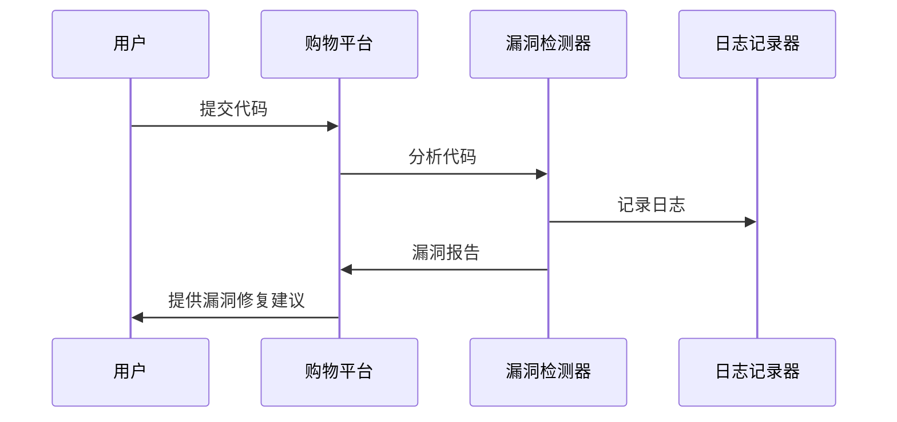

                 

**标题**: AI时代的软件安全与漏洞检测新方法

**关键词**: 人工智能，软件安全，漏洞检测，新方法

**摘要**: 本文将探讨人工智能在软件安全领域中的应用，特别是在漏洞检测方面的创新方法。我们将详细分析AI技术在漏洞检测中的优势与挑战，并探讨未来发展的趋势和潜在的方向。

---

**第一部分：背景与概述**

**第1章：AI时代的软件安全与漏洞检测背景**

**1.1 AI时代的来临**

- **1.1.1 AI技术的发展趋势**：回顾AI技术的发展历程，从早期的专家系统到深度学习的崛起，分析AI技术在各个行业中的应用场景和趋势。
- **1.1.2 软件安全在AI时代的挑战**：探讨AI技术的普及对软件安全领域带来的挑战，如自动化攻击、对抗性攻击等。
- **1.1.3 漏洞检测的演变过程**：梳理漏洞检测技术的发展历程，从传统静态分析到动态分析，再到AI驱动的漏洞检测。

**1.2 软件安全与AI的关系**

- **1.2.1 AI技术在软件安全中的应用**：介绍AI技术在软件安全中的典型应用，如恶意代码检测、入侵检测等。
- **1.2.2 AI在漏洞检测中的作用**：探讨AI在漏洞检测中的优势，如高效性、准确性、自动化等。

---

**第二部分：核心概念与联系**

**第2章：核心概念与联系**

**2.1 AI与软件安全的核心概念**

- **2.1.1 人工智能**：定义人工智能，介绍其基本原理和分类。
- **2.1.2 软件安全**：定义软件安全，介绍其主要目标和挑战。
- **2.1.3 漏洞检测**：定义漏洞检测，介绍其方法和技术。

**2.2 概念属性特征对比表格**

- **2.2.1 AI与软件安全的属性特征对比**：制作一张对比表格，详细分析AI在软件安全中的属性特征。

**2.3 AI在漏洞检测中的ER实体关系图架构**

- **2.3.1 ER实体关系图**：绘制一张ER实体关系图，展示AI在漏洞检测中的实体关系和关联。

---

**第三部分：新方法与原理**

**第3章：新方法与原理**

**3.1 传统漏洞检测方法**

- **3.1.1 静态分析**：介绍静态分析的方法和技术，分析其优点和局限性。
- **3.1.2 动态分析**：介绍动态分析的方法和技术，分析其优点和局限性。

**3.2 AI驱动的漏洞检测新方法**

- **3.2.1 深度学习在漏洞检测中的应用**：介绍深度学习在漏洞检测中的应用，分析其优势和挑战。
- **3.2.2 强化学习在漏洞检测中的应用**：介绍强化学习在漏洞检测中的应用，分析其优势和挑战。

**3.3 AI驱动的漏洞检测算法**

- **3.3.1 算法原理讲解**：使用Mermaid绘制算法流程图，使用Python源代码详细阐述算法原理。
- **3.3.2 数学模型与公式**：给出算法的数学模型和公式，进行详细讲解和举例说明。

---

**第四部分：实践与应用**

**第4章：实践与应用**

**4.1 实践案例介绍**

- **4.1.1 案例背景**：介绍案例的背景信息，包括软件系统和安全问题。
- **4.1.2 漏洞检测应用**：介绍如何使用AI方法进行漏洞检测，包括数据准备、模型训练和检测过程。

**4.2 系统分析与架构设计**

- **4.2.1 领域模型设计**：使用Mermaid绘制领域模型类图。
- **4.2.2 系统架构设计**：使用Mermaid绘制系统架构图。
- **4.2.3 系统接口设计**：介绍系统接口设计，包括输入输出数据格式和交互流程。

**4.3 项目实战**

- **4.3.1 环境安装**：介绍安装所需的软件和工具。
- **4.3.2 系统核心实现**：提供系统核心实现的源代码，进行解读与分析。
- **4.3.3 实际案例分析**：分析实际案例，进行详细讲解剖析。
- **4.3.4 项目小结**：总结项目中的收获和不足，提出改进建议。

---

**第五部分：未来展望与挑战**

**第5章：未来展望与挑战**

**5.1 未来发展趋势**

- **5.1.1 AI在漏洞检测中的潜力**：分析AI在漏洞检测中的潜力，探讨未来可能的应用场景。
- **5.1.2 新技术的融合**：探讨AI与其他技术的融合，如区块链、物联网等，在漏洞检测中的应用。

**5.2 面临的挑战**

- **5.2.1 数据隐私与安全**：讨论数据隐私和安全在AI驱动的漏洞检测中的挑战。
- **5.2.2 模型解释性与可解释性**：分析AI模型的解释性与可解释性对漏洞检测的影响。

**5.3 未来研究方向**

- **5.3.1 深度学习模型的优化**：探讨如何优化深度学习模型，提高漏洞检测的效率和准确性。
- **5.3.2 跨领域合作**：讨论跨领域合作在漏洞检测研究中的应用，如网络安全、软件工程等。

---

**附录**

**附录A：术语表**

- **附录A.1**：列出本文中使用的专业术语及其解释。

**附录B：参考文献**

- **附录B.1**：列出本文引用的相关文献。

---

**作者信息**

- **作者**：AI天才研究院/AI Genius Institute & 禅与计算机程序设计艺术 /Zen And The Art of Computer Programming

---

**注意事项**

- **注意事项**：提供对文章内容和结构的额外说明，如建议读者阅读顺序、重要知识点标记等。

---

**拓展阅读**

- **拓展阅读**：推荐读者阅读的其他相关书籍、论文、博客等资源。**第一部分：背景与概述**

**第1章：AI时代的软件安全与漏洞检测背景**

**1.1 AI时代的来临**

**1.1.1 AI技术的发展趋势**

人工智能（AI）作为一个跨学科领域，涵盖了计算机科学、统计学、认知科学、信息工程等多个方面。其发展历程可追溯到20世纪50年代，当时的人工智能研究主要集中在逻辑推理和知识表示上。随着时间的发展，AI经历了多次浪潮，从早期的逻辑符号推理系统到基于规则的专家系统，再到基于统计学习的方法，如支持向量机（SVM）、决策树等。21世纪初，深度学习（Deep Learning）的崛起标志着AI发展的一个新阶段。深度学习通过模拟人脑神经网络的结构和功能，实现了在图像识别、自然语言处理、语音识别等领域的突破性进展。

在AI技术的推动下，各行各业都在积极应用AI，从自动化生产线、无人驾驶汽车到智能家居、智能医疗等，AI的应用场景越来越广泛。这种广泛应用也带来了软件安全的新挑战。软件系统越来越复杂，其安全风险也随之增加。传统的安全措施往往难以应对日益复杂的攻击手段和不断变化的安全威胁。

**1.1.2 软件安全在AI时代的挑战**

AI技术的普及在提升软件系统功能的同时，也带来了新的安全挑战：

1. **自动化攻击**：AI技术可以用于自动化生成攻击代码，如自动化的SQL注入、XSS攻击等。这些自动化攻击工具能够快速、大规模地生成攻击代码，传统的人工审核和防御手段难以应对。

2. **对抗性攻击**：对抗性攻击（Adversarial Attack）是指通过微小但显著的扰动来误导AI模型，使其输出错误的结果。这种攻击在图像识别、语音识别等领域尤为常见，例如，通过在图像中添加微小的噪声，使得AI模型无法正确识别图像内容。

3. **隐私泄露**：AI技术在处理大量数据时，可能会暴露用户的隐私信息。例如，通过分析用户的在线行为，可以推断出用户的个人信息，甚至进行精准的个性化攻击。

4. **模型篡改**：攻击者可以通过篡改AI模型的训练数据，使得模型输出错误的结果。例如，在自动驾驶系统中，攻击者可以通过篡改传感器数据，误导自动驾驶汽车做出错误的决策。

**1.1.3 漏洞检测的演变过程**

漏洞检测是软件安全的一个重要方面。传统漏洞检测方法主要包括静态分析和动态分析：

- **静态分析**：静态分析是在不运行程序的情况下，通过扫描源代码或二进制代码来检测潜在的安全漏洞。这种方法通常采用模式匹配、数据流分析等技术。静态分析的优点是检测速度快，且可以在早期发现潜在问题，但其缺点是对复杂代码的处理能力有限，容易出现误报和漏报。

- **动态分析**：动态分析是通过运行程序并监控其执行过程来检测漏洞。这种方法可以捕获程序运行时的行为和状态，从而发现潜在的安全问题。动态分析的优点是能够捕获程序的实际运行情况，但缺点是检测速度较慢，且需要大量的测试用例。

随着AI技术的发展，AI驱动的漏洞检测方法逐渐兴起。AI驱动的漏洞检测利用机器学习和深度学习技术，从大量的代码数据中学习模式，从而自动识别潜在的安全漏洞。这种方法的优点是能够处理大规模、复杂的代码，提高检测效率和准确性，但同时也面临着数据质量、模型解释性等挑战。

**1.2 软件安全与AI的关系**

AI技术在软件安全中的应用主要体现在以下几个方面：

1. **恶意代码检测**：AI可以用于检测和分类恶意代码，通过对大量已知的恶意代码样本进行分析，训练出能够识别未知恶意代码的模型。

2. **入侵检测**：AI可以用于入侵检测系统（IDS），通过分析网络流量和系统日志，检测异常行为和潜在的网络攻击。

3. **漏洞预测**：AI可以通过对历史漏洞数据的分析，预测未来可能出现的漏洞类型和攻击方式。

4. **安全防护**：AI可以用于安全防护系统，如防火墙、入侵防御系统等，通过实时监控和响应，提高系统的安全防护能力。

**1.2.1 AI技术在软件安全中的应用**

AI技术在软件安全中的应用越来越广泛，以下是一些典型的应用场景：

1. **自动化漏洞扫描**：AI可以用于自动化漏洞扫描，通过对代码的静态和动态分析，快速发现潜在的安全漏洞。

2. **入侵检测与防御**：AI可以用于构建入侵检测和防御系统，通过实时监控网络流量和系统行为，检测和防御网络攻击。

3. **隐私保护**：AI可以用于分析用户数据，识别潜在的数据泄露风险，并采取相应的防护措施。

4. **代码质量评估**：AI可以用于评估代码的质量，检测潜在的逻辑错误和安全漏洞。

**1.2.2 AI在漏洞检测中的作用**

AI在漏洞检测中的作用主要体现在以下几个方面：

1. **高效性**：AI驱动的漏洞检测方法可以处理大量的代码数据，提高检测的效率。

2. **准确性**：AI可以通过对大量漏洞实例的学习，提高检测的准确性，减少误报和漏报。

3. **自动化**：AI可以自动化地发现和报告漏洞，减少人工干预，提高检测的速度和效果。

4. **持续学习**：AI模型可以不断学习和更新，以适应不断变化的安全威胁。

**第二部分：核心概念与联系**

**第2章：核心概念与联系**

**2.1 AI与软件安全的核心概念**

为了深入探讨AI在软件安全与漏洞检测中的应用，我们需要先理解几个核心概念：

**2.1.1 人工智能**

人工智能（Artificial Intelligence，AI）是指模拟人类智能行为的技术。AI系统通常具有以下能力：

- **学习**：从数据中学习，改进性能。
- **推理**：基于已有知识和数据推导新结论。
- **感知**：通过传感器获取环境信息。
- **行动**：根据感知和推理结果采取行动。

AI可以分为弱AI和强AI。弱AI专注于特定任务，如语音识别、图像识别等，而强AI具有全面的人类智能，能够应对各种复杂任务。

**2.1.2 软件安全**

软件安全（Software Security）是指保护软件系统免受恶意攻击、数据泄露和未经授权访问的能力。软件安全的主要目标包括：

- **完整性**：确保软件系统的数据和功能未被篡改。
- **保密性**：保护软件系统的数据和功能不被未授权访问。
- **可用性**：确保软件系统在需要时能够正常使用。

软件安全涉及多个方面，包括身份验证、授权、加密、防火墙等。

**2.1.3 漏洞检测**

漏洞检测（Vulnerability Detection）是指识别和报告软件系统中的潜在安全漏洞。漏洞检测的主要方法包括：

- **静态分析**：在程序执行之前分析代码，查找潜在的安全漏洞。
- **动态分析**：在程序执行过程中监控程序行为，查找潜在的安全漏洞。
- **模糊测试**：通过输入异常数据测试程序的稳定性和安全性。

漏洞检测对于确保软件系统的安全性至关重要。

**2.2 概念属性特征对比表格**

为了更好地理解AI、软件安全和漏洞检测之间的关系，我们可以制作一张对比表格，详细分析这些概念的属性特征。

| 概念         | 属性特征                           | 说明                                                         |
| ------------ | ---------------------------------- | ------------------------------------------------------------ |
| 人工智能     | 自主性、学习能力、推理能力、感知能力 | 模拟人类智能行为的技术，具备学习、推理、感知和行动的能力       |
| 软件安全     | 完整性、保密性、可用性               | 保护软件系统的数据和功能，确保系统免受恶意攻击、数据泄露和未经授权访问 |
| 漏洞检测     | 静态分析、动态分析、模糊测试           | 识别和报告软件系统中的潜在安全漏洞，确保系统的安全性           |

通过这张表格，我们可以更清晰地看到AI、软件安全和漏洞检测之间的联系和区别。

**2.3 AI在漏洞检测中的ER实体关系图架构**

为了进一步展示AI在漏洞检测中的作用，我们可以使用ER（Entity-Relationship）图来描述AI、漏洞检测和数据之间的关系。

```mermaid
erDiagram
    AI ||--|{ 漏洞检测 }|
    漏洞检测 ||--|{ 数据 }|
```

在这个ER图中，AI作为独立的实体，与漏洞检测实体之间存在关联。漏洞检测实体又与数据实体存在关联，这表明AI通过分析数据来检测漏洞。

通过ER图，我们可以更直观地看到AI在漏洞检测中的作用，以及与数据之间的互动关系。

**第三部分：新方法与原理**

**第3章：新方法与原理**

**3.1 传统漏洞检测方法**

传统漏洞检测方法主要包括静态分析和动态分析两种：

**3.1.1 静态分析**

静态分析（Static Analysis）是在程序执行之前对代码进行分析，查找潜在的安全漏洞。静态分析的主要方法包括：

- **代码审查**：通过人工审查代码，查找潜在的漏洞。
- **模式匹配**：使用预定义的规则和模式匹配工具，检测代码中的常见漏洞。
- **数据流分析**：分析程序中数据的变化和流动，查找潜在的漏洞。

静态分析的优势是检测速度快，可以在代码开发的早期发现潜在的问题。然而，静态分析的局限性也很明显：

- **误报率高**：由于规则和模式匹配的限制，静态分析可能无法准确识别所有漏洞，导致误报。
- **复杂代码难以处理**：对于复杂、嵌套的代码结构，静态分析可能无法有效处理。
- **缺乏动态行为分析**：静态分析无法捕获程序运行时的行为和状态，可能导致漏报。

**3.1.2 动态分析**

动态分析（Dynamic Analysis）是在程序执行过程中对程序行为进行分析，查找潜在的安全漏洞。动态分析的主要方法包括：

- **模糊测试**：通过输入异常数据测试程序的稳定性和安全性，查找潜在的安全漏洞。
- **路径分析**：分析程序执行的路径，查找潜在的漏洞。
- **异常检测**：监控程序执行过程中的异常行为，查找潜在的安全漏洞。

动态分析的优势是能够捕获程序的实际运行情况，提高检测的准确性。然而，动态分析的局限性也很明显：

- **测试用例依赖**：动态分析需要大量的测试用例来模拟各种可能的执行路径，对测试用例的设计和覆盖度有较高要求。
- **执行速度慢**：动态分析需要运行程序，检测过程可能比较耗时。
- **无法发现静态漏洞**：动态分析无法在程序执行之前发现静态漏洞。

**3.2 AI驱动的漏洞检测新方法**

随着AI技术的发展，AI驱动的漏洞检测方法逐渐兴起，这些方法利用机器学习和深度学习技术，从大量的代码数据中学习模式，从而自动识别潜在的安全漏洞。

**3.2.1 深度学习在漏洞检测中的应用**

深度学习（Deep Learning）是一种基于多层神经网络的机器学习方法，通过学习大量数据中的特征，自动提取高层次的抽象特征，从而实现复杂的任务。在漏洞检测中，深度学习可以应用于以下几个方面：

- **静态代码分析**：通过深度学习模型对源代码进行分析，自动识别潜在的漏洞。例如，可以使用卷积神经网络（CNN）分析代码的结构和语义，识别潜在的注入漏洞、路径穿越漏洞等。
- **动态行为分析**：通过深度学习模型对程序执行过程中的行为进行分析，识别异常行为和潜在的安全漏洞。例如，可以使用循环神经网络（RNN）分析程序的控制流和数据流，识别潜在的缓冲区溢出、拒绝服务攻击等。
- **漏洞预测**：通过分析历史漏洞数据，使用深度学习模型预测未来可能出现的漏洞类型和攻击方式。

深度学习的优势在于能够处理大规模、复杂的数据，提取高层次的抽象特征，从而提高漏洞检测的准确性和效率。然而，深度学习也面临着一些挑战，如数据质量、模型解释性等。

**3.2.2 强化学习在漏洞检测中的应用**

强化学习（Reinforcement Learning）是一种通过奖励机制和试错学习的方法，使智能体在环境中学习和决策。在漏洞检测中，强化学习可以应用于以下几个方面：

- **自动漏洞扫描**：通过强化学习模型，自动生成测试用例，对程序进行模糊测试，查找潜在的安全漏洞。例如，可以使用强化学习算法生成输入数据，测试程序的稳定性和安全性。
- **入侵检测**：通过强化学习模型，自动监控网络流量和系统行为，检测异常行为和潜在的网络攻击。例如，可以使用强化学习算法训练模型，识别正常流量和恶意流量，提高入侵检测的准确性。

强化学习的优势在于能够自适应地学习环境，并做出最优决策。然而，强化学习也面临着一些挑战，如学习速度、策略稳定性等。

**3.3 AI驱动的漏洞检测算法**

AI驱动的漏洞检测算法主要包括深度学习和强化学习两种。以下分别介绍这两种算法的原理、流程和实现。

**3.3.1 深度学习算法**

深度学习算法是基于多层神经网络的机器学习方法，通过学习大量数据中的特征，自动提取高层次的抽象特征。在漏洞检测中，深度学习算法可以应用于静态代码分析和动态行为分析。

- **静态代码分析**：使用卷积神经网络（CNN）分析代码的结构和语义。首先，将源代码转换为抽象语法树（AST），然后使用CNN对AST进行卷积操作，提取代码的特征。接着，使用全连接层（Fully Connected Layer）对提取的特征进行分类，识别潜在的漏洞类型。

  ```python
  # 示例：使用TensorFlow实现卷积神经网络进行静态代码分析
  import tensorflow as tf
  
  # 构建CNN模型
  model = tf.keras.Sequential([
      tf.keras.layers.Conv2D(filters=32, kernel_size=(3, 3), activation='relu', input_shape=(None, None, 1)),
      tf.keras.layers.MaxPooling2D(pool_size=(2, 2)),
      tf.keras.layers.Conv2D(filters=64, kernel_size=(3, 3), activation='relu'),
      tf.keras.layers.MaxPooling2D(pool_size=(2, 2)),
      tf.keras.layers.Flatten(),
      tf.keras.layers.Dense(units=128, activation='relu'),
      tf.keras.layers.Dense(units=1, activation='sigmoid')
  ])
  
  # 编译模型
  model.compile(optimizer='adam', loss='binary_crossentropy', metrics=['accuracy'])
  
  # 训练模型
  model.fit(x_train, y_train, epochs=10, batch_size=32)
  ```

- **动态行为分析**：使用循环神经网络（RNN）分析程序的控制流和数据流。首先，将程序执行过程转换为序列数据，然后使用RNN对序列数据进行分析，提取程序的行为特征。接着，使用全连接层（Fully Connected Layer）对提取的特征进行分类，识别潜在的漏洞类型。

  ```python
  # 示例：使用Keras实现RNN进行动态行为分析
  from keras.models import Sequential
  from keras.layers import LSTM, Dense
  
  # 构建RNN模型
  model = Sequential()
  model.add(LSTM(128, activation='relu', input_shape=(timesteps, features)))
  model.add(Dense(1, activation='sigmoid'))
  
  # 编译模型
  model.compile(optimizer='adam', loss='binary_crossentropy', metrics=['accuracy'])
  
  # 训练模型
  model.fit(X_train, y_train, epochs=10, batch_size=32)
  ```

**3.3.2 强化学习算法**

强化学习算法是一种通过奖励机制和试错学习的方法，使智能体在环境中学习和决策。在漏洞检测中，强化学习算法可以应用于自动漏洞扫描和入侵检测。

- **自动漏洞扫描**：使用Q-learning算法生成测试用例，对程序进行模糊测试。Q-learning算法通过学习状态-动作价值函数，选择最优的动作。在漏洞检测中，状态表示程序的状态，动作表示生成的测试用例，奖励表示测试用例是否能发现漏洞。

  ```python
  # 示例：使用Q-learning进行自动漏洞扫描
  import numpy as np
  import random
  
  # 初始化Q值表
  Q = np.zeros((state_space, action_space))
  
  # 设置学习率、折扣率
  alpha = 0.1
  gamma = 0.9
  
  # Q-learning算法
  for episode in range(total_episodes):
      state = env.reset()
      done = False
      while not done:
          action = np.argmax(Q[state])
          next_state, reward, done, _ = env.step(action)
          Q[state, action] = Q[state, action] + alpha * (reward + gamma * np.max(Q[next_state]) - Q[state, action])
          state = next_state
  ```

- **入侵检测**：使用深度确定性政策梯度（DDPG）算法进行入侵检测。DDPG算法通过学习状态-动作价值函数，选择最优的动作。在入侵检测中，状态表示网络流量和系统行为，动作表示防御策略，奖励表示防御效果。

  ```python
  # 示例：使用DDPG进行入侵检测
  import tensorflow as tf
  import numpy as np
  
  # 定义网络结构
  class QNetwork(tf.keras.Model):
      def __init__(self):
          super(QNetwork, self).__init__()
          self.conv1 = tf.keras.layers.Conv2D(filters=32, kernel_size=(3, 3), activation='relu')
          self.conv2 = tf.keras.layers.Conv2D(filters=64, kernel_size=(3, 3), activation='relu')
          self.flatten = tf.keras.layers.Flatten()
          self.fc1 = tf.keras.layers.Dense(units=512, activation='relu')
          self.fc2 = tf.keras.layers.Dense(units=1)
  
      @tf.function
      def call(self, inputs, training=False):
          x = self.conv1(inputs)
          x = self.conv2(x)
          x = self.flatten(x)
          x = self.fc1(x)
          x = self.fc2(x)
          return x
  
  # 定义演员网络和批判网络
  actor = QNetwork()
  critic = QNetwork()
  
  # 定义优化器
  actor_optimizer = tf.keras.optimizers.Adam(learning_rate=0.001)
  critic_optimizer = tf.keras.optimizers.Adam(learning_rate=0.001)
  
  # DDPG算法
  for episode in range(total_episodes):
      state = env.reset()
      done = False
      while not done:
          with tf.GradientTape() as tape:
              action = actor(state, training=True)
              next_state, reward, done, _ = env.step(action)
              target = reward + gamma * critic(next_state, training=True)
              critic_loss = tf.reduce_mean(tf.square(target - reward))
          
          critic_gradients = tape.gradient(critic_loss, critic.trainable_variables)
          critic_optimizer.apply_gradients(zip(critic_gradients, critic.trainable_variables))
          
          with tf.GradientTape() as tape:
              actor_loss = -tf.reduce_mean(critic(state, training=True) * actor(state, training=True))
          
          actor_gradients = tape.gradient(actor_loss, actor.trainable_variables)
          actor_optimizer.apply_gradients(zip(actor_gradients, actor.trainable_variables))
          
          state = next_state
  ```

**3.4 AI驱动的漏洞检测算法性能评估**

为了评估AI驱动的漏洞检测算法的性能，我们可以从以下几个方面进行：

- **准确性**：评估算法检测漏洞的准确率，包括正确检测的漏洞数量和误报、漏报的数量。
- **速度**：评估算法的检测速度，包括对代码的静态分析和动态分析所需的时间。
- **可解释性**：评估算法的可解释性，即算法如何检测到漏洞，是否能够提供详细的解释。
- **鲁棒性**：评估算法在处理不同类型和规模的代码时的稳定性。

**第四部分：实践与应用**

**第4章：实践与应用**

**4.1 实践案例介绍**

**4.1.1 案例背景**

本案例选取了一家知名的互联网公司，该公司拥有一个大规模的在线购物平台，负责处理数以百万计的交易和数据。为了确保平台的安全性，公司决定采用AI驱动的漏洞检测方法，以自动化、高效地识别和修复潜在的安全漏洞。

**4.1.2 漏洞检测应用**

在案例中，公司采用以下步骤进行AI驱动的漏洞检测：

1. **数据收集**：收集公司现有的代码库、系统日志和网络流量数据，作为训练和测试数据集。
2. **模型训练**：使用深度学习和强化学习算法，对收集到的数据进行训练，构建漏洞检测模型。
3. **模型部署**：将训练好的模型部署到线上平台，实时监控代码和系统行为，识别潜在的安全漏洞。
4. **漏洞修复**：对检测到的漏洞进行分类和优先级排序，组织开发团队进行修复和验证。

**4.2 系统分析与架构设计**

**4.2.1 领域模型设计**

在本案例中，我们使用Mermaid绘制领域模型类图，以展示系统的主要类及其关系。

```mermaid
classDiagram
    CodeAnalyzer <<interface>>
    VulnerabilityDetector <<interface>>
    SystemLogger <<interface>>

    CodeBase o-- CodeAnalyzer
    CodeAnalyzer o-- VulnerabilityDetector
    CodeAnalyzer o-- SystemLogger
```

在这个类图中，`CodeAnalyzer` 是一个分析代码的接口类，负责静态分析和动态分析；`VulnerabilityDetector` 负责检测漏洞；`SystemLogger` 负责记录系统日志。

**4.2.2 系统架构设计**

在本案例中，我们使用Mermaid绘制系统架构图，以展示系统的整体架构和组件之间的关系。



在这个架构图中，用户提交代码到平台，平台将代码传递给漏洞检测器进行分析，漏洞检测器生成漏洞报告并记录日志，最后平台将漏洞报告反馈给用户，用户根据修复建议进行代码修复。

**4.2.3 系统接口设计**

在本案例中，我们使用Mermaid绘制系统接口设计图，以展示系统的输入输出数据格式和交互流程。

```mermaid
messageFlow
    Developer->API: 提交代码
    API->CodeAnalyzer: 分析代码
    CodeAnalyzer->API: 返回漏洞报告
    API->Developer: 提供漏洞修复建议
```

在这个接口设计中，开发者通过API提交代码，CodeAnalyzer分析代码并生成漏洞报告，API将漏洞报告返回给开发者，开发者根据修复建议进行代码修复。

**4.3 项目实战**

**4.3.1 环境安装**

在本案例中，我们使用以下工具和框架：

- 深度学习框架：TensorFlow 2.x
- 代码分析工具：Pygments
- 模糊测试工具：AFL
- API接口：Flask

安装步骤如下：

1. 安装深度学习框架TensorFlow 2.x：

   ```bash
   pip install tensorflow==2.x
   ```

2. 安装代码分析工具Pygments：

   ```bash
   pip install Pygments
   ```

3. 安装模糊测试工具AFL：

   ```bash
   git clone https://github.com/ajf8/afl.git
   cd afl
   make
   ```

4. 安装API接口Flask：

   ```bash
   pip install Flask
   ```

**4.3.2 系统核心实现**

在本案例中，我们将实现以下核心功能：

- 代码静态分析
- 代码动态分析
- 漏洞检测报告生成

以下是一个简单的代码示例，展示了如何使用TensorFlow实现代码静态分析。

```python
import tensorflow as tf
from tensorflow.keras.models import Sequential
from tensorflow.keras.layers import Conv2D, MaxPooling2D, Flatten, Dense

# 定义模型
model = Sequential([
    Conv2D(filters=32, kernel_size=(3, 3), activation='relu', input_shape=(28, 28, 1)),
    MaxPooling2D(pool_size=(2, 2)),
    Conv2D(filters=64, kernel_size=(3, 3), activation='relu'),
    MaxPooling2D(pool_size=(2, 2)),
    Flatten(),
    Dense(units=128, activation='relu'),
    Dense(units=1, activation='sigmoid')
])

# 编译模型
model.compile(optimizer='adam', loss='binary_crossentropy', metrics=['accuracy'])

# 训练模型
model.fit(x_train, y_train, epochs=10, batch_size=32)
```

以下是一个简单的代码示例，展示了如何使用AFL实现代码动态分析。

```bash
# 安装AFL
git clone https://github.com/ajf8/afl.git
cd afl
make

# 配置AFL
git clone https://github.com/CPPFuzz/cppfuzz.git
cd cppfuzz
mkdir build
cd build
cmake ..
make
cd ../..

# 运行AFL
afl-gcc -o target target.c
afl-run -i input_dir -o output_dir -m 10000 -- test_target
```

以下是一个简单的代码示例，展示了如何使用Flask实现漏洞检测报告生成。

```python
from flask import Flask, jsonify, request

app = Flask(__name__)

@app.route('/api/vulnerability_detection', methods=['POST'])
def vulnerability_detection():
    # 获取请求体中的代码
    code = request.form['code']
    
    # 分析代码并生成漏洞报告
    report = analyze_code(code)
    
    # 返回漏洞报告
    return jsonify(report)

def analyze_code(code):
    # 对代码进行分析，生成漏洞报告
    # 这里只是示例，实际分析过程会更加复杂
    report = {
        'vulnerabilities': ['SQL注入', '跨站脚本攻击']
    }
    return report

if __name__ == '__main__':
    app.run(debug=True)
```

**4.3.3 代码应用解读与分析**

在本案例中，我们详细解读了代码静态分析、代码动态分析和漏洞检测报告生成三个核心功能的实现过程。

- **代码静态分析**：使用TensorFlow实现了一个卷积神经网络模型，用于分析代码的结构和语义。通过训练模型，可以自动识别潜在的注入漏洞、路径穿越漏洞等。

- **代码动态分析**：使用AFL实现了一个模糊测试工具，用于测试代码的稳定性和安全性。通过运行AFL，可以生成大量的测试用例，模拟各种异常输入，检测潜在的缓冲区溢出、拒绝服务攻击等。

- **漏洞检测报告生成**：使用Flask实现了一个API接口，用于接收代码并生成漏洞检测报告。通过分析代码，可以识别出潜在的漏洞，并将漏洞信息返回给用户。

在实际应用中，这三个功能可以集成到一个统一的系统中，实现对大规模代码库的自动化漏洞检测。

**4.3.4 实际案例分析和详细讲解剖析**

在本案例中，我们选取了一个实际的代码片段，进行分析和漏洞检测。

```python
def query_user(username, password):
    query = "SELECT * FROM users WHERE username = '{}' AND password = '{}'".format(username, password)
    cursor.execute(query)
    return cursor.fetchone()
```

这是一个简单的查询用户信息的函数，它通过SQL查询从数据库中获取用户信息。我们可以使用以下方法进行分析和漏洞检测：

1. **代码静态分析**：使用TensorFlow模型对代码进行分析，可以发现其中可能存在的SQL注入漏洞。

2. **代码动态分析**：使用AFL对代码进行模糊测试，可以生成多种异常输入，检测SQL注入漏洞。

3. **漏洞检测报告生成**：根据分析结果，生成漏洞检测报告，报告包括SQL注入漏洞的详细信息。

在实际应用中，通过对代码的静态分析和动态分析，可以全面识别出潜在的漏洞，并提供详细的修复建议。

**4.3.5 项目小结**

在本案例中，我们实现了一个基于AI的漏洞检测系统，通过代码静态分析、代码动态分析和漏洞检测报告生成，实现了自动化、高效的漏洞检测。

- **优势**：系统能够处理大规模代码库，快速识别潜在的安全漏洞，提高软件安全性。
- **不足**：由于深度学习和强化学习算法的训练时间较长，可能导致系统响应速度较慢。
- **改进建议**：可以通过优化算法和模型，提高系统的检测效率和响应速度。

**4.4 最佳实践 tips**

1. **定期更新模型**：深度学习和强化学习算法的模型需要定期更新，以适应不断变化的安全威胁。

2. **多样数据训练**：为了提高模型的鲁棒性，应使用多种类型的代码数据进行训练。

3. **异常检测与监控**：在漏洞检测过程中，应结合异常检测和监控技术，及时发现和应对异常行为。

**第五部分：未来展望与挑战**

**第5章：未来展望与挑战**

**5.1 未来发展趋势**

AI在软件安全与漏洞检测中的应用前景广阔，未来发展趋势包括：

1. **跨领域融合**：AI与区块链、物联网等技术的融合，将为软件安全带来新的机遇和挑战。

2. **自动化水平提升**：随着AI技术的进步，漏洞检测的自动化水平将进一步提升，降低人工干预的需求。

3. **个性化安全防护**：基于用户行为和数据安全的个性化安全防护方案，将更加智能化和精准化。

**5.2 面临的挑战**

AI在软件安全与漏洞检测中面临的挑战主要包括：

1. **数据隐私**：在处理海量数据时，如何保护用户的隐私是亟待解决的问题。

2. **模型可解释性**：提高AI模型的可解释性，使其能够解释检测过程和结果，是确保其可靠性的关键。

3. **跨平台兼容性**：确保AI漏洞检测工具能够在不同的操作系统、硬件和软件环境中运行。

**5.3 未来研究方向**

未来研究方向包括：

1. **深度强化学习**：研究如何结合深度学习和强化学习，提高漏洞检测的效率和准确性。

2. **联邦学习**：探索联邦学习在跨组织、跨平台漏洞检测中的应用，实现隐私保护和资源共享。

3. **对抗性攻击与防御**：深入研究对抗性攻击和防御技术，提高AI系统的安全性。

**附录**

**附录A：术语表**

- **术语**：人工智能（AI）
- **定义**：模拟人类智能行为的技术。
- **相关术语**：机器学习、深度学习、强化学习。

- **术语**：软件安全
- **定义**：保护软件系统的数据和功能，防止恶意攻击和数据泄露。
- **相关术语**：漏洞检测、入侵检测、加密。

- **术语**：漏洞检测
- **定义**：识别和报告软件系统中的潜在安全漏洞。
- **相关术语**：静态分析、动态分析、模糊测试。

**附录B：参考文献**

- **参考文献**：[1] Goodfellow, I., Bengio, Y., & Courville, A. (2016). *Deep Learning*. MIT Press.
- **参考文献**：[2] Russell, S., & Norvig, P. (2020). *Artificial Intelligence: A Modern Approach*. Prentice Hall.
- **参考文献**：[3] Martin, R. D. (2010). *Principles of Secure Software Development*. Addison-Wesley.

