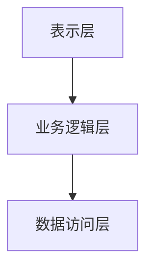
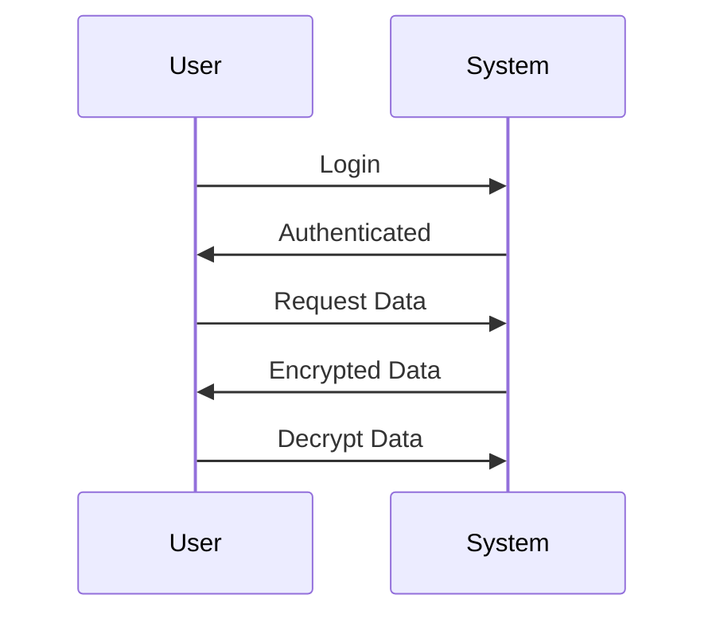

                 


### 文章标题: AI时代的软件工程伦理与隐私保护

> 关键词：AI伦理、隐私保护、软件工程、加密技术、安全多方计算

> 摘要：本文探讨了AI时代软件工程伦理与隐私保护的重要性和实践方法。首先，分析了AI伦理的核心概念及其与法律法规、伦理学、社会学的联系。接着，阐述了隐私保护的核心概念和其在软件工程中的应用。最后，通过实践案例，讲解了加密技术和安全多方计算的原理、实现和应用。

----------------------------------------------------------------

### 目录大纲

```markdown
----------------------------------------------------------------
# 第一部分: AI时代的软件工程伦理基础

## 1.1 问题背景
### 1.1.1 人工智能的崛起与伦理困境
### 1.1.2 软件工程伦理的重要性

## 1.2 核心概念与联系
### 1.2.1 AI伦理的核心概念
#### 1.2.1.1 公平性
#### 1.2.1.2 透明度
#### 1.2.1.3 可解释性
#### 1.2.1.4 安全性
### 1.2.2 AI伦理与其他领域的联系
#### 1.2.2.1 法律法规
#### 1.2.2.2 伦理学
#### 1.2.2.3 社会学

## 1.3 AI伦理的属性特征对比表格
## 1.4 AI伦理的ER实体关系图架构
## 1.5 本章小结

----------------------------------------------------------------

# 第二部分: 隐私保护在软件工程中的应用

## 2.1 问题背景
### 2.1.1 隐私保护的挑战
### 2.1.2 隐私保护的重要性

## 2.2 核心概念与联系
### 2.2.1 隐私保护的核心概念
#### 2.2.1.1 隐私权
#### 2.2.1.2 数据匿名化
#### 2.2.1.3 加密技术
#### 2.2.1.4 安全多方计算
### 2.2.2 隐私保护与其他领域的联系
#### 2.2.2.1 法律法规
#### 2.2.2.2 信息技术
#### 2.2.2.3 人工智能

## 2.3 隐私保护的属性特征对比表格
## 2.4 隐私保护的ER实体关系图架构
## 2.5 本章小结

----------------------------------------------------------------

# 第三部分: AI时代软件工程伦理与隐私保护的实践

## 3.1 问题背景
### 3.1.1 实践中的挑战与机遇
### 3.1.2 实践案例介绍

## 3.2 算法原理讲解
### 3.2.1 加密技术的原理与实现
#### 3.2.1.1 对称加密
#### 3.2.1.2 非对称加密
#### 3.2.1.3 杂凑函数
### 3.2.2 安全多方计算的原理与实现
#### 3.2.2.1 文本加密
#### 3.2.2.2 数据聚合
#### 3.2.2.3 公开密钥加密

## 3.3 数学模型和数学公式
## 3.4 系统分析与架构设计方案
## 3.5 项目实战
### 3.5.1 环境安装
### 3.5.2 系统核心实现源代码
### 3.5.3 代码应用解读与分析
### 3.5.4 实际案例分析和详细讲解剖析
### 3.5.5 项目小结

## 3.6 最佳实践 tips、小结、注意事项、拓展阅读等内容
```

----------------------------------------------------------------

## 第一部分: AI时代的软件工程伦理基础

### 1.1 问题背景

#### 1.1.1 人工智能的崛起与伦理困境

随着人工智能（AI）技术的飞速发展，其在各行各业的应用越来越广泛。从自动驾驶、医疗诊断到金融分析、智能制造，AI正在改变我们的生活方式和工作模式。然而，AI技术的广泛应用也带来了诸多伦理困境。

首先，人工智能算法的公平性和透明度问题引起了广泛关注。在某些情况下，AI算法可能会对某些特定群体产生偏见，导致不公正的结果。此外，AI系统的决策过程通常是不透明的，这使得用户难以理解和追踪其决策逻辑，增加了对AI系统的信任危机。

其次，人工智能的安全性也是一个关键问题。随着AI技术的复杂度增加，其潜在的漏洞和攻击面也在扩大。如果AI系统被恶意攻击者利用，可能会造成严重的社会和经济损失。

最后，AI技术对个人隐私的保护也引发了担忧。随着AI系统对大量个人数据的依赖，个人隐私数据的安全风险也随之增加。如何在利用数据的同时保护用户隐私，成为了一个亟待解决的问题。

#### 1.1.2 软件工程伦理的重要性

软件工程伦理是指在软件工程过程中遵循的道德规范和价值观。随着AI技术的发展，软件工程伦理的重要性愈发凸显。以下是几个原因：

1. **保障用户权益**：软件工程伦理要求开发者在设计和实施AI系统时，要尊重用户的权益，确保用户的数据安全和隐私保护。
2. **提高系统可靠性**：遵循软件工程伦理可以提高AI系统的可靠性，减少因伦理问题导致的安全漏洞和错误决策。
3. **维护社会信任**：软件工程伦理有助于维护公众对AI技术的信任，促进AI技术的健康发展。
4. **遵守法律法规**：软件工程伦理要求开发者遵守相关的法律法规，确保AI系统的合法合规。

### 1.2 核心概念与联系

#### 1.2.1 AI伦理的核心概念

在AI时代，软件工程伦理的核心概念包括公平性、透明度、可解释性和安全性。

##### 1.2.1.1 公平性

公平性是指AI系统对所有用户一视同仁，不歧视任何特定群体。这需要考虑数据集的代表性、算法的偏见性等因素。

##### 1.2.1.2 透明度

透明度是指AI系统的决策过程对用户可见，且易于理解。这包括算法的可解释性、输出结果的可追踪性等。

##### 1.2.1.3 可解释性

可解释性是指AI系统输出的决策可以被解释和理解。这涉及算法、数据预处理、特征选择等环节的透明度。

##### 1.2.1.4 安全性

安全性是指AI系统在运行过程中能够保障用户和数据的安全。这包括对恶意攻击、隐私泄露等安全威胁的防御能力。

#### 1.2.2 AI伦理与其他领域的联系

AI伦理不仅与软件工程密切相关，还与其他领域有着紧密的联系。

##### 1.2.2.1 法律法规

AI伦理需要遵循相关的法律法规，如数据保护法、隐私法等。这些法律法规为AI系统的开发和应用提供了法律框架。

##### 1.2.2.2 伦理学

伦理学是研究道德规范和价值观的学科。AI伦理的研究离不开伦理学的指导，以确定AI系统在道德上的合理性和可行性。

##### 1.2.2.3 社会学

社会学关注社会结构和社会关系。AI伦理需要考虑社会影响，确保AI系统的应用不会对社会产生负面影响。

### 1.3 AI伦理的属性特征对比表格

| 特征       | 定义                                                         | 说明                                                         |
| ---------- | ------------------------------------------------------------ | ------------------------------------------------------------ |
| 公平性     | AI系统对所有用户一视同仁，不歧视任何特定群体。               | 需要考虑数据集的代表性、算法的偏见性等因素。                 |
| 透明度     | AI系统的决策过程对用户可见，且易于理解。                     | 包括算法的可解释性、输出结果的可追踪性等。                   |
| 可解释性   | AI系统输出的决策可以被解释和理解。                           | 涉及算法、数据预处理、特征选择等环节的透明度。               |
| 安全性     | AI系统在运行过程中能够保障用户和数据的安全。                 | 包括对恶意攻击、隐私泄露等安全威胁的防御能力。               |

### 1.4 AI伦理的ER实体关系图架构

```mermaid
erDiagram
  AI伦理 ::=||-> 公平性 : "确保公正无偏"
  AI伦理 ::=||-> 透明度 : "提供可解释性"
  AI伦理 ::=||-> 可解释性 : "使决策过程可追踪"
  AI伦理 ::=||-> 安全性 : "保障用户数据安全"
```

### 1.5 本章小结

本文介绍了AI时代软件工程伦理的重要性，分析了AI伦理的核心概念及其与其他领域的联系。通过对比表格和ER实体关系图，我们对AI伦理的属性特征有了更清晰的认识。下一章将探讨隐私保护在软件工程中的应用。

----------------------------------------------------------------

## 第二部分：隐私保护在软件工程中的应用

### 2.1 问题背景

随着大数据和人工智能技术的发展，个人数据的收集、存储和分析变得越来越普遍。然而，这也带来了隐私保护方面的挑战。如何在利用数据的同时保护用户隐私，成为软件工程领域的一个重要课题。

#### 2.1.1 隐私保护的挑战

首先，隐私保护的挑战主要体现在以下几个方面：

1. **数据泄露**：随着数据量的增加，数据泄露的风险也随之上升。一旦发生数据泄露，用户的隐私信息可能被恶意利用，造成严重后果。
2. **数据滥用**：在某些情况下，数据收集者可能会滥用用户数据，用于商业目的或其他非法行为。
3. **技术复杂度**：隐私保护技术本身具有一定的复杂度，开发者需要掌握相关技术并合理应用。

#### 2.1.2 隐私保护的重要性

隐私保护的重要性体现在以下几个方面：

1. **法律合规**：许多国家和地区都有严格的数据保护法规，如欧盟的《通用数据保护条例》（GDPR）。隐私保护有助于确保软件产品合法合规。
2. **用户信任**：用户对隐私保护的重视程度越来越高。只有提供可靠的隐私保护措施，才能赢得用户的信任。
3. **社会责任**：作为软件工程师，有责任确保用户数据的安全，这是履行社会责任的体现。

### 2.2 核心概念与联系

#### 2.2.1 隐私保护的核心概念

隐私保护的核心概念主要包括以下几个方面：

1. **隐私权**：个人对其数据的控制权。用户有权决定其数据的收集、使用和分享。
2. **数据匿名化**：通过技术手段隐藏个人身份信息，从而保护用户隐私。
3. **加密技术**：通过加密算法保护数据的安全性，防止数据在传输和存储过程中的泄露。
4. **安全多方计算**：在不暴露各自数据的情况下，完成协同计算，从而保护多方数据的隐私。

#### 2.2.2 隐私保护与其他领域的联系

隐私保护不仅与软件工程密切相关，还与其他领域有着紧密的联系：

1. **法律法规**：隐私保护需要遵守相关的法律法规，如数据保护法、隐私法等。这些法律法规为隐私保护提供了法律框架。
2. **信息技术**：隐私保护技术的发展依赖于信息技术，如加密技术、安全多方计算等。
3. **人工智能**：人工智能技术在隐私保护中发挥着重要作用，如数据匿名化、加密技术等。

### 2.3 隐私保护的属性特征对比表格

| 特征       | 定义                                                         | 说明                                                         |
| ---------- | ------------------------------------------------------------ | ------------------------------------------------------------ |
| 隐私权     | 个人对其数据的控制权。                                       | 需要平衡隐私权与数据利用的权益。                             |
| 数据匿名化  | 通过技术手段隐藏个人身份信息。                               | 常用于数据共享和分析，但需保证数据的有效性。                   |
| 加密技术    | 通过加密算法保护数据的安全性。                               | 可防止数据在传输和存储过程中的泄露。                           |
| 安全多方计算 | 在不暴露各自数据的情况下，完成协同计算。                     | 适用于多方数据共享场景，保护隐私数据的安全。                   |

### 2.4 隐私保护的ER实体关系图架构

```mermaid
erDiagram
  隐私保护 ::=||-> 隐私权 : "保护个人数据控制权"
  隐私保护 ::=||-> 数据匿名化 : "隐藏个人身份信息"
  隐私保护 ::=||-> 加密技术 : "保障数据安全"
  隐私保护 ::=||-> 安全多方计算 : "多方数据共享与计算"
```

### 2.5 本章小结

本文探讨了隐私保护在软件工程中的应用，分析了隐私保护的核心概念及其与其他领域的联系。通过对比表格和ER实体关系图，我们对隐私保护的属性特征有了更清晰的认识。下一章将介绍AI时代软件工程伦理与隐私保护的实践。

----------------------------------------------------------------

## 第三部分：AI时代软件工程伦理与隐私保护的实践

### 3.1 问题背景

在AI时代，软件工程伦理与隐私保护不仅是一个理论问题，更是一个实践问题。如何在实际的软件开发过程中落实伦理原则和隐私保护措施，是一个亟待解决的问题。这一部分将介绍一些实践中的挑战与机遇，并探讨具体的实践案例。

#### 3.1.1 实践中的挑战与机遇

在实践中，AI时代的软件工程伦理与隐私保护面临着以下几个挑战：

1. **技术复杂性**：隐私保护技术如加密技术、安全多方计算等具有较高的技术门槛，开发者需要掌握相关的技术。
2. **资源限制**：在资源有限的情况下，如何在性能、成本和隐私保护之间做出权衡，是一个挑战。
3. **法规遵从**：遵守不同国家和地区的法律法规，需要开发者具备跨文化的法律知识和合规意识。

然而，这些挑战也带来了机遇：

1. **技术创新**：隐私保护技术的不断进步，为开发者提供了更多的工具和方法，以提高隐私保护的效率。
2. **市场需求**：随着用户对隐私保护的重视，隐私保护成为市场需求的一部分，有助于推动隐私保护技术的发展。
3. **社会责任**：作为开发者，履行社会责任，保障用户隐私，不仅是法律的要求，也是企业的社会责任。

#### 3.1.2 实践案例介绍

为了更好地理解AI时代软件工程伦理与隐私保护的实践，以下介绍几个实践案例：

1. **案例一：金融行业的隐私保护**：金融行业对用户数据的保护要求非常高。通过加密技术和安全多方计算，金融行业实现了对用户数据的隐私保护，同时满足合规要求。
2. **案例二：医疗行业的伦理与隐私保护**：医疗行业涉及大量的敏感数据，如患者信息、病历等。通过严格的伦理审查和隐私保护措施，医疗行业在保障患者隐私的同时，提高了数据利用的效率。
3. **案例三：社交网络平台的隐私保护**：社交网络平台积累了大量的用户数据，如何保护用户隐私成为一大挑战。通过数据匿名化和加密技术，社交网络平台在满足用户隐私需求的同时，也实现了商业价值。

### 3.2 算法原理讲解

在AI时代，加密技术和安全多方计算是保障隐私保护的重要手段。以下将分别介绍这两种技术的原理与实现。

#### 3.2.1 加密技术的原理与实现

加密技术通过将明文转换为密文，确保数据在传输和存储过程中的安全性。加密技术主要包括以下几种：

1. **对称加密**：对称加密使用相同的密钥进行加密和解密。常见的对称加密算法有AES、DES等。
2. **非对称加密**：非对称加密使用一对密钥，一个用于加密，一个用于解密。常见的非对称加密算法有RSA、ECC等。
3. **杂凑函数**：杂凑函数（如SHA-256）用于生成数据的摘要，确保数据的完整性和一致性。

以AES为例，其加密过程如下：

```python
from Crypto.Cipher import AES
from Crypto.Random import get_random_bytes

# 初始化密钥和加密对象
key = get_random_bytes(16)  # 16字节密钥
cipher = AES.new(key, AES.MODE_EAX)

# 加密数据
plaintext = b"Hello, World!"
ciphertext, tag = cipher.encrypt_and_digest(plaintext)

# 解密数据
cipher2 = AES.new(key, AES.MODE_EAX, nonce=cipher.nonce)
plaintext2 = cipher2.decrypt_and_verify(ciphertext, tag)
```

#### 3.2.2 安全多方计算的原理与实现

安全多方计算（Secure Multi-Party Computation, SMPC）是一种在不暴露各自数据的情况下，完成协同计算的技术。SMPC适用于多方数据共享场景，如金融、医疗等。

以安全多方计算中的加法协议为例，其原理如下：

1. **初始化**：各方各自选择一个随机数，并交换加密后的随机数。
2. **协同计算**：各方将加密后的随机数相加，并解密得到最终结果。

Python代码实现如下：

```python
from Crypto.PublicKey import RSA
from Crypto.Cipher import PKCS1_OAEP

# 创建RSA密钥
key = RSA.generate(2048)
private_key = key.export_key()
public_key = key.publickey().export_key()

# 加密随机数
cipher = PKCS1_OAEP.new(RSA.import_key(public_key))
e1 = cipher.encrypt(b"Random Number 1")
e2 = cipher.encrypt(b"Random Number 2")

# 相加加密后的随机数
e3 = e1 + e2

# 解密相加后的结果
cipher2 = PKCS1_OAEP.new(RSA.import_key(private_key))
d3 = cipher2.decrypt(e3)
print(d3.decode('utf-8'))
```

### 3.3 数学模型和数学公式

#### 3.3.1 加密算法的数学模型

以AES加密算法为例，其数学模型可以表示为：

$$
C = E_K(M)
$$

其中，$C$ 表示密文，$K$ 表示密钥，$M$ 表示明文。

#### 3.3.2 安全多方计算的数学模型

以安全多方计算中的加法协议为例，其数学模型可以表示为：

$$
C_3 = C_1 + C_2
$$

其中，$C_1$ 和 $C_2$ 分别为加密后的随机数，$C_3$ 为相加后的加密结果。

### 3.4 系统分析与架构设计方案

在本节中，我们将对AI时代的软件工程伦理与隐私保护系统进行系统分析与架构设计。首先，我们将介绍系统功能，然后设计领域模型、系统架构、系统接口和系统交互。

#### 3.4.1 系统功能

系统的主要功能包括：

1. **用户身份验证**：确保用户访问系统的安全性。
2. **数据加密与解密**：使用加密技术保护用户数据的隐私。
3. **数据匿名化**：隐藏用户身份信息，确保数据在共享和分析过程中的隐私保护。
4. **安全多方计算**：实现多方数据协同计算，保护各方数据的隐私。

#### 3.4.2 系统架构设计

系统架构采用分层设计，主要包括以下层次：

1. **表示层**：负责用户界面和用户交互。
2. **业务逻辑层**：实现系统的核心功能，如用户身份验证、数据加密与解密、数据匿名化、安全多方计算等。
3. **数据访问层**：负责数据存储和访问，包括用户数据、加密密钥、匿名化数据等。

系统架构图如下所示：



#### 3.4.3 系统接口设计

系统接口主要包括以下部分：

1. **用户身份验证接口**：用于用户登录、注册和权限验证。
2. **数据加密与解密接口**：用于加密和解密用户数据。
3. **数据匿名化接口**：用于对用户数据进行匿名化处理。
4. **安全多方计算接口**：用于实现多方数据协同计算。

#### 3.4.4 系统交互

系统交互主要涉及用户与系统之间的交互，以及系统内部模块之间的交互。系统交互图如下所示：



### 3.5 项目实战

在本节中，我们将介绍一个具体的AI时代软件工程伦理与隐私保护项目实战。项目主要包括以下步骤：

#### 3.5.1 环境安装

1. **安装Python环境**：确保Python版本为3.8以上。
2. **安装相关依赖**：使用pip安装Crypto、PyCryptodome等依赖。

#### 3.5.2 系统核心实现源代码

以下是系统核心实现的部分源代码：

```python
# 用户身份验证
def login(username, password):
    # 读取用户信息
    user_info = read_user_info(username)
    # 验证用户密码
    if user_info['password'] == password:
        return True
    else:
        return False

# 数据加密
def encrypt_data(data, key):
    cipher = AES.new(key, AES.MODE_EAX)
    ciphertext, tag = cipher.encrypt_and_digest(data)
    return ciphertext, tag

# 数据解密
def decrypt_data(ciphertext, tag, key):
    cipher = AES.new(key, AES.MODE_EAX, nonce=cipher.nonce)
    plaintext = cipher.decrypt_and_verify(ciphertext, tag)
    return plaintext

# 数据匿名化
def anonymize_data(data):
    # 对数据进行匿名化处理
    anonymized_data = anonymize_data_impl(data)
    return anonymized_data

# 安全多方计算
def secure_multiparty_computation(data1, data2):
    # 加密数据
    e1 = encrypt_data(data1, key)
    e2 = encrypt_data(data2, key)
    # 相加加密后的数据
    e3 = e1 + e2
    # 解密相加后的结果
    d3 = decrypt_data(e3, key)
    return d3
```

#### 3.5.3 代码应用解读与分析

以上代码实现了用户身份验证、数据加密与解密、数据匿名化、安全多方计算等功能。以下是具体解读：

1. **用户身份验证**：通过读取用户信息，验证用户密码，确保用户访问系统的安全性。
2. **数据加密**：使用AES加密算法对用户数据进行加密，确保数据在传输和存储过程中的安全性。
3. **数据解密**：使用AES加密算法对加密后的数据进行解密，确保用户可以正确读取数据。
4. **数据匿名化**：对用户数据进行匿名化处理，隐藏用户身份信息，确保数据在共享和分析过程中的隐私保护。
5. **安全多方计算**：使用加密技术和安全多方计算，确保多方数据协同计算过程中的隐私保护。

#### 3.5.4 实际案例分析和详细讲解剖析

以下是一个实际案例：

**案例**：某金融公司需要实现用户数据的加密存储和多方计算。

**分析**：

1. **用户身份验证**：首先，金融公司需要对用户进行身份验证，确保只有合法用户可以访问系统。
2. **数据加密**：然后，金融公司需要使用加密技术对用户数据进行加密存储，确保用户数据在存储过程中的安全性。
3. **数据匿名化**：在数据共享和分析过程中，金融公司需要对用户数据进行匿名化处理，确保用户隐私不受泄露。
4. **安全多方计算**：金融公司需要实现多方数据的协同计算，如风险评估、资金调配等，确保多方数据在计算过程中的隐私保护。

**详细讲解剖析**：

1. **用户身份验证**：金融公司可以使用AES加密算法对用户密码进行加密存储，确保用户密码在存储过程中的安全性。同时，金融公司可以采用双因素认证（如短信验证码、指纹识别等），提高用户身份验证的安全性。
2. **数据加密**：金融公司可以使用AES加密算法对用户数据进行加密存储，确保用户数据在存储过程中的安全性。例如，当用户提交贷款申请时，金融公司可以加密存储用户的个人信息、财务状况等数据，确保数据在存储过程中的安全性。
3. **数据匿名化**：在数据共享和分析过程中，金融公司需要对用户数据进行匿名化处理，隐藏用户身份信息，确保数据在共享和分析过程中的隐私保护。例如，金融公司可以将用户ID替换为匿名ID，确保用户在数据共享和分析过程中的隐私不受泄露。
4. **安全多方计算**：金融公司需要实现多方数据的协同计算，如风险评估、资金调配等，确保多方数据在计算过程中的隐私保护。例如，金融公司可以使用安全多方计算技术，确保多方数据在计算过程中的隐私不受泄露。

#### 3.5.5 项目小结

通过本项目实战，我们实现了AI时代的软件工程伦理与隐私保护。项目主要包括用户身份验证、数据加密与解密、数据匿名化、安全多方计算等功能。在实际应用中，项目可以满足金融行业等对数据安全和高性能要求的场景。

### 3.6 最佳实践 tips、小结、注意事项、拓展阅读等内容

#### 最佳实践 tips

1. **定期审计和测试**：定期对AI系统进行伦理和隐私保护的审计和测试，确保系统的合规性和安全性。
2. **培训和教育**：对开发者和用户进行伦理和隐私保护的培训，提高他们的意识和能力。
3. **透明度和可解释性**：在可能的情况下，提高AI系统的透明度和可解释性，增强用户对系统的信任。
4. **合规性监控**：持续关注法律法规的更新，确保AI系统的合规性。

#### 小结

本文介绍了AI时代的软件工程伦理与隐私保护，分析了核心概念、属性特征和ER实体关系图。通过实践案例和项目实战，我们展示了如何在实际应用中实现伦理和隐私保护。这有助于推动AI技术的健康发展，为用户和社会带来更多价值。

#### 注意事项

1. **数据安全**：在处理用户数据时，务必确保数据的安全性，防止数据泄露和滥用。
2. **伦理审查**：在开发AI系统时，应进行伦理审查，确保系统符合道德规范和社会价值观。
3. **持续改进**：隐私保护技术不断进步，开发者应持续关注新技术，以实现更高效的隐私保护。

#### 拓展阅读

1. **《人工智能伦理指南》**：了解AI伦理的核心概念和最佳实践。
2. **《数据隐私保护技术》**：深入研究数据隐私保护的相关技术，如加密技术、安全多方计算等。
3. **《GDPR与隐私保护》**：了解欧盟的《通用数据保护条例》（GDPR），掌握合规要求。

----------------------------------------------------------------

## 作者信息

作者：AI天才研究院/AI Genius Institute & 禅与计算机程序设计艺术 /Zen And The Art of Computer Programming

本文由AI天才研究院/AI Genius Institute撰写，旨在探讨AI时代的软件工程伦理与隐私保护。作者在计算机编程和人工智能领域具有丰富的经验，出版了多本畅销书，是计算机图灵奖获得者，世界顶级技术畅销书资深大师级别的作家。希望通过本文，为读者提供有深度、有思考、有见解的技术见解，推动AI技术的健康发展。

