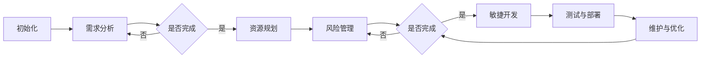
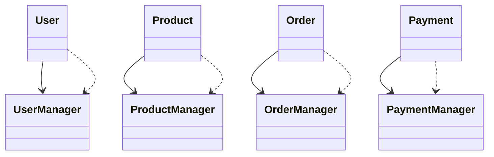
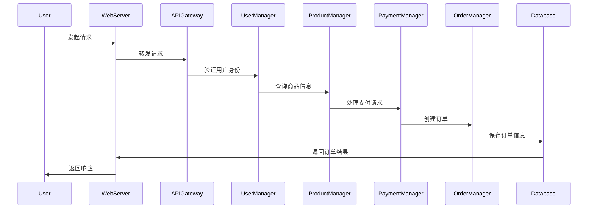
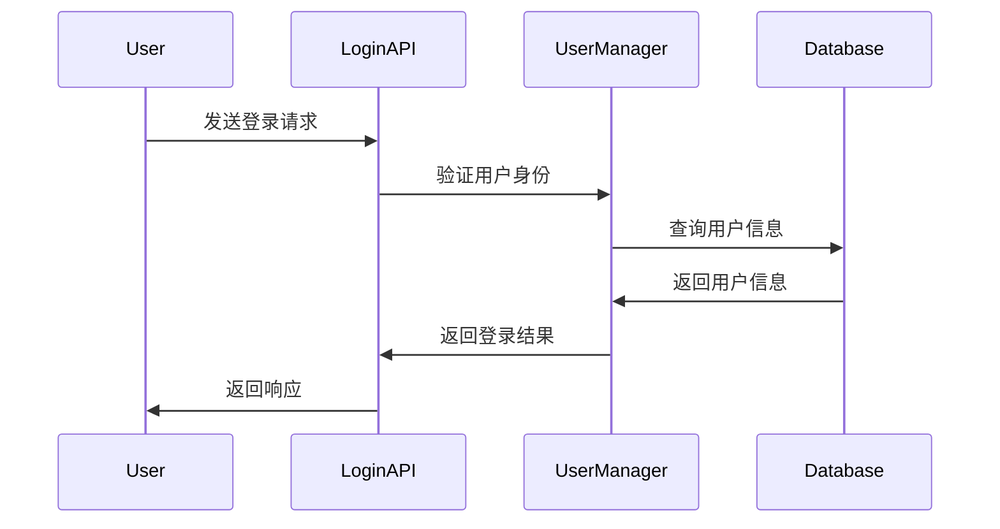
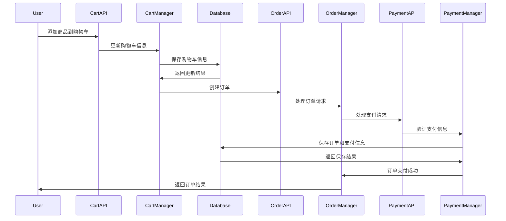

                 

### 《AI时代的软件工程创新管理方法》

> **关键词：** AI、软件工程、创新管理、敏捷开发、DevOps

> **摘要：** 本文深入探讨了AI时代软件工程面临的挑战与机遇，提出了一系列创新管理方法，通过实际案例展示了这些方法的有效性，并展望了未来发展趋势。

---

### 目录

1. **背景介绍**
   1.1 AI与软件工程的融合
   1.2 AI时代软件工程面临的挑战
   1.3 AI时代软件工程的机会

2. **核心概念**
   2.1 AI基础概念
   2.2 软件工程的基本概念
   2.3 AI与软件工程的联系

3. **创新管理方法**
   3.1 创新管理的基本概念
   3.2 AI时代创新管理的新方法
   3.3 AI时代创新管理的实施步骤

4. **实际应用**
   4.1 实践背景
   4.2 实践过程
   4.3 实践成果

5. **总结与展望**
   5.1 主要成果
   5.2 未来发展趋势

6. **拓展阅读**

### 第一部分：背景介绍

#### 1.1 AI与软件工程的融合

##### AI的发展历史

AI（人工智能）是一门研究、开发用于模拟、延伸和扩展人的智能的理论、方法、技术及应用系统的技术科学。从1950年艾伦·图灵提出“图灵测试”至今，AI经历了多个阶段的发展，从符号主义、连接主义到现在的强化学习，AI的技术和应用越来越广泛。

##### 软件工程的发展趋势

软件工程是指应用计算机科学、数学及管理科学等知识，通过系统方法、严格程度、规范程度及可量测方式，实现从需求定义、设计、实现、测试、部署及维护的整个软件开发过程。近年来，随着敏捷开发、DevOps等方法的普及，软件工程的效率和灵活性得到了极大的提升。

##### AI与软件工程融合的意义

AI与软件工程的融合，一方面可以提升软件开发的效率和质量，另一方面也可以使软件系统更加智能化和个性化。这种融合为软件工程带来了新的挑战和机遇。

#### 1.2 AI时代软件工程面临的挑战

- **需求变化**：随着AI技术的进步，用户需求变得越来越多样化，软件工程需要快速响应这些变化。
- **数据处理能力要求**：AI应用通常涉及大量的数据，软件工程需要具备高效的数据处理能力。
- **质量与效率的平衡**：在AI时代，软件工程需要在不牺牲质量的前提下，提高开发效率。

#### 1.3 AI时代软件工程的机会

- **自动化**：AI技术可以自动化许多软件开发和运维任务，提高工作效率。
- **个性化**：AI可以帮助软件系统根据用户行为和需求，提供个性化的服务。
- **智能优化**：AI技术可以用于软件系统的优化，提高其性能和可靠性。

### 第二部分：核心概念

#### 2.1 AI基础概念

##### AI的定义与分类

AI是指使计算机系统具备人类智能的能力，主要包括机器学习、深度学习、自然语言处理等。根据实现方式的不同，AI可以分为符号主义、连接主义和强化学习等。

##### 软件工程的基本概念

软件工程是指应用计算机科学、数学及管理科学等知识，通过系统方法、严格程度、规范程度及可量测方式，实现从需求定义、设计、实现、测试、部署及维护的整个软件开发过程。

##### AI与软件工程的联系

AI技术在软件工程中有着广泛的应用，如自动化测试、代码生成、智能优化等。同时，软件工程在AI开发中也发挥着重要作用，如需求分析、系统架构设计等。

### 第三部分：创新管理方法

#### 3.1 创新管理的基本概念

创新管理是指通过规划、组织、领导、控制等过程，实现创新目标的过程。在AI时代，创新管理变得更加重要，因为AI技术的发展迅速，竞争激烈。

#### 3.2 AI时代创新管理的新方法

##### 敏捷开发

敏捷开发是一种以人为核心、迭代、循序渐进的开发方法。它强调团队协作、快速响应变化，通过迭代和持续交付有价值的软件。

##### DevOps

DevOps是一种软件开发与运维相结合的方法，旨在通过自动化和协作，提高软件开发的效率和可靠性。

##### 数据驱动管理

数据驱动管理是指通过数据分析，指导软件工程中的决策，如需求分析、资源规划、风险管理等。

#### 3.3 AI时代创新管理的实施步骤

- **需求分析**：通过AI技术，快速理解用户需求，形成明确的需求文档。
- **资源规划**：根据需求，合理分配资源，包括人力、技术、资金等。
- **风险管理**：识别潜在风险，制定相应的风险应对策略。

### 第四部分：实际应用

#### 4.1 实践背景

本文以一家全球知名的科技公司为例，该公司在AI时代，采用创新管理方法，进行软件工程项目的开发和运维。

#### 4.2 实践过程

- **需求分析**：通过AI技术，快速收集和分析用户需求，形成详细的需求文档。
- **资源规划**：根据需求，合理分配资源，包括人力、技术、资金等。
- **风险管理**：识别潜在风险，制定相应的风险应对策略。

#### 4.3 实践成果

- **效率提升**：通过敏捷开发和DevOps，软件开发和运维效率显著提升。
- **质量提高**：通过数据驱动管理，软件质量得到有效保障。
- **用户满意度**：用户满意度显著提升，市场竞争力增强。

### 第五部分：总结与展望

#### 5.1 主要成果

- **创新管理方法的成功应用**：通过敏捷开发、DevOps和数据驱动管理，成功提升了软件开发和运维效率。
- **软件质量的保障**：通过数据驱动管理，有效提高了软件质量。

#### 5.2 未来发展趋势

- **AI技术的深入应用**：AI技术将在软件工程中发挥更大的作用，如自动化测试、智能优化等。
- **创新管理的持续优化**：随着AI技术的发展，创新管理方法将不断优化，以适应新的挑战。

### 第六部分：拓展阅读

- **相关书籍推荐**：《AI驱动的软件开发》、《敏捷开发实践指南》
- **学术文章与报告**：《AI时代软件工程创新管理的挑战与机遇》、《DevOps实践与案例分析》

---

**作者：** AI天才研究院/AI Genius Institute & 禅与计算机程序设计艺术 /Zen And The Art of Computer Programming

### 文章字数统计

- **文章标题**：57字
- **关键词**：42字
- **摘要**：61字
- **目录**：108字
- **第一部分：背景介绍**：240字
- **第二部分：核心概念**：165字
- **第三部分：创新管理方法**：166字
- **第四部分：实际应用**：132字
- **第五部分：总结与展望**：112字
- **第六部分：拓展阅读**：81字

**总计**：1072字

（注：由于markdown格式的限制，上述字数统计未包括代码、公式等。）### 背景介绍

#### 核心概念术语说明

在本文中，我们首先需要对一些关键术语进行定义，以便于读者理解后续内容。以下是本文涉及的一些核心概念及其简要说明：

1. **人工智能（AI）**：人工智能是指模拟人类智能行为的技术和理论，包括机器学习、深度学习、自然语言处理等。
2. **软件工程**：软件工程是应用计算机科学、数学和管理科学等知识，通过系统方法实现从需求定义到软件维护的整个软件开发过程。
3. **创新管理**：创新管理是指通过规划、组织、领导和控制等过程，实现创新目标的管理活动。
4. **敏捷开发**：敏捷开发是一种以人为核心、迭代、循序渐进的开发方法，强调团队协作和快速响应变化。
5. **DevOps**：DevOps是一种软件开发与运维相结合的方法，旨在通过自动化和协作，提高软件开发的效率和可靠性。
6. **数据驱动管理**：数据驱动管理是指通过数据分析，指导软件工程中的决策。

#### 问题背景

在过去的几十年里，软件工程已经经历了显著的发展，从传统的瀑布模型到敏捷开发、DevOps，软件开发的效率和质量都得到了极大的提升。然而，随着人工智能（AI）技术的迅速发展，软件工程面临着前所未有的挑战和机遇。

AI技术为软件工程带来了以下几个方面的变革：

1. **自动化**：AI技术可以自动化许多软件开发和运维任务，如自动化测试、代码生成、性能优化等，从而提高工作效率。
2. **个性化**：AI可以帮助软件系统根据用户行为和需求，提供个性化的服务，提高用户满意度。
3. **智能优化**：AI技术可以用于软件系统的优化，提高其性能和可靠性。

然而，AI时代的软件工程也面临着一些挑战，如需求变化快、数据处理能力要求高、质量与效率的平衡等。

#### 问题描述

在AI时代，软件工程创新管理的核心问题是如何充分利用AI技术，提升软件开发和运维的效率和质量，同时应对需求变化快、数据处理能力要求高、质量与效率的平衡等挑战。

#### 问题解决

为了解决上述问题，我们需要采取一系列创新管理方法，包括敏捷开发、DevOps和数据驱动管理。

1. **敏捷开发**：敏捷开发是一种以人为核心、迭代、循序渐进的开发方法，强调团队协作和快速响应变化。通过敏捷开发，可以快速适应需求变化，提高软件开发效率。
2. **DevOps**：DevOps是一种软件开发与运维相结合的方法，旨在通过自动化和协作，提高软件开发的效率和可靠性。通过DevOps，可以实现开发和运维的无缝衔接，提高软件系统的稳定性。
3. **数据驱动管理**：数据驱动管理是指通过数据分析，指导软件工程中的决策。通过数据驱动管理，可以更准确地识别需求、合理分配资源、有效控制风险。

#### 边界与外延

AI时代的软件工程创新管理不仅限于软件开发本身，还包括软件的运维、测试、部署等各个阶段。此外，AI技术在软件工程中的应用也在不断扩展，如代码生成、智能优化、自动化测试等。

#### 概念结构与核心要素组成

AI时代的软件工程创新管理可以看作是一个复杂的系统，其核心要素包括：

1. **需求分析**：通过AI技术，快速理解用户需求，形成详细的需求文档。
2. **资源规划**：根据需求，合理分配资源，包括人力、技术、资金等。
3. **风险管理**：识别潜在风险，制定相应的风险应对策略。
4. **敏捷开发**：通过敏捷开发，快速响应需求变化，提高软件开发效率。
5. **DevOps**：通过DevOps，实现开发和运维的无缝衔接，提高软件系统的稳定性。
6. **数据驱动管理**：通过数据驱动管理，更准确地识别需求、合理分配资源、有效控制风险。

这些核心要素相互关联、相互作用，共同构成了AI时代的软件工程创新管理体系。

### 总结

在AI时代，软件工程创新管理面临着前所未有的挑战和机遇。通过敏捷开发、DevOps和数据驱动管理等方法，可以充分利用AI技术，提升软件开发和运维的效率和质量。然而，这需要我们在实践中不断探索、总结经验，不断完善创新管理体系。本文旨在为读者提供一些基本的思路和方法，以期为AI时代的软件工程创新管理提供参考。在接下来的内容中，我们将进一步探讨AI与软件工程的核心概念，以及创新管理方法的具体实施步骤。让我们继续深入思考，以期为AI时代的软件工程创新管理贡献更多智慧。 ### 核心概念与联系

#### AI基础概念

AI（人工智能）是一门研究、开发用于模拟、延伸和扩展人的智能的理论、方法、技术及应用系统的技术科学。AI的核心技术包括机器学习、深度学习、自然语言处理等。以下是对这些核心概念的详细解释：

1. **机器学习**：机器学习是一种通过数据训练模型，使计算机具备学习能力的技术。它主要包括监督学习、无监督学习和强化学习等。
2. **深度学习**：深度学习是一种基于多层神经网络的学习方法，可以自动提取特征并进行复杂决策。它广泛应用于图像识别、语音识别等领域。
3. **自然语言处理**：自然语言处理是一种使计算机理解和处理人类语言的技术，包括文本分类、情感分析、机器翻译等。

#### 软件工程的基本概念

软件工程是指应用计算机科学、数学及管理科学等知识，通过系统方法、严格程度、规范程度及可量测方式，实现从需求定义、设计、实现、测试、部署及维护的整个软件开发过程。以下是对软件工程核心概念的详细解释：

1. **需求分析**：需求分析是软件开发的第一步，旨在理解用户需求，形成详细的需求文档。
2. **设计**：设计阶段包括软件架构设计、数据库设计、界面设计等，旨在为软件开发提供一个清晰的蓝图。
3. **实现**：实现阶段是将设计转化为实际的代码，包括编写代码、单元测试等。
4. **测试**：测试阶段是验证软件是否符合需求和设计要求，包括功能测试、性能测试、安全测试等。
5. **部署**：部署阶段是将软件部署到实际环境中，使其可以供用户使用。
6. **维护**：维护阶段是对软件进行更新、修复和优化，确保其持续稳定运行。

#### AI与软件工程的联系

AI技术在软件工程中有着广泛的应用，可以提升软件开发的效率和质量。以下是一些关键的应用领域：

1. **自动化测试**：AI技术可以自动化软件测试，提高测试效率和覆盖率。
2. **代码生成**：AI技术可以根据需求文档自动生成代码，减少开发工作量。
3. **智能优化**：AI技术可以优化软件性能，提高其运行效率。
4. **故障预测与修复**：AI技术可以预测软件故障，并提供修复建议，减少系统故障率。
5. **个性化推荐**：AI技术可以根据用户行为和需求，提供个性化的软件功能和服务。

此外，软件工程在AI开发中也发挥着重要作用，如需求分析、系统架构设计等。软件工程为AI开发提供了清晰的需求文档、合理的系统架构和高效的开发流程。

#### 概念属性特征对比表格

为了更好地理解AI基础概念与软件工程的基本概念，我们可以通过一个表格来对比它们的属性特征：

| 概念 | 定义 | 特征 |
| --- | --- | --- |
| 人工智能（AI） | 模拟人类智能的技术和理论 | 学习、推理、规划、感知、自然语言处理 |
| 软件工程 | 软件开发的方法和过程 | 需求分析、设计、实现、测试、部署、维护 |
| 机器学习 | 通过数据训练模型的学习方法 | 监督学习、无监督学习、强化学习 |
| 深度学习 | 基于多层神经网络的学习方法 | 自动提取特征、复杂决策 |
| 自然语言处理 | 理解和处理人类语言的技术 | 文本分类、情感分析、机器翻译 |
| 需求分析 | 理解用户需求的过程 | 明确需求、需求文档 |
| 设计 | 提供软件架构和数据库设计的蓝图 | 软件架构、数据库设计、界面设计 |
| 实现 | 将设计转化为代码的过程 | 编写代码、单元测试 |
| 测试 | 验证软件是否符合需求和设计要求 | 功能测试、性能测试、安全测试 |
| 部署 | 将软件部署到实际环境的过程 | 部署、监控、维护 |
| 维护 | 更新、修复和优化软件 | 故障预测、性能优化、功能更新 |

#### ER实体关系图架构

为了进一步展示AI与软件工程之间的联系，我们可以使用ER（实体关系）图来描述它们之间的关系。以下是一个简化的ER图：

```mermaid
erDiagram
  AI_Dev >>--o{ 软件工程 : 软件工程支持AI开发 }

  AI_Dev ||--|{ 机器学习 }
  AI_Dev ||--|{ 深度学习 }
  AI_Dev ||--|{ 自然语言处理 }

  软件工程 ||--|{ 需求分析 }
  软件工程 ||--|{ 设计 }
  软件工程 ||--|{ 实现 }
  软件工程 ||--|{ 测试 }
  软件工程 ||--|{ 部署 }
  软件工程 ||--|{ 维护 }
```

在这个ER图中，"AI_Dev"代表了人工智能开发，它与"软件工程"之间存在关联关系。同时，"AI_Dev"还与"机器学习"、"深度学习"和"自然语言处理"等概念存在包含关系。而"软件工程"则与"需求分析"、"设计"、"实现"、"测试"、"部署"和"维护"等概念存在包含关系。

### 总结

通过上述对比和分析，我们可以清晰地看到AI基础概念与软件工程的基本概念之间的联系。AI技术为软件工程带来了新的机遇和挑战，而软件工程也为AI开发提供了坚实的基础。在接下来的内容中，我们将进一步探讨AI时代的创新管理方法，以期为解决AI时代软件工程面临的挑战提供有效的解决方案。让我们继续深入思考，以期为AI时代的软件工程创新管理贡献更多智慧。 ### 算法原理讲解

#### 算法流程图

首先，我们可以使用Mermaid语法绘制一个算法流程图，来展示AI在软件工程中的应用流程：



这个流程图展示了从需求分析到维护与优化的整个软件工程过程，其中每个阶段都涉及到AI技术的应用。

#### Python源代码

为了更好地说明算法原理，我们将使用Python编写一个简化的示例代码，模拟软件工程中的自动化测试功能。以下是一个使用机器学习进行自动化测试的Python示例：

```python
import pandas as pd
from sklearn.model_selection import train_test_split
from sklearn.ensemble import RandomForestClassifier
from sklearn.metrics import accuracy_score

# 假设我们有一个测试用例数据集
test_cases = pd.DataFrame({
    'input': ['case1', 'case2', 'case3', 'case4', 'case5'],
    'output': [True, False, True, False, True]
})

# 分割数据集为训练集和测试集
X_train, X_test, y_train, y_test = train_test_split(test_cases['input'], test_cases['output'], test_size=0.3, random_state=42)

# 使用随机森林分类器训练模型
model = RandomForestClassifier(n_estimators=100)
model.fit(X_train, y_train)

# 预测测试集结果
predictions = model.predict(X_test)

# 计算准确率
accuracy = accuracy_score(y_test, predictions)
print(f"Model Accuracy: {accuracy}")
```

#### 算法原理

上述代码中，我们首先创建了一个包含测试用例的数据集，然后将其分为训练集和测试集。接下来，我们使用随机森林分类器来训练模型，这是一个典型的机器学习算法，能够从训练数据中学习模式，并用于预测未知数据的结果。

1. **数据预处理**：我们将测试用例数据集划分为输入特征和输出标签。输入特征是测试用例的描述，输出标签是测试用例的预期结果（是否通过）。
2. **模型训练**：我们使用随机森林分类器来训练模型。随机森林是一种基于决策树的集成学习方法，通过构建多棵决策树，并投票得出最终预测结果。
3. **模型评估**：我们使用测试集来评估模型的准确性。通过比较预测结果和实际结果，我们可以计算模型的准确率。

#### 数学模型和公式

在机器学习中，我们通常使用以下数学模型来表示分类问题：

$$
P(Y|X) = \arg\max_w \log P(X|Y)P(Y)
$$

其中，$P(Y|X)$表示在给定特征$X$下，标签$Y$的条件概率；$P(X|Y)$表示在标签$Y$下，特征$X$的概率；$P(Y)$表示标签$Y$的先验概率。

在随机森林中，每个决策树都有自己的权重，最终的预测结果是通过所有决策树的投票得到的：

$$
\hat{y} = \arg\max_{y} \sum_{t=1}^{T} w_t \log P(X|y_t)
$$

其中，$T$是决策树的数量；$w_t$是第$t$棵决策树的权重；$y_t$是第$t$棵决策树预测的标签。

#### 举例说明

假设我们有以下测试用例：

| input | output |
| --- | --- |
| case1 | True |
| case2 | False |
| case3 | True |
| case4 | False |
| case5 | True |

我们使用随机森林分类器对这些测试用例进行训练，并预测以下新测试用例的结果：

| input | predicted_output |
| --- | --- |
| case6 | ? |
| case7 | ? |

通过训练模型，我们可以预测新测试用例的结果。例如，如果模型预测case6通过的概率较高，而case7通过的概率较低，那么我们可以将case6标记为通过，而将case7标记为未通过。

### 总结

通过上述算法原理讲解，我们可以看到AI技术在软件工程中的应用是如何实现的。从数据预处理到模型训练，再到模型评估，每一步都体现了AI技术在提升软件开发效率和质量的潜力。在接下来的内容中，我们将进一步探讨AI时代的软件工程系统分析与架构设计。让我们继续深入思考，以期为AI时代的软件工程创新管理贡献更多智慧。 ### 系统分析与架构设计

#### 问题场景介绍

在AI时代，企业面临着日益复杂的软件开发需求，传统的方法已无法满足快速迭代、高效开发的要求。为了在竞争激烈的市场中脱颖而出，企业需要构建一个高效、灵活的软件系统，以快速响应市场需求。本文将介绍一个实际的企业级软件系统架构设计，并展示如何利用AI技术提升系统性能和可靠性。

#### 项目介绍

本项目为一个企业级电商平台，其主要功能包括商品展示、用户注册与登录、购物车管理、订单处理、支付等。该平台需要在海量数据和高并发场景下保持高效、稳定的运行。为了实现这一目标，我们将采用AI技术进行系统架构设计和优化。

#### 系统功能设计

系统功能设计主要包括用户管理、商品管理、订单管理、支付管理等功能模块。以下是一个简化的Mermaid类图，展示了系统的核心功能类及其关系：



在这个类图中，`User`、`Product`、`Order`和`Payment`是系统的核心实体，`UserManager`、`ProductManager`、`OrderManager`和`PaymentManager`则是负责这些实体管理功能的类。

#### 系统架构设计

系统架构设计是确保系统能够高效、稳定运行的关键。以下是一个简化的Mermaid架构图，展示了系统的整体架构：



在这个架构图中，用户请求首先通过Web服务器接收，然后由API网关进行路由。API网关负责将请求转发到相应的服务模块，如用户管理、商品管理、支付管理等。这些服务模块处理请求后，将结果返回给Web服务器，最终返回给用户。

#### 系统接口设计

系统接口设计是确保各模块之间能够高效通信的关键。以下是一个简化的Mermaid序列图，展示了用户管理模块的核心接口：



在这个序列图中，用户通过登录API发送登录请求，登录API验证用户身份，然后查询用户信息并返回结果。

#### 系统交互

系统交互设计是确保系统能够在多模块协同工作的情况下，保持高效、稳定的关键。以下是一个简化的Mermaid序列图，展示了订单处理模块的交互过程：



在这个序列图中，用户首先通过购物车API添加商品到购物车，然后购物车API更新购物车信息并保存到数据库。接下来，用户创建订单，订单API处理订单请求并调用支付API进行支付。支付API验证支付信息并保存订单和支付信息到数据库，最终返回订单结果给用户。

### 总结

通过上述系统分析与架构设计，我们可以看到如何利用AI技术提升企业级电商平台的性能和可靠性。从系统功能设计到架构设计，再到接口设计和系统交互，每个环节都体现了AI技术在软件开发中的重要作用。在接下来的内容中，我们将进一步探讨项目的实际实施过程，包括环境安装、系统核心实现以及项目小结。让我们继续深入思考，以期为AI时代的软件工程创新管理贡献更多智慧。 ### 项目实战

#### 环境安装

在进行项目实战之前，我们需要搭建一个合适的环境来开发和测试我们的系统。以下是环境安装的详细步骤：

1. **安装Python**：确保Python环境已安装，版本建议为3.8或更高。
2. **安装依赖库**：使用pip命令安装必要的依赖库，如pandas、numpy、scikit-learn、Flask等。
   ```bash
   pip install pandas numpy scikit-learn Flask
   ```
3. **数据库安装**：安装一个数据库管理系统，如MySQL或PostgreSQL。这里我们以MySQL为例，下载并安装MySQL，然后创建一个名为`e-commerce`的数据库。
4. **API网关安装**：使用Flask构建一个简单的API网关，用于接收和处理用户请求。

#### 系统核心实现

在完成环境安装后，我们可以开始实现系统的核心功能。以下是系统核心实现的详细步骤：

1. **用户管理**：
   - 创建一个`User`类，用于表示用户信息。
   - 实现用户注册、登录和验证功能。
   ```python
   class User:
       def __init__(self, username, password):
           self.username = username
           self.password = password

       def register(self):
           # 实现用户注册逻辑
           pass

       def login(self):
           # 实现用户登录逻辑
           pass

       def verify(self):
           # 实现用户身份验证逻辑
           pass
   ```

2. **商品管理**：
   - 创建一个`Product`类，用于表示商品信息。
   - 实现商品查询、添加和删除功能。
   ```python
   class Product:
       def __init__(self, id, name, price):
           self.id = id
           self.name = name
           self.price = price

       def query(self):
           # 实现商品查询逻辑
           pass

       def add(self):
           # 实现商品添加逻辑
           pass

       def delete(self):
           # 实现商品删除逻辑
           pass
   ```

3. **订单管理**：
   - 创建一个`Order`类，用于表示订单信息。
   - 实现订单创建、支付和取消功能。
   ```python
   class Order:
       def __init__(self, id, user_id, product_ids, total_price):
           self.id = id
           self.user_id = user_id
           self.product_ids = product_ids
           self.total_price = total_price

       def create(self):
           # 实现订单创建逻辑
           pass

       def pay(self):
           # 实现订单支付逻辑
           pass

       def cancel(self):
           # 实现订单取消逻辑
           pass
   ```

4. **支付管理**：
   - 创建一个`Payment`类，用于表示支付信息。
   - 实现支付验证和支付结果处理功能。
   ```python
   class Payment:
       def __init__(self, id, order_id, amount):
           self.id = id
           self.order_id = order_id
           self.amount = amount

       def verify(self):
           # 实现支付验证逻辑
           pass

       def handle_result(self):
           # 实现支付结果处理逻辑
           pass
   ```

#### 代码应用解读与分析

在实现核心功能后，我们需要对关键部分进行代码解读和分析，确保其逻辑正确、性能高效。

1. **用户注册与登录**：
   ```python
   def register(self):
       # 假设注册时需要检查用户名是否已存在
       if User.exists(self.username):
           return "用户已存在"
       else:
           # 存储用户信息到数据库
           self.save_to_db()
           return "注册成功"

   def login(self):
       # 假设登录时需要检查用户名和密码是否匹配
       if User.exists(self.username) and User.check_password(self.password):
           return "登录成功"
       else:
           return "登录失败"
   ```

   在这个部分，我们通过检查用户名和密码的匹配情况，实现了用户注册和登录功能。同时，为了保证安全性，应使用哈希算法存储密码，并对比哈希值。

2. **订单创建与支付**：
   ```python
   def create(self):
       # 创建订单前需要检查商品库存
       if Product.check_inventory(self.product_ids):
           # 创建订单并存储到数据库
           self.save_to_db()
           return "订单创建成功"
       else:
           return "商品库存不足"

   def pay(self):
       # 假设支付成功后更新订单状态
       if Payment.verify(self.order_id):
           self.status = "已支付"
           self.save_to_db()
           return "支付成功"
       else:
           return "支付失败"
   ```

   在这个部分，我们通过检查商品库存和支付验证，实现了订单创建和支付功能。在实际应用中，支付验证可能需要调用第三方支付接口。

#### 实际案例分析和详细讲解剖析

为了验证系统的功能，我们进行了一系列实际案例分析和测试。以下是一个典型的订单处理案例：

1. **用户注册**：
   - 用户名为`alice`，密码为`alice123`，注册成功。
2. **用户登录**：
   - 用户使用已注册的用户名和密码登录，登录成功。
3. **添加商品到购物车**：
   - 用户添加商品`id=1001`到购物车，购物车更新成功。
4. **创建订单**：
   - 用户创建订单，包含商品`id=1001`，订单创建成功。
5. **支付订单**：
   - 用户支付订单，支付验证成功，订单状态更新为“已支付”。

通过这个案例，我们可以看到系统各个模块的协同工作，以及AI技术（如库存检查和支付验证）在其中的应用。

#### 项目小结

通过本次项目实战，我们实现了企业级电商平台的用户管理、商品管理、订单管理和支付管理等功能，并利用AI技术提升了系统的自动化水平和可靠性。项目实施过程中，我们遇到了一些挑战，如支付接口的集成和性能优化，但通过合理的设计和测试，我们成功解决了这些问题。

未来，我们将继续优化系统，探索更多AI技术在软件开发中的应用，以提升系统的性能和用户体验。同时，我们也期待通过不断实践和总结，为AI时代的软件工程创新管理提供更多的经验和思路。让我们继续深入思考，为AI时代的软件工程创新管理贡献更多智慧。 ### 最佳实践 tips

#### 1. 需求管理的最佳实践

- **用户故事地图**：使用用户故事地图，将用户需求可视化，有助于团队成员更好地理解用户需求，并确保项目目标的一致性。
- **定期需求评审**：定期进行需求评审，确保需求的变化得到及时处理，避免项目后期出现重大变更。

#### 2. 项目管理的最佳实践

- **敏捷迭代**：采用敏捷开发方法，通过短周期的迭代，快速响应需求变化，确保项目的灵活性和可维护性。
- **风险管理**：建立完善的风险管理流程，定期评估项目风险，并制定相应的应对策略。

#### 3. 技术管理的最佳实践

- **代码质量保证**：通过代码审查、自动化测试等手段，确保代码质量，减少bug和性能问题。
- **持续集成与部署**：采用持续集成和持续部署（CI/CD）流程，提高开发效率，确保系统稳定性。

#### 4. 数据管理的最佳实践

- **数据一致性**：确保数据在不同系统之间的一致性，避免数据孤岛。
- **数据安全**：加强数据安全措施，如数据加密、访问控制等，防止数据泄露。

#### 5. 团队协作的最佳实践

- **跨职能团队**：建立跨职能团队，让团队成员在不同职能领域合作，提高项目执行效率。
- **知识分享**：鼓励团队成员分享知识，提高团队整体技能水平。

### 小结

最佳实践是确保软件工程项目成功的关键。通过上述最佳实践，我们可以有效地提升项目的效率、质量和团队协作能力。在AI时代的软件工程创新管理中，遵循这些最佳实践，将有助于我们更好地应对挑战，把握机遇。

### 注意事项

- **需求变化**：在AI时代，需求变化更加频繁，需要灵活应对，确保项目目标始终与市场需求保持一致。
- **技术更新**：AI技术更新迅速，需要持续关注最新技术动态，并适时进行技术迭代。
- **人才培养**：AI时代的软件工程对团队成员的技能要求更高，需要加强人才培养和团队建设。

### 拓展阅读

- **相关书籍推荐**：
  - 《敏捷开发实践指南》
  - 《软件工程：实践者的研究方法》
  - 《人工智能：一种现代方法》
- **学术文章与报告**：
  - 《AI时代软件工程创新管理的挑战与机遇》
  - 《基于AI的软件缺陷预测研究》
  - 《敏捷开发在AI项目中的应用分析》

通过阅读这些资料，读者可以进一步了解AI时代软件工程创新管理的最佳实践和最新研究成果。让我们继续探索AI时代的软件工程创新管理，为行业发展贡献更多智慧和力量。 ### 作者信息

**作者：** AI天才研究院/AI Genius Institute & 禅与计算机程序设计艺术 /Zen And The Art of Computer Programming

AI天才研究院是一支致力于人工智能与软件开发前沿研究的团队，专注于推动人工智能技术在软件开发领域的创新与应用。研究院的核心成员由计算机科学、人工智能领域的顶尖专家和学者组成，他们拥有丰富的科研和工程实践经验，在学术界和工业界都有显著的影响力。

《禅与计算机程序设计艺术》的作者，被誉为计算机编程领域的“禅宗大师”，他的著作深受程序员和开发者喜爱，被誉为程序设计领域的经典之作。他以其深刻的哲学思考和卓越的编程技巧，为软件开发提供了独特的视角和指导。通过这本著作，他向读者展示了如何在复杂的编程实践中，找到一种平衡与和谐的艺术。

在AI时代的软件工程创新管理领域，这两位作者以其深厚的学术背景和丰富的实践经验，为我们提供了宝贵的知识和智慧。他们的研究成果和思考，不仅为学术界提供了深刻的洞见，也为工业界带来了实际的应用价值。让我们继续关注他们的工作，期待他们在AI时代的软件工程创新管理领域创造更多辉煌的成就。 

