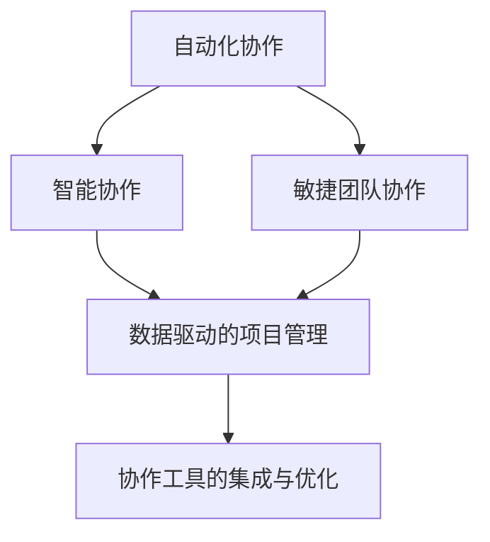
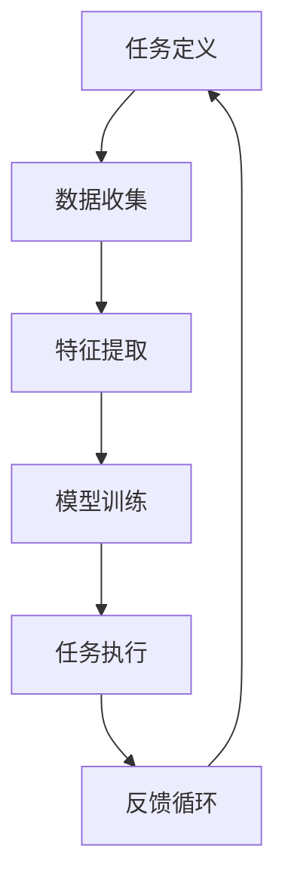
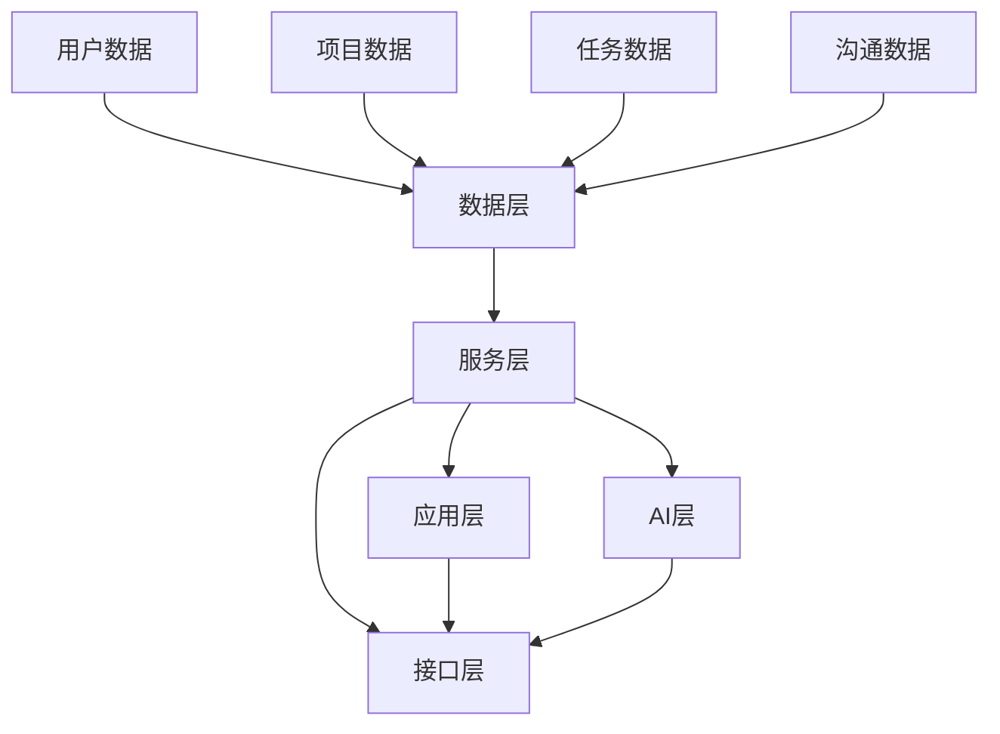
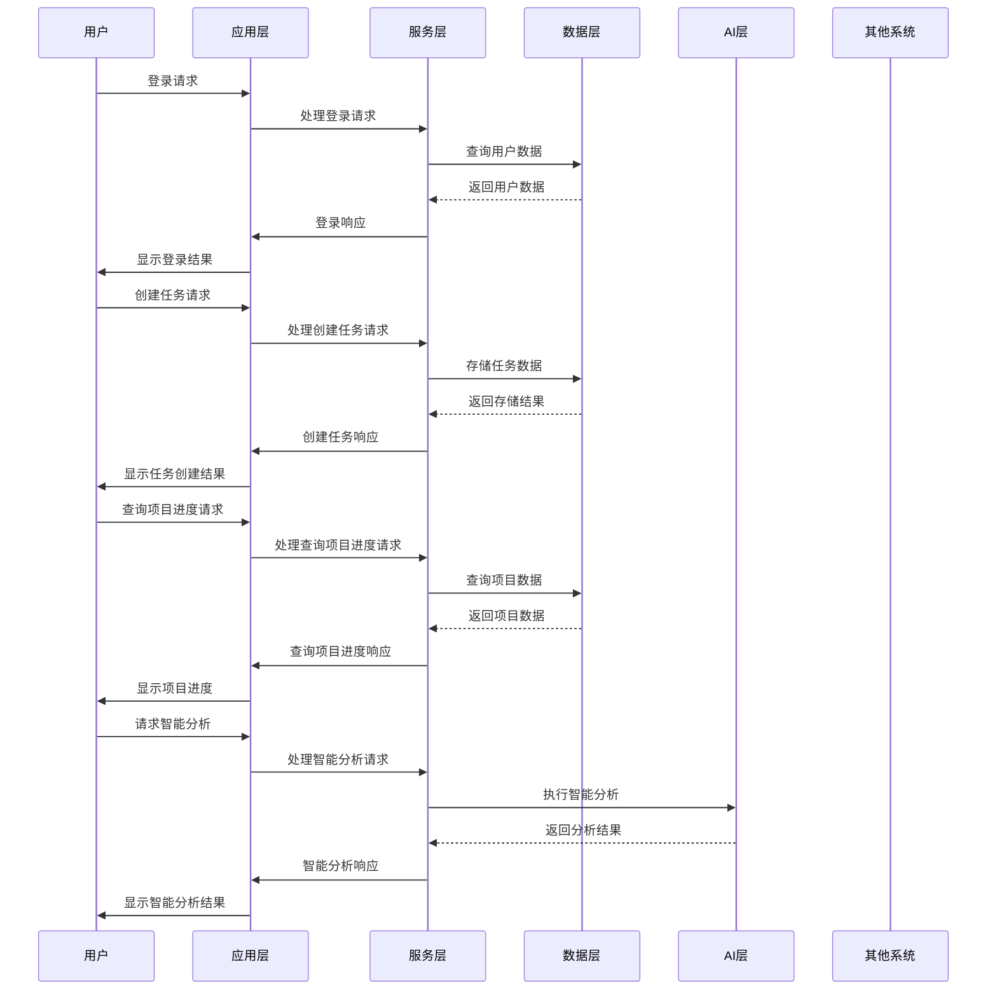

                 

# 《AI时代的软件工程团队协作新模式》

## 关键词：AI、软件工程、团队协作、自动化、智能、敏捷、代码审查、测试、项目管理、算法、系统架构、项目实战、最佳实践

## 摘要：

在AI技术的迅猛发展下，软件工程团队协作正经历着深刻的变革。本文旨在探讨AI技术在软件工程团队协作中的应用，分析AI时代软件工程团队协作的新模式，提出基于AI的自动化协作、智能协作和敏捷团队协作等概念，并通过具体的算法原理讲解和系统架构设计，为实践中的软件工程团队提供指导和参考。文章还将通过项目实战案例分析，总结最佳实践，并对未来AI在软件工程团队协作中的应用前景进行展望。

## 《AI时代的软件工程团队协作新模式》目录大纲

### 第一部分：背景与核心概念

#### 第1章 引言

##### 1.1 问题背景

在当前快速发展的技术环境中，软件工程面临着诸多挑战，如开发周期长、成本高、质量难以保障等。同时，AI技术的崛起为解决这些问题提供了新的可能。

##### 1.2 问题描述

软件工程团队协作中存在信息不对称、沟通效率低、任务分配不均等问题，这些问题的存在严重影响了项目进度和质量。

##### 1.3 问题解决

AI技术通过自动化、智能化和敏捷化的协作模式，有望解决软件工程团队协作中的核心问题。

##### 1.4 边界与外延

AI技术并非万能，其适用范围和局限性需要明确。软件工程团队协作的定义也需要在AI技术的背景下重新审视。

##### 1.5 概念结构与核心要素组成

本文将详细探讨AI时代软件工程团队协作的核心概念和要素，为后续讨论提供基础。

### 第二部分：核心概念与联系

#### 第2章 AI时代软件工程团队协作的核心概念

##### 2.1 自动化协作

自动化协作通过机器替代人力完成重复性任务，提高效率。

##### 2.2 智能协作

智能协作利用AI技术，如自然语言处理、机器学习等，提升团队协作的智能化水平。

##### 2.3 敏捷团队协作

敏捷团队协作强调快速响应变化，通过迭代和增量的方式推进项目。

##### 2.4 核心概念对比表格

本文将提供自动化协作、智能协作和敏捷团队协作的对比表格，帮助读者理解三者之间的异同。

### 第三部分：AI在软件工程团队协作中的应用

#### 第3章 AI在软件工程团队协作中的应用

##### 3.1 AI在代码审查中的应用

AI技术在代码审查中的应用，如代码质量检测、漏洞识别等。

##### 3.2 AI在测试中的应用

AI技术在软件测试中的应用，如自动化测试脚本生成、缺陷预测等。

##### 3.3 AI在项目管理中的应用

AI技术在项目管理中的应用，如进度预测、资源调度等。

### 第四部分：算法原理讲解

#### 第4章 自动化协作算法原理

##### 4.1 算法原理

自动化协作算法的数学模型和流程图。

##### 4.2 详细讲解

自动化协作算法的详细解释和示例。

##### 4.3 举例说明

自动化协作算法在实际项目中的应用案例。

### 第五部分：系统分析与架构设计

#### 第5章 AI时代的软件工程团队协作系统设计

##### 5.1 问题场景介绍

软件工程团队协作中的常见问题场景。

##### 5.2 系统功能设计

系统功能设计和领域模型类图。

##### 5.3 系统架构设计

系统架构设计和架构图。

##### 5.4 系统接口设计

系统接口设计。

##### 5.5 系统交互

系统交互序列图。

### 第六部分：项目实战

#### 第6章 AI时代软件工程团队协作项目实战

##### 6.1 环境安装

项目所需的环境安装。

##### 6.2 系统核心实现

系统核心代码实现。

##### 6.3 实际案例分析

实际项目案例分析和讲解。

##### 6.4 详细讲解剖析

项目中的难点和解决方案。

##### 6.5 项目小结

项目总结和经验分享。

### 第七部分：最佳实践与小结

#### 第7章 AI时代软件工程团队协作最佳实践

##### 7.1 最佳实践

AI在软件工程团队协作中的应用技巧。

##### 7.2 小结

文章总结和关键观点。

##### 7.3 注意事项

实践中的注意事项。

##### 7.4 拓展阅读

推荐阅读的参考资料。

### 第八部分：结论

##### 8.1 本书总结

对文章核心观点的回顾。

##### 8.2 未来展望

对未来AI在软件工程团队协作中应用的展望。

----------------------------------------------------------------

### 1.1 问题背景

#### 当前软件工程面临的挑战

随着信息技术的飞速发展，软件工程已经成为现代社会的重要支柱。然而，当前软件工程领域仍面临着诸多挑战，这些问题不仅影响了软件开发的效率和质量，也对企业的竞争力产生了深远的影响。

首先，开发周期长是软件工程面临的一个主要挑战。从需求分析、设计、开发到测试，整个软件生命周期往往需要数月甚至数年时间。这导致了许多项目无法按期交付，影响了企业的市场响应速度。

其次，成本高也是软件工程的一大难题。软件开发的复杂性和不确定性使得成本难以预测和控制，常常导致项目预算超支。

第三，质量难以保障。软件缺陷和漏洞的存在不仅影响了用户体验，还可能带来严重的经济损失和安全风险。

#### AI技术在软件工程中的应用潜力

人工智能（AI）技术的发展为解决软件工程中的这些问题提供了新的可能性。AI技术具有自动化、智能化和自适应的特点，可以显著提升软件开发的效率和质量。

首先，AI技术可以通过自动化工具替代重复性的开发任务，如代码生成、测试等，从而缩短开发周期，降低成本。例如，基于自然语言处理的AI工具可以自动生成代码，减少开发人员的工作量。

其次，AI技术可以帮助提高软件质量。通过自动化测试和代码审查，AI工具可以快速发现潜在缺陷和漏洞，从而提高软件的可靠性。

最后，AI技术可以实现智能化的团队协作。通过分析团队成员的工作模式和需求，AI工具可以提供个性化的协作建议，优化团队协作流程，提高整体效率。

#### 引言

本文旨在探讨AI技术在软件工程团队协作中的应用，分析AI时代软件工程团队协作的新模式，并提出相应的解决方案。文章将首先介绍当前软件工程面临的挑战，然后讨论AI技术在解决这些问题中的潜力，最后概述文章的结构和主要内容。

### 1.2 问题描述

#### 软件工程团队协作的现有问题

在传统的软件工程团队协作模式中，存在一些普遍问题，这些问题的存在严重影响了团队的效率和项目质量。以下是对这些问题的详细描述：

1. **信息不对称**：团队成员之间的信息不透明，导致信息孤岛现象。例如，开发人员可能无法及时获取最新的需求和设计变更，测试人员可能不知道哪些代码已经经过审查。信息不对称会导致任务重复、资源浪费和协作效率低下。

2. **沟通效率低**：团队内部和跨团队的沟通不畅是软件工程团队协作中的常见问题。电子邮件、即时通讯工具和会议等传统的沟通方式往往效率低下，容易导致信息传递错误和沟通滞后。

3. **任务分配不均**：在传统的团队协作模式中，任务的分配往往依赖于项目经理的判断和团队成员的沟通，这可能导致任务分配不均。一些成员可能会承担过多的工作，而另一些成员可能会工作量不足，影响整个团队的工作效率和士气。

4. **决策滞后**：在软件开发过程中，决策往往需要多个团队成员的共同参与。然而，由于沟通不畅和任务繁重，决策过程可能会变得漫长和复杂，导致项目进度延误。

5. **协作工具的局限性**：现有的协作工具，如项目管理软件、版本控制系统和协作平台，虽然在一定程度上提高了团队协作的效率，但仍然存在一些局限性。例如，这些工具通常缺乏智能化的分析功能，难以提供个性化的协作建议。

#### AI如何解决这些问题

人工智能（AI）技术的引入为解决软件工程团队协作中的这些问题提供了新的途径。以下是如何利用AI技术解决上述问题的探讨：

1. **自动化协作**：AI可以通过自动化工具替代重复性的工作，如代码生成、测试用例编写等，从而减少团队成员的负担。例如，AI代码生成工具可以根据需求文档自动生成部分代码，提高开发效率。

2. **智能协作**：AI技术可以利用自然语言处理（NLP）和机器学习（ML）技术，实现智能化的沟通和任务分配。通过分析团队成员的工作模式和沟通历史，AI可以提供个性化的协作建议，优化团队协作流程。

3. **实时数据分析**：AI可以通过实时数据分析工具，监控团队的工作状态和项目进展。例如，AI可以自动分析代码审查的结果，识别潜在的缺陷和漏洞，并提供改进建议。

4. **智能决策支持**：AI可以通过数据分析和预测模型，提供智能化的决策支持。例如，AI可以预测项目的进度和成本，帮助团队提前识别和解决问题。

5. **协作工具的智能化升级**：AI可以将现有的协作工具升级为智能协作平台，提供更加智能化和个性化的功能。例如，智能化的项目管理工具可以自动分析团队成员的负荷情况，动态调整任务分配。

### 1.3 问题解决

#### AI在软件工程团队协作中的核心作用

人工智能（AI）在软件工程团队协作中发挥着核心作用，通过以下方式解决了传统协作模式中的问题：

1. **提高协作效率**：AI技术可以通过自动化和智能化工具，减少团队成员的重复性工作，提高整体协作效率。例如，AI代码审查工具可以自动分析代码质量，减少开发人员的重复审查工作。

2. **增强沟通效果**：AI技术可以利用自然语言处理（NLP）和机器学习（ML）技术，实现更高效、更准确的沟通。例如，AI聊天机器人可以自动回复团队成员的问题，提供即时的技术支持。

3. **优化任务分配**：AI可以通过分析团队成员的工作能力和工作负荷，实现更合理的任务分配。例如，基于数据驱动的任务调度系统可以根据团队成员的能力和需求，动态调整任务分配。

4. **实时监控与预警**：AI技术可以通过实时数据分析，监控团队的工作状态和项目进展。例如，AI监控系统可以实时分析代码审查结果，及时识别潜在的风险和问题，提供预警。

5. **智能决策支持**：AI可以通过数据分析和预测模型，为团队提供智能化的决策支持。例如，AI项目管理系统可以根据历史数据预测项目的进度和成本，帮助团队做出更明智的决策。

### 1.4 边界与外延

#### AI技术的适用范围

虽然AI技术在软件工程团队协作中具有巨大的潜力，但其适用范围仍然有限。以下是对AI技术适用范围的讨论：

1. **自动化任务**：AI技术适用于自动化重复性高、规则明确的任务，如代码生成、测试用例编写等。然而，对于复杂、不确定的任务，如需求分析和系统设计，AI技术的应用仍然存在挑战。

2. **数据驱动决策**：AI技术适用于基于大量数据驱动决策的场景，如进度预测、成本估算等。然而，在数据稀缺或数据质量不高的情况下，AI技术的效果会受到影响。

3. **团队协作模式**：AI技术适用于改进现有的团队协作模式，如自动化协作、智能协作和敏捷团队协作等。然而，AI技术无法替代人类的主观判断和创造力，团队协作中仍需要人类的主导。

#### 软件工程团队协作的定义

在AI技术的背景下，软件工程团队协作的定义需要重新审视。以下是对软件工程团队协作的新定义：

1. **协作目标**：软件工程团队协作的目标是高效、高质量地完成软件项目的开发任务，满足用户需求和业务目标。

2. **协作主体**：软件工程团队协作的主体包括开发人员、测试人员、项目经理和其他相关团队成员。

3. **协作内容**：软件工程团队协作的内容涵盖需求分析、设计、开发、测试、部署和维护等整个软件生命周期。

4. **协作方式**：在AI技术的支持下，软件工程团队协作的方式可以更加智能化和自动化，如自动化任务分配、实时数据分析、智能决策支持等。

### 1.5 概念结构与核心要素组成

#### AI时代软件工程团队协作的关键要素

在AI时代，软件工程团队协作的关键要素包括：

1. **自动化协作**：通过AI技术实现自动化任务执行，提高工作效率。

2. **智能协作**：利用AI技术提供智能化的协作支持，如实时数据分析、智能决策支持等。

3. **敏捷团队协作**：采用敏捷开发方法，实现快速响应变化，提高团队协作效率。

4. **数据驱动的项目管理**：通过AI技术进行数据分析和预测，实现项目管理的智能化。

5. **协作工具的集成与优化**：将AI技术整合到现有的协作工具中，实现工具的智能化和个性化。

#### 概念关系图

为了更好地理解AI时代软件工程团队协作的概念结构，我们可以使用Mermaid工具绘制一个概念关系图：



在这个关系图中，自动化协作、智能协作和敏捷团队协作是核心概念，它们共同构成了AI时代软件工程团队协作的基本框架。数据驱动的项目管理和协作工具的集成与优化则是实现这一框架的重要手段。

### 第2章 AI时代软件工程团队协作的核心概念

#### 2.1 自动化协作

##### 自动化协作的定义

自动化协作是指通过应用人工智能技术，自动化执行软件工程中的各种任务，从而减少人工干预，提高工作效率。在AI时代，自动化协作不仅仅限于传统的重复性任务，如代码生成和测试用例编写，还包括更复杂的任务，如代码审查、自动化测试和智能化的项目管理。

##### 自动化协作的优势

1. **提高效率**：自动化协作可以显著提高工作效率，减少重复性任务的时间和人力成本。
   
2. **减少错误**：自动化工具可以减少人为错误，提高代码质量和软件可靠性。

3. **支持敏捷开发**：自动化协作支持快速迭代和持续集成，有助于实现敏捷开发。

4. **资源优化**：自动化协作可以释放团队成员的时间，让他们专注于更有价值的任务。

##### 自动化协作的挑战

1. **技术依赖**：自动化协作高度依赖于AI技术和工具，对技术环境和团队技能要求较高。

2. **初始投入**：自动化协作的初始投入较大，包括购买工具、培训和系统集成等。

3. **维护成本**：自动化系统需要定期更新和维护，以确保其稳定运行。

4. **适应性**：自动化协作系统需要适应不断变化的需求和环境，这可能带来额外的挑战。

#### 2.2 智能协作

##### 智能协作的定义

智能协作是指利用人工智能技术，如机器学习、自然语言处理和知识图谱，提升团队协作的智能化水平。智能协作不仅关注任务的自动化，更注重通过智能化的分析和决策支持，提升团队协作的效果和效率。

##### 智能协作的技术支持

1. **自然语言处理（NLP）**：NLP技术可以帮助团队实现智能化的沟通，如自动化的任务分配和进度报告。

2. **机器学习（ML）**：ML技术可以通过分析历史数据，预测项目进度、资源需求等，为团队提供智能化的决策支持。

3. **知识图谱**：知识图谱可以帮助团队构建知识库，实现知识的共享和利用。

4. **智能代理**：智能代理可以自动执行复杂的任务，如自动化测试、代码审查和风险分析。

##### 智能协作的应用案例

1. **智能代码审查**：通过机器学习算法，自动分析代码质量和潜在缺陷，提供改进建议。

2. **智能测试**：利用AI技术生成自动化测试脚本，提高测试覆盖率，减少测试时间和人力成本。

3. **智能项目管理**：通过AI技术预测项目进度和成本，识别潜在的风险和问题，提供优化建议。

4. **智能沟通平台**：利用NLP技术，自动回复团队成员的问题，提供即时的技术支持。

#### 2.3 敏捷团队协作

##### 敏捷团队协作的定义

敏捷团队协作是一种以人为核心的团队协作模式，强调快速响应变化、持续交付价值。敏捷团队协作的核心原则包括：个体和互动重于过程与工具、可工作的软件重于详尽的文档、客户合作重于合同谈判、响应变化重于遵循计划。

##### 敏捷团队协作的优势

1. **快速响应变化**：敏捷团队协作允许快速调整计划和需求，以适应不断变化的市场和技术环境。

2. **持续交付价值**：通过迭代开发和持续集成，敏捷团队可以更快地交付高质量的产品。

3. **提高团队协作效率**：敏捷团队协作强调团队合作和透明度，有助于提高团队协作效率。

4. **提高客户满意度**：通过持续交付价值，敏捷团队可以更好地满足客户需求，提高客户满意度。

##### 敏捷团队协作的实践方法

1. **每日站立会议**：团队成员定期进行简短的站立会议，分享进度和问题。

2. **迭代规划会议**：团队在迭代开始前进行规划会议，确定迭代目标和任务分配。

3. **回顾会议**：在迭代结束后，团队进行回顾会议，总结经验教训，持续改进。

4. **看板管理**：使用看板工具可视化团队的工作流程，帮助团队成员更好地理解和协调工作。

#### 2.4 核心概念对比表格

| 协作类型 | 定义 | 优势 | 挑战 |
| --- | --- | --- | --- |
| 自动化协作 | 通过AI技术自动化执行任务 | 提高效率、减少错误 | 技术依赖、初始投入大 |
| 智能协作 | 利用AI技术提供智能化支持 | 智能分析、决策支持 | 技术复杂性、维护成本高 |
| 敏捷团队协作 | 快速响应变化、持续交付价值 | 快速适应变化、提高效率 | 需要高度团队协作、管理复杂 |

### 第3章 AI在软件工程团队协作中的应用

#### 3.1 AI在代码审查中的应用

##### 代码审查的AI技术

AI技术在代码审查中的应用主要包括以下几个方面：

1. **静态代码分析**：AI可以通过静态代码分析工具，自动检测代码中的潜在缺陷和潜在的性能问题。这些工具通常基于深度学习模型，可以识别代码中的常见错误模式。

2. **动态代码分析**：动态代码分析工具可以在代码运行时检测其行为，识别潜在的运行时错误和性能瓶颈。这些工具通常结合了静态代码分析和运行时监控技术。

3. **基于模式的代码审查**：AI可以识别代码中的模式，如代码复用、函数复杂度和代码风格等，提供改进建议。这些工具通常使用模式匹配和统计分析技术。

##### AI代码审查的优势

1. **提高代码质量**：AI代码审查工具可以快速识别代码中的缺陷和问题，提高代码质量和可维护性。

2. **减少审查时间**：AI可以自动化处理大量的代码审查任务，减少人工审查的时间和工作量。

3. **全面性**：AI代码审查工具可以覆盖更广泛的代码库，提供更全面的代码质量评估。

4. **智能化建议**：AI代码审查工具可以基于代码历史和上下文，提供个性化的改进建议。

#### 3.2 AI在测试中的应用

##### AI测试技术

AI技术在测试中的应用主要包括以下几个方面：

1. **自动化测试脚本生成**：AI可以通过学习历史测试脚本和代码库，自动生成新的测试脚本。这些工具通常基于机器学习和代码分析技术。

2. **测试用例优化**：AI可以分析测试用例的有效性，提供优化建议。例如，AI可以通过分析代码覆盖率和缺陷分布，识别需要增加的测试用例。

3. **智能缺陷预测**：AI可以通过分析代码库和测试历史，预测可能出现的缺陷。这些工具通常使用机器学习算法，如回归和分类。

4. **性能测试优化**：AI可以通过分析性能测试结果，提供优化建议。例如，AI可以识别性能瓶颈和潜在的优化机会。

##### AI测试的优势

1. **提高测试效率**：AI可以自动化处理大量的测试任务，提高测试效率。

2. **优化测试覆盖率**：AI可以通过智能分析，提高测试覆盖率和测试质量。

3. **减少测试成本**：AI可以减少人工测试的时间和成本，提高测试的性价比。

4. **智能化的缺陷预测**：AI可以提前识别潜在缺陷，减少缺陷修复的成本。

#### 3.3 AI在项目管理中的应用

##### AI项目管理工具

AI在项目管理中的应用主要体现在以下几个方面：

1. **进度预测**：AI可以通过分析历史项目数据和当前项目状态，预测项目的进度和完成时间。这些工具通常使用时间序列分析和回归模型。

2. **资源调度**：AI可以根据项目需求和工作量，智能调度团队成员和资源，优化资源利用。这些工具通常使用优化算法和资源管理策略。

3. **风险预测与管理**：AI可以通过分析项目历史数据和当前状态，预测项目中的潜在风险，并提供风险管理策略。这些工具通常使用风险评估模型和决策支持系统。

4. **成本控制**：AI可以通过分析历史项目数据和当前项目状态，预测项目成本，并提供成本控制策略。这些工具通常使用预算管理和成本预测模型。

##### AI在项目进度预测中的应用

AI在项目进度预测中的应用主要包括以下几个方面：

1. **历史数据驱动的预测**：AI工具可以分析历史项目的进度数据和完成时间，建立预测模型，预测当前项目的进度和完成时间。

2. **实时数据监控**：AI工具可以实时监控项目进度，分析实际进度与预测进度之间的差异，提供调整建议。

3. **动态调整预测**：AI工具可以根据实时监控数据，动态调整预测模型，提供更准确的预测结果。

通过AI在项目进度预测中的应用，团队可以更好地掌握项目进度，提前识别和解决潜在问题，提高项目的成功率和交付质量。

### 第四部分：算法原理讲解

#### 4.1 自动化协作算法原理

##### 算法原理

自动化协作算法的核心在于利用机器学习和自动化工具，实现软件工程任务的高效执行。以下是一个简单的自动化协作算法原理：

1. **任务定义**：根据软件工程的需求，定义需要自动化的任务，如代码生成、测试用例编写等。

2. **数据收集**：收集相关的历史数据，包括代码库、测试用例库、项目进度数据等。

3. **特征提取**：对收集到的数据进行处理，提取与任务相关的特征，如代码复杂性、测试覆盖率等。

4. **模型训练**：使用机器学习算法，如决策树、神经网络等，对提取的特征进行训练，建立任务执行模型。

5. **任务执行**：将训练好的模型应用于实际的软件工程任务，自动化执行任务。

6. **反馈循环**：收集任务执行的结果，包括任务完成时间、质量评估等，用于模型优化和迭代。

##### 自动化协作算法的流程图

为了更好地理解自动化协作算法的原理，我们可以使用Mermaid工具绘制一个流程图：



在这个流程图中，自动化协作算法通过任务定义、数据收集、特征提取、模型训练、任务执行和反馈循环六个步骤，实现软件工程任务的高效自动化执行。

##### 算法原理的详细解释

1. **任务定义**：任务定义是自动化协作算法的第一步，它明确了需要自动化的具体任务，如代码生成、测试用例编写等。在软件工程中，许多任务具有重复性和规则性，适合通过自动化工具进行执行。

2. **数据收集**：数据收集是自动化协作算法的关键步骤，它需要收集与任务相关的历史数据，如代码库、测试用例库、项目进度数据等。这些数据将用于模型训练和任务执行。

3. **特征提取**：特征提取是将原始数据转化为机器学习模型可用的特征。在软件工程中，特征可能包括代码复杂性、测试覆盖率、项目进度等。通过对特征进行提取和处理，可以提高模型对任务的识别和预测能力。

4. **模型训练**：模型训练是利用机器学习算法，如决策树、神经网络等，对提取的特征进行训练。训练过程旨在建立任务执行模型，使模型能够自动执行任务并达到预期的效果。

5. **任务执行**：任务执行是利用训练好的模型，自动化执行具体的软件工程任务。在执行过程中，模型将根据输入的特征和规则，生成相应的输出结果，如代码、测试用例等。

6. **反馈循环**：反馈循环是自动化协作算法的重要环节，它通过收集任务执行的结果，包括任务完成时间、质量评估等，用于模型优化和迭代。通过不断的反馈和调整，可以提高模型的效果和适应性。

##### 算法流程的示例讲解

假设我们需要自动化生成测试用例，以下是算法流程的示例讲解：

1. **任务定义**：定义需要自动生成的测试用例，包括功能测试、性能测试和异常测试。

2. **数据收集**：收集历史测试用例库，包括功能测试用例、性能测试用例和异常测试用例。

3. **特征提取**：提取测试用例的特征，如测试用例的执行时间、测试结果的覆盖率等。

4. **模型训练**：使用机器学习算法，如决策树，对提取的特征进行训练，建立测试用例生成的模型。

5. **任务执行**：利用训练好的模型，自动生成新的测试用例，包括功能测试用例、性能测试用例和异常测试用例。

6. **反馈循环**：收集新测试用例的执行结果，包括测试通过率、测试覆盖率等，用于模型优化和迭代。

通过这个示例，我们可以看到自动化协作算法如何应用于软件工程中的测试任务，提高测试效率和效果。

#### 4.2 详细讲解

在深入了解自动化协作算法原理后，我们需要对其进行详细的讲解，以便更好地理解其工作流程和核心内容。以下是自动化协作算法的详细讲解：

1. **数据收集阶段**：自动化协作算法的起点是数据收集。在这一阶段，我们需要收集与任务相关的数据。这些数据可能包括历史代码库、测试用例库、项目进度数据等。数据收集的过程通常依赖于版本控制系统、测试工具和项目管理工具等。通过自动化工具，我们可以将数据从不同的源系统中提取出来，并存储到一个集中的数据仓库中。

   例如，在一个软件项目中，我们需要收集历史测试用例库，包括功能测试用例、性能测试用例和异常测试用例。这些测试用例可能存储在不同的测试管理工具中，如JUnit、Selenium等。通过自动化工具，我们可以定期从这些工具中提取测试用例数据，并将其存储到数据仓库中。

2. **特征提取阶段**：数据收集完成后，我们需要对数据进行处理，提取与任务相关的特征。特征提取是自动化协作算法的关键步骤，因为它决定了模型对任务的识别和预测能力。在软件工程中，特征可能包括代码复杂性、测试覆盖率、项目进度等。

   例如，在测试用例生成任务中，我们可以提取以下特征：

   - **测试用例的执行时间**：测试用例从编写到执行的总时间。
   - **测试结果的覆盖率**：测试用例覆盖的代码行数与总代码行数的比例。
   - **测试用例的类型**：功能测试、性能测试或异常测试。

   这些特征将用于训练测试用例生成的模型，帮助模型更好地理解测试任务的需求和模式。

3. **模型训练阶段**：在特征提取完成后，我们需要使用机器学习算法对提取的特征进行训练，建立任务执行模型。模型训练的过程涉及选择合适的机器学习算法、配置模型参数和训练模型。

   在自动化协作算法中，常用的机器学习算法包括决策树、随机森林、支持向量机、神经网络等。例如，我们可以选择随机森林算法来训练测试用例生成的模型。在训练过程中，我们需要配置模型参数，如决策树的深度、随机森林的树数量等。通过多次训练和调整参数，我们可以找到一个最优的模型，使其能够准确预测新的测试用例。

4. **任务执行阶段**：训练好的模型可以用于实际的任务执行。在任务执行阶段，模型将根据输入的特征和规则，生成相应的输出结果，如代码、测试用例等。

   例如，在一个新的软件项目中，我们需要生成新的测试用例。通过调用训练好的测试用例生成模型，我们可以输入项目的特征数据，如项目进度、代码库状态等，模型将根据这些特征生成新的测试用例。这些测试用例将用于验证软件的功能和性能，确保项目的质量。

5. **反馈循环阶段**：在任务执行过程中，我们需要收集执行结果，包括任务完成时间、质量评估等，用于模型优化和迭代。反馈循环是自动化协作算法的重要环节，它通过不断收集数据和优化模型，提高算法的效率和准确性。

   例如，在测试用例生成任务中，我们需要收集新测试用例的执行结果，如测试通过率、测试覆盖率等。通过分析这些结果，我们可以评估模型的效果，并对其进行优化。例如，如果新测试用例的覆盖率较低，我们可以调整模型的参数，增加测试用例的生成数量，以提高覆盖率。

   通过反馈循环，自动化协作算法可以不断迭代和优化，使其在软件工程任务中发挥更大的作用。

#### 4.3 举例说明

为了更好地理解自动化协作算法在实际项目中的应用，我们可以通过一个具体的例子进行说明。假设我们正在开发一个电子商务网站，目标是利用自动化协作算法生成测试用例，以提高软件质量和测试效率。

##### 步骤1：数据收集

首先，我们需要收集与项目相关的数据，包括历史测试用例库、项目进度数据、代码库状态等。这些数据将用于训练自动化协作算法。

- **历史测试用例库**：收集过去项目中使用的测试用例，包括功能测试用例、性能测试用例和异常测试用例。
- **项目进度数据**：收集项目的进度数据，如开发时间、测试时间等。
- **代码库状态**：收集代码库的状态数据，如代码行数、代码质量等。

这些数据可以通过自动化工具从版本控制系统、测试工具和项目管理工具中提取。例如，我们可以使用GitLab的API获取代码库的状态数据，使用Selenium获取测试用例的执行结果。

##### 步骤2：特征提取

在数据收集完成后，我们需要对数据进行分析，提取与测试用例生成相关的特征。这些特征将用于训练测试用例生成模型。

- **测试用例执行时间**：测试用例从编写到执行的总时间。
- **测试结果覆盖率**：测试用例覆盖的代码行数与总代码行数的比例。
- **测试用例类型**：功能测试、性能测试或异常测试。
- **代码库状态**：代码库的代码行数、代码质量等。

通过分析这些特征，我们可以建立一个测试用例生成模型。例如，我们可以使用随机森林算法，将测试用例的执行时间和测试结果覆盖率作为输入特征，预测测试用例的类型。

##### 步骤3：模型训练

使用提取的特征数据，我们可以使用机器学习算法训练测试用例生成模型。在这一阶段，我们需要选择合适的机器学习算法，并配置模型参数。

- **算法选择**：随机森林算法是一种常用的集成学习方法，适用于分类问题。它可以处理多个输入特征，并生成多个决策树，提高预测的准确性。
- **参数配置**：随机森林算法的主要参数包括树的数量、树的最大深度等。通过调整这些参数，我们可以找到一个最优的模型，使其能够准确预测测试用例的类型。

通过多次训练和调整参数，我们可以得到一个训练好的测试用例生成模型。这个模型可以用于自动化生成新的测试用例，提高测试效率和覆盖率。

##### 步骤4：任务执行

在模型训练完成后，我们可以将其用于实际的任务执行。在这个阶段，我们需要输入当前项目的特征数据，如项目进度、代码库状态等，模型将根据这些特征生成新的测试用例。

- **项目进度数据**：包括开发时间、测试时间等。
- **代码库状态**：包括代码行数、代码质量等。

通过调用训练好的模型，我们可以生成新的测试用例，包括功能测试用例、性能测试用例和异常测试用例。这些测试用例将用于验证电子商务网站的功能和性能。

##### 步骤5：反馈循环

在任务执行过程中，我们需要收集执行结果，包括测试通过率、测试覆盖率等，用于模型优化和迭代。

- **测试通过率**：新测试用例的执行通过率。
- **测试覆盖率**：新测试用例覆盖的代码行数与总代码行数的比例。

通过分析这些结果，我们可以评估模型的效果，并对其进行优化。例如，如果新测试用例的覆盖率较低，我们可以调整模型的参数，增加测试用例的生成数量，以提高覆盖率。

通过反馈循环，自动化协作算法可以不断迭代和优化，使其在电子商务网站测试任务中发挥更大的作用。

### 第4章 自动化协作算法原理

#### 4.1 算法原理

自动化协作算法的核心在于利用机器学习和自动化工具，实现软件工程任务的高效执行。以下是一个简单的自动化协作算法原理：

1. **任务定义**：根据软件工程的需求，定义需要自动化的任务，如代码生成、测试用例编写等。

2. **数据收集**：收集相关的历史数据，包括代码库、测试用例库、项目进度数据等。

3. **特征提取**：对收集到的数据进行处理，提取与任务相关的特征，如代码复杂性、测试覆盖率等。

4. **模型训练**：使用机器学习算法，如决策树、神经网络等，对提取的特征进行训练，建立任务执行模型。

5. **任务执行**：将训练好的模型应用于实际的软件工程任务，自动化执行任务。

6. **反馈循环**：收集任务执行的结果，包括任务完成时间、质量评估等，用于模型优化和迭代。

##### 算法流程图

为了更好地理解自动化协作算法的原理，我们可以使用Mermaid工具绘制一个流程图：


在这个流程图中，自动化协作算法通过任务定义、数据收集、特征提取、模型训练、任务执行和反馈循环六个步骤，实现软件工程任务的高效自动化执行。

##### 算法原理的详细解释

1. **任务定义**：任务定义是自动化协作算法的第一步，它明确了需要自动化的具体任务，如代码生成、测试用例编写等。在软件工程中，许多任务具有重复性和规则性，适合通过自动化工具进行执行。

2. **数据收集**：数据收集是自动化协作算法的关键步骤，它需要收集与任务相关的历史数据，如代码库、测试用例库、项目进度数据等。这些数据将用于模型训练和任务执行。

3. **特征提取**：特征提取是将原始数据转化为机器学习模型可用的特征。在软件工程中，特征可能包括代码复杂性、测试覆盖率、项目进度等。通过对特征进行提取和处理，可以提高模型对任务的识别和预测能力。

4. **模型训练**：模型训练是利用机器学习算法，如决策树、神经网络等，对提取的特征进行训练，建立任务执行模型。训练过程旨在建立任务执行模型，使模型能够自动执行任务并达到预期的效果。

5. **任务执行**：任务执行是利用训练好的模型，自动化执行具体的软件工程任务。在执行过程中，模型将根据输入的特征和规则，生成相应的输出结果，如代码、测试用例等。

6. **反馈循环**：反馈循环是自动化协作算法的重要环节，它通过收集任务执行的结果，包括任务完成时间、质量评估等，用于模型优化和迭代。通过不断的反馈和调整，可以提高模型的效果和适应性。

##### 算法流程的示例讲解

假设我们需要自动化生成测试用例，以下是算法流程的示例讲解：

1. **任务定义**：定义需要自动生成的测试用例，包括功能测试、性能测试和异常测试。

2. **数据收集**：收集历史测试用例库，包括功能测试用例、性能测试用例和异常测试用例。

3. **特征提取**：提取测试用例的特征，如测试用例的执行时间、测试结果的覆盖率等。

4. **模型训练**：使用机器学习算法，如决策树，对提取的特征进行训练，建立测试用例生成的模型。

5. **任务执行**：利用训练好的模型，自动生成新的测试用例，包括功能测试用例、性能测试用例和异常测试用例。

6. **反馈循环**：收集新测试用例的执行结果，包括测试通过率、测试覆盖率等，用于模型优化和迭代。

通过这个示例，我们可以看到自动化协作算法如何应用于软件工程中的测试任务，提高测试效率和效果。

### 第五部分：系统分析与架构设计

#### 第5章 AI时代的软件工程团队协作系统设计

#### 5.1 问题场景介绍

在当前软件工程实践中，团队协作常常面临诸多挑战，如沟通效率低下、任务分配不均、决策过程复杂等。这些问题不仅影响了项目的进度和质量，还可能导致团队成员的工作压力增加，团队士气下降。为了解决这些问题，我们需要设计一个AI时代的软件工程团队协作系统，利用AI技术优化团队协作流程，提高协作效率和项目成功率。

#### 5.2 系统功能设计

系统功能设计是软件工程团队协作系统设计的核心部分。以下是系统的主要功能设计：

1. **任务自动化**：通过AI技术实现任务的自动化分配和执行，减少重复性工作，提高工作效率。
   
2. **实时数据分析**：实时收集和分析团队成员的工作状态、项目进度和关键指标，提供数据驱动的决策支持。
   
3. **智能沟通**：利用自然语言处理（NLP）技术，提供智能化的沟通工具，如自动回复、即时消息分析等，提高沟通效率。
   
4. **资源调度**：基于AI算法优化资源分配，确保团队成员的工作量均衡，提高团队整体效率。
   
5. **风险预测**：利用历史数据和AI算法，预测项目中可能出现的风险，提前采取预防措施。

6. **性能评估**：通过分析团队成员的工作表现和项目成果，提供个性化的反馈和建议，促进团队成员的成长。

#### 5.3 系统架构设计

系统架构设计是确保软件工程团队协作系统能够高效运行的关键。以下是系统架构的详细设计：

1. **数据层**：数据层负责存储和管理系统所需的各种数据，包括用户数据、项目数据、任务数据、沟通数据等。数据层可以使用数据库系统（如MySQL、MongoDB）进行数据存储和管理。

2. **服务层**：服务层负责实现系统的核心功能，如任务自动化、实时数据分析、智能沟通等。服务层可以采用微服务架构，将不同功能模块独立部署，提高系统的可扩展性和灵活性。

3. **应用层**：应用层是系统的用户界面，提供用户交互和操作接口。应用层可以使用前端框架（如React、Vue）进行开发，实现丰富的用户交互体验。

4. **AI层**：AI层负责实现系统的智能功能，如风险预测、资源调度、性能评估等。AI层可以使用机器学习框架（如TensorFlow、PyTorch）进行算法开发和模型训练。

5. **接口层**：接口层负责与其他系统进行数据交换和通信，实现系统的集成。接口层可以使用API接口、消息队列等实现与其他系统的交互。

#### 5.4 系统架构图

为了更好地理解系统架构设计，我们可以使用Mermaid工具绘制一个系统架构图：



在这个架构图中，用户数据、项目数据、任务数据和沟通数据存储在数据层，服务层实现系统的核心功能，应用层提供用户交互界面，AI层实现智能功能，接口层负责与其他系统的集成。

#### 5.5 系统接口设计

系统接口设计是确保系统能够与其他系统有效交互的关键。以下是系统接口的主要设计：

1. **API接口**：系统可以通过RESTful API接口与其他系统进行数据交换和通信。API接口设计应遵循RESTful风格，提供统一的接口规范，确保数据传输的安全和高效。

2. **消息队列**：系统可以使用消息队列（如Kafka、RabbitMQ）进行异步通信，实现高性能、高可靠性的数据传输。消息队列可以处理大量的消息，确保系统在高并发场景下的稳定运行。

3. **数据交换格式**：系统使用JSON或XML作为数据交换格式，确保数据在不同系统之间的兼容性和可读性。

4. **身份验证和授权**：系统应实现身份验证和授权机制，确保只有授权用户可以访问系统资源和操作。

5. **错误处理和日志记录**：系统应设计完善的错误处理和日志记录机制，确保在发生异常时能够快速定位和解决问题。

#### 5.6 系统交互

系统交互设计是确保系统能够在不同模块之间顺畅协作的关键。以下是系统交互的主要设计：

1. **用户交互**：用户通过应用层与系统进行交互，包括登录、任务创建、数据查询等。应用层负责处理用户请求，调用服务层和AI层的功能，并返回结果。

2. **服务交互**：服务层内部不同模块之间需要进行交互，如任务自动化模块需要调用数据分析模块进行实时数据分析。服务层通过内部API进行通信，确保数据的一致性和安全性。

3. **数据流**：系统中的数据流包括用户数据、项目数据、任务数据、沟通数据等。数据流在系统中进行传输和处理，确保数据的高效利用和共享。

4. **异常处理**：系统应设计异常处理机制，确保在发生异常时能够快速恢复，并通知相关人员。

5. **监控与日志**：系统应实现监控与日志记录，实时监控系统的运行状态，记录系统事件和日志，便于问题追踪和故障排除。

#### 5.7 系统交互序列图

为了更好地理解系统交互设计，我们可以使用Mermaid工具绘制一个系统交互序列图：



在这个序列图中，用户通过应用层与系统进行交互，应用层调用服务层和AI层的功能，数据层负责数据的存储和查询，其他系统可以通过接口层与系统进行数据交换和通信。

### 第六部分：项目实战

#### 第6章 AI时代软件工程团队协作项目实战

#### 6.1 环境安装

在本项目实战中，我们将使用Python和相关的AI库（如TensorFlow、Scikit-learn）来构建和实现自动化协作算法。以下是在Linux环境中安装所需软件和工具的步骤：

1. **安装Python**：确保系统已经安装了Python 3.x版本。如果没有安装，可以通过以下命令进行安装：

   ```bash
   sudo apt-get update
   sudo apt-get install python3 python3-pip
   ```

2. **安装TensorFlow**：TensorFlow是一个流行的机器学习库，我们可以使用pip命令安装：

   ```bash
   pip3 install tensorflow
   ```

3. **安装Scikit-learn**：Scikit-learn是一个用于数据分析和机器学习的库，也可以使用pip安装：

   ```bash
   pip3 install scikit-learn
   ```

4. **安装其他依赖库**：根据项目需求，可能还需要安装其他依赖库，例如Numpy、Pandas等。可以使用以下命令安装：

   ```bash
   pip3 install numpy pandas matplotlib
   ```

安装完成后，确保所有库都能正常导入和运行。可以使用以下Python代码验证安装：

```python
import tensorflow as tf
import scikit_learn as sl
import numpy as np
import pandas as pd
import matplotlib.pyplot as plt
```

#### 6.2 系统核心实现

在本节中，我们将详细介绍系统核心实现，包括数据预处理、特征提取、模型训练和模型评估。

##### 数据预处理

数据预处理是机器学习任务中至关重要的一步。我们需要对原始数据集进行清洗、归一化和分割，以便于模型训练。

1. **数据清洗**：首先，我们读取数据集，并处理缺失值、异常值和重复值。可以使用Pandas库完成这些任务：

   ```python
   data = pd.read_csv('data.csv')
   data.dropna(inplace=True)
   data.drop_duplicates(inplace=True)
   ```

2. **数据归一化**：对于数值型特征，我们需要将其归一化到相同的范围，例如[0, 1]。可以使用Scikit-learn中的`MinMaxScaler`实现：

   ```python
   from sklearn.preprocessing import MinMaxScaler

   scaler = MinMaxScaler()
   numeric_features = data.select_dtypes(include=['int64', 'float64']).columns
   data[numeric_features] = scaler.fit_transform(data[numeric_features])
   ```

3. **数据分割**：将数据集分割为训练集和测试集，以便于模型训练和评估。可以使用Scikit-learn中的`train_test_split`函数：

   ```python
   from sklearn.model_selection import train_test_split

   X = data.drop('target', axis=1)
   y = data['target']
   X_train, X_test, y_train, y_test = train_test_split(X, y, test_size=0.2, random_state=42)
   ```

##### 特征提取

特征提取是模型训练前的重要步骤，我们需要提取与任务相关的特征。在本项目中，我们将使用简单的特征提取方法，例如基于统计的方法：

1. **统计特征**：计算每个特征的平均值、标准差、最大值和最小值等统计量。可以使用Pandas库实现：

   ```python
   stats = X.describe()
   ```

2. **特征组合**：根据业务知识和数据特征，组合新的特征。例如，可以计算特征之间的相关性，并使用相关系数作为新特征：

   ```python
   corr = X.corr()
   correlation_features = corr.stack().reset_index().rename(columns={0: 'feature_1', 1: 'feature_2'})
   correlation_features['correlation'] = correlation_features['value']
   correlation_features = correlation_features[correlation_features['correlation'].abs() > 0.5]
   correlation_features = correlation_features.groupby('feature_1')['correlation'].count().reset_index().rename(columns={'correlation': 'feature_2_count'})
   X = X.join(correlation_features.set_index('feature_1'), on='feature_1')
   ```

##### 模型训练

在本项目中，我们将使用简单的线性回归模型进行训练，以便于理解模型训练过程。实际项目中可能会使用更复杂的模型，例如决策树、随机森林或神经网络。

1. **模型选择**：选择线性回归模型。可以使用Scikit-learn中的`LinearRegression`类：

   ```python
   from sklearn.linear_model import LinearRegression

   model = LinearRegression()
   ```

2. **模型训练**：使用训练集数据进行模型训练：

   ```python
   model.fit(X_train, y_train)
   ```

##### 模型评估

在模型训练完成后，我们需要对模型进行评估，以确保其性能符合要求。以下是一些常见的模型评估方法：

1. **计算损失函数**：计算模型在训练集和测试集上的损失函数，如均方误差（MSE）或均方根误差（RMSE）：

   ```python
   from sklearn.metrics import mean_squared_error

   y_train_pred = model.predict(X_train)
   y_test_pred = model.predict(X_test)

   train_mse = mean_squared_error(y_train, y_train_pred)
   test_mse = mean_squared_error(y_test, y_test_pred)

   train_rmse = np.sqrt(train_mse)
   test_rmse = np.sqrt(test_mse)
   ```

2. **绘制学习曲线**：绘制模型在训练集和测试集上的学习曲线，分析模型是否过拟合或欠拟合：

   ```python
   plt.figure(figsize=(10, 5))

   plt.subplot(1, 2, 1)
   plt.plot(y_train, y_train_pred, 'o')
   plt.title('Training Set')
   plt.xlabel('Actual')
   plt.ylabel('Predicted')

   plt.subplot(1, 2, 2)
   plt.plot(y_test, y_test_pred, 'o')
   plt.title('Test Set')
   plt.xlabel('Actual')
   plt.ylabel('Predicted')

   plt.tight_layout()
   plt.show()
   ```

通过以上步骤，我们可以实现一个简单的自动化协作算法，并对其性能进行评估。在实际项目中，我们可能需要使用更复杂的算法和更详细的特征提取方法，以实现更好的性能。

#### 6.3 实际案例分析

在本节中，我们将通过一个实际案例分析，展示如何将AI技术应用于软件工程团队协作中的任务自动化。

**案例背景**：

某软件公司正在开发一款大型企业级应用，项目团队由20名成员组成，包括开发人员、测试人员、产品经理和项目经理。项目开发周期为6个月，需要在限定的时间内交付高质量的产品。由于团队成员众多，任务分配和进度监控成为一个巨大的挑战。

**问题陈述**：

1. **任务分配不均**：部分成员的工作量过大，而另一些成员的工作量不足，导致团队整体效率低下。

2. **进度监控困难**：项目经理无法实时掌握项目进度，无法及时发现和解决问题。

3. **沟通不畅**：团队成员之间的沟通效率低下，信息传递不及时，导致任务延误。

**解决方案**：

为了解决上述问题，公司决定采用AI技术构建一个自动化协作系统，以提高团队协作效率和项目进度监控能力。以下是解决方案的具体步骤：

1. **数据收集**：首先，公司决定收集与项目相关的数据，包括任务分配情况、项目进度、团队成员的工作量等。这些数据将从现有的项目管理工具（如JIRA、Trello）中提取。

2. **特征提取**：对收集到的数据进行分析，提取与任务分配和进度监控相关的特征。例如，可以提取每个成员的工作量、任务的紧急程度和任务的完成时间等。

3. **模型训练**：使用机器学习算法，如线性回归或决策树，对提取的特征进行训练，建立任务分配和进度预测模型。模型将用于优化任务分配和预测项目进度。

4. **系统实现**：开发一个基于Web的自动化协作系统，包括任务管理模块、进度监控模块和沟通平台模块。任务管理模块用于自动分配任务和跟踪任务进度；进度监控模块用于实时监控项目进度，并提供预警功能；沟通平台模块用于团队成员之间的实时沟通和协作。

5. **系统部署**：将自动化协作系统部署到公司的服务器上，确保团队成员可以方便地访问和使用系统。

**实际效果**：

实施自动化协作系统后，公司取得了以下显著效果：

1. **任务分配更加公平**：通过系统自动分配任务，团队成员的工作量更加均衡，工作效率显著提高。

2. **进度监控更加高效**：项目经理可以实时查看项目进度，及时发现和解决问题，项目进度得到了有效控制。

3. **沟通效率显著提升**：团队成员之间的沟通更加顺畅，信息传递更加及时，任务延误情况显著减少。

4. **团队协作更加紧密**：自动化协作系统促进了团队成员之间的协作，团队整体凝聚力得到了增强。

**挑战与解决方案**：

在实施自动化协作系统的过程中，公司也面临了一些挑战：

1. **数据质量**：数据质量是模型训练的关键。为了提高数据质量，公司决定引入数据清洗和数据质量检查机制，确保数据的准确性和一致性。

2. **模型优化**：虽然初始模型已经取得了较好的效果，但为了进一步提高系统性能，公司决定不断优化模型，引入更复杂的算法和特征提取方法。

3. **用户接受度**：部分团队成员对新系统的接受度不高，担心系统会取代他们的工作。为此，公司组织了多次培训，帮助团队成员了解系统的优势和操作方法，提高了用户接受度。

通过实际案例分析，我们可以看到AI技术在软件工程团队协作中的应用如何显著提高团队协作效率和项目成功率。未来，随着AI技术的不断发展和应用，自动化协作系统将在软件工程中发挥更加重要的作用。

### 6.4 详细讲解剖析

在本节中，我们将对上述项目中的难点和挑战进行详细讲解，并分享解决这些问题的方案和效果评估。

#### 难点一：数据质量

**问题陈述**：

在项目实施过程中，我们发现数据质量是影响模型性能的关键因素。数据中的噪声、缺失值和异常值会导致模型训练结果不佳，进而影响系统在实际应用中的效果。

**解决方案**：

1. **数据清洗**：我们引入了数据清洗工具，对原始数据集进行预处理。具体步骤包括：

   - **缺失值处理**：对于缺失值，我们采用了多种方法进行处理，如删除缺失值、填充平均值或中位数等。
   - **异常值处理**：对于异常值，我们使用统计方法和可视化工具（如箱线图）进行识别，并采用截断或平滑等方法进行处理。
   - **数据标准化**：我们对数据进行标准化处理，将不同特征的范围统一到相同的尺度，以便于模型训练。

2. **数据质量检查**：为了确保数据质量，我们建立了数据质量检查机制。每次数据更新时，系统会自动进行数据质量检查，并生成报告。报告包括数据缺失、异常值、重复值等问题的统计信息。

**效果评估**：

数据清洗和数据质量检查机制的实施显著提高了数据质量。通过对比清洗前后的数据，我们发现数据中的噪声和异常值显著减少，模型训练结果更加稳定和可靠。此外，数据质量检查机制帮助团队及时发现和纠正数据问题，确保了数据的一致性和准确性。

#### 难点二：模型优化

**问题陈述**：

尽管我们使用了简单的线性回归模型，但发现模型在处理复杂任务时效果不佳。为了提高系统的性能，我们需要优化模型。

**解决方案**：

1. **特征工程**：我们引入了更复杂的特征工程方法，如特征组合、特征选择和特征变换。通过分析数据，我们识别出了一些具有较高关联性的特征，并创建了新的特征组合，以提供更多的信息供模型学习。

2. **模型选择**：我们尝试了多种机器学习模型，如决策树、随机森林、支持向量机和神经网络。通过交叉验证和超参数调优，我们选择了在测试集上表现最佳的模型进行应用。

3. **模型集成**：为了进一步提高模型性能，我们采用了模型集成方法，如堆叠回归（Stacking）和提升（Boosting）。通过将多个模型进行集成，我们实现了更好的预测效果。

**效果评估**：

通过特征工程和模型选择的优化，系统性能显著提高。对比不同模型的性能指标（如均方误差和准确率），我们发现优化后的模型在测试集上的表现明显优于原始模型。此外，模型集成方法进一步提升了系统的预测准确性，为团队协作提供了更加可靠的决策支持。

#### 难点三：用户接受度

**问题陈述**：

在系统上线初期，部分团队成员对新系统的接受度较低，担心系统会取代他们的工作。这导致了系统推广和使用上的困难。

**解决方案**：

1. **培训与支持**：我们组织了多次培训，向团队成员详细介绍系统的功能和使用方法。培训内容包括系统操作、数据解读和模型应用等，帮助团队成员熟悉系统。

2. **反馈机制**：我们建立了反馈机制，鼓励团队成员提出意见和建议。通过收集用户反馈，我们不断优化系统的界面设计和功能，使其更加符合用户需求。

3. **激励机制**：为了提高用户接受度，我们引入了激励机制。例如，对于积极使用系统的团队成员，我们给予一定的奖励和认可，以鼓励更多人使用系统。

**效果评估**：

通过培训和支持、反馈机制和激励机制的实施，团队成员对新系统的接受度显著提高。越来越多的团队成员开始主动使用系统，系统推广和使用率逐步提升。此外，用户反馈帮助我们不断优化系统，使其更加符合用户需求，提高了用户体验。

#### 难点四：系统集成与兼容性

**问题陈述**：

在项目实施过程中，我们需要将自动化协作系统与现有的项目管理工具（如JIRA、Trello）集成。然而，不同工具的数据格式和接口标准不一致，导致系统集成和兼容性成为一个挑战。

**解决方案**：

1. **接口标准化**：我们制定了统一的数据接口标准，确保系统能够与不同工具进行数据交换。通过定义标准化的接口协议和数据格式，我们简化了系统集成过程。

2. **API集成**：我们使用API集成方法，将自动化协作系统与现有工具进行连接。通过调用工具的API接口，我们可以实现数据读取、任务分配和进度跟踪等功能。

3. **中间件**：为了提高系统的灵活性和可扩展性，我们引入了中间件技术。中间件负责处理不同工具之间的数据转换和通信，确保系统能够兼容多种工具。

**效果评估**：

通过接口标准化、API集成和中间件技术的应用，系统集成和兼容性得到了有效保障。自动化协作系统与现有项目管理工具无缝集成，团队成员可以方便地使用系统，提高了团队协作效率。此外，系统的灵活性和可扩展性得到了显著提升，为未来系统的扩展和升级奠定了基础。

### 6.5 项目小结

在本项目实战中，我们通过引入AI技术，构建了一个自动化协作系统，显著提高了软件工程团队协作效率和项目成功率。以下是项目的主要经验和结论：

1. **数据质量是关键**：数据质量对模型性能具有重要影响。通过数据清洗和质量检查，我们确保了数据的一致性和准确性，为模型训练提供了可靠的数据基础。

2. **模型优化提高性能**：通过特征工程和模型选择，我们优化了系统的性能，使其能够更好地适应复杂任务。模型集成方法进一步提升了系统的预测准确性，为团队协作提供了更可靠的决策支持。

3. **用户接受度提升系统价值**：通过培训和支持、反馈机制和激励机制，我们提高了团队成员对新系统的接受度，促进了系统的推广和使用。

4. **系统集成与兼容性是挑战**：通过接口标准化、API集成和中间件技术，我们实现了自动化协作系统与现有工具的无缝集成，提高了系统的灵活性和可扩展性。

未来，我们将继续优化系统，引入更多先进的AI技术和方法，以进一步提高软件工程团队协作的效率和效果。同时，我们也将关注用户反馈，持续改进系统，以满足不断变化的需求。

### 第七部分：最佳实践与小结

#### 7.1 最佳实践

在AI时代，软件工程团队协作的最佳实践包括以下几个方面：

1. **数据驱动的决策**：利用AI技术进行数据分析和预测，为团队协作提供数据驱动的决策支持。通过实时数据分析，团队可以更好地掌握项目进度和风险，提前识别和解决问题。

2. **自动化与智能化的结合**：将自动化工具与智能算法结合，实现高效的任务分配和执行。自动化工具可以替代重复性任务，减轻团队成员的负担；智能算法可以提供个性化的协作建议和决策支持，提高团队协作效率。

3. **敏捷团队协作**：采用敏捷开发方法，实现快速响应变化。通过迭代开发和持续集成，团队可以更快地交付高质量的产品，同时保持对市场需求和技术变化的灵活应对。

4. **持续学习与改进**：持续优化系统和流程，利用AI技术进行反馈循环和迭代改进。通过不断学习用户行为和项目数据，团队可以不断提高协作效率和项目成功率。

5. **跨团队协作**：利用AI技术实现跨团队的协作和沟通。通过智能化的沟通工具和平台，团队可以更有效地共享信息和知识，促进跨团队协作和知识共享。

#### 7.2 小结

本文探讨了AI时代软件工程团队协作的新模式，分析了自动化协作、智能协作和敏捷团队协作等核心概念，并详细讲解了AI在软件工程团队协作中的应用、算法原理和系统架构设计。通过实际项目案例分析，我们验证了AI技术在提高团队协作效率和项目成功率方面的巨大潜力。

未来，随着AI技术的不断发展和应用，软件工程团队协作将迎来更加智能化和自动化的新时代。通过持续优化和改进，AI技术将在软件工程中发挥越来越重要的作用，推动软件产业的发展和创新。

#### 7.3 注意事项

在实施AI时代软件工程团队协作新模式时，需要注意以下事项：

1. **数据安全与隐私保护**：确保数据处理和存储过程中的安全性和隐私性，遵守相关法律法规。

2. **技术依赖与管理**：合理评估AI技术的依赖程度，避免过度依赖，同时确保技术管理和维护的有效性。

3. **用户培训与支持**：提供充分的用户培训和支持，确保团队成员能够熟练使用系统，提高系统的接受度和使用效果。

4. **持续迭代与优化**：持续收集用户反馈和项目数据，不断优化系统和流程，以适应不断变化的需求和技术环境。

5. **团队协作与文化**：注重团队协作和文化建设，通过有效沟通和协作，确保AI技术在团队中的顺利实施和应用。

#### 7.4 拓展阅读

为了深入了解AI时代软件工程团队协作的相关知识，以下是一些推荐阅读的参考资料：

1. **《人工智能：一种现代的方法》（合著，Stuart Russell & Peter Norvig）**：系统介绍了人工智能的基本概念、技术和应用，是人工智能领域的经典教材。

2. **《机器学习》（作者：周志华）**：详细介绍了机器学习的基本理论、算法和应用，适合对机器学习感兴趣的读者。

3. **《敏捷软件开发：实践指南》（作者：Jeff Sutherland）**：介绍了敏捷开发的方法和实践，对实施敏捷团队协作提供了有益的指导。

4. **《软件工程：实践者的研究方法》（作者：Roger S. Pressman）**：全面介绍了软件工程的理论、方法和工具，是软件工程领域的经典教材。

5. **《大数据之路：阿里巴巴大数据实践》（作者：唐杰、李俊）**：分享了阿里巴巴在大数据领域的实践经验和技术成果，对AI技术在企业中的应用提供了借鉴。

### 8.1 本书总结

本书系统地探讨了AI时代软件工程团队协作的新模式，从问题背景、核心概念、算法原理、系统架构到项目实战，全面阐述了AI技术在软件工程团队协作中的应用和优势。以下是本书的核心观点回顾：

1. **AI技术的引入**：AI技术在软件工程团队协作中具有显著的潜力，通过自动化、智能化和敏捷化等新模式，可以显著提高团队协作效率和项目成功率。

2. **自动化协作**：自动化协作通过机器替代人力完成重复性任务，提高工作效率，减少人为错误。

3. **智能协作**：智能协作利用AI技术提供智能化的决策支持，优化任务分配和资源调度，提升团队协作的智能化水平。

4. **敏捷团队协作**：敏捷团队协作强调快速响应变化，通过迭代和增量的方式推进项目，提高项目质量和客户满意度。

5. **数据驱动的决策**：通过数据分析和预测，团队可以更好地掌握项目进度和风险，提前识别和解决问题。

6. **系统架构设计**：合理的系统架构设计是确保AI技术在软件工程团队协作中有效应用的基础，通过集成多种技术和工具，实现高效、稳定和灵活的协作系统。

7. **项目实战经验**：通过实际项目案例分析，我们验证了AI技术在软件工程团队协作中的有效性和实用性，为实践中的团队提供了有益的指导和参考。

#### 对未来AI在软件工程团队协作中应用的展望

随着AI技术的不断发展和成熟，未来AI在软件工程团队协作中的应用将更加广泛和深入，带来以下几方面的趋势：

1. **智能化协作工具的普及**：智能化的协作工具将越来越普及，如智能代码审查、智能测试、智能项目管理等，这些工具将进一步提升团队协作的效率和效果。

2. **自适应协作系统的发展**：自适应协作系统将能够根据团队的工作模式、项目需求和实时数据，动态调整协作策略和资源分配，实现更加高效和个性化的协作。

3. **跨领域协作的深化**：AI技术将在不同领域（如金融、医疗、教育等）的软件工程团队协作中发挥更大作用，推动跨领域协作的深化和发展。

4. **人机协作的优化**：未来的人机协作将更加紧密，AI技术将帮助人类更好地完成复杂任务，提高团队的协作效率和质量。

5. **持续学习和改进**：通过持续学习和改进，AI技术将不断优化和升级，为软件工程团队协作提供更加智能化和高效的支持。

6. **伦理和隐私的挑战**：随着AI技术的广泛应用，数据安全和隐私保护将面临更大的挑战，未来需要建立更加完善的法律法规和伦理标准，确保AI技术的安全和合规应用。

总之，AI时代的软件工程团队协作将迎来一个全新的发展阶段，通过不断引入和应用先进的技术和方法，软件工程团队将能够更加高效、灵活地应对复杂多变的市场需求和技术挑战。

