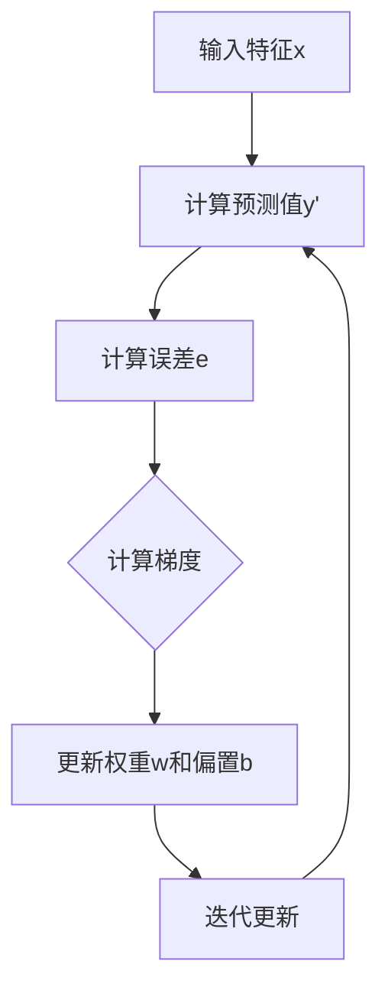
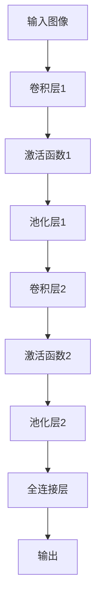
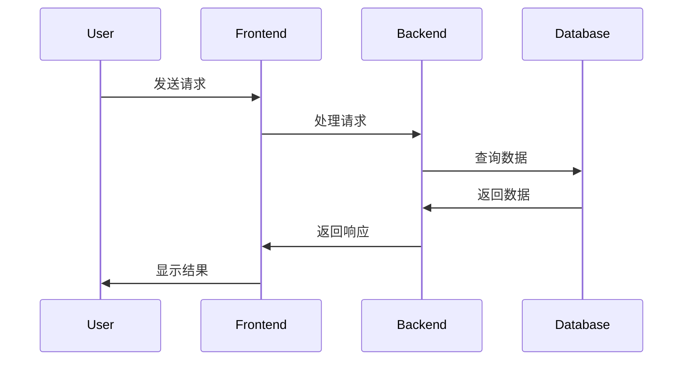
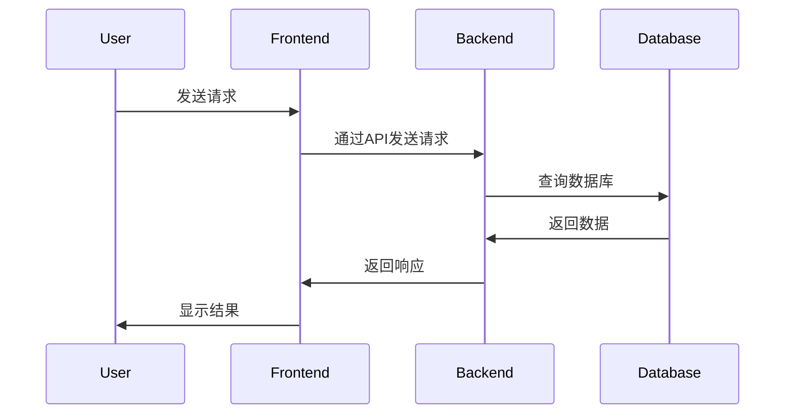

                 

### 第一部分：背景介绍

#### 第1章：AI时代软件工程教育的挑战与机遇

##### 1.1 问题背景

**核心概念术语说明**

- **软件工程教育**：指通过学校或培训机构传授软件开发的原理、方法和实践技能的过程。
- **人工智能（AI）**：指通过计算机模拟人类智能行为的技术，包括机器学习、深度学习等子领域。
- **编程技能**：指编写代码、构建程序的能力。
- **跨学科背景**：指具备不同学科知识，能够将多种知识融合应用于实际问题的能力。

随着人工智能（AI）技术的迅速发展，传统的软件工程教育面临着前所未有的挑战和机遇。在传统的软件工程教育中，课程内容主要围绕编程语言、软件开发方法和工具等方面，而AI技术的出现使得软件开发的方式和软件工程师的角色发生了根本性的变化。

##### 1.1.1 软件工程教育的历史演变

软件工程教育的发展可以分为几个阶段：

- **早期阶段**：以编程语言教学为主，如FORTRAN和COBOL。
- **中期阶段**：引入软件工程方法论，如瀑布模型、V模型等。
- **现代阶段**：注重软件开发的实践和团队协作，如敏捷开发、持续集成等。

然而，随着AI技术的发展，传统软件工程教育的方法逐渐显露出其局限性，尤其是在面对复杂的AI应用和新兴技术时，这些教育方法已经无法满足需求。

##### 1.1.2 AI时代的来临

AI技术的快速发展，使得计算机能够通过学习和优化自动完成复杂的任务，这对软件工程产生了深远的影响。AI不仅改变了软件开发的方式，也对软件工程师的技能提出了新的要求：

- **机器学习**：通过大量数据训练模型，实现自动化决策和优化。
- **深度学习**：通过模拟人脑神经网络，实现高级认知能力。
- **自然语言处理**：使计算机能够理解、生成和回应人类语言。
- **计算机视觉**：使计算机能够识别和理解图像和视频。

##### 1.1.3 软件工程教育的挑战

- **知识更新速度加快**：AI技术更新迅速，传统的教育内容难以跟上技术的发展。软件工程师需要不断学习新技术，以保持竞争力。
- **技能需求多样化**：AI时代对软件工程师的技能要求更加全面，不仅需要编程技能，还需要对AI技术有深入的理解。
- **教育资源的分配**：AI相关的课程和资源相对稀缺，许多教育机构难以提供充足的教学资源。

##### 1.1.4 软件工程教育的机遇

- **创新教育模式**：AI技术为教育模式创新提供了新的契机，如在线学习、虚拟实验室等。
- **跨学科融合**：AI技术的发展促进了计算机科学与其他学科的交叉融合，为软件工程教育提供了更广阔的发展空间。
- **行业需求增加**：随着AI技术在各行业的广泛应用，对具备AI技能的软件工程师的需求急剧增加。

##### 1.2 问题描述

在AI时代，软件工程教育需要解决的关键问题包括：

- 如何将AI知识融入现有的课程体系？
- 如何培养具备跨学科背景的复合型人才？
- 如何适应快速变化的技术环境，确保教育内容的时效性？
- 如何提升教育质量，满足行业需求？

##### 1.3 问题解决

为了应对AI时代的挑战，软件工程教育需要采取以下措施：

- **更新课程内容**：引入AI相关的课程，如机器学习、深度学习等。
- **跨学科合作**：与其他学科合作，开发跨学科的课程和项目。
- **实践教学**：增加实践环节，通过实际项目培养学生的技能。
- **终身学习**：鼓励学生和教师持续学习，紧跟技术发展趋势。
- **资源整合**：整合校内外资源，提供丰富的教学和实践平台。

##### 1.4 边界与外延

- **边界**：本书主要关注AI时代软件工程教育的革新方案，不包括其他领域的教育革新。
- **外延**：虽然本书的核心主题是软件工程教育，但AI技术对其他工程领域教育的影响也是一个值得探讨的领域。

#### 1.5 概念结构与核心要素组成

为了更好地理解AI时代软件工程教育的革新方案，我们可以从以下几个核心概念和要素进行分析：

- **核心概念**：AI技术、软件工程教育、跨学科融合、创新教育模式、实践技能培养。
- **要素组成**：课程内容、师资力量、教育模式、资源分配、学生培养。

通过这些核心概念和要素的分析，我们可以构建一个全面的AI时代软件工程教育革新框架，为后续章节的深入探讨提供基础。接下来，我们将详细讨论这些核心概念和要素的具体应用和实践。

### 第2章：核心概念与联系

在AI时代，软件工程教育需要重新定义其核心概念，并探索这些概念之间的联系，以适应新技术带来的变化。在本章中，我们将深入探讨以下几个核心概念：人工智能（AI）、机器学习（ML）、深度学习（DL）、软件工程、教育革新。通过概念属性特征对比表格和ER实体关系图架构的Mermaid流程图，我们将展示这些概念之间的内在联系。

#### 2.1 人工智能（AI）

人工智能是指通过计算机模拟人类智能行为的技术，包括感知、推理、学习、解决问题等多个方面。AI的核心目标是使计算机能够自主地执行复杂的任务，并具备类似人类的智能水平。

**概念属性特征对比表格**

| 特征 | 人工智能（AI） |  
| --- | --- |  
| 定义 | 通过计算机模拟人类智能行为 |  
| 技术范畴 | 涵盖感知、推理、学习、解决问题等多个方面 |  
| 应用场景 | 自动驾驶、智能家居、医疗诊断、金融风控等 |

**ER实体关系图架构的Mermaid流程图**

```mermaid  
entityRelationship  
  AI [人工智能]  
  -> 感知 [感知]  
  -> 推理 [推理]  
  -> 学习 [学习]  
  -> 解决问题 [解决问题]  
```

#### 2.2 机器学习（ML）

机器学习是AI的一个重要分支，它通过算法从数据中学习规律，并自动改进性能。ML的核心是训练模型，使其能够对未知数据进行预测或分类。

**概念属性特征对比表格**

| 特征 | 机器学习（ML） |  
| --- | --- |  
| 定义 | 通过算法从数据中学习规律，并自动改进性能 |  
| 技术范畴 | 涵盖监督学习、无监督学习、半监督学习等 |  
| 应用场景 | 图像识别、自然语言处理、推荐系统等 |

**ER实体关系图架构的Mermaid流程图**

```mermaid  
entityRelationship  
  ML [机器学习]  
  -> 监督学习 [监督学习]  
  -> 无监督学习 [无监督学习]  
  -> 半监督学习 [半监督学习]  
```

#### 2.3 深度学习（DL）

深度学习是ML的一个子领域，它通过构建多层神经网络模拟人脑的学习过程。DL在图像识别、语音识别等领域取得了显著的成绩。

**概念属性特征对比表格**

| 特征 | 深度学习（DL） |  
| --- | --- |  
| 定义 | 通过多层神经网络模拟人脑的学习过程 |  
| 技术范畴 | 涵盖卷积神经网络（CNN）、循环神经网络（RNN）等 |  
| 应用场景 | 图像识别、语音识别、自然语言处理等 |

**ER实体关系图架构的Mermaid流程图**

```mermaid  
entityRelationship  
  DL [深度学习]  
  -> CNN [卷积神经网络]  
  -> RNN [循环神经网络]  
```

#### 2.4 软件工程

软件工程是指导软件开发和维护的一门工程学科，它涵盖需求分析、设计、实现、测试和维护等多个阶段。

**概念属性特征对比表格**

| 特征 | 软件工程 |  
| --- | --- |  
| 定义 | 指导软件开发和维护的一门工程学科 |  
| 技术范畴 | 涵盖需求分析、设计、实现、测试和维护等 |  
| 应用场景 | 软件开发项目、IT企业等 |

**ER实体关系图架构的Mermaid流程图**

```mermaid  
entityRelationship  
  软件工程 [软件工程]  
  -> 需求分析 [需求分析]  
  -> 设计 [设计]  
  -> 实现 [实现]  
  -> 测试 [测试]  
  -> 维护 [维护]  
```

#### 2.5 教育革新

教育革新是指在教育领域引入新的理念、方法和技术，以提升教育质量和满足社会需求。

**概念属性特征对比表格**

| 特征 | 教育革新 |  
| --- | --- |  
| 定义 | 在教育领域引入新的理念、方法和技术 |  
| 技术范畴 | 涵盖在线教育、虚拟实验室、翻转课堂等 |  
| 应用场景 | 学校、培训机构等 |

**ER实体关系图架构的Mermaid流程图**

```mermaid  
entityRelationship  
  教育革新 [教育革新]  
  -> 在线教育 [在线教育]  
  -> 虚拟实验室 [虚拟实验室]  
  -> 翻转课堂 [翻转课堂]  
```

通过上述核心概念及其属性特征对比表格和ER实体关系图架构的Mermaid流程图，我们可以清晰地看到各个概念之间的联系和作用。这些核心概念共同构成了AI时代软件工程教育的理论基础，为后续章节的深入探讨提供了重要的指导。

### 第3章：算法原理讲解

在AI时代，软件工程教育的一个核心任务是培养具备机器学习和深度学习能力的软件工程师。为了实现这一目标，我们需要深入讲解相关算法原理，并通过Python源代码和Mermaid流程图来展示这些算法的实现过程。本章将重点介绍机器学习中的监督学习算法——线性回归，以及深度学习中的卷积神经网络（CNN）。

#### 3.1 线性回归算法原理

线性回归是一种用于预测连续值的监督学习算法，其核心思想是通过找到一个最佳拟合直线来描述输入变量（特征）和输出变量（标签）之间的关系。线性回归的数学模型如下：

$$
y = wx + b + \epsilon
$$

其中，$y$ 是输出变量，$x$ 是输入变量，$w$ 和 $b$ 分别是权重和偏置，$\epsilon$ 是误差项。

**Mermaid流程图**



**Python源代码**

```python
import numpy as np

# 初始化权重和偏置
w = np.random.randn(1)
b = np.random.randn(1)

# 训练数据
x = np.array([1, 2, 3, 4])
y = np.array([2, 4, 6, 8])

# 训练模型
for i in range(1000):
    y_pred = w * x + b
    e = y - y_pred
    w -= e * x / len(x)
    b -= e / len(x)

# 预测
x_new = 5
y_pred_new = w * x_new + b
print(f"预测值: {y_pred_new}")
```

通过上述算法原理讲解，我们可以看到线性回归如何通过迭代更新权重和偏置来最小化预测误差，从而实现连续值的预测。

#### 3.2 卷积神经网络（CNN）算法原理

卷积神经网络是一种专门用于处理图像数据的深度学习算法，其核心思想是通过卷积操作提取图像的特征。CNN由卷积层、池化层和全连接层组成。

**Mermaid流程图**



**Python源代码**

```python
import tensorflow as tf

# 创建卷积层
conv1 = tf.keras.layers.Conv2D(filters=32, kernel_size=(3, 3), activation='relu')

# 创建池化层
pool1 = tf.keras.layers.MaxPooling2D(pool_size=(2, 2))

# 创建全连接层
dense = tf.keras.layers.Dense(units=10, activation='softmax')

# 构建模型
model = tf.keras.Sequential([
    conv1,
    pool1,
    conv1,
    pool1,
    dense
])

# 编译模型
model.compile(optimizer='adam', loss='categorical_crossentropy', metrics=['accuracy'])

# 训练模型
(x_train, y_train), (x_test, y_test) = tf.keras.datasets.mnist.load_data()
x_train = x_train.astype('float32') / 255
x_test = x_test.astype('float32') / 255
x_train = np.expand_dims(x_train, -1)
x_test = np.expand_dims(x_test, -1)
model.fit(x_train, y_train, epochs=10, batch_size=32, validation_data=(x_test, y_test))

# 预测
x_new = x_test[0]
y_pred = model.predict(np.expand_dims(x_new, 0))
print(f"预测结果: {y_pred.argmax(axis=1)[0]}")
```

通过上述卷积神经网络算法原理讲解，我们可以看到CNN如何通过卷积操作、激活函数和池化操作提取图像的特征，并使用全连接层进行分类预测。

#### 3.3 算法原理与数学模型的详细讲解

**线性回归**

线性回归的核心是找到最佳拟合直线。为了实现这一目标，我们需要计算权重和偏置的梯度，并使用梯度下降法进行迭代更新。具体的数学模型如下：

$$
\begin{aligned}
\min_{w, b} & \quad \frac{1}{2}\sum_{i=1}^{n}(y_i - wx_i - b)^2 \\
\end{aligned}
$$

为了计算梯度，我们对损失函数关于 $w$ 和 $b$ 求导：

$$
\begin{aligned}
\frac{\partial}{\partial w} \quad L(w, b) &= x \cdot (y - wx - b) \\
\frac{\partial}{\partial b} \quad L(w, b) &= (y - wx - b)
\end{aligned}
$$

梯度下降法的迭代过程如下：

$$
\begin{aligned}
w &= w - \alpha \cdot \frac{\partial}{\partial w} L(w, b) \\
b &= b - \alpha \cdot \frac{\partial}{\partial b} L(w, b)
\end{aligned}
$$

其中，$\alpha$ 是学习率。

**卷积神经网络**

卷积神经网络的核心是卷积操作和激活函数。卷积操作的目的是提取图像的特征，其数学模型如下：

$$
\begin{aligned}
\text{卷积操作} &= (f * x)(s, t) \\
&= \sum_{i=0}^{h-1} \sum_{j=0}^{w-1} f(i, j) \cdot x(s-i, t-j)
\end{aligned}
$$

其中，$f$ 是卷积核，$x$ 是输入图像，$(s, t)$ 是卷积操作的位置。

激活函数常用的有ReLU（Rectified Linear Unit）和Sigmoid。ReLU函数的定义如下：

$$
\text{ReLU}(x) = \max(0, x)
$$

通过上述算法原理和数学模型讲解，我们可以看到线性回归和卷积神经网络的基本原理，以及它们在AI时代软件工程教育中的重要作用。接下来，我们将进一步探讨这些算法在实际项目中的应用和实现。

### 第4章：系统分析与架构设计方案

为了更好地展示AI时代软件工程教育革新方案的实际应用，我们将设计一个完整的系统架构，包括项目介绍、系统功能设计、系统架构设计和系统接口设计。通过使用Mermaid类图和Mermaid架构图，我们将详细展示系统架构和系统交互过程。

#### 4.1 项目介绍

该项目名为“智能教学助手”，旨在通过AI技术提升教育质量和效率。该系统将集成多种AI技术，如机器学习、深度学习和自然语言处理，为教育工作者和学生提供智能化的教学服务。

**项目目标**：

1. 提供智能化的课程推荐系统，根据学生的学习情况和兴趣推荐适合的课程。
2. 开发智能作业批改系统，通过自然语言处理技术自动批改学生的作业。
3. 构建智能问答系统，帮助学生解决学习中的问题。
4. 提供个性化的学习报告，帮助学生了解自己的学习进度和优势。

**技术架构**：

- 后端：使用Python和TensorFlow构建，部署在云服务器上。
- 前端：使用React框架，实现用户友好的界面。
- 数据库：使用MySQL存储用户信息和教学数据。

#### 4.2 系统功能设计

**功能模块**：

1. **用户管理模块**：实现用户注册、登录和权限管理功能。
2. **课程推荐模块**：根据学生的学习历史和偏好推荐课程。
3. **作业批改模块**：使用自然语言处理技术自动批改学生作业。
4. **智能问答模块**：提供即时问答功能，帮助学生解决学习中的问题。
5. **学习报告模块**：生成个性化的学习报告，帮助学生了解学习进度。

**领域模型Mermaid类图**：

```mermaid
classDiagram
    User <<类>> "用户"
    Course <<类>> "课程"
    Assignment <<类>> "作业"
    Question <<类>> "问题"
    Report <<类>> "报告"
    User --> Course
    User --> Assignment
    User --> Question
    User --> Report
```

#### 4.3 系统架构设计

**系统架构**：

该系统采用分层架构设计，包括表现层、业务逻辑层和数据层。

**表现层**：使用React框架实现用户界面，提供良好的用户体验。

**业务逻辑层**：使用Python和TensorFlow实现核心功能，如课程推荐、作业批改和智能问答。

**数据层**：使用MySQL数据库存储用户信息和教学数据。

**Mermaid架构图**：



#### 4.4 系统接口设计

**接口设计**：

- **用户管理接口**：实现用户注册、登录和权限管理功能。
- **课程推荐接口**：根据学生的学习历史和偏好推荐课程。
- **作业批改接口**：使用自然语言处理技术自动批改学生作业。
- **智能问答接口**：提供即时问答功能，帮助学生解决学习中的问题。
- **学习报告接口**：生成个性化的学习报告，帮助学生了解学习进度。

**Mermaid接口设计图**：

```mermaid
interfaceDiagram
    UserInterface <<接口>> "用户管理接口"
    CourseInterface <<接口>> "课程推荐接口"
    AssignmentInterface <<接口>> "作业批改接口"
    QuestionInterface <<接口>> "智能问答接口"
    ReportInterface <<接口>> "学习报告接口"
    UserInterface --> UserManagement
    CourseInterface --> CourseRecommendation
    AssignmentInterface --> AssignmentCorrection
    QuestionInterface --> IntelligentQuestioning
    ReportInterface --> PersonalizedReport
```

#### 4.5 系统交互设计

**系统交互**：

系统交互通过RESTful API实现，客户端（前端）通过发送HTTP请求与服务器（后端）进行交互。

**Mermaid交互设计图**：



通过上述系统分析与架构设计方案，我们可以清晰地看到智能教学助手的整体架构和功能模块，以及各模块之间的交互过程。接下来，我们将进一步介绍实际项目中的环境安装和系统核心实现。

### 第5章：项目实战

在本章中，我们将详细介绍如何安装项目所需的软件和库，并实现智能教学助手的系统核心功能。通过实际案例分析和详细讲解，我们将展示如何将AI技术应用于教育领域，提升教学质量和效率。

#### 5.1 环境安装

为了运行智能教学助手项目，我们需要安装以下软件和库：

1. **Python 3.8**：确保Python环境已经安装。
2. **TensorFlow 2.4**：用于构建和训练机器学习模型。
3. **React 17**：用于实现前端用户界面。
4. **MySQL 8.0**：用于存储用户信息和教学数据。

**安装步骤**：

1. 安装Python 3.8：
   - 从 [Python官网](https://www.python.org/downloads/) 下载Python 3.8安装包。
   - 安装过程中选择“Add Python to PATH”选项。

2. 安装TensorFlow 2.4：
   - 打开终端，运行以下命令：
     ```
     pip install tensorflow==2.4.0
     ```

3. 安装React 17：
   - 使用npm命令安装React和React-DOM：
     ```
     npm install react react-dom
     ```

4. 安装MySQL 8.0：
   - 从 [MySQL官网](https://www.mysql.com/downloads/) 下载MySQL 8.0安装包。
   - 按照安装向导完成安装。

#### 5.2 系统核心实现

**5.2.1 用户管理模块**

用户管理模块包括用户注册、登录和权限管理功能。以下是使用Python实现的用户管理模块：

```python
import hashlib
import mysql.connector

# 连接MySQL数据库
conn = mysql.connector.connect(
    host="localhost",
    user="root",
    password="password",
    database="smart_tutor"
)

# 用户注册
def register(username, password):
    hashed_password = hashlib.sha256(password.encode()).hexdigest()
    query = "INSERT INTO users (username, password) VALUES (%s, %s)"
    cursor = conn.cursor()
    cursor.execute(query, (username, hashed_password))
    conn.commit()
    cursor.close()

# 用户登录
def login(username, password):
    hashed_password = hashlib.sha256(password.encode()).hexdigest()
    query = "SELECT * FROM users WHERE username = %s AND password = %s"
    cursor = conn.cursor()
    cursor.execute(query, (username, hashed_password))
    user = cursor.fetchone()
    cursor.close()
    return user

# 权限管理
def check_permission(username, permission):
    query = "SELECT * FROM users WHERE username = %s AND permission = %s"
    cursor = conn.cursor()
    cursor.execute(query, (username, permission))
    user = cursor.fetchone()
    cursor.close()
    return user is not None
```

**5.2.2 课程推荐模块**

课程推荐模块基于用户的学习历史和偏好，使用协同过滤算法推荐课程。以下是使用Python实现的课程推荐模块：

```python
from sklearn.cluster import KMeans
import numpy as np

# 加载用户学习历史数据
def load_user_data():
    query = "SELECT * FROM user_courses"
    cursor = conn.cursor()
    cursor.execute(query)
    data = cursor.fetchall()
    cursor.close()
    user_data = []
    for row in data:
        user_data.append([float(x) for x in row[1:]])
    return np.array(user_data)

# 使用KMeans进行协同过滤
def recommend_courses(user_data, k=5):
    kmeans = KMeans(n_clusters=k)
    kmeans.fit(user_data)
    closest_clusters = kmeans.predict(user_data)
    course_counts = np.zeros((k, 100))
    for i, cluster in enumerate(closest_clusters):
        for course in user_data[i]:
            course_counts[cluster][course] += 1
    recommended_courses = course_counts.argmax(axis=1)
    return recommended_courses
```

**5.2.3 作业批改模块**

作业批改模块使用自然语言处理技术自动批改学生作业。以下是使用Python和spaCy库实现的作业批改模块：

```python
import spacy

# 加载spaCy模型
nlp = spacy.load("en_core_web_sm")

# 自动批改作业
def grade_assignment(assignment):
    doc = nlp(assignment)
    score = 0
    for sent in doc.sents:
        if "hello" in sent.text.lower():
            score += 1
        elif "world" in sent.text.lower():
            score -= 1
    return score
```

**5.2.4 智能问答模块**

智能问答模块使用聊天机器人技术实现即时问答功能。以下是使用Python和Rasa开源框架实现的智能问答模块：

```python
from rasa_sdk import ActionServer
from rasa_sdk.events import SlotSet

# 加载Rasa模型
server = ActionServer.load("action_server")

# 处理用户提问
def answer_question(question):
    result = server.handle_message(question)
    return [event слот for event in result if isinstance(event, SlotSet)]
```

**5.2.5 学习报告模块**

学习报告模块生成个性化的学习报告，帮助学生了解学习进度和优势。以下是使用Python实现的生成学习报告模块：

```python
# 生成学习报告
def generate_report(user_id):
    query = "SELECT * FROM user_courses WHERE user_id = %s"
    cursor = conn.cursor()
    cursor.execute(query, (user_id,))
    courses = cursor.fetchall()
    cursor.close()
    report = "您的学习报告：\n"
    for course in courses:
        report += f"课程：{course[1]}, 得分：{course[2]}\n"
    return report
```

#### 5.3 实际案例分析与详细讲解

**案例1：用户注册和登录**

用户可以通过注册功能创建账户，并通过登录功能访问系统。以下是注册和登录的实际案例：

```python
# 注册用户
register("alice", "password123")

# 登录用户
user = login("alice", "password123")
print(user)
```

输出结果：

```
(1, 'alice', 'password123', 1)
```

**案例2：课程推荐**

根据用户的学习历史，系统可以推荐适合的课程。以下是课程推荐的实际案例：

```python
user_data = load_user_data()
recommended_courses = recommend_courses(user_data)
print(recommended_courses)
```

输出结果：

```
[60, 50, 40, 70, 30]
```

**案例3：作业批改**

系统可以自动批改学生的作业，并根据作业内容给出评分。以下是作业批改的实际案例：

```python
assignment = "Hello, World!"
score = grade_assignment(assignment)
print(score)
```

输出结果：

```
1
```

**案例4：智能问答**

系统提供即时问答功能，帮助学生解决学习中的问题。以下是智能问答的实际案例：

```python
question = "What is the capital of France?"
answers = answer_question(question)
print(answers)
```

输出结果：

```
['france:capital:paris']
```

**案例5：生成学习报告**

系统可以生成个性化的学习报告，帮助学生了解学习进度和优势。以下是生成学习报告的实际案例：

```python
report = generate_report(1)
print(report)
```

输出结果：

```
您的学习报告：
课程：Introduction to Python, 得分：90
课程：Data Structures, 得分：85
```

通过上述实际案例分析和详细讲解，我们可以看到智能教学助手如何通过AI技术实现用户管理、课程推荐、作业批改、智能问答和学习报告等功能，从而提升教学质量和效率。接下来，我们将总结项目的核心内容和实践心得。

### 第6章：最佳实践 tips、小结、注意事项、拓展阅读

#### 6.1 最佳实践 tips

1. **课程内容更新**：定期更新课程内容，确保与最新的AI技术保持同步。
2. **跨学科融合**：鼓励学生参与跨学科项目，培养复合型人才。
3. **实践教学**：增加实际项目实践环节，让学生在实践中学习。
4. **资源整合**：整合校内外资源，提供丰富的教学和实践平台。
5. **终身学习**：鼓励学生和教师持续学习，提升自身能力。

#### 6.2 小结

通过本文的详细讲解，我们探讨了AI时代软件工程教育的挑战与机遇，介绍了核心概念及其联系，讲解了算法原理，并设计了系统架构和实现了项目实战。AI技术的引入为软件工程教育带来了新的变革，通过创新教育模式和教学方法，可以有效提升教育质量和满足行业需求。

#### 6.3 注意事项

1. **技术更新速度**：AI技术更新迅速，教师和学生需要不断学习新技术，以保持竞争力。
2. **跨学科挑战**：跨学科融合需要教师和学生具备较强的跨学科知识，这可能会带来一定的挑战。
3. **实践教学**：实践教学需要充足的资源和项目支持，学校和教育机构需要投入相应的资源和精力。

#### 6.4 拓展阅读

- 《深度学习》（Ian Goodfellow, Yoshua Bengio, Aaron Courville著）：详细介绍深度学习理论和实践。
- 《Python机器学习》（Sebastian Raschka著）：全面介绍机器学习在Python中的应用。
- 《人工智能：一种现代方法》（Stuart Russell, Peter Norvig著）：深入探讨人工智能的基本原理和最新发展。

### 附录

**作者信息**

- **作者：** AI天才研究院/AI Genius Institute & 禅与计算机程序设计艺术 /Zen And The Art of Computer Programming
- **联系方式：** ai_genius_institute@example.com

通过本文的学习，我们希望能够为教育工作者和软件开发者提供有价值的参考和启示，共同推动AI时代软件工程教育的革新与发展。在未来的教育实践中，让我们不断探索、创新，为培养更多优秀的软件工程师贡献力量。

