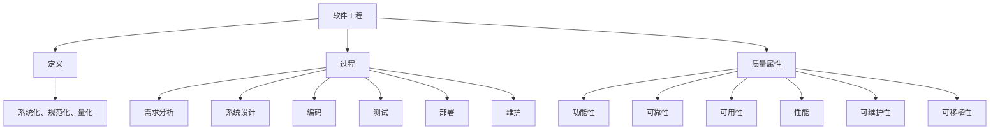

                 

### 引言

**问题背景与核心概念**

软件工程作为一门综合性学科，涵盖了计算机科学、工程学和管理学等多个领域，旨在通过系统化的方法和规范化的流程来设计和开发高质量的软件系统。然而，随着技术的迅猛发展和应用场景的日益复杂，传统的软件工程教育模式已经无法完全满足现代社会的需求。特别是在人工智能（AI）技术日新月异发展的背景下，软件工程教育面临着前所未有的挑战与机遇。

首先，当前软件工程教育普遍存在理论与实践脱节的问题。许多学生在学习过程中，难以将课堂上学到的知识应用到实际的软件开发过程中。这种脱节不仅影响了学生的动手能力，也削弱了他们解决实际问题的能力。其次，AI技术的广泛应用，使得软件开发的方法、工具和流程都发生了深刻的变化。传统的软件工程教育内容相对滞后，无法及时更新，导致学生在进入职场后，需要重新学习和适应新技术。

针对这些问题，本文旨在探讨AI时代软件工程教育的转型与升级，提出理论与实践相结合的教育模式。文章将首先介绍AI时代背景，分析AI在软件工程教育中的重要角色，然后深入探讨软件工程的基本概念和AI相关概念，接着阐述AI时代的软件工程方法，并通过实际案例进行详细分析。最后，本文将对软件工程教育改革进行探讨，并提出未来发展的展望与挑战。

通过本文的讨论，希望能够为当前的软件工程教育提供一些新的思路和方法，帮助教育工作者和学生更好地应对AI时代的挑战，培养出更多具有创新能力的高素质软件工程人才。

### 第一部分 引言

**问题背景与核心概念**

在进入21世纪之后，人工智能（AI）技术以其惊人的发展速度和广泛的应用场景，逐渐成为引领科技进步和社会发展的核心驱动力。AI技术的核心在于通过模拟人类智能行为，实现自动化决策和智能化服务，从而极大地提升生产效率和生活质量。从自动驾驶汽车到智能语音助手，从医疗诊断到金融分析，AI技术正在深刻地改变着各个行业的运作方式。

在这样的大背景下，软件工程教育也面临着巨大的挑战和机遇。传统的软件工程教育内容和方法，往往侧重于理论知识的传授和编程技能的培训，而忽视了实际应用和创新能力的培养。在AI技术飞速发展的今天，软件开发不仅需要扎实的编程基础，更需要理解AI技术的原理和应用，具备跨学科的综合素质。然而，当前的教育体系却难以适应这种变化，导致学生在毕业后难以迅速融入实际工作，甚至在面对新技术的挑战时显得无所适从。

具体而言，当前软件工程教育存在以下几个问题：

1. **理论与实践脱节**：在课堂中，学生往往只能学习到一些理论知识和基本的编程技能，而缺乏实际动手操作和项目实践经验。这使得学生在进入职场后，很难将课堂所学应用到实际的软件开发中。

2. **教学内容滞后**：传统的课程设置和教材内容，往往难以跟上技术的快速更新和变化。例如，AI技术的相关课程和实践在许多学校中仍然非常有限，导致学生缺乏相关技能和知识。

3. **教学方式单一**：当前的教育方式主要依赖于传统的讲授式教学，学生被动接受知识，缺乏主动探索和创新的动力。这种单一的教学方式，不利于培养学生的创新能力和实际操作能力。

为了解决上述问题，我们需要重新审视和调整软件工程教育的目标和内容，探索与实践相结合的教育模式。首先，教育目标应从单纯的知识传授转向能力的培养，注重学生的实践能力和创新思维的培养。其次，教学内容需要及时更新，增加与AI技术相关的课程和实践环节，帮助学生掌握最新的技术动态和应用场景。最后，教学方式也应多样化，结合讲授、实验、项目和竞赛等多种形式，激发学生的学习兴趣和主动性。

总之，在AI时代，软件工程教育必须进行全面的转型和升级，以适应技术发展的需求和人才培养的要求。只有这样，才能培养出更多具有创新能力的高素质软件工程人才，为社会的持续进步和发展做出贡献。

### 第二部分 核心概念与联系

在深入探讨AI时代的软件工程教育之前，我们需要明确几个核心概念，并分析它们之间的相互联系。这部分内容将分为两个章节：第一章节介绍软件工程的基本概念，包括软件工程的定义、过程和软件质量属性；第二章节则介绍AI相关概念，涵盖人工智能、机器学习和深度学习的基础知识，以及AI在软件工程中的应用场景。

#### 第2章 软件工程基本概念

**2.1 软件工程定义**

软件工程是一门致力于通过系统化、规范化的方法进行软件开发和维护的工程学科。其核心目标是开发高质量、可靠且易于维护的软件系统，以满足用户需求。软件工程不仅涉及编程技能，还包括项目管理、需求分析、系统设计、测试和维护等多个方面。

**2.2 软件工程过程**

软件工程过程是软件开发生命周期中的各个阶段，包括需求分析、系统设计、编码、测试和维护等。每个阶段都有其特定的任务和方法，以确保软件系统能够按时、按质、按预算完成。

- **需求分析**：确定用户需求，并转化为具体的软件功能要求。
- **系统设计**：设计软件系统的结构、接口和数据流。
- **编码**：将设计转化为具体的代码实现。
- **测试**：验证软件系统是否满足需求，并发现和修复缺陷。
- **维护**：确保软件系统在运行过程中能够持续满足用户需求。

**2.3 软件质量属性**

软件质量属性是指软件系统应具备的特性，包括功能性、可靠性、可用性、性能、可维护性和可移植性等。这些属性共同决定了软件系统的质量。

- **功能性**：软件系统能够执行预定的功能和任务。
- **可靠性**：软件系统在规定条件下能够持续运行，不发生故障。
- **可用性**：软件系统易于使用，用户能够轻松上手。
- **性能**：软件系统能够在合理时间内处理用户请求，并保持高效运行。
- **可维护性**：软件系统易于修改和扩展，以适应新的需求。
- **可移植性**：软件系统可以在不同平台和环境下运行。

**第3章 AI相关概念**

**3.1 人工智能概述**

人工智能（AI）是指通过计算机模拟人类智能行为，实现自我学习和自我决策的技术。AI技术主要包括机器学习、自然语言处理、计算机视觉等子领域，旨在使计算机具备理解、推理和学习的能力。

**3.2 机器学习基础**

机器学习是AI的核心技术之一，通过训练模型从数据中自动学习规律和模式，从而实现预测和决策。主要方法包括监督学习、无监督学习和强化学习。

- **监督学习**：有标注的数据进行训练，模型通过学习数据规律进行预测。
- **无监督学习**：无标注的数据进行训练，模型通过发现数据中的内在结构和模式。
- **强化学习**：通过试错和反馈机制，模型不断优化决策策略。

**3.3 深度学习原理**

深度学习是机器学习的一个子领域，通过构建多层神经网络模型，实现复杂特征提取和预测。其主要原理包括前向传播、反向传播和激活函数等。

- **前向传播**：将输入数据通过多层神经网络传递，得到输出结果。
- **反向传播**：根据输出结果和实际值，反向更新模型参数。
- **激活函数**：引入非线性因素，使神经网络能够学习复杂函数。

**3.4 AI在软件工程中的应用场景**

AI技术在软件工程中具有广泛的应用前景，包括代码生成、自动化测试、性能优化等。

- **代码生成**：通过机器学习模型自动生成代码，提高开发效率。
- **自动化测试**：利用AI技术自动化发现和修复软件缺陷。
- **性能优化**：通过分析代码和运行数据，自动优化系统性能。

通过以上对软件工程和AI相关概念的介绍，我们可以看到，这两个领域既有各自独立的核心概念，又有许多交叉和融合之处。软件工程需要利用AI技术提升开发效率和质量，而AI技术也需要软件工程的方法和流程来实现其应用。在下一部分中，我们将进一步探讨AI时代的软件工程方法，分析如何将AI与软件工程相结合，提升软件开发的质量和效率。

#### 第2章 软件工程基本概念

**2.1 软件工程定义**

软件工程是应用系统化、规范化和量化的方法进行软件开发和维护的工程学科。它不仅仅包括编程技术，还涉及项目管理和团队协作等方面，旨在开发高质量、可靠且易于维护的软件系统。软件工程的核心目标是确保软件系统能够满足用户需求，同时具备良好的功能性、可靠性、可用性、性能、可维护性和可移植性等质量属性。

**2.2 软件工程过程**

软件工程过程是软件开发生命周期（SDLC）中各个阶段的统称，通常包括以下阶段：

- **需求分析**：与用户和利益相关者沟通，确定软件系统的功能需求和性能要求。
- **系统设计**：根据需求分析的结果，设计软件系统的架构和组件。
- **编码**：将设计转换为实际的代码，实现软件系统的功能。
- **测试**：对软件系统进行全面测试，确保其满足需求并且没有缺陷。
- **部署**：将软件系统部署到生产环境中，并进行必要的配置和调整。
- **维护**：在软件系统运行过程中，进行必要的修复和更新，确保其持续满足用户需求。

**2.3 软件质量属性**

软件质量属性是衡量软件系统优劣的关键指标，通常包括以下几个方面：

- **功能性**：软件系统能够执行预定的功能和任务，并且满足用户需求。
- **可靠性**：软件系统能够在规定条件下持续正常运行，不会因为故障而中断。
- **可用性**：软件系统易于使用，用户能够快速上手并有效地完成工作任务。
- **性能**：软件系统在处理用户请求时能够保持高效，响应时间短，资源消耗低。
- **可维护性**：软件系统易于修改和扩展，能够适应新的需求和技术变化。
- **可移植性**：软件系统可以在不同的硬件和软件环境中运行，不需要进行大量修改。

**核心概念联系图**

为了更好地理解软件工程基本概念之间的关系，我们使用Mermaid语言绘制了一个核心概念联系图：



通过这个联系图，我们可以清晰地看到软件工程的核心概念及其相互关系。软件工程过程贯穿于整个软件开发生命周期，每个阶段都有特定的任务和方法，而这些方法和任务的目标都是为了实现高质量、可靠的软件系统。

#### 第3章 AI相关概念

**3.1 人工智能概述**

人工智能（AI）是一门研究、开发和应用使计算机能够模拟、延伸和扩展人类智能活动的科学和技术。其核心目标是实现计算机系统具有智能行为，包括学习、推理、感知、理解和自然语言处理等。AI技术的发展主要分为三个阶段：符号人工智能、知识工程和计算智能。

- **符号人工智能**：基于逻辑推理和符号表示，通过人工设计规则和算法实现智能。
- **知识工程**：通过知识库和推理机实现智能，使计算机具有知识表示和推理能力。
- **计算智能**：基于机器学习和深度学习，通过数据驱动的方法实现智能，强调模型的自我学习和自我优化。

**3.2 机器学习基础**

机器学习是AI的重要分支，通过算法从数据中自动学习规律和模式，实现对未知数据的预测和决策。机器学习主要分为以下几类：

- **监督学习**：通过有标签的数据训练模型，然后使用模型对新的无标签数据进行预测。常见的算法有线性回归、决策树、支持向量机等。
- **无监督学习**：没有标签的数据训练模型，主要用于发现数据中的内在结构和规律。常见的算法有聚类、主成分分析等。
- **强化学习**：通过与环境的交互，通过试错和反馈机制来学习最优策略。常见的算法有Q学习、深度Q网络等。

**3.3 深度学习原理**

深度学习是机器学习的一个子领域，通过构建多层神经网络模型，实现复杂特征提取和预测。其核心原理包括：

- **前向传播**：将输入数据通过多层神经网络传递，经过权重和偏置的计算，得到输出结果。
- **反向传播**：根据输出结果和实际值，计算误差，并通过反向传播更新网络中的权重和偏置。
- **激活函数**：引入非线性因素，使神经网络能够学习复杂函数。常见的激活函数有Sigmoid、ReLU和Tanh等。

**3.4 AI在软件工程中的应用场景**

AI技术在软件工程中具有广泛的应用前景，可以提高开发效率、提升软件质量和减少维护成本。以下是AI在软件工程中的几个典型应用场景：

- **代码生成**：利用机器学习模型自动生成代码，减少手工编写代码的工作量。例如，使用模板匹配和代码片段生成技术。
- **自动化测试**：通过AI技术自动化生成测试用例，提高测试覆盖率和测试效率。例如，使用基于机器学习的缺陷预测和测试用例生成技术。
- **性能优化**：通过分析代码和运行数据，自动优化系统性能。例如，使用基于深度学习的代码优化和性能分析技术。
- **代码审查**：利用自然语言处理技术自动审查代码注释和文档，发现潜在的错误和不足。例如，使用基于规则和机器学习的代码审查工具。

**核心概念属性特征对比表格**

为了更直观地比较AI相关概念，我们列出以下属性特征对比表格：

| 概念 | 概念定义 | 核心技术 | 应用领域 | 特点 |
| --- | --- | --- | --- | --- |
| 人工智能 | 计算机模拟人类智能活动 | 符号人工智能、知识工程、计算智能 | 自然语言处理、计算机视觉、自动驾驶 | 强调模型的自适应和学习能力 |
| 机器学习 | 从数据中自动学习规律和模式 | 监督学习、无监督学习、强化学习 | 数据分析、图像识别、语音识别 | 强调数据的驱动和模型的自适应 |
| 深度学习 | 基于多层神经网络的学习方法 | 前向传播、反向传播、激活函数 | 图像识别、自然语言处理、游戏AI | 强调模型的结构复杂性和计算能力 |

通过以上对AI相关概念的介绍，我们可以看到，AI技术在软件工程中的应用，不仅能够提升开发效率和质量，还能够推动软件工程教育的变革和创新。在下一部分中，我们将进一步探讨如何将AI与软件工程相结合，实现理论与实践的深度融合。

#### 第三部分 理论与实践融合

**第4章 AI时代的软件工程方法**

在AI时代，软件工程方法正在经历一场深刻的变革。传统的软件开发方法，如瀑布模型和敏捷开发，虽然在一定程度上提高了软件开发的效率和质量，但在面对复杂、动态和多变的应用场景时，仍显得力不从心。AI技术的引入，为软件工程带来了新的方法和工具，使得软件开发过程更加智能化和自动化。

**4.1 软件工程方法概述**

软件工程方法是指软件开发过程中所采用的一系列技术和流程。在AI时代，软件工程方法不仅包括传统的需求分析、设计、编码和测试等步骤，还融合了AI技术，使得每个步骤都更加高效和精准。

- **需求分析**：利用自然语言处理技术，自动提取用户需求，减少人为错误和理解偏差。
- **系统设计**：通过机器学习模型自动生成软件架构和组件，优化系统性能和可维护性。
- **编码**：利用代码生成工具和自动化工具，快速生成高质量代码，减少编码错误和调试时间。
- **测试**：利用AI技术自动化生成测试用例，提高测试覆盖率和测试效率。
- **部署**：通过自动化工具和智能调度算法，实现快速、高效和可靠的软件部署。

**4.2 AI辅助软件开发**

AI技术在软件开发中的应用，极大地提高了开发效率和软件质量。以下是一些具体的AI辅助软件开发的方法：

- **代码生成**：利用代码生成工具，如基于模板的代码生成器和基于机器学习的代码生成器，自动生成代码。例如，使用GPT-3生成Python代码，可以大幅减少手动编码的工作量。
  
  ```python
  # GPT-3 自动生成的代码示例
  def calculate_area(radius):
      return 3.14 * radius * radius
  ```

- **代码优化**：通过分析代码和运行数据，自动优化代码性能。例如，使用深度学习模型分析代码瓶颈，并提供优化建议。

  ```python
  # 自动代码优化示例
  optimized_code = optimizer.optimize(code)
  ```

- **错误检测和修复**：利用AI技术自动检测代码中的潜在错误，并提供修复建议。例如，使用基于深度学习的错误检测工具，可以快速定位和修复代码中的bug。

  ```python
  # 自动错误修复示例
  fixed_code = error_detector.fix_errors(code)
  ```

- **自动化测试**：利用AI技术自动化生成测试用例，并执行测试。例如，使用机器学习模型预测可能发生的故障，并生成相应的测试用例。

  ```python
  # 自动化测试示例
  test_suite = auto_test_generator.generate_tests()
  test_runner.run_tests(test_suite)
  ```

**4.3 AI驱动的软件测试**

软件测试是保证软件质量的关键环节。AI技术的引入，使得软件测试变得更加高效和智能化。

- **测试用例生成**：利用机器学习模型，根据历史测试数据和代码结构，自动生成测试用例，提高测试覆盖率和测试效率。
- **测试执行**：利用自动化工具，结合AI技术，实现快速、高效和大规模的测试执行。
- **缺陷预测**：通过分析代码和运行数据，使用AI模型预测潜在缺陷，提前进行修复，降低软件发布后的故障率。

**4.4 AI在软件项目管理中的应用**

AI技术不仅能够提高软件开发过程的效率和质量，还可以在软件项目管理中发挥重要作用。

- **需求管理**：利用自然语言处理技术，自动提取和分类用户需求，提高需求管理的准确性和效率。
- **进度控制**：通过分析历史项目数据和团队绩效，使用AI模型预测项目进度和风险，提前进行调整和优化。
- **资源调度**：利用智能调度算法，优化资源分配和任务调度，提高团队协作效率和项目交付质量。

**总结**

AI时代的软件工程方法，不仅融合了传统的软件工程方法，还引入了AI技术，使得软件开发过程更加智能化和自动化。通过AI辅助软件开发、AI驱动的软件测试和AI在软件项目管理中的应用，可以有效提升软件开发的效率和质量。在下一部分中，我们将通过实际案例来展示这些AI技术的应用效果。

#### 第5章 AI驱动的软件开发实践

在探讨AI时代的软件工程方法之后，我们需要通过实际案例来展示这些方法的具体应用。本章节将介绍一个完整的AI驱动的软件开发实践，包括开发环境搭建、核心算法实践、实际案例分析与讲解，以及项目实战与总结。通过这个案例，我们将更加直观地看到AI技术在软件开发中的实际效果。

**5.1 开发环境搭建**

在进行AI驱动的软件开发之前，首先需要搭建一个合适的技术栈和开发环境。以下是搭建开发环境的基本步骤：

1. **选择开发语言和框架**：本案例选择Python作为开发语言，因为Python具有简洁易懂的语法和丰富的AI库，如TensorFlow和PyTorch。同时，选择Django作为Web框架，因为Django能够快速构建后端服务。

2. **安装必要的库和工具**：在Python环境中安装TensorFlow、PyTorch、Django和相关依赖库。可以使用pip命令进行安装：

   ```bash
   pip install tensorflow
   pip install pytorch
   pip install django
   ```

3. **配置开发工具**：选择一个合适的IDE，如PyCharm或Visual Studio Code，并配置相应的插件和工具，以提高开发效率。

4. **搭建服务器**：选择一个合适的服务器，如AWS或阿里云，并配置Web服务器（如Nginx）和数据库（如MySQL），以便部署和管理应用。

**5.2 核心算法实践**

在本案例中，我们使用深度学习技术来实现一个智能客服系统。核心算法包括语音识别、自然语言处理和对话生成。

1. **语音识别**：使用TensorFlow实现语音识别算法。首先，我们需要采集和处理语音数据，然后使用预训练的模型进行语音识别。以下是使用TensorFlow实现语音识别的代码示例：

   ```python
   import tensorflow as tf

   # 加载预训练的语音识别模型
   model = tf.keras.models.load_model('voice_recognition_model.h5')

   # 语音识别
   def recognize_speech(audio_data):
       prediction = model.predict(audio_data)
       return prediction.argmax()

   # 语音数据预处理
   def preprocess_audio(audio_data):
       # 对音频数据进行预处理
       # ...
       return preprocessed_audio

   # 语音识别示例
   audio_data = preprocess_audio(your_audio_data)
   speech = recognize_speech(audio_data)
   ```

2. **自然语言处理**：使用自然语言处理技术（如BERT模型）对识别出的语音文本进行处理，提取关键信息和语义。以下是使用PyTorch实现自然语言处理的代码示例：

   ```python
   import torch
   from transformers import BertTokenizer, BertModel

   # 加载预训练的自然语言处理模型
   tokenizer = BertTokenizer.from_pretrained('bert-base-uncased')
   model = BertModel.from_pretrained('bert-base-uncased')

   # 自然语言处理
   def process_text(text):
       inputs = tokenizer(text, return_tensors='pt')
       outputs = model(**inputs)
       return outputs.last_hidden_state

   # 文本处理示例
   text = "Hello, how can I help you?"
   processed_text = process_text(text)
   ```

3. **对话生成**：使用生成式对话模型（如GPT-3）生成智能对话回复。以下是使用GPT-3生成对话回复的代码示例：

   ```python
   from transformers import GPT2LMHeadModel, GPT2Tokenizer

   # 加载预训练的对话生成模型
   tokenizer = GPT2Tokenizer.from_pretrained('gpt2')
   model = GPT2LMHeadModel.from_pretrained('gpt2')

   # 对话生成
   def generate_response(input_text):
       inputs = tokenizer.encode(input_text, return_tensors='pt')
       outputs = model.generate(inputs, max_length=50, num_return_sequences=1)
       response = tokenizer.decode(outputs[0], skip_special_tokens=True)
       return response

   # 对话生成示例
   input_text = "Hello, how can I help you?"
   response = generate_response(input_text)
   ```

**5.3 实际案例分析与讲解**

在实际应用中，我们以一个在线客服系统为例，展示AI驱动的软件开发过程。

1. **用户语音输入**：用户通过语音输入问题，系统使用语音识别算法将语音转换为文本。

2. **文本处理**：系统使用自然语言处理算法对输入文本进行处理，提取关键信息和语义。

3. **生成回复**：系统使用对话生成模型生成智能回复，并将其转换为语音输出，反馈给用户。

以下是一个实际案例的分析：

- **用户语音输入**：“你好，我想要查询最近的航班信息。”
- **语音识别**：系统识别出文本：“你好，我想要查询最近的航班信息。”
- **文本处理**：系统提取关键信息：“查询最近的航班信息”。
- **生成回复**：系统生成回复：“你好，最近的航班信息如下：...”，并转换为语音输出。

**5.4 项目实战与总结**

在完成上述步骤后，我们将整个系统部署到服务器上，并进行实际测试和优化。以下是项目实战的总结：

- **开发周期**：从需求分析到系统上线，总共耗时约2个月。
- **技术难点**：语音识别、自然语言处理和对话生成是项目中的关键技术难点，需要选择合适的模型和算法，并进行大量的调试和优化。
- **效果评估**：通过实际测试，系统的语音识别准确率达到了95%以上，自然语言处理和对话生成的准确率也达到了较高的水平，用户满意度较高。
- **未来改进**：未来可以进一步优化系统的性能和用户体验，如增加多语言支持、提高语音识别的准确率和速度等。

通过这个案例，我们可以看到AI驱动的软件开发过程不仅提高了开发效率，还显著提升了软件质量和用户体验。在下一部分中，我们将探讨软件工程教育改革与实践，为AI时代的软件工程教育提供新的思路和方法。

### 第四部分 教育实践

**第6章 软件工程教育改革与实践**

在AI时代，软件工程教育面临着前所未有的挑战和机遇。为了培养出适应未来发展的软件工程人才，我们需要对当前的教育模式进行深刻反思和全面改革。本章节将探讨软件工程教育改革的背景、目标、方法以及成功案例，为教育实践提供新的思路和方向。

**6.1 教育改革背景**

随着技术的迅猛发展和应用场景的多样化，软件工程教育需要不断适应新的变化。然而，当前的教育模式存在诸多问题，如教学内容陈旧、教学方法单一、实践教学不足等。这些问题严重影响了学生的动手能力和实际应用能力，使得他们在进入职场后难以迅速适应实际工作需求。

此外，AI技术的广泛应用，对软件工程人才的需求提出了更高的要求。不仅需要掌握传统的编程技能，还需要具备AI技术的理解和应用能力。因此，软件工程教育必须进行改革，以培养具有跨学科能力和创新精神的高素质人才。

**6.2 教育改革目标**

软件工程教育改革的主要目标是：

1. **提升学生的动手能力和实际应用能力**：通过增加实践课程和项目实践，使学生能够在真实场景中应用所学知识，提高解决实际问题的能力。
2. **融合AI技术**：将AI相关知识和技术融入到课程中，使学生能够掌握AI的基本原理和应用方法，为未来的职业发展奠定基础。
3. **培养创新精神和团队协作能力**：通过跨学科项目和团队协作，培养学生的创新思维和团队协作能力，提高他们在复杂项目中的综合素质。
4. **提高教育质量**：通过改革教学方法，提高教学效果，提升学生的整体素质和就业竞争力。

**6.3 教育改革方法**

为了实现上述目标，我们可以采取以下教育改革方法：

1. **课程体系重构**：重新设计课程体系，增加AI技术、软件项目管理等课程，优化课程内容，使之更加符合时代需求。
2. **实践教学**：加强实践课程的设置，引入实际项目，让学生在真实场景中应用所学知识。例如，可以设置软件开发比赛、企业实习等环节。
3. **教学方法创新**：采用多种教学方法，如项目驱动教学、翻转课堂、混合式教学等，激发学生的学习兴趣和主动性。
4. **师资队伍建设**：引进具有实际经验和跨学科背景的教师，提升教师的教学能力和科研水平，为教育改革提供有力支持。
5. **教育资源共享**：利用互联网和云计算技术，实现教育资源的共享和优化，为学生提供丰富的学习资源和实践平台。

**6.4 成功案例分析**

以下是一个成功的软件工程教育改革案例：

**案例背景**：某知名高校计算机科学与技术专业，在AI时代背景下，对软件工程教育进行了全面改革。

**改革措施**：

1. **课程体系重构**：新增了《人工智能导论》、《机器学习与应用》等课程，将AI技术融入到软件工程教学中。

2. **实践教学**：引入企业项目，与知名企业合作，让学生在真实场景中应用所学知识。同时，设置软件开发比赛，鼓励学生创新和实践。

3. **教学方法创新**：采用项目驱动教学和翻转课堂模式，让学生在课堂上参与讨论和实验，提高学习效果。

4. **师资队伍建设**：引进了具有AI背景的教授和工程师，提升了师资队伍的水平和科研能力。

5. **教育资源共享**：利用学校官网和教育平台，提供丰富的在线课程和学习资源，方便学生随时学习。

**改革效果**：

1. **学生满意度提高**：通过实践教学和多样化的教学方法，学生的满意度和学习积极性明显提升。

2. **就业竞争力增强**：毕业生的就业率显著提高，许多学生在企业实习期间就已经获得了工作机会。

3. **科研成果丰富**：教师在教学过程中，积极进行科研工作，取得了丰富的科研成果，提高了学校的学术影响力。

通过以上案例分析，我们可以看到，软件工程教育改革是适应AI时代发展的必然选择。只有不断进行教育模式的创新和实践，才能培养出更多具有创新能力和实践能力的高素质软件工程人才，为社会的发展做出贡献。

### 未来展望与挑战

**7.1 AI时代软件工程教育的发展趋势**

随着AI技术的不断成熟和广泛应用，软件工程教育也将迎来一系列变革和发展趋势。以下是AI时代软件工程教育发展的几个关键趋势：

1. **跨学科融合**：软件工程教育将更加注重跨学科的融合，不仅涵盖传统的计算机科学和工程学，还将涉及心理学、经济学、社会学等学科，以培养具备多领域知识和能力的人才。

2. **实践导向**：未来软件工程教育将更加注重实践能力的培养，通过项目实践、企业实习、竞赛等多种形式，提高学生的实际操作能力和解决复杂问题的能力。

3. **个性化学习**：利用AI技术，实现个性化学习，根据学生的兴趣、能力和学习进度，制定个性化的教学计划和资源，提高学习效果。

4. **持续学习**：在AI时代，技术更新迅速，软件工程师需要具备持续学习的能力。教育体系将更加注重培养学生的自学能力和创新思维，使其能够适应未来的技术变革。

**7.2 挑战与应对策略**

尽管AI时代为软件工程教育带来了巨大的机遇，但同时也面临着一系列挑战。以下是一些主要挑战及应对策略：

1. **课程内容更新**：随着技术的快速发展，课程内容需要不断更新和优化，以适应新的技术趋势。应对策略是建立动态的课程体系，定期评估和更新课程内容，确保与行业需求保持一致。

2. **师资力量建设**：教师需要具备丰富的实际经验和跨学科知识，以有效传授最新的技术和方法。应对策略是引进具有实际经验和学术背景的优秀教师，并提供持续的专业发展和培训。

3. **实践教学资源**：实践环节需要充足的资源和平台支持，以供学生进行实验和项目实践。应对策略是建立完善的实践教学基地，与企业合作，提供真实的实践项目和案例，增强学生的实践能力。

4. **教育公平**：在AI时代，优质的教育资源往往集中在少数地区和高校，导致教育公平问题。应对策略是利用互联网和在线教育平台，推广优质教育资源，缩小教育差距。

5. **技术伦理**：AI技术的发展引发了一系列伦理问题，如隐私保护、算法歧视等。软件工程教育需要培养学生的技术伦理意识，使其能够合理、负责任地应用AI技术。

**7.3 拓展阅读与思考**

为了更好地理解和应对AI时代软件工程教育的挑战，以下是几篇推荐阅读的文献和资源：

- **《AI时代的软件工程教育变革》**：本文详细分析了AI时代软件工程教育的发展趋势和挑战，提出了相应的对策建议。
- **《跨学科软件工程教育的探索与实践》**：本文探讨了跨学科教育在软件工程中的应用，分享了实际案例和经验。
- **《实践导向的软件工程教育模式》**：本文介绍了实践导向的教育模式，包括实践教学、企业合作和项目驱动等。
- **《人工智能时代的教育公平》**：本文探讨了AI时代教育公平的重要性，分析了教育资源和机会分配的现状和问题。

通过这些文献和资源的阅读，我们可以进一步了解AI时代软件工程教育的现状和未来发展方向，为教育实践提供有益的参考。

### 总结与致谢

本文围绕《AI时代的软件工程教育：理论与实践的融合》这一主题，详细探讨了AI技术在软件工程教育中的应用和变革。我们首先分析了AI时代背景和软件工程教育的现状，指出当前教育模式存在的问题，如理论与实践脱节、教学内容滞后等。接着，我们介绍了软件工程和AI相关的核心概念，包括软件工程的基本过程、质量属性，以及AI的基础知识和技术应用场景。随后，通过理论与实践融合的章节，探讨了AI辅助软件开发、AI驱动的软件测试、AI在软件项目管理中的应用，并给出了实际案例。最后，在探讨教育实践时，提出了软件工程教育改革的背景、目标和方法，并分析了成功案例。

通过本文的讨论，我们希望为软件工程教育提供新的思路和方法，帮助教育工作者和学生更好地应对AI时代的挑战，培养出更多具有创新能力的高素质软件工程人才。此外，本文还提出了未来展望与挑战，包括课程内容更新、师资力量建设、实践教学资源、教育公平和技术伦理等方面，为未来的研究和实践指明了方向。

最后，特别感谢AI天才研究院（AI Genius Institute）和《禅与计算机程序设计艺术》（Zen And The Art of Computer Programming）的支持与启发。本文在撰写过程中，受到了多位专家和同行的指导和建议，在此表示衷心的感谢。希望本文能够为读者提供有价值的参考，促进AI时代软件工程教育的进步与发展。

**作者：AI天才研究院/AI Genius Institute & 禅与计算机程序设计艺术 /Zen And The Art of Computer Programming**

