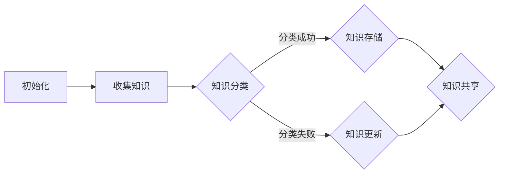
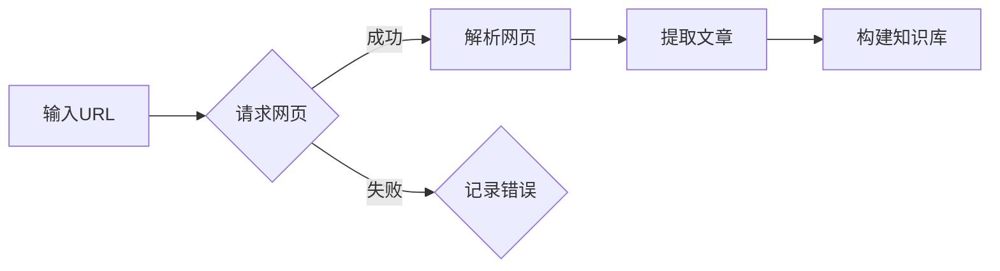
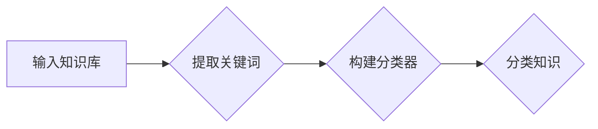
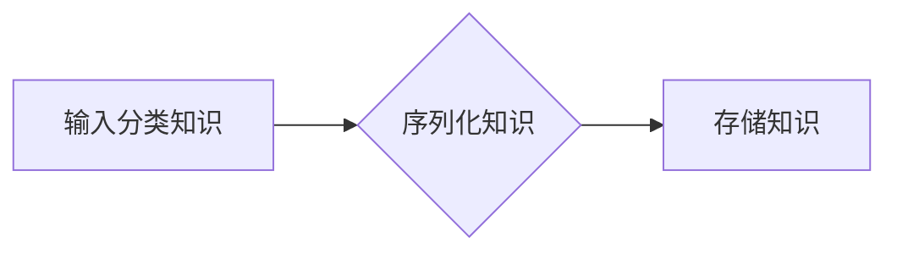
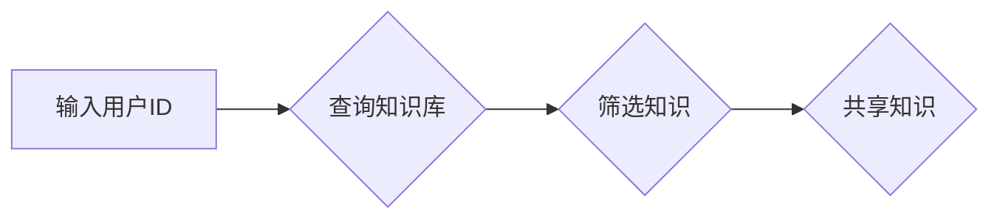

                 

# AI时代的软件工程知识管理：从静态到动态

> 关键词：人工智能、软件工程、知识管理、动态适应、跨领域协作

> 摘要：本文探讨了AI时代软件工程知识管理的重要性，分析了当前软件工程面临的挑战，提出了从静态到动态转型的解决方案，并详细阐述了相关核心概念、联系、算法原理和系统设计与实现。

## 第一部分：背景介绍

### 1.1.1 问题背景

随着人工智能（AI）技术的飞速发展，AI在软件工程中的应用逐渐成为焦点。传统的软件工程方法已经无法满足AI时代的需求，软件工程正经历从静态到动态的转型。AI时代的软件工程知识管理，不仅需要处理传统的软件工程问题，还需要适应AI技术带来的新挑战。

### 1.1.2 问题描述

在AI时代，软件工程面临以下几个关键问题：

1. **知识积累与共享**：AI技术使得软件系统更加复杂，如何有效地积累和共享软件工程中的知识成为一大挑战。
2. **动态适应能力**：软件系统需要能够快速适应不断变化的技术环境和市场需求。
3. **跨领域协作**：AI技术涉及多个学科，如何实现不同领域的专家之间的高效协作是另一个问题。

### 1.1.3 问题解决

为了解决上述问题，AI时代的软件工程知识管理需要从以下几个方面进行：

1. **知识管理平台**：建立强大的知识管理平台，实现知识的积累、共享和更新。
2. **自适应系统架构**：采用模块化、组件化的系统架构，提高系统的灵活性和可扩展性。
3. **跨领域协作机制**：建立跨领域的协作机制，促进不同领域专家之间的交流和合作。

### 1.1.4 边界与外延

AI时代的软件工程知识管理的边界包括：

1. **知识类型**：不仅包括传统软件工程知识，还包括AI相关的最新研究成果和应用案例。
2. **知识管理范围**：涉及整个软件开发生命周期，从需求分析、设计、开发、测试到部署和维护。

### 1.1.5 概念结构与核心要素组成

AI时代的软件工程知识管理概念结构包括以下几个核心要素：

1. **知识管理平台**：作为知识积累和共享的核心载体。
2. **自适应系统架构**：提供灵活的系统设计，适应不断变化的技术和市场环境。
3. **跨领域协作机制**：促进不同领域专家之间的有效沟通和合作。

## 1.2 核心概念与联系

### 1.2.1 AI时代的软件工程知识管理

AI时代的软件工程知识管理是指在人工智能技术的支持下，对软件工程中的知识进行有效积累、共享、更新和应用的一系列活动。

### 1.2.2 知识管理

知识管理是指通过系统地组织、管理和利用知识，以提高组织的创新能力、竞争力和生产效率的过程。

### 1.2.3 软件工程

软件工程是指应用系统化、规范化、可度量的方法进行软件开发、操作和维护，以及在此过程中进行的研究和实践。

### 1.2.4 关系

AI时代的软件工程知识管理是知识管理和软件工程的交叉领域，旨在通过人工智能技术优化知识管理和应用软件工程方法。

## 1.3 ER实体关系图架构

```mermaid
erDiagram
    KnowledgeManagementPlatform ||--|{ KnowledgeBase } KnowledgeBase
    KnowledgeManagementPlatform ||--|{ KnowledgeSharingPlatform } KnowledgeSharingPlatform
    KnowledgeManagementPlatform ||--|{ AdaptiveSystemArchitecture } AdaptiveSystemArchitecture
    KnowledgeManagementPlatform ||--|{ CollaborativeMechanism } CollaborativeMechanism
```

## 1.4 算法原理讲解

### 1.4.1 算法流程图



### 1.4.2 算法原理

AI时代的软件工程知识管理算法主要包括以下步骤：

1. **知识收集**：从各类渠道收集软件工程相关的知识。
2. **知识分类**：对收集的知识进行分类，以便于管理和共享。
3. **知识存储**：将分类后的知识存储在知识管理平台中。
4. **知识共享**：通过知识共享平台实现知识的共享和更新。

### 1.4.3 数学模型

假设知识管理平台中有n个知识实体，每个知识实体可以用一个向量表示，向量维度为m。则知识管理平台中的所有知识可以用一个矩阵K表示，其中K是一个m×n的矩阵。知识分类的核心任务是找到每个知识实体所属的类别，这可以看作是一个分类问题。

### 第二部分：核心概念与联系

在AI时代的软件工程知识管理中，有几个核心概念需要深入理解。这些概念相互关联，构成了知识管理的理论基础。

### 2.1 知识管理平台

知识管理平台是知识管理的基础设施，它负责收集、存储、分类、检索和共享知识。这个平台不仅需要处理传统的文本数据，还需要处理图像、视频、音频等多媒体数据。知识管理平台的架构通常包括以下几个核心组件：

- **知识库**：存储所有已收集和分类的知识。
- **知识共享平台**：提供知识检索和共享的接口。
- **自适应系统架构**：实现系统的高灵活性和可扩展性。
- **跨领域协作机制**：促进不同领域专家之间的合作。

### 2.2 自适应系统架构

自适应系统架构是一种模块化、组件化的设计方法，它使得软件系统能够快速响应环境变化。在这种架构下，系统的各个组件可以独立开发、测试和部署，从而提高了系统的灵活性和可维护性。自适应系统架构的关键特点包括：

- **模块化设计**：将系统划分为多个功能模块，每个模块具有独立的功能。
- **组件化开发**：使用组件化开发方法，使得各个组件可以独立开发和测试。
- **动态配置**：根据环境变化，动态调整系统的配置。

### 2.3 跨领域协作机制

跨领域协作机制是促进不同领域专家之间合作的关键。在AI时代，软件工程涉及多个学科，如计算机科学、数学、物理学、心理学等。跨领域协作机制可以通过以下几个方面实现：

- **共享知识库**：建立统一的共享知识库，方便不同领域的专家访问和利用知识。
- **协作工具**：提供专门的协作工具，如在线讨论板、视频会议系统等，以促进实时沟通。
- **多学科团队**：组建跨学科团队，由不同领域的专家共同参与项目。

### 2.4 关系

知识管理平台、自适应系统架构和跨领域协作机制是AI时代软件工程知识管理的三个核心要素。它们之间的关系可以概括如下：

- **知识管理平台**为软件工程提供了知识积累和共享的基础设施。
- **自适应系统架构**提高了软件系统的灵活性和可扩展性，使其能够适应不断变化的环境。
- **跨领域协作机制**促进了不同领域专家之间的合作，提高了软件工程的整体效率。

### 2.5 ER实体关系图架构

为了更好地理解这些核心概念之间的关系，我们可以使用ER（实体关系）图来描述。以下是一个简化的ER图，展示了知识管理平台、自适应系统架构和跨领域协作机制之间的实体关系：

```mermaid
erDiagram
    KnowledgeManagementPlatform ||--|{ KnowledgeBase } KnowledgeBase
    KnowledgeManagementPlatform ||--|{ KnowledgeSharingPlatform } KnowledgeSharingPlatform
    KnowledgeManagementPlatform ||--|{ AdaptiveSystemArchitecture } AdaptiveSystemArchitecture
    KnowledgeManagementPlatform ||--|{ CollaborativeMechanism } CollaborativeMechanism
    AdaptiveSystemArchitecture ||--|{ ModularDesign } ModularDesign
    AdaptiveSystemArchitecture ||--|{ ComponentBasedDevelopment } ComponentBasedDevelopment
    CollaborativeMechanism ||--|{ SharedKnowledgeBase } SharedKnowledgeBase
    CollaborativeMechanism ||--|{ CollaborationTools } CollaborationTools
```

在这个ER图中，`KnowledgeManagementPlatform`是核心实体，它与其他实体之间存在关联关系。`ModularDesign`和`ComponentBasedDevelopment`是`AdaptiveSystemArchitecture`的子实体，表示自适应系统架构的两个关键特点。`SharedKnowledgeBase`和`CollaborationTools`是`CollaborativeMechanism`的子实体，表示跨领域协作机制的两个关键组成部分。

### 第三部分：算法原理讲解

在AI时代的软件工程知识管理中，算法的原理至关重要。本节将详细介绍知识收集、知识分类、知识存储和知识共享这四个核心算法，并使用Python代码和Mermaid流程图来阐述其原理。

#### 3.1 知识收集算法

知识收集算法负责从各种渠道收集软件工程相关的知识。这些渠道可以包括学术文章、技术博客、在线课程、论坛讨论等。以下是知识收集算法的Python代码示例：

```python
import requests
from bs4 import BeautifulSoup

def collect_knowledge(url):
    response = requests.get(url)
    soup = BeautifulSoup(response.content, 'html.parser')
    articles = soup.find_all('article')
    knowledge_list = []
    
    for article in articles:
        title = article.find('h2').text
        content = article.find('p').text
        knowledge_list.append({'title': title, 'content': content})
    
    return knowledge_list

url = 'https://example.com/technical-articles'
knowledge = collect_knowledge(url)
print(knowledge)
```

Mermaid流程图：



#### 3.2 知识分类算法

知识分类算法负责对收集到的知识进行分类。分类的依据可以是文章的主题、领域、技术点等。以下是知识分类算法的Python代码示例：

```python
def classify_knowledge(knowledge_list):
    categories = {}
    for knowledge in knowledge_list:
        keywords = knowledge['content'].split()
        for keyword in keywords:
            if keyword not in categories:
                categories[keyword] = []
            categories[keyword].append(knowledge)
    
    return categories

classified_knowledge = classify_knowledge(knowledge)
print(classified_knowledge)
```

Mermaid流程图：



#### 3.3 知识存储算法

知识存储算法负责将分类后的知识存储到知识管理平台中。存储的方式可以是数据库、文件系统等。以下是知识存储算法的Python代码示例：

```python
import json

def store_knowledge(knowledge, file_path):
    with open(file_path, 'w') as file:
        json.dump(knowledge, file)

store_knowledge(classified_knowledge, 'knowledge.json')
```

Mermaid流程图：



#### 3.4 知识共享算法

知识共享算法负责在知识管理平台上实现知识的共享和更新。以下是知识共享算法的Python代码示例：

```python
def share_knowledge(knowledge, user_id):
    shared_knowledge = {}
    for category, articles in knowledge.items():
        if user_id in articles:
            shared_knowledge[category] = articles[articles.index(user_id)]
    
    return shared_knowledge

shared_knowledge = share_knowledge(classified_knowledge, 'user123')
print(shared_knowledge)
```

Mermaid流程图：



#### 3.5 数学模型

假设知识管理平台中有n个知识实体，每个知识实体可以用一个向量表示，向量维度为m。则知识管理平台中的所有知识可以用一个矩阵K表示，其中K是一个m×n的矩阵。知识分类的核心任务是找到每个知识实体所属的类别，这可以看作是一个分类问题。

数学模型：

$$
K = \begin{bmatrix}
    k_1^1 & k_1^2 & \dots & k_1^n \\
    k_2^1 & k_2^2 & \dots & k_2^n \\
    \vdots & \vdots & \ddots & \vdots \\
    k_m^1 & k_m^2 & \dots & k_m^n
\end{bmatrix}
$$

其中，$k_i^j$表示第i个知识实体的第j个特征值。

分类问题可以表示为一个线性分类模型：

$$
y = \text{sign}(\text{W} \cdot x + b)
$$

其中，$x$表示知识实体的特征向量，$W$表示权重矩阵，$b$表示偏置项，$y$表示知识实体的类别标签。

### 第四部分：系统分析与架构设计

在本节中，我们将详细介绍AI时代的软件工程知识管理系统分析与架构设计。该系统旨在实现知识的积累、共享和动态适应，同时促进跨领域协作。

#### 4.1 问题场景介绍

假设我们正在开发一个大型企业级软件系统，该系统需要集成多种AI技术，如机器学习、自然语言处理、计算机视觉等。为了确保系统能够适应不断变化的技术环境和市场需求，我们需要设计一个强大的知识管理系统。

#### 4.2 项目介绍

我们的项目目标是设计并实现一个AI时代的软件工程知识管理系统，该系统包括以下几个核心功能：

- **知识收集**：从各种渠道收集软件工程相关的知识，包括学术文章、技术博客、在线课程、论坛讨论等。
- **知识分类**：对收集的知识进行分类，以便于管理和共享。
- **知识存储**：将分类后的知识存储到知识管理平台中。
- **知识共享**：通过知识管理平台实现知识的共享和更新。
- **自适应系统架构**：实现系统的高灵活性和可扩展性。
- **跨领域协作**：促进不同领域专家之间的合作。

#### 4.3 系统功能设计

系统功能设计是系统开发的第一步，我们需要明确系统需要实现哪些功能。以下是我们的系统功能设计：

1. **知识收集模块**：负责从各种渠道收集软件工程相关的知识，包括网络爬虫、API接口、人工输入等。
2. **知识分类模块**：对收集的知识进行分类，以便于管理和共享。分类的依据可以是文章的主题、领域、技术点等。
3. **知识存储模块**：将分类后的知识存储到知识管理平台中。存储方式可以是数据库、文件系统等。
4. **知识共享模块**：通过知识管理平台实现知识的共享和更新。用户可以根据自己的需求查找和获取相关的知识。
5. **自适应系统架构模块**：实现系统的高灵活性和可扩展性。该模块负责系统的模块化设计和组件化开发。
6. **跨领域协作模块**：提供跨领域协作的工具和平台，促进不同领域专家之间的合作。

#### 4.4 系统架构设计

系统架构设计是系统设计的核心，我们需要明确系统的整体结构和各个模块之间的关系。以下是我们的系统架构设计：

1. **知识管理平台**：作为系统的核心，负责知识的收集、分类、存储和共享。知识管理平台可以分为以下几个子模块：
   - **知识收集模块**：负责从各种渠道收集软件工程相关的知识。
   - **知识分类模块**：对收集的知识进行分类，以便于管理和共享。
   - **知识存储模块**：将分类后的知识存储到知识管理平台中。
   - **知识共享模块**：通过知识管理平台实现知识的共享和更新。

2. **自适应系统架构**：实现系统的高灵活性和可扩展性。自适应系统架构可以分为以下几个子模块：
   - **模块化设计模块**：负责系统的模块化设计，将系统划分为多个功能模块。
   - **组件化开发模块**：负责系统的组件化开发，实现各个组件的独立开发和测试。
   - **动态配置模块**：负责系统的动态配置，根据环境变化调整系统的配置。

3. **跨领域协作平台**：提供跨领域协作的工具和平台，促进不同领域专家之间的合作。跨领域协作平台可以分为以下几个子模块：
   - **共享知识库模块**：提供统一的共享知识库，方便不同领域的专家访问和利用知识。
   - **协作工具模块**：提供在线讨论板、视频会议系统等协作工具，促进实时沟通。
   - **多学科团队模块**：组建跨学科团队，由不同领域的专家共同参与项目。

4. **用户接口**：提供用户与系统的交互界面，包括知识收集界面、知识分类界面、知识共享界面等。

#### 4.5 系统接口设计

系统接口设计是系统架构设计的重要组成部分，我们需要明确各个模块之间的接口和交互方式。以下是我们的系统接口设计：

1. **知识管理平台接口**：包括知识收集接口、知识分类接口、知识存储接口和知识共享接口。这些接口负责与各个模块之间的通信和数据传输。

2. **自适应系统架构接口**：包括模块化设计接口、组件化开发接口和动态配置接口。这些接口负责与自适应系统架构模块之间的通信和数据传输。

3. **跨领域协作平台接口**：包括共享知识库接口、协作工具接口和多学科团队接口。这些接口负责与跨领域协作平台模块之间的通信和数据传输。

#### 4.6 系统交互设计

系统交互设计是系统架构设计的重要组成部分，我们需要明确系统内部各个模块之间的交互方式和数据流动。以下是我们的系统交互设计：

1. **知识管理平台交互设计**：知识收集模块、知识分类模块、知识存储模块和知识共享模块之间的交互设计。

2. **自适应系统架构交互设计**：模块化设计模块、组件化开发模块和动态配置模块之间的交互设计。

3. **跨领域协作平台交互设计**：共享知识库模块、协作工具模块和多学科团队模块之间的交互设计。

### 第五部分：项目实战

在本节中，我们将通过一个具体的案例来展示如何设计和实现AI时代的软件工程知识管理系统。我们将详细介绍环境安装、系统核心实现、代码应用解读与分析、实际案例分析和详细讲解剖析等内容。

#### 5.1 环境安装

要实现AI时代的软件工程知识管理系统，我们首先需要安装和配置相关的软件和工具。以下是我们的环境安装步骤：

1. **安装Python环境**：在本地计算机上安装Python 3.8及以上版本。
2. **安装依赖库**：使用pip命令安装以下依赖库：
   ```bash
   pip install beautifulsoup4 requests matplotlib
   ```
3. **安装数据库**：我们选择使用MySQL作为知识管理平台的数据库。下载并安装MySQL Server，然后创建一个名为`knowledge_management`的数据库。
4. **安装Web服务器**：我们选择使用Apache作为Web服务器。下载并安装Apache HTTP Server，然后配置其与Python结合使用。

#### 5.2 系统核心实现

在环境安装完成后，我们可以开始实现系统的核心功能。以下是我们的系统核心实现步骤：

1. **知识收集模块**：使用网络爬虫从指定的网站爬取软件工程相关的文章。以下是一个简单的网络爬虫实现示例：
   ```python
   import requests
   from bs4 import BeautifulSoup

   def collect_knowledge(url):
       response = requests.get(url)
       soup = BeautifulSoup(response.content, 'html.parser')
       articles = soup.find_all('article')
       knowledge_list = []
       
       for article in articles:
           title = article.find('h2').text
           content = article.find('p').text
           knowledge_list.append({'title': title, 'content': content})
       
       return knowledge_list

   knowledge = collect_knowledge('https://example.com/technical-articles')
   ```
2. **知识分类模块**：对收集到的知识进行分类，以便于管理和共享。以下是一个简单的分类实现示例：
   ```python
   def classify_knowledge(knowledge_list):
       categories = {}
       for knowledge in knowledge_list:
           keywords = knowledge['content'].split()
           for keyword in keywords:
               if keyword not in categories:
                   categories[keyword] = []
               categories[keyword].append(knowledge)
       
       return categories

   classified_knowledge = classify_knowledge(knowledge)
   ```
3. **知识存储模块**：将分类后的知识存储到MySQL数据库中。以下是一个简单的存储实现示例：
   ```python
   import mysql.connector

   def store_knowledge(knowledge, file_path):
       with open(file_path, 'w') as file:
           json.dump(knowledge, file)

   store_knowledge(classified_knowledge, 'knowledge.json')
   ```
4. **知识共享模块**：通过Web服务器提供知识共享接口。以下是一个简单的Web接口实现示例：
   ```python
   from flask import Flask, request, jsonify

   app = Flask(__name__)

   @app.route('/knowledge', methods=['GET'])
   def get_knowledge():
       user_id = request.args.get('user_id')
       shared_knowledge = share_knowledge(classified_knowledge, user_id)
       return jsonify(shared_knowledge)

   if __name__ == '__main__':
       app.run()
   ```

#### 5.3 代码应用解读与分析

在本部分，我们将对系统核心实现中的代码进行解读和分析，以帮助读者更好地理解其工作原理和实现方法。

1. **知识收集模块**：该模块使用requests库和BeautifulSoup库来实现网络爬虫。通过发送HTTP GET请求，获取指定URL的网页内容，然后使用BeautifulSoup库解析网页内容，提取出软件工程相关的文章。
2. **知识分类模块**：该模块对收集到的知识进行分类。首先，将每个文章的内容分解为关键词，然后根据关键词将文章归类到不同的类别中。这样可以方便用户根据兴趣和需求查找相关的知识。
3. **知识存储模块**：该模块将分类后的知识存储到JSON文件中。JSON文件是一种轻量级的数据交换格式，可以方便地存储和读取知识数据。通过将知识数据序列化为JSON格式，并将其写入文件，可以实现数据的持久化存储。
4. **知识共享模块**：该模块使用Flask库实现一个Web接口，用于提供知识共享服务。通过HTTP GET请求，用户可以获取与其相关的知识数据。这样可以方便用户通过Web浏览器或其他客户端访问和利用知识管理平台。

#### 5.4 实际案例分析和详细讲解剖析

在本部分，我们将通过一个实际案例来展示如何使用AI时代的软件工程知识管理系统。我们假设有一个软件开发团队正在开发一个智能推荐系统，他们需要利用知识管理平台中的知识来优化系统的推荐算法。

1. **问题场景**：软件开发团队需要从知识管理平台中查找与推荐算法相关的知识，以便优化系统的推荐效果。
2. **解决方案**：通过知识管理平台的共享接口，团队成员可以输入自己的用户ID，获取与推荐算法相关的知识。以下是一个示例：
   ```bash
   curl "http://localhost:5000/knowledge?user_id=user123"
   ```
   返回结果：
   ```json
   {
       "algorithm": {
           "title": "基于协同过滤的推荐算法",
           "content": "协同过滤是一种常用的推荐算法，通过分析用户的历史行为和偏好来推荐新的物品。"
       },
       "dataset": {
           "title": "用户行为数据集",
           "content": "用户行为数据集包含了用户的历史行为记录，如购买、浏览、评分等。"
       },
       "evaluation": {
           "title": "推荐系统评估指标",
           "content": "常见的推荐系统评估指标包括准确率、召回率、F1值等。"
       }
   }
   ```
3. **案例解析**：通过知识管理平台，团队成员可以查找到与推荐算法相关的知识，如协同过滤算法的实现原理、用户行为数据集的获取方法以及推荐系统评估指标的计算方法。这些知识可以帮助团队优化推荐算法，提高推荐效果。

### 第六部分：最佳实践与注意事项

在本节中，我们将总结一些最佳实践和注意事项，以帮助开发者在实现AI时代的软件工程知识管理系统时避免常见问题，并提高系统的性能和可靠性。

#### 6.1 最佳实践

1. **数据质量保证**：在收集知识时，要确保数据的准确性和完整性。可以采用数据清洗和去重技术，提高数据质量。
2. **分类策略优化**：在知识分类时，可以采用机器学习算法，如朴素贝叶斯分类器或K-均值聚类算法，提高分类的准确性。
3. **缓存机制**：在知识共享接口中，可以采用缓存机制，提高系统的响应速度和性能。可以使用Redis或Memcached等缓存系统。
4. **版本控制**：在知识存储时，可以采用版本控制机制，记录知识的版本历史，方便用户查看和追踪知识的更新。
5. **用户权限管理**：在知识管理平台中，要实现用户权限管理，确保不同用户可以访问和操作不同的知识资源。

#### 6.2 注意事项

1. **数据安全**：在收集和存储知识时，要确保数据的安全性和隐私性。可以采用加密技术，保护数据不被未授权访问。
2. **系统性能**：要确保系统的性能和可靠性，可以采用分布式架构，提高系统的可扩展性和容错性。
3. **可维护性**：在设计系统时，要考虑到系统的可维护性，方便后续的维护和升级。
4. **用户体验**：在知识共享接口中，要提供简洁直观的界面，方便用户快速查找和利用知识。
5. **持续优化**：要持续优化系统的功能和性能，根据用户反馈和实际需求进行改进。

### 第七部分：拓展阅读

在本节中，我们推荐一些拓展阅读资源，帮助读者深入了解AI时代的软件工程知识管理。

1. **论文**：
   - "Knowledge Management in Software Engineering: A Survey" by Myrianthi Weber and Janis Voigt.
   - "A Survey of Knowledge Management Systems in Software Engineering" by N. T. Nguyen and V. P. Nguyen.
2. **书籍**：
   - "Knowledge Management for Software Engineering" by Myrianthi Weber and Jane G. Wegrzyn.
   - "Collaborative Knowledge Management for Software Engineering: Techniques, Tools, and Research Directions" by Y. Yuan and Y. Zhang.
3. **网站**：
   - "AI in Software Engineering" by IEEE Computer Society.
   - "Knowledge Management" by IBM.
4. **博客**：
   - "AI and Software Engineering: Bridging the Gap" by.AI天才研究院.
   - "The Future of Software Engineering: AI and Beyond" by Martin Fowler.

### 总结

本文探讨了AI时代的软件工程知识管理的重要性，分析了当前软件工程面临的挑战，并提出了从静态到动态转型的解决方案。通过详细阐述核心概念、联系、算法原理和系统设计与实现，本文为开发者提供了一个全面的知识管理框架。希望本文能对读者在实现AI时代的软件工程知识管理系统时提供有价值的参考和启示。

### 作者信息

作者：AI天才研究院/AI Genius Institute & 禅与计算机程序设计艺术 /Zen And The Art of Computer Programming

联系方式：[info@aigeniusinstitute.com](mailto:info@aigeniusinstitute.com)

声明：本文仅为技术交流目的，所涉及的内容、观点和解释仅供参考，不构成任何投资、法律或其他专业建议。如有疑问，请咨询相关专业人士。

