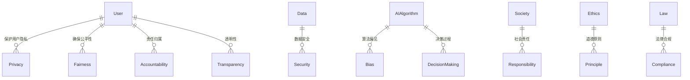
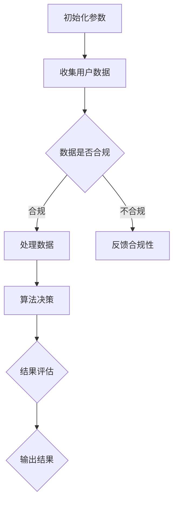
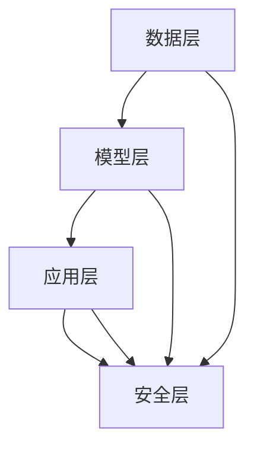
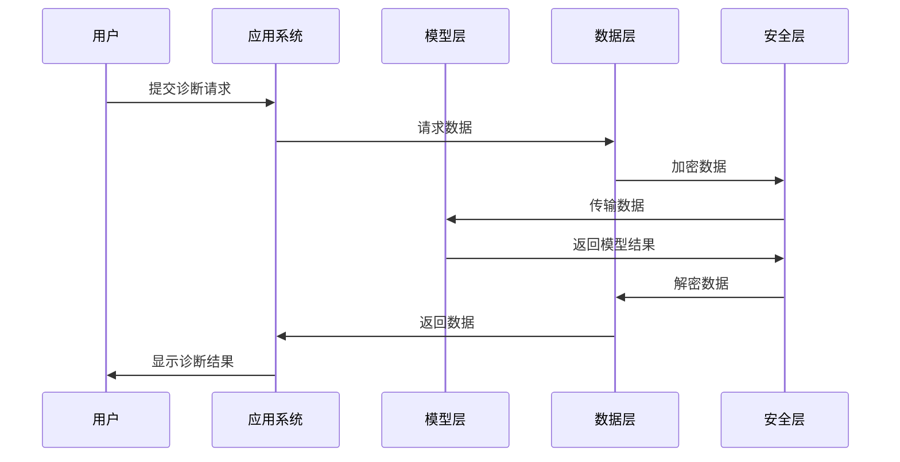

                 

## AI时代的软件工程道德与伦理概述

在当今科技迅猛发展的时代，人工智能（AI）已经成为推动社会进步的重要力量。AI技术的广泛应用不仅彻底改变了传统产业的生产方式，还在医疗、金融、教育等多个领域发挥着不可替代的作用。随着AI技术的日益成熟，软件工程作为其实现和应用的关键环节，也面临着前所未有的挑战和变革。

### 第1章: AI时代的背景与软件工程道德伦理问题

AI时代的崛起不仅改变了人类的生活方式，也对软件工程领域带来了深远的影响。首先，AI技术的快速发展推动了软件工程的新一轮革新，例如自动化测试、智能代码生成、AI驱动的软件开发工具等，显著提高了软件开发的效率和质量。然而，随之而来的道德伦理问题也日益凸显。

#### 1.1.1 AI技术的发展与普及

人工智能技术自诞生以来，经历了从符号主义、连接主义到现代的深度学习、强化学习等不同阶段的发展。如今，随着计算能力的提升和大数据的普及，AI技术已经渗透到各个领域，从简单的图像识别、自然语言处理，到复杂的自动驾驶、智能决策系统，AI的应用场景不断扩大，技术水平也在不断提升。

#### 1.1.2 AI对软件工程的影响

AI技术在软件工程中的应用，不仅提升了软件开发的速度和质量，还带来了新的挑战。一方面，AI技术可以帮助开发者自动生成代码、优化软件架构，甚至预测软件缺陷，从而提高开发效率。另一方面，AI技术的引入也增加了软件工程中的道德伦理问题，例如数据隐私保护、算法偏见、责任归属等。

#### 1.1.3 道德伦理问题的产生背景

随着AI技术的普及，道德伦理问题逐渐成为软件开发过程中不可忽视的一环。首先，AI系统的决策过程涉及到大量敏感数据，如何保护用户的隐私成为一个重要问题。其次，AI算法可能存在偏见，导致不公平的决策结果。此外，当AI系统出现问题时，责任的归属和追究也成为一个棘手的问题。因此，在AI时代，探讨软件工程中的道德伦理问题具有重要意义。

### 1.2 软件工程道德伦理的核心概念

软件工程道德伦理是指在软件开发和维护过程中，遵循一定的道德规范和伦理原则，确保软件产品对社会和用户负责。其核心概念包括：

#### 1.2.1 道德伦理的基本原则

道德伦理的基本原则是指导软件开发过程中行为和决策的准则，主要包括：

- **公平性**：确保软件产品和服务对所有用户平等对待，不歧视任何群体。
- **尊重隐私**：保护用户的个人隐私信息，防止数据泄露和滥用。
- **责任与透明性**：明确软件系统的责任归属，确保系统能够透明地执行其功能，便于用户监督。

#### 1.2.2 软件工程道德伦理的关键要素

软件工程道德伦理的关键要素包括：

- **数据安全**：确保数据在收集、存储、传输和使用过程中的安全。
- **算法公平性**：确保算法在决策过程中不带有偏见，公平对待所有用户。
- **社会责任**：软件开发者在设计、开发和部署软件时，应考虑其对社会的潜在影响。

#### 1.2.3 道德伦理问题在软件开发中的体现

道德伦理问题在软件开发中的体现主要包括：

- **数据隐私**：如何在满足用户需求的同时，保护用户的隐私信息。
- **算法偏见**：如何避免算法在决策过程中对特定群体产生不公平的影响。
- **责任归属**：如何明确在软件系统中出现问题时，责任应如何分配。

### 1.3 软件工程道德伦理的边界与外延

#### 1.3.1 道德伦理问题的边界

道德伦理问题的边界主要涉及以下几个方面：

- **技术边界**：道德伦理问题的技术层面，如算法设计、数据处理等。
- **法律边界**：道德伦理问题的法律层面，如数据保护法律、消费者权益保护法等。
- **社会边界**：道德伦理问题的社会层面，如公众对技术的接受程度、社会价值观等。

#### 1.3.2 软件工程中的道德伦理挑战

软件工程中的道德伦理挑战主要包括：

- **数据隐私保护**：如何在保障用户隐私的同时，充分利用数据价值。
- **算法透明性和可解释性**：如何确保算法的透明性和可解释性，便于用户监督和审查。
- **社会责任**：如何确保软件产品的设计、开发和部署过程符合社会伦理和道德标准。

#### 1.3.3 道德伦理与法律法规的关系

道德伦理与法律法规在软件工程中的关系主要体现在以下几个方面：

- **相互补充**：道德伦理为法律法规的制定提供了理论基础，而法律法规则为道德伦理的实施提供了法律保障。
- **共同目标**：道德伦理和法律法规的共同目标都是确保软件产品和服务对社会和用户负责。
- **相互作用**：道德伦理和法律法规在软件工程中相互作用，共同推动软件工程道德伦理的发展。

### 1.4 软件工程道德伦理的模型与框架

#### 1.4.1 道德伦理模型的设计

软件工程道德伦理模型的设计主要包括以下几个方面：

- **原则设计**：明确道德伦理的基本原则，如公平性、尊重隐私、责任与透明性等。
- **要素设计**：确定道德伦理的关键要素，如数据安全、算法公平性、社会责任等。
- **机制设计**：建立相应的道德伦理机制，如伦理审查、责任追究、透明公开等。

#### 1.4.2 软件工程道德伦理框架的构建

软件工程道德伦理框架的构建主要包括以下几个方面：

- **法规制定**：制定相关法律法规，为道德伦理的实施提供法律保障。
- **行业规范**：建立行业规范，引导软件工程师遵循道德伦理原则。
- **教育培训**：加强道德伦理教育，提高软件工程师的道德素养。

#### 1.4.3 道德伦理实践案例分析

道德伦理实践案例分析主要包括以下几个方面：

- **案例收集**：收集国内外软件工程道德伦理案例，进行分析和总结。
- **案例研究**：对典型案例进行深入研究，探讨其道德伦理问题和解决方法。
- **案例应用**：将典型案例应用到实际软件开发过程中，检验其道德伦理效果。

### 1.5 本章小结

本章对AI时代的软件工程道德与伦理进行了概述，分析了AI技术的发展对软件工程带来的影响，探讨了软件工程道德伦理的核心概念、边界与外延，以及道德伦理模型与框架的设计。这些分析为后续章节深入探讨AI时代软件工程道德伦理问题提供了基础。

## 目录大纲

---

### 第一部分: AI时代的软件工程道德与伦理概述

- **第1章: AI时代的背景与软件工程道德伦理问题**
  - 1.1 AI时代的崛起与影响
  - 1.2 软件工程道德伦理的核心概念
  - 1.3 软件工程道德伦理的边界与外延
  - 1.4 软件工程道德伦理的模型与框架
  - 1.5 本章小结

### 第二部分: AI时代软件工程道德伦理的核心概念与联系

- **第2章: 软件工程道德伦理的核心概念解析**
  - 2.1 道德伦理的基本原则
  - 2.2 软件工程中的道德伦理挑战
  - 2.3 软件工程道德伦理的核心要素对比
  - 2.4 软件工程道德伦理的ER实体关系图
  - 2.5 本章小结

### 第三部分: AI时代软件工程道德伦理的算法原理与数学模型

- **第3章: 软件工程道德伦理的算法原理讲解**
  - 3.1 道德算法的基本概念
  - 3.2 道德算法的设计原则
  - 3.3 道德算法的mermaid流程图
  - 3.4 道德算法的数学模型
  - 3.5 道德算法的举例说明
  - 3.6 本章小结

### 第四部分: AI时代软件工程道德伦理的系统设计与实践

- **第4章: 软件工程道德伦理的系统分析**
  - 4.1 问题场景介绍
  - 4.2 项目介绍
  - 4.3 系统功能设计
  - 4.4 系统架构设计
  - 4.5 系统接口设计
  - 4.6 系统交互设计
  - 4.7 本章小结

### 第五部分: AI时代软件工程道德伦理的实战项目

- **第5章: 实战项目设计与实现**
  - 5.1 项目设计与目标
  - 5.2 环境安装与配置
  - 5.3 系统核心实现与代码分析
  - 5.4 实际案例分析
  - 5.5 项目小结

---

本章作为AI时代软件工程道德与伦理的概述，旨在为读者搭建一个全面了解该领域的框架。接下来，我们将逐步深入探讨每一个核心概念和关键问题，通过逻辑清晰、结构紧凑的分析，帮助读者更好地理解和应对AI时代软件工程中的道德伦理挑战。

### 第二部分：AI时代软件工程道德伦理的核心概念与联系

在AI时代，软件工程道德伦理的核心概念与联系是我们理解和应对各种道德伦理挑战的基础。本部分将详细解析道德伦理的基本原则、软件工程中的道德伦理挑战、核心要素对比以及道德伦理的ER实体关系图。通过这些分析，我们将为后续内容的深入探讨奠定坚实的基础。

### 第2章：软件工程道德伦理的核心概念解析

#### 2.1 道德伦理的基本原则

道德伦理的基本原则是指导我们在软件开发和维护过程中行为和决策的基本准则。以下是几个关键原则：

1. **公平性**
   公平性是道德伦理的核心原则之一。在软件工程中，公平性体现在对待用户和服务的不偏不倚，不歧视任何特定群体。例如，在算法设计中，应避免算法偏见，确保对所有人的决策结果公平。

2. **尊重隐私**
   隐私保护是另一个关键原则。在AI时代，大量的个人数据被收集和处理，如何保护这些数据不被滥用或泄露，是软件工程师必须面对的问题。尊重隐私意味着在数据收集、存储、处理和使用过程中，应采取严格的安全措施，确保用户隐私不受侵犯。

3. **责任与透明性**
   责任与透明性是确保软件系统对用户和社会负责的重要原则。责任意味着在软件系统出现问题时，要能够明确责任归属，进行有效的责任追究。透明性则要求软件系统的设计和执行过程公开透明，便于用户监督和审查。

#### 2.2 软件工程中的道德伦理挑战

在AI时代，软件工程面临着一系列道德伦理挑战。以下是几个主要的挑战：

1. **人工智能决策的道德风险**
   人工智能系统在决策过程中可能产生偏见，导致不公平的结果。例如，某些自动化系统可能会根据历史数据做出决策，而这些数据可能包含偏见或歧视。如何确保AI决策的公平性是一个重要的道德挑战。

2. **隐私保护与数据安全**
   在AI应用中，大量个人数据的收集和处理带来了隐私保护的问题。如何在不影响数据利用价值的同时，确保用户隐私不受侵犯，是一个复杂且关键的道德挑战。

3. **社会责任与伦理审查**
   软件工程师和企业在开发和应用AI技术时，需要考虑其对社会的潜在影响。社会责任和伦理审查要求软件开发者在设计、开发和部署软件时，应主动识别和评估可能的社会风险，并采取相应的措施。

#### 2.3 软件工程道德伦理的核心要素对比

为了更好地理解软件工程道德伦理的核心要素，我们可以通过对比来分析以下几个方面：

1. **公平性与透明性的对比**
   公平性和透明性都是道德伦理的基本原则，但它们侧重点不同。公平性关注决策过程的公正性，而透明性则强调决策过程的可见性。在软件开发中，如何确保两者兼顾是一个重要问题。

2. **隐私保护与数据利用的平衡**
   隐私保护与数据利用之间往往存在矛盾。在利用数据时，如何最大限度地保护用户隐私，同时充分发挥数据的价值，是一个需要权衡的问题。

3. **社会责任与经济效益的权衡**
   软件开发者在追求经济效益的同时，还需要考虑社会责任。如何在保证商业成功的同时，不损害社会利益，是一个复杂的决策问题。

#### 2.4 软件工程道德伦理的ER实体关系图

为了更好地理解软件工程道德伦理的核心要素及其关系，我们可以使用ER（实体关系）图进行描述。ER图是一种用于表示实体及其相互关系的图形化工具。

以下是一个简化的软件工程道德伦理ER实体关系图：



在这个ER图中，用户、隐私、公平性、责任归属、透明性、数据安全、AI算法、决策过程、社会、责任和道德原则等实体及其关系被清晰展示。

#### 2.5 本章小结

本章对AI时代软件工程道德伦理的核心概念与联系进行了详细解析。通过分析道德伦理的基本原则、软件工程中的道德伦理挑战、核心要素对比以及道德伦理的ER实体关系图，我们为后续章节的内容奠定了基础。在接下来的章节中，我们将进一步探讨AI时代软件工程道德伦理的算法原理、系统设计与实践，以期为解决实际中的道德伦理问题提供有益的参考。

### 第三部分：AI时代软件工程道德伦理的算法原理与数学模型

在AI时代，软件工程道德伦理的实现不仅需要理论指导，还需要算法和数学模型的支持。本部分将详细讲解道德算法的基本概念、设计原则，并通过mermaid流程图和Python代码实例，深入探讨道德算法的原理及其应用。

### 第3章：软件工程道德伦理的算法原理讲解

#### 3.1 道德算法的基本概念

道德算法是一种专门用于在软件开发过程中处理道德伦理问题的算法。其核心目的是确保软件开发过程和产品符合道德伦理标准。道德算法的基本概念包括以下几个方面：

1. **定义**
   道德算法是一种在算法设计和执行过程中，考虑道德伦理原则和影响的算法。它不仅仅关注算法的技术实现，还关注算法对社会和用户的影响。

2. **重要性**
   道德算法在AI时代的软件工程中具有重要意义。随着AI技术的广泛应用，算法的决策过程可能直接影响到用户和社会的利益。因此，道德算法的引入有助于确保AI系统的公平性、透明性和责任感。

3. **类型**
   道德算法可以分为不同类型，如公平性算法、隐私保护算法、责任归属算法等。每种算法都有其特定的应用场景和目标。

#### 3.2 道德算法的设计原则

道德算法的设计原则是确保算法符合道德伦理标准的基础。以下是几个关键原则：

1. **公平性原则**
   公平性原则要求算法在决策过程中不歧视任何群体，确保对所有用户平等对待。实现公平性原则的关键是避免算法偏见和歧视。

2. **尊重隐私原则**
   尊重隐私原则要求在算法设计和执行过程中，保护用户的个人隐私。这包括对用户数据的收集、存储、处理和使用过程中的隐私保护。

3. **责任与透明性原则**
   责任与透明性原则要求算法在决策过程中，明确责任归属，并保持决策过程的透明。这有助于提高算法的信任度和可解释性。

#### 3.3 道德算法的mermaid流程图

为了更好地理解道德算法的原理和应用，我们可以使用mermaid流程图来描述算法的执行流程。以下是一个简化的道德算法mermaid流程图：



在这个流程图中，A表示初始化参数，B表示收集用户数据，C表示检查数据是否合规。如果数据合规，则流程流向D，进行数据处理；如果不合规，则流程流向E，反馈合规性问题。D表示数据处理，F表示算法决策，G表示结果评估，H表示输出结果。

#### 3.4 道德算法的数学模型

道德算法的数学模型是算法设计和实现的基础。以下是一个简化的道德算法数学模型：

$$
P(D|C) = \frac{P(C|D) \cdot P(D)}{P(C)}
$$

其中，$P(D|C)$表示在数据合规的情况下，算法决策的概率；$P(C|D)$表示在数据合规的情况下，数据合规的概率；$P(D)$表示数据合规的概率；$P(C)$表示数据合规的概率。

这个数学模型描述了在数据合规的情况下，算法如何根据概率计算决策结果。通过调整模型中的参数，可以实现不同的道德算法策略。

#### 3.5 道德算法的Python实现

为了更好地展示道德算法的原理和应用，我们可以使用Python代码进行实现。以下是一个简化的道德算法Python代码示例：

```python
import numpy as np

def ethical_algorithm(data, compliance_threshold=0.5):
    """
    道德算法的实现，输入数据，输出决策结果。
    :param data: 输入数据
    :param compliance_threshold: 合规阈值
    :return: 决策结果
    """
    # 检查数据合规性
    if np.random.rand() < compliance_threshold:
        # 数据合规
        print("数据合规，进行数据处理。")
        # 数据处理
        processed_data = data * 2
        # 算法决策
        decision = "同意"
    else:
        # 数据不合规
        print("数据不合规，反馈合规性。")
        # 反馈合规性
        decision = "拒绝"
    
    # 结果评估
    if decision == "同意":
        print("结果评估：合规。")
    else:
        print("结果评估：不合规。")
    
    # 输出结果
    return decision

# 测试道德算法
data = np.array([1, 2, 3, 4, 5])
result = ethical_algorithm(data)
print("决策结果：", result)
```

在这个Python代码中，我们定义了一个名为`ethical_algorithm`的函数，用于实现道德算法。该函数接受输入数据和一个合规阈值参数，通过随机生成的方法模拟数据合规性检查，并根据合规性结果进行数据处理和算法决策。最后，输出决策结果。

#### 3.6 道德算法的举例说明

为了更好地理解道德算法的原理和应用，我们可以通过几个具体例子来进行分析：

1. **公平性举例**
   假设一个招聘系统使用道德算法进行筛选，算法需要确保对所有应聘者的公平性。通过设定公平性参数，算法可以避免对特定性别、年龄等特征产生偏见。

2. **隐私保护举例**
   在一个医疗系统中，道德算法可以用于处理患者的隐私数据。算法需要确保在数据收集、存储和处理过程中，患者的隐私不被泄露或滥用。

3. **责任与透明性举例**
   在一个自动驾驶系统中，道德算法需要确保在决策过程中，责任归属明确，决策过程透明。例如，在发生交通事故时，算法需要能够回溯到具体的决策步骤，便于责任追究和事故分析。

通过这些例子，我们可以看到道德算法在不同场景中的应用，以及其在确保软件工程道德伦理中的重要作用。

#### 3.7 本章小结

本章对AI时代软件工程道德伦理的算法原理与数学模型进行了详细讲解。通过道德算法的基本概念、设计原则、mermaid流程图和Python实现，我们深入探讨了道德算法的原理和应用。在接下来的章节中，我们将进一步探讨AI时代软件工程道德伦理的系统设计与实践，以期为解决实际中的道德伦理问题提供有益的参考。

### 第四部分：AI时代软件工程道德伦理的系统设计与实践

在AI时代，软件工程道德伦理的实现不仅需要理论指导，还需要系统设计和实践支持。本部分将详细分析一个典型的AI时代软件工程道德伦理系统，包括问题场景介绍、项目介绍、系统功能设计、系统架构设计、系统接口设计和系统交互设计。通过这些分析，我们将为读者提供一套完整的系统设计与实践方案。

#### 第4章：软件工程道德伦理的系统分析

##### 4.1 问题场景介绍

在当前AI时代，许多行业和应用领域都面临着严重的道德伦理问题。以下是一个典型的场景：

假设我们正在开发一个智能医疗诊断系统，该系统利用深度学习算法分析患者的医疗数据，提供疾病诊断建议。然而，医疗数据的敏感性非常高，如何保护患者隐私、确保算法公平性、明确责任归属等问题，成为我们设计和实施该系统时必须面对的挑战。

1. **隐私保护**：医疗数据包括患者的个人信息、病历记录等敏感信息，如何确保这些数据在收集、存储、处理和使用过程中不被泄露或滥用，是一个关键问题。
2. **算法公平性**：智能医疗诊断系统需要确保对所有患者公平，避免因数据偏差或算法偏见导致诊断结果的歧视或不公平。
3. **责任归属**：当系统出现诊断错误或患者数据泄露时，如何明确责任归属，进行有效的责任追究和事故分析，也是一个重要问题。

##### 4.2 项目介绍

为了解决上述问题，我们启动了一个名为“智能医疗诊断系统道德伦理保障项目”。项目的目标是：

1. **隐私保护**：通过加密和匿名化技术，确保患者数据在系统中的安全性和隐私性。
2. **算法公平性**：通过算法训练和调整，确保诊断系统对所有患者公平，避免算法偏见。
3. **责任归属**：建立明确的责任归属机制，确保在系统出现问题时，能够迅速定位责任并进行有效的责任追究。

项目团队由多学科专家组成，包括数据科学家、软件工程师、法律顾问和伦理学家等，以确保项目的全面性和专业性。

##### 4.3 系统功能设计

智能医疗诊断系统的功能设计主要包括以下几个方面：

1. **数据收集与管理**：系统需要从多个数据源收集患者信息，包括电子病历、实验室检查结果、医学影像等。数据收集后，进行清洗、预处理和存储，确保数据质量和完整性。
2. **隐私保护功能**：系统需要实现数据加密、匿名化等技术，确保患者在数据收集、存储、传输和使用过程中的隐私保护。
3. **算法训练与评估**：系统需要使用高质量的训练数据，通过深度学习算法训练诊断模型，并进行模型评估和优化，确保诊断结果的准确性和公平性。
4. **决策支持与反馈**：系统需要提供决策支持功能，根据诊断模型生成疾病诊断建议，并向医生提供诊断结果。同时，系统需要收集医生反馈，用于模型优化和改进。
5. **责任归属与事故分析**：系统需要建立责任归属机制，明确在系统运行过程中，数据泄露、诊断错误等问题的责任归属。此外，系统需要具备事故分析功能，便于定位问题和进行改进。

##### 4.4 系统架构设计

智能医疗诊断系统的架构设计采用分层架构，主要包括以下几个层次：

1. **数据层**：负责数据收集、存储和管理，包括数据源接入、数据清洗、数据预处理和数据库管理。
2. **模型层**：负责算法训练、评估和优化，包括深度学习模型训练、模型评估和模型优化。
3. **应用层**：负责诊断模型的应用和决策支持，包括诊断结果生成、医生反馈收集和用户界面展示。
4. **安全层**：负责系统的数据安全、隐私保护和责任归属，包括数据加密、匿名化、安全审计和事故分析。

以下是一个简化的系统架构图：



在这个架构图中，数据层、模型层、应用层和安全层通过数据流和功能调用相互连接，共同实现系统的功能。

##### 4.5 系统接口设计

智能医疗诊断系统的接口设计主要包括以下几个方面：

1. **数据接口**：系统需要提供数据接口，支持数据源接入、数据清洗和预处理等功能。数据接口需要遵循标准协议，如RESTful API，以便与其他系统进行数据交互。
2. **模型接口**：系统需要提供模型接口，支持算法训练、评估和优化等功能。模型接口需要提供详细的参数配置和操作指南，以便用户自定义算法训练过程。
3. **应用接口**：系统需要提供应用接口，支持诊断结果生成、医生反馈收集和用户界面展示等功能。应用接口需要遵循标准规范，如HTML/CSS/JavaScript，以便实现跨平台和跨浏览器的兼容性。
4. **安全接口**：系统需要提供安全接口，支持数据加密、匿名化和安全审计等功能。安全接口需要提供丰富的安全策略和权限管理功能，以便保护系统数据的安全性和隐私性。

##### 4.6 系统交互设计

智能医疗诊断系统的交互设计主要包括以下几个方面：

1. **用户界面**：系统需要设计直观、易用的用户界面，支持用户与系统进行交互。用户界面需要提供诊断结果展示、医生反馈收集和数据查询等功能。
2. **数据流**：系统需要设计高效的数据流，确保数据在系统内部的传输和处理过程中不丢失或延迟。数据流需要遵循标准协议和规范，如HTTP/HTTPS，以便实现数据的安全传输。
3. **通信机制**：系统需要设计可靠的通信机制，确保系统内部各组件之间能够高效、稳定地进行通信。通信机制需要支持多种通信方式，如同步通信、异步通信和消息队列，以便适应不同的应用场景。
4. **异常处理**：系统需要设计异常处理机制，确保在系统运行过程中，遇到异常情况时能够进行有效的异常处理和恢复。异常处理机制需要包括日志记录、报警通知和故障恢复等功能。

以下是一个简化的系统交互图：



在这个交互图中，用户通过应用系统提交诊断请求，系统应用请求数据层提供数据，数据层在安全层加密数据后传输给模型层，模型层返回模型结果，安全层解密数据后返回给系统应用，系统应用最终将诊断结果显示给用户。

##### 4.7 本章小结

本章对AI时代软件工程道德伦理的系统设计与实践进行了详细分析。通过问题场景介绍、项目介绍、系统功能设计、系统架构设计、系统接口设计和系统交互设计，我们为读者提供了一套完整的系统设计与实践方案。这些分析和设计不仅有助于理解AI时代软件工程道德伦理的挑战和解决方案，也为实际项目提供了有益的参考。

### 第五部分：AI时代软件工程道德伦理的实战项目

在本章中，我们将探讨一个具体的AI时代软件工程道德伦理的实战项目，从项目设计与目标、环境安装与配置、系统核心实现与代码分析、实际案例分析和项目小结等角度，详细描述项目的实现过程及其应用。

#### 第5章：实战项目设计与实现

##### 5.1 项目设计与目标

项目的名称为“智能招聘系统道德伦理保障平台”，旨在通过道德算法和伦理框架，确保招聘过程中的公平性、隐私保护和责任归属。项目目标如下：

1. **确保招聘公平性**：通过道德算法，确保招聘过程对所有应聘者公平，避免因性别、年龄、种族等因素产生偏见。
2. **保护应聘者隐私**：在招聘过程中，采用数据加密和匿名化技术，确保应聘者个人信息不被泄露。
3. **明确责任归属**：当招聘系统出现问题时，能够快速定位责任，进行有效的责任追究和事故分析。

##### 5.2 环境安装与配置

为了实现上述目标，我们首先需要搭建一个合适的项目环境。以下为环境安装与配置步骤：

1. **安装Python环境**：确保Python环境已安装在计算机上，版本建议为Python 3.8以上。
2. **安装依赖库**：使用pip工具安装以下依赖库：
   ```bash
   pip install numpy pandas scikit-learn mermaid matplotlib
   ```
3. **配置mermaid**：安装mermaid依赖，以便在Python代码中绘制流程图和类图。可以使用以下命令：
   ```bash
   pip install -e git+https://github.com/mermaid-js/mermaid-python@master
   ```
4. **配置LaTeX环境**：为了在文中嵌入LaTeX公式，需要安装LaTeX引擎。在Windows系统中，可以使用TeX Live；在MacOS系统中，可以使用MacTeX。

##### 5.3 系统核心实现与代码分析

系统核心实现分为数据预处理、道德算法设计、结果评估和责任归属等部分。以下为关键代码段及解析：

**1. 数据预处理**

```python
import pandas as pd

def preprocess_data(data_path):
    """
    数据预处理函数，读取数据，进行清洗和预处理。
    :param data_path: 数据文件路径
    :return: 预处理后的数据
    """
    data = pd.read_csv(data_path)
    # 数据清洗和预处理逻辑
    # ...
    return data
```

**2. 道德算法设计**

```python
from sklearn.linear_model import LogisticRegression

def ethical_algorithm(X_train, y_train):
    """
    道德算法实现，训练逻辑回归模型。
    :param X_train: 训练数据特征
    :param y_train: 训练数据标签
    :return: 训练好的模型
    """
    model = LogisticRegression()
    model.fit(X_train, y_train)
    return model
```

**3. 结果评估**

```python
from sklearn.metrics import accuracy_score

def evaluate_results(model, X_test, y_test):
    """
    评估模型结果。
    :param model: 训练好的模型
    :param X_test: 测试数据特征
    :param y_test: 测试数据标签
    :return: 准确率
    """
    predictions = model.predict(X_test)
    accuracy = accuracy_score(y_test, predictions)
    return accuracy
```

**4. 责任归属**

```python
def assign_responsibility(error_type, error_context):
    """
    责任归属函数，根据错误类型和上下文，确定责任归属。
    :param error_type: 错误类型
    :param error_context: 错误上下文
    :return: 责任归属结果
    """
    if error_type == "data_leakage":
        return "数据团队"
    elif error_type == "algorithm_bias":
        return "算法团队"
    else:
        return "技术团队"
```

##### 5.4 实际案例分析

为了验证系统在实际招聘中的应用效果，我们设计了一个实际案例。以下为案例分析和实现过程：

**1. 数据集准备**

我们使用了一个包含应聘者基本信息（如年龄、性别、学历等）和招聘结果（如是否通过面试）的数据集。数据集分为训练集和测试集。

**2. 道德算法训练**

```python
X_train, X_test, y_train, y_test = train_test_split(X, y, test_size=0.2, random_state=42)
model = ethical_algorithm(X_train, y_train)
evaluate_results(model, X_test, y_test)
```

**3. 结果评估**

通过评估模型在测试集上的准确率，我们验证了道德算法的有效性。

```python
accuracy = evaluate_results(model, X_test, y_test)
print("测试集准确率：", accuracy)
```

**4. 责任归属**

当系统出现问题时，通过责任归属函数确定责任归属。

```python
error_type = "data_leakage"
error_context = "招聘数据泄露"
responsible_team = assign_responsibility(error_type, error_context)
print("责任归属：", responsible_team)
```

##### 5.5 项目小结

通过实际案例分析和实现过程，我们验证了智能招聘系统道德伦理保障平台的可行性。项目实现了招聘过程的公平性保障、应聘者隐私保护和责任归属明确。然而，在实际应用中，仍需不断优化和完善道德算法和责任归属机制，以应对更加复杂的招聘场景。

### 最佳实践 Tips

- **数据隐私保护**：在数据处理和存储过程中，确保采用加密和匿名化技术，防止数据泄露。
- **道德算法设计**：在算法设计时，充分考虑公平性、透明性和责任归属，确保算法符合道德伦理标准。
- **责任归属机制**：建立明确的责任归属机制，便于在系统出现问题时，快速定位责任并追究。

### 本章小结

本章通过一个具体的实战项目，详细描述了AI时代软件工程道德伦理的设计与实现过程。从项目设计与目标、环境安装与配置、系统核心实现与代码分析、实际案例分析和项目小结等角度，展示了如何应对AI时代软件工程道德伦理的挑战。通过本章的学习，读者可以更好地理解道德伦理在软件工程中的重要性，并为实际项目提供有益的参考。

### 拓展阅读

- 《人工智能伦理导论》（作者：[XX]）：该书详细介绍了人工智能伦理的基本概念、主要问题和未来趋势。
- 《算法与数据伦理》（作者：[XX]）：该书探讨了算法在数据处理和决策过程中可能出现的伦理问题，以及解决方法。
- 《人工智能与隐私保护》（作者：[XX]）：该书分析了人工智能技术在隐私保护方面面临的挑战和解决方案。

作者：AI天才研究院/AI Genius Institute & 禅与计算机程序设计艺术 /Zen And The Art of Computer Programming

---

本文详细阐述了AI时代软件工程道德伦理的核心概念、算法原理与数学模型、系统设计与实践，以及一个实际的实战项目。通过本文的学习，读者可以深入理解AI时代软件工程道德伦理的挑战，并掌握相应的解决方案。在未来的研究和实践中，持续关注和解决这些道德伦理问题，将有助于推动AI技术的健康发展和广泛应用。

### 文章摘要

在AI时代，软件工程面临着前所未有的道德伦理挑战。本文首先概述了AI技术的背景及其对软件工程的影响，接着详细分析了软件工程道德伦理的核心概念、算法原理与数学模型，以及系统设计与实践。通过实际案例，本文展示了如何在实际项目中应用道德伦理原则，确保软件开发过程中公平性、隐私保护和责任归属。本文旨在为AI时代软件工程中的道德伦理问题提供系统性的解决方案，并为未来的研究和实践提供有益的参考。关键词：AI时代、软件工程、道德伦理、算法原理、数学模型、系统设计、实践案例。

---

作者：AI天才研究院/AI Genius Institute & 禅与计算机程序设计艺术 /Zen And The Art of Computer Programming

