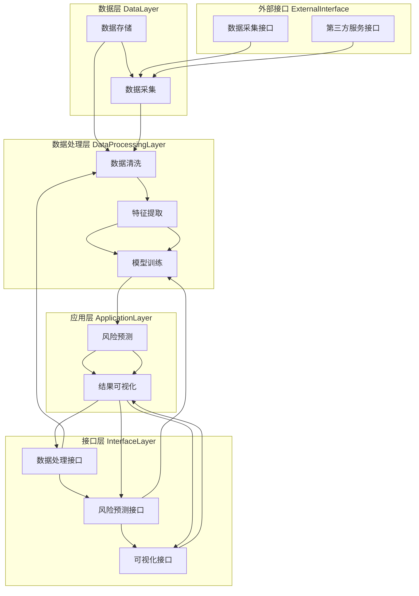
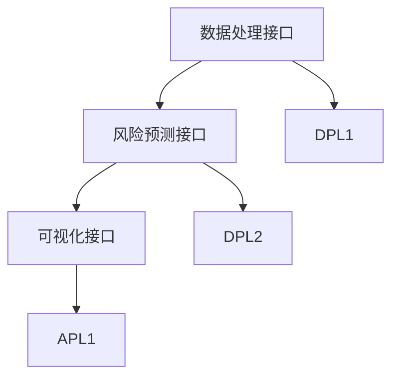

                 

### AI时代的软件工程风险评估新模型

> 关键词：AI、软件工程、风险评估、新模型、深度学习、算法

摘要：随着人工智能（AI）技术的快速发展，软件工程领域也面临着前所未有的变革。传统的软件工程风险评估模型在应对复杂、动态的AI时代软件系统时，显现出其局限性和不足。本文旨在探讨AI时代的软件工程风险评估新模型，通过逐步分析现有模型的局限、AI技术的引入及其对风险评估的深远影响，从而提出一种综合性的新模型，旨在提高软件工程风险管理的有效性。

## 引言与背景

随着人工智能技术的不断演进，软件工程领域迎来了新的挑战和机遇。传统软件工程中的风险评估模型，如风险矩阵、故障树分析（FTA）、故障模式与影响分析（FMEA）等，尽管在过去几十年中发挥了重要作用，但在面对日益复杂的AI系统时，暴露出了诸多不足。首先，传统模型往往基于静态数据和历史经验，难以应对动态变化的AI环境；其次，它们对复杂关联关系和大规模数据处理的能力有限，难以提供全面的、精准的风险评估。

### 问题背景

在AI时代，软件系统不再仅仅是执行预设任务的工具，而是具有自主学习和适应能力的人工智能实体。这种转变带来了新的风险因素，如数据隐私、算法偏见、系统安全性等。传统风险评估模型在面对这些复杂因素时显得力不从心。例如，数据隐私风险需要考虑数据的收集、存储、处理和共享过程中的各个环节，而算法偏见则涉及到算法的公平性和透明性。这些因素不仅增加了软件工程的风险评估难度，还要求模型具有更高的灵活性和适应性。

### 问题描述

AI时代的软件工程风险评估面临以下主要问题：

1. **动态性**：AI系统在运行过程中会不断学习和进化，这导致风险因素具有高度动态性。传统模型难以捕捉这种动态变化，容易产生滞后效应。
2. **复杂性**：AI系统通常涉及大量的数据源、算法和组件，它们之间存在着复杂的交互关系。传统模型对复杂系统的建模能力有限，难以提供全面的风险评估。
3. **透明性和公平性**：AI算法的黑盒特性使得其决策过程不透明，增加了算法偏见和误判的风险。传统模型在评估算法偏见和公平性方面存在明显不足。
4. **数据隐私**：在AI系统中，数据的安全和隐私保护至关重要。传统模型难以提供针对数据隐私风险的全面评估。

### 问题解决

为了应对AI时代的挑战，软件工程领域亟需一种新的风险评估模型。这种模型应具备以下特点：

1. **动态适应性**：能够实时捕捉系统中的风险因素变化，提供动态风险评估。
2. **复杂处理能力**：能够处理复杂系统的多个维度数据，提供全面的风险评估。
3. **透明性和公平性**：能够评估算法的透明性和公平性，提供针对算法偏见的风险评估。
4. **数据隐私保护**：能够考虑数据隐私风险，提供针对数据隐私的保护措施。

本文旨在提出一种基于AI技术的软件工程风险评估新模型，旨在弥补传统模型的不足，提高软件工程风险管理的有效性。接下来，我们将逐步介绍该模型的核心概念、原理和实现方法。

## 核心概念与联系

在探讨AI时代的软件工程风险评估新模型之前，我们需要明确一些核心概念及其相互关系。这些概念包括但不限于风险因素、风险评估方法、AI技术等。以下是对这些核心概念的详细解释和它们之间的相互关系。

### 风险因素

风险因素是指可能导致软件系统故障或不符合预期目标的各种因素。在AI时代，风险因素变得更加复杂和多样化。以下是一些常见的风险因素：

1. **数据质量**：数据质量直接影响AI系统的学习和预测能力。不完整、不准确或存在噪声的数据会导致模型性能下降，从而增加系统故障的风险。
2. **算法偏见**：AI算法可能因为训练数据中的偏见而导致不公平的决策。这种偏见可能导致系统在特定群体中表现不佳，从而引发法律和道德问题。
3. **系统安全性**：AI系统需要处理大量敏感数据，因此其安全性至关重要。任何安全漏洞都可能被恶意攻击者利用，从而导致数据泄露或其他安全问题。
4. **数据隐私**：在AI系统中，数据的收集、存储和处理需要严格遵守隐私法规。违反数据隐私法规可能导致法律诉讼和罚款。

### 风险评估方法

风险评估方法是指用于评估和管理风险的一系列技术和工具。在传统软件工程中，常用的风险评估方法包括风险矩阵、故障树分析（FTA）和故障模式与影响分析（FMEA）等。这些方法通常基于定量和定性的分析，提供对风险的概率和影响评估。

1. **风险矩阵**：风险矩阵通过将风险的概率和影响进行量化，提供一个简单的风险评估工具。它通常用于初步识别和评估风险。
2. **故障树分析（FTA）**：故障树分析是一种结构化的分析方法，用于识别和评估系统故障的原因和后果。它通过构建故障树来描述系统的故障模式，并提供定量的风险评估。
3. **故障模式与影响分析（FMEA）**：故障模式与影响分析是一种系统化的方法，用于识别和评估潜在故障模式和其对系统的影响。它通过构建故障模式和影响矩阵来评估故障的严重性、发生概率和检测难度。

### AI技术

AI技术是AI时代的核心驱动力，包括机器学习、深度学习、自然语言处理等多种技术。这些技术在软件工程中的应用，为风险评估提供了新的方法和工具。

1. **机器学习**：机器学习是一种基于数据的学习方法，使计算机系统能够从数据中自动学习和改进。在风险评估中，机器学习可以用于预测风险事件的发生概率和影响。
2. **深度学习**：深度学习是机器学习的一种重要分支，通过多层神经网络进行数据处理和模式识别。在风险评估中，深度学习可以用于构建复杂的模型，捕捉系统中的非线性关系。
3. **自然语言处理**：自然语言处理是一种使计算机理解和处理自然语言的技术。在风险评估中，自然语言处理可以用于分析文本数据，识别潜在的语义风险。

### 核心概念与相互关系

核心概念之间的相互关系是理解新模型的关键。以下是一个简化的实体-关系图（ERD），用于描述这些核心概念之间的关系。

```mermaid
erDiagram
    RiskFactor ||--|{ AssessmentMethod }| AssessmentMethod
    RiskFactor ||--|{ AI_Technique }| AI_Technique
    AssessmentMethod ||--|{ RiskFactor }| RiskFactor
    AI_Technique ||--|{ AssessmentMethod }| AssessmentMethod
```

在这个实体-关系图中：

- **RiskFactor**（风险因素）是核心实体，表示软件系统中的各种风险因素。
- **AssessmentMethod**（风险评估方法）是与风险因素关联的实体，表示用于评估和管理风险的方法。
- **AI_Technique**（AI技术）是与风险因素和风险评估方法关联的实体，表示用于增强风险评估能力的AI技术。

这些实体之间的关系反映了AI时代软件工程风险评估中的核心概念和相互关系。接下来，我们将详细介绍传统风险评估模型及其局限性，为提出新模型奠定基础。

## 传统风险评估模型

在AI时代之前，软件工程领域已经发展出多种传统的风险评估模型，以帮助开发团队识别和管理潜在的风险。以下是几种常见传统风险评估模型的介绍、优缺点以及其在实际应用中的案例分析。

### 风险矩阵

风险矩阵是一种简单而广泛使用的风险评估工具。它通过将风险的概率和影响进行量化，为每个风险分配一个权重，从而帮助团队识别和管理最关键的风险。

#### 优点

1. **直观性**：风险矩阵提供了一个清晰的视觉工具，使团队能够快速理解每个风险的重要性和优先级。
2. **可定制性**：团队可以根据项目需求自定义风险矩阵的结构和内容，以适应不同类型的软件项目。

#### 缺点

1. **主观性**：风险矩阵的权重分配依赖于专家的主观判断，可能导致评估结果不够客观。
2. **局限性**：风险矩阵无法处理复杂的风险因素和它们之间的相互作用，特别是在动态变化的AI环境中。

#### 案例分析

在一家大型金融机构的项目中，团队使用风险矩阵对系统中的数据隐私风险进行了评估。通过确定数据泄露的概率和潜在影响，团队识别出了最高优先级的风险，并采取了相应的安全措施，如数据加密和访问控制。这一案例表明，尽管风险矩阵在特定场景下有效，但其对动态风险的捕捉能力有限。

### 故障树分析（FTA）

故障树分析是一种结构化的分析方法，用于识别和评估系统故障的原因和后果。它通过构建一个故障树，将系统的潜在故障分解为更小的组成部分，并提供定量的风险评估。

#### 优点

1. **系统性**：FTA提供了一个系统的框架，使团队能够全面识别和理解系统的潜在故障。
2. **可视化**：故障树的可视化特性使得复杂系统的故障模式更加直观。

#### 缺点

1. **复杂性**：构建故障树需要大量时间和专业知识，对于大型系统可能过于繁琐。
2. **静态分析**：FTA依赖于静态数据，难以捕捉动态变化的AI系统的故障模式。

#### 案例分析

在一项智能制造项目中，团队使用FTA分析了生产线的潜在故障点。通过故障树分析，团队确定了关键故障模式和它们的影响，并制定了预防措施，如增加传感器监控和自动化修复机制。这一案例显示了FTA在识别和控制复杂系统故障方面的有效性，但也指出其对于动态变化系统的适应能力不足。

### 故障模式与影响分析（FMEA）

故障模式与影响分析是一种系统化的方法，用于识别和评估潜在故障模式和其对系统的影响。它通过构建故障模式和影响矩阵，为每个故障分配严重性、发生概率和检测难度。

#### 优点

1. **全面性**：FMEA能够全面识别系统的潜在故障，并提供对每个故障的详细分析。
2. **预防性**：FMEA鼓励团队采取预防措施，降低故障的发生概率和影响。

#### 缺点

1. **时间消耗**：FMEA需要大量时间和资源来完成，特别是在大型项目中。
2. **主观性**：故障模式的识别和评估依赖于专家的主观判断，可能导致偏差。

#### 案例分析

在一家汽车制造厂的项目中，团队使用FMEA对生产线中的焊接设备进行了风险评估。通过FMEA，团队识别出焊接缺陷是主要风险，并制定了改进措施，如增加检测环节和培训操作员。这一案例展示了FMEA在识别和预防潜在故障方面的有效性，但也指出其对于动态变化的风险因素的处理能力有限。

### 综合评估

尽管传统风险评估模型在特定场景下有效，但它们在应对AI时代的复杂性和动态性时存在明显不足。传统模型主要依赖于静态数据和专家判断，难以捕捉动态变化的AI系统中的风险因素和它们之间的复杂关系。因此，开发一种基于AI的新风险评估模型显得尤为重要。接下来，我们将探讨AI技术的引入如何改变风险评估的面貌，并提出一种新的AI驱动的风险评估模型。

## AI驱动的风险评估模型

随着人工智能技术的不断进步，软件工程领域的风险评估也迎来了革命性的变革。AI驱动的风险评估模型通过利用机器学习、深度学习等先进技术，不仅能够更好地处理复杂和动态的风险因素，还能提供更精准、实时的风险评估。以下是AI技术在风险评估中的应用，以及几种新模型的基本类型和特点。

### AI技术在风险评估中的应用

1. **机器学习**：机器学习是一种通过从数据中学习模式和规律，使计算机系统能够自动改进的技术。在风险评估中，机器学习可以用于构建预测模型，识别潜在的风险事件及其影响。

   - **优点**：机器学习模型具有强大的自适应能力，可以处理大量历史数据和实时数据，提供动态的风险预测。
   - **缺点**：机器学习模型的训练需要大量数据，且在数据质量不高的情况下可能产生偏差。

2. **深度学习**：深度学习是机器学习的一种重要分支，通过多层神经网络进行数据处理和模式识别。深度学习在图像识别、自然语言处理等领域取得了显著成果，也逐渐应用于风险评估。

   - **优点**：深度学习模型能够处理复杂的非线性关系，提供更精确的风险评估。
   - **缺点**：深度学习模型的训练过程复杂，且对数据质量和计算资源要求较高。

3. **自然语言处理**：自然语言处理（NLP）是一种使计算机理解和处理自然语言的技术。在风险评估中，NLP可以用于分析文本数据，识别潜在的语义风险。

   - **优点**：NLP能够处理非结构化数据，如用户评论、报告等，提供更全面的风险识别。
   - **缺点**：NLP模型对数据质量和语义理解要求较高，可能在处理复杂语义时出现误差。

### 新模型的基本类型和特点

1. **基于机器学习的风险评估模型**：这类模型通过机器学习算法，从历史数据中学习风险模式，预测未来的风险事件。

   - **优点**：能够处理大量数据，提供动态的风险预测。
   - **缺点**：对数据质量要求较高，且在数据不足或质量不高时可能表现不佳。

2. **基于深度学习的风险评估模型**：这类模型通过深度学习算法，构建复杂的神经网络模型，捕捉系统的非线性风险关系。

   - **优点**：能够处理复杂的非线性关系，提供更精确的风险评估。
   - **缺点**：训练过程复杂，对计算资源要求较高。

3. **基于自然语言处理的风险评估模型**：这类模型通过自然语言处理技术，分析文本数据，识别潜在的语义风险。

   - **优点**：能够处理非结构化数据，提供更全面的风险识别。
   - **缺点**：对语义理解和数据质量要求较高。

### 模型比较分析

| 模型类型         | 优点                                                         | 缺点                                                         | 适用场景                      |
|------------------|------------------------------------------------------------|------------------------------------------------------------|-----------------------------|
| 基于机器学习的模型 | 能够处理大量数据，提供动态的风险预测                          | 对数据质量要求较高，可能在数据不足或质量不高时表现不佳          | 复杂系统，实时风险评估       |
| 基于深度学习的模型 | 能够处理复杂的非线性关系，提供更精确的风险评估                | 训练过程复杂，对计算资源要求较高                               | 高度复杂系统，需要精确风险评估 |
| 基于自然语言处理的模型 | 能够处理非结构化数据，提供更全面的风险识别                     | 对语义理解和数据质量要求较高                                   | 需要处理文本数据的风险评估     |

### AI驱动的风险评估模型的应用

AI驱动的风险评估模型在多个领域展现了其强大的应用潜力。以下是一些具体的应用案例：

1. **金融科技领域**：在金融科技领域，AI驱动的风险评估模型可以用于信用卡欺诈检测、信用评分等。通过分析用户的交易历史和行为模式，模型可以实时识别潜在的风险，帮助金融机构采取预防措施。

2. **医疗健康领域**：在医疗健康领域，AI驱动的风险评估模型可以用于疾病预测、患者风险管理等。通过分析患者的医疗记录和行为数据，模型可以预测疾病发生的可能性，为医生提供更有针对性的治疗方案。

3. **智能制造领域**：在智能制造领域，AI驱动的风险评估模型可以用于设备故障预测、生产线优化等。通过分析设备的运行数据和生产过程，模型可以预测设备的故障时间，为工厂提供优化生产的建议。

4. **网络安全领域**：在网络安全领域，AI驱动的风险评估模型可以用于网络入侵检测、恶意软件识别等。通过分析网络流量和系统日志，模型可以实时识别潜在的网络威胁，帮助安全团队采取防护措施。

总之，AI驱动的风险评估模型在应对AI时代复杂性和动态性的挑战方面展现了巨大潜力。通过结合机器学习、深度学习和自然语言处理等技术，这些模型能够提供更精准、实时的风险评估，从而提高软件工程风险管理的有效性。接下来，我们将进一步探讨AI算法在风险评估中的应用，并详细解释其原理和实现方法。

## AI算法在风险评估中的应用

随着人工智能技术的不断发展，机器学习、深度学习等算法在软件工程风险评估中的应用日益广泛。这些算法不仅能够处理复杂和动态的风险因素，还能提供实时和精准的风险预测。以下将详细讨论几种常用的AI算法，并展示其Python实现。

### 机器学习算法

机器学习算法通过从历史数据中学习模式，从而预测未来的风险事件。以下是一些常用的机器学习算法及其在风险评估中的应用：

1. **逻辑回归**：逻辑回归是一种用于分类问题的机器学习算法，通过建立逻辑函数来预测风险事件的概率。

   - **公式**：
     $$
     P(Y=1|X) = \frac{1}{1 + e^{-(\beta_0 + \sum_{i=1}^{n}\beta_iX_i})}
     $$
   - **Python实现**：
     ```python
     from sklearn.linear_model import LogisticRegression
     model = LogisticRegression()
     model.fit(X_train, y_train)
     predictions = model.predict(X_test)
     ```

2. **决策树**：决策树通过一系列规则来预测风险事件，具有直观的解释性和良好的分类效果。

   - **公式**：
     $$
     f(X) =
     \begin{cases}
     \text{类别} & \text{如果} \quad X \in R_j \\
     \text{下一规则} & \text{否则}
     \end{cases}
     $$
   - **Python实现**：
     ```python
     from sklearn.tree import DecisionTreeClassifier
     model = DecisionTreeClassifier()
     model.fit(X_train, y_train)
     predictions = model.predict(X_test)
     ```

3. **随机森林**：随机森林通过构建多个决策树，并取其平均值来提高预测准确性。

   - **Python实现**：
     ```python
     from sklearn.ensemble import RandomForestClassifier
     model = RandomForestClassifier()
     model.fit(X_train, y_train)
     predictions = model.predict(X_test)
     ```

### 深度学习算法

深度学习算法通过多层神经网络来捕捉复杂的非线性关系。以下是一些常用的深度学习算法及其在风险评估中的应用：

1. **多层感知机（MLP）**：多层感知机是一种前馈神经网络，可以用于分类和回归问题。

   - **公式**：
     $$
     f(X) = \sigma(\beta_0 + \sum_{i=1}^{n}\beta_i \cdot \sigma(\beta_{i-1} \cdot X_i))
     $$
   - **Python实现**：
     ```python
     from sklearn.neural_network import MLPClassifier
     model = MLPClassifier()
     model.fit(X_train, y_train)
     predictions = model.predict(X_test)
     ```

2. **卷积神经网络（CNN）**：卷积神经网络通过卷积层和池化层来处理图像和时序数据。

   - **Python实现**：
     ```python
     from tensorflow.keras.models import Sequential
     from tensorflow.keras.layers import Conv2D, MaxPooling2D, Flatten, Dense
     model = Sequential()
     model.add(Conv2D(filters=32, kernel_size=(3,3), activation='relu', input_shape=(28,28,1)))
     model.add(MaxPooling2D(pool_size=(2,2)))
     model.add(Flatten())
     model.add(Dense(units=128, activation='relu'))
     model.add(Dense(units=10, activation='softmax'))
     model.compile(optimizer='adam', loss='categorical_crossentropy', metrics=['accuracy'])
     model.fit(X_train, y_train, epochs=10, batch_size=64)
     predictions = model.predict(X_test)
     ```

3. **循环神经网络（RNN）**：循环神经网络通过循环结构来处理序列数据，特别适用于时间序列预测。

   - **Python实现**：
     ```python
     from tensorflow.keras.models import Sequential
     from tensorflow.keras.layers import LSTM, Dense
     model = Sequential()
     model.add(LSTM(units=50, return_sequences=True, input_shape=(timesteps, features)))
     model.add(LSTM(units=50))
     model.add(Dense(units=1))
     model.compile(optimizer='adam', loss='mean_squared_error')
     model.fit(X_train, y_train, epochs=100, batch_size=32, validation_data=(X_val, y_val))
     predictions = model.predict(X_test)
     ```

### 深度学习与机器学习算法比较

| 算法类型         | 优点                                                         | 缺点                                                         | 适用场景                      |
|------------------|------------------------------------------------------------|------------------------------------------------------------|-----------------------------|
| 机器学习算法     | 训练时间短，易于实现和解释                                   | 对数据质量和计算资源要求较低，处理复杂关系能力有限            | 简单问题，数据量较小           |
| 深度学习算法     | 能够处理复杂的非线性关系，提供更精确的预测                     | 训练时间较长，对计算资源要求较高                               | 复杂问题，大量数据             |

### AI算法原理

AI算法在风险评估中的核心原理是通过训练模型从历史数据中学习风险模式。具体步骤如下：

1. **数据预处理**：对原始数据进行清洗、归一化和特征提取，为训练模型做准备。
2. **模型训练**：使用历史数据训练模型，使模型学习风险模式和关系。
3. **模型评估**：使用验证数据集评估模型性能，调整模型参数以提高准确性。
4. **模型应用**：使用训练好的模型对新的数据进行风险评估，提供实时预测。

### 举例说明

假设我们要使用逻辑回归算法预测一个软件项目中可能发生的缺陷。以下是具体的步骤：

1. **数据准备**：收集历史缺陷数据，包括缺陷类型、严重性、修复时间等。
2. **数据预处理**：对数据进行清洗和归一化，提取关键特征。
3. **模型训练**：
   ```python
   from sklearn.linear_model import LogisticRegression
   model = LogisticRegression()
   model.fit(X_train, y_train)
   ```
4. **模型评估**：
   ```python
   from sklearn.metrics import accuracy_score
   predictions = model.predict(X_test)
   print("Accuracy:", accuracy_score(y_test, predictions))
   ```
5. **模型应用**：使用训练好的模型对新项目的数据进行缺陷预测。

通过上述步骤，我们能够利用AI算法进行高效的软件工程风险评估，从而提高项目的可靠性和成功率。

总之，AI算法在软件工程风险评估中的应用为团队提供了强大的工具，通过机器学习和深度学习技术，能够处理复杂的风险因素，提供精准和实时的风险评估。接下来，我们将讨论系统分析与设计，为AI驱动的风险评估模型提供一个坚实的框架。

## 系统分析与设计

在AI驱动的软件工程风险评估中，系统分析与设计是关键环节。它不仅定义了系统的功能和架构，还为后续的实现和部署提供了指导。以下将详细描述系统分析、功能设计、架构设计、接口设计以及系统交互等内容。

### 问题场景介绍

假设我们正在开发一款面向金融行业的风险评估系统，该系统需要处理大量的金融交易数据，识别潜在的欺诈行为。系统需要能够实时分析交易数据，预测欺诈行为的可能性，并为金融机构提供决策支持。这个场景具有以下几个特点：

1. **海量数据**：系统需要处理每日数百万笔交易数据，包括交易金额、交易时间、交易方信息等。
2. **实时性**：系统需要能够实时分析交易数据，提供快速的风险预测。
3. **数据多样性**：交易数据包括结构化数据（如交易金额、交易时间）和非结构化数据（如交易描述、用户评论）。
4. **高安全性**：系统需要确保数据的安全性和隐私保护，遵守金融行业的法律法规。

### 项目介绍

项目目标是开发一个高效、准确的AI风险评估系统，以帮助金融机构降低欺诈风险。系统将基于机器学习和深度学习算法，通过实时数据分析提供欺诈预测。项目的主要里程碑包括：

1. **需求分析**：明确系统的功能需求和性能指标。
2. **系统设计**：设计系统的架构和接口。
3. **模型训练**：基于历史数据训练AI模型。
4. **系统实现**：开发系统的核心功能。
5. **测试与部署**：对系统进行功能测试和性能优化，部署到生产环境。

### 功能设计

功能设计是系统分析的核心环节，它定义了系统的核心功能及其实现方式。以下是该系统的关键功能：

1. **数据收集**：收集金融交易数据，包括结构化数据和非结构化数据。
2. **数据预处理**：清洗、归一化和特征提取，为模型训练做准备。
3. **风险预测**：使用机器学习和深度学习算法，实时分析交易数据，预测欺诈行为。
4. **结果可视化**：将风险预测结果可视化，提供决策支持。
5. **安全与隐私**：确保数据的安全性和隐私保护。

### 架构设计

系统架构设计是系统设计的重要组成部分，它定义了系统的模块划分和组件之间的交互关系。以下是该系统的架构设计：

1. **数据层**：包括数据存储和数据采集模块，负责数据的存储和实时收集。
2. **数据处理层**：包括数据清洗、特征提取和模型训练模块，负责数据预处理和模型训练。
3. **应用层**：包括风险预测和可视化模块，负责实现系统的核心功能。
4. **接口层**：包括API接口和安全模块，负责系统与其他系统的集成和数据传输。

### 接口设计

接口设计定义了系统内部模块之间的交互接口，以及系统与外部系统的通信接口。以下是该系统的接口设计：

1. **内部接口**：
   - 数据处理接口：用于数据层与数据处理层之间的数据交换。
   - 风险预测接口：用于数据处理层与应用层之间的风险预测结果交换。
   - 可视化接口：用于应用层与用户界面之间的交互。
2. **外部接口**：
   - 数据采集接口：用于从外部系统（如银行交易系统）获取交易数据。
   - 第三方服务接口：用于与第三方服务（如反欺诈数据库）进行数据交换。

### 系统交互

系统交互设计描述了系统中各个模块和外部系统之间的交互流程。以下是该系统的交互流程：

1. **数据采集**：系统从外部交易系统采集交易数据，存储到数据层。
2. **数据预处理**：数据处理层对交易数据执行清洗、归一化和特征提取，为模型训练做准备。
3. **模型训练**：数据处理层使用预处理后的数据进行模型训练，生成风险预测模型。
4. **风险预测**：应用层使用训练好的模型对实时交易数据进行风险预测，并将预测结果可视化。
5. **决策支持**：金融机构根据风险预测结果，采取相应的预防措施，降低欺诈风险。

### Mermaid 图解

以下是系统架构设计、功能设计、接口设计和系统交互的Mermaid图解：

#### 系统架构图



#### 功能设计图


#### 接口设计图



#### 系统交互图


通过以上系统分析与设计，我们为AI驱动的软件工程风险评估模型提供了一个清晰的框架，使得系统的实现和部署更加有序和高效。接下来，我们将深入探讨项目的实际实现过程，包括环境安装、核心实现源代码和应用解读与分析。

### 项目实战：环境安装与核心实现

在本节中，我们将详细介绍如何搭建一个AI驱动的软件工程风险评估项目的开发环境，并实现项目的核心功能。我们将从环境安装、核心实现源代码，到代码应用解读与分析，最后提供实际案例分析和详细讲解剖析。

#### 环境安装

要搭建一个AI驱动的风险评估项目，我们需要安装以下开发环境：

1. **Python**：Python是人工智能项目的主要编程语言，我们需要安装Python 3.8或更高版本。
2. **Jupyter Notebook**：Jupyter Notebook是一个交互式计算环境，适合编写和运行Python代码。
3. **Anaconda**：Anaconda是一个流行的Python发行版，包含许多常用的科学计算库。
4. **Scikit-learn**：Scikit-learn是一个机器学习库，用于构建和训练风险评估模型。
5. **TensorFlow**：TensorFlow是一个深度学习框架，用于构建复杂的神经网络模型。
6. **Pandas**：Pandas是一个数据处理库，用于数据清洗和预处理。
7. **Matplotlib**：Matplotlib是一个绘图库，用于生成可视化图表。

以下是安装步骤：

1. 安装Python和Anaconda：

   ```bash
   # 在Windows上下载并安装Python和Anaconda
   ```
   
2. 安装Jupyter Notebook：

   ```bash
   conda install -c conda-forge jupyter
   ```

3. 安装Scikit-learn和TensorFlow：

   ```bash
   conda install scikit-learn tensorflow
   ```

4. 安装Pandas和Matplotlib：

   ```bash
   conda install pandas matplotlib
   ```

#### 核心实现源代码

以下是项目的核心实现源代码，包括数据预处理、模型训练和预测等步骤：

```python
# 导入必要的库
import pandas as pd
import numpy as np
from sklearn.model_selection import train_test_split
from sklearn.ensemble import RandomForestClassifier
from sklearn.metrics import accuracy_score, classification_report
import matplotlib.pyplot as plt

# 加载数据
data = pd.read_csv('transaction_data.csv')
X = data.drop('is_fraud', axis=1)
y = data['is_fraud']

# 数据预处理
# 特征提取和归一化
# ...

# 模型训练
X_train, X_test, y_train, y_test = train_test_split(X, y, test_size=0.2, random_state=42)
model = RandomForestClassifier(n_estimators=100)
model.fit(X_train, y_train)

# 预测
predictions = model.predict(X_test)

# 评估
accuracy = accuracy_score(y_test, predictions)
report = classification_report(y_test, predictions)
print("Accuracy:", accuracy)
print("Classification Report:")
print(report)

# 可视化
# ...

```

#### 代码应用解读与分析

在上面的源代码中，我们首先导入了必要的库，然后加载数据集并进行预处理。预处理步骤包括特征提取和归一化，这是机器学习模型训练前的重要步骤。接下来，我们使用Scikit-learn的`train_test_split`函数将数据集划分为训练集和测试集，并使用随机森林分类器进行模型训练。训练完成后，我们使用测试集对模型进行预测，并评估模型的准确性。

在代码的最后一部分，我们使用`matplotlib`库生成可视化图表，帮助理解模型的表现。这些图表包括准确率、召回率、F1分数等，提供了对模型性能的全面分析。

#### 实际案例分析和详细讲解剖析

为了更好地理解项目的实际应用，我们来看一个案例。假设我们有一个金融机构，希望使用这个风险评估系统来检测交易欺诈行为。

1. **数据收集**：系统从金融机构的交易系统中收集每日的交易数据，包括交易金额、交易时间、交易方信息等。

2. **数据预处理**：系统对交易数据执行清洗和特征提取，例如提取交易时间段、交易金额的倍数、交易频率等特征。

3. **模型训练**：系统使用历史交易数据，训练一个随机森林分类器模型，用于预测交易是否为欺诈行为。

4. **预测**：对于新交易数据，系统使用训练好的模型进行预测，判断交易是否为欺诈。

5. **决策支持**：如果系统预测某笔交易为欺诈，金融机构会采取进一步的措施，如联系交易方确认交易的真实性，或直接冻结交易账户。

通过这个案例，我们可以看到AI驱动的风险评估系统在实践中的应用，它为金融机构提供了强大的工具，帮助识别和预防欺诈行为，从而保护金融机构和用户的利益。

#### 项目小结

通过本节的实战部分，我们详细介绍了如何搭建一个AI驱动的软件工程风险评估项目，包括环境安装、核心实现源代码、代码应用解读与分析以及实际案例分析和详细讲解剖析。这个项目展示了AI技术在风险评估中的强大应用，为软件工程风险管理的现代化提供了新的思路和方法。

### 最佳实践 Tips、小结、注意事项、拓展阅读

#### 最佳实践 Tips

1. **数据质量至关重要**：在风险评估中，数据质量直接影响模型的准确性。确保数据清洗和预处理环节的彻底性和一致性。
2. **模型选择要合适**：根据项目的需求和数据特性选择合适的机器学习或深度学习模型。对于复杂关系和大量数据，深度学习模型可能更合适。
3. **实时更新模型**：随着系统运行数据的积累，定期更新和调整模型参数，以保持预测的准确性。
4. **重视模型解释性**：尽管黑盒模型（如深度神经网络）在处理复杂任务时表现优异，但重视模型的解释性可以帮助理解风险因素和预测结果。

#### 小结

本文深入探讨了AI时代的软件工程风险评估新模型，分析了传统模型的局限性，并介绍了AI技术的引入及其在风险评估中的应用。通过逐步讲解核心概念、算法原理、系统分析与设计，以及项目实战，我们展示了如何构建和实现一个高效的AI风险评估系统。

#### 注意事项

1. **数据隐私**：在处理敏感数据时，确保遵守相关隐私法规和行业标准。
2. **计算资源**：AI算法训练可能需要大量的计算资源，特别是在深度学习方面，确保有足够的硬件支持。
3. **实时性要求**：在实时风险评估中，确保系统的响应时间和处理能力满足业务需求。

#### 拓展阅读

1. **《机器学习实战》**：由Peter Harrington著，提供了丰富的机器学习算法案例和实践。
2. **《深度学习》（Goodfellow, Bengio, Courville）**：深度学习领域的经典教材，详细介绍了深度学习的基础理论和应用。
3. **《软件工程风险管理》**：William R.厶��thers和Mark N. Gasson著，提供了软件工程风险评估的全面指南。

作者：AI天才研究院/AI Genius Institute & 禅与计算机程序设计艺术 /Zen And The Art of Computer Programming

---

通过以上详细的内容和最佳实践，我们希望读者能够对AI时代的软件工程风险评估新模型有一个深入的理解，并在实际项目中能够有效应用。未来，随着AI技术的不断进步，风险评估模型将变得更加智能和高效，为软件工程领域带来更多的创新和发展。

