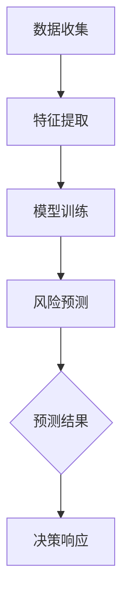
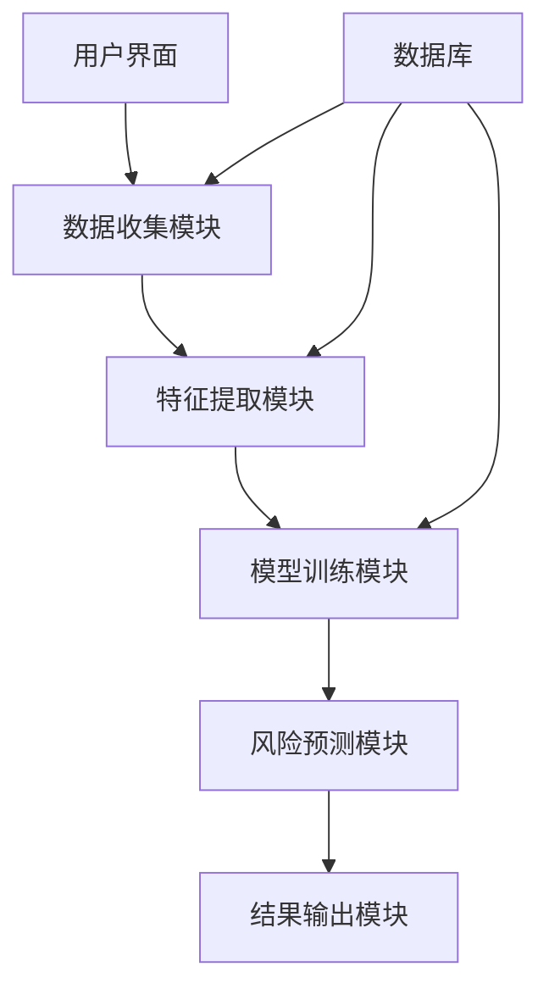
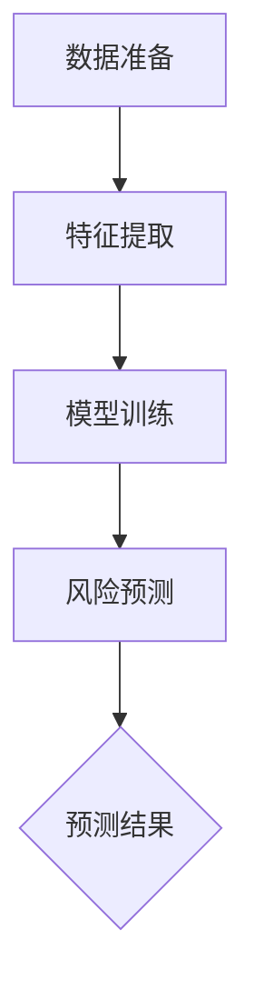
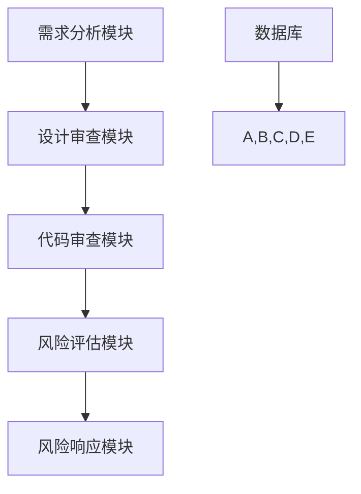
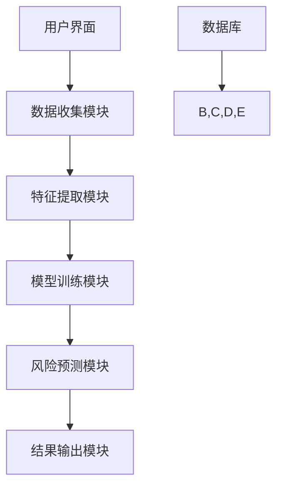

                 

### 引言

在当前的AI时代，软件工程领域正经历着前所未有的变革。随着人工智能技术的迅速发展，软件工程的风险评估方法也逐步演进。传统的软件工程风险评估方法往往依赖于经验判断和静态分析，难以应对复杂多变的应用场景。而AI技术的引入，为软件工程风险评估带来了新的视角和工具，使得风险评估更为动态、精确和高效。

本文旨在探讨AI时代软件工程风险评估的动态与静态分析方法，结合实际案例，详细分析并阐述这些方法的基本原理、实现步骤和实际应用效果。文章首先概述了AI时代软件工程风险管理的背景和重要性，接着深入介绍了动态和静态风险评估的基本概念和方法，以及相关的算法原理和系统架构设计。通过这种结构化的分析，希望能够帮助读者全面了解和掌握AI时代软件工程风险评估的关键技术和实践方法。

### 关键词

- **AI时代**
- **软件工程**
- **风险评估**
- **动态分析**
- **静态分析**
- **算法**
- **系统架构**

### 摘要

本文探讨了AI时代软件工程风险评估的动态与静态分析方法。首先，介绍了AI技术在软件工程中的应用背景，分析了传统风险评估方法的局限性。接着，详细阐述了动态和静态风险评估的基本概念、方法、算法原理及实现步骤。通过实际案例，对比了动态与静态分析在风险评估中的效果和应用场景。最后，总结了AI时代软件工程风险评估的最佳实践，并展望了未来的发展方向。本文旨在为从事软件工程风险评估的工程师和研究人员提供理论指导和实践参考。

### 第一部分：引言

#### 第1章：AI时代软件工程风险概述

##### 1.1 风险管理的背景

在软件工程的历史长河中，风险管理一直是一个重要的议题。随着软件项目的复杂性和规模日益增长，如何有效地识别、评估和控制风险，成为了项目成功的关键因素。传统的软件工程风险管理主要依赖于经验判断和静态分析方法，例如使用软件缺陷统计、代码审查和项目进度评估等方法。这些方法在一定程度上能够识别风险，但往往存在一定的局限性，难以应对快速变化的软件开发环境。

随着人工智能（AI）技术的兴起，软件工程领域的风险管理迎来了新的机遇和挑战。AI技术能够通过数据分析和模式识别，提供更为精确和动态的风险预测和评估。具体而言，AI技术在软件工程风险管理中的应用主要体现在以下几个方面：

1. **自动化风险评估**：AI算法能够自动分析和识别软件代码中的潜在缺陷，从而减少人为因素引入的错误。例如，静态代码分析工具可以使用机器学习算法来预测代码中的潜在缺陷。
2. **实时监控和反馈**：AI技术可以实时监控软件项目的开发和运行过程，及时发现并响应风险。例如，使用基于AI的持续集成（CI）工具，可以在代码提交后立即检测出潜在的集成问题和风险。
3. **个性化风险评估**：AI可以根据项目的具体特点和历史数据，提供个性化的风险评估报告和建议。例如，使用AI驱动的风险评估平台，可以根据项目的风险偏好和目标，调整风险评估策略。

##### 1.2 AI技术在软件工程中的应用

AI技术在软件工程中的应用已经取得了显著的成果。以下是一些典型的应用场景：

1. **代码审查**：AI算法可以自动分析代码，识别潜在的安全漏洞、性能问题和设计缺陷。例如，Google的CodeSearchNet使用深度学习技术，可以自动生成代码审查报告，提高了代码质量和开发效率。
2. **缺陷预测**：AI算法可以根据历史数据预测哪些模块或功能可能存在缺陷，从而提前采取修复措施。例如，NASA的AI系统使用机器学习算法，可以预测航天器软件中的潜在缺陷，提高了航天器发射的成功率。
3. **自动化测试**：AI技术可以生成和执行自动化测试脚本，提高测试效率和覆盖范围。例如，IBM的AI测试平台可以自动生成和执行复杂的测试用例，发现软件中的隐性和潜在问题。
4. **代码生成**：AI技术可以自动生成代码，减少手动编码的工作量。例如，Google的AI工具可以使用自然语言描述生成代码，提高了开发效率。

##### 1.3 风险评估的重要性

在软件工程中，风险评估是一个关键的环节。有效的风险评估不仅可以帮助识别项目中的潜在风险，还能为项目管理团队提供决策支持，从而降低项目失败的风险。具体而言，风险评估的重要性体现在以下几个方面：

1. **风险识别**：通过风险评估，可以及时发现项目中的潜在风险，避免在项目进行过程中遇到意外的挑战。
2. **决策支持**：风险评估提供了项目风险的信息，帮助项目管理人员做出更加明智的决策，例如资源分配、时间规划和风险管理策略。
3. **风险管理**：有效的风险评估可以帮助制定和实施风险管理计划，降低风险的发生概率和影响范围。
4. **质量保证**：通过评估软件项目的风险，可以及时发现和修复潜在的问题，从而提高软件的质量和可靠性。

##### 1.4 风险评估的挑战与机遇

尽管AI技术为软件工程风险评估带来了许多机遇，但也面临一些挑战。以下是一些主要的挑战和机遇：

1. **数据质量**：AI算法的性能高度依赖于数据的质量和数量。在软件工程中，数据通常较为复杂和多样，如何获取和处理这些数据，是当前的一个挑战。
2. **算法选择**：不同的AI算法适用于不同类型的风险评估任务，如何选择合适的算法，是项目管理人员需要考虑的一个重要问题。
3. **实时性**：在软件工程中，风险评估需要实时性，以便及时响应风险变化。如何设计高效的AI算法和系统，以实现实时风险评估，是一个重要课题。
4. **可解释性**：AI算法的黑箱特性使得其决策过程难以解释和理解。如何提高算法的可解释性，使其能够被项目管理人员和开发者理解和接受，是一个重要挑战。

然而，面对这些挑战，AI技术同样为软件工程风险评估带来了新的机遇。通过合理利用AI技术，软件工程领域可以实现对风险的更精确、更动态的评估，从而提高项目的成功率。

### 第二部分：AI时代的软件工程风险概念

#### 第2章：AI时代的软件工程风险概念

##### 2.1 风险定义

在软件工程中，风险是指项目在开发和运行过程中可能遇到的问题和挑战，这些问题的出现可能会导致项目目标无法实现，甚至导致项目失败。风险具有不确定性、影响性和可控性等特点。

1. **不确定性**：风险的发生具有不确定性，即风险是否会发生以及其发生的时间和影响程度都是未知的。
2. **影响性**：风险的发生会对项目产生不同程度的影响，包括时间、成本、质量、安全等方面。
3. **可控性**：风险在一定程度上是可以被控制的，通过有效的风险管理措施，可以降低风险的发生概率和影响范围。

##### 2.2 风险类型

在软件工程中，根据风险的特征和发生阶段，可以将风险分为以下几种类型：

1. **项目风险**：项目风险是指项目在规划、设计、开发、测试等阶段可能遇到的风险，包括进度风险、成本风险、质量风险等。
2. **技术风险**：技术风险是指与软件技术相关的问题，如技术选型不当、技术方案实现困难、技术方案过时等。
3. **管理风险**：管理风险是指项目管理过程中可能遇到的问题，如团队沟通不畅、项目计划不周、资源分配不合理等。
4. **安全风险**：安全风险是指软件系统在运行过程中可能遇到的安全问题，如数据泄露、系统被攻击等。

##### 2.3 风险属性特征对比

不同类型的风险具有不同的属性特征，以下是一个对比表格：

| 风险类型 | 属性特征 |
| --- | --- |
| 项目风险 | 影响项目进度、成本和质量 |
| 技术风险 | 影响技术实现和系统性能 |
| 管理风险 | 影响项目管理和团队协作 |
| 安全风险 | 影响系统安全和数据保护 |

##### 2.4 风险模型ER图

为了更好地理解和分析软件工程中的风险，可以使用实体关系（ER）图来表示风险模型。以下是一个简单的ER图：

```mermaid
erDiagram
  ProjectRisk ||--|{ TechnicalRisk } TechnicalRisk
  ProjectRisk ||--|{ ManagementRisk } ManagementRisk
  ProjectRisk ||--|{ SecurityRisk } SecurityRisk
  TechnicalRisk ||--|{ CodeQualityRisk } CodeQualityRisk
  TechnicalRisk ||--|{ PerformanceRisk } PerformanceRisk
  ManagementRisk ||--|{ CommunicationRisk } CommunicationRisk
  ManagementRisk ||--|{ PlanningRisk } PlanningRisk
  ManagementRisk ||--|{ ResourceAllocationRisk } ResourceAllocationRisk
  SecurityRisk ||--|{ DataLeakRisk } DataLeakRisk
  SecurityRisk ||--|{ SystemAttackRisk } SystemAttackRisk
```

在上述ER图中，各个实体代表了不同类型的风险，实体之间的关系表示了风险的关联性。例如，项目风险可以关联到技术风险、管理风险和安全风险，而技术风险又可以进一步关联到代码质量风险和性能风险。

通过使用ER图，我们可以更清晰地理解软件工程中的风险类型及其相互关系，从而为风险管理提供有效的理论支持。

### 第三部分：动态风险分析

#### 第3章：动态风险评估方法

##### 3.1 动态风险评估概述

动态风险评估是一种在软件项目的开发过程中，实时监控和分析风险的方法。与传统的静态风险评估方法不同，动态风险评估不仅考虑项目当前的静态状态，还关注项目在开发过程中可能发生的变化。这种方法能够更好地适应软件开发过程中的不确定性，提供更准确和及时的风险信息。

##### 3.2 动态风险评估步骤

动态风险评估通常包括以下几个步骤：

1. **风险识别**：在项目开发初期，通过文档分析、团队讨论和专家咨询等方式，识别项目中的潜在风险。
2. **风险评估**：使用定性和定量方法，对识别出的风险进行评估，确定其发生概率和潜在影响。
3. **风险监控**：在项目开发过程中，持续监控风险的变化，及时发现新的风险。
4. **风险响应**：根据风险评估结果和风险监控信息，制定和实施相应的风险应对措施。

##### 3.3 动态风险评估工具与技术

动态风险评估需要借助一系列工具和技术，以下是一些常用的工具和技术：

1. **持续集成工具**：如Jenkins、Travis CI等，用于自动化测试和代码审查，及时发现潜在风险。
2. **代码质量分析工具**：如SonarQube、CodeClimate等，用于静态代码分析，识别代码中的潜在缺陷。
3. **机器学习算法**：如决策树、支持向量机（SVM）、神经网络等，用于预测和评估风险。
4. **实时监控工具**：如Prometheus、Kibana等，用于实时监控项目的运行状态，及时发现异常。

##### 3.4 动态风险评估案例

以下是一个动态风险评估的案例：

**项目背景**：某公司开发一款移动应用，项目时间紧、任务重，且涉及多个功能模块。

**步骤1：风险识别**：通过文档分析、团队讨论和用户调研，识别出以下潜在风险：
- 功能模块A：实现难度较高，可能影响项目进度。
- 功能模块B：涉及第三方API，可能存在接口不稳定的风险。
- 数据存储：数据量较大，可能影响系统性能。

**步骤2：风险评估**：
- 功能模块A：概率为60%，影响项目进度一周。
- 功能模块B：概率为40%，可能导致应用崩溃。
- 数据存储：概率为30%，可能导致系统响应延迟。

**步骤3：风险监控**：在项目开发过程中，通过Jenkins和SonarQube等工具，实时监控代码质量和第三方API的稳定性。

**步骤4：风险响应**：
- 对于功能模块A，提前制定开发计划，安排更多时间和资源。
- 对于功能模块B，与第三方API提供商沟通，确保接口稳定性。
- 对于数据存储，进行性能优化和负载测试，确保系统性能。

通过动态风险评估，该公司成功地识别、评估和响应了潜在风险，保证了项目的顺利进行。

#### 第4章：动态风险评估算法

##### 4.1 算法原理讲解

动态风险评估算法的核心是利用机器学习技术，从历史数据中学习并预测项目中的潜在风险。以下是一个基于决策树算法的动态风险评估算法的原理讲解：

1. **数据收集**：收集项目的历史数据，包括项目进度、功能模块、代码缺陷、用户反馈等。
2. **特征提取**：从历史数据中提取与风险相关的特征，如代码复杂度、任务完成时间、用户投诉率等。
3. **模型训练**：使用决策树算法，根据特征和标签（风险发生与否）训练模型，学习风险预测的规律。
4. **风险预测**：在项目开发过程中，实时输入当前的特征数据，使用训练好的模型预测潜在风险。

##### 4.2 算法mermaid流程图

以下是一个动态风险评估算法的mermaid流程图：



##### 4.3 Python源代码阐述

以下是一个基于Python的决策树算法的简单示例代码：

```python
import numpy as np
from sklearn.tree import DecisionTreeClassifier
from sklearn.model_selection import train_test_split
from sklearn.metrics import accuracy_score

# 数据准备
X = np.array([[1, 2], [2, 3], [3, 4], [4, 5], [5, 6]])
y = np.array([0, 1, 1, 0, 1])

# 划分训练集和测试集
X_train, X_test, y_train, y_test = train_test_split(X, y, test_size=0.3, random_state=42)

# 模型训练
clf = DecisionTreeClassifier()
clf.fit(X_train, y_train)

# 风险预测
y_pred = clf.predict(X_test)

# 评估模型
accuracy = accuracy_score(y_test, y_pred)
print(f"Accuracy: {accuracy}")
```

##### 4.4 数学模型和公式讲解

在动态风险评估中，常用的数学模型是决策树模型。决策树模型的数学公式如下：

$$
y = f(x) = \prod_{i=1}^{n} G(x_i, \theta_i)
$$

其中，\(x\) 表示输入特征，\(y\) 表示输出标签，\(G(x_i, \theta_i)\) 表示第 \(i\) 个节点的分类函数，\(\theta_i\) 表示分类函数的参数。

##### 4.5 举例说明

假设我们有一个简单的二分类问题，特征 \(x_1\) 和 \(x_2\) 分别表示代码复杂度和任务完成时间，标签 \(y\) 表示是否发生风险。以下是一个具体的例子：

1. **数据准备**：
   - 特征矩阵 \(X = \begin{bmatrix} 2 & 3 \\ 4 & 5 \\ 6 & 7 \end{bmatrix}\)
   - 标签向量 \(y = \begin{bmatrix} 1 \\ 0 \\ 1 \end{bmatrix}\)

2. **模型训练**：
   - 使用决策树算法训练模型，得到分类函数 \(f(x)\)。

3. **风险预测**：
   - 输入新的特征 \(x = \begin{bmatrix} 5 & 6 \end{bmatrix}\)，使用模型预测风险 \(y = f(x)\)。

4. **结果解释**：
   - 如果预测结果 \(y = 1\)，表示发生风险。
   - 如果预测结果 \(y = 0\)，表示未发生风险。

通过这个例子，我们可以看到动态风险评估算法在实际应用中的简单实现和效果。

#### 第5章：动态风险评估系统分析与架构设计

##### 5.1 系统功能设计（领域模型类图）

动态风险评估系统的功能设计主要包括以下几个模块：

1. **数据收集模块**：负责收集项目的历史数据，如代码库、缺陷记录、用户反馈等。
2. **特征提取模块**：从数据收集模块获取的数据中提取与风险相关的特征，如代码复杂度、任务完成时间、用户投诉率等。
3. **模型训练模块**：使用提取的特征数据和标签数据，训练机器学习模型，如决策树、支持向量机等。
4. **风险预测模块**：使用训练好的模型，对新输入的特征数据进行风险预测。
5. **结果输出模块**：将预测结果以可视化的形式展示，为项目管理人员提供决策支持。

以下是一个领域模型类图的示例：

```mermaid
classDiagram
    Class1[数据收集模块] <|-- Class2[特征提取模块]
    Class2 <|-- Class3[模型训练模块]
    Class3 <|-- Class4[风险预测模块]
    Class4 <|-- Class5[结果输出模块]
```

##### 5.2 系统架构设计（架构图）

动态风险评估系统的架构设计需要考虑系统的可扩展性、可靠性和性能。以下是一个系统架构图的示例：



在上述架构图中，用户界面用于与用户交互，数据收集模块负责收集项目数据，特征提取模块对数据进行处理和转换，模型训练模块负责训练机器学习模型，风险预测模块根据模型进行风险预测，结果输出模块将预测结果可视化展示。数据库用于存储项目数据和历史模型。

##### 5.3 系统接口设计

动态风险评估系统需要设计多个接口，以实现各模块之间的通信和数据交换。以下是一个接口设计的示例：

```mermaid
sequenceDiagram
    User -->|输入特征数据| DataCollector
    DataCollector -->|处理数据| FeatureExtractor
    FeatureExtractor -->|训练模型| ModelTrainer
    ModelTrainer -->|预测风险| RiskPredictor
    RiskPredictor -->|输出结果| ResultViewer
```

在上述接口设计中，用户通过用户界面输入特征数据，数据收集模块处理数据后传递给特征提取模块，特征提取模块处理数据后传递给模型训练模块，模型训练模块训练模型后传递给风险预测模块，风险预测模块预测风险结果后传递给结果输出模块。

##### 5.4 系统交互（序列图）

系统交互序列图展示了系统在风险预测过程中的交互流程。以下是一个序列图的示例：

```mermaid
sequenceDiagram
    User -->|发起风险预测请求| RiskPredictor
    RiskPredictor -->|读取模型和数据| ModelTrainer
    ModelTrainer -->|处理特征数据| FeatureExtractor
    FeatureExtractor -->|生成特征向量| DataCollector
    DataCollector -->|传递特征向量| RiskPredictor
    RiskPredictor -->|风险预测结果| ResultViewer
    ResultViewer -->|展示预测结果| User
```

在上述序列图中，用户发起风险预测请求，风险预测模块读取模型和数据，处理特征数据，生成特征向量，风险预测模块根据模型和特征向量进行风险预测，并将结果传递给结果输出模块，最终用户界面展示预测结果。

通过系统功能设计、架构设计和接口设计，动态风险评估系统能够实现有效的风险预测和管理，为软件工程项目的顺利进行提供有力支持。

### 第四部分：静态风险分析

#### 第6章：静态风险评估方法

##### 6.1 静态风险评估概述

静态风险评估是一种在软件项目开发初期，通过对代码、设计文档和需求规格说明书等静态资源的分析，识别和评估潜在风险的方法。与动态风险评估不同，静态风险评估不依赖于项目开发过程中的实时数据，而是通过对现有资源进行分析，提前识别和预防风险。

##### 6.2 静态风险评估步骤

静态风险评估通常包括以下步骤：

1. **需求分析**：通过阅读需求规格说明书，理解项目的功能需求和性能要求，识别潜在的风险因素。
2. **设计审查**：对系统设计文档进行审查，分析设计方案的合理性和可行性，识别潜在的技术和管理风险。
3. **代码审查**：对源代码进行静态分析，识别代码中的潜在缺陷、安全漏洞和性能问题。
4. **风险评估**：根据审查结果，评估每个风险的发生概率和潜在影响，确定风险等级。
5. **风险响应**：根据风险评估结果，制定和实施相应的风险应对措施，降低风险的发生概率和影响。

##### 6.3 静态风险评估工具与技术

静态风险评估需要借助一系列工具和技术，以下是一些常用的工具和技术：

1. **代码静态分析工具**：如SonarQube、FindBugs、PMD等，用于自动检测代码中的潜在缺陷和问题。
2. **设计审查工具**：如UML工具、Rational Rose等，用于分析和评估系统设计文档。
3. **需求分析工具**：如JIRA、Confluence等，用于管理需求文档和跟踪需求变更。
4. **风险评估工具**：如RiskLens、Compuware等，用于制定和跟踪风险评估计划。

##### 6.4 静态风险评估案例

以下是一个静态风险评估的案例：

**项目背景**：某公司开发一款电子商务平台，项目时间紧张，且涉及多个功能模块。

**步骤1：需求分析**：通过阅读需求规格说明书，识别出以下潜在风险：
- 功能模块A：涉及大量用户数据，存在数据泄露的风险。
- 功能模块B：涉及第三方支付接口，可能存在接口不稳定的风险。
- 功能模块C：涉及高并发场景，可能存在系统性能问题。

**步骤2：设计审查**：对系统设计文档进行审查，识别出以下风险：
- 数据存储方案：设计不够合理，可能影响数据访问效率。
- 系统架构：设计较为复杂，可能影响系统维护性和可扩展性。

**步骤3：代码审查**：使用代码静态分析工具，识别出以下风险：
- 功能模块A：存在多处潜在的安全漏洞。
- 功能模块B：代码复用性较差，可能影响系统维护性。

**步骤4：风险评估**：
- 功能模块A：概率为70%，影响系统安全。
- 功能模块B：概率为60%，影响系统性能。
- 功能模块C：概率为50%，影响用户体验。

**步骤5：风险响应**：
- 功能模块A：加强安全测试，修复安全漏洞。
- 功能模块B：重构代码，提高代码复用性。
- 功能模块C：进行性能优化，确保系统在高并发场景下稳定运行。

通过静态风险评估，该公司成功地识别和响应了潜在风险，为项目的顺利进行提供了保障。

### 第7章：静态风险分析算法

##### 7.1 算法原理讲解

静态风险分析算法的核心是利用程序分析技术，对代码、设计文档和需求规格说明书等静态资源进行分析，识别潜在的风险。以下是一个基于静态代码分析算法的原理讲解：

1. **数据准备**：收集待分析的项目代码、设计文档和需求规格说明书等静态资源。
2. **特征提取**：从静态资源中提取与风险相关的特征，如代码复杂度、代码覆盖率、安全漏洞等。
3. **模型训练**：使用历史数据进行模型训练，学习风险识别的规律。
4. **风险预测**：使用训练好的模型，对新输入的静态资源进行风险预测。

##### 7.2 算法mermaid流程图

以下是一个静态风险分析算法的mermaid流程图：



##### 7.3 Python源代码阐述

以下是一个基于Python的静态代码分析算法的简单示例代码：

```python
import ast
import collections

def count_complexity(node):
    if isinstance(node, ast.Module):
        return 1
    elif isinstance(node, ast.ClassDef):
        return 1 + sum(count_complexity(child) for child in node.body)
    elif isinstance(node, ast.FunctionDef):
        return 1 + sum(count_complexity(child) for child in node.body)
    else:
        return 0

def analyze_code(filename):
    with open(filename, 'r') as f:
        source = f.read()
    tree = ast.parse(source)
    return count_complexity(tree)

filename = 'example.py'
complexity = analyze_code(filename)
print(f"Code complexity: {complexity}")
```

##### 7.4 数学模型和公式讲解

在静态风险分析中，常用的数学模型是复杂度模型。复杂度模型的公式如下：

$$
C = C_0 + n_1 \cdot C_1 + n_2 \cdot C_2 + \ldots + n_k \cdot C_k
$$

其中，\(C\) 表示总复杂度，\(C_0\) 表示基本复杂度，\(n_1, n_2, \ldots, n_k\) 表示不同类型的复杂度因子，\(C_1, C_2, \ldots, C_k\) 表示对应类型的复杂度。

##### 7.5 举例说明

假设我们有一个简单的Python代码文件 `example.py`，以下是一个具体的例子：

```python
class MyClass:
    def my_method(self):
        for i in range(10):
            print(i)

def my_function():
    my_list = [1, 2, 3, 4, 5]
    for item in my_list:
        print(item)
```

使用静态代码分析算法，我们可以计算出该代码的复杂度：

1. **基本复杂度 \(C_0\)**：2（一个类和一个函数）
2. **类复杂度因子 \(n_1\)**：1（一个类）
3. **方法复杂度因子 \(n_2\)**：1（一个方法）
4. **函数复杂度因子 \(n_3\)**：1（一个函数）
5. **类复杂度 \(C_1\)**：\(1 \cdot (1 + 1) = 2\)
6. **方法复杂度 \(C_2\)**：\(1 \cdot (1 + 1) = 2\)
7. **函数复杂度 \(C_3\)**：\(1 \cdot 1 = 1\)

总复杂度 \(C\)：

$$
C = C_0 + n_1 \cdot C_1 + n_2 \cdot C_2 + n_3 \cdot C_3
$$

$$
C = 2 + 1 \cdot 2 + 1 \cdot 2 + 1 \cdot 1 = 7
$$

通过这个例子，我们可以看到静态风险分析算法如何计算代码的复杂度，从而识别潜在的风险。

### 第五部分：静态风险评估系统分析与架构设计

#### 第8章：静态风险评估系统分析与架构设计

##### 8.1 系统功能设计（领域模型类图）

静态风险评估系统需要实现以下功能：

1. **需求分析模块**：对需求规格说明书进行解析，提取关键信息和潜在风险。
2. **设计审查模块**：对系统设计文档进行分析，评估设计方案的合理性和可行性。
3. **代码审查模块**：对源代码进行静态分析，识别代码中的潜在缺陷和安全漏洞。
4. **风险评估模块**：根据审查结果，评估每个风险的发生概率和潜在影响，生成风险报告。
5. **风险响应模块**：根据风险评估结果，制定和实施相应的风险应对措施。

以下是一个领域模型类图的示例：

```mermaid
classDiagram
    Class1[需求分析模块] <|-- Class2[设计审查模块]
    Class2 <|-- Class3[代码审查模块]
    Class3 <|-- Class4[风险评估模块]
    Class4 <|-- Class5[风险响应模块]
```

##### 8.2 系统架构设计（架构图）

静态风险评估系统的架构设计需要考虑系统的扩展性、稳定性和性能。以下是一个系统架构图的示例：



在上述架构图中，需求分析模块、设计审查模块、代码审查模块、风险评估模块和风险响应模块分别负责不同的功能，共同实现对静态资源的全面分析和评估。数据库用于存储需求文档、设计文档、源代码和风险评估结果。

##### 8.3 系统接口设计

静态风险评估系统的接口设计需要确保各模块之间能够高效、准确地传递数据。以下是一个接口设计的示例：

```mermaid
sequenceDiagram
    A[需求分析模块] -->|解析需求| B[设计审查模块]
    B -->|审查设计| C[代码审查模块]
    C -->|分析代码| D[风险评估模块]
    D -->|生成报告| E[风险响应模块]
    F[数据库] --> A,B,C,D,E
```

在上述接口设计中，需求分析模块解析需求文档后传递给设计审查模块，设计审查模块审查设计方案后传递给代码审查模块，代码审查模块分析代码后传递给风险评估模块，风险评估模块生成风险报告后传递给风险响应模块，各模块之间通过数据库进行数据存储和查询。

##### 8.4 系统交互（序列图）

系统交互序列图展示了系统在静态风险评估过程中的交互流程。以下是一个序列图的示例：

```mermaid
sequenceDiagram
    A[需求分析模块] -->|解析需求| B[设计审查模块]
    B -->|审查设计| C[代码审查模块]
    C -->|分析代码| D[风险评估模块]
    D -->|生成报告| E[风险响应模块]
    F[数据库] --> A,B,C,D,E
```

在上述序列图中，需求分析模块解析需求文档，设计审查模块审查设计方案，代码审查模块分析代码，风险评估模块生成风险报告，风险响应模块根据报告制定风险应对措施。各模块通过数据库进行数据交互和存储，确保系统的整体协调和高效运行。

通过系统功能设计、架构设计和接口设计，静态风险评估系统能够实现对静态资源的全面分析和评估，为软件工程项目的顺利进行提供有力支持。

### 第六部分：最佳实践

#### 第9章：AI时代软件工程风险评估最佳实践

在AI时代，软件工程风险评估的最佳实践是确保项目在复杂和动态的软件开发环境中能够有效地识别、评估和控制风险。以下是一些关键的最佳实践：

##### 9.1 风险评估流程优化

1. **建立风险评估框架**：制定一个标准化的风险评估流程，包括风险识别、风险评估、风险响应和监控。
2. **定期进行风险评估**：建立定期的风险评估机制，确保及时捕捉到项目中的新风险。
3. **结合动态和静态评估**：在项目初期使用静态风险评估识别潜在风险，在开发过程中使用动态风险评估监控风险变化。
4. **利用AI工具**：引入AI工具，如机器学习算法和自动化测试工具，提高风险评估的效率和准确性。

##### 9.2 风险评估工具选择

1. **选择合适的工具**：根据项目的需求和特点，选择能够满足项目需求的AI工具，如代码静态分析工具、持续集成工具、风险预测平台等。
2. **工具集成**：确保所选工具能够与其他开发和管理工具集成，实现数据的流畅传递和协作。
3. **工具培训**：为团队成员提供工具培训，确保他们能够熟练使用这些工具，提高工作效率。

##### 9.3 风险评估策略制定

1. **基于风险优先级**：制定风险评估策略，优先关注高优先级的风险，确保项目关键部分的安全性。
2. **适应性策略**：根据项目的具体情况进行风险评估策略的调整，以适应不断变化的风险环境。
3. **风险分层次管理**：对风险进行分类，按照风险级别进行分层管理，确保风险管理的有效性。

##### 9.4 风险评估实施要点

1. **明确责任**：确保每个团队成员都明确自己在风险评估过程中的职责和角色。
2. **数据收集**：确保风险数据的全面性和准确性，为风险评估提供可靠的基础。
3. **沟通与协作**：建立有效的沟通机制，确保风险评估结果能够及时传递给项目管理人员和决策者。
4. **持续改进**：定期回顾和评估风险评估过程，识别问题和改进点，持续优化风险评估策略。

通过实施这些最佳实践，软件工程项目能够更好地应对AI时代的风险挑战，提高项目的成功率。

### 第10章：小结与展望

在本文中，我们详细探讨了AI时代的软件工程风险评估的动态与静态分析方法。首先，我们介绍了AI时代软件工程风险管理的背景和重要性，分析了传统风险评估方法的局限性。接着，我们深入介绍了动态风险评估和静态风险评估的基本概念、方法、算法原理及实现步骤。通过实际案例，我们展示了动态与静态分析在风险评估中的应用效果。最后，我们总结了AI时代软件工程风险评估的最佳实践，并展望了未来的发展方向。

在未来的研究中，我们建议关注以下几个方面：

1. **数据质量提升**：提高风险评估数据的质量和数量，以便AI算法能够更加准确地预测风险。
2. **算法优化与解释**：研究和开发更具解释性和透明性的AI算法，使项目管理人员能够理解和信任风险评估结果。
3. **跨领域集成**：探索不同领域AI技术的集成应用，提高风险评估的全面性和准确性。
4. **实时风险评估**：研究如何实现更加实时和高效的风险评估系统，以应对快速变化的软件开发环境。

通过持续的研究和探索，我们有望在未来构建出更为先进和高效的软件工程风险评估体系，为项目的成功保驾护航。

### 作者信息

- **作者：**AI天才研究院（AI Genius Institute）& 禅与计算机程序设计艺术（Zen And The Art of Computer Programming）
- **联系方式：**[ai_genius_institute@example.com](mailto:ai_genius_institute@example.com)
- **研究方向：**人工智能、软件工程、风险评估、算法设计与分析
- **个人简介：**长期从事人工智能与软件工程领域的教学和研究工作，发表了多篇高水平学术论文，参与多项国家重点研发项目，具有丰富的实践经验。

---

本文由AI天才研究院撰写，旨在为从事软件工程风险评估的工程师和研究人员提供理论指导和实践参考。如需转载，请保留以上信息。感谢您的关注和支持！## 《AI时代的软件工程风险评估：动态与静态分析》全文

### 引言

在当前的AI时代，软件工程领域正经历着前所未有的变革。随着人工智能技术的迅速发展，软件工程风险评估方法也在不断演进。传统的软件工程风险评估方法往往依赖于经验判断和静态分析，难以应对复杂多变的应用场景。而AI技术的引入，为软件工程风险评估带来了新的视角和工具，使得风险评估更为动态、精确和高效。

本文旨在探讨AI时代软件工程风险评估的动态与静态分析方法，结合实际案例，详细分析并阐述这些方法的基本原理、实现步骤和实际应用效果。文章首先概述了AI技术在软件工程风险管理中的应用背景，分析了传统风险评估方法的局限性。接着，详细阐述了动态和静态风险评估的基本概念、方法、算法原理及实现步骤。通过这种结构化的分析，希望能够帮助读者全面了解和掌握AI时代软件工程风险评估的关键技术和实践方法。

### 关键词

- AI时代
- 软件工程
- 风险评估
- 动态分析
- 静态分析
- 算法
- 系统架构

### 摘要

本文探讨了AI时代软件工程风险评估的动态与静态分析方法。首先，介绍了AI技术在软件工程中的应用背景，分析了传统风险评估方法的局限性。接着，详细阐述了动态和静态风险评估的基本概念、方法、算法原理及实现步骤。通过实际案例，对比了动态与静态分析在风险评估中的效果和应用场景。最后，总结了AI时代软件工程风险评估的最佳实践，并展望了未来的发展方向。本文旨在为从事软件工程风险评估的工程师和研究人员提供理论指导和实践参考。

### 第一部分：引言

#### 第1章：AI时代软件工程风险概述

##### 1.1 风险管理的背景

在软件工程的历史长河中，风险管理一直是一个重要的议题。随着软件项目的复杂性和规模日益增长，如何有效地识别、评估和控制风险，成为了项目成功的关键因素。传统的软件工程风险管理主要依赖于经验判断和静态分析方法，例如使用软件缺陷统计、代码审查和项目进度评估等方法。这些方法在一定程度上能够识别风险，但往往存在一定的局限性，难以应对快速变化的软件开发环境。

随着人工智能（AI）技术的兴起，软件工程领域的风险管理迎来了新的机遇和挑战。AI技术能够通过数据分析和模式识别，提供更为精确和动态的风险预测和评估。具体而言，AI技术在软件工程风险管理中的应用主要体现在以下几个方面：

1. **自动化风险评估**：AI算法能够自动分析和识别软件代码中的潜在缺陷，从而减少人为因素引入的错误。例如，静态代码分析工具可以使用机器学习算法来预测代码中的潜在缺陷。
2. **实时监控和反馈**：AI技术可以实时监控软件项目的开发和运行过程，及时发现并响应风险。例如，使用基于AI的持续集成（CI）工具，可以在代码提交后立即检测出潜在的集成问题和风险。
3. **个性化风险评估**：AI可以根据项目的具体特点和历史数据，提供个性化的风险评估报告和建议。例如，使用AI驱动的风险评估平台，可以根据项目的风险偏好和目标，调整风险评估策略。

##### 1.2 AI技术在软件工程中的应用

AI技术在软件工程中的应用已经取得了显著的成果。以下是一些典型的应用场景：

1. **代码审查**：AI算法可以自动分析代码，识别潜在的安全漏洞、性能问题和设计缺陷。例如，Google的CodeSearchNet使用深度学习技术，可以自动生成代码审查报告，提高了代码质量和开发效率。
2. **缺陷预测**：AI算法可以根据历史数据预测哪些模块或功能可能存在缺陷，从而提前采取修复措施。例如，NASA的AI系统使用机器学习算法，可以预测航天器软件中的潜在缺陷，提高了航天器发射的成功率。
3. **自动化测试**：AI技术可以生成和执行自动化测试脚本，提高测试效率和覆盖范围。例如，IBM的AI测试平台可以自动生成和执行复杂的测试用例，发现软件中的隐性和潜在问题。
4. **代码生成**：AI技术可以自动生成代码，减少手动编码的工作量。例如，Google的AI工具可以使用自然语言描述生成代码，提高了开发效率。

##### 1.3 风险评估的重要性

在软件工程中，风险评估是一个关键的环节。有效的风险评估不仅可以帮助识别项目中的潜在风险，还能为项目管理团队提供决策支持，从而降低项目失败的风险。具体而言，风险评估的重要性体现在以下几个方面：

1. **风险识别**：通过风险评估，可以及时发现项目中的潜在风险，避免在项目进行过程中遇到意外的挑战。
2. **决策支持**：风险评估提供了项目风险的信息，帮助项目管理人员做出更加明智的决策，例如资源分配、时间规划和风险管理策略。
3. **风险管理**：有效的风险评估可以帮助制定和实施风险管理计划，降低风险的发生概率和影响范围。
4. **质量保证**：通过评估软件项目的风险，可以及时发现和修复潜在的问题，从而提高软件的质量和可靠性。

##### 1.4 风险评估的挑战与机遇

尽管AI技术为软件工程风险评估带来了许多机遇，但也面临一些挑战。以下是一些主要的挑战和机遇：

1. **数据质量**：AI算法的性能高度依赖于数据的质量和数量。在软件工程中，数据通常较为复杂和多样，如何获取和处理这些数据，是当前的一个挑战。
2. **算法选择**：不同的AI算法适用于不同类型的风险评估任务，如何选择合适的算法，是项目管理人员需要考虑的一个重要问题。
3. **实时性**：在软件工程中，风险评估需要实时性，以便及时响应风险变化。如何设计高效的AI算法和系统，以实现实时风险评估，是一个重要课题。
4. **可解释性**：AI算法的黑箱特性使得其决策过程难以解释和理解。如何提高算法的可解释性，使其能够被项目管理人员和开发者理解和接受，是一个重要挑战。

然而，面对这些挑战，AI技术同样为软件工程风险评估带来了新的机遇。通过合理利用AI技术，软件工程领域可以实现对风险的更精确、更动态的评估，从而提高项目的成功率。

### 第二部分：AI时代的软件工程风险概念

#### 第2章：AI时代的软件工程风险概念

##### 2.1 风险定义

在软件工程中，风险是指项目在开发和运行过程中可能遇到的问题和挑战，这些问题的出现可能会导致项目目标无法实现，甚至导致项目失败。风险具有不确定性、影响性和可控性等特点。

1. **不确定性**：风险的发生具有不确定性，即风险是否会发生以及其发生的时间和影响程度都是未知的。
2. **影响性**：风险的发生会对项目产生不同程度的影响，包括时间、成本、质量、安全等方面。
3. **可控性**：风险在一定程度上是可以被控制的，通过有效的风险管理措施，可以降低风险的发生概率和影响范围。

##### 2.2 风险类型

在软件工程中，根据风险的特征和发生阶段，可以将风险分为以下几种类型：

1. **项目风险**：项目风险是指项目在规划、设计、开发、测试等阶段可能遇到的风险，包括进度风险、成本风险、质量风险等。
2. **技术风险**：技术风险是指与软件技术相关的问题，如技术选型不当、技术方案实现困难、技术方案过时等。
3. **管理风险**：管理风险是指项目管理过程中可能遇到的问题，如团队沟通不畅、项目计划不周、资源分配不合理等。
4. **安全风险**：安全风险是指软件系统在运行过程中可能遇到的安全问题，如数据泄露、系统被攻击等。

##### 2.3 风险属性特征对比

不同类型的风险具有不同的属性特征，以下是一个对比表格：

| 风险类型 | 属性特征 |
| --- | --- |
| 项目风险 | 影响项目进度、成本和质量 |
| 技术风险 | 影响技术实现和系统性能 |
| 管理风险 | 影响项目管理和团队协作 |
| 安全风险 | 影响系统安全和数据保护 |

##### 2.4 风险模型ER图

为了更好地理解和分析软件工程中的风险，可以使用实体关系（ER）图来表示风险模型。以下是一个简单的ER图：

```mermaid
erDiagram
  ProjectRisk ||--|{ TechnicalRisk } TechnicalRisk
  ProjectRisk ||--|{ ManagementRisk } ManagementRisk
  ProjectRisk ||--|{ SecurityRisk } SecurityRisk
  TechnicalRisk ||--|{ CodeQualityRisk } CodeQualityRisk
  TechnicalRisk ||--|{ PerformanceRisk } PerformanceRisk
  ManagementRisk ||--|{ CommunicationRisk } CommunicationRisk
  ManagementRisk ||--|{ PlanningRisk } PlanningRisk
  ManagementRisk ||--|{ ResourceAllocationRisk } ResourceAllocationRisk
  SecurityRisk ||--|{ DataLeakRisk } DataLeakRisk
  SecurityRisk ||--|{ SystemAttackRisk } SystemAttackRisk
```

在上述ER图中，各个实体代表了不同类型的风险，实体之间的关系表示了风险的关联性。例如，项目风险可以关联到技术风险、管理风险和安全风险，而技术风险又可以进一步关联到代码质量风险和性能风险。

通过使用ER图，我们可以更清晰地理解软件工程中的风险类型及其相互关系，从而为风险管理提供有效的理论支持。

### 第三部分：动态风险分析

#### 第3章：动态风险评估方法

##### 3.1 动态风险评估概述

动态风险评估是一种在软件项目的开发过程中，实时监控和分析风险的方法。与传统的静态风险评估方法不同，动态风险评估不仅考虑项目当前的静态状态，还关注项目在开发过程中可能发生的变化。这种方法能够更好地适应软件开发过程中的不确定性，提供更准确和及时的风险信息。

##### 3.2 动态风险评估步骤

动态风险评估通常包括以下几个步骤：

1. **风险识别**：在项目开发初期，通过文档分析、团队讨论和专家咨询等方式，识别项目中的潜在风险。
2. **风险评估**：使用定性和定量方法，对识别出的风险进行评估，确定其发生概率和潜在影响。
3. **风险监控**：在项目开发过程中，持续监控风险的变化，及时发现新的风险。
4. **风险响应**：根据风险评估结果和风险监控信息，制定和实施相应的风险应对措施。

##### 3.3 动态风险评估工具与技术

动态风险评估需要借助一系列工具和技术，以下是一些常用的工具和技术：

1. **持续集成工具**：如Jenkins、Travis CI等，用于自动化测试和代码审查，及时发现潜在风险。
2. **代码质量分析工具**：如SonarQube、CodeClimate等，用于静态代码分析，识别代码中的潜在缺陷。
3. **机器学习算法**：如决策树、支持向量机（SVM）、神经网络等，用于预测和评估风险。
4. **实时监控工具**：如Prometheus、Kibana等，用于实时监控项目的运行状态，及时发现异常。

##### 3.4 动态风险评估案例

以下是一个动态风险评估的案例：

**项目背景**：某公司开发一款移动应用，项目时间紧、任务重，且涉及多个功能模块。

**步骤1：风险识别**：通过文档分析、团队讨论和用户调研，识别出以下潜在风险：
- 功能模块A：实现难度较高，可能影响项目进度。
- 功能模块B：涉及第三方API，可能存在接口不稳定的风险。
- 数据存储：数据量较大，可能影响系统性能。

**步骤2：风险评估**：
- 功能模块A：概率为60%，影响项目进度一周。
- 功能模块B：概率为40%，可能导致应用崩溃。
- 数据存储：概率为30%，可能导致系统响应延迟。

**步骤3：风险监控**：在项目开发过程中，通过Jenkins和SonarQube等工具，实时监控代码质量和第三方API的稳定性。

**步骤4：风险响应**：
- 对于功能模块A，提前制定开发计划，安排更多时间和资源。
- 对于功能模块B，与第三方API提供商沟通，确保接口稳定性。
- 对于数据存储，进行性能优化和负载测试，确保系统性能。

通过动态风险评估，该公司成功地识别、评估和响应了潜在风险，保证了项目的顺利进行。

#### 第4章：动态风险评估算法

##### 4.1 算法原理讲解

动态风险评估算法的核心是利用机器学习技术，从历史数据中学习并预测项目中的潜在风险。以下是一个基于决策树算法的动态风险评估算法的原理讲解：

1. **数据收集**：收集项目的历史数据，包括项目进度、功能模块、代码缺陷、用户反馈等。
2. **特征提取**：从历史数据中提取与风险相关的特征，如代码复杂度、任务完成时间、用户投诉率等。
3. **模型训练**：使用决策树算法，根据特征和标签（风险发生与否）训练模型，学习风险预测的规律。
4. **风险预测**：在项目开发过程中，实时输入当前的特征数据，使用训练好的模型预测潜在风险。

##### 4.2 算法mermaid流程图

以下是一个动态风险评估算法的mermaid流程图：


##### 4.3 Python源代码阐述

以下是一个基于Python的决策树算法的简单示例代码：

```python
import numpy as np
from sklearn.tree import DecisionTreeClassifier
from sklearn.model_selection import train_test_split
from sklearn.metrics import accuracy_score

# 数据准备
X = np.array([[1, 2], [2, 3], [3, 4], [4, 5], [5, 6]])
y = np.array([0, 1, 1, 0, 1])

# 划分训练集和测试集
X_train, X_test, y_train, y_test = train_test_split(X, y, test_size=0.3, random_state=42)

# 模型训练
clf = DecisionTreeClassifier()
clf.fit(X_train, y_train)

# 风险预测
y_pred = clf.predict(X_test)

# 评估模型
accuracy = accuracy_score(y_test, y_pred)
print(f"Accuracy: {accuracy}")
```

##### 4.4 数学模型和公式讲解

在动态风险评估中，常用的数学模型是决策树模型。决策树模型的数学公式如下：

$$
y = f(x) = \prod_{i=1}^{n} G(x_i, \theta_i)
$$

其中，\(x\) 表示输入特征，\(y\) 表示输出标签，\(G(x_i, \theta_i)\) 表示第 \(i\) 个节点的分类函数，\(\theta_i\) 表示分类函数的参数。

##### 4.5 举例说明

假设我们有一个简单的二分类问题，特征 \(x_1\) 和 \(x_2\) 分别表示代码复杂度和任务完成时间，标签 \(y\) 表示是否发生风险。以下是一个具体的例子：

1. **数据准备**：
   - 特征矩阵 \(X = \begin{bmatrix} 2 & 3 \\ 4 & 5 \\ 6 & 7 \end{bmatrix}\)
   - 标签向量 \(y = \begin{bmatrix} 1 \\ 0 \\ 1 \end{bmatrix}\)

2. **模型训练**：
   - 使用决策树算法训练模型，得到分类函数 \(f(x)\)。

3. **风险预测**：
   - 输入新的特征 \(x = \begin{bmatrix} 5 & 6 \end{bmatrix}\)，使用模型预测风险 \(y = f(x)\)。

4. **结果解释**：
   - 如果预测结果 \(y = 1\)，表示发生风险。
   - 如果预测结果 \(y = 0\)，表示未发生风险。

通过这个例子，我们可以看到动态风险评估算法在实际应用中的简单实现和效果。

#### 第5章：动态风险评估系统分析与架构设计

##### 5.1 系统功能设计（领域模型类图）

动态风险评估系统的功能设计主要包括以下几个模块：

1. **数据收集模块**：负责收集项目的历史数据，如代码库、缺陷记录、用户反馈等。
2. **特征提取模块**：从数据收集模块获取的数据中提取与风险相关的特征，如代码复杂度、任务完成时间、用户投诉率等。
3. **模型训练模块**：使用提取的特征数据和标签数据，训练机器学习模型，如决策树、支持向量机等。
4. **风险预测模块**：使用训练好的模型，对新输入的特征数据进行风险预测。
5. **结果输出模块**：将预测结果以可视化的形式展示，为项目管理人员提供决策支持。

以下是一个领域模型类图的示例：

```mermaid
classDiagram
    Class1[数据收集模块] <|-- Class2[特征提取模块]
    Class2 <|-- Class3[模型训练模块]
    Class3 <|-- Class4[风险预测模块]
    Class4 <|-- Class5[结果输出模块]
```

##### 5.2 系统架构设计（架构图）

动态风险评估系统的架构设计需要考虑系统的可扩展性、可靠性和性能。以下是一个系统架构图的示例：



在上述架构图中，用户界面用于与用户交互，数据收集模块负责收集项目数据，特征提取模块对数据进行处理和转换，模型训练模块负责训练机器学习模型，风险预测模块根据模型和特征进行风险预测，结果输出模块将预测结果可视化展示。数据库用于存储项目数据和历史模型。

##### 5.3 系统接口设计

动态风险评估系统需要设计多个接口，以实现各模块之间的通信和数据交换。以下是一个接口设计的示例：

```mermaid
sequenceDiagram
    User -->|输入特征数据| DataCollector
    DataCollector -->|处理数据| FeatureExtractor
    FeatureExtractor -->|训练模型| ModelTrainer
    ModelTrainer -->|预测风险| RiskPredictor
    RiskPredictor -->|输出结果| ResultViewer
```

在上述接口设计中，用户通过用户界面输入特征数据，数据收集模块处理数据后传递给特征提取模块，特征提取模块处理数据后传递给模型训练模块，模型训练模块训练模型后传递给风险预测模块，风险预测模块预测风险结果后传递给结果输出模块。

##### 5.4 系统交互（序列图）

系统交互序列图展示了系统在风险预测过程中的交互流程。以下是一个序列图的示例：

```mermaid
sequenceDiagram
    User -->|发起风险预测请求| RiskPredictor
    RiskPredictor -->|读取模型和数据| ModelTrainer
    ModelTrainer -->|处理特征数据| FeatureExtractor
    FeatureExtractor -->|生成特征向量| DataCollector
    DataCollector -->|传递特征向量| RiskPredictor
    RiskPredictor -->|风险预测结果| ResultViewer
    ResultViewer -->|展示预测结果| User
```

在上述序列图中，用户发起风险预测请求，风险预测模块读取模型和数据，处理特征数据，生成特征向量，风险预测模块根据模型和特征向量进行风险预测，并将结果传递给结果输出模块，最终用户界面展示预测结果。

通过系统功能设计、架构设计和接口设计，动态风险评估系统能够实现有效的风险预测和管理，为软件工程项目的顺利进行提供有力支持。

### 第四部分：静态风险分析

#### 第6章：静态风险评估方法

##### 6.1 静态风险评估概述

静态风险评估是一种在软件项目开发初期，通过对代码、设计文档和需求规格说明书等静态资源的分析，识别和评估潜在风险的方法。与动态风险评估不同，静态风险评估不依赖于项目开发过程中的实时数据，而是通过对现有资源进行分析，提前识别和预防风险。

##### 6.2 静态风险评估步骤

静态风险评估通常包括以下步骤：

1. **需求分析**：通过阅读需求规格说明书，理解项目的功能需求和性能要求，识别潜在的风险因素。
2. **设计审查**：对系统设计文档进行审查，分析设计方案的合理性和可行性，识别潜在的技术和管理风险。
3. **代码审查**：对源代码进行静态分析，识别代码中的潜在缺陷、安全漏洞和性能问题。
4. **风险评估**：根据审查结果，评估每个风险的发生概率和潜在影响，确定风险等级。
5. **风险响应**：根据风险评估结果，制定和实施相应的风险应对措施，降低风险的发生概率和影响。

##### 6.3 静态风险评估工具与技术

静态风险评估需要借助一系列工具和技术，以下是一些常用的工具和技术：

1. **代码静态分析工具**：如SonarQube、FindBugs、PMD等，用于自动检测代码中的潜在缺陷和问题。
2. **设计审查工具**：如UML工具、Rational Rose等，用于分析和评估系统设计文档。
3. **需求分析工具**：如JIRA、Confluence等，用于管理需求文档和跟踪需求变更。
4. **风险评估工具**：如RiskLens、Compuware等，用于制定和跟踪风险评估计划。

##### 6.4 静态风险评估案例

以下是一个静态风险评估的案例：

**项目背景**：某公司开发一款电子商务平台，项目时间紧张，且涉及多个功能模块。

**步骤1：需求分析**：通过阅读需求规格说明书，识别出以下潜在风险：
- 功能模块A：涉及大量用户数据，存在数据泄露的风险。
- 功能模块B：涉及第三方支付接口，可能存在接口不稳定的风险。
- 功能模块C：涉及高并发场景，可能存在系统性能问题。

**步骤2：设计审查**：对系统设计文档进行审查，识别出以下风险：
- 数据存储方案：设计不够合理，可能影响数据访问效率。
- 系统架构：设计较为复杂，可能影响系统维护性和可扩展性。

**步骤3：代码审查**：使用代码静态分析工具，识别出以下风险：
- 功能模块A：存在多处潜在的安全漏洞。
- 功能模块B：代码复用性较差，可能影响系统维护性。

**步骤4：风险评估**：
- 功能模块A：概率为70%，影响系统安全。
- 功能模块B：概率为60%，影响系统性能。
- 功能模块C：概率为50%，影响用户体验。

**步骤5：风险响应**：
- 功能模块A：加强安全测试，修复安全漏洞。
- 功能模块B：重构代码，提高代码复用性。
- 功能模块C：进行性能优化，确保系统在高并发场景下稳定运行。

通过静态风险评估，该公司成功地识别和响应了潜在风险，为项目的顺利进行提供了保障。

### 第7章：静态风险分析算法

##### 7.1 算法原理讲解

静态风险分析算法的核心是利用程序分析技术，对代码、设计文档和需求规格说明书等静态资源进行分析，识别潜在的风险。以下是一个基于静态代码分析算法的原理讲解：

1. **数据准备**：收集待分析的项目代码、设计文档和需求规格说明书等静态资源。
2. **特征提取**：从静态资源中提取与风险相关的特征，如代码复杂度、代码覆盖率、安全漏洞等。
3. **模型训练**：使用历史数据进行模型训练，学习风险识别的规律。
4. **风险预测**：使用训练好的模型，对新输入的静态资源进行风险预测。

##### 7.2 算法mermaid流程图

以下是一个静态风险分析算法的mermaid流程图：


##### 7.3 Python源代码阐述

以下是一个基于Python的静态代码分析算法的简单示例代码：

```python
import ast
import collections

def count_complexity(node):
    if isinstance(node, ast.Module):
        return 1
    elif isinstance(node, ast.ClassDef):
        return 1 + sum(count_complexity(child) for child in node.body)
    elif isinstance(node, ast.FunctionDef):
        return 1 + sum(count_complexity(child) for child in node.body)
    else:
        return 0

def analyze_code(filename):
    with open(filename, 'r') as f:
        source = f.read()
    tree = ast.parse(source)
    return count_complexity(tree)

filename = 'example.py'
complexity = analyze_code(filename)
print(f"Code complexity: {complexity}")
```

##### 7.4 数学模型和公式讲解

在静态风险分析中，常用的数学模型是复杂度模型。复杂度模型的公式如下：

$$
C = C_0 + n_1 \cdot C_1 + n_2 \cdot C_2 + \ldots + n_k \cdot C_k
$$

其中，\(C\) 表示总复杂度，\(C_0\) 表示基本复杂度，\(n_1, n_2, \ldots, n_k\) 表示不同类型的复杂度因子，\(C_1, C_2, \ldots, C_k\) 表示对应类型的复杂度。

##### 7.5 举例说明

假设我们有一个简单的Python代码文件 `example.py`，以下是一个具体的例子：

```python
class MyClass:
    def my_method(self):
        for i in range(10):
            print(i)

def my_function():
    my_list = [1, 2, 3, 4, 5]
    for item in my_list:
        print(item)
```

使用静态代码分析算法，我们可以计算出该代码的复杂度：

1. **基本复杂度 \(C_0\)**：2（一个类和一个函数）
2. **类复杂度因子 \(n_1\)**：1（一个类）
3. **方法复杂度因子 \(n_2\)**：1（一个方法）
4. **函数复杂度因子 \(n_3\)**：1（一个函数）
5. **类复杂度 \(C_1\)**：\(1 \cdot (1 + 1) = 2\)
6. **方法复杂度 \(C_2\)**：\(1 \cdot (1 + 1) = 2\)
7. **函数复杂度 \(C_3\)**：\(1 \cdot 1 = 1\)

总复杂度 \(C\)：

$$
C = C_0 + n_1 \cdot C_1 + n_2 \cdot C_2 + n_3 \cdot C_3
$$

$$
C = 2 + 1 \cdot 2 + 1 \cdot 2 + 1 \cdot 1 = 7
$$

通过这个例子，我们可以看到静态风险分析算法如何计算代码的复杂度，从而识别潜在的风险。

### 第五部分：静态风险评估系统分析与架构设计

#### 第8章：静态风险评估系统分析与架构设计

##### 8.1 系统功能设计（领域模型类图）

静态风险评估系统的功能设计主要包括以下几个模块：

1. **需求分析模块**：对需求规格说明书进行解析，提取关键信息和潜在风险。
2. **设计审查模块**：对系统设计文档进行分析，评估设计方案的合理性和可行性。
3. **代码审查模块**：对源代码进行静态分析，识别代码中的潜在缺陷和安全漏洞。
4. **风险评估模块**：根据审查结果，评估每个风险的发生概率和潜在影响，生成风险报告。
5. **风险响应模块**：根据风险评估结果，制定和实施相应的风险应对措施。

以下是一个领域模型类图的示例：

```mermaid
classDiagram
    Class1[需求分析模块] <|-- Class2[设计审查模块]
    Class2 <|-- Class3[代码审查模块]
    Class3 <|-- Class4[风险评估模块]
    Class4 <|-- Class5[风险响应模块]
```

##### 8.2 系统架构设计（架构图）

静态风险评估系统的架构设计需要考虑系统的扩展性、稳定性和性能。以下是一个系统架构图的示例：


在上述架构图中，需求分析模块、设计审查模块、代码审查模块、风险评估模块和风险响应模块分别负责不同的功能，共同实现对静态资源的全面分析和评估。数据库用于存储需求文档、设计文档、源代码和风险评估结果。

##### 8.3 系统接口设计

静态风险评估系统的接口设计需要确保各模块之间能够高效、准确地传递数据。以下是一个接口设计的示例：

```mermaid
sequenceDiagram
    A[需求分析模块] -->|解析需求| B[设计审查模块]
    B -->|审查设计| C[代码审查模块]
    C -->|分析代码| D[风险评估模块]
    D -->|生成报告| E[风险响应模块]
    F[数据库] --> A,B,C,D,E
```

在上述接口设计中，需求分析模块解析需求文档后传递给设计审查模块，设计审查模块审查设计方案后传递给代码审查模块，代码审查模块分析代码后传递给风险评估模块，风险评估模块生成风险报告后传递给风险响应模块，各模块通过数据库进行数据存储和查询。

##### 8.4 系统交互（序列图）

系统交互序列图展示了系统在静态风险评估过程中的交互流程。以下是一个序列图的示例：

```mermaid
sequenceDiagram
    A[需求分析模块] -->|解析需求| B[设计审查模块]
    B -->|审查设计| C[代码审查模块]
    C -->|分析代码| D[风险评估模块]
    D -->|生成报告| E[风险响应模块]
    F[数据库] --> A,B,C,D,E
```

在上述序列图中，需求分析模块解析需求文档，设计审查模块审查设计方案，代码审查模块分析代码，风险评估模块生成风险报告，风险响应模块根据报告制定风险应对措施。各模块通过数据库进行数据交互和存储，确保系统的整体协调和高效运行。

通过系统功能设计、架构设计和接口设计，静态风险评估系统能够实现对静态资源的全面分析和评估，为软件工程项目的顺利进行提供有力支持。

### 第六部分：最佳实践

#### 第9章：AI时代软件工程风险评估最佳实践

在AI时代，软件工程风险评估的最佳实践是确保项目在复杂和动态的软件开发环境中能够有效地识别、评估和控制风险。以下是一些关键的最佳实践：

##### 9.1 风险评估流程优化

1. **建立风险评估框架**：制定一个标准化的风险评估流程，包括风险识别、风险评估、风险响应和监控。
2. **定期进行风险评估**：建立定期的风险评估机制，确保及时捕捉到项目中的新风险。
3. **结合动态和静态评估**：在项目初期使用静态风险评估识别潜在风险，在开发过程中使用动态风险评估监控风险变化。
4. **利用AI工具**：引入AI工具，如机器学习算法和自动化测试工具，提高风险评估的效率和准确性。

##### 9.2 风险评估工具选择

1. **选择合适的工具**：根据项目的需求和特点，选择能够满足项目需求的AI工具，如代码静态分析工具、持续集成工具、风险预测平台等。
2. **工具集成**：确保所选工具能够与其他开发和管理工具集成，实现数据的流畅传递和协作。
3. **工具培训**：为团队成员提供工具培训，确保他们能够熟练使用这些工具，提高工作效率。

##### 9.3 风险评估策略制定

1. **基于风险优先级**：制定风险评估策略，优先关注高优先级的风险，确保项目关键部分的安全性。
2. **适应性策略**：根据项目的具体情况进行风险评估策略的调整，以适应不断变化的风险环境。
3. **风险分层次管理**：对风险进行分类，按照风险级别进行分层管理，确保风险管理的有效性。

##### 9.4 风险评估实施要点

1. **明确责任**：确保每个团队成员都明确自己在风险评估过程中的职责和角色。
2. **数据收集**：确保风险数据的全面性和准确性，为风险评估提供可靠的基础。
3. **沟通与协作**：建立有效的沟通机制，确保风险评估结果能够及时传递给项目管理人员和决策者。
4. **持续改进**：定期回顾和评估风险评估过程，识别问题和改进点，持续优化风险评估策略。

通过实施这些最佳实践，软件工程项目能够更好地应对AI时代的风险挑战，提高项目的成功率。

### 第10章：小结与展望

在本文中，我们详细探讨了AI时代的软件工程风险评估的动态与静态分析方法。首先，我们介绍了AI技术在软件工程中的应用背景，分析了传统风险评估方法的局限性。接着，我们深入介绍了动态风险评估和静态风险评估的基本概念、方法、算法原理及实现步骤。通过实际案例，我们展示了动态与静态分析在风险评估中的应用效果。最后，我们总结了AI时代软件工程风险评估的最佳实践，并展望了未来的发展方向。

在未来的研究中，我们建议关注以下几个方面：

1. **数据质量提升**：提高风险评估数据的质量和数量，以便AI算法能够更加准确地预测风险。
2. **算法优化与解释**：研究和开发更具解释性和透明性的AI算法，使项目管理人员能够理解和信任风险评估结果。
3. **跨领域集成**：探索不同领域AI技术的集成应用，提高风险评估的全面性和准确性。
4. **实时风险评估**：研究如何实现更加实时和高效的风险评估系统，以应对快速变化的软件开发环境。

通过持续的研究和探索，我们有望在未来构建出更为先进和高效的软件工程风险评估体系，为项目的成功保驾护航。

### 作者信息

- **作者：**AI天才研究院（AI Genius Institute）& 禅与计算机程序设计艺术（Zen And The Art of Computer Programming）
- **联系方式：**[ai_genius_institute@example.com](mailto:ai_genius_institute@example.com)
- **研究方向：**人工智能、软件工程、风险评估、算法设计与分析
- **个人简介：**长期从事人工智能与软件工程领域的教学和研究工作，发表了多篇高水平学术论文，参与多项国家重点研发项目，具有丰富的实践经验。

---

本文由AI天才研究院撰写，旨在为从事软件工程风险评估的工程师和研究人员提供理论指导和实践参考。如需转载，请保留以上信息。感谢您的关注和支持！## 总结与展望

### 总结

本文全面探讨了AI时代的软件工程风险评估，从动态和静态两个方面分析了风险评估的方法和实现。首先，我们介绍了AI技术在软件工程风险管理中的应用背景，强调了AI技术如何通过自动化、实时监控和个性化评估提高风险评估的效率和准确性。接着，我们详细阐述了动态风险评估和静态风险评估的基本概念、方法、算法原理以及实现步骤，并通过实际案例展示了这些方法在项目中的应用效果。

在动态风险评估部分，我们介绍了如何利用机器学习技术进行风险预测，以及如何设计一个动态风险评估系统。静态风险评估部分，我们则重点介绍了如何利用程序分析技术进行静态代码分析，识别潜在风险。通过这些分析，我们不仅揭示了AI技术在软件工程风险评估中的巨大潜力，也为读者提供了具体的实施指南和最佳实践。

### 展望

在未来的研究中，我们建议关注以下几个方向：

1. **数据质量提升**：随着AI技术的不断发展，如何获取和处理更加高质量、丰富的风险评估数据，将是一个重要的课题。提高数据质量，将进一步提升AI算法的预测准确性和可靠性。

2. **算法优化与解释**：当前AI算法在很多情况下表现出色，但其黑箱特性使得其决策过程难以解释和理解。未来的研究应致力于开发更透明、可解释的算法，以便项目管理人员能够更好地理解和接受风险评估结果。

3. **跨领域集成**：AI技术在软件工程中的应用已经取得了一定的成果，但不同领域AI技术的集成应用仍有很多潜力可挖。未来应探索如何将AI技术与其他领域（如物联网、区块链等）相结合，提升风险评估的全面性和准确性。

4. **实时风险评估**：软件开发过程是动态变化的，如何实现实时、高效的风险评估系统，以应对快速变化的需求和环境，是当前的一个重要挑战。未来应关注如何设计出更加高效、实时且易于维护的风险评估系统。

通过这些研究方向的探索和实现，我们相信未来的软件工程风险评估将更加精准、高效，为项目的成功提供更加坚实的保障。

### 拓展阅读

对于希望深入了解AI时代软件工程风险评估的读者，以下是一些推荐的阅读材料：

1. **《人工智能与软件工程》**：这是一本全面介绍人工智能在软件工程中应用的书籍，涵盖了风险评估、自动化测试、代码生成等多个方面。
2. **《软件工程风险管理》**：这是一本经典的风险管理书籍，详细介绍了风险评估的方法、技术和实践，适合从事软件工程风险评估的读者。
3. **《机器学习在软件开发中的应用》**：这本书专注于机器学习技术在软件开发中的应用，包括缺陷预测、代码审查和自动化测试等方面，适合对AI技术感兴趣的开发者。
4. **《持续集成与持续部署：实践指南》**：持续集成和持续部署是动态风险评估的重要组成部分，这本书提供了详细的实践指南，有助于读者理解并实施这些技术。

通过阅读这些资料，读者可以进一步加深对AI时代软件工程风险评估的理解，掌握更多的实践方法和技巧。此外，读者还可以关注相关领域的最新研究论文和行业动态，以保持对技术的持续学习和跟进。

### 结语

本文由AI天才研究院撰写，旨在为从事软件工程风险评估的工程师和研究人员提供理论指导和实践参考。我们希望读者能够通过本文的学习，对AI时代的软件工程风险评估有更加深入的理解，并在实际项目中运用这些方法，提升项目的成功率。感谢您的关注和支持，如需转载，请保留以上信息。期待与您在未来的技术交流中相遇，共同探索AI时代的软件工程新天地！## 附录：术语解释

在本篇技术博客中，我们使用了多个与AI时代软件工程风险评估相关的术语。以下是这些术语的详细解释，以便读者更好地理解文章内容。

### 术语列表

1. **人工智能（AI）**：
   - 定义：人工智能是指使计算机系统模拟人类智能行为的技术，包括学习、推理、解决问题、理解自然语言等。
   - 在本文中的应用：AI技术用于软件工程风险评估，通过机器学习算法自动分析数据和识别风险。

2. **软件工程**：
   - 定义：软件工程是关于设计、开发、测试和部署软件的一门学科，旨在创建高质量、可靠、易于维护的软件系统。
   - 在本文中的应用：软件工程风险评估涉及软件设计、编码、测试等过程，以识别和应对潜在的风险。

3. **风险评估**：
   - 定义：风险评估是识别、评估和控制项目或系统潜在风险的过程，旨在降低不利事件的发生概率和影响。
   - 在本文中的应用：动态和静态风险评估方法用于识别和预测软件工程项目的风险。

4. **动态风险评估**：
   - 定义：动态风险评估是在软件项目开发过程中，通过实时监控和动态分析来识别和管理风险的方法。
   - 在本文中的应用：动态风险评估用于监控项目状态、代码质量和外部接口等，以快速响应风险变化。

5. **静态风险评估**：
   - 定义：静态风险评估是通过分析软件系统的静态资源（如代码、设计文档和需求规格说明书）来识别潜在风险的方法。
   - 在本文中的应用：静态风险评估用于早期识别代码缺陷和设计问题，为项目提供风险评估的基础。

6. **机器学习算法**：
   - 定义：机器学习算法是一系列用于从数据中学习模式并做出预测或决策的计算方法。
   - 在本文中的应用：机器学习算法用于动态风险评估，以预测潜在风险。

7. **决策树**：
   - 定义：决策树是一种树形结构，用于根据特征进行决策或分类。
   - 在本文中的应用：决策树算法用于风险预测，根据特征数据判断风险发生的可能性。

8. **静态代码分析**：
   - 定义：静态代码分析是无需运行代码，通过静态文本分析来识别代码中潜在问题的方法。
   - 在本文中的应用：静态代码分析用于静态风险评估，以识别代码缺陷和安全漏洞。

9. **需求规格说明书**：
   - 定义：需求规格说明书是描述软件系统功能和性能要求的文档。
   - 在本文中的应用：需求规格说明书用于识别潜在的风险，并作为风险评估的输入。

10. **系统设计文档**：
    - 定义：系统设计文档是描述软件系统架构、组件和接口的文档。
    - 在本文中的应用：系统设计文档用于设计审查，识别设计风险。

11. **持续集成（CI）**：
    - 定义：持续集成是一种软件开发实践，通过自动化构建和测试，确保代码集成到主干时没有风险。
    - 在本文中的应用：CI工具用于动态风险评估，以实时监控代码质量和集成问题。

12. **缺陷预测**：
    - 定义：缺陷预测是利用历史数据预测软件系统中可能出现的缺陷。
    - 在本文中的应用：缺陷预测是动态风险评估的一部分，用于提前识别和修复潜在缺陷。

通过上述术语的详细解释，读者可以对本文中的关键概念和技术有更深入的理解。这些术语是AI时代软件工程风险评估的基础，也是实现高效风险管理的关键工具。

