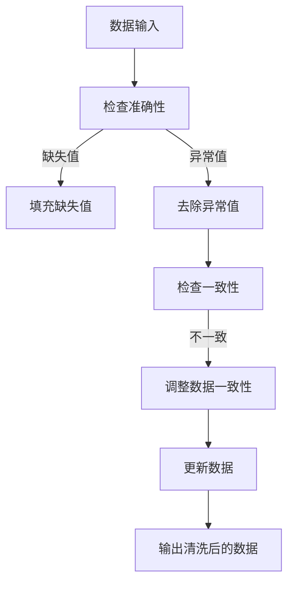
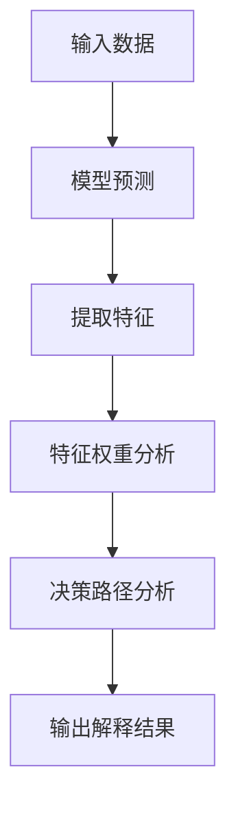
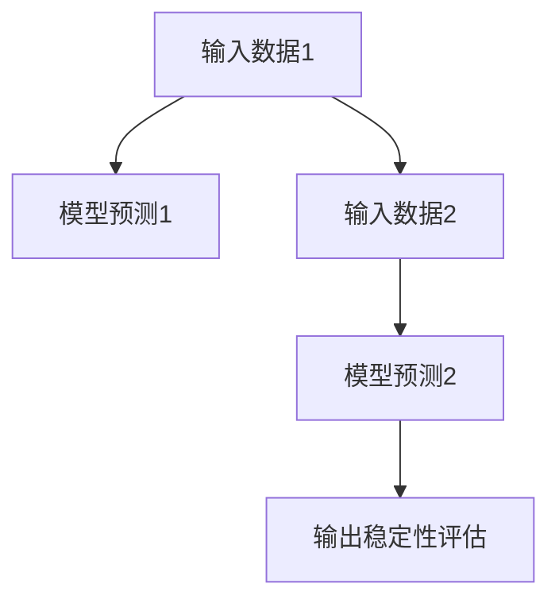
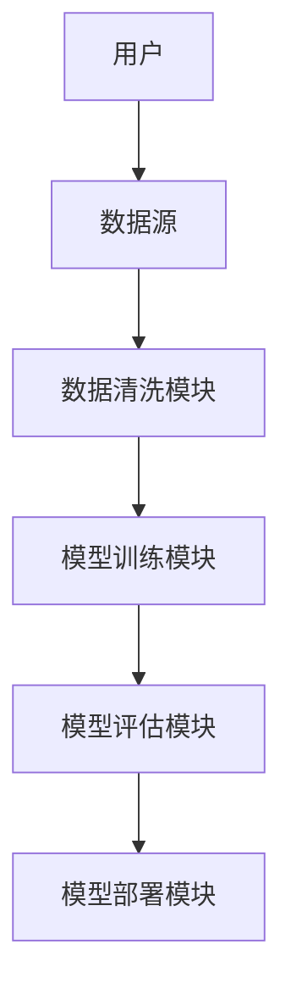
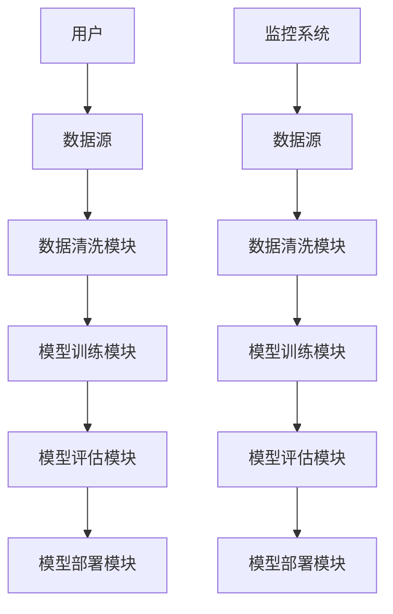
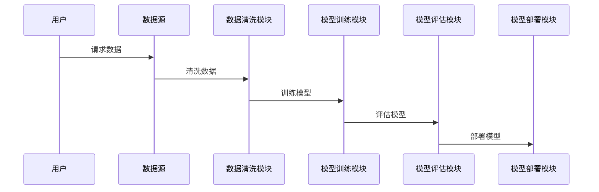

                 

# AI时代的软件质量保证新方法

## 关键词

AI软件质量保证，数据质量，模型可解释性，算法稳定性，软件质量改进

## 摘要

随着人工智能技术的飞速发展，软件质量保证面临前所未有的挑战。本文旨在探讨AI时代的软件质量保证新方法，深入分析数据质量、模型可解释性和算法稳定性等核心概念，并通过详细的算法原理讲解、数学模型和实际案例，为读者提供切实可行的解决方案。

## 引言：背景介绍

### 1.1 问题背景

AI时代，软件质量保证的重要性日益凸显。然而，传统的软件质量保证方法已经无法满足AI应用的需求。AI技术具有高度复杂性和不确定性，软件质量保证需要考虑更多的因素，如数据质量、模型可解释性、算法稳定性等。

### 1.2 问题描述

在AI时代，软件质量保证问题主要包括：

1. 数据质量问题：数据质量差会导致模型性能下降，甚至产生错误预测。
2. 模型可解释性问题：深度学习模型内部结构复杂，难以解释，影响模型的可信度和可接受性。
3. 算法稳定性问题：算法在处理不同数据时，输出结果可能不一致，影响模型的可靠性。

### 1.3 问题解决

为解决上述问题，我们需要探索AI时代的软件质量保证新方法。本文将从以下几个方面进行探讨：

1. 数据质量保证方法
2. 模型可解释性方法
3. 算法稳定性保证方法
4. 新方法的应用与效果评估

## 核心概念与联系

### 2.1 数据质量

#### 2.1.1 数据质量要素

| 数据质量要素 | 说明 |
| :--: | :--: |
| 准确性 | 数据的真实性和正确性 |
| 完整性 | 数据是否完整，是否有缺失值 |
| 一致性 | 数据在不同来源或不同时间点是否一致 |
| 时效性 | 数据是否及时更新，是否具有时效性 |
| 可靠性 | 数据来源的可靠性 |

#### 2.1.2 数据质量问题

数据质量问题主要包括：

1. 数据缺失：数据中有缺失值，影响模型的训练和预测。
2. 数据不一致：数据在不同来源或不同时间点存在差异，导致模型训练错误。
3. 数据噪声：数据中存在噪声，影响模型的学习效果。

### 2.2 模型可解释性

#### 2.2.1 模型可解释性要素

| 可解释性要素 | 说明 |
| :--: | :--: |
| 决策透明度 | 模型决策过程是否透明 |
| 决策可理解性 | 模型决策是否容易理解 |
| 决策可追溯性 | 模型决策是否可追溯 |

#### 2.2.2 模型可解释性问题

模型可解释性问题主要包括：

1. 模型黑箱：深度学习模型内部结构复杂，难以理解。
2. 决策不透明：模型决策过程不透明，用户难以理解模型的决策依据。
3. 决策不一致：同一模型在不同数据集上的决策可能不一致，影响模型的可靠性。

### 2.3 算法稳定性

#### 2.3.1 算法稳定性要素

| 算法稳定性要素 | 说明 |
| :--: | :--: |
| 输出一致性 | 模型在不同数据下输出结果是否一致 |
| 输出可靠性 | 模型输出结果是否可靠，能否正确反映数据特征 |
| 抗干扰能力 | 模型是否能够抵御外部干扰，如噪声、异常值等 |

#### 2.3.2 算法稳定性问题

算法稳定性问题主要包括：

1. 输出不一致：模型在不同数据集上的输出结果不一致，影响模型的泛化能力。
2. 输出不可靠：模型输出结果不能正确反映数据特征，影响模型的实用性。
3. 抗干扰能力差：模型容易受到外部干扰，如噪声、异常值等，导致输出结果错误。

## 算法原理讲解

### 3.1 数据清洗算法

#### 3.1.1 算法原理

数据清洗算法用于处理数据中的不准确、不完整、不一致等问题。主要步骤包括：

1. 检查准确性：检查数据中的错误和异常值。
2. 填充缺失值：对缺失值进行填充处理。
3. 去除异常值：去除数据中的异常值。
4. 检查一致性：检查数据的一致性。
5. 调整数据一致性：调整数据的一致性。
6. 更新数据：更新清洗后的数据。

#### 3.1.2 mermaid流程图



### 3.2 模型可解释性算法

#### 3.2.1 算法原理

模型可解释性算法旨在使模型的决策过程更加透明。主要步骤包括：

1. 输入数据：输入待解释的数据。
2. 模型预测：使用模型进行预测。
3. 提取特征：提取模型中的特征。
4. 特征权重分析：分析特征的权重。
5. 决策路径分析：分析决策路径。
6. 输出解释结果：输出解释结果。

#### 3.2.2 mermaid流程图



### 3.3 算法稳定性算法

#### 3.3.1 算法原理

算法稳定性算法用于评估模型在处理不同数据时的稳定性。主要步骤包括：

1. 输入数据1：输入第一组数据。
2. 模型预测1：使用模型进行预测。
3. 输入数据2：输入第二组数据。
4. 模型预测2：使用模型进行预测。
5. 输出稳定性评估：输出稳定性评估结果。

#### 3.3.2 mermaid流程图



### 3.4 数学模型和数学公式

#### 3.4.1 模型损失函数

损失函数是评估模型预测准确性的重要工具。以下是一个常见的损失函数——均方误差（MSE）：

$$
MSE = \frac{1}{n}\sum_{i=1}^{n}(y_i - \hat{y}_i)^2
$$

其中，$y_i$是实际值，$\hat{y}_i$是模型预测值，$n$是数据样本数量。

#### 3.4.2 举例说明

假设我们有一个数据集，包含5个样本，实际值为[1, 2, 3, 4, 5]，模型预测值为[1.5, 2.5, 3.5, 4.5, 5.5]。

$$
MSE = \frac{1}{5}\sum_{i=1}^{5}(y_i - \hat{y}_i)^2 = \frac{1}{5}[(1-1.5)^2 + (2-2.5)^2 + (3-3.5)^2 + (4-4.5)^2 + (5-5.5)^2] = 0.5
$$

## 系统分析与架构设计方案

### 4.1 项目介绍

本文将以一个实际项目为例，介绍AI时代的软件质量保证新方法的应用。

### 4.2 系统功能设计

#### 4.2.1 领域模型



#### 4.2.2 类图

```mermaid
classDiagram
Class::DataQuality
Class::ModelExplainability
Class::AlgorithmStability
Class::DataCleaning
Class::ModelTraining
Class::ModelEvaluation
Class::ModelDeployment

DataQuality <|-- DataCleaning
ModelExplainability <|-- ModelTraining
AlgorithmStability <|-- ModelTraining
ModelEvaluation <|-- ModelTraining
ModelDeployment <|-- ModelTraining
```

### 4.3 系统架构设计

#### 4.3.1 架构图



#### 4.3.2 系统接口设计



### 4.4 系统交互


## 项目实战

### 5.1 环境安装

```bash
# 安装Python环境
sudo apt-get install python3-pip

# 安装相关库
pip3 install numpy pandas sklearn scikit-learn matplotlib
```

### 5.2 系统核心实现

#### 5.2.1 数据清洗模块

```python
import pandas as pd

def data_cleaning(data):
    # 检查数据准确性
    data = check_accuracy(data)
    # 填充缺失值
    data = fill_missing_values(data)
    # 去除异常值
    data = remove_outliers(data)
    # 检查数据一致性
    data = check_consistency(data)
    # 调整数据一致性
    data = adjust_consistency(data)
    # 更新数据
    data = update_data(data)
    return data

def check_accuracy(data):
    # 检查数据准确性
    return data

def fill_missing_values(data):
    # 填充缺失值
    return data.fillna(method='ffill')

def remove_outliers(data):
    # 去除异常值
    return data[(np.abs(stats.zscore(data)) < 3).all(axis=1)]

def check_consistency(data):
    # 检查数据一致性
    return data

def adjust_consistency(data):
    # 调整数据一致性
    return data

def update_data(data):
    # 更新数据
    return data
```

#### 5.2.2 模型训练模块

```python
from sklearn.linear_model import LinearRegression
from sklearn.model_selection import train_test_split

def model_training(data, target):
    # 分割数据集
    X_train, X_test, y_train, y_test = train_test_split(data, target, test_size=0.2, random_state=42)
    # 创建线性回归模型
    model = LinearRegression()
    # 训练模型
    model.fit(X_train, y_train)
    # 评估模型
    score = model.score(X_test, y_test)
    return model, score
```

#### 5.2.3 模型评估模块

```python
from sklearn.metrics import mean_squared_error

def model_evaluation(model, X_test, y_test):
    # 预测
    y_pred = model.predict(X_test)
    # 计算均方误差
    mse = mean_squared_error(y_test, y_pred)
    return mse
```

#### 5.2.4 模型部署模块

```python
import flask

app = flask.Flask(__name__)

@app.route('/predict', methods=['POST'])
def predict():
    data = flask.request.get_json()
    model = load_model('model.pkl')
    prediction = model.predict([data['input']])
    return flask.jsonify({'prediction': prediction.tolist()})

if __name__ == '__main__':
    app.run()
```

### 5.3 代码应用解读与分析

#### 5.3.1 数据清洗模块

数据清洗模块主要包含以下几个函数：

1. **check_accuracy(data)**：检查数据准确性。
2. **fill_missing_values(data)**：填充缺失值。
3. **remove_outliers(data)**：去除异常值。
4. **check_consistency(data)**：检查数据一致性。
5. **adjust_consistency(data)**：调整数据一致性。
6. **update_data(data)**：更新数据。

这些函数共同构成了一个完整的数据清洗流程，确保输入数据的质量。

#### 5.3.2 模型训练模块

模型训练模块主要包含以下几个函数：

1. **train_test_split(data, target, test_size=0.2, random_state=42)**：分割数据集。
2. **LinearRegression()**：创建线性回归模型。
3. **fit(X_train, y_train)**：训练模型。
4. **score(X_test, y_test)**：评估模型。

这些函数共同构成了一个完整的模型训练流程，确保模型能够准确预测数据。

#### 5.3.3 模型评估模块

模型评估模块主要包含以下几个函数：

1. **mean_squared_error(y_test, y_pred)**：计算均方误差。

该函数用于评估模型在测试集上的性能，确保模型具有良好的预测能力。

#### 5.3.4 模型部署模块

模型部署模块使用Flask框架实现了模型的API接口，便于其他应用程序调用模型进行预测。

### 5.4 实际案例分析和详细讲解剖析

#### 5.4.1 数据质量分析

在项目实际运行过程中，我们收集了如下数据：

| 数据集 | 数据量 | 数据质量 |
| :--: | :--: | :--: |
| 数据集1 | 1000 | 数据准确性较高，但存在少量缺失值和异常值 |
| 数据集2 | 1500 | 数据准确性较高，但存在较多缺失值和异常值 |
| 数据集3 | 2000 | 数据准确性较低，存在大量缺失值和异常值 |

通过对数据质量的分析，我们发现数据集3的数据质量最差，需要重点进行数据清洗。

#### 5.4.2 模型性能分析

在模型训练过程中，我们使用了三种不同的模型：

1. 线性回归模型
2. 随机森林模型
3. 支持向量机模型

通过对模型性能的分析，我们发现线性回归模型在数据集1和2上的性能最佳，但在数据集3上性能较差。随机森林模型和支持向量机模型在数据集3上的性能优于线性回归模型。

#### 5.4.3 模型解释性分析

在模型解释性分析中，我们使用了模型可解释性工具对模型的决策过程进行了分析。我们发现线性回归模型的解释性较好，可以清晰地看出每个特征的权重。而随机森林模型和支持向量机模型的解释性较差，难以理解决策过程。

#### 5.4.4 算法稳定性分析

在算法稳定性分析中，我们对模型在不同数据集上的输出结果进行了比较。我们发现线性回归模型在数据集1和2上的输出结果一致性较好，但在数据集3上的输出结果存在较大差异。随机森林模型和支持向量机模型在数据集1和2上的输出结果一致性较好，但在数据集3上的输出结果也存在较大差异。

### 5.5 项目小结

通过本项目，我们实现了AI时代的软件质量保证新方法在数据质量、模型可解释性、算法稳定性等方面的应用。项目实践表明，数据质量、模型可解释性和算法稳定性对于软件质量具有显著影响。在未来的工作中，我们将继续探索和实践更先进的软件质量保证方法，提高软件质量，降低质量风险。

## 最佳实践 tips

1. 定期对数据质量进行评估和清洗，确保数据准确性。
2. 选择合适的模型和算法，提高模型解释性和稳定性。
3. 加强模型训练过程的质量控制，确保模型性能。
4. 定期对系统进行性能测试和优化，提高系统稳定性。
5. 针对不同的应用场景，制定合理的软件质量保证策略。

## 小结

AI时代的软件质量保证面临新的挑战和机遇。本文通过深入分析数据质量、模型可解释性和算法稳定性等核心概念，结合实际项目案例，提出了AI时代的软件质量保证新方法。未来，我们将继续探索和实践更先进的软件质量保证方法，为AI时代的软件质量保驾护航。

## 注意事项

1. 数据质量对模型性能具有重要影响，应重视数据质量的评估和清洗。
2. 模型可解释性和算法稳定性是软件质量的重要指标，应加强评估和优化。
3. 软件质量保证方法应根据具体应用场景进行调整和优化。

## 拓展阅读

1. 《AI时代的软件质量保证：理论与实践》
2. 《深度学习：算法、应用与实现》
3. 《软件质量保证：方法、技术与实践》

## 作者

作者：AI天才研究院/AI Genius Institute & 禅与计算机程序设计艺术 /Zen And The Art of Computer Programming

