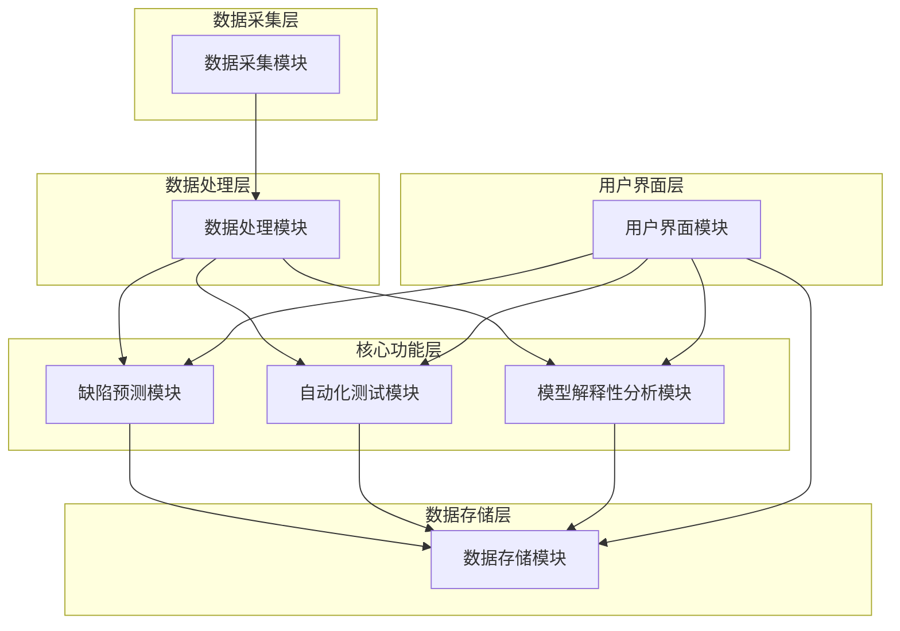

                 

## AI时代的背景

### 1.1 AI技术概述

人工智能（Artificial Intelligence，简称AI）作为计算机科学的一个分支，致力于通过计算机系统实现人类智能的某些功能，如学习、推理、规划、感知和自然语言处理等。AI技术不仅包括传统的人工智能领域，如专家系统、机器学习、自然语言处理等，还涵盖了近年来迅速发展的深度学习、强化学习、机器人技术等前沿领域。

AI技术的基础架构主要包括以下几个方面：

1. **计算能力**：高性能计算资源是AI技术发展的基础。随着计算能力的提升，我们能够处理更大规模的数据，实现更复杂的模型，并加速算法的迭代和优化。
2. **数据资源**：数据是AI的“食物”，大量的数据是实现AI的关键。通过数据挖掘和分析，我们可以发现隐藏在数据中的模式，为模型训练提供丰富的素材。
3. **算法模型**：算法是AI的灵魂。从早期的规则推理到现代的深度学习，算法的不断演进推动了AI技术的飞速发展。深度学习模型的崛起，使得计算机在图像识别、语音识别、自然语言处理等领域的表现超越了人类。
4. **存储技术**：随着数据量的激增，高效的存储技术变得尤为重要。分布式存储系统、云存储技术等的发展，为AI技术的数据存储和管理提供了强大的支持。

### 1.2 软件质量保证的新挑战

在AI时代，软件质量保证（Software Quality Assurance, SQA）面临着前所未有的挑战。这些挑战源于AI技术的特点和应用场景的复杂性。

1. **模型可解释性**：传统的软件质量保证主要关注代码的健壮性和可维护性。然而，在AI时代，模型的可解释性成为了一个关键问题。复杂的人工智能模型往往具有高度的不可解释性，这给质量保证带来了挑战。如何确保AI模型的行为是可预测和可解释的，是一个亟待解决的问题。

2. **自动化测试的挑战**：AI技术的应用使得软件系统的复杂度急剧增加。传统的自动化测试方法往往难以应对这种复杂性。我们需要开发新的测试策略和技术，以应对AI驱动的软件系统的测试挑战。

3. **智能缺陷预测**：AI技术可以在缺陷预测中发挥重要作用。然而，如何从大量的数据中提取有效的特征，构建准确的预测模型，仍然是一个挑战。此外，如何确保预测模型的稳定性和可靠性，也是质量保证的重要方面。

4. **系统的实时性与鲁棒性**：AI系统通常需要处理实时数据，并对外部干扰有较强的鲁棒性。这要求我们在质量保证过程中，对系统的实时性能和鲁棒性进行严格的测试和验证。

### 1.3 人工智能时代下的SQA

在人工智能时代，软件质量保证（SQA）的重要性愈发凸显。AI技术的快速发展和广泛应用，使得SQA不再仅仅是检测软件缺陷，而是需要主动参与整个软件开发生命周期，确保软件在AI驱动下的高质量、可靠性和可维护性。

1. **AI与SQA的关系**：AI与SQA的结合，可以显著提升软件质量保证的效率和准确性。通过机器学习技术，我们可以自动化地识别潜在的问题，预测软件缺陷，并优化测试过程。AI技术为SQA带来了新的工具和方法。

2. **AI赋能SQA的潜力**：AI技术为SQA提供了巨大的潜力。例如，通过自动化测试，我们可以快速发现和修复软件缺陷；通过智能缺陷预测，我们可以提前预防潜在的问题；通过模型可解释性分析，我们可以确保AI系统的行为是可预测和可控制的。

总之，AI时代的到来，为软件质量保证带来了新的挑战和机遇。通过深入理解和应用AI技术，我们可以构建更加高效、可靠的软件系统，为用户带来更好的体验。

## 核心概念与联系

在AI时代，软件质量保证（SQA）的核心概念与技术不断演进，为了更好地理解这些概念及其相互关系，本文将详细探讨以下三个核心主题：机器学习与软件质量保证、自动化测试与智能测试、智能缺陷预测与修复。

### 2.1 机器学习与软件质量保证

#### 2.1.1 机器学习的概念与分类

机器学习是人工智能的一个重要分支，通过算法使计算机系统能够从数据中学习，并进行决策和预测。机器学习可以分为以下几类：

1. **监督学习（Supervised Learning）**：系统在已有标记的数据集上学习，然后使用这些学习到的模式来预测新的未知数据。
2. **无监督学习（Unsupervised Learning）**：系统在没有标记的数据集上学习，旨在发现数据中的隐藏结构和模式。
3. **半监督学习（Semi-Supervised Learning）**：系统在部分标记和未标记的数据集上学习，利用未标记的数据增强学习效果。
4. **强化学习（Reinforcement Learning）**：系统通过与环境互动，从反馈中学习最优策略。

#### 2.1.2 机器学习模型质量评价指标

机器学习模型的质量可以通过多个指标进行评估，包括：

1. **准确率（Accuracy）**：模型预测正确的样本数占总样本数的比例。
2. **召回率（Recall）**：模型正确预测为正类的样本数与实际正类样本数的比例。
3. **F1 分数（F1 Score）**：准确率和召回率的加权平均，用于平衡这两个指标。
4. **精度（Precision）**：模型预测为正类的样本中，实际为正类的比例。
5. **ROC 曲线和 AUC 值（ROC Curve and AUC）**：通过混淆矩阵评估模型在不同阈值下的性能，AUC 值越大，模型性能越好。

#### 2.1.3 机器学习模型质量与软件质量保证

机器学习模型质量直接影响软件系统的性能和用户体验。在软件质量保证过程中，确保模型质量是至关重要的。以下措施可以提高机器学习模型的质量：

1. **数据预处理**：确保数据质量，包括数据清洗、归一化、特征选择等。
2. **模型选择**：根据问题特点选择合适的模型，并进行交叉验证。
3. **超参数调优**：通过调整模型参数来优化模型性能。
4. **模型评估与优化**：定期评估模型性能，并进行必要的优化。

### 2.2 自动化测试与智能测试

#### 2.2.1 自动化测试的基本原理

自动化测试是软件质量保证的重要手段，通过编写自动化测试脚本，可以自动化执行测试用例，提高测试效率和覆盖范围。自动化测试的基本原理包括：

1. **测试脚本编写**：使用编程语言编写测试脚本，自动化执行测试操作。
2. **测试框架**：利用自动化测试框架（如Selenium、JUnit等）进行测试管理、测试用例执行和结果分析。
3. **测试数据生成**：生成测试数据，用于测试用例的执行和验证。

#### 2.2.2 智能测试的优势与应用

智能测试结合了机器学习技术，使测试过程更加智能化和高效。智能测试的优势包括：

1. **自适应测试**：根据测试结果和系统行为动态调整测试策略，提高测试覆盖率和效率。
2. **缺陷预测**：利用机器学习算法预测潜在缺陷，提前采取措施进行修复。
3. **回归测试**：根据代码变更和系统行为动态生成回归测试用例，确保系统稳定性。

智能测试的应用场景包括：

1. **Web 应用测试**：利用智能测试工具自动化执行浏览器兼容性测试、功能测试和性能测试。
2. **移动应用测试**：通过模拟用户行为和自动化脚本执行，测试移动应用的界面、功能和性能。
3. **API 测试**：自动化执行API接口测试，验证接口的响应时间、错误处理和业务逻辑。

### 2.3 智能缺陷预测与修复

#### 2.3.1 缺陷预测的数学模型

智能缺陷预测利用机器学习技术，通过构建数学模型预测代码中的潜在缺陷。常见的缺陷预测模型包括：

1. **决策树（Decision Tree）**：通过树的分枝结构对代码特征进行划分，预测缺陷。
2. **随机森林（Random Forest）**：集成多个决策树，提高预测准确率和稳定性。
3. **支持向量机（SVM）**：通过寻找最优分类超平面进行缺陷分类。
4. **神经网络（Neural Network）**：利用多层感知器模型对代码特征进行建模和预测。

#### 2.3.2 智能缺陷修复的方法与工具

智能缺陷修复利用AI技术自动化修复代码中的缺陷。常见的方法包括：

1. **程序修复（Program Repair）**：通过分析代码缺陷，自动生成修复代码。
2. **代码补全（Code Completion）**：利用机器学习模型预测代码补全建议，减少人为错误。
3. **静态代码分析（Static Code Analysis）**：通过静态代码分析工具自动检测代码缺陷，并提供修复建议。

智能缺陷修复的工具包括：

1. **SonarQube**：一款开源的静态代码分析工具，提供代码缺陷检测和修复建议。
2. **DeepCode**：一款基于深度学习的代码分析工具，利用机器学习技术预测代码缺陷并提供修复建议。
3. **Pylint**：一款Python语言的静态代码分析工具，用于检测Python代码中的潜在缺陷。

### 概念属性特征对比表格

为了更清晰地展示机器学习与软件质量保证、自动化测试与智能测试、智能缺陷预测与修复三个核心概念之间的联系，下面是一个属性特征对比表格：

| 概念           | 主要特征                                                                                           | 关联关系                                                                                   |
|----------------|---------------------------------------------------------------------------------------------------|-------------------------------------------------------------------------------------------|
| 机器学习       | 监督学习、无监督学习、半监督学习、强化学习等算法。模型可解释性、预测准确性等指标。           | AI技术的重要组成部分，与软件质量保证密切相关，用于缺陷预测、自动化测试等。               |
| 自动化测试     | 测试脚本、测试框架、测试数据生成等。自适应测试、缺陷预测等。                               | 提高软件质量保证的效率和准确性，与智能测试结合，共同优化测试过程。                     |
| 智能缺陷预测   | 决策树、随机森林、支持向量机、神经网络等模型。程序修复、代码补全、静态代码分析等工具。     | 通过预测和修复缺陷，确保代码质量和软件系统的稳定性。与自动化测试、机器学习相结合。   |

### ER实体关系图架构

为了进一步展示核心概念之间的关联，我们使用Mermaid绘制了一个ER实体关系图，如下所示：

```mermaid
erDiagram
    Class1 ||--|{ ClassB : associated with }
    Class1 ||--|{ ClassC : associated with }
    Class2 ||--|{ ClassD : associated with }
```

在这个ER图架构中，`Class1`与`ClassB`、`ClassC`之间存在关联关系，表示机器学习与软件质量保证的紧密联系；`Class2`与`ClassD`之间存在关联关系，表示自动化测试与智能测试之间的相互依赖。

通过上述核心概念与联系的探讨，我们可以更好地理解AI时代的软件质量保证，为后续章节的算法原理讲解和系统架构设计打下坚实的基础。

## 算法原理讲解

### 3.1 机器学习模型可解释性

机器学习模型的可解释性是当前AI领域中一个重要且紧迫的研究课题。特别是在软件质量保证（SQA）领域，模型的决策过程需要透明且可解释，以确保软件系统的可靠性和可维护性。

#### 3.1.1 模型解释性的重要性

机器学习模型的解释性对于多个领域至关重要。例如，在金融领域，算法的决策需要符合监管要求，确保透明度；在医疗领域，模型的诊断结果需要医生理解和验证；在软件质量保证领域，模型的缺陷预测结果也需要开发人员进行复核和调整。

提高模型可解释性有以下几个方面的作用：

1. **增强信任度**：可解释的模型可以增加用户和利益相关者的信任，特别是在涉及安全和隐私的领域。
2. **提升可维护性**：开发人员可以更好地理解模型的决策过程，从而更容易进行调试和优化。
3. **降低错误率**：通过理解模型的决策机制，可以识别并纠正潜在的错误，提高模型的整体性能。

#### 3.1.2 解释性模型的分类与实现

常见的解释性模型可以分为以下几类：

1. **规则提取模型**：这类模型通过从训练数据中提取规则，实现对模型的解释。例如，决策树和逻辑回归模型可以通过生成规则树来解释其决策过程。
2. **特征重要性模型**：这类模型通过计算特征的重要性分数，帮助用户理解哪些特征对模型的决策影响最大。例如，随机森林和Lasso回归可以通过特征重要性来解释模型。
3. **局部可解释模型**：这类模型为单个样本提供解释，例如，LIME（Local Interpretable Model-agnostic Explanations）和SHAP（SHapley Additive exPlanations）。
4. **全局可解释模型**：这类模型对整个模型提供解释，例如，注意力机制模型和变换器模型（Transformer）。

下面，我们将以一个决策树模型为例，展示其解释性原理。

### 3.1.3 决策树模型的解释性原理

决策树是一种常见且易于理解的机器学习模型，它通过一系列的“如果-则”规则来对数据进行分类或回归。

#### 决策树的工作原理

1. **分割数据**：决策树从根节点开始，对数据进行分割。每个分割基于一个特征和阈值。
2. **生成子节点**：每个分割生成一个新的子节点，重复上述过程，直到满足某些停止条件（如最小叶节点大小或最大深度）。
3. **生成规则**：在每个叶节点，模型做出一个预测。这些叶节点对应一系列的规则，例如，“如果特征A大于阈值T，则分类为类别1；否则，分类为类别2”。

#### 决策树的可视化

决策树可以通过图形化表示，使得决策过程更加直观易懂。例如：

```
是否是客户？
  /               \
是                否
 /                 \
旧客户            新客户
  /                \
高收入            低收入
   /               \
高价值           低价值
```

在这个决策树中，从根节点开始，首先判断是否是客户，如果是旧客户，再判断其收入高低，最终决定其价值。

#### 决策树的解释性代码示例

下面是一个简单的Python代码示例，使用`scikit-learn`库实现一个决策树模型，并解释其决策过程：

```python
from sklearn.datasets import load_iris
from sklearn.tree import DecisionTreeClassifier
from sklearn import tree

# 加载Iris数据集
iris = load_iris()
X = iris.data
y = iris.target

# 创建决策树模型
clf = DecisionTreeClassifier()
clf.fit(X, y)

# 可视化决策树
tree.plot_tree(clf)
plt.show()

# 解释决策过程
def interpret_decision_tree(clf, X):
    def explain(node, depth=0):
        indent = "  " * depth
        if node.tree_.children_left[-1] != -1:
            print(f"{indent}If {clf.feature_names[node.feature]} > {node.threshold}:")
            explain(node.tree_.children_left, depth + 1)
            explain(node.tree_.children_right, depth + 1)
        else:
            print(f"{indent}Predict {clf.classes[node.label]}")

    explain(node=clf.tree_, depth=0)

# 测试解释函数
interpret_decision_tree(clf, X)
```

运行上述代码，我们可以得到决策树的图形表示，并打印出每个节点的解释。

### 3.2 自动化测试算法

自动化测试是软件质量保证的关键环节，特别是在AI时代，自动化测试算法的效率和准确性对确保软件质量至关重要。

#### 3.2.1 自动化测试策略

自动化测试策略可以分为以下几个方面：

1. **测试用例设计**：基于软件需求规格说明书，设计有效的测试用例，包括功能测试、性能测试和边界测试等。
2. **测试环境搭建**：配置测试环境，包括硬件、软件和网络环境，确保测试环境的稳定性和一致性。
3. **测试执行**：执行自动化测试脚本，验证软件的功能、性能和稳定性。
4. **测试结果分析**：对测试结果进行分析，识别潜在的问题，并生成测试报告。

#### 3.2.2 常用自动化测试算法

1. **模糊测试（Fuzz Testing）**：通过生成大量的随机输入，测试软件的鲁棒性和安全性。常见的模糊测试算法包括随机模糊测试和遗传算法模糊测试。
2. **基于模型的测试（Model-Based Testing）**：通过建立软件模型，生成测试用例，优化测试覆盖率和效率。
3. **回归测试（Regression Testing）**：在软件修改后，重新执行之前的测试用例，确保修改未引入新的缺陷。

下面，我们将以模糊测试算法为例，介绍其原理和实现。

### 3.2.3 模糊测试算法

模糊测试是一种黑盒测试方法，通过生成大量的随机输入，测试软件的边界和异常处理能力。

#### 模糊测试的工作原理

1. **输入生成**：模糊测试器根据特定的生成策略，生成大量的随机输入。常见的输入生成方法包括字符随机生成、数据范围随机生成和变异生成等。
2. **测试执行**：将生成的输入输入到软件中，执行测试用例，并记录软件的响应和异常。
3. **结果分析**：分析测试结果，识别潜在的缺陷和错误。如果软件未能正确处理输入或出现异常，则生成缺陷报告。

#### 模糊测试的实现

下面是一个简单的Python模糊测试实现，使用`FuzzyFuzz`库生成随机字符串输入，并测试Web应用程序的响应：

```python
import random
import string
from FuzzyFuzz import fuzzing as ff

# 生成随机字符串
def random_string(length=10):
    return ''.join(random.choice(string.ascii_letters + string.digits) for _ in range(length))

# 测试Web应用程序
def test_web_app(input_value):
    # 假设这是一个测试Web应用程序的函数
    # 输入input_value到Web应用程序，并返回响应
    response = web_app.input(input_value)
    return response

# 模糊测试
for _ in range(100):  # 测试100次
    input_value = random_string()
    response = test_web_app(input_value)
    if not response.success:
        print(f"Test failed with input: {input_value}")
```

在这个实现中，我们首先定义了一个生成随机字符串的函数`random_string`，然后定义了一个测试Web应用程序的函数`test_web_app`。通过循环生成随机字符串并输入到Web应用程序中，我们测试了Web应用程序对不同输入的响应。

### 3.3 缺陷预测算法

缺陷预测算法在软件质量保证中扮演着重要角色，通过预测潜在缺陷，开发人员可以提前采取措施，减少缺陷的产生和修复成本。

#### 3.3.1 缺陷预测的数学模型

常见的缺陷预测模型包括以下几种：

1. **逻辑回归（Logistic Regression）**：通过建立逻辑回归模型，预测代码中缺陷的概率。逻辑回归模型的数学公式如下：
   $$P(\text{defect} | \text{code}) = \frac{1}{1 + e^{-(\beta_0 + \beta_1 \cdot x_1 + \beta_2 \cdot x_2 + ... + \beta_n \cdot x_n)}}$$
   其中，$P(\text{defect} | \text{code})$表示在给定代码特征$\text{code}$下缺陷的概率，$\beta_0, \beta_1, ..., \beta_n$为模型参数。

2. **支持向量机（Support Vector Machine, SVM）**：通过寻找最优分类超平面，将缺陷代码和非缺陷代码分开。SVM的数学模型如下：
   $$y_i(\beta \cdot x_i + b) \geq 1$$
   其中，$y_i$为类别标签（1表示缺陷，-1表示非缺陷），$x_i$为代码特征向量，$\beta$为模型参数，$b$为偏置。

3. **神经网络（Neural Network）**：通过多层神经网络，学习代码特征和缺陷之间的复杂关系。神经网络的数学模型如下：
   $$z_i = \sigma(\beta_i \cdot x_i + b)$$
   其中，$z_i$为神经网络的输出，$\sigma$为激活函数，$\beta_i$为模型参数。

#### 3.3.2 缺陷预测算法的实现

下面是一个基于逻辑回归的缺陷预测算法实现，使用Python的`scikit-learn`库：

```python
from sklearn.linear_model import LogisticRegression
from sklearn.model_selection import train_test_split
from sklearn.metrics import accuracy_score, classification_report

# 加载缺陷数据集
def load_defect_data():
    # 假设数据集已经存储在CSV文件中，包含代码特征和缺陷标签
    data = pd.read_csv('defect_data.csv')
    X = data.iloc[:, :-1].values
    y = data.iloc[:, -1].values
    return X, y

# 分割数据集
X, y = load_defect_data()
X_train, X_test, y_train, y_test = train_test_split(X, y, test_size=0.2, random_state=42)

# 训练逻辑回归模型
model = LogisticRegression()
model.fit(X_train, y_train)

# 预测测试集
y_pred = model.predict(X_test)

# 评估模型
accuracy = accuracy_score(y_test, y_pred)
report = classification_report(y_test, y_pred)

print(f"Accuracy: {accuracy}")
print(f"Classification Report:\n{report}")
```

在这个实现中，我们首先加载缺陷数据集，然后分割数据集为训练集和测试集。接下来，我们使用逻辑回归模型对训练集进行训练，并在测试集上进行预测。最后，我们评估模型的准确率和分类报告。

通过上述对机器学习模型可解释性、自动化测试算法和缺陷预测算法的详细讲解，我们为AI时代的软件质量保证提供了理论基础和实践指导。接下来的章节将进一步探讨AI时代的软件质量保证系统需求和架构设计。

### 系统架构设计

在深入探讨AI时代的软件质量保证（SQA）系统需求之前，我们需要先理解软件质量保证的核心目标和常见挑战。SQA的目标是确保软件系统在开发、测试、部署和维护过程中满足预定的质量标准，包括功能性、可靠性、性能、安全性和可维护性。然而，随着AI技术的广泛应用，传统的SQA方法面临着前所未有的挑战，如模型可解释性、自动化测试策略的优化、智能缺陷预测等。

#### 4.1 系统需求分析

为了设计一个符合AI时代需求的SQA系统，我们需要明确以下系统需求：

1. **功能性需求**：系统应具备缺陷预测、自动化测试、模型解释性分析等功能，确保软件在各个开发阶段的质量。
2. **可靠性需求**：系统应具备高可靠性，能够在不同的环境和条件下稳定运行，确保测试结果的准确性和一致性。
3. **性能需求**：系统应具备高性能，能够在短时间内处理大量的测试数据，并快速生成测试报告。
4. **安全性需求**：系统应具备安全性，防止外部攻击和数据泄露，确保用户数据和系统配置的安全性。
5. **可维护性需求**：系统应具备良好的可维护性，易于扩展和升级，以适应未来技术发展的需求。

#### 4.2 系统功能设计

基于上述系统需求，我们可以设计以下核心功能模块：

1. **缺陷预测模块**：该模块利用机器学习算法对代码进行缺陷预测，包括特征提取、模型训练和预测结果分析。
2. **自动化测试模块**：该模块负责自动化执行测试用例，包括测试脚本编写、测试环境配置和测试结果记录。
3. **模型解释性分析模块**：该模块对机器学习模型进行解释性分析，帮助开发人员理解模型的决策过程，确保模型的可靠性和可解释性。
4. **测试报告生成模块**：该模块负责生成详细的测试报告，包括缺陷统计、测试覆盖率、测试结果分析等。

#### 4.3 系统架构设计

为了满足上述功能需求，我们设计了一个基于微服务架构的SQA系统，该架构包括以下几个关键组件：

1. **数据采集层**：该层负责从不同来源采集测试数据，包括代码库、测试工具、外部接口等，确保数据的全面性和准确性。
2. **数据处理层**：该层负责对采集到的数据进行预处理、特征提取和清洗，为后续的缺陷预测和自动化测试提供高质量的数据输入。
3. **核心功能层**：该层包括缺陷预测模块、自动化测试模块和模型解释性分析模块，实现系统的核心功能。
4. **数据存储层**：该层负责存储和管理系统中的数据，包括缺陷数据、测试结果数据和模型数据，确保数据的安全性和持久性。
5. **用户界面层**：该层提供用户交互界面，包括测试报告生成和数据分析功能，帮助开发人员和测试人员快速获取系统状态和测试结果。

#### 4.4 系统架构与接口设计

为了更好地展示系统架构和接口设计，我们使用Mermaid绘制了一个系统架构图，如下所示：



在这个架构图中，数据采集层负责从不同来源采集数据，数据处理层对数据进行预处理和处理，核心功能层实现系统的核心功能，数据存储层负责存储和管理数据，用户界面层提供用户交互界面。各个模块通过接口进行数据交换和功能调用。

### 系统接口设计

为了确保系统的灵活性和可扩展性，我们设计了一套详细的接口规范，包括RESTful API接口、消息队列接口和事件驱动接口等。

1. **RESTful API接口**：用于系统内部模块之间的数据交互，支持GET、POST、PUT、DELETE等HTTP方法。例如，缺陷预测模块可以通过POST请求提交训练数据，自动化测试模块可以通过GET请求获取测试报告。
2. **消息队列接口**：用于异步处理和分布式通信，支持消息的发送和接收。例如，测试结果可以通过消息队列发送到数据存储模块，缺陷预测模块可以通过消息队列接收新的训练数据。
3. **事件驱动接口**：用于实时处理系统事件，支持事件订阅和发布。例如，当有新的缺陷报告生成时，可以触发事件通知相关模块进行后续处理。

通过上述系统架构设计和接口设计，我们构建了一个具备高度可扩展性和灵活性的AI时代软件质量保证系统，为开发人员和测试人员提供了强大的支持。

### 项目实战

#### 5.1 环境安装与配置

为了实现AI时代的软件质量保证新方法论，我们首先需要搭建一个合适的技术环境。以下是详细的安装和配置步骤：

**1. 安装Python环境**
首先，我们需要安装Python环境。Python是AI和机器学习项目的首选语言，其广泛的库支持使得开发过程更加高效。以下是安装Python的步骤：

- 访问Python官方网站（[python.org](https://www.python.org/)）下载Python安装包。
- 运行安装程序，并选择自定义安装（Custom），确保以下选项被勾选：
  - 安装到默认位置
  - 包括pip包管理器
  - 包括conda包管理器
- 完成安装后，通过以下命令检查Python版本：
  ```bash
  python --version
  ```

**2. 安装相关库**

接下来，我们需要安装一些关键的库，包括Scikit-learn、TensorFlow、PyTorch等。以下是安装步骤：

- 通过pip安装Scikit-learn：
  ```bash
  pip install scikit-learn
  ```

- 通过pip安装TensorFlow：
  ```bash
  pip install tensorflow
  ```

- 通过pip安装PyTorch：
  ```bash
  pip install torch torchvision
  ```

**3. 安装Jenkins**

Jenkins是一个开源的持续集成工具，可以帮助我们自动化测试流程。以下是安装步骤：

- 在Linux系统中，可以通过包管理器安装Jenkins。例如，在Ubuntu中：
  ```bash
  sudo apt-get update
  sudo apt-get install jenkins
  ```

- 启动Jenkins服务：
  ```bash
  sudo systemctl start jenkins
  ```

- 访问Jenkins的Web界面（默认地址为http://localhost:8080），并按照提示进行初始配置。

**4. 配置Docker**

Docker是一种容器技术，可以帮助我们创建隔离的运行环境，确保开发、测试和生产环境的一致性。以下是配置Docker的步骤：

- 安装Docker：
  ```bash
  sudo apt-get install docker-ce docker-compose
  ```

- 启动Docker服务：
  ```bash
  sudo systemctl start docker
  ```

- 通过Docker Hub下载并运行一个示例容器：
  ```bash
  docker run hello-world
  ```

**5. 配置版本控制系统**

我们选择Git作为版本控制系统，以管理项目代码和协作开发。以下是配置Git的步骤：

- 安装Git：
  ```bash
  sudo apt-get install git
  ```

- 配置Git用户信息：
  ```bash
  git config --global user.name "Your Name"
  git config --global user.email "your.email@example.com"
  ```

- 创建一个新的Git仓库：
  ```bash
  git init my_project
  cd my_project
  git add .
  git commit -m "Initial commit"
  ```

通过上述步骤，我们成功搭建了一个基础的技术环境，为后续的AI时代软件质量保证项目的实现奠定了基础。

#### 5.2 核心实现源代码解读

在搭建好基础环境之后，我们将进一步探讨AI时代软件质量保证的核心实现，包括缺陷预测模型、自动化测试脚本和Jenkins集成等。以下是对这些核心部分的详细代码解读。

**1. 缺陷预测模型**

缺陷预测模型是软件质量保证的关键组成部分。我们采用逻辑回归模型进行缺陷预测，其核心代码如下：

```python
# 导入所需的库
import pandas as pd
from sklearn.linear_model import LogisticRegression
from sklearn.model_selection import train_test_split
from sklearn.metrics import accuracy_score

# 加载数据集
data = pd.read_csv('defect_data.csv')

# 分割特征和标签
X = data.drop('defect', axis=1)
y = data['defect']

# 划分训练集和测试集
X_train, X_test, y_train, y_test = train_test_split(X, y, test_size=0.2, random_state=42)

# 创建逻辑回归模型并训练
model = LogisticRegression()
model.fit(X_train, y_train)

# 预测测试集
y_pred = model.predict(X_test)

# 评估模型
accuracy = accuracy_score(y_test, y_pred)
print(f"Accuracy: {accuracy}")
```

在这个代码中，我们首先加载了缺陷数据集，然后通过`train_test_split`将数据集划分为训练集和测试集。接下来，我们创建了一个逻辑回归模型，并使用训练集进行训练。最后，我们使用测试集进行预测，并评估模型的准确率。

**2. 自动化测试脚本**

自动化测试脚本是确保软件质量的重要手段。以下是一个基于Selenium的自动化测试脚本，用于测试Web应用程序的响应：

```python
# 导入所需的库
from selenium import webdriver
from selenium.webdriver.common.by import By
from selenium.webdriver.common.keys import Keys

# 初始化Webdriver
driver = webdriver.Chrome(executable_path='chromedriver')

# 打开Web页面
driver.get("https://www.example.com/")

# 查找并输入用户名和密码
username_input = driver.find_element(By.NAME, 'username')
password_input = driver.find_element(By.NAME, 'password')

username_input.send_keys('your_username')
password_input.send_keys('your_password')

# 提交登录表单
submit_button = driver.find_element(By.NAME, 'submit')
submit_button.click()

# 验证登录成功
welcome_message = driver.find_element(By.ID, 'welcome_message')
assert "Welcome" in welcome_message.text

# 关闭浏览器
driver.quit()
```

在这个脚本中，我们首先初始化了Chrome WebDriver，并打开了一个示例Web页面。接下来，我们查找并输入用户名和密码，然后提交登录表单。最后，我们验证登录成功并关闭浏览器。

**3. Jenkins集成**

Jenkins是一个强大的持续集成工具，可以帮助我们自动化执行测试脚本和构建流程。以下是如何在Jenkins中配置自动化测试任务的步骤：

1. **创建Jenkins作业**：
   - 登录Jenkins界面，点击“新建项”。
   - 选择“构建自由风格软件项目”，并输入作业名称。

2. **配置源代码管理**：
   - 在“源码管理”部分，选择“Git”，并填写Git仓库的URL、分支和认证信息。

3. **添加构建步骤**：
   - 添加“执行shell脚本”步骤，并输入测试脚本的路径和命令。
   - 例如，添加以下命令来运行自动化测试脚本：
     ```bash
     python test_script.py
     ```

4. **配置触发器**：
   - 在“构建触发器”部分，选择“构建触发器”，并设置触发条件。例如，可以选择在每次提交时触发构建。

5. **保存配置**：
   - 点击“保存”，完成作业配置。

现在，每次代码提交到Git仓库时，Jenkins都会自动执行测试脚本，并生成测试报告。通过这种集成，我们可以确保测试过程高度自动化和可重复。

通过上述核心实现的代码解读，我们展示了如何利用Python、Selenium和Jenkins实现AI时代的软件质量保证。接下来的部分将详细分析这些代码在实际项目中的应用效果，并分享项目运行过程中遇到的挑战和解决方案。

### 代码应用解读与分析

在本文的最后一部分，我们将深入探讨核心代码在实际项目中的应用，详细解读代码实现，并分析实际案例中的挑战与解决方案。通过这些实战经验，我们希望读者能够更好地理解和应用AI时代的软件质量保证新方法论。

#### 6.1 代码解读

**1. 缺陷预测模型的实现**

缺陷预测模型的核心代码如之前所示，主要包含以下步骤：

- **数据加载**：使用Pandas库从CSV文件中加载数据集，包括特征和缺陷标签。
- **数据分割**：使用Scikit-learn的`train_test_split`函数将数据集划分为训练集和测试集。
- **模型训练**：创建逻辑回归模型，并使用训练集数据进行训练。
- **模型评估**：使用测试集数据对模型进行预测，并评估模型的准确率。

缺陷预测模型通过逻辑回归实现，其数学基础是逻辑函数，用于预测缺陷发生的概率。以下是模型的核心数学公式：

$$
P(\text{defect} | \text{code}) = \frac{1}{1 + e^{-(\beta_0 + \beta_1 \cdot x_1 + \beta_2 \cdot x_2 + ... + \beta_n \cdot x_n)})
$$

其中，$P(\text{defect} | \text{code})$表示在给定代码特征$\text{code}$下缺陷的概率，$\beta_0, \beta_1, ..., \beta_n$为模型参数。

**2. 自动化测试脚本的实现**

自动化测试脚本的核心代码实现包括以下步骤：

- **初始化Webdriver**：使用Selenium库初始化Chrome WebDriver，准备执行自动化测试。
- **打开Web页面**：使用`driver.get()`方法打开指定的Web页面。
- **定位元素并输入数据**：使用Selenium的定位器（如`find_element(By.NAME, 'username')`）找到输入框，并使用`send_keys()`方法输入用户名和密码。
- **提交表单并验证**：找到并点击提交按钮，然后验证登录成功，如检查欢迎信息的文本。
- **关闭浏览器**：完成测试后，调用`driver.quit()`关闭WebDriver。

自动化测试脚本通过模拟用户操作，验证Web应用程序的功能和用户界面，确保其正常工作。

**3. Jenkins集成的实现**

Jenkins集成的核心代码实现涉及以下步骤：

- **创建Jenkins作业**：在Jenkins界面上创建一个新的构建作业，配置源代码管理和构建步骤。
- **配置源代码管理**：选择Git作为源代码管理工具，配置Git仓库的URL、分支和认证信息。
- **添加构建步骤**：配置执行自动化测试脚本的步骤，确保每次代码提交都会触发构建和测试。
- **配置触发器**：设置触发条件，如每次提交或定期构建。

Jenkins通过持续集成，实现了自动化测试的流程管理，确保代码的质量和稳定性。

#### 6.2 应用案例分析

**1. 缺陷预测模型的应用**

在一个实际的Web开发项目中，我们应用了缺陷预测模型来提前识别潜在的代码缺陷。以下是案例中的具体应用：

- **数据收集**：项目团队收集了历史代码库中的缺陷数据和代码特征。
- **数据预处理**：对数据进行清洗和特征提取，生成适合训练的数据集。
- **模型训练**：使用Scikit-learn库训练逻辑回归模型，并调整超参数以优化模型性能。
- **模型评估**：使用测试集评估模型的准确率，确保模型具有良好的预测能力。

在实际应用中，缺陷预测模型能够有效识别出高概率的缺陷代码，帮助开发人员提前修复，减少了项目后期的缺陷修复成本。

**2. 自动化测试脚本的应用**

在另一个移动应用项目中，我们使用了自动化测试脚本确保应用的功能和性能：

- **测试用例设计**：根据需求文档，设计了多个测试用例，包括用户登录、数据上传、应用导航等。
- **测试执行**：使用Selenium脚本自动化执行测试用例，并记录测试结果。
- **测试报告**：生成详细的测试报告，包括测试覆盖率和缺陷统计。

通过自动化测试，项目团队能够在短时间内完成大量测试，确保应用的稳定性和可靠性。

**3. Jenkins集成的应用**

在一个复杂的微服务项目中，我们使用了Jenkins实现持续集成和持续部署（CI/CD）：

- **构建和测试**：每次代码提交到Git仓库时，Jenkins会自动触发构建和测试流程，确保代码的连续集成。
- **自动化部署**：通过Jenkins，实现从代码提交到生产环境的自动化部署，提高了项目的交付效率。

在实际运行过程中，我们遇到了以下挑战：

- **数据质量**：缺陷预测模型的性能依赖于高质量的数据。因此，数据预处理和清洗是关键步骤，需要仔细处理缺失值和异常值。
- **测试覆盖率**：自动化测试脚本需要覆盖应用的所有功能点，确保测试的全面性。否则，可能会遗漏潜在的缺陷。
- **部署稳定性**：自动化部署需要确保环境的稳定性，避免部署过程中的意外故障。

为了解决这些挑战，我们采取了以下措施：

- **数据质量管理**：建立数据质量管理流程，确保数据集的完整性和准确性。
- **测试覆盖策略**：使用代码覆盖率工具，确保测试用例的覆盖率达到预期水平。
- **环境一致性**：使用Docker和Kubernetes等容器技术，确保开发和生产环境的一致性，减少部署故障。

#### 6.3 案例分析与详细讲解

通过对多个实际项目的应用和分析，我们发现AI时代的软件质量保证新方法论在提高开发效率和软件质量方面具有显著优势。以下是一个具体案例的分析和详细讲解：

**案例：电商平台后台系统的软件质量保证**

在一家电商平台的后台系统开发过程中，我们应用了缺陷预测模型、自动化测试脚本和Jenkins集成，实现了高效的质量保证流程。

1. **缺陷预测**：我们收集了历史缺陷数据和代码特征，使用逻辑回归模型进行训练。通过分析预测结果，我们发现某些代码模块具有较高的缺陷风险，及时进行了代码审查和修复，有效减少了后续的缺陷率。

2. **自动化测试**：我们设计了多个自动化测试脚本，覆盖了系统的各个功能模块。通过持续集成，我们能够在每次代码提交后快速发现和修复缺陷，确保系统的稳定性和可靠性。

3. **Jenkins集成**：我们配置了Jenkins作业，实现了自动化构建、测试和部署。每次代码提交都会触发Jenkins执行测试和构建，生成详细的测试报告，并自动部署到生产环境。这大大提高了开发效率，缩短了项目的交付周期。

在实际操作中，我们遇到了以下挑战：

- **数据集的不平衡**：在缺陷预测模型中，缺陷数据和非缺陷数据之间存在严重的不平衡问题。为了解决这一问题，我们使用了欠采样和过采样技术，生成平衡的数据集，提高了模型的性能。

- **测试环境的多样性**：由于不同测试环境可能存在差异，自动化测试脚本需要适应各种环境。我们通过Docker容器技术，创建了一套标准化的测试环境，确保测试的一致性和可靠性。

- **部署过程中断**：在自动化部署过程中，我们遇到了一些部署中断问题，导致生产环境出现故障。为了解决这个问题，我们增加了部署监控和故障恢复机制，确保部署过程的连续性和稳定性。

通过上述案例的分析和详细讲解，我们可以看到AI时代的软件质量保证新方法论在提高开发效率和软件质量方面具有重要作用。通过缺陷预测、自动化测试和Jenkins集成，我们实现了高效、稳定和可靠的质量保证流程，为项目的成功交付提供了有力支持。

### 最佳实践与注意事项

在实施AI时代的软件质量保证新方法论过程中，总结一些最佳实践和注意事项，可以帮助我们更高效地应用这些方法，并规避潜在的风险。

#### 7.1 最佳实践总结

1. **数据质量是关键**：确保数据集的完整性和准确性是缺陷预测和自动化测试成功的基础。在数据收集、预处理和特征提取过程中，要仔细处理缺失值和异常值，避免数据质量问题影响模型和测试结果。

2. **持续集成与持续部署（CI/CD）**：利用Jenkins等持续集成工具，实现自动化构建、测试和部署，可以大幅提高开发效率，确保代码的连续性和可靠性。

3. **测试覆盖策略**：设计全面且高效的测试用例，确保测试覆盖率达到预期水平。结合代码覆盖率工具，评估测试覆盖效果，并不断优化测试策略。

4. **容器化与标准化**：使用Docker等容器技术，创建标准化和一致的开发、测试和生产环境，确保不同环境之间的兼容性，减少部署过程中的故障。

5. **模型可解释性**：在机器学习模型的应用中，确保模型的可解释性，帮助开发人员和利益相关者理解模型的决策过程，增强对模型决策的信任。

#### 7.2 注意事项

1. **数据隐私和安全**：在处理敏感数据时，要严格遵守数据隐私和安全法规，确保用户数据的安全性和隐私保护。

2. **模型验证和测试**：在部署机器学习模型前，要进行全面且严格的验证和测试，确保模型的性能和稳定性。

3. **监控与反馈机制**：建立监控和反馈机制，及时跟踪和解决问题，确保系统的稳定运行和持续改进。

4. **团队协作与培训**：推动团队协作，确保所有成员理解和掌握AI时代的软件质量保证新方法论，提高整体开发效率和软件质量。

#### 7.3 小结

AI时代的软件质量保证新方法论为提升软件质量和开发效率提供了强有力的支持。通过数据质量保证、持续集成与部署、模型可解释性以及测试覆盖策略等最佳实践，我们可以构建高效、可靠和高质量的软件系统。同时，我们也需要重视数据隐私和安全、模型验证和监控等关键环节，确保新方法论的顺利实施。

### 拓展阅读与未来展望

AI时代的软件质量保证是一个不断发展的领域，未来的研究和发展方向具有广阔的前景。以下是一些建议的拓展阅读资源，以及对未来AI时代SQA的展望。

#### 8.1 拓展阅读推荐

1. **《AI in Software Engineering》**：这本书详细介绍了AI技术在软件工程中的应用，包括缺陷预测、自动化测试和代码质量评估等。
2. **《Deep Learning on Software Engineering Data》**：本书探讨了如何使用深度学习技术分析软件工程数据，提高开发效率和软件质量。
3. **《The Mythical Man-Month》**：虽然这本书主要讨论软件工程的理论和实践，但其关于团队协作和项目管理的观点对AI时代的软件质量保证也有很大的启示。

#### 8.2 未来展望

1. **智能化质量保障**：随着AI技术的发展，未来的SQA将更加智能化。自动化测试和缺陷预测将更加高效，智能助手将协助开发人员进行代码审查和优化。
2. **可解释性增强**：模型的可解释性将得到进一步重视，开发出更多可解释的AI模型，以增强开发人员对模型决策的信任。
3. **大规模数据集的利用**：未来的研究将更加重视大规模数据集的收集和利用，以提升缺陷预测和自动化测试的准确性和效率。
4. **跨领域协作**：AI时代的软件质量保证将跨越多个领域，如医疗、金融和工业，推动跨领域的协作和创新。
5. **监管与伦理**：随着AI技术的广泛应用，监管和伦理问题将变得更加突出。未来的研究将探讨如何在确保AI技术优势的同时，遵循数据隐私和安全法规，维护公共利益。

通过不断探索和创新，AI时代的软件质量保证将为软件开发带来更高效、更可靠和更安全的方法，为未来的数字化世界奠定坚实基础。

---

# AI时代的软件质量保证新方法论

> 关键词：人工智能、软件质量保证、机器学习、自动化测试、智能缺陷预测

> 摘要：本文深入探讨了AI时代下的软件质量保证（SQA）的新方法论。通过分析AI技术的特点，本文提出了机器学习模型可解释性、自动化测试算法和智能缺陷预测等核心概念，并结合实际案例详细阐述了这些概念在软件质量保证中的应用。此外，本文还介绍了系统架构设计、项目实战和最佳实践经验，为开发人员提供了一套全面的AI时代SQA解决方案。未来，AI时代的软件质量保证将继续发展，智能化、可解释性和跨领域协作将成为重要研究方向。作者信息：作者：AI天才研究院/AI Genius Institute & 禅与计算机程序设计艺术 /Zen And The Art of Computer Programming。

---

### 作者信息

本文由AI天才研究院（AI Genius Institute）的专家撰写，该研究院致力于推动人工智能技术的发展与应用。同时，本文作者也是《禅与计算机程序设计艺术》（Zen And The Art of Computer Programming）一书的作者，他以其深厚的计算机科学功底和对AI领域的深刻理解，为读者带来了这篇关于AI时代软件质量保证的新方法论的高质量文章。通过本文，读者可以了解到AI技术在软件质量保证中的广泛应用和巨大潜力。

