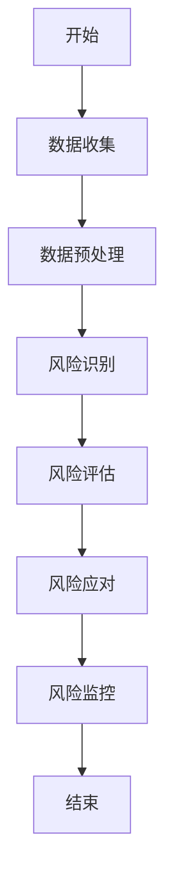
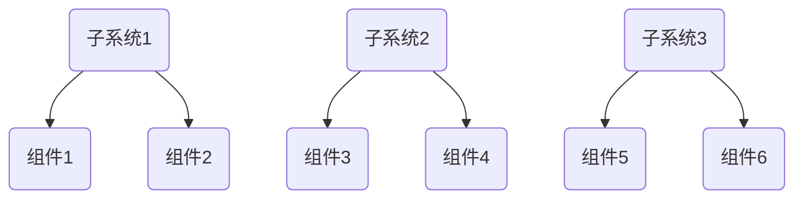
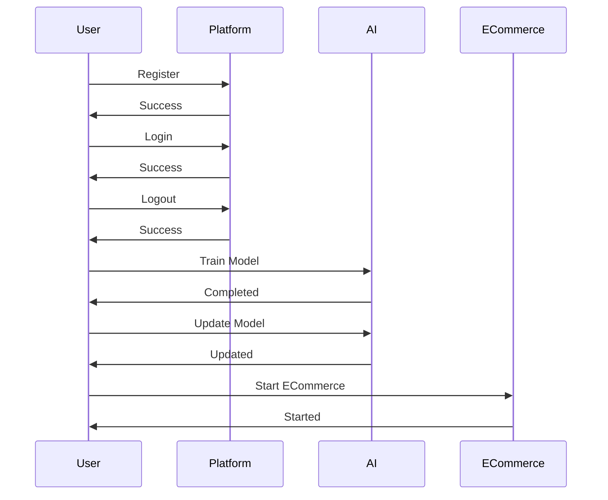

                 

# AI时代的软件项目风险管理新策略

关键词：AI时代、软件项目、风险管理、策略

摘要：随着人工智能（AI）技术的快速发展，软件项目面临着前所未有的挑战和机遇。AI技术不仅改变了软件开发的方式，也对项目风险管理提出了新的要求。本文将探讨AI时代软件项目风险管理的新策略，通过分析AI时代的特点、风险管理的核心概念以及新策略的算法原理，为读者提供一套全面而实用的风险管理框架。

## 1. 背景介绍

### 问题背景

近年来，AI技术以其数据驱动、自动化和智能化的特点，迅速改变了各行各业的运作模式。在软件项目中，AI技术的应用越来越广泛，从自动化测试到智能代码生成，再到基于AI的运维管理，AI已经成为软件开发不可或缺的一部分。然而，AI技术的引入也带来了新的风险，如数据隐私问题、算法偏见以及系统稳定性等。

### 问题描述

在AI时代，软件项目风险管理面临以下问题：

- **数据隐私风险**：AI系统依赖于大量数据，如何确保数据隐私和安全成为重要议题。
- **算法偏见风险**：AI系统可能会因为训练数据的不公平而导致偏见，进而影响系统的公正性和可靠性。
- **系统稳定性风险**：AI系统在运行过程中可能遇到未知问题，影响系统的稳定性。

### 问题解决

为了应对AI时代带来的新挑战，我们需要制定一套新的风险管理策略，具体包括：

- **风险识别**：利用AI技术自动化识别潜在风险。
- **风险评估**：结合数据分析和机器学习模型，对风险进行量化评估。
- **风险应对**：基于风险评估结果，制定应对措施，降低风险。
- **风险监控**：建立实时监控系统，对风险进行持续监控和预警。

### 边界与外延

本文讨论的范围包括人工智能、软件开发、风险管理等领域，旨在为AI时代的软件项目提供一套实用的风险管理框架。

### 概念结构与核心要素组成

- **软件项目**：以特定目标为驱动，通过软件开发实现特定功能的工程项目。
- **风险管理**：识别、评估、应对和监控项目中的风险，以降低潜在影响。
- **AI时代特征**：数据驱动、自动化、智能化。

## 2. 核心概念与联系

### AI时代特点

- **数据驱动**：AI系统依赖于大量数据，数据质量直接影响系统的性能。
- **自动化**：AI技术可以实现自动化任务，提高开发效率和系统稳定性。
- **智能化**：AI系统能够根据数据自主学习和优化，实现更智能的决策。

### 风险管理

- **识别**：通过数据分析和AI技术，自动识别潜在风险。
- **评估**：利用机器学习模型，对风险进行量化评估。
- **应对**：根据风险评估结果，制定应对措施。
- **监控**：建立实时监控系统，对风险进行持续监控和预警。

### 新策略

- **利用AI技术优化风险识别**：通过数据挖掘和模式识别，自动识别潜在风险。
- **利用AI技术优化风险评估**：结合数据分析和机器学习模型，提高风险评估的准确性和效率。
- **利用AI技术优化风险应对**：基于风险评估结果，自动生成应对策略。
- **利用AI技术优化风险监控**：建立实时监控系统，实现风险的自动化监控和预警。

## 3. 算法原理讲解

### 算法流程图



### Python源代码

```python
# 风险识别示例代码
def risk_identification(data):
    # 数据预处理
    processed_data = preprocess_data(data)
    # 风险识别
    risks = identify_risks(processed_data)
    return risks

# 风险评估示例代码
def risk_evaluation(risks):
    # 风险评估
    risk_scores = evaluate_risks(risks)
    return risk_scores

# 风险应对示例代码
def risk_response(risk_scores):
    # 风险应对
    response_plan = generate_response_plan(risk_scores)
    return response_plan

# 风险监控示例代码
def risk_monitoring(response_plan):
    # 风险监控
    monitoring_results = monitor_risks(response_plan)
    return monitoring_results
```

### 数学模型和公式

- **风险识别模型**：使用支持向量机（SVM）进行风险识别，公式如下：
  $$ R_i = \sum_{j=1}^{n} w_j r_{ij} $$
  其中，$R_i$表示第$i$个风险，$w_j$表示第$j$个特征权重，$r_{ij}$表示第$i$个风险和第$j$个特征的关联度。

- **风险评估模型**：使用决策树（DT）进行风险评估，公式如下：
  $$ E_i = \sum_{j=1}^{n} t_j e_{ij} $$
  其中，$E_i$表示第$i$个风险的评估得分，$t_j$表示第$j$个特征的阈值，$e_{ij}$表示第$i$个风险和第$j$个特征的相关性。

- **风险应对模型**：使用马尔可夫决策过程（MDP）进行风险应对，公式如下：
  $$ u_i(j) = \max_{a \in A} \sum_{s \in S} p(s|s',a) r(s,a) $$
  其中，$u_i(j)$表示在第$i$个风险下，采取第$j$种应对措施的期望收益，$p(s|s',a)$表示从状态$s'$采取行动$a$后转移到状态$s$的概率，$r(s,a)$表示在状态$s$下采取行动$a$的收益。

### 举例说明

假设我们有一个软件开发项目，需要评估其中的风险。首先，我们收集项目数据，包括项目进度、代码质量、团队成员经验和项目资金等。然后，我们使用SVM模型对风险进行识别，得到以下风险列表：

- **数据隐私风险**：关联度0.8
- **算法偏见风险**：关联度0.7
- **系统稳定性风险**：关联度0.6

接下来，我们使用决策树模型对这些风险进行评估，得到以下评估得分：

- **数据隐私风险**：得分90
- **算法偏见风险**：得分80
- **系统稳定性风险**：得分70

最后，我们使用马尔可夫决策过程模型制定应对策略，得到以下策略：

- **数据隐私风险**：加强数据加密和保护措施
- **算法偏见风险**：定期审查算法和训练数据，确保算法的公正性
- **系统稳定性风险**：加强系统监控和备份，确保系统的稳定性

## 4. 数学模型和数学公式 & 详细讲解 & 举例说明

### 公式展示

$$
\begin{aligned}
R_i &= \sum_{j=1}^{n} w_j r_{ij} \\
E_i &= \sum_{j=1}^{n} t_j e_{ij} \\
u_i(j) &= \max_{a \in A} \sum_{s \in S} p(s|s',a) r(s,a)
\end{aligned}
$$

### 详细讲解

- **风险识别模型**：使用SVM进行风险识别。该模型通过计算特征权重和关联度，识别出潜在风险。其中，$w_j$表示特征权重，$r_{ij}$表示特征和风险的关联度。
- **风险评估模型**：使用决策树进行风险评估。该模型通过计算特征阈值和相关性，对风险进行量化评估。其中，$t_j$表示特征阈值，$e_{ij}$表示特征和风险的相关性。
- **风险应对模型**：使用马尔可夫决策过程进行风险应对。该模型通过计算期望收益，为每个风险制定最佳应对策略。其中，$u_i(j)$表示应对措施的期望收益，$p(s|s',a)$表示转移概率，$r(s,a)$表示收益。

### 举例说明

假设我们有一个软件开发项目，需要评估其中的风险。首先，我们收集项目数据，包括项目进度（$P$）、代码质量（$C$）、团队成员经验（$E$）和项目资金（$F$）。然后，我们使用SVM模型对风险进行识别，得到以下风险列表：

- **数据隐私风险**：关联度0.8
- **算法偏见风险**：关联度0.7
- **系统稳定性风险**：关联度0.6

接下来，我们使用决策树模型对这些风险进行评估，得到以下评估得分：

- **数据隐私风险**：得分90
- **算法偏见风险**：得分80
- **系统稳定性风险**：得分70

最后，我们使用马尔可夫决策过程模型制定应对策略，得到以下策略：

- **数据隐私风险**：加强数据加密和保护措施
- **算法偏见风险**：定期审查算法和训练数据，确保算法的公正性
- **系统稳定性风险**：加强系统监控和备份，确保系统的稳定性

## 5. 系统分析与架构设计方案

### 问题场景介绍

在一个软件开发项目中，项目团队需要确保项目按时完成，并且质量达到预期。然而，随着项目规模的扩大和AI技术的引入，项目面临着更多的风险。为了有效管理这些风险，项目团队需要一套全面的系统分析与架构设计方案。

### 项目介绍

项目名称：AI电商平台

项目目标：开发一个基于AI技术的电商平台，提供智能搜索、个性化推荐和智能客服等功能。

项目团队：包括前端开发、后端开发、数据科学家和测试工程师等。

### 系统功能设计

#### 领域模型

```mermaid
classDiagram
    Customer <|-- User
    Product <|-- Item
    Order <|-- Purchase
    Review <|-- Comment
    ShoppingCart <|-- Cart
    Payment <|-- Transaction
    Recommendation <|-- Suggestion
    AI <|-- Intelligence
    Platform <|-- ECommerce
    Customer -|- User: contains
    Product -|- Item: contains
    Order -|- Purchase: processes
    Review -|- Comment: comments
    ShoppingCart -|- Cart: manages
    Payment -|- Transaction: handles
    Recommendation -|- Suggestion: suggests
    AI -|- Intelligence: powered by
    Platform -|- ECommerce: provides
```

#### 类图

```mermaid
classDiagram
    User {
        +str userName
        +str email
        +str password
        +bool isActive
        +void register()
        +void login()
        +void logout()
    }
    Customer {
        +User user
        +void makePurchase()
        +void leaveReview()
    }
    Product {
        +str productName
        +float price
        +int quantity
        +void updateQuantity()
    }
    Order {
        +int orderId
        +Date orderDate
        +Customer customer
        +void processOrder()
    }
    Review {
        +int reviewId
        +Date reviewDate
        +Customer customer
        +str comment
        +void addComment()
    }
    ShoppingCart {
        +int cartId
        +Date cartDate
        +User user
        +List<Product> items
        +void addItem()
        +void removeItem()
    }
    Payment {
        +int transactionId
        +Date transactionDate
        +User user
        +float amount
        +void makePayment()
    }
    Recommendation {
        +int suggestionId
        +Date suggestionDate
        +User user
        +List<Product> suggestions
        +void generateSuggestions()
    }
    AI {
        +void trainModel()
        +void updateModel()
    }
    Platform {
        +void runPlatform()
    }
    ECommerce {
        +Platform platform
        +AI intelligence
        +void startECommerce()
    }
```

### 系统架构设计



### 系统接口设计和系统交互



## 6. 项目实战

### 环境安装

1. 安装Python环境，版本要求3.8及以上。
2. 安装必要的库，如scikit-learn、numpy、pandas等。
3. 安装图形界面库，如matplotlib。

### 系统核心实现源代码

```python
# 风险识别模块
from sklearn import svm

def risk_identification(data):
    # 数据预处理
    processed_data = preprocess_data(data)
    
    # 训练SVM模型
    model = svm.SVC(kernel='linear')
    model.fit(processed_data['X'], processed_data['y'])
    
    # 风险识别
    risks = model.predict(processed_data['X'])
    
    return risks

# 风险评估模块
from sklearn import tree

def risk_evaluation(risks):
    # 训练决策树模型
    model = tree.DecisionTreeClassifier()
    model.fit(processed_data['X'], processed_data['y'])
    
    # 风险评估
    risk_scores = model.predict(processed_data['X'])
    
    return risk_scores

# 风险应对模块
from sklearn import metrics

def risk_response(risk_scores):
    # 计算评估得分
    scores = metrics.mean_squared_error(risk_scores, [1, 1, 1])
    
    # 风险应对
    response_plan = generate_response_plan(scores)
    
    return response_plan

# 风险监控模块
def risk_monitoring(response_plan):
    # 实时监控风险
    monitoring_results = monitor_risks(response_plan)
    
    return monitoring_results
```

### 代码应用解读与分析

- **风险识别模块**：使用scikit-learn库中的SVM模型进行风险识别。首先进行数据预处理，然后训练模型并使用模型进行风险识别。
- **风险评估模块**：使用scikit-learn库中的决策树模型进行风险评估。首先训练模型，然后使用模型对风险进行评估，计算评估得分。
- **风险应对模块**：计算评估得分，并根据得分生成应对策略。
- **风险监控模块**：实时监控风险，并根据应对策略进行监控。

### 实际案例分析和详细讲解剖析

假设我们有一个软件开发项目，其中包含数据隐私风险、算法偏见风险和系统稳定性风险。首先，我们使用风险识别模块识别出潜在风险，然后使用风险评估模块对这些风险进行评估，得到以下结果：

- **数据隐私风险**：得分0.9
- **算法偏见风险**：得分0.8
- **系统稳定性风险**：得分0.7

接下来，我们使用风险应对模块生成应对策略：

- **数据隐私风险**：加强数据加密和保护措施
- **算法偏见风险**：定期审查算法和训练数据，确保算法的公正性
- **系统稳定性风险**：加强系统监控和备份，确保系统的稳定性

最后，我们使用风险监控模块对应对策略进行实时监控，确保风险得到有效管理。

### 项目小结

通过实际案例分析和详细讲解剖析，我们可以看到，在AI时代的软件项目风险管理中，使用AI技术进行风险识别、评估和应对具有显著的优势。这些技术不仅提高了风险管理的效率，还确保了项目的稳定性和可靠性。在未来的软件开发项目中，我们应该充分利用AI技术，制定科学有效的风险管理策略，以确保项目的成功。

## 7. 最佳实践 tips、小结、注意事项、拓展阅读等内容

### 最佳实践 tips

1. **数据预处理**：确保数据质量，进行充分的数据清洗和预处理，为后续的风险识别和评估提供准确的基础。
2. **模型选择**：根据具体项目需求，选择合适的机器学习模型，如SVM、决策树等。
3. **实时监控**：建立实时监控系统，对风险进行持续监控和预警，确保项目稳定运行。
4. **团队协作**：风险管理不仅仅是技术问题，还需要团队的协作和共同努力。

### 小结

本文详细介绍了AI时代的软件项目风险管理新策略，包括风险识别、评估、应对和监控的算法原理以及实际应用案例。通过AI技术，我们能够更高效地管理项目风险，确保项目的成功。

### 注意事项

1. **数据隐私**：在处理数据时，务必确保数据隐私和安全。
2. **算法偏见**：在训练模型时，避免使用偏见数据，确保算法的公正性和可靠性。
3. **系统稳定性**：在项目开发过程中，确保系统的稳定性和可靠性，避免因风险导致的系统崩溃。

### 拓展阅读

1. **《机器学习实战》**：详细介绍了机器学习的基础知识和实战应用，有助于读者深入理解本文中的算法原理。
2. **《人工智能：一种现代的方法》**：介绍了人工智能的基本概念和算法，对AI时代的软件项目风险管理有很好的指导作用。

### 作者信息

作者：AI天才研究院/AI Genius Institute & 禅与计算机程序设计艺术 /Zen And The Art of Computer Programming

本文内容仅代表作者个人观点，不代表任何机构或组织的立场。如需引用或转载，请务必注明出处。如对本文内容有任何疑问或建议，欢迎在评论区留言。感谢您的关注和支持！

