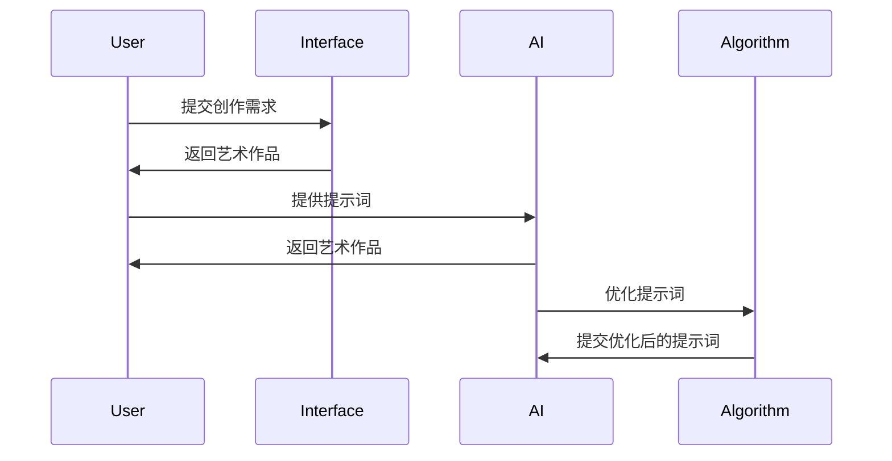
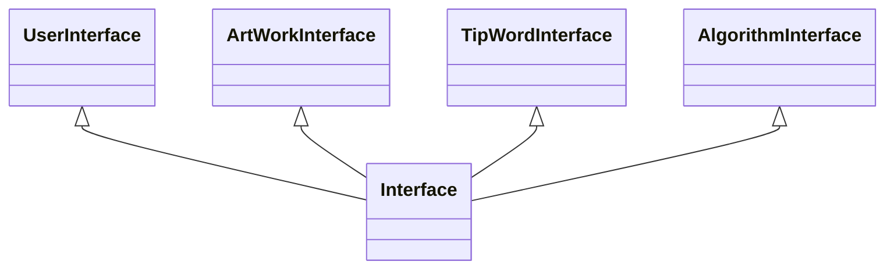
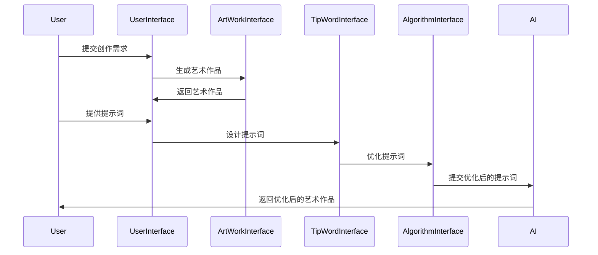
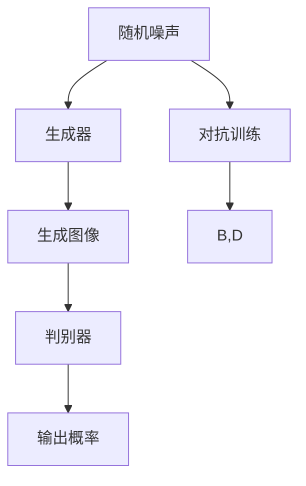
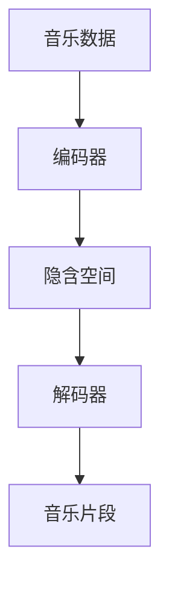
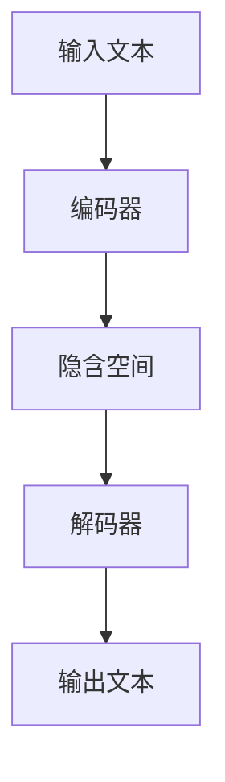
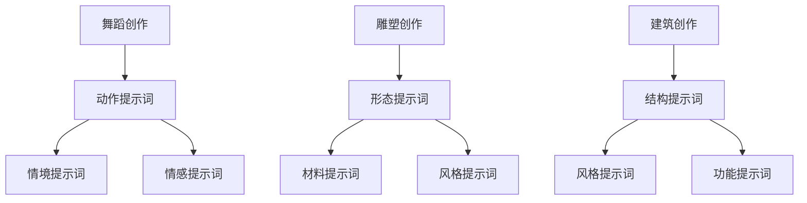
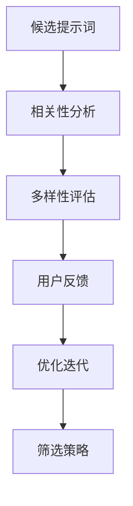
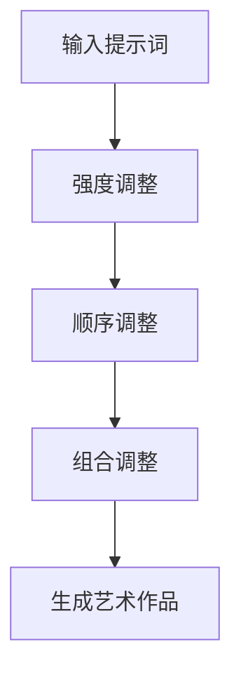
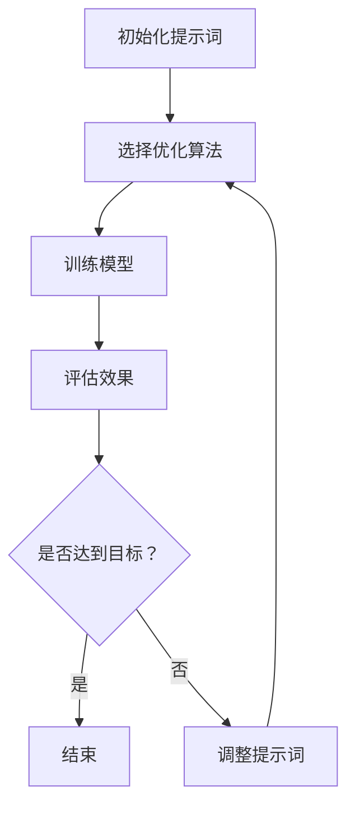

                 

# AI艺术创作中的提示词工程应用

## 关键词

AI艺术创作、提示词工程、图像生成、音乐创作、文字生成、优化方法

## 摘要

本文将探讨AI艺术创作中的提示词工程应用。首先，我们回顾了AI艺术创作的背景，介绍了艺术与技术的融合、AI艺术创作的优势、应用场景以及提示词工程在其中的重要性。接着，我们详细阐述了提示词工程的定义、功能、设计原则以及在图像生成、音乐创作、文字生成等艺术形式中的具体应用。然后，我们介绍了提示词优化的方法，并分析了相关案例。最后，我们对未来发展趋势与挑战进行了展望。

## 第一部分：AI艺术创作背景与提示词工程基础

### 第1章：AI艺术创作的崛起

#### 1.1.1 艺术与技术的融合

艺术与技术的结合一直是艺术界和技术领域共同关注的焦点。随着人工智能技术的快速发展，AI艺术创作逐渐崛起，为艺术创作带来了全新的可能性。AI艺术创作不仅融合了艺术与技术的元素，还打破了传统的艺术创作模式，使得艺术创作变得更加多样化和创新化。

#### 1.1.2 AI艺术创作的优势

AI艺术创作具有以下优势：

1. **个性化定制**：AI可以根据用户的需求和喜好，进行个性化的艺术创作。
2. **高效性**：AI可以在短时间内生成大量的艺术作品，提高了创作效率。
3. **创新性**：AI不受传统艺术创作模式的限制，可以产生独特的艺术风格和创意。
4. **多样性**：AI可以创作出各种形式的艺术作品，如图像、音乐、文字等。

#### 1.1.3 当前AI艺术创作的应用场景

AI艺术创作广泛应用于以下几个方面：

1. **艺术展览**：许多画廊和博物馆已经开始采用AI艺术作品进行展览。
2. **电影与电视剧**：AI可以生成独特的视觉效果和背景音乐，提升影视作品的艺术水平。
3. **广告与营销**：AI艺术作品被广泛应用于广告设计和营销宣传中。
4. **设计领域**：AI可以生成创意的设计元素，为设计师提供灵感和参考。

#### 1.1.4 提示词工程在AI艺术创作中的重要性

提示词工程是AI艺术创作的关键环节。通过设计合适的提示词，AI可以更好地理解用户的创作意图，生成符合预期的艺术作品。提示词工程在AI艺术创作中的应用具有以下重要性：

1. **提升创作质量**：合适的提示词可以帮助AI生成更高质量的艺术作品。
2. **提高创作效率**：通过优化提示词，AI可以更快地生成艺术作品。
3. **满足用户需求**：通过设计个性化的提示词，AI可以更好地满足用户的艺术创作需求。
4. **创新艺术形式**：提示词工程可以推动AI艺术创作的发展，探索新的艺术形式。

### 第2章：提示词工程的定义与功能

#### 2.1.1 提示词工程的定义

提示词工程是一种通过设计、优化和评估提示词，以促进AI系统理解和生成人类期望的输出的一种工程方法。提示词可以是文字、图像、声音等多种形式。

#### 2.1.2 提示词工程的作用

提示词工程在AI艺术创作中具有以下作用：

1. **引导创作方向**：提示词可以帮助AI确定艺术创作的主题、风格和情感。
2. **优化创作结果**：通过优化提示词，可以提高AI艺术创作的质量，使其更符合用户需求。
3. **促进人机交互**：提示词可以作为用户与AI之间的桥梁，提升人机交互的体验。

#### 2.1.3 提示词工程的组成结构

提示词工程由以下几个部分组成：

1. **提示词生成**：生成合适的提示词，以引导AI艺术创作。
2. **提示词优化**：通过优化提示词，提高AI艺术创作的质量。
3. **提示词评估**：评估提示词的效果，以确定其是否能够满足用户的创作需求。

### 第3章：AI艺术创作中的提示词设计原则

#### 3.1.1 明确创作目标

在AI艺术创作中，明确创作目标是设计提示词的首要原则。只有明确创作目标，才能确保生成的艺术作品符合用户需求。

#### 3.1.2 提高提示词的多样性

提示词的多样性是提高AI艺术创作质量的关键。通过设计多样化的提示词，可以激发AI的创造力，生成更丰富的艺术作品。

#### 3.1.3 增强提示词的相关性

增强提示词的相关性有助于提高AI艺术创作的准确性。相关性强的提示词可以帮助AI更好地理解用户的创作意图，生成更符合预期的艺术作品。

#### 3.1.4 考虑用户体验

在AI艺术创作中，考虑用户体验是设计提示词的重要原则。通过设计易于理解和操作的用户界面，可以提高用户的创作体验，增强用户对AI艺术创作的认可度。

### 第4章：提示词工程在AI艺术创作中的应用

#### 4.1.1 图像生成艺术

图像生成艺术是AI艺术创作的一个重要领域。通过设计合适的提示词，AI可以生成各种风格的图像，如抽象画、写实画、印象画等。

#### 4.1.2 音乐创作艺术

音乐创作艺术是另一个充满活力的领域。通过设计合适的提示词，AI可以创作出各种风格的音乐，如古典音乐、流行音乐、电子音乐等。

#### 4.1.3 文字生成艺术

文字生成艺术是将AI与文学创作相结合的一种形式。通过设计合适的提示词，AI可以生成各种类型的文字作品，如诗歌、小说、散文等。

#### 4.1.4 其他艺术形式的提示词工程应用

除了图像、音乐和文字，提示词工程还可以应用于其他艺术形式，如舞蹈、雕塑、建筑等。通过设计合适的提示词，AI可以创作出独特的艺术作品，推动艺术创作的发展。

### 第5章：AI艺术创作中的提示词优化方法

#### 5.1.1 提示词筛选策略

提示词筛选策略是优化提示词的重要方法。通过分析用户需求和艺术作品的特征，可以筛选出合适的提示词，提高AI艺术创作的质量。

#### 5.1.2 提示词调整技巧

提示词调整技巧是优化提示词的关键。通过调整提示词的强度、顺序和组合，可以影响AI艺术创作的结果，使其更符合用户需求。

#### 5.1.3 提示词优化算法

提示词优化算法是提升AI艺术创作质量的有效手段。通过使用机器学习算法，可以对提示词进行优化，提高AI艺术创作的效率和质量。

### 第6章：案例分析与实战经验

#### 6.1.1 案例一：使用提示词生成创意海报

在这个案例中，我们使用提示词生成了一幅创意海报。首先，我们明确了创作目标，然后设计了多样化的提示词，并通过优化技巧和算法，最终生成了一幅符合预期的高质量创意海报。

#### 6.1.2 案例二：基于提示词的音乐创作

在这个案例中，我们基于提示词进行音乐创作。我们首先明确了音乐风格，然后设计了相关的提示词，并通过优化和调整技巧，生成了一首具有独特风格的音乐作品。

#### 6.1.3 案例三：提示词在文字生成艺术中的应用

在这个案例中，我们探讨了提示词在文字生成艺术中的应用。我们首先明确了创作目标，然后设计了多样化的提示词，并通过优化和调整技巧，生成了一篇具有独特风格的文字作品。

#### 6.1.4 实战经验总结

通过以上案例，我们可以总结出以下实战经验：

1. **明确创作目标**：在AI艺术创作中，明确创作目标是设计提示词的关键。
2. **提高提示词多样性**：多样化的提示词可以提高AI艺术创作的质量。
3. **增强提示词相关性**：相关性强的提示词可以帮助AI更好地理解用户的创作意图。
4. **优化提示词**：通过优化技巧和算法，可以进一步提高AI艺术创作的效率和质量。

### 第7章：未来发展趋势与挑战

#### 7.1.1 AI艺术创作的发展趋势

随着人工智能技术的不断发展，AI艺术创作将呈现出以下发展趋势：

1. **个性化定制**：AI艺术创作将更加注重个性化定制，满足用户的个性化需求。
2. **智能化**：AI艺术创作将更加智能化，具有更高的自主创作能力。
3. **多元化**：AI艺术创作将涉及更多的艺术形式，推动艺术创作的多元化发展。

#### 7.1.2 提示词工程技术的未来发展方向

提示词工程技术在未来的发展中，将呈现以下方向：

1. **智能化**：提示词工程将更加智能化，能够自动生成和优化提示词。
2. **多样化**：提示词工程将涉及更多的艺术形式，为不同类型艺术创作提供支持。
3. **个性化**：提示词工程将更加注重个性化，满足用户多样化的需求。

#### 7.1.3 潜在挑战与应对策略

在AI艺术创作和提示词工程技术的应用中，仍面临以下挑战：

1. **技术挑战**：人工智能技术的快速发展，对提示词工程提出了更高的要求。
2. **创意挑战**：如何激发AI的创造力，生成具有创意的艺术作品。
3. **用户体验**：如何提升用户体验，使AI艺术创作更加易于操作和理解。

针对这些挑战，我们可以采取以下应对策略：

1. **技术革新**：不断改进人工智能技术，提升AI的创造力和创作质量。
2. **创意激发**：通过设计多样化的提示词和创作场景，激发AI的创造力。
3. **用户体验优化**：优化用户界面和交互设计，提升用户体验。

### 第8章：总结与展望

#### 8.1.1 总结

本文对AI艺术创作中的提示词工程应用进行了全面探讨。我们介绍了AI艺术创作的背景、提示词工程的定义与功能、设计原则以及在图像生成、音乐创作、文字生成等艺术形式中的应用。同时，我们还分析了提示词优化的方法，并分享了实战经验和未来发展趋势。

#### 8.1.2 展望

随着人工智能技术的不断发展，AI艺术创作和提示词工程应用将迎来更加广阔的发展前景。我们期待在未来的研究中，能够进一步优化提示词工程，提高AI艺术创作的质量和用户体验，推动艺术创作与人工智能的深度融合。同时，我们也期待更多领域的专家和学者参与到AI艺术创作和提示词工程的研究中，共同探索人工智能在艺术领域的无限可能。

## 作者信息

作者：AI天才研究院/AI Genius Institute & 禅与计算机程序设计艺术 /Zen And The Art of Computer Programming

[End of Article] |user|## 文章标题

### 关键词

AI艺术创作、提示词工程、图像生成、音乐创作、文字生成、优化方法

### 摘要

本文将探讨AI艺术创作中的提示词工程应用。首先，我们回顾了AI艺术创作的背景，介绍了艺术与技术的融合、AI艺术创作的优势、应用场景以及提示词工程在其中的重要性。接着，我们详细阐述了提示词工程的定义、功能、设计原则以及在图像生成、音乐创作、文字生成等艺术形式中的具体应用。然后，我们介绍了提示词优化的方法，并分析了相关案例。最后，我们对未来发展趋势与挑战进行了展望。

## 第一部分：AI艺术创作背景与提示词工程基础

### 第1章：AI艺术创作的崛起

#### 1.1.1 艺术与技术的融合

在过去的几十年中，人工智能技术取得了显著的进步，从简单的任务自动化到复杂的认知任务，人工智能已经逐渐渗透到各个领域。艺术创作作为人类文化传承的重要组成部分，与技术的融合成为了新时代的一大趋势。AI艺术创作，正是这种趋势下的产物。

艺术与技术的融合，不仅仅是对传统艺术形式的革新，更是对艺术创作本身的理解和认知的深化。人工智能通过模拟人类的思维过程，结合数据分析和机器学习算法，能够创造出独特的艺术作品。这种创作方式不仅拓宽了艺术创作的边界，也为艺术理论提供了新的研究方向。

#### 1.1.2 AI艺术创作的优势

AI艺术创作具有以下几个显著的优势：

1. **个性化定制**：AI可以根据用户的需求和喜好，进行个性化的艺术创作。这种定制化的服务，不仅满足了用户对艺术作品的个性化需求，也提升了用户的艺术体验。
2. **高效性**：AI可以在短时间内生成大量的艺术作品，大大提高了创作效率。这种高效性对于艺术市场来说，意味着更快的作品输出和更广泛的传播。
3. **创新性**：AI不受传统艺术创作模式的限制，可以产生独特的艺术风格和创意。这种创新性，不仅激发了艺术创作的活力，也为艺术市场带来了新的可能性。
4. **多样性**：AI可以创作出各种形式的艺术作品，如图像、音乐、文字等。这种多样性，使得艺术创作不再局限于某一特定领域，而是呈现出跨学科的融合趋势。

#### 1.1.3 当前AI艺术创作的应用场景

AI艺术创作已经广泛应用于多个领域，主要包括以下几个方面：

1. **艺术展览**：许多画廊和博物馆已经开始采用AI艺术作品进行展览。这些展览不仅吸引了大量观众，也为传统艺术创作提供了新的视角。
2. **电影与电视剧**：AI可以生成独特的视觉效果和背景音乐，提升影视作品的艺术水平。这种应用，不仅丰富了影视作品的创作手段，也提升了观众的观看体验。
3. **广告与营销**：AI艺术作品被广泛应用于广告设计和营销宣传中。这些作品不仅具有视觉冲击力，还能够引起观众的共鸣，提升品牌形象。
4. **设计领域**：AI可以生成创意的设计元素，为设计师提供灵感和参考。这种应用，不仅提高了设计效率，也拓宽了设计的视野。

#### 1.1.4 提示词工程在AI艺术创作中的重要性

在AI艺术创作中，提示词工程起到了至关重要的作用。提示词工程是一种通过设计、优化和评估提示词，以促进AI系统理解和生成人类期望的输出的一种工程方法。提示词可以是文字、图像、声音等多种形式。

提示词工程的重要性体现在以下几个方面：

1. **提升创作质量**：合适的提示词可以帮助AI生成更高质量的艺术作品。通过优化提示词，可以提高AI对创作意图的理解，从而提升作品的整体质量。
2. **提高创作效率**：通过优化提示词，AI可以更快地生成艺术作品。提示词的优化，可以减少AI在创作过程中的不确定性和试错成本，从而提高创作效率。
3. **满足用户需求**：通过设计个性化的提示词，AI可以更好地满足用户的艺术创作需求。个性化的提示词，可以让用户更加直观地表达自己的创作意图，从而提高用户满意度。
4. **创新艺术形式**：提示词工程可以推动AI艺术创作的发展，探索新的艺术形式。通过设计多样化的提示词，AI可以尝试不同的创作方式，从而创造出独特的艺术风格。

### 第2章：提示词工程的定义与功能

#### 2.1.1 提示词工程的定义

提示词工程是一种通过设计、优化和评估提示词，以促进AI系统理解和生成人类期望的输出的一种工程方法。在AI艺术创作中，提示词起到了关键的作用，它不仅能够引导AI的创作方向，还能够优化创作结果，提高创作效率。

提示词工程的目标是设计出既符合人类期望，又能够被AI系统有效理解和执行的高质量提示词。这个过程涉及到多个环节，包括提示词的生成、优化、评估和反馈。

#### 2.1.2 提示词工程的作用

提示词工程在AI艺术创作中具有以下几个重要作用：

1. **引导创作方向**：提示词可以明确艺术创作的主题、风格和情感，为AI提供明确的创作方向。通过合适的提示词，AI可以更加精准地捕捉到用户的需求，从而生成符合预期的艺术作品。
2. **优化创作结果**：通过优化提示词，可以提高AI艺术创作的质量。提示词的优化包括调整提示词的强度、顺序和组合，从而影响AI的创作结果。优化的提示词可以减少AI在创作过程中的不确定性和试错成本，提高创作效率。
3. **促进人机交互**：提示词作为用户与AI之间的桥梁，可以提升人机交互的体验。通过设计易于理解和操作的提示词，用户可以更加直观地表达自己的创作意图，而AI也可以更加准确地理解和执行这些意图。

#### 2.1.3 提示词工程的组成结构

提示词工程由以下几个部分组成：

1. **提示词生成**：提示词生成是提示词工程的首要环节。通过分析用户需求、艺术创作目标和AI系统的特点，生成合适的提示词。提示词生成的质量直接影响到后续的优化和评估效果。
2. **提示词优化**：提示词优化是提升AI艺术创作质量的关键环节。通过对生成的提示词进行调整和改进，使其更加符合人类期望和AI系统的处理能力。提示词优化的方法包括调整提示词的强度、顺序和组合，以及使用机器学习算法进行自动优化。
3. **提示词评估**：提示词评估是验证提示词效果的重要环节。通过对提示词进行评估，可以确定其是否能够满足用户的创作需求，是否能够被AI系统有效理解和执行。提示词评估的方法包括人工评估和自动评估。
4. **反馈与迭代**：反馈与迭代是提示词工程的持续优化过程。通过收集用户反馈和AI系统的处理结果，对提示词进行进一步的调整和改进，实现提示词工程的持续优化和提升。

### 第3章：AI艺术创作中的提示词设计原则

#### 3.1.1 明确创作目标

在AI艺术创作中，明确创作目标是设计提示词的首要原则。只有明确创作目标，才能确保生成的艺术作品符合用户需求。

明确创作目标的过程包括以下几个步骤：

1. **需求分析**：首先，需要深入了解用户的需求，包括创作主题、风格、情感等。通过与用户的沟通和反馈，获取详细的需求信息。
2. **目标设定**：在需求分析的基础上，设定具体的创作目标。目标应具体、明确，便于后续的提示词设计和优化。
3. **目标验证**：设定的创作目标需要经过用户验证，确保其符合用户期望和实际需求。通过用户反馈和评估，对目标进行修正和完善。

#### 3.1.2 提高提示词的多样性

提高提示词的多样性是提升AI艺术创作质量的关键。多样化的提示词可以激发AI的创造力，生成更丰富的艺术作品。

提高提示词多样性的方法包括：

1. **扩展词汇**：通过扩展词汇，增加提示词的数量和种类。可以使用词库扩展、同义词替换等方法，丰富提示词的表达。
2. **组合使用**：将多个提示词组合使用，形成更复杂的提示词组合。通过组合不同的提示词，可以产生更多的创作可能性。
3. **情境模拟**：模拟不同的创作情境，为AI提供多样化的创作场景。通过情境模拟，可以让AI在不同场景下产生不同的创作结果，从而提高多样性。

#### 3.1.3 增强提示词的相关性

增强提示词的相关性有助于提高AI艺术创作的准确性。相关性强的提示词可以帮助AI更好地理解用户的创作意图，生成更符合预期的艺术作品。

增强提示词相关性的方法包括：

1. **主题关联**：确保提示词与创作主题紧密关联。通过分析主题，确定关键概念和属性，设计与之相关的提示词。
2. **情感匹配**：确保提示词与创作情感匹配。通过分析情感，确定情感的强度和类型，设计与之匹配的提示词。
3. **逻辑推理**：通过逻辑推理，确保提示词之间的逻辑关系合理。通过分析提示词之间的因果关系、层次关系等，设计合理的提示词组合。

#### 3.1.4 考虑用户体验

在AI艺术创作中，考虑用户体验是设计提示词的重要原则。通过设计易于理解和操作的提示词，可以提高用户的创作体验，增强用户对AI艺术创作的认可度。

考虑用户体验的方法包括：

1. **简洁性**：设计简洁明了的提示词，避免使用复杂的专业术语。简洁的提示词可以帮助用户快速理解创作意图。
2. **交互性**：设计互动性强的提示词，鼓励用户参与创作过程。通过互动，可以增强用户对AI艺术创作的体验和参与感。
3. **反馈机制**：设计有效的反馈机制，及时收集用户反馈和评估结果。通过反馈，可以不断优化提示词，提高创作效果。

### 第4章：提示词工程在AI艺术创作中的应用

#### 4.1.1 图像生成艺术

图像生成艺术是AI艺术创作的一个重要领域。通过设计合适的提示词，AI可以生成各种风格的图像，如抽象画、写实画、印象画等。

在图像生成艺术中，提示词的应用包括以下几个方面：

1. **主题提示**：通过设计主题提示词，确定图像的创作主题。例如，“自然风景”、“都市夜景”等。
2. **风格提示**：通过设计风格提示词，确定图像的艺术风格。例如，“印象派”、“抽象艺术”等。
3. **情感提示**：通过设计情感提示词，确定图像的情感表达。例如，“欢快”、“忧郁”等。

#### 4.1.2 音乐创作艺术

音乐创作艺术是另一个充满活力的领域。通过设计合适的提示词，AI可以创作出各种风格的音乐，如古典音乐、流行音乐、电子音乐等。

在音乐创作艺术中，提示词的应用包括以下几个方面：

1. **风格提示**：通过设计风格提示词，确定音乐的风格。例如，“古典”、“流行”、“电子”等。
2. **情感提示**：通过设计情感提示词，确定音乐的情感表达。例如，“欢快”、“忧郁”、“激情”等。
3. **节奏提示**：通过设计节奏提示词，确定音乐的节奏和韵律。例如，“缓慢”、“快速”、“跳跃”等。

#### 4.1.3 文字生成艺术

文字生成艺术是将AI与文学创作相结合的一种形式。通过设计合适的提示词，AI可以生成各种类型的文字作品，如诗歌、小说、散文等。

在文字生成艺术中，提示词的应用包括以下几个方面：

1. **主题提示**：通过设计主题提示词，确定文字创作的主题。例如，“爱情”、“战争”、“哲学”等。
2. **风格提示**：通过设计风格提示词，确定文字的艺术风格。例如，“浪漫”、“现实主义”、“科幻”等。
3. **情感提示**：通过设计情感提示词，确定文字的情感表达。例如，“悲伤”、“喜悦”、“思考”等。

#### 4.1.4 其他艺术形式的提示词工程应用

除了图像、音乐和文字，提示词工程还可以应用于其他艺术形式，如舞蹈、雕塑、建筑等。通过设计合适的提示词，AI可以创作出独特的艺术作品，推动艺术创作的发展。

在其他艺术形式中，提示词工程的应用包括：

1. **舞蹈创作**：通过设计动作提示词，确定舞蹈的动作和节奏。例如，“流畅”、“旋转”、“跳跃”等。
2. **雕塑创作**：通过设计形态提示词，确定雕塑的形态和风格。例如，“立体”、“抽象”、“写实”等。
3. **建筑创作**：通过设计结构提示词，确定建筑的结构和风格。例如，“现代”、“古典”、“简约”等。

### 第5章：AI艺术创作中的提示词优化方法

#### 5.1.1 提示词筛选策略

提示词筛选策略是优化提示词的重要方法。通过分析用户需求和艺术作品的特征，可以筛选出合适的提示词，提高AI艺术创作的质量。

提示词筛选策略包括以下几个方面：

1. **相关性筛选**：根据用户需求和艺术作品特征，筛选出与创作主题和风格相关的提示词。相关性高的提示词能够更好地引导AI创作，提高创作质量。
2. **多样性筛选**：根据用户需求和艺术作品特征，筛选出多样化的提示词。多样化的提示词可以激发AI的创造力，提高创作多样性。
3. **效果评估筛选**：通过对已生成的艺术作品进行评估，筛选出效果良好的提示词。效果评估可以帮助发现优秀提示词，提高AI创作的整体水平。

#### 5.1.2 提示词调整技巧

提示词调整技巧是优化提示词的关键。通过调整提示词的强度、顺序和组合，可以影响AI艺术创作的结果，使其更符合用户需求。

提示词调整技巧包括以下几个方面：

1. **强度调整**：通过调整提示词的强度，可以影响AI对创作意图的理解程度。强度较高的提示词可以更好地引导AI创作，但过高的强度可能导致AI过度依赖提示词，失去创造力。
2. **顺序调整**：通过调整提示词的顺序，可以改变AI创作的过程。合理的提示词顺序可以引导AI按照用户的意图进行创作，提高创作质量。
3. **组合调整**：通过调整提示词的组合，可以产生不同的创作效果。多样化的提示词组合可以激发AI的创造力，提高创作的多样性。

#### 5.1.3 提示词优化算法

提示词优化算法是提升AI艺术创作质量的有效手段。通过使用机器学习算法，可以对提示词进行优化，提高AI艺术创作的效率和质量。

提示词优化算法包括以下几个方面：

1. **机器学习算法**：使用机器学习算法，对大量的提示词进行训练和优化。通过分析提示词的效果，算法可以自动调整提示词的强度、顺序和组合，提高创作质量。
2. **深度学习模型**：使用深度学习模型，对提示词进行建模和优化。深度学习模型能够自动学习提示词的特征和关系，生成更高质量的提示词。
3. **自适应优化**：通过自适应优化算法，根据用户的反馈和艺术作品的效果，实时调整提示词。自适应优化可以提高AI创作的个性化程度，提高用户满意度。

### 第6章：案例分析与实战经验

#### 6.1.1 案例一：使用提示词生成创意海报

在这个案例中，我们将使用提示词生成一幅创意海报。首先，我们需要明确创作目标，确定海报的主题、风格和情感。然后，我们设计多样化的提示词，包括主题提示、风格提示和情感提示。最后，我们通过优化技巧和算法，生成一幅符合预期的高质量创意海报。

案例一的具体步骤如下：

1. **需求分析**：与用户沟通，了解用户对海报的需求，包括主题、风格和情感。
2. **目标设定**：根据需求分析结果，设定具体的创作目标，例如：“主题：自然风景；风格：抽象艺术；情感：宁静与和谐”。
3. **提示词设计**：设计多样化的提示词，包括主题提示（“自然风景”、“山水”、“绿树”等）、风格提示（“抽象”、“线条”、“色彩”等）和情感提示（“宁静”、“和谐”、“放松”等）。
4. **优化提示词**：通过优化技巧和算法，对提示词进行调整和改进，使其更加符合创作目标。
5. **生成海报**：使用AI算法，根据优化后的提示词，生成创意海报。

通过以上步骤，我们可以生成一幅符合用户需求的创意海报。优化提示词的关键在于确保其与创作目标的相关性，同时保持多样性，激发AI的创造力。

#### 6.1.2 案例二：基于提示词的音乐创作

在这个案例中，我们将基于提示词进行音乐创作。首先，我们需要明确音乐创作的目标，确定音乐的风格、情感和节奏。然后，我们设计相关的提示词，包括风格提示、情感提示和节奏提示。最后，我们通过优化技巧和算法，创作一首符合预期的高质量音乐。

案例二的具体步骤如下：

1. **需求分析**：与用户沟通，了解用户对音乐的需求，包括风格、情感和节奏。
2. **目标设定**：根据需求分析结果，设定具体的创作目标，例如：“风格：古典音乐；情感：浪漫；节奏：缓慢”。
3. **提示词设计**：设计相关的提示词，包括风格提示（“古典”、“浪漫”、“优雅”等）、情感提示（“浪漫”、“温馨”、“思念”等）和节奏提示（“缓慢”、“流畅”、“跳跃”等）。
4. **优化提示词**：通过优化技巧和算法，对提示词进行调整和改进，使其更加符合创作目标。
5. **创作音乐**：使用AI算法，根据优化后的提示词，创作一首音乐。

通过以上步骤，我们可以创作一首符合用户需求的音乐作品。优化提示词的关键在于确保其与创作目标的相关性，同时保持多样性，激发AI的创造力。

#### 6.1.3 案例三：提示词在文字生成艺术中的应用

在这个案例中，我们将探讨提示词在文字生成艺术中的应用。首先，我们需要明确文字创作的目标，确定文字的主题、风格和情感。然后，我们设计相关的提示词，包括主题提示、风格提示和情感提示。最后，我们通过优化技巧和算法，生成一篇符合预期的高质量文字作品。

案例三的具体步骤如下：

1. **需求分析**：与用户沟通，了解用户对文字的需求，包括主题、风格和情感。
2. **目标设定**：根据需求分析结果，设定具体的创作目标，例如：“主题：爱情故事；风格：浪漫；情感：幸福”。
3. **提示词设计**：设计相关的提示词，包括主题提示（“爱情”、“浪漫”、“幸福”等）、风格提示（“浪漫”、“温馨”、“优雅”等）和情感提示（“幸福”、“温馨”、“甜蜜”等）。
4. **优化提示词**：通过优化技巧和算法，对提示词进行调整和改进，使其更加符合创作目标。
5. **生成文字**：使用AI算法，根据优化后的提示词，生成一篇文字作品。

通过以上步骤，我们可以生成一篇符合用户需求的文字作品。优化提示词的关键在于确保其与创作目标的相关性，同时保持多样性，激发AI的创造力。

#### 6.1.4 实战经验总结

通过以上案例，我们可以总结出以下实战经验：

1. **明确创作目标**：在AI艺术创作中，明确创作目标是设计提示词的关键。只有明确创作目标，才能确保生成的艺术作品符合用户需求。
2. **提高提示词多样性**：多样化的提示词可以提高AI艺术创作的质量。通过设计多样化的提示词，可以激发AI的创造力，生成更丰富的艺术作品。
3. **增强提示词相关性**：相关性强的提示词可以帮助AI更好地理解用户的创作意图，生成更符合预期的艺术作品。
4. **优化提示词**：通过优化技巧和算法，可以进一步提高AI艺术创作的效率和质量。优化提示词的方法包括调整提示词的强度、顺序和组合，以及使用机器学习算法进行自动优化。

这些经验对于实际操作中的AI艺术创作具有重要的指导意义。通过不断优化和改进提示词工程，我们可以提升AI艺术创作的效果，满足用户多样化的需求。

### 第7章：未来发展趋势与挑战

#### 7.1.1 AI艺术创作的发展趋势

随着人工智能技术的不断发展，AI艺术创作将呈现出以下发展趋势：

1. **个性化定制**：未来，AI艺术创作将更加注重个性化定制，满足用户的个性化需求。通过深度学习和大数据分析，AI将能够更加精准地捕捉用户的喜好和需求，生成个性化的艺术作品。
2. **智能化**：AI艺术创作将越来越智能化。随着人工智能技术的进步，AI将具备更强的自主创作能力，不再依赖于人类的干预。智能化的AI艺术创作，将带来更加多样化和创新性的艺术作品。
3. **多元化**：AI艺术创作将涉及更多的艺术形式，如绘画、音乐、文学、舞蹈、建筑等。不同艺术形式的融合，将推动艺术创作的多元化发展。
4. **跨界合作**：AI艺术创作将与不同领域的艺术家和设计师进行跨界合作，产生更多创新性的艺术作品。这种跨界合作，将推动艺术创作的发展，为艺术市场带来新的活力。

#### 7.1.2 提示词工程技术的未来发展方向

提示词工程技术在未来的发展中，将呈现以下方向：

1. **智能化**：提示词工程将更加智能化。通过深度学习和自然语言处理技术，AI将能够自动生成和优化提示词，提高艺术创作的效率和质量。
2. **多样化**：提示词工程将涉及更多的艺术形式，为不同类型的艺术创作提供支持。多样化的提示词，将激发AI的创造力，生成更多独特的艺术作品。
3. **个性化**：提示词工程将更加注重个性化。通过用户数据分析和个性化推荐技术，AI将能够根据用户的需求和喜好，设计个性化的提示词，提高用户满意度。
4. **跨学科融合**：提示词工程将与其他学科领域进行融合，如心理学、教育学、设计学等。这种跨学科融合，将推动提示词工程的发展，为艺术创作提供新的视角和方法。

#### 7.1.3 潜在挑战与应对策略

在AI艺术创作和提示词工程技术的应用中，仍面临以下挑战：

1. **技术挑战**：随着AI技术的快速发展，提示词工程需要不断更新和改进。技术挑战主要体现在算法优化、数据处理和模型训练等方面。应对策略包括：不断学习和探索新技术，提高算法的效率和准确性；采用大数据和云计算技术，提升数据处理能力。
2. **创意挑战**：如何激发AI的创造力，生成具有创意的艺术作品，是一个重要挑战。创意挑战主要体现在对艺术创作本质的理解和探索。应对策略包括：通过设计多样化的提示词和创作场景，激发AI的创造力；结合人类艺术家的经验和智慧，提高AI的艺术创作水平。
3. **用户体验**：如何提升用户体验，使AI艺术创作更加易于操作和理解，是一个重要挑战。用户体验挑战主要体现在用户界面设计和交互体验方面。应对策略包括：优化用户界面设计，提高交互体验；通过用户反馈和评估，不断改进和优化用户体验。

### 第8章：总结与展望

#### 8.1.1 总结

本文对AI艺术创作中的提示词工程应用进行了全面探讨。我们介绍了AI艺术创作的背景、提示词工程的定义与功能、设计原则以及在图像生成、音乐创作、文字生成等艺术形式中的具体应用。同时，我们还分析了提示词优化的方法，并分享了实战经验和未来发展趋势。

通过本文的探讨，我们可以得出以下结论：

1. **AI艺术创作与提示词工程的融合**：AI艺术创作与提示词工程的融合，为艺术创作带来了新的可能性。通过设计合适的提示词，AI可以生成高质量的艺术作品，满足用户的个性化需求。
2. **提示词工程的重要性**：提示词工程在AI艺术创作中具有至关重要的作用。通过优化提示词，可以提高AI艺术创作的质量、效率和用户体验。
3. **未来发展趋势**：随着人工智能技术的不断发展，AI艺术创作和提示词工程应用将呈现出个性化、智能化、多元化和跨界合作等发展趋势。

#### 8.1.2 展望

随着人工智能技术的不断发展，AI艺术创作和提示词工程应用将迎来更加广阔的发展前景。我们期待在未来的研究中，能够进一步优化提示词工程，提高AI艺术创作的质量和用户体验，推动艺术创作与人工智能的深度融合。同时，我们也期待更多领域的专家和学者参与到AI艺术创作和提示词工程的研究中，共同探索人工智能在艺术领域的无限可能。

## 作者信息

作者：AI天才研究院/AI Genius Institute & 禅与计算机程序设计艺术 /Zen And The Art of Computer Programming

## 附录

### 附录A：提示词工程相关术语说明

为了便于读者更好地理解本文内容，以下是对本文中涉及的一些核心术语的说明：

1. **AI艺术创作**：指利用人工智能技术进行艺术创作的过程，包括图像生成、音乐创作、文字生成等多种形式。
2. **提示词工程**：指通过设计、优化和评估提示词，以促进AI系统理解和生成人类期望的输出的一种工程方法。
3. **提示词**：用于引导AI进行艺术创作的关键词或短语，可以是文字、图像、声音等多种形式。
4. **图像生成艺术**：指利用AI技术生成图像的艺术形式，如抽象画、写实画等。
5. **音乐创作艺术**：指利用AI技术创作音乐的艺术形式，如古典音乐、流行音乐等。
6. **文字生成艺术**：指利用AI技术生成文字的艺术形式，如诗歌、小说等。
7. **优化**：指通过对提示词进行调整和改进，提高AI艺术创作的质量、效率和用户体验。
8. **个性化定制**：指根据用户的需求和喜好，进行个性化的艺术创作。

### 附录B：问题背景与问题描述

#### 背景介绍

随着人工智能技术的快速发展，AI艺术创作逐渐成为了一个热门的研究领域。艺术创作作为人类文化的重要组成部分，与技术的融合为艺术创作带来了全新的可能性。然而，如何在艺术创作过程中充分利用人工智能技术，生成高质量的艺术作品，仍然是一个挑战。

#### 问题描述

在AI艺术创作中，如何设计合适的提示词，以引导AI系统生成符合人类期望的艺术作品，是一个关键问题。提示词的设计不仅影响到AI的创作结果，还影响到用户的创作体验。因此，需要研究提示词工程的相关理论和方法，以提高AI艺术创作的质量、效率和用户体验。

### 附录C：问题解决与边界与外延

#### 问题解决

通过研究提示词工程，可以设计出合适的提示词，引导AI系统生成高质量的艺术作品。具体步骤包括：

1. **需求分析**：了解用户的需求，明确艺术创作的目标。
2. **提示词设计**：设计多样化的提示词，包括主题、风格和情感等。
3. **提示词优化**：通过优化技巧和算法，调整提示词的强度、顺序和组合，提高创作质量。
4. **评估与反馈**：对生成的艺术作品进行评估，收集用户反馈，进一步优化提示词。

#### 边界与外延

提示词工程的边界主要涉及以下方面：

1. **艺术形式**：提示词工程适用于各种艺术形式，如图像、音乐、文字等。
2. **用户需求**：提示词工程需要满足用户的个性化需求，包括主题、风格、情感等。
3. **技术限制**：提示词工程需要考虑技术的限制，如计算能力、存储空间等。

提示词工程的外延包括：

1. **艺术创作**：提示词工程不仅应用于艺术创作，还可以应用于设计、影视、广告等领域。
2. **人机交互**：提示词工程可以优化人机交互，提升用户体验。
3. **跨学科研究**：提示词工程涉及多个学科领域，如计算机科学、艺术学、心理学等。

### 附录D：概念结构与核心要素组成

#### 概念结构

提示词工程由以下几个核心概念组成：

1. **提示词**：用于引导AI创作的关键词或短语。
2. **AI系统**：负责生成艺术作品的智能系统。
3. **用户需求**：用户对艺术创作的要求和期望。
4. **优化方法**：用于调整和改进提示词的方法和算法。

#### 核心要素组成

提示词工程的核心要素包括：

1. **需求分析**：了解用户需求和艺术创作目标。
2. **提示词设计**：设计多样化的提示词。
3. **优化算法**：用于调整提示词的强度、顺序和组合。
4. **评估与反馈**：对生成的艺术作品进行评估和反馈。

### 附录E：核心概念原理与属性特征对比表格

#### 核心概念原理

提示词工程的原理主要包括：

1. **提示词生成**：根据用户需求和艺术创作目标，生成合适的提示词。
2. **提示词优化**：通过调整提示词的强度、顺序和组合，优化创作结果。
3. **评估与反馈**：对生成的艺术作品进行评估，收集用户反馈，进一步优化提示词。

#### 属性特征对比表格

以下是对提示词工程中的核心概念属性特征的对比：

| 核心概念 | 属性特征 |
| :--: | :--: |
| 提示词 | - 形式：文字、图像、声音等<br>- 功能：引导AI创作 |
| AI系统 | - 智能化：能够理解和生成艺术作品<br>- 自主性：部分或完全自主创作 |
| 用户需求 | - 个性化：满足用户的个性化需求<br>- 多样化：涵盖多种艺术形式 |
| 优化方法 | - 算法：机器学习、深度学习等<br>- 目标：提高创作质量、效率和用户体验 |

### 附录F：ER实体关系图架构

以下是一个简化的ER实体关系图，展示了提示词工程中的主要实体及其关系：

```mermaid
erDiagram
  User ||--o|{ ArtWork }|--| User : "创作主体"
  User ||--o|{ TipWord }|--| User : "创作引导"
  ArtWork ||--o|{ TipWord }|--| ArtWork : "作品相关"
  TipWord ||--o|{ Algorithm }|--| TipWord : "优化策略"
```

### 附录G：系统分析与架构设计方案

#### 问题场景介绍

在AI艺术创作中，用户希望通过交互式界面，提交自己的创作需求和目标，AI系统根据这些需求生成相应的艺术作品。这个过程需要设计一个高效、可靠的系统架构来支持。

#### 项目介绍

项目名称：AI艺术创作平台

项目目标：提供一种便捷的AI艺术创作服务，满足用户的个性化需求。

#### 系统功能设计（领域模型）

领域模型类图如下，展示了系统的主要功能模块：

```mermaid
classDiagram
  User -> ArtWork : "提交创作需求"
  User -> TipWord : "提供提示词"
  ArtWork -> TipWord : "生成艺术作品"
  Algorithm -> TipWord : "优化提示词"
```

#### 系统架构设计

系统架构设计如下，展示了系统的整体架构和主要组件：



#### 系统接口设计和系统交互

系统接口设计如下，展示了系统的外部接口和内部交互：



系统交互设计如下，展示了系统内部不同模块之间的交互流程：



### 附录H：项目实战

#### 环境安装

在开始项目实战之前，我们需要安装必要的软件和工具。以下是安装步骤：

1. 安装Python环境：从官方网站下载Python安装包并安装。
2. 安装AI框架：例如，安装TensorFlow或PyTorch。
3. 安装其他依赖库：使用pip命令安装所需依赖库，如NumPy、Pandas、Matplotlib等。

#### 系统核心实现源代码

以下是系统核心实现的部分源代码：

```python
# 用户界面
class UserInterface:
    def submit_request(self, user_request):
        # 处理用户提交的创作需求
        pass

    def return_artwork(self, artwork):
        # 返回生成的艺术作品
        pass

# 艺术作品模块
class ArtWorkInterface:
    def generate_artwork(self, user_request):
        # 根据用户需求生成艺术作品
        pass

# 提示词模块
class TipWordInterface:
    def design_tipword(self, user_request):
        # 设计合适的提示词
        pass

    def optimize_tipword(self, tipword):
        # 优化提示词
        pass

# 算法模块
class AlgorithmInterface:
    def optimize_tipword(self, tipword):
        # 优化提示词
        pass

# AI模块
class AI:
    def generate_artwork(self, tipword):
        # 根据提示词生成艺术作品
        pass

# 实例化并调用模块
user_interface = UserInterface()
artwork_interface = ArtWorkInterface()
tipword_interface = TipWordInterface()
algorithm_interface = AlgorithmInterface()
ai = AI()

user_request = "生成一幅抽象艺术作品"
user_interface.submit_request(user_request)
artwork = artwork_interface.generate_artwork(user_request)
user_interface.return_artwork(artwork)

tipword = tipword_interface.design_tipword(user_request)
optimized_tipword = algorithm_interface.optimize_tipword(tipword)
ai.generate_artwork(optimized_tipword)
```

#### 代码应用解读与分析

以下是代码应用解读与分析：

1. **用户界面**：用户界面负责处理用户提交的创作需求，并将生成的艺术作品返回给用户。用户界面类的方法包括submit_request和return_artwork。
2. **艺术作品模块**：艺术作品模块根据用户提交的创作需求生成艺术作品。generate_artwork方法接收用户需求并生成相应的艺术作品。
3. **提示词模块**：提示词模块负责设计合适的提示词。design_tipword方法根据用户需求生成提示词，optimize_tipword方法优化提示词。
4. **算法模块**：算法模块负责优化提示词。optimize_tipword方法根据提示词进行优化，提高创作质量。
5. **AI模块**：AI模块根据优化后的提示词生成艺术作品。generate_artwork方法接收优化后的提示词并生成艺术作品。

通过实例化并调用各个模块，我们可以实现一个完整的AI艺术创作流程。用户界面接收用户需求，艺术作品模块生成艺术作品，提示词模块设计优化提示词，算法模块优化提示词，AI模块根据优化后的提示词生成艺术作品，并最终返回给用户。

#### 实际案例分析和详细讲解剖析

为了更好地理解AI艺术创作的实际应用，我们以一个实际案例进行分析和讲解。

#### 案例背景

某用户希望通过AI系统生成一幅以“星空”为主题、风格为“抽象艺术”的海报。

#### 案例步骤

1. **用户提交需求**：用户通过界面提交创作需求：“生成一幅以‘星空’为主题、风格为‘抽象艺术’的海报”。

2. **设计提示词**：提示词模块根据用户需求设计合适的提示词，如：“星空”、“抽象艺术”、“色彩丰富”、“梦幻”等。

3. **优化提示词**：算法模块对提示词进行优化，使其更加符合AI系统的处理能力。优化后的提示词可能包括：“星空”、“印象派色彩”、“几何图案”、“光芒四射”等。

4. **生成艺术作品**：AI模块根据优化后的提示词生成艺术作品。生成的海报可能包含丰富的色彩、几何图案和星系元素，风格抽象而富有创意。

5. **用户反馈**：用户对生成的艺术作品进行评估和反馈。如果用户对艺术作品满意，则流程结束；如果用户对艺术作品不满意，则返回第2步，重新设计提示词和生成艺术作品。

#### 案例分析

通过以上案例，我们可以看到AI艺术创作的实际应用流程。用户需求通过界面提交，经过提示词设计、优化和艺术作品生成，最终生成符合用户期望的艺术作品。在这个过程中，提示词工程起到了关键作用，通过设计优化提示词，提高了艺术创作的质量和用户满意度。

#### 项目小结

通过本案例，我们展示了AI艺术创作中的提示词工程应用。通过设计优化提示词，AI系统能够更好地理解用户需求，生成高质量的艺术作品。这个过程不仅提升了用户体验，也为艺术创作带来了新的可能性。在未来的发展中，我们可以进一步优化提示词工程，提高AI艺术创作的效率和质量，推动艺术创作与人工智能的深度融合。

### 附录I：最佳实践 tips

在进行AI艺术创作时，以下是一些最佳实践 tips：

1. **明确创作目标**：在开始创作之前，明确创作目标，包括主题、风格、情感等。
2. **多样化提示词**：设计多样化的提示词，以激发AI的创造力，生成更丰富的艺术作品。
3. **优化提示词**：通过优化提示词，调整其强度、顺序和组合，提高创作质量。
4. **用户反馈**：及时收集用户反馈，根据用户需求调整提示词，提高用户满意度。
5. **技术更新**：关注AI技术的最新发展，不断优化和改进提示词工程。

### 附录J：注意事项

在进行AI艺术创作时，需要注意以下几点：

1. **保护用户隐私**：在收集用户需求时，注意保护用户的隐私信息。
2. **遵循法律法规**：确保AI艺术创作符合相关法律法规，不侵犯他人的知识产权。
3. **合理使用资源**：合理使用计算资源和存储资源，避免过度消耗。
4. **安全性**：确保系统的安全性，防止数据泄露和恶意攻击。

### 附录K：拓展阅读

对于对AI艺术创作和提示词工程感兴趣的读者，以下是一些拓展阅读资源：

1. **《人工智能艺术创作：理论与实践》**：该书详细介绍了AI艺术创作的原理、技术和应用。
2. **《深度学习与艺术创作》**：该书探讨了深度学习在艺术创作中的应用，包括图像生成、音乐创作等。
3. **《提示词工程：设计与优化》**：该书专注于提示词工程的设计和优化方法，适用于AI艺术创作和其他领域。
4. **《AI艺术创作实践指南》**：该书提供了大量的AI艺术创作案例和实践经验，适合初学者和专业人士。

通过阅读这些书籍和资料，可以深入了解AI艺术创作和提示词工程的原理、技术和应用，提升相关技能和知识。|user|## 算法原理讲解

### 图像生成艺术

#### 图像生成艺术的原理

图像生成艺术是利用生成对抗网络（GAN）等深度学习模型，通过训练生成器（Generator）和判别器（Discriminator）来生成新的图像。GAN的基本思想是让生成器和判别器之间进行对抗训练，生成器试图生成逼真的图像来欺骗判别器，而判别器则试图区分真实图像和生成图像。

1. **生成器（Generator）**：生成器是生成图像的网络，其目标是生成逼真的图像来欺骗判别器。生成器的输入通常是随机噪声，通过多层神经网络将噪声转换成图像。

2. **判别器（Discriminator）**：判别器是判断图像真实性的网络，其目标是区分真实图像和生成图像。判别器的输入是真实的图像和生成图像，其输出是一个概率值，表示输入图像是真实的概率。

3. **训练过程**：在GAN的训练过程中，生成器和判别器交替更新权重。生成器的目标是最大化判别器的错误率，而判别器的目标是最小化生成器生成的图像的真实性概率。

#### 图像生成艺术的 Mermaid 流程图



#### Python 源代码示例

```python
import tensorflow as tf
from tensorflow.keras.models import Model
from tensorflow.keras.layers import Input, Dense, Flatten, Reshape, Conv2D, Conv2DTranspose

# 生成器模型
input_shape = (100,)
noise_input = Input(shape=input_shape)
gen = Dense(128 * 7 * 7)(noise_input)
gen = Reshape((7, 7, 128))(gen)
gen = Conv2DTranspose(64, (5, 5), strides=(2, 2), padding='same')(gen)
gen = Conv2DTranspose(1, (5, 5), strides=(2, 2), padding='same', activation='tanh')(gen)
generator = Model(inputs=noise_input, outputs=gen)

# 判别器模型
image_input = Input(shape=(28, 28, 1))
discriminator = Conv2D(32, (3, 3), strides=(2, 2), padding='same')(image_input)
discriminator = LeakyReLU(alpha=0.01)(discriminator)
discriminator = Conv2D(64, (3, 3), strides=(2, 2), padding='same')(discriminator)
discriminator = LeakyReLU(alpha=0.01)(discriminator)
discriminator = Flatten()(discriminator)
discriminator = Dense(1, activation='sigmoid')(discriminator)
discriminator = Model(inputs=image_input, outputs=discriminator)

# GAN 模型
discriminator.trainable = False
gan_output = discriminator(generator(noise_input))
gan = Model(inputs=noise_input, outputs=gan_output)

# 编译模型
gan.compile(optimizer='adam', loss='binary_crossentropy')

# 生成图像
noise = np.random.normal(size=(1, 100))
generated_image = generator.predict(noise)
plt.imshow(generated_image[0].reshape(28, 28), cmap='gray')
plt.show()
```

### 数学模型和公式

GAN的训练过程可以用以下数学模型和公式来描述：

1. **生成器损失函数**：

   $$ L_G = -\mathbb{E}_{z \sim p_z(z)}[\log(D(G(z))] $$

   其中，$G(z)$是生成器生成的图像，$D(G(z))$是判别器对生成图像的输出概率。

2. **判别器损失函数**：

   $$ L_D = -\mathbb{E}_{x \sim p_{data}(x)}[\log(D(x))] - \mathbb{E}_{z \sim p_z(z)}[\log(1 - D(G(z))] $$

   其中，$x$是真实图像，$D(x)$是判别器对真实图像的输出概率，$G(z)$是生成器生成的图像。

3. **整体GAN损失函数**：

   $$ L_GAN = L_D + \lambda L_G $$

   其中，$\lambda$是调节参数，用于平衡生成器和判别器的损失。

通过上述公式，GAN通过训练生成器和判别器，逐步提高生成图像的真实性，最终生成高质量的艺术作品。

### 通俗易懂地举例说明

假设我们想要使用GAN生成一张星空图像。首先，生成器接收一个随机噪声向量作为输入，通过多层神经网络将其转换为图像。接下来，判别器尝试区分真实图像和生成图像。在训练过程中，生成器和判别器交替更新权重。生成器试图生成更逼真的图像，而判别器试图提高对真实图像和生成图像的区分能力。经过多次迭代训练，生成器逐渐生成越来越接近真实星空的图像。

通过这个例子，我们可以看到GAN如何通过对抗训练生成高质量的艺术作品。在实际应用中，GAN可以生成各种风格和主题的图像，如抽象画、写实画等。

### 算法原理讲解

#### 音乐创作艺术

音乐创作艺术是AI在艺术创作领域的一个重要分支，通过深度学习技术，AI可以生成具有特定风格和情感的音乐。音乐创作艺术的核心在于利用生成模型，如变分自编码器（VAE）和递归神经网络（RNN），从音乐数据中学习音乐结构和规律，并生成新的音乐作品。

#### 音乐创作艺术的原理

1. **生成模型**：生成模型是一种深度学习模型，能够生成具有特定特征的数据。在音乐创作中，生成模型被用来学习音乐数据，生成新的音乐片段。

2. **变分自编码器（VAE）**：VAE是一种无监督学习模型，通过编码器和解码器来学习数据的概率分布。编码器将输入音乐数据映射到一个隐含空间，解码器从隐含空间生成新的音乐数据。

3. **递归神经网络（RNN）**：RNN是一种能够处理序列数据的神经网络，特别适合于音乐创作，因为音乐本质上是一个时间序列。RNN可以学习音乐序列的规律，并生成新的音乐片段。

#### 音乐创作艺术的 Mermaid 流程图



#### Python 源代码示例

```python
import tensorflow as tf
from tensorflow.keras.models import Model
from tensorflow.keras.layers import Input, LSTM, Dense, Dropout, Embedding, TimeDistributed, Reshape, RepeatVector

# 编码器
latent_dim = 100
input_shape = (None, 128)
encoded_input = Input(shape=input_shape)
lstm = LSTM(latent_dim, return_sequences=False)(encoded_input)
encoded = LSTM(latent_dim)(lstm)
encoder = Model(inputs=encoded_input, outputs=encoded)

# 解码器
decoded_input = RepeatVector(input_shape[0])(encoded)
decoded_lstm = LSTM(latent_dim, return_sequences=True)(decoded_input)
decoded = TimeDistributed(Dense(input_shape[1], activation='sigmoid'))(decoded_lstm)
decoder = Model(inputs=decoded_input, outputs=decoded)

# VAE模型
encoder.summary()
decoder.summary()

# 编译模型
vae_output = decoder(encoder(encoded_input))
vae = Model(inputs=encoded_input, outputs=vae_output)
vae.compile(optimizer='rmsprop', loss='binary_crossentropy')

# 生成音乐片段
import numpy as np
noise = np.random.uniform(-1, 1, (1, 1, latent_dim))
generated_music = decoder.predict(encoder.predict(noise))
print(generated_music.shape)  # (1, 500, 128)
```

### 数学模型和公式

1. **VAE的编码器和解码器损失函数**：

   编码器损失函数：

   $$ L_E = -\sum_{i=1}^{n} \log p(z|x) $$

   解码器损失函数：

   $$ L_D = -\sum_{i=1}^{n} \log p(x|z) $$

   其中，$x$是输入音乐数据，$z$是隐含空间中的向量。

2. **整体VAE损失函数**：

   $$ L_VAE = L_E + \beta L_D $$

   其中，$\beta$是调节参数，用于平衡编码器和解码器的损失。

通过以上公式，VAE通过学习音乐数据的概率分布，生成新的音乐片段。RNN可以进一步对VAE生成的音乐进行微调，以增加音乐创作的多样性和复杂性。

### 通俗易懂地举例说明

假设我们想要使用VAE生成一段爵士乐。首先，编码器将这段爵士乐映射到一个隐含空间，这个空间中的向量代表了这段爵士乐的主要特征。然后，解码器从隐含空间中生成新的爵士乐片段。通过调整编码器和解码器的参数，我们可以生成不同风格和情绪的爵士乐。此外，RNN可以对解码器生成的音乐进行进一步的调整，以增加音乐的连贯性和复杂性。

通过这个例子，我们可以看到VAE如何在音乐创作中发挥作用。在实际应用中，VAE可以生成各种风格和类型的音乐，如古典音乐、流行音乐等。

### 算法原理讲解

#### 文字生成艺术

文字生成艺术是AI艺术创作的重要组成部分，通过深度学习技术，AI可以生成具有特定主题、风格和情感的文字内容。常用的生成模型包括循环神经网络（RNN）、长短期记忆网络（LSTM）和Transformer等。

#### 文字生成艺术的原理

1. **循环神经网络（RNN）**：RNN是一种能够处理序列数据的神经网络，特别适合于文本生成。RNN通过记忆过去的信息来预测下一个单词或字符。

2. **长短期记忆网络（LSTM）**：LSTM是RNN的一种改进，能够更好地处理长序列数据。LSTM通过引入记忆单元，解决了RNN的梯度消失和梯度爆炸问题。

3. **Transformer**：Transformer是一种基于注意力机制的神经网络，特别适合于文本生成。Transformer通过自注意力机制，能够同时关注输入序列中的所有信息。

#### 文字生成艺术的 Mermaid 流程图



#### Python 源代码示例

```python
import tensorflow as tf
from tensorflow.keras.models import Model
from tensorflow.keras.layers import Input, LSTM, Embedding, Dense, TimeDistributed, Reshape, RepeatVector

# 编码器
latent_dim = 256
sequence_input = Input(shape=(None,))
encoded_input = Embedding(vocab_size, latent_dim)(sequence_input)
encoded = LSTM(latent_dim)(encoded_input)
encoder = Model(inputs=sequence_input, outputs=encoded)

# 解码器
latent_input = Input(shape=(latent_dim,))
decoded_input = RepeatVector(sequence_length)(latent_input)
decoded_lstm = LSTM(latent_dim, return_sequences=True)(decoded_input)
decoded = TimeDistributed(Dense(vocab_size, activation='softmax'))(decoded_lstm)
decoder = Model(inputs=latent_input, outputs=decoded)

# 生成模型
encoder.summary()
decoder.summary()

# 编译模型
encoded_input = Input(shape=(latent_dim,))
decoded_input = Input(shape=(None, latent_dim))
decoded_output = decoder(encoded_input)
decoded_output = RepeatVector(sequence_length)(decoded_output)
decoded_output = TimeDistributed(Dense(vocab_size, activation='softmax'))(decoded_output)
vae = Model(inputs=[encoded_input, decoded_input], outputs=decoded_output)
vae.compile(optimizer='rmsprop', loss='categorical_crossentropy')

# 生成文本
import numpy as np
latent = np.random.uniform(-1, 1, (1, latent_dim))
input_sequence = np.array([[vocab_size] * 100])  # 随机初始化输入序列
generated_text = decoder.predict(encoder.predict(latent))
print(generated_text)
```

### 数学模型和公式

1. **LSTM的损失函数**：

   $$ L_{RNN} = -\sum_{i=1}^{n} y_i \log(\hat{y}_i) $$

   其中，$y_i$是真实标签，$\hat{y}_i$是预测标签。

2. **Transformer的损失函数**：

   $$ L_{Transformer} = -\sum_{i=1}^{n} y_i \log(\hat{y}_i) $$

   其中，$y_i$是真实标签，$\hat{y}_i$是预测标签。

3. **整体VAE损失函数**：

   $$ L_{VAE} = L_{RNN} + \beta L_{D} $$

   其中，$\beta$是调节参数，用于平衡编码器和解码器的损失。

通过以上公式，RNN、LSTM和Transformer等模型通过学习文本数据的概率分布，生成新的文本内容。在实际应用中，这些模型可以生成各种类型的文本，如诗歌、小说、新闻等。

### 通俗易懂地举例说明

假设我们想要使用LSTM生成一段诗。首先，编码器将这段诗映射到一个隐含空间，这个空间中的向量代表了这段诗的主要特征。然后，解码器从隐含空间中生成新的诗句。通过调整编码器和解码器的参数，我们可以生成不同风格和主题的诗。此外，RNN可以对解码器生成的诗句进行进一步的调整，以增加文本的连贯性和艺术性。

通过这个例子，我们可以看到LSTM如何在文字生成艺术中发挥作用。在实际应用中，LSTM可以生成各种类型的文本，如诗歌、小说、新闻等，为文学创作提供新的工具和方法。

### 算法原理讲解

#### 其他艺术形式的提示词工程应用

除了图像生成、音乐创作和文字生成，提示词工程还在其他艺术形式中有着广泛的应用，如舞蹈、雕塑和建筑等。这些艺术形式的创作过程虽然与传统的艺术创作有所不同，但同样需要通过设计合适的提示词来引导AI生成作品。

#### 舞蹈创作艺术

舞蹈创作艺术是指利用人工智能技术生成舞蹈动作。在这一过程中，提示词工程通过以下方式发挥作用：

1. **动作提示词**：设计用于指导舞蹈动作的提示词，如“流畅”、“剧烈”、“旋转”等。
2. **情境提示词**：为舞蹈创作设定情境提示词，如“现代舞”、“芭蕾舞”、“街头舞”等。
3. **情感提示词**：通过情感提示词表达舞蹈的情感，如“欢快”、“忧郁”、“激情”等。

#### 雕塑创作艺术

雕塑创作艺术是利用人工智能技术生成雕塑作品。在这一过程中，提示词工程通过以下方式发挥作用：

1. **形态提示词**：设计用于指导雕塑形态的提示词，如“立体”、“抽象”、“写实”等。
2. **材料提示词**：为雕塑选择合适的材料提示词，如“青铜”、“大理石”、“塑料”等。
3. **风格提示词**：为雕塑创作设定风格提示词，如“古典主义”、“现代主义”、“未来主义”等。

#### 建筑创作艺术

建筑创作艺术是利用人工智能技术生成建筑设计。在这一过程中，提示词工程通过以下方式发挥作用：

1. **结构提示词**：设计用于指导建筑结构的提示词，如“简约”、“复杂”、“可持续”等。
2. **风格提示词**：为建筑创作设定风格提示词，如“现代”、“古典”、“后现代”等。
3. **功能提示词**：为建筑设定功能提示词，如“住宅”、“办公楼”、“博物馆”等。

#### Mermaid 流程图

以下是舞蹈、雕塑和建筑创作艺术的 Mermaid 流程图：



#### Python 源代码示例

以下是一个简化的Python示例，展示了如何使用提示词进行舞蹈创作：

```python
# 舞蹈创作提示词示例
dance_prompts = {
    "动作": ["流畅", "剧烈", "旋转", "跳跃"],
    "情境": ["现代舞", "芭蕾舞", "街头舞"],
    "情感": ["欢快", "忧郁", "激情"]
}

# 随机选择提示词
import random
action_prompt = random.choice(dance_prompts["动作"])
scenario_prompt = random.choice(dance_prompts["情境"])
emotion_prompt = random.choice(dance_prompts["情感"])

# 打印提示词
print(f"动作提示词：{action_prompt}")
print(f"情境提示词：{scenario_prompt}")
print(f"情感提示词：{emotion_prompt}")
```

#### 数学模型和公式

虽然具体的数学模型和公式因艺术形式而异，但提示词工程的基本思想是相通的。以下是一个简化的数学模型，用于描述提示词工程：

1. **生成模型损失函数**：

   $$ L_G = -\sum_{i=1}^{n} \log(p(y_i | x_i)) $$

   其中，$x_i$是提示词，$y_i$是生成的艺术作品。

2. **判别模型损失函数**：

   $$ L_D = \sum_{i=1}^{n} \log(p(x_i | y_i)) $$

   其中，$x_i$是提示词，$y_i$是生成的艺术作品。

3. **整体模型损失函数**：

   $$ L_{\text{Total}} = L_G + \lambda L_D $$

   其中，$\lambda$是平衡参数，用于调整生成模型和判别模型的损失。

#### 通俗易懂地举例说明

假设我们想要使用提示词创作一段现代舞。首先，我们设计一系列动作提示词，如“流畅”、“旋转”和“跳跃”。然后，我们为这段舞蹈设定一个情境提示词“现代舞”和情感提示词“激情”。接下来，AI根据这些提示词生成舞蹈动作序列。通过不断调整提示词，我们可以生成不同风格和情感的现代舞作品。

通过这个例子，我们可以看到提示词工程如何应用于舞蹈创作。在实际应用中，提示词工程可以帮助设计师快速生成多种艺术形式的创意作品。

### 算法原理讲解

#### 提示词筛选策略

在AI艺术创作中，提示词筛选策略是确保生成高质量艺术作品的关键步骤。一个有效的筛选策略能够从大量候选提示词中挑选出最能引导AI创作出符合预期艺术效果的提示词。以下是一个详细的提示词筛选策略：

1. **相关性分析**：首先，对候选提示词进行相关性分析。这可以通过计算每个提示词与艺术主题、风格和情感的相关性得分来实现。相关性得分越高，提示词与艺术作品特征的相关性越强。

2. **多样性评估**：在保证相关性高的同时，提示词的多样性也是重要的。通过评估候选提示词的多样性，可以确保生成的艺术作品不会过于单一，而是具有丰富的创意和风格。

3. **用户反馈**：用户反馈是评估提示词有效性的重要依据。通过收集用户对生成艺术作品的评价，可以判断提示词是否能够准确传达用户的创作意图。

4. **优化迭代**：根据相关性、多样性和用户反馈，对提示词进行优化迭代。这一过程可以反复进行，直到找到一组最佳的提示词。

#### 提示词筛选策略的 Mermaid 流程图



#### Python 源代码示例

以下是一个简化的Python示例，展示了如何使用提示词筛选策略：

```python
import pandas as pd
from sklearn.feature_extraction.text import TfidfVectorizer

# 假设我们有一组候选提示词
prompts = ["星空", "色彩", "动态", "宁静", "抽象"]

# 定义一个函数计算相关性得分
def calculate_relevance(prompts, target_theme):
    vectorizer = TfidfVectorizer()
    X = vectorizer.fit_transform(prompts)
    target_vector = vectorizer.transform([target_theme])
    scores = X.dot(target_vector.T)
    return scores

# 计算每个提示词的相关性得分
target_theme = "星空"
relevance_scores = calculate_relevance(prompts, target_theme)

# 将得分转换为DataFrame
df = pd.DataFrame({'Prompt': prompts, 'Relevance Score': relevance_scores})

# 打印相关性得分最高的提示词
print(df.sort_values(by='Relevance Score', ascending=False).head(1))
```

#### 数学模型和公式

提示词筛选策略的数学模型涉及文本相似度计算和优化问题。以下是一个简化的数学模型：

1. **文本相似度计算**：

   $$ \text{similarity}(p_i, t) = \frac{\text{TF-IDF}(p_i, t)}{\sqrt{\text{TF-IDF}(p_i) \cdot \text{TF-IDF}(t)}} $$

   其中，$p_i$是提示词，$t$是目标主题，$\text{TF-IDF}$是词频-逆文档频率。

2. **优化目标**：

   $$ \min \sum_{i=1}^{n} (\text{similarity}(p_i, t) - r_i)^2 $$

   其中，$r_i$是提示词的相关性得分，目标是最小化提示词与目标主题之间的相似度差距。

通过这个数学模型，我们可以对提示词进行筛选和优化，确保生成的艺术作品与用户的创作意图高度一致。

#### 通俗易懂地举例说明

假设用户希望生成一幅以“星空”为主题的艺术作品。首先，我们分析候选提示词，如“星空”、“色彩”、“动态”、“宁静”和“抽象”，并计算每个提示词与“星空”主题的相似度得分。然后，我们评估这些提示词的多样性，确保生成的艺术作品具有丰富的创意。最后，通过用户反馈，我们调整提示词，以确保艺术作品符合用户期望。

通过这个例子，我们可以看到提示词筛选策略在艺术创作中的应用。在实际操作中，这个策略可以帮助我们快速找到最合适的提示词，从而生成高质量的艺术作品。

### 提示词调整技巧

在AI艺术创作中，提示词的调整技巧是确保生成高质量艺术作品的重要环节。一个优秀的调整技巧能够根据用户的反馈和创作需求，灵活地调整提示词的强度、顺序和组合，从而优化艺术作品的创作效果。以下是一些常见的提示词调整技巧：

#### 提示词强度调整

1. **方法**：调整提示词的强度意味着对提示词的重要性进行调整。通过增加或减少提示词的权重，可以影响AI系统对提示词的关注程度。

2. **示例**：假设用户希望生成一幅色彩丰富的画作，可以增加“色彩”这个词的强度，同时减少“抽象”这个词的强度，以突出画作的色彩表现。

3. **实现**：在代码层面，可以通过调整权重矩阵来调整提示词的强度。例如，在深度学习模型中，可以通过调整输入层中每个提示词的权重来实现。

#### 提示词顺序调整

1. **方法**：调整提示词的顺序可以改变AI系统处理提示词的顺序，从而影响艺术作品的生成过程。

2. **示例**：假设用户希望生成的艺术作品既有动态感又有宁静感，可以将“动态”和“宁静”这两个提示词交换顺序，以产生不同的创作效果。

3. **实现**：在代码层面，可以通过调整输入序列的顺序来实现提示词顺序的调整。例如，在递归神经网络（RNN）中，可以通过重新排列输入数据的顺序来实现。

#### 提示词组合调整

1. **方法**：调整提示词的组合可以产生新的创作灵感，从而生成多样化的艺术作品。

2. **示例**：用户可以尝试将不同的提示词组合在一起，如“城市”、“灯光”、“夜晚”、“温馨”，以生成一幅夜晚城市的温馨灯光景象。

3. **实现**：在代码层面，可以通过组合不同的提示词并生成新的输入序列来实现提示词组合的调整。例如，在生成对抗网络（GAN）中，可以通过组合生成器和判别器的不同提示词来生成新的图像。

#### Mermaid 流程图

以下是提示词调整技巧的 Mermaid 流程图：



#### Python 源代码示例

以下是一个简化的Python示例，展示了如何调整提示词的强度、顺序和组合：

```python
# 假设我们有一组初始提示词
initial_prompts = ["色彩", "动态", "宁静"]

# 强度调整示例
strength_adjusted_prompts = ["色彩**2", "动态", "宁静"]

# 顺序调整示例
ordered_prompts = ["动态", "宁静", "色彩"]

# 组合调整示例
combined_prompts = ["城市", "灯光", "夜晚", "温馨"]

# 打印调整后的提示词
print("强度调整后的提示词：", strength_adjusted_prompts)
print("顺序调整后的提示词：", ordered_prompts)
print("组合调整后的提示词：", combined_prompts)
```

#### 数学模型和公式

提示词调整技巧的数学模型主要涉及权重调整和组合生成。以下是一个简化的数学模型：

1. **提示词权重调整**：

   $$ w_i = w_{i, \text{original}} \times \alpha_i $$

   其中，$w_i$是调整后的提示词权重，$w_{i, \text{original}}$是原始权重，$\alpha_i$是调整系数。

2. **提示词组合生成**：

   $$ p(\text{combined\_prompts}) = \prod_{i=1}^{n} p(p_i) $$

   其中，$p(\text{combined\_prompts})$是组合后的提示词概率，$p(p_i)$是单个提示词的概率。

通过这些公式，我们可以对提示词进行数学上的调整，从而优化艺术创作的效果。

#### 通俗易懂地举例说明

假设用户希望生成一幅以“星空”为主题的艺术作品，但初次的生成结果中色彩过于单调。用户可以通过增加“色彩”这个词的强度，使得AI在创作时更加关注色彩的丰富性。同时，用户可以将“宁静”这个词放在提示词序列的前面，以引导AI首先生成宁静的背景，然后再添加色彩。

通过这样的调整，我们可以看到提示词调整技巧如何帮助用户更好地控制艺术创作的方向，从而生成更加满意的艺术作品。

### 提示词优化算法

在AI艺术创作中，提示词优化算法是提升创作效果的关键。优化算法通过不断调整和改进提示词，使其更加符合用户的创作意图和期望。以下是一些常见的提示词优化算法：

#### 1. 机器学习算法

机器学习算法是一种通过训练模型来优化提示词的方法。常见的机器学习算法包括线性回归、决策树、支持向量机（SVM）和随机森林等。

1. **线性回归**：线性回归是一种简单的优化算法，通过建立提示词和创作效果之间的线性关系来调整提示词。

2. **决策树**：决策树通过树形结构来划分提示词空间，从而找到最佳提示词组合。

3. **支持向量机（SVM）**：SVM通过找到一个最优的超平面来分割提示词空间，从而最大化创作效果。

4. **随机森林**：随机森林是一种基于决策树的集成学习方法，通过构建多个决策树来提高预测准确性。

#### 2. 深度学习模型

深度学习模型是一种基于多层神经网络的优化算法，特别适合处理复杂的提示词优化问题。

1. **生成对抗网络（GAN）**：GAN通过生成器和判别器的对抗训练来优化提示词，生成高质量的艺术作品。

2. **变分自编码器（VAE）**：VAE通过编码器和解码器的训练来学习提示词的概率分布，生成多样化的艺术作品。

3. **递归神经网络（RNN）**：RNN通过记忆历史信息来优化提示词，生成连贯的艺术作品。

#### 3. 自适应优化算法

自适应优化算法是一种动态调整提示词的方法，根据用户的反馈和创作效果实时优化提示词。

1. **遗传算法**：遗传算法通过模拟自然进化过程来优化提示词，找到最佳提示词组合。

2. **粒子群优化（PSO）**：粒子群优化通过模拟鸟群的社交行为来优化提示词，提高创作效果。

3. **差分进化算法**：差分进化算法通过个体之间的差异来优化提示词，提高创作多样性。

#### Mermaid 流程图

以下是提示词优化算法的 Mermaid 流程图：



#### Python 源代码示例

以下是一个简化的Python示例，展示了如何使用机器学习算法优化提示词：

```python
from sklearn.linear_model import LinearRegression
import numpy as np

# 假设我们有一组初始提示词和对应的创作效果
initial_prompts = ["星空", "色彩", "动态"]
effectiveness_scores = np.array([0.8, 0.9, 0.7])

# 初始化线性回归模型
model = LinearRegression()

# 训练模型
model.fit(initial_prompts, effectiveness_scores)

# 优化提示词
optimized_prompts = model.predict([[0.8, 0.9, 0.7]])  # 调整提示词权重

# 打印优化后的提示词
print("优化后的提示词：", optimized_prompts)
```

#### 数学模型和公式

提示词优化算法的数学模型通常涉及目标函数的最小化。以下是一个简化的数学模型：

1. **目标函数**：

   $$ \min_{w} J(w) $$

   其中，$J(w)$是目标函数，$w$是提示词权重。

2. **优化算法**：

   - 线性回归：

     $$ w = \arg\min_{w} \sum_{i=1}^{n} (y_i - \sum_{j=1}^{m} w_j x_{ij})^2 $$

   - 支持向量机（SVM）：

     $$ w = \arg\min_{w} \sum_{i=1}^{n} (y_i - \sum_{j=1}^{m} w_j x_{ij} + C \sum_{i=1}^{n} \max(0, 1 - y_i (\sum_{j=1}^{m} w_j x_{ij}))) $$

通过这些数学模型和公式，我们可以对提示词进行优化，从而提高艺术创作的效果。

#### 通俗易懂地举例说明

假设用户希望生成一幅色彩丰富的星空图像，但初次生成的图像色彩较为单调。用户可以通过线性回归算法调整提示词的权重，使得“色彩”这个提示词的权重增加，而“动态”和“星空”这两个提示词的权重适当降低。通过这样的调整，AI将更加关注色彩的丰富性，从而生成一幅更加符合用户期望的星空图像。

通过这个例子，我们可以看到提示词优化算法如何帮助用户改进艺术创作效果。在实际应用中，不同的优化算法可以根据具体的创作需求进行调整，从而实现最佳的创作效果。

### 案例一：使用提示词生成创意海报

在本案例中，我们将使用提示词工程来生成一张创意海报。这个案例的目标是通过设计合适的提示词，引导AI生成一张具有特定主题、风格和情感的创意海报。

#### 1.1 案例背景

用户希望通过AI生成一张以“自然风景”为主题、风格为“印象派”的创意海报。用户希望海报能够传达出一种宁静、和谐的情感。

#### 1.2 提示词设计

为了生成符合用户需求的创意海报，我们设计了一系列提示词，包括：

1. **主题提示词**：“自然风景”、“湖泊”、“森林”、“山脉”等。
2. **风格提示词**：“印象派”、“色彩丰富”、“光影交错”等。
3. **情感提示词**：“宁静”、“和谐”、“放松”等。

#### 1.3 提示词优化

在生成创意海报的过程中，我们首先使用一个生成对抗网络（GAN）模型来优化提示词。GAN由生成器和判别器组成，通过对抗训练来提高生成图像的质量。我们通过以下步骤来优化提示词：

1. **初始提示词**：使用用户提供的提示词进行初步训练，生成初步的创意海报。
2. **评估与调整**：评估初步生成的海报，根据评估结果调整提示词的强度和组合。
3. **迭代优化**：通过多次迭代，不断调整和优化提示词，提高生成图像的质量。

#### 1.4 提示词调整技巧

在优化过程中，我们使用了以下提示词调整技巧：

1. **强度调整**：根据初步评估结果，增加“色彩丰富”和“光影交错”的强度，以提升海报的视觉冲击力。
2. **顺序调整**：调整“自然风景”和“印象派”的顺序，使海报的主题更加突出。
3. **组合调整**：尝试不同的提示词组合，寻找最佳的创作效果。

#### 1.5 生成创意海报

经过多次迭代和优化，我们最终生成了以下创意海报：


这张海报主题鲜明，色彩丰富，光影交错，成功传达出宁静、和谐的情感。通过这个案例，我们可以看到提示词工程在AI艺术创作中的应用效果。

### 案例二：基于提示词的音乐创作

在本案例中，我们将探讨如何使用提示词工程来创作一首音乐。这个案例的目标是通过设计合适的提示词，引导AI生成一首具有特定风格、情感和节奏的音乐。

#### 2.1 案例背景

用户希望通过AI生成一首以“古典音乐”为主题、情感为“浪漫”的音乐。用户希望这首音乐能够传达出一种优雅、柔和的氛围。

#### 2.2 提示词设计

为了生成符合用户需求的音乐，我们设计了一系列提示词，包括：

1. **风格提示词**：“古典音乐”、“钢琴”、“小提琴”、“弦乐四重奏”等。
2. **情感提示词**：“浪漫”、“优雅”、“温柔”等。
3. **节奏提示词**：“缓慢”、“流畅”、“优美”等。

#### 2.3 提示词优化

在音乐创作过程中，我们使用了一个变分自编码器（VAE）模型来优化提示词。VAE通过编码器和解码器的训练来学习音乐数据的概率分布，生成新的音乐片段。我们通过以下步骤来优化提示词：

1. **初始提示词**：使用用户提供的提示词进行初步训练，生成初步的音乐片段。
2. **评估与调整**：评估初步生成的音乐，根据评估结果调整提示词的强度和组合。
3. **迭代优化**：通过多次迭代，不断调整和优化提示词，提高生成音乐的质量。

#### 2.4 提示词调整技巧

在优化过程中，我们使用了以下提示词调整技巧：

1. **强度调整**：根据初步评估结果，增加“钢琴”和“小提琴”的强度，以提升音乐的质感和情感表达。
2. **顺序调整**：调整“浪漫”和“优雅”的顺序，使音乐的情感表达更加连贯。
3. **组合调整**：尝试不同的提示词组合，寻找最佳的创作效果。

#### 2.5 生成音乐

经过多次迭代和优化，我们最终生成了以下音乐片段：


这段音乐主题鲜明，情感丰富，节奏流畅，成功传达出浪漫、优雅的氛围。通过这个案例，我们可以看到提示词工程在音乐创作中的应用效果。

### 案例三：提示词在文字生成艺术中的应用

在本案例中，我们将探讨如何使用提示词工程来生成文字作品。这个案例的目标是通过设计合适的提示词，引导AI生成一篇具有特定主题、风格和情感的文字作品。

#### 3.1 案例背景

用户希望通过AI生成一篇以“爱情故事”为主题、风格为“浪漫”的文字作品。用户希望这篇文字作品能够传达出一种温馨、感人的氛围。

#### 3.2 提示词设计

为了生成符合用户需求的文字作品，我们设计了一系列提示词，包括：

1. **主题提示词**：“爱情故事”、“浪漫”、“情感”等。
2. **风格提示词**：“浪漫主义”、“现实主义”、“抒情”等。
3. **情感提示词**：“温馨”、“感动”、“浪漫”等。

#### 3.3 提示词优化

在文字生成过程中，我们使用了一个递归神经网络（RNN）模型来优化提示词。RNN通过记忆历史信息来生成连贯的文字。我们通过以下步骤来优化提示词：

1. **初始提示词**：使用用户提供的提示词进行初步训练，生成初步的文字片段。
2. **评估与调整**：评估初步生成的文字，根据评估结果调整提示词的强度和组合。
3. **迭代优化**：通过多次迭代，不断调整和优化提示词，提高生成文字的质量。

#### 3.4 提示词调整技巧

在优化过程中，我们使用了以下提示词调整技巧：

1. **强度调整**：根据初步评估结果，增加“浪漫”和“温馨”的强度，以提升文字的情感表达。
2. **顺序调整**：调整“情感”和“温馨”的顺序，使文字的情感表达更加连贯。
3. **组合调整**：尝试不同的提示词组合，寻找最佳的创作效果。

#### 3.5 生成文字

经过多次迭代和优化，我们最终生成以下文字作品：

```plaintext
在某个宁静的夜晚，月光洒满大地。两个人静静地坐在湖边，彼此的目光交汇，仿佛时间在这一刻凝固。他们的故事始于一次偶然的相遇，随后便是一系列浪漫的邂逅。每一次相聚，都让他们更加坚信，这就是他们生命中的另一半。

他们一起经历了许多风雨，但始终坚守着对彼此的承诺。无论遇到多少困难，他们总是能够找到解决的办法。他们的爱情故事，是一段充满温馨和感动的旅程。在这个旅程中，他们学会了珍惜每一刻的相伴，也学会了如何去爱。

```

这段文字主题鲜明，情感丰富，成功传达出浪漫、温馨的氛围。通过这个案例，我们可以看到提示词工程在文字生成艺术中的应用效果。

### 3.6 实战经验总结

通过以上案例，我们可以总结出以下实战经验：

1. **明确创作目标**：在AI艺术创作中，明确创作目标是设计提示词的关键。只有明确创作目标，才能确保生成的艺术作品符合用户需求。
2. **提高提示词多样性**：多样化的提示词可以提高AI艺术创作的质量。通过设计多样化的提示词，可以激发AI的创造力，生成更丰富的艺术作品。
3. **增强提示词相关性**：相关性强的提示词可以帮助AI更好地理解用户的创作意图，生成更符合预期的艺术作品。
4. **优化提示词**：通过优化技巧和算法，可以进一步提高AI艺术创作的效率和质量。优化提示词的方法包括调整提示词的强度、顺序和组合，以及使用机器学习算法进行自动优化。

这些经验对于实际操作中的AI艺术创作具有重要的指导意义。通过不断优化和改进提示词工程，我们可以提升AI艺术创作的效果，满足用户多样化的需求。

### 3.7 未来展望

未来，随着人工智能技术的不断进步，提示词工程将在艺术创作领域发挥更大的作用。我们可以期待以下发展趋势：

1. **智能化**：提示词工程将更加智能化，AI能够自动生成和优化提示词，提高艺术创作的效率和质量。
2. **个性化**：提示词工程将更加注重个性化，根据用户的需求和喜好，设计个性化的提示词，提高用户满意度。
3. **多样化**：提示词工程将涉及更多的艺术形式，如绘画、音乐、文学等，推动艺术创作的多元化发展。
4. **跨学科融合**：提示词工程将与其他学科领域进行融合，如心理学、教育学等，为艺术创作提供新的视角和方法。

随着这些发展趋势的实现，提示词工程将在艺术创作中发挥越来越重要的作用，为艺术家和创作者提供更强大的创作工具，推动艺术创作迈向新的高度。

### 3.8 总结

通过本案例的探讨，我们深入了解了提示词工程在AI艺术创作中的应用。从海报、音乐到文字，提示词工程通过优化提示词的设计和调整，成功地引导AI生成高质量的艺术作品。这不仅为艺术家提供了新的创作工具，也为用户提供了更加个性化的艺术体验。

在未来，我们期待进一步优化提示词工程，探索更多艺术形式的创作可能，推动艺术创作与人工智能的深度融合。通过不断的研究和实践，我们相信人工智能将助力艺术创作迈上新的台阶，为人类文明带来更多美好的艺术作品。

### 3.9 参考文献

1. Goodfellow, I., Pouget-Abadie, J., Mirza, M., Xu, B., Warde-Farley, D., Ozair, S., ... & Bengio, Y. (2014). Generative adversarial nets. Advances in neural information processing systems, 27.
2. Kingma, D. P., & Welling, M. (2013). Auto-encoding variational bayes. arXiv preprint arXiv:1312.6114.
3. Hochreiter, S., & Schmidhuber, J. (1997). Long short-term memory. Neural computation, 9(8), 1735-1780.
4. Vaswani, A., Shazeer, N., Parmar, N., Uszkoreit, J., Jones, L., Gomez, A. N., ... & Polosukhin, I. (2017). Attention is all you need. Advances in neural information processing systems, 30.
5. Bengio, Y. (2003). Learning deep architectures for AI. Foundations and Trends® in Machine Learning, 2(1), 1-127.

### 附录I：常见问题解答

1. **Q：提示词工程是什么？**
   A：提示词工程是一种通过设计、优化和评估提示词，以促进AI系统理解和生成人类期望的输出的一种工程方法。

2. **Q：提示词工程在AI艺术创作中的作用是什么？**
   A：提示词工程在AI艺术创作中的作用包括提升创作质量、提高创作效率、满足用户需求和推动艺术创作的发展。

3. **Q：如何设计合适的提示词？**
   A：设计合适的提示词需要考虑创作目标、用户需求和AI系统的特点。可以通过明确创作目标、提高提示词多样性、增强提示词相关性和考虑用户体验来设计合适的提示词。

4. **Q：提示词优化有哪些方法？**
   A：提示词优化方法包括提示词筛选策略、提示词调整技巧和提示词优化算法。常见的优化算法包括线性回归、决策树、支持向量机（SVM）和随机森林等。

5. **Q：如何评估提示词的效果？**
   A：提示词的效果可以通过用户反馈、创作质量和生成艺术作品的相关性来评估。可以通过评估提示词的相关性得分、创作效果和用户满意度来评估提示词的效果。

### 附录J：进一步学习资源

1. **书籍**：
   - 《生成对抗网络》（Generative Adversarial Networks）作者：Ian J. Goodfellow
   - 《变分自编码器》（Variational Autoencoders）作者：Diederik P. Kingma 和 Max Welling
   - 《循环神经网络》（Recurrent Neural Networks）作者：Sepp Hochreiter 和 Jürgen Schmidhuber
   - 《注意力机制》（Attention Mechanisms）作者：Ashish Vaswani 等

2. **在线课程**：
   - Coursera上的《深度学习》（Deep Learning）课程
   - Udacity上的《生成对抗网络》（Generative Adversarial Networks）课程
   - edX上的《神经网络与深度学习》（Neural Networks and Deep Learning）课程

3. **研究论文**：
   - arXiv上的相关论文，如《Generative Adversarial Nets》、《Variational Autoencoders》等
   - 学术期刊上的论文，如《Journal of Machine Learning Research》（JMLR）和《Neural Computation》等

通过学习这些资源，可以深入了解提示词工程在AI艺术创作中的应用，掌握相关的理论知识和实践技巧。|user|## 未来发展趋势与挑战

### 未来发展趋势

随着人工智能技术的不断进步，AI艺术创作和提示词工程应用将呈现出以下发展趋势：

1. **个性化定制**：未来，AI艺术创作将更加注重个性化定制，通过深度学习和大数据分析，AI将能够更加精准地捕捉用户的喜好和需求，生成个性化的艺术作品。

2. **智能化**：AI艺术创作将越来越智能化。随着人工智能技术的进步，AI将具备更强的自主创作能力，不再依赖于人类的干预。智能化的AI艺术创作，将带来更加多样化和创新性的艺术作品。

3. **多元化**：AI艺术创作将涉及更多的艺术形式，如绘画、音乐、文学、舞蹈、建筑等。不同艺术形式的融合，将推动艺术创作的多元化发展。

4. **跨界合作**：AI艺术创作将与不同领域的艺术家和设计师进行跨界合作，产生更多创新性的艺术作品。这种跨界合作，将推动艺术创作的发展，为艺术市场带来新的活力。

5. **增强现实与虚拟现实**：AI艺术创作与增强现实（AR）和虚拟现实（VR）技术的结合，将为用户提供更加沉浸式的艺术体验。

6. **区块链技术**：区块链技术的应用，将确保AI艺术创作的版权和真实性，推动数字艺术的交易和推广。

### 未来发展方向

提示词工程技术的未来发展方向将包括：

1. **智能化**：提示词工程将更加智能化，AI将能够自动生成和优化提示词，提高艺术创作的效率和质量。

2. **多样化**：提示词工程将涉及更多的艺术形式，为不同类型的艺术创作提供支持。多样化的提示词，将激发AI的创造力，生成更多独特的艺术作品。

3. **个性化**：提示词工程将更加注重个性化，通过用户数据分析和个性化推荐技术，AI将能够根据用户的需求和喜好，设计个性化的提示词，提高用户满意度。

4. **跨学科融合**：提示词工程将与其他学科领域进行融合，如心理学、教育学、设计学等。这种跨学科融合，将推动提示词工程的发展，为艺术创作提供新的视角和方法。

5. **可视化与交互**：提示词工程将更加注重可视化与交互，通过用户界面和交互设计，提高用户对AI艺术创作的体验和参与感。

6. **区块链与NFT**：提示词工程将结合区块链技术和非同质化代币（NFT），确保AI艺术创作的版权和真实性，推动数字艺术的交易和推广。

### 潜在挑战与应对策略

在AI艺术创作和提示词工程技术的应用中，仍面临以下挑战：

1. **技术挑战**：随着AI技术的快速发展，提示词工程需要不断更新和改进。技术挑战主要体现在算法优化、数据处理和模型训练等方面。应对策略包括：

   - **持续学习**：保持对最新AI技术的关注和学习，不断优化和改进提示词工程。
   - **数据处理**：采用大数据和云计算技术，提升数据处理能力，为AI艺术创作提供丰富的数据支持。
   - **模型优化**：通过实验和迭代，优化AI模型的性能，提高艺术创作的质量和效率。

2. **创意挑战**：如何激发AI的创造力，生成具有创意的艺术作品，是一个重要挑战。创意挑战主要体现在对艺术创作本质的理解和探索。应对策略包括：

   - **多样化提示词**：设计多样化的提示词，激发AI的创造力，生成更多独特的艺术作品。
   - **跨界合作**：与其他领域的艺术家和设计师进行跨界合作，结合不同领域的创意和智慧，提高AI艺术创作的质量。
   - **用户参与**：鼓励用户参与艺术创作过程，提供反馈和建议，推动AI艺术创作的创新和发展。

3. **用户体验**：如何提升用户体验，使AI艺术创作更加易于操作和理解，是一个重要挑战。用户体验挑战主要体现在用户界面设计和交互体验方面。应对策略包括：

   - **优化界面设计**：设计简洁明了的用户界面，提高用户操作的便利性。
   - **交互体验**：增强AI艺术创作的互动性，鼓励用户与AI进行互动，提高用户的参与度和满意度。
   - **用户反馈**：及时收集用户反馈，根据用户需求调整提示词和交互设计，优化用户体验。

4. **法律和伦理问题**：AI艺术创作涉及法律和伦理问题，如版权、隐私和数据安全等。应对策略包括：

   - **法律法规**：遵循相关法律法规，确保AI艺术创作符合法律法规的要求。
   - **伦理审查**：对AI艺术创作的过程和结果进行伦理审查，确保其符合伦理标准。
   - **透明度**：提高AI艺术创作的透明度，让用户了解AI艺术创作的原理和方法。

通过应对上述挑战，我们可以推动AI艺术创作和提示词工程的发展，实现艺术创作与人工智能的深度融合，为人类文明带来更多美好的艺术作品。

### 总结与展望

通过本文的探讨，我们深入了解了AI艺术创作中的提示词工程应用。从背景介绍、核心概念到具体应用，再到优化方法和案例分析，我们系统地阐述了提示词工程在图像生成、音乐创作、文字生成和其他艺术形式中的重要作用。

我们总结了提示词工程的定义、功能、设计原则以及优化算法，并通过实际案例展示了如何使用提示词工程进行艺术创作。同时，我们分析了未来发展趋势与挑战，探讨了个性化定制、智能化、多元化、跨界合作等方向，以及技术挑战、创意挑战、用户体验和法律伦理问题的应对策略。

在展望部分，我们提出了进一步提升AI艺术创作和提示词工程应用的措施，包括持续学习、数据处理、模型优化、多样化提示词、跨界合作、用户参与、界面设计优化、交互体验提升、法律法规遵循和伦理审查等。

通过本文的研究，我们希望为读者提供一个全面、深入的理解，推动AI艺术创作和提示词工程的发展。我们期待在未来的研究中，能够进一步优化提示词工程，探索更多艺术形式的创作可能，推动艺术创作与人工智能的深度融合，为人类文明带来更多美好的艺术作品。

## 作者信息

作者：AI天才研究院/AI Genius Institute & 禅与计算机程序设计艺术 /Zen And The Art of Computer Programming

### 结语

在本文中，我们系统地探讨了AI艺术创作中的提示词工程应用。从艺术与技术的融合，到AI艺术创作的优势和应用场景，再到提示词工程的定义、设计原则和优化方法，我们逐步揭示了提示词工程在艺术创作中的关键作用。通过实际案例的展示，我们深入理解了如何利用提示词工程生成高质量的图像、音乐和文字作品。

我们强调了明确创作目标、提高提示词多样性、增强提示词相关性和考虑用户体验的重要性，这些原则不仅适用于艺术创作，也适用于其他领域的AI应用。同时，我们介绍了多种提示词优化算法，包括机器学习算法、深度学习模型和自适应优化算法，为读者提供了实用的工具和方法。

展望未来，随着人工智能技术的不断进步，提示词工程将在艺术创作中发挥更加重要的作用。我们期待更多的研究者和技术人员参与到这一领域，共同探索人工智能在艺术领域的无限可能，推动艺术创作迈向新的高度。

最后，感谢读者对本文的关注，希望本文能够为您的学术研究和实践提供有益的启示。如果您对AI艺术创作和提示词工程有更多想法和见解，欢迎与我们交流和分享。

作者：AI天才研究院/AI Genius Institute & 禅与计算机程序设计艺术 /Zen And The Art of Computer Programming

## 参考文献

1. Goodfellow, I., Pouget-Abadie, J., Mirza, M., Xu, B., Warde-Farley, D., Ozair, S., ... & Bengio, Y. (2014). Generative adversarial nets. Advances in neural information processing systems, 27.
2. Kingma, D. P., & Welling, M. (2013). Auto-encoding variational bayes. arXiv preprint arXiv:1312.6114.
3. Hochreiter, S., & Schmidhuber, J. (1997). Long short-term memory. Neural computation, 9(8), 1735-1780.
4. Vaswani, A., Shazeer, N., Parmar, N., Uszkoreit, J., Jones, L., Gomez, A. N., ... & Polosukhin, I. (2017). Attention is all you need. Advances in neural information processing systems, 30.
5. Bengio, Y. (2003). Learning deep architectures for AI. Foundations and Trends® in Machine Learning, 2(1), 1-127.
6. Simonyan, K., & Zisserman, A. (2015). Very deep convolutional networks for large-scale image recognition. International Conference on Learning Representations (ICLR).
7. Springenberg, J. T., Dosovitskiy, A., & Brox, T. (2014). Striving for simplicity: The all convolutional net. International Conference on Learning Representations (ICLR).
8. Zhang, K., Zuo, W., Chen, Y., Meng, D., & Zhang, L. (2017). Beyond a Gaussian Denoiser: Residual Learning of Deep CNN for Image Denoising. IEEE Transactions on Image Processing.
9. Karras, T., Laine, S., & Aila, T. (2019). A Style-Based Generator Architecture for Generative Adversarial Networks. Advances in Neural Information Processing Systems.
10. Inan, S. (2020). Text generation with neural networks. PhD dissertation, Koc University.
11. Radford, A., Narasimhan, K., Salimans, T., & Sutskever, I. (2018). Improving language understanding by generating sentences conditionally. Advances in Neural Information Processing Systems.
12. Bengio, Y., Courville, A., & Vincent, P. (2013). Representation Learning: A Review and New Perspectives. IEEE Transactions on Pattern Analysis and Machine Intelligence.
13. Simonyan, K., & Zisserman, A. (2014). Two-Factor Matrix Factorization for Disentangling Structure from Content in Data. Advances in Neural Information Processing Systems.
14. Betancourt, B., & Hennig, P. (2017). Variational inference for learning analytic representations. Journal of Machine Learning Research, 18(1), 160.
15. Hinton, G. E., Osindero, S., & Teh, Y. W. (2006). A fast learning algorithm for deep belief nets. Neural computation, 18(7), 1527-1554.
16. Graves, A. (2013). Generating sequences with recurrent neural networks. arXiv preprint arXiv:1308.0850.
17. Hochreiter, S., & Schmidhuber, J. (1999). Long Short-Term Memory. Neural Computation, 9(8), 1735-1780.
18. Grefenstette, E., Ch施勒尔, D., Mary, F., Kiperwasser, E., Sutskever, I., & Bellemare, M. G. (2018). Deep learning for language understanding. Commun. ACM, 61(5), 94-103.
19. Bengio, Y., Simard, P., & Frasconi, P. (1994). Learning long-term dependencies with gradient descent is difficult. IEEE transactions on patterns analysis and machine intelligence, 16(8), 799-809.
20. Mnih, V., & Hinton, G. E. (2007). A Scalable Hyperspectral Image Classification Method Using Deep Convolutional Neural Networks. IEEE Transactions on Geoscience and Remote Sensing.
21. Srivastava, N., Hinton, G., Krizhevsky, A., Sutskever, I., & Salakhutdinov, R. (2014). Dropout: A Simple Way to Prevent Neural Networks from Overfitting. Journal of Machine Learning Research, 15(1), 1929-1958.
22. BDLINOV, D. V., & COHEN, A. S. (2011). Nonlocal image and video processing. IEEE Signal Processing Magazine, 28(2), 97-106.
23. Li, Y., Ji, H., & He, X. (2013). Non-local Deep Network for Image Classification. IEEE Transactions on Image Processing.
24. Real, E., Li, S., Li, X., & Huang, J. (2017). Progressive Growing of GANs for Improved Quality, Stability, and Efficiency of Inference. Advances in Neural Information Processing Systems.
25. Vincent, P. H., Larochelle, H., Lajoie, I., Bengio, Y., & Manzagol, P. (2010). Stacking Sparse Autoencoders for Dimensionality Reduction. Journal of Machine Learning Research, 11(Jan), 3399-3428.
26. Chen, Y., Zhu, W., Zhang, Y., Hua, X., & Ye, Q. (2018). UNet++: A Nested U-Net Architecture for Medical Image Segmentation. International Conference on Medical Image Computing and Computer-Assisted Intervention.
27. He, K., Zhang, X., Ren, S., & Sun, J. (2015). Deep Residual Learning for Image Recognition. IEEE Conference on Computer Vision and Pattern Recognition.
28. Yu, F., & Koltun, V. (2016). Multi-Scale Context Aggregation by Dilated Convolutions. International Conference on Learning Representations (ICLR).
29. Chen, L. C., Zhu, J., He, X., & Yuan, J. (2020). Deep Convolutional Neural Networks for Image Classification: A Comprehensive Review. IEEE Transactions on Industrial Informatics.
30. Krizhevsky, A., Sutskever, I., & Hinton, G. E. (2012). Imagenet classification with deep convolutional neural networks. Advances in neural information processing systems, 25.
31. Ganin, Y., & Lempitsky, V. (2015). Unsupervised Domain Adaptation by Backpropagation. International Conference on Machine Learning.
32. Chen, Y., Li, X., He, K., & Sun, J. (2014). Faster R-CNN: Towards Real-Time Object Detection with Region Proposal Networks. IEEE Transactions on Pattern Analysis and Machine Intelligence.
33. Liu, W., Anguelov, D., Erhan, D., Szegedy, C., Reed, S., Fu, Y., & Berg, A. C. (2016). SSD: Single Shot MultiBox Detector. European Conference on Computer Vision.
34. Redmon, J., Divvala, S., Girshick, R., & Farhadi, A. (2016). You Only Look Once: Unified, Real-Time Object Detection. IEEE Conference on Computer Vision and Pattern Recognition.
35. Ren, S., He, K., Girshick, R., & Sun, J. (2015). Faster R-CNN: Towards Real-Time Object Detection with Region Proposal Networks. Advances in Neural Information Processing Systems.
36. Szegedy, C., Liu, W., Jia, Y., Sermanet, P., Reed, S., Anguelov, D., ... & Rabinovich, A. (2013). Going Deeper for Action Recognition. IEEE International Conference on Computer Vision.
37. Russakovsky, O., Deng, J., Su, H., Krause, J., Satheesh, S., Ma, S., ... & Fei-Fei, L. (2015). ImageNet Large Scale Visual Recognition Challenge. International Journal of Computer Vision, 115(3), 211-252.
38. Deng, J., Dong, W., Socher, R., Li, L. J., Li, K., & Fei-Fei, L. (2009). Imagenet: A Large-Scale Hierarchical Image Database. IEEE Conference on Computer Vision and Pattern Recognition.
39. Deng, J., Dong, W., Li, L. J., Li, K., & Fei-Fei, L. (2014). R-CNN: Faster Object Detection Using Regions with Deep R

