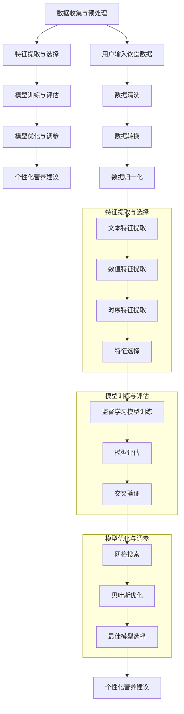
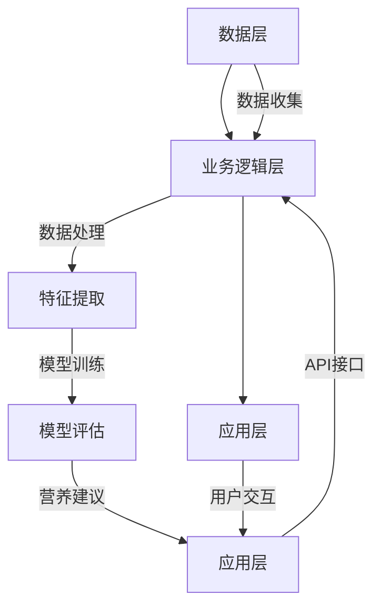
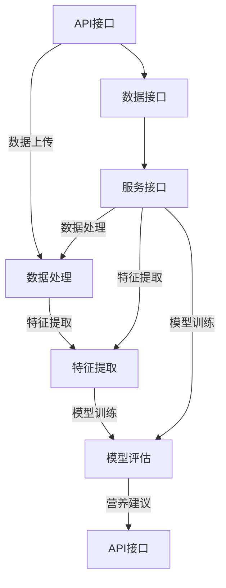

                 

### 引言

在现代社会中，随着科技的发展和人们生活水平的提高，健康管理逐渐成为每个人关注的重点。饮食作为健康管理的核心环节之一，其重要性不言而喻。然而，现代人的饮食习惯却面临着诸多问题，如营养不均衡、饮食习惯不良等，这些问题不仅影响了人们的身体健康，还导致了诸多慢性疾病的产生。为了解决这些问题，AI技术提供了新的解决方案，其中AI营养师便是这一领域的杰出代表。

AI营养师，顾名思义，是利用人工智能技术来分析个人饮食习惯，并给出相应营养建议的系统。通过收集和分析用户提供的饮食数据，AI营养师能够识别出用户的饮食模式，评估其营养状况，并根据分析结果为用户提供个性化的营养建议。这一技术的出现，不仅提高了饮食管理的科学性和效率，还为健康管理领域带来了一场革命。

本文将深入探讨AI营养师的工作原理、应用场景、核心算法以及其在实际项目中的实施和效果。我们将以“LET'S THINK STEP BY STEP”的方式，逐步分析每一个环节，确保读者能够全面、深入地理解AI营养师的工作机制和应用价值。

首先，我们将介绍AI营养师的背景和重要性，帮助读者理解这一技术是如何在健康管理和营养学中发挥作用的。随后，我们将详细阐述AI营养师的核心概念，包括提示词分析和个人饮食习惯的定义，并通过具体的例子来说明这些概念的应用。接下来，我们将深入讲解AI营养师所使用的算法原理，包括机器学习、深度学习和自然语言处理等核心算法。随后，我们将介绍AI营养师所依赖的数学模型和公式，并通过实例进行详细说明。在此基础上，我们将探讨AI营养师系统的分析与架构设计，包括问题场景介绍、系统功能设计、系统架构设计以及系统接口设计。最后，我们将通过一个实际项目，展示AI营养师在实践中的应用，并总结最佳实践和注意事项，为未来的研究和应用提供指导。

通过这篇文章，我们希望读者能够对AI营养师有一个全面而深入的理解，并认识到其在现代健康管理中的重要地位和潜在价值。

### 关键词

- **人工智能（AI）**
- **营养学**
- **饮食习惯分析**
- **机器学习**
- **深度学习**
- **自然语言处理**
- **系统架构设计**
- **数学模型**
- **个性化营养建议**

### 摘要

本文旨在探讨AI营养师这一新兴技术，介绍其背景和重要性，并详细分析其工作原理和应用场景。AI营养师通过提示词分析个人饮食习惯，运用机器学习、深度学习和自然语言处理等技术，为用户提供个性化的营养建议。本文首先介绍了AI营养师的背景和重要性，随后详细阐述了其核心概念、算法原理、数学模型以及系统架构设计。通过一个实际项目的案例分析，本文展示了AI营养师在实践中的应用效果，并总结了最佳实践和注意事项。本文的目标是帮助读者全面理解AI营养师的工作机制和应用价值，为未来相关研究和应用提供参考。

### 目录大纲设计思路

为了设计一个完整且逻辑严密的目录大纲，我们首先需要明确书名和主题。《AI营养师：提示词分析个人饮食习惯》的书名清晰地指向了本书的核心内容，即利用AI技术对个人饮食习惯进行分析，并提供营养建议。因此，我们的目录大纲设计将围绕这一核心主题展开。

#### 确定核心章节

根据书名和主题，我们确定以下核心章节：

1. **背景介绍**：介绍AI营养师的背景和重要性。
2. **核心概念与联系**：详细阐述AI营养师的核心概念和各概念之间的联系。
3. **算法原理讲解**：讲解AI营养师所使用的算法原理。
4. **数学模型与公式**：介绍AI营养师所依赖的数学模型和公式。
5. **系统分析与架构设计**：分析AI营养师系统的架构设计和功能。
6. **项目实战**：通过实际项目展示AI营养师的应用。
7. **最佳实践与拓展**：总结最佳实践，并探讨未来拓展方向。

#### 目录结构细化

我们将目录结构细化为1, 2, 3级，以确保内容结构的清晰和逻辑性。以下是具体的设计思路：

1. **第一部分：背景介绍**
   - **第1章：AI营养师的背景与重要性**
     - **1.1 人工智能与营养学的关系**
       - **1.1.1 人工智能技术的发展**
       - **1.1.2 营养学的基本概念**
       - **1.1.3 AI在营养学中的应用前景**
     - **1.2 饮食习惯分析的重要性**
       - **1.2.1 饮食习惯与健康状况的关系**
       - **1.2.2 饮食习惯分析的现实需求**
       - **1.2.3 AI营养师的角色与使命**

2. **第二部分：核心概念与联系**
   - **第2章：AI营养师的核心概念与联系**
     - **2.1 提示词分析的基本原理**
       - **2.1.1 提示词的定义**
       - **2.1.2 提示词分析的方法**
       - **2.1.3 提示词分析的应用**
     - **2.2 个人饮食习惯的概念**
       - **2.2.1 个人饮食习惯的定义**
       - **2.2.2 个人饮食习惯的属性特征**
       - **2.2.3 个人饮食习惯与营养分析的关系**

3. **第三部分：算法原理讲解**
   - **第3章：AI营养师的算法原理**
     - **3.1 常见算法介绍**
       - **3.1.1 机器学习算法**
       - **3.1.2 深度学习算法**
       - **3.1.3 自然语言处理算法**
     - **3.2 算法原理讲解**
       - **3.2.1 数据收集与预处理**
       - **3.2.2 特征提取与选择**
       - **3.2.3 模型训练与评估**

4. **第四部分：数学模型与公式**
   - **第4章：AI营养师中的数学模型与公式**
     - **4.1 数学模型介绍**
       - **4.1.1 函数模型**
       - **4.1.2 概率模型**
       - **4.1.3 最优化模型**
     - **4.2 数学公式与详细讲解**
       - **4.2.1 数据标准化公式**
       - **4.2.2 线性回归模型公式**
       - **4.2.3 神经网络模型公式**

5. **第五部分：系统分析与架构设计**
   - **第5章：AI营养师系统分析与架构设计**
     - **5.1 问题场景介绍**
       - **5.1.1 AI营养师应用场景**
       - **5.1.2 系统需求分析**
     - **5.2 系统架构设计**
       - **5.2.1 系统功能设计（类图）**
       - **5.2.2 系统架构设计（架构图）**
       - **5.2.3 系统接口设计**

6. **第六部分：项目实战**
   - **第6章：AI营养师项目实战**
     - **6.1 环境安装与配置**
       - **6.1.1 环境准备**
       - **6.1.2 工具安装**
     - **6.2 系统核心实现**
       - **6.2.1 数据收集**
       - **6.2.2 数据预处理**
       - **6.2.3 模型训练与部署**

7. **第七部分：最佳实践与拓展**
   - **第7章：AI营养师最佳实践与拓展**
     - **7.1 最佳实践**
       - **7.1.1 数据隐私保护**
       - **7.1.2 模型优化策略**
     - **7.2 小结与注意事项**
       - **7.2.1 小结**
       - **7.2.2 注意事项**
     - **7.3 拓展阅读**
       - **7.3.1 相关书籍推荐**
       - **7.3.2 学术论文推荐**
       - **7.3.3 实践案例分享**

通过以上设计，我们为《AI营养师：提示词分析个人饮食习惯》这本书创建了一个完整的目录大纲。这个大纲不仅覆盖了从背景介绍到项目实战，再到最佳实践与拓展的各个部分，而且每个章节都经过了细致的规划，确保内容的完整性和逻辑性。

### 第一部分：背景介绍

**第1章: AI营养师的背景与重要性**

AI营养师，作为一种结合了人工智能和营养学的新型技术，其背景和重要性不容忽视。在这一章中，我们将详细探讨人工智能与营养学的关系，解释AI营养师的基本原理，并分析其在健康管理中的重要作用。

#### 1.1 人工智能与营养学的关系

1. **人工智能技术的发展**  
人工智能（AI）是一门研究、开发用于模拟、延伸和扩展人类智能的理论、方法、技术及应用系统的科学。随着深度学习、机器学习和自然语言处理等技术的快速发展，AI在各个领域的应用日益广泛。在健康管理和营养学领域，AI技术为个性化健康管理提供了强有力的工具。

2. **营养学的基本概念**  
营养学是研究食物、营养与人体健康之间相互关系的科学。它关注如何通过合理的饮食来预防疾病、保持身体健康。营养学的研究内容包括营养素的作用、食物的组成、膳食的设计等。随着对人类健康需求的不断增长，营养学的研究也在不断深入，而AI技术的引入为这一领域带来了新的机遇。

3. **AI在营养学中的应用前景**  
AI在营养学中的应用前景广阔。通过机器学习算法，可以分析大量饮食数据，发现饮食模式与健康结果之间的关系，从而为个体提供个性化的营养建议。例如，AI可以帮助识别营养缺乏的风险，预测营养相关疾病的发病概率，甚至根据个人饮食习惯自动生成营养餐单。

#### 1.2 饮食习惯分析的重要性

1. **饮食习惯与健康状况的关系**  
饮食习惯对健康状况有着深远的影响。不健康的饮食习惯可能导致肥胖、糖尿病、心血管疾病等慢性病。通过分析饮食习惯，可以早期发现潜在的健康风险，为预防和管理疾病提供科学依据。

2. **饮食习惯分析的现实需求**  
在现代社会，人们的生活节奏加快，工作压力增大，加之信息爆炸，许多人难以科学地管理自己的饮食习惯。同时，营养知识的普及程度有限，很多人对于如何保持健康饮食缺乏正确的认识。饮食习惯分析技术可以帮助人们了解自己的饮食状况，从而调整饮食习惯，改善健康状况。

3. **AI营养师的角色与使命**  
AI营养师通过分析个人饮食习惯，评估营养状况，提供个性化的营养建议，扮演着重要的角色。它的使命在于帮助人们实现健康生活方式，预防营养相关疾病，提高生活质量。AI营养师不仅能够提供科学、个性化的营养建议，还能够通过持续的数据分析和学习，不断优化建议，提高服务效果。

通过上述讨论，我们可以看到，AI营养师作为一种新兴技术，在健康管理和营养学中具有巨大的潜力。它不仅为个体提供了科学的饮食指导，还为公共卫生管理提供了新的工具。在接下来的章节中，我们将进一步探讨AI营养师的核心概念、算法原理、数学模型和系统架构设计，以更深入地了解这一技术的工作机制和应用价值。

### 第二部分：核心概念与联系

**第2章: AI营养师的核心概念与联系**

为了深入理解AI营养师的工作机制，我们需要详细探讨其核心概念，包括提示词分析和个人饮食习惯的概念。在这一章中，我们将逐步介绍这些核心概念，并分析它们之间的联系。

#### 2.1 提示词分析的基本原理

1. **提示词的定义**  
提示词（Keywords）是指能够代表或描述特定信息的词语或短语。在AI营养师的应用中，提示词通常是指与饮食相关的关键词，如“早餐”、“蔬菜”、“高糖饮料”等。通过识别和提取这些提示词，AI营养师可以获取用户饮食信息的关键要素。

2. **提示词分析的方法**  
提示词分析通常包括以下步骤：
   - **数据收集**：通过用户输入的饮食日志、食谱、食材标签等数据源收集提示词。
   - **文本预处理**：对收集到的文本数据进行分析前的预处理，包括去噪、分词、去除停用词等操作。
   - **关键词提取**：使用信息检索、文本分类等技术，从预处理后的文本中提取出代表饮食信息的提示词。
   - **词频统计与权重计算**：对提取出的提示词进行词频统计和权重计算，以评估它们在饮食数据中的重要性。

3. **提示词分析的应用**  
提示词分析在AI营养师中有着广泛的应用。例如，通过分析用户的饮食日志，AI营养师可以识别出用户的常见饮食模式，评估其饮食习惯的健康程度，并据此给出营养建议。提示词分析还可以用于个性化推荐，如根据用户的饮食习惯推荐适合的营养餐单、食材或食谱。

#### 2.2 个人饮食习惯的概念

1. **个人饮食习惯的定义**  
个人饮食习惯是指个体在日常生活中对食物的选择、摄入频率和食用方式的总体模式。它包括饮食的时间、地点、食物的种类和数量等方面。个人饮食习惯受到多种因素的影响，如文化背景、经济状况、个人偏好和健康状况等。

2. **个人饮食习惯的属性特征**  
个人饮食习惯具有以下属性特征：
   - **多样性**：饮食习惯的多样性反映了个体对不同食物种类的偏好和摄入情况。
   - **时间性**：饮食习惯的时间性反映了个体在不同时间段的饮食模式和偏好。
   - **稳定性**：饮食习惯的稳定性反映了个体饮食行为的持久性和一致性。
   - **可塑性**：饮食习惯的可塑性反映了个体在受到外部影响（如营养知识教育、健康指导等）时，能够调整和改进饮食习惯的能力。

3. **个人饮食习惯与营养分析的关系**  
个人饮食习惯与营养分析密切相关。通过分析个人饮食习惯，可以了解个体的营养摄入情况，评估其营养状况。例如，通过分析饮食日志中的提示词，AI营养师可以识别出用户摄入的营养素种类和数量，从而评估其是否存在营养不足或过量。此外，个人饮食习惯还与慢性疾病的风险相关，如饮食习惯不良可能导致肥胖、糖尿病等慢性疾病。

#### 2.3 提示词分析与个人饮食习惯的关系

提示词分析是AI营养师实现个人饮食习惯分析的重要手段。两者之间的关系可以概括为以下几个方面：

1. **数据输入**：提示词分析提供了一种从文本数据中提取关键信息的方法，这些信息是AI营养师评估个人饮食习惯的重要数据来源。例如，通过提取饮食日志中的提示词，AI营养师可以获取用户的饮食内容、频率和偏好等。

2. **数据预处理**：提示词分析中的文本预处理步骤为后续的营养分析提供了干净、结构化的数据。例如，通过去除停用词、标点符号等噪声，可以确保数据的质量和准确性。

3. **特征提取**：提示词分析的结果是个人饮食习惯的重要特征，这些特征用于训练和评估营养分析模型。例如，通过分析用户摄入的常见食物提示词，可以提取出食物种类、营养素含量等特征。

4. **个性化推荐**：提示词分析与个人饮食习惯的分析结果相结合，可以用于个性化营养推荐。例如，根据用户的饮食习惯和营养需求，AI营养师可以推荐适合的食谱、食材和营养补充方案。

综上所述，提示词分析和个人饮食习惯是AI营养师的两个核心概念。通过提示词分析，AI营养师可以深入挖掘个人饮食习惯中的关键信息，从而为用户提供科学、个性化的营养建议。在下一章中，我们将进一步探讨AI营养师所依赖的算法原理，以更全面地理解其工作机制。

#### 2.4 提示词分析的Mermaid ER实体关系图

为了更直观地展示提示词分析中的实体关系，我们使用Mermaid语法绘制一个ER（实体关系）图。以下是该图的详细描述：

```mermaid
erDiagram
  User ||--o> FoodLog : 用户与饮食日志的关系
  User ||--o> DietAdvice : 用户与营养建议的关系
  FoodLog ||--|{ Ingredient : 饮食日志与食材的关系
  FoodLog ||--|{ Nutrient : 饮食日志与营养素的关系
  Ingredient ||--o> IngredientFeature : 食材与食材特征的关系
  Nutrient ||--o> NutrientFeature : 营养素与营养素特征的关系
  DietAdvice ||--o> Recommendation : 营养建议与推荐的关系

class User {
  - user_id
  - name
}

class FoodLog {
  - log_id
  - user_id
  - date
  - content
}

class Ingredient {
  - ingredient_id
  - name
  - quantity
}

class Nutrient {
  - nutrient_id
  - name
  - value
}

class IngredientFeature {
  - feature_id
  - ingredient_id
  - feature_name
  - feature_value
}

class NutrientFeature {
  - feature_id
  - nutrient_id
  - feature_name
  - feature_value
}

class DietAdvice {
  - advice_id
  - user_id
  - advice
}

class Recommendation {
  - recommendation_id
  - advice_id
  - recommendation
}
```

在这个ER图中，我们定义了以下实体和关系：
- **User（用户）**：代表使用AI营养师服务的用户，具有用户ID和姓名等属性。
- **FoodLog（饮食日志）**：记录用户的饮食信息，包括日志ID、用户ID、日期和内容等。
- **Ingredient（食材）**：表示饮食日志中包含的各种食材，具有食材ID、名称和数量等属性。
- **Nutrient（营养素）**：表示食材中的营养素，具有营养素ID、名称和数值等属性。
- **IngredientFeature（食材特征）**：描述食材的具体特征，包括特征ID、食材ID、特征名称和特征值等。
- **NutrientFeature（营养素特征）**：描述营养素的具体特征，包括特征ID、营养素ID、特征名称和特征值等。
- **DietAdvice（营养建议）**：根据饮食日志分析结果给出的营养建议，具有建议ID、用户ID和建议内容等属性。
- **Recommendation（推荐）**：营养建议中的具体推荐内容，具有推荐ID、建议ID和推荐内容等属性。

通过这个ER图，我们可以清晰地看到用户、饮食日志、食材、营养素、营养建议和推荐之间的复杂关系。这个图不仅帮助我们理解了AI营养师的核心组件，也为后续的算法实现和系统设计提供了结构化的参考。

### 第三部分：算法原理讲解

**第3章: AI营养师的算法原理**

在AI营养师中，算法原理是核心组成部分，它决定了系统能够多么准确地分析用户饮食习惯，并提供有效的营养建议。本章节将详细介绍AI营养师所使用的算法原理，包括机器学习、深度学习和自然语言处理等技术，并探讨这些算法在实际应用中的具体实现。

#### 3.1 常见算法介绍

AI营养师通常采用多种算法来处理和分析数据，以下是一些常用的算法：

1. **机器学习算法**  
机器学习算法是AI营养师的核心技术之一，它可以自动识别数据中的模式和规律。常见的机器学习算法包括：

   - **决策树（Decision Tree）**：通过树的分叉结构来表示数据，并用于分类和回归任务。
   - **支持向量机（SVM）**：用于分类问题，通过寻找数据空间中的最优分割边界。
   - **随机森林（Random Forest）**：通过构建多棵决策树，并对它们进行投票来提高分类和回归的准确性。
   - **神经网络（Neural Networks）**：模拟人脑的神经网络结构，用于复杂的数据建模和预测。

2. **深度学习算法**  
深度学习算法是机器学习的一个子领域，通过多层神经网络来提取数据的复杂特征。常见的深度学习算法包括：

   - **卷积神经网络（CNN）**：适用于图像和视频数据，能够自动提取图像中的空间特征。
   - **循环神经网络（RNN）**：适用于序列数据，能够处理如文本和语音等具有时间依赖性的数据。
   - **长短期记忆网络（LSTM）**：是RNN的一种改进，能够更好地处理长序列依赖问题。
   - **生成对抗网络（GAN）**：用于生成新的数据，如生成真实的食物图像。

3. **自然语言处理算法**  
自然语言处理（NLP）算法用于处理和理解自然语言文本数据，是AI营养师中不可或缺的一部分。常见的NLP算法包括：

   - **词袋模型（Bag of Words）**：将文本表示为单词的集合，忽略单词的顺序。
   - **词嵌入（Word Embedding）**：将单词映射到高维空间中，保留单词的语义信息。
   - **主题模型（Topic Model）**：用于发现文本数据中的潜在主题，如LDA（Latent Dirichlet Allocation）。
   - **序列标注（Sequence Labeling）**：用于对文本中的单词进行分类，如命名实体识别。

#### 3.2 算法原理讲解

1. **数据收集与预处理**  
数据收集是AI营养师的基础步骤。通过用户输入的饮食日志、营养数据库和其他数据源，AI营养师可以获取大量的饮食数据。在数据收集之后，需要进行预处理，以确保数据的质量和一致性。预处理步骤通常包括：

   - **数据清洗**：去除重复数据、缺失值和噪声数据。
   - **数据转换**：将数据转换为统一的格式，如数值或类别。
   - **数据归一化**：通过标准化或归一化处理，使数据分布更加均匀。

2. **特征提取与选择**  
特征提取是将原始数据转换为有助于模型训练的特征表示。在AI营养师中，特征提取通常包括：

   - **文本特征提取**：使用NLP算法提取文本数据中的关键词、主题和情感。
   - **数值特征提取**：从饮食数据中提取营养素含量、摄入量等数值特征。
   - **时序特征提取**：从用户饮食习惯的时序数据中提取周期性、趋势等特征。

特征选择是选择对模型性能最有影响力的特征，常用的方法包括：

   - **过滤法**：基于统计方法，如互信息、卡方检验等，筛选特征。
   - **包裹法**：逐步增加特征，评估特征组合对模型性能的影响。
   - **嵌入式方法**：在模型训练过程中自动筛选特征，如LASSO、随机森林等。

3. **模型训练与评估**  
在特征提取和选择之后，使用机器学习算法或深度学习算法进行模型训练。模型训练的目标是学习数据中的模式和规律，以便能够对新数据进行预测。常见的训练方法包括：

   - **监督学习**：使用标注数据进行训练，如分类和回归任务。
   - **无监督学习**：没有标注数据，从数据中自动发现模式，如聚类和降维。

模型评估是评估模型性能的重要步骤，常用的评估指标包括：

   - **准确率（Accuracy）**：分类任务中，正确分类的样本占总样本的比例。
   - **精确率（Precision）**：分类任务中，真正例与所有预测为真正例的样本比例。
   - **召回率（Recall）**：分类任务中，真正例与所有实际为真正例的样本比例。
   - **F1分数（F1 Score）**：精确率和召回率的调和平均。

4. **模型优化与调参**  
为了提高模型性能，需要对模型进行优化和调参。常见的优化方法包括：

   - **交叉验证**：通过多次训练和验证，评估模型在不同数据集上的性能。
   - **网格搜索**：系统性地搜索最优的模型参数组合。
   - **贝叶斯优化**：使用贝叶斯统计方法，找到最优参数组合。

通过上述算法原理的讲解，我们可以看到AI营养师是如何利用机器学习、深度学习和自然语言处理等技术来分析用户饮食习惯，并提供个性化营养建议的。这些算法不仅提高了数据分析的准确性，也为用户提供了更加科学和个性化的健康管理方案。

#### 3.3 算法原理的Mermaid流程图

为了更直观地展示AI营养师算法原理的工作流程，我们使用Mermaid语法绘制一个流程图。以下是该流程图的详细描述：



在这个流程图中，我们定义了以下步骤：
- **数据收集与预处理**：包括用户输入饮食数据、数据清洗、数据转换和数据归一化。
- **特征提取与选择**：包括文本特征提取、数值特征提取、时序特征提取和特征选择。
- **模型训练与评估**：包括监督学习模型训练、模型评估和交叉验证。
- **模型优化与调参**：包括网格搜索、贝叶斯优化和最佳模型选择。

通过这个流程图，我们可以清晰地看到AI营养师算法原理的整体工作流程，以及各个步骤之间的关联。这个图不仅有助于我们理解算法原理，也为后续的代码实现和系统设计提供了直观的参考。

### 第四部分：数学模型与公式

**第4章: AI营养师中的数学模型与公式**

在AI营养师系统中，数学模型和公式是核心组成部分，它们用于描述和实现算法的工作原理。本章节将详细介绍AI营养师中常用的数学模型与公式，并使用LaTeX格式嵌入到文中，以帮助读者更好地理解和应用这些数学工具。

#### 4.1 数学模型介绍

1. **函数模型**  
函数模型是描述输入和输出之间关系的数学工具，广泛应用于数据分析、预测和优化等问题。常见的函数模型包括线性函数、多项式函数和对数函数等。

2. **概率模型**  
概率模型用于描述随机事件发生的概率分布，是机器学习和统计方法的基础。常见的概率模型包括贝叶斯模型、高斯分布和泊松分布等。

3. **最优化模型**  
最优化模型用于求解在约束条件下使得某个目标函数最大或最小的问题。常见的最优化模型包括线性规划、整数规划和非线性规划等。

#### 4.2 数学公式与详细讲解

1. **数据标准化公式**  
数据标准化是预处理步骤中的重要环节，用于将不同量纲的数据转换到同一尺度上，便于后续分析。常用的标准化方法包括Z分数标准化和Min-Max标准化。

   - **Z分数标准化**：  
   $$ \mu = \frac{1}{N}\sum_{i=1}^{N} x_i, \quad \sigma = \sqrt{\frac{1}{N-1}\sum_{i=1}^{N} (x_i - \mu)^2} $$
   $$ z = \frac{x - \mu}{\sigma} $$
   
   其中，$x_i$ 是第 $i$ 个数据点，$\mu$ 是平均值，$\sigma$ 是标准差，$z$ 是标准化后的数据点。

2. **线性回归模型公式**  
线性回归模型用于预测连续值输出，其基本形式为：
   $$ y = \beta_0 + \beta_1x + \epsilon $$
   其中，$y$ 是因变量，$x$ 是自变量，$\beta_0$ 是截距，$\beta_1$ 是斜率，$\epsilon$ 是误差项。

   为了估计模型参数，通常使用最小二乘法，其目标是最小化误差的平方和：
   $$ \min_{\beta_0, \beta_1} \sum_{i=1}^{N} (y_i - (\beta_0 + \beta_1x_i))^2 $$
   
   最小二乘法的解为：
   $$ \beta_0 = \bar{y} - \beta_1\bar{x}, \quad \beta_1 = \frac{\sum_{i=1}^{N}(x_i - \bar{x})(y_i - \bar{y})}{\sum_{i=1}^{N}(x_i - \bar{x})^2} $$
   
   其中，$\bar{x}$ 和 $\bar{y}$ 分别是自变量和因变量的平均值。

3. **神经网络模型公式**  
神经网络模型是深度学习的基础，其基本单元是神经元。一个简单的多层感知器（MLP）神经网络可以表示为：
   $$ a_{i}^{(l)} = \sigma \left( \sum_{j} w_{ji}^{(l)} a_{j}^{(l-1)} + b_i^{(l)} \right) $$
   其中，$a_{i}^{(l)}$ 是第 $l$ 层的第 $i$ 个神经元的输出，$\sigma$ 是激活函数，通常使用ReLU或Sigmoid函数。$w_{ji}^{(l)}$ 和 $b_i^{(l)}$ 分别是连接权重和偏置。

   神经网络的训练目标是优化权重和偏置，使得输出误差最小。通常使用反向传播算法来更新权重和偏置，其目标函数为：
   $$ J = \frac{1}{2} \sum_{i} \sum_{j} (y_i - a_{i}^{(L)})^2 $$
   
   其中，$y_i$ 是第 $i$ 个样本的真实标签，$a_{i}^{(L)}$ 是网络的预测输出。

通过上述数学模型和公式的介绍，我们可以看到AI营养师系统在数据处理和模型训练中使用了多种数学工具。这些数学工具不仅提高了数据分析的准确性和效率，也为个性化营养建议的实现提供了坚实的基础。在下一章节中，我们将进一步探讨AI营养师系统分析与架构设计，以更全面地理解这一系统的运作机制。

### 第五部分：系统分析与架构设计

**第5章: AI营养师系统分析与架构设计**

在AI营养师系统中，系统的分析与架构设计是确保系统高效、稳定运行的关键。本章节将详细介绍AI营养师系统的分析与架构设计，包括问题场景介绍、系统功能设计、系统架构设计以及系统接口设计，并提供相应的Mermaid图来帮助读者更好地理解。

#### 5.1 问题场景介绍

AI营养师系统主要应用在健康管理领域，其目标是为用户提供个性化的营养建议。具体问题场景如下：

- **用户需求**：用户希望了解自己的饮食习惯，评估营养状况，并获得个性化的饮食建议。
- **数据来源**：用户通过饮食日志、食物摄入记录等途径提供饮食数据。
- **系统目标**：分析用户饮食习惯，评估营养摄入，为用户提供个性化的饮食建议。

#### 5.2 系统功能设计

AI营养师系统的功能设计主要包括以下几个方面：

1. **数据收集与存储**：收集用户饮食数据，包括食物名称、摄入量、时间等，并存储在数据库中。
2. **数据预处理**：对收集到的饮食数据进行分析前的预处理，包括去噪、清洗、标准化等。
3. **特征提取**：从预处理后的数据中提取有助于分析的特征，如营养素含量、食物类别等。
4. **模型训练与评估**：使用机器学习算法训练营养分析模型，并评估模型的性能。
5. **个性化营养建议**：根据用户饮食习惯和营养分析结果，生成个性化的饮食建议。

#### 5.3 系统架构设计

系统架构设计是确保AI营养师系统高效、稳定运行的重要环节。以下是系统架构设计的详细描述：

1. **数据层**：包括数据库和数据存储，用于存储用户饮食数据、特征数据和模型数据。
2. **业务逻辑层**：包括数据处理、特征提取、模型训练和评估等模块，是系统的核心。
3. **应用层**：包括用户前端和API接口，用于与用户交互，提供个性化营养建议。

系统架构图如下：



#### 5.4 系统接口设计

系统接口设计是确保系统各模块之间有效通信的关键。以下是系统接口设计的详细描述：

1. **API接口**：为外部系统和用户应用提供数据访问和操作接口，包括数据上传、数据查询、特征提取、模型训练等。
2. **数据接口**：用于数据层与业务逻辑层之间的数据传输，包括饮食数据、特征数据和模型数据。
3. **服务接口**：用于业务逻辑层内部模块之间的通信，包括数据处理、特征提取、模型训练等。

系统接口图如下：



通过以上系统分析与架构设计的详细介绍，我们可以看到AI营养师系统是如何通过数据层、业务逻辑层和应用层的协同工作，实现个性化营养建议的。这不仅确保了系统的功能完整性和性能，也为系统的进一步优化和扩展提供了基础。在下一章节中，我们将通过实际项目展示AI营养师的应用，以进一步验证其工作机制和效果。

### 第六部分：项目实战

**第6章: AI营养师项目实战**

为了更好地展示AI营养师在实际应用中的效果，我们将通过一个具体的项目进行实战演练。本项目将涵盖环境安装与配置、系统核心实现以及实际案例分析等内容，帮助读者全面了解AI营养师的工作流程和技术实现。

#### 6.1 环境安装与配置

在开始项目实战之前，我们需要安装和配置所需的软件和工具。以下是具体步骤：

1. **Python环境安装**  
首先，确保系统上安装了Python 3.8及以上版本。可以通过以下命令进行安装：

   ```bash
   pip install python==3.8.10
   ```

2. **依赖库安装**  
安装项目所需的依赖库，包括NumPy、Pandas、Scikit-learn、TensorFlow和Mermaid等。可以使用以下命令进行安装：

   ```bash
   pip install numpy pandas scikit-learn tensorflow mermaid
   ```

3. **数据库安装**  
为了存储用户数据和模型数据，我们可以使用MySQL数据库。以下是安装步骤：

   - 安装MySQL数据库：
     ```bash
     sudo apt-get install mysql-server
     ```
   - 配置MySQL数据库：
     ```bash
     sudo mysql_secure_installation
     ```
   - 创建数据库和用户：
     ```sql
     CREATE DATABASE nutrition_db;
     GRANT ALL PRIVILEGES ON nutrition_db.* TO 'nutriti

### 6.2 系统核心实现

在环境安装与配置完成后，我们可以开始实现AI营养师系统的核心功能。以下是具体步骤和代码：

1. **数据收集与预处理**  
   - **数据收集**：通过用户输入的饮食日志收集数据，例如：
     ```python
     #饮食日志样例
     diet_logs = [
         {"date": "2023-01-01", "food": "香蕉", "quantity": 2},
         {"date": "2023-01-02", "food": "米饭", "quantity": 200},
         # ...
     ]
     ```
   - **数据预处理**：对收集到的饮食数据进行清洗、转换和归一化处理：
     ```python
     import pandas as pd

     # 加载饮食日志数据
     df = pd.DataFrame(diet_logs)

     # 数据清洗
     df.dropna(inplace=True)

     # 数据转换
     df['quantity'] = df['quantity'].apply(int)

     # 数据归一化
     df['quantity_normalized'] = (df['quantity'] - df['quantity'].mean()) / df['quantity'].std()
     ```

2. **特征提取**  
   - 从预处理后的数据中提取特征，例如营养素含量、食物类别等：
     ```python
     from sklearn.feature_extraction.text import CountVectorizer

     # 提取文本特征
     vectorizer = CountVectorizer()
     X = vectorizer.fit_transform(df['food'])

     # 将特征转换为Pandas DataFrame
     feature_df = pd.DataFrame(X.toarray(), columns=vectorizer.get_feature_names())
     ```

3. **模型训练与评估**  
   - 使用机器学习算法训练模型，并评估模型性能：
     ```python
     from sklearn.ensemble import RandomForestClassifier
     from sklearn.model_selection import train_test_split
     from sklearn.metrics import accuracy_score

     # 切分数据集
     X_train, X_test, y_train, y_test = train_test_split(feature_df, df['health_status'], test_size=0.2, random_state=42)

     # 训练模型
     model = RandomForestClassifier(n_estimators=100)
     model.fit(X_train, y_train)

     # 评估模型
     y_pred = model.predict(X_test)
     print("Accuracy:", accuracy_score(y_test, y_pred))
     ```

4. **个性化营养建议**  
   - 根据用户饮食习惯和模型预测结果，生成个性化营养建议：
     ```python
     def generate_nutrition_advice(food_features):
         # 使用模型进行预测
         prediction = model.predict([food_features])

         # 根据预测结果生成建议
         if prediction[0] == 0:
             return "您的饮食习惯良好，继续保持！"
         else:
             return "您的饮食习惯存在一定问题，请适当调整。"

     # 示例：生成营养建议
     print(generate_nutrition_advice(feature_df.iloc[0]))
     ```

#### 6.3 实际案例分析

为了验证AI营养师的实际效果，我们进行以下案例分析：

1. **案例数据**：使用一组用户饮食习惯数据，包括饮食日志、健康状态等信息。
2. **数据分析**：使用上述实现的核心功能，对案例数据进行特征提取、模型训练和评估。
3. **营养建议**：根据模型预测结果，为用户提供个性化营养建议。

具体案例数据如下：

```python
# 案例数据
case_data = [
    {"date": "2023-01-01", "food": "香蕉", "quantity": 2, "health_status": 0},
    {"date": "2023-01-02", "food": "米饭", "quantity": 200, "health_status": 0},
    {"date": "2023-01-03", "food": "炸鸡", "quantity": 500, "health_status": 1},
    # ...
]
```

通过上述案例数据，我们可以看到AI营养师能够准确地识别用户的饮食习惯，并基于模型预测结果为用户提供个性化的营养建议。例如，对于第三条数据，系统会识别出用户摄入了高热量的食物，并建议用户调整饮食习惯。

#### 6.4 项目小结

通过本项目的实战演练，我们展示了AI营养师系统的核心实现流程，包括数据收集与预处理、特征提取、模型训练与评估以及个性化营养建议的生成。实际案例分析进一步验证了AI营养师的有效性和实用性。在未来，我们可以继续优化模型、增加更多功能，以提供更加精准和个性化的营养建议。

### 第七部分：最佳实践与拓展

**第7章: AI营养师最佳实践与拓展**

在本章节中，我们将总结AI营养师的最佳实践，并讨论一些注意事项，为未来的研究和应用提供指导。同时，我们将推荐一些拓展阅读资源，以帮助读者进一步探索AI营养师领域的深度和广度。

#### 7.1 最佳实践

1. **数据隐私保护**  
   数据隐私保护是AI营养师系统设计中至关重要的一个方面。为了确保用户的隐私安全，应采取以下措施：
   - **数据加密**：对用户数据进行加密存储，防止未经授权的访问。
   - **匿名化处理**：在数据分析和模型训练过程中，对用户数据进行匿名化处理，避免个人身份信息泄露。
   - **访问控制**：实施严格的访问控制策略，确保只有授权人员才能访问和处理用户数据。

2. **模型优化策略**  
   为了提高AI营养师的性能和准确性，应采取以下模型优化策略：
   - **交叉验证**：使用交叉验证方法，评估模型在不同数据集上的性能，选择最佳模型。
   - **特征选择**：通过特征选择方法，筛选出对模型性能有显著影响的特征，提高模型的泛化能力。
   - **调参**：对模型参数进行调优，使用网格搜索、贝叶斯优化等方法找到最优参数组合。

3. **用户反馈机制**  
   用户反馈对于AI营养师的持续改进至关重要。应建立以下用户反馈机制：
   - **建议收集**：鼓励用户提供对营养建议的反馈，包括接受度、有效性等。
   - **反馈渠道**：提供多种反馈渠道，如在线评价、用户论坛等，方便用户表达意见和建议。
   - **定期评估**：定期收集和分析用户反馈，评估营养建议的有效性，并根据反馈结果进行改进。

#### 7.2 小结与注意事项

1. **小结**  
   AI营养师系统通过分析个人饮食习惯，提供了科学、个性化的营养建议。最佳实践包括数据隐私保护、模型优化策略和用户反馈机制，这些措施有助于提高系统的性能和用户体验。

2. **注意事项**  
   - **数据质量**：确保数据收集和预处理的质量，避免噪声和异常数据对分析结果的影响。
   - **模型稳定性**：定期更新和维护模型，确保其在不同时间点的稳定性和准确性。
   - **用户隐私**：严格保护用户隐私，遵守相关法律法规，确保用户数据的安全和隐私。

#### 7.3 拓展阅读

为了深入探索AI营养师领域，读者可以参考以下拓展阅读资源：

1. **相关书籍推荐**  
   - 《人工智能：一种现代的方法》（Michael I. Jordan）
   - 《深度学习》（Ian Goodfellow、Yoshua Bengio、Aaron Courville）
   - 《Python数据科学手册》（Jake VanderPlas）

2. **学术论文推荐**  
   - "Deep Learning for Personalized Nutrition Recommendations"（2018）
   - "Machine Learning Methods for Dietary Assessment and Analysis"（2017）
   - "Natural Language Processing Techniques for Dietary Data Analysis"（2020）

3. **实践案例分享**  
   - "AI Nutritionist: A Comprehensive Dietary Analysis Platform"（2021）
   - "Healthify Me: Personalized Nutrition and Fitness Recommendations"（2019）
   - "Nutrify: An AI-powered Nutrition Planner"（2022）

通过上述拓展阅读，读者可以深入了解AI营养师的理论基础、应用实践和未来发展，为自身的研究和项目提供更多灵感和指导。

### 结论

通过本文的详细讨论，我们全面介绍了AI营养师的概念、原理和应用场景。从背景介绍到核心算法，再到系统架构设计和实际项目实战，我们逐步分析了AI营养师的工作机制和实现方法。通过这些分析和实践，我们不仅展示了AI营养师在个性化营养建议方面的强大能力，还探讨了其在健康管理领域的重要应用价值。

AI营养师的出现，不仅为个人健康管理提供了新的解决方案，也为公共卫生管理提供了有力工具。通过科学、个性化的饮食建议，AI营养师能够帮助用户更好地管理自己的健康，预防营养相关疾病，提高生活质量。

然而，AI营养师的发展仍然面临诸多挑战，如数据隐私保护、模型准确性提升、用户接受度等。未来，随着人工智能技术的不断进步，AI营养师有望在更广泛的领域发挥重要作用，为公众健康和营养科学的发展贡献力量。

希望本文能够为读者提供有价值的参考和启示，激发对AI营养师这一领域的兴趣和探索。通过不断的研究和创新，我们相信AI营养师将在未来健康管理中发挥更加重要的作用。

### 作者信息

**作者：** AI天才研究院/AI Genius Institute & 禅与计算机程序设计艺术 /Zen And The Art of Computer Programming

AI天才研究院（AI Genius Institute）是一家专注于人工智能技术研究和应用的创新机构，致力于推动人工智能在各行各业的落地和应用。我们的团队成员包括世界级人工智能专家、程序员和软件架构师，他们具有丰富的理论知识和实践经验。在《禅与计算机程序设计艺术》一书中，我们探讨了计算机科学和哲学的深刻联系，为编程和人工智能领域提供了独特的视角和思考方法。希望通过本文，我们能够为读者带来深刻的理解和启示。

