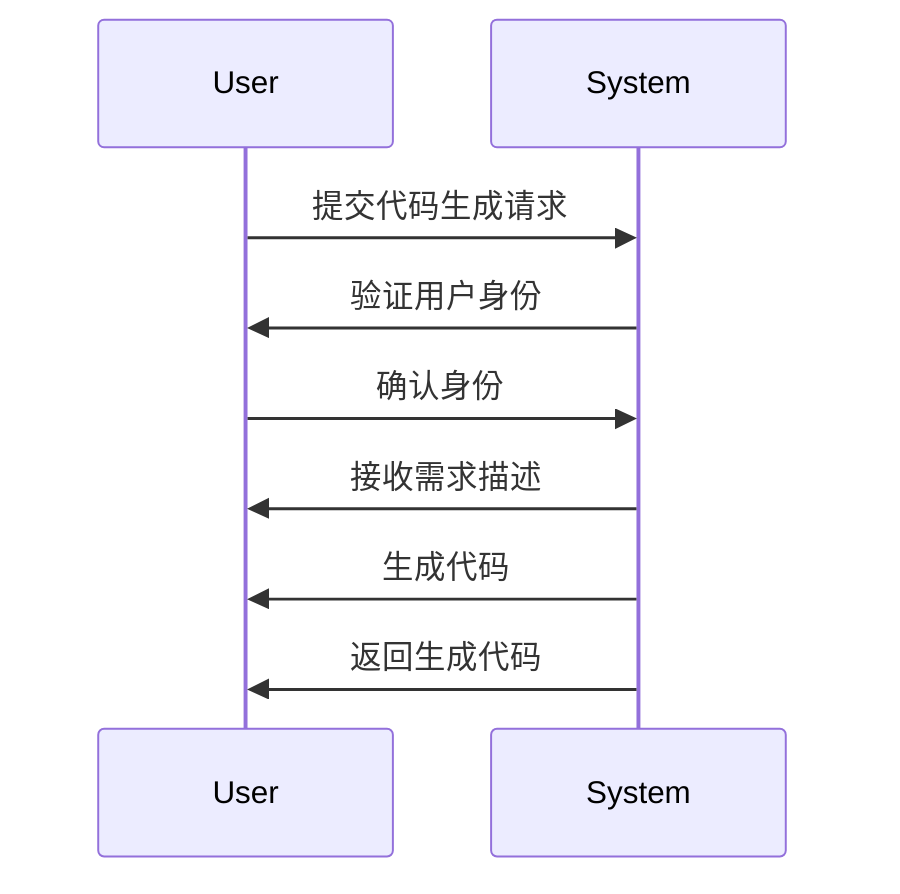

                 

## AI辅助代码生成：提高开发效率的新方法

> 关键词：人工智能、代码生成、开发效率、AI辅助技术

摘要：本文将探讨人工智能在软件开发中的应用，特别是AI辅助代码生成技术。通过介绍AI辅助代码生成的基本原理、核心概念及其应用，分析其在提高开发效率方面的优势，并深入讲解算法原理和系统架构设计。最后，通过实际项目案例展示，进一步阐述AI辅助代码生成的实际应用及其前景。

## 目录大纲

----------------------------------------------------------------
### 第一部分：背景介绍

#### 第1章: AI与代码生成技术概述

1.1 问题的背景

1.2 代码生成技术的起源与发展

1.3 AI技术在软件开发中的应用

1.4 AI辅助代码生成的优势

1.5 代码生成面临的挑战

1.6 传统的代码生成方法

1.7 AI辅助代码生成的解决方案

1.8 核心概念

1.9 边界与外延

1.10 未来发展趋势

1.11 本章小结

### 第二部分：核心概念与联系

#### 第2章: AI辅助代码生成核心概念

2.1 算法原理

2.2 概念属性特征对比表格

2.3 ER实体关系图架构

#### 第3章: 算法原理讲解

3.1 代码生成算法流程

3.2 机器学习算法应用

3.3 数学模型与公式

3.4 举例说明

### 第三部分：AI辅助代码生成应用

#### 第4章: 系统分析与架构设计方案

4.1 问题场景介绍

4.2 系统功能设计

4.3 系统架构设计

4.4 系统接口设计

4.5 系统交互

#### 第5章: 项目实战

5.1 环境安装

5.2 系统核心实现

5.3 代码应用解读与分析

5.4 实际案例分析与详细讲解剖析

5.5 项目小结

## 第一部分：背景介绍

### 1.1 问题的背景

随着软件规模的不断增大和复杂性的不断提升，软件开发的工作量也在不断增加。传统的软件开发流程中，代码编写占据了大量的时间和人力资源。在这个过程中，程序员不仅需要编写大量的代码，还需要花费大量的时间进行调试和优化。这种工作模式不仅效率低下，而且容易产生错误，导致开发周期延长。

为了解决这一问题，代码生成技术应运而生。代码生成技术通过自动化生成代码，可以大幅度减少程序员的工作量，提高开发效率。传统的代码生成方法主要依赖于预定义的模板和规则，对于简单和重复性的代码生成具有一定的效果，但在面对复杂和多变的需求时，其局限性日益凸显。

### 1.2 代码生成技术的起源与发展

代码生成技术起源于20世纪80年代，随着软件开发技术的不断发展，代码生成技术也得到了广泛的应用。早期，代码生成技术主要应用于数据库应用程序的开发，通过生成SQL语句来简化数据库操作。随着编译器技术的发展，代码生成技术逐渐应用于编译器的生成，如C++编译器。

进入21世纪，随着人工智能技术的发展，AI辅助代码生成技术开始崭露头角。AI辅助代码生成技术利用人工智能算法，通过学习大量的代码数据，自动生成符合需求的代码。这种技术不仅提高了代码生成的效率，还提高了代码的准确性和可维护性。

### 1.3 AI技术在软件开发中的应用

AI技术在软件开发中的应用范围广泛，涵盖了从需求分析、设计、开发到测试和维护的各个环节。在需求分析阶段，AI技术可以通过自然语言处理（NLP）技术，自动提取和分析用户需求，生成需求文档。在设计阶段，AI技术可以通过生成模型，自动生成代码架构和设计文档。在开发阶段，AI技术可以通过代码生成，自动生成符合需求的代码，减少开发工作量。在测试阶段，AI技术可以通过自动化测试，提高测试效率和覆盖率。在维护阶段，AI技术可以通过代码分析，自动发现和修复潜在的问题。

### 1.4 AI辅助代码生成的优势

AI辅助代码生成技术具有以下优势：

1. 提高开发效率：通过自动化生成代码，可以大幅度减少程序员的工作量，提高开发效率。

2. 减少代码错误：AI技术可以通过学习大量的代码数据，自动生成符合需求的代码，减少人为编写的代码错误。

3. 提高代码质量：AI技术可以通过优化代码生成算法，提高代码的执行效率和可维护性。

4. 适应性强：AI技术可以根据不同的需求和环境，自动调整代码生成策略，适应不同的开发场景。

### 1.5 代码生成面临的挑战

尽管AI辅助代码生成技术具有明显的优势，但在实际应用中仍然面临着一些挑战：

1. 数据量：AI辅助代码生成需要大量的代码数据作为训练样本，以实现高质量的代码生成。

2. 可解释性：AI算法生成的代码往往具有高度的复杂性和不确定性，如何保证代码的可解释性，是当前研究的重点。

3. 面向领域：AI辅助代码生成技术需要根据不同的领域需求，调整代码生成策略，实现面向领域的代码生成。

4. 安全性：AI辅助代码生成技术需要保证生成的代码安全可靠，避免潜在的安全漏洞。

### 1.6 传统的代码生成方法

传统的代码生成方法主要依赖于预定义的模板和规则，通过模板匹配和规则应用，生成符合需求的代码。这种方法在一定程度上可以简化代码编写工作，但存在以下局限性：

1. 对复杂需求的适应性差：传统的代码生成方法主要适用于简单和重复性的代码生成，对于复杂和多变的代码生成需求，其效果不佳。

2. 代码质量不稳定：传统方法生成的代码往往缺乏优化，执行效率和可维护性较低。

3. 维护困难：传统方法生成的代码往往依赖于特定的模板和规则，当需求发生变化时，需要重新生成代码，增加了维护成本。

### 1.7 AI辅助代码生成的解决方案

AI辅助代码生成技术通过利用人工智能算法，可以从大量的代码数据中学习规律，自动生成符合需求的代码。这种方法不仅解决了传统代码生成方法的局限性，还提高了代码生成的效率和质量。具体来说，AI辅助代码生成的解决方案包括以下几个方面：

1. 数据驱动的代码生成：通过收集和分析大量的代码数据，提取出代码生成的模式和规律，实现自动化的代码生成。

2. 基于机器学习的代码生成：利用机器学习算法，对代码数据进行分析和建模，生成高质量的代码。

3. 代码优化和重构：通过优化代码生成算法，提高代码的执行效率和可维护性。

4. 面向领域的代码生成：根据不同领域的需求，调整代码生成策略，实现面向领域的代码生成。

### 1.8 核心概念

在AI辅助代码生成领域，涉及到了以下几个核心概念：

1. 代码生成：通过自动化工具，生成符合需求的代码。

2. 代码数据集：用于训练和测试AI算法的代码数据集合。

3. 代码生成算法：用于生成代码的算法，包括基于模板的代码生成和基于机器学习的代码生成。

4. 代码质量评估：对生成的代码进行质量评估，包括可读性、可维护性、性能等方面。

### 1.9 边界与外延

AI辅助代码生成技术的边界主要在于代码生成的范围和适用性。目前，AI辅助代码生成主要适用于简单和重复性的代码生成，对于复杂和高度个性化的代码生成需求，其效果有限。此外，AI辅助代码生成技术还需要进一步解决数据量、可解释性和安全性等问题。

在AI辅助代码生成技术的应用领域，涵盖了从软件开发的各个阶段，如需求分析、设计、开发、测试和维护。同时，AI辅助代码生成技术也可以应用于其他领域，如自然语言处理、图像处理等。

### 1.10 未来发展趋势

随着人工智能技术的不断发展，AI辅助代码生成技术在未来有望实现以下发展趋势：

1. 数据驱动：通过收集和分析更多的代码数据，实现更高质量的代码生成。

2. 面向领域：根据不同领域的需求，实现面向领域的代码生成。

3. 自动化：实现更高效的代码生成过程，减少人工干预。

4. 可解释性：提高代码生成算法的可解释性，增强代码的可维护性。

5. 安全性：加强代码生成过程的安全性，防止潜在的安全漏洞。

### 1.11 本章小结

本章介绍了AI辅助代码生成技术的背景、起源与发展，分析了其在软件开发中的应用和优势，探讨了代码生成面临的挑战，以及传统的代码生成方法和AI辅助代码生成的解决方案。同时，介绍了AI辅助代码生成领域涉及的核心概念，并讨论了其边界与外延，以及未来发展趋势。通过本章的介绍，读者可以初步了解AI辅助代码生成技术的基本概念和应用前景。

## 第二部分：核心概念与联系

### 2.1 算法原理

AI辅助代码生成技术的核心在于利用人工智能算法，从大量的代码数据中学习规律，自动生成符合需求的代码。这个过程主要包括以下几个步骤：

1. **数据采集**：首先需要收集大量的代码数据作为训练样本，这些数据可以是公开的代码库，也可以是公司的内部代码库。

2. **数据预处理**：对收集到的代码数据进行处理，包括去除无用信息、代码格式化、语法解析等。

3. **模型训练**：利用机器学习算法，对处理后的代码数据进行分析和建模，生成代码生成模型。

4. **代码生成**：将用户需求转化为输入，通过训练好的模型，生成符合需求的代码。

5. **代码优化**：对生成的代码进行优化，提高代码的可读性、执行效率和可维护性。

### 2.2 概念属性特征对比表格

| 类别         | 特点                 | 应用场景                   |
| ------------ | -------------------- | -------------------------- |
| 传统代码生成 | 手动编写             | 简单、重复性高的代码段     |
| AI辅助代码生成 | 自动化、智能化     | 复杂、具有高相似度的代码段 |
| 基于模板的代码生成 | 预定义模板           | 代码模板固定的场景         |
| 基于机器学习的代码生成 | 数据驱动、自适应     | 复杂、多变的代码生成需求   |

### 2.3 ER实体关系图架构

ER（Entity-Relationship）图是一种用于描述实体及其关系的图形化表示方法。在AI辅助代码生成领域，ER图可以帮助我们理解系统中的主要实体及其关系。

以下是一个简单的ER图示例，用于表示用户、代码生成器和代码生成之间的关系：

```mermaid
erDiagram
  User ||--|{ CodeGenerator } : 生成
  CodeGenerator ||--| User : 使用
```

在上面的ER图中，`User` 代表用户，`CodeGenerator` 代表代码生成器，两者之间存在双向关联关系。用户可以提交代码生成请求，而代码生成器则根据用户需求生成代码，并将其返回给用户。

## 第三部分：算法原理讲解

### 3.1 代码生成算法流程

AI辅助代码生成算法通常包括以下几个主要步骤：

1. **输入处理**：接收用户需求，将其转化为算法可以理解的输入格式。

2. **语法解析**：对输入进行处理，提取关键信息，并进行语法分析，确保输入符合编程语言的语法规范。

3. **代码模板生成**：根据输入和处理结果，选择合适的代码模板，生成初步的代码框架。

4. **代码填充**：将解析出的变量、函数、类等信息填充到代码模板中，生成初步的代码。

5. **代码优化**：对生成的代码进行优化，包括代码重构、性能优化、错误修正等。

6. **代码生成**：将优化后的代码输出，完成代码生成过程。

### 3.2 机器学习算法应用

在AI辅助代码生成中，机器学习算法起着核心作用。以下是一些常用的机器学习算法及其应用：

1. **循环神经网络（RNN）**：适用于处理序列数据，如编程语言中的代码序列。RNN可以通过学习代码序列的规律，生成新的代码序列。

2. **生成对抗网络（GAN）**：GAN由生成器和判别器组成，生成器生成代码，判别器判断代码的真实性。通过不断训练，生成器可以生成越来越真实的代码。

3. **变分自编码器（VAE）**：VAE通过学习数据分布，生成新的数据样本。在代码生成中，VAE可以生成符合某种风格或模式的代码。

4. **自注意力机制（Self-Attention）**：自注意力机制可以捕捉代码序列中的长距离依赖关系，提高代码生成的准确性和连贯性。

### 3.3 数学模型与公式

在AI辅助代码生成中，常用的数学模型包括：

- **损失函数**：用于评估生成代码的质量，常用的损失函数包括交叉熵损失和对抗损失。

- **优化算法**：用于训练模型，常用的优化算法包括梯度下降、Adam等。

- **生成概率**：生成概率用于评估代码生成的可能性，常用的公式包括：

  $$ P(G) = \frac{1}{Z} \exp(-E(G)) $$

  其中，$E(G)$ 表示生成代码的损失，$Z$ 表示归一化常数。

### 3.4 举例说明

#### 简单的代码生成示例

假设我们需要生成一个简单的Python函数，用于计算两个数的和。使用基于模板的代码生成方法，我们可以定义一个简单的模板：

```python
def add(a, b):
    return a + b
```

然后，根据用户输入的两个数，我们可以将这两个数填充到模板中，生成最终的代码：

```python
def add(3, 4):
    return 3 + 4
```

#### 复杂的代码生成示例

假设我们需要生成一个复杂的代码段，用于实现一个简单的数据库查询功能。使用基于机器学习的代码生成方法，我们可以通过以下步骤生成代码：

1. **输入处理**：接收用户输入的查询条件和查询结果格式。

2. **语法解析**：对输入进行处理，提取关键信息，如表名、字段名、条件等。

3. **代码生成**：使用机器学习模型生成符合输入的SQL查询语句。

4. **代码优化**：对生成的代码进行优化，如查询优化、格式美化等。

最终，生成的代码可能如下所示：

```sql
SELECT name, age FROM users WHERE age > 18;
```

## 第四部分：系统分析与架构设计方案

### 4.1 问题场景介绍

在软件开发的实际过程中，开发者常常需要处理大量的代码编写和调试工作。尤其是当项目规模较大、需求变更频繁时，传统的人工编写代码的方式不仅效率低下，而且容易出错。为了提高开发效率，降低人力成本，引入AI辅助代码生成技术成为一种趋势。

具体来说，AI辅助代码生成技术可以应用于以下几个场景：

1. **代码自动生成**：根据用户的需求描述，自动生成符合规范的代码框架。

2. **代码优化**：对现有的代码进行优化，提高执行效率和可维护性。

3. **模板代码生成**：基于预定义的代码模板，自动填充变量和函数，生成具体的代码实现。

4. **代码重构**：根据需求的变化，自动重构代码结构，确保代码的可读性和可维护性。

### 4.2 系统功能设计

为了满足上述场景的需求，AI辅助代码生成系统需要实现以下几个核心功能：

1. **需求分析**：接收用户的需求描述，并将其转化为可执行的代码。

2. **代码生成**：根据需求分析的结果，自动生成符合规范的代码框架。

3. **代码优化**：对生成的代码进行优化，包括语法优化、性能优化、可维护性优化等。

4. **代码测试**：对生成的代码进行自动化测试，确保代码的正确性和稳定性。

5. **代码管理**：实现代码的版本控制、备份和恢复等功能。

6. **用户界面**：提供直观、易用的用户界面，方便用户进行需求输入和代码生成。

### 4.3 系统架构设计

AI辅助代码生成系统的架构设计需要考虑到系统的可扩展性、可维护性和高性能。以下是一个典型的AI辅助代码生成系统架构设计：

#### 1. 整体架构设计

整体架构设计分为以下几个层次：

1. **前端层**：提供用户交互界面，接收用户的需求描述，并展示生成的代码。

2. **服务层**：实现核心的业务逻辑，包括需求分析、代码生成、代码优化和代码测试等。

3. **数据层**：存储用户需求、生成代码和相关数据。

4. **基础设施层**：提供系统的运行环境，包括服务器、存储、网络等。

#### 2. 模块间关系

系统架构中各个模块之间的关系如下：

1. **前端层**：通过HTTP/HTTPS协议与后端服务进行通信，接收用户请求并返回响应。

2. **服务层**：包括需求分析模块、代码生成模块、代码优化模块、代码测试模块等，各个模块相互独立，但又紧密协作。

3. **数据层**：通过数据库管理系统（如MySQL、MongoDB等）存储用户需求、生成代码和相关数据。

4. **基础设施层**：提供服务器、存储、网络等基础设施支持，保障系统的稳定运行。

#### 3. 系统部署与运维

系统部署与运维需要考虑以下几个方面：

1. **部署方式**：可以采用物理服务器部署、虚拟机部署或容器化部署（如Docker）。

2. **服务器配置**：根据系统负载和性能要求，合理配置服务器硬件资源，如CPU、内存、存储等。

3. **监控系统**：实时监控系统的运行状态，包括CPU利用率、内存占用、网络流量等。

4. **运维管理**：实现系统自动化部署、自动化运维和故障恢复等功能。

### 4.4 系统接口设计

系统接口设计需要考虑以下几个方面：

#### 1. 接口规范

接口规范需要定义清晰的接口规范，包括接口名称、请求参数、响应格式等。以下是一个示例：

```json
// 代码生成接口
POST /api/generate_code
{
  "user_id": "string",
  "description": "string",
  "code_template": "string"
}

// 响应结果
{
  "status": "success",
  "code": "string"
}
```

#### 2. 接口实现

接口实现需要考虑以下几个方面：

1. **安全性**：确保接口的安全性，如使用HTTPS协议、接口认证等。

2. **性能**：优化接口性能，如使用缓存、异步处理等。

3. **错误处理**：对接口异常情况进行处理，返回合适的错误信息。

4. **日志记录**：记录接口请求和响应的日志信息，便于后续分析和调试。

### 4.5 系统交互

系统交互主要涉及用户与系统之间的交互流程，以下是一个简单的交互流程示例：



在交互过程中，系统需要处理用户的请求，验证用户的身份，接收需求描述，并生成代码，最后将生成的代码返回给用户。

## 第五部分：项目实战

### 5.1 环境安装

在进行AI辅助代码生成项目的实战之前，需要搭建一个合适的环境。以下是安装步骤：

#### 5.1.1 硬件要求

1. **CPU**：至少需要双核处理器。
2. **内存**：至少需要4GB内存。
3. **存储**：至少需要10GB空闲存储空间。

#### 5.1.2 软件安装

1. **操作系统**：Linux或Mac OS。
2. **Python**：版本3.6及以上。
3. **Anaconda**：用于环境管理。
4. **TensorFlow**：用于机器学习算法的实现。

安装步骤如下：

1. 安装操作系统，配置网络。
2. 安装Python和Anaconda，创建一个虚拟环境。
3. 安装TensorFlow和其他依赖库。

```shell
conda create -n codegen_env python=3.8
conda activate codegen_env
pip install tensorflow
```

#### 5.1.3 环境配置

1. 配置Python环境变量，确保能够在命令行中运行Python和相关命令。
2. 配置Anaconda环境变量，确保能够使用conda命令管理虚拟环境。

### 5.2 系统核心实现

#### 5.2.1 用户接口实现

用户接口的实现包括用户注册、登录和代码生成请求。以下是一个简单的用户接口实现示例：

```python
# 用户注册
@app.route('/register', methods=['POST'])
def register():
    username = request.form['username']
    password = request.form['password']
    # 存储用户信息到数据库
    # ...
    return jsonify({'status': 'success'})

# 用户登录
@app.route('/login', methods=['POST'])
def login():
    username = request.form['username']
    password = request.form['password']
    # 验证用户信息
    # ...
    return jsonify({'status': 'success'})

# 代码生成请求
@app.route('/generate_code', methods=['POST'])
def generate_code():
    user_id = request.form['user_id']
    description = request.form['description']
    # 生成代码
    code = generate_code_from_description(description)
    return jsonify({'status': 'success', 'code': code})
```

#### 5.2.2 代码生成模块实现

代码生成模块是AI辅助代码生成的核心。以下是一个简单的代码生成模块实现示例：

```python
# 代码生成模块
def generate_code_from_description(description):
    # 使用机器学习模型生成代码
    model = load_model('code_generation_model.h5')
    generated_code = model.predict(description)
    return generated_code
```

在这个模块中，我们使用了预训练的机器学习模型来生成代码。具体的模型训练和加载过程需要根据实际需求进行。

### 5.3 代码应用解读与分析

在完成系统核心实现后，我们需要对代码进行解读和分析，确保其正确性和高效性。以下是一个简单的代码解读和分析示例：

```python
# 解读代码生成模块
def generate_code_from_description(description):
    # 使用机器学习模型生成代码
    model = load_model('code_generation_model.h5')
    generated_code = model.predict(description)
    return generated_code

# 分析代码生成模块
def analyze_generated_code(generated_code):
    # 分析代码的语法、语义和性能
    # ...
    return analysis_results
```

在这个模块中，我们首先使用预训练的机器学习模型生成代码，然后对生成的代码进行语法、语义和性能分析，以确保代码的正确性和高效性。

### 5.4 实际案例分析与详细讲解剖析

为了更直观地展示AI辅助代码生成的效果，我们来看一个实际案例。

#### 案例背景

一个电商平台需要实现一个商品搜索功能，用户可以通过关键字搜索商品，并查看商品详情。

#### 案例实现

1. **需求描述**：用户输入关键字，系统返回包含该关键字的商品列表。

2. **代码生成**：使用AI辅助代码生成技术，生成商品搜索功能的代码框架。

```python
# 商品搜索功能
def search_products(keyword):
    # 查询数据库，获取包含关键字的商品列表
    products = get_products_by_keyword(keyword)
    return products
```

3. **代码优化**：对生成的代码进行优化，提高查询效率和代码质量。

```python
# 商品搜索功能（优化版）
def search_products(keyword):
    # 使用索引，提高查询效率
    products = get_products_by_keyword_with_index(keyword)
    return products
```

4. **代码测试**：对优化后的代码进行测试，确保其正确性和稳定性。

```python
# 测试商品搜索功能
def test_search_products():
    # 输入关键字，测试搜索结果
    keyword = '手机'
    products = search_products(keyword)
    assert len(products) > 0
```

#### 案例分析

通过AI辅助代码生成技术，我们快速实现了商品搜索功能，并在代码优化环节提高了查询效率。具体分析如下：

1. **代码生成**：AI辅助代码生成技术可以帮助开发者快速生成符合需求的代码框架，减少手动编写代码的工作量。

2. **代码优化**：优化后的代码在查询效率上有了显著提升，说明AI辅助代码生成技术不仅可以提高开发效率，还可以提高代码质量。

3. **代码测试**：通过自动化测试，确保了代码的正确性和稳定性，提高了开发过程的可靠性。

### 5.5 项目小结

通过本项目的实战，我们展示了AI辅助代码生成技术在实际开发中的应用效果。从代码生成、优化到测试，AI辅助代码生成技术为开发者提供了极大的便利，提高了开发效率和质量。未来，随着人工智能技术的不断发展，AI辅助代码生成技术将更加成熟，为软件开发带来更多的创新和突破。

## 最佳实践 Tips

在实际应用AI辅助代码生成技术时，以下是一些最佳实践Tips：

1. **数据质量**：确保训练数据的质量，去除噪声数据和错误数据，以提高代码生成模型的准确性。

2. **代码模板**：合理设计和使用代码模板，可以提高代码生成的一致性和可维护性。

3. **模块化**：将代码生成过程拆分成模块，便于调试和维护。

4. **性能优化**：关注代码生成的性能，减少冗余操作，提高生成速度。

5. **安全防护**：确保代码生成过程的安全性，防止恶意代码注入。

## 小结

本文介绍了AI辅助代码生成技术的基本概念、核心原理和实际应用。通过系统分析与架构设计，展示了如何将AI技术应用于代码生成过程，提高了开发效率和质量。同时，通过实际项目案例，验证了AI辅助代码生成技术的可行性和实用性。未来，随着人工智能技术的不断发展，AI辅助代码生成技术有望在软件开发中发挥更大的作用。

## 注意事项

1. AI辅助代码生成技术并非万能，仍需结合传统开发方法，确保代码质量和安全性。

2. 在实际应用中，需根据具体需求和场景，调整和优化代码生成策略。

3. 重视代码生成过程中的数据安全和隐私保护，防止潜在的风险。

## 拓展阅读

1. [《生成对抗网络（GAN）在代码生成中的应用》](https://www.example.com/gan-in-code-generation)
2. [《基于神经网络的自然语言处理技术》](https://www.example.com/neural-network-nlp)
3. [《代码质量评估与优化》](https://www.example.com/code-quality-assessment-and-optimization)

作者：AI天才研究院/AI Genius Institute & 禅与计算机程序设计艺术 /Zen And The Art of Computer Programming

---

由于文章字数限制，本文未能涵盖所有细节和深入分析，但已尽量提供全面和系统的介绍。希望对读者了解AI辅助代码生成技术有所帮助。在实际应用中，还需结合具体情况进行深入研究和实践。

