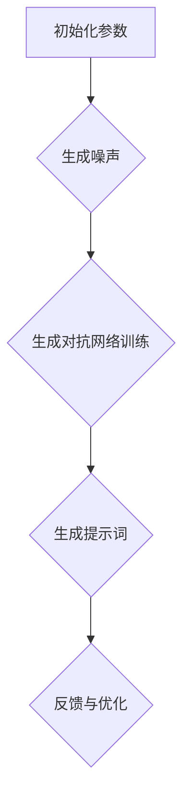
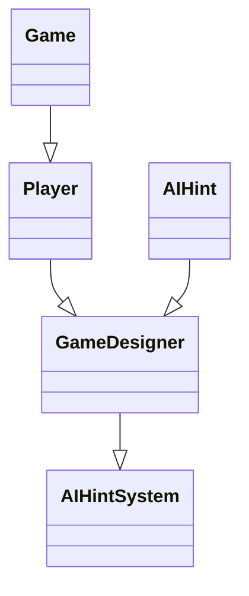
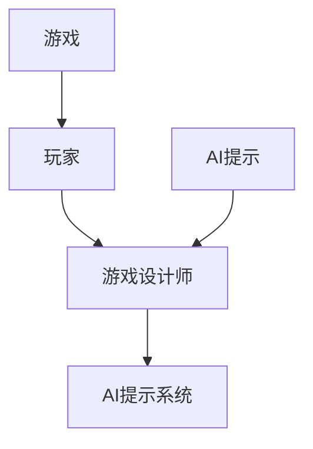
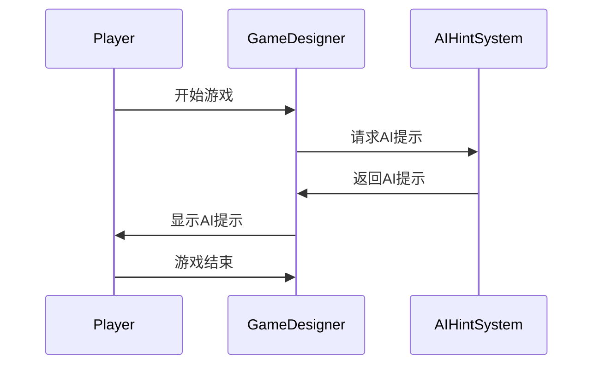

                 

# AI辅助创意游戏设计中的提示词技巧

> 关键词：AI、游戏设计、提示词、创意、算法

> 摘要：本文旨在探讨AI在辅助创意游戏设计中的应用，尤其是提示词的运用技巧。通过深入分析AI与游戏设计的结合点，阐述提示词在游戏设计中的重要性，并介绍相关的基础知识和实际应用方法。

## 目录大纲

1. 引言
2. AI与游戏设计的概述
3. AI辅助创意游戏设计的基础知识
4. 核心概念与联系
5. 提示词生成算法的详细讲解
6. 系统分析与架构设计
7. 项目实战
8. 最佳实践与总结

## 第1章 引言

### 1.1 问题背景

在当今快速发展的游戏行业中，创意游戏设计变得越来越重要。游戏设计不仅仅需要依靠设计师的想象力，还需要利用先进的技术来提升设计的效率和质量。人工智能（AI）作为一种强大的工具，逐渐成为游戏设计的得力助手。

### 1.2 提示词在游戏设计中的作用

提示词在游戏设计中起着至关重要的作用。它们可以帮助设计师快速生成创意，优化游戏流程，提升用户体验。通过AI技术，提示词的生成变得更加智能化和高效。

### 1.3 书籍目的与结构

本文的目的是介绍AI辅助创意游戏设计中的提示词技巧。文章将分为八个章节，涵盖从背景介绍、核心概念到算法讲解、系统设计，再到项目实战和总结的全面内容。

## 第2章 AI与游戏设计的概述

### 2.1 AI在游戏设计中的应用

AI在游戏设计中的应用非常广泛，包括但不限于：

- 游戏人工智能对手
- 游戏内容生成
- 游戏界面与交互
- 游戏数据分析

### 2.2 创意游戏设计的需求与挑战

创意游戏设计需要不断地创新和突破，这带来了一系列的挑战：

- 如何快速产生新创意？
- 如何确保游戏的可玩性和趣味性？
- 如何有效地进行游戏测试和优化？

### 2.3 提示词在游戏设计中的重要性

提示词在解决上述挑战中起到了关键作用。通过AI技术生成的提示词，可以帮助设计师快速生成创意，优化游戏流程，提升用户体验。

## 第3章 AI辅助创意游戏设计的基础知识

### 3.1 AI的基本概念

AI是指模拟人类智能的技术，包括机器学习、深度学习、自然语言处理等子领域。

### 3.2 机器学习与深度学习

机器学习和深度学习是AI的核心技术。机器学习是一种让计算机从数据中学习规律的方法，而深度学习是一种通过多层神经网络进行自动特征提取的方法。

### 3.3 提示词生成算法

提示词生成算法是AI在游戏设计中的一个重要应用。常见的生成算法包括生成对抗网络（GAN）、变分自编码器（VAE）等。

## 第4章 核心概念与联系

### 4.1 提示词的类型与分类

提示词可以分为主题型、情感型和策略型等。每种类型的提示词都有其特定的应用场景。

### 4.2 提示词生成算法与联系

常见的提示词生成算法包括GAN、VAE等。这些算法各有特点，适用于不同的游戏设计需求。

### 4.3 提示词生成算法对比表格

| 算法        | 优点                            | 缺点                              |
| ----------- | ------------------------------- | --------------------------------- |
| GAN         | 能生成高质量图片和文本          | 训练过程复杂，对计算资源要求高     |
| VAE         | 可以生成具有多样性的数据        | 生成的数据质量相对较低           |
| LSTM        | 能够处理序列数据                | 训练过程较慢，参数较多           |

## 第5章 提示词生成算法的详细讲解

### 5.1 提示词生成算法mermaid流程图



### 5.2 Python源代码实现与解释

```python
# 生成对抗网络（GAN）示例代码
import tensorflow as tf
from tensorflow.keras import layers

# 生成器模型
def generator(z):
    # 输入层
    x = layers.Dense(128, activation='relu')(z)
    # 隐藏层
    x = layers.Dense(64, activation='relu')(x)
    # 输出层
    x = layers.Dense(28 * 28, activation='tanh')(x)
    return tf.reshape(x, (-1, 28, 28, 1))

# 初始化模型
gen = generator(tf.random.normal([1, 100]))

# 打印模型结构
gen.summary()
```

### 5.3 算法原理与数学模型

生成对抗网络（GAN）是一种基于博弈论的模型，由生成器（Generator）和判别器（Discriminator）组成。生成器的目标是生成逼真的数据，而判别器的目标是区分生成的数据和真实数据。

### 5.4 举例说明

假设我们使用GAN生成图片，生成器会生成一张随机噪声图片，然后通过判别器的判断，逐步优化生成器的参数，最终生成一张逼真的图片。

## 第6章 系统分析与架构设计

### 6.1 游戏设计与AI提示系统的关系

游戏设计需要AI提示系统的支持，而AI提示系统则需要理解游戏设计的需求和目标。

### 6.2 系统功能设计(领域模型类图)



### 6.3 系统架构设计(架构图)



### 6.4 系统接口设计

系统接口设计包括API接口和SDK接口。API接口提供基础的交互功能，SDK接口则提供更高级的功能和扩展。

### 6.5 系统交互(序列图)



## 第7章 项目实战

### 7.1 环境安装与配置

在开始项目之前，需要安装Python和相关的库，如TensorFlow、Keras等。

### 7.2 系统核心实现源代码

核心实现代码包括生成器和判别器的定义、训练过程和生成提示词的函数。

### 7.3 代码应用解读与分析

通过解读和分析代码，可以理解GAN的工作原理和如何生成提示词。

### 7.4 实际案例分析与讲解

通过实际案例，展示如何使用AI提示系统优化游戏设计。

### 7.5 项目小结

项目小结总结项目的成果和不足，并提出改进建议。

## 第8章 最佳实践与总结

### 8.1 最佳实践技巧

提供一些最佳实践技巧，如如何选择合适的提示词生成算法、如何优化训练过程等。

### 8.2 小结

总结文章的主要内容，强调AI辅助创意游戏设计的重要性。

### 8.3 注意事项

提醒用户在应用AI提示词时需要注意的事项。

### 8.4 拓展阅读

推荐一些相关的书籍、论文和资源，供进一步学习。

## 作者信息

作者：AI天才研究院/AI Genius Institute & 禅与计算机程序设计艺术 /Zen And The Art of Computer Programming

本文通过对AI辅助创意游戏设计中的提示词技巧的深入探讨，旨在帮助读者了解这一领域的最新动态和实践方法。通过本文的学习，读者可以更好地利用AI技术提升游戏设计的效率和质量。让我们共同努力，将AI与游戏设计融合，创造更多精彩的游戏体验。

