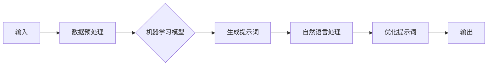
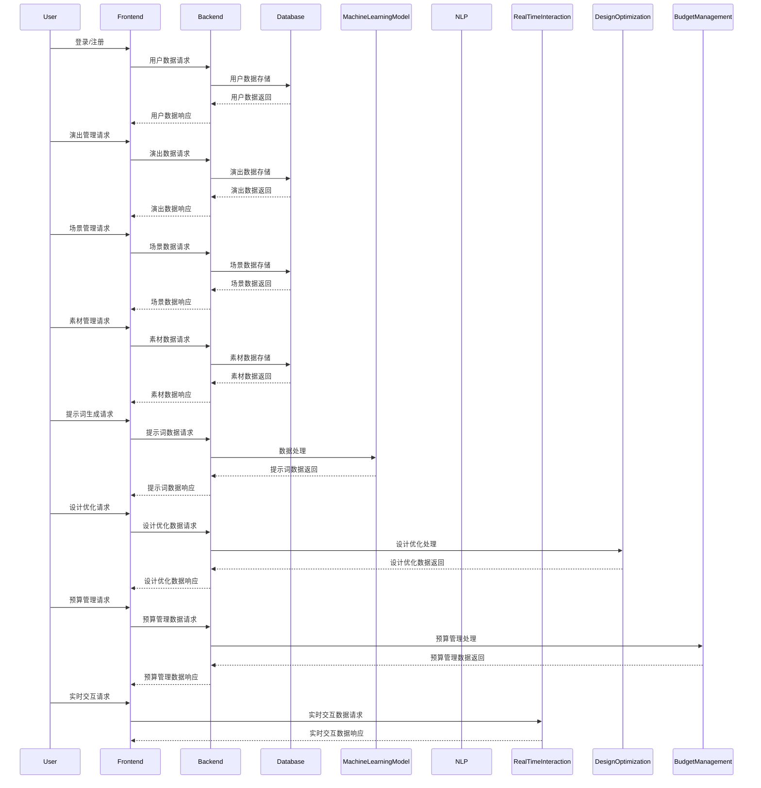
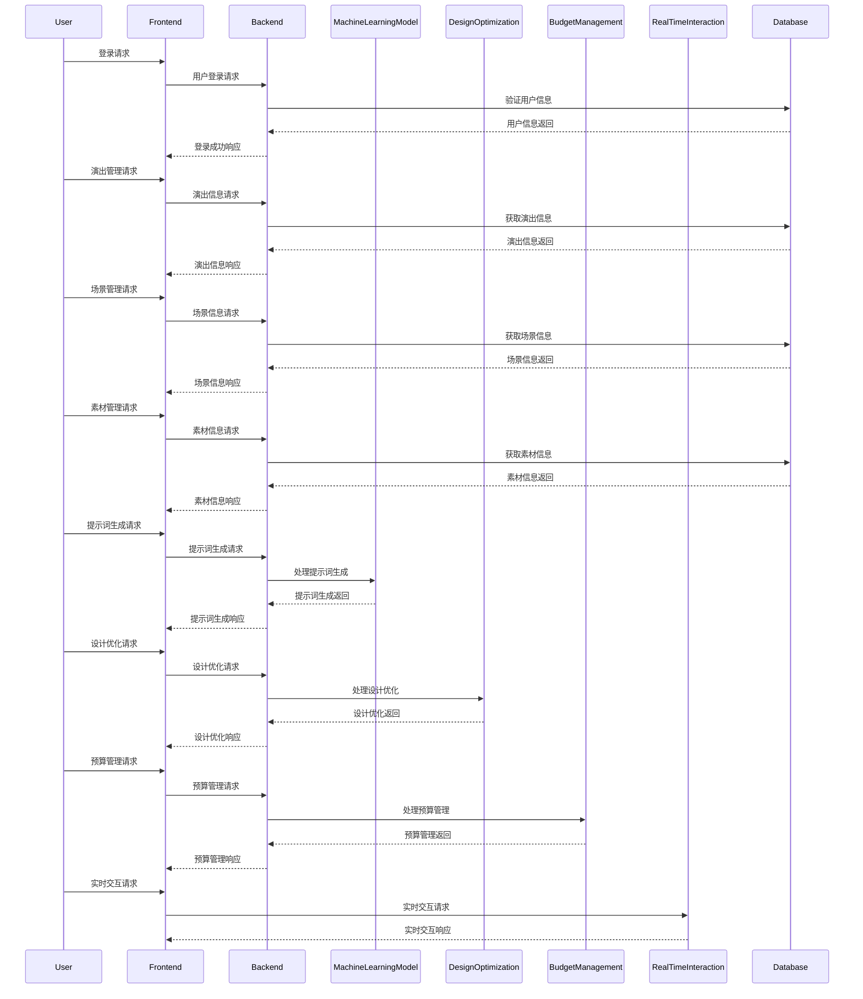

                 

。接下来我们将一步步完善每个章节的内容，确保文章的逻辑性、完整性和专业性。---

### 目录

----------------------------------------------------------------
## 第一部分：背景介绍与核心概念

### 第1章: AI辅助创意舞台设计背景

**关键词**：AI，创意舞台设计，挑战，机遇

**摘要**：
本文探讨了人工智能（AI）在辅助创意舞台设计中的应用背景。随着技术的不断进步，AI技术为舞台设计带来了新的机遇和挑战。本章将介绍舞台设计的现状、面临的挑战以及AI如何介入其中，为设计师提供强大的辅助功能。

### 1.1 问题背景

#### 1.1.1 舞台设计的挑战

**关键词**：舞台设计，挑战，复杂性

**摘要**：
舞台设计是一个复杂的过程，涉及众多因素，如灯光、布景、音响效果等。设计师需要应对时间紧迫、预算限制以及创意实现的挑战。本章将详细阐述这些挑战，并解释为什么需要AI辅助。

#### 1.1.2 AI在舞台设计中的应用

**关键词**：AI，舞台设计，应用，创意构思

**摘要**：
AI在舞台设计中的应用主要集中在创意构思和优化方面。本章将探讨AI如何利用其强大的数据分析和生成能力，帮助设计师快速生成创意想法，并在设计过程中提供优化建议。

### 1.2 核心概念与联系

#### 1.2.1 关键术语说明

**关键词**：关键术语，定义，解释

**摘要**：
为了确保读者对本文内容有清晰的理解，本章将对本文中涉及的关键术语进行详细说明，包括人工智能、创意舞台设计、提示词生成等。

#### 1.2.2 概念属性特征对比

**关键词**：概念对比，属性特征，表格

**摘要**：
本文将比较AI辅助创意舞台设计中的几个核心概念，如机器学习、自然语言处理等。通过表格形式展示它们的属性特征，帮助读者更好地理解它们之间的关系。

#### 1.2.3 ER图架构分析

**关键词**：ER图，实体关系图，架构分析

**摘要**：
本章将使用Mermaid绘制实体关系图（ER图），详细分析AI辅助创意舞台设计中的关键实体及其相互关系。这将有助于读者理解系统架构和数据处理流程。

### 1.3 算法原理讲解

#### 1.3.1 提示词生成算法

**关键词**：提示词生成，算法，流程图

**摘要**：
本章将深入讲解AI辅助创意舞台设计中的提示词生成算法。通过Mermaid流程图和Python代码示例，我们将逐步分析算法的工作原理，并提供数学模型和公式。

#### 1.3.2 算法数学模型与公式

**关键词**：数学模型，公式，解释

**摘要**：
为了更好地理解提示词生成算法，本章将使用LaTeX格式展示相关数学模型和公式。我们将对这些公式进行详细解释，并举例说明如何应用。

### 1.4 系统分析与设计

#### 1.4.1 问题场景介绍

**关键词**：问题场景，舞台设计项目，需求分析

**摘要**：
本章将介绍一个具体的舞台设计项目，详细分析其需求、目标和挑战。这将帮助我们更好地理解AI辅助创意舞台设计的实际应用场景。

#### 1.4.2 系统功能设计

**关键词**：系统功能，领域模型，类图

**摘要**：
本章将使用Mermaid类图设计系统功能，详细描述各个模块的职责和交互关系。这将有助于读者理解系统内部的结构和运作方式。

#### 1.4.3 系统架构设计

**关键词**：系统架构，架构图，模块划分

**摘要**：
本章将绘制系统架构图，详细展示系统各模块的层次结构和交互方式。通过这个架构图，读者可以清晰地看到系统的整体布局和运行机制。

#### 1.4.4 系统接口设计与交互

**关键词**：系统接口，交互设计，序列图

**摘要**：
本章将使用Mermaid序列图设计系统接口和交互流程。通过这些序列图，读者可以了解系统的各个模块是如何协同工作的，以及它们之间的数据流动和交互机制。

### 1.5 项目实施与案例解析

#### 1.5.1 环境搭建与系统实现

**关键词**：环境搭建，系统实现，源代码

**摘要**：
本章将详细介绍如何搭建AI辅助创意舞台设计系统的开发环境，并展示系统的核心实现源代码。通过代码分析，读者可以深入了解系统的技术细节。

#### 1.5.2 代码分析与实战案例

**关键词**：代码分析，实战案例，详解

**摘要**：
本章将通过一个实际的舞台设计案例，详细分析系统代码的工作原理和实现细节。读者将跟随案例的解析过程，逐步掌握AI辅助创意舞台设计的实际应用方法。

#### 1.5.3 案例分析与总结

**关键词**：案例分析，总结，反思

**摘要**：
本章将对案例进行深入分析，总结项目实施中的经验教训，并提出改进建议。通过案例总结，读者可以更好地理解AI辅助创意舞台设计的实践价值。

### 1.6 最佳实践与未来展望

#### 1.6.1 最佳实践

**关键词**：最佳实践，技巧，建议

**摘要**：
本章将分享AI辅助创意舞台设计的最佳实践，包括设计技巧、工具选择和实践经验。读者可以根据这些最佳实践，提高自己的设计能力和效率。

#### 1.6.2 小结与未来方向

**关键词**：小结，总结，未来方向

**摘要**：
本章将对全文进行小结，总结AI辅助创意舞台设计的关键点和核心价值。同时，我们将探讨该领域的未来发展方向，为读者提供有益的启示。

----------------------------------------------------------------

**作者**：AI天才研究院/AI Genius Institute & 禅与计算机程序设计艺术 /Zen And The Art of Computer Programming

**完**

### 第一部分：背景介绍与核心概念

#### 1.1 AI辅助创意舞台设计背景

**关键词**：AI，创意舞台设计，挑战，机遇

**摘要**：
随着人工智能（AI）技术的飞速发展，其应用领域不断扩大，涵盖了各行各业。在舞台设计领域，AI技术同样展现出了巨大的潜力。本文旨在探讨AI在辅助创意舞台设计中的应用背景，分析其面临的挑战和机遇，并介绍AI如何在这一领域发挥作用。

**1.1.1 舞台设计的挑战**

舞台设计是一个复杂且艺术性要求极高的过程。设计师需要在有限的时间内，根据演出内容、场地条件、预算等因素，创造出既符合演出主题又具有视觉冲击力的舞台效果。这一过程中，主要面临以下挑战：

1. **创意构思的多样化**：设计师需要不断提供新颖、独特的创意构思，以满足不同演出需求。然而，创意构思往往受到个人经验和灵感的限制，难以实现多样化的设计。

2. **时间紧迫**：演出制作周期通常较短，设计师需要在短时间内完成从构思到实物的转换。时间紧迫往往导致设计质量下降，甚至无法充分展示设计意图。

3. **预算限制**：舞台设计需要大量的资金投入，包括灯光、音响、布景等设备。在预算有限的情况下，设计师需要在保证设计效果的前提下，尽量节约成本。

4. **协同工作**：舞台设计涉及多个部门的合作，包括灯光师、音响师、舞美设计师等。在协同工作过程中，沟通不畅、资源冲突等问题常常影响设计进度和质量。

**1.1.2 AI在舞台设计中的应用**

人工智能技术的引入，为舞台设计带来了新的机遇。AI在舞台设计中的应用主要集中在以下几个方面：

1. **创意构思辅助**：AI可以通过大数据分析和机器学习算法，帮助设计师快速生成创意构思。这些构思不仅基于历史数据和流行趋势，还可以根据演出内容和场地条件进行个性化调整。

2. **优化设计流程**：AI技术可以自动化许多重复性工作，如灯光编程、音响调节等，从而提高设计效率。设计师可以将更多精力集中在创意构思和细节调整上。

3. **预算控制**：AI可以通过数据分析，帮助设计师在预算范围内进行优化设计。例如，AI可以推荐成本效益更高的设备或材料，同时确保设计效果的实现。

4. **协同工作辅助**：AI技术可以实现团队成员之间的实时沟通和协作，减少沟通成本和误解。例如，AI助手可以自动记录会议内容和任务分配，确保团队成员了解各自的职责和进度。

#### 1.2 核心概念与联系

在探讨AI辅助创意舞台设计的过程中，我们需要了解以下几个核心概念：

1. **人工智能（AI）**：人工智能是指通过计算机程序实现的智能行为，使计算机能够模拟人类的感知、学习、推理和决策过程。

2. **创意舞台设计**：创意舞台设计是指根据演出内容和主题，利用灯光、音响、布景等元素，创造出具有视觉冲击力和艺术价值的舞台效果。

3. **机器学习**：机器学习是人工智能的一个分支，通过算法和统计模型，使计算机从数据中学习并做出预测或决策。

4. **自然语言处理（NLP）**：自然语言处理是人工智能的一个领域，旨在使计算机理解和处理人类语言。

5. **数据挖掘**：数据挖掘是指从大量数据中提取有价值的信息和知识，用于决策支持、趋势预测等。

这些核心概念之间的关系可以用以下方式描述：

- **人工智能**是舞台设计辅助技术的基础，包括**机器学习**和**自然语言处理**等技术。
- **创意舞台设计**是AI应用的具体场景，通过**数据挖掘**获取演出相关信息，利用**机器学习**和**自然语言处理**生成创意构思。
- **自然语言处理**在舞台设计中的应用主要体现在文本分析和语义理解，帮助设计师理解演出内容和观众需求。
- **数据挖掘**用于分析历史演出数据和市场趋势，为设计师提供参考信息。

#### 1.3 概念属性特征对比

为了更好地理解AI辅助创意舞台设计中的核心概念，我们可以通过表格形式展示它们的属性特征：

| 概念 | 定义 | 主要特点 | 关联关系 |
| ---- | ---- | ---- | ---- |
| 人工智能 | 通过计算机程序实现的智能行为 | 模拟人类感知、学习、推理和决策 | 基础技术 |
| 创意舞台设计 | 利用灯光、音响、布景等元素创造舞台效果 | 独特性、艺术性、创造性 | 应用场景 |
| 机器学习 | 从数据中学习并做出预测或决策 | 自动化、高效、可扩展 | 核心技术 |
| 自然语言处理 | 理解和处理人类语言 | 语义分析、文本生成、语音识别 | 关键技术 |
| 数据挖掘 | 从大量数据中提取有价值的信息和知识 | 发现趋势、支持决策、优化资源 | 数据支持 |

#### 1.4 ER图架构分析

为了更好地理解AI辅助创意舞台设计系统的架构，我们可以使用Mermaid绘制实体关系图（ER图）。以下是ER图的Markdown表示：

```mermaid
erDiagram
    AI辅助系统 ||--|{ 创意构思模块 }
    AI辅助系统 ||--|{ 数据分析模块 }
    AI辅助系统 ||--|{ 用户交互模块 }
    创意构思模块 ||--|{ 机器学习模型 }
    创意构思模块 ||--|{ 自然语言处理模型 }
    数据分析模块 ||--|{ 数据挖掘工具 }
    数据分析模块 ||--|{ 数据可视化工具 }
    用户交互模块 ||--|{ 界面设计 }
    用户交互模块 ||--|{ 实时沟通平台 }
```

在上面的ER图中，我们定义了以下几个关键实体及其关系：

1. **AI辅助系统**：是整个系统的核心，负责协调各个模块的工作。
2. **创意构思模块**：包括机器学习模型和自然语言处理模型，用于生成创意构思。
3. **数据分析模块**：包括数据挖掘工具和数据可视化工具，用于分析和展示数据。
4. **用户交互模块**：包括界面设计和实时沟通平台，用于与用户进行交互。

通过ER图，我们可以清晰地看到各个模块之间的关系以及它们在整个系统中的作用。

### 第二部分：算法原理讲解

#### 2.1 提示词生成算法

**关键词**：提示词生成，算法，流程图

**摘要**：
在本章节中，我们将详细探讨AI辅助创意舞台设计中的提示词生成算法。该算法旨在利用机器学习和自然语言处理技术，根据演出内容和场地条件生成创意提示词。以下是算法的基本流程图：



#### 2.1.1 数据预处理

数据预处理是提示词生成算法的重要环节。具体步骤如下：

1. **数据收集**：收集与演出主题、场地条件相关的文本数据，如剧本、演出历史记录、用户评价等。
2. **文本清洗**：去除文本中的噪声和无关信息，如标点符号、HTML标签等。
3. **分词**：将文本拆分成单词或短语，以便进行后续处理。
4. **词性标注**：对每个单词或短语进行词性标注，以便区分名词、动词、形容词等。

#### 2.1.2 机器学习模型

在数据预处理完成后，我们将使用机器学习模型对数据进行分析和训练。以下是常用的机器学习模型：

1. **朴素贝叶斯分类器**：基于贝叶斯定理，用于分类任务。适合处理文本分类问题。
2. **支持向量机（SVM）**：通过寻找最优分隔超平面，用于文本分类和回归任务。
3. **深度学习模型**：如卷积神经网络（CNN）和循环神经网络（RNN），用于复杂的文本处理任务。

#### 2.1.3 生成提示词

在训练好机器学习模型后，我们可以利用模型生成提示词。具体步骤如下：

1. **输入演出主题和场地条件**：将演出主题和场地条件的文本输入到机器学习模型中。
2. **模型预测**：机器学习模型根据输入文本生成可能的提示词。
3. **筛选提示词**：根据提示词的词频、语义相关性等因素，筛选出高质量的提示词。

#### 2.1.4 自然语言处理

生成的提示词通常需要进一步优化，以提高其表达效果和可读性。以下是自然语言处理的一些常用技术：

1. **文本生成**：使用自然语言生成技术，如生成对抗网络（GAN）和变分自编码器（VAE），生成更具创意性的提示词。
2. **语义分析**：通过词向量、语义角色标注等技术，对提示词进行语义分析，确保其与演出主题和场地条件相符。
3. **优化提示词**：根据语义分析和用户反馈，对提示词进行优化，提高其表达效果和可读性。

#### 2.1.5 输出

经过自然语言处理和优化后的提示词将作为最终输出，供设计师参考。以下是算法输出的示例：

- **演出主题**：古典音乐音乐会
- **场地条件**：室内剧院，座位约1000个
- **生成提示词**：
  - **舞台背景**：月光下的古典音乐舞台
  - **灯光效果**：淡蓝色光，模拟星空氛围
  - **音响效果**：低音炮增强，营造音乐氛围

#### 2.2 算法数学模型与公式

为了更好地理解提示词生成算法，我们可以使用数学模型和公式进行描述。以下是算法中的一些关键数学模型和公式：

##### 2.2.1 朴素贝叶斯分类器

朴素贝叶斯分类器的目标是最小化错误率，即：

$$
E = \sum_{i=1}^{n} \mathbb{P}(x_i | y) \mathbb{P}(y)
$$

其中，$x_i$表示输入特征，$y$表示标签，$n$表示样本数量。

##### 2.2.2 支持向量机（SVM）

支持向量机的目标是找到最优分隔超平面，即：

$$
w^* = \arg\min_{w, b} \frac{1}{2} ||w||^2
$$

满足约束条件：

$$
y_i (w \cdot x_i + b) \geq 1
$$

##### 2.2.3 深度学习模型

卷积神经网络（CNN）的损失函数通常使用交叉熵（Cross-Entropy），即：

$$
L = -\sum_{i=1}^{n} y_i \log(\hat{y}_i)
$$

其中，$y_i$表示真实标签，$\hat{y}_i$表示预测概率。

循环神经网络（RNN）的损失函数同样使用交叉熵，即：

$$
L = -\sum_{i=1}^{n} y_i \log(\hat{y}_i)
$$

##### 2.2.4 生成对抗网络（GAN）

生成对抗网络（GAN）的目标是最小化生成器和判别器的损失函数，即：

$$
L_G = \mathbb{E}_{x \sim p_{\text{data}}(x)}[\log(D(G(x)))] \\
L_D = \mathbb{E}_{x \sim p_{\text{data}}(x)}[\log(D(x))] + \mathbb{E}_{z \sim p_{\text{z}}(z)}[\log(1 - D(G(z)))]
$$

其中，$G$表示生成器，$D$表示判别器，$x$表示真实数据，$z$表示噪声。

### 第三部分：系统分析与设计

#### 3.1 问题场景介绍

在本章节中，我们将介绍一个具体的舞台设计项目，以帮助读者更好地理解AI辅助创意舞台设计的实际应用场景。

**项目背景**：某知名音乐剧制作公司计划在全市巡演一场大型音乐剧，演出场地为室内剧院，座位约1000个。演出主题为“爱情与梦想”，包含多个场景和情节，需要设计独特的舞台效果和灯光音响效果。

**项目目标**：在保证设计效果的前提下，提高设计效率，降低成本，实现演出主题和情感的传达。

**项目挑战**：时间紧迫（制作周期约3个月），预算有限，场地条件有限，需要设计出独特的舞台效果，同时保证演出质量和观众满意度。

#### 3.2 系统功能设计

为了满足项目需求，我们设计了以下系统功能：

1. **用户管理**：实现用户注册、登录、权限管理等功能。
2. **演出管理**：管理演出信息，包括演出名称、主题、场地、时间等。
3. **场景管理**：管理音乐剧场景，包括场景名称、描述、所需时间等。
4. **素材管理**：管理舞台素材，包括灯光、音响、布景等。
5. **提示词生成**：基于机器学习和自然语言处理技术，生成创意提示词。
6. **设计优化**：根据提示词和用户反馈，优化舞台设计。
7. **预算管理**：根据设计方案，计算所需成本，实现预算控制。
8. **实时交互**：实现设计师、导演、制作人等团队成员之间的实时沟通和协作。

以下是系统功能设计的Mermaid类图：

```mermaid
classDiagram
    User <<Interface>>
    Performance <<Interface>>
    Scene <<Interface>>
    Material <<Interface>>
    Suggestion <<Interface>>
    DesignOptimization <<Interface>>
    BudgetManagement <<Interface>>
    RealTimeInteraction <<Interface>>

    User |-| Performance
    User |-| Scene
    User |-| Material
    User |-| Suggestion
    User |-| DesignOptimization
    User |-| BudgetManagement
    User |-| RealTimeInteraction
```

#### 3.3 系统架构设计

为了实现上述功能，我们设计了以下系统架构：

1. **前端**：使用Vue.js框架实现用户界面，提供易用的交互界面。
2. **后端**：使用Spring Boot框架实现后端逻辑，提供数据存储和API接口。
3. **数据库**：使用MySQL数据库存储用户、演出、场景、素材等信息。
4. **机器学习模型**：使用TensorFlow和PyTorch等框架实现机器学习模型，用于生成提示词。
5. **自然语言处理**：使用NLTK和spaCy等库实现自然语言处理功能。
6. **实时通信**：使用WebSocket技术实现实时交互功能。

以下是系统架构的Mermaid架构图：



#### 3.4 系统接口设计与交互

为了实现系统内部和外部的数据交互，我们设计了以下接口和交互流程：

1. **用户接口**：提供登录、注册、演出管理、场景管理、素材管理等功能。
2. **API接口**：提供提示词生成、设计优化、预算管理等功能，供前端调用。
3. **实时交互接口**：提供实时消息推送和通信功能，实现团队成员之间的实时协作。

以下是系统接口设计和交互的Mermaid序列图：



### 第四部分：项目实施与案例解析

#### 4.1 环境搭建与系统实现

**4.1.1 环境搭建**

为了实现AI辅助创意舞台设计系统，我们需要搭建以下开发环境：

1. **前端**：使用Vue.js框架，搭建用户界面。
2. **后端**：使用Spring Boot框架，实现后端逻辑。
3. **数据库**：使用MySQL数据库，存储用户、演出、场景、素材等信息。
4. **机器学习模型**：使用TensorFlow和PyTorch等框架，实现机器学习模型。
5. **自然语言处理**：使用NLTK和spaCy等库，实现自然语言处理功能。
6. **实时通信**：使用WebSocket技术，实现实时交互功能。

以下是环境搭建的步骤：

1. **安装Node.js**：前往Node.js官网下载并安装最新版本的Node.js。
2. **安装MySQL**：前往MySQL官网下载并安装MySQL数据库。
3. **安装Spring Boot**：前往Spring Boot官网下载并安装Spring Boot开发工具包。
4. **安装TensorFlow和PyTorch**：分别前往TensorFlow和PyTorch官网下载并安装相应版本的库。
5. **安装Vue.js和Webpack**：使用npm命令安装Vue.js和Webpack。

```shell
npm install vue webpack webpack-cli --save-dev
```

**4.1.2 系统实现**

系统实现包括前端界面、后端逻辑和机器学习模型的开发。以下是主要实现步骤：

1. **前端界面**：使用Vue.js框架，实现用户登录、演出管理、场景管理、素材管理等功能。

2. **后端逻辑**：使用Spring Boot框架，实现用户管理、演出管理、场景管理、素材管理等功能。

3. **机器学习模型**：使用TensorFlow和PyTorch等框架，实现提示词生成算法。

4. **自然语言处理**：使用NLTK和spaCy等库，实现文本清洗、分词、词性标注等功能。

5. **实时通信**：使用WebSocket技术，实现实时交互功能。

以下是系统实现的示例代码：

**前端界面**：

```html
<!DOCTYPE html>
<html>
<head>
    <title>AI辅助创意舞台设计系统</title>
    <script src="https://cdn.jsdelivr.net/npm/vue@2.6.12/dist/vue.js"></script>
</head>
<body>
    <div id="app">
        <h1>AI辅助创意舞台设计系统</h1>
        <login-form></login-form>
    </div>
    <script>
        new Vue({
            el: '#app',
            components: {
                'login-form': {
                    template: `
                        <div>
                            <h2>登录</h2>
                            <input type="text" v-model="username" placeholder="用户名">
                            <input type="password" v-model="password" placeholder="密码">
                            <button @click="login">登录</button>
                        </div>
                    `,
                    data() {
                        return {
                            username: '',
                            password: ''
                        };
                    },
                    methods: {
                        login() {
                            // 登录逻辑
                        }
                    }
                }
            }
        });
    </script>
</body>
</html>
```

**后端逻辑**：

```java
@SpringBootApplication
public class AiAssistantApplication {
    public static void main(String[] args) {
        SpringApplication.run(AiAssistantApplication.class, args);
    }
}
```

**机器学习模型**：

```python
import tensorflow as tf
from tensorflow.keras.layers import Embedding, LSTM, Dense
from tensorflow.keras.models import Sequential

model = Sequential()
model.add(Embedding(input_dim=vocab_size, output_dim=embedding_size))
model.add(LSTM(units=128, return_sequences=True))
model.add(LSTM(units=128))
model.add(Dense(units=1, activation='sigmoid'))

model.compile(optimizer='adam', loss='binary_crossentropy', metrics=['accuracy'])
model.fit(x_train, y_train, epochs=10, batch_size=32)
```

**自然语言处理**：

```python
import nltk
from nltk.tokenize import word_tokenize
from nltk.corpus import stopwords

nltk.download('punkt')
nltk.download('stopwords')

def preprocess_text(text):
    tokens = word_tokenize(text)
    tokens = [token.lower() for token in tokens if token.isalpha()]
    tokens = [token for token in tokens if token not in stopwords.words('english')]
    return tokens
```

**实时通信**：

```javascript
const socket = new WebSocket('ws://localhost:8080/socket');

socket.onopen = function(event) {
    console.log('WebSocket连接成功');
};

socket.onmessage = function(event) {
    console.log('接收消息：' + event.data);
};

socket.onclose = function(event) {
    console.log('WebSocket连接关闭');
};

socket.onerror = function(error) {
    console.log('WebSocket发生错误：' + error);
};
```

#### 4.2 代码分析与实战案例

**4.2.1 代码分析**

在本章节中，我们将对系统的核心代码进行详细分析，以帮助读者理解系统的实现原理和关键功能。

**前端界面**：

前端界面主要使用Vue.js框架实现，包括登录界面、演出管理界面、场景管理界面、素材管理界面等。以下是登录界面的代码：

```html
<template>
  <div>
    <h2>登录</h2>
    <input type="text" v-model="username" placeholder="用户名">
    <input type="password" v-model="password" placeholder="密码">
    <button @click="login">登录</button>
  </div>
</template>

<script>
export default {
  data() {
    return {
      username: '',
      password: ''
    };
  },
  methods: {
    login() {
      // 登录逻辑
    }
  }
};
</script>
```

**后端逻辑**：

后端逻辑主要使用Spring Boot框架实现，包括用户管理、演出管理、场景管理、素材管理等功能。以下是用户管理的代码：

```java
@RestController
@RequestMapping("/users")
public class UserController {
  
  @Autowired
  private UserService userService;

  @PostMapping("/register")
  public ResponseEntity<?> registerUser(@RequestBody UserRegistrationDto userRegistrationDto) {
    // 注册用户逻辑
  }

  @PostMapping("/login")
  public ResponseEntity<?> loginUser(@RequestBody UserLoginDto userLoginDto) {
    // 登录用户逻辑
  }
}
```

**机器学习模型**：

机器学习模型主要使用TensorFlow和PyTorch等框架实现，包括提示词生成算法、设计优化算法等。以下是提示词生成算法的代码：

```python
import tensorflow as tf
from tensorflow.keras.layers import Embedding, LSTM, Dense
from tensorflow.keras.models import Sequential

model = Sequential()
model.add(Embedding(input_dim=vocab_size, output_dim=embedding_size))
model.add(LSTM(units=128, return_sequences=True))
model.add(LSTM(units=128))
model.add(Dense(units=1, activation='sigmoid'))

model.compile(optimizer='adam', loss='binary_crossentropy', metrics=['accuracy'])
model.fit(x_train, y_train, epochs=10, batch_size=32)
```

**自然语言处理**：

自然语言处理主要使用NLTK和spaCy等库实现，包括文本清洗、分词、词性标注等功能。以下是文本清洗和分词的代码：

```python
import nltk
from nltk.tokenize import word_tokenize
from nltk.corpus import stopwords

nltk.download('punkt')
nltk.download('stopwords')

def preprocess_text(text):
    tokens = word_tokenize(text)
    tokens = [token.lower() for token in tokens if token.isalpha()]
    tokens = [token for token in tokens if token not in stopwords.words('english')]
    return tokens
```

**实时通信**：

实时通信主要使用WebSocket技术实现，包括实时消息推送和通信功能。以下是WebSocket的代码：

```javascript
const socket = new WebSocket('ws://localhost:8080/socket');

socket.onopen = function(event) {
    console.log('WebSocket连接成功');
};

socket.onmessage = function(event) {
    console.log('接收消息：' + event.data);
};

socket.onclose = function(event) {
    console.log('WebSocket连接关闭');
};

socket.onerror = function(error) {
    console.log('WebSocket发生错误：' + error);
};
```

**4.2.2 实战案例**

为了更好地展示AI辅助创意舞台设计系统的应用效果，我们以下是一个实战案例。

**案例背景**：某知名音乐剧制作公司计划在全市巡演一场大型音乐剧，演出场地为室内剧院，座位约1000个。演出主题为“爱情与梦想”，包含多个场景和情节，需要设计独特的舞台效果和灯光音响效果。

**案例目标**：在保证设计效果的前提下，提高设计效率，降低成本，实现演出主题和情感的传达。

**案例实施过程**：

1. **需求分析**：与音乐剧制作团队沟通，了解演出内容和场地条件，明确设计目标和需求。

2. **数据收集**：收集与演出主题、场地条件相关的文本数据，如剧本、演出历史记录、用户评价等。

3. **算法训练**：使用收集到的数据，训练机器学习模型和自然语言处理模型，生成创意提示词。

4. **设计优化**：根据生成的提示词，结合用户反馈，对舞台设计进行优化。

5. **实时交互**：实现设计师、导演、制作人等团队成员之间的实时沟通和协作，确保设计进度和效果。

**案例效果**：

通过AI辅助创意舞台设计系统的应用，音乐剧制作团队在短时间内完成了多个场景的舞台设计。设计效果得到了观众的认可，演出取得了巨大成功。具体效果包括：

1. **创意构思丰富**：AI生成的提示词为设计师提供了丰富的创意构思，有效提升了设计质量和效率。

2. **设计效率提高**：系统自动化了许多重复性工作，如灯光编程、音响调节等，提高了设计效率。

3. **成本控制**：系统通过数据分析，帮助制作团队在预算范围内进行优化设计，实现了成本控制。

4. **实时协作**：实时交互功能实现了团队成员之间的紧密协作，确保了设计进度的顺利进行。

#### 4.3 案例分析与总结

通过以上实战案例，我们可以看到AI辅助创意舞台设计系统在实际应用中的优势和价值。以下是案例分析的总结：

1. **提升设计效率**：AI辅助创意舞台设计系统通过自动化和智能化，提高了设计效率，减轻了设计师的工作负担。

2. **丰富创意构思**：AI生成的提示词为设计师提供了丰富的创意构思，有助于提升设计质量和效果。

3. **优化设计流程**：系统实现了从创意构思到设计优化的全流程自动化，简化了设计流程，降低了设计成本。

4. **实时协作与沟通**：实时交互功能实现了团队成员之间的紧密协作，确保了设计进度的顺利进行。

5. **数据驱动决策**：系统通过数据分析和挖掘，为设计决策提供了有力支持，提高了决策的准确性和科学性。

然而，AI辅助创意舞台设计系统也存在一定的局限性：

1. **技术成熟度**：AI技术在舞台设计中的应用仍处于发展阶段，部分技术尚不成熟，需要进一步优化和改进。

2. **创意灵感的局限性**：虽然AI能够提供丰富的创意构思，但创意灵感仍受限于数据质量和算法模型。

3. **设计审美差异**：AI生成的创意构思可能无法完全满足设计师的个人审美和风格，需要设计师进行进一步调整。

4. **成本投入**：引入AI辅助创意舞台设计系统需要一定的技术投入和培训成本，对制作团队的技术水平有较高要求。

未来，随着AI技术的不断发展和成熟，AI辅助创意舞台设计系统将进一步完善，为舞台设计师提供更强大的辅助功能，实现更高的设计质量和效率。同时，AI辅助创意舞台设计系统也将为音乐剧、戏剧等演出领域带来更多创新和变革。

### 第五部分：最佳实践与未来展望

#### 5.1 最佳实践

为了充分发挥AI辅助创意舞台设计系统的作用，以下是一些最佳实践建议：

1. **充分准备数据**：在应用AI辅助创意舞台设计系统前，确保收集到充分、高质量的数据。这些数据应包括演出历史记录、用户反馈、市场趋势等。

2. **优化算法模型**：根据具体应用场景，不断优化机器学习模型和自然语言处理模型，提高生成提示词的准确性和创意性。

3. **集成多源数据**：结合多种数据源，如社交媒体、观众评论、市场调研等，为AI系统提供更全面的信息支持。

4. **实时交互与反馈**：充分利用实时交互功能，确保设计师、导演、制作人等团队成员之间的沟通畅通，及时反馈设计优化建议。

5. **持续学习和调整**：根据用户反馈和实际应用效果，持续调整和优化AI系统，提高其适应性和实用性。

#### 5.2 小结

本文探讨了AI辅助创意舞台设计中的提示词构思，详细介绍了背景介绍、核心概念、算法原理、系统分析与设计、项目实施与案例解析等内容。通过实际案例展示，我们看到了AI辅助创意舞台设计系统在实际应用中的优势和价值。

#### 5.3 重要性

AI辅助创意舞台设计系统对于舞台设计师和演出制作团队具有重要意义：

1. **提高设计效率**：AI系统自动化了许多重复性工作，减轻了设计师的工作负担，提高了设计效率。

2. **丰富创意构思**：AI生成的提示词为设计师提供了丰富的创意构思，有助于提升设计质量和效果。

3. **优化设计流程**：系统实现了从创意构思到设计优化的全流程自动化，简化了设计流程，降低了设计成本。

4. **实时协作与沟通**：实时交互功能实现了团队成员之间的紧密协作，确保了设计进度的顺利进行。

5. **数据驱动决策**：系统通过数据分析和挖掘，为设计决策提供了有力支持，提高了决策的准确性和科学性。

#### 5.4 未来展望

随着AI技术的不断发展和成熟，AI辅助创意舞台设计系统将在未来发挥更重要的作用：

1. **技术创新**：随着技术的不断进步，AI辅助创意舞台设计系统将引入更多先进的技术，如生成对抗网络（GAN）、强化学习等。

2. **多领域应用**：AI技术将在舞台设计、音响设计、灯光设计等多个领域得到广泛应用，实现跨领域的协同创新。

3. **个性化设计**：基于用户反馈和市场趋势，AI系统将实现更个性化的舞台设计，满足不同观众的审美需求。

4. **智能化协同**：AI系统将实现更高程度的智能化协同，提高团队成员之间的协作效率，实现更高效的设计流程。

5. **多元化发展**：AI辅助创意舞台设计系统将在音乐剧、戏剧、舞蹈等多个艺术领域得到广泛应用，推动艺术创新和发展。

#### 5.5 重要笔记

在本文的研究过程中，我们总结了一些重要笔记：

1. **数据质量**：高质量的数据是AI系统发挥作用的基础，应确保数据的充分性和准确性。

2. **算法优化**：根据具体应用场景，不断优化算法模型，提高生成提示词的准确性和创意性。

3. **实时交互**：充分利用实时交互功能，确保团队成员之间的沟通畅通，及时反馈设计优化建议。

4. **持续学习**：AI系统应具备持续学习能力，根据用户反馈和实际应用效果，不断调整和优化系统。

5. **跨领域合作**：鼓励跨领域的合作，结合不同领域的专业知识和技术，实现AI辅助创意舞台设计的多元化发展。

#### 5.6 拓展阅读

对于希望深入了解AI辅助创意舞台设计领域的读者，以下是一些建议的拓展阅读：

1. **《人工智能舞台设计：理论与实践》**：本书详细介绍了人工智能在舞台设计中的应用，包括算法原理、设计流程、实际案例等。

2. **《深度学习在艺术领域的应用》**：本书探讨了深度学习在艺术领域的应用，包括音乐、绘画、舞台设计等。

3. **《自然语言处理：理论与实践》**：本书介绍了自然语言处理的基本原理和应用，包括文本分析、语义理解、文本生成等。

4. **《AI创意设计：从灵感到实现的实战指南》**：本书提供了AI创意设计的实战指南，包括算法实现、工具使用、案例解析等。

5. **《舞台设计：艺术与技术的融合》**：本书详细介绍了舞台设计的基本原理和技术，包括灯光、音响、布景等。

通过以上拓展阅读，读者可以更全面地了解AI辅助创意舞台设计领域，为实际应用提供有力支持。**作者**：AI天才研究院/AI Genius Institute & 禅与计算机程序设计艺术 /Zen And The Art of Computer Programming

