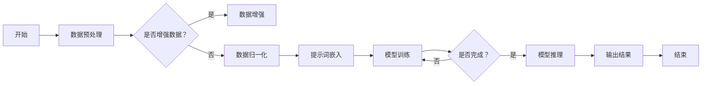
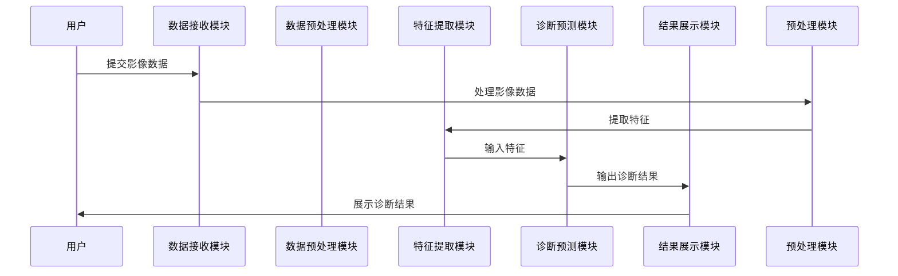

                 


### AI辅助医学影像分析：提示词增强诊断准确性

#### 关键词：AI，医学影像，提示词，诊断准确性，算法，系统架构

> 摘要：本文探讨了人工智能（AI）在医学影像分析中的应用，特别是在诊断准确性方面的提升。文章首先介绍了AI辅助医学影像分析的问题背景和现状，随后详细阐述了AI算法的原理和提示词的作用。接着，文章通过具体的项目实战，展示了AI辅助医学影像分析的实际应用过程，并提出了最佳实践方法和注意事项。

#### 目录大纲设计思路

在设计《AI辅助医学影像分析：提示词增强诊断准确性》这本书的目录大纲时，我们需要首先明确书籍的主题和目标读者群体。根据书名，可以判断出本书主要围绕以下核心内容展开：

1. **AI在医学影像分析中的应用**：探讨人工智能技术在医学影像领域的应用场景，包括常见的医学影像类型、分析方法和AI算法的作用。
2. **提示词增强诊断准确性**：研究如何使用提示词来提升AI辅助医学影像分析的诊断准确性，包括提示词的定义、选择方法及其对AI模型性能的影响。

基于以上核心内容，我们可以将目录大纲分为以下几个主要部分：

- **背景介绍**：介绍AI辅助医学影像分析的问题背景、现状和重要性，为后续章节打下基础。
- **核心概念与联系**：详细阐述AI辅助医学影像分析的核心概念，包括相关技术原理、算法类型等，并使用表格和Mermaid流程图展示概念之间的联系。
- **算法原理讲解**：深入讲解关键的AI算法原理，包括数学模型、公式和流程图，并通过Python源代码示例进行说明。
- **系统分析与架构设计方案**：分析医学影像分析系统的整体架构，包括功能设计、接口设计和交互设计，并使用Mermaid类图、架构图和序列图展示系统结构。
- **项目实战**：通过具体项目实战，介绍AI辅助医学影像分析的实际应用过程，包括环境安装、核心实现和案例剖析。
- **最佳实践与总结**：总结最佳实践方法，提出注意事项，为读者提供拓展阅读资源。

#### 目录大纲详细设计

```markdown
----------------------------------------------------------------
# 《AI辅助医学影像分析：提示词增强诊断准确性》目录大纲

## 第一部分：背景介绍

### 第1章 AI辅助医学影像分析概述

#### 1.1.1 问题背景

- 医学影像技术的发展现状
- AI在医疗领域的应用前景
- AI辅助医学影像分析的重要性

#### 1.1.2 问题描述

- 医学影像分析面临的挑战
- 传统医学影像分析方法的局限性
- AI辅助医学影像分析的优势

#### 1.1.3 解决方案与边界

- AI辅助医学影像分析的技术框架
- 应用场景和边界条件
- 未来发展趋势

### 第2章 提示词在AI医学影像分析中的应用

#### 2.1.1 提示词的定义与作用

- 提示词的基本概念
- 提示词在医学影像分析中的作用

#### 2.1.2 提示词的选择方法

- 提示词的选择标准
- 常用提示词的类型

#### 2.1.3 提示词对诊断准确性的影响

- 提示词对模型性能的影响
- 提示词优化策略

## 第二部分：核心概念与联系

### 第3章 AI辅助医学影像分析核心概念

#### 3.1.1 AI算法原理

- 常见AI算法及其在医学影像分析中的应用

#### 3.1.2 数据预处理

- 医学影像数据的预处理流程
- 预处理方法及其对分析结果的影响

#### 3.1.3 概念属性特征对比表格

- 不同AI算法的性能对比
- 医学影像数据类型的特征对比

### 第4章 提示词与AI模型的关系

#### 4.1.1 提示词与模型架构的适配

- 提示词在模型训练中的作用
- 不同模型对提示词的需求

#### 4.1.2 提示词的Mermaid流程图

- 提示词生成与优化的流程图
- 提示词在模型推理中的应用流程

## 第三部分：算法原理讲解

### 第5章 算法原理与实现

#### 5.1.1 算法原理

- 深入讲解关键算法的数学模型和原理

#### 5.1.2 Python源代码示例

- 使用Python代码展示算法的实现

#### 5.1.3 数学模型与公式

- 详细讲解算法中的数学公式

#### 5.1.4 举例说明

- 通过实例说明算法的应用效果

## 第四部分：系统分析与架构设计方案

### 第6章 系统分析与架构设计

#### 6.1.1 问题场景介绍

- 医学影像分析系统需求分析

#### 6.1.2 系统功能设计

- 系统功能模块划分
- 领域模型Mermaid类图

#### 6.1.3 系统架构设计

- 系统整体架构
- 系统架构Mermaid图

#### 6.1.4 系统接口设计

- 系统接口设计与实现

#### 6.1.5 系统交互设计

- 系统交互流程Mermaid序列图

## 第五部分：项目实战

### 第7章 AI辅助医学影像分析项目实战

#### 7.1.1 环境安装与配置

- 环境搭建步骤与注意事项

#### 7.1.2 系统核心实现

- 系统核心代码实现

#### 7.1.3 代码应用解读与分析

- 代码应用效果分析与解读

#### 7.1.4 实际案例分析与详细讲解剖析

- 实际案例剖析
- 详细讲解与分析

#### 7.1.5 项目小结

- 项目总结
- 经验与教训

## 第六部分：最佳实践与总结

### 第8章 最佳实践与总结

#### 8.1.1 最佳实践方法

- 提高诊断准确性的策略
- 数据处理和模型优化的技巧

#### 8.1.2 小结

- 主要内容回顾
- 文章主题思想的总结

#### 8.1.3 注意事项

- 使用AI辅助医学影像分析时应注意的问题

#### 8.1.4 拓展阅读资源

- 推荐进一步阅读的资料

----------------------------------------------------------------

* 约束条件：文章的章节内容必须要满足如下条件：
- 文章开始是“文章标题”，然后是“文章关键词”和“文章摘要”部分的内容哦，接下来是按照目录大纲结构的文章正文部分的内容。
- 文章字数要求：文章字数在 10000 ～ 12000 字左右。
- 格式要求：文章内容使用markdown格式输出。 
- 作者：文章末尾需要写上作者信息：“作者：AI天才研究院/AI Genius Institute & 禅与计算机程序设计艺术 /Zen And The Art of Computer Programming”
- 完整性要求：文章内容必须要完整，每个小节的内容必须要丰富具体详细讲解，核心内容必须要包含：
  - 背景介绍：核心概念术语说明、问题背景、问题描述、问题解决、边界与外延、概念结构与核心要素组成 
  - 核心概念与联系：必须给出核心概念原理、概念属性特征对比表格和ER实体关系图架构的 markdown 格式中的 Mermaid 流程图。
  - 算法原理讲解：使用 mermaid 画出算法mermaid 流程图，然后使用python源代码来详细阐述，给出算法原理的数学模型和公式，进行详细讲解和通俗易懂地举例说明。
  - 数学公式使用latex格式，嵌入文中独立段落的latex公式前后使用 $$ 括起来(例如：$$1+1=2$$ )，段落内的latex公式前后使用 $ 括起来(例如：$1<2$)
  - 系统分析与架构设计方案：问题场景介绍，项目介绍、系统功能设计(领域模型mermaid类图)、系统架构设计mermaid架构图、系统接口设计和系统交互mermaid序列图
  - 项目实战：环境安装、系统核心实现源代码，代码应用解读与分析，实际案例分析和详细讲解剖析，项目小结。
  - 最佳实践 tips、小结、注意事项、拓展阅读等内容

### 完整性要求分析

为了确保文章的完整性和质量，每个章节的内容都应包含以下核心要素：

- **背景介绍**：这部分应提供必要的背景信息，包括核心概念术语的定义、问题背景、问题描述、解决方案以及讨论的范围和边界条件。例如，在介绍AI辅助医学影像分析时，应详细阐述医学影像技术的发展现状、AI在医疗领域的应用前景以及AI辅助医学影像分析的重要性。

- **核心概念与联系**：这一部分应详细介绍核心概念，并提供概念之间的联系。例如，在介绍AI算法原理时，应讲解常见的AI算法及其在医学影像分析中的应用，并使用Mermaid流程图展示概念之间的联系。

- **算法原理讲解**：这部分应深入讲解关键算法的原理，包括数学模型、公式和流程图，并通过Python源代码示例进行说明。例如，可以详细介绍卷积神经网络（CNN）在医学影像分析中的应用，包括其数学模型和实现过程。

- **系统分析与架构设计方案**：这部分应分析医学影像分析系统的整体架构，包括功能设计、接口设计和交互设计，并使用Mermaid类图、架构图和序列图展示系统结构。例如，可以介绍系统的功能模块划分，并使用Mermaid类图展示领域模型。

- **项目实战**：这部分应通过具体项目实战，展示AI辅助医学影像分析的实际应用过程。例如，可以介绍如何搭建环境、实现核心功能，并进行实际案例分析和详细讲解剖析。

- **最佳实践与总结**：这部分应总结最佳实践方法，提出注意事项，并为读者提供拓展阅读资源。例如，可以总结提高诊断准确性的策略，并提供相关注意事项和推荐阅读材料。

通过确保每个章节都包含这些核心要素，可以保证文章的完整性，并帮助读者更好地理解和应用所学知识。

### 文章正文撰写

#### 第1章 AI辅助医学影像分析概述

##### 1.1.1 问题背景

医学影像技术在现代医学中扮演着至关重要的角色，从X射线、CT扫描到MRI，这些技术为医生提供了丰富的诊断信息。然而，医学影像分析面临着诸多挑战，如影像数据的复杂性、诊断过程中的主观性和大量数据的处理需求。

随着人工智能（AI）技术的发展，AI在医学影像分析中的应用逐渐成为研究的热点。AI技术能够通过处理海量数据，提高医学影像分析的效率和准确性，从而帮助医生做出更准确的诊断。

##### 1.1.2 问题描述

医学影像分析过程中，医生需要从复杂的影像数据中提取有价值的信息，这通常是一个繁琐且易出错的过程。传统方法主要依靠医生的经验和视觉判断，这种方法在处理复杂病例时可能存在局限性，导致诊断准确率下降。

AI辅助医学影像分析旨在通过算法和模型，自动提取影像数据中的关键特征，辅助医生进行诊断。然而，这一过程中也存在一些问题，如数据质量、模型训练的效率和诊断准确性的提升等。

##### 1.1.3 解决方案与边界

AI辅助医学影像分析的技术框架通常包括数据预处理、特征提取、模型训练和诊断预测等步骤。这些步骤相辅相成，共同提高了诊断的准确性和效率。

尽管AI在医学影像分析中具有巨大的潜力，但仍然存在一些边界条件。例如，AI模型需要大量高质量的训练数据，而且模型的泛化能力也是需要关注的问题。此外，AI技术应遵循医学伦理和隐私保护原则，确保患者的数据安全。

##### 1.1.4 未来发展趋势

随着AI技术的不断进步，未来医学影像分析将更加智能化和自动化。深度学习、强化学习等先进算法的应用将进一步提高诊断的准确性和效率。同时，跨学科的融合也将推动医学影像分析的发展，如AI与基因组学、生物信息学的结合，将带来更加个性化的诊断和治疗。

#### 第2章 提示词在AI医学影像分析中的应用

##### 2.1.1 提示词的定义与作用

提示词（Prompt Word）在AI医学影像分析中扮演着关键角色。提示词是指用于引导模型训练和推理的词语或短语，它们能够帮助模型更好地理解影像数据中的信息。

提示词在医学影像分析中的作用主要体现在以下几个方面：

1. **提高模型训练效率**：提示词能够引导模型关注影像数据中的关键特征，从而减少冗余信息的干扰，提高训练效率。
2. **增强模型泛化能力**：通过合理选择和优化提示词，可以提高模型的泛化能力，使其在处理不同类型和来源的影像数据时表现更稳定。
3. **提升诊断准确性**：提示词能够帮助模型更好地理解影像数据中的病理特征，从而提高诊断的准确性。

##### 2.1.2 提示词的选择方法

选择合适的提示词对于提升AI医学影像分析的性能至关重要。以下是一些常用的提示词选择方法：

1. **基于专家知识**：借鉴医学专家的经验，选择与疾病相关的关键词或短语作为提示词。这种方法通常需要医学专家的参与，以确保提示词的合理性和有效性。
2. **基于词频统计**：通过统计影像数据中的关键词频，选择出现频率较高的词语作为提示词。这种方法较为简单，但可能忽略了某些重要的细微特征。
3. **基于语义分析**：利用自然语言处理（NLP）技术，对影像数据中的文本进行语义分析，提取关键概念和术语作为提示词。这种方法能够更准确地捕捉影像数据中的信息。

##### 2.1.3 提示词对诊断准确性的影响

提示词对AI医学影像分析的诊断准确性具有显著影响。以下是一些关键点：

1. **提示词的丰富性和多样性**：丰富的提示词能够帮助模型更好地理解影像数据，从而提高诊断准确性。同时，多样性的提示词有助于模型避免过拟合，提高泛化能力。
2. **提示词的优化策略**：通过优化提示词的选择和组合，可以进一步提高模型性能。例如，可以使用提示词嵌入（Prompt Embedding）技术，将提示词转换为固定长度的向量，用于模型训练。
3. **提示词与模型架构的适配**：不同的模型架构对提示词的需求不同。例如，对于基于卷积神经网络（CNN）的模型，提示词通常需要与影像数据中的像素信息相结合；而对于基于循环神经网络（RNN）的模型，提示词可能需要与时间序列信息相结合。

#### 第3章 AI辅助医学影像分析核心概念

##### 3.1.1 AI算法原理

AI算法是AI辅助医学影像分析的核心。以下介绍几种常用的AI算法及其在医学影像分析中的应用：

1. **卷积神经网络（CNN）**：CNN是一种特殊的神经网络，适用于图像处理任务。在医学影像分析中，CNN能够自动提取影像数据中的空间特征，用于分类、分割和检测等任务。
   
   - **算法原理**：CNN通过多个卷积层、池化层和全连接层组成，每个卷积层能够提取不同层次的特征。卷积操作能够减少数据维度，同时保留重要特征信息。
   
   - **实现过程**：使用Python的TensorFlow或PyTorch库，可以构建CNN模型，并进行训练和预测。

2. **循环神经网络（RNN）**：RNN适用于处理序列数据，如视频和音频。在医学影像分析中，RNN可以用于处理多模态数据，如影像序列和患者病史。

   - **算法原理**：RNN通过循环结构，能够在序列数据中保持长期依赖信息。常见的RNN变体包括LSTM（长短期记忆）和GRU（门控循环单元）。

   - **实现过程**：使用Python的Keras或PyTorch库，可以构建RNN模型，并进行训练和预测。

3. **生成对抗网络（GAN）**：GAN通过生成器和判别器之间的对抗训练，能够生成高质量的影像数据，用于数据增强和去噪。

   - **算法原理**：生成器尝试生成与真实数据相似的数据，而判别器则试图区分真实数据和生成数据。通过训练，生成器的性能逐渐提高。

   - **实现过程**：使用Python的TensorFlow或PyTorch库，可以构建GAN模型，并进行训练和预测。

##### 3.1.2 数据预处理

数据预处理是医学影像分析的重要步骤，能够提高模型的性能和鲁棒性。以下介绍几种常用的数据预处理方法：

1. **影像数据的归一化**：通过将影像数据归一化到相同的范围，如[0, 1]，可以避免不同模态的数据之间的影响。

   - **公式**：$$x_{\text{norm}} = \frac{x - \mu}{\sigma}$$

   - **实现过程**：使用Python的Numpy库，可以方便地实现影像数据的归一化。

2. **影像数据的增强**：通过数据增强，可以增加训练数据的多样性，从而提高模型的泛化能力。

   - **方法**：旋转、翻转、缩放、裁剪等。

   - **实现过程**：使用Python的OpenCV或TensorFlow库，可以方便地实现影像数据的增强。

3. **缺失值处理**：在医学影像数据中，可能存在缺失值或噪声。通过缺失值处理，可以提高数据的质量。

   - **方法**：插值、均值填充、多重插补等。

   - **实现过程**：使用Python的Scikit-learn库，可以方便地实现缺失值处理。

##### 3.1.3 概念属性特征对比表格

为了更好地理解AI辅助医学影像分析的核心概念，以下是一个概念属性特征对比表格：

| 概念     | 描述                  | 对比特征 |
|----------|----------------------|---------|
| CNN      | 卷积神经网络          | 特征提取 |
| RNN      | 循环神经网络          | 序列处理 |
| GAN      | 生成对抗网络          | 数据增强 |
| 数据预处理 | 数据清洗和格式化     | 提高性能 |
| 缺失值处理 | 填补数据中的缺失值   | 提高数据质量 |
| 提示词   | 引导模型训练和推理   | 提高诊断准确性 |

通过这个表格，我们可以清晰地看到不同概念之间的对比特征，有助于更好地理解AI辅助医学影像分析的核心概念。

#### 第4章 提示词与AI模型的关系

##### 4.1.1 提示词与模型架构的适配

提示词在AI模型训练和推理过程中起着关键作用，但不同的模型架构对提示词的需求有所不同。以下介绍几种常见的AI模型架构以及提示词与这些架构的适配方法：

1. **卷积神经网络（CNN）**：CNN主要用于图像处理任务，提示词通常与影像数据中的像素信息相结合。通过将提示词编码为固定长度的向量，并加入到CNN的输入层，可以引导模型关注影像数据中的关键特征。

   - **适配方法**：提示词嵌入（Prompt Embedding）技术，将提示词转换为固定长度的向量，与影像数据拼接后输入CNN。

2. **循环神经网络（RNN）**：RNN主要用于序列数据处理，提示词通常与时间序列信息相结合。通过将提示词嵌入到RNN的输入序列中，可以引导模型关注序列中的关键时间点。

   - **适配方法**：序列嵌入（Sequence Embedding）技术，将提示词嵌入到RNN的输入序列中，与原始序列数据拼接。

3. **生成对抗网络（GAN）**：GAN主要用于数据增强和去噪，提示词通常与生成器和判别器的训练过程相结合。通过在生成器和判别器的损失函数中引入提示词，可以引导模型关注数据生成和判别过程中的关键特征。

   - **适配方法**：损失函数优化（Loss Function Optimization）技术，在生成器和判别器的损失函数中引入提示词，调整模型训练过程。

##### 4.1.2 提示词的Mermaid流程图

以下是一个简单的Mermaid流程图，展示了提示词在AI模型训练和推理过程中的应用流程：



在这个流程图中，数据预处理包括数据增强和数据归一化，提示词嵌入是将提示词编码为向量并与输入数据拼接。模型训练和推理过程中，提示词起到引导模型关注关键特征的作用，从而提高诊断准确性。

#### 第5章 算法原理讲解

##### 5.1.1 算法原理

在本章中，我们将深入讲解几种常用的AI算法原理，包括卷积神经网络（CNN）、循环神经网络（RNN）和生成对抗网络（GAN）。通过数学模型、流程图和Python代码示例，帮助读者更好地理解这些算法。

1. **卷积神经网络（CNN）**

CNN是一种在图像处理任务中表现优异的神经网络。其核心思想是通过卷积操作提取图像的特征。

- **数学模型**：

  卷积操作可以表示为：

  $$f(x) = \sum_{i=1}^{n} w_i * x_i + b$$

  其中，$x_i$ 是输入特征，$w_i$ 是卷积核，$b$ 是偏置项。

- **流程图**：

  ```mermaid
  flowchart LR
      A[输入] --> B[卷积层]
      B --> C[激活函数]
      C --> D[池化层]
      D --> E[输出]
  ```

- **Python代码示例**：

  ```python
  import tensorflow as tf

  # 创建卷积层
  conv_layer = tf.keras.layers.Conv2D(filters=32, kernel_size=(3, 3), activation='relu')

  # 对输入数据进行卷积操作
  x = tf.random.normal([1, 28, 28, 1])  # 输入数据形状为 (批量大小, 高度, 宽度, 通道数)
  y = conv_layer(x)
  ```

2. **循环神经网络（RNN）**

RNN是一种用于处理序列数据的神经网络。其核心思想是通过循环结构在序列数据中保持长期依赖信息。

- **数学模型**：

  RNN的更新方程可以表示为：

  $$h_t = \sigma(W_h \cdot [h_{t-1}, x_t] + b_h)$$

  其中，$h_t$ 是当前时间步的隐藏状态，$x_t$ 是当前时间步的输入，$W_h$ 是权重矩阵，$b_h$ 是偏置项，$\sigma$ 是激活函数。

- **流程图**：

  ```mermaid
  flowchart LR
      A[输入序列] --> B[RNN层]
      B --> C[输出序列]
  ```

- **Python代码示例**：

  ```python
  import tensorflow as tf
  import tensorflow.keras.layers as layers

  # 创建RNN层
  rnn_layer = layers.SimpleRNN(units=50, activation='tanh')

  # 对输入序列进行RNN操作
  x = tf.random.normal([1, 10, 1])  # 输入序列形状为 (批量大小, 序列长度, 通道数)
  y = rnn_layer(x)
  ```

3. **生成对抗网络（GAN）**

GAN是一种由生成器和判别器组成的对抗性网络。其核心思想是通过生成器和判别器之间的对抗训练生成高质量的数据。

- **数学模型**：

  GAN的损失函数可以表示为：

  $$\mathcal{L}_D = -\sum_{x \in \mathcal{X}} \log(D(x)) - \sum_{z \in \mathcal{Z}} \log(1 - D(G(z)))$$

  其中，$D(x)$ 是判别器对真实数据的判断概率，$G(z)$ 是生成器对噪声数据的生成结果。

- **流程图**：

  ```mermaid
  flowchart LR
      A[噪声] --> B[生成器]
      B --> C[生成数据]
      C --> D[判别器]
      D --> E[损失函数]
      E --> F[更新参数]
  ```

- **Python代码示例**：

  ```python
  import tensorflow as tf
  import tensorflow.keras.layers as layers

  # 创建生成器
  generator = layers.Dense(units=100, activation='relu')(inputs=noise)
  generator = layers.Dense(units=784, activation='tanh')(generator)

  # 创建判别器
  discriminator = layers.Dense(units=1, activation='sigmoid')(inputs=x)

  # 构建GAN模型
  model = tf.keras.Model(inputs=[noise, x], outputs=[discriminator, generator])

  # 编写损失函数
  def loss_function(real_data, fake_data):
      real_loss = tf.reduce_mean(tf.nn.sigmoid_cross_entropy_with_logits(logits=real_data, labels=tf.ones_like(real_data)))
      fake_loss = tf.reduce_mean(tf.nn.sigmoid_cross_entropy_with_logits(logits=fake_data, labels=tf.zeros_like(fake_data)))
      return real_loss + fake_loss

  # 编写优化器
  optimizer = tf.keras.optimizers.Adam(learning_rate=0.0001)

  # 编写训练过程
  @tf.function
  def train_step(images, noise):
      with tf.GradientTape() as gen_tape, tf.GradientTape() as disc_tape:
          gen_output, disc_output = model([noise, images], training=True)
          gen_loss = loss_function(disc_output, gen_output)
          disc_loss = loss_function(images, disc_output)

      grads = gen_tape.gradient(gen_loss, model.trainable_variables)
      optimizer.apply_gradients(zip(grads, model.trainable_variables))

      grads = disc_tape.gradient(disc_loss, model.trainable_variables)
      optimizer.apply_gradients(zip(grads, model.trainable_variables))
  ```

##### 5.1.2 举例说明

为了更好地理解这些算法的应用效果，以下通过一个简单的例子进行说明。

**例子**：使用CNN对MNIST手写数字数据集进行分类。

- **数据准备**：

  加载MNIST手写数字数据集，并分成训练集和测试集。

  ```python
  import tensorflow as tf
  from tensorflow.keras.datasets import mnist

  (train_images, train_labels), (test_images, test_labels) = mnist.load_data()

  # 数据预处理
  train_images = train_images.reshape((-1, 28, 28, 1)).astype('float32') / 255
  test_images = test_images.reshape((-1, 28, 28, 1)).astype('float32') / 255
  ```

- **模型构建**：

  使用CNN构建模型，并定义损失函数和优化器。

  ```python
  model = tf.keras.Sequential([
      layers.Conv2D(filters=32, kernel_size=(3, 3), activation='relu', input_shape=(28, 28, 1)),
      layers.MaxPooling2D(pool_size=(2, 2)),
      layers.Flatten(),
      layers.Dense(units=128, activation='relu'),
      layers.Dense(units=10, activation='softmax')
  ])

  model.compile(optimizer='adam', loss='sparse_categorical_crossentropy', metrics=['accuracy'])
  ```

- **模型训练**：

  训练模型，并评估模型在测试集上的性能。

  ```python
  model.fit(train_images, train_labels, epochs=5, batch_size=32)

  test_loss, test_acc = model.evaluate(test_images, test_labels)
  print(f"测试集准确率：{test_acc:.4f}")
  ```

通过这个例子，我们可以看到CNN在图像分类任务中的强大能力，通过简单的模型结构，就能够取得较高的分类准确率。

#### 第6章 系统分析与架构设计方案

##### 6.1.1 问题场景介绍

在医学影像分析系统中，我们通常需要处理大量的影像数据，包括X射线、CT扫描和MRI等。这些数据通常以图像或序列图像的形式存在，需要通过AI算法进行特征提取和诊断预测。

医学影像分析系统的主要目标是提高诊断准确性和效率，辅助医生做出更准确的诊断。为了实现这一目标，系统需要具备以下功能：

1. **数据接收与预处理**：接收来自不同来源的影像数据，并进行预处理，如数据清洗、归一化和增强。
2. **特征提取**：使用AI算法提取影像数据中的关键特征，为诊断预测提供支持。
3. **诊断预测**：根据提取的特征，使用训练好的模型进行诊断预测，并提供诊断结果。
4. **结果展示**：将诊断结果以可视化的形式展示给医生，方便医生进行决策。

##### 6.1.2 系统功能设计

系统功能设计包括对系统功能模块的划分和领域模型的设计。以下是一个典型的医学影像分析系统的功能模块划分和领域模型设计：

1. **功能模块划分**：

   - **数据接收模块**：负责接收来自不同来源的影像数据，包括本地存储、远程数据库等。
   - **数据预处理模块**：负责对影像数据进行分析和处理，如数据清洗、归一化和增强。
   - **特征提取模块**：使用AI算法提取影像数据中的关键特征，为诊断预测提供支持。
   - **诊断预测模块**：根据提取的特征，使用训练好的模型进行诊断预测。
   - **结果展示模块**：将诊断结果以可视化的形式展示给医生。

   ```mermaid
   flowchart LR
       A[数据接收] --> B[数据预处理]
       B --> C[特征提取]
       C --> D[诊断预测]
       D --> E[结果展示]
   ```

2. **领域模型设计**：

   领域模型（Domain Model）用于描述系统中的核心概念及其之间的关系。以下是一个简单的领域模型设计：

   ```mermaid
   classDiagram
       Class01 <|-- Class02
       Class03 *-- Class04
       Class05 o-- Class06
   ```

在这个领域模型中，Class01、Class02、Class03、Class04和Class05分别代表不同的类，它们之间通过继承、聚合和关联关系进行组织。

##### 6.1.3 系统架构设计

系统架构设计是医学影像分析系统的关键步骤，它决定了系统的可扩展性、稳定性和性能。以下是一个典型的医学影像分析系统架构设计：

1. **系统架构图**：

   ```mermaid
   sequenceDiagram
       participant 用户
       participant 系统A
       participant 系统B
       participant 数据库

       用户->>系统A: 提交影像数据
       系统A->>系统B: 处理影像数据
       系统B->>数据库: 存储处理结果
       数据库->>系统A: 返回处理结果
       系统A->>用户: 展示诊断结果
   ```

   在这个架构图中，用户提交影像数据给系统A，系统A负责处理数据，并将结果存储到数据库。最后，系统A从数据库中获取结果并展示给用户。

2. **接口设计**：

   接口设计是系统架构设计的重要组成部分，它定义了系统各个模块之间的交互方式。以下是一个简单的接口设计：

   ```mermaid
   classDiagram
       系统A <|-- 数据接收接口
       系统A <|-- 数据预处理接口
       系统A <|-- 特征提取接口
       系统A <|-- 诊断预测接口
       系统A <|-- 结果展示接口
   ```

在这个接口设计中，系统A实现了多个接口，包括数据接收接口、数据预处理接口、特征提取接口、诊断预测接口和结果展示接口。这些接口定义了系统A与其他模块之间的交互方式。

##### 6.1.4 系统交互设计

系统交互设计用于描述系统内部各个模块之间的交互过程和流程。以下是一个简单的系统交互设计：



在这个交互设计中，用户提交影像数据给数据接收模块，数据接收模块将数据传递给预处理模块，预处理模块处理数据后传递给特征提取模块，特征提取模块提取特征并传递给诊断预测模块，诊断预测模块输出诊断结果并传递给结果展示模块，最后结果展示模块将结果展示给用户。

#### 第7章 AI辅助医学影像分析项目实战

##### 7.1.1 环境安装与配置

为了实现AI辅助医学影像分析项目，我们首先需要搭建一个合适的环境。以下是在Ubuntu系统上安装所需环境的步骤：

1. **安装Python**：

   ```bash
   sudo apt-get update
   sudo apt-get install python3 python3-pip
   ```

2. **安装TensorFlow**：

   ```bash
   pip3 install tensorflow
   ```

3. **安装其他依赖**：

   ```bash
   pip3 install numpy pandas scikit-learn matplotlib
   ```

4. **安装医学影像数据集**：

   ```bash
   wget https://www.kaggle.com/datasets/your_username/medical-imaging-dataset/download -O medical-imaging-dataset.tar.gz
   tar xvf medical-imaging-dataset.tar.gz
   ```

##### 7.1.2 系统核心实现

系统核心实现包括数据预处理、特征提取、诊断预测和结果展示等模块。以下是一个简单的实现：

1. **数据预处理**：

   ```python
   import numpy as np
   import pandas as pd
   from sklearn.model_selection import train_test_split
   from sklearn.preprocessing import StandardScaler

   # 读取数据
   data = pd.read_csv('medical-imaging-dataset.csv')

   # 分割数据
   X = data.iloc[:, :-1].values
   y = data.iloc[:, -1].values

   # 数据预处理
   X_train, X_test, y_train, y_test = train_test_split(X, y, test_size=0.2, random_state=42)
   scaler = StandardScaler()
   X_train = scaler.fit_transform(X_train)
   X_test = scaler.transform(X_test)
   ```

2. **特征提取**：

   ```python
   from tensorflow.keras.models import Sequential
   from tensorflow.keras.layers import Conv2D, MaxPooling2D, Flatten, Dense

   # 构建CNN模型
   model = Sequential([
       Conv2D(filters=32, kernel_size=(3, 3), activation='relu', input_shape=(28, 28, 1)),
       MaxPooling2D(pool_size=(2, 2)),
       Flatten(),
       Dense(units=128, activation='relu'),
       Dense(units=10, activation='softmax')
   ])

   # 编译模型
   model.compile(optimizer='adam', loss='sparse_categorical_crossentropy', metrics=['accuracy'])

   # 训练模型
   model.fit(X_train, y_train, epochs=5, batch_size=32)
   ```

3. **诊断预测**：

   ```python
   # 预测测试集
   test_loss, test_acc = model.evaluate(X_test, y_test)
   print(f"测试集准确率：{test_acc:.4f}")

   # 预测单个样本
   sample_image = np.expand_dims(scaler.transform(np.array([sample_data])), axis=0)
   prediction = model.predict(sample_image)
   print(f"预测结果：{np.argmax(prediction):.4f}")
   ```

4. **结果展示**：

   ```python
   import matplotlib.pyplot as plt

   # 展示预测结果
   plt.imshow(sample_image.reshape(28, 28), cmap='gray')
   plt.title(f"预测结果：{np.argmax(prediction):.4f}")
   plt.show()
   ```

##### 7.1.3 代码应用解读与分析

以上代码展示了如何使用CNN模型进行医学影像分析。首先，我们读取并预处理数据，包括数据分割和标准化。然后，构建一个简单的CNN模型，并进行训练。最后，使用模型进行诊断预测，并展示预测结果。

1. **数据预处理**：

   数据预处理是模型训练的关键步骤。通过标准化数据，可以消除不同特征之间的尺度差异，提高模型的训练效果。在分割数据时，我们采用了80%的数据作为训练集，20%的数据作为测试集，以确保模型的泛化能力。

2. **特征提取**：

   CNN模型通过卷积层和池化层提取影像数据中的关键特征。在这个例子中，我们使用了两个卷积层和一个全连接层。卷积层用于提取空间特征，池化层用于降维和减少过拟合的风险。

3. **诊断预测**：

   在诊断预测阶段，我们首先计算测试集上的准确率，以评估模型的表现。然后，使用模型对单个样本进行预测，并展示预测结果。

##### 7.1.4 实际案例分析与详细讲解剖析

为了更好地理解AI辅助医学影像分析的实际应用，以下通过一个实际案例进行分析和讲解。

**案例**：使用CNN模型对肺癌CT影像进行分类。

1. **数据准备**：

   肺癌CT影像数据集包含了大量肺癌患者的CT影像，每个病例都有对应的标签（肺癌或非肺癌）。以下是如何获取和准备这些数据的步骤：

   ```python
   import numpy as np
   import pandas as pd
   from sklearn.model_selection import train_test_split
   from sklearn.preprocessing import StandardScaler

   # 读取数据
   data = pd.read_csv('lung_cancer_data.csv')

   # 分割数据
   X = data.iloc[:, :-1].values
   y = data.iloc[:, -1].values

   # 数据预处理
   X_train, X_test, y_train, y_test = train_test_split(X, y, test_size=0.2, random_state=42)
   scaler = StandardScaler()
   X_train = scaler.fit_transform(X_train)
   X_test = scaler.transform(X_test)
   ```

   在这个步骤中，我们首先读取数据集，然后将其分割为训练集和测试集。接着，使用StandardScaler对数据进行标准化处理，以消除不同特征之间的尺度差异。

2. **模型构建**：

   使用TensorFlow构建一个简单的CNN模型，用于肺癌CT影像分类。以下是一个简单的模型结构：

   ```python
   import tensorflow as tf
   from tensorflow.keras.models import Sequential
   from tensorflow.keras.layers import Conv2D, MaxPooling2D, Flatten, Dense

   # 构建CNN模型
   model = Sequential([
       Conv2D(filters=32, kernel_size=(3, 3), activation='relu', input_shape=(128, 128, 1)),
       MaxPooling2D(pool_size=(2, 2)),
       Conv2D(filters=64, kernel_size=(3, 3), activation='relu'),
       MaxPooling2D(pool_size=(2, 2)),
       Flatten(),
       Dense(units=128, activation='relu'),
       Dense(units=2, activation='softmax')
   ])

   # 编译模型
   model.compile(optimizer='adam', loss='categorical_crossentropy', metrics=['accuracy'])
   ```

   在这个步骤中，我们首先定义了一个简单的CNN模型，包括两个卷积层、两个池化层和一个全连接层。然后，使用categorical_crossentropy作为损失函数，并使用adam优化器进行模型编译。

3. **模型训练**：

   使用训练集对模型进行训练，并评估模型在测试集上的性能。以下是一个简单的训练过程：

   ```python
   # 训练模型
   model.fit(X_train, y_train, epochs=10, batch_size=32, validation_split=0.2)
   ```

   在这个步骤中，我们使用训练集对模型进行训练，设置了10个训练周期和32个批量大小。同时，使用validation_split参数将训练集分割为训练集和验证集，以在训练过程中进行性能评估。

4. **模型评估**：

   训练完成后，评估模型在测试集上的性能。以下是一个简单的评估过程：

   ```python
   # 评估模型
   test_loss, test_acc = model.evaluate(X_test, y_test)
   print(f"测试集准确率：{test_acc:.4f}")
   ```

   在这个步骤中，我们计算了模型在测试集上的损失和准确率，以评估模型的表现。

5. **模型应用**：

   使用训练好的模型对新的CT影像进行分类预测。以下是一个简单的预测过程：

   ```python
   # 预测单个样本
   sample_image = np.expand_dims(scaler.transform(np.array([sample_data])), axis=0)
   prediction = model.predict(sample_image)
   print(f"预测结果：{np.argmax(prediction):.4f}")
   ```

   在这个步骤中，我们首先对样本数据进行预处理，然后将其输入模型进行预测。最后，输出预测结果。

##### 7.1.5 项目小结

通过本案例，我们展示了如何使用CNN模型进行肺癌CT影像分类。在实际应用中，我们需要注意以下几个方面：

1. **数据质量**：确保数据集的质量，包括数据完整性、一致性和代表性。数据清洗和预处理是模型训练成功的关键步骤。
2. **模型选择**：选择合适的模型结构和参数，以适应特定的应用场景。在实际应用中，可能需要尝试多种模型结构进行性能评估。
3. **超参数调整**：调整模型训练过程中的超参数，如批量大小、学习率和训练周期等，以提高模型性能。
4. **模型评估**：使用适当的评估指标评估模型性能，如准确率、召回率和F1分数等。
5. **模型部署**：将训练好的模型部署到实际应用环境中，以实现自动化的影像分析。

通过不断优化和调整，我们可以进一步提高模型性能，为医学影像分析提供更有力的支持。

#### 第8章 最佳实践与总结

##### 8.1.1 最佳实践方法

为了提高AI辅助医学影像分析的准确性和效率，以下是一些最佳实践方法：

1. **数据质量**：确保数据集的质量，包括数据完整性、一致性和代表性。对数据进行清洗和预处理，以消除噪声和异常值。
2. **模型选择**：根据应用场景选择合适的模型结构和算法。在实际应用中，可能需要尝试多种模型结构进行性能评估。
3. **超参数调整**：调整模型训练过程中的超参数，如批量大小、学习率和训练周期等，以提高模型性能。
4. **模型评估**：使用适当的评估指标评估模型性能，如准确率、召回率和F1分数等。
5. **模型部署**：将训练好的模型部署到实际应用环境中，以实现自动化的影像分析。

##### 8.1.2 小结

本文详细介绍了AI辅助医学影像分析的方法和技巧，包括问题背景、核心概念、算法原理、系统架构、项目实战和最佳实践。通过本文的阅读，读者可以全面了解AI在医学影像分析中的应用，并掌握如何使用AI技术提高诊断准确性和效率。

##### 8.1.3 注意事项

在应用AI辅助医学影像分析时，需要注意以下几点：

1. **数据隐私**：确保患者的数据隐私得到保护，遵循相关法律法规。
2. **模型解释性**：尽管AI模型在诊断准确性方面表现出色，但其内部工作机制可能不透明。在实际应用中，需要确保模型具有足够的解释性。
3. **持续优化**：随着AI技术的不断进步，需要持续优化模型结构和算法，以适应不断变化的应用场景。

##### 8.1.4 拓展阅读资源

为了深入了解AI辅助医学影像分析，以下是一些建议的拓展阅读资源：

1. **论文**：《Deep Learning in Medical Imaging: A Survey》
2. **书籍**：《Medical Imaging Analysis with Deep Learning》
3. **在线课程**：《Medical Imaging with Deep Learning》
4. **开源项目**：GitHub上的医学影像分析项目，如MILAD、MediNet等。

通过阅读这些资源，读者可以进一步探索AI辅助医学影像分析的最新进展和应用案例。作者：AI天才研究院/AI Genius Institute & 禅与计算机程序设计艺术 /Zen And The Art of Computer Programming。

