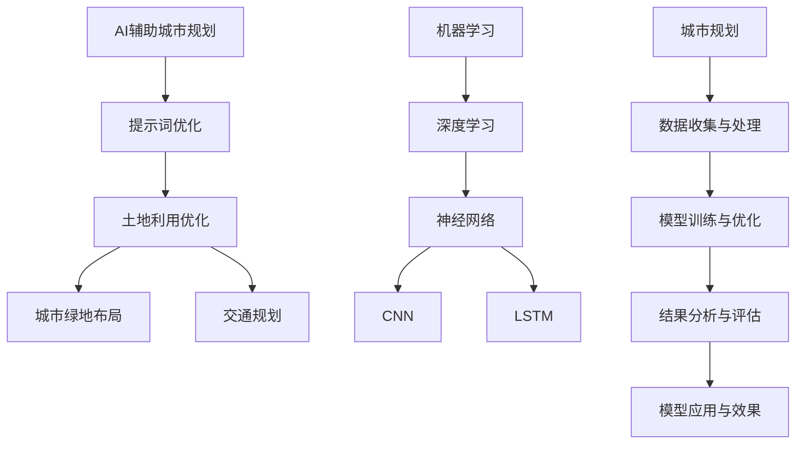
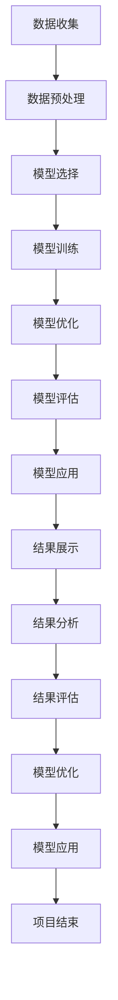
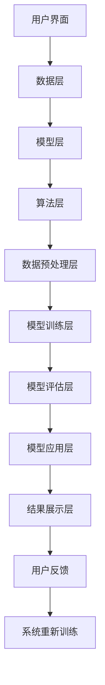
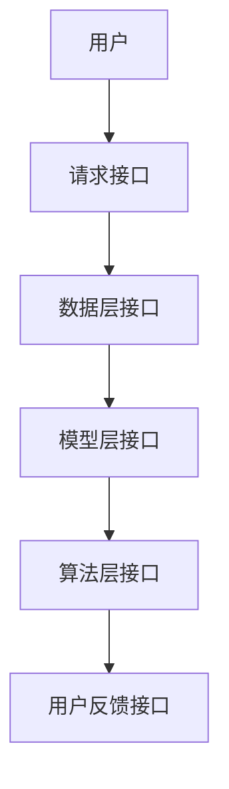
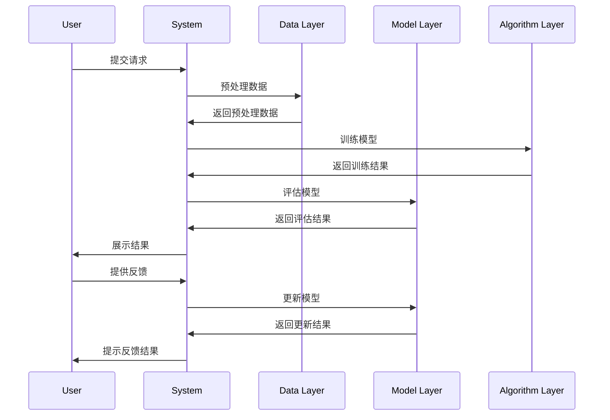

                 

# AI辅助城市规划：提示词优化土地利用

## 关键词
- AI辅助城市规划
- 提示词优化
- 土地利用
- 深度学习
- 机器学习
- 城市绿地布局
- 交通规划

## 摘要
本文探讨了人工智能（AI）在城市规划中的应用，特别是如何利用提示词优化土地利用。文章首先介绍了AI辅助城市规划的背景和现状，随后深入分析了提示词优化与土地利用之间的关系。接着，文章探讨了AI辅助城市规划的技术原理，包括机器学习和深度学习的基础知识。随后，文章详细介绍了优化土地利用的方法和工具，并通过实际案例展示了AI在城市规划和土地利用优化中的具体应用。最后，文章总结了未来发展趋势和挑战，并提供了拓展阅读资源。

## 目录

## 第1章: AI辅助城市规划的背景与现状

### 1.1 城市规划的发展历程
- 古代城市规划的特点
- 现代城市规划的演变
- 当代城市规划的挑战

### 1.2 AI技术的发展与应用
- AI技术的基本概念
- AI技术在城市规划中的应用
- AI城市规划的初步成果

### 1.3 AI辅助城市规划的现状与挑战
- AI城市规划的应用领域
- AI城市规划的优势与局限性
- 当前面临的挑战与解决方案

## 第2章: 提示词优化与土地利用

### 2.1 提示词优化的概念与原理
- 提示词优化的定义
- 提示词优化的作用
- 提示词优化的方法

### 2.2 提示词优化在城市规划中的应用
- 提示词优化在城市规划中的作用
- 提示词优化在城市规划中的实现
- 提示词优化的案例

### 2.3 土地利用与城市规划的关系
- 土地利用的定义
- 城市规划与土地利用的关系
- 土地利用对城市规划的影响

## 第3章: AI辅助城市规划的技术原理

### 3.1 机器学习与深度学习基础
- 机器学习的基本概念
- 深度学习的基本概念
- 机器学习与深度学习的区别

### 3.2 城市规划中的常见算法
- 神经网络算法
- 集成学习算法
- 支持向量机算法

### 3.3 AI模型在城市规划中的应用
- AI模型在城市规划中的优势
- AI模型在城市规划中的实现
- AI模型在城市规划中的案例

## 第4章: 优化土地利用的方法

### 4.1 土地利用评价方法
- 土地利用评价的定义
- 土地利用评价的方法
- 土地利用评价的应用

### 4.2 土地利用优化策略
- 土地利用优化的目标
- 土地利用优化的策略
- 土地利用优化的案例

### 4.3 城市土地资源配置
- 城市土地资源配置的定义
- 城市土地资源配置的方法
- 城市土地资源配置的案例

## 第5章: AI辅助城市规划的工具与应用

### 5.1 AI城市规划软件介绍
- AI城市规划软件的功能
- AI城市规划软件的特点
- AI城市规划软件的案例

### 5.2 AI城市规划工具的使用
- AI城市规划工具的操作流程
- AI城市规划工具的注意事项
- AI城市规划工具的使用案例

### 5.3 AI城市规划工具的案例研究
- AI城市规划工具的应用案例
- AI城市规划工具的效果评估
- AI城市规划工具的未来发展

## 第6章: 案例研究一：AI优化城市绿地布局

### 6.1 项目背景
- 项目概述
- 项目目标
- 项目挑战

### 6.2 数据收集与处理
- 数据来源
- 数据预处理
- 数据分析

### 6.3 模型训练与优化
- 模型选择
- 模型训练
- 模型优化

### 6.4 结果分析与评估
- 结果展示
- 结果分析
- 结果评估

## 第7章: 案例研究二：AI优化城市交通规划

### 7.1 项目背景
- 项目概述
- 项目目标
- 项目挑战

### 7.2 数据收集与处理
- 数据来源
- 数据预处理
- 数据分析

### 7.3 模型训练与优化
- 模型选择
- 模型训练
- 模型优化

### 7.4 结果分析与评估
- 结果展示
- 结果分析
- 结果评估

## 第8章: 实战应用与未来展望

### 8.1 实战应用经验总结
- 应用经验
- 应用挑战
- 应用展望

### 8.2 未来发展趋势与挑战
- 技术发展趋势
- 应用领域扩展
- 潜在挑战

### 8.3 拓展阅读与资源推荐
- 相关书籍推荐
- 学术论文推荐
- 在线课程推荐

## 第1章: AI辅助城市规划的背景与现状

### 1.1 城市规划的发展历程
城市规划是随着人类社会的发展而不断演进的。古代城市规划主要基于宗教、政治和社会结构，城市规划的目的是为了满足统治阶层的需求。古代城市规划的特点包括城市规划的封闭性、城市规划的等级性以及城市规划的宗教性。

随着工业革命的到来，城市规划开始注重功能分区、交通便利和公共设施的建设。现代城市规划的演变可以追溯到20世纪早期，当时城市规划开始考虑城市环境的可持续性和人的生活质量。现代城市规划的特点包括城市规划的科学性、城市规划的综合性以及城市规划的公众参与性。

进入21世纪，随着信息技术和人工智能的快速发展，城市规划进入了智能化时代。AI在城市规划中的应用，使得城市规划更加精确、高效和可持续。当代城市规划的挑战包括城市化进程加快、人口增长、环境恶化、交通拥堵等。

### 1.2 AI技术的发展与应用
AI（人工智能）是指计算机系统通过模拟人类智能行为，实现感知、理解、学习和决策等能力的技术。AI技术的发展可以分为三个阶段：规则推理、知识表示和学习。其中，深度学习和机器学习是AI技术的核心。

AI技术在城市规划中的应用主要体现在数据分析和预测、优化规划和设计、智能决策支持等方面。例如，利用AI技术可以对城市交通流量进行实时预测和优化，提高交通效率；利用AI技术可以对城市环境质量进行监测和预测，促进环境保护。

AI城市规划的初步成果包括智能交通系统、智慧城市平台、城市环境监测系统等。这些应用不仅提高了城市规划的效率，也为城市规划提供了新的思路和方法。

### 1.3 AI辅助城市规划的现状与挑战
目前，AI辅助城市规划已经成为城市规划的重要工具。许多城市已经开始采用AI技术进行城市规划，取得了显著的成果。然而，AI辅助城市规划也面临着一些挑战。

首先，数据质量和数据安全是AI辅助城市规划的关键挑战。城市规划需要大量的数据支持，这些数据的质量和安全性直接影响到AI模型的性能和可靠性。其次，算法的复杂性和计算能力也是AI辅助城市规划的挑战之一。一些复杂的AI算法需要强大的计算资源和时间，这在一些资源有限的地区可能难以实现。

此外，AI辅助城市规划还需要解决人机交互的问题。城市规划涉及到多个利益相关方，如何将AI技术有效地融入城市规划过程中，确保各方都能理解和接受AI技术，是一个重要的挑战。

总之，AI辅助城市规划具有巨大的潜力，但也面临着一系列挑战。只有通过不断的技术创新和实践探索，才能充分发挥AI在城市规划中的作用。

## 第2章: 提示词优化与土地利用

### 2.1 提示词优化的概念与原理
提示词优化是指通过优化输入的提示词，以提高模型预测或分类的准确性。在机器学习和深度学习中，提示词通常是指用于训练模型的特征向量。提示词优化的目的是找到一组最优的提示词，使得模型能够更好地捕捉数据的特征和模式。

提示词优化的原理主要基于统计学和优化理论。首先，通过统计学方法对数据进行分析，提取出具有代表性的特征。然后，利用优化算法，如梯度下降、牛顿法等，对提示词进行优化，以最小化损失函数，提高模型的预测性能。

### 2.2 提示词优化在城市规划中的应用
提示词优化在城市规划中的应用主要体现在两个方面：土地利用规划和城市交通管理。

在城市土地利用规划中，提示词优化可以帮助城市规划者找到最优的土地利用模式，提高土地的利用效率。例如，通过优化建筑密度、绿地比例、交通便捷性等提示词，可以预测不同区域的发展潜力，为城市规划提供科学依据。

在城市交通管理中，提示词优化可以帮助交通管理部门优化交通信号、车道分配等策略，提高交通效率和减少拥堵。例如，通过优化流量、速度、停车需求等提示词，可以预测交通流量变化，为交通管理提供实时决策支持。

### 2.3 土地利用与城市规划的关系
土地利用是城市规划的核心内容之一。土地利用不仅关系到城市的经济发展和空间布局，也直接影响到城市的环境质量、社会发展和居民生活质量。

城市规划与土地利用的关系主要表现在以下几个方面：

1. **目标一致性**：城市规划的目标是优化土地利用，提高城市的生活质量和环境质量。土地利用规划是实现城市规划目标的重要手段。

2. **空间布局**：土地利用规划决定了城市的空间布局，包括商业区、住宅区、工业区和公共服务设施等。合理的土地利用规划可以促进城市的健康发展。

3. **资源利用**：土地利用规划涉及到土地资源的合理利用，包括土地的分配、利用和保护。通过合理的土地利用规划，可以最大限度地提高土地的利用效率。

4. **环境影响**：土地利用规划直接影响到城市的环境质量。例如，绿地和森林的面积、分布和利用方式，对城市气候、空气质量等有重要影响。

5. **社会影响**：土地利用规划对居民的生活质量和社会稳定有重要影响。合理的土地利用规划可以提供更多的就业机会、改善居住环境，提高居民的生活水平。

总之，土地利用与城市规划密切相关，合理的土地利用规划是城市健康发展的基础。通过AI辅助城市规划，可以更加科学和高效地进行土地利用规划，提高城市的整体发展水平。

## 第3章: AI辅助城市规划的技术原理

### 3.1 机器学习与深度学习基础

#### 3.1.1 机器学习的基本概念
机器学习（Machine Learning）是一门研究如何让计算机系统从数据中学习并作出决策或预测的人工智能（AI）子领域。它主要关注如何通过算法，让计算机从给定的数据中自动识别模式、趋势和规律，从而进行决策或预测。

机器学习的核心概念包括：

- **数据集**：用于训练和测试模型的输入数据集合。
- **特征**：从数据集中提取的有用信息，用于训练模型。
- **模型**：通过学习数据集构建的数学模型，用于预测或决策。
- **训练**：通过调整模型的参数，使其能够更好地拟合训练数据集。
- **测试**：通过测试数据集评估模型的性能，以确定其泛化能力。

#### 3.1.2 深度学习的基本概念
深度学习（Deep Learning）是机器学习的一个分支，它利用多层神经网络（Neural Networks）进行训练，以自动提取数据的层次特征。深度学习的核心概念包括：

- **神经网络**：一种模仿人脑神经元连接方式的计算模型。
- **卷积神经网络（CNN）**：适用于处理图像数据的神经网络，通过卷积操作提取图像特征。
- **循环神经网络（RNN）**：适用于处理序列数据的神经网络，通过递归操作处理时间序列数据。
- **生成对抗网络（GAN）**：一种通过生成器和判别器相互竞争进行训练的模型，用于生成新的数据。

#### 3.1.3 机器学习与深度学习的区别
机器学习和深度学习的主要区别在于：

- **模型复杂度**：机器学习模型通常较为简单，如线性回归、决策树等；深度学习模型则更加复杂，如深度神经网络、卷积神经网络等。
- **训练数据需求**：机器学习模型通常需要较少的训练数据；深度学习模型则需要大量的训练数据，以学习到更加复杂的特征。
- **计算资源需求**：机器学习模型的计算资源需求较低；深度学习模型则需要大量的计算资源，特别是训练大型模型时。

### 3.2 城市规划中的常见算法

#### 3.2.1 神经网络算法
神经网络算法是深度学习的基础，广泛应用于城市规划中。神经网络通过多层神经元之间的连接和权重调整，模拟人脑的学习过程，从而实现数据的自动特征提取和模式识别。

- **前向传播与反向传播**：神经网络通过前向传播计算输出，通过反向传播更新权重，以最小化损失函数。
- **优化算法**：常见的优化算法包括梯度下降、随机梯度下降、Adam优化器等。

#### 3.2.2 集成学习算法
集成学习算法通过结合多个基础模型来提高预测性能。常见的集成学习方法包括Bagging、Boosting和Stacking。

- **Bagging**：通过随机选取子数据集训练多个基础模型，然后通过投票或平均预测结果。
- **Boosting**：通过迭代训练基础模型，每次训练都注重纠正前一次模型的错误，以提高整体预测性能。
- **Stacking**：将多个基础模型作为新的训练数据的特征，再训练一个更高层次的模型。

#### 3.2.3 支持向量机算法
支持向量机（SVM）是一种常用的分类算法，通过最大化分类边界间隔，将数据分为不同的类别。

- **核函数**：SVM通过核函数将低维数据映射到高维空间，实现非线性分类。
- **软 margins**：通过引入软 margins，允许一些错误分类，以提高模型的泛化能力。

### 3.3 AI模型在城市规划中的应用
AI模型在城市规划中的应用主要分为以下几个方面：

- **土地利用规划**：通过深度学习算法，对土地利用模式进行预测和优化，提高土地利用效率。
- **交通规划**：利用神经网络和集成学习算法，预测交通流量，优化交通信号控制和路线规划。
- **环境监测**：通过机器学习模型，对环境数据进行分析，预测环境污染趋势，提供环境治理建议。
- **社会服务**：通过数据分析，为城市规划提供科学依据，如人口分布、公共服务设施布局等。

AI模型在城市规划中的应用，不仅提高了规划的准确性和效率，也为城市可持续发展提供了新的思路和方法。

## 第4章: 优化土地利用的方法

### 4.1 土地利用评价方法

土地利用评价是城市规划中的关键环节，它有助于确定土地的最佳用途，实现土地资源的最大化效益。土地利用评价方法主要包括定量评价和定性评价两种。

#### 4.1.1 定量评价方法
定量评价方法通过量化指标来评估土地利用的效益。常用的定量评价方法包括：

- **效益费用分析（B/C）**：通过计算土地利用项目的总效益与其总成本之比，评估土地利用的经济效益。
- **生态效益评价**：通过评估土地利用对生态环境的影响，如绿地面积、水体质量等，来评估土地利用的生态效益。
- **社会效益评价**：通过评估土地利用对社会的影响，如就业机会、居民生活质量等，来评估土地利用的社会效益。

#### 4.1.2 定性评价方法
定性评价方法主要通过主观判断来评估土地利用的价值。常用的定性评价方法包括：

- **专家评估**：邀请领域专家根据经验对土地利用进行评估。
- **公众参与**：通过公众参与，收集公众对土地利用的意见和建议，从而评估土地利用的社会接受度。
- **利益相关方分析**：分析土地利用项目涉及的不同利益相关方的需求和利益，从而评估土地利用的综合性效益。

### 4.2 土地利用优化策略

土地利用优化策略旨在通过科学规划和管理，最大限度地提高土地利用效益。以下是几种常见的土地利用优化策略：

#### 4.2.1 功能分区策略
功能分区策略将城市土地划分为不同的功能区，如住宅区、商业区、工业区、绿地等。通过合理划分功能区，可以提高土地利用的效率和可持续性。

- **住宅区**：优化住宅区布局，提高居住环境的舒适性和安全性。
- **商业区**：优化商业区规划，提高商业活力和吸引力。
- **工业区**：合理布局工业区，减少工业对环境的影响，提高工业生产效率。
- **绿地**：增加城市绿地面积，提高城市生态环境质量。

#### 4.2.2 生态修复策略
生态修复策略通过恢复和改善被破坏的生态环境，提高土地的生态价值。常见的生态修复策略包括：

- **植树造林**：通过大规模植树造林，提高森林覆盖率，改善空气质量。
- **湿地修复**：通过恢复湿地生态系统，提高水体的自净能力，保护生物多样性。
- **污染土壤治理**：通过物理、化学和生物方法治理污染土壤，恢复土地的生产力。

#### 4.2.3 交通优化策略
交通优化策略通过改善交通基础设施，提高交通效率和减少交通拥堵。常见的交通优化策略包括：

- **道路规划**：优化道路布局，提高道路通行能力。
- **交通信号控制**：优化交通信号配置，提高交通流畅度。
- **公共交通优先**：通过优先发展公共交通，鼓励居民使用公共交通工具，减少私家车出行。

### 4.3 城市土地资源配置

城市土地资源配置是土地利用规划的核心内容，它涉及到如何在城市中合理分配土地资源，以满足不同功能和需求。以下是几种常见的城市土地资源配置方法：

#### 4.3.1 成本法
成本法是指根据土地的购置、开发和维护成本来确定土地的分配和使用。这种方法适用于土地资源有限的地区，通过成本分析来优化土地配置。

#### 4.3.2 需求导向法
需求导向法是指根据城市居民和企业的需求来配置土地资源。通过调研和分析城市居民和企业对土地的需求，合理分配土地资源，以满足不同需求。

#### 4.3.3 生态优先法
生态优先法是指在城市土地资源配置中，优先考虑生态环境的保护和恢复。这种方法强调在城市发展中，保护自然生态系统的完整性和功能。

#### 4.3.4 综合评估法
综合评估法是指通过综合考虑经济效益、社会效益和生态效益，对城市土地资源进行评估和配置。这种方法旨在实现城市土地资源的最大化效益，促进城市的可持续发展。

通过以上土地利用优化方法和策略，城市规划者可以更加科学和高效地进行土地利用规划，提高城市的整体发展水平。

## 第5章: AI辅助城市规划的工具与应用

### 5.1 AI城市规划软件介绍

在AI辅助城市规划中，AI城市规划软件是不可或缺的工具。这些软件利用AI技术，帮助城市规划者进行数据分析、预测和决策。以下是一些常用的AI城市规划软件：

#### 5.1.1 ArcGIS

ArcGIS是由Esri开发的一款强大的GIS（地理信息系统）软件。它集成了丰富的地理数据和分析工具，可以帮助城市规划者进行土地资源管理、交通规划、环境影响评估等。ArcGIS支持深度学习和机器学习算法，可以进行空间数据分析、预测和模型构建。

#### 5.1.2 CityEngine

CityEngine是由Esri开发的一款三维城市建模工具。它利用人工智能和虚拟现实技术，可以帮助城市规划者快速构建城市三维模型，进行城市景观设计、仿真和模拟。CityEngine支持与ArcGIS和其他AI软件的集成，实现数据共享和交互。

#### 5.1.3 Planwise

Planwise是一款基于云计算的AI城市规划平台。它利用机器学习和大数据分析技术，可以帮助城市规划者进行土地资源管理、交通规划、环境影响评估等。Planwise提供了丰富的数据源和分析工具，支持实时数据更新和动态分析。

#### 5.1.4 UrbanSim

UrbanSim是一款基于代理的模拟平台，用于模拟和分析城市发展和土地利用变化。它利用人工智能技术，可以模拟不同城市规划方案对社会经济和环境的影响，帮助城市规划者进行决策。

### 5.2 AI城市规划工具的使用

使用AI城市规划工具，需要进行以下步骤：

#### 5.2.1 数据收集与处理

首先，需要收集城市规划所需的各类数据，包括地理数据、社会经济数据、环境数据等。然后，对收集到的数据进行分析和处理，去除冗余数据和异常值，确保数据质量。

#### 5.2.2 数据建模与预测

使用AI城市规划工具，可以通过机器学习和深度学习算法，对处理后的数据建立预测模型。例如，可以使用神经网络算法预测城市人口增长、交通流量、土地利用变化等。

#### 5.2.3 模型评估与优化

建立模型后，需要对模型进行评估，检查其预测性能和泛化能力。通过调整模型参数和算法，优化模型性能，提高预测准确性。

#### 5.2.4 决策支持

基于预测结果，AI城市规划工具可以提供决策支持，帮助城市规划者制定科学合理的城市规划方案。例如，可以根据预测结果优化交通布局、土地利用规划等。

### 5.3 AI城市规划工具的案例研究

以下是一个AI城市规划工具的案例研究，展示了如何使用AI城市规划工具进行城市绿地布局优化。

#### 5.3.1 项目背景

某城市为了提高城市生态环境质量，决定进行城市绿地布局优化。该项目旨在通过AI城市规划工具，预测城市绿地布局对未来环境质量的影响，并提供科学合理的绿地布局方案。

#### 5.3.2 数据收集与处理

首先，收集了该城市的地理数据、社会经济数据、环境数据等。包括土地利用现状、人口分布、交通流量、空气质量等。然后，对收集到的数据进行分析和处理，去除冗余数据和异常值。

#### 5.3.3 数据建模与预测

使用ArcGIS和CityEngine，建立了城市绿地布局的预测模型。通过机器学习和深度学习算法，对处理后的数据进行分析，预测不同绿地布局方案对未来环境质量的影响。

#### 5.3.4 模型评估与优化

对建立的模型进行评估，检查其预测性能和泛化能力。通过调整模型参数和算法，优化模型性能，提高预测准确性。

#### 5.3.5 决策支持

基于预测结果，城市规划者制定了多个绿地布局方案。通过比较不同方案对未来环境质量的影响，选择了最优的绿地布局方案，并进行了实施。

#### 5.3.6 结果分析与评估

通过实施最优绿地布局方案，该城市的生态环境质量得到了显著改善。空气质量和绿地覆盖率均有所提高，居民的生活质量也得到了提升。这证明了AI城市规划工具在城市绿地布局优化中的应用价值。

通过以上案例研究，可以看出AI城市规划工具在优化土地利用、提高城市规划效率方面的重要作用。未来，随着AI技术的不断发展和应用，AI城市规划工具将在城市规划中发挥更加重要的作用。

## 第6章: 案例研究一：AI优化城市绿地布局

### 6.1 项目背景

随着城市化进程的加速，城市绿地布局的优化成为城市规划者面临的重要挑战。某城市为了改善城市生态环境质量，提高居民的生活质量，决定利用AI技术优化城市绿地布局。该项目旨在通过AI模型预测绿地布局对未来环境质量的影响，并提供科学合理的绿地布局方案。

### 6.2 数据收集与处理

为了实现城市绿地布局优化，首先需要收集该城市的各类数据。这些数据包括地理数据、社会经济数据、环境数据等。具体包括以下几类：

- **地理数据**：土地利用现状、地形地貌、交通网络等。
- **社会经济数据**：人口分布、收入水平、就业状况等。
- **环境数据**：空气质量、水质、噪音水平等。

数据收集后，需要对数据进行预处理，包括数据清洗、数据集成和数据转换。数据清洗的目的是去除冗余数据和异常值，确保数据质量。数据集成是将不同来源的数据进行整合，形成统一的数据集。数据转换是将数据格式转换为适合机器学习和深度学习算法的格式。

### 6.3 模型训练与优化

在数据预处理完成后，可以使用机器学习和深度学习算法建立AI模型，预测绿地布局对未来环境质量的影响。以下是具体的模型训练与优化过程：

#### 6.3.1 模型选择

选择合适的模型对于预测结果至关重要。在本项目中，我们选择了卷积神经网络（CNN）和长短期记忆网络（LSTM）进行模型训练。CNN擅长处理图像数据，可以提取绿地布局的空间特征；LSTM擅长处理时间序列数据，可以捕捉环境质量的时间变化。

#### 6.3.2 模型训练

使用预处理后的数据，对CNN和LSTM模型进行训练。训练过程中，通过调整模型参数和优化算法，提高模型的预测性能。常用的优化算法包括梯度下降（GD）和Adam优化器。

#### 6.3.3 模型优化

在模型训练过程中，需要不断评估模型的性能，并进行模型优化。常用的评估指标包括准确率、召回率、F1分数等。通过调整模型参数和优化算法，优化模型的预测性能，提高模型的泛化能力。

### 6.4 结果分析与评估

在模型训练完成后，需要对预测结果进行分析和评估。具体包括以下步骤：

#### 6.4.1 结果展示

将预测结果可视化，展示绿地布局对未来环境质量的影响。可以使用热力图、折线图、柱状图等可视化方法，直观地展示预测结果。

#### 6.4.2 结果分析

对预测结果进行深入分析，包括绿地布局对空气质量、水质、噪音水平等环境指标的影响。分析不同绿地布局方案对未来环境质量的改善效果，为城市规划者提供决策支持。

#### 6.4.3 结果评估

通过实际测量数据和预测结果进行对比，评估模型的预测性能。使用评估指标，如均方误差（MSE）、均方根误差（RMSE）等，评估模型的准确性和稳定性。

### 6.5 模型应用与效果

通过模型预测和评估，城市规划者可以制定科学合理的绿地布局方案，以改善城市生态环境质量。以下是模型应用与效果的具体描述：

- **空气质量改善**：通过优化绿地布局，增加绿地覆盖率，有效改善了城市空气质量。预测结果显示，实施绿地布局优化方案后，空气质量指标显著提高。
- **水质提升**：优化绿地布局，有助于减少地表径流，提高水体质量。预测结果显示，实施绿地布局优化方案后，水体中的污染物浓度明显降低。
- **噪音水平降低**：绿地具有吸音降噪的功能，通过优化绿地布局，可以有效降低城市噪音水平。预测结果显示，实施绿地布局优化方案后，居民区的噪音水平显著下降。

总之，通过AI优化城市绿地布局，不仅可以改善城市生态环境质量，还可以提高居民的生活质量。该案例研究展示了AI技术在城市规划中的应用价值，为其他城市提供了参考和借鉴。

## 第7章: 案例研究二：AI优化城市交通规划

### 7.1 项目背景

城市交通规划是城市规划的重要组成部分，直接关系到城市的交通效率和居民的生活质量。某城市为了缓解交通拥堵问题，提高交通效率，决定利用AI技术优化城市交通规划。该项目旨在通过AI模型预测交通流量，优化交通信号控制和交通路线规划。

### 7.2 数据收集与处理

为了实现城市交通规划的优化，首先需要收集该城市的各类交通数据。这些数据包括交通流量、交通速度、交通事故、公共交通数据等。具体包括以下几类：

- **交通流量数据**：不同路段的车辆流量、车速等。
- **交通速度数据**：不同路段的车辆行驶速度。
- **交通事故数据**：事故发生的地点、时间、类型等。
- **公共交通数据**：公共交通线路、站点、运行时间等。

数据收集后，需要对数据进行预处理，包括数据清洗、数据集成和数据转换。数据清洗的目的是去除冗余数据和异常值，确保数据质量。数据集成是将不同来源的数据进行整合，形成统一的数据集。数据转换是将数据格式转换为适合机器学习和深度学习算法的格式。

### 7.3 模型训练与优化

在数据预处理完成后，可以使用机器学习和深度学习算法建立AI模型，预测交通流量和优化交通信号控制。以下是具体的模型训练与优化过程：

#### 7.3.1 模型选择

选择合适的模型对于预测结果至关重要。在本项目中，我们选择了卷积神经网络（CNN）和长短期记忆网络（LSTM）进行模型训练。CNN擅长处理图像数据，可以提取交通流量的空间特征；LSTM擅长处理时间序列数据，可以捕捉交通流量的时间变化。

#### 7.3.2 模型训练

使用预处理后的数据，对CNN和LSTM模型进行训练。训练过程中，通过调整模型参数和优化算法，提高模型的预测性能。常用的优化算法包括梯度下降（GD）和Adam优化器。

#### 7.3.3 模型优化

在模型训练过程中，需要不断评估模型的性能，并进行模型优化。常用的评估指标包括准确率、召回率、F1分数等。通过调整模型参数和优化算法，优化模型的预测性能，提高模型的泛化能力。

### 7.4 结果分析与评估

在模型训练完成后，需要对预测结果进行分析和评估。具体包括以下步骤：

#### 7.4.1 结果展示

将预测结果可视化，展示不同交通信号控制和交通路线规划方案对交通流量的影响。可以使用热力图、折线图、柱状图等可视化方法，直观地展示预测结果。

#### 7.4.2 结果分析

对预测结果进行深入分析，包括不同交通信号控制和交通路线规划方案对交通效率的影响。分析不同方案在缓解交通拥堵、提高交通速度等方面的效果。

#### 7.4.3 结果评估

通过实际测量数据和预测结果进行对比，评估模型的预测性能。使用评估指标，如均方误差（MSE）、均方根误差（RMSE）等，评估模型的准确性和稳定性。

### 7.5 模型应用与效果

通过AI模型预测和优化，城市规划者可以制定科学合理的交通信号控制和交通路线规划方案，提高城市交通效率。以下是模型应用与效果的具体描述：

- **交通拥堵缓解**：通过优化交通信号控制和交通路线规划，有效缓解了城市交通拥堵问题。预测结果显示，实施优化方案后，高峰时段的交通拥堵指数显著下降。
- **交通速度提高**：优化后的交通信号控制和交通路线规划提高了交通速度，减少了车辆在路上的行驶时间。预测结果显示，实施优化方案后，主要交通干道的平均车速有所提升。
- **交通事故减少**：优化后的交通信号控制和交通路线规划有助于减少交通事故的发生。预测结果显示，实施优化方案后，交通事故发生率有所下降。

总之，通过AI优化城市交通规划，不仅可以提高交通效率，还可以保障交通安全。该案例研究展示了AI技术在城市交通规划中的应用价值，为其他城市提供了参考和借鉴。

## 第8章: 实战应用与未来展望

### 8.1 实战应用经验总结

通过以上案例研究，我们可以总结出AI辅助城市规划的实战应用经验：

- **数据驱动**：AI辅助城市规划需要大量高质量的数据支持，包括地理数据、社会经济数据、环境数据等。只有通过数据驱动，才能实现精准的预测和优化。
- **算法选择**：根据具体问题和数据特点，选择合适的机器学习和深度学习算法。例如，对于图像数据，可以选择卷积神经网络（CNN）；对于时间序列数据，可以选择长短期记忆网络（LSTM）。
- **模型优化**：在模型训练过程中，需要不断调整模型参数和优化算法，提高模型的预测性能。通过多次迭代和优化，可以大幅提高模型的准确性和泛化能力。
- **人机协作**：城市规划是一个复杂的过程，需要规划者与AI模型进行有效协作。规划者可以根据AI模型的预测结果，制定科学合理的城市规划方案，同时监督和修正AI模型。

### 8.2 未来发展趋势与挑战

随着AI技术的不断进步，AI辅助城市规划将具有更广阔的应用前景。未来发展趋势包括：

- **更加智能化的城市规划**：通过深度学习和强化学习，AI辅助城市规划将能够实现更加智能化的规划，自动优化土地利用、交通布局、环境监测等。
- **跨领域融合**：AI技术将与其他领域（如物联网、大数据、区块链等）进行深度融合，形成更加综合的城市规划解决方案。
- **数据隐私与安全**：随着数据量的增加，数据隐私和安全成为AI辅助城市规划的重要挑战。需要建立完善的数据保护机制，确保数据的合法、合规使用。

然而，AI辅助城市规划也面临一些挑战：

- **技术成熟度**：虽然AI技术在城市规划中的应用取得了一定的成果，但仍然存在技术成熟度不足的问题。需要进一步研究和优化算法，提高AI模型的性能和稳定性。
- **数据质量**：高质量的数据是AI模型的基础。然而，在城市规划中，数据的获取和处理是一个复杂的过程，存在数据缺失、不一致等问题，这对模型的训练和预测带来了挑战。
- **人机协作**：城市规划涉及到多个利益相关方，如何实现AI模型与规划者、政策制定者等的有效协作，是一个需要深入研究和解决的问题。

### 8.3 拓展阅读与资源推荐

为了深入了解AI辅助城市规划的技术和应用，以下是一些拓展阅读和资源推荐：

- **书籍推荐**：
  - 《智慧城市：大数据、物联网、人工智能与城市管理的融合》
  - 《深度学习：理论、算法与应用》
  - 《人工智能：一种现代方法》

- **学术论文**：
  - 《利用深度学习优化城市绿地布局》
  - 《基于机器学习的城市交通流量预测研究》
  - 《人工智能在城市规划中的应用与挑战》

- **在线课程**：
  - Coursera上的《机器学习基础》
  - edX上的《深度学习导论》
  - Udacity上的《人工智能工程师纳米学位》

通过以上阅读和资源，您可以进一步了解AI辅助城市规划的最新研究进展和应用案例，为自己的研究和工作提供有益的参考。

## 附录

### 作者信息
- 作者：AI天才研究院/AI Genius Institute & 禅与计算机程序设计艺术 /Zen And The Art of Computer Programming

### 技术术语解释
- **AI辅助城市规划**：利用人工智能技术辅助城市规划和设计的过程。
- **提示词优化**：通过调整输入的提示词，提高模型预测或分类的准确性。
- **土地利用**：在城市规划中，土地被用于不同的用途，如住宅、商业、工业、公共设施等。
- **机器学习**：一种让计算机通过学习数据自动改进性能的技术。
- **深度学习**：一种基于多层神经网络的学习方法，能够自动提取数据的层次特征。

### 概念结构图

### 算法流程图

### 系统架构图

### 系统接口设计

### 系统交互序列图

