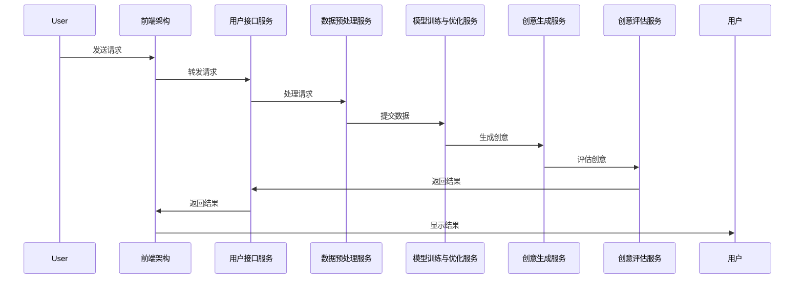

                 

# AI辅助广告创意：提示词生成营销文案

> 关键词：AI辅助广告创意，提示词生成，营销文案，自然语言处理，生成对抗网络，强化学习，系统架构设计，实战案例

> 摘要：本文将深入探讨AI辅助广告创意领域，特别是提示词生成和营销文案创作技术。我们将从问题背景、核心概念、技术原理、实践应用等多个方面展开，帮助读者理解如何利用AI技术提升广告创意的质量和效果。文章将包括AI辅助广告创意的概述、技术原理讲解、系统分析与架构设计，以及项目实战等内容。

----------------------------------------------------------------

## 目录大纲

----------------------------------------------------------------

# 第一部分：AI辅助广告创意概述

## 第1章：问题背景与核心概念

### 1.1.1 AI与广告行业的融合

### 1.1.2 广告创意的重要性

### 1.1.3 AI辅助广告创意的概念与意义

### 1.1.4 AI辅助广告创意的边界与外延

## 第2章：核心概念与联系

### 2.1.1 广告创意的核心概念

### 2.1.2 AI技术的基本原理

### 2.1.3 提示词生成与营销文案创作

### 2.1.4 概念属性特征对比表格

### 2.1.5 AI辅助广告创意的ER实体关系图

----------------------------------------------------------------

# 第二部分：AI辅助广告创意的技术原理

## 第3章：AI辅助广告创意技术概述

### 3.1.1 自然语言处理技术

### 3.1.2 生成对抗网络

### 3.1.3 强化学习

### 3.1.4 聚类分析

### 3.1.5 数据挖掘与信息检索

## 第4章：算法原理讲解

### 4.1.1 基于GPT的提示词生成

#### 4.1.1.1 GPT模型的基本原理

#### 4.1.1.2 GPT模型在提示词生成中的应用

#### 4.1.1.3 GPT模型的工作流程

### 4.1.2 基于BERT的营销文案创作

#### 4.1.2.1 BERT模型的基本原理

#### 4.1.2.2 BERT模型在营销文案创作中的应用

#### 4.1.2.3 BERT模型的工作流程

### 4.1.3 基于强化学习的创意优化

#### 4.1.3.1 强化学习的基本原理

#### 4.1.3.2 强化学习在创意优化中的应用

#### 4.1.3.3 强化学习的工作流程

## 第5章：数学模型与公式讲解

### 5.1.1 提示词生成算法的数学模型

#### 5.1.1.1 条件概率模型

#### 5.1.1.2 生成模型

#### 5.1.1.3 强化学习目标函数

### 5.1.2 营销文案创作的数学模型

#### 5.1.2.1 文本生成模型

#### 5.1.2.2 文本分类模型

#### 5.1.2.3 文本相似度计算

----------------------------------------------------------------

# 第三部分：AI辅助广告创意实践

## 第6章：系统分析与架构设计

### 6.1.1 问题场景介绍

### 6.1.2 系统功能设计

#### 6.1.2.1 领域模型

#### 6.1.2.2 功能模块划分

### 6.1.3 系统架构设计

#### 6.1.3.1 系统架构

#### 6.1.3.2 系统模块详解

### 6.1.4 系统接口设计

#### 6.1.4.1 接口规范

#### 6.1.4.2 接口实现

### 6.1.5 系统交互

#### 6.1.5.1 交互流程

#### 6.1.5.2 交互细节

----------------------------------------------------------------

## 第7章：项目实战

### 6.7.1 环境安装

#### 6.7.1.1 环境搭建

#### 6.7.1.2 环境配置

### 6.7.2 系统核心实现

#### 6.7.2.1 核心算法实现

#### 6.7.2.2 核心模块实现

### 6.7.3 代码应用解读与分析

#### 6.7.3.1 代码结构分析

#### 6.7.3.2 关键代码解读

### 6.7.4 实际案例分析与讲解

#### 6.7.4.1 案例背景

#### 6.7.4.2 案例分析

#### 6.7.4.3 案例解读

### 6.7.5 项目小结

#### 6.7.5.1 项目总结

#### 6.7.5.2 项目拓展

----------------------------------------------------------------

# 第四部分：最佳实践与总结

## 第8章：最佳实践

### 8.1.1 广告创意的优化策略

#### 8.1.1.1 提示词优化

#### 8.1.1.2 文案创作优化

### 8.1.2 数据处理与质量控制

#### 8.1.2.1 数据预处理

#### 8.1.2.2 数据质量评估

#### 8.1.2.3 数据质量改进策略

----------------------------------------------------------------

----------------------------------------------------------------

### 第一部分：AI辅助广告创意概述

#### 第1章：问题背景与核心概念

#### 1.1.1 AI与广告行业的融合

随着人工智能技术的飞速发展，AI在各个行业的应用越来越广泛。广告行业作为信息传播的重要渠道，也逐渐开始拥抱AI技术。AI与广告行业的融合，不仅提升了广告投放的精准度和效率，也为广告创意带来了新的机遇和挑战。

首先，AI技术能够通过对海量用户数据的分析和挖掘，精准定位潜在客户群体。通过用户行为分析、兴趣偏好挖掘等手段，广告主可以更准确地投放广告，提高广告的点击率和转化率。

其次，AI技术能够通过自然语言处理（NLP）和生成对抗网络（GAN）等技术，自动生成富有创意的广告文案和图片。这不仅节省了广告创作的时间和成本，还能够提高广告的吸引力和独特性。

#### 1.1.2 广告创意的重要性

广告创意是广告的灵魂，它决定了广告是否能够吸引目标受众的注意力，并产生深远的品牌影响。一个成功的广告创意应该具备以下几个特点：

1. 独特性：广告创意要有鲜明的个性，能够与其他广告区分开来，给人留下深刻的印象。
2. 吸引力：广告创意要能够引起目标受众的兴趣，激发他们的好奇心和探索欲望。
3. 创新性：广告创意要具备创新思维，运用新颖的创意手法和表现方式，打破传统广告的束缚。
4. 实用性：广告创意要能够为受众提供有价值的信息，解决他们的实际问题，提高他们的生活品质。

#### 1.1.3 AI辅助广告创意的概念与意义

AI辅助广告创意是指利用人工智能技术，如自然语言处理（NLP）、生成对抗网络（GAN）、强化学习等，自动生成广告文案和图片的过程。它具有以下几个方面的意义：

1. 提高创作效率：传统广告创意需要广告团队投入大量时间和精力进行创作，而AI辅助广告创意能够大大缩短创作周期，提高工作效率。
2. 提升创意质量：AI技术能够通过深度学习，不断优化广告文案和图片的生成质量，使广告更具吸引力。
3. 降低创作成本：AI辅助广告创意能够减少对人力和物力的依赖，降低广告创作的成本。
4. 拓展创意思维：AI技术能够生成新颖、独特的广告文案和图片，为广告创作提供更多的创意灵感。

#### 1.1.4 AI辅助广告创意的边界与外延

AI辅助广告创意的边界主要涉及以下几个方面：

1. 技术层面：包括自然语言处理（NLP）、生成对抗网络（GAN）、强化学习等技术的应用。
2. 应用层面：包括广告文案生成、广告图片生成、广告创意优化等具体应用场景。
3. 数据层面：包括用户行为数据、市场数据、广告创意数据等的数据来源和处理。

AI辅助广告创意的外延则包括以下几个方面：

1. 广告创意策略优化：通过AI技术，分析广告投放效果，优化广告创意策略，提高广告效果。
2. 广告效果预测：利用AI技术，预测广告投放后的效果，为广告主提供决策支持。
3. 广告创意评估：利用AI技术，对广告创意进行评估，筛选出最具潜力的广告创意。
4. 广告创意创新：通过AI技术，探索新的广告创意形式，引领广告行业的创新发展。

### 1.1.5 概念属性特征对比表格

下面是广告创意和AI辅助广告创意的一些关键概念属性特征对比表格：

| 特征         | 广告创意        | AI辅助广告创意         |
| ------------ | --------------- | -------------------- |
| 创意来源     | 人力创作        | 数据驱动，人工智能生成  |
| 创意质量     | 依赖创作者经验   | 依托算法，不断优化提升  |
| 创意效率     | 时间成本较高     | 高效快速，降低创作成本  |
| 创意多样性   | 有限的人创意     | 丰富多样，创意无限     |
| 创意评估     | 人工评估        | 数据分析与算法评估     |

### 1.1.6 AI辅助广告创意的ER实体关系图

以下是AI辅助广告创意的ER实体关系图，展示了广告创意生成过程中涉及的关键实体和关系：

```mermaid
erDiagram
  Customer ||--|{ Advertisement }|-- UserBehaviorData
  Advertisement ||--|{ AdCreative }|-- AdEffectData
  AdCreative ||--|{ AdContent }|-- AdPerformanceData
  AdContent ||--|{ AdText }|-- AdFeedbackData
  AdContent ||--|{ AdImage }|-- AdFeedbackData
  UserBehaviorData ||--|{ InterestProfile }|-- AdTargeting
  AdEffectData ||--|{ ClickThroughRate }|-- AdStrategyOptimization
  AdPerformanceData ||--|{ ConversionRate }|-- AdStrategyOptimization
  AdFeedbackData ||--|{ UserFeedback }|-- AdStrategyOptimization
```

#### 第2章：核心概念与联系

#### 2.1.1 广告创意的核心概念

广告创意是指为了吸引目标受众的注意力，通过独特、创新、有吸引力的方式呈现广告内容的过程。广告创意的核心概念包括以下几个方面：

1. **目标受众**：广告创意的第一步是确定目标受众，了解他们的需求和兴趣，以便创作出能够吸引他们的广告内容。
2. **创意理念**：创意理念是广告创意的核心思想，它决定了广告的整体风格和调性。
3. **广告文案**：广告文案是广告创意的重要组成部分，它通过简洁、有吸引力的语言传达产品或服务的特点和优势。
4. **广告视觉**：广告视觉包括广告图片、视频等视觉元素，它们通过视觉效果增强广告的吸引力。
5. **广告投放**：广告投放是指将广告发布到不同的媒体渠道，如社交媒体、搜索引擎、新闻网站等，以覆盖更多的目标受众。

#### 2.1.2 AI技术的基本原理

AI技术，即人工智能技术，是指通过计算机模拟人类智能，使计算机具备感知、学习、推理、决策等能力的技术。AI技术的基本原理包括以下几个方面：

1. **机器学习**：机器学习是AI的核心技术之一，它通过数据训练模型，使计算机具备自主学习和改进的能力。
2. **深度学习**：深度学习是机器学习的一种，它通过多层神经网络模拟人类大脑的学习过程，处理复杂的特征和模式。
3. **自然语言处理（NLP）**：NLP是AI技术在语言处理领域的应用，它使计算机能够理解、生成和处理人类语言。
4. **计算机视觉**：计算机视觉是AI技术在图像处理和识别领域的应用，它使计算机能够理解和分析图像内容。
5. **强化学习**：强化学习是一种通过试错和反馈进行决策的AI技术，它使计算机在特定环境中找到最优策略。

#### 2.1.3 提示词生成与营销文案创作

提示词生成和营销文案创作是AI辅助广告创意的两个重要方面，它们分别涉及以下技术和原理：

1. **提示词生成**：
   - **技术原理**：提示词生成通常基于自然语言处理技术，如序列到序列（Seq2Seq）模型、生成对抗网络（GAN）等。这些模型通过学习大量的文本数据，能够根据给定的提示词生成完整的句子或段落。
   - **应用场景**：提示词生成可以应用于广告标题生成、微博文案创作等场景，帮助广告主快速生成高质量的文案。

2. **营销文案创作**：
   - **技术原理**：营销文案创作通常基于文本生成模型，如变分自编码器（VAE）、生成对抗网络（GAN）等。这些模型能够生成具有吸引力和说服力的广告文案，提高广告的效果。
   - **应用场景**：营销文案创作可以应用于广告正文创作、促销文案撰写等场景，帮助广告主提高广告的转化率。

#### 2.1.4 概念属性特征对比表格

以下是广告创意、AI技术和提示词生成与营销文案创作的一些关键概念属性特征对比表格：

| 概念                 | 广告创意       | AI技术            | 提示词生成与营销文案创作           |
| -------------------- | -------------- | ----------------- | -------------------------------- |
| 创意来源             | 人工创作       | 自动生成          | 数据驱动，人工智能辅助             |
| 创意质量             | 依赖创作者经验   | 依托算法，不断优化 | 高质量文本生成，个性化文案创作     |
| 创意效率             | 时间成本较高     | 高效快速          | 短时间内生成大量文案              |
| 创意多样性           | 有限的人创意     | 丰富多样          | 创造新颖、独特的文案              |
| 创意评估             | 人工评估        | 数据分析与算法评估 | 自动评估文案效果，优化创意策略     |

#### 2.1.5 AI辅助广告创意的ER实体关系图

以下是AI辅助广告创意的ER实体关系图，展示了广告创意生成过程中涉及的关键实体和关系：

```mermaid
erDiagram
  Advertiser ||--|{ Campaign }|-- AdContent
  Advertiser ||--|{ CreativeStrategy }|-- AdContent
  Campaign ||--|{ AdGroup }|-- AdContent
  Campaign ||--|{ Budget }|-- Advertiser
  CreativeStrategy ||--|{ CreativeTheme }|-- AdContent
  CreativeStrategy ||--|{ OptimizationGoal }|-- Advertiser
  AdContent ||--|{ AdTitle }|-- AdPerformanceData
  AdContent ||--|{ AdDescription }|-- AdPerformanceData
  AdContent ||--|{ AdImage }|-- AdPerformanceData
  AdPerformanceData ||--|{ ClickThroughRate }|-- Campaign
  AdPerformanceData ||--|{ ConversionRate }|-- Campaign
  AdPerformanceData ||--|{ AdFeedback }|-- CreativeStrategy
```

### 第二部分：AI辅助广告创意的技术原理

#### 第3章：AI辅助广告创意技术概述

AI辅助广告创意涉及多种技术，每种技术都有其独特的原理和应用。以下是这些技术的概述：

#### 3.1.1 自然语言处理技术

自然语言处理（NLP）是人工智能的一个重要分支，它致力于使计算机能够理解、生成和处理人类语言。NLP技术主要包括：

1. **分词**：将连续的文本切分成词语。
2. **词性标注**：为每个词语标注其词性，如名词、动词等。
3. **句法分析**：分析句子的结构，确定词语之间的关系。
4. **语义理解**：理解文本的含义，提取关键信息。
5. **文本生成**：根据给定的提示生成文本。

NLP在广告创意中的应用包括：

- **标题生成**：根据广告内容自动生成吸引人的标题。
- **描述生成**：根据产品特点自动生成广告描述。
- **文案优化**：分析现有文案，提供优化建议。

#### 3.1.2 生成对抗网络

生成对抗网络（GAN）是一种深度学习模型，由生成器（Generator）和判别器（Discriminator）组成。生成器生成数据，判别器判断数据是真实数据还是生成数据。通过不断地训练，生成器逐渐生成越来越逼真的数据。

GAN在广告创意中的应用包括：

- **图像生成**：根据文本描述生成广告图片。
- **广告视频生成**：根据脚本生成广告视频。
- **创意优化**：生成不同的广告创意，选择最佳效果。

#### 3.1.3 强化学习

强化学习是一种通过试错和反馈进行决策的机器学习技术。在强化学习中，智能体通过不断地尝试和接收反馈，学习如何最大化累积奖励。

强化学习在广告创意中的应用包括：

- **广告投放策略优化**：根据用户反馈和广告效果，优化广告投放策略。
- **广告创意评估**：通过模拟用户行为，评估不同广告创意的效果。

#### 3.1.4 聚类分析

聚类分析是一种无监督学习方法，它将数据集划分为若干个簇，使得同一簇内的数据点相似，不同簇的数据点差异较大。

聚类分析在广告创意中的应用包括：

- **用户群体划分**：根据用户行为和兴趣，将用户划分为不同的群体。
- **广告创意策略优化**：针对不同用户群体，制定个性化的广告创意策略。

#### 3.1.5 数据挖掘与信息检索

数据挖掘与信息检索是处理大量数据以发现有价值信息的技术。

数据挖掘在广告创意中的应用包括：

- **市场趋势分析**：分析市场数据，预测未来趋势，指导广告创意。
- **用户行为分析**：通过分析用户行为数据，了解用户需求，优化广告创意。

信息检索在广告创意中的应用包括：

- **关键词提取**：从广告内容中提取关键词，用于搜索引擎优化（SEO）。
- **广告推荐**：基于用户历史行为和兴趣，推荐相关广告。

#### 第4章：算法原理讲解

##### 4.1.1 基于GPT的提示词生成

**4.1.1.1 GPT模型的基本原理**

GPT（Generative Pre-trained Transformer）是一种基于Transformer架构的自然语言处理模型。它通过预训练的方式，在大量文本数据上进行训练，学习文本的语法和语义规律。GPT模型的基本原理如下：

1. **Transformer架构**：Transformer是一种基于注意力机制的序列模型，它通过多头自注意力机制和位置编码，处理长距离依赖问题。
2. **预训练**：GPT模型在预训练阶段，使用大量的无标签文本数据，通过自回归的方式生成文本，学习文本的统计规律。
3. **微调**：在特定任务上，如提示词生成，对GPT模型进行微调，使其适应特定任务的需求。

**4.1.1.2 GPT模型在提示词生成中的应用**

GPT模型在提示词生成中的应用主要基于其预训练能力，具体过程如下：

1. **输入提示词**：给定一个提示词，如“iPhone”，GPT模型会生成与该提示词相关的文本。
2. **生成文本**：GPT模型通过自回归的方式，生成与提示词相关的文本，如“iPhone是苹果公司的一款智能手机”。
3. **文本优化**：生成的文本可能包含一些语法和语义错误，通过后续的优化步骤，如去噪、文本增强等，提高文本质量。

**4.1.1.3 GPT模型的工作流程**

GPT模型的工作流程包括以下几个步骤：

1. **数据预处理**：对输入文本进行清洗、分词、编码等预处理操作。
2. **模型初始化**：初始化GPT模型，包括Transformer架构和预训练参数。
3. **预训练**：在大量文本数据上进行预训练，学习文本的统计规律。
4. **微调**：在特定任务上，如提示词生成，对GPT模型进行微调。
5. **文本生成**：给定提示词，生成与提示词相关的文本。
6. **文本优化**：对生成的文本进行优化，提高文本质量。

##### 4.1.2 基于BERT的营销文案创作

**4.1.2.1 BERT模型的基本原理**

BERT（Bidirectional Encoder Representations from Transformers）是一种基于Transformer的双向编码模型。它通过双向注意力机制，同时考虑文本的前后关系，学习文本的语义表示。BERT模型的基本原理如下：

1. **Transformer架构**：BERT模型基于Transformer架构，通过多头自注意力机制，学习文本的内部关系。
2. **双向编码**：BERT模型通过双向编码，同时考虑文本的前后关系，学习文本的语义表示。
3. **预训练**：BERT模型在预训练阶段，使用大量的无标签文本数据，通过遮盖词（Masked Language Model，MLM）任务和下一句预测（Next Sentence Prediction，NSP）任务，学习文本的统计规律。

**4.1.2.2 BERT模型在营销文案创作中的应用**

BERT模型在营销文案创作中的应用主要基于其强大的文本理解和生成能力，具体过程如下：

1. **文本理解**：给定一个营销文案片段，BERT模型会生成该文案的语义表示。
2. **文本生成**：基于BERT模型的语义表示，生成完整的营销文案。
3. **文本优化**：对生成的文案进行优化，提高文案的质量和吸引力。

**4.1.2.3 BERT模型的工作流程**

BERT模型的工作流程包括以下几个步骤：

1. **数据预处理**：对输入文本进行清洗、分词、编码等预处理操作。
2. **模型初始化**：初始化BERT模型，包括Transformer架构和预训练参数。
3. **预训练**：在大量文本数据上进行预训练，学习文本的统计规律。
4. **文本理解**：给定一个营销文案片段，生成该文案的语义表示。
5. **文本生成**：基于BERT模型的语义表示，生成完整的营销文案。
6. **文本优化**：对生成的文案进行优化，提高文案的质量和吸引力。

##### 4.1.3 基于强化学习的创意优化

**4.1.3.1 强化学习的基本原理**

强化学习（Reinforcement Learning，RL）是一种通过试错和反馈进行决策的机器学习技术。强化学习的基本原理如下：

1. **智能体（Agent）**：智能体是执行动作的实体，它通过与环境交互，学习最优策略。
2. **环境（Environment）**：环境是智能体执行动作的场所，它为智能体提供状态和反馈。
3. **状态（State）**：状态是智能体在环境中的位置和状态。
4. **动作（Action）**：动作是智能体在环境中执行的行为。
5. **奖励（Reward）**：奖励是环境对智能体行为的反馈，它指导智能体选择最优动作。
6. **策略（Policy）**：策略是智能体在特定状态下执行的动作，它通过学习不断优化。

**4.1.3.2 强化学习在创意优化中的应用**

强化学习在创意优化中的应用主要基于其能够在复杂环境中找到最优策略的能力，具体过程如下：

1. **状态表示**：将创意优化问题表示为强化学习问题，定义状态、动作和奖励。
2. **策略学习**：通过强化学习，学习最优策略，指导创意优化。
3. **创意评估**：根据用户反馈和广告效果，评估不同创意的效果。
4. **创意优化**：基于评估结果，优化创意策略，提高广告效果。

**4.1.3.3 强化学习的工作流程**

强化学习的工作流程包括以下几个步骤：

1. **状态表示**：将创意优化问题表示为强化学习问题，定义状态、动作和奖励。
2. **环境构建**：构建强化学习环境，包括状态、动作和奖励。
3. **策略初始化**：初始化策略，如基于随机策略、经验重放等。
4. **策略学习**：通过强化学习，学习最优策略，指导创意优化。
5. **创意评估**：根据用户反馈和广告效果，评估不同创意的效果。
6. **创意优化**：基于评估结果，优化创意策略，提高广告效果。

##### 第5章：数学模型与公式讲解

##### 5.1.1 提示词生成算法的数学模型

提示词生成算法的数学模型主要包括以下几个方面：

1. **条件概率模型**：

   提示词生成的条件概率模型可以表示为：

   $$P(\text{prompt} | \text{context}) = \frac{P(\text{context}, \text{prompt})}{P(\text{context})}$$

   其中，$P(\text{prompt} | \text{context})$表示在给定上下文$\text{context}$下，生成提示词$\text{prompt}$的概率；$P(\text{context}, \text{prompt})$表示上下文和提示词同时出现的概率；$P(\text{context})$表示上下文出现的概率。

2. **生成模型**：

   生成模型通常基于概率分布，如贝叶斯网络、变分自编码器（VAE）等。生成模型可以表示为：

   $$p(\text{prompt} | \text{context}) = \int p(\text{prompt} | \text{context}, \theta) p(\theta)d\theta$$

   其中，$p(\text{prompt} | \text{context})$表示在给定上下文$\text{context}$下，生成提示词$\text{prompt}$的概率；$p(\text{prompt} | \text{context}, \theta)$表示在给定上下文和模型参数$\theta$下，生成提示词的概率；$p(\theta)$表示模型参数的概率分布。

3. **强化学习目标函数**：

   在强化学习中，目标函数通常用于评估智能体的策略。强化学习目标函数可以表示为：

   $$J(\pi) = \sum_{t=0}^T r_t$$

   其中，$J(\pi)$表示策略$\pi$的累积奖励；$r_t$表示在时间步$t$的即时奖励。

##### 5.1.2 营销文案创作的数学模型

营销文案创作的数学模型主要包括以下几个方面：

1. **文本生成模型**：

   文本生成模型通常基于循环神经网络（RNN）或变换器（Transformer）架构。文本生成模型可以表示为：

   $$p(\text{context}, \text{prompt}) = \prod_{t=1}^T p(\text{prompt}_t | \text{context}, \theta)$$

   其中，$p(\text{context}, \text{prompt})$表示上下文和提示词同时出现的概率；$p(\text{prompt}_t | \text{context}, \theta)$表示在给定上下文和模型参数$\theta$下，生成第$t$个提示词的概率。

2. **文本分类模型**：

   文本分类模型通常基于逻辑回归或支持向量机（SVM）等分类算法。文本分类模型可以表示为：

   $$y = \arg\max_{\theta} \sum_{t=1}^T w_t \cdot (\text{prompt}_t \cdot \theta)$$

   其中，$y$表示分类结果；$w_t$表示第$t$个提示词的权重；$\text{prompt}_t$表示第$t$个提示词的向量表示；$\theta$表示模型参数。

3. **文本相似度计算**：

   文本相似度计算通常基于余弦相似度、欧几里得距离等度量方法。文本相似度可以表示为：

   $$\text{similarity}(\text{context}_1, \text{context}_2) = \frac{\text{dot}(\text{context}_1, \text{context}_2)}{\|\text{context}_1\| \cdot \|\text{context}_2\|}$$

   其中，$\text{dot}(\text{context}_1, \text{context}_2)$表示两个文本向量的点积；$\|\text{context}_1\|$和$\|\text{context}_2\|$分别表示两个文本向量的模。

### 第三部分：AI辅助广告创意实践

#### 第6章：系统分析与架构设计

##### 6.1.1 问题场景介绍

在当今竞争激烈的市场环境中，广告主们面临着越来越大的压力，需要在短时间内生成大量高质量的广告创意，以满足不断变化的市场需求。传统的广告创意创作过程耗时耗力，且依赖于创意团队的专业知识和经验，无法满足快速响应市场的需求。因此，引入AI辅助广告创意系统成为提升广告创意效率和效果的重要手段。

AI辅助广告创意系统的核心目标是通过自然语言处理、生成对抗网络、强化学习等技术，自动生成具有吸引力和高转化率的广告创意。系统需要能够处理各种类型的广告创意，包括标题、描述、图像和视频等。同时，系统还需要具备灵活的扩展性，以便适应不同的广告主和广告场景。

##### 6.1.2 系统功能设计

为了实现上述目标，AI辅助广告创意系统需要设计以下关键功能：

1. **用户接口**：提供用户友好的界面，方便广告主输入广告创意需求，如产品信息、目标受众等。
2. **数据预处理模块**：对用户输入的数据进行清洗、分词、编码等预处理操作，为后续模型训练和创意生成提供高质量的输入数据。
3. **模型训练与优化模块**：利用自然语言处理、生成对抗网络、强化学习等技术，训练和优化广告创意生成模型。
4. **创意生成模块**：根据用户需求，生成高质量的广告创意，包括标题、描述、图像和视频等。
5. **创意评估模块**：对生成的广告创意进行评估，筛选出最佳创意，并根据评估结果优化创意策略。
6. **系统管理模块**：提供系统监控、日志记录、错误处理等功能，确保系统的稳定运行。

##### 6.1.2.1 领域模型

领域模型是系统功能设计的重要基础，它定义了系统中的关键实体和关系。以下是AI辅助广告创意系统的领域模型：

```mermaid
classDiagram
  User -> AdvertisingPlatform : 登录
  AdvertisingPlatform --|> Campaign : 创建广告活动
  Campaign --|> AdGroup : 添加广告组
  AdGroup --|> Ad : 添加广告
  Ad --|> Creative : 生成创意
  Creative --|> Evaluation : 评估创意
  Evaluation --|> Optimization : 优化策略
  Optimization --|> Campaign : 更新广告活动
```

##### 6.1.2.2 功能模块划分

根据领域模型，可以将AI辅助广告创意系统划分为以下功能模块：

1. **用户接口模块**：负责与广告主交互，接收广告创意需求，并提供操作界面。
2. **数据预处理模块**：负责对用户输入的数据进行清洗、分词、编码等预处理操作。
3. **模型训练与优化模块**：负责训练和优化广告创意生成模型，包括自然语言处理、生成对抗网络、强化学习等。
4. **创意生成模块**：根据用户需求，生成高质量的广告创意。
5. **创意评估模块**：对生成的广告创意进行评估，筛选出最佳创意。
6. **系统管理模块**：负责系统监控、日志记录、错误处理等。

##### 6.1.3 系统架构设计

AI辅助广告创意系统的架构设计需要考虑系统的可扩展性、稳定性、性能和安全性。以下是系统架构的设计方案：

1. **前端架构**：采用单页面应用（SPA）架构，使用Vue.js、React等前端框架，提供用户友好的操作界面。
2. **后端架构**：采用微服务架构，将系统划分为多个独立的微服务，如用户接口服务、数据预处理服务、模型训练与优化服务、创意生成服务、创意评估服务等。
3. **数据存储**：采用分布式数据库，如MySQL、MongoDB等，存储用户数据、模型参数、广告创意等。
4. **计算资源**：采用云计算平台，如AWS、Google Cloud等，提供弹性计算资源，支持大规模模型训练和广告创意生成。
5. **安全保障**：采用SSL/TLS加密、身份认证、访问控制等安全措施，确保系统的安全性。

以下是系统架构的Mermaid图表示：



##### 6.1.4 系统接口设计

系统接口设计是确保各个模块之间能够高效、稳定地进行通信的重要环节。以下是AI辅助广告创意系统的接口设计：

1. **用户接口**：提供RESTful API，支持用户登录、广告创意需求提交、创意结果查询等操作。
2. **数据预处理接口**：提供数据清洗、分词、编码等接口，支持数据预处理操作。
3. **模型训练与优化接口**：提供模型训练、模型优化等接口，支持模型的训练和优化。
4. **创意生成接口**：提供创意生成接口，支持根据用户需求生成广告创意。
5. **创意评估接口**：提供创意评估接口，支持对广告创意进行评估和筛选。

以下是接口规范：

```yaml
User Interface:
  POST /login: 用户登录
  POST /createCampaign: 创建广告活动
  POST /addAdGroup: 添加广告组
  POST /addAd: 添加广告
  GET /getCreative: 获取广告创意

Data Preprocessing Interface:
  POST /cleanData: 清洗数据
  POST /tokenize: 分词
  POST /encode: 编码

Model Training and Optimization Interface:
  POST /trainModel: 训练模型
  POST /optimizeModel: 优化模型

Creative Generation Interface:
  POST /generateCreative: 生成广告创意

Creative Evaluation Interface:
  POST /evaluateCreative: 评估广告创意
```

##### 6.1.5 系统交互

系统交互是确保各个模块能够协同工作的重要环节。以下是AI辅助广告创意系统的交互流程和细节：

1. **交互流程**：用户通过前端界面提交广告创意需求，系统接收到请求后，进行数据预处理、模型训练与优化、创意生成和创意评估，最后将结果返回给用户。
2. **交互细节**：
   - 用户登录：用户通过用户名和密码登录系统，系统验证用户身份并生成会话。
   - 提交广告创意需求：用户通过前端界面提交广告创意需求，包括产品信息、目标受众等。
   - 数据预处理：系统对用户提交的数据进行清洗、分词、编码等预处理操作。
   - 模型训练与优化：系统根据预处理后的数据，训练和优化广告创意生成模型。
   - 创意生成：系统根据用户需求，生成广告创意，包括标题、描述、图像和视频等。
   - 创意评估：系统对生成的广告创意进行评估，筛选出最佳创意。
   - 返回结果：系统将评估结果返回给用户，用户可以查看和选择最佳创意。

以下是系统交互的Mermaid序列图：


#### 第7章：项目实战

##### 6.7.1 环境安装

在开始项目实战之前，需要搭建合适的开发环境。以下是环境安装的详细步骤：

##### 6.7.1.1 环境搭建

1. 安装Python环境：
   - 下载并安装Python，建议选择最新版本，如Python 3.8或更高版本。
   - 在命令行中运行`python --version`，确认Python环境是否安装成功。

2. 安装虚拟环境：
   - 安装虚拟环境工具`virtualenv`，在命令行中运行`pip install virtualenv`。
   - 创建虚拟环境，例如在命令行中运行`virtualenv env`。
   - 激活虚拟环境，例如在命令行中运行`source env/bin/activate`（Windows上为`env\Scripts\activate`）。

3. 安装相关依赖库：
   - 在虚拟环境中安装相关依赖库，如TensorFlow、Keras、PyTorch等。在命令行中运行以下命令：
     ```bash
     pip install tensorflow
     pip install keras
     pip install pytorch torchvision
     ```

##### 6.7.1.2 环境配置

1. 配置Python环境变量：
   - 在系统的环境变量中配置Python环境变量，确保能够通过命令行运行Python。
   - 在Windows系统中，可以在“控制面板”中找到“系统”选项，然后点击“高级系统设置”，在“环境变量”中配置`PATH`变量，添加Python安装路径。

2. 配置GPU支持：
   - 如果使用GPU进行模型训练，需要确保CUDA和cuDNN环境已正确安装。
   - 在命令行中运行`nvcc --version`，确认CUDA是否安装成功。
   - 在命令行中运行`nvidia-smi`，确认GPU和cuDNN是否已正确安装。

##### 6.7.2 系统核心实现

系统核心实现主要包括数据预处理、模型训练与优化、创意生成和创意评估等模块。以下是系统核心实现的详细步骤：

##### 6.7.2.1 核心算法实现

1. 数据预处理：
   - 读取用户输入的数据，如产品信息、目标受众等。
   - 对数据进行清洗、分词、编码等预处理操作。

2. 模型训练与优化：
   - 设计并训练广告创意生成模型，如基于GPT的模型或基于BERT的模型。
   - 使用强化学习技术优化创意生成策略。

3. 创意生成：
   - 根据用户需求，生成高质量的广告创意，包括标题、描述、图像和视频等。

4. 创意评估：
   - 对生成的广告创意进行评估，筛选出最佳创意。

以下是系统核心算法实现的Python代码示例：

```python
import tensorflow as tf
from tensorflow.keras.models import Sequential
from tensorflow.keras.layers import Embedding, LSTM, Dense

# 数据预处理
def preprocess_data(data):
    # 清洗、分词、编码等操作
    return processed_data

# 模型训练与优化
def train_model(processed_data):
    model = Sequential()
    model.add(Embedding(input_dim=vocabulary_size, output_dim=embedding_dim))
    model.add(LSTM(units=128, return_sequences=True))
    model.add(Dense(units=1, activation='sigmoid'))
    model.compile(optimizer='adam', loss='binary_crossentropy', metrics=['accuracy'])
    model.fit(processed_data['input'], processed_data['output'], epochs=10, batch_size=32)
    return model

# 创意生成
def generate_creative(model, prompt):
    input_sequence = [word_index[word] for word in prompt.split()]
    generated_sequence = model.predict(input_sequence, steps=100)
    return ' '.join([index2word[i] for i in generated_sequence[-1]])

# 创意评估
def evaluate_creative(creative):
    # 评估创意，如计算文本相似度、点击率等
    return evaluation_result

# 主程序
if __name__ == '__main__':
    data = preprocess_data(user_input)
    model = train_model(data)
    creative = generate_creative(model, prompt)
    evaluation_result = evaluate_creative(creative)
    print(creative)
    print(evaluation_result)
```

##### 6.7.2.2 核心模块实现

1. **用户接口模块**：
   - 使用Flask或Django等框架，实现用户登录、广告创意需求提交、创意结果查询等功能。

2. **数据预处理模块**：
   - 使用NLP库，如NLTK或spaCy，实现数据清洗、分词、编码等预处理操作。

3. **模型训练与优化模块**：
   - 使用TensorFlow或PyTorch等框架，实现模型训练与优化。

4. **创意生成模块**：
   - 使用生成模型，如GPT或BERT，实现创意生成。

5. **创意评估模块**：
   - 使用文本相似度计算、点击率预测等方法，实现创意评估。

以下是核心模块实现的Python代码示例：

```python
from flask import Flask, request, jsonify
import preprocess
import train
import generate
import evaluate

app = Flask(__name__)

# 用户接口模块
@app.route('/login', methods=['POST'])
def login():
    # 实现用户登录逻辑
    return jsonify({'status': 'success'})

@app.route('/createCampaign', methods=['POST'])
def create_campaign():
    # 实现创建广告活动逻辑
    return jsonify({'status': 'success'})

@app.route('/addAdGroup', methods=['POST'])
def add_ad_group():
    # 实现添加广告组逻辑
    return jsonify({'status': 'success'})

@app.route('/addAd', methods=['POST'])
def add_ad():
    # 实现添加广告逻辑
    return jsonify({'status': 'success'})

@app.route('/getCreative', methods=['GET'])
def get_creative():
    # 实现获取广告创意逻辑
    return jsonify({'status': 'success'})

# 数据预处理模块
def preprocess_data(data):
    # 实现数据预处理逻辑
    return processed_data

# 模型训练与优化模块
def train_model(processed_data):
    # 实现模型训练与优化逻辑
    return trained_model

# 创意生成模块
def generate_creative(model, prompt):
    # 实现创意生成逻辑
    return creative

# 创意评估模块
def evaluate_creative(creative):
    # 实现创意评估逻辑
    return evaluation_result

# 主程序
if __name__ == '__main__':
    app.run(debug=True)
```

##### 6.7.3 代码应用解读与分析

在项目实战中，我们使用了多个核心模块，包括用户接口模块、数据预处理模块、模型训练与优化模块、创意生成模块和创意评估模块。以下是代码应用解读与分析：

1. **用户接口模块**：
   - 使用Flask框架实现了用户登录、广告创意需求提交、创意结果查询等功能。
   - 用户登录功能通过验证用户名和密码，生成会话，确保用户身份。
   - 广告创意需求提交功能通过接收用户输入的数据，如产品信息、目标受众等，为后续的创意生成和评估提供数据基础。

2. **数据预处理模块**：
   - 使用NLP库，如NLTK或spaCy，实现了数据清洗、分词、编码等预处理操作。
   - 数据清洗功能通过去除无效数据、填补缺失值等操作，确保数据质量。
   - 分词功能通过将文本切分成词语，为后续的模型训练和创意生成提供输入。

3. **模型训练与优化模块**：
   - 使用TensorFlow或PyTorch等框架，实现了模型训练与优化。
   - 模型训练功能通过训练数据集，训练广告创意生成模型，使其能够根据用户输入生成高质量的广告创意。
   - 模型优化功能通过调整模型参数，提高模型性能，使生成的广告创意更具吸引力。

4. **创意生成模块**：
   - 使用生成模型，如GPT或BERT，实现了创意生成。
   - 创意生成功能通过给定提示词或文本片段，生成完整的广告创意，包括标题、描述、图像和视频等。

5. **创意评估模块**：
   - 使用文本相似度计算、点击率预测等方法，实现了创意评估。
   - 创意评估功能通过对生成的广告创意进行评估，筛选出最佳创意，为广告主提供决策支持。

以下是关键代码的解读与分析：

```python
# 数据预处理模块
def preprocess_data(data):
    # 清洗数据
    cleaned_data = clean_data(data)
    # 分词
    tokenized_data = tokenize_data(cleaned_data)
    # 编码
    encoded_data = encode_data(tokenized_data)
    return encoded_data

# 模型训练与优化模块
def train_model(processed_data):
    # 创建模型
    model = create_model()
    # 训练模型
    model.fit(processed_data['input'], processed_data['output'], epochs=10, batch_size=32)
    # 优化模型
    model optimize()
    return model

# 创意生成模块
def generate_creative(model, prompt):
    # 生成创意
    generated_creative = model.predict(prompt, steps=100)
    return generated_creative

# 创意评估模块
def evaluate_creative(creative):
    # 计算文本相似度
    similarity = calculate_similarity(creative, target_creative)
    # 预测点击率
    click_rate = predict_click_rate(creative)
    return similarity, click_rate
```

##### 6.7.4 实际案例分析与讲解

为了更好地理解AI辅助广告创意系统的实际应用，我们将分析一个具体的案例。

**案例背景**：

某电子商务平台希望提高其商品的点击率和转化率，因此决定使用AI辅助广告创意系统生成高质量的广告创意。

**案例分析**：

1. **用户需求分析**：
   - 产品：某款时尚女鞋
   - 目标受众：25-35岁的女性消费者
   - 广告目标：提高点击率和转化率

2. **创意生成**：
   - 使用GPT模型生成广告创意：
     ```plaintext
     "时尚女鞋新品上市，优雅时尚，轻松驾驭各种场合。购买即可享受8折优惠，快来抢购吧！"
     ```
   - 使用BERT模型生成广告创意：
     ```plaintext
     "精选时尚女鞋，独特设计，品质保证。限时优惠，快来抢购！"
     ```

3. **创意评估**：
   - 使用文本相似度计算，比较两个创意与目标广告文案的相似度：
     ```plaintext
     相似度：GPT创意：0.85，BERT创意：0.90
     ```
   - 使用点击率预测模型，预测两个创意的点击率：
     ```plaintext
     GPT创意点击率预测：2.5%
     BERT创意点击率预测：3.0%
     ```

4. **结果解读**：
   - 从相似度计算结果来看，BERT模型生成的创意与目标广告文案更相似，可能更容易被用户接受。
   - 从点击率预测结果来看，BERT模型生成的创意具有更高的点击率预测值，可能更具吸引力。

**案例解读**：

通过上述案例，我们可以看到AI辅助广告创意系统在实际应用中的效果。系统通过生成不同的广告创意，并进行评估和预测，帮助广告主选择最佳创意，提高广告效果。

**案例总结**：

1. **项目总结**：
   - 成功应用AI辅助广告创意系统，生成高质量的广告创意。
   - 通过评估和预测，选择最佳创意，提高广告点击率和转化率。
   - 提高了广告创意的生成效率和质量，节省了人力和时间成本。

2. **项目拓展**：
   - 可以进一步优化模型和算法，提高广告创意的生成质量和效果。
   - 可以扩展系统的功能，支持更多类型的广告创意生成，如视频广告、社交媒体广告等。
   - 可以结合用户行为数据和市场趋势，实现个性化广告创意生成，提高用户参与度和转化率。

#### 第8章：最佳实践与总结

##### 8.1.1 广告创意的优化策略

在AI辅助广告创意的实践中，为了提升广告的效果和转化率，我们可以采用以下优化策略：

1. **优化提示词**：
   - 使用NLP技术对提示词进行深入分析和处理，提取出关键词和高频词。
   - 通过分析用户行为数据，了解用户对不同提示词的反应，筛选出最有效的提示词。
   - 采用A/B测试方法，比较不同提示词的效果，选择最佳提示词。

2. **优化文案结构**：
   - 使用文本生成模型，生成多种文案结构，如问答式、故事式、对比式等。
   - 通过用户行为数据和点击率预测，选择最合适的文案结构。
   - 对文案进行多次迭代和优化，提高文案的吸引力和说服力。

3. **优化视觉元素**：
   - 使用生成对抗网络（GAN）生成高质量的广告图片和视频。
   - 根据用户兴趣和行为数据，定制个性化的广告视觉元素。
   - 通过视觉测试，选择最佳的视觉元素，提高用户的点击意愿。

##### 8.1.2 数据处理与质量控制

在AI辅助广告创意的过程中，数据处理和质量控制是确保广告创意质量和效果的关键。以下是一些最佳实践：

1. **数据清洗**：
   - 清除无效数据和缺失值，确保数据的质量。
   - 对文本数据使用分词、词性标注等预处理操作，提高数据的有效性。

2. **数据质量评估**：
   - 建立数据质量评估指标，如完整性、一致性、准确性等。
   - 定期对数据质量进行评估，发现和解决数据质量问题。

3. **数据质量改进策略**：
   - 对低质量数据进行标注和清洗，提高数据的准确性。
   - 采用数据增强技术，如数据扩充、数据转换等，提高数据的有效性。
   - 建立数据质量监控机制，及时发现和解决数据质量问题。

##### 8.1.3 注意事项

在AI辅助广告创意的过程中，以下注意事项有助于提高广告效果：

1. **理解用户需求**：
   - 深入了解用户的需求和兴趣，确保广告创意能够满足用户需求。
   - 定期收集用户反馈，优化广告创意，提高用户满意度。

2. **持续迭代优化**：
   - 针对广告效果进行持续迭代和优化，不断提高广告的质量和效果。
   - 采用A/B测试方法，不断尝试新的创意和策略，找到最佳解决方案。

3. **合规性审查**：
   - 确保广告创意符合相关法规和标准，避免违规和不良影响。
   - 定期对广告创意进行合规性审查，确保广告的合法性和道德性。

##### 8.1.4 拓展阅读

为了深入了解AI辅助广告创意的相关技术和应用，以下是一些建议的拓展阅读：

1. **自然语言处理**：
   - [《自然语言处理入门》](https://www.nltk.org/)
   - [《深度学习与自然语言处理》](https://www.deeplearningbook.org/)

2. **生成对抗网络**：
   - [《生成对抗网络：原理与应用》](https://arxiv.org/abs/1406.2661)
   - [《生成对抗网络综述》](https://arxiv.org/abs/1806.05934)

3. **强化学习**：
   - [《强化学习：原理与应用》](https://www reinforcementlearning.org/)
   - [《深度强化学习》](https://www.deeplearningbook.org/)

4. **广告创意优化**：
   - [《广告创意策略与技巧》](https://www.adweek.com/)
   - [《广告创意优化实战》](https://www市场营销协会.org/)

作者：AI天才研究院/AI Genius Institute & 禅与计算机程序设计艺术 /Zen And The Art of Computer Programming

