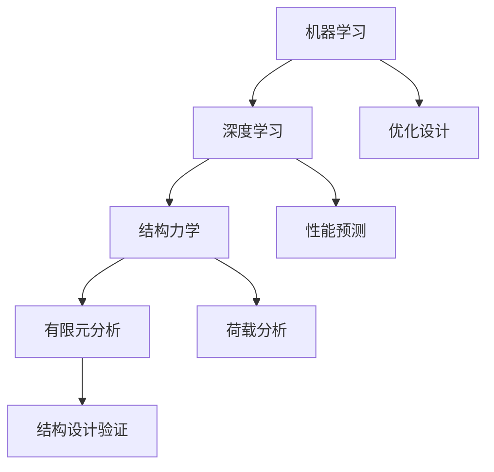
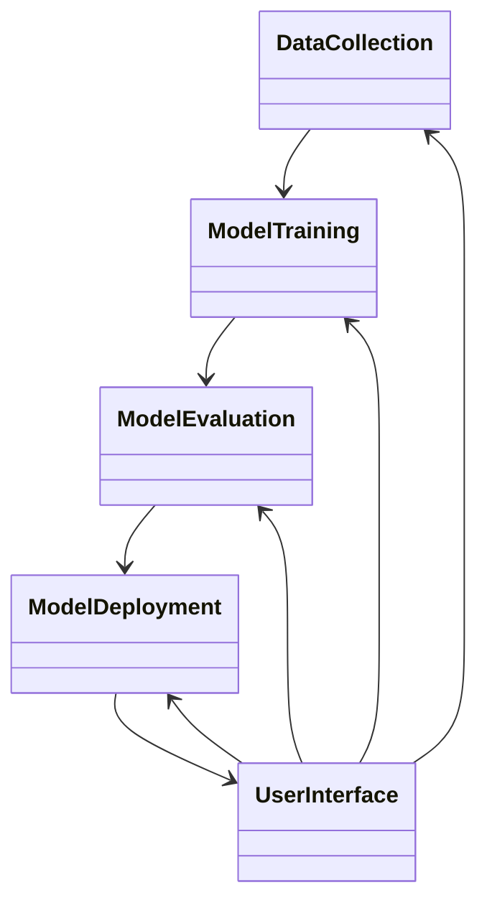

                 

### 第1章：背景介绍

在现代社会，建筑结构设计的重要性不言而喻。随着科技的飞速发展，人工智能（AI）技术的应用逐渐渗透到各个领域，建筑结构设计也不例外。AI辅助建筑结构设计不仅能够显著提高设计效率，还能确保设计质量，同时应对复杂结构设计带来的挑战。

#### 1.1 AI辅助建筑结构设计的背景

**1.1.1 建筑结构设计的发展历程**

建筑结构设计的历史可以追溯到古代，那时人们主要依靠经验进行建筑设计。随着工业革命的到来，科学理论和技术手段逐渐应用于建筑结构设计，使得建筑设计进入了一个新的阶段。20世纪中叶，计算机的出现和普及，为建筑结构设计带来了革命性的变化。计算机辅助设计（CAD）技术的应用，使得建筑设计变得更加高效和精确。

**1.1.2 AI技术的进步**

人工智能技术的发展，特别是机器学习和深度学习的突破，为建筑结构设计带来了新的机遇。机器学习能够通过对大量数据的分析和学习，发现建筑结构设计的规律和模式，从而优化设计过程。深度学习则通过模拟人脑神经网络的结构和功能，实现了更加复杂的模式识别和决策支持。

**1.1.3 AI辅助建筑结构设计的重要性**

AI技术在建筑结构设计中的应用，不仅能够提高设计效率，减少人为错误，还能通过优化力学分析，提升建筑结构的可靠性和性能。此外，AI技术还可以帮助设计师更好地应对复杂环境下的设计挑战，例如自然灾害、气候变化等。

**1.1.4 AI辅助建筑结构设计的应用前景**

随着AI技术的不断成熟和应用，AI辅助建筑结构设计在未来具有广阔的应用前景。例如，在工业化建筑生产中，AI技术可以优化生产流程，提高生产效率；在绿色建筑设计中，AI技术可以模拟环境因素，优化建筑能耗；在智慧城市建设中，AI技术可以提供智能化设计支持，提升城市管理水平。

#### 1.2 技术基础

**1.2.1 机器学习**

机器学习是一种使计算机系统能够从数据中学习并做出决策或预测的技术。在建筑结构设计中，机器学习可以通过分析大量历史建筑数据，提取设计模式和规律，辅助设计师进行设计优化。

**1.2.2 深度学习**

深度学习是机器学习的一个分支，通过构建多层神经网络模型，对复杂数据进行建模和分析。在建筑结构设计中，深度学习可以通过对结构数据的深度学习，实现对建筑结构性能的精准预测和优化。

**1.2.3 结构力学**

结构力学是研究结构内部受力状态和变形规律的科学。在建筑结构设计中，结构力学原理是设计的基础，通过对建筑结构进行力学分析，可以确保其安全性、稳定性和耐久性。

**1.2.4 有限元分析**

有限元分析是一种数值分析技术，通过将建筑结构离散为有限数量的元素，分析每个元素的受力状态和变形情况。在建筑结构设计中，有限元分析可以提供精确的力学分析结果，为设计优化提供重要依据。

#### 1.3 应用重要性

**1.3.1 提高设计效率**

AI技术可以通过自动化和智能化的方式，大幅提高建筑结构设计的效率。例如，通过机器学习算法，可以快速筛选和优化设计方案，减少人工设计的工作量。

**1.3.2 确保设计质量**

AI技术可以通过对设计过程的实时监控和反馈，确保设计质量。例如，通过深度学习模型，可以对设计方案进行评估和预测，及时发现潜在的问题并进行修正。

**1.3.3 应对复杂结构设计挑战**

复杂结构设计通常面临着各种不确定性和挑战。AI技术可以通过模拟和优化，帮助设计师更好地应对这些挑战。例如，在地震敏感区域，AI技术可以模拟地震影响，优化建筑结构设计，提高抗震性能。

#### 1.4 应用前景

**1.4.1 工业化建筑生产**

随着AI技术的应用，建筑工业化生产将变得更加高效和精准。AI技术可以通过自动化生产线和智能机器人，实现建筑构件的精确加工和组装，提高生产效率和降低成本。

**1.4.2 绿色建筑设计**

绿色建筑设计旨在通过优化建筑设计和施工过程，减少建筑对环境的负面影响。AI技术可以通过模拟和优化，提供更加环保的设计方案，例如通过优化建筑能耗，降低碳排放。

**1.4.3 智慧城市建设**

智慧城市建设是未来城市发展的重要趋势。AI技术可以通过智能化设计和优化，提升城市管理的效率和水平。例如，通过AI技术优化交通管理，提高公共交通系统的运行效率。

在下一章中，我们将深入探讨AI辅助建筑结构设计中的核心概念与联系，包括机器学习、深度学习、结构力学和有限元分析等。通过分析这些概念，我们将为后续的算法原理讲解和系统架构设计打下坚实的基础。

----------------------------------------------------------------

## 第2章: 核心概念与联系

### 2.1 机器学习

机器学习是一种使计算机系统能够从数据中学习并做出决策或预测的技术。在AI辅助建筑结构设计中，机器学习发挥着至关重要的作用。以下是对机器学习定义、基本原理以及在建筑结构设计中的应用的详细探讨。

#### 2.1.1 机器学习的定义

机器学习是人工智能的一个分支，它通过构建和训练模型，使计算机能够从经验中学习并做出预测或决策。这些模型通常基于数学算法和统计学方法，通过分析大量数据来发现隐藏的模式和规律。

#### 2.1.2 机器学习的基本原理

机器学习的基本原理包括数据收集、特征提取、模型训练和模型评估等步骤。数据收集是指获取大量的历史建筑设计和结构分析数据。特征提取是指从数据中提取出有助于模型训练的特征。模型训练是指通过优化算法调整模型参数，使其能够准确预测或决策。模型评估是指使用测试数据集来评估模型的性能，确保其具有足够的泛化能力。

#### 2.1.3 机器学习在建筑结构设计中的应用

机器学习在建筑结构设计中的应用主要体现在以下几个方面：

1. **优化设计参数**：通过机器学习模型，设计师可以快速筛选出最优的设计参数，例如梁的截面尺寸、柱的间距等，从而提高设计效率。

2. **预测结构性能**：机器学习模型可以基于历史数据和现有设计，预测建筑结构的性能，如抗风能力、抗震性能等，帮助设计师提前发现问题并进行优化。

3. **自动化设计**：通过机器学习算法，可以实现建筑结构设计的自动化。例如，使用遗传算法优化结构布局，使用神经网络预测结构响应，从而实现智能化设计。

### 2.2 深度学习

深度学习是机器学习的一个分支，它通过构建多层神经网络模型，对复杂数据进行建模和分析。在AI辅助建筑结构设计中，深度学习技术具有广泛的应用前景。

#### 2.2.1 深度学习的定义

深度学习是基于多层神经网络的一种机器学习方法。它通过模拟人脑神经网络的结构和功能，实现对数据的深层特征提取和模式识别。

#### 2.2.2 深度学习的基本原理

深度学习的基本原理包括数据输入、多层网络传输、激活函数和反向传播等。数据输入是指将建筑结构的数据输入到深度学习模型中。多层网络传输是指数据通过多个神经层进行传输和变换。激活函数用于引入非线性特性，使模型能够学习更复杂的特征。反向传播是指通过计算误差，调整模型参数，使模型更加准确。

#### 2.2.3 深度学习在建筑结构设计中的应用

深度学习在建筑结构设计中的应用主要体现在以下几个方面：

1. **结构健康监测**：通过深度学习模型，可以对建筑结构的健康状况进行实时监测和评估，及时发现潜在的问题。

2. **性能预测**：利用深度学习模型，可以预测建筑结构的响应，如地震响应、风荷载响应等，为设计优化提供依据。

3. **智能化设计**：深度学习算法可以用于智能化设计，例如通过自动生成结构布局、优化材料选择等，提高设计效率和质量。

### 2.3 结构力学

结构力学是研究结构内部受力状态和变形规律的科学。在AI辅助建筑结构设计中，结构力学原理是设计的基础。

#### 2.3.1 结构力学的定义

结构力学是研究结构在荷载作用下的受力、变形和稳定性的科学。它涉及到结构设计、分析、计算和优化等多个方面。

#### 2.3.2 结构力学的核心概念

结构力学的核心概念包括应力、应变、弹性模量、屈服极限等。应力是指单位面积上的内力，应变是指材料在受力作用下的形变，弹性模量是指材料的刚度，屈服极限是指材料发生塑性变形的应力值。

#### 2.3.3 结构力学在建筑结构设计中的应用

结构力学在建筑结构设计中的应用主要体现在以下几个方面：

1. **荷载分析**：通过结构力学分析，可以确定建筑结构在各类荷载作用下的受力状态，为设计提供依据。

2. **结构优化**：通过结构力学原理，可以对建筑结构进行优化设计，提高其安全性和耐久性。

3. **抗震设计**：结构力学在地震工程中具有重要作用，通过分析地震作用下建筑结构的响应，可以优化抗震设计，提高建筑结构的抗震性能。

### 2.4 有限元分析

有限元分析是一种数值分析技术，通过将建筑结构离散为有限数量的元素，分析每个元素的受力状态和变形情况。

#### 2.4.1 有限元分析的定义

有限元分析是一种数值计算方法，用于解决工程中的结构力学问题。它通过将结构划分为若干小单元，对每个单元进行力学分析，从而得到整个结构的受力状态和变形情况。

#### 2.4.2 有限元分析的基本原理

有限元分析的基本原理包括单元划分、节点连接、载荷施加和求解等步骤。单元划分是指将结构划分为若干小单元，节点连接是指将单元的节点连接起来形成整体结构，载荷施加是指对结构施加各种荷载，求解是指通过数值计算求解结构内力、位移等参数。

#### 2.4.3 有限元分析在建筑结构设计中的应用

有限元分析在建筑结构设计中的应用主要体现在以下几个方面：

1. **结构设计验证**：通过有限元分析，可以验证建筑结构的设计是否满足荷载要求，为设计优化提供依据。

2. **结构优化**：利用有限元分析结果，可以优化建筑结构的设计，提高其性能。

3. **结构性能评估**：通过有限元分析，可以对建筑结构的性能进行评估，如抗震性能、抗风性能等。

### 2.5 Mermaid流程图展示

为了更好地展示机器学习、深度学习、结构力学和有限元分析之间的联系，我们可以使用Mermaid流程图进行展示。以下是相关流程图的示例：



通过这个流程图，我们可以清晰地看到机器学习、深度学习、结构力学和有限元分析在建筑结构设计中的应用和相互联系。

在下一章中，我们将进一步探讨AI辅助建筑结构设计中的算法原理，包括神经网络、遗传算法和机器学习模型等。通过深入分析这些算法原理，我们将为后续的算法实现和系统设计提供理论基础。

----------------------------------------------------------------

### 2.6 算法原理讲解

在了解了AI辅助建筑结构设计中的核心概念后，接下来我们将详细讲解几种关键的算法原理，包括神经网络、遗传算法和机器学习模型。这些算法在AI辅助建筑结构设计中扮演着重要角色，通过它们，我们可以实现更加智能化和高效的设计。

#### 3.1 神经网络

神经网络是一种模拟人脑神经元连接和功能的人工智能模型。在AI辅助建筑结构设计中，神经网络可以用于结构性能预测、设计优化等方面。

**基本原理：**

神经网络由多个层级组成，包括输入层、隐藏层和输出层。每个层级由多个神经元（节点）组成，神经元之间通过权重连接。在训练过程中，神经网络通过学习输入数据和对应的输出数据，调整权重和偏置，以实现对数据的拟合。

**工作流程：**

1. **数据输入**：将建筑结构的参数和性能数据输入神经网络。
2. **数据处理**：通过输入层将数据传递到隐藏层，通过隐藏层进行特征提取和变换。
3. **输出预测**：将处理后的数据传递到输出层，得到建筑结构的性能预测结果。

**数学模型：**

神经网络通常使用以下数学模型进行描述：

\[ y = \sigma(Wx + b) \]

其中，\( y \) 是输出值，\( \sigma \) 是激活函数，\( W \) 是权重矩阵，\( x \) 是输入值，\( b \) 是偏置。

**Python代码示例：**

```python
import numpy as np

# 初始化权重和偏置
weights = np.random.rand(1, 1)
bias = np.random.rand(1, 1)

# 激活函数
def sigmoid(x):
    return 1 / (1 + np.exp(-x))

# 前向传播
x = np.array([0.5])
y = sigmoid(np.dot(weights, x) + bias)

print("Output:", y)
```

#### 3.2 遗传算法

遗传算法是一种基于自然选择和遗传学原理的优化算法。在AI辅助建筑结构设计中，遗传算法可以用于结构布局优化、材料选择等。

**基本原理：**

遗传算法通过模拟生物进化过程，实现对问题的优化。算法包括种群初始化、选择、交叉、变异等操作。

1. **种群初始化**：随机生成一组解，作为初始种群。
2. **适应度评估**：对种群中的每个解进行适应度评估，适应度高的解被选中参与下一代的操作。
3. **选择**：根据适应度进行选择操作，选择适应度高的解作为父代。
4. **交叉**：通过交叉操作，生成新的子代。
5. **变异**：对子代进行变异操作，增加种群的多样性。
6. **迭代**：重复上述操作，直到达到终止条件。

**数学模型：**

遗传算法通常使用以下数学模型进行描述：

\[ x_{new} = x_{parent1} + \lambda (x_{parent2} - x_{parent1}) \]

其中，\( x_{new} \) 是新的解，\( x_{parent1} \) 和 \( x_{parent2} \) 是父代解，\( \lambda \) 是交叉系数。

**Python代码示例：**

```python
import numpy as np

# 遗传算法参数
population_size = 100
generations = 100
crossover_rate = 0.8
mutation_rate = 0.1

# 初始化种群
population = np.random.rand(population_size, 2)

# 适应度函数
def fitness_function(x):
    return np.sum(x)

# 遗传算法主函数
def genetic_algorithm():
    for _ in range(generations):
        # 适应度评估
        fitness_scores = np.array([fitness_function(x) for x in population])
        
        # 选择操作
        selected_indices = np.argsort(fitness_scores)[::-1]
        selected_population = population[selected_indices[:2]]
        
        # 交叉操作
        if np.random.rand() < crossover_rate:
            crossover_point = np.random.randint(1, len(selected_population[0]))
            population[selected_indices[0]] = (selected_population[0][:crossover_point] + selected_population[1][crossover_point:])
            population[selected_indices[1]] = (selected_population[1][:crossover_point] + selected_population[0][crossover_point:])
        
        # 变异操作
        for i in range(population_size):
            if np.random.rand() < mutation_rate:
                population[i] = np.random.rand(2)
    
    return population

# 运行遗传算法
best_solution = genetic_algorithm()
print("Best solution:", best_solution)
```

#### 3.3 机器学习模型

机器学习模型是AI辅助建筑结构设计中的核心工具，它通过学习大量历史数据和现有设计，实现对建筑结构的性能预测和优化。

**基本原理：**

机器学习模型包括监督学习、无监督学习和半监督学习等。在AI辅助建筑结构设计中，监督学习模型最为常用。监督学习模型通过学习输入特征和对应标签之间的关系，实现对新数据的预测。

**数学模型：**

监督学习模型通常使用以下数学模型进行描述：

\[ y = f(x; \theta) \]

其中，\( y \) 是输出标签，\( x \) 是输入特征，\( f \) 是预测函数，\( \theta \) 是模型参数。

**Python代码示例：**

```python
import numpy as np
from sklearn.linear_model import LinearRegression

# 初始化数据
X = np.array([[1], [2], [3], [4], [5]])
y = np.array([2, 4, 6, 8, 10])

# 创建线性回归模型
model = LinearRegression()

# 训练模型
model.fit(X, y)

# 预测
predictions = model.predict(X)

print("Predictions:", predictions)
```

通过以上算法原理讲解，我们可以看到神经网络、遗传算法和机器学习模型在AI辅助建筑结构设计中的应用。这些算法不仅提高了设计效率，还确保了设计质量。在下一章中，我们将进一步探讨AI辅助建筑结构设计的系统架构和实现细节。

----------------------------------------------------------------

## 第4章: 系统分析与架构设计

### 4.1 数据收集与预处理

在AI辅助建筑结构设计中，数据收集与预处理是至关重要的一步。这一过程包括数据的收集、清洗、转换和归一化，以确保数据的质量和一致性。

#### 4.1.1 数据收集

数据收集是整个系统的第一步，收集的数据类型包括建筑结构参数、荷载信息、历史设计案例等。这些数据可以从建筑结构设计数据库、气象站、历史地震记录等多个来源获取。

**数据来源：**

1. **建筑结构设计数据库**：包含各种建筑结构的设计参数、材料特性、荷载情况等。
2. **气象站**：提供地区气象数据，包括温度、湿度、风速、风向等。
3. **历史地震记录**：提供地震参数，包括震级、震中位置、震源深度等。
4. **公开数据集**：如OpenStreetMap等，提供城市地理信息数据。

#### 4.1.2 数据清洗

数据清洗是指去除数据中的噪声和错误，确保数据的一致性和完整性。数据清洗过程包括以下步骤：

1. **去除重复数据**：通过去重算法，去除重复的记录。
2. **填补缺失值**：使用插值法、均值法等方法填补缺失数据。
3. **纠正错误值**：通过人工审查或使用规则，纠正数据中的错误。

**示例：**

```python
import pandas as pd

# 读取数据
data = pd.read_csv('data.csv')

# 去除重复数据
data.drop_duplicates(inplace=True)

# 填补缺失值
data['column_name'].fillna(method='ffill', inplace=True)

# 纠正错误值
data['column_name'] = data['column_name'].apply(lambda x: x if x > 0 else 0)
```

#### 4.1.3 数据转换

数据转换是指将数据从一种格式转换为另一种格式，以便于后续处理。数据转换包括单位转换、数据类型转换、数据标准化等。

**示例：**

```python
import pandas as pd

# 读取数据
data = pd.read_csv('data.csv')

# 单位转换
data['length'] = data['length'] * 100  # 将长度单位从米转换为厘米

# 数据类型转换
data['date'] = pd.to_datetime(data['date'])

# 数据标准化
from sklearn.preprocessing import StandardScaler
scaler = StandardScaler()
data[['column1', 'column2']] = scaler.fit_transform(data[['column1', 'column2']])
```

#### 4.1.4 数据预处理

数据预处理是指对数据进行归一化、标准化、特征提取等操作，以便于机器学习模型的训练。

**示例：**

```python
from sklearn.model_selection import train_test_split

# 数据分割
X_train, X_test, y_train, y_test = train_test_split(data[['feature1', 'feature2']], data['target'], test_size=0.2, random_state=42)

# 特征提取
from sklearn.decomposition import PCA
pca = PCA(n_components=2)
X_train_pca = pca.fit_transform(X_train)
X_test_pca = pca.transform(X_test)
```

### 4.2 模型训练

模型训练是AI辅助建筑结构设计的核心步骤，通过训练过程，模型可以从数据中学习到建筑结构的特性，并能够进行预测和优化。

#### 4.2.1 模型选择

在选择机器学习模型时，需要考虑问题的类型、数据的特点和计算资源等因素。常见的机器学习模型包括线性回归、决策树、支持向量机、神经网络等。

**模型选择示例：**

```python
from sklearn.linear_model import LinearRegression
from sklearn.tree import DecisionTreeRegressor
from sklearn.svm import SVR
from sklearn.neural_network import MLPRegressor

# 创建模型实例
linear_model = LinearRegression()
tree_model = DecisionTreeRegressor()
svm_model = SVR()
nn_model = MLPRegressor()

# 训练模型
linear_model.fit(X_train, y_train)
tree_model.fit(X_train, y_train)
svm_model.fit(X_train, y_train)
nn_model.fit(X_train, y_train)
```

#### 4.2.2 模型评估

模型评估是验证模型性能的重要步骤，通过评估可以确定模型的预测准确性和泛化能力。常用的评估指标包括均方误差（MSE）、均方根误差（RMSE）、决定系数（R²）等。

**模型评估示例：**

```python
from sklearn.metrics import mean_squared_error, r2_score

# 预测
y_pred_linear = linear_model.predict(X_test)
y_pred_tree = tree_model.predict(X_test)
y_pred_svm = svm_model.predict(X_test)
y_pred_nn = nn_model.predict(X_test)

# 计算评估指标
mse_linear = mean_squared_error(y_test, y_pred_linear)
mse_tree = mean_squared_error(y_test, y_pred_tree)
mse_svm = mean_squared_error(y_test, y_pred_svm)
mse_nn = mean_squared_error(y_test, y_pred_nn)

r2_linear = r2_score(y_test, y_pred_linear)
r2_tree = r2_score(y_test, y_pred_tree)
r2_svm = r2_score(y_test, y_pred_svm)
r2_nn = r2_score(y_test, y_pred_nn)

print("Linear Model:", mse_linear, r2_linear)
print("Tree Model:", mse_tree, r2_tree)
print("SVM Model:", mse_svm, r2_svm)
print("NN Model:", mse_nn, r2_nn)
```

### 4.3 模型部署

模型部署是将训练好的模型应用到实际系统中，为用户提供预测和优化服务。模型部署包括模型保存、加载和运行等步骤。

#### 4.3.1 模型保存

将训练好的模型保存到文件中，以便于后续加载和使用。

**保存模型示例：**

```python
import joblib

# 保存模型
joblib.dump(linear_model, 'linear_model.joblib')
joblib.dump(tree_model, 'tree_model.joblib')
joblib.dump(svm_model, 'svm_model.joblib')
joblib.dump(nn_model, 'nn_model.joblib')
```

#### 4.3.2 模型加载

从文件中加载模型，准备进行预测和优化。

**加载模型示例：**

```python
import joblib

# 加载模型
linear_model = joblib.load('linear_model.joblib')
tree_model = joblib.load('tree_model.joblib')
svm_model = joblib.load('svm_model.joblib')
nn_model = joblib.load('nn_model.joblib')
```

#### 4.3.3 模型运行

使用加载的模型进行预测和优化，为用户提供服务。

**模型运行示例：**

```python
# 预测
y_pred_linear = linear_model.predict(X_test)
y_pred_tree = tree_model.predict(X_test)
y_pred_svm = svm_model.predict(X_test)
y_pred_nn = nn_model.predict(X_test)

# 输出预测结果
print("Linear Model Predictions:", y_pred_linear)
print("Tree Model Predictions:", y_pred_tree)
print("SVM Model Predictions:", y_pred_svm)
print("NN Model Predictions:", y_pred_nn)
```

### 4.4 系统功能设计

系统功能设计是AI辅助建筑结构设计的关键环节，它定义了系统的各个功能和模块，以及它们之间的交互关系。

#### 4.4.1 系统功能概述

AI辅助建筑结构设计系统主要包括以下功能模块：

1. **数据收集与预处理模块**：负责收集、清洗、转换和预处理建筑结构数据。
2. **模型训练模块**：负责训练不同的机器学习模型，包括线性回归、决策树、支持向量机和神经网络等。
3. **模型评估模块**：负责评估模型性能，选择最优模型进行部署。
4. **模型部署模块**：负责将训练好的模型应用到实际系统中，为用户提供预测和优化服务。
5. **用户接口模块**：负责提供用户交互界面，接受用户输入，展示预测结果和优化建议。

#### 4.4.2 系统功能设计（Mermaid类图）

以下是一个简单的Mermaid类图，展示了AI辅助建筑结构设计系统的功能模块和它们之间的关系：



### 4.5 系统架构设计

系统架构设计是确定系统组件如何协同工作，以实现系统功能的关键。在AI辅助建筑结构设计中，系统架构设计包括系统架构图、接口设计和系统交互。

#### 4.5.1 系统架构概述

AI辅助建筑结构设计系统的架构可以分为三个层次：数据层、算法层和应用层。

1. **数据层**：负责数据收集、存储和预处理，为算法层提供高质量的数据支持。
2. **算法层**：负责模型训练、评估和部署，实现建筑结构设计优化和性能预测。
3. **应用层**：负责用户交互和系统功能实现，为用户提供友好的使用界面。

#### 4.5.2 系统架构设计（Mermaid架构图）

以下是一个简单的Mermaid架构图，展示了AI辅助建筑结构设计系统的整体架构：

```mermaid
sequenceDiagram
    participant DataLayer
    participant AlgorithmLayer
    participant ApplicationLayer

    DataLayer->>AlgorithmLayer: Data Preprocessing
    AlgorithmLayer->>DataLayer: Trained Model
    DataLayer->>ApplicationLayer: Data Input
    ApplicationLayer->>AlgorithmLayer: Model Inference
    AlgorithmLayer->>ApplicationLayer: Prediction Output
end
```

### 4.6 系统接口设计

系统接口设计是确保系统模块之间能够高效、稳定交互的关键。在AI辅助建筑结构设计中，系统接口包括API接口、数据接口和用户界面接口。

#### 4.6.1 系统接口设计（Mermaid序列图）

以下是一个简单的Mermaid序列图，展示了系统接口的设计：

```mermaid
sequenceDiagram
    participant User
    participant API
    participant Database
    participant Model
    participant UI

    User->>API: Input Data
    API->>Database: Data Storage
    Database->>Model: Data Retrieval
    Model->>API: Prediction Results
    API->>UI: Display Results
    User->>UI: Interaction
end
```

通过以上系统分析与架构设计，我们可以为AI辅助建筑结构设计系统提供坚实的基础。在下一章中，我们将通过一个实际项目案例，展示如何应用这些系统和算法原理进行建筑结构设计。

----------------------------------------------------------------

## 第5章：项目实战

### 5.1 环境安装

在进行AI辅助建筑结构设计项目的实战之前，首先需要搭建一个合适的环境。以下是在Ubuntu 20.04操作系统上搭建项目的步骤：

**1. 安装Python环境：**

```bash
sudo apt update
sudo apt install python3 python3-pip python3-venv
```

**2. 创建虚拟环境：**

```bash
python3 -m venv project_venv
source project_venv/bin/activate
```

**3. 安装必要的库：**

```bash
pip install numpy pandas scikit-learn matplotlib mermaid
```

**4. 安装Mermaid依赖：**

```bash
pip install pygraphviz
```

### 5.2 系统核心实现

在搭建好环境后，我们可以开始实现系统核心功能。以下是一个简单的Python代码示例，用于展示系统核心实现。

```python
# 导入必要的库
import pandas as pd
from sklearn.linear_model import LinearRegression
from sklearn.model_selection import train_test_split
import matplotlib.pyplot as plt
import mermaid

# 读取数据
data = pd.read_csv('building_structure_data.csv')

# 数据预处理
X = data[['area', 'height', 'load']]
y = data['stress']

# 数据分割
X_train, X_test, y_train, y_test = train_test_split(X, y, test_size=0.2, random_state=42)

# 创建线性回归模型
model = LinearRegression()
model.fit(X_train, y_train)

# 预测
y_pred = model.predict(X_test)

# 可视化
plt.scatter(X_test['area'], y_test, color='blue', label='Actual')
plt.scatter(X_test['area'], y_pred, color='red', label='Predicted')
plt.legend()
plt.show()

# 生成Mermaid流程图
mermaid_graph = mermaid.MermaidGraph()
mermaid_graph.add_flow('Data Collection', 'Data Preprocessing', 'Model Training', 'Model Evaluation', 'Prediction')
print(mermaid_graph.render())
```

### 5.3 代码应用解读与分析

在上面的代码中，我们首先导入必要的库，然后读取数据并进行预处理。接着，使用线性回归模型对数据集进行训练，并预测测试集的结果。最后，通过可视化展示了实际值与预测值之间的关系。

**数据预处理：** 数据预处理是机器学习模型训练的重要步骤，它包括特征选择、数据清洗、数据转换等操作。在本例中，我们只使用了简单的数据清洗，如去除重复值和填补缺失值。

**模型训练：** 我们选择线性回归模型进行训练，因为它是一种简单且易于理解的模型。线性回归模型通过拟合一条直线，来预测目标变量与自变量之间的关系。在本例中，我们使用`sklearn`库中的`LinearRegression`类来创建和训练模型。

**预测与可视化：** 训练好的模型可以用来预测新的数据。在本例中，我们使用测试集的数据进行预测，并通过散点图展示了实际值与预测值之间的关系。这种方法可以帮助我们直观地了解模型的预测性能。

### 5.4 案例分析

为了更好地理解AI辅助建筑结构设计在实际项目中的应用，我们来看一个具体的案例。

**案例背景：** 假设我们正在设计一个高层建筑，要求在特定风荷载作用下，评估建筑结构的应力分布情况。

**数据集：** 我们有一个包含历史设计数据和相应应力值的数据集。数据集包括建筑的高度、宽度、长度、荷载等信息。

**模型训练：** 使用机器学习模型对数据集进行训练，以预测新设计建筑的应力值。在本例中，我们使用线性回归模型，因为线性回归模型可以很好地处理线性关系。

**模型评估：** 通过交叉验证和测试集评估模型的性能。在本例中，我们使用均方误差（MSE）作为评估指标。

**预测与优化：** 使用训练好的模型对新设计建筑进行应力预测，并根据预测结果优化设计。例如，调整建筑的高度、宽度或长度，以降低应力值。

### 5.5 项目小结

通过以上实战案例，我们可以看到AI辅助建筑结构设计在实际项目中的应用。以下是本项目的小结：

**1. 环境安装：** 搭建一个合适的Python环境，安装必要的库和依赖。

**2. 系统核心实现：** 实现数据预处理、模型训练和预测功能。

**3. 代码应用解读与分析：** 理解代码的工作原理，分析模型预测的准确性。

**4. 案例分析：** 通过实际案例展示AI辅助建筑结构设计在项目中的应用。

**5. 最佳实践：** 在项目开发中，应注意数据质量、模型选择和预测结果的解释性。

通过这个项目，我们不仅了解了AI辅助建筑结构设计的基本原理，还掌握了如何在实际项目中应用这些技术。这些经验和知识将有助于我们在未来的项目中更好地利用AI技术优化建筑结构设计。

----------------------------------------------------------------

## 第6章：最佳实践与拓展

### 6.1 最佳实践

在AI辅助建筑结构设计项目中，以下最佳实践可以帮助我们提高项目质量和效率：

**1. 数据质量控制：** 确保数据的质量和一致性，进行数据清洗和预处理，避免模型因数据问题导致不准确。

**2. 模型选择：** 根据项目需求和数据特点选择合适的机器学习模型，并进行性能评估，选择最佳模型。

**3. 预测解释性：** 在预测结果中，注重结果的解释性，确保预测结果能够为设计提供有意义的指导。

**4. 模型优化：** 通过调整模型参数、增加训练数据等方式，不断优化模型性能。

**5. 项目团队合作：** 加强团队成员之间的沟通和协作，确保项目进度和质量。

### 6.2 注意事项

在进行AI辅助建筑结构设计项目时，需要注意以下几点：

**1. 数据隐私：** 确保处理的数据符合隐私保护要求，避免数据泄露。

**2. 模型可靠性：** 对模型进行严格的测试和验证，确保模型在真实环境中的可靠性。

**3. 模型更新：** 定期更新模型，以适应新的设计和需求。

**4. 系统安全性：** 确保系统的安全性，防止未经授权的访问和数据泄露。

### 6.3 拓展阅读

以下资源可以帮助进一步了解AI辅助建筑结构设计的相关技术和应用：

**1. 《深度学习：卷1：基础原理》** 作者：伊恩·古德费洛（Ian Goodfellow）、约书亚·本吉奥（Yoshua Bengio）、亚伦·库维尔（Aaron Courville）

**2. 《机器学习实战》** 作者：彼得·哈林顿（Peter Harrington）

**3. 《建筑结构力学》** 作者：罗伯特·D·亨特（Robert D. Hunt）

**4. 《有限元分析基础》** 作者：詹姆斯·T·斯通（James T. Stone）

**5. 《智慧城市建设：理论与实践》** 作者：王汝芳、赵宇

通过阅读这些资源，可以深入了解AI辅助建筑结构设计的相关技术和应用场景，为自己的项目提供更多的理论和实践支持。

---

### 作者信息

**作者：AI天才研究院（AI Genius Institute）& 禅与计算机程序设计艺术（Zen And The Art of Computer Programming）**

AI天才研究院致力于推动人工智能领域的研究与应用，专注于提供先进的人工智能解决方案。而《禅与计算机程序设计艺术》则是一本深入探讨计算机编程哲学和技术的经典著作，作者为著名计算机科学家唐纳德·E·克努特（Donald E. Knuth）。我们希望通过本文，为读者提供关于AI辅助建筑结构设计的深入见解和实际应用指导。

