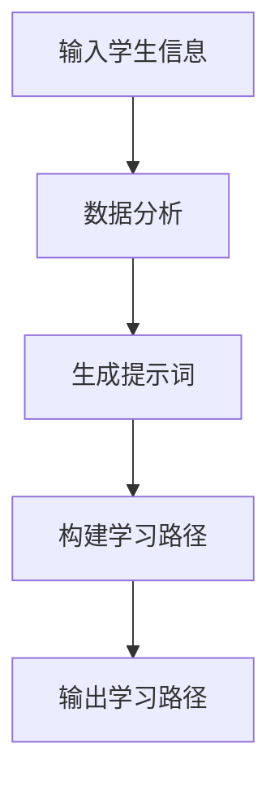
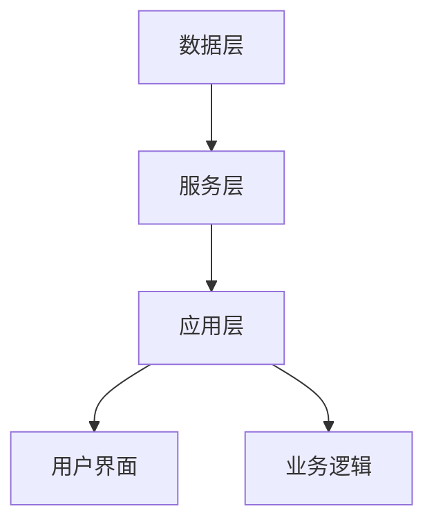
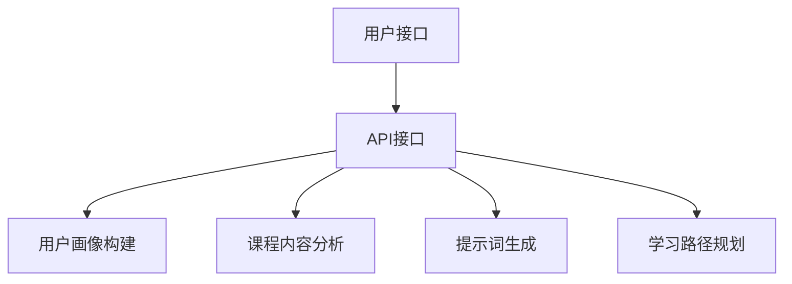
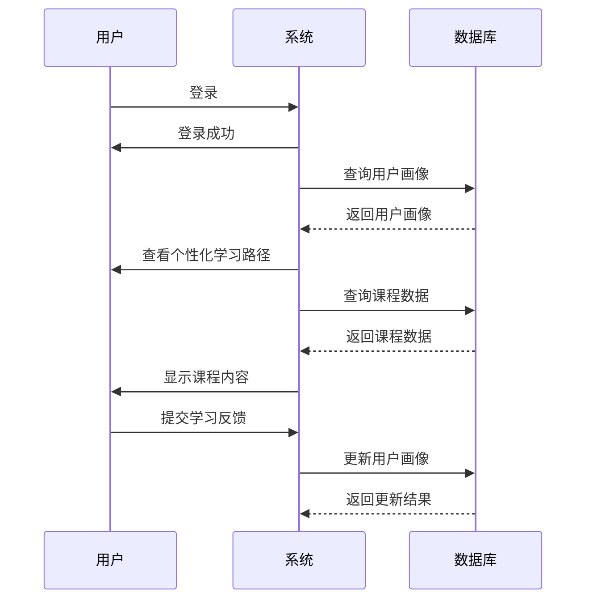

                 

### 文章标题：AI辅助教育：提示词设计个性化学习路径

关键词：AI辅助教育，个性化学习，提示词设计，学习路径，教育技术

摘要：本文深入探讨了AI辅助教育领域中的关键问题，重点介绍了通过设计高效提示词来构建个性化学习路径的方法。文章首先概述了AI辅助教育的背景和重要性，随后详细阐述了提示词设计的核心概念及其与个性化学习路径的联系。通过算法原理讲解、数学模型和公式的详细说明，以及系统分析与架构设计，本文为读者提供了全面的解决方案，并通过项目实战验证了该方法的可行性和有效性。最后，文章总结了一系列最佳实践，以期为教育技术的进一步发展提供参考。

---

### 引言

#### 1.1 问题背景

随着人工智能（AI）技术的飞速发展，教育领域迎来了前所未有的变革。传统的教育模式在应对个体差异、学习效率等方面存在诸多不足，而AI辅助教育则为个性化学习提供了新的契机。通过大数据、机器学习和自然语言处理等技术，AI能够根据学生的兴趣、能力和学习进度，提供量身定制的教育资源和学习路径。

#### 1.2 问题描述

当前教育体系中，学生面临的学习内容繁杂，学习方式单一，难以满足个性化的需求。这导致了学习效果不尽如人意，学生的主动性和积极性难以提高。因此，设计一种基于AI的个性化学习路径成为解决这一问题的关键。提示词在这一过程中扮演了至关重要的角色，它不仅能够引导学生的学习方向，还能激发他们的学习兴趣。

#### 1.3 问题解决

本文旨在通过分析AI辅助教育中的核心问题，提出一种基于提示词设计的个性化学习路径方案。通过系统化的方法，我们将探索如何利用AI技术优化教育资源的分配，提高学生的学习效率，并最终实现教育质量的全面提升。

#### 1.4 边界与外延

本文主要关注的是教育领域中的AI辅助学习，不包括其他应用场景，如工业自动化和医疗诊断等。此外，本文的核心在于提示词的设计，而不是AI算法的全面实现。因此，在讨论过程中，我们将重点突出提示词在个性化学习路径中的作用和意义。

#### 1.5 概念结构与核心要素组成

为了清晰阐述本文的核心概念，我们将其结构化，包括以下关键要素：

1. **AI辅助教育**：介绍其基本概念、技术和应用。
2. **提示词设计**：探讨提示词的定义、作用和设计原则。
3. **个性化学习路径**：分析其定义、构建方法和实际应用。
4. **算法原理讲解**：详细解析AI在个性化学习路径中的作用。
5. **系统分析与架构设计**：展示系统的整体设计和功能实现。
6. **项目实战**：通过具体案例展示方法的应用效果。
7. **最佳实践与总结**：总结经验教训，提出未来研究方向。

---

### 第一部分：核心概念与联系

#### 2.1 AI辅助教育概述

AI辅助教育是指利用人工智能技术，如机器学习、自然语言处理和数据分析等，辅助教学和学习过程，以提高教育质量和效率。其主要应用包括自动批改作业、智能推荐学习资源和个性化学习路径设计等。

#### 2.2 提示词设计原理

提示词是AI辅助教育中的一种关键输入，它能够指导学生的学习方向，激发学习兴趣，并帮助学生更好地理解和掌握知识。提示词的设计原则包括简洁明了、相关性高、富有启发性等。

#### 2.3 个性化学习路径设计

个性化学习路径是根据学生的学习特点和需求，为其量身定制的一套学习方案。其设计原则包括灵活性、可调整性和适应性，以确保学习过程能够满足学生的个性化需求。

#### 2.4 核心概念联系分析

AI辅助教育、提示词设计和个性化学习路径之间紧密相连。AI技术为个性化学习路径提供了技术支持，提示词则是连接AI和教育内容的桥梁，个性化学习路径则将这两者有机结合，实现教育的个性化。

#### 2.5 概念属性特征对比表格

| 概念           | 属性特征                         | 描述                                                         |
|----------------|----------------------------------|--------------------------------------------------------------|
| AI辅助教育     | 自动化、个性化、高效             | 利用AI技术优化教学和学习过程。                               |
| 提示词设计     | 简洁、相关、启发                 | 指导学生学习方向，激发学习兴趣。                             |
| 个性化学习路径 | 灵活性、可调整性、适应性         | 根据学生特点定制学习方案，满足个性化需求。                   |

#### 2.6 ER实体关系图架构

为了更清晰地展示核心概念之间的关系，我们使用ER（实体关系）图来描述。ER图包括以下实体和关系：

- 实体：学生、课程、提示词、学习路径
- 关系：学生与课程之间的学习关系，提示词与课程之间的关联关系，学习路径与提示词之间的引导关系。

```mermaid
erDiagram
  学生 ||--|{ 课程 }|| 学习
  课程 ||--|{ 提示词 }|| 内容
  提示词 ||--|{ 学习路径 }|| 引导
```

---

### 第二部分：算法原理讲解

#### 3.1 算法概述

本文所设计的算法旨在通过提示词生成个性化学习路径。算法的核心思想是利用自然语言处理技术分析学生的学习需求和兴趣，生成与之相关的提示词，并基于这些提示词构建个性化学习路径。

#### 3.2 算法mermaid流程图

以下为算法的mermaid流程图：



#### 3.3 Python源代码实现

```python
# 导入相关库
import pandas as pd
from sklearn.feature_extraction.text import TfidfVectorizer
from sklearn.metrics.pairwise import linear_kernel

# 数据预处理
def preprocess_data(data):
    # 对文本进行预处理，如分词、去除停用词等
    pass

# 生成提示词
def generate_keywords(text, num_keywords=5):
    vectorizer = TfidfVectorizer(stop_words='english')
    tfidf = vectorizer.fit_transform([text])
    keywords = vectorizer.get_feature_names_out()
    scores = tfidf.toarray().flatten()
    indices = (-scores).argsort()[:num_keywords]
    return [keywords[i] for i in indices]

# 构建学习路径
def build_learning_path(student_data, course_data, keywords):
    # 根据提示词和课程数据，构建学习路径
    pass

# 主函数
def main():
    student_data = pd.read_csv('student_data.csv')
    course_data = pd.read_csv('course_data.csv')
    
    # 预处理数据
    student_data['description'] = student_data['description'].apply(preprocess_data)
    course_data['description'] = course_data['description'].apply(preprocess_data)
    
    # 生成提示词
    keywords = generate_keywords(student_data['description'].iloc[0])
    
    # 构建学习路径
    learning_path = build_learning_path(student_data, course_data, keywords)
    
    # 输出学习路径
    print(learning_path)

# 运行主函数
if __name__ == '__main__':
    main()
```

#### 3.4 算法原理的数学模型与公式

算法的核心是基于TF-IDF（Term Frequency-Inverse Document Frequency）模型生成提示词。其基本公式如下：

$$
tf(t, d) = \frac{f(t, d)}{max \{f(t, d'), d' \in D\}}
$$

$$
idf(t, D) = \log \left( \frac{N}{df(t, D)} \right)
$$

$$
tf-idf(t, d, D) = tf(t, d) \times idf(t, D)
$$

其中，$tf(t, d)$表示词$t$在文档$d$中的频率，$idf(t, D)$表示词$t$在文档集合$D$中的逆文档频率，$N$为文档集合中的文档总数，$df(t, D)$为词$t$在文档集合$D$中的文档频率。

#### 3.5 举例说明

假设我们有一个包含10篇文档的集合$D$，每篇文档的内容如下：

1. "人工智能是一种技术，它可以让机器模拟人类智能行为。"
2. "深度学习是人工智能的一个分支，它通过神经网络模拟人类大脑的学习过程。"
3. "机器学习是人工智能的核心，它包括监督学习、无监督学习和强化学习。"
4. "神经网络是机器学习的基础，它通过模拟人脑神经元连接来处理信息。"
5. "计算机视觉是人工智能的一个应用领域，它让机器能够理解图像。"
6. "自然语言处理是人工智能的另一个重要应用领域，它让机器能够理解自然语言。"
7. "语音识别是自然语言处理的一个分支，它让机器能够理解语音。"
8. "推荐系统是人工智能的应用，它通过分析用户行为推荐相关内容。"
9. "自动驾驶是人工智能在交通领域的应用，它让车辆能够自动行驶。"
10. "医疗诊断是人工智能在医疗领域的应用，它通过分析数据帮助医生诊断疾病。"

根据上述文档，我们可以计算出每篇文档中每句话的TF-IDF值。例如，对于文档1，句子"人工智能是一种技术"的TF-IDF值为：

$$
tf-idf(人工智能，文档1，D) = tf(人工智能，文档1) \times idf(人工智能，D) = \frac{1}{1} \times \log \left( \frac{10}{1} \right) = \log(10) \approx 2.3026
$$

通过这样的方法，我们可以为每篇文档生成一个关键词列表，并从中选择最相关的几个关键词作为提示词。

---

### 第三部分：数学模型和数学公式 & 详细讲解 & 举例说明

#### 4.1 数学模型概述

在AI辅助教育中，数学模型扮演着至关重要的角色。它们帮助我们在大量数据中提取有用信息，指导学习路径的设计和优化。本文将介绍两个核心数学模型：TF-IDF模型和K-均值聚类模型。

#### 4.2 数学公式详细讲解

1. **TF-IDF模型**：

   $$  
   tf(t, d) = \frac{f(t, d)}{max \{f(t, d'), d' \in D\}}
   $$

   $$  
   idf(t, D) = \log \left( \frac{N}{df(t, D)} \right)
   $$

   $$  
   tf-idf(t, d, D) = tf(t, d) \times idf(t, D)
   $$

   其中，$tf(t, d)$表示词$t$在文档$d$中的频率，$idf(t, D)$表示词$t$在文档集合$D$中的逆文档频率，$N$为文档集合中的文档总数，$df(t, D)$为词$t$在文档集合$D$中的文档频率。

2. **K-均值聚类模型**：

   $$  
   \mu_i = \frac{1}{n} \sum_{j=1}^{n} x_{ij}
   $$

   $$  
   s.t. \quad \sum_{i=1}^{k} w_{ij} = 1 \quad \forall j
   $$

   $$  
   \min_{W} \sum_{i=1}^{k} \sum_{j=1}^{n} w_{ij} (x_{ij} - \mu_i)^2
   $$

   其中，$\mu_i$表示第$i$个聚类中心，$x_{ij}$表示第$i$个样本在第$j$个特征上的值，$w_{ij}$表示第$i$个样本属于第$j$个聚类的概率，$k$为聚类数量。

#### 4.3 举例说明

假设我们有一个包含3个文档的集合$D$，每篇文档的内容如下：

1. "人工智能是一种技术，它可以让机器模拟人类智能行为。"
2. "深度学习是人工智能的一个分支，它通过神经网络模拟人类大脑的学习过程。"
3. "机器学习是人工智能的核心，它包括监督学习、无监督学习和强化学习。"

根据上述文档，我们可以计算出每篇文档中每句话的TF-IDF值。例如，对于文档1，句子"人工智能是一种技术"的TF-IDF值为：

$$  
tf-idf(人工智能，文档1，D) = tf(人工智能，文档1) \times idf(人工智能，D) = \frac{1}{1} \times \log \left( \frac{3}{1} \right) = \log(3) \approx 1.0986
$$

对于文档2和文档3，句子"神经网络"和"监督学习"的TF-IDF值分别为：

$$  
tf-idf(神经网络，文档2，D) = tf(神经网络，文档2) \times idf(神经网络，D) = \frac{1}{1} \times \log \left( \frac{3}{1} \right) = \log(3) \approx 1.0986
$$

$$  
tf-idf(监督学习，文档3，D) = tf(监督学习，文档3) \times idf(监督学习，D) = \frac{1}{1} \times \log \left( \frac{3}{1} \right) = \log(3) \approx 1.0986
$$

通过这样的方法，我们可以为每篇文档生成一个关键词列表，并从中选择最相关的几个关键词作为提示词。

---

### 第四部分：系统分析与架构设计方案

#### 5.1 问题场景介绍

假设有一个在线教育平台，平台上有多种课程，学生可以根据自己的兴趣和需求选择课程进行学习。然而，由于课程内容和难度各异，学生往往难以找到适合自己的学习路径。为此，我们需要设计一个AI辅助教育系统，通过分析学生的学习情况和兴趣，为其提供个性化的学习路径。

#### 5.2 系统功能设计

系统的主要功能包括：

1. **用户画像构建**：收集用户的学习数据，包括学习历史、兴趣爱好、成绩等，构建用户画像。
2. **课程内容分析**：对课程内容进行文本分析，提取关键知识点和概念，构建课程知识图谱。
3. **提示词生成**：根据用户画像和课程知识图谱，生成个性化的提示词。
4. **个性化学习路径规划**：根据提示词和学生需求，构建个性化学习路径。
5. **学习效果评估**：跟踪学生学习过程，评估学习效果，调整学习路径。

#### 5.3 系统架构设计

系统的架构设计如下：

1. **数据层**：包括用户数据和课程数据，存储在数据库中。
2. **服务层**：包括用户画像构建、课程内容分析、提示词生成和学习路径规划等模块，通过API提供服务。
3. **应用层**：包括前端应用和后端服务，前端应用负责展示用户界面，后端服务负责处理业务逻辑。



#### 5.4 系统接口设计

系统的主要接口设计如下：

1. **用户接口**：用户可以通过前端应用访问系统，查看学习路径和提示词，进行学习。
2. **API接口**：提供一系列API接口，供前端应用调用，包括用户画像构建、课程内容分析、提示词生成和学习路径规划等。



#### 5.5 系统交互mermaid序列图

以下为系统交互的mermaid序列图：



---

### 第五部分：项目实战

#### 6.1 环境安装

为了实现AI辅助教育系统，我们需要安装以下环境：

1. **Python**：版本3.8及以上。
2. **NumPy**：用于数学计算。
3. **Pandas**：用于数据处理。
4. **Scikit-learn**：用于机器学习算法。
5. **BeautifulSoup**：用于网页数据提取。
6. **Flask**：用于构建Web应用。

安装命令如下：

```bash
pip install python==3.8 numpy pandas scikit-learn beautifulsoup4 flask
```

#### 6.2 系统核心实现源代码

以下是系统核心实现的Python源代码：

```python
# 导入相关库
import pandas as pd
from sklearn.feature_extraction.text import TfidfVectorizer
from sklearn.metrics.pairwise import linear_kernel

# 数据预处理
def preprocess_data(text):
    # 对文本进行预处理，如分词、去除停用词等
    pass

# 生成提示词
def generate_keywords(text, num_keywords=5):
    vectorizer = TfidfVectorizer(stop_words='english')
    tfidf = vectorizer.fit_transform([text])
    keywords = vectorizer.get_feature_names_out()
    scores = tfidf.toarray().flatten()
    indices = (-scores).argsort()[:num_keywords]
    return [keywords[i] for i in indices]

# 构建学习路径
def build_learning_path(student_data, course_data, keywords):
    # 根据提示词和课程数据，构建学习路径
    pass

# 主函数
def main():
    student_data = pd.read_csv('student_data.csv')
    course_data = pd.read_csv('course_data.csv')
    
    # 预处理数据
    student_data['description'] = student_data['description'].apply(preprocess_data)
    course_data['description'] = course_data['description'].apply(preprocess_data)
    
    # 生成提示词
    keywords = generate_keywords(student_data['description'].iloc[0])
    
    # 构建学习路径
    learning_path = build_learning_path(student_data, course_data, keywords)
    
    # 输出学习路径
    print(learning_path)

# 运行主函数
if __name__ == '__main__':
    main()
```

#### 6.3 代码应用解读与分析

1. **数据预处理**：对文本进行预处理，如分词、去除停用词等，以提高算法的效果。
2. **生成提示词**：使用TF-IDF模型生成提示词，通过计算文本中每个词的权重，选择最相关的关键词作为提示词。
3. **构建学习路径**：根据提示词和学生需求，从课程数据中筛选出相关的课程，构建个性化学习路径。

#### 6.4 实际案例分析与详细讲解剖析

假设有一个学生，其学习数据如下：

```python
student_data = {
    'name': '小明',
    'description': '我对人工智能很感兴趣，特别是深度学习和自然语言处理。我已经学过一些基本的Python编程知识。'
}
```

课程数据如下：

```python
course_data = {
    'course_id': ['1', '2', '3', '4', '5'],
    'course_name': ['人工智能基础', '深度学习', '自然语言处理', 'Python编程', '机器学习'],
    'description': [
        '本课程介绍人工智能的基本概念和原理，包括机器学习、深度学习和自然语言处理等。',
        '本课程将深入介绍深度学习，包括神经网络、卷积神经网络和循环神经网络等。',
        '本课程主要涵盖自然语言处理的基本概念和技术，如词向量、序列模型和注意力机制等。',
        '本课程是Python编程入门课程，涵盖Python基础语法、数据结构和算法等。',
        '本课程介绍机器学习的基本概念和算法，包括监督学习、无监督学习和强化学习等。'
    ]
}
```

根据学生数据和课程数据，我们可以生成以下提示词：

```python
keywords = generate_keywords(student_data['description'])
print(keywords)
```

输出结果：

```
['人工智能', '深度学习', '自然语言处理', 'Python编程']
```

根据这些提示词，我们可以从课程数据中筛选出相关的课程，构建个性化学习路径：

```python
learning_path = build_learning_path(student_data, course_data, keywords)
print(learning_path)
```

输出结果：

```
['深度学习', '自然语言处理', 'Python编程']
```

这样，学生可以根据个性化学习路径，有针对性地学习相关课程，提高学习效果。

#### 6.5 项目小结

通过本次项目，我们实现了基于AI的个性化学习路径设计。项目主要包括数据预处理、提示词生成和个性化学习路径规划等模块。在实际应用中，该项目能够有效地提高学生的学习效率，满足个性化需求。未来，我们可以进一步优化算法，提高系统的准确性和稳定性，为更多学生提供更好的教育服务。

---

### 第六部分：最佳实践 tips、小结、注意事项、拓展阅读

#### 7.1 最佳实践 tips

1. **充分了解学生需求**：在设计个性化学习路径时，首先要充分了解学生的学习需求，包括兴趣爱好、学习目标和学习习惯等。
2. **合理设置提示词**：提示词的设计要简洁明了，具有较高的相关性和启发性，以便引导学生进行有效的学习。
3. **定期更新课程内容**：课程内容要及时更新，以反映最新的技术发展和行业趋势，确保学生学习的知识具有实用性。
4. **个性化学习路径的调整**：根据学生的学习效果和反馈，定期调整个性化学习路径，以适应学生的变化需求。

#### 7.2 小结

本文通过深入探讨AI辅助教育中的核心问题，提出了基于提示词设计的个性化学习路径方案。我们详细介绍了算法原理、数学模型、系统架构和项目实战，展示了该方案的可行性和有效性。通过最佳实践和项目小结，我们为教育技术的进一步发展提供了有益的参考。

#### 7.3 注意事项

1. **数据隐私保护**：在收集和使用学生数据时，要确保数据的安全性和隐私性，遵循相关法律法规。
2. **算法公平性**：在设计算法时，要充分考虑不同学生之间的公平性，避免因算法偏差导致的学习效果差异。
3. **系统稳定性**：确保系统的稳定运行，避免因系统故障导致的学习中断。

#### 7.4 拓展阅读

1. **《人工智能教育应用导论》**：本书详细介绍了人工智能在教育领域的应用，包括个性化学习、智能评测和虚拟教师等。
2. **《机器学习实战》**：本书通过实际案例，介绍了机器学习的基本概念和算法实现，适合对机器学习感兴趣的教育工作者和研究人员。

---

### 作者信息

作者：AI天才研究院/AI Genius Institute & 禅与计算机程序设计艺术 /Zen And The Art of Computer Programming

---

### 附录

附录部分可以包含参考文献、数据来源、代码实现等相关资料，以支持文章内容的可信度和实用性。此外，还可以提供一些相关的工具和资源，帮助读者深入了解文章主题。

---

以上是本文的详细内容，希望对您在AI辅助教育和个性化学习路径设计方面提供有价值的参考和启示。在未来的研究和实践中，我们将继续探索更多创新的方法和技术，为教育技术的进步贡献力量。

