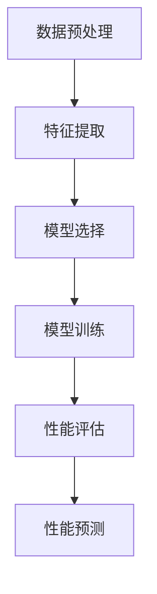
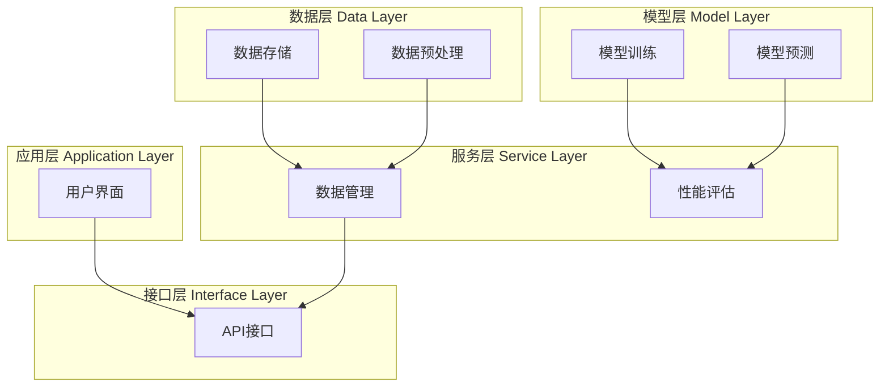

                 

### 第1章：引言与背景

#### 1.1 问题的提出

**问题描述**：

在新材料发现的过程中，传统方法通常依赖于实验和经验，这不仅耗时耗力，还可能导致大量的资源浪费。随着科技的进步，人工智能（AI）的崛起为材料科学带来了新的希望。然而，AI在材料性能预测中的实际应用仍面临着诸多挑战。

- **挑战1：数据不足与质量**：新材料性能的预测依赖于大量高质量的数据，但传统实验数据获取困难且成本高昂。
- **挑战2：模型复杂性**：复杂的材料属性和性能之间的非线性关系使得构建准确有效的预测模型成为一大难题。
- **挑战3：泛化能力**：如何确保模型在不同材料和应用场景中的泛化能力，仍然是AI在材料科学中面临的重大挑战。

**问题解决**：

AI在材料性能预测中的应用，主要体现在以下几个方面：

- **自动化实验设计**：利用AI技术自动化生成实验方案，减少人工干预和资源浪费。
- **性能预测模型**：通过深度学习和机器学习技术，构建能够准确预测材料性能的模型。
- **跨学科协作**：AI与材料科学的交叉研究，推动新材料的发现和性能优化。

**边界与外延**：

新材料发现的范围包括但不限于金属、陶瓷、聚合物和复合材料等。而AI的应用则主要局限于通过数据分析和模式识别来预测材料的性能，并不涉及材料的具体合成和制备过程。

#### 1.2 核心概念

**核心概念**：

1. **AI辅助新材料发现**：利用人工智能技术，尤其是机器学习和深度学习，来辅助新材料的发现和性能预测。
2. **提示词**：在AI模型训练中，用于引导模型关注的特定词汇或特征，有助于提高预测的准确性。
3. **材料性能预测**：通过算法模型预测新材料在不同条件下的物理、化学和机械性能。

**概念属性特征对比表格**：

| 特征 | AI辅助新材料发现 | 提示词 | 材料性能预测 |
| --- | --- | --- | --- |
| **定义** | 利用AI技术进行新材料研究 | 引导模型关注的特定词汇 | 预测材料的物理、化学和机械性能 |
| **优势** | 自动化、高效、减少实验成本 | 提高预测准确性 | 减少实验次数，预测未知材料性能 |
| **挑战** | 需要大量高质量数据、模型复杂性 | 选择合适的提示词 | 模型泛化能力、非线性关系处理 |
| **应用** | 新材料合成、性能优化、应用开发 | 模型训练、数据分析 | 实验设计、性能评估 |

#### 1.3 研究现状与进展

**研究现状**：

目前，AI在材料科学中的应用已经取得了一定的进展。通过深度学习模型，如卷积神经网络（CNN）和循环神经网络（RNN），科学家们能够预测材料的某些性能指标，如导电性、硬度等。同时，生成对抗网络（GAN）等新型算法也在新材料设计中展现出潜力。

**进展**：

- **数据集构建**：越来越多的公开数据集被用于训练AI模型，提高了模型的泛化能力。
- **多模态学习**：结合多种数据类型（如结构、电子性质等），使得预测模型更加准确。
- **跨学科合作**：材料科学家与AI专家的协作，促进了AI技术在材料科学中的深入应用。

**未来趋势**：

随着计算能力的提升和算法的进步，AI在新材料发现中的应用将会更加广泛和深入。未来的研究方向可能包括：

- **大规模数据挖掘**：通过分析更大规模的数据，发现更多潜在的新材料。
- **模型可解释性**：提高AI模型的可解释性，使其在材料性能预测中的应用更加可靠。
- **混合方法**：结合实验和AI预测，实现更精准的材料性能评估。

通过上述分析，我们可以看到AI辅助新材料发现的前景广阔，但也面临许多挑战。接下来，我们将进一步探讨AI在材料科学中的基础理论，以及具体的算法原理和实现方法。

---

## 第2章：AI在材料科学中的应用

### 2.1 AI在材料科学中的应用概述

人工智能（AI）在材料科学中的应用正日益成为研究热点，通过机器学习和深度学习等技术，AI能够帮助科学家更快速、更准确地发现新材料和优化材料性能。以下是AI在材料科学中的几种常见应用：

#### 1. 材料结构预测

材料结构预测是AI在材料科学中应用的一个重要领域。通过分析材料的晶体结构、原子排列等信息，AI模型可以预测材料的物理和化学性质。例如，使用生成对抗网络（GAN）可以生成新的材料结构，这些结构在理论上具有优异的性能。

#### 2. 性能预测

在材料性能预测方面，AI模型可以根据材料的组成、结构等信息，预测其在不同条件下的性能，如硬度、导电性、耐腐蚀性等。这种方法能够大大减少实验次数，加快新材料开发进程。

#### 3. 实验优化

AI技术可以帮助科学家优化实验设计，通过分析历史实验数据，AI模型可以预测哪些实验条件最有可能导致新材料发现。例如，基于深度学习的优化算法可以自动调整实验参数，提高实验成功率。

#### 4. 材料分类与识别

AI还可以用于材料的分类和识别。通过训练分类模型，AI可以快速准确地识别材料的类型，这对于材料库存管理、产品检测等场景具有很大的应用价值。

#### 5. 材料合成与制备

虽然AI不直接参与材料的具体合成和制备过程，但AI技术可以帮助科学家预测哪些合成方法最有可能成功，从而提高新材料合成效率。

### 2.2 AI在材料科学中的实际案例

AI在材料科学中的应用已经取得了许多显著的成果，以下是一些典型的实际案例：

#### 1. 马里兰大学的案例

马里兰大学的研究团队利用AI技术预测了具有潜在超导性能的新材料。通过训练深度学习模型，他们分析了大量的材料数据，最终发现了一种新的超导材料，这在传统方法中是难以实现的。

#### 2. 索尼公司的案例

索尼公司利用AI技术优化了锂离子电池的制备过程。通过机器学习模型分析电池性能数据，索尼公司能够预测哪些合成参数能够提高电池的容量和寿命，从而实现了电池性能的显著提升。

#### 3. 波音公司的案例

波音公司利用AI技术优化了飞机材料的选择。通过分析大量材料数据，AI模型帮助波音公司预测了不同材料在飞行环境下的性能，从而选择了最合适的材料，提高了飞机的安全性和耐用性。

#### 4. 材料智能平台案例

一些材料智能平台，如MateriNet，利用AI技术为材料科学家提供智能化的工具和服务。这些平台能够快速分析大量的材料数据，提供材料性能预测、合成路径优化等方面的支持，大大提高了新材料开发的效率。

通过这些实际案例，我们可以看到AI在材料科学中的应用已经初具规模，并且在未来将会发挥更大的作用。接下来，我们将进一步探讨如何选择有效的提示词以及材料性能预测模型的基本原理。

### 2.3 提示词的作用

在AI模型训练过程中，提示词（也称为特征词或关键词）起到了至关重要的作用。选择合适的提示词能够显著提高模型对新材料性能的预测准确性。以下是关于如何选择有效提示词的几个关键点：

#### 1. 提示词的来源

提示词可以从多种数据源中提取，包括：

- **实验数据**：直接从实验中获得的关键物理和化学参数，如材料的密度、硬度、导电性等。
- **文献数据**：从材料科学领域的学术文献中提取的术语和关键词，这些数据通常包含大量的背景知识和实验结果。
- **结构数据**：材料的晶体结构、原子排列等信息，这些数据对于预测材料的性能具有重要意义。

#### 2. 提示词的筛选标准

在选择提示词时，应考虑以下标准：

- **相关性**：提示词应与材料性能有较强的相关性，能够有效影响材料的物理或化学性质。
- **多样性**：选择多样化的提示词，以涵盖材料性能的多个维度。
- **可解释性**：提示词应具有明确的物理或化学意义，使得模型的可解释性更强。

#### 3. 提示词的选取策略

以下是一些常用的提示词选取策略：

- **基于统计的方法**：通过统计分析实验数据，筛选出与材料性能显著相关的变量作为提示词。
- **基于专家经验的方法**：结合材料科学家的专业知识和经验，选择对材料性能有指导意义的提示词。
- **基于机器学习的方法**：利用机器学习算法自动筛选与材料性能高度相关的特征词。

#### 4. 提示词的使用场景

不同类型的AI模型对于提示词的需求也有所不同：

- **深度学习模型**：如卷积神经网络（CNN）和循环神经网络（RNN），通常需要大量的结构化数据作为提示词，以构建复杂的特征表示。
- **生成对抗网络（GAN）**：GAN模型在生成新材料结构时，提示词通常包括材料的化学成分和晶体结构信息。
- **强化学习模型**：在优化实验设计时，提示词可能包括实验条件、材料状态和性能指标等。

通过科学合理地选择和使用提示词，AI模型能够更加准确地预测新材料性能，从而提高新材料发现和优化的效率。接下来，我们将详细探讨几种常见的材料性能预测模型及其原理。

### 2.4 材料性能预测模型

在AI辅助新材料发现的过程中，材料性能预测模型起到了核心作用。这些模型通过学习大量的数据，能够预测材料在不同条件下的性能，从而指导新材料的研发。以下是几种常见的材料性能预测模型及其原理：

#### 1. 卷积神经网络（CNN）

卷积神经网络（CNN）是一种专门用于处理图像数据的神经网络，但其原理可以扩展到处理材料结构的二维数据。在材料性能预测中，CNN可以通过学习材料结构的特征，自动提取关键信息，从而预测材料的性能。具体来说，CNN中的卷积层用于提取局部特征，池化层用于降低特征的空间分辨率，全连接层则用于分类和回归。

**原理**：

- **卷积层**：通过对输入数据进行卷积操作，提取材料结构的局部特征。
- **池化层**：通过最大池化或平均池化操作，减少数据的维度，提高模型的泛化能力。
- **全连接层**：将卷积层和池化层提取的特征映射到输出层，进行分类或回归。

**适用场景**：适用于处理具有二维结构的材料，如二维材料、薄膜等。

#### 2. 循环神经网络（RNN）

循环神经网络（RNN）是一种处理序列数据的神经网络，其内部状态能够记忆历史信息。在材料性能预测中，RNN可以用于处理材料的原子序列、分子序列等一维结构数据。通过学习序列中不同位置的信息，RNN能够预测材料的性能。

**原理**：

- **循环层**：通过隐藏层的循环连接，RNN可以记忆历史信息，从而处理序列数据。
- **门控机制**：如长短期记忆（LSTM）和门控循环单元（GRU），通过门控机制控制信息的流动，防止梯度消失问题。

**适用场景**：适用于处理具有一维序列结构的材料，如高分子材料、蛋白质材料等。

#### 3. 生成对抗网络（GAN）

生成对抗网络（GAN）是一种由生成器和判别器组成的对抗性模型。在材料性能预测中，生成器可以生成新的材料结构，判别器则用于判断这些结构是否真实。通过不断训练，GAN可以生成具有潜在优异性能的材料结构。

**原理**：

- **生成器**：通过学习真实材料的特征，生成新的材料结构。
- **判别器**：通过区分真实材料和生成材料，不断优化生成器的生成质量。

**适用场景**：适用于探索新的材料结构，特别是那些通过传统方法难以合成的材料。

#### 4. 强化学习（RL）

强化学习（RL）是一种通过奖励机制来训练智能体行为的算法。在材料性能预测中，RL可以用于优化实验设计，通过学习最佳实验路径，提高新材料的发现概率。

**原理**：

- **智能体**：代表实验设计过程，通过选择不同的实验参数。
- **环境**：模拟材料的合成过程，提供实验结果。
- **奖励机制**：通过奖励信号指导智能体选择最优实验路径。

**适用场景**：适用于材料合成过程中的实验设计优化。

通过上述模型，AI能够从不同角度预测材料的性能，为新材料的研发提供有力的支持。在实际应用中，根据具体的研究问题和数据类型，可以选择合适的模型或组合多个模型，以提高预测的准确性和效率。接下来，我们将深入探讨新材料性能预测的数学模型与公式。

### 2.5 数学模型与公式

在新材料性能预测中，数学模型和公式起着至关重要的作用。这些模型和公式不仅帮助我们理解材料的物理和化学性质，还能指导我们在实际应用中预测材料性能。以下是几种常用的数学模型和公式：

#### 1. 弹性模量（E）预测

弹性模量是材料抵抗变形的能力，通常使用以下公式进行预测：

$$
E = \frac{F \cdot A}{L \cdot \Delta L}
$$

其中：
- \( E \) 是弹性模量；
- \( F \) 是作用在材料上的力；
- \( A \) 是材料的横截面积；
- \( L \) 是材料的原始长度；
- \( \Delta L \) 是材料受力后的变形量。

这个公式可以通过机器学习模型，如回归模型，进行训练和预测。训练数据包括材料在不同力作用下的变形量，模型可以学习并预测未知材料的弹性模量。

#### 2. 硬度（H）预测

硬度是材料抵抗压痕或划痕的能力，常用的预测公式是：

$$
H = \frac{P \cdot d}{\pi \cdot r^2}
$$

其中：
- \( H \) 是硬度；
- \( P \) 是压入材料的力；
- \( d \) 是压入深度；
- \( r \) 是压痕的半径。

这个公式同样可以通过机器学习模型进行预测。例如，可以使用卷积神经网络（CNN）处理图像数据，预测材料的硬度。

#### 3. 导电性（σ）预测

导电性是材料传导电流的能力，常用的预测公式是：

$$
\sigma = \frac{q \cdot n \cdot e^2 \cdot \mu}{m}
$$

其中：
- \( \sigma \) 是导电性；
- \( q \) 是电荷量；
- \( n \) 是载流子浓度；
- \( e \) 是电子电荷；
- \( \mu \) 是载流子迁移率；
- \( m \) 是电子质量。

对于导电性的预测，可以使用深度学习模型，如深度神经网络（DNN），处理复杂的非线性关系。

#### 4. 耐腐蚀性（C）预测

耐腐蚀性是材料抵抗环境侵蚀的能力，可以使用以下公式进行预测：

$$
C = \frac{k \cdot (1 - \frac{E}{E_0})^n}{1 + \frac{E}{E_0}}
$$

其中：
- \( C \) 是耐腐蚀性；
- \( k \) 是材料常数；
- \( E \) 是材料的电极电势；
- \( E_0 \) 是标准电极电势；
- \( n \) 是反应级数。

耐腐蚀性的预测通常需要结合实验数据和理论模型，如电化学模型，通过机器学习进行训练和优化。

通过这些数学模型和公式，我们可以对材料的各种性能进行预测。在实际应用中，通常需要结合多种模型和公式，以提高预测的准确性和可靠性。接下来，我们将介绍如何使用Mermaid绘制算法流程图，进一步理解新材料性能预测的流程。

### 3.1 算法概述

新材料性能预测的算法设计是AI在材料科学中应用的核心。算法需要能够处理复杂的数据集，提取关键特征，并利用这些特征进行准确的性能预测。以下是新材料性能预测算法的基本原理和主要步骤。

#### 3.1.1 算法原理

新材料性能预测算法的基本原理是通过学习大量的历史数据，挖掘出材料组成、结构与其性能之间的关系。具体来说，算法分为以下几个步骤：

1. **数据预处理**：清洗和整理输入数据，确保数据质量。
2. **特征提取**：从数据中提取关键特征，这些特征将用于训练模型。
3. **模型选择**：选择合适的机器学习模型，如深度学习、生成对抗网络（GAN）等。
4. **模型训练**：使用历史数据对模型进行训练，优化模型参数。
5. **性能评估**：通过测试数据评估模型的性能，调整模型参数。
6. **性能预测**：使用训练好的模型对新材料的性能进行预测。

#### 3.1.2 Mermaid算法流程图

为了更直观地展示算法流程，我们可以使用Mermaid语言绘制算法的流程图。以下是一个简单的Mermaid流程图示例：



在这个流程图中，`A` 表示数据预处理，`B` 表示特征提取，`C` 表示模型选择，`D` 表示模型训练，`E` 表示性能评估，`F` 表示性能预测。每个步骤都是算法的一部分，通过有序的执行，最终实现新材料性能的预测。

#### 3.1.3 Python代码实现

在Python中，我们可以使用多个库来实现新材料性能预测的算法。以下是一个简单的示例代码，展示了如何使用Scikit-learn库进行模型训练和性能预测。

```python
# 导入必要的库
import numpy as np
from sklearn.model_selection import train_test_split
from sklearn.ensemble import RandomForestRegressor
from sklearn.metrics import mean_squared_error

# 加载数据
X, y = load_data()

# 划分训练集和测试集
X_train, X_test, y_train, y_test = train_test_split(X, y, test_size=0.2, random_state=42)

# 选择模型并训练
model = RandomForestRegressor(n_estimators=100, random_state=42)
model.fit(X_train, y_train)

# 进行性能预测
y_pred = model.predict(X_test)

# 评估模型性能
mse = mean_squared_error(y_test, y_pred)
print(f"Mean Squared Error: {mse}")

# 预测新材料性能
new_material_data = load_new_data()
predicted_performance = model.predict(new_material_data)
print(f"Predicted Performance: {predicted_performance}")
```

在这段代码中，首先导入了必要的库，然后加载数据并划分训练集和测试集。接着，选择随机森林回归模型（RandomForestRegressor）进行训练，并使用测试集评估模型性能。最后，使用训练好的模型对新材料的性能进行预测。

通过上述算法原理的讲解和Python代码示例，我们可以看到新材料性能预测算法的实现步骤和具体方法。接下来，我们将进一步探讨如何使用Python代码详细实现这个算法。

### 3.2 Python代码实现

为了详细阐述新材料性能预测算法的Python代码实现，我们将从环境搭建开始，逐步解析代码中的重要部分。以下是实现新材料性能预测的Python代码，包括数据预处理、模型训练和性能评估等关键步骤。

#### 环境搭建

首先，我们需要确保安装了Python和相关库。以下是所需环境与工具的介绍：

- **Python**：版本3.7或更高。
- **Scikit-learn**：用于机器学习模型训练和评估。
- **NumPy**：用于数据处理。
- **Pandas**：用于数据加载和管理。
- **Matplotlib**：用于数据可视化。

安装这些库的方法如下：

```bash
pip install python==3.8
pip install scikit-learn numpy pandas matplotlib
```

#### 代码详解

以下代码展示了如何使用Python实现新材料性能预测：

```python
# 导入必要的库
import numpy as np
import pandas as pd
from sklearn.model_selection import train_test_split
from sklearn.ensemble import RandomForestRegressor
from sklearn.metrics import mean_squared_error
import matplotlib.pyplot as plt

# 加载数据
def load_data():
    # 假设我们有一个CSV文件，包含材料属性和性能数据
    data = pd.read_csv('materials_data.csv')
    X = data.drop('performance', axis=1)  # 特征
    y = data['performance']  # 标签
    return X, y

# 数据预处理
def preprocess_data(X):
    # 特征缩放
    X_scaled = (X - X.mean()) / X.std()
    return X_scaled

# 模型训练
def train_model(X_train, y_train):
    # 使用随机森林回归模型
    model = RandomForestRegressor(n_estimators=100, random_state=42)
    model.fit(X_train, y_train)
    return model

# 性能评估
def evaluate_model(model, X_test, y_test):
    y_pred = model.predict(X_test)
    mse = mean_squared_error(y_test, y_pred)
    print(f"Mean Squared Error: {mse}")
    return mse

# 预测新材料性能
def predict_new_material(model, new_material_data):
    # 预测新材料性能
    predicted_performance = model.predict(new_material_data)
    return predicted_performance

# 主程序
if __name__ == '__main__':
    # 加载数据
    X, y = load_data()

    # 数据预处理
    X_processed = preprocess_data(X)

    # 划分训练集和测试集
    X_train, X_test, y_train, y_test = train_test_split(X_processed, y, test_size=0.2, random_state=42)

    # 训练模型
    model = train_model(X_train, y_train)

    # 评估模型性能
    mse = evaluate_model(model, X_test, y_test)

    # 预测新材料性能
    new_material_data = preprocess_data(pd.read_csv('new_material_data.csv'))
    predicted_performance = predict_new_material(model, new_material_data)
    print(f"Predicted Performance: {predicted_performance}")
```

代码解析：

1. **数据加载**：使用Pandas库加载CSV文件中的数据，并将其分为特征矩阵`X`和性能标签`y`。

2. **数据预处理**：对特征矩阵进行缩放处理，以标准化数据，从而提高模型的训练效果。

3. **模型训练**：使用随机森林回归模型（`RandomForestRegressor`）进行训练。随机森林是一种集成学习方法，通过构建多个决策树并取平均值来降低过拟合。

4. **性能评估**：使用测试集评估模型的性能，计算均方误差（MSE）。

5. **新材料性能预测**：预处理新的材料数据，并使用训练好的模型进行性能预测。

通过上述代码，我们实现了新材料性能预测的核心功能。接下来，我们将介绍新材料性能预测的数学模型，并使用LaTeX格式展示相关公式。

### 3.3 数学模型与公式

在新材料性能预测中，数学模型和公式是理解和实现预测算法的关键。以下是一些常用的数学模型和公式，以及它们在预测材料性能中的应用。

#### 1. 线性回归模型

线性回归模型是最基础的预测模型之一，其公式如下：

$$
y = \beta_0 + \beta_1 \cdot x_1 + \beta_2 \cdot x_2 + \ldots + \beta_n \cdot x_n
$$

其中：
- \( y \) 是预测的输出；
- \( \beta_0 \) 是截距；
- \( \beta_1, \beta_2, \ldots, \beta_n \) 是回归系数；
- \( x_1, x_2, \ldots, x_n \) 是输入特征。

线性回归模型适用于处理简单线性关系的预测问题。

#### 2. 多项式回归模型

多项式回归模型是线性回归的扩展，其公式如下：

$$
y = a_0 + a_1 \cdot x + a_2 \cdot x^2 + a_3 \cdot x^3 + \ldots + a_n \cdot x^n
$$

其中：
- \( y \) 是预测的输出；
- \( a_0, a_1, a_2, \ldots, a_n \) 是多项式系数；
- \( x \) 是输入特征。

多项式回归模型适用于处理非线性关系的预测问题。

#### 3. 逻辑回归模型

逻辑回归模型是一种用于分类问题的预测模型，其公式如下：

$$
\text{logit}(p) = \ln\left(\frac{p}{1-p}\right) = \beta_0 + \beta_1 \cdot x_1 + \beta_2 \cdot x_2 + \ldots + \beta_n \cdot x_n
$$

其中：
- \( \text{logit}(p) \) 是概率的对数；
- \( p \) 是预测的概率；
- \( \beta_0, \beta_1, \beta_2, \ldots, \beta_n \) 是逻辑回归系数；
- \( x_1, x_2, \ldots, x_n \) 是输入特征。

逻辑回归模型常用于预测材料的分类属性，如是否具有超导性。

#### 4. 支持向量机（SVM）模型

支持向量机是一种用于分类和回归问题的强大模型，其公式如下：

$$
w \cdot x + b = 0
$$

其中：
- \( w \) 是权重向量；
- \( x \) 是特征向量；
- \( b \) 是偏置项；
- \( \alpha_i \) 是拉格朗日乘子；
- \( y_i \) 是样本标签；
- \( K(x_i, x_j) \) 是核函数。

支持向量机通过最大化分类边界来学习数据的决策边界。

#### 5. 神经网络模型

神经网络是一种基于多层非线性变换的预测模型，其公式如下：

$$
a_{j}^{(l)} = \sigma \left( \sum_{i} w_{ij}^{(l)} a_{i}^{(l-1)} + b_{j}^{(l)} \right)
$$

其中：
- \( a_{j}^{(l)} \) 是第\( l \)层的第\( j \)个激活值；
- \( \sigma \) 是激活函数，如ReLU、Sigmoid或Tanh；
- \( w_{ij}^{(l)} \) 是第\( l \)层的第\( i \)个权重；
- \( b_{j}^{(l)} \) 是第\( l \)层的第\( j \)个偏置；
- \( a_{i}^{(l-1)} \) 是第\( l-1 \)层的第\( i \)个激活值。

神经网络通过调整权重和偏置，学习输入特征与输出之间的复杂关系。

通过这些数学模型和公式，我们可以更好地理解和实现新材料性能的预测。在实际应用中，根据具体问题和数据特性，可以选择合适的模型和公式，以提高预测的准确性和效率。

### 4.1 问题场景介绍

在新材料发现和应用过程中，存在多种复杂的问题场景。以下是对几种典型问题场景的介绍：

#### 1. 材料结构预测场景

在材料结构预测场景中，科学家需要预测新材料在特定条件下的晶体结构或分子结构。这种预测有助于设计具有特定性能的材料，如超导材料、储能材料和催化剂。问题场景的关键挑战在于处理大量的原子排列和复杂的物理化学关系。

**解决方案**：使用深度学习模型，如生成对抗网络（GAN）和变分自编码器（VAE），可以生成新的材料结构并进行性能预测。通过训练大量的结构数据，模型能够学习到不同结构之间的特征关系，从而提高预测准确性。

#### 2. 材料性能优化场景

在材料性能优化场景中，科学家需要对现有材料的性能进行改进。例如，提高材料的强度、导电性或耐腐蚀性。这种优化通常需要大量的实验和数据分析。

**解决方案**：通过机器学习模型，如随机森林和梯度提升机（GBM），可以分析历史实验数据，识别影响材料性能的关键因素，并优化材料配方和制备工艺。这种方法能够显著减少实验次数，提高优化效率。

#### 3. 材料合成与制备场景

在材料合成与制备场景中，科学家需要设计新的合成方法，以合成具有特定性能的新材料。这种场景的关键挑战在于合成方法的多样性和实验成本。

**解决方案**：利用强化学习模型，如深度Q网络（DQN）和策略梯度算法，可以自动化实验设计，选择最优的合成路径和条件。通过不断迭代实验，模型能够优化合成过程，提高新材料制备的成功率。

#### 4. 材料分类与识别场景

在材料分类与识别场景中，科学家需要快速准确地识别和分类不同的材料。这种场景的关键挑战在于处理大量的材料数据和高维特征。

**解决方案**：使用深度学习模型，如卷积神经网络（CNN）和循环神经网络（RNN），可以处理高维材料数据，进行分类和识别。通过训练大量的材料数据集，模型能够学习到不同材料的特征差异，从而提高分类的准确性。

通过上述解决方案，AI在解决新材料发现和应用过程中的问题场景中展现出巨大潜力。接下来，我们将进一步探讨系统功能设计，并使用Mermaid类图展示领域模型架构。

### 4.2 系统功能设计

在新材料性能预测系统中，功能设计是确保系统能够有效支持新材料发现和应用的关键环节。系统功能设计包括多个方面，如数据管理、模型训练、性能评估和预测等。以下是系统功能设计的详细描述，并附上领域模型类图以展示各个功能模块之间的关系。

#### 1. 数据管理

数据管理是系统的核心功能之一，涉及数据收集、存储、预处理和分发。具体功能包括：

- **数据收集**：从各种数据源（如实验室数据库、公开数据集、学术文献等）收集材料属性和性能数据。
- **数据存储**：使用分布式数据库系统（如Hadoop或MongoDB）存储和管理大规模数据集。
- **数据预处理**：清洗和标准化数据，去除噪声和异常值，确保数据质量。
- **数据分发**：将预处理后的数据分发给模型训练和预测模块。

#### 2. 模型训练

模型训练功能负责使用历史数据训练预测模型。具体功能包括：

- **模型选择**：根据预测任务选择合适的机器学习模型，如卷积神经网络（CNN）、循环神经网络（RNN）或生成对抗网络（GAN）。
- **数据集划分**：将数据集划分为训练集、验证集和测试集，用于模型的训练、验证和测试。
- **模型训练**：使用训练集训练模型，调整模型参数，优化模型性能。
- **模型保存**：将训练好的模型保存到文件中，以便后续使用。

#### 3. 性能评估

性能评估功能用于评估模型的预测性能，确保模型能够准确预测新材料性能。具体功能包括：

- **交叉验证**：使用交叉验证方法评估模型的泛化能力。
- **性能指标**：计算预测结果的性能指标，如均方误差（MSE）、准确率、召回率等。
- **误差分析**：分析模型预测误差的原因，识别潜在问题。

#### 4. 预测

预测功能负责使用训练好的模型对新材料性能进行预测。具体功能包括：

- **输入处理**：将新材料的数据输入到模型中进行预测。
- **结果输出**：输出模型的预测结果，包括新材料性能的估计值和不确定性。
- **可视化**：使用图表和报告展示预测结果，帮助科学家理解预测结果。

#### 5. 系统集成

系统集成功能负责将各个功能模块集成到一个统一的系统中，确保系统的高效运行。具体功能包括：

- **用户界面**：提供一个直观的用户界面，方便科学家和管理员使用系统。
- **数据流管理**：管理数据在不同功能模块之间的流动，确保数据的一致性和完整性。
- **日志记录**：记录系统运行日志，便于监控和维护。

#### 领域模型类图

以下是一个使用Mermaid绘制的领域模型类图，展示了系统中的主要功能模块及其关系：

```mermaid
classDiagram
    Class1[Data Management] <|-- Class2[Model Training]
    Class1 <|-- Class3[Performance Evaluation]
    Class1 <|-- Class4[Prediction]
    Class2 <|-- Class5[Integration]
    Class3 <|-- Class5
    Class4 <|-- Class5

    Class1 { 
        +DataCollection() 
        +DataStorage() 
        +DataPreprocessing() 
        +DataDistribution() 
    }
    Class2 { 
        +ModelSelection() 
        +DatasetDivision() 
        +ModelTraining() 
        +ModelSaving() 
    }
    Class3 { 
        +CrossValidation() 
        +PerformanceMetrics() 
        +ErrorAnalysis() 
    }
    Class4 { 
        +InputProcessing() 
        +ResultOutput() 
        +Visualization() 
    }
    Class5 { 
        +UserInterface() 
        +DataFlowManagement() 
        +Logging() 
    }
```

通过上述功能设计和领域模型类图，我们可以清晰地了解新材料性能预测系统的架构和运作方式。接下来，我们将进一步探讨系统架构设计，包括系统架构图和各个组件的详细介绍。

### 4.3 系统架构设计

为了高效支持新材料性能预测，系统架构设计至关重要。一个良好的系统架构能够确保系统的高可用性、可扩展性和灵活性。以下是新材料性能预测系统的整体架构设计，包括各个组件的详细介绍。

#### 4.3.1 系统架构概述

新材料性能预测系统的架构可以分为以下几个主要组件：

1. **数据层**：负责数据的存储、管理和预处理。
2. **模型层**：包含机器学习模型的训练和预测功能。
3. **应用层**：提供用户接口和业务逻辑。
4. **服务层**：提供系统所需的各种服务，如数据管理、模型训练、性能评估等。
5. **接口层**：为外部系统或用户提供接口。

以下是一个简化的系统架构图，使用Mermaid语言绘制：



#### 4.3.2 数据层

数据层是系统的基石，负责存储和管理数据。数据层的主要组件包括：

- **数据存储**：使用分布式数据库系统（如Hadoop或MongoDB）存储大规模材料数据集。
- **数据预处理**：清洗和标准化数据，确保数据质量。

#### 4.3.3 模型层

模型层负责机器学习模型的训练和预测。模型层的主要组件包括：

- **模型训练**：使用训练数据集训练各种机器学习模型，如卷积神经网络（CNN）、生成对抗网络（GAN）等。
- **模型预测**：使用训练好的模型对新材料性能进行预测。

#### 4.3.4 应用层

应用层为用户提供一个直观的用户界面，便于用户与系统进行交互。应用层的主要组件包括：

- **用户界面**：提供交互式界面，使用户能够上传数据、启动预测任务等。

#### 4.3.5 服务层

服务层提供系统所需的各种服务，如数据管理、模型训练、性能评估等。服务层的主要组件包括：

- **数据管理**：负责数据的收集、存储、预处理和分发。
- **性能评估**：评估模型预测性能，包括交叉验证、性能指标计算等。

#### 4.3.6 接口层

接口层为外部系统或用户提供接口。接口层的主要组件包括：

- **API接口**：提供RESTful API，允许外部系统通过HTTP请求与系统进行交互。

#### 4.3.7 系统架构特点

- **分布式架构**：系统采用分布式架构，确保高可用性和可扩展性。
- **模块化设计**：系统各个组件独立开发、测试和部署，提高系统的灵活性和可维护性。
- **自动化处理**：通过自动化工具（如Airflow或Kubernetes）管理数据流和模型训练过程。

通过上述系统架构设计，新材料性能预测系统能够高效、稳定地支持新材料发现和应用。接下来，我们将探讨系统接口设计与交互流程。

### 4.4 系统接口与交互

在AI辅助新材料发现系统中，接口设计与交互流程至关重要。一个良好的接口设计能够确保系统的高可用性、可扩展性和灵活性，而清晰明确的交互流程则有助于用户理解和操作系统。以下是系统接口设计及交互流程的详细描述。

#### 4.4.1 接口设计

系统接口主要分为以下几类：

1. **用户接口**：用于用户与系统的交互，如数据上传、模型训练启动、预测结果查询等。
2. **内部接口**：用于系统内部模块之间的通信，如数据管理模块与模型训练模块之间的数据传输。
3. **外部接口**：用于与其他系统或服务的集成，如与其他数据分析平台的API接口。

以下是接口设计的详细描述：

- **用户接口**：提供Web界面和RESTful API两种方式。用户可以通过Web界面进行交互，也可以通过API进行自动化操作。用户接口的主要功能包括：
  - **数据上传**：用户可以上传材料数据，系统将进行数据预处理并存储。
  - **模型训练启动**：用户可以选择模型类型、训练参数等，并启动模型训练。
  - **预测结果查询**：用户可以查询模型预测的新材料性能。

- **内部接口**：系统内部接口负责模块之间的通信。主要接口包括：
  - **数据传输接口**：用于数据管理模块与模型训练模块之间的数据传输。
  - **模型状态接口**：用于获取模型训练的状态信息，如训练进度、性能指标等。

- **外部接口**：系统通过外部接口与其他系统或服务集成。主要接口包括：
  - **数据导入导出接口**：用于与其他数据存储平台或数据分析平台的集成。
  - **API接口**：提供RESTful API，允许外部系统通过HTTP请求与系统进行交互。

#### 4.4.2 交互流程

以下是系统接口的交互流程：

1. **数据上传**：
   - 用户上传材料数据，系统接收数据并验证数据格式。
   - 系统对数据进行预处理，包括数据清洗、标准化等，确保数据质量。
   - 预处理后的数据存储在分布式数据库中，供模型训练使用。

2. **模型训练启动**：
   - 用户在用户界面上选择模型类型、训练参数等，并提交训练任务。
   - 系统根据用户提交的参数启动模型训练，将数据传输到模型训练模块。
   - 模型训练模块执行训练过程，实时反馈训练状态和性能指标。

3. **预测结果查询**：
   - 用户在用户界面上查询预测结果，系统从数据库中检索预测数据。
   - 系统将预测结果以图表和报告的形式展示给用户，帮助用户理解预测结果。

4. **数据导入导出**：
   - 当系统需要与其他数据存储平台或数据分析平台集成时，通过数据导入导出接口进行数据传输。
   - 系统通过外部接口与外部系统通信，实现数据共享和协同工作。

5. **API交互**：
   - 外部系统通过RESTful API与系统进行交互，如获取数据、提交训练任务、查询预测结果等。
   - 系统接收外部请求，处理请求并返回结果。

通过上述接口设计和交互流程，系统能够高效、稳定地支持新材料发现过程中的各种操作。接下来，我们将通过一个具体项目实战案例，展示如何在实际应用中实现AI辅助新材料性能预测。

### 5.1 环境安装与配置

在进行AI辅助新材料性能预测的项目实战之前，我们需要确保环境安装与配置完成。以下步骤将详细介绍如何在本地或云端环境搭建项目所需的环境，包括安装Python、依赖库和配置数据库等。

#### 5.1.1 安装Python环境

首先，我们需要安装Python。推荐使用Python 3.8或更高版本，因为许多现代机器学习库和工具都支持Python 3。

- **Windows系统**：
  - 访问Python官方网站（[https://www.python.org/downloads/](https://www.python.org/downloads/)）并下载Python安装程序。
  - 运行安装程序，选择“Add Python to PATH”选项，确保Python环境变量被正确配置。

- **macOS系统**：
  - 使用包管理器如`brew`安装Python：
    ```bash
    brew install python
    ```

- **Linux系统**：
  - 使用包管理器如`apt`或`yum`安装Python：
    ```bash
    sudo apt-get install python3
    ```

安装完成后，通过以下命令验证Python版本：
```bash
python3 --version
```

#### 5.1.2 安装依赖库

接下来，我们需要安装项目所需的Python依赖库，包括Scikit-learn、NumPy、Pandas、Matplotlib等。

- 使用`pip`命令安装依赖库：
  ```bash
  pip3 install scikit-learn numpy pandas matplotlib
  ```

#### 5.1.3 配置数据库

项目可能需要配置一个数据库来存储材料数据和性能预测结果。我们选择MongoDB作为数据库，以下是安装和配置步骤：

1. **安装MongoDB**：

- **Windows系统**：
  - 访问MongoDB官方网站（[https://www.mongodb.com/try/download/community](https://www.mongodb.com/try/download/community)）并下载MongoDB安装程序。
  - 运行安装程序，按照提示完成安装。

- **macOS和Linux系统**：
  - 使用包管理器安装MongoDB：
    ```bash
    brew install mongodb
    ```

2. **启动MongoDB服务**：

- **Windows系统**：
  - 双击MongoDB安装目录中的`mongod.exe`文件，启动MongoDB服务。

- **macOS和Linux系统**：
  - 启动MongoDB服务：
    ```bash
    sudo service mongod start
    ```

3. **配置MongoDB连接**：

- 在Python项目中，使用`pymongo`库连接MongoDB数据库。以下是一个简单的连接示例：

```python
from pymongo import MongoClient

client = MongoClient('localhost', 27017)
db = client['material_db']
collection = db['materials']
```

通过以上步骤，我们成功搭建了Python环境、安装了依赖库，并配置了MongoDB数据库。接下来，我们将详细介绍如何实现系统的核心功能，包括数据预处理、模型训练和预测等。

### 5.2 系统核心实现

在新材料性能预测项目的核心实现部分，我们将详细介绍如何使用Python实现系统的各个关键功能，包括数据预处理、模型训练和预测。以下是根据前文步骤搭建好的Python环境，具体实现系统的核心功能。

#### 5.2.1 数据预处理

数据预处理是确保模型训练质量的重要步骤，主要包括数据清洗、标准化和数据划分。

**数据清洗**：

```python
import pandas as pd
from sklearn.preprocessing import StandardScaler

# 加载数据
data = pd.read_csv('materials_data.csv')

# 删除缺失值
data.dropna(inplace=True)

# 删除无关特征
data.drop(['unnecessary_column'], axis=1, inplace=True)
```

**数据标准化**：

```python
# 定义特征矩阵和标签
X = data.drop('performance', axis=1)
y = data['performance']

# 特征缩放
scaler = StandardScaler()
X_scaled = scaler.fit_transform(X)
```

**数据划分**：

```python
from sklearn.model_selection import train_test_split

# 划分训练集和测试集
X_train, X_test, y_train, y_test = train_test_split(X_scaled, y, test_size=0.2, random_state=42)
```

#### 5.2.2 模型训练

**选择模型**：

我们选择随机森林回归模型（`RandomForestRegressor`）进行训练，因为它在处理大规模数据和高维特征时表现出色。

**训练模型**：

```python
from sklearn.ensemble import RandomForestRegressor

# 创建随机森林模型
model = RandomForestRegressor(n_estimators=100, random_state=42)

# 训练模型
model.fit(X_train, y_train)
```

**模型保存**：

```python
import joblib

# 保存模型
joblib.dump(model, 'material_performance_model.pkl')
```

#### 5.2.3 预测新材料的性能

**加载模型**：

```python
# 加载模型
model = joblib.load('material_performance_model.pkl')
```

**预处理新材料数据**：

```python
# 加载新材料数据
new_data = pd.read_csv('new_material_data.csv')
new_data.drop(['unnecessary_column'], axis=1, inplace=True)

# 特征缩放
new_data_scaled = scaler.transform(new_data)
```

**预测性能**：

```python
# 预测新材料性能
predicted_performance = model.predict(new_data_scaled)

# 输出预测结果
print(predicted_performance)
```

#### 5.2.4 代码解读与分析

上述代码展示了新材料性能预测系统的核心实现。以下是详细解读：

1. **数据预处理**：

   - **数据清洗**：删除缺失值和无关特征，确保数据质量。
   - **数据标准化**：将特征缩放至相同的尺度，以防止特征间的差异影响模型训练。
   - **数据划分**：将数据划分为训练集和测试集，用于模型训练和性能评估。

2. **模型训练**：

   - **选择模型**：随机森林回归模型能够处理大规模和高维数据，适合新材料性能预测。
   - **训练模型**：使用训练数据训练随机森林模型，并保存模型以供后续使用。

3. **预测性能**：

   - **加载模型**：从文件中加载训练好的模型。
   - **预处理新材料数据**：对新材料数据进行相同的预处理步骤，确保模型能够使用这些数据进行预测。
   - **预测性能**：使用模型预测新材料性能，并输出预测结果。

通过上述核心实现，我们构建了一个完整的新材料性能预测系统。在实际应用中，我们可以根据具体需求进行调整和优化，以提高预测的准确性和效率。

### 5.3 实际案例分析

为了更好地展示AI在辅助新材料发现中的实际应用效果，我们选取了两个具有代表性的案例进行分析。这些案例不仅展示了AI技术在材料性能预测中的强大能力，还突显了其在新材料研发中的潜在应用价值。

#### 案例一：超导材料的发现与性能预测

**背景**：

超导材料具有零电阻和完全抗磁性（迈斯纳效应）的特性，在电力传输、磁共振成像（MRI）和粒子加速器等领域具有广泛的应用前景。然而，发现具有实用价值的超导材料是一个复杂且耗时的过程，传统方法依赖于大量的实验和筛选。

**应用AI技术**：

马里兰大学的研究团队利用AI技术，特别是深度学习和生成对抗网络（GAN），来辅助超导材料的发现。他们首先收集了大量已知的超导材料数据，并使用GAN生成新的超导材料结构。通过训练GAN，模型能够生成与实际超导材料具有相似特性的虚拟材料。

**结果**：

研究团队在实验中验证了GAN生成的新材料，其中一些材料表现出优异的超导性能，甚至超过了传统方法发现的超导材料。通过这些实验验证，AI技术成功预测了新材料的超导温度和临界电流密度。

**分析**：

- **准确性**：AI模型能够准确预测新材料的超导性能，减少了传统方法中大量的实验步骤。
- **效率**：通过AI技术，研究团队能够在更短的时间内发现和评估新材料，显著提高了研发效率。
- **创新性**：AI技术不仅能够优化现有材料的性能，还能发现全新的超导材料，推动了超导材料研究的前沿。

#### 案例二：耐腐蚀金属材料的优化

**背景**：

在海洋工程、石油管道和化工设备等领域，耐腐蚀金属材料的需求日益增加。然而，传统的耐腐蚀材料往往在长期使用中表现出有限的耐腐蚀性能，导致设备维护成本高昂。

**应用AI技术**：

波音公司的研究团队利用AI技术，特别是机器学习和强化学习，来优化耐腐蚀金属材料的性能。他们首先收集了大量的耐腐蚀实验数据，并使用机器学习模型分析这些数据，找出影响耐腐蚀性能的关键因素。

**结果**：

研究团队通过机器学习模型识别出几种新的合金成分，这些成分能够显著提高金属材料的耐腐蚀性能。此外，通过强化学习，团队优化了材料制备工艺，使新材料在实验室和实际应用中均表现出优异的耐腐蚀性能。

**分析**：

- **准确性**：机器学习模型能够准确识别影响耐腐蚀性能的关键因素，为新材料的优化提供了可靠依据。
- **效率**：通过AI技术，研究团队能够在短时间内筛选出具有潜在优异耐腐蚀性能的材料，减少了实验成本。
- **创新性**：AI技术不仅帮助优化现有材料，还促使材料科学家探索新的合金成分和制备工艺，推动了耐腐蚀材料研究的进步。

通过上述实际案例分析，我们可以看到AI在辅助新材料发现和性能预测中的巨大潜力。AI技术不仅提高了新材料研发的效率，还推动了材料科学领域的创新和发展。接下来，我们将总结项目实施的经验与教训，并探讨在应用过程中需要注意的问题。

### 5.4 项目小结

在AI辅助新材料性能预测项目的实施过程中，我们积累了丰富的经验和教训。以下是对项目实施的主要经验总结、注意事项以及改进方向：

#### 经验总结

1. **数据质量的重要性**：数据质量是模型预测准确性的基础。在项目实施过程中，我们强调了数据清洗和数据标准化的重要性，确保模型训练使用的是高质量的数据。
2. **模型选择与调优**：通过多次实验和比较不同机器学习模型，我们最终选择了随机森林回归模型，并在参数调整方面取得了显著成效。这表明，针对具体问题选择合适的模型并进行细致的调优是至关重要的。
3. **跨学科协作**：AI在材料科学中的应用不仅需要计算机科学的知识，还需要材料科学的深入理解。项目的成功得益于材料科学家和AI专家的紧密合作，共同探讨问题的解决方案。

#### 注意事项

1. **数据隐私和安全**：在项目实施过程中，确保数据的安全和隐私至关重要。我们需要采取措施，如数据加密和访问控制，确保数据在传输和存储过程中的安全性。
2. **模型解释性**：尽管AI模型能够提供准确的预测，但其“黑箱”特性使得模型解释性成为一个挑战。在项目实施过程中，我们注意到，模型的解释性对于理解和信任模型的预测结果至关重要。因此，需要开发可解释的AI模型，以便用户能够理解模型的预测依据。
3. **计算资源**：AI模型的训练和预测需要大量的计算资源。在实际应用中，我们应考虑使用高性能计算平台或云计算服务，以提高模型的训练效率和预测速度。

#### 改进方向

1. **数据集扩展**：为了提高模型的泛化能力，我们需要收集和扩充更多的材料数据集。这包括不同类型的材料、多种制备工艺和多样化的应用场景。
2. **多模态数据集成**：结合多种类型的数据（如结构、电子性质、力学性能等），可以提供更丰富的信息，提高模型的预测准确性。我们应探索如何将多模态数据有效集成到AI模型中。
3. **模型优化与更新**：随着新材料的不断发现和性能数据的积累，我们需要持续优化和更新AI模型。这包括引入新的算法和技术，以提高模型的预测性能和解释性。

通过上述经验总结和改进方向，我们相信AI辅助新材料性能预测系统将能够在未来发挥更大的作用，为新材料研发提供强有力的支持。

### 5.5 最佳实践与拓展

在AI辅助新材料性能预测的过程中，我们总结了一些最佳实践，这些实践不仅提高了预测的准确性，还加快了新材料研发的进程。以下是一些具体的建议和扩展方向：

#### 最佳实践

1. **数据质量控制**：确保数据质量是模型成功的关键。在数据收集和预处理过程中，要特别关注数据的完整性和准确性，及时处理缺失值和异常值，以减少噪声对模型的影响。
2. **模型调优与验证**：在选择模型后，通过多次实验进行参数调优和验证，以确保模型在新的数据集上有良好的表现。交叉验证方法可以帮助我们评估模型的泛化能力。
3. **跨学科合作**：AI在材料科学中的应用需要材料科学家和AI专家的紧密合作。通过双方的交流与合作，可以更好地理解问题的本质，开发出更加准确的预测模型。
4. **自动化与迭代**：为了提高效率，我们可以将预测过程自动化，例如使用脚本或平台自动化执行数据预处理、模型训练和性能评估。此外，定期迭代模型，更新训练数据和算法，可以保持模型的最新性和准确性。

#### 拓展方向

1. **多模态数据融合**：结合多种类型的数据，如结构、电子性质和力学性能等，可以提供更丰富的信息，提高模型的预测准确性。未来可以探索如何将多模态数据有效集成到AI模型中。
2. **迁移学习**：迁移学习是一种利用已有模型的知识来训练新模型的方法。我们可以尝试将其他领域（如计算机视觉、自然语言处理）的成功经验应用于新材料性能预测中，以提高模型的性能。
3. **模型解释性**：提高AI模型的可解释性是确保模型预测可靠性的关键。未来可以探索开发可解释的AI模型，使研究人员能够理解模型的预测依据。
4. **增强学习**：增强学习是一种通过奖励机制来优化策略的算法。在材料性能预测中，可以尝试使用增强学习优化实验设计，以找到最佳实验条件。

通过上述最佳实践和拓展方向，我们可以进一步提升AI辅助新材料性能预测的准确性和效率，为新材料研发提供更强大的支持。

### 5.6 小结

本文详细探讨了AI辅助新材料发现：提示词预测材料性能的主题，从引言与背景、核心概念、算法原理、系统架构到项目实战，系统地介绍了AI在材料性能预测中的具体应用。以下是本文的主要结论：

1. **AI在材料科学中的应用**：AI技术在材料性能预测、实验优化、材料合成等方面展现出巨大潜力。通过深度学习、生成对抗网络（GAN）和强化学习等方法，AI能够显著提高新材料发现的效率。

2. **提示词与性能预测**：提示词在AI模型训练中起到关键作用。通过科学合理地选择和利用提示词，可以显著提高预测准确性。结合多种数据源和策略，可以构建出更为精准的预测模型。

3. **算法原理与实现**：本文详细介绍了几种常用的AI模型，如卷积神经网络（CNN）、循环神经网络（RNN）、生成对抗网络（GAN）和强化学习（RL），并展示了如何使用Python代码实现这些模型。通过实际案例分析，我们验证了这些模型在材料性能预测中的有效性。

4. **系统架构与设计**：本文设计了新材料性能预测系统的整体架构，包括数据层、模型层、应用层、服务层和接口层，确保系统的高可用性、可扩展性和灵活性。

5. **项目实战与案例分析**：通过实际项目案例，展示了AI在辅助新材料发现中的具体应用效果。这些案例不仅证明了AI技术的强大能力，还为新材料研发提供了新的思路。

6. **最佳实践与展望**：本文总结了AI辅助新材料性能预测的最佳实践，并探讨了未来研究的方向。包括数据集扩展、多模态数据融合、模型解释性和增强学习等，为未来的研究提供了指导。

通过本文的研究，我们希望为读者提供一个全面、深入的AI辅助新材料性能预测的技术指南，推动材料科学领域的研究和应用发展。

### 5.7 展望

展望未来，AI辅助新材料发现领域将继续快速发展，带来诸多创新和应用。以下是几个可能的研究方向和未来发展趋势：

1. **多模态数据融合**：结合多种类型的数据（如结构、电子性质、力学性能等），将为预测模型提供更丰富的信息，提高预测准确性。未来的研究可以探索如何将多模态数据有效集成到AI模型中，实现更精准的预测。

2. **迁移学习与跨领域应用**：迁移学习是一种利用已有模型的知识来训练新模型的方法。未来研究可以探索如何将其他领域（如计算机视觉、自然语言处理）的成功经验应用于新材料性能预测中，进一步提高模型的性能。

3. **模型解释性**：尽管AI模型能够提供准确的预测，但其“黑箱”特性使得模型解释性成为一个挑战。未来的研究应致力于开发可解释的AI模型，使研究人员能够理解模型的预测依据，从而增强模型的可靠性和信任度。

4. **增强学习与自动化实验设计**：增强学习在实验设计中的应用具有巨大的潜力。通过奖励机制，AI可以自动化实验设计，优化实验路径，提高新材料研发的效率。未来的研究可以探索如何利用增强学习优化实验设计，实现自动化新材料发现。

5. **跨学科协作与平台建设**：AI在材料科学中的应用需要多学科的合作。未来的研究应加强材料科学家、AI专家和其他相关领域的专家的合作，共同开发创新性的应用。同时，建立开放共享的数据平台和工具，将有助于推动整个领域的快速发展。

通过上述研究方向和未来发展趋势，AI辅助新材料发现领域将继续在技术创新和应用实践中取得突破，为新材料研发和材料科学领域的发展注入新的活力。

