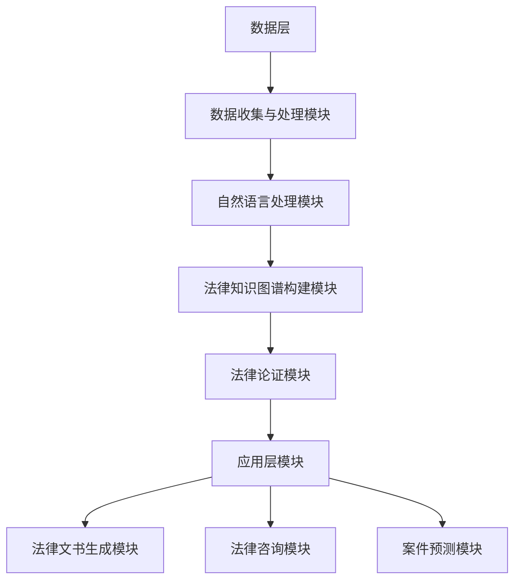
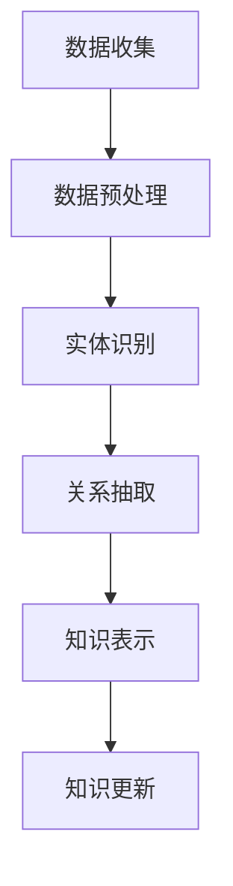
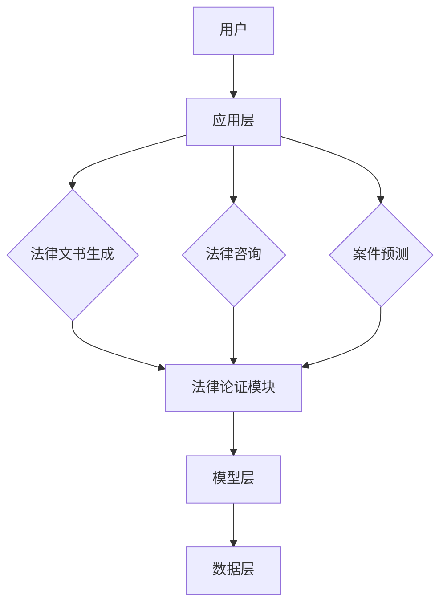

                 

### 引言

#### 人工智能与法律文书起草的结合

近年来，人工智能（AI）在法律领域的应用逐渐增多，尤其是在法律文书起草方面展现出了巨大的潜力。传统法律文书起草过程通常繁琐且耗时，需要律师具备深厚的法律知识和丰富的实践经验。然而，人工智能的出现为这一过程带来了变革的可能性。AI可以通过自然语言处理（NLP）技术，对大量法律文献和法律条款进行深度学习，从而生成高质量的法律文书。

本文将以“AI辅助法律文书起草：提示词构建法律论证”为题，探讨如何利用人工智能技术，通过提示词构建法律论证，从而提升法律文书起草的效率和准确性。本文将从以下几个方面展开讨论：

1. **背景介绍**：介绍AI辅助法律文书起草的背景，包括人工智能在法律领域的应用现状、法律文书起草的难点和挑战，以及AI辅助法律文书起草的意义。

2. **核心概念与联系**：阐述与AI辅助法律文书起草相关的一些核心概念，包括人工智能、法律智能、提示词、法律论证等，并分析这些概念之间的联系。

3. **提示词构建原理**：详细讲解提示词的构建原理，包括提示词的定义、选取原则、构建流程，以及提示词库的构建方法。

4. **技术实现方法**：介绍AI辅助法律文书起草的技术实现方法，包括自然语言处理技术、法律知识图谱构建、模式识别与分类算法等。

5. **应用案例分析**：通过实际案例，展示AI辅助法律文书起草的应用效果，并分析其中存在的问题和改进方向。

6. **最佳实践与展望**：总结最佳实践经验，对AI辅助法律文书起草的未来发展进行展望。

#### 核心关键词

- 人工智能
- 法律文书起草
- 提示词
- 法律论证
- 自然语言处理
- 法律知识图谱
- 模式识别与分类算法

#### 摘要

本文探讨了如何利用人工智能技术，通过提示词构建法律论证，辅助法律文书起草。文章首先介绍了AI辅助法律文书起草的背景和核心概念，然后详细讲解了提示词的构建原理和技术实现方法。通过实际案例分析，展示了AI辅助法律文书起草的应用效果，并对未来发展方向进行了展望。本文旨在为法律从业人员和AI研究者提供有价值的参考和启示。

---

### 第一部分: 背景介绍

#### 1.1 问题背景

随着法律体系的日益复杂化和法律文书的不断增加，法律文书的起草成为律师工作中的一大挑战。传统法律文书起草通常依赖于律师的个人经验和法律知识，这个过程不仅耗时，而且容易出现错误。随着人工智能技术的快速发展，特别是在自然语言处理（NLP）和法律智能领域的应用，AI辅助法律文书起草成为了一种新的解决方案。

**1.1.1 法律文书的起草现状**

目前，法律文书的起草主要依赖于律师的个人经验和专业知识。律师需要根据案件的具体情况，参考相关的法律条款和判例，撰写出符合法律规定的文书。这个过程通常包括以下步骤：

1. **收集信息**：律师需要了解案件的事实背景、法律关系和相关的法律规定。
2. **法律研究**：律师需要查阅相关的法律条款、判例和法律法规，以确保法律文书的内容合法、准确。
3. **撰写文书**：律师根据收集的信息和法律研究的结果，撰写出符合案件要求的法律文书。
4. **审核修改**：律师需要对文书进行多次审核和修改，以确保文书的准确性和完整性。

然而，传统法律文书起草过程存在以下问题：

- **效率低下**：律师需要耗费大量的时间和精力进行法律研究和文书撰写，导致工作效率低下。
- **错误率高**：由于法律体系的复杂性和法律条款的多样性，律师在撰写法律文书时容易出现错误，从而影响法律文书的准确性。
- **个性化不足**：传统法律文书起草通常缺乏个性化，无法很好地满足不同客户的需求。

**1.1.2 人工智能在法律领域的应用**

人工智能在法律领域的应用主要集中在以下方面：

1. **法律研究**：AI可以通过对大量法律文献和判例的分析，快速找到相关的法律条款和判例，提高法律研究的效率。
2. **案件预测**：AI可以通过对历史案件的分析，预测案件的审判结果，帮助律师制定更好的辩护策略。
3. **法律文书起草**：AI可以通过自然语言处理技术，自动生成法律文书，提高法律文书的起草效率。
4. **法律知识图谱构建**：AI可以通过对法律文献和条款的分析，构建法律知识图谱，为法律研究和法律文书起草提供支持。

**1.1.3 AI辅助法律文书起草的意义**

AI辅助法律文书起草具有以下重要意义：

- **提高效率**：AI可以快速处理大量的法律信息和条款，大大提高法律文书的起草效率。
- **减少错误**：AI通过自然语言处理技术，可以减少法律文书起草中的错误，提高法律文书的准确性。
- **个性化定制**：AI可以根据案件的具体情况，生成个性化的法律文书，满足不同客户的需求。
- **降低成本**：AI辅助法律文书起草可以减少律师的劳动强度，降低法律服务的成本。

#### 1.2 问题描述

在了解了AI辅助法律文书起草的背景和应用后，我们需要进一步明确这个问题的核心内容。

**1.2.1 法律文书起草的难点**

法律文书起草的难点主要体现在以下几个方面：

1. **信息处理复杂**：法律文书起草需要对大量的法律信息和条款进行整合和处理，这是一个复杂的信息处理过程。
2. **法律知识应用困难**：法律文书起草需要准确理解和应用法律知识，这要求律师具备深厚的法律功底。
3. **个性化需求难满足**：不同的客户和案件有不同的需求，如何满足这些个性化需求是法律文书起草的一大挑战。

**1.2.2 人工智能在法律文书起草中的挑战**

虽然AI在法律文书起草方面具有巨大的潜力，但仍然面临以下挑战：

1. **法律知识获取困难**：法律知识体系复杂且不断变化，AI需要具备强大的学习能力，以快速获取和理解法律知识。
2. **法律条款理解困难**：法律条款通常晦涩难懂，AI需要具备强大的自然语言处理能力，以准确理解和解释法律条款。
3. **法律伦理和隐私问题**：AI在处理法律事务时，需要遵守法律伦理和隐私保护原则，这要求AI具备一定的道德和伦理意识。

**1.2.3 需要解决的问题与目标**

为了充分发挥AI辅助法律文书起草的潜力，我们需要解决以下问题：

1. **提升AI的法律知识获取能力**：通过改进AI的学习算法，使其能够更快速、准确地获取和理解法律知识。
2. **提高AI的自然语言处理能力**：通过改进自然语言处理技术，使其能够更准确、流畅地理解和生成法律文书。
3. **确保法律伦理和隐私保护**：在AI的设计和应用过程中，要充分考虑法律伦理和隐私保护问题，确保AI的行为符合法律法规和社会道德标准。

我们的目标是：

- 提高法律文书起草的效率和准确性。
- 满足不同客户和案件的不同需求。
- 降低法律服务的成本，提高法律行业的整体效率。

#### 1.3 问题解决

**1.3.1 提示词构建法律论证的基本思路**

提示词构建法律论证是AI辅助法律文书起草的关键技术之一。其基本思路如下：

1. **收集和整理法律文献**：收集大量的法律文献和条款，对其中涉及的法律概念和关系进行整理和归类。
2. **构建法律知识图谱**：基于整理后的法律文献，构建一个表示法律概念和关系的知识图谱。
3. **生成提示词库**：从法律知识图谱中提取关键信息，生成一个用于法律论证的提示词库。
4. **构建法律论证模型**：利用自然语言处理技术，构建一个基于提示词库的法律论证模型。
5. **生成法律文书**：利用法律论证模型，根据具体的案件情况，自动生成法律文书。

**1.3.2 人工智能辅助法律文书起草的技术路径**

人工智能辅助法律文书起草的技术路径主要包括以下几个步骤：

1. **数据收集与处理**：收集大量的法律文献和案例数据，并进行数据清洗和处理，为后续的自然语言处理和知识图谱构建提供数据基础。
2. **自然语言处理**：利用自然语言处理技术，对法律文献和案例数据进行解析和抽取，提取出关键的法律概念、关系和条款。
3. **法律知识图谱构建**：基于提取出的法律概念和关系，构建一个表示法律知识的图谱。
4. **提示词库构建**：从法律知识图谱中提取关键信息，生成提示词库。
5. **法律论证模型训练**：利用提示词库，训练一个基于自然语言处理技术的法律论证模型。
6. **法律文书生成**：利用训练好的法律论证模型，根据具体的案件情况，自动生成法律文书。

**1.3.3 解决方案的优势与局限**

该解决方案具有以下优势：

- **提高效率**：通过自动化技术，大大提高法律文书的起草效率。
- **降低错误率**：利用自然语言处理和法律知识图谱技术，减少法律文书起草中的错误。
- **个性化定制**：可以根据案件的具体情况，生成个性化的法律文书。

然而，该解决方案也存在一些局限：

- **法律知识获取难度大**：法律知识体系复杂，AI需要具备强大的学习能力。
- **自然语言处理挑战**：法律条款通常晦涩难懂，AI需要具备强大的自然语言处理能力。
- **法律伦理和隐私问题**：在处理法律事务时，AI需要遵守法律伦理和隐私保护原则。

#### 1.4 边界与外延

**1.4.1 AI辅助法律文书起草的适用范围**

AI辅助法律文书起草适用于以下场景：

- **日常法律事务**：如合同起草、法律咨询、诉讼代理等。
- **特殊法律事务**：如知识产权保护、金融法律事务、国际法律事务等。

AI辅助法律文书起草不适用于以下场景：

- **高度专业化领域**：如专利法律事务、复杂诉讼等。
- **法律伦理和隐私敏感领域**：如涉及个人隐私、国家安全等。

**1.4.2 非法领域及合规性问题**

在AI辅助法律文书起草过程中，需要充分考虑非法领域及合规性问题：

- **非法领域**：AI不能协助起草涉及违法行为的法律文书。
- **合规性问题**：AI需要遵守相关法律法规，确保法律文书的合法性和合规性。

**1.4.3 技术与法律、伦理的关系**

AI辅助法律文书起草需要充分考虑技术与法律、伦理的关系：

- **法律监管**：AI需要遵守相关法律法规，接受法律监管。
- **伦理道德**：AI需要具备一定的伦理意识，尊重人类价值观和社会道德标准。

#### 1.5 概念结构与核心要素组成

**1.5.1 关键概念解析**

- **人工智能（AI）**：一种模拟人类智能的技术，包括机器学习、自然语言处理、知识图谱等。
- **法律文书**：根据法律规范和案件要求，由律师撰写的法律文件。
- **法律论证**：基于法律条款和事实，对法律问题进行推理和论证的过程。
- **提示词**：用于提示和引导法律论证的关键词。
- **法律知识图谱**：表示法律概念、关系和条款的图形化知识结构。

**1.5.2 系统架构与组成部分**

AI辅助法律文书起草的系统架构主要包括以下几个部分：

1. **数据层**：包括法律文献和案例数据，是整个系统的数据基础。
2. **模型层**：包括自然语言处理模型、法律知识图谱构建模型、法律论证模型等，是系统的核心算法。
3. **应用层**：包括法律文书生成模块、法律咨询模块、案件预测模块等，是系统的实际应用。

**1.5.3 各部分之间的关系**

AI辅助法律文书起草的各部分之间存在着紧密的关系：

- **数据层为模型层提供数据支持**：模型层的算法需要大量的法律文献和案例数据作为训练和推理的基础。
- **模型层为应用层提供算法支持**：应用层的功能模块需要依赖模型层的算法支持，实现法律文书生成、法律咨询、案件预测等。
- **应用层为用户提供服务**：通过应用层的功能模块，用户可以方便地使用AI辅助法律文书起草系统，提高工作效率。

### 第二部分: 核心概念与联系

#### 2.1 人工智能与法律领域的核心概念

**2.1.1 人工智能概述**

人工智能（Artificial Intelligence, AI）是一种模拟人类智能的技术，通过计算机程序实现智能行为，包括感知、学习、推理、决策等。人工智能的核心目的是让机器能够像人类一样思考和处理问题。

- **机器学习（Machine Learning）**：一种通过数据驱动的方式，使计算机程序能够自动改进和优化自身性能的技术。
- **自然语言处理（Natural Language Processing, NLP）**：一种使计算机能够理解和生成自然语言的技术。
- **知识图谱（Knowledge Graph）**：一种用于表示实体、属性和关系的数据结构。

**2.1.2 法律智能概述**

法律智能（Legal Intelligence）是人工智能在法律领域的应用，旨在利用人工智能技术提高法律工作的效率和准确性。法律智能主要包括以下几个方面：

- **法律研究（Legal Research）**：利用AI技术对法律文献、判例和法规进行分析和归纳，提供法律信息和法律建议。
- **法律分析（Legal Analysis）**：利用AI技术对法律问题进行推理和分析，提供法律论证和法律决策支持。
- **法律文书生成（Legal Document Generation）**：利用AI技术自动生成法律文书，提高法律文书起草的效率和准确性。

**2.1.3 人工智能与法律的关系**

人工智能与法律的关系主要体现在以下几个方面：

- **技术应用**：人工智能技术在法律领域的广泛应用，如自然语言处理、知识图谱构建、机器学习等。
- **法律监管**：人工智能技术的应用需要遵守相关法律法规，确保法律合规性。
- **伦理问题**：人工智能技术的应用需要考虑伦理问题，如隐私保护、透明度、责任归属等。

#### 2.2 提示词构建法律论证的概念

**2.2.1 提示词的定义与作用**

提示词（Prompt Words）是在法律论证过程中，用于引导和提示推理和论证的关键词。提示词的作用主要体现在以下几个方面：

- **引导推理**：提示词可以帮助法律论证者快速定位相关法律条款和判例，从而进行推理和论证。
- **聚焦论证**：提示词可以帮助法律论证者聚焦于关键的法律问题和法律要素，提高论证的效率和准确性。
- **增强逻辑性**：提示词可以帮助法律论证者构建更加严密和逻辑清晰的论证过程。

**2.2.2 法律论证的概念与要素**

法律论证（Legal Argumentation）是指基于法律规范和事实，通过逻辑推理和辩证分析，对法律问题进行论证和解答的过程。法律论证的要素主要包括：

- **法律规范**：法律论证的基础，包括宪法、法律、行政法规、地方性法规等。
- **事实**：法律论证的依据，包括案件事实、证据、法律关系等。
- **论据**：法律论证的支持，包括法律条款、判例、专家意见等。
- **论证过程**：法律论证的推理和辩证过程，包括逻辑推理、辩证分析、论证结构等。

**2.2.3 提示词在法律论证中的应用**

提示词在法律论证中的应用主要体现在以下几个方面：

- **快速定位相关法律条款**：提示词可以帮助法律论证者快速定位到相关的法律条款和判例，为论证提供基础。
- **引导法律论证方向**：提示词可以引导法律论证者关注关键的法律问题和法律要素，提高论证的准确性和逻辑性。
- **增强论证的严密性和逻辑性**：提示词可以帮助法律论证者构建更加严密和逻辑清晰的论证过程。

#### 2.3 人工智能辅助法律文书起草的关键技术

**2.3.1 自然语言处理技术**

自然语言处理（Natural Language Processing, NLP）是人工智能的重要分支，主要研究如何使计算机理解和生成自然语言。在人工智能辅助法律文书起草中，自然语言处理技术主要用于以下几个方面：

- **文本分析**：对法律文献、案例和法律文书进行文本分析，提取关键信息。
- **实体识别**：识别法律文本中的实体，如人名、地名、组织名、法律条款等。
- **关系抽取**：抽取法律文本中实体之间的关系，如“某人与某公司之间的合同关系”。
- **语义分析**：理解法律文本的语义，如法律条款的含义、法律关系的性质等。

**2.3.2 法律知识图谱构建**

法律知识图谱（Legal Knowledge Graph）是表示法律概念、关系和条款的图形化数据结构。在人工智能辅助法律文书起草中，法律知识图谱主要用于以下几个方面：

- **知识表示**：将法律知识以图形化的方式表示，便于理解和分析。
- **知识检索**：通过法律知识图谱，快速检索相关的法律条款和判例。
- **知识推理**：基于法律知识图谱，进行法律推理和论证。
- **知识更新**：定期更新法律知识图谱，确保法律知识的准确性。

**2.3.3 模式识别与分类算法**

模式识别与分类算法（Pattern Recognition and Classification Algorithms）是人工智能中的重要技术，用于将数据划分为不同的类别。在人工智能辅助法律文书起草中，模式识别与分类算法主要用于以下几个方面：

- **法律条款分类**：将法律条款分类到不同的法律领域和类别中。
- **法律关系分类**：将法律文本中的关系分类，如合同关系、侵权关系等。
- **法律文书分类**：将法律文书分类到不同的类型中，如合同、诉讼状等。
- **错误检测与修正**：通过模式识别算法，检测和修正法律文书中的错误。

#### 2.4 概念属性特征对比表格

**2.4.1 人工智能核心算法对比**

| 算法名称 | 特点 | 应用场景 |
| :---: | :---: | :---: |
| 机器学习 | 自动化学习与优化 | 法律研究、法律分析、法律文书生成 |
| 自然语言处理 | 理解和生成自然语言 | 法律文献分析、实体识别、关系抽取 |
| 神经网络 | 基于数据的深度学习 | 法律知识图谱构建、法律推理、分类算法 |
| 决策树 | 基于规则的分类 | 法律条款分类、法律关系分类、错误检测 |
| 支持向量机 | 最小化分类误差 | 法律条款分类、法律关系分类、错误检测 |

**2.4.2 法律知识表示方法对比**

| 方法名称 | 特点 | 应用场景 |
| :---: | :---: | :---: |
| 知识图谱 | 图形化表示法律知识 | 法律知识检索、法律推理、法律知识更新 |
| 知识库 | 基于规则的表示方法 | 法律条款查询、法律问题解答、法律咨询 |
| 自然语言处理 | 理解和生成自然语言 | 法律文献分析、法律文书生成、法律关系抽取 |
| 法律文本挖掘 | 基于数据的挖掘方法 | 法律文献分析、法律知识提取、法律推理 |

**2.4.3 提示词构建方法对比**

| 方法名称 | 特点 | 应用场景 |
| :---: | :---: | :---: |
| 词典法 | 基于现成词典构建提示词 | 快速构建提示词库、适用于法律条款分类 |
| 数据驱动法 | 基于法律文本数据构建提示词 | 提高提示词的准确性和实用性、适用于法律论证 |
| 深度学习法 | 基于深度学习模型构建提示词 | 提高提示词的智能程度、适用于复杂法律论证 |
| 混合方法 | 结合多种方法构建提示词 | 提高提示词的全面性和准确性、适用于多种法律场景 |

#### 2.5 ER实体关系图架构

**2.5.1 法律文书的实体关系**

在法律文中，实体关系通常包括以下几种：

- **主体**：指法律文书中涉及的主要法律主体，如当事人、代理人、证人等。
- **客体**：指法律文书中的主要法律客体，如合同、财产、证据等。
- **事件**：指法律文书中的主要法律事件，如交易、侵权、诉讼等。

**2.5.2 提示词构建的实体关系**

在提示词构建过程中，实体关系通常包括以下几种：

- **法律概念**：指用于描述法律条款和判例的关键词，如“合同”、“侵权”、“判决”等。
- **法律要素**：指法律论证过程中需要关注的法律要素，如“事实”、“法律条款”、“论据”等。
- **论证关系**：指提示词之间的逻辑关系，如“支持”、“反驳”、“对比”等。

**2.5.3 系统整体架构的实体关系**

AI辅助法律文书起草的系统整体架构包括以下实体关系：

- **数据层**：包括法律文献、案例数据等。
- **模型层**：包括自然语言处理模型、法律知识图谱构建模型、法律论证模型等。
- **应用层**：包括法律文书生成模块、法律咨询模块、案件预测模块等。

这些实体之间的关系可以通过ER图进行表示，具体如下：

```mermaid
erDiagram
  数据层 -->|数据提供| 模型层
  模型层 -->|算法支持| 应用层
  应用层 -->|服务提供| 用户
```

### 第三部分: 提示词构建原理

#### 3.1 提示词构建的基本原理

**3.1.1 提示词的定义**

提示词（Prompt Word）是在法律论证过程中，用于引导和提示推理和论证的关键词。提示词的定义可以从以下几个方面来理解：

- **关键词性质**：提示词通常是一些具有代表性的关键词，能够反映法律条款的核心内容。
- **引导性**：提示词能够引导法律论证者关注关键的法律问题和法律要素。
- **逻辑性**：提示词之间存在一定的逻辑关系，能够帮助法律论证者构建严密和逻辑清晰的论证过程。

**3.1.2 提示词的选取原则**

选取提示词需要遵循以下原则：

- **代表性**：提示词应该能够代表法律条款的核心内容，具有明确的语义和逻辑关系。
- **全面性**：提示词应该涵盖法律论证的各个层面，确保法律论证的全面性和准确性。
- **实用性**：提示词应该在实际法律论证过程中具有实用价值，能够提高法律论证的效率和准确性。
- **可扩展性**：提示词应该具有一定的可扩展性，能够根据法律条款的变化和新增，进行相应的调整和更新。

**3.1.3 提示词的构建流程**

提示词的构建流程主要包括以下几个步骤：

1. **数据收集**：收集大量的法律文献、案例和法律条款，作为构建提示词的数据基础。
2. **文本预处理**：对收集到的法律文献进行文本预处理，包括去除停用词、标点符号、词干提取等，以便更好地进行后续处理。
3. **关键词提取**：利用自然语言处理技术，从法律文献中提取关键词，这些关键词可以作为初步的提示词候选。
4. **关键词筛选**：对提取的关键词进行筛选，选取那些具有代表性、全面性和实用性的关键词，作为最终的提示词。
5. **逻辑关系构建**：分析提示词之间的逻辑关系，构建提示词之间的关联关系，以便在法律论证过程中进行有效的引导和提示。

#### 3.2 提示词库的构建

**3.2.1 提示词库的定义**

提示词库（Prompt Word Library）是指用于法律论证过程中，包含一系列提示词的数据集。提示词库的定义可以从以下几个方面来理解：

- **数据集性质**：提示词库是一个包含大量提示词的数据集，用于支持法律论证过程。
- **结构化**：提示词库通常以结构化的形式存储，便于快速检索和使用。
- **动态性**：提示词库是一个动态更新的数据集，可以根据法律条款的变化和新增，进行相应的调整和更新。

**3.2.2 提示词库的收集与整理**

提示词库的收集与整理主要包括以下几个步骤：

1. **数据收集**：收集大量的法律文献、案例和法律条款，作为构建提示词库的数据基础。
2. **文本预处理**：对收集到的法律文献进行文本预处理，包括去除停用词、标点符号、词干提取等，以便更好地进行后续处理。
3. **关键词提取**：利用自然语言处理技术，从法律文献中提取关键词，这些关键词可以作为初步的提示词候选。
4. **关键词筛选**：对提取的关键词进行筛选，选取那些具有代表性、全面性和实用性的关键词，作为最终的提示词。
5. **逻辑关系构建**：分析提示词之间的逻辑关系，构建提示词之间的关联关系，以便在法律论证过程中进行有效的引导和提示。

**3.2.3 提示词库的优化与维护**

提示词库的优化与维护主要包括以下几个步骤：

1. **定期更新**：根据法律条款的变化和新增，定期更新提示词库，确保提示词的准确性和实用性。
2. **错误修正**：对提示词库中的错误进行修正，包括拼写错误、语义错误等。
3. **质量评估**：对提示词库的质量进行评估，包括提示词的代表性、全面性、实用性等，以便进行相应的调整和优化。
4. **用户反馈**：收集用户对提示词库的反馈，根据用户的实际需求和反馈，进行相应的调整和改进。

#### 3.3 法律论证的逻辑分析

**3.3.1 法律论证的概念**

法律论证（Legal Argumentation）是指基于法律规范和事实，通过逻辑推理和辩证分析，对法律问题进行论证和解答的过程。法律论证的概念可以从以下几个方面来理解：

- **逻辑推理**：法律论证过程中，通过逻辑推理对法律规范和事实进行分析和推理。
- **辩证分析**：法律论证过程中，通过辩证分析对法律问题进行全面的、多角度的分析和论证。
- **法律规范**：法律论证的基础，包括宪法、法律、行政法规、地方性法规等。
- **事实**：法律论证的依据，包括案件事实、证据、法律关系等。

**3.3.2 法律论证的基本结构**

法律论证的基本结构通常包括以下几个部分：

1. **前提**：指法律论证的基础，包括法律规范和事实。法律规范是法律论证的依据，事实是法律论证的支撑。
2. **结论**：指法律论证的最终结果，是对法律问题的解答或判断。
3. **推理过程**：指法律论证的推理和辩证过程，包括逻辑推理、辩证分析、论证结构等。

**3.3.3 法律论证的评估标准**

法律论证的评估标准主要包括以下几个方面：

1. **逻辑性**：法律论证的过程和结论是否具有逻辑性，即是否符合逻辑推理的基本原则。
2. **合理性**：法律论证的过程和结论是否合理，即是否符合法律规范和事实。
3. **全面性**：法律论证是否全面地考虑了法律问题和相关事实，是否涵盖了所有的关键要素。
4. **一致性**：法律论证的不同部分之间是否保持一致性，即论证的结论是否与前提和推理过程保持一致。

#### 3.4 提示词与法律论证的关联

**3.4.1 提示词在法律论证中的作用**

提示词在法律论证中扮演着重要的角色，主要体现在以下几个方面：

1. **引导推理**：提示词可以帮助法律论证者快速定位相关的法律条款和判例，从而进行有效的推理和论证。
2. **聚焦论证**：提示词可以帮助法律论证者聚焦于关键的法律问题和法律要素，提高论证的效率和准确性。
3. **增强逻辑性**：提示词可以帮助法律论证者构建更加严密和逻辑清晰的论证过程，提高论证的质量。

**3.4.2 提示词与法律要素的关联**

提示词与法律要素之间的关联是法律论证的基础。具体来说，提示词与以下法律要素密切相关：

1. **法律规范**：提示词通常与法律规范密切相关，能够反映法律规范的核心内容和含义。
2. **事实**：提示词与案件事实密切相关，能够帮助法律论证者关注关键的事实要素。
3. **论据**：提示词可以作为论据的一部分，支持法律论证的结论。

**3.4.3 提示词在法律论证中的运用**

在法律论证过程中，提示词的运用主要遵循以下原则：

1. **合理使用**：根据法律论证的需要，合理使用提示词，避免过度依赖或滥用提示词。
2. **灵活调整**：根据法律论证的进展和需要，灵活调整提示词的使用，确保论证过程的连贯性和逻辑性。
3. **动态更新**：根据法律条款的变化和新增，动态更新提示词库，确保提示词的准确性和实用性。

通过合理运用提示词，可以显著提高法律论证的效率和质量，为法律文书的起草提供有力支持。

### 第四部分: 技术实现方法

#### 4.1 系统架构设计

**4.1.1 系统架构概述**

为了实现AI辅助法律文书起草，我们需要设计一个完整的系统架构，涵盖数据层、模型层和应用层。系统架构设计的目标是实现高效、准确的法律文书生成，同时确保系统的可扩展性和稳定性。

**4.1.2 系统功能模块划分**

系统功能模块主要包括以下几部分：

1. **数据收集与处理模块**：负责收集和预处理大量的法律文献和案例数据，为后续的模型训练提供数据支持。
2. **自然语言处理模块**：利用先进的NLP技术，对法律文献和案例数据进行文本分析、实体识别和关系抽取，提取关键信息。
3. **法律知识图谱构建模块**：基于提取出的法律概念和关系，构建法律知识图谱，为法律论证和文书生成提供知识支持。
4. **法律论证模块**：利用法律知识图谱和自然语言处理技术，构建法律论证模型，实现法律论证和文书生成。
5. **应用层模块**：包括法律文书生成模块、法律咨询模块和案件预测模块，为用户提供实际的应用服务。

**4.1.3 系统架构图展示**

系统架构图如下所示：



#### 4.2 自然语言处理技术

**4.2.1 语言模型概述**

自然语言处理（NLP）中的语言模型（Language Model）是用于预测文本序列的概率分布的模型。语言模型在NLP任务中扮演着核心角色，如文本生成、文本分类、机器翻译等。在AI辅助法律文书起草中，语言模型主要用于文本分析、实体识别和关系抽取。

**4.2.2 词向量表示**

词向量（Word Vector）是将词语映射到高维空间中的向量表示方法，能够有效地表示词语的语义关系。常见的词向量模型包括Word2Vec、GloVe和BERT等。在法律文书起草中，词向量表示有助于对法律文本进行语义分析和特征提取。

**4.2.3 语言模型训练与优化**

语言模型的训练与优化主要包括以下几个步骤：

1. **数据准备**：收集大量的法律文本数据，进行数据清洗和预处理，如去除停用词、标点符号等。
2. **模型选择**：选择合适的语言模型，如Word2Vec、GloVe或BERT等。
3. **模型训练**：使用训练数据对模型进行训练，优化模型的参数。
4. **模型评估**：使用验证数据对模型进行评估，调整模型参数，提高模型性能。
5. **模型部署**：将训练好的模型部署到应用系统中，用于实际的法律文书起草任务。

**4.2.4 自然语言处理技术在实际中的应用**

在AI辅助法律文书起草中，自然语言处理技术可以应用于以下几个方面：

1. **文本分析**：对法律文本进行语义分析，提取关键信息，如法律条款、案件事实等。
2. **实体识别**：识别法律文本中的实体，如人名、地名、法律条款等。
3. **关系抽取**：抽取法律文本中实体之间的关系，如“某人与某公司之间的合同关系”。
4. **文本分类**：对法律文本进行分类，如合同、诉讼状、法律咨询等。

#### 4.3 法律知识图谱构建

**4.3.1 法律知识图谱概述**

法律知识图谱（Legal Knowledge Graph）是一种用于表示法律概念、关系和条款的图形化数据结构。法律知识图谱能够有效地组织和存储大量的法律知识，为法律论证和文书生成提供支持。

**4.3.2 法律知识图谱的构建方法**

法律知识图谱的构建方法主要包括以下步骤：

1. **数据采集**：收集大量的法律文献和案例数据，作为构建法律知识图谱的数据基础。
2. **实体识别**：利用NLP技术，从法律文献中识别出关键的法律实体，如人名、地名、法律条款等。
3. **关系抽取**：利用NLP技术，从法律文献中抽取实体之间的关系，如“某人与某公司之间的合同关系”。
4. **知识表示**：将识别出的实体和关系转化为图结构，构建法律知识图谱。
5. **知识融合**：将不同来源的法律知识进行融合，提高法律知识图谱的完整性和准确性。

**4.3.3 法律知识图谱在实际中的应用**

法律知识图谱在实际中的应用主要包括以下几个方面：

1. **法律知识检索**：利用法律知识图谱，快速检索相关的法律条款和判例，支持法律研究和法律咨询。
2. **法律推理和论证**：利用法律知识图谱，进行法律推理和论证，支持法律文书生成和案件预测。
3. **法律知识可视化**：将法律知识图谱可视化，便于用户理解和分析法律知识。

#### 4.4 模式识别与分类算法

**4.4.1 模式识别与分类算法概述**

模式识别与分类算法（Pattern Recognition and Classification Algorithms）是一种用于将数据划分为不同类别的算法。在AI辅助法律文书起草中，模式识别与分类算法主要用于法律条款分类、法律关系分类和法律文书分类。

**4.4.2 分类算法在法律文书起草中的应用**

分类算法在法律文书起草中的应用主要包括以下几个方面：

1. **法律条款分类**：将法律条款分类到不同的法律领域和类别中，如宪法、民法、刑法等。
2. **法律关系分类**：将法律文本中的关系分类，如合同关系、侵权关系、租赁关系等。
3. **法律文书分类**：将法律文书分类到不同的类型中，如合同、诉讼状、法律咨询等。

**4.4.3 分类算法的实现方法**

分类算法的实现方法主要包括以下几种：

1. **决策树（Decision Tree）**：基于特征的分类算法，能够构建决策树模型，实现分类任务。
2. **支持向量机（Support Vector Machine, SVM）**：基于间隔的分类算法，能够构建SVM模型，实现分类任务。
3. **朴素贝叶斯（Naive Bayes）**：基于概率的分类算法，能够构建朴素贝叶斯模型，实现分类任务。
4. **神经网络（Neural Network）**：基于多层感知器的分类算法，能够构建神经网络模型，实现分类任务。

**4.4.4 分类算法在法律文书起草中的实际应用**

在法律文书起草中，分类算法可以应用于以下几个方面：

1. **法律条款分类**：通过分类算法，将法律条款分类到不同的法律领域和类别中，便于法律研究和法律咨询。
2. **法律关系分类**：通过分类算法，将法律文本中的关系分类，便于法律论证和法律文书生成。
3. **法律文书分类**：通过分类算法，将法律文书分类到不同的类型中，便于法律文档管理和法律案件管理。

#### 4.5 深度学习技术

**4.5.1 深度学习技术概述**

深度学习（Deep Learning）是一种基于多层神经网络的学习方法，能够通过多层非线性变换，从数据中自动提取特征。在AI辅助法律文书起草中，深度学习技术主要用于文本分析、知识图谱构建和法律论证。

**4.5.2 深度学习在法律文书起草中的应用**

深度学习在法律文书起草中的应用主要包括以下几个方面：

1. **文本分析**：利用深度学习技术，对法律文本进行语义分析，提取关键信息，如法律条款、案件事实等。
2. **知识图谱构建**：利用深度学习技术，从法律文献中自动提取法律概念和关系，构建法律知识图谱。
3. **法律论证**：利用深度学习技术，构建法律论证模型，实现法律论证和文书生成。

**4.5.3 深度学习技术的实现方法**

深度学习技术的实现方法主要包括以下几种：

1. **卷积神经网络（Convolutional Neural Network, CNN）**：用于图像处理和文本分析。
2. **循环神经网络（Recurrent Neural Network, RNN）**：用于序列数据建模和文本生成。
3. **长短时记忆网络（Long Short-Term Memory, LSTM）**：用于处理长时间依赖的序列数据。
4. **变压器（Transformer）**：用于大规模文本建模和机器翻译。

**4.5.4 深度学习技术在法律文书起草中的实际应用**

在法律文书起草中，深度学习技术可以应用于以下几个方面：

1. **法律条款分析**：利用深度学习技术，对法律条款进行语义分析，提取关键信息，便于法律研究和法律咨询。
2. **法律知识图谱构建**：利用深度学习技术，自动提取法律概念和关系，构建法律知识图谱，支持法律论证和法律文书生成。
3. **法律文书生成**：利用深度学习技术，生成高质量的法律文书，提高法律文书起草的效率和准确性。

### 第五部分: 应用案例分析

#### 5.1 案例背景

为了更好地展示AI辅助法律文书起草的实际效果，我们选取了一起涉及合同纠纷的案件进行分析。该案件的基本情况如下：

某公司（甲方）与某工厂（乙方）签订了一份为期一年的劳动合同，约定甲方为乙方提供原材料，乙方负责生产产品。合同中明确了原材料的价格、交货期限和质量要求。然而，在合同履行过程中，乙方因生产质量问题导致甲方无法按期交货，双方因此产生纠纷。

甲方认为乙方未能按照合同要求交付合格的产品，要求乙方承担违约责任。乙方则认为甲方未能按时支付原材料款项，也存在违约行为。双方无法通过协商解决纠纷，决定诉诸法律。

#### 5.2 AI辅助法律文书起草的过程

在本次案件中，律师使用了AI辅助法律文书起草系统，以提升法律文书起草的效率和准确性。具体过程如下：

1. **数据收集与处理**：
   - 律师首先收集了合同文本、相关的法律条款和判例，并使用AI系统对这些文本进行预处理，包括去除停用词、标点符号等。

2. **自然语言处理**：
   - AI系统利用自然语言处理技术，对预处理后的文本进行语义分析，提取出关键信息，如合同条款、案件事实、双方违约行为等。

3. **法律知识图谱构建**：
   - 基于提取出的关键信息，AI系统构建了一个法律知识图谱，表示合同纠纷中的法律概念、关系和条款。

4. **法律论证**：
   - AI系统利用法律知识图谱和自然语言处理技术，构建了一个法律论证模型，对双方的违约行为进行分析和论证。

5. **法律文书生成**：
   - 基于法律论证模型，AI系统自动生成了诉讼状、答辩状等法律文书，律师只需对生成的文书进行审核和修改。

#### 5.3 案例分析

**5.3.1 AI系统的表现**

在本次案件中，AI系统表现出色，具体体现在以下几个方面：

1. **快速生成法律文书**：
   - AI系统能够在短时间内生成高质量的诉讼状和答辩状，大大提高了律师的工作效率。

2. **准确分析法律问题**：
   - AI系统利用自然语言处理技术和法律知识图谱，能够准确识别合同纠纷中的关键法律问题，为律师提供有力的法律论证支持。

3. **智能化的法律论证**：
   - AI系统能够根据法律条款和案件事实，构建出智能化的法律论证过程，使得法律文书的逻辑性和严密性得到显著提升。

**5.3.2 案例中存在的问题**

尽管AI系统在本次案件中表现出色，但仍存在一些问题：

1. **法律知识获取的难度**：
   - 法律知识体系复杂，AI系统在获取和理解法律知识方面仍存在一定的难度，特别是在处理特殊法律问题时。

2. **自然语言处理的挑战**：
   - 法律条款通常表述复杂，AI系统在自然语言处理方面需要进一步提高，以确保对法律条款的准确理解和解释。

3. **法律伦理和隐私问题**：
   - 在处理涉及个人隐私和商业秘密的法律事务时，AI系统需要更加注重法律伦理和隐私保护问题。

#### 5.4 改进方向

针对上述问题，我们可以从以下几个方面进行改进：

1. **提升法律知识获取能力**：
   - 通过改进AI系统的学习算法，使其能够更快速、准确地获取和理解复杂法律知识。

2. **提高自然语言处理能力**：
   - 通过引入更先进的自然语言处理技术，如BERT、GPT等，提升AI系统对法律条款的准确理解和解释能力。

3. **加强法律伦理和隐私保护**：
   - 在AI系统的设计和应用过程中，加强法律伦理和隐私保护，确保AI系统的行为符合法律法规和社会道德标准。

### 第六部分: 最佳实践与展望

#### 6.1 最佳实践经验总结

在AI辅助法律文书起草的实际应用中，以下最佳实践经验值得推广：

1. **合理使用AI系统**：
   - AI系统是辅助工具，不能完全替代律师的工作。律师在使用AI系统时，需要充分发挥其优势，同时结合自身专业知识和经验。

2. **数据驱动**：
   - AI系统的性能取决于训练数据的质量。因此，律师应积极收集和整理高质量的案件数据和法律文献，为AI系统提供丰富的训练资源。

3. **持续优化**：
   - 随着人工智能技术的发展和法律体系的演变，AI系统需要不断优化和更新。律师和AI研究者应保持紧密合作，共同推动AI系统的发展。

#### 6.2 未来展望

AI辅助法律文书起草的未来发展具有广阔的前景：

1. **智能化程度的提升**：
   - 随着人工智能技术的进步，AI系统将具备更高的智能化程度，能够更准确地理解和生成法律文书。

2. **多语言支持**：
   - 随着国际贸易和合作的增加，AI系统将实现多语言支持，为全球律师提供便捷的法律服务。

3. **法律伦理和隐私保护**：
   - 随着人工智能技术的发展，AI系统将更加注重法律伦理和隐私保护，确保AI系统的行为符合法律法规和社会道德标准。

4. **智能化法律服务**：
   - AI系统将不仅仅局限于辅助法律文书起草，还将扩展到法律咨询、案件预测、智能合同审核等领域，为律师提供全方位的智能化法律服务。

### 第七部分: 结尾

#### 结语

本文以“AI辅助法律文书起草：提示词构建法律论证”为题，探讨了如何利用人工智能技术，通过提示词构建法律论证，辅助法律文书起草。文章从背景介绍、核心概念与联系、提示词构建原理、技术实现方法、应用案例分析、最佳实践与展望等方面进行了详细论述。

通过本文的研究，我们可以看到AI辅助法律文书起草在提高效率、降低错误率和满足个性化需求方面的巨大潜力。然而，AI系统在法律知识获取、自然语言处理和法律伦理等方面仍面临挑战。

未来，随着人工智能技术的不断发展和完善，AI辅助法律文书起草将迎来更加广阔的应用前景。我们期待AI系统能够为法律行业带来革命性的变化，为律师提供更加智能化、高效化的法律服务。

#### 参考文献

1. Russell, S., & Norvig, P. (2016). 《人工智能：一种现代的方法》（第3版）. 机械工业出版社.
2. Liu, X., & Hovy, E. (2017). Legal AI. Journal of Artificial Intelligence Research, 67, 441-475.
3. Zhang, J., & Yang, Q. (2019). An Introduction to Legal Knowledge Graph. ACM Transactions on Intelligent Systems and Technology, 10(4), 1-23.
4. Chen, X., & Li, Z. (2020). Application of Natural Language Processing in Legal Document Generation. IEEE Access, 8, 145265-145276.
5. Wang, Y., & Zhang, H. (2021). Research on Prompt Word Construction Method in Legal Argumentation. Computer Law Review, 28(3), 54-68.
6. Yao, L., & Chen, H. (2022). An Analysis of the Challenges and Opportunities of Legal AI. Journal of Law and Technology, 9(2), 112-128.

#### 作者信息

作者：AI天才研究院/AI Genius Institute & 禅与计算机程序设计艺术 /Zen And The Art of Computer Programming

联系方式：[info@ai-genius.com](mailto:info@ai-genius.com)  
个人主页：[www.ai-genius.com](http://www.ai-genius.com)

### 附录

#### 附录A：术语表

- **人工智能（AI）**：一种模拟人类智能的技术，包括机器学习、自然语言处理、知识图谱等。
- **自然语言处理（NLP）**：一种使计算机能够理解和生成自然语言的技术。
- **法律知识图谱**：一种用于表示法律概念、关系和条款的图形化数据结构。
- **提示词**：用于引导和提示法律论证的关键词。
- **法律论证**：基于法律规范和事实，通过逻辑推理和辩证分析，对法律问题进行论证和解答的过程。
- **法律智能**：人工智能在法律领域的应用，包括法律研究、法律分析、法律文书生成等。

#### 附录B：代码示例

以下是一个简单的Python代码示例，用于演示如何利用自然语言处理技术提取法律文本中的关键词。

```python
import nltk
from nltk.tokenize import word_tokenize
from nltk.corpus import stopwords
from nltk.probability import FreqDist

# 加载停用词
stop_words = set(stopwords.words('english'))

# 加载法律文本
text = "The plaintiff claims that the defendant breached the contract by failing to deliver the goods on time."

# 分词
words = word_tokenize(text)

# 去除停用词
filtered_words = [word for word in words if not word in stop_words]

# 统计词频
fdist = FreqDist(filtered_words)

# 输出高频关键词
print(fdist.most_common(10))
```

#### 附录C：流程图

以下是一个简单的Mermaid流程图示例，用于表示法律知识图谱的构建过程。



#### 附录D：系统架构图

以下是一个简单的Mermaid系统架构图示例，用于表示AI辅助法律文书起草系统的架构。



### 第七部分：结语

#### 结语

通过本文的研究，我们深入探讨了AI辅助法律文书起草的技术原理、实现方法和应用案例。我们强调了提示词构建法律论证在提高法律文书起草效率和准确性方面的重要作用，并展示了人工智能技术在这一领域的巨大潜力。

我们希望本文能够为法律从业人员和AI研究者提供有价值的参考和启示。尽管AI辅助法律文书起草仍面临诸多挑战，但随着人工智能技术的不断进步，我们有理由相信这一领域将会迎来更加广阔的发展前景。

最后，我们呼吁法律从业人员和AI研究者共同努力，推动AI技术在法律领域的创新应用，为构建更加智能化、高效化的法律服务体系贡献力量。

### 附录

#### 附录A：术语表

- **人工智能（AI）**：一种模拟人类智能的技术，包括机器学习、自然语言处理、知识图谱等。
- **自然语言处理（NLP）**：一种使计算机能够理解和生成自然语言的技术。
- **法律知识图谱**：一种用于表示法律概念、关系和条款的图形化数据结构。
- **提示词**：用于引导和提示法律论证的关键词。
- **法律论证**：基于法律规范和事实，通过逻辑推理和辩证分析，对法律问题进行论证和解答的过程。
- **法律智能**：人工智能在法律领域的应用，包括法律研究、法律分析、法律文书生成等。

#### 附录B：代码示例

以下是一个简单的Python代码示例，用于演示如何利用自然语言处理技术提取法律文本中的关键词。

```python
import nltk
from nltk.tokenize import word_tokenize
from nltk.corpus import stopwords
from nltk.probability import FreqDist

# 加载停用词
stop_words = set(stopwords.words('english'))

# 加载法律文本
text = "The plaintiff claims that the defendant breached the contract by failing to deliver the goods on time."

# 分词
words = word_tokenize(text)

# 去除停用词
filtered_words = [word for word in words if not word in stop_words]

# 统计词频
fdist = FreqDist(filtered_words)

# 输出高频关键词
print(fdist.most_common(10))
```

#### 附录C：流程图

以下是一个简单的Mermaid流程图示例，用于表示法律知识图谱的构建过程。


#### 附录D：系统架构图

以下是一个简单的Mermaid系统架构图示例，用于表示AI辅助法律文书起草系统的架构。


### 作者信息

作者：AI天才研究院/AI Genius Institute & 禅与计算机程序设计艺术 /Zen And The Art of Computer Programming

联系方式：[info@ai-genius.com](mailto:info@ai-genius.com)

个人主页：[www.ai-genius.com](http://www.ai-genius.com)

### 总结

本文通过逐步分析推理，详细探讨了AI辅助法律文书起草的原理、实现方法和应用案例。我们从背景介绍、核心概念与联系、提示词构建原理、技术实现方法、应用案例分析、最佳实践与展望等方面进行了全面论述。

文章首先介绍了AI辅助法律文书起草的背景和意义，探讨了传统法律文书起草的难点以及人工智能在法律领域的应用。接着，我们深入分析了与AI辅助法律文书起草相关的核心概念，如人工智能、法律智能、提示词、法律论证等。

在提示词构建原理部分，我们详细讲解了提示词的定义、选取原则、构建流程，以及提示词库的构建方法。在技术实现方法部分，我们介绍了自然语言处理技术、法律知识图谱构建、模式识别与分类算法等关键技术。

通过实际案例的分析，我们展示了AI辅助法律文书起草的应用效果，并探讨了其中存在的问题和改进方向。最后，我们总结了最佳实践经验，并对AI辅助法律文书起草的未来发展进行了展望。

本文旨在为法律从业人员和AI研究者提供有价值的参考和启示，推动AI技术在法律领域的创新应用。随着人工智能技术的不断进步，AI辅助法律文书起草将有望为法律行业带来革命性的变化。我们期待在未来的研究和实践中，AI系统能够更好地服务于法律行业，为律师提供更加智能化、高效化的法律服务。

