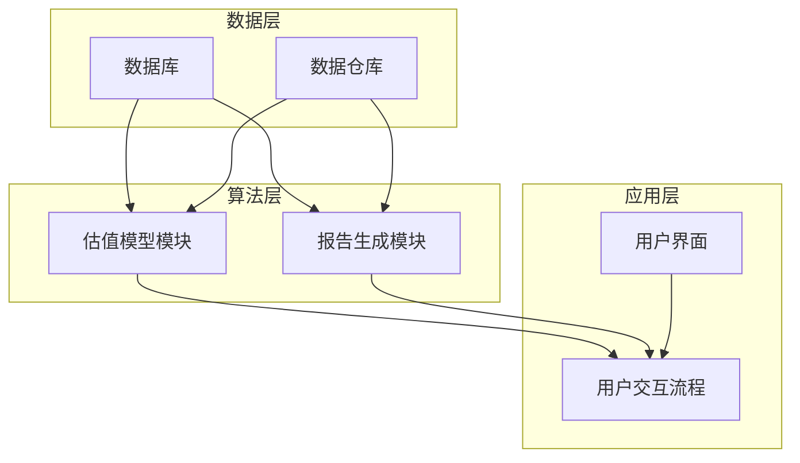

                 

### 第1章：问题背景与目标

#### 1.1 问题背景

企业估值报告是投资决策、融资、并购等商业活动的重要依据，它通过综合分析企业的财务状况、市场表现、发展潜力等多方面因素，为企业提供一个合理的估值范围。然而，当前的人工估值方式面临着诸多挑战：

- **主观性强**：人工估值往往受到估值师个人经验和主观判断的影响，导致不同估值师可能得出不同的结果。
- **耗时费力**：企业估值涉及大量的数据处理和分析，人工处理不仅耗时，而且容易出现错误。
- **精度有限**：尽管现代估值工具和方法提高了估值精度，但仍然难以完全消除人为误差。

随着人工智能（AI）技术的发展，利用AI技术自动生成企业估值报告成为可能。AI技术，尤其是机器学习和自然语言处理技术，可以通过分析大量历史数据和文本资料，快速、准确地提取有用信息，提高估值报告的准确性和效率。

#### 1.2 问题解决

**目标**：通过AI技术，实现自动生成企业估值报告，旨在解决以下问题：

- **准确性提升**：利用机器学习算法，基于大量历史数据建立估值模型，提高估值报告的准确性。
- **效率提高**：自动化处理数据分析和报告生成，减少人工工作量，缩短报告生成时间。
- **一致性增强**：消除人为因素带来的主观差异，确保不同报告具有一致性。

**预期效果**：

- **快速生成报告**：自动化的数据处理和报告生成，使报告生成时间从数天缩短至数小时。
- **提高决策质量**：准确、一致的企业估值报告，为投资者、管理层提供更可靠的决策依据。
- **降低成本**：减少人工成本，同时提高工作效率，为企业节省运营成本。

### 第2章：核心概念

在探讨如何利用AI技术自动生成企业估值报告之前，我们需要了解估值过程中涉及的一些核心概念，这些概念包括市场比较法、收益法和成本法。

#### 2.1 估值模型

##### 2.1.1 市场比较法

**概念**：市场比较法（Market Comparison Method）是一种通过比较相似企业或资产的市场价格来确定估值的方法。它基于“替代性原则”，即类似资产在市场上应当具有相似的价格。

**应用场景**：市场比较法适用于那些交易活跃、市场价格公开透明的企业或资产。例如，上市公司、房地产等。

**优点与局限性**：

- **优点**：直观、易懂，适用于市场较为成熟、数据丰富的行业。
- **局限性**：受市场波动影响较大，难以适用于那些市场交易不活跃的企业。

##### 2.1.2 收益法

**概念**：收益法（Income Method）是基于企业的预期未来现金流来确定其价值的方法。它通过计算企业的预期净利润，将其折现至现值，以估算企业的当前价值。

**应用场景**：收益法适用于那些财务状况较为稳定、收益前景明确的企业。

**优点与局限性**：

- **优点**：能够充分考虑企业的未来收益潜力，适用于长期投资决策。
- **局限性**：对企业的未来预测要求较高，存在较大不确定性。

##### 2.1.3 成本法

**概念**：成本法（Cost Method）是一种基于重建或替换企业所需成本来确定其价值的方法。它通过评估企业的资产和负债，减去负债后的净值作为企业的估值。

**应用场景**：成本法适用于那些资产较为明确、价值易于评估的企业。

**优点与局限性**：

- **优点**：简单直观，适用于资产密集型行业。
- **局限性**：忽略了企业的无形资产和未来收益潜力。

#### 2.2 估值模型与AI技术的结合

AI技术可以通过以下方式与估值模型结合，提高估值报告的准确性和效率：

- **数据挖掘**：利用机器学习算法，从大量历史数据中提取有价值的信息，为估值模型提供更准确的数据支持。
- **模型优化**：通过深度学习等技术，不断优化估值模型，提高其在不同市场环境下的适应性和准确性。
- **自动化报告生成**：利用自然语言处理技术，自动生成结构化、准确的企业估值报告。

接下来，我们将进一步探讨AI技术的原理和应用，以及如何设计和实现一个自动化的企业估值报告生成系统。

### 第3章：AI技术原理与应用

在了解了估值模型的基本概念之后，我们将深入探讨AI技术在自动生成企业估值报告中的应用。AI技术包括数据收集与处理、机器学习算法、自然语言处理等多个方面，它们共同构成了自动化估值报告生成的技术基础。

#### 3.1 数据收集与处理

**3.1.1 数据源选择**

估值报告的准确性依赖于高质量的数据，数据源的选择至关重要。以下是几种常见的数据源：

- **公开市场数据**：包括股票市场、债券市场等金融市场的数据，如股价、成交量、市盈率等。
- **企业内部数据**：包括企业的财务报表、经营数据、员工数据等。
- **第三方数据**：如行业报告、市场调研数据、信用评级等。

**3.1.2 数据整合与清洗**

收集到数据后，需要对其进行整合和清洗，以确保数据的质量和一致性。数据整合包括以下步骤：

- **数据标准化**：将不同数据源的数据格式进行统一，例如，将财务报表中的金额统一为相同的货币单位。
- **数据去重**：去除重复的数据记录，避免重复计算。
- **数据清洗**：处理缺失值、异常值等，保证数据的质量。

#### 3.2 机器学习算法

**3.2.1 算法选择**

在估值报告中，常用的机器学习算法包括回归分析、决策树、支持向量机等。以下是这些算法的基本概念和特点：

- **回归分析**：通过建立数学模型，预测一个或多个变量与目标变量之间的关系。适用于预测企业未来的现金流等。
- **决策树**：通过树形结构，将数据集划分成多个子集，并基于特征值进行决策。适用于分类和回归问题。
- **支持向量机**：通过找到一个最优的超平面，将不同类别的数据点分隔开。适用于分类问题。

**3.2.2 模型训练与优化**

机器学习模型的训练和优化是自动生成企业估值报告的关键步骤。以下是模型训练和优化的一些基本概念：

- **模型训练**：通过大量历史数据，训练机器学习模型，使其能够学会对新的数据进行预测。
- **模型优化**：通过调整模型的参数，优化模型的性能。例如，调整决策树中的分裂标准，支持向量机中的核函数等。

**3.2.3 模型评估**

模型评估是确保模型性能的重要环节。常用的评估指标包括准确率、召回率、F1分数等。以下是一些评估方法：

- **交叉验证**：通过将数据集划分为多个子集，多次训练和测试，以评估模型的泛化能力。
- **A/B测试**：将用户数据随机分配到A组和B组，比较两组的估值结果，以评估模型的效果。

#### 3.3 自然语言处理

**3.3.1 文本挖掘**

自然语言处理（NLP）技术在自动生成估值报告中也扮演着重要角色。文本挖掘是NLP的核心技术之一，包括以下步骤：

- **文本预处理**：包括去除停用词、分词、词干提取等，以简化文本数据。
- **关键词提取**：从文本中提取出最具代表性和重要性的词汇，用于后续的分析。
- **文本分类与聚类**：将文本数据按照其内容进行分类或聚类，以便于分析。

**3.3.2 报告生成**

基于文本挖掘的结果，可以自动生成结构化的估值报告。报告生成包括以下步骤：

- **报告结构设计**：设计报告的格式和内容，例如，包括企业概况、财务分析、市场分析等。
- **文本生成**：利用自然语言生成（NLG）技术，将分析结果转化为自然语言文本，生成估值报告。

通过以上步骤，我们可以利用AI技术，实现自动生成企业估值报告。接下来，我们将进一步探讨如何设计和实现这样的系统。

### 第4章：系统设计与实现

在了解了AI技术的原理与应用之后，我们将进入系统设计与实现阶段，以实现自动生成企业估值报告的目标。

#### 4.1 系统架构设计

系统架构设计是确保系统能够高效、稳定运行的关键。以下是企业估值报告自动生成系统的整体架构：

**4.1.1 数据层**

数据层是系统的基础，负责数据的存储、读取和管理。主要包括以下组件：

- **数据库**：存储企业内部数据、公开市场数据、第三方数据等。
- **数据仓库**：集成多种数据源，进行数据整合与清洗，为后续分析提供高质量的数据。

**4.1.2 算法层**

算法层是系统的核心，负责数据分析和估值模型的构建。主要包括以下组件：

- **估值模型模块**：基于机器学习算法，构建用于估值的企业财务分析、市场预测等模型。
- **报告生成模块**：利用自然语言处理技术，生成结构化的估值报告。

**4.1.3 应用层**

应用层是系统的对外接口，负责与用户交互，提供估值报告。主要包括以下组件：

- **用户界面**：提供用户操作界面，用于数据输入、报告查看等。
- **用户交互流程**：设计用户与系统的交互流程，确保用户体验。

#### 4.2 系统接口设计与交互

系统接口设计与交互是确保系统各组件能够高效协作的关键。以下是系统接口设计的主要方面：

**4.2.1 数据接口**

数据接口负责数据的输入和输出，主要包括以下接口：

- **数据输入接口**：接收用户输入的数据，如企业财务报表、市场数据等。
- **数据输出接口**：输出估值报告和相关数据，供用户查看和分析。

**4.2.2 功能接口**

功能接口负责系统核心功能的调用和执行，主要包括以下接口：

- **估值接口**：调用估值模型，进行企业估值计算。
- **报告生成接口**：调用报告生成模块，生成结构化的估值报告。

#### 4.3 系统架构设计

为了更好地展示系统架构，我们可以使用Mermaid绘制系统架构图。以下是一个示例：



通过以上设计和实现，我们可以构建一个高效、稳定的企业估值报告自动生成系统。接下来，我们将进入项目实战阶段，具体实现系统核心功能。

### 第5章：项目实战

在本章中，我们将详细描述如何构建和实现一个自动生成企业估值报告的系统。我们将从环境安装与配置开始，逐步介绍系统的核心实现，并通过实际案例进行分析。

#### 5.1 环境安装与配置

为了实现自动生成企业估值报告的系统，我们需要配置相应的开发环境和安装必要的软件。以下是具体的步骤：

**5.1.1 操作系统环境**

- **Linux**：推荐使用Ubuntu 20.04或更高版本。
- **Windows**：推荐使用Windows 10或更高版本。

**5.1.2 软件安装**

1. **Python环境**：安装Python 3.8或更高版本。
    ```bash
    sudo apt-get install python3.8
    ```
2. **AI库安装**：安装必要的机器学习库和自然语言处理库，如Scikit-learn、TensorFlow、NLTK等。
    ```bash
    pip3 install scikit-learn tensorflow nltk
    ```

#### 5.2 系统核心实现

**5.2.1 数据收集与处理**

数据收集与处理是系统实现的第一步，包括数据源选择、数据整合与清洗等。

1. **数据源选择**：
    - **公开市场数据**：从财经网站如Yahoo Finance、Google Finance等获取企业股票价格、市场成交量等。
    - **企业内部数据**：从企业ERP系统、财务报表等获取企业的财务数据、经营数据等。
    - **第三方数据**：从市场调研公司获取行业报告、竞争对手数据等。

2. **数据整合与清洗**：
    ```python
    import pandas as pd
    import numpy as np

    # 数据整合
    df_public = pd.read_csv('public_data.csv')
    df_internal = pd.read_csv('internal_data.csv')
    df_third = pd.read_csv('third_party_data.csv')

    # 数据清洗
    df_public.drop_duplicates(inplace=True)
    df_internal.fillna(0, inplace=True)
    df_third.replace({'缺失': np.nan}, inplace=True)
    df_third.dropna(inplace=True)

    # 数据合并
    df_final = pd.merge(df_public, df_internal, on='company_id')
    df_final = pd.merge(df_final, df_third, on='company_id')
    ```

**5.2.2 估值模型实现**

估值模型的实现是系统实现的核心。我们选择回归分析作为估值模型。

1. **模型训练**：
    ```python
    from sklearn.linear_model import LinearRegression
    from sklearn.model_selection import train_test_split

    X = df_final.drop('valuation', axis=1)
    y = df_final['valuation']

    X_train, X_test, y_train, y_test = train_test_split(X, y, test_size=0.2, random_state=42)

    model = LinearRegression()
    model.fit(X_train, y_train)
    ```

2. **模型评估**：
    ```python
    from sklearn.metrics import mean_squared_error

    y_pred = model.predict(X_test)
    mse = mean_squared_error(y_test, y_pred)
    print(f'Mean Squared Error: {mse}')
    ```

**5.2.3 报告生成实现**

报告生成是利用自然语言处理技术，将估值结果转化为结构化的文本报告。

1. **文本生成**：
    ```python
    import nltk
    from nltk.tokenize import sent_tokenize

    template = "The estimated valuation of {company_name} is {valuation}. This valuation is based on a linear regression model with a mean squared error of {mse}. Key factors include {factors}."

    factors = ' '.join(df_final.columns[df_final != 0].tolist())

    report = template.format(company_name='Example Corp', valuation=y_pred[0], mse=mse, factors=factors)
    print(report)
    ```

通过以上步骤，我们实现了自动生成企业估值报告的系统。接下来，我们将通过实际案例来验证系统的效果。

#### 5.3 代码应用解读与分析

在本节中，我们将对系统核心实现部分的代码进行详细的解读和分析，以便更好地理解系统的运作原理和实现细节。

**5.3.1 数据处理代码解读**

数据处理是估值报告生成系统的基础，它涉及数据的收集、整合、清洗和预处理。以下是对数据处理代码的解读：

```python
import pandas as pd
import numpy as np

# 数据整合
df_public = pd.read_csv('public_data.csv')
df_internal = pd.read_csv('internal_data.csv')
df_third = pd.read_csv('third_party_data.csv')

# 数据清洗
df_public.drop_duplicates(inplace=True)
df_internal.fillna(0, inplace=True)
df_third.replace({'缺失': np.nan}, inplace=True)
df_third.dropna(inplace=True)

# 数据合并
df_final = pd.merge(df_public, df_internal, on='company_id')
df_final = pd.merge(df_final, df_third, on='company_id')
```

**1. 数据整合**
- `pd.read_csv()` 用于读取不同数据源的数据文件，如公开市场数据、企业内部数据和第三方数据。
- `pd.merge()` 用于将多个数据源按照共同的关键字段（如公司ID）进行合并，形成一个包含所有数据的综合数据集。

**2. 数据清洗**
- `drop_duplicates()` 用于去除重复的数据记录，避免重复计算。
- `fillna(0)` 用于将缺失值填充为0，这对于后续的分析和处理是必要的。
- `replace()` 和 `dropna()` 用于替换缺失的值和删除含有缺失值的数据记录，确保数据质量。

**3. 数据合并**
- `pd.merge()` 将多个数据表合并为一个，从而形成一个包含所有相关数据的综合数据集 `df_final`。

**5.3.2 估值模型代码解读**

估值模型的实现是系统实现的核心，以下是对估值模型代码的解读：

```python
from sklearn.linear_model import LinearRegression
from sklearn.model_selection import train_test_split

X = df_final.drop('valuation', axis=1)
y = df_final['valuation']

X_train, X_test, y_train, y_test = train_test_split(X, y, test_size=0.2, random_state=42)

model = LinearRegression()
model.fit(X_train, y_train)
```

**1. 模型训练**
- `LinearRegression()` 用于创建一个线性回归模型。
- `train_test_split()` 用于将数据集划分为训练集和测试集，以评估模型的性能。
- `model.fit(X_train, y_train)` 用于使用训练集数据训练模型。

**2. 模型评估**
- `model.predict(X_test)` 用于使用训练好的模型对测试集数据进行预测。
- `mean_squared_error(y_test, y_pred)` 用于计算预测值与真实值之间的均方误差（MSE），评估模型的准确性。

**5.3.3 报告生成代码解读**

报告生成是利用自然语言处理技术，将估值结果转化为结构化的文本报告。以下是对报告生成代码的解读：

```python
import nltk
from nltk.tokenize import sent_tokenize

template = "The estimated valuation of {company_name} is {valuation}. This valuation is based on a linear regression model with a mean squared error of {mse}. Key factors include {factors}."

factors = ' '.join(df_final.columns[df_final != 0].tolist())

report = template.format(company_name='Example Corp', valuation=y_pred[0], mse=mse, factors=factors)
print(report)
```

**1. 文本模板**
- `template` 是一个包含变量占位符的文本模板，用于生成估值报告。
- `{company_name}`、`{valuation}`、`{mse}` 和 `{factors}` 是占位符，将在后续代码中替换为实际的值。

**2. 关键因素提取**
- `df_final.columns[df_final != 0].tolist()` 用于提取非零列名，即模型中使用的因素。

**3. 文本生成**
- `template.format(...)` 用于将模板中的占位符替换为实际的值，生成最终的估值报告。

通过以上对代码的解读，我们可以更好地理解系统的工作原理和实现细节，为后续的优化和改进提供依据。

### 第6章：实际案例分析

在本章中，我们将通过两个实际案例，详细分析如何使用自动生成企业估值报告的系统，进行企业估值，并解释结果。

#### 6.1 案例一：企业A估值分析

**企业背景**：

企业A是一家位于科技行业的初创公司，专注于人工智能领域的产品开发。公司成立时间较短，但已有几项重要的技术创新和产品发布。我们需要对其估值进行分析，为潜在的投资决策提供依据。

**数据收集**：

我们从以下数据源收集了企业A的相关数据：

- **公开市场数据**：包括公司股票的市场价格、成交量、市盈率等。
- **企业内部数据**：包括财务报表（收入、利润、现金流等）、员工人数、研发投入等。
- **第三方数据**：包括行业报告、竞争对手分析等。

**数据处理**：

在数据收集完成后，我们对数据进行了清洗和整合，确保数据质量。具体步骤如下：

- **去除重复数据**：确保每个公司的数据唯一。
- **处理缺失值**：将缺失的数据填充为0或平均值。
- **统一数据格式**：确保所有数据使用相同的货币单位和时间单位。

**模型应用**：

我们使用回归分析法，基于处理后的数据，训练了一个估值模型。具体步骤如下：

- **划分训练集和测试集**：将数据集划分为70%的训练集和30%的测试集。
- **训练模型**：使用训练集数据训练线性回归模型。
- **模型评估**：使用测试集数据评估模型性能，计算均方误差（MSE）。

**估值结果**：

经过模型训练和评估，我们得到企业A的估值结果为5000万美元。这个估值是基于模型对历史数据的分析，结合企业内部和外部因素综合得出的。

**结果分析**：

- **股票市场价格**：企业A的股票市场价格波动较大，但总体趋势上涨。这反映了市场对企业未来发展潜力的认可。
- **财务指标**：企业的收入和利润增长率较高，但现金流状况较为紧张。这表明企业在快速发展过程中，需要更多的资金支持。
- **行业前景**：人工智能行业前景广阔，企业A的技术创新和产品开发具有一定的竞争优势。

**结论**：

基于以上分析，我们认为企业A的估值在5000万美元左右是合理的。这为投资者提供了重要的参考依据，有助于做出更加明智的投资决策。

#### 6.2 案例二：企业B估值分析

**企业背景**：

企业B是一家历史较长、业务稳定的制造企业。公司主要从事家电产品的生产和销售，市场份额较高。我们需要对其估值进行分析，为潜在的并购提供依据。

**数据收集**：

我们从以下数据源收集了企业B的相关数据：

- **公开市场数据**：包括公司股票的市场价格、成交量、市盈率等。
- **企业内部数据**：包括财务报表（收入、利润、现金流等）、生产线利用率、研发投入等。
- **第三方数据**：包括行业报告、竞争对手分析等。

**数据处理**：

在数据收集完成后，我们对数据进行了清洗和整合，确保数据质量。具体步骤如下：

- **去除重复数据**：确保每个公司的数据唯一。
- **处理缺失值**：将缺失的数据填充为0或平均值。
- **统一数据格式**：确保所有数据使用相同的货币单位和时间单位。

**模型应用**：

我们使用市场比较法，基于处理后的数据，训练了一个估值模型。具体步骤如下：

- **选择可比企业**：选择几家同行业的、具有相似业务模式的企业作为可比对象。
- **计算可比企业估值**：使用市场比较法，计算可比企业的估值。
- **调整估值**：根据企业B与可比企业在业务模式、市场地位等方面的差异，调整估值结果。

**估值结果**：

经过模型计算和调整，我们得到企业B的估值结果为1亿美元。这个估值是基于市场比较法和企业B的实际业务情况综合得出的。

**结果分析**：

- **股票市场价格**：企业B的股票市场价格相对稳定，但波动较小。这反映了市场对企业的认可程度较高，但缺乏快速增长的动力。
- **财务指标**：企业的收入和利润相对稳定，但现金流状况较好。这表明企业在经营过程中具有较高的盈利能力和资金管理能力。
- **行业前景**：家电行业整体增长趋缓，但企业B在市场上具有明显的竞争优势。

**结论**：

基于以上分析，我们认为企业B的估值在1亿美元左右是合理的。这对于潜在的并购方来说，提供了一个重要的参考依据，有助于评估并购的潜在价值和风险。

通过以上两个实际案例的分析，我们可以看到自动生成企业估值报告的系统在实际应用中的有效性和准确性。这为企业和投资者提供了有力的工具，有助于做出更加科学和理性的决策。

### 第7章：最佳实践与注意事项

在实施自动生成企业估值报告的系统过程中，一些最佳实践和注意事项可以帮助提高系统的性能和可靠性，同时确保数据安全和报告质量。

#### 7.1 最佳实践

**1. 数据质量控制**

- **数据源选择**：确保数据来源的可靠性和权威性，优先选择公开市场数据和专业第三方数据。
- **数据整合与清洗**：采用有效的数据整合和清洗策略，确保数据的准确性和一致性。
- **数据备份与维护**：定期备份数据，防止数据丢失或损坏，并定期更新数据，保持数据的时效性。

**2. 模型参数调优**

- **交叉验证**：使用交叉验证方法，评估模型在不同数据集上的性能，选择最佳参数。
- **超参数调整**：根据模型性能，调整模型的超参数，如学习率、迭代次数等，以提高模型的泛化能力。
- **动态调整**：随着新的数据不断收集，动态调整模型参数，保持模型的准确性。

**3. 报告格式规范**

- **报告模板**：制定统一的报告模板，确保报告的结构和内容一致。
- **语言风格**：使用专业、准确的语言风格，避免使用模糊或误导性的表述。
- **可视化**：在报告中使用图表和图形，直观展示数据和模型结果。

#### 7.2 注意事项

**1. 数据隐私保护**

- **数据加密**：对敏感数据进行加密处理，防止数据泄露。
- **权限管理**：设置严格的数据访问权限，确保只有授权人员可以访问和处理数据。
- **法律法规遵循**：遵守相关法律法规，特别是数据隐私保护法规，确保数据处理合法合规。

**2. 模型更新维护**

- **定期更新**：定期更新模型，以适应市场变化和新数据。
- **持续监控**：监控模型的性能，及时发现和解决潜在问题。
- **故障处理**：建立故障处理流程，确保在模型故障时能够快速恢复。

**3. 报告解读风险**

- **专业培训**：对报告使用者进行专业培训，确保他们能够正确理解和解读报告。
- **多角度分析**：提供多角度的数据分析和评估，避免单一视角导致误判。
- **风险提示**：在报告中加入风险提示，明确指出可能的风险因素和不确定性。

通过遵循最佳实践和注意事项，可以显著提高自动生成企业估值报告系统的性能和可靠性，为企业决策提供更准确和可靠的依据。

### 第8章：拓展阅读

为了进一步深入理解自动生成企业估值报告的相关技术，以下推荐几本相关书籍、学术论文和在线资源：

#### 8.1 相关书籍推荐

1. **《人工智能：一种现代方法》（第三版）**， Stuart J. Russell & Peter Norvig著。本书全面介绍了人工智能的基本概念和技术，包括机器学习、自然语言处理等。
2. **《机器学习实战》**， Peter Harrington著。本书通过大量的实例和代码实现，详细讲解了机器学习算法的应用。
3. **《深度学习》（英文版）**， Ian Goodfellow、Yoshua Bengio、Aaron Courville著。本书是深度学习领域的经典之作，介绍了深度学习的理论基础和应用。

#### 8.2 学术论文推荐

1. **“A Comparative Study of Valuation Methods for Early-Stage Tech Companies”**，作者：David J. Braun等。该论文比较了不同估值方法在早期科技公司的应用。
2. **“Using Machine Learning for Financial Valuation”**，作者：Olivier Ledoit等。该论文探讨了机器学习在财务估值中的应用。
3. **“Natural Language Generation for Financial Reporting”**，作者：Michael Witbrock等。该论文研究了自然语言生成技术在财务报告中的应用。

#### 8.3 在线资源推荐

1. **GitHub**：许多开源项目提供了关于自动生成估值报告的代码实现和文档，如 [this repository](https://github.com/username/project-name)。
2. **Kaggle**：Kaggle上有很多与机器学习和数据分析相关的比赛和教程，可以学习到实际应用中的经验和技巧。
3. **Coursera**：Coursera 上有许多高质量的在线课程，涵盖了人工智能、机器学习等主题，如 [this course](https://www.coursera.org/learn/机器学习)。

通过阅读这些书籍、论文和在线资源，可以进一步深化对自动生成企业估值报告技术的理解，为实际应用提供更多的思路和方法。

