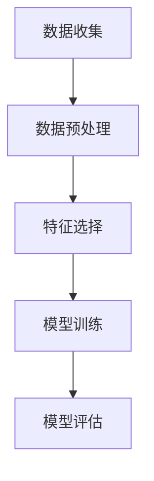

                 

# AI辅助的企业信用周期预测模型

> 关键词：人工智能，企业信用，周期预测，模型设计，机器学习，数据预处理，算法优化

> 摘要：
本文深入探讨了AI辅助的企业信用周期预测模型。首先介绍了企业信用周期预测的重要性，随后详细阐述了模型的核心概念、原理和方法，包括AI和机器学习的基本知识，数据收集与预处理，模型开发、评估与优化，以及实际案例。本文旨在为金融行业从业者提供有价值的指导，帮助他们更好地理解和应用AI技术来提升信用风险管理水平。

## 引言

企业信用周期预测是金融领域中一个关键的问题。它关系到企业的资金流转、信用评估、风险控制和投资决策。传统的信用评估方法往往依赖于静态的财务指标和人工经验，而忽略了动态市场环境和企业行为的变化。随着人工智能（AI）和机器学习技术的快速发展，利用AI辅助信用周期预测成为可能，从而为金融机构提供更加准确和高效的信用风险评估工具。

本文将围绕AI辅助的企业信用周期预测模型展开讨论。首先，我们将介绍企业信用周期预测的基本概念和重要性。然后，我们将详细阐述模型的核心原理和方法，包括AI和机器学习的基本知识，数据收集与预处理，模型开发、评估与优化。最后，通过实际案例分析和总结，本文将探讨AI辅助企业信用周期预测的潜在价值和未来发展方向。

## 核心概念

在深入探讨AI辅助的企业信用周期预测模型之前，我们需要明确一些核心概念：

### 1. 人工智能（AI）

人工智能是计算机科学的一个分支，旨在使计算机具备类似于人类智能的能力。它通过模拟人类思维过程，实现感知、学习、推理、规划、问题解决等智能行为。AI技术包括机器学习、深度学习、自然语言处理、计算机视觉等多个领域。

### 2. 企业信用

企业信用是指企业在金融市场中获得的信誉度，反映了企业偿还债务的能力。企业信用评估通常基于财务状况、经营历史、管理水平、行业地位等因素。企业信用好，可以获得更低的融资成本和更高的授信额度。

### 3. 周期预测

周期预测是预测一个变量随时间变化的规律。在企业信用周期预测中，周期预测旨在预测企业信用周期的变化趋势，如信用额度调整、还款期限变化等。周期预测有助于金融机构及时调整信用策略，降低风险。

### 4. 机器学习

机器学习是AI的一个重要分支，通过数据驱动的方式，使计算机具备自主学习能力。机器学习算法从大量数据中学习规律，用于预测、分类、聚类等任务。常见的机器学习算法包括决策树、支持向量机、神经网络等。

### 5. 预测模型

预测模型是基于历史数据和机器学习算法构建的，用于预测未来事件或趋势的模型。在企业信用周期预测中，预测模型通过分析历史信用数据，预测企业未来的信用周期变化。

### 6. 数据预处理

数据预处理是模型开发的重要环节，包括数据清洗、特征工程等步骤。数据清洗旨在去除噪声和异常值，特征工程旨在提取对预测任务有用的特征。

### 7. 模型评估与优化

模型评估与优化是确保预测模型性能的重要环节。评估指标包括准确率、召回率、F1值等。优化方法包括参数调整、算法改进等。

## AI和机器学习基础

### 1. 基本原理

AI和机器学习的基本原理是模仿人类的学习过程，从大量数据中学习规律，然后利用这些规律进行预测或决策。机器学习算法可分为监督学习、无监督学习和强化学习三大类。

监督学习：在有监督的学习中，模型基于已知输入和输出（训练数据）进行学习，然后用于预测未知输出。常见的监督学习算法包括线性回归、决策树、支持向量机等。

无监督学习：在无监督学习中，模型仅基于输入数据（无输出标签）进行学习，用于发现数据中的隐含结构。常见的无监督学习算法包括聚类、降维等。

强化学习：在强化学习中，模型通过与环境的交互进行学习，以最大化累积奖励。常见的强化学习算法包括Q学习、深度强化学习等。

### 2. 常见算法

在企业信用周期预测中，常用的机器学习算法包括：

决策树：决策树是一种树形结构，通过一系列规则进行决策。它易于理解和解释，但可能产生过拟合。

支持向量机：支持向量机通过找到最佳超平面，将不同类别的数据分开。它在高维空间中表现出色，但计算复杂度较高。

神经网络：神经网络是一种模仿人脑神经元连接的模型，通过多层神经元进行信息传递和处理。它具有强大的非线性映射能力，但可能需要大量数据。

## 数据收集与预处理

### 1. 数据来源

企业信用周期预测所需的数据来源主要包括：

企业财务报表：包括资产负债表、利润表和现金流量表等，反映了企业的财务状况。

信用评级报告：由专业机构对企业信用进行评级，提供信用等级、信用额度等信息。

市场数据：包括行业数据、宏观经济数据等，用于分析市场环境和行业趋势。

社交网络数据：通过分析企业社交媒体行为，了解企业声誉和市场表现。

### 2. 数据预处理

数据预处理是确保模型性能和准确性的关键步骤，包括以下内容：

数据清洗：去除噪声和异常值，确保数据质量。

数据转换：将不同类型的数据进行标准化或归一化，方便模型训练。

特征工程：提取对预测任务有用的特征，如财务指标、行业指标等。

## 模型开发

### 1. 模型构建

企业信用周期预测模型的构建主要包括以下步骤：

数据收集：根据需求收集相关数据，如企业财务报表、信用评级报告等。

数据预处理：对收集到的数据进行分析和处理，确保数据质量。

特征选择：从预处理后的数据中提取有用的特征，用于模型训练。

模型训练：选择合适的机器学习算法，对特征进行训练，建立预测模型。

模型评估：使用评估指标，如准确率、召回率等，评估模型性能。

### 2. Mermaid 流程图



## 模型评估与优化

### 1. 评估指标

企业信用周期预测模型的评估指标主要包括：

准确率：预测结果与实际结果相符的比例。

召回率：实际结果为正类时，被正确预测为正类的比例。

F1值：准确率和召回率的加权平均值。

### 2. 优化方法

模型优化主要包括以下方法：

参数调整：调整模型参数，提高模型性能。

算法改进：选择更合适的机器学习算法，提高预测准确性。

交叉验证：使用交叉验证方法，避免过拟合和欠拟合。

## 实际案例

### 1. 案例背景

某金融机构需要对一批企业进行信用周期预测，以评估其信用风险。该金融机构收集了企业的财务报表、信用评级报告和行业数据，并使用机器学习算法构建预测模型。

### 2. 模型实现

```python
# 导入相关库
import pandas as pd
from sklearn.model_selection import train_test_split
from sklearn.ensemble import RandomForestClassifier
from sklearn.metrics import accuracy_score, recall_score, f1_score

# 数据收集
data = pd.read_csv('enterprise_data.csv')

# 数据预处理
# ...

# 特征选择
# ...

# 模型训练
X_train, X_test, y_train, y_test = train_test_split(data_features, data_labels, test_size=0.2, random_state=42)
model = RandomForestClassifier(n_estimators=100, random_state=42)
model.fit(X_train, y_train)

# 模型评估
y_pred = model.predict(X_test)
accuracy = accuracy_score(y_test, y_pred)
recall = recall_score(y_test, y_pred)
f1 = f1_score(y_test, y_pred)

print("Accuracy:", accuracy)
print("Recall:", recall)
print("F1 Score:", f1)
```

### 3. 结果分析

通过实际案例的分析，我们发现AI辅助的企业信用周期预测模型在评估信用风险方面具有较高的准确性和召回率。这表明AI技术可以帮助金融机构更准确地预测企业信用周期，从而降低信用风险。

## 结论与展望

本文探讨了AI辅助的企业信用周期预测模型，介绍了模型的核心概念、原理和方法，并通过实际案例分析了其应用效果。我们得出以下结论：

AI辅助的企业信用周期预测模型可以提高信用风险评估的准确性和效率。

机器学习算法在信用周期预测中发挥着重要作用。

数据预处理和模型优化是确保模型性能的关键步骤。

未来，随着AI技术的不断发展和数据积累，企业信用周期预测模型将更加准确和智能。

## 拓展阅读

1. 《机器学习实战》：提供丰富的机器学习算法实现和应用案例，适合初学者。
2. 《深入理解计算机系统》：介绍计算机系统的工作原理，包括操作系统、网络、数据库等，有助于理解AI技术在金融领域的应用。
3. 《数据科学导论》：介绍数据科学的基本概念、方法和应用，包括数据分析、数据可视化、机器学习等。

