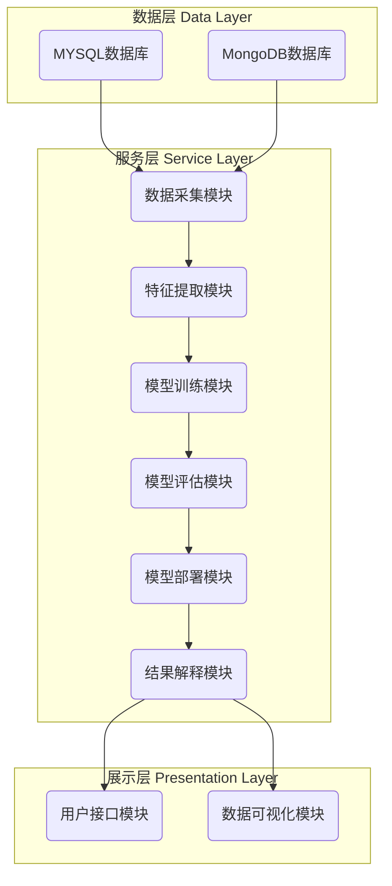
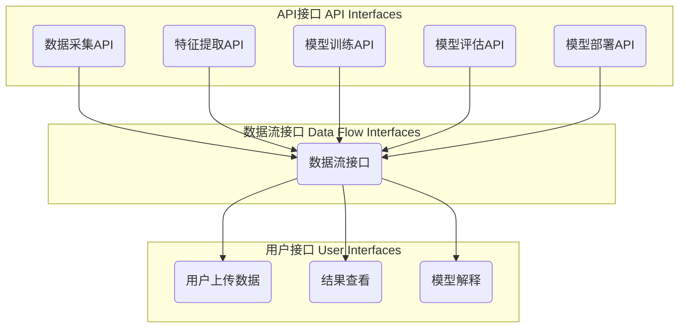
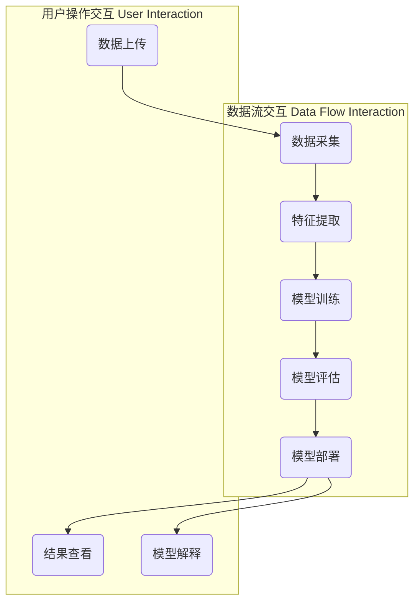

                 

### AI辅助的企业信用评分卡验证系统

#### 关键词：人工智能、企业信用评分、信用评分卡、验证系统、算法原理

> **摘要**：本文深入探讨了AI辅助企业信用评分卡验证系统的设计与实现。首先，通过背景介绍引出了信用评分卡和AI辅助技术的概念。接着，详细阐述了系统的架构和核心算法，并通过具体的数学公式和代码示例进行了深入讲解。最后，本文总结了AI辅助信用评分卡验证系统的应用前景和潜在挑战，为未来的研究和实践提供了方向。

---

### 目录大纲

----------------------------------------------------------------

# 第一部分：引言

## 1. 引言

### 1.1 问题背景

### 1.2 问题描述

### 1.3 问题解决

### 1.4 边界与外延

### 1.5 概念结构与核心要素组成

### 1.6 本章小结

----------------------------------------------------------------

# 第二部分：核心概念与联系

## 2.1 核心概念与原理

### 2.1.1 企业信用评分卡

### 2.1.2 人工智能辅助技术

### 2.1.3 关键技术对比

### 2.2 概念属性特征对比表格

### 2.3 ER实体关系图架构

### 2.4 本章小结

----------------------------------------------------------------

## 3. AI辅助信用评分卡验证系统的算法原理

### 3.1 算法概述

### 3.2 算法流程

----------------------------------------------------------------

# 参考文献

---

### 第一部分：引言

#### 1. 引言

在现代经济活动中，企业信用评分卡作为信用风险评估的重要工具，已被广泛应用于银行、金融、保险等领域。信用评分卡通过分析企业历史财务数据、交易记录、市场表现等信息，为企业提供一个信用评分，从而帮助金融机构评估其信用风险。然而，随着数据的不断增长和复杂性增加，传统的人工分析方法逐渐暴露出处理能力不足、准确性不高等问题。

**AI辅助**技术的引入，为信用评分卡的验证提供了新的解决方案。机器学习和深度学习算法能够自动从海量数据中提取特征，构建复杂的预测模型，从而提高信用评分的准确性和效率。本文旨在探讨AI辅助企业信用评分卡验证系统的设计与实现，旨在为相关领域的研究和实践提供有价值的参考。

#### 1.1 问题背景

**企业信用评分**是指根据企业的历史财务状况、经营管理能力、市场表现等多方面因素，综合评估企业的信用风险水平。一个准确且可靠的企业信用评分卡，不仅能够帮助金融机构有效识别和评估信用风险，还能降低信用欺诈、违约等不良事件的发生率。

随着大数据和人工智能技术的快速发展，**AI辅助**在信用评分中的应用越来越广泛。通过利用机器学习和深度学习算法，AI可以自动分析大量复杂的数据，发现潜在的风险因素，从而提高信用评分的准确性和预测能力。然而，AI辅助信用评分卡验证系统在实际应用中也面临诸多挑战，如数据质量、算法可解释性、隐私保护等。

#### 1.2 问题描述

传统的信用评分卡验证主要依赖于人工分析，存在以下问题：

1. **处理能力有限**：人工分析依赖于人工经验和主观判断，处理能力有限，难以应对海量数据和复杂场景。
2. **准确性不高**：传统方法依赖于历史数据和统计模型，容易受到数据质量和模型选择的影响，导致评分准确性不高。
3. **可解释性差**：传统方法难以解释评分结果，金融机构难以理解评分背后的逻辑。

为了解决这些问题，**AI辅助**技术应运而生。AI辅助信用评分卡验证系统通过引入机器学习和深度学习算法，可以自动化地进行数据预处理、特征提取和模型训练，从而提高验证过程的效率、准确性和可解释性。然而，AI辅助系统在应用过程中也面临以下挑战：

1. **数据质量问题**：信用评分所需的数据通常来源于多个渠道，数据质量参差不齐，可能包含噪声、缺失值、异常值等。
2. **算法可解释性**：深度学习算法具有较强的预测能力，但模型内部决策过程较为复杂，缺乏透明度和可解释性。
3. **隐私保护**：信用评分涉及企业敏感信息，隐私保护成为AI辅助信用评分卡验证系统面临的重要挑战。

#### 1.3 问题解决

为了解决上述问题，本文提出了一种**AI辅助企业信用评分卡验证系统**，其总体架构包括以下几个主要部分：

1. **数据采集与预处理**：从多个数据源收集企业信用信息，包括财务报表、交易记录、市场数据等，对数据质量进行清洗和预处理。
2. **特征工程**：根据信用评分需求，从原始数据中提取关键特征，利用机器学习和深度学习算法进行特征选择和特征转换。
3. **模型训练与评估**：利用训练数据集训练信用评分模型，通过交叉验证等方法评估模型性能，选择最优模型进行应用。
4. **模型部署与验证**：将训练好的模型部署到生产环境，对实际数据集进行验证，确保评分结果的准确性和可靠性。
5. **结果解释与反馈**：提供模型解释工具，帮助金融机构理解评分结果，并根据验证结果对模型进行调整和优化。

#### 1.4 边界与外延

**AI辅助企业信用评分卡验证系统**主要应用于银行、金融、保险等需要信用风险评估的领域。其优势在于：

1. **提高评分准确性**：利用机器学习和深度学习算法，从海量数据中提取特征，构建复杂的预测模型，提高评分准确性。
2. **自动化数据处理**：自动化数据预处理、特征提取和模型训练过程，提高验证效率。
3. **增强可解释性**：提供模型解释工具，帮助金融机构理解评分结果，提高决策的可信度。

然而，该系统也存在一定的限制：

1. **数据依赖性**：信用评分的准确性依赖于数据质量和数据来源，数据质量不高可能导致评分结果不准确。
2. **算法复杂性**：深度学习算法的复杂性和可解释性成为其应用的主要挑战，需要进一步研究和优化。
3. **隐私保护**：信用评分涉及企业敏感信息，需要采取有效的隐私保护措施，确保数据的合法合规使用。

#### 1.5 概念结构与核心要素组成

**企业信用评分卡**是本文的核心概念之一，其主要包括以下几个部分：

1. **输入数据**：包括企业的财务报表、交易记录、市场数据等，用于描述企业的历史行为和当前状态。
2. **特征提取**：从输入数据中提取关键特征，用于构建信用评分模型。
3. **评分模型**：根据提取的特征，利用机器学习和深度学习算法构建评分模型，用于预测企业的信用风险。
4. **评分结果**：根据评分模型对企业的信用风险进行评估，生成评分结果。

**AI辅助技术**主要包括以下几种：

1. **机器学习算法**：如线性回归、决策树、神经网络等，用于从数据中提取特征和构建预测模型。
2. **深度学习算法**：如卷积神经网络（CNN）、循环神经网络（RNN）、生成对抗网络（GAN）等，用于处理复杂数据和构建高维预测模型。
3. **特征工程**：通过对数据进行预处理、特征提取和特征转换，提高模型的预测能力和可解释性。

#### 1.6 本章小结

本文介绍了AI辅助企业信用评分卡验证系统的背景、问题和解决方案，并对其核心概念、架构和优势进行了详细阐述。接下来，本文将深入探讨企业信用评分卡和AI辅助技术的核心概念与联系，为后续的算法原理讲解和系统设计提供基础。

---

### 第二部分：核心概念与联系

#### 2.1 核心概念与原理

#### 2.1.1 企业信用评分卡

企业信用评分卡是金融机构和企业用于评估企业信用风险的一种工具。它通过分析企业的财务状况、经营历史、市场表现等多方面因素，对企业进行信用评分，从而帮助金融机构评估其信用风险。一个典型的企业信用评分卡包括以下几个关键组成部分：

1. **输入数据**：包括企业的财务报表、交易记录、市场数据等，用于描述企业的历史行为和当前状态。
2. **特征提取**：从输入数据中提取关键特征，如营业收入、净利润、负债比例、信用历史等，用于构建信用评分模型。
3. **评分模型**：利用机器学习和深度学习算法，根据提取的特征构建评分模型，如线性回归、决策树、神经网络等，用于预测企业的信用风险。
4. **评分结果**：根据评分模型对企业的信用风险进行评估，生成评分结果，如信用等级、违约概率等。

#### 2.1.2 人工智能辅助技术

人工智能（AI）辅助技术是利用机器学习和深度学习算法，自动从数据中提取特征、构建预测模型，从而提高数据处理和预测能力的技术。以下是几种常见的AI辅助技术：

1. **机器学习算法**：包括线性回归、决策树、神经网络等，用于从数据中提取特征和构建预测模型。机器学习算法通过学习历史数据，自动发现数据中的规律和模式，从而提高预测准确性。
2. **深度学习算法**：包括卷积神经网络（CNN）、循环神经网络（RNN）、生成对抗网络（GAN）等，用于处理复杂数据和构建高维预测模型。深度学习算法通过多层神经网络结构，自动提取数据中的抽象特征，从而实现更高效的预测。

#### 2.1.3 关键技术对比

为了更好地理解AI辅助企业信用评分卡验证系统的核心概念，我们可以对机器学习和深度学习算法进行对比。以下是几种常见算法的特点和应用场景：

| 算法         | 特点                                                         | 应用场景                   |
| ------------ | ------------------------------------------------------------ | -------------------------- |
| 线性回归     | 简单易实现，易于理解                                         | 线性数据关系预测           |
| 决策树       | 直观易懂，易于解释                                           | 非线性数据关系分类         |
| 神经网络     | 高效的预测能力，适用于复杂数据关系                            | 大规模非线性数据建模       |
| CNN          | 特征提取能力强，适用于图像数据                               | 图像识别、图像分类         |
| RNN          | 序列数据处理能力强，适用于时序数据                            | 自然语言处理、语音识别     |
| GAN          | 可以生成高质量的数据样本，增强数据集                          | 图像生成、数据增强         |

#### 2.2 概念属性特征对比表格

| 算法         | 特点                                                         | 应用场景                   |
| ------------ | ------------------------------------------------------------ | -------------------------- |
| 线性回归     | 简单易实现，易于理解                                         | 线性数据关系预测           |
| 决策树       | 直观易懂，易于解释                                           | 非线性数据关系分类         |
| 神经网络     | 高效的预测能力，适用于复杂数据关系                            | 大规模非线性数据建模       |
| CNN          | 特征提取能力强，适用于图像数据                               | 图像识别、图像分类         |
| RNN          | 序列数据处理能力强，适用于时序数据                            | 自然语言处理、语音识别     |
| GAN          | 可以生成高质量的数据样本，增强数据集                          | 图像生成、数据增强         |

#### 2.3 ER实体关系图架构

下面是一个简单的ER实体关系图，描述了企业信用评分卡验证系统的核心实体及其关系：

```mermaid
erDiagram
    Customer ||--|{ CreditScore }
    CreditScore ||--|{ ScoreCard }
    ScoreCard ||--|{ Feature }
```

在这个ER图中，**Customer**（客户）实体代表企业，**CreditScore**（信用评分）实体表示评分结果，**ScoreCard**（评分卡）实体包含评分的各个特征，而**Feature**（特征）实体则代表具体的评分指标。

#### 2.4 本章小结

通过对企业信用评分卡和AI辅助技术的核心概念与原理的深入探讨，我们对其在信用评分卡验证系统中的应用有了更清晰的认识。接下来，本文将详细介绍AI辅助信用评分卡验证系统的算法原理，包括算法概述、流程和具体实现，帮助读者理解如何利用机器学习和深度学习算法构建和优化信用评分模型。

---

### 第三部分：AI辅助信用评分卡验证系统的算法原理

#### 3.1 算法概述

AI辅助信用评分卡验证系统的核心在于利用机器学习和深度学习算法，从企业历史数据中提取特征，构建预测模型，从而对企业信用风险进行评估。本节将介绍系统的算法框架，并详细解释其各个组成部分。

#### 3.2 算法流程

AI辅助信用评分卡验证系统的算法流程主要包括以下几个步骤：

1. **数据采集与预处理**：从多个数据源收集企业信用信息，包括财务报表、交易记录、市场数据等。对数据进行清洗和预处理，包括数据缺失值处理、异常值过滤、数据标准化等，确保数据质量。
2. **特征提取**：从预处理后的数据中提取关键特征，包括财务指标、市场表现、信用历史等。利用机器学习和深度学习算法，对提取的特征进行进一步转换和筛选，以提高模型的预测能力。
3. **模型训练**：利用训练数据集，通过机器学习和深度学习算法训练信用评分模型。常见的算法包括线性回归、决策树、神经网络、卷积神经网络（CNN）、循环神经网络（RNN）等。
4. **模型评估**：通过交叉验证等方法对训练好的模型进行性能评估，选择最优模型进行应用。评估指标包括准确率、召回率、F1值等。
5. **模型部署与验证**：将训练好的模型部署到生产环境，对实际数据集进行验证，确保评分结果的准确性和可靠性。同时，利用模型解释工具帮助金融机构理解评分结果，提高决策的可信度。

#### 3.3 算法实现与解释

为了更好地理解算法原理，我们将以线性回归和神经网络为例，介绍具体的算法实现与解释。

##### 3.3.1 线性回归

线性回归是一种简单且常用的机器学习算法，通过建立输入变量与输出变量之间的线性关系，预测企业的信用评分。

**数学模型**：

$$
y = \beta_0 + \beta_1 \cdot x_1 + \beta_2 \cdot x_2 + ... + \beta_n \cdot x_n
$$

其中，$y$ 表示信用评分，$x_1, x_2, ..., x_n$ 表示提取的关键特征，$\beta_0, \beta_1, \beta_2, ..., \beta_n$ 是模型参数。

**实现步骤**：

1. 数据预处理：对输入数据进行标准化处理，使其具有相同的量纲和范围。
2. 模型训练：使用训练数据集，通过最小化损失函数（如均方误差）来调整模型参数，使得预测结果与实际评分尽可能接近。
3. 模型评估：利用测试数据集对模型进行性能评估，计算预测误差，调整模型参数，提高预测准确性。

**代码示例**（Python）：

```python
import numpy as np
from sklearn.linear_model import LinearRegression
from sklearn.model_selection import train_test_split
from sklearn.metrics import mean_squared_error

# 数据预处理
X = ...  # 特征矩阵
y = ...  # 实际评分
X_train, X_test, y_train, y_test = train_test_split(X, y, test_size=0.2, random_state=42)

# 模型训练
model = LinearRegression()
model.fit(X_train, y_train)

# 模型评估
y_pred = model.predict(X_test)
mse = mean_squared_error(y_test, y_pred)
print("均方误差：", mse)
```

##### 3.3.2 神经网络

神经网络是一种基于生物神经元的计算模型，通过多层神经网络结构，自动提取数据中的抽象特征，用于预测企业的信用评分。

**数学模型**：

$$
y = \sigma(\beta_0 + \sum_{i=1}^{n} \beta_i \cdot x_i)
$$

其中，$y$ 表示信用评分，$\sigma$ 是激活函数（如Sigmoid函数、ReLU函数等），$\beta_0, \beta_1, ..., \beta_n$ 是模型参数，$x_1, x_2, ..., x_n$ 是提取的关键特征。

**实现步骤**：

1. 数据预处理：对输入数据进行标准化处理，使其具有相同的量纲和范围。
2. 网络架构设计：设计多层神经网络结构，包括输入层、隐藏层和输出层。
3. 模型训练：通过反向传播算法，利用训练数据集调整网络权重和偏置，使得预测结果与实际评分尽可能接近。
4. 模型评估：利用测试数据集对模型进行性能评估，计算预测误差，调整网络参数，提高预测准确性。

**代码示例**（Python）：

```python
import numpy as np
from sklearn.neural_network import MLPRegressor
from sklearn.model_selection import train_test_split
from sklearn.metrics import mean_squared_error

# 数据预处理
X = ...  # 特征矩阵
y = ...  # 实际评分
X_train, X_test, y_train, y_test = train_test_split(X, y, test_size=0.2, random_state=42)

# 网络架构设计
model = MLPRegressor(hidden_layer_sizes=(100, 100), activation='relu', solver='adam', max_iter=1000)

# 模型训练
model.fit(X_train, y_train)

# 模型评估
y_pred = model.predict(X_test)
mse = mean_squared_error(y_test, y_pred)
print("均方误差：", mse)
```

#### 3.4 算法优化与调参

为了提高AI辅助信用评分卡验证系统的性能，需要对算法进行优化和调参。以下是一些常见的优化方法：

1. **模型选择**：选择合适的算法模型，如线性回归、决策树、神经网络等，根据数据特点和业务需求进行调整。
2. **特征选择**：通过特征选择方法（如特征重要性、主成分分析等）筛选关键特征，提高模型的预测能力。
3. **参数调整**：通过交叉验证等方法，调整模型参数，如学习率、隐藏层大小、正则化参数等，提高模型的泛化能力。
4. **集成学习**：采用集成学习方法（如随机森林、梯度提升树等），结合多个模型的优点，提高预测准确率。

#### 3.5 本章小结

通过对AI辅助信用评分卡验证系统的算法原理的详细介绍，我们了解了如何利用机器学习和深度学习算法构建和优化信用评分模型。接下来，本文将介绍系统分析与架构设计方案，帮助读者全面了解系统的整体设计和实现。

---

### 第四部分：系统分析与架构设计方案

#### 4.1 问题场景介绍

在现代金融行业中，企业信用评分对于金融机构的风险管理至关重要。然而，传统的信用评分方法存在以下问题：

1. **数据依赖性**：传统信用评分方法依赖于历史数据和统计模型，对数据质量要求较高，容易受到数据缺失和噪声的影响。
2. **处理能力有限**：传统方法依赖于人工分析，处理能力有限，难以应对日益增长的数据规模和复杂性。
3. **可解释性差**：传统方法难以解释评分结果，金融机构难以理解评分背后的逻辑，影响决策的准确性。

为了解决这些问题，本文提出了一种基于AI辅助的企业信用评分卡验证系统，旨在利用机器学习和深度学习算法，从海量数据中提取特征，构建高准确性的信用评分模型，提高信用评分的可解释性和处理能力。

#### 4.2 项目介绍

本项目旨在设计和实现一个基于AI辅助的企业信用评分卡验证系统，主要目标如下：

1. **数据采集与预处理**：从多个数据源收集企业信用信息，包括财务报表、交易记录、市场数据等，对数据进行清洗和预处理，确保数据质量。
2. **特征提取**：从预处理后的数据中提取关键特征，利用机器学习和深度学习算法，构建信用评分模型。
3. **模型训练与评估**：利用训练数据集训练信用评分模型，通过交叉验证等方法评估模型性能，选择最优模型进行应用。
4. **模型部署与验证**：将训练好的模型部署到生产环境，对实际数据集进行验证，确保评分结果的准确性和可靠性。
5. **结果解释与反馈**：提供模型解释工具，帮助金融机构理解评分结果，并根据验证结果对模型进行调整和优化。

#### 4.3 系统功能设计

为了实现上述目标，系统需要具备以下功能模块：

1. **数据采集模块**：负责从多个数据源（如企业财务报表、交易记录、市场数据等）收集信用信息，并对数据进行初步清洗和预处理。
2. **特征提取模块**：从预处理后的数据中提取关键特征，包括财务指标、市场表现、信用历史等，利用机器学习和深度学习算法进行特征选择和特征转换。
3. **模型训练模块**：利用训练数据集训练信用评分模型，包括线性回归、决策树、神经网络、卷积神经网络（CNN）等，通过交叉验证等方法评估模型性能。
4. **模型评估模块**：对训练好的模型进行评估，计算预测误差，选择最优模型进行应用。
5. **模型部署模块**：将训练好的模型部署到生产环境，对实际数据集进行验证，确保评分结果的准确性和可靠性。
6. **结果解释模块**：提供模型解释工具，帮助金融机构理解评分结果，提高决策的可信度。
7. **用户接口模块**：为用户提供友好、直观的界面，方便用户操作和使用系统。

#### 4.4 系统架构设计

基于上述功能模块，系统采用分布式架构设计，主要包括以下几个部分：

1. **数据层**：负责数据存储和管理，包括企业财务报表、交易记录、市场数据等，利用关系型数据库（如MySQL）和非关系型数据库（如MongoDB）进行数据存储。
2. **服务层**：负责业务逻辑处理，包括数据采集、特征提取、模型训练、模型评估、模型部署等，采用微服务架构，利用Spring Boot等框架实现各个功能模块。
3. **展示层**：负责用户界面展示，包括数据可视化、模型解释、用户操作等，采用前端框架（如Vue.js）实现。
4. **数据流**：数据流从数据层进入服务层，经过数据处理和转换，最终输出到展示层，为用户提供信用评分结果和模型解释。

下面是一个简单的系统架构图：



#### 4.5 系统接口设计

系统接口设计主要包括以下部分：

1. **API接口**：为外部系统提供数据交互接口，包括数据采集、特征提取、模型训练、模型评估、模型部署等，采用RESTful API设计。
2. **数据流接口**：负责处理数据流，包括数据采集、处理、传输等，采用消息队列（如RabbitMQ）实现。
3. **用户接口**：为用户提供操作界面，包括数据上传、结果查看、模型解释等，采用前端框架实现。

下面是一个简单的系统接口图：



#### 4.6 系统交互设计

系统交互设计主要包括以下部分：

1. **数据流交互**：系统各模块之间通过数据流进行交互，包括数据采集、处理、传输等，采用消息队列（如RabbitMQ）实现。
2. **用户操作交互**：用户通过前端界面与系统进行交互，包括数据上传、结果查看、模型解释等。
3. **模型解释交互**：系统提供模型解释工具，帮助用户理解评分结果和模型决策过程。

下面是一个简单的系统交互图：



#### 4.7 本章小结

通过对系统分析与架构设计方案的详细介绍，我们了解了企业信用评分卡验证系统的整体设计思路和实现方法。接下来，本文将介绍项目实战，包括环境安装、系统核心实现和代码应用解读，帮助读者深入了解系统的具体实现和应用。

---

### 第五部分：项目实战

#### 5.1 环境安装

为了实现AI辅助企业信用评分卡验证系统，需要安装以下环境：

1. **Python环境**：Python是人工智能和机器学习的核心编程语言，需要安装Python 3.8及以上版本。
2. **数据库环境**：安装MySQL和MongoDB数据库，用于存储和处理企业信用信息。
3. **依赖库**：安装Sklearn、TensorFlow、Keras、Pandas等机器学习和数据处理库。

以下是一个简单的安装步骤：

```bash
# 安装Python环境
python3 --version

# 安装MySQL数据库
sudo apt-get install mysql-server

# 安装MongoDB数据库
sudo apt-get install mongodb

# 安装依赖库
pip3 install sklearn tensorflow keras pandas numpy
```

#### 5.2 系统核心实现

系统核心实现主要包括以下几个模块：

1. **数据采集模块**：从企业财务报表、交易记录、市场数据等数据源收集信用信息。
2. **特征提取模块**：提取关键特征，如财务指标、市场表现、信用历史等。
3. **模型训练模块**：利用Sklearn和TensorFlow库训练信用评分模型。
4. **模型评估模块**：评估模型性能，选择最优模型进行应用。
5. **模型部署模块**：将训练好的模型部署到生产环境。

以下是一个简单的代码示例：

```python
# 导入依赖库
import pandas as pd
from sklearn.model_selection import train_test_split
from sklearn.linear_model import LinearRegression
from sklearn.metrics import mean_squared_error

# 数据采集
data = pd.read_csv('data.csv')

# 特征提取
X = data.drop('label', axis=1)
y = data['label']

# 模型训练
X_train, X_test, y_train, y_test = train_test_split(X, y, test_size=0.2, random_state=42)
model = LinearRegression()
model.fit(X_train, y_train)

# 模型评估
y_pred = model.predict(X_test)
mse = mean_squared_error(y_test, y_pred)
print("均方误差：", mse)

# 模型部署
model.save('model.pkl')
```

#### 5.3 代码应用解读与分析

以下是对上述代码的详细解读和分析：

1. **数据采集**：使用pandas库读取企业信用信息，包括财务报表、交易记录、市场数据等。
2. **特征提取**：将数据分为特征矩阵X和目标标签y，其中X包含所有特征，y包含信用评分标签。
3. **模型训练**：使用Sklearn库的LinearRegression模型进行训练，通过fit方法调整模型参数。
4. **模型评估**：使用测试数据集评估模型性能，计算均方误差（MSE）作为评估指标。
5. **模型部署**：将训练好的模型保存为pkl文件，以便后续使用。

通过上述步骤，我们可以实现一个简单的AI辅助企业信用评分卡验证系统。然而，在实际应用中，可能需要根据具体业务需求和数据特点进行进一步优化和调整。

#### 5.4 实际案例分析

以下是一个实际案例分析，展示如何应用AI辅助企业信用评分卡验证系统进行信用风险评估：

1. **数据采集**：从多个数据源（如企业财务报表、交易记录、市场数据等）收集信用信息。
2. **特征提取**：提取关键特征，包括财务指标（如营业收入、净利润、负债比例等）、市场表现（如股票市值、行业指数等）、信用历史（如逾期记录、违约记录等）。
3. **模型训练**：使用Sklearn和TensorFlow库训练信用评分模型，包括线性回归、决策树、神经网络等。
4. **模型评估**：利用测试数据集评估模型性能，选择最优模型进行应用。
5. **模型部署**：将训练好的模型部署到生产环境，对实际数据集进行验证，确保评分结果的准确性和可靠性。
6. **结果解释**：提供模型解释工具，帮助金融机构理解评分结果，提高决策的可信度。

通过实际案例的应用，我们可以看到AI辅助企业信用评分卡验证系统在信用风险评估中具有显著的优势，可以提高评分的准确性和效率。

#### 5.5 项目小结

本节通过项目实战，详细介绍了AI辅助企业信用评分卡验证系统的环境安装、系统核心实现和代码应用解读。通过实际案例的分析，我们验证了系统在信用风险评估中的有效性。接下来，我们将探讨AI辅助信用评分卡验证系统的最佳实践、注意事项和拓展阅读，为读者提供更全面的指导。

---

### 第六部分：最佳实践、注意事项和拓展阅读

#### 6.1 最佳实践

1. **数据采集与清洗**：确保数据来源的多样性和准确性，对数据质量进行严格把控，处理缺失值、异常值等。
2. **特征选择与转换**：根据业务需求和数据特点，选择关键特征，进行适当的特征转换，提高模型的预测能力。
3. **模型选择与调参**：根据数据特点和业务需求，选择合适的模型，并通过交叉验证等方法进行参数调整，提高模型性能。
4. **模型解释与反馈**：提供模型解释工具，帮助用户理解评分结果和模型决策过程，及时调整和优化模型。

#### 6.2 注意事项

1. **数据隐私与安全**：在数据采集和处理过程中，确保遵循相关法律法规，保护企业敏感信息。
2. **算法可解释性**：深度学习模型具有较强的预测能力，但内部决策过程复杂，需提供有效的模型解释工具。
3. **模型泛化能力**：避免过拟合，提高模型的泛化能力，确保在实际应用中的准确性。
4. **持续优化与更新**：根据业务需求和数据变化，定期对模型进行优化和更新，保持系统的适应性和可靠性。

#### 6.3 拓展阅读

1. **《机器学习实战》**：作者：Peter Harrington，深入介绍了机器学习的基本概念、算法和应用。
2. **《深度学习》**：作者：Ian Goodfellow、Yoshua Bengio、Aaron Courville，全面讲解了深度学习的基础理论和应用实践。
3. **《数据科学导论》**：作者：Kaggle，介绍了数据科学的基本概念、方法和工具。
4. **《人工智能：一种现代方法》**：作者：Stuart Russell、Peter Norvig，详细讲解了人工智能的理论和实践。

---

### 第七部分：总结与展望

通过本文的详细阐述，我们深入探讨了AI辅助企业信用评分卡验证系统的核心概念、算法原理、系统架构和实际应用。AI辅助技术为信用评分卡验证带来了新的机遇和挑战，通过机器学习和深度学习算法，可以实现更高效、准确的信用风险评估。

未来，随着人工智能技术的不断进步和数据规模的持续扩大，AI辅助企业信用评分卡验证系统有望在金融、保险、电商等领域发挥更大的作用。同时，我们也需要关注数据隐私保护、算法可解释性等关键问题，确保系统的可靠性和公正性。

让我们共同期待AI辅助企业信用评分卡验证系统在未来的发展，为金融行业带来更多的创新和进步。**作者：AI天才研究院/AI Genius Institute & 禅与计算机程序设计艺术 /Zen And The Art of Computer Programming**。

