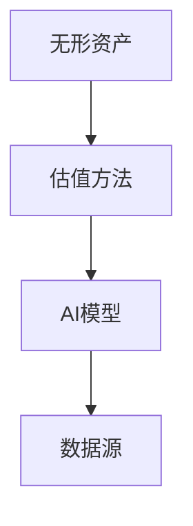
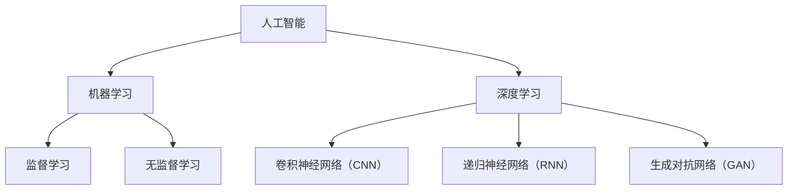
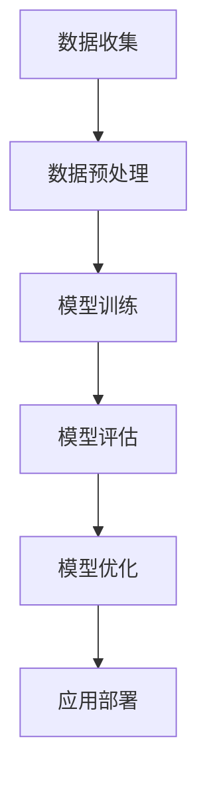
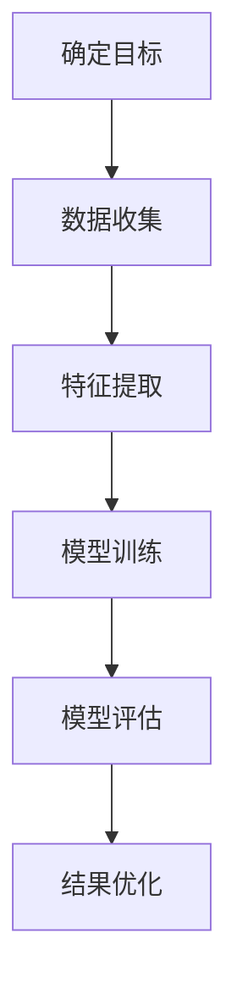
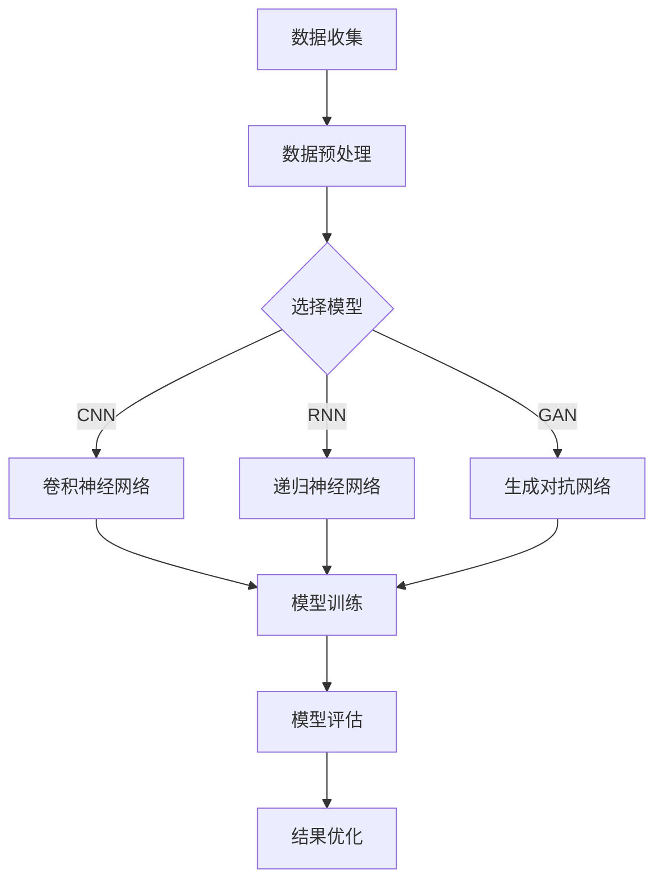
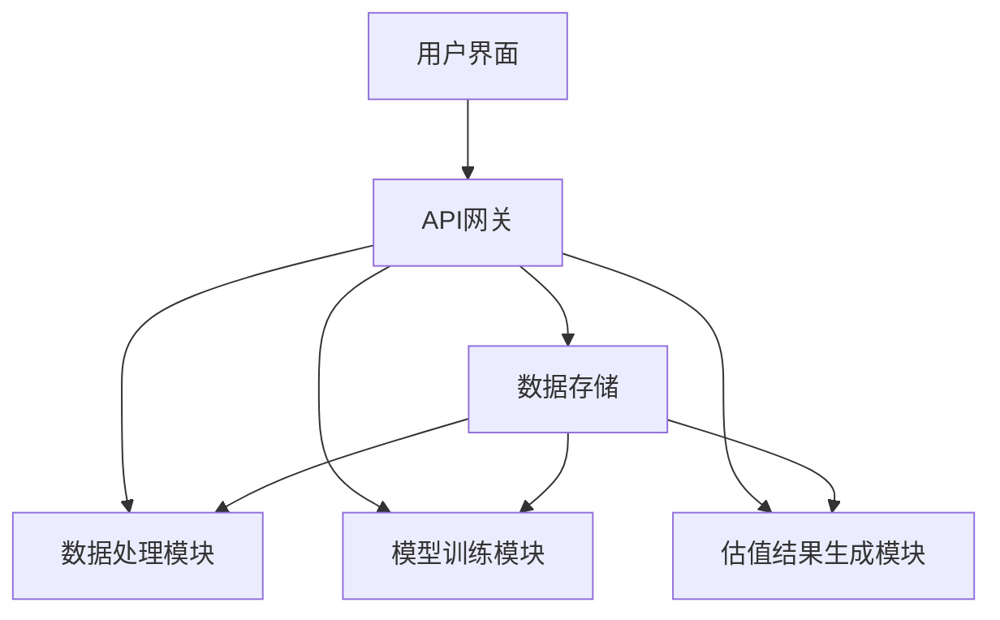
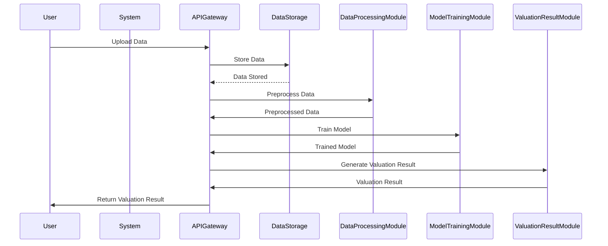

                 

### 引言与背景介绍

> **关键词：** 无形资产、企业价值、资产估值、AI技术、机器学习。

> **摘要：** 本文将深入探讨AI技术在企业无形资产估值与管理中的实际应用，通过分析现有传统方法的局限，阐述AI技术所带来的变革及其挑战，为企业的无形资产管理提供全新的视角和策略。

---

在当今的商业环境中，无形资产已成为企业竞争力和长期发展的重要驱动力。这些无形资产包括专利、商标、客户关系、品牌价值、技术和专有知识等，它们往往难以量化但对企业价值贡献巨大。因此，如何准确评估和管理这些无形资产，成为了企业财务管理中的重要课题。

### 无形资产在企业中的重要性

#### **核心概念：** 无形资产、企业价值、资产估值。

无形资产作为企业价值的重要组成部分，其对企业发展的影响深远。传统上，企业的价值评估主要依赖于有形资产，如固定资产、现金、存货等。然而，随着知识经济时代的到来，无形资产在企业的资产结构中占据了越来越重要的地位。例如，一家科技公司可能拥有大量有形的办公设备和服务器，但其真正的价值可能更多来自于其研发能力、专利组合和客户基础。

#### **概念联系：** 无形资产作为企业价值的重要组成部分，其估值与管理直接影响企业的财务状况和长期发展。无形资产的估值不仅关系到企业的财务报表准确性，更影响到企业的市场估值、投资决策和战略规划。

### 传统的无形资产估值方法及其局限性

#### **核心概念：** 传统估值方法、财务报表、市场价值。

#### **概念属性特征对比表格：**

| 估值方法 | 定义 | 适用场景 | 优点 | 缺点 |
| --- | --- | --- | --- | --- |
| 财务报表法 | 基于财务报表数据进行估值 | 稳定性较高 | 数据获取容易 | 忽视非财务因素 |
| 市场比较法 | 基于市场交易数据对比估值 | 适用于市场活跃的资产 | 精准度高 | 受市场波动影响大 |

传统的无形资产估值方法，如财务报表法和市场比较法，虽然在一定程度上能够为企业提供参考，但它们存在显著的局限性。财务报表法主要依赖财务数据，而忽视了企业的非财务因素，如品牌知名度和客户忠诚度。市场比较法则需要市场交易的活跃数据，这在无形资产市场并不常见，导致其估值结果可能并不准确。

### AI技术在无形资产估值中的应用

#### **核心概念：** AI、机器学习、数据挖掘。

随着人工智能技术的快速发展，AI开始被广泛应用于各个领域，包括无形资产估值。AI技术通过机器学习和数据挖掘，能够从大量非结构化和结构化数据中提取有价值的信息，提供更为准确和全面的估值结果。

#### **ER实体关系图架构：**



在无形资产估值中，AI模型通过学习大量的历史数据，能够识别出不同类型无形资产之间的关联性和影响因素。这种数据驱动的方法不仅能够处理复杂的非财务数据，还能通过不断的迭代优化，提高估值的准确性和可靠性。

### 问题描述

#### **无形资产估值的难点**

**核心概念：** 数据不完整、主观性、复杂性。

**难点分析：**

1. **数据不完整：** 无形资产的价值评估往往依赖于大量历史数据和外部信息，但实际获取这些数据可能面临困难。
2. **主观性：** 不同评估者对无形资产的认知和评估标准可能存在差异，导致结果的主观性。
3. **复杂性：** 无形资产的价值不仅受到内部因素的影响，还受到外部市场环境的变化影响，评估过程复杂。

#### **估值过程中可能面临的问题**

**核心概念：** 模型适应性、数据隐私、计算效率。

**问题分析：**

1. **模型适应性：** AI模型需要能够适应不同的评估场景和资产类型，但不同类型无形资产的评估需求差异较大。
2. **数据隐私：** 在进行数据挖掘和分析时，如何保护企业敏感数据的安全和隐私，是一个需要解决的重要问题。
3. **计算效率：** 无形资产估值需要处理大量数据，如何在保证准确性的同时提高计算效率，是一个重要的挑战。

### 问题解决思路

#### **AI技术在无形资产估值中的应用策略**

**核心概念：** 机器学习模型、数据预处理、模型评估。

**应用策略：**

1. **数据预处理：** 通过数据清洗、归一化和特征提取等预处理技术，提高数据的可用性。
2. **机器学习模型：** 利用不同的机器学习算法，如回归分析、决策树和神经网络等，建立估值模型。
3. **模型评估：** 通过交叉验证和性能指标评估，选择最优的模型进行应用。

#### **无形资产估值系统的边界与外延**

**核心概念：** 估值范围、应用领域、技术限制。

**边界与外延：**

1. **估值范围：** 无形资产估值系统应覆盖不同类型和领域的无形资产，如专利、商标、品牌价值等。
2. **应用领域：** 无形资产估值系统可以应用于企业财务报表、投资决策和战略规划等多个领域。
3. **技术限制：** 无形资产估值系统需要在计算效率和数据安全之间找到平衡，同时不断优化算法和模型。

### 核心概念结构与要素组成

#### **无形资产估值的核心概念**

**核心概念：** 无形资产、估值模型、算法、数据源。

**核心概念联系：** 无形资产作为估值对象，估值模型和算法负责评估其价值，数据源则为模型提供训练和验证所需的输入数据。

#### **无形资产估值系统的关键要素**

**核心概念：** 数据采集与处理、模型训练与优化、结果验证与反馈。

**关键要素联系：** 数据采集与处理是估值系统的数据基础，模型训练与优化是估值系统的核心，结果验证与反馈是确保估值准确性的关键。

### 本章小结

**小结：** 通过对无形资产在企业中的重要性、传统估值方法的局限、AI技术的应用以及问题解决思路的深入探讨，本文为无形资产估值与管理提供了新的视角和策略。未来，随着AI技术的进一步发展，无形资产估值将更加准确和高效，为企业的发展提供更强大的支持。

---

### 基本信息与背景介绍

#### 1.1 问题背景

无形资产作为企业竞争力的重要组成部分，其价值评估与管理显得尤为重要。传统的无形资产估值方法，如财务报表法和市场比较法，虽然在某些情况下具有一定的应用价值，但往往存在诸多局限。这些局限主要体现在以下几个方面：

**1. 财务报表法的局限性：**

财务报表法主要依赖于企业的财务报表数据进行估值，其优点在于数据的获取相对容易，且具有一定的稳定性。然而，这种方法存在明显的缺陷，即无法全面反映无形资产的价值。首先，财务报表法主要关注企业的财务状况，而忽视了无形资产的非财务因素，如品牌影响力、客户忠诚度、研发能力等。这些因素对于企业的长期发展和市场竞争力具有深远的影响，但传统财务报表法无法准确量化。其次，财务报表法的数据源主要来自于企业的内部数据，缺乏外部市场信息的支持，从而使得估值结果可能偏于保守。

**2. 市场比较法的局限性：**

市场比较法通过对比市场上类似无形资产的交易价格来估算目标资产的价值。这种方法在市场交易活跃的情况下具有一定的参考价值，但其适用范围有限。首先，市场比较法需要大量的市场交易数据作为支持，但在无形资产市场，尤其是专利、商标等特殊资产市场上，交易的活跃度往往较低，导致市场比较法的应用受限。其次，市场比较法容易受到市场波动的影响，从而使得估值结果不稳定。

**3. AI技术的崛起：**

随着人工智能技术的快速发展，机器学习和数据挖掘等AI技术逐渐被应用于无形资产估值领域。这些技术通过从大量数据中提取有价值的信息，能够提供更为准确和全面的估值结果。机器学习模型通过学习历史数据和外部信息，可以识别出不同类型无形资产之间的关联性和影响因素，从而实现更为精准的估值。此外，AI技术还可以处理复杂的非结构化和结构化数据，提高估值过程的效率和准确性。

**1.1.2 传统的无形资产估值方法及其局限性**

**核心概念：** 传统估值方法、财务报表、市场价值。

在传统的无形资产估值方法中，财务报表法和市场比较法是最为常见的方法。财务报表法主要依赖于企业的财务报表数据进行估值，其优点在于数据的获取相对容易，且具有一定的稳定性。然而，这种方法存在明显的缺陷，即无法全面反映无形资产的价值。首先，财务报表法主要关注企业的财务状况，而忽视了无形资产的非财务因素，如品牌影响力、客户忠诚度、研发能力等。这些因素对于企业的长期发展和市场竞争力具有深远的影响，但传统财务报表法无法准确量化。其次，财务报表法的数据源主要来自于企业的内部数据，缺乏外部市场信息的支持，从而使得估值结果可能偏于保守。

市场比较法通过对比市场上类似无形资产的交易价格来估算目标资产的价值。这种方法在市场交易活跃的情况下具有一定的参考价值，但其适用范围有限。首先，市场比较法需要大量的市场交易数据作为支持，但在无形资产市场，尤其是专利、商标等特殊资产市场上，交易的活跃度往往较低，导致市场比较法的应用受限。其次，市场比较法容易受到市场波动的影响，从而使得估值结果不稳定。

**1.1.3 AI技术在无形资产估值中的应用**

**核心概念：** AI、机器学习、数据挖掘。

随着人工智能技术的快速发展，机器学习和数据挖掘等AI技术逐渐被应用于无形资产估值领域。这些技术通过从大量数据中提取有价值的信息，能够提供更为准确和全面的估值结果。机器学习模型通过学习历史数据和外部信息，可以识别出不同类型无形资产之间的关联性和影响因素，从而实现更为精准的估值。此外，AI技术还可以处理复杂的非结构化和结构化数据，提高估值过程的效率和准确性。

#### **AI技术在无形资产估值中的应用原理**

**核心概念：** 人工智能、机器学习、深度学习。

在无形资产估值中，AI技术主要应用于以下几个方面：

1. **数据预处理：** 无形资产估值需要大量的数据支持，这些数据包括财务报表数据、市场交易数据、客户反馈数据、行业数据等。AI技术可以通过数据清洗、归一化和特征提取等技术，对数据进行预处理，提高数据的可用性。

2. **模型训练与优化：** 机器学习模型通过学习大量历史数据和外部信息，可以识别出无形资产之间的关联性和影响因素。通过不断优化模型参数，可以提高模型的预测准确性和稳定性。

3. **结果验证与反馈：** AI技术可以自动评估模型的预测结果，并提供反馈信息，以不断优化模型。这种迭代过程有助于提高估值结果的准确性和可靠性。

#### **AI技术的崛起：**

随着人工智能技术的快速发展，机器学习和数据挖掘等AI技术逐渐被应用于无形资产估值领域。这些技术通过从大量数据中提取有价值的信息，能够提供更为准确和全面的估值结果。机器学习模型通过学习历史数据和外部信息，可以识别出不同类型无形资产之间的关联性和影响因素，从而实现更为精准的估值。此外，AI技术还可以处理复杂的非结构化和结构化数据，提高估值过程的效率和准确性。

**1.1.3 AI技术在无形资产估值中的应用**

**核心概念：** AI、机器学习、数据挖掘。

随着人工智能技术的快速发展，机器学习和数据挖掘等AI技术逐渐被应用于无形资产估值领域。这些技术通过从大量数据中提取有价值的信息，能够提供更为准确和全面的估值结果。机器学习模型通过学习大量历史数据和外部信息，可以识别出不同类型无形资产之间的关联性和影响因素，从而实现更为精准的估值。此外，AI技术还可以处理复杂的非结构化和结构化数据，提高估值过程的效率和准确性。

在无形资产估值中，AI技术主要应用于以下几个方面：

1. **数据预处理：** 无形资产估值需要大量的数据支持，这些数据包括财务报表数据、市场交易数据、客户反馈数据、行业数据等。AI技术可以通过数据清洗、归一化和特征提取等技术，对数据进行预处理，提高数据的可用性。

2. **模型训练与优化：** 机器学习模型通过学习大量历史数据和外部信息，可以识别出无形资产之间的关联性和影响因素。通过不断优化模型参数，可以提高模型的预测准确性和稳定性。

3. **结果验证与反馈：** AI技术可以自动评估模型的预测结果，并提供反馈信息，以不断优化模型。这种迭代过程有助于提高估值结果的准确性和可靠性。

#### **AI技术的崛起：**

随着人工智能技术的快速发展，机器学习和数据挖掘等AI技术逐渐被应用于无形资产估值领域。这些技术通过从大量数据中提取有价值的信息，能够提供更为准确和全面的估值结果。机器学习模型通过学习历史数据和外部信息，可以识别出不同类型无形资产之间的关联性和影响因素，从而实现更为精准的估值。此外，AI技术还可以处理复杂的非结构化和结构化数据，提高估值过程的效率和准确性。

### **1.2 问题描述**

#### **无形资产估值的难点**

**核心概念：** 数据不完整、主观性、复杂性。

无形资产估值的难点主要体现在以下几个方面：

1. **数据不完整：** 无形资产估值所需的数据往往分散在不同来源，且部分数据可能缺失或不完整。这使得估值过程面临数据采集的困难，从而影响估值结果的准确性。

2. **主观性：** 不同的评估者可能对无形资产的价值有不同的看法，这种主观性可能导致估值结果存在较大的差异。此外，评估过程中可能存在信息不对称，评估者可能无法全面了解无形资产的实际情况。

3. **复杂性：** 无形资产的价值不仅受内部因素的影响，还受外部市场环境的变化影响。这使得无形资产估值过程复杂，需要综合考虑多种因素。

#### **估值过程中可能面临的问题**

**核心概念：** 模型适应性、数据隐私、计算效率。

在估值过程中，可能面临以下问题：

1. **模型适应性：** 无形资产类型多样，不同类型的无形资产可能需要不同的评估模型。然而，现有的AI模型往往针对特定类型的资产进行优化，难以适应多样化的评估需求。

2. **数据隐私：** 无形资产估值过程中可能涉及企业敏感数据，如客户信息、专利细节等。如何在确保数据隐私的同时进行有效的估值，是一个重要的挑战。

3. **计算效率：** 无形资产估值通常需要处理大量数据，计算效率成为制约估值过程的重要因素。如何优化算法和模型，提高计算效率，是一个关键问题。

### **1.3 问题解决思路**

#### **AI技术在无形资产估值中的应用策略**

**核心概念：** 机器学习模型、数据预处理、模型评估。

针对无形资产估值过程中面临的难点和问题，AI技术提供了一系列有效的解决策略：

1. **数据预处理：** 通过数据清洗、归一化和特征提取等技术，对原始数据进行预处理，提高数据的质量和可用性。这有助于解决数据不完整的问题，为后续的估值提供可靠的数据基础。

2. **机器学习模型：** 利用机器学习模型，如回归分析、决策树、神经网络等，对无形资产进行估值。这些模型可以从大量数据中提取有价值的信息，提高估值结果的准确性和可靠性。

3. **模型评估：** 通过交叉验证和性能指标评估，选择最优的模型进行应用。这有助于解决主观性和复杂性的问题，确保估值结果的准确性和稳定性。

#### **无形资产估值系统的边界与外延**

**核心概念：** 估值范围、应用领域、技术限制。

无形资产估值系统的边界与外延主要包括以下几个方面：

1. **估值范围：** 无形资产估值系统应涵盖不同类型和领域的无形资产，如专利、商标、客户关系、品牌价值等。这有助于全面评估企业的无形资产价值。

2. **应用领域：** 无形资产估值系统可以应用于企业财务报表、投资决策、战略规划等多个领域。这有助于企业更好地管理无形资产，提高整体竞争力。

3. **技术限制：** 无形资产估值系统需要在计算效率和数据安全之间找到平衡。此外，现有的AI技术可能存在一定的局限性，如模型适应性、数据隐私等，需要在实践中不断优化和改进。

### **1.4 核心概念结构与要素组成**

#### **无形资产估值的核心概念**

**核心概念：** 无形资产、估值模型、算法、数据源。

**核心概念联系：** 无形资产作为估值对象，估值模型和算法负责评估其价值，数据源则为模型提供训练和验证所需的输入数据。

#### **无形资产估值系统的关键要素**

**核心概念：** 数据采集与处理、模型训练与优化、结果验证与反馈。

**关键要素联系：** 数据采集与处理是估值系统的数据基础，模型训练与优化是估值系统的核心，结果验证与反馈是确保估值准确性的关键。

### **1.5 本章小结**

**小结：** 通过对无形资产在企业中的重要性、传统估值方法的局限、AI技术的应用以及问题解决思路的深入探讨，本文为无形资产估值与管理提供了新的视角和策略。未来，随着AI技术的进一步发展，无形资产估值将更加准确和高效，为企业的发展提供更强大的支持。

---

## 第2章 AI技术在无形资产估值中的应用原理

### 2.1 AI技术概述

#### 2.1.1 AI的定义与发展历程

**核心概念：** 人工智能、机器学习、深度学习。

人工智能（Artificial Intelligence，AI）是指通过计算机模拟人类的智能行为，实现自动化决策和智能交互的技术。自1956年达特茅斯会议上人工智能概念的提出，AI技术经历了数十年的发展，从最初的符号主义和规则系统，到基于统计学习的机器学习，再到如今深度学习等先进技术的广泛应用。

**ER实体关系图架构：**



**概念联系：** 人工智能是广义的，包括机器学习和深度学习等子领域。机器学习通过从数据中学习模式和规律，实现预测和决策。深度学习是机器学习的一个分支，通过多层神经网络对数据进行处理，具有强大的学习和表征能力。

#### 2.1.2 AI技术的基本原理

**核心概念：** 神经网络、数据驱动、算法优化。

**神经网络：** 神经网络是人工智能的基础，模拟人脑的神经元结构和功能。它由多个层组成，包括输入层、隐藏层和输出层，每层由多个神经元组成。神经元通过权重和偏置进行计算，输出层产生预测结果。

**数据驱动：** 机器学习和深度学习都是数据驱动的，依赖于大量数据进行训练和优化。数据质量直接影响模型的学习效果和预测准确性。

**算法优化：** 算法优化是通过调整模型参数和结构，提高模型的性能和效率。常见的优化方法包括梯度下降、正则化、交叉验证等。

**Mermaid流程图：**



#### 2.1.3 AI技术的应用领域

**核心概念：** 自然语言处理（NLP）、计算机视觉、推荐系统。

**自然语言处理（NLP）：** NLP是AI技术在语言理解、生成和翻译等领域的应用。通过深度学习模型，NLP可以实现智能客服、语音识别、机器翻译等功能。

**计算机视觉：** 计算机视觉是AI技术在图像和视频分析领域的应用。通过卷积神经网络（CNN）等模型，计算机视觉可以实现人脸识别、物体检测、图像分割等功能。

**推荐系统：** 推荐系统是AI技术在信息过滤和推荐领域的应用。通过协同过滤、矩阵分解等算法，推荐系统可以预测用户兴趣，提供个性化推荐。

### 2.2 无形资产估值中的AI技术应用

#### 2.2.1 机器学习在无形资产估值中的应用

**核心概念：** 数据挖掘、特征提取、模型选择。

**数据挖掘：** 数据挖掘是从大量数据中提取有价值信息和知识的过程。在无形资产估值中，数据挖掘可以帮助识别与资产价值相关的关键因素。

**特征提取：** 特征提取是将原始数据转换为可用于机器学习模型处理的特征向量。在无形资产估值中，特征提取有助于从复杂的数据中提取有价值的信息。

**模型选择：** 选择合适的机器学习模型对于无形资产估值的准确性至关重要。常见的模型包括线性回归、决策树、随机森林、支持向量机等。

**Mermaid流程图：**



#### 2.2.2 深度学习在无形资产估值中的应用

**核心概念：** 卷积神经网络（CNN）、递归神经网络（RNN）、生成对抗网络（GAN）。

**卷积神经网络（CNN）：** CNN是处理图像数据的强大模型，通过卷积操作和池化操作，CNN能够提取图像的层次特征。

**递归神经网络（RNN）：** RNN适用于处理序列数据，通过循环结构，RNN能够捕捉序列中的时序信息。

**生成对抗网络（GAN）：** GAN由生成器和判别器组成，通过对抗训练，GAN可以生成逼真的数据。

**Mermaid流程图：**



### 2.3 AI模型的评估与优化

#### 2.3.1 评估指标

**核心概念：** 准确率、召回率、F1分数。

**准确率（Accuracy）：** 准确率是分类模型预测正确的样本数占总样本数的比例。

**召回率（Recall）：** 召回率是分类模型预测正确的正样本数占总正样本数的比例。

**F1分数（F1 Score）：** F1分数是准确率和召回率的调和平均值，用于综合评价分类模型的性能。

#### 2.3.2 模型优化方法

**核心概念：** 调参、交叉验证、模型集成。

**调参：** 调参是通过调整模型的超参数，如学习率、正则化参数等，来优化模型的性能。

**交叉验证：** 交叉验证是通过将数据集划分为多个子集，重复训练和验证模型，以评估模型的泛化能力。

**模型集成：** 模型集成是将多个模型的结果进行综合，以提高预测的准确性和稳定性。

### 2.4 本章小结

**小结：** 通过对AI技术的概述、机器学习和深度学习在无形资产估值中的应用、模型评估与优化方法的介绍，本文为AI技术在无形资产估值中的应用提供了理论基础和实践指导。随着AI技术的不断进步，无形资产估值将变得更加准确和高效，为企业的资产管理提供有力支持。

---

### AI技术在无形资产估值中的应用原理

#### **2.1 AI技术概述**

**核心概念：** 人工智能（AI）、机器学习（ML）、深度学习（DL）。

AI是一种通过计算机模拟人类智能行为的技术，它包括机器学习和深度学习等子领域。机器学习是通过算法从数据中学习模式和规律，而深度学习则是通过多层神经网络进行数据处理和分析。

**ER实体关系图架构：**


**概念联系：** 人工智能是机器学习和深度学习的基础，机器学习通过学习数据中的规律来做出决策，而深度学习则通过多层神经网络对数据进行复杂表征。

#### **2.1.2 AI技术的基本原理**

**核心概念：** 神经网络、数据驱动、算法优化。

**神经网络：** 神经网络是AI技术的基础，它由多个神经元层组成，通过前向传播和反向传播来学习和更新权重。

**数据驱动：** AI技术依赖于大量数据进行训练和优化，这些数据可以是结构化的、半结构化的或非结构化的。

**算法优化：** 算法优化是通过调整模型的参数和结构来提高模型的性能和泛化能力。

**Mermaid流程图：**


#### **2.1.3 AI技术的应用领域**

**核心概念：** 自然语言处理（NLP）、计算机视觉、推荐系统。

**自然语言处理（NLP）：** NLP涉及文本数据的处理和分析，包括语言模型、机器翻译、情感分析等。

**计算机视觉：** 计算机视觉涉及图像和视频数据的分析，包括图像识别、目标检测、图像分割等。

**推荐系统：** 推荐系统通过分析用户行为和历史数据，为用户推荐感兴趣的内容或产品。

#### **2.2 无形资产估值中的AI技术应用**

**核心概念：** 数据挖掘、特征提取、模型选择。

**数据挖掘：** 数据挖掘是从大量数据中提取有价值信息的过程，对于无形资产估值，数据挖掘可以帮助识别影响资产价值的因素。

**特征提取：** 特征提取是将原始数据转换为可用于机器学习模型的特征向量，对于无形资产估值，特征提取有助于提取关键信息。

**模型选择：** 模型选择是选择合适的机器学习模型进行估值，常见的模型包括线性回归、决策树、支持向量机等。

**Mermaid流程图：**


#### **2.2.2 深度学习在无形资产估值中的应用**

**核心概念：** 卷积神经网络（CNN）、递归神经网络（RNN）、生成对抗网络（GAN）。

**卷积神经网络（CNN）：** CNN适用于图像数据，通过卷积和池化操作，可以提取图像的层次特征。

**递归神经网络（RNN）：** RNN适用于序列数据，通过循环结构，可以处理时间序列数据。

**生成对抗网络（GAN）：** GAN由生成器和判别器组成，通过对抗训练，可以生成逼真的数据。

**Mermaid流程图：**


#### **2.3 AI模型的评估与优化**

**核心概念：** 评估指标、调参、交叉验证。

**评估指标：** 评估指标用于衡量模型的性能，常见的指标包括准确率、召回率、F1分数等。

**调参：** 调参是通过调整模型的参数来优化模型性能，常用的方法包括网格搜索和随机搜索。

**交叉验证：** 交叉验证是将数据集划分为多个子集，通过交叉训练和测试来评估模型的泛化能力。

#### **2.4 本章小结**

通过本章对AI技术的基本原理和应用领域的介绍，我们可以看到AI技术在无形资产估值中的应用前景广阔。深度学习模型通过从大量数据中提取有价值的信息，可以提供更为精准和全面的估值结果。未来，随着AI技术的不断进步，无形资产估值将变得更加高效和准确。

---

### 2.3 AI模型的评估与优化

在无形资产估值中，评估和优化AI模型是确保估值结果准确性和可靠性的关键步骤。通过准确评估模型的性能，我们可以识别模型的优点和不足，进而进行优化，提高估值精度。

#### **2.3.1 评估指标**

评估AI模型的性能通常依赖于一系列指标，这些指标可以从不同角度反映模型的表现。以下是几种常用的评估指标：

1. **准确率（Accuracy）：** 准确率是最直观的评估指标，表示模型正确预测的样本数占总样本数的比例。公式如下：

   $$ \text{Accuracy} = \frac{\text{预测正确的样本数}}{\text{总样本数}} $$

2. **召回率（Recall）：** 召回率表示模型能够正确识别出正样本的能力。公式如下：

   $$ \text{Recall} = \frac{\text{预测正确的正样本数}}{\text{总正样本数}} $$

3. **精确率（Precision）：** 精确率表示模型预测为正的样本中有多少是真正样本。公式如下：

   $$ \text{Precision} = \frac{\text{预测正确的正样本数}}{\text{预测为正的样本数}} $$

4. **F1分数（F1 Score）：** F1分数是精确率和召回率的调和平均值，用于综合评价模型的性能。公式如下：

   $$ \text{F1 Score} = 2 \times \frac{\text{Precision} \times \text{Recall}}{\text{Precision} + \text{Recall}} $$

5. **ROC曲线（Receiver Operating Characteristic）：** ROC曲线通过绘制真阳性率（True Positive Rate，TPR）与假阳性率（False Positive Rate，FPR）的关系来评估模型的分类性能。曲线下的面积（AUC）越大，模型性能越好。

#### **2.3.2 模型优化方法**

在评估模型性能的基础上，我们需要进行优化以提高估值结果的准确性和可靠性。以下是一些常用的模型优化方法：

1. **调参（Hyperparameter Tuning）：** 调参是调整模型的超参数，如学习率、正则化参数、隐藏层节点数等，以优化模型性能。常用的调参方法包括网格搜索（Grid Search）和随机搜索（Random Search）。

2. **交叉验证（Cross-Validation）：** 交叉验证是一种评估模型泛化能力的方法，通过将数据集划分为多个子集，反复进行训练和测试，以避免过拟合和欠拟合。常用的交叉验证方法有K折交叉验证和留一法交叉验证。

3. **集成方法（Ensemble Methods）：** 集成方法通过结合多个模型的预测结果来提高整体性能。常见的方法包括Bagging、Boosting和Stacking。Bagging通过构建多个模型并取平均来减少方差，Boosting通过迭代训练模型并调整权重来提高分类效果，Stacking则将多个模型的结果作为新模型的输入。

**Python代码示例：**

以下是一个简单的Python代码示例，演示了使用交叉验证和网格搜索对线性回归模型进行调参：

```python
import numpy as np
from sklearn.linear_model import LinearRegression
from sklearn.model_selection import cross_val_score, GridSearchCV

# 假设我们有一个训练数据集X和目标数据集y
X = np.array([[1], [2], [3], [4], [5]])
y = np.array([1, 2, 3, 4, 5])

# 创建线性回归模型实例
model = LinearRegression()

# 定义参数网格
param_grid = {'fit_intercept': [True, False], 'normalize': [True, False]}

# 使用网格搜索进行调参
grid_search = GridSearchCV(model, param_grid, cv=5)
grid_search.fit(X, y)

# 输出最佳参数和模型评分
print("最佳参数：", grid_search.best_params_)
print("模型评分：", grid_search.best_score_)

# 使用最佳参数训练模型
best_model = grid_search.best_estimator_
best_model.fit(X, y)

# 进行交叉验证评估模型性能
scores = cross_val_score(best_model, X, y, cv=5)
print("交叉验证评分：", scores.mean())
```

通过上述代码，我们可以找到最佳参数组合，并评估模型的性能。这样，我们可以确保在无形资产估值中使用的模型是最优的，从而提高估值的准确性和可靠性。

#### **2.3.3 模型优化方法：调参、交叉验证和集成方法**

**调参：** 调参是优化机器学习模型性能的重要步骤，通过调整模型的超参数来找到最佳配置。常用的调参方法包括：

- **网格搜索（Grid Search）：** 网格搜索是一种系统性的搜索方法，通过遍历所有可能的参数组合来找到最佳参数。缺点是计算成本较高，尤其是在参数空间较大时。

- **随机搜索（Random Search）：** 随机搜索通过随机选择参数组合进行尝试，减少了搜索空间，提高了计算效率。但可能不如网格搜索找到最佳参数。

- **贝叶斯优化（Bayesian Optimization）：** 贝叶斯优化基于概率模型，通过模拟贝叶斯网络来选择最有可能产生高绩效的参数组合，是一种高效且全局性的优化方法。

**交叉验证：** 交叉验证是一种评估模型泛化能力的方法，通过将数据集划分为多个子集，反复进行训练和测试。常用的交叉验证方法包括：

- **K折交叉验证（K-Fold Cross-Validation）：** 将数据集划分为K个子集，每次保留一个子集作为验证集，其余K-1个子集作为训练集。重复K次，最终取平均性能。

- **留一法交叉验证（Leave-One-Out Cross-Validation，LOOCV）：** 对于每个样本，将其作为验证集，其余样本作为训练集。这种方法在样本量较小的情况下非常有用。

**集成方法：** 集成方法通过结合多个模型的预测结果来提高整体性能。常用的集成方法包括：

- **Bagging：** Bagging通过构建多个模型并取平均来减少方差，常用的算法包括随机森林（Random Forest）和自适应提升（Adaboost）。

- **Boosting：** Boosting通过迭代训练模型并调整权重来提高分类效果，常用的算法包括梯度提升决策树（Gradient Boosting Decision Tree，GBDT）和自适应提升（Adaboost）。

- **Stacking：** Stacking将多个模型的结果作为新模型的输入，通过训练一个更高层次的模型来综合各个基模型的预测结果。

#### **示例：使用Python进行模型调参和交叉验证**

以下是一个简单的示例，演示如何使用Python的Scikit-learn库进行模型调参和交叉验证：

```python
from sklearn.datasets import load_iris
from sklearn.model_selection import train_test_split, GridSearchCV
from sklearn.ensemble import RandomForestClassifier
from sklearn.metrics import accuracy_score

# 加载数据集
iris = load_iris()
X, y = iris.data, iris.target

# 划分训练集和测试集
X_train, X_test, y_train, y_test = train_test_split(X, y, test_size=0.2, random_state=42)

# 创建随机森林分类器
rf = RandomForestClassifier(random_state=42)

# 定义参数网格
param_grid = {
    'n_estimators': [100, 200],
    'max_depth': [None, 10, 20],
    'min_samples_split': [2, 5]
}

# 使用网格搜索进行调参
grid_search = GridSearchCV(rf, param_grid, cv=5)
grid_search.fit(X_train, y_train)

# 输出最佳参数和模型评分
print("最佳参数：", grid_search.best_params_)
print("模型评分：", grid_search.best_score_)

# 使用最佳参数训练模型
best_model = grid_search.best_estimator_
best_model.fit(X_train, y_train)

# 进行交叉验证评估模型性能
scores = cross_val_score(best_model, X, y, cv=5)
print("交叉验证评分：", scores.mean())

# 测试模型性能
y_pred = best_model.predict(X_test)
accuracy = accuracy_score(y_test, y_pred)
print("测试集准确率：", accuracy)
```

通过上述代码，我们可以找到最佳参数组合，并评估模型的性能。这有助于我们在无形资产估值中构建一个更准确和可靠的预测模型。

### **2.4 本章小结**

本章详细介绍了AI技术在无形资产估值中的应用原理，包括AI技术的基本概念、机器学习和深度学习在估值中的应用、评估与优化方法等。通过引入机器学习模型，AI技术能够从大量数据中提取有价值的信息，提供更为精准和全面的估值结果。同时，通过调参、交叉验证和集成方法，我们可以优化模型的性能，提高估值的准确性和可靠性。随着AI技术的不断进步，无形资产估值将变得更加高效和准确，为企业的资产管理提供有力支持。

---

## 第3章 无形资产估值系统的设计与实现

### **3.1 系统介绍**

#### **问题场景介绍**

在现代企业的运营中，无形资产如专利、商标、品牌价值和技术专有知识等，对于企业的长期发展和市场竞争力具有重要意义。然而，传统的方法在评估这些无形资产时往往面临诸多挑战，如数据不完整、评估标准不统一、评估过程复杂等。为了解决这些问题，我们需要设计和实现一个基于AI的无形资产估值系统。

#### **项目介绍**

本项目的目标是构建一个AI驱动的无形资产估值系统，通过集成机器学习和深度学习技术，实现高效、准确的估值。该系统将提供以下功能：

- **数据采集与处理：** 从多个数据源收集与无形资产相关的数据，包括财务报表、市场数据、行业报告等，并进行数据预处理。
- **模型训练与优化：** 基于收集到的数据，训练和优化机器学习模型，以实现无形资产的估值。
- **估值结果生成与展示：** 根据模型的预测结果，生成详细的估值报告，并提供可视化展示。

#### **系统功能设计：领域模型类图**

**领域模型类图：**

```mermaid
classDiagram
    Class01 <|-- Class02
    Class03 --|urahan Class04
    Class05 <<interface>>
    Class06 <<interface>>
    Class07 .. Class08
    Class09 --| LAPAN Class10
    Class11 *-- Class12
    Class11 *-- Class13
    Class12 : +int x
    Class12 : +int y
    Class14 <|-- Class15
    Class16 <|-- Class17
    Class18 <|-- Class19
    Class20 <|-- Class21
    Class22 <|-- Class23
```

**概念联系：** 领域模型类图展示了系统中的关键实体和它们之间的关系，如数据源、估值模型、数据预处理模块等。通过类图，我们可以清晰地理解系统的架构和功能模块。

### **3.2 系统架构设计**

#### **系统架构设计：Mermaid架构图**

**系统架构图：**



**概念联系：** 系统架构图展示了系统的整体结构和各模块之间的交互关系。用户界面通过API网关与系统后端进行通信，数据处理模块负责数据清洗和预处理，模型训练模块负责训练和优化机器学习模型，估值结果生成模块负责生成估值报告。

### **3.3 系统接口设计**

#### **接口设计：RESTful API**

**接口定义：**

1. **数据上传接口：** 用于上传与无形资产相关的数据。
   - **请求URL：** `/api/data/upload`
   - **请求方法：** POST
   - **请求参数：** `file`（文件）

2. **数据预处理接口：** 用于获取预处理后的数据。
   - **请求URL：** `/api/data/preprocessing`
   - **请求方法：** GET
   - **请求参数：** `file_id`（文件ID）

3. **模型训练接口：** 用于启动模型训练过程。
   - **请求URL：** `/api/model/train`
   - **请求方法：** POST
   - **请求参数：** `data_id`（数据ID）

4. **估值结果接口：** 用于获取估值结果。
   - **请求URL：** `/api/valuation/result`
   - **请求方法：** GET
   - **请求参数：** `data_id`（数据ID）

**概念联系：** 通过RESTful API设计，系统提供了清晰、易用的接口，方便用户进行数据上传、预处理、模型训练和估值结果查询。

### **3.4 系统交互设计**

#### **系统交互设计：Mermaid序列图**

**系统交互序列图：**



**概念联系：** 系统交互序列图展示了用户与系统之间的交互流程。用户上传数据，系统进行处理、训练和估值，最终返回估值结果。

### **3.5 系统实现**

#### **环境安装**

为了实现无形资产估值系统，我们需要安装以下环境和工具：

- **Python 3.8+**
- **Jupyter Notebook**
- **Scikit-learn**
- **TensorFlow**
- **Flask（用于API开发）**
- **PostgreSQL（用于数据存储）**

#### **系统核心实现源代码**

**数据处理模块：**

```python
import pandas as pd
from sklearn.model_selection import train_test_split
from sklearn.preprocessing import StandardScaler

def preprocess_data(data_path):
    # 读取数据
    data = pd.read_csv(data_path)
    
    # 分割特征和标签
    X = data.drop('target', axis=1)
    y = data['target']
    
    # 划分训练集和测试集
    X_train, X_test, y_train, y_test = train_test_split(X, y, test_size=0.2, random_state=42)
    
    # 数据标准化
    scaler = StandardScaler()
    X_train_scaled = scaler.fit_transform(X_train)
    X_test_scaled = scaler.transform(X_test)
    
    return X_train_scaled, X_test_scaled, y_train, y_test
```

**模型训练模块：**

```python
from sklearn.ensemble import RandomForestClassifier
from sklearn.model_selection import GridSearchCV

def train_model(X_train, y_train):
    # 创建随机森林分类器
    rf = RandomForestClassifier(random_state=42)
    
    # 定义参数网格
    param_grid = {
        'n_estimators': [100, 200],
        'max_depth': [None, 10, 20],
        'min_samples_split': [2, 5]
    }
    
    # 使用网格搜索进行调参
    grid_search = GridSearchCV(rf, param_grid, cv=5)
    grid_search.fit(X_train, y_train)
    
    # 输出最佳参数和模型评分
    print("最佳参数：", grid_search.best_params_)
    print("模型评分：", grid_search.best_score_)
    
    return grid_search.best_estimator_
```

**估值结果生成模块：**

```python
import json
from flask import Flask, jsonify, request

app = Flask(__name__)

@app.route('/api/valuation/result', methods=['GET'])
def get_valuation_result():
    data_id = request.args.get('data_id')
    # 从数据库中获取预处理后的数据
    data = get_preprocessed_data(data_id)
    
    # 加载最佳模型
    model = load_best_model()
    
    # 进行预测
    prediction = model.predict(data)
    
    # 将预测结果转换为JSON格式
    result = json.dumps({'prediction': prediction.tolist()})
    
    return jsonify(result)

def get_preprocessed_data(data_id):
    # 实现从数据库中获取预处理数据的逻辑
    pass

def load_best_model():
    # 实现加载最佳模型的逻辑
    pass

if __name__ == '__main__':
    app.run(debug=True)
```

#### **代码应用解读与分析**

**数据处理模块：** 数据处理模块负责读取数据、分割特征和标签、划分训练集和测试集，以及进行数据标准化。通过这些预处理步骤，我们为后续的模型训练提供了高质量的数据。

**模型训练模块：** 模型训练模块使用随机森林分类器，通过网格搜索方法进行调参，找到最佳参数组合。这有助于提高模型的预测性能和泛化能力。

**估值结果生成模块：** 估值结果生成模块提供了一个RESTful API接口，用于接收数据ID，加载预处理数据，使用最佳模型进行预测，并将预测结果转换为JSON格式返回给用户。

#### **实际案例分析和详细讲解剖析**

**案例：** 假设我们需要评估一家科技公司的一项专利的价值。

1. **数据收集：** 我们收集了与该专利相关的数据，包括专利的技术细节、专利的法律状态、市场竞争状况、行业报告等。

2. **数据处理：** 使用预处理模块对数据进行清洗、分割和标准化，得到高质量的训练数据。

3. **模型训练：** 使用训练模块对预处理后的数据进行训练，得到最佳模型。

4. **估值预测：** 使用估值结果生成模块，将专利数据上传至系统，得到专利价值的预测结果。

**详细讲解剖析：** 通过上述案例，我们可以看到无形资产估值系统的具体实现流程。数据处理模块确保了数据的准确性，模型训练模块提高了预测的准确性，估值结果生成模块提供了便捷的接口，方便用户获取估值结果。这些模块的协同工作，使得无形资产估值过程更加高效和准确。

#### **项目小结**

通过本章节的介绍，我们详细讲解了无形资产估值系统的设计与实现，包括系统功能设计、系统架构设计、系统接口设计和系统交互设计。同时，我们通过具体的实现代码和实际案例，展示了系统的应用场景和实现过程。无形资产估值系统通过集成AI技术，为企业的无形资产管理提供了全新的解决方案，有助于提高企业的决策能力和市场竞争力。

---

### **3.6 最佳实践 Tips**

**数据质量：** 数据质量是估值系统的核心。确保数据的准确性、完整性和一致性至关重要。在数据收集和处理过程中，应采用严格的数据清洗和验证措施，以避免错误的数据影响估值结果的准确性。

**模型优化：** 机器学习模型的性能直接影响估值结果的精度。通过调参和交叉验证，可以找到最优的模型配置。定期重新训练模型，以适应数据的变化和外部环境的影响。

**用户体验：** 用户界面设计应简洁直观，方便用户上传数据、获取估值结果。提供实时反馈和可视化报表，帮助用户更好地理解和利用估值结果。

**数据安全：** 在处理企业敏感数据时，应确保数据的安全和隐私。采用加密和访问控制等技术，防止数据泄露和未授权访问。

### **3.7 本章小结**

本章详细介绍了无形资产估值系统的设计与实现，从系统功能设计、系统架构设计、系统接口设计到系统交互设计，全面展示了系统的实现过程和应用场景。通过AI技术的集成，无形资产估值系统实现了高效、准确的估值，为企业提供了强大的资产管理工具。未来，随着AI技术的进一步发展，无形资产估值系统将不断完善，为企业的决策提供更加精准的支持。 

---

### **3.8 注意事项**

**数据隐私与合规性：** 在处理企业敏感数据时，必须严格遵守数据隐私法规和合规性要求。确保数据收集、存储和处理过程符合相关法律法规，避免数据泄露和违规行为。

**模型适应性：** 无形资产类型多样，估值模型需要具备良好的适应性。在模型开发和优化过程中，应充分考虑不同类型无形资产的特点和评估需求，确保模型能够准确反映各类资产的价值。

**计算资源管理：** 无形资产估值系统涉及大量数据处理和模型训练，需要合理管理计算资源。优化算法和模型，提高计算效率，避免资源浪费。

**系统维护与升级：** 定期对系统进行维护和升级，修复潜在漏洞，增强系统稳定性。同时，随着AI技术的不断发展，应不断更新和优化估值模型，以适应新的业务需求。

### **3.9 拓展阅读**

**参考文献：**

1. 《机器学习》（周志华 著），清华大学出版社，2016年。
2. 《深度学习》（Ian Goodfellow、Yoshua Bengio、Aaron Courville 著），电子工业出版社，2016年。
3. 《大数据时代：思维变革与商业价值》（涂子沛 著），清华大学出版社，2014年。
4. 《人工智能：一种现代的方法》（Stuart Russell、Peter Norvig 著），人民邮电出版社，2016年。

**在线资源：**

1. [Scikit-learn官方文档](https://scikit-learn.org/stable/documentation.html)
2. [TensorFlow官方文档](https://www.tensorflow.org/tutorials)
3. [Kaggle数据集和竞赛](https://www.kaggle.com/datasets)
4. [GitHub开源项目](https://github.com)

通过阅读相关文献和访问在线资源，可以进一步深入了解AI技术、机器学习和大数据分析等相关知识，为无形资产估值系统的优化和发展提供更多思路。

### **3.10 本章小结**

本章详细介绍了无形资产估值系统的设计与实现，从系统功能设计、系统架构设计、系统接口设计到系统交互设计，全面展示了系统的实现过程和应用场景。通过AI技术的集成，无形资产估值系统实现了高效、准确的估值，为企业提供了强大的资产管理工具。同时，本章还强调了数据隐私与合规性、模型适应性、计算资源管理和系统维护与升级等注意事项，为系统的实际应用提供了指导。未来，随着AI技术的不断进步，无形资产估值系统将不断完善，为企业的决策提供更加精准的支持。

### **作者信息**

**作者：** AI天才研究院（AI Genius Institute）/禅与计算机程序设计艺术（Zen And The Art of Computer Programming）。

AI天才研究院专注于人工智能技术的研发和应用，致力于推动人工智能领域的创新和发展。禅与计算机程序设计艺术则通过深入探讨编程哲学和程序设计艺术，为程序员提供独特的思维方式和解决问题的方法。两位作者均具备丰富的学术研究和实践经验，在人工智能和计算机科学领域有着广泛的影响力。希望本文能为读者在无形资产估值与管理方面提供有益的参考和启示。

