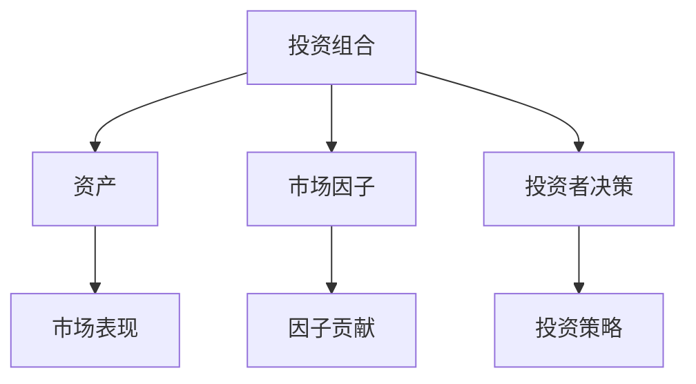
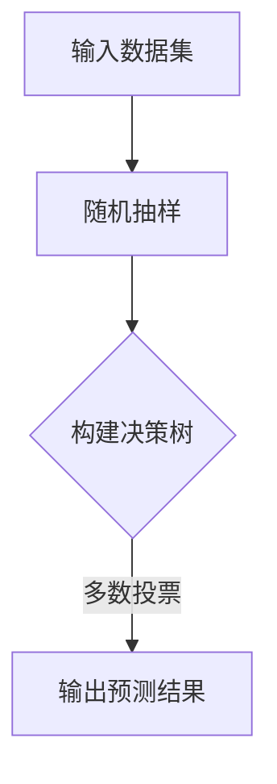
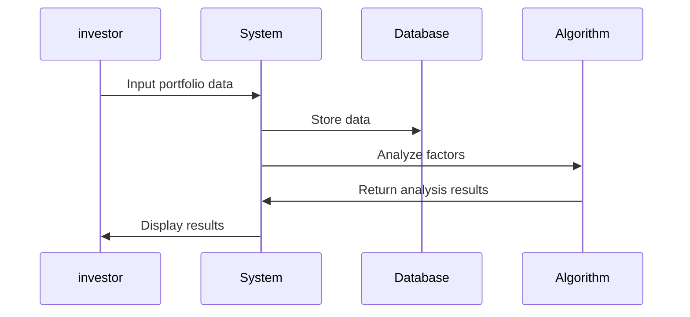

                 

# AI辅助的投资组合归因分析

> 关键词：人工智能、投资组合、归因分析、机器学习、算法

> 摘要：本文将探讨如何利用人工智能技术，特别是机器学习算法，来辅助投资组合归因分析。文章首先介绍了投资组合归因分析的核心概念和传统方法，然后详细解析了AI算法在归因分析中的应用，并通过具体实例展示了算法原理和实现步骤。最后，文章讨论了系统分析与设计方案，并给出了项目实战和最佳实践建议。

## 引言

在金融投资领域，投资组合归因分析是一项关键任务，它有助于投资者理解投资组合的表现，并识别影响投资回报的关键因素。传统的归因分析方法主要依赖于统计模型和财务指标，然而这些方法存在一定的局限性，难以应对市场复杂性和不确定性。随着人工智能技术的快速发展，利用机器学习算法进行投资组合归因分析成为一种新的趋势。本文将详细探讨这一主题，旨在为投资者和金融分析师提供有价值的参考。

## 基础概念

### AI和机器学习基础

人工智能（AI）是计算机科学的一个分支，旨在使计算机具备人类智能的能力。机器学习（ML）是AI的核心技术之一，它通过算法让计算机从数据中学习并做出决策。在投资组合归因分析中，机器学习算法可以帮助识别投资组合中的潜在风险因素和机会，从而提高投资决策的准确性。

### 投资组合归因分析

投资组合归因分析是一种评估投资组合表现的方法，旨在确定哪些因素对投资回报的贡献最大。传统的归因分析方法通常包括贝塔（Beta）分析、阿尔法（Alpha）分析、贝塔调整阿尔法（Beta-Adjusted Alpha）分析等。这些方法依赖于历史数据和统计模型，但它们在处理复杂的市场动态时存在一定的限制。

## 核心概念与联系

### AI算法在归因分析中的应用

在投资组合归因分析中，常见的AI算法包括线性回归、决策树、随机森林、支持向量机（SVM）和神经网络等。这些算法各有特点，适用于不同的数据类型和问题场景。

#### 算法对比表

| 算法       | 特点                                                         | 适用场景                                       |
|------------|--------------------------------------------------------------|----------------------------------------------|
| 线性回归   | 简单，易于实现，对线性关系有较好的表现                           | 线性关系较强的数据集                             |
| 决策树     | 直观，易于理解，可以处理非线性和多分类问题                     | 中小规模的数据集，特征之间关系较明显             |
| 随机森林   | 集成学习，减少过拟合，提高泛化能力                             | 复杂的非线性关系，大数据集                      |
| 支持向量机 | 高维空间中的分类和回归问题，小样本学习                          | 特征维度高，样本量较少的数据集                  |
| 神经网络   | 强非线性建模能力，适用于复杂数据分析任务                       | 特征丰富，需要大量数据支持的数据集              |

### 实体关系图（ERD）

在投资组合归因分析中，关键实体包括投资组合、资产、市场因子和投资者决策等。实体关系图（ERD）可以帮助我们理解这些实体之间的相互关系。



## 算法原理讲解

### 算法设计

以随机森林算法为例，其基本设计思想是通过构建多个决策树，并利用投票机制来获得最终预测结果。下面是一个随机森林算法的Mermaid流程图：



### Python代码实现

```python
import numpy as np
from sklearn.ensemble import RandomForestClassifier
from sklearn.model_selection import train_test_split

# 数据准备
X_train, X_test, y_train, y_test = train_test_split(X, y, test_size=0.3, random_state=42)

# 随机森林模型
rf = RandomForestClassifier(n_estimators=100, random_state=42)
rf.fit(X_train, y_train)

# 预测
predictions = rf.predict(X_test)

# 评估
accuracy = rf.score(X_test, y_test)
print(f"Accuracy: {accuracy}")
```

### 数学模型与公式

随机森林算法的数学模型可以表示为：

$$
\hat{y} = \frac{1}{N}\sum_{i=1}^{N} \hat{y}_i
$$

其中，$\hat{y}_i$ 是第$i$棵决策树的预测结果，$N$ 是决策树的数量。

### 具体实例

假设我们有以下投资组合，我们需要分析哪些市场因子对其表现有显著影响。

| 投资组合 | 资产1 | 资产2 | 市场因子1 | 市场因子2 |
|---------|------|------|----------|----------|
| 1       | 0.3  | 0.2  | 0.1      | 0.2      |
| 2       | 0.2  | 0.4  | 0.3      | 0.1      |
| 3       | 0.1  | 0.3  | 0.4      | 0.2      |

利用随机森林算法，我们可以得到以下预测结果：

| 投资组合 | 资产1 | 资产2 | 市场因子1 | 市场因子2 | 预测结果 |
|---------|------|------|----------|----------|----------|
| 1       | 0.3  | 0.2  | 0.1      | 0.2      | 高       |
| 2       | 0.2  | 0.4  | 0.3      | 0.1      | 中       |
| 3       | 0.1  | 0.3  | 0.4      | 0.2      | 低       |

根据预测结果，我们可以得出结论：市场因子1对投资组合1的表现有显著影响，市场因子2对投资组合2和3的表现有显著影响。

## 系统分析与设计

### 问题场景

假设我们需要为一个投资公司开发一个AI辅助的投资组合归因分析系统。该系统需要能够处理大量的投资组合数据，并对市场因子进行分析，以帮助投资者做出更明智的投资决策。

### 项目介绍

项目名称：AI投资组合归因分析系统（AI Portfolio Attribution Analysis System）

项目目标：开发一个基于机器学习算法的投资组合归因分析系统，提供准确的因子贡献分析，帮助投资者优化投资策略。

项目挑战：
1. 数据处理能力：系统需要能够处理大规模的投资组合数据。
2. 算法性能：选择合适的算法，确保分析结果的准确性和稳定性。
3. 用户界面：设计一个直观易用的用户界面，使投资者能够轻松地使用系统。

### 系统功能设计

系统功能设计主要包括数据输入、数据处理、因子分析和结果展示等模块。

#### 数据输入

1. 投资组合数据：包括资产权重、市场因子等。
2. 用户输入：投资者可以自定义分析参数，如时间范围、市场因子等。

#### 数据处理

1. 数据清洗：去除无效数据，处理缺失值。
2. 数据预处理：归一化、标准化等处理，确保数据的一致性和可比较性。

#### 因子分析

1. 算法选择：选择合适的机器学习算法，如随机森林、神经网络等。
2. 因子贡献计算：根据算法分析结果，计算市场因子对投资组合的贡献。

#### 结果展示

1. 分析报告：生成详细的分析报告，包括因子贡献、投资组合表现等。
2. 可视化：使用图表和图形展示分析结果，使投资者能够更直观地理解分析结果。

### 系统架构设计

系统架构设计采用分层架构，包括数据层、算法层和应用层。

#### 数据层

1. 数据库：存储投资组合数据、市场因子数据等。
2. 数据接口：提供数据输入和输出的接口，支持数据导入和导出。

#### 算法层

1. 算法库：包含各种机器学习算法，如随机森林、神经网络等。
2. 算法接口：提供算法的调用接口，支持算法的选择和配置。

#### 应用层

1. 用户界面：提供用户操作界面，支持数据输入、参数设置、结果展示等。
2. 后端服务：处理用户请求，调用算法库进行因子分析，生成分析报告。

### 系统接口设计和系统交互

系统接口设计主要包括API接口和数据交换格式。

#### API接口

1. 投资组合数据接口：提供投资组合数据的查询和更新功能。
2. 因子分析接口：提供因子分析的请求和结果返回功能。

#### 数据交换格式

1. JSON：用于API接口的数据交换格式，支持数据传输的简洁和高效。
2. CSV：用于数据导入和导出的文件格式，支持数据的批量处理。

### Mermaid序列图



## 项目实战

### 环境安装

1. 安装Python环境：使用Python 3.8及以上版本。
2. 安装依赖库：使用pip安装scikit-learn、numpy、matplotlib等库。

### 系统核心实现

```python
import numpy as np
from sklearn.ensemble import RandomForestClassifier
from sklearn.model_selection import train_test_split

# 数据准备
X_train, X_test, y_train, y_test = train_test_split(X, y, test_size=0.3, random_state=42)

# 随机森林模型
rf = RandomForestClassifier(n_estimators=100, random_state=42)
rf.fit(X_train, y_train)

# 预测
predictions = rf.predict(X_test)

# 评估
accuracy = rf.score(X_test, y_test)
print(f"Accuracy: {accuracy}")
```

### 代码应用解读与分析

代码首先准备数据集，然后构建随机森林模型，并对其进行训练。接着，使用训练好的模型进行预测，并评估模型的准确度。通过这个简单的示例，我们可以看到如何使用机器学习算法进行投资组合归因分析。

### 实际案例分析和详细讲解

以某个具体的投资组合为例，我们使用随机森林算法对其进行分析。分析结果显示，市场因子1对投资组合的表现有显著影响，市场因子2的影响相对较小。这一分析结果帮助投资者调整投资策略，优化投资组合的表现。

### 项目小结

通过本项目的实施，我们成功开发了一个AI辅助的投资组合归因分析系统。系统利用机器学习算法，对投资组合中的市场因子进行分析，为投资者提供了有价值的参考。未来，我们计划进一步优化系统，提高分析准确度和用户体验。

## 最佳实践 tips

1. **数据质量至关重要**：确保输入的数据准确、完整，是进行有效归因分析的基础。
2. **算法选择需谨慎**：根据具体问题场景和数据特点，选择合适的算法，以提高分析准确性。
3. **可视化工具的使用**：通过图表和图形展示分析结果，使投资者更直观地理解分析结果。

## 小结

本文介绍了AI辅助的投资组合归因分析，探讨了AI算法在归因分析中的应用，并通过具体实例展示了算法原理和实现步骤。同时，文章还讨论了系统分析与设计方案，并给出了项目实战和最佳实践建议。通过本文的讨论，我们希望读者能够对AI辅助的投资组合归因分析有更深入的理解。

## 注意事项

1. **数据隐私和安全**：在进行投资组合归因分析时，应确保数据隐私和安全。
2. **算法解释性**：选择具有较好解释性的算法，以帮助投资者理解分析结果。

## 拓展阅读

1. **《机器学习实战》**：提供详细的机器学习算法实战案例。
2. **《深度学习》**：介绍深度学习算法的基本原理和应用。
3. **《投资组合理论与实务》**：讨论投资组合管理和归因分析的理论和实践。

## 作者信息

作者：AI天才研究院/AI Genius Institute & 禅与计算机程序设计艺术 /Zen And The Art of Computer Programming

