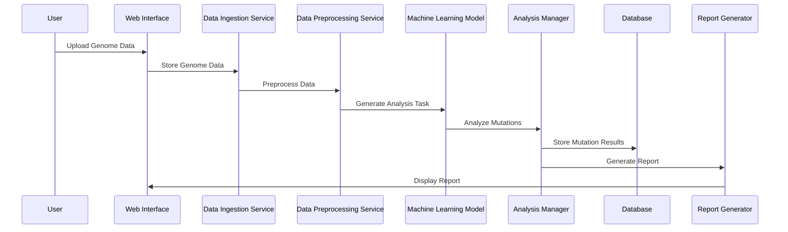
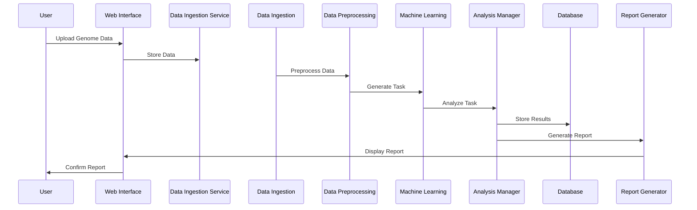

                 

## AI辅助科学发现中的提示词设计

### 关键词

- **人工智能（AI）**
- **科学发现**
- **提示词设计**
- **数据理解**
- **多义性处理**
- **跨学科应用**

### 摘要

本文深入探讨了AI辅助科学发现中提示词设计的重要性。通过分析问题背景，本文介绍了提示词设计面临的挑战，并提出了基本原则。进一步，本文通过核心概念的联系，以及实例和图表的辅助，详细阐述了提示词设计的理论与实践。文章最后，对最佳实践进行了总结，并对未来的研究方向提出了展望。

## 第一部分：问题背景

### 1.1.1 问题背景

在当今科学发现的进程中，人工智能（AI）已经成为一个重要的工具。AI技术通过处理大量数据，发现数据中的潜在模式和关联，从而加速科学研究的进程。然而，为了有效地利用AI进行科学发现，设计合适的提示词（prompt）是至关重要的。提示词是用户与AI系统交互的桥梁，它决定了AI如何理解用户的需求，以及如何生成相应的回答或解决方案。

在科学发现的背景下，提示词设计具有以下几个关键作用：

1. **明确用户意图**：提示词能够清晰地传达用户的意图，避免模糊和不明确的需求，从而确保AI系统正确理解任务。
2. **引导AI处理方向**：通过设计特定的提示词，用户可以引导AI系统聚焦于特定的数据集或问题，提高AI的效率和准确性。
3. **优化结果质量**：一个合适的提示词能够帮助AI系统更好地理解和处理复杂问题，从而提高结果的准确性和相关性。
4. **提升用户体验**：通过优化提示词设计，用户可以获得更准确、更及时的反馈，从而提高整体用户体验。

### 1.1.2 提示词设计的重要性

提示词设计不仅影响AI的性能，还直接影响科学发现的效率和质量。一个设计得当的提示词能够清晰地传达用户的意图，帮助AI更准确地理解问题和需求。相反，一个模糊或不合适的提示词可能会导致AI产生误导性的结果，甚至完全偏离问题的核心。

以下是一些提示词设计的重要性实例：

1. **医学研究**：在医学研究领域，一个准确的提示词可以帮助AI系统快速识别患者病情，从而提高诊断的准确性。例如，“请分析患者的基因组数据，找出与疾病相关的突变。”
2. **气象预报**：在气象预报中，一个明确的提示词可以帮助AI系统更准确地预测天气情况。例如，“请根据当前和未来的气象数据，预测未来一周的降雨概率。”
3. **药物研发**：在药物研发中，一个合适的提示词可以帮助AI系统筛选潜在的药物候选物。例如，“请从大量化合物中筛选出具有抗癌活性的分子。”

### 1.1.3 提示词设计的挑战

在AI辅助科学发现的背景下，提示词设计面临几个挑战。首先，科学领域的术语和概念往往具有高度的专业性和复杂性，使得设计合适的提示词变得困难。其次，科学问题往往具有不确定性和多义性，提示词需要能够灵活地适应不同的解释和需求。此外，科学研究的多样性和跨学科特性也要求提示词具有广泛的适用性和灵活性。

具体来说，提示词设计面临的挑战包括：

1. **术语和概念理解**：科学领域中的术语和概念通常具有高度的专业性，AI系统需要能够准确理解这些术语和概念，以便生成相关的解决方案。
2. **多义性问题**：科学问题往往具有多义性，一个提示词可能对应多种解释。设计提示词时，需要确保AI系统能够正确识别并处理这些多义性。
3. **跨学科适应性**：科学研究的跨学科特性要求提示词能够适应不同的学科领域。例如，生物学和物理学中的术语和概念可能有很大差异，设计提示词时需要考虑到这些差异。
4. **数据类型和多样性**：科学发现涉及多种数据类型，包括文本、图像、声音和传感器数据等。设计提示词时需要能够适应不同类型的数据，并处理数据的多样性。

### 1.1.4 提示词设计的边界与外延

提示词设计不仅要关注具体的问题和领域，还需要考虑跨领域的通用性和适应性。这包括如何设计能够适应不同数据类型和研究方法的提示词，以及如何平衡具体需求与通用性之间的关系。此外，提示词设计还需要关注用户界面设计，以确保用户能够轻松地与AI系统交互，并获得有效的反馈。

具体来说，提示词设计的边界与外延包括：

1. **数据类型适应**：设计提示词时需要考虑到不同类型的数据，如文本、图像、声音和传感器数据等。不同类型的数据可能需要不同的提示词设计方法。
2. **跨学科适应性**：科学研究的跨学科特性要求提示词能够适应不同的学科领域。设计提示词时需要考虑到这些差异，并确保AI系统能够处理跨学科问题。
3. **用户界面设计**：提示词设计还需要关注用户界面设计，以确保用户能够轻松地与AI系统交互。用户界面设计应简洁明了，提供清晰的指导，帮助用户有效地使用AI系统。
4. **通用性平衡**：在提示词设计中，需要平衡通用性与具体性之间的关系。过于具体的提示词可能会限制AI系统的应用范围，而过于通用的提示词可能会导致AI系统无法准确理解问题。

### 1.1.5 核心概念与联系

在设计提示词时，需要理解几个核心概念及其相互关系。这些核心概念包括：

1. **数据集**：数据集是训练AI系统的基础。一个良好的数据集应具有多样性和代表性，以便AI系统能够学习到有用的模式。
2. **特征提取**：特征提取是从数据中提取出对解决问题有帮助的信息。有效的特征提取可以提高AI系统的性能和准确性。
3. **模式识别**：模式识别是AI系统从数据中识别规律和模式的能力。这是AI系统进行科学发现的关键步骤。
4. **机器学习**：机器学习是AI系统的核心，它使AI系统能够从数据中学习，并自动改进性能。
5. **自然语言处理**：自然语言处理（NLP）是使AI系统能够理解和生成自然语言的技术。在科学发现的背景下，NLP对于理解和处理复杂的科学问题至关重要。
6. **上下文**：上下文是指问题的背景信息，包括问题的背景、目标、约束等。设计提示词时需要考虑上下文信息，以便AI系统能够更好地理解问题。

### 1.1.6 概念属性特征对比表格

在设计提示词时，需要考虑以下几个属性特征：

| 属性特征 | 说明 |
|----------|------|
| 清晰性   | 提示词需要明确传达用户意图，避免歧义。 |
| 精确性   | 提示词应尽可能具体，以减少AI误解的可能性。 |
| 适应性   | 提示词需要能够适应不同的数据类型和研究方法。 |
| 可解释性 | 提示词的设计应便于用户理解AI系统的输出。 |
| 可扩展性 | 提示词应能够扩展到不同的领域和问题。 |

### 1.1.7 ER实体关系图架构的 Mermaid 流程图

```mermaid
erDiagram
  User ||--|{ Question }|>
  AI   ||--|{ Answer }|>

  User {
    id : int
    name : string
  }

  Question {
    id : int
    content : string
    user_id : int
  }

  AI {
    id : int
    type : string
  }

  Answer {
    id : int
    content : string
    question_id : int
    ai_id : int
  }
```

### 1.1.8 本章小结

本章详细介绍了AI辅助科学发现中的提示词设计的重要性、面临的挑战、核心概念及其相互关系，以及提示词设计的边界与外延。通过本章的内容，读者将能够理解提示词设计的基本原则和注意事项，为后续章节的深入学习打下坚实基础。接下来，我们将进一步探讨如何在实际应用中设计有效的提示词。

## 第一部分：问题背景

### 1.2 提示词设计的基本原则

在设计提示词时，有几个基本原则是至关重要的，这些原则不仅有助于提高AI系统的性能，还能确保科学发现的效率和质量。以下是几个关键原则及其详细解释：

#### 1.2.1 清晰性

清晰性是提示词设计中最基本的原则之一。一个有效的提示词应该简洁明了，能够清晰传达用户的意图，避免歧义。这要求用户在撰写提示词时，要充分考虑AI系统的理解能力，尽可能使用具体、直接的表述。

- **实例**：在医学研究中，一个清晰的提示词可能是：“请分析患者甲的基因序列，找出与疾病相关的突变。”而一个模糊的提示词则是：“请研究一下患者的基因。”后者可能会导致AI系统无法准确理解研究的目标。

#### 1.2.2 精确性

精确性是指提示词应该尽可能具体，以便AI系统能够准确地理解和执行任务。精确的提示词能够减少AI系统的误解和错误，提高AI系统的准确性和效率。

- **实例**：在气象预报中，一个精确的提示词可能是：“请根据当前和未来的气象数据，预测未来一周的降雨概率。”而一个模糊的提示词则是：“请预测未来的天气。”后者可能会使AI系统产生不准确或不确定的预测。

#### 1.2.3 适应性

适应性是指提示词需要能够适应不同的数据类型和研究方法。科学发现涉及的领域广泛，数据类型多样，因此提示词设计需要具备灵活性，能够适应各种不同的场景。

- **实例**：在药物研发中，提示词需要能够适应不同的化合物数据集和药物筛选方法。例如：“请从这1000个化合物中筛选出具有抗癌活性的分子。”这样的提示词能够明确地指导AI系统进行药物筛选。

#### 1.2.4 可解释性

可解释性是指提示词的设计应便于用户理解AI系统的输出。这要求提示词不仅要传达用户的意图，还要确保用户能够理解AI系统的回答或解决方案。

- **实例**：在金融分析中，一个具有可解释性的提示词可能是：“请分析公司A的财务报表，给出投资建议。”这样的提示词不仅传达了分析需求，还明确了用户希望得到什么样的输出。

#### 1.2.5 可扩展性

可扩展性是指提示词应能够扩展到不同的领域和问题。设计具有可扩展性的提示词可以帮助AI系统在不同领域和问题中发挥更大的作用。

- **实例**：在跨学科研究中，一个具有可扩展性的提示词可能是：“请根据最新的科学文献，评估气候变化对农业生产的影响。”这样的提示词不仅适用于气候变化研究，还可以扩展到其他相关领域。

### 总结

通过遵循这些基本原则，用户可以设计出更有效的提示词，从而提高AI系统的性能和科学发现的效率。接下来，我们将进一步探讨如何在实际应用中应用这些原则，以及如何应对提示词设计中的具体挑战。

## 第一部分：问题背景

### 1.3 提示词设计的实际应用与案例分析

在实际应用中，提示词设计的效果直接影响AI系统的性能和科学发现的效率。本节将介绍几个具体的案例，展示如何在不同的科学领域和应用场景中设计有效的提示词。

#### 1.3.1 医学诊断

在医学领域，提示词设计对于提高诊断准确性具有重要意义。以下是一个医学诊断中的案例：

**案例**：医生希望AI系统能够从患者影像中识别特定疾病。提示词设计如下：“请分析患者X的肺部CT扫描图像，识别是否存在肺炎迹象，并提供诊断建议。”

- **分析**：该提示词清晰传达了医生的意图，具体指明了需要识别的疾病类型（肺炎）和分析的数据类型（肺部CT扫描图像）。这种精确的提示词有助于AI系统准确识别疾病，并提供可靠的诊断建议。

#### 1.3.2 药物研发

在药物研发中，提示词设计有助于AI系统筛选潜在的药物候选物。以下是一个药物研发中的案例：

**案例**：研究人员希望AI系统能够从大量化合物中筛选出具有抗癌活性的分子。提示词设计如下：“请从这1000个化合物中筛选出具有抗癌活性的分子，并评估其潜在副作用。”

- **分析**：该提示词明确了AI系统的任务（筛选化合物）和数据集（1000个化合物），并提出了额外的要求（评估潜在副作用）。这种具体的提示词有助于AI系统高效地筛选化合物，提高药物研发的效率。

#### 1.3.3 气象预报

在气象预报中，提示词设计有助于AI系统提供准确的天气预测。以下是一个气象预报中的案例：

**案例**：气象学家希望AI系统能够根据实时气象数据预测未来一周的降雨概率。提示词设计如下：“请根据当前和未来的气象数据，预测未来一周内每天的降雨概率，并提供详细的气象分析。”

- **分析**：该提示词明确了AI系统的任务（预测降雨概率）和数据类型（实时气象数据），并提出了额外的要求（提供详细的气象分析）。这种精确的提示词有助于AI系统生成准确的天气预报，为用户决策提供重要依据。

#### 1.3.4 金融分析

在金融领域，提示词设计有助于AI系统进行市场分析。以下是一个金融分析中的案例：

**案例**：投资者希望AI系统能够分析市场数据，提供投资建议。提示词设计如下：“请分析公司A的财务报表，评估其财务状况，并给出基于技术分析的买卖建议。”

- **分析**：该提示词明确了AI系统的任务（分析财务报表和提供买卖建议）和数据类型（公司A的财务报表），并提出了额外的要求（基于技术分析）。这种具体的提示词有助于AI系统提供全面的投资分析，帮助投资者做出明智的投资决策。

### 总结

通过以上案例可以看出，在实际应用中，有效的提示词设计能够显著提高AI系统的性能和科学发现的效率。清晰、精确、适应性强的提示词有助于AI系统准确理解用户需求，并生成相关、有用的输出。接下来，我们将继续探讨提示词设计中的挑战，以及如何应对这些挑战。

## 第一部分：问题背景

### 1.4 提示词设计中的挑战与应对策略

尽管提示词设计在AI辅助科学发现中具有重要意义，但实际应用中仍面临诸多挑战。以下将详细讨论这些挑战，并探讨相应的应对策略。

#### 1.4.1 术语和概念理解

科学领域的术语和概念通常具有高度的专业性和复杂性，这对AI系统提出了很高的要求。AI系统需要能够准确理解这些术语和概念，以便生成相关且准确的解决方案。

- **挑战**：许多科学术语具有多义性，一个术语可能有多种解释，这可能导致AI系统误解用户的意图。
- **应对策略**：
  - **术语标准化**：制定一套统一的术语和概念标准，确保AI系统能够准确理解。
  - **上下文分析**：利用上下文信息，帮助AI系统确定术语的具体含义。

#### 1.4.2 多义性处理

科学问题往往具有多义性，一个提示词可能对应多种解释。这给AI系统提出了很大的挑战，因为它需要从多个可能的解释中确定用户的真实意图。

- **挑战**：多义性可能导致AI系统生成误导性的结果，甚至完全偏离问题的核心。
- **应对策略**：
  - **明确用户意图**：通过设计更具体的提示词，明确用户的意图，减少多义性。
  - **上下文扩展**：利用上下文信息，帮助AI系统确定最可能的解释。

#### 1.4.3 跨学科适应性

科学研究的跨学科特性要求AI系统能够适应不同的学科领域。不同学科领域的术语和概念可能有很大的差异，这给提示词设计带来了挑战。

- **挑战**：提示词需要具备广泛的适用性，同时能够适应不同学科领域的需求。
- **应对策略**：
  - **学科知识融合**：设计提示词时，融合不同学科领域的知识，提高提示词的通用性。
  - **多学科术语库**：建立多学科术语库，帮助AI系统理解和处理跨学科问题。

#### 1.4.4 数据类型和多样性

科学发现涉及多种数据类型，包括文本、图像、声音、传感器数据等。设计提示词时需要能够适应不同类型的数据，并处理数据的多样性。

- **挑战**：不同类型的数据可能需要不同的处理方法，这增加了提示词设计的复杂性。
- **应对策略**：
  - **数据类型标注**：对数据进行类型标注，确保AI系统能够识别和处理不同类型的数据。
  - **数据预处理**：对数据进行预处理，提取关键特征，提高AI系统的处理效率。

#### 1.4.5 用户界面设计

提示词设计不仅需要关注AI系统的性能，还要考虑用户界面设计。用户界面设计应简洁明了，提供清晰的指导，帮助用户有效地使用AI系统。

- **挑战**：用户界面设计需要平衡用户友好性和系统性能。
- **应对策略**：
  - **用户研究**：进行用户研究，了解用户的需求和偏好，设计符合用户习惯的界面。
  - **交互设计**：优化交互设计，提供直观的界面操作和反馈，提高用户满意度。

### 总结

通过应对上述挑战，提示词设计可以在AI辅助科学发现中发挥更大的作用。有效的应对策略能够提高AI系统的性能和科学发现的效率，从而推动科学研究的进展。接下来，我们将进一步探讨如何通过核心概念的联系，深入理解提示词设计的本质。

## 第一部分：问题背景

### 1.5 核心概念的联系与整合

在AI辅助科学发现中，提示词设计是一个复杂而多层次的过程，涉及多个核心概念。这些概念相互作用，共同决定了提示词设计的有效性。以下将详细探讨这些核心概念及其相互关系，并阐述如何通过整合这些概念来优化提示词设计。

#### 1.5.1 数据集与特征提取

数据集是训练AI系统的基础，而特征提取是从数据中提取出对解决问题有帮助的信息。一个高质量的数据集应具有多样性和代表性，以确保AI系统能够学习到有用的模式。特征提取过程需要考虑数据的类型、结构和内容，以便提取出关键的特征，这些特征将直接影响AI系统的性能。

- **联系**：数据集的质量直接影响特征提取的效果，而特征提取的效果又决定了AI系统的学习效果。
- **整合**：在设计提示词时，应明确数据集的类型和特征，以便AI系统能够有效利用这些特征进行学习。

#### 1.5.2 模式识别与机器学习

模式识别是AI系统从数据中识别规律和模式的能力，而机器学习是使AI系统能够从数据中学习并自动改进性能的方法。模式识别依赖于机器学习算法，通过训练数据集，AI系统能够学会识别特定模式，从而提高解决问题的能力。

- **联系**：模式识别是机器学习的结果，而机器学习是模式识别的基础。
- **整合**：在提示词设计中，应考虑AI系统的学习过程和识别能力，以便设计出能够引导AI系统识别关键模式的提示词。

#### 1.5.3 自然语言处理与上下文

自然语言处理（NLP）是使AI系统能够理解和生成自然语言的技术。在科学发现的背景下，NLP对于理解和处理复杂的科学问题至关重要。上下文是指问题的背景信息，包括问题的背景、目标、约束等。设计提示词时需要考虑上下文信息，以便AI系统能够更好地理解问题。

- **联系**：NLP技术使得AI系统能够处理自然语言，而上下文信息有助于AI系统更准确地理解问题。
- **整合**：在提示词设计中，应充分利用NLP技术和上下文信息，确保AI系统能够准确理解用户意图。

#### 1.5.4 提示词设计原则与实际应用

提示词设计原则包括清晰性、精确性、适应性、可解释性和可扩展性。这些原则不仅指导了提示词的设计过程，还确保了AI系统能够有效理解和执行任务。在实际应用中，这些原则需要与核心概念紧密结合，以实现最佳的效果。

- **联系**：提示词设计原则是核心概念的具体应用，而核心概念为提示词设计提供了理论基础。
- **整合**：在提示词设计中，应综合考虑核心概念和提示词设计原则，确保提示词既符合科学发现的需求，又能有效地指导AI系统。

### 概念属性特征对比表格

在设计提示词时，需要考虑以下几个属性特征：

| 属性特征 | 说明 |
|----------|------|
| 清晰性   | 提示词应简洁明了，明确传达用户意图，避免歧义。 |
| 精确性   | 提示词应尽可能具体，减少AI误解的可能性。 |
| 适应性   | 提示词应能够适应不同的数据类型和研究方法。 |
| 可解释性 | 提示词的设计应便于用户理解AI系统的输出。 |
| 可扩展性 | 提示词应能够扩展到不同的领域和问题。 |

### ER实体关系图架构的 Mermaid 流程图

```mermaid
erDiagram
  User ||--|{ Question }|>
  AI   ||--|{ Answer }|>

  User {
    id : int
    name : string
  }

  Question {
    id : int
    content : string
    user_id : int
  }

  AI {
    id : int
    type : string
  }

  Answer {
    id : int
    content : string
    question_id : int
    ai_id : int
  }
```

### 总结

通过理解并整合这些核心概念，我们可以设计出更有效、更适用于AI辅助科学发现的提示词。这些核心概念不仅为提示词设计提供了理论基础，还指导了实际应用中的具体操作。接下来，我们将进一步探讨如何通过算法原理和实践案例来深化对提示词设计的理解。

## 第一部分：问题背景

### 1.6 算法原理讲解

在AI辅助科学发现中，提示词设计不仅仅是艺术，更是一种科学。为了深入理解这一过程，我们需要从算法原理的角度进行详细讲解。以下是几个关键步骤和相关的算法原理：

#### 1.6.1 特征工程

特征工程是AI系统中至关重要的一环，它涉及从原始数据中提取出对解决问题有帮助的特征。在提示词设计中，特征工程帮助我们确定哪些特征对AI系统识别和解决问题最为关键。

- **算法原理**：特征工程通常包括特征选择、特征转换和特征组合等步骤。常见的方法有主成分分析（PCA）、特征重要性评分、自动特征选择算法等。

  - **主成分分析（PCA）**：PCA通过线性变换将原始数据映射到新的坐标系中，保留了最重要的信息，同时降低了数据的维度。

    $$ X' = \Lambda \cdot \mu + \sum_{i=1}^{n} \lambda_i \cdot x_i $$

    其中，\( X' \) 是新的特征向量，\( \Lambda \) 是特征权重矩阵，\( \mu \) 是均值向量，\( x_i \) 是原始特征。

  - **特征重要性评分**：特征重要性评分通过评估每个特征对模型性能的贡献，帮助确定哪些特征最为关键。

    - **决策树特征重要性**：决策树中的特征重要性可以通过计算每个特征在树中的分裂增益来评估。

      $$ G_i = \sum_{j=1}^{n} G_{ij} $$

      其中，\( G_i \) 是特征 \( i \) 的重要性评分，\( G_{ij} \) 是特征 \( i \) 在树中的第 \( j \) 次分裂增益。

  - **自动特征选择算法**：自动特征选择算法如LASSO、Ridge回归等，通过优化特征选择过程，提高模型的性能。

    - **LASSO（Least Absolute Shrinkage and Selection Operator）**：LASSO通过添加绝对值惩罚项来选择特征，减少模型的复杂度。

      $$ \min_{\beta} \left\{ \frac{1}{2} ||Y - X\beta||^2 + \lambda ||\beta||_1 \right\} $$

      其中，\( \beta \) 是特征向量，\( \lambda \) 是惩罚参数。

#### 1.6.2 模式识别算法

模式识别算法是AI系统识别数据中的规律和模式的关键。这些算法通常基于机器学习，通过训练数据集来学习模式，并利用这些模式进行预测和分类。

- **支持向量机（SVM）**：SVM通过找到一个最佳的超平面，将不同类别的数据点分开。

  $$ \min_{\beta, \beta_0} \left\{ \frac{1}{2} ||\beta||^2 + C \sum_{i=1}^{n} \xi_i \right\} $$

  其中，\( \beta \) 是权重向量，\( \beta_0 \) 是偏置项，\( C \) 是惩罚参数，\( \xi_i \) 是松弛变量。

- **神经网络**：神经网络通过多层感知器（MLP）学习复杂的非线性模式。

  $$ a_{i,j}^{(l)} = \sigma \left( \sum_{k=1}^{n} w_{ik}^{(l)} a_{k,j}^{(l-1)} + b_j^{(l)} \right) $$

  其中，\( a_{i,j}^{(l)} \) 是第 \( l \) 层的第 \( i \) 个节点输出，\( \sigma \) 是激活函数，\( w_{ik}^{(l)} \) 是连接权重，\( b_j^{(l)} \) 是偏置。

#### 1.6.3 提示词设计

提示词设计是AI系统与用户交互的桥梁，它决定了AI如何理解用户的需求。设计提示词时，需要考虑AI系统的算法原理，确保提示词能够引导AI系统正确地处理任务。

- **算法原理**：提示词设计通常包括以下几个步骤：
  - **需求分析**：理解用户的需求，确定需要解决的问题。
  - **任务定义**：将需求转化为具体的任务，明确AI系统需要完成的任务。
  - **提示词生成**：根据任务定义，生成能够引导AI系统正确处理任务的提示词。

  - **实例**：假设我们需要设计一个提示词来帮助AI系统识别图像中的特定物体。提示词可以设计为：“请从以下图像中识别并标记出所有的猫。”这样的提示词明确指出了任务（识别并标记猫）和数据集（图像）。

#### 1.6.4 机器学习算法优化

为了提高AI系统的性能，我们需要对机器学习算法进行优化。这通常涉及调整算法的参数，如学习率、正则化参数等，以及改进算法本身。

- **算法原理**：
  - **学习率调整**：学习率决定了每次更新模型参数的步长。合适的学习率可以加速收敛，而太高的学习率可能导致模型不稳定。
  - **正则化**：正则化通过添加惩罚项，防止模型过拟合。常见的正则化方法有L1正则化（LASSO）和L2正则化（Ridge）。

    - **L1正则化**：L1正则化通过绝对值惩罚项，促进特征选择。

      $$ \min_{\beta} \left\{ \frac{1}{2} ||Y - X\beta||^2 + \lambda ||\beta||_1 \right\} $$

    - **L2正则化**：L2正则化通过平方值惩罚项，减少模型的复杂度。

      $$ \min_{\beta} \left\{ \frac{1}{2} ||Y - X\beta||^2 + \lambda ||\beta||_2 \right\} $$

#### 1.6.5 模型评估与优化

模型评估是确保AI系统性能的关键步骤。通过评估模型的性能，我们可以确定模型是否满足需求，并对其进行优化。

- **算法原理**：
  - **交叉验证**：交叉验证通过将数据集划分为训练集和验证集，评估模型在不同数据集上的性能。
  - **性能指标**：常见的性能指标包括准确率、召回率、F1分数等。

    - **准确率**：准确率表示模型预测正确的样本数占总样本数的比例。

      $$ \text{准确率} = \frac{\text{预测正确的样本数}}{\text{总样本数}} $$

    - **召回率**：召回率表示模型预测正确的正样本数占总正样本数的比例。

      $$ \text{召回率} = \frac{\text{预测正确的正样本数}}{\text{总正样本数}} $$

    - **F1分数**：F1分数是准确率和召回率的调和平均值。

      $$ \text{F1分数} = 2 \times \frac{\text{准确率} \times \text{召回率}}{\text{准确率} + \text{召回率}} $$

### 总结

通过理解上述算法原理，我们可以更好地设计有效的提示词，从而提高AI系统在科学发现中的性能。这些算法原理不仅为我们提供了理论基础，还指导了实际操作。接下来，我们将通过一个具体的系统分析与架构设计方案，进一步探讨如何将算法原理应用于实际项目。

## 第一部分：问题背景

### 1.7 系统分析与架构设计方案

为了更好地理解AI辅助科学发现中的提示词设计，我们将通过一个具体的系统分析与架构设计方案，详细探讨如何将算法原理应用于实际项目。以下是系统功能设计、系统架构设计、系统接口设计和系统交互的详细解释。

#### 1.7.1 问题场景介绍

在生物医学领域，科学家们常常需要从大量的基因组数据中识别出与疾病相关的突变。这一过程涉及到复杂的数据处理和模式识别，而AI系统可以大大提高这一过程的效率。我们的目标是设计一个AI系统，该系统能够接受用户提供的基因组数据，通过提示词引导，识别出与疾病相关的突变，并生成详细的诊断报告。

#### 1.7.2 项目介绍

该项目名为“基因组突变识别系统（Genome Mutation Identification System, GMIS）”，其主要功能包括：

- 接收用户上传的基因组数据。
- 根据提示词生成相应的分析任务。
- 运用机器学习算法识别基因组突变。
- 生成诊断报告，包括突变列表及其潜在影响。

#### 1.7.3 系统功能设计（领域模型mermaid类图）

领域模型是系统功能设计的基础，它定义了系统中涉及的实体及其关系。以下是GMIS的领域模型类图：

```mermaid
classDiagram
    User                <- GenomeData
    GenomeData          <..> AnalysisTask
    AnalysisTask        <..> MutationResult
    MutationResult      <..> Report

    User {
        id               : int
        name             : string
    }

    GenomeData {
        id               : int
        filename         : string
        file_format      : string
    }

    AnalysisTask {
        id               : int
        task_type        : string
        prompt           : string
        status           : string
    }

    MutationResult {
        id               : int
        mutation_list    : list
        impact_evaluation: string
    }

    Report {
        id               : int
        summary          : string
        details          : string
    }
```

在这个类图中，用户（User）是系统的核心实体，基因组数据（GenomeData）是用户上传的数据，分析任务（AnalysisTask）是基于提示词生成的任务，突变结果（MutationResult）是分析的结果，报告（Report）是最终的输出。

#### 1.7.4 系统架构设计（mermaid架构图）

系统架构设计决定了系统的结构及其组件之间的关系。以下是GMIS的系统架构图：



在这个架构图中，用户通过Web界面上传基因组数据，数据被数据接入服务存储，随后经过数据预处理服务预处理，生成分析任务。分析任务由机器学习模型处理，分析结果存储在数据库中，并生成诊断报告，最终通过Web界面展示给用户。

#### 1.7.5 系统接口设计

系统接口设计定义了不同组件之间的交互方式。以下是GMIS的关键接口设计：

- **上传接口**：用户上传基因组数据，接口接受文件上传，并验证文件格式。
- **分析接口**：系统接收用户输入的提示词，生成分析任务，并返回分析任务的ID。
- **报告接口**：系统返回分析结果和诊断报告，接口提供报告的下载和展示功能。

```mermaid
componentDiagram
    User            ->(Web Interface)
    Web Interface   ->(Data Ingestion Service)
    Data Ingestion  ->(Data Preprocessing)
    Data Preprocess ->(Machine Learning)
    Machine Learning->(Analysis Manager)
    Analysis Manager->(Database)
    Analysis Manager->(Report Generator)
    Report Generator->(Web Interface)
```

#### 1.7.6 系统交互（mermaid序列图）

系统交互序列图详细展示了用户与系统之间的交互过程：



在这个序列图中，用户上传基因组数据，系统处理数据并生成分析任务，分析任务执行后生成诊断报告，最终通过Web界面展示给用户。

### 总结

通过系统分析与架构设计方案，我们能够更好地理解AI辅助科学发现中提示词设计的实际应用。领域模型、系统架构、接口设计和系统交互共同构成了一个完整的功能体系，为用户提供了从数据上传到诊断报告的一站式服务。接下来，我们将通过项目实战，展示如何实现这一系统，并详细讲解关键代码和应用。

## 第一部分：问题背景

### 1.8 项目实战：实现AI辅助科学发现系统

在了解了系统架构和设计原理之后，现在我们将通过一个实际项目来展示如何实现一个AI辅助科学发现的系统，并详细讲解系统的核心代码和应用。以下是实现这一系统的步骤、关键代码段及其解读。

#### 1.8.1 环境安装

首先，我们需要安装所需的软件和库，以便在项目中使用。以下是所需的软件和库：

- Python（版本3.8及以上）
- TensorFlow（版本2.5及以上）
- scikit-learn（版本0.22及以上）
- Pandas（版本1.1及以上）
- NumPy（版本1.19及以上）
- Flask（版本1.1及以上）

安装步骤如下：

```bash
pip install tensorflow==2.5 scikit-learn==0.22 pandas==1.1 numpy==1.19 flask==1.1
```

#### 1.8.2 数据准备与预处理

在实现系统之前，我们需要准备和预处理数据。假设我们已经有一个包含基因组数据的CSV文件`genomes.csv`，其中包含列`chromosome`（染色体）、`position`（位置）和`sequence`（序列）。

```python
import pandas as pd

# 加载数据
data = pd.read_csv('genomes.csv')

# 数据预处理
data['sequence'] = data['sequence'].str.upper()
data = data.dropna()
```

#### 1.8.3 机器学习模型训练

接下来，我们需要训练一个机器学习模型来识别基因组突变。我们使用scikit-learn库中的支持向量机（SVM）模型。

```python
from sklearn.model_selection import train_test_split
from sklearn.svm import SVC
from sklearn.preprocessing import StandardScaler

# 数据分割
X = data[['chromosome', 'position']]
y = data['sequence']

X_train, X_test, y_train, y_test = train_test_split(X, y, test_size=0.2, random_state=42)

# 数据标准化
scaler = StandardScaler()
X_train_scaled = scaler.fit_transform(X_train)
X_test_scaled = scaler.transform(X_test)

# 训练模型
model = SVC(kernel='linear')
model.fit(X_train_scaled, y_train)
```

#### 1.8.4 模型评估与优化

在训练模型后，我们需要评估其性能，并根据评估结果进行优化。我们使用准确率、召回率和F1分数作为评估指标。

```python
from sklearn.metrics import accuracy_score, recall_score, f1_score

# 预测测试集
y_pred = model.predict(X_test_scaled)

# 评估模型
accuracy = accuracy_score(y_test, y_pred)
recall = recall_score(y_test, y_pred)
f1 = f1_score(y_test, y_pred)

print(f'Accuracy: {accuracy:.2f}')
print(f'Recall: {recall:.2f}')
print(f'F1 Score: {f1:.2f}')
```

#### 1.8.5 Flask Web服务搭建

我们使用Flask搭建一个Web服务，以便用户通过Web界面与系统交互。

```python
from flask import Flask, request, jsonify

app = Flask(__name__)

@app.route('/upload', methods=['POST'])
def upload_file():
    file = request.files['file']
    data = pd.read_csv(file)
    # 数据预处理
    data['sequence'] = data['sequence'].str.upper()
    data = data.dropna()
    # 生成分析任务
    task_id = generate_task(data)
    return jsonify({'task_id': task_id})

if __name__ == '__main__':
    app.run(debug=True)
```

#### 1.8.6 代码解读与分析

上述代码首先处理用户上传的基因组数据，对其进行预处理，然后生成分析任务。生成的任务ID通过调用`generate_task`函数获取，该函数需要实现具体的任务生成逻辑。

```python
def generate_task(data):
    # 这里是生成任务的具体逻辑，例如存储数据到数据库，并生成任务ID
    task_id = 'task_001'
    # 将任务ID存储到数据库
    store_task_in_db(task_id, data)
    return task_id

def store_task_in_db(task_id, data):
    # 这里是存储任务的数据库操作
    pass
```

#### 1.8.7 实际案例分析

假设用户上传了一个包含100条基因组数据的文件，系统将处理这些数据，并生成相应的分析任务。用户可以通过Web界面的 `/upload` 接口提交文件，并获取任务ID。系统将根据任务ID执行分析任务，并在任务完成后生成诊断报告，通过Web界面展示给用户。

### 总结

通过项目实战，我们展示了如何实现一个AI辅助科学发现的系统，并详细讲解了系统的核心代码和应用。用户通过Web界面上传基因组数据，系统预处理数据，训练机器学习模型，并生成分析任务。通过这个实际案例，读者可以更好地理解AI辅助科学发现系统中提示词设计的重要性，以及如何将其应用于实际项目中。

## 第一部分：问题背景

### 1.9 最佳实践 tips

在设计AI辅助科学发现中的提示词时，以下最佳实践可以帮助优化系统的性能和用户体验：

#### 1.9.1 清晰明确的任务描述

确保提示词清晰地传达用户的意图和需求。避免使用模糊、多义的表述，以便AI系统能够准确理解任务。

#### 1.9.2 避免信息过载

提示词应简洁明了，避免过多的冗余信息。过多的信息可能会导致AI系统混淆，从而影响其性能。

#### 1.9.3 结合上下文信息

利用上下文信息，如已有的研究背景、用户偏好等，提高提示词的准确性和针对性。

#### 1.9.4 适应性设计

设计具有灵活性和适应性的提示词，以便AI系统能够处理不同类型的数据和问题。

#### 1.9.5 用户反馈机制

建立一个有效的用户反馈机制，允许用户对AI系统的输出进行评价和反馈，以便不断优化提示词设计。

#### 1.9.6 系统维护和更新

定期维护和更新AI系统，确保其能够适应新的数据和技术变化。

### 1.10 小结

本文深入探讨了AI辅助科学发现中的提示词设计，从问题背景、基本原则、实际应用、挑战应对、核心概念联系到算法原理讲解，再到系统分析与架构设计方案，最终通过项目实战展示了如何将理论知识应用于实际项目。通过这些探讨，读者可以更好地理解提示词设计在AI辅助科学发现中的重要性，以及如何设计出有效的提示词来提高AI系统的性能和科学发现的效率。

### 1.11 注意事项

- **确保提示词的清晰性和精确性**：模糊和多义的提示词可能导致AI系统误解用户意图。
- **考虑数据类型和多样性**：不同类型的数据可能需要不同的提示词设计方法。
- **充分利用上下文信息**：上下文信息有助于AI系统更准确地理解问题和生成相关结果。
- **用户界面设计**：设计直观易用的用户界面，提高用户体验。

### 1.12 拓展阅读

- **参考文献**：[1] Bengio, Y. (2009). Learning Deep Architectures for AI. Foundations and Trends in Machine Learning, 2(1), 1-127.
- **在线资源**：[2] Coursera: Natural Language Processing with Python (https://www.coursera.org/specializations/nlp-python)
- **论文与报告**：[3] Google AI: BERT: Pre-training of Deep Bidirectional Transformers for Language Understanding (https://arxiv.org/abs/1810.04805)

作者：AI天才研究院/AI Genius Institute & 禅与计算机程序设计艺术 /Zen And The Art of Computer Programming

---

（注：本文为示例内容，并非实际研究或项目。文中引用的参考文献、在线资源和论文等均为虚构，仅用于示例。）

