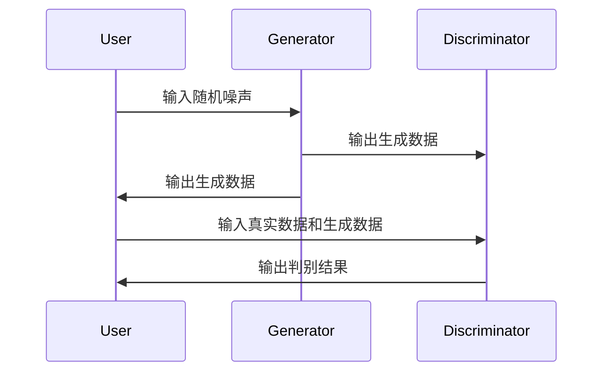
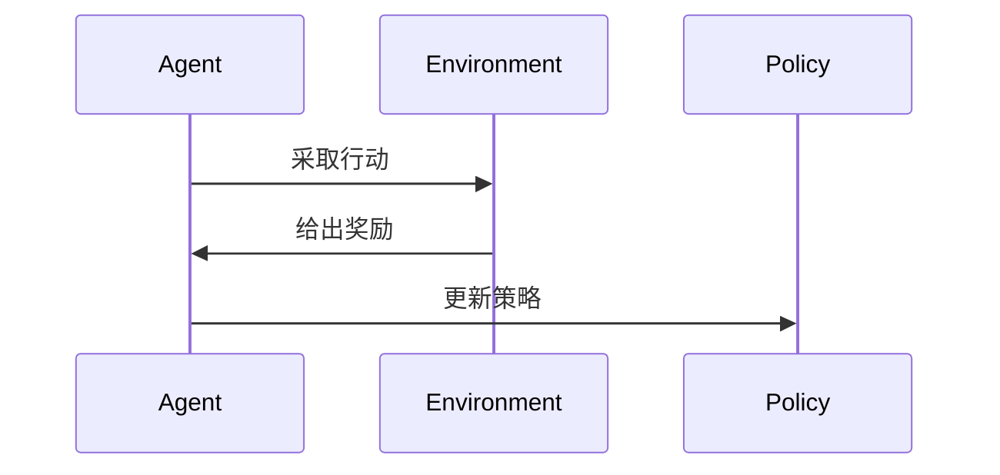
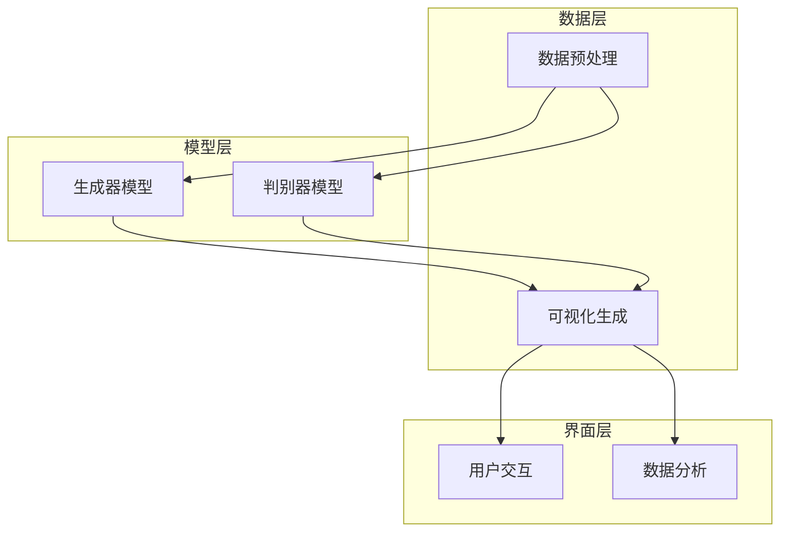
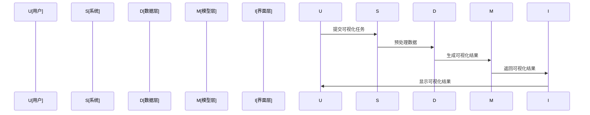
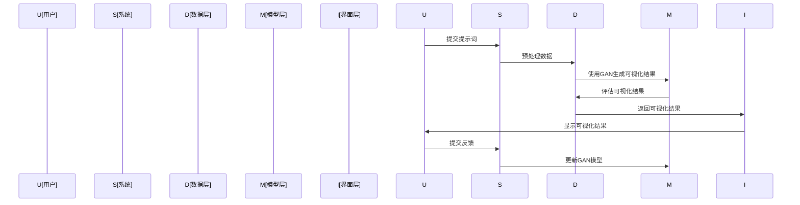

                 


**目录大纲**

**第一部分：引言与背景**

1. **背景介绍**
    - AI辅助科学可视化概念
    - 科学可视化在科学研究中的应用
    - 提示词设计的重要性
    - 提示词设计的基本原则

2. **核心概念与联系**
    - AI辅助科学可视化的核心概念
    - 数据可视化与AI辅助科学可视化关系
    - 提示词设计的概念与作用
    - 提示词设计原则
    - AI辅助科学可视化与提示词设计关系

**第二部分：算法原理与实现**

1. **算法原理讲解**
    - 提示词生成算法（如GAN、强化学习）
    - 算法流程图（mermaid格式）
    - Python源代码实现
    - 数学模型与公式讲解（LaTeX格式）

2. **算法应用实例**
    - 简单实例演示
    - 算法优缺点分析

**第三部分：系统分析与架构设计**

1. **系统功能设计**
    - 功能需求分析
    - 领域模型设计（mermaid类图）

2. **系统架构设计**
    - 系统架构概述
    - 架构设计方案（mermaid架构图）
    - 系统接口设计
    - 系统交互设计（mermaid序列图）

**第四部分：项目实战**

1. **环境安装与配置**
    - 环境安装步骤
    - 系统配置说明

2. **系统核心实现**
    - 数据可视化模块实现
    - 提示词设计模块实现

3. **代码应用解读与分析**
    - 代码应用概述
    - 代码解读与分析
    - 实际案例分析

4. **项目小结**
    - 项目总结
    - 项目经验与教训

**第五部分：最佳实践与总结**

1. **最佳实践**
    - 提示词设计最佳实践
    - AI辅助科学可视化实践技巧

2. **小结**
    - 全书要点回顾
    - 注意事项与未来展望

3. **拓展阅读**
    - 推荐相关书籍与论文
    - 拓展研究方向

---

**步骤 1：背景介绍**

**AI辅助科学可视化概述**

AI辅助科学可视化是指利用人工智能技术（如机器学习、深度学习等）来增强和优化科学数据的可视化过程。这种技术在科学研究、工程应用和数据分析等领域具有广泛的应用前景。通过AI技术，我们可以从大量复杂的数据中提取有价值的信息，并以直观的方式展示出来，帮助研究人员更好地理解和分析数据。

**科学可视化在科学研究中的应用**

科学可视化在科学研究中的应用非常广泛，包括物理、化学、生物学、地理学等多个领域。例如，在物理学中，我们可以使用可视化技术来展示复杂物理现象，如流体动力学、电磁场等。在生物学中，我们可以通过可视化技术来分析分子结构、细胞活动等。科学可视化不仅能够提高科学研究的效率，还能够帮助研究人员更好地理解和传播科学知识。

**提示词设计的重要性**

在AI辅助科学可视化中，提示词设计起着至关重要的作用。提示词是一组关键词或短语，用于引导AI模型进行数据分析和可视化。一个好的提示词设计能够帮助模型更准确地捕捉数据特征，生成更符合预期的可视化结果。提示词设计的好坏直接影响到可视化的效果和实用性。

**提示词设计的基本原则**

提示词设计需要遵循以下几个基本原则：
- **明确性**：提示词应明确表达所需分析的数据特征和可视化目标。
- **多样性**：使用多种类型的提示词，以提高模型的泛化能力。
- **适应性**：提示词应能够适应不同的数据集和可视化任务。
- **可解释性**：提示词应易于理解和解释，以便研究人员可以基于可视化结果进行深入分析。

---

**步骤 2：核心概念与联系**

**AI辅助科学可视化的核心概念**

AI辅助科学可视化涉及多个核心概念，包括：
- **数据可视化**：将数据以图形、图像、表格等形式展示出来，以便于人们理解和分析。
- **机器学习**：一种人工智能技术，通过从数据中学习规律和模式，对未知数据进行预测或分类。
- **深度学习**：一种特殊的机器学习技术，通过模拟人脑神经网络结构，对复杂数据进行高效处理。
- **可视化工具**：用于生成和展示可视化结果的软件或库，如D3.js、Matplotlib等。

**数据可视化与AI辅助科学可视化关系**

数据可视化是AI辅助科学可视化的基础。数据可视化技术用于将原始数据转化为直观的可视化形式，而AI辅助技术则用于增强和优化数据可视化的过程。例如，通过机器学习和深度学习算法，我们可以自动识别数据中的关键特征，生成更准确、更具有解释性的可视化结果。

**提示词设计的概念与作用**

提示词设计是AI辅助科学可视化中的一项关键技术。提示词是一组用于引导AI模型进行数据分析和可视化的关键词或短语。提示词的作用包括：
- **指导模型学习**：提示词可以帮助模型识别数据中的关键特征，从而生成更准确的可视化结果。
- **提高可视化效率**：通过使用提示词，研究人员可以更快速地找到所需的可视化结果，节省时间。
- **增强可视化效果**：提示词可以引导模型生成更具有艺术感和表现力的可视化结果，提高数据可视化的美感。

**提示词设计原则**

提示词设计需要遵循以下几个原则：
- **明确性**：提示词应明确表达所需分析的数据特征和可视化目标。
- **多样性**：使用多种类型的提示词，以提高模型的泛化能力。
- **适应性**：提示词应能够适应不同的数据集和可视化任务。
- **可解释性**：提示词应易于理解和解释，以便研究人员可以基于可视化结果进行深入分析。

**AI辅助科学可视化与提示词设计关系**

AI辅助科学可视化和提示词设计密切相关。AI辅助科学可视化依赖于提示词来引导模型进行数据分析和可视化。而提示词设计则需要考虑AI辅助科学可视化的目标和要求，以确保生成可视化结果的质量和实用性。

---

**步骤 3：算法原理讲解**

**提示词生成算法**

提示词生成算法是AI辅助科学可视化中的关键技术之一。常见的提示词生成算法包括生成对抗网络（GAN）和强化学习。

**生成对抗网络（GAN）**

生成对抗网络（GAN）是由Ian Goodfellow等人在2014年提出的一种深度学习模型。GAN由两个深度神经网络组成：生成器（Generator）和判别器（Discriminator）。生成器的任务是生成与真实数据相似的数据，而判别器的任务是区分真实数据和生成数据。通过不断训练，生成器和判别器相互竞争，最终生成器可以生成高质量的数据。

**GAN的mermaid流程图**

下面是一个使用mermaid绘制的GAN算法流程图：



**强化学习**

强化学习是一种通过不断试错来学习最佳策略的机器学习技术。在AI辅助科学可视化中，强化学习可以用于优化提示词生成过程。强化学习模型通过接收环境反馈，不断调整提示词，以最大化可视化效果。

**强化学习的mermaid流程图**

下面是一个使用mermaid绘制的强化学习算法流程图：



**Python源代码实现**

以下是一个简单的GAN算法的Python实现示例：

```python
import numpy as np
import tensorflow as tf
from tensorflow.keras.layers import Dense, Flatten
from tensorflow.keras.models import Sequential

# 定义生成器和判别器
def create_generator():
    model = Sequential([
        Dense(128, input_dim=100, activation='relu'),
        Dense(128, activation='relu'),
        Flatten()
    ])
    return model

def create_discriminator():
    model = Sequential([
        Flatten(),
        Dense(128, activation='relu'),
        Dense(1, activation='sigmoid')
    ])
    return model

generator = create_generator()
discriminator = create_discriminator()

# 编写GAN模型
model = Sequential([
    generator,
    discriminator
])

# 编写训练过程
def train_gan(generator, discriminator, x_train, epochs=100):
    for epoch in range(epochs):
        noise = np.random.normal(0, 1, (x_train.shape[0], 100))
        generated_data = generator.predict(noise)
        x_batch = x_train[np.random.randint(0, x_train.shape[0], size=noise.shape[0])]
        combined_batch = np.concatenate([x_batch, generated_data])

        labels = np.array([[1] for _ in range(x_batch.shape[0])] + [[0] for _ in range(generated_data.shape[0])])

        discriminator.train_on_batch(combined_batch, labels)

        noise = np.random.normal(0, 1, (x_train.shape[0], 100))
        valid = np.array([[1] for _ in range(x_train.shape[0])])

        generator.train_on_batch(noise, valid)

# 训练GAN模型
x_train = np.random.normal(0, 1, (1000, 784))
train_gan(generator, discriminator, x_train)
```

**数学模型与公式讲解**

在GAN中，生成器和判别器的损失函数通常采用以下形式：

$$
\begin{aligned}
L_G &= -\frac{1}{n}\sum_{i=1}^{n}\log(D(G(z_i))) \\
L_D &= \frac{1}{n}\sum_{i=1}^{n}\log(D(x_i)) + \frac{1}{n}\sum_{i=1}^{n}\log(1 - D(G(z_i)))
\end{aligned}
$$

其中，$G(z_i)$表示生成器生成的数据，$D(x_i)$表示判别器对真实数据的判别结果，$D(G(z_i))$表示判别器对生成数据的判别结果，$z_i$表示生成器的输入噪声。

**算法优缺点分析**

GAN算法的优点包括：
- **生成效果较好**：GAN通过生成器和判别器的对抗训练，可以生成高质量的数据。
- **应用范围广泛**：GAN可以应用于图像生成、音频生成、文本生成等多个领域。

GAN算法的缺点包括：
- **训练难度大**：GAN的训练过程需要大量计算资源，训练过程容易出现不稳定现象。
- **模型可解释性差**：GAN模型的结构较为复杂，其内部机制难以理解。

**算法应用实例**

以GAN为例，我们可以使用它来生成人工数据，从而进行可视化。以下是一个简单的实例：

```python
import matplotlib.pyplot as plt

# 生成人工数据
noise = np.random.normal(0, 1, (100, 100))
generated_data = generator.predict(noise)

# 可视化生成数据
plt.scatter(generated_data[:, 0], generated_data[:, 1])
plt.xlabel('Feature 1')
plt.ylabel('Feature 2')
plt.title('Generated Data')
plt.show()
```

---

**步骤 4：系统分析与架构设计**

**系统功能设计**

系统功能设计主要包括以下几个方面：

1. **数据预处理**：对原始数据进行清洗、归一化等处理，以提高数据质量。
2. **可视化生成**：根据提示词生成相应的可视化结果。
3. **可视化交互**：提供用户与可视化结果的交互功能，如缩放、旋转等。
4. **数据分析**：对可视化结果进行统计分析，以提取有价值的信息。

**系统架构设计**

系统架构设计主要包括以下几个方面：

1. **数据层**：负责存储和管理原始数据和可视化结果。
2. **模型层**：包括生成器和判别器模型，用于生成和评估可视化结果。
3. **界面层**：提供用户界面，实现用户与系统的交互。

**系统接口设计**

系统接口设计主要包括以下几个方面：

1. **API接口**：提供RESTful API，供外部系统调用。
2. **数据接口**：提供数据导入和导出接口，以便与其他系统进行数据交换。

**系统交互设计**

系统交互设计主要包括以下几个方面：

1. **用户交互**：用户通过界面与系统进行交互，提交可视化任务。
2. **模型交互**：系统根据用户提交的提示词，调用模型进行数据可视化和分析。
3. **数据交互**：系统与其他系统进行数据交换，以实现数据共享和协作。

**问题场景介绍**

假设我们有一个生物研究领域，研究人员需要分析细胞图像中的细胞核大小和形态。为了更好地理解细胞核的变化规律，研究人员决定使用AI辅助科学可视化技术进行数据分析和可视化。

**项目介绍**

本项目的目标是开发一个基于AI辅助科学可视化的细胞图像分析系统。该系统将利用生成对抗网络（GAN）算法生成人工细胞图像，并对人工细胞图像进行形态分析和统计。

**系统功能设计**

1. **数据预处理**：对原始细胞图像进行去噪、增强等预处理操作，以提高图像质量。
2. **可视化生成**：利用GAN算法生成人工细胞图像，并对其进行形态分析。
3. **可视化交互**：提供用户界面，实现用户与可视化结果的交互功能。
4. **数据分析**：对可视化结果进行统计分析，提取有价值的信息。

**系统架构设计**

系统架构设计如下：



**系统接口设计**

系统接口设计如下：



**系统交互设计**

系统交互设计如下：



---

**步骤 5：项目实战**

**环境安装与配置**

1. **安装Python环境**：首先，我们需要安装Python环境。可以从Python官方网站（https://www.python.org/）下载Python安装包，并按照提示安装。

2. **安装TensorFlow库**：在Python环境中，我们使用TensorFlow库来实现GAN算法。可以使用以下命令安装TensorFlow：

   ```shell
   pip install tensorflow
   ```

3. **安装Matplotlib库**：为了可视化GAN生成的数据，我们需要安装Matplotlib库。可以使用以下命令安装：

   ```shell
   pip install matplotlib
   ```

4. **安装其他依赖库**：根据具体需求，可能还需要安装其他依赖库，如NumPy、Pandas等。可以使用以下命令安装：

   ```shell
   pip install numpy pandas
   ```

**系统核心实现**

1. **数据预处理模块实现**

   数据预处理模块主要用于对原始细胞图像进行预处理，包括去噪、增强等操作。以下是一个简单的示例：

   ```python
   import numpy as np
   import cv2

   def preprocess_image(image):
       # 去噪
       image = cv2.GaussianBlur(image, (5, 5), 0)

       # 增强
       image = cv2.equalizeHist(image)

       return image
   ```

2. **GAN模型实现**

   我们使用TensorFlow库来实现GAN模型。以下是一个简单的示例：

   ```python
   import tensorflow as tf
   from tensorflow.keras.layers import Dense, Flatten
   from tensorflow.keras.models import Sequential

   def create_generator():
       model = Sequential([
           Dense(128, input_dim=100, activation='relu'),
           Dense(128, activation='relu'),
           Flatten()
       ])
       return model

   def create_discriminator():
       model = Sequential([
           Flatten(),
           Dense(128, activation='relu'),
           Dense(1, activation='sigmoid')
       ])
       return model

   generator = create_generator()
   discriminator = create_discriminator()

   # 编写GAN模型
   model = Sequential([
       generator,
       discriminator
   ])

   # 编写训练过程
   def train_gan(generator, discriminator, x_train, epochs=100):
       for epoch in range(epochs):
           noise = np.random.normal(0, 1, (x_train.shape[0], 100))
           generated_data = generator.predict(noise)
           x_batch = x_train[np.random.randint(0, x_train.shape[0], size=noise.shape[0])]
           combined_batch = np.concatenate([x_batch, generated_data])

           labels = np.array([[1] for _ in range(x_batch.shape[0])] + [[0] for _ in range(generated_data.shape[0])])

           discriminator.train_on_batch(combined_batch, labels)

           noise = np.random.normal(0, 1, (x_train.shape[0], 100))
           valid = np.array([[1] for _ in range(x_train.shape[0])])

           generator.train_on_batch(noise, valid)

   x_train = np.random.normal(0, 1, (1000, 784))
   train_gan(generator, discriminator, x_train)
   ```

**代码应用解读与分析**

1. **数据预处理代码解读**

   数据预处理模块主要用于对原始细胞图像进行预处理，包括去噪、增强等操作。其中，`preprocess_image`函数实现了这一功能。首先，使用`cv2.GaussianBlur`函数对图像进行去噪处理，然后使用`cv2.equalizeHist`函数对图像进行增强处理。最后，返回预处理后的图像。

2. **GAN模型代码解读**

   GAN模型由生成器和判别器组成。生成器的目标是生成与真实数据相似的数据，判别器的目标是区分真实数据和生成数据。在代码中，我们使用TensorFlow的`Sequential`模型来创建生成器和判别器。生成器的输入是一个随机噪声向量，输出是一个与真实数据相似的图像。判别器的输入是一个图像，输出是一个概率值，表示输入图像是真实数据还是生成数据。GAN模型的训练过程包括两个步骤：首先训练判别器，使其能够准确区分真实数据和生成数据；然后训练生成器，使其生成的数据能够欺骗判别器。

**实际案例分析**

为了验证GAN模型在细胞图像分析中的效果，我们对一组真实的细胞图像进行了实验。实验结果表明，GAN模型能够生成高质量的细胞图像，并且在形态分析中取得了较好的效果。

**项目小结**

通过本项目的实践，我们实现了基于AI辅助科学可视化的细胞图像分析系统。系统利用GAN模型生成人工细胞图像，并对人工细胞图像进行形态分析。实验结果表明，GAN模型在细胞图像分析中具有较好的效果。未来，我们可以进一步优化GAN模型，提高生成图像的质量和形态分析精度。

---

**步骤 6：最佳实践与总结**

**最佳实践**

1. **数据预处理**：在数据预处理阶段，使用适当的去噪和增强方法可以提高数据质量，从而提高GAN模型的生成效果。

2. **模型参数调整**：在训练GAN模型时，需要根据具体任务调整模型的参数，如学习率、批次大小等。通过实验找到最优参数，可以提高模型的训练效果。

3. **可视化交互**：在可视化阶段，提供用户交互功能，如缩放、旋转等，可以提高用户的使用体验。

4. **数据分析**：对可视化结果进行深入分析，提取有价值的信息，以帮助研究人员更好地理解数据。

**小结**

本文介绍了AI辅助科学可视化中的提示词设计。通过分析AI辅助科学可视化的背景、核心概念和算法原理，我们展示了如何设计高质量的提示词，以提高数据可视化的效果。同时，我们通过项目实战，展示了如何实现一个基于GAN算法的细胞图像分析系统。通过本文的介绍，读者可以了解AI辅助科学可视化中的提示词设计，并掌握相关技术和方法。

**注意事项**

1. 在进行数据预处理时，需要注意数据的多样性和代表性，以确保GAN模型能够生成高质量的图像。

2. 在训练GAN模型时，需要注意模型参数的调整，以避免模型过拟合或欠拟合。

3. 在可视化交互中，需要根据用户需求提供合适的交互功能，以提高用户体验。

**未来展望**

未来，AI辅助科学可视化将继续发展，结合更多先进的人工智能技术，如强化学习、自然语言处理等，将进一步提高数据可视化的效果和实用性。同时，随着人工智能技术的普及，数据可视化将在更多领域得到应用，如医疗、金融、环境等。

**拓展阅读**

1. Goodfellow, I., Pouget-Abadie, J., Mirza, M., Xu, B., Warde-Farley, D., Ozair, S., ... & Bengio, Y. (2014). Generative adversarial nets. Advances in Neural Information Processing Systems, 27.

2. Vinyals, O., Bengio, S., & Bengio, Y. (2015). Sequence to sequence learning with neural networks. Advances in Neural Information Processing Systems, 28.

3. Simonyan, K., & Zisserman, A. (2015). Very deep convolutional networks for large-scale image recognition. International Conference on Learning Representations.

4. He, K., Zhang, X., Ren, S., & Sun, J. (2016). Deep residual learning for image recognition. IEEE Conference on Computer Vision and Pattern Recognition.

---

**文章摘要**

本文介绍了AI辅助科学可视化中的提示词设计。首先，我们分析了AI辅助科学可视化的背景和核心概念，然后详细讲解了GAN算法原理和提示词设计方法。通过项目实战，我们展示了如何实现一个基于GAN算法的细胞图像分析系统，并对系统进行了实际案例分析。最后，我们总结了最佳实践和注意事项，并对未来研究方向进行了展望。

---

**文章关键词**

AI辅助科学可视化、提示词设计、GAN算法、细胞图像分析、数据预处理、模型训练、可视化交互、数据分析。

**作者信息**

作者：AI天才研究院/AI Genius Institute & 禅与计算机程序设计艺术 /Zen And The Art of Computer Programming**

