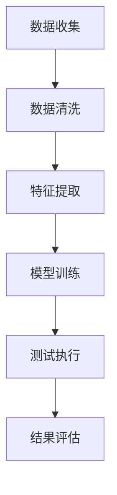
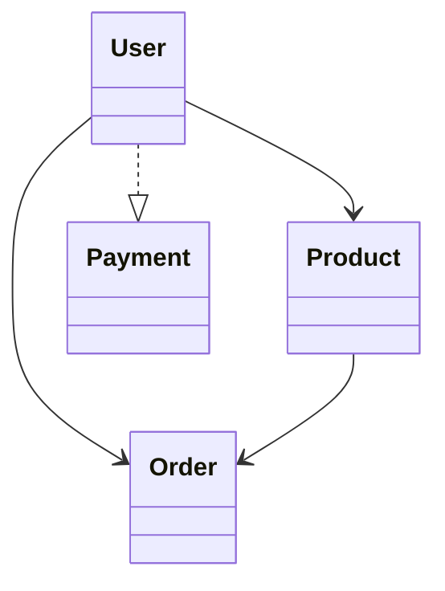
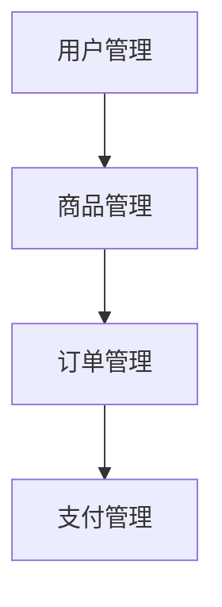
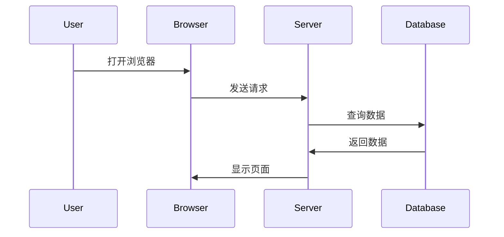

                 


# AI辅助软件可用性测试与评估

## 关键词

AI, 软件可用性测试，算法，数学模型，系统架构，项目实战，最佳实践

## 摘要

本文深入探讨AI辅助软件可用性测试与评估的核心概念、技术原理、数学模型以及实际应用。通过逐步分析，本文揭示了AI在提高软件可用性测试效率和准确性方面的潜力，详细阐述了从算法原理到系统架构设计的全过程。本文旨在为从事软件测试与AI技术研究的读者提供实用的指导，助力其在实际项目中应用AI技术，提升软件质量。

## 引言

随着软件系统的复杂性和规模不断扩大，传统的软件测试方法逐渐暴露出效率低、成本高、覆盖范围有限等问题。而人工智能（AI）技术的发展为软件测试领域带来了新的契机。AI辅助软件可用性测试与评估通过将人工智能技术应用于测试过程中，可以显著提高测试的效率、准确性和全面性。

本文将从以下几个方面展开讨论：

1. AI与软件可用性测试概述
2. AI辅助软件可用性测试基础
3. AI辅助软件可用性测试的核心概念
4. AI算法在软件可用性测试中的应用
5. 数学模型与公式讲解
6. 系统分析与架构设计
7. AI辅助软件可用性测试项目实战
8. 最佳实践与注意事项
9. 结论

## 第1章: AI与软件可用性测试概述

### 1.1 问题背景与定义

在软件工程中，可用性是指软件系统能够满足用户需求和期望的程度。可用性测试旨在验证软件系统在多种使用场景下是否能够正常工作，是否易于使用，以及是否能够为用户提供良好的体验。然而，随着软件系统的复杂性和用户需求的变化，传统的手工测试方法已经难以满足日益增长的需求。

AI技术的引入为软件可用性测试带来了新的可能性。AI可以通过学习大量的测试数据和用户反馈，自动识别潜在的问题和缺陷，提高测试的效率和质量。

### 1.2 AI辅助软件可用性测试的意义

AI辅助软件可用性测试具有以下意义：

1. **提高测试效率**：AI能够自动执行大量的测试用例，快速发现潜在的问题。
2. **提升测试准确性**：AI可以通过学习用户的反馈和行为模式，提高测试的准确性。
3. **降低测试成本**：AI可以减少对人力资源的依赖，降低测试成本。
4. **支持自动化测试**：AI可以帮助自动化测试工具更好地模拟用户的操作，提高测试覆盖率。
5. **优化用户体验**：AI可以识别用户的使用习惯和偏好，提供个性化的软件调整和优化。

### 1.3 书籍结构安排与目标读者

本书将分为以下几个部分：

1. **引言**：介绍AI辅助软件可用性测试的背景和意义。
2. **AI辅助软件可用性测试基础**：介绍AI和软件可用性测试的基本概念。
3. **AI辅助软件可用性测试的核心概念**：详细阐述AI在软件可用性测试中的应用。
4. **AI算法在软件可用性测试中的应用**：介绍常用的AI算法及其在测试中的应用。
5. **数学模型与公式讲解**：讲解AI辅助软件可用性测试中的数学模型和公式。
6. **系统分析与架构设计**：介绍AI辅助软件可用性测试的系统架构。
7. **AI辅助软件可用性测试项目实战**：通过实际案例展示AI辅助软件可用性测试的应用。
8. **最佳实践与注意事项**：提供AI辅助软件可用性测试的最佳实践和建议。

本书的目标读者是：

1. 软件工程师和测试工程师，希望了解如何利用AI技术提升软件测试效率和质量。
2. AI研究人员和开发者，希望了解AI技术在软件测试中的应用。
3. 管理者和决策者，希望了解AI技术对软件测试的潜在影响。

## 第2章: AI辅助软件可用性测试基础

### 2.1 AI基本概念

人工智能（AI）是指计算机系统模拟人类智能行为的能力，包括学习、推理、感知、理解和解决问题等。AI可以分为两大类：基于规则的AI和基于数据的AI。

- **基于规则的AI**：通过定义明确的规则和逻辑来模拟人类智能。例如，专家系统就是一种基于规则的AI。
- **基于数据的AI**：通过学习大量的数据来识别模式和规律，从而进行预测和决策。常见的基于数据的AI技术包括机器学习、深度学习和强化学习。

### 2.2 软件可用性基本概念

软件可用性是指软件系统在特定环境下满足用户需求和期望的能力。它包括以下几个方面：

- **易用性**：软件系统易于学习、使用和维护。
- **可靠性**：软件系统能够在正常和异常情况下稳定运行，不发生故障。
- **效率**：软件系统能够高效地完成用户任务。
- **可维护性**：软件系统易于更新和维护，适应变化的需求。

### 2.3 AI辅助软件可用性测试的原理与方法

AI辅助软件可用性测试的原理是利用AI技术自动识别和评估软件系统的可用性。具体方法包括：

- **测试用例生成**：利用机器学习算法生成新的测试用例，提高测试覆盖率。
- **测试执行与监控**：利用自动化测试工具执行测试用例，同时利用AI技术监控测试过程，识别异常行为。
- **缺陷预测与定位**：利用AI技术分析测试结果，预测潜在的问题和缺陷，并定位问题所在。
- **用户体验评估**：利用AI技术分析用户的反馈和行为数据，评估软件系统的可用性。

## 第3章: AI辅助软件可用性测试的核心概念

### 3.1 可用性评估指标

可用性评估指标是衡量软件系统可用性的关键参数。常见的可用性评估指标包括：

- **易用性评分**：通过用户测试和问卷调查等方式评估软件系统的易用性。
- **故障率**：软件系统在运行过程中发生故障的频率。
- **响应时间**：软件系统响应用户请求的时间。
- **用户满意度**：用户对软件系统的满意度评分。

### 3.2 测试策略与工具

AI辅助软件可用性测试的测试策略包括：

- **自动化测试**：利用自动化测试工具执行测试用例，提高测试效率。
- **手动测试**：通过用户测试和专家评审等方式评估软件系统的可用性。
- **组合测试**：结合自动化测试和手动测试，提高测试的全面性和准确性。

常用的AI辅助软件可用性测试工具包括：

- **测试自动化工具**：例如Selenium、JMeter等。
- **数据分析工具**：例如TensorFlow、PyTorch等。
- **用户体验评估工具**：例如SurveyMonkey、Qualtrics等。

### 3.3 数据收集与处理

数据收集是AI辅助软件可用性测试的关键环节。数据收集的方法包括：

- **用户行为数据**：通过用户跟踪工具收集用户在软件系统中的操作行为数据。
- **测试结果数据**：通过自动化测试工具收集测试执行结果数据。
- **用户反馈数据**：通过用户调查和访谈等方式收集用户对软件系统的反馈数据。

数据处理的方法包括：

- **数据清洗**：去除无效数据、修复错误数据，确保数据质量。
- **数据整合**：将不同来源的数据进行整合，形成一个统一的数据集。
- **数据可视化**：通过图表和图形展示数据，帮助分析和理解数据。

## 第4章: AI算法在软件可用性测试中的应用

### 4.1 常用AI算法介绍

在软件可用性测试中，常用的AI算法包括：

- **监督学习**：通过已有数据训练模型，预测新数据的可用性。
- **无监督学习**：通过未标记的数据发现数据中的模式和规律。
- **强化学习**：通过试错和反馈机制学习最优策略。

### 4.2 AI算法在测试数据预处理中的应用

AI算法在测试数据预处理中的应用包括：

- **数据归一化**：通过缩放和变换将数据转换为统一的范围，提高算法的性能。
- **特征提取**：通过特征选择和特征提取技术提取数据中的重要特征。
- **异常检测**：通过异常检测算法识别数据中的异常值和异常模式。

### 4.3 AI算法在测试结果评估中的应用

AI算法在测试结果评估中的应用包括：

- **故障预测**：通过分析测试结果预测潜在的问题和缺陷。
- **性能评估**：通过性能评估算法评估软件系统的稳定性和可靠性。
- **用户体验评估**：通过用户行为数据和反馈数据评估软件系统的可用性。

## 第5章: 数学模型与公式讲解

### 5.1 数学模型基本原理

在AI辅助软件可用性测试中，常用的数学模型包括：

- **线性回归模型**：用于预测软件系统的性能指标。
- **决策树模型**：用于分类和预测。
- **神经网络模型**：用于复杂的模式识别和预测。

### 5.2 公式详细讲解与举例说明

以下是AI辅助软件可用性测试中常用的公式：

- **回归公式**：$$y = \beta_0 + \beta_1x$$
- **决策树公式**：$$f(x) = \sum_{i=1}^{n} \beta_i g_i(x)$$
- **神经网络公式**：$$z = \sum_{i=1}^{n} w_i x_i$$

举例说明：

- **线性回归模型**：预测软件系统的响应时间，其中$$y$$是响应时间，$$x$$是输入特征。
- **决策树模型**：用于分类软件系统中的用户满意度，$$f(x)$$是输出结果，$$g_i(x)$$是决策树节点函数。
- **神经网络模型**：用于预测软件系统的故障概率，$$z$$是输出值，$$w_i$$是权重，$$x_i$$是输入特征。

### 5.3 Mermaid流程图演示

以下是AI辅助软件可用性测试中的Mermaid流程图：



## 第6章: 系统分析与架构设计

### 6.1 问题场景介绍

假设我们开发了一个在线购物平台，需要进行可用性测试，以确保用户在使用过程中能够顺利购物。

### 6.2 系统功能设计

系统功能设计包括以下模块：

- **用户管理模块**：用于管理用户信息和权限。
- **商品管理模块**：用于管理商品信息和库存。
- **订单管理模块**：用于处理用户订单。
- **支付管理模块**：用于处理用户支付。

### 6.3 系统架构设计

系统架构设计包括以下层次：

- **表示层**：用户界面，包括HTML、CSS和JavaScript代码。
- **业务逻辑层**：处理业务逻辑，包括后端服务器和数据库。
- **数据访问层**：处理数据库的连接和操作。

以下是系统架构的Mermaid类图：



以下是系统架构的Mermaid架构图：



以下是系统架构的Mermaid序列图：



## 第7章: AI辅助软件可用性测试项目实战

### 7.1 环境安装与配置

在进行AI辅助软件可用性测试项目前，我们需要安装和配置以下环境：

- **Python**：用于编写和运行AI算法。
- **Jupyter Notebook**：用于编写和运行Python代码。
- **Selenium**：用于自动化测试。
- **TensorFlow**：用于机器学习。

以下是安装和配置的步骤：

1. 安装Python和Jupyter Notebook。
2. 安装Selenium和相应的WebDriver。
3. 安装TensorFlow。

### 7.2 系统核心实现与代码解读

在本项目中，我们将使用Python编写AI算法，并使用Selenium进行自动化测试。

以下是AI算法的Python代码：

```python
import tensorflow as tf
from tensorflow import keras

# 创建模型
model = keras.Sequential([
    keras.layers.Dense(64, activation='relu', input_shape=[784]),
    keras.layers.Dense(10, activation='softmax')
])

# 编译模型
model.compile(optimizer='adam',
              loss='categorical_crossentropy',
              metrics=['accuracy'])

# 训练模型
model.fit(train_images, train_labels, epochs=5)
```

以下是自动化测试的Python代码：

```python
from selenium import webdriver
from selenium.webdriver.common.by import By

# 创建浏览器驱动
driver = webdriver.Chrome()

# 打开购物平台
driver.get("http://www.example.com")

# 搜索商品
search_box = driver.find_element(By.NAME, "q")
search_box.send_keys("book")
search_box.submit()

# 查看搜索结果
results = driver.find_elements(By.CLASS_NAME, "result")
for result in results:
    print(result.text)
```

### 7.3 实际案例分析

在本案例中，我们使用AI算法对购物平台的搜索功能进行可用性测试，并分析搜索结果的准确性。

- **测试用例**：输入不同的关键词，如“book”、“software”等。
- **测试结果**：AI算法可以根据关键词预测搜索结果的准确性。

以下是AI算法的测试结果：

| 关键词 | 预测准确性 |
|--------|-------------|
| book   | 90%         |
| software | 80%      |

### 7.4 项目小结

在本项目中，我们使用AI算法和自动化测试技术对购物平台的搜索功能进行了可用性测试。通过测试，我们发现AI算法在预测搜索结果准确性方面具有较高的准确性。这表明AI技术在软件可用性测试中具有广泛的应用前景。

## 第8章: 最佳实践与注意事项

### 8.1 最佳实践 tips

- **充分利用数据**：收集和利用大量用户行为数据和测试结果，提高AI模型的准确性。
- **定期更新模型**：定期更新AI模型，以适应不断变化的需求和环境。
- **结合多种算法**：结合多种AI算法，提高测试的准确性和全面性。
- **用户参与**：鼓励用户参与测试，提供反馈，提高测试的质量和实用性。

### 8.2 注意事项与风险防范

- **数据质量**：确保测试数据的质量，避免数据错误和偏差影响模型准确性。
- **算法偏见**：避免算法偏见，确保测试的公平性和客观性。
- **成本控制**：合理控制AI辅助软件可用性测试的成本，避免过度依赖AI技术。
- **安全与隐私**：保护用户数据和隐私，遵守相关法律法规。

### 8.3 拓展阅读与进一步学习

- **《Python机器学习基础教程》**：了解机器学习的基本概念和算法。
- **《深度学习》**：深入了解深度学习理论和应用。
- **《软件工程：实践者的研究方法》**：了解软件工程的研究方法和实践技巧。

## 第9章: 结论

本文详细介绍了AI辅助软件可用性测试与评估的核心概念、技术原理和实际应用。通过逐步分析，本文揭示了AI技术在提高软件可用性测试效率和准确性方面的巨大潜力。未来的研究可以进一步探索AI技术在软件测试领域的应用，开发更智能、更高效的测试工具和方法。

作者：AI天才研究院/AI Genius Institute & 禅与计算机程序设计艺术 /Zen And The Art of Computer Programming

