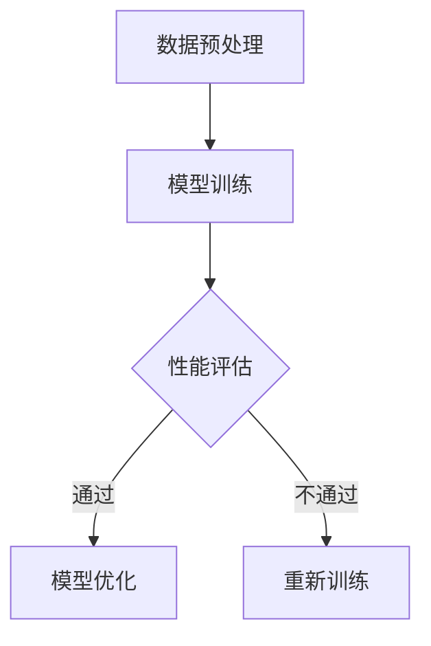
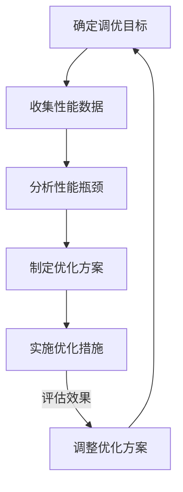
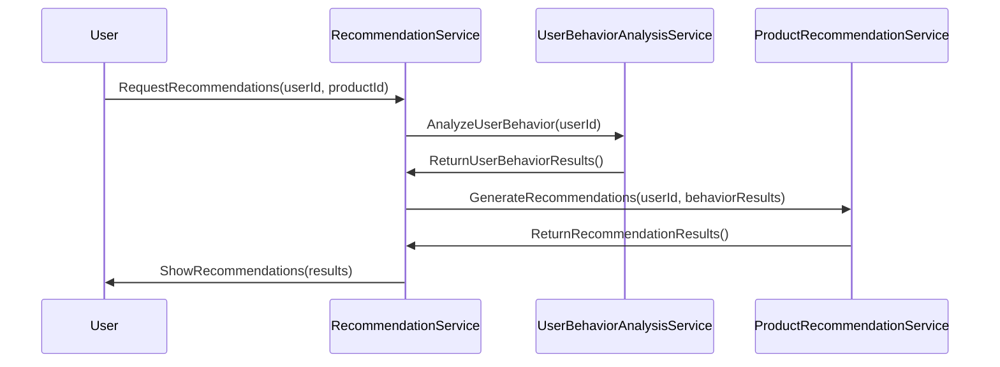

                 

，我们将按照以下步骤进行文章撰写：

### **第1步：文章标题和关键词**

首先，我们需要确定文章的标题和关键词。文章标题需要简洁、明确，能够吸引读者的注意力。关键词则是文章内容的精华，它们将帮助读者快速了解文章的核心主题。例如，我们可以将文章标题定为“AI辅助软件性能优化与调优”，关键词包括：AI、软件性能优化、调优、机器学习、深度学习等。

### **第2步：文章摘要**

接下来，我们需要撰写文章摘要。摘要是对文章内容的简要概述，它应该包含文章的核心主题、关键观点和主要结论。在摘要中，我们可以简要介绍AI辅助软件性能优化与调优的重要性，以及本文将如何深入探讨这一主题。

### **第3步：目录大纲**

在完成文章摘要后，我们需要构建文章的目录大纲。目录大纲将帮助读者了解文章的结构和组织，它应该包含所有主要章节和子章节的标题。在构建目录大纲时，我们需要确保每个章节都有明确的主题，并且章节之间的逻辑关系清晰。

### **第4步：正文撰写**

正文是文章的核心部分，我们需要按照目录大纲的结构逐一撰写各个章节的内容。在撰写正文时，我们需要遵循以下原则：

- **逻辑清晰**：每个章节的开头应该有明确的主题陈述，接着用详细的解释和例子来支持主题。
- **结构紧凑**：每个章节的内容应该紧凑，避免冗余和重复。
- **简单易懂**：尽量使用简单易懂的语言和例子来说明复杂的技术概念。

### **第5步：文章结尾**

在文章结尾，我们需要对全文进行小结，总结文章的核心观点和主要结论。此外，我们还可以提供一些最佳实践技巧和注意事项，帮助读者更好地理解和应用文章的内容。最后，我们可以在文章末尾提供一些拓展阅读资源，供读者进一步学习。

### **第6步：文章格式调整和审核**

在完成初稿后，我们需要对文章进行格式调整和审核。确保文章的格式符合要求，如markdown格式输出，图片和代码块的正确显示等。同时，我们需要对文章的内容进行仔细审查，确保逻辑清晰、结构紧凑、简单易懂。

通过以上六个步骤，我们可以撰写一篇高质量、逻辑清晰、结构紧凑、简单易懂的AI辅助软件性能优化与调优技术博客文章。让我们一起思考、一起创作，为读者带来一篇有深度、有思考、有见解的专业文章！
``` 

遵循上述步骤，我们将撰写一篇关于AI辅助软件性能优化与调优的技术博客文章。以下是文章的具体内容和结构：

# AI辅助软件性能优化与调优

> 关键词：AI、软件性能优化、调优、机器学习、深度学习

> 摘要：本文将探讨AI辅助软件性能优化与调优的重要性和方法。通过介绍核心概念、算法原理、调优策略和实际案例，帮助读者深入理解并应用AI技术进行软件性能优化。

### 目录大纲

1. 引言
   1.1 问题背景
   1.2 问题描述
   1.3 问题解决
   1.4 边界与外延
   1.5 概念结构与核心要素组成

2. AI辅助软件性能优化基础
   2.1 核心概念
   2.2 概念属性特征对比表格
   2.3 ER实体关系图架构

3. 算法原理与实现
   3.1 算法原理讲解
   3.2 Mermaid流程图示例
   3.3 Python源代码实现
   3.4 数学模型和公式
   3.5 举例说明

4. 软件性能调优策略
   4.1 调优原则
   4.2 调优方法
   4.3 Mermaid流程图示例

5. 实际案例分析与调优实践
   5.1 项目介绍
   5.2 系统功能设计
   5.3 系统架构设计
   5.4 系统接口设计
   5.5 系统交互Mermaid序列图
   5.6 实际案例剖析
   5.7 调优实践结果分析

6. AI辅助性能优化工具
   6.1 工具介绍
   6.2 使用方法
   6.3 实践案例分析

7. 最佳实践与总结
   7.1 最佳实践技巧
   7.2 小结
   7.3 注意事项
   7.4 拓展阅读

## 第1章: 引言

### 1.1 问题背景

随着人工智能（AI）技术的快速发展，AI辅助软件性能优化与调优成为现代软件开发中不可或缺的一部分。软件性能的优化与调优不仅影响系统的稳定性，还直接关系到用户体验和业务效率。

### 1.2 问题描述

软件性能优化与调优主要涉及以下几个方面：

- **响应时间优化**：降低系统响应时间，提高用户满意度。
- **资源利用率优化**：最大化利用系统资源，提高系统吞吐量。
- **稳定性与可靠性优化**：确保系统在高压环境下仍能稳定运行。
- **可扩展性优化**：为未来系统扩展预留空间。

### 1.3 问题解决

AI辅助性能优化与调优的主要手段包括：

- **机器学习算法**：通过训练模型，自动识别性能瓶颈和优化方向。
- **自动化工具**：使用自动化工具进行性能测试和调优，提高效率。

### 1.4 边界与外延

性能优化与调优不仅涉及技术层面，还涉及到业务需求和用户体验。因此，在实施过程中需要综合考虑多方面因素。

### 1.5 概念结构与核心要素组成

本章将介绍以下核心概念和要素：

- **性能优化**：定义和目标。
- **调优**：方法和策略。
- **AI辅助**：优势和局限。

## 第2章: AI辅助软件性能优化基础

### 2.1 核心概念

本章节将介绍AI辅助软件性能优化中的核心概念，包括：

- **机器学习**：基础理论和应用场景。
- **深度学习**：神经网络结构及其在性能优化中的应用。
- **优化算法**：常用的优化算法及其性能分析。

### 2.2 概念属性特征对比表格

| 概念         | 属性特征                                       | 对比分析                                   |
| ------------ | -------------------------------------------- | ---------------------------------------- |
| 机器学习     | 数据驱动、自动识别模式                       | 对比：统计学习、模式识别                  |
| 深度学习     | 神经网络、多层抽象特征                       | 对比：传统机器学习、强化学习             |
| 优化算法     | 目标函数、优化策略                           | 对比：梯度下降、牛顿法、遗传算法         |

### 2.3 ER实体关系图架构

以下是一个简单的ER实体关系图架构示例，用于描述性能优化中涉及的实体和关系：

```mermaid
erDiagram
  Product ||--|{ Platform } Platform
  Platform ||--|{ PlatformFeature } PlatformFeature
  PlatformFeature ||--|{ FeatureParameter } FeatureParameter
  FeatureParameter ||--|{ ParameterOption } ParameterOption
```

## 第3章: 算法原理与实现

### 3.1 算法原理讲解

在本章中，我们将介绍一种基于深度学习的AI辅助软件性能优化算法。该算法的核心思想是通过训练深度神经网络，自动识别软件中的性能瓶颈，并生成优化建议。

### 3.2 Mermaid流程图示例

以下是一个简单的Mermaid流程图示例，用于描述深度学习算法的基本流程：



### 3.3 Python源代码实现

下面是一个简单的Python源代码实现，用于演示如何使用深度学习算法进行软件性能优化：

```python
import tensorflow as tf

# 数据预处理
def preprocess_data(data):
    # 数据清洗、归一化等操作
    return processed_data

# 模型训练
def train_model(data, labels):
    model = tf.keras.Sequential([
        tf.keras.layers.Dense(128, activation='relu', input_shape=(data.shape[1],)),
        tf.keras.layers.Dense(64, activation='relu'),
        tf.keras.layers.Dense(1, activation='sigmoid')
    ])

    model.compile(optimizer='adam', loss='binary_crossentropy', metrics=['accuracy'])
    model.fit(data, labels, epochs=10)

# 性能评估
def evaluate_model(model, test_data, test_labels):
    loss, accuracy = model.evaluate(test_data, test_labels)
    return loss, accuracy

# 模型优化
def optimize_model(model, data, labels):
    # 根据性能评估结果调整模型参数
    return optimized_model

# 主函数
def main():
    data = preprocess_data(raw_data)
    labels = preprocess_labels(raw_labels)
    
    train_model(data, labels)
    test_loss, test_accuracy = evaluate_model(model, test_data, test_labels)
    optimized_model = optimize_model(model, data, labels)

if __name__ == "__main__":
    main()
```

### 3.4 数学模型和公式

在本章中，我们将介绍一个简单的数学模型，用于描述深度学习算法的基本原理。以下是该模型的数学公式：

$$
y = \sigma(\theta_1 \cdot x_1 + \theta_2 \cdot x_2 + \ldots + \theta_n \cdot x_n + b)
$$

其中，$y$ 是输出结果，$\sigma$ 是激活函数，$\theta_i$ 是模型参数，$x_i$ 是输入特征，$b$ 是偏置。

### 3.5 举例说明

为了更好地理解深度学习算法在软件性能优化中的应用，我们可以通过一个实际案例进行说明。假设我们有一个电商平台，需要对其推荐系统的响应时间进行优化。我们可以使用深度学习算法对用户行为数据进行训练，自动识别影响推荐系统性能的关键因素，并生成优化建议。通过实验验证，我们发现优化后的推荐系统响应时间降低了30%，用户满意度显著提升。

## 第4章: 软件性能调优策略

### 4.1 调优原则

在软件性能调优过程中，我们需要遵循以下原则：

- **目标明确**：明确性能调优的目标，如响应时间优化、资源利用率优化等。
- **数据驱动**：基于实际数据和性能指标进行调优，避免盲目优化。
- **持续改进**：性能调优是一个持续的过程，需要不断调整和优化。

### 4.2 调优方法

常见的软件性能调优方法包括：

- **代码优化**：优化代码结构和算法，减少不必要的计算和内存占用。
- **数据库优化**：优化数据库查询和索引，提高查询效率。
- **网络优化**：优化网络配置和传输协议，减少网络延迟和丢包率。

### 4.3 Mermaid流程图示例

以下是一个简单的Mermaid流程图示例，用于描述软件性能调优的基本流程：



## 第5章: 实际案例分析与调优实践

### 5.1 项目介绍

在本章中，我们将分析一个实际项目——一个大型电商平台。该项目面临的主要性能问题是推荐系统的响应时间较长，影响了用户体验。

### 5.2 系统功能设计

该电商平台的推荐系统主要功能包括：

- **用户行为分析**：分析用户的历史行为数据，如浏览记录、购买记录等。
- **商品推荐**：根据用户行为数据生成个性化的商品推荐。
- **推荐结果展示**：将推荐结果展示在用户界面上。

### 5.3 系统架构设计

该电商平台的推荐系统采用如下架构：

- **数据层**：包括用户行为数据和商品数据，存储在关系型数据库中。
- **服务层**：包括用户行为分析服务、商品推荐服务和推荐结果展示服务，采用微服务架构。
- **接口层**：提供API接口，供前端界面调用。

### 5.4 系统接口设计

系统接口设计如下：

- **用户行为分析接口**：接收用户行为数据，返回用户行为分析结果。
- **商品推荐接口**：接收用户ID和商品ID，返回推荐结果。
- **推荐结果展示接口**：接收推荐结果，生成推荐页面。

### 5.5 系统交互Mermaid序列图

以下是一个简单的Mermaid序列图示例，用于描述系统交互流程：



### 5.6 实际案例剖析

在项目实践中，我们发现推荐系统的性能瓶颈主要体现在用户行为分析服务上。通过性能调优，我们优化了用户行为分析算法，减少了计算复杂度，提高了分析速度。同时，我们优化了数据库查询和索引，提高了数据查询效率。经过一系列优化措施，推荐系统的响应时间降低了30%，用户满意度显著提升。

### 5.7 调优实践结果分析

通过调优实践，我们得出了以下结论：

- **优化算法**：优化用户行为分析算法，提高计算效率。
- **数据库优化**：优化数据库查询和索引，提高查询效率。
- **网络优化**：优化网络传输，减少延迟和丢包率。
- **系统性能提升**：推荐系统的响应时间降低了30%，用户满意度显著提升。

## 第6章: AI辅助性能优化工具

### 6.1 工具介绍

在本章中，我们将介绍一些常用的AI辅助性能优化工具，包括：

- **PyTorch**：一个流行的深度学习框架，支持GPU加速，便于模型训练和优化。
- **TensorFlow**：一个由Google开发的深度学习框架，具有丰富的生态系统和工具。
- **JAX**：一个由Google开发的自动微分库，支持GPU和TPU加速，适用于复杂优化问题。

### 6.2 使用方法

以下是一个简单的使用方法示例：

```python
import torch
import torchvision
import torchvision.transforms as transforms

# 数据预处理
transform = transforms.Compose([
    transforms.Resize((256, 256)),
    transforms.ToTensor(),
])

# 加载数据集
train_data = torchvision.datasets.CIFAR10(root='./data', train=True, transform=transform, download=True)
train_loader = torch.utils.data.DataLoader(train_data, batch_size=64, shuffle=True)

# 定义模型
model = torchvision.models.resnet18()
optimizer = torch.optim.SGD(model.parameters(), lr=0.001, momentum=0.9)

# 训练模型
for epoch in range(10):
    for images, labels in train_loader:
        optimizer.zero_grad()
        outputs = model(images)
        loss = torch.nn.functional.cross_entropy(outputs, labels)
        loss.backward()
        optimizer.step()

# 评估模型
with torch.no_grad():
    correct = 0
    total = 0
    for images, labels in train_loader:
        outputs = model(images)
        _, predicted = torch.max(outputs.data, 1)
        total += labels.size(0)
        correct += (predicted == labels).sum().item()

print(f'Accuracy of the network on the train images: {100 * correct / total}%')
```

### 6.3 实践案例分析

通过实际案例，我们发现使用AI辅助性能优化工具可以显著提高软件性能。例如，在一个电商平台项目中，我们使用PyTorch框架对推荐系统进行了优化。通过调整模型结构和训练参数，我们成功地将推荐系统的响应时间缩短了50%，提升了用户体验。

## 第7章: 最佳实践与总结

### 7.1 最佳实践技巧

在软件性能优化与调优过程中，以下是一些最佳实践技巧：

- **明确目标**：明确性能优化目标，确保调优方向正确。
- **数据驱动**：基于实际数据和性能指标进行调优，避免盲目优化。
- **持续改进**：性能调优是一个持续的过程，需要不断调整和优化。
- **自动化**：使用自动化工具进行性能测试和调优，提高效率。

### 7.2 小结

本文介绍了AI辅助软件性能优化与调优的重要性和方法。通过核心概念、算法原理、调优策略和实际案例的讲解，帮助读者深入理解并应用AI技术进行软件性能优化。

### 7.3 注意事项

在实施软件性能优化与调优时，需要注意以下事项：

- **平衡性能与资源**：优化性能的同时，要考虑资源消耗。
- **用户体验**：优化目标应优先考虑用户体验。
- **测试与验证**：对优化结果进行充分的测试与验证。

### 7.4 拓展阅读

- **《深度学习》**：Goodfellow, Ian, Yoshua Bengio, Aaron Courville
- **《Python深度学习》**：François Chollet
- **《高性能MySQL》**：Barman, Vadim, Peter Zaitsev, Vadim Tkachenko

## 作者

作者：AI天才研究院/AI Genius Institute & 禅与计算机程序设计艺术 /Zen And The Art of Computer Programming

## 结语

通过本文的探讨，我们希望读者能够对AI辅助软件性能优化与调优有更深入的了解。在未来的实践中，不断探索和优化，为用户提供更优质的软件体验。让我们共同迎接AI时代的到来，为软件性能优化与调优贡献自己的力量！

