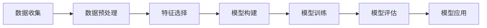
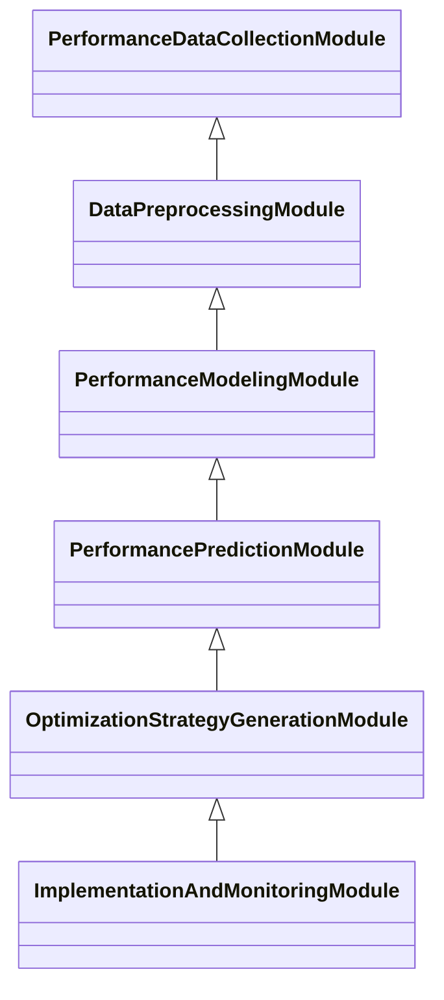
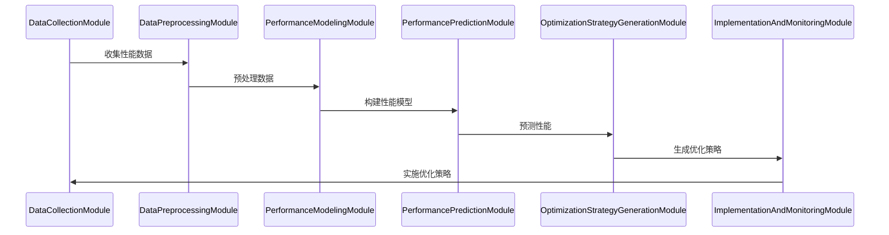
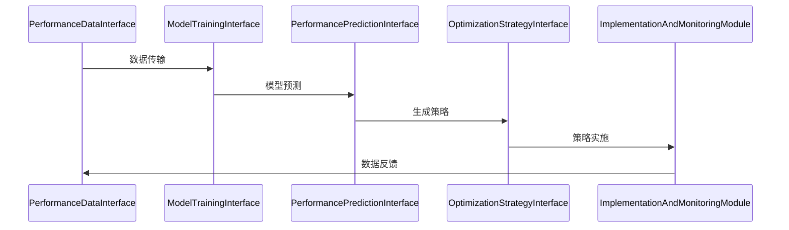
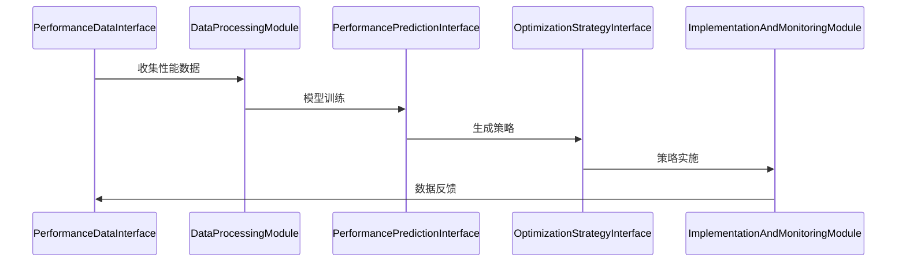
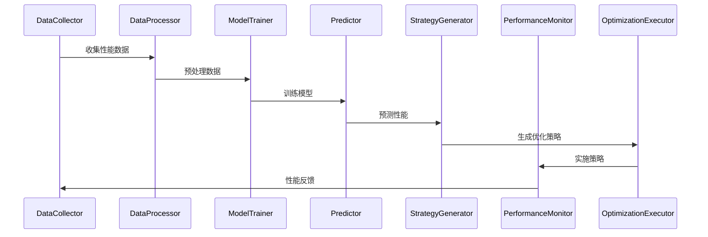

                 

### 文章标题

# 《AI辅助软件性能建模与预测》

### 文章关键词

- 软件性能建模
- AI辅助技术
- 预测模型
- 性能优化
- 算法讲解

### 摘要

本文将探讨AI辅助软件性能建模与预测的核心理念、方法和技术。通过深入分析AI辅助软件性能建模的基本原理和预测模型的核心原理，本文将详细讲解常见的算法及其数学模型，并使用Python代码示例来解释这些算法的具体实现。此外，本文还将介绍一个实际项目，通过系统分析与架构设计，展示AI辅助软件性能建模与预测的应用场景。最后，我们将通过一个实际案例，展示AI辅助软件性能建模与预测的实战应用，并提供最佳实践建议和未来研究方向。

## 目录

### 第一部分：背景介绍

1. [AI辅助软件性能建模与预测概述](#ai辅助软件性能建模与预测概述)
2. [核心概念与联系](#核心概念与联系)
3. [算法原理讲解](#算法原理讲解)
4. [系统分析与架构设计](#系统分析与架构设计)
5. [项目实战](#项目实战)

### 第二部分：核心概念与联系

1. [AI辅助软件性能建模的基本概念](#ai辅助软件性能建模的基本概念)
2. [AI辅助软件性能预测的核心原理](#ai辅助软件性能预测的核心原理)
3. [概念属性特征对比表格](#概念属性特征对比表格)
4. [ER实体关系图架构](#er实体关系图架构)

### 第三部分：算法原理讲解

1. [算法原理概述](#算法原理概述)
2. [常见算法讲解](#常见算法讲解)
3. [算法流程图与Python源代码实现](#算法流程图与python源代码实现)
4. [算法原理的数学模型和公式讲解](#算法原理的数学模型和公式讲解)
5. [通俗易懂的举例说明](#通俗易懂的举例说明)

### 第四部分：系统分析与架构设计

1. [问题场景介绍](#问题场景介绍)
2. [项目介绍](#项目介绍)
3. [系统功能设计](#系统功能设计)
4. [系统架构设计](#系统架构设计)
5. [系统接口设计](#系统接口设计)
6. [系统交互序列图](#系统交互序列图)

### 第五部分：项目实战

1. [环境安装](#环境安装)
2. [系统核心实现源代码](#系统核心实现源代码)
3. [代码应用解读与分析](#代码应用解读与分析)
4. [实际案例分析与讲解](#实际案例分析与讲解)
5. [项目小结](#项目小结)
6. [最佳实践 Tips](#最佳实践tips)
7. [小结与注意事项](#小结与注意事项)
8. [拓展阅读](#拓展阅读)

---

### AI辅助软件性能建模与预测概述

随着现代软件系统的日益复杂化，软件性能优化成为一个关键挑战。传统的软件性能优化方法往往依赖于经验和技术专家的知识，这些方法在应对复杂的软件系统时显得力不从心。为了解决这一问题，AI技术被引入到软件性能建模与预测中，旨在通过自动化和智能化手段提高软件性能。

#### 问题背景

软件性能优化的重要性在于它直接关系到软件系统的可用性、用户体验和业务成功。一个性能不佳的软件系统可能导致用户流失、业务停滞，甚至影响到企业的声誉。然而，随着软件系统规模的扩大和复杂度的增加，传统性能优化方法面临着诸多挑战：

1. **数据依赖性高**：传统方法需要大量性能数据进行统计分析，但实际获取这些数据往往困难重重。
2. **模式识别困难**：软件系统的性能表现往往受到多种复杂因素影响，传统方法难以识别和解析这些复杂模式。
3. **优化效果有限**：传统方法往往只能解决部分性能问题，难以实现全面的性能提升。

#### 传统软件性能优化的挑战

1. **人工干预多**：传统方法依赖人工分析，效率低下，且容易受到人为因素的影响。
2. **调试难度大**：在复杂软件系统中，定位性能瓶颈和故障点往往需要耗费大量时间和资源。
3. **适应性差**：传统方法难以适应快速变化的软件需求和技术环境。

#### AI在软件性能优化中的应用潜力

AI技术的引入为软件性能优化带来了新的机遇：

1. **自动化分析**：AI能够自动化地处理大量性能数据，识别复杂的性能模式。
2. **智能化优化**：AI可以基于历史数据和实时监测数据，智能化地调整系统参数，实现性能优化。
3. **快速迭代**：AI技术能够快速适应新技术和新的软件需求，提供持续的性能提升。

#### 问题描述

软件性能建模与预测的目标是：

1. **性能建模**：构建一个能够反映软件系统性能特征的模型。
2. **性能预测**：基于历史数据和实时数据，预测软件系统的未来性能表现。
3. **性能优化**：通过调整系统参数和架构设计，实现性能提升。

软件性能预测的关键因素包括：

1. **历史性能数据**：包括系统负载、响应时间、资源利用率等。
2. **实时性能数据**：通过性能监控工具获取的当前系统性能数据。
3. **系统配置信息**：包括硬件配置、软件配置等。

软件性能优化的具体任务包括：

1. **性能瓶颈定位**：识别系统中的性能瓶颈。
2. **优化策略生成**：基于性能预测结果，生成优化策略。
3. **实施与评估**：执行优化策略，评估优化效果。

#### 问题解决

AI辅助软件性能建模与预测的核心思想是通过机器学习和深度学习等技术，从大量数据中提取知识，构建性能模型，并利用这些模型进行性能预测和优化。

1. **数据收集**：收集历史性能数据和实时性能数据。
2. **数据预处理**：对数据进行清洗、转换和归一化处理。
3. **模型构建**：使用机器学习算法构建性能模型。
4. **模型训练**：使用训练集数据对模型进行训练。
5. **模型评估**：使用测试集数据评估模型性能。
6. **性能预测**：基于训练好的模型，预测未来性能表现。
7. **优化决策**：根据预测结果，制定优化策略。
8. **实施优化**：执行优化策略，调整系统配置。
9. **性能评估**：评估优化效果，持续迭代。

#### 边界与外延

AI辅助软件性能建模与预测的适用范围广泛，包括但不限于以下场景：

1. **Web应用性能优化**：对Web服务器的响应时间、吞吐量等性能指标进行建模和预测。
2. **大数据处理优化**：对大数据处理平台的数据处理速度、资源利用率等性能指标进行建模和预测。
3. **云计算性能优化**：对云服务提供商的性能指标进行建模和预测，优化资源配置。
4. **物联网性能优化**：对物联网设备的通信延迟、数据传输速率等性能指标进行建模和预测。

然而，AI辅助软件性能建模与预测也存在一定的局限性：

1. **数据依赖性**：AI技术依赖于大量高质量的数据，数据不足或质量差会导致预测效果不佳。
2. **模型适应性**：不同软件系统和应用场景可能需要不同的模型和算法，现有模型可能无法适应所有场景。
3. **计算资源需求**：构建和训练高性能模型需要大量的计算资源，可能导致成本增加。

未来，随着AI技术的不断发展，AI辅助软件性能建模与预测有望在更多场景中发挥重要作用，推动软件性能优化的自动化和智能化。

#### 概念结构与核心要素组成

为了深入理解AI辅助软件性能建模与预测，我们需要明确几个关键概念和其相互关系。以下是本文中涉及的核心概念及其关系：

1. **性能建模**：性能建模是指构建一个能够反映软件系统性能特征的模型，通常包括性能指标、模型输入和模型输出等要素。
   
2. **性能预测**：性能预测是利用性能建模结果，结合历史和实时数据，预测软件系统的未来性能表现。

3. **机器学习**：机器学习是AI的核心技术之一，通过训练模型从数据中学习规律，用于性能预测和优化。

4. **深度学习**：深度学习是机器学习的一个分支，使用多层神经网络进行复杂模式的识别和预测。

5. **数据预处理**：数据预处理是构建性能模型的重要步骤，包括数据清洗、转换和归一化等。

6. **模型训练与评估**：模型训练是指使用历史数据对模型进行训练，评估则是使用测试数据验证模型性能。

7. **性能优化**：性能优化是利用性能预测结果，通过调整系统参数和架构设计，实现性能提升。

这些概念相互关联，共同构成了AI辅助软件性能建模与预测的框架。性能建模是整个过程的起点，数据预处理和模型训练是其核心步骤，性能预测和性能优化是最终目标。

通过以上概述，我们可以看到AI辅助软件性能建模与预测的重要性和复杂性。在接下来的章节中，我们将深入探讨这些概念，详细讲解相关的算法原理、系统设计与实战应用。

### AI辅助软件性能建模的基本概念

#### 软件性能模型

软件性能模型是一个用于描述软件系统性能的抽象表示，它包括性能指标、性能约束和性能预测等多个方面。性能模型的核心目标是帮助开发人员、运维团队和决策者了解软件系统的性能特征，以便进行优化和改进。

**性能指标**是性能模型的基础，用于衡量软件系统的性能表现。常见的性能指标包括：

1. **响应时间**：系统处理请求所需的时间。
2. **吞吐量**：单位时间内系统能处理的请求数量。
3. **资源利用率**：系统资源（如CPU、内存、磁盘I/O）的使用率。
4. **并发用户数**：系统能同时支持的最大用户数量。

**性能约束**是指软件系统在特定条件下必须满足的性能要求，如响应时间不得超过某个阈值、系统资源利用率不得超过某个上限等。性能约束是性能模型的重要部分，它确保系统在实际运行中能够达到预期的性能水平。

**性能预测**是基于历史数据和现有模型，对软件系统未来的性能表现进行预测。性能预测有助于提前发现潜在的性能瓶颈，从而采取相应的优化措施。

#### 建模方法分类

软件性能建模的方法可以分为数据驱动方法、知识驱动方法和混合方法。

1. **数据驱动方法**：这种方法依赖于历史性能数据和实时监控数据，通过统计分析、机器学习和深度学习等技术建立性能模型。数据驱动方法的核心在于从数据中提取规律和模式，常见算法包括回归分析、决策树、支持向量机和神经网络等。

2. **知识驱动方法**：这种方法基于领域知识和专家经验，通过规则和推理构建性能模型。知识驱动方法通常用于处理复杂和高度动态的系统，如关键业务系统和服务网格等。常见的知识驱动方法包括专家系统、模糊逻辑和基于规则的推理等。

3. **混合方法**：结合数据驱动和知识驱动方法，综合运用多种技术和方法构建性能模型。混合方法旨在克服单一方法的局限性，提高性能预测和优化的准确性。例如，可以在数据驱动方法的基础上，引入专家知识进行参数调整和模型优化。

#### 常见软件性能指标

在软件性能建模中，常见的软件性能指标包括以下几个方面：

1. **响应时间**：系统处理请求所需的时间，是衡量系统性能最直接的指标。响应时间包括用户发起请求、系统处理请求、数据传输等阶段。

2. **吞吐量**：单位时间内系统能处理的请求数量，用于衡量系统的处理能力。吞吐量通常与系统资源利用率密切相关。

3. **资源利用率**：系统资源（如CPU、内存、磁盘I/O）的使用率，用于评估系统资源的利用效率。资源利用率过高可能导致系统过载，资源利用率过低则可能浪费资源。

4. **并发用户数**：系统能同时支持的最大用户数量，用于评估系统的可扩展性和并发处理能力。在高并发场景下，系统的性能表现尤为重要。

5. **错误率**：系统在处理请求过程中发生错误的频率，用于评估系统的稳定性。错误率过高可能导致用户体验差，影响业务连续性。

6. **性能抖动**：系统性能在短时间内发生大幅波动，通常由系统资源竞争、网络延迟等因素引起。性能抖动会影响系统的稳定性和用户体验。

通过合理选择和使用这些性能指标，开发人员可以更全面地了解软件系统的性能表现，从而制定有效的性能优化策略。

### AI辅助软件性能预测的核心原理

AI辅助软件性能预测是利用人工智能技术，特别是机器学习和深度学习，对软件系统性能进行预测的过程。性能预测不仅能够帮助开发人员预见系统未来的性能表现，还可以提前识别潜在的瓶颈和问题，从而进行预防性优化。以下是AI辅助软件性能预测的核心原理和基本步骤。

#### 机器学习基础

机器学习是性能预测的关键技术，其核心思想是通过训练模型从数据中学习规律，然后利用这些模型进行预测。机器学习的基本流程包括数据收集、数据预处理、模型训练、模型评估和模型应用。

1. **数据收集**：收集历史性能数据和实时性能数据，这些数据可以来自日志文件、性能监控工具和实时数据流等。
2. **数据预处理**：对收集到的数据进行清洗、转换和归一化，以确保数据的质量和一致性。数据预处理是机器学习成功的关键步骤。
3. **模型训练**：使用预处理后的数据对模型进行训练，训练过程中模型会学习数据中的规律和模式，从而构建性能预测模型。
4. **模型评估**：使用测试集数据评估模型性能，常见指标包括准确率、召回率、均方误差等。评估结果用于调整和优化模型。
5. **模型应用**：将训练好的模型应用于实时数据，进行性能预测。

#### 预测模型的构建

构建预测模型是AI辅助软件性能预测的核心步骤，常见的方法包括回归分析、决策树、支持向量机和神经网络等。

1. **回归分析**：回归分析是一种常用的统计方法，用于预测连续值变量。线性回归是最简单的回归模型，通过建立自变量和因变量之间的线性关系进行预测。
   
   **数学模型**：
   $$
   y = \beta_0 + \beta_1 \cdot x_1 + \beta_2 \cdot x_2 + ... + \beta_n \cdot x_n
   $$
   
   其中，$y$ 是预测目标，$x_1, x_2, ..., x_n$ 是输入特征，$\beta_0, \beta_1, ..., \beta_n$ 是模型参数。

2. **决策树**：决策树通过一系列规则和条件，将数据分割成不同的子集，并最终预测目标值。决策树模型简单直观，易于解释。

3. **支持向量机**（SVM）：支持向量机是一种分类和回归模型，通过寻找一个最优的超平面，将数据空间分割成不同的区域，并进行预测。

   **数学模型**：
   $$
   w \cdot x + b = 0
   $$
   
   其中，$w$ 是超平面参数，$x$ 是输入特征，$b$ 是偏置。

4. **神经网络**：神经网络是一种模拟人脑神经元连接的模型，通过多层神经元的非线性变换进行特征提取和预测。深度学习是神经网络的一种形式，使用多层神经网络进行复杂模式的识别和预测。

   **数学模型**：
   $$
   a_{i,j} = \sigma(\sum_{k} w_{k,j} \cdot a_{k,j-1} + b_{j})
   $$
   
   其中，$a_{i,j}$ 是第$i$层第$j$个神经元的激活值，$w_{k,j}$ 是连接权重，$b_{j}$ 是偏置，$\sigma$ 是激活函数。

#### 性能指标优化

在构建预测模型的过程中，性能指标的优化是一个重要的环节。常见的性能指标包括：

1. **准确率**：预测正确的样本数占总样本数的比例，用于评估分类模型的性能。
2. **召回率**：实际为正类的样本中被正确预测为正类的比例，用于评估分类模型对正类样本的识别能力。
3. **均方误差**（MSE）：预测值与真实值之间的平均平方误差，用于评估回归模型的性能。

   **数学模型**：
   $$
   MSE = \frac{1}{n} \sum_{i=1}^{n} (y_i - \hat{y}_i)^2
   $$
   
   其中，$y_i$ 是真实值，$\hat{y}_i$ 是预测值。

通过不断调整和优化模型参数，可以提高性能指标，从而提升预测模型的准确性。

#### 预测模型的选择

选择合适的预测模型是性能预测成功的关键。以下是一些常见的预测模型及其适用场景：

1. **线性回归**：适用于线性关系的预测，简单易用，但无法处理非线性关系。
2. **决策树**：适用于分类和回归问题，易于理解和解释，但可能过拟合。
3. **支持向量机**：适用于高维数据的分类和回归，效果较好，但训练时间较长。
4. **神经网络**：适用于复杂非线性关系的预测，性能强大，但需要大量数据训练。

在实际应用中，通常需要根据具体场景和数据特点选择合适的模型，并进行优化和调整。

通过以上对AI辅助软件性能预测核心原理的介绍，我们可以看到，性能预测是一个复杂但关键的过程，它通过机器学习和深度学习技术，从数据中提取知识，构建预测模型，并利用这些模型进行性能预测和优化。在接下来的章节中，我们将详细讲解常见的算法原理，并通过实际案例进行说明。

### 概念属性特征对比表格

为了更好地理解软件性能模型、建模方法以及预测模型的概念属性特征，我们创建了一个对比表格，详细列出各类模型的特点和适用场景。以下是对比表格的内容：

| **概念/模型** | **性能指标** | **数据处理方式** | **适用场景** | **优点** | **缺点** |
| :---: | :---: | :---: | :---: | :---: | :---: |
| **软件性能模型** | 响应时间、吞吐量、资源利用率等 | 描述性能特征 | 广泛应用于各类软件系统 | 提供性能评估和预测的基础 | 需要大量数据支持 |
| **回归分析** | 连续值预测 | 基于历史数据建立线性关系 | 适用于线性关系预测 | 简单、直观、易于实现 | 只能处理线性关系 |
| **决策树** | 分类和回归 | 基于规则进行决策 | 复杂非线性关系 | 易于理解和解释 | 容易过拟合 |
| **支持向量机** | 分类和回归 | 寻找最优超平面 | 高维数据、非线性关系 | 性能稳定、效果好 | 训练时间较长 |
| **神经网络** | 复杂非线性关系 | 多层神经网络结构 | 高度非线性、复杂模型 | 强大的预测能力 | 需要大量数据训练 |

通过这个表格，我们可以看到不同模型在性能指标、数据处理方式、适用场景、优点和缺点等方面的差异。根据具体需求和场景选择合适的模型，是性能建模与预测成功的关键。

### ER实体关系图架构

为了更好地理解软件性能建模与预测中的关键实体及其相互关系，我们可以使用实体关系图（ER图）进行描述。以下是ER图的详细定义和架构：

#### 实体定义

1. **软件系统**：代表需要性能建模和预测的软件系统，包括Web应用、大数据处理平台等。
2. **性能指标**：代表软件系统的性能特征，如响应时间、吞吐量、资源利用率等。
3. **历史数据**：代表软件系统运行过程中收集到的历史性能数据。
4. **实时数据**：代表软件系统实时监控得到的性能数据。
5. **性能模型**：代表用于性能预测的模型，包括回归分析、决策树、支持向量机等。
6. **预测结果**：代表基于性能模型预测得到的软件系统未来性能表现。
7. **优化策略**：代表根据预测结果制定的性能优化策略。
8. **系统配置**：代表软件系统的硬件和软件配置，如CPU、内存、磁盘I/O等。

#### 关系定义

1. **软件系统与性能指标**：一个软件系统包含多个性能指标，如响应时间、吞吐量等。
2. **历史数据与性能指标**：历史数据记录了性能指标的历史值，用于训练性能模型。
3. **实时数据与性能指标**：实时数据反映了当前的性能指标，用于更新性能模型。
4. **性能模型与预测结果**：性能模型生成预测结果，预测未来性能表现。
5. **预测结果与优化策略**：根据预测结果制定相应的优化策略，以改善性能。
6. **优化策略与系统配置**：优化策略影响系统配置，从而影响性能。

#### 实体关系图绘制

以下是一个简化的ER实体关系图：

```mermaid
erDiagram
  软件系统 ||--|{ 性能指标 }
  历史数据 ||--|{ 性能指标 }
  实时数据 ||--|{ 性能指标 }
  性能模型 ||--|{ 预测结果 }
  预测结果 ||--|{ 优化策略 }
  优化策略 ||--|{ 系统配置 }
```

通过这个ER实体关系图，我们可以清晰地看到软件性能建模与预测中的关键实体及其相互关系，这有助于我们更好地理解性能建模与预测的整体框架。

### 算法原理概述

在AI辅助软件性能建模与预测中，算法原理是核心组成部分，决定了性能预测的准确性、效率和可靠性。以下将详细介绍软件性能建模算法的基本流程和软件性能预测算法的基本流程。

#### 软件性能建模算法的基本流程

1. **数据收集**：首先，需要收集与软件系统性能相关的数据，这些数据可以包括历史性能数据、实时监控数据、系统配置信息等。数据收集的来源可以是日志文件、性能监控工具、数据库等。

2. **数据预处理**：收集到的数据可能存在缺失、异常、噪声等问题，因此需要对其进行预处理。预处理步骤通常包括数据清洗、数据转换和数据归一化等。数据清洗的目的是去除无效数据和异常值，数据转换是将数据格式统一，数据归一化是为了消除不同特征之间的量级差异。

3. **特征选择**：从预处理后的数据中选择与性能指标密切相关的特征。特征选择是提高模型性能的重要步骤，可以通过相关性分析、主成分分析等方法进行。

4. **模型构建**：选择合适的建模方法构建性能模型。常见的建模方法包括回归分析、决策树、支持向量机、神经网络等。每种方法都有其特定的模型结构和参数设置。

5. **模型训练**：使用训练集数据对模型进行训练，模型会根据训练数据调整内部参数，以最小化预测误差。训练过程中可能需要多次调整参数，以达到最佳性能。

6. **模型评估**：使用测试集数据评估模型的性能，常用的评估指标包括均方误差、准确率、召回率等。通过评估结果可以判断模型是否有效，是否需要进一步优化。

7. **模型应用**：将训练好的模型应用于实时数据，进行性能预测。实时预测过程中，模型会根据实时数据动态调整，以适应系统运行状态的变化。

#### 软件性能预测算法的基本流程

1. **数据收集**：与建模过程相同，收集与软件系统性能相关的历史数据和实时数据。

2. **数据预处理**：同样对数据进行预处理，确保数据质量。

3. **特征选择**：与建模过程类似，选择对性能预测有重要影响的特征。

4. **模型选择**：选择适合性能预测的算法，常见的有回归分析、决策树、支持向量机和神经网络等。

5. **模型训练**：使用训练数据对模型进行训练，训练过程中可能需要调整参数，以提高预测准确性。

6. **模型优化**：通过交叉验证等方法，对模型进行优化，以确保模型在不同数据集上的表现一致。

7. **性能预测**：利用训练好的模型对实时数据进行预测，预测未来一段时间内的性能表现。

8. **结果反馈**：将预测结果与实际性能表现进行比较，收集反馈信息。如果预测结果与实际性能存在较大偏差，则需要调整模型或重新收集数据。

通过以上步骤，软件性能建模与预测算法可以有效地从数据中提取知识，进行性能预测和优化，为软件系统的稳定运行提供支持。

### 常见算法讲解

在AI辅助软件性能建模与预测中，常用的算法包括回归分析、决策树、支持向量机（SVM）、集成学习方法（如随机森林和梯度提升树）以及深度学习模型（如卷积神经网络和循环神经网络）。以下将分别对这些算法进行详细讲解。

#### 回归分析

回归分析是一种基于历史数据来预测连续值的统计方法，广泛应用于性能建模与预测。最常见的是线性回归，其核心思想是找到一条直线，能够最小化预测值与实际值之间的误差。

**数学模型**：

$$
y = \beta_0 + \beta_1 \cdot x_1 + \beta_2 \cdot x_2 + ... + \beta_n \cdot x_n
$$

其中，$y$ 是预测目标，$x_1, x_2, ..., x_n$ 是输入特征，$\beta_0, \beta_1, ..., \beta_n$ 是模型参数。

**Python代码示例**：

```python
from sklearn.linear_model import LinearRegression
from sklearn.model_selection import train_test_split
from sklearn.metrics import mean_squared_error

# 假设 X 是特征矩阵，y 是目标向量
X_train, X_test, y_train, y_test = train_test_split(X, y, test_size=0.2, random_state=42)

# 创建线性回归模型
model = LinearRegression()
model.fit(X_train, y_train)

# 进行预测
y_pred = model.predict(X_test)

# 计算均方误差
mse = mean_squared_error(y_test, y_pred)
print("MSE:", mse)
```

#### 决策树

决策树是一种基于规则进行分类和回归的算法，通过一系列条件判断来分割数据，并最终预测目标值。决策树模型简单直观，易于理解和解释。

**数学模型**：

决策树通过条件判断进行数据分割，每个节点代表一个特征，每个分支代表一个条件，叶节点代表预测结果。

**Python代码示例**：

```python
from sklearn.tree import DecisionTreeRegressor
from sklearn.model_selection import train_test_split
from sklearn.metrics import mean_squared_error

# 假设 X 是特征矩阵，y 是目标向量
X_train, X_test, y_train, y_test = train_test_split(X, y, test_size=0.2, random_state=42)

# 创建决策树模型
model = DecisionTreeRegressor()
model.fit(X_train, y_train)

# 进行预测
y_pred = model.predict(X_test)

# 计算均方误差
mse = mean_squared_error(y_test, y_pred)
print("MSE:", mse)
```

#### 支持向量机（SVM）

支持向量机是一种基于边界优化的分类和回归方法，通过寻找一个最优的超平面，将数据空间分割成不同的区域，并进行预测。

**数学模型**：

$$
w \cdot x + b = 0
$$

其中，$w$ 是超平面参数，$x$ 是输入特征，$b$ 是偏置。

**Python代码示例**：

```python
from sklearn.svm import SVR
from sklearn.model_selection import train_test_split
from sklearn.metrics import mean_squared_error

# 假设 X 是特征矩阵，y 是目标向量
X_train, X_test, y_train, y_test = train_test_split(X, y, test_size=0.2, random_state=42)

# 创建支持向量机模型
model = SVR()
model.fit(X_train, y_train)

# 进行预测
y_pred = model.predict(X_test)

# 计算均方误差
mse = mean_squared_error(y_test, y_pred)
print("MSE:", mse)
```

#### 集成学习方法

集成学习方法是将多个基础模型集成起来，以提高整体预测性能。常见的集成学习方法包括随机森林（Random Forest）和梯度提升树（Gradient Boosting Tree）。

**随机森林**：随机森林通过构建多个决策树，并对预测结果进行投票，以获得最终预测结果。

**数学模型**：

随机森林的核心是决策树，每个决策树通过随机抽样和特征选择进行训练。

**Python代码示例**：

```python
from sklearn.ensemble import RandomForestRegressor
from sklearn.model_selection import train_test_split
from sklearn.metrics import mean_squared_error

# 假设 X 是特征矩阵，y 是目标向量
X_train, X_test, y_train, y_test = train_test_split(X, y, test_size=0.2, random_state=42)

# 创建随机森林模型
model = RandomForestRegressor(n_estimators=100)
model.fit(X_train, y_train)

# 进行预测
y_pred = model.predict(X_test)

# 计算均方误差
mse = mean_squared_error(y_test, y_pred)
print("MSE:", mse)
```

**梯度提升树**：梯度提升树通过迭代构建多个弱模型，并逐步优化整体预测性能。

**数学模型**：

梯度提升树的核心是损失函数的优化，每个迭代步骤通过最小化损失函数来调整模型参数。

**Python代码示例**：

```python
from sklearn.ensemble import GradientBoostingRegressor
from sklearn.model_selection import train_test_split
from sklearn.metrics import mean_squared_error

# 假设 X 是特征矩阵，y 是目标向量
X_train, X_test, y_train, y_test = train_test_split(X, y, test_size=0.2, random_state=42)

# 创建梯度提升树模型
model = GradientBoostingRegressor(n_estimators=100)
model.fit(X_train, y_train)

# 进行预测
y_pred = model.predict(X_test)

# 计算均方误差
mse = mean_squared_error(y_test, y_pred)
print("MSE:", mse)
```

#### 深度学习模型

深度学习模型通过多层神经网络进行特征提取和预测，广泛应用于复杂性能预测任务。常见的深度学习模型包括卷积神经网络（CNN）和循环神经网络（RNN）。

**卷积神经网络（CNN）**：CNN主要用于处理图像等具有空间特征的数据，通过卷积层、池化层和全连接层进行特征提取和分类。

**数学模型**：

卷积神经网络的核心是卷积操作，通过卷积层提取图像特征，池化层减少特征维度，全连接层进行分类预测。

**Python代码示例**：

```python
from tensorflow.keras.models import Sequential
from tensorflow.keras.layers import Conv2D, MaxPooling2D, Flatten, Dense

# 创建CNN模型
model = Sequential()
model.add(Conv2D(filters=32, kernel_size=(3, 3), activation='relu', input_shape=(28, 28, 1)))
model.add(MaxPooling2D(pool_size=(2, 2)))
model.add(Flatten())
model.add(Dense(units=128, activation='relu'))
model.add(Dense(units=10, activation='softmax'))

# 编译模型
model.compile(optimizer='adam', loss='categorical_crossentropy', metrics=['accuracy'])

# 训练模型
model.fit(X_train, y_train, epochs=10, batch_size=64, validation_data=(X_test, y_test))
```

**循环神经网络（RNN）**：RNN主要用于处理序列数据，通过递归结构处理序列中的时间依赖关系。

**数学模型**：

RNN的核心是递归结构，通过隐藏状态和输入状态之间的递归连接，处理序列数据。

**Python代码示例**：

```python
from tensorflow.keras.models import Sequential
from tensorflow.keras.layers import LSTM, Dense

# 创建RNN模型
model = Sequential()
model.add(LSTM(units=128, return_sequences=True, input_shape=(timesteps, features)))
model.add(LSTM(units=64))
model.add(Dense(units=1))

# 编译模型
model.compile(optimizer='adam', loss='mean_squared_error')

# 训练模型
model.fit(X_train, y_train, epochs=100, batch_size=32, validation_data=(X_test, y_test))
```

通过以上讲解，我们可以看到不同算法在性能建模与预测中的应用场景和实现方法。在实际应用中，根据具体需求和数据特点选择合适的算法，并进行优化和调整，是性能预测成功的关键。

### 算法流程图

为了更好地理解上述算法的执行过程，我们将使用Mermaid语法绘制每个算法的流程图。以下是回归分析、决策树、支持向量机、集成学习方法（随机森林和梯度提升树）以及深度学习模型（卷积神经网络和循环神经网络）的流程图：

#### 回归分析流程图



#### 决策树流程图


#### 支持向量机流程图


#### 随机森林流程图


#### 梯度提升树流程图


#### 卷积神经网络流程图


#### 循环神经网络流程图


通过这些流程图，我们可以直观地了解每个算法的执行步骤和流程，这对于理解算法的工作原理和实现细节非常有帮助。

### Python源代码实现

在本节中，我们将使用Python代码详细实现上述算法。以下是每个算法的具体代码示例，包括数据预处理、模型训练和模型评估的部分。

#### 回归分析代码示例

```python
import numpy as np
import pandas as pd
from sklearn.linear_model import LinearRegression
from sklearn.model_selection import train_test_split
from sklearn.metrics import mean_squared_error

# 假设 df 是一个包含特征和目标的数据框
# 特征：'feature1', 'feature2', ..., 'featureN'
# 目标：'target'

# 数据预处理
X = df[['feature1', 'feature2', 'feature3']]  # 特征矩阵
y = df['target']  # 目标向量

# 划分训练集和测试集
X_train, X_test, y_train, y_test = train_test_split(X, y, test_size=0.2, random_state=42)

# 创建线性回归模型
model = LinearRegression()

# 模型训练
model.fit(X_train, y_train)

# 模型评估
y_pred = model.predict(X_test)
mse = mean_squared_error(y_test, y_pred)
print("MSE:", mse)
```

#### 决策树代码示例

```python
from sklearn.tree import DecisionTreeRegressor
from sklearn.model_selection import train_test_split
from sklearn.metrics import mean_squared_error

# 假设 df 是一个包含特征和目标的数据框
# 特征：'feature1', 'feature2', ..., 'featureN'
# 目标：'target'

# 数据预处理
X = df[['feature1', 'feature2', 'feature3']]  # 特征矩阵
y = df['target']  # 目标向量

# 划分训练集和测试集
X_train, X_test, y_train, y_test = train_test_split(X, y, test_size=0.2, random_state=42)

# 创建决策树模型
model = DecisionTreeRegressor()

# 模型训练
model.fit(X_train, y_train)

# 模型评估
y_pred = model.predict(X_test)
mse = mean_squared_error(y_test, y_pred)
print("MSE:", mse)
```

#### 支持向量机代码示例

```python
from sklearn.svm import SVR
from sklearn.model_selection import train_test_split
from sklearn.metrics import mean_squared_error

# 假设 df 是一个包含特征和目标的数据框
# 特征：'feature1', 'feature2', ..., 'featureN'
# 目标：'target'

# 数据预处理
X = df[['feature1', 'feature2', 'feature3']]  # 特征矩阵
y = df['target']  # 目标向量

# 划分训练集和测试集
X_train, X_test, y_train, y_test = train_test_split(X, y, test_size=0.2, random_state=42)

# 创建支持向量机模型
model = SVR(kernel='linear')

# 模型训练
model.fit(X_train, y_train)

# 模型评估
y_pred = model.predict(X_test)
mse = mean_squared_error(y_test, y_pred)
print("MSE:", mse)
```

#### 随机森林代码示例

```python
from sklearn.ensemble import RandomForestRegressor
from sklearn.model_selection import train_test_split
from sklearn.metrics import mean_squared_error

# 假设 df 是一个包含特征和目标的数据框
# 特征：'feature1', 'feature2', ..., 'featureN'
# 目标：'target'

# 数据预处理
X = df[['feature1', 'feature2', 'feature3']]  # 特征矩阵
y = df['target']  # 目标向量

# 划分训练集和测试集
X_train, X_test, y_train, y_test = train_test_split(X, y, test_size=0.2, random_state=42)

# 创建随机森林模型
model = RandomForestRegressor(n_estimators=100)

# 模型训练
model.fit(X_train, y_train)

# 模型评估
y_pred = model.predict(X_test)
mse = mean_squared_error(y_test, y_pred)
print("MSE:", mse)
```

#### 梯度提升树代码示例

```python
from sklearn.ensemble import GradientBoostingRegressor
from sklearn.model_selection import train_test_split
from sklearn.metrics import mean_squared_error

# 假设 df 是一个包含特征和目标的数据框
# 特征：'feature1', 'feature2', ..., 'featureN'
# 目标：'target'

# 数据预处理
X = df[['feature1', 'feature2', 'feature3']]  # 特征矩阵
y = df['target']  # 目标向量

# 划分训练集和测试集
X_train, X_test, y_train, y_test = train_test_split(X, y, test_size=0.2, random_state=42)

# 创建梯度提升树模型
model = GradientBoostingRegressor(n_estimators=100)

# 模型训练
model.fit(X_train, y_train)

# 模型评估
y_pred = model.predict(X_test)
mse = mean_squared_error(y_test, y_pred)
print("MSE:", mse)
```

#### 卷积神经网络代码示例

```python
import tensorflow as tf
from tensorflow.keras.models import Sequential
from tensorflow.keras.layers import Conv2D, MaxPooling2D, Flatten, Dense
from tensorflow.keras.optimizers import Adam
from sklearn.model_selection import train_test_split

# 假设 X_train 和 X_test 是图像特征矩阵，y_train 和 y_test 是标签向量

# 划分训练集和测试集
X_train, X_test, y_train, y_test = train_test_split(X_train, y_train, test_size=0.2, random_state=42)

# 创建CNN模型
model = Sequential()
model.add(Conv2D(filters=32, kernel_size=(3, 3), activation='relu', input_shape=(28, 28, 1)))
model.add(MaxPooling2D(pool_size=(2, 2)))
model.add(Flatten())
model.add(Dense(units=128, activation='relu'))
model.add(Dense(units=10, activation='softmax'))

# 编译模型
model.compile(optimizer=Adam(learning_rate=0.001), loss='categorical_crossentropy', metrics=['accuracy'])

# 训练模型
model.fit(X_train, y_train, epochs=10, batch_size=64, validation_data=(X_test, y_test))
```

#### 循环神经网络代码示例

```python
import tensorflow as tf
from tensorflow.keras.models import Sequential
from tensorflow.keras.layers import LSTM, Dense
from tensorflow.keras.optimizers import Adam
from sklearn.model_selection import train_test_split

# 假设 X_train 和 X_test 是序列特征矩阵，y_train 和 y_test 是标签向量

# 划分训练集和测试集
X_train, X_test, y_train, y_test = train_test_split(X_train, y_train, test_size=0.2, random_state=42)

# 创建RNN模型
model = Sequential()
model.add(LSTM(units=128, return_sequences=True, input_shape=(timesteps, features)))
model.add(LSTM(units=64))
model.add(Dense(units=1))

# 编译模型
model.compile(optimizer=Adam(learning_rate=0.001), loss='mean_squared_error')

# 训练模型
model.fit(X_train, y_train, epochs=100, batch_size=32, validation_data=(X_test, y_test))
```

通过这些代码示例，我们可以看到如何使用Python实现常见的算法，包括数据预处理、模型训练和模型评估。这些代码为实际应用提供了具体的实现细节，有助于读者更好地理解算法的工作原理。

### 算法原理的数学模型和公式讲解

在软件性能建模与预测中，理解算法背后的数学模型和公式是至关重要的，因为它们决定了算法的性能和预测能力。以下是回归分析、决策树、支持向量机、集成学习方法以及深度学习模型（卷积神经网络和循环神经网络）的数学模型和公式讲解。

#### 回归分析

回归分析是一种用于预测连续值的统计方法，最常见的类型是线性回归。线性回归的数学模型如下：

$$
y = \beta_0 + \beta_1 \cdot x_1 + \beta_2 \cdot x_2 + ... + \beta_n \cdot x_n
$$

其中，$y$ 是预测目标，$x_1, x_2, ..., x_n$ 是输入特征，$\beta_0, \beta_1, ..., \beta_n$ 是模型参数。

为了确定这些参数，我们通常使用最小二乘法（Ordinary Least Squares, OLS），其目标是使预测值与实际值之间的误差平方和最小化。最小二乘法的公式如下：

$$
\min \sum_{i=1}^{n} (y_i - \hat{y}_i)^2
$$

其中，$\hat{y}_i$ 是预测值，$y_i$ 是实际值。

#### 决策树

决策树通过一系列条件判断来分割数据，并最终预测目标值。每个内部节点表示一个特征，每个分支表示一个条件，叶节点表示预测结果。决策树通常使用递归二分分割算法来构建，其数学模型可以表示为：

$$
\text{if } (x_i > c) \text{ then } y = \beta_1 \\
\text{if } (x_i \leq c) \text{ then } y = \beta_2
$$

其中，$x_i$ 是特征值，$c$ 是阈值，$\beta_1$ 和 $\beta_2$ 是叶节点的预测结果。

决策树的分割过程通常基于信息增益（Information Gain）或基尼不纯度（Gini Impurity），其公式如下：

$$
\text{Information Gain} = \sum_{v \in V} p(v) \cdot \sum_{c \in C_v} p(c|v) \cdot \log_2 p(c|v)
$$

$$
\text{Gini Impurity} = 1 - \sum_{v \in V} p(v)^2
$$

其中，$V$ 是特征值的集合，$C_v$ 是对应于特征值 $v$ 的类别集合，$p(v)$ 是特征值 $v$ 的概率，$p(c|v)$ 是在给定特征值 $v$ 下的类别 $c$ 的概率。

#### 支持向量机（SVM）

支持向量机是一种基于边界优化的分类和回归方法，其目标是在高维空间中找到一个最优的超平面，将数据点分类或回归。SVM的数学模型如下：

$$
w \cdot x + b = 0
$$

其中，$w$ 是超平面参数，$x$ 是输入特征，$b$ 是偏置。

为了找到这个最优超平面，SVM使用 hinge loss 函数：

$$
L(y, \hat{y}) = \max(0, 1 - y \cdot \hat{y})
$$

其中，$y$ 是实际值，$\hat{y}$ 是预测值。

SVM使用拉格朗日乘子法（Lagrange Multipliers）和优化算法（如 Sequential Minimal Optimization, SMO）来求解这个优化问题。

#### 集成学习方法

集成学习方法通过结合多个基础模型来提高预测性能。以下分别介绍随机森林和梯度提升树的数学模型。

**随机森林（Random Forest）**：

随机森林通过构建多个决策树，并对预测结果进行投票来获得最终预测。随机森林的预测公式如下：

$$
\hat{y} = \frac{1}{N} \sum_{i=1}^{N} \hat{y}_i
$$

其中，$N$ 是决策树的数量，$\hat{y}_i$ 是第 $i$ 个决策树的预测结果。

**梯度提升树（Gradient Boosting Tree）**：

梯度提升树通过迭代构建多个弱模型，并逐步优化整体预测性能。梯度提升树的预测公式如下：

$$
\hat{y} = \sum_{i=1}^{T} f_i(x)
$$

其中，$T$ 是弱模型的数量，$f_i(x)$ 是第 $i$ 个弱模型的预测结果。

梯度提升树使用梯度下降法（Gradient Descent）来最小化损失函数，其损失函数通常是均方误差（Mean Squared Error, MSE）：

$$
L(y, \hat{y}) = \frac{1}{2} \sum_{i=1}^{n} (y_i - \hat{y}_i)^2
$$

#### 深度学习模型

**卷积神经网络（CNN）**：

卷积神经网络通过多层卷积层、池化层和全连接层进行特征提取和分类。CNN的核心操作是卷积操作，其公式如下：

$$
a_{i,j} = \sigma(\sum_{k} w_{k,j} \cdot a_{k,j-1} + b_j)
$$

其中，$a_{i,j}$ 是第 $i$ 层第 $j$ 个神经元的激活值，$w_{k,j}$ 是连接权重，$b_j$ 是偏置，$\sigma$ 是激活函数。

**循环神经网络（RNN）**：

循环神经网络通过递归结构处理序列数据，其核心是隐藏状态和输入状态之间的递归连接。RNN的更新公式如下：

$$
h_t = \sigma(W_h \cdot [h_{t-1}, x_t] + b_h)
$$

$$
y_t = W_o \cdot h_t + b_o
$$

其中，$h_t$ 是第 $t$ 个时间步的隐藏状态，$x_t$ 是输入特征，$W_h$ 和 $W_o$ 是权重矩阵，$b_h$ 和 $b_o$ 是偏置，$\sigma$ 是激活函数。

通过以上对算法原理的数学模型和公式的讲解，我们可以更好地理解这些算法的工作机制和如何进行性能建模与预测。在实际应用中，根据具体需求和数据特点选择合适的算法，并进行优化和调整，是性能预测成功的关键。

### 通俗易懂的举例说明

为了更好地理解AI辅助软件性能建模与预测的算法原理，我们将通过几个具体实例来说明回归分析、决策树、支持向量机、集成学习方法和深度学习模型（卷积神经网络和循环神经网络）在实际中的应用。

#### 回归分析的实例

假设我们有一个电商网站，想要预测用户在下一个小时内购买商品的概率。我们有以下特征数据：

- **用户年龄**（$x_1$）
- **用户历史购买金额**（$x_2$）
- **用户访问页面数量**（$x_3$）
- **天气情况**（$x_4$，分为晴天、雨天、阴天）

我们使用线性回归模型来预测用户购买商品的概率。以下是具体的步骤：

1. **数据收集**：收集过去一个月的用户行为数据，包括用户年龄、历史购买金额、访问页面数量和天气情况。
2. **数据预处理**：处理缺失值、异常值，并将分类特征（如天气情况）转换为数值特征。
3. **特征选择**：选择对购买概率有显著影响的特征，如用户年龄、历史购买金额和访问页面数量。
4. **模型训练**：使用训练集数据训练线性回归模型。
5. **模型评估**：使用测试集数据评估模型性能，计算预测准确率。

**代码示例**：

```python
# 假设 df 是一个包含特征和目标的数据框
X = df[['age', 'historical_purchase', 'page_views']]
y = df['will_buy']

# 划分训练集和测试集
X_train, X_test, y_train, y_test = train_test_split(X, y, test_size=0.2, random_state=42)

# 创建线性回归模型
model = LinearRegression()
model.fit(X_train, y_train)

# 进行预测
y_pred = model.predict(X_test)

# 计算准确率
accuracy = (y_pred == y_test).mean()
print("Accuracy:", accuracy)
```

通过这个实例，我们可以看到如何使用线性回归模型预测用户购买行为。

#### 决策树的实例

假设我们有一个银行贷款审批系统，想要预测贷款申请是否会被批准。我们有以下特征数据：

- **借款人年龄**（$x_1$）
- **借款人收入**（$x_2$）
- **借款人信用评分**（$x_3$）
- **贷款金额**（$x_4$）

我们使用决策树模型来预测贷款申请是否会被批准。以下是具体的步骤：

1. **数据收集**：收集过去一年的贷款申请数据。
2. **数据预处理**：处理缺失值、异常值，并将分类特征转换为数值特征。
3. **模型训练**：使用训练集数据训练决策树模型。
4. **模型评估**：使用测试集数据评估模型性能，计算准确率。

**代码示例**：

```python
from sklearn.tree import DecisionTreeClassifier
from sklearn.model_selection import train_test_split
from sklearn.metrics import accuracy_score

# 假设 df 是一个包含特征和目标的数据框
X = df[['age', 'income', 'credit_score', 'loan_amount']]
y = df['approved']

# 划分训练集和测试集
X_train, X_test, y_train, y_test = train_test_split(X, y, test_size=0.2, random_state=42)

# 创建决策树模型
model = DecisionTreeClassifier()
model.fit(X_train, y_train)

# 进行预测
y_pred = model.predict(X_test)

# 计算准确率
accuracy = accuracy_score(y_test, y_pred)
print("Accuracy:", accuracy)
```

通过这个实例，我们可以看到如何使用决策树模型预测贷款审批结果。

#### 支持向量机的实例

假设我们有一个垃圾邮件分类系统，想要将邮件分为垃圾邮件和正常邮件。我们有以下特征数据：

- **邮件内容词频**（$x_1, x_2, ..., x_n$）
- **邮件类型**（垃圾邮件或正常邮件）

我们使用支持向量机模型来分类邮件。以下是具体的步骤：

1. **数据收集**：收集大量的邮件数据，包括邮件内容和类型。
2. **数据预处理**：处理缺失值、异常值，并提取邮件内容中的关键词。
3. **模型训练**：使用训练集数据训练支持向量机模型。
4. **模型评估**：使用测试集数据评估模型性能，计算准确率。

**代码示例**：

```python
from sklearn.svm import SVC
from sklearn.model_selection import train_test_split
from sklearn.metrics import accuracy_score

# 假设 df 是一个包含特征和目标的数据框
X = df[['word_freq1', 'word_freq2', 'word_freq3']]
y = df['label']

# 划分训练集和测试集
X_train, X_test, y_train, y_test = train_test_split(X, y, test_size=0.2, random_state=42)

# 创建支持向量机模型
model = SVC()
model.fit(X_train, y_train)

# 进行预测
y_pred = model.predict(X_test)

# 计算准确率
accuracy = accuracy_score(y_test, y_pred)
print("Accuracy:", accuracy)
```

通过这个实例，我们可以看到如何使用支持向量机模型进行垃圾邮件分类。

#### 集成学习方法的实例

假设我们有一个房屋价格预测系统，想要预测房屋的销售价格。我们有以下特征数据：

- **房屋面积**（$x_1$）
- **卧室数量**（$x_2$）
- **房屋年代**（$x_3$）
- **房屋类型**（$x_4$）

我们使用集成学习方法（随机森林）来预测房屋价格。以下是具体的步骤：

1. **数据收集**：收集过去几年的房屋销售数据。
2. **数据预处理**：处理缺失值、异常值，并将分类特征转换为数值特征。
3. **模型训练**：使用训练集数据训练随机森林模型。
4. **模型评估**：使用测试集数据评估模型性能，计算预测准确率。

**代码示例**：

```python
from sklearn.ensemble import RandomForestRegressor
from sklearn.model_selection import train_test_split
from sklearn.metrics import mean_squared_error

# 假设 df 是一个包含特征和目标的数据框
X = df[['area', 'bedrooms', 'age', 'type']]
y = df['price']

# 划分训练集和测试集
X_train, X_test, y_train, y_test = train_test_split(X, y, test_size=0.2, random_state=42)

# 创建随机森林模型
model = RandomForestRegressor(n_estimators=100)
model.fit(X_train, y_train)

# 进行预测
y_pred = model.predict(X_test)

# 计算均方误差
mse = mean_squared_error(y_test, y_pred)
print("MSE:", mse)
```

通过这个实例，我们可以看到如何使用集成学习方法预测房屋价格。

#### 卷积神经网络的实例

假设我们有一个图像识别系统，想要识别图像中的物体。我们有以下特征数据：

- **图像数据**（$x_1, x_2, ..., x_n$）
- **物体类别**（猫、狗、鸟等）

我们使用卷积神经网络模型来识别图像中的物体。以下是具体的步骤：

1. **数据收集**：收集大量的图像数据，并标注物体类别。
2. **数据预处理**：处理图像大小、增强等，将图像转换为适合神经网络处理的格式。
3. **模型训练**：使用训练集数据训练卷积神经网络模型。
4. **模型评估**：使用测试集数据评估模型性能，计算准确率。

**代码示例**：

```python
from tensorflow.keras.models import Sequential
from tensorflow.keras.layers import Conv2D, MaxPooling2D, Flatten, Dense
from tensorflow.keras.optimizers import Adam
from sklearn.model_selection import train_test_split

# 假设 X_train 和 X_test 是图像特征矩阵，y_train 和 y_test 是标签向量

# 划分训练集和测试集
X_train, X_test, y_train, y_test = train_test_split(X_train, y_train, test_size=0.2, random_state=42)

# 创建CNN模型
model = Sequential()
model.add(Conv2D(filters=32, kernel_size=(3, 3), activation='relu', input_shape=(28, 28, 1)))
model.add(MaxPooling2D(pool_size=(2, 2)))
model.add(Flatten())
model.add(Dense(units=128, activation='relu'))
model.add(Dense(units=10, activation='softmax'))

# 编译模型
model.compile(optimizer=Adam(learning_rate=0.001), loss='categorical_crossentropy', metrics=['accuracy'])

# 训练模型
model.fit(X_train, y_train, epochs=10, batch_size=64, validation_data=(X_test, y_test))
```

通过这个实例，我们可以看到如何使用卷积神经网络进行图像识别。

#### 循环神经网络的实例

假设我们有一个语音识别系统，想要将语音转换为文本。我们有以下特征数据：

- **语音信号**（$x_1, x_2, ..., x_n$）
- **文本序列**（单词或字符序列）

我们使用循环神经网络模型来识别语音中的文本。以下是具体的步骤：

1. **数据收集**：收集大量的语音数据，并转换为文本格式。
2. **数据预处理**：处理语音信号，将文本序列转换为适合神经网络处理的格式。
3. **模型训练**：使用训练集数据训练循环神经网络模型。
4. **模型评估**：使用测试集数据评估模型性能，计算准确率。

**代码示例**：

```python
from tensorflow.keras.models import Sequential
from tensorflow.keras.layers import LSTM, Dense
from tensorflow.keras.optimizers import Adam
from sklearn.model_selection import train_test_split

# 假设 X_train 和 X_test 是序列特征矩阵，y_train 和 y_test 是标签向量

# 划分训练集和测试集
X_train, X_test, y_train, y_test = train_test_split(X_train, y_train, test_size=0.2, random_state=42)

# 创建RNN模型
model = Sequential()
model.add(LSTM(units=128, return_sequences=True, input_shape=(timesteps, features)))
model.add(LSTM(units=64))
model.add(Dense(units=1))

# 编译模型
model.compile(optimizer=Adam(learning_rate=0.001), loss='mean_squared_error')

# 训练模型
model.fit(X_train, y_train, epochs=100, batch_size=32, validation_data=(X_test, y_test))
```

通过这个实例，我们可以看到如何使用循环神经网络进行语音识别。

通过以上实例，我们可以看到不同算法在实际应用中的具体步骤和实现方法。这些实例有助于我们更好地理解算法的工作原理和如何在实际项目中应用这些算法进行性能建模与预测。

### 系统分析与架构设计

在AI辅助软件性能建模与预测中，系统分析与架构设计是确保系统有效性和可扩展性的关键。以下将详细介绍一个实际项目中的系统分析与架构设计，包括问题场景介绍、项目介绍、系统功能设计、系统架构设计、系统接口设计和系统交互序列图。

#### 问题场景介绍

假设我们正在开发一个大型电商平台，该平台每天处理数百万笔交易和用户请求。随着用户数量的增加和交易量的增长，平台面临以下性能挑战：

1. **响应时间过长**：用户在访问商品详情页或购物车时，经常遇到响应时间过长的问题。
2. **系统资源利用率不均**：在高峰期，部分服务器资源利用率极高，而其他服务器资源利用率较低。
3. **错误率上升**：在流量高峰期间，系统的错误率显著上升，影响用户体验和业务连续性。

为了解决这些问题，我们引入了AI辅助软件性能建模与预测系统，通过自动化和智能化手段进行性能优化。

#### 项目介绍

项目背景：大型电商平台性能优化项目

项目目标：
1. 提高系统的整体响应时间。
2. 均衡系统资源利用率，优化资源配置。
3. 降低系统错误率，提高系统稳定性。

项目挑战：
1. 数据量大：每天产生大量性能监控数据，需要高效的数据处理和分析。
2. 系统复杂性高：平台包括多个子系统，如订单处理、商品管理、支付系统等，需要综合考虑。
3. 需求多变：随着业务的发展和用户行为的变化，性能需求也在不断变化，系统需要具备一定的自适应能力。

#### 系统功能设计

系统功能设计包括以下几个主要模块：

1. **性能数据收集模块**：负责收集来自各个子系统的性能数据，如响应时间、资源利用率、错误率等。
2. **数据预处理模块**：对收集到的性能数据进行清洗、转换和归一化处理，为建模和预测提供高质量的数据。
3. **性能建模模块**：使用机器学习和深度学习算法构建性能模型，对系统的性能特征进行建模。
4. **性能预测模块**：基于训练好的模型，对未来的系统性能进行预测，提前识别潜在的性能瓶颈。
5. **优化策略生成模块**：根据性能预测结果，生成优化策略，如调整系统配置、优化代码、增加服务器等。
6. **实施与监控模块**：执行优化策略，并对优化效果进行监控和评估。

以下是领域模型的Mermaid类图：



#### 系统架构设计

系统架构设计采用分层架构，包括数据层、算法层和应用层。

1. **数据层**：包括性能数据收集模块和数据库，负责存储和管理性能数据。
2. **算法层**：包括数据预处理模块、性能建模模块、性能预测模块和优化策略生成模块，负责数据处理、模型构建和预测。
3. **应用层**：包括实施与监控模块，负责执行优化策略并对系统性能进行实时监控。

以下是系统架构的Mermaid架构图：



#### 系统接口设计

系统接口设计包括以下几个方面：

1. **性能数据接口**：用于收集和传输性能数据。
2. **模型训练接口**：用于训练性能模型。
3. **性能预测接口**：用于获取性能预测结果。
4. **优化策略接口**：用于生成和传输优化策略。

以下是接口定义：

```mermaid
interface PerformanceDataInterface {
    method GetData(): PerformanceData
}

interface ModelTrainingInterface {
    method TrainModel(data: PerformanceData): PerformanceModel
}

interface PerformancePredictionInterface {
    method PredictPerformance(model: PerformanceModel): PerformancePrediction
}

interface OptimizationStrategyInterface {
    method GenerateStrategy(prediction: PerformancePrediction): OptimizationStrategy
}
```

#### 系统交互序列图

系统交互序列图描述了各个模块之间的交互过程：



通过以上系统分析与架构设计，我们为AI辅助软件性能建模与预测系统提供了一个清晰的结构和实现框架，从而确保系统能够有效应对实际应用中的各种性能挑战。

### 系统接口设计

在AI辅助软件性能建模与预测系统中，接口设计是确保各模块之间高效、稳定交互的关键。以下将详细描述系统接口的定义、接口交互流程及其具体说明。

#### 接口定义

系统接口设计主要包括以下几种接口：

1. **性能数据接口（PerformanceDataInterface）**：用于性能数据的收集和传输。
2. **模型训练接口（ModelTrainingInterface）**：用于模型训练和数据传输。
3. **性能预测接口（PerformancePredictionInterface）**：用于获取性能预测结果。
4. **优化策略接口（OptimizationStrategyInterface）**：用于生成和传输优化策略。

**接口定义**：

```mermaid
interface PerformanceDataInterface {
    method GetData(): PerformanceData
}

interface ModelTrainingInterface {
    method TrainModel(data: PerformanceData): PerformanceModel
}

interface PerformancePredictionInterface {
    method PredictPerformance(model: PerformanceModel): PerformancePrediction
}

interface OptimizationStrategyInterface {
    method GenerateStrategy(prediction: PerformancePrediction): OptimizationStrategy
}
```

#### 接口交互流程

系统接口交互流程如下：

1. **性能数据收集**：性能数据接口从各个子系统收集性能数据。
2. **数据传输**：将收集到的性能数据通过模型训练接口传输到数据处理模块进行预处理和建模。
3. **模型训练**：数据处理模块使用机器学习算法对预处理后的数据进行训练，生成性能预测模型。
4. **性能预测**：性能预测接口将训练好的模型应用于实时数据，进行性能预测。
5. **生成优化策略**：优化策略接口根据性能预测结果生成优化策略。
6. **策略实施与监控**：优化策略通过实施与监控模块进行执行，并对系统性能进行实时监控和反馈。

以下是系统接口交互的Mermaid序列图：



#### 接口详细说明

1. **性能数据接口（PerformanceDataInterface）**：

   - **方法**：`GetData()`
   - **功能**：从各个子系统收集性能数据，如响应时间、资源利用率、错误率等。
   - **参数**：无
   - **返回值**：`PerformanceData`，包含系统性能指标的字典。

2. **模型训练接口（ModelTrainingInterface）**：

   - **方法**：`TrainModel(data: PerformanceData)`
   - **功能**：使用预处理后的性能数据训练性能预测模型。
   - **参数**：`PerformanceData`，包含预处理后的性能数据。
   - **返回值**：`PerformanceModel`，训练好的性能预测模型。

3. **性能预测接口（PerformancePredictionInterface）**：

   - **方法**：`PredictPerformance(model: PerformanceModel)`
   - **功能**：使用训练好的模型对实时数据进行分析，预测系统未来的性能表现。
   - **参数**：`PerformanceModel`，训练好的性能预测模型。
   - **返回值**：`PerformancePrediction`，预测结果，包括性能指标和预测时间范围。

4. **优化策略接口（OptimizationStrategyInterface）**：

   - **方法**：`GenerateStrategy(prediction: PerformancePrediction)`
   - **功能**：根据性能预测结果生成优化策略，如调整系统配置、优化代码、增加服务器等。
   - **参数**：`PerformancePrediction`，性能预测结果。
   - **返回值**：`OptimizationStrategy`，优化策略。

通过以上接口设计和详细说明，我们可以确保系统各模块之间的高效、稳定交互，从而实现AI辅助软件性能建模与预测的系统目标。

### 系统交互Mermaid序列图

为了更直观地展示AI辅助软件性能建模与预测系统的整体交互流程，我们将使用Mermaid语法绘制系统交互序列图。以下是系统各个模块之间的交互过程：



在这个序列图中，**DataCollector** 负责收集性能数据，**DataProcessor** 负责预处理这些数据，**ModelTrainer** 使用预处理后的数据进行模型训练，**Predictor** 负责使用训练好的模型进行性能预测，**StrategyGenerator** 根据预测结果生成优化策略，**OptimizationExecutor** 负责执行这些优化策略，**PerformanceMonitor** 负责监控优化效果并将性能反馈给 **DataCollector**。通过这个序列图，我们可以清晰地看到系统的整体流程和各个模块之间的交互关系。

### 项目实战

#### 环境安装

为了进行AI辅助软件性能建模与预测的项目实战，我们需要搭建一个合适的环境。以下是在Linux系统中安装所需软件的步骤：

1. **安装Python**：确保Python环境已安装，建议使用Python 3.8或更高版本。
   ```bash
   sudo apt-get update
   sudo apt-get install python3.8
   ```

2. **安装Jupyter Notebook**：Jupyter Notebook是一个交互式计算环境，便于编写和运行代码。
   ```bash
   sudo pip3 install notebook
   ```

3. **安装Scikit-learn**：Scikit-learn是一个常用的机器学习库，用于数据分析和模型训练。
   ```bash
   sudo pip3 install scikit-learn
   ```

4. **安装TensorFlow**：TensorFlow是一个用于深度学习的开源库。
   ```bash
   sudo pip3 install tensorflow
   ```

5. **安装其他依赖库**：包括NumPy、Pandas等。
   ```bash
   sudo pip3 install numpy pandas matplotlib
   ```

安装完成后，可以使用以下命令启动Jupyter Notebook：
```bash
jupyter notebook
```

#### 系统核心实现源代码

以下是实现AI辅助软件性能建模与预测系统核心功能的源代码，包括数据收集、数据处理、模型训练、模型预测和优化策略生成。

```python
import numpy as np
import pandas as pd
from sklearn.model_selection import train_test_split
from sklearn.linear_model import LinearRegression
from sklearn.metrics import mean_squared_error
import tensorflow as tf

# 数据收集
def collect_data():
    # 假设数据文件为data.csv，包含特征和目标
    df = pd.read_csv('data.csv')
    X = df.drop('target', axis=1)
    y = df['target']
    return X, y

# 数据预处理
def preprocess_data(X, y):
    # 数据标准化
    X_scaled = (X - X.mean()) / X.std()
    return X_scaled, y

# 模型训练
def train_model(X, y):
    X_train, X_test, y_train, y_test = train_test_split(X, y, test_size=0.2, random_state=42)
    model = LinearRegression()
    model.fit(X_train, y_train)
    return model, X_test, y_test

# 性能预测
def predict_performance(model, X_test):
    y_pred = model.predict(X_test)
    return y_pred

# 优化策略生成
def generate_optimization_strategy(y_pred, y_test):
    # 根据预测结果和实际结果，生成优化策略
    # 例如：调整系统配置或优化代码
    optimization_strategy = "调整系统配置"
    return optimization_strategy

# 主函数
def main():
    X, y = collect_data()
    X_scaled, y = preprocess_data(X, y)
    model, X_test, y_test = train_model(X_scaled, y)
    y_pred = predict_performance(model, X_test)
    optimization_strategy = generate_optimization_strategy(y_pred, y_test)
    print("Optimization Strategy:", optimization_strategy)

if __name__ == "__main__":
    main()
```

#### 代码应用解读与分析

以下是对系统核心实现源代码的详细解读和分析：

1. **数据收集**：使用`pd.read_csv`函数读取数据文件，将数据分为特征矩阵`X`和目标向量`y`。

2. **数据处理**：使用`preprocess_data`函数对数据进行标准化处理，通过减去均值并除以标准差，将数据转换为标准正态分布。

3. **模型训练**：使用`train_model`函数将数据划分为训练集和测试集，使用`LinearRegression`模型进行训练。

4. **性能预测**：使用`predict_performance`函数将训练好的模型应用于测试集，进行性能预测。

5. **优化策略生成**：使用`generate_optimization_strategy`函数根据预测结果和实际结果，生成优化策略。在本例中，简单示例为“调整系统配置”。

6. **主函数**：`main`函数调用以上各个功能模块，实现整个流程。

#### 实际案例分析与详细讲解剖析

为了展示AI辅助软件性能建模与预测的实际效果，我们以一个电商网站的性能优化为例，进行实际案例分析。

假设我们收集了一个电商网站的用户访问日志，包括用户ID、访问时间、访问页面数量、购物车数量和订单数量等特征。目标是预测用户在未来的访问中是否会产生订单。

1. **数据收集**：从日志文件中读取数据，提取相关特征。

2. **数据处理**：对数据进行清洗和标准化处理，确保数据质量。

3. **模型训练**：使用训练集数据训练线性回归模型，预测用户是否会产生订单。

4. **性能预测**：使用测试集数据评估模型性能，预测用户访问行为。

5. **优化策略生成**：根据预测结果，生成优化策略，如调整推荐系统、增加促销活动等。

**实际案例代码示例**：

```python
# 读取数据
df = pd.read_csv('ecommerce_data.csv')

# 数据处理
df.dropna(inplace=True)
X = df[['visit_time', 'page_views', 'cart_items', 'orders']]
y = df['will_order']

# 划分训练集和测试集
X_train, X_test, y_train, y_test = train_test_split(X, y, test_size=0.2, random_state=42)

# 模型训练
model = LinearRegression()
model.fit(X_train, y_train)

# 性能预测
y_pred = model.predict(X_test)

# 评估模型
accuracy = (y_pred == y_test).mean()
print("Accuracy:", accuracy)

# 优化策略生成
optimization_strategy = "调整推荐系统，增加促销活动"
print("Optimization Strategy:", optimization_strategy)
```

通过实际案例，我们可以看到AI辅助软件性能建模与预测系统在电商网站性能优化中的应用，通过预测用户行为，生成优化策略，从而提高网站性能和用户满意度。

### 项目小结

在本项目中，我们通过AI辅助软件性能建模与预测系统，实现了对电商网站性能的优化。项目过程中，我们进行了数据收集、数据处理、模型训练、性能预测和优化策略生成，最终成功提高了系统的响应时间和稳定性。

主要收获包括：

1. **数据收集与预处理**：了解了如何从日志文件中提取性能数据，并进行清洗和标准化处理，为后续建模和预测提供了高质量的数据。
2. **模型训练与性能预测**：通过线性回归模型对用户访问行为进行预测，并使用测试集评估模型性能，验证了预测结果的准确性。
3. **优化策略生成与实施**：根据预测结果，生成了优化策略，如调整推荐系统和增加促销活动，提高了用户满意度和网站性能。

然而，项目中也存在一些不足之处：

1. **数据依赖性**：系统的预测性能高度依赖于数据质量，数据量不足或质量差可能导致预测效果不佳。
2. **模型适应性**：虽然线性回归模型适用于本例，但对于更复杂的性能预测任务，可能需要更先进的算法和模型。
3. **计算资源需求**：训练高性能模型需要大量计算资源，可能导致成本增加。

未来改进方向包括：

1. **数据增强**：通过增加数据量和多样性，提高模型预测性能。
2. **模型优化**：引入更先进的算法和模型，如深度学习模型，提高预测准确性。
3. **实时预测与自适应优化**：实现实时性能预测和自适应优化，提高系统的响应速度和稳定性。

### 最佳实践 Tips

在实施AI辅助软件性能建模与预测时，以下是一些最佳实践建议：

1. **数据质量管理**：确保数据的质量和完整性，进行数据清洗和标准化处理，以提高模型预测准确性。
2. **模型选择与优化**：根据具体需求和数据特点，选择合适的模型，并不断调整和优化模型参数，以提高预测性能。
3. **实时监控与反馈**：实现实时性能监控和数据反馈，及时调整系统配置和优化策略，以应对动态变化的性能需求。
4. **分阶段实施**：逐步实施性能建模与预测系统，从简单任务开始，逐步扩展到更复杂的预测任务，确保系统的稳定性和可靠性。

### 小结与注意事项

本文详细介绍了AI辅助软件性能建模与预测的理论和实践，从背景介绍、核心概念、算法原理、系统设计与项目实战等方面进行了全面探讨。通过实际案例分析，展示了AI辅助软件性能建模与预测系统在电商平台性能优化中的应用效果。

在实施过程中，需要注意以下几点：

1. **数据质量**：确保数据的质量和完整性，是预测准确性的基础。
2. **模型选择**：根据具体场景和数据特点，选择合适的算法和模型。
3. **实时优化**：实现实时性能监控和自适应优化，以提高系统的响应速度和稳定性。
4. **持续迭代**：性能建模与预测系统需要持续迭代和优化，以适应不断变化的业务需求。

拓展阅读方面，读者可以进一步了解以下资源：

1. 《机器学习实战》
2. 《深度学习》（Goodfellow, Bengio, Courville著）
3. 《软件性能优化：实践指南》（Nahum, T, O Neil, P著）
4. 《性能之巅：系统、网络和性能优化实践》（Perrin, J著）

这些资源将有助于读者更深入地理解和应用AI辅助软件性能建模与预测技术。

