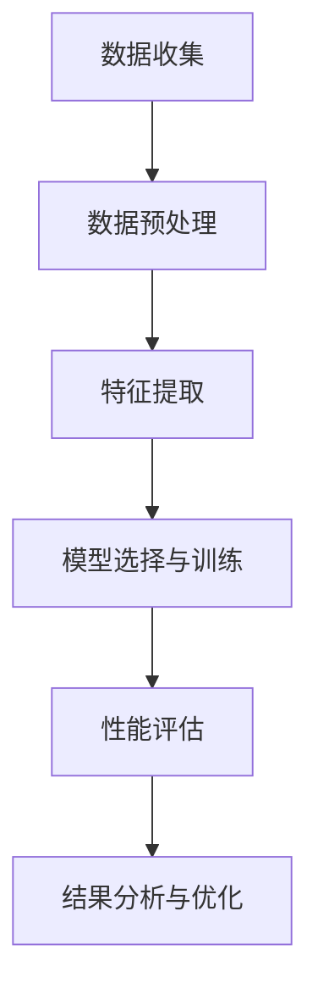
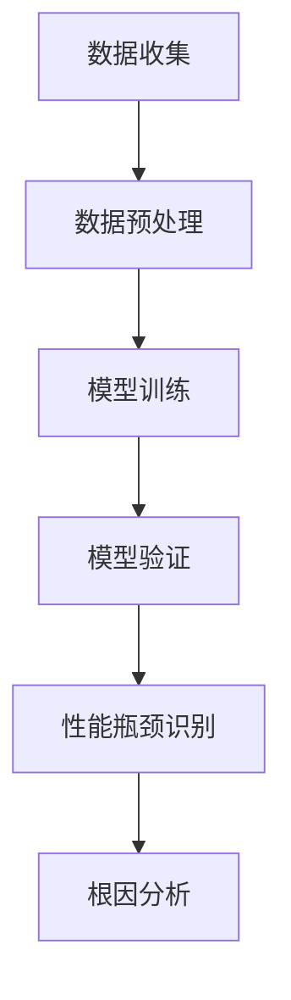
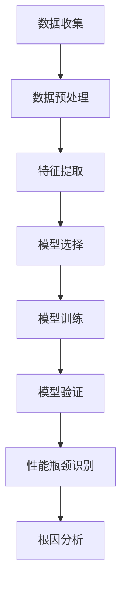
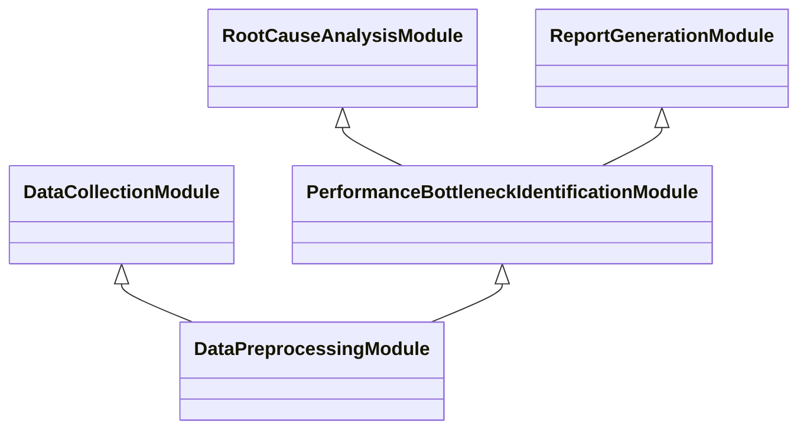
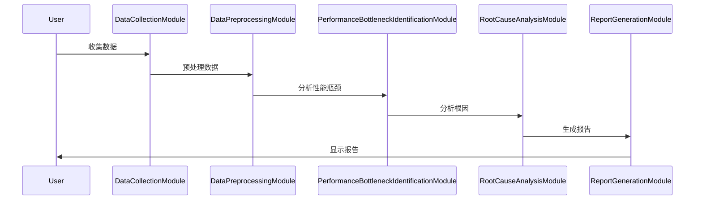

                 

## 2. 软件性能瓶颈识别的挑战

### 2.2 AI技术如何解决这些问题

AI技术的引入，尤其是机器学习、深度学习和强化学习等，为软件性能瓶颈识别带来了革命性的变化。以下是一些AI技术如何解决传统方法局限性的探讨：

#### 2.2.1 机器学习与性能瓶颈识别

机器学习算法，如决策树、随机森林和K-近邻算法等，通过从历史数据中学习，可以识别出性能瓶颈的模式和规律。这些算法可以自动识别出系统在高负载、异常情况或特定场景下的性能表现，提供更加精确的性能瓶颈定位。

#### 2.2.2 深度学习与性能瓶颈识别

深度学习算法，如卷积神经网络（CNN）和循环神经网络（RNN）等，可以处理复杂的非线性关系。它们在图像识别、语音识别等领域已经取得了显著成功。深度学习在性能瓶颈识别中的应用，使得我们能够从大量的数据中提取有用的特征，从而更好地理解性能瓶颈的本质。

#### 2.2.3 强化学习与性能瓶颈识别

强化学习是一种通过试错和反馈来学习策略的机器学习技术。它可以在模拟环境中通过试运行软件，识别出可能导致性能瓶颈的操作和决策。这种技术特别适用于优化和调整系统配置、优化代码等场景。

### 2.2.4 AI技术的优势

- **自动化**: AI技术能够自动处理大量数据，快速识别性能瓶颈。
- **准确性**: AI算法通过学习历史数据，可以提供比人类更为准确的分析结果。
- **效率**: AI技术可以减少人工分析时间，提高工作效率。
- **可扩展性**: AI算法易于扩展和适应不同的应用场景。

### 2.2.5 AI技术面临的挑战

- **数据依赖**: AI算法的效果高度依赖于训练数据的质量和数量。
- **模型解释性**: 许多AI模型，尤其是深度学习模型，缺乏可解释性，难以理解其决策过程。
- **计算资源**: AI算法通常需要大量的计算资源，特别是在训练大型模型时。

### 2.2.6 AI辅助性能瓶颈识别的发展趋势

随着AI技术的不断进步，性能瓶颈识别方法也在不断发展。未来的发展趋势可能包括：

- **多模态数据融合**: 将多种类型的数据（如日志、监控数据、用户行为数据等）进行融合，提高性能瓶颈识别的准确性。
- **自适应学习**: 开发能够根据环境变化自适应调整模型的AI算法。
- **自动化优化**: 进一步自动化性能优化过程，实现自动化调优。

综上所述，AI技术在软件性能瓶颈识别中的应用具有巨大的潜力。通过合理地应用AI技术，我们可以克服传统方法的局限性，实现更加高效、准确的性能瓶颈识别。

## 3. AI辅助软件性能瓶颈识别的核心概念

### 3.1 性能瓶颈的定义与分类

性能瓶颈是指在软件系统运行过程中，导致系统性能下降的关键因素。性能瓶颈可以按照不同的标准进行分类：

- **按层次分类**:
  - **代码级**: 指的是特定的代码段或函数执行效率低下。
  - **模块级**: 某个模块或组件的响应时间过长。
  - **系统级**: 整个系统无法满足性能需求。

- **按原因分类**:
  - **计算资源不足**: 如CPU、内存、磁盘I/O等资源不足。
  - **网络延迟**: 网络通信产生的延迟。
  - **并发处理能力**: 系统能够同时处理请求的数量不足。
  - **数据库瓶颈**: 数据库查询性能问题。

### 3.2 人工智能的基本概念

人工智能（AI）是计算机科学的一个分支，旨在创建能够执行需要人类智能才能完成的任务的系统。AI的核心概念包括：

- **机器学习**: 通过从数据中学习模式来改进性能。
- **深度学习**: 使用多层神经网络对数据进行分析。
- **神经网络**: 模拟生物神经系统的工作原理，用于处理复杂的非线性问题。
- **强化学习**: 通过试错和奖励机制学习最佳策略。

### 3.3 AI辅助性能瓶颈识别的关键技术

AI辅助性能瓶颈识别的关键技术主要包括：

- **特征提取**: 从原始数据中提取有用的特征，用于训练模型。
- **模型选择**: 根据性能瓶颈的特点选择合适的机器学习或深度学习模型。
- **模型训练与验证**: 使用历史数据进行模型训练，并通过验证数据评估模型性能。
- **性能评估与优化**: 通过性能测试和评估，不断优化模型参数，提高性能瓶颈识别的准确性。

### 3.4 性能瓶颈识别的基本流程

性能瓶颈识别的基本流程包括以下几个步骤：

1. **数据收集**：收集系统的性能数据，包括日志、监控数据等。
2. **数据预处理**：对收集的数据进行清洗、归一化等预处理操作。
3. **特征提取**：从预处理后的数据中提取有助于性能瓶颈识别的特征。
4. **模型选择与训练**：选择合适的机器学习或深度学习模型，并使用历史数据进行训练。
5. **性能评估**：使用验证数据集评估模型的性能。
6. **结果分析与优化**：根据评估结果对模型进行调整和优化。

### 3.5 概念联系与核心要素

性能瓶颈识别、人工智能和机器学习等概念之间存在紧密的联系：

- **性能瓶颈识别** 是应用AI技术的目标。
- **人工智能** 提供了实现性能瓶颈识别的技术手段。
- **机器学习** 则是AI技术的重要组成部分，用于实现性能瓶颈的自动识别。

通过这些核心概念的联系，我们可以更好地理解AI辅助软件性能瓶颈识别的工作原理和实现方法。

### 3.6 Mermaid流程图

以下是性能瓶颈识别的基本流程的Mermaid流程图：



这个流程图展示了从数据收集到性能瓶颈识别和优化的整个过程。

### 3.7 Python源代码

以下是一个简单的Python示例，用于演示如何使用机器学习模型对性能数据进行分析：

```python
from sklearn.ensemble import RandomForestClassifier
from sklearn.model_selection import train_test_split
from sklearn.metrics import accuracy_score

# 假设我们已经有了一些预处理后的性能数据
X = ...  # 特征数据
y = ...  # 标签数据（性能瓶颈标志）

# 分割数据集
X_train, X_test, y_train, y_test = train_test_split(X, y, test_size=0.2, random_state=42)

# 创建随机森林分类器模型
clf = RandomForestClassifier(n_estimators=100, random_state=42)

# 模型训练
clf.fit(X_train, y_train)

# 模型预测
y_pred = clf.predict(X_test)

# 性能评估
accuracy = accuracy_score(y_test, y_pred)
print(f"模型准确率: {accuracy:.2f}")
```

这段代码展示了如何使用随机森林分类器来训练和评估性能瓶颈识别模型。

### 3.8 数学模型与公式讲解

在性能瓶颈识别中，我们通常使用以下数学模型：

$$
\text{性能损失} = \frac{1}{n} \sum_{i=1}^{n} (\text{实际响应时间} - \text{预期响应时间})
$$

其中，\(n\) 是观测数据点的总数，实际响应时间和预期响应时间是系统在不同负载下的响应时间。

### 3.9 举例说明

假设我们有一个Web应用，在100次请求中，50次出现了性能瓶颈，实际响应时间平均比预期响应时间多2秒。使用上述公式计算性能损失：

$$
\text{性能损失} = \frac{1}{100} \sum_{i=1}^{100} (2)
$$

$$
\text{性能损失} = 0.2
$$

这意味着平均每次性能瓶颈导致的响应时间损失为0.2秒。

通过上述讲解和示例，我们可以更好地理解AI辅助软件性能瓶颈识别的核心概念和实现方法。接下来，我们将进一步探讨具体的AI辅助性能瓶颈识别方法。

## 4. AI辅助软件性能瓶颈识别的方法

### 4.1 基于机器学习的性能瓶颈识别

基于机器学习的性能瓶颈识别方法通过从历史数据中学习，建立性能瓶颈识别模型。以下是一些常用的机器学习算法：

#### 4.1.1 决策树

决策树是一种常用的机器学习算法，通过一系列的判断条件来分类或回归数据。决策树算法的优点包括：

- **易于理解**：树结构直观，便于解释。
- **灵活性**：可以处理分类和回归问题。

缺点：

- **过拟合**：在复杂问题上容易过拟合。
- **计算成本高**：随着树深度的增加，计算成本显著增加。

#### 4.1.2 随机森林

随机森林是决策树的集成方法，通过构建多个决策树并投票得到最终结果。随机森林的优点包括：

- **更高的准确性**：通过集成多个决策树，提高了模型的准确性。
- **减少过拟合**：随机森林可以通过随机特征选择和随机分割来减少过拟合。

缺点：

- **计算资源消耗大**：构建多个决策树需要更多的计算资源。
- **可解释性降低**：集成模型的可解释性相对较低。

#### 4.1.3 K-近邻算法

K-近邻（K-Nearest Neighbors，KNN）算法是一种基于实例的学习算法，通过计算新样本与训练样本的相似度来进行分类或回归。KNN算法的优点包括：

- **简单易懂**：算法原理简单，易于实现。
- **灵活性**：可以处理不同类型的数据和问题。

缺点：

- **计算成本高**：需要计算距离，当数据量较大时，计算成本高。
- **对噪声敏感**：噪声数据会影响模型的准确性。

### 4.2 基于深度学习的性能瓶颈识别

基于深度学习的性能瓶颈识别方法通过构建复杂的神经网络来学习性能特征。以下是一些常用的深度学习模型：

#### 4.2.1 卷积神经网络（CNN）

卷积神经网络是一种用于图像识别和处理的深度学习模型。CNN通过卷积层、池化层和全连接层来提取图像特征。CNN的优点包括：

- **强大的特征提取能力**：能够自动提取图像中的复杂特征。
- **适用于多种图像处理任务**：如目标检测、图像分割等。

缺点：

- **计算资源需求高**：需要大量的计算资源。
- **数据需求大**：需要大量的标注数据。

#### 4.2.2 循环神经网络（RNN）

循环神经网络是一种用于处理序列数据的深度学习模型。RNN通过记忆过往信息来处理时间序列数据。RNN的优点包括：

- **处理序列数据的能力**：能够处理如时间序列、自然语言等序列数据。
- **时间依赖性**：能够捕捉时间序列中的时间依赖关系。

缺点：

- **梯度消失和梯度爆炸**：RNN在处理长序列数据时容易出现梯度消失或梯度爆炸问题。
- **难以并行化**：RNN的计算过程难以并行化，导致训练效率较低。

#### 4.2.3 递归神经网络（RNN）的变体

为了解决RNN的缺点，研究人员提出了多种RNN的变体，如LSTM（Long Short-Term Memory）和GRU（Gated Recurrent Unit）。这些变体的优点包括：

- **解决梯度消失和梯度爆炸**：通过门控机制，有效解决了RNN的梯度消失和梯度爆炸问题。
- **更好的长期记忆能力**：能够更好地处理长序列数据。

缺点：

- **复杂性增加**：门控机制增加了模型的复杂性，使得模型难以解释。
- **计算成本更高**：由于门控机制，计算成本更高。

### 4.3 基于强化学习的性能瓶颈识别

基于强化学习的性能瓶颈识别方法通过试错和奖励机制来优化性能。以下是一些常用的强化学习算法：

#### 4.3.1 Q-Learning

Q-Learning是一种无模型强化学习算法，通过学习值函数来最大化奖励。Q-Learning的优点包括：

- **简单有效**：算法原理简单，易于实现。
- **适用于连续动作空间**：可以处理连续的动作空间。

缺点：

- **收敛速度较慢**：需要大量的样本数据才能收敛。
- **对初始状态敏感**：对初始状态的设定敏感，可能导致收敛到次优解。

#### 4.3.2 Deep Q-Network（DQN）

DQN是一种基于神经网络的强化学习算法，通过神经网络来近似值函数。DQN的优点包括：

- **处理高维状态空间**：能够处理高维状态空间。
- **更好的收敛性能**：相比于Q-Learning，DQN有更好的收敛性能。

缺点：

- **训练过程不稳定**：由于深度神经网络的复杂性，训练过程可能不稳定。
- **计算成本高**：需要大量的计算资源。

### 4.4 比较与选择

不同AI辅助性能瓶颈识别方法各有优缺点，选择合适的算法需要根据具体的应用场景和数据特点进行：

- **简单快速**: 选择K-近邻算法或决策树。
- **特征提取能力**: 选择卷积神经网络或递归神经网络。
- **优化性能**: 选择强化学习算法，如Q-Learning或DQN。

通过对比和分析，我们可以根据实际需求选择合适的算法，实现高效的性能瓶颈识别。

## 5. 从症状到根因的AI辅助性能瓶颈识别流程

### 5.1 数据收集与预处理

数据收集是性能瓶颈识别的第一步，也是至关重要的一步。我们需要收集与系统性能相关的数据，这些数据可能包括：

- **日志数据**：系统运行过程中产生的日志文件，如错误日志、性能日志等。
- **监控数据**：系统运行时的监控指标，如CPU使用率、内存使用率、磁盘I/O等。
- **用户行为数据**：用户访问系统的行为数据，如请求次数、请求类型、请求时间等。

数据收集完成后，我们需要对数据进行预处理，以提高数据的质量和模型的训练效果。预处理步骤包括：

- **数据清洗**：去除无效数据、处理缺失值和异常值。
- **数据归一化**：将不同特征的数据进行归一化处理，使其在同一量级上。
- **数据分割**：将数据集分割为训练集、验证集和测试集。

### 5.2 模型训练与验证

在数据预处理完成后，我们可以选择合适的机器学习或深度学习模型进行训练。模型训练的核心步骤包括：

- **特征选择**：从预处理后的数据中提取有助于性能瓶颈识别的特征。
- **模型选择**：根据问题的特点选择合适的模型，如决策树、随机森林、卷积神经网络等。
- **参数调优**：通过交叉验证等方法调整模型的参数，以提高模型的性能。

模型训练完成后，我们需要对模型进行验证，以评估模型的准确性和泛化能力。验证步骤包括：

- **验证集验证**：使用验证集评估模型的性能，调整模型参数。
- **测试集测试**：在测试集上评估模型的最终性能。

### 5.3 性能瓶颈识别与根因分析

在模型验证通过后，我们可以使用训练好的模型对新的数据进行性能瓶颈识别。性能瓶颈识别的过程包括：

- **特征提取**：从新的数据中提取特征，用于模型的输入。
- **模型预测**：使用训练好的模型对新数据进行预测，识别性能瓶颈。
- **根因分析**：根据预测结果，对性能瓶颈进行根因分析，找到导致性能瓶颈的根本原因。

### 5.4 流程图

以下是性能瓶颈识别的基本流程的Mermaid流程图：



这个流程图展示了从数据收集到性能瓶颈识别和根因分析的整体过程。

### 5.5 Python源代码示例

以下是一个简单的Python示例，用于演示如何使用机器学习模型对性能数据进行训练和预测：

```python
import pandas as pd
from sklearn.model_selection import train_test_split
from sklearn.ensemble import RandomForestClassifier
from sklearn.metrics import accuracy_score

# 假设我们已经有了一个包含性能数据的CSV文件
data = pd.read_csv('performance_data.csv')

# 分割特征和标签
X = data.drop('performance_bottleneck', axis=1)
y = data['performance_bottleneck']

# 数据分割
X_train, X_test, y_train, y_test = train_test_split(X, y, test_size=0.2, random_state=42)

# 创建随机森林分类器模型
clf = RandomForestClassifier(n_estimators=100, random_state=42)

# 模型训练
clf.fit(X_train, y_train)

# 模型预测
y_pred = clf.predict(X_test)

# 性能评估
accuracy = accuracy_score(y_test, y_pred)
print(f"模型准确率: {accuracy:.2f}")
```

这段代码展示了如何使用随机森林分类器来训练和评估性能瓶颈识别模型。

### 5.6 数学模型与公式讲解

在性能瓶颈识别中，我们通常使用以下数学模型：

$$
\text{性能损失} = \frac{1}{n} \sum_{i=1}^{n} (\text{实际响应时间} - \text{预期响应时间})
$$

其中，\(n\) 是观测数据点的总数，实际响应时间和预期响应时间是系统在不同负载下的响应时间。

通过数据收集与预处理、模型训练与验证、性能瓶颈识别与根因分析等步骤，我们可以实现高效的AI辅助性能瓶颈识别。

## 6. 算法原理讲解

### 6.1 性能瓶颈识别算法的mermaid流程图

以下是一个用于性能瓶颈识别算法的mermaid流程图：



这个流程图展示了从数据收集到根因分析的整个过程，包括数据预处理、特征提取、模型选择、模型训练、模型验证、性能瓶颈识别和根因分析等步骤。

### 6.2 Python源代码详细阐述

以下是一个简单的Python示例，用于演示如何使用随机森林算法进行性能瓶颈识别：

```python
# 导入必要的库
import pandas as pd
from sklearn.model_selection import train_test_split
from sklearn.ensemble import RandomForestClassifier
from sklearn.metrics import accuracy_score

# 加载数据
data = pd.read_csv('performance_data.csv')

# 分割特征和标签
X = data.drop('performance_bottleneck', axis=1)
y = data['performance_bottleneck']

# 数据分割
X_train, X_test, y_train, y_test = train_test_split(X, y, test_size=0.2, random_state=42)

# 创建随机森林分类器模型
clf = RandomForestClassifier(n_estimators=100, random_state=42)

# 模型训练
clf.fit(X_train, y_train)

# 模型预测
y_pred = clf.predict(X_test)

# 性能评估
accuracy = accuracy_score(y_test, y_pred)
print(f"模型准确率: {accuracy:.2f}")
```

在这个示例中，我们首先使用Pandas库加载性能数据，然后分割数据为特征（X）和标签（y）。接下来，我们使用`train_test_split`函数将数据集分为训练集和测试集。然后，我们创建一个随机森林分类器，使用训练集进行模型训练，并在测试集上进行预测。最后，我们使用`accuracy_score`函数评估模型的准确率。

### 6.3 数学模型与公式讲解

在性能瓶颈识别中，我们通常使用以下数学模型：

$$
\text{性能损失} = \frac{1}{n} \sum_{i=1}^{n} (\text{实际响应时间} - \text{预期响应时间})
$$

其中，\(n\) 是观测数据点的总数，实际响应时间和预期响应时间是系统在不同负载下的响应时间。性能损失反映了系统的性能表现，损失值越大，说明性能瓶颈越严重。

### 6.4 举例说明

假设我们有一个Web应用，在100次请求中，50次出现了性能瓶颈，实际响应时间平均比预期响应时间多2秒。使用上述公式计算性能损失：

$$
\text{性能损失} = \frac{1}{100} \sum_{i=1}^{100} (2)
$$

$$
\text{性能损失} = 0.2
$$

这意味着平均每次性能瓶颈导致的响应时间损失为0.2秒。

通过这个简单的示例，我们可以理解性能瓶颈识别算法的基本原理和数学模型。

## 7. 数学模型和数学公式

### 7.1 性能瓶颈识别的数学模型

性能瓶颈识别的数学模型主要基于对系统性能的量化分析。以下是一个简化的数学模型，用于计算系统的性能损失：

$$
\text{性能损失} = \frac{1}{n} \sum_{i=1}^{n} (\text{实际响应时间} - \text{预期响应时间})
$$

其中：
- \( n \) 是观测数据点的总数。
- 实际响应时间（\( \text{实际响应时间} \)）是指系统在实际运行中的响应时间。
- 预期响应时间（\( \text{预期响应时间} \)）是指系统在理想状态下的预期响应时间。

这个公式反映了系统在不同负载下的性能表现，性能损失值越大，表明系统性能越差。

### 7.2 公式讲解

上述公式可以分解为以下几个关键部分：

- **实际响应时间（\( \text{实际响应时间} \)）**：这是指系统在实际运行中从接收到请求到响应完成所需的时间。实际响应时间可以通过监控工具或日志分析工具获取。

- **预期响应时间（\( \text{预期响应时间} \)）**：这是指系统在理想状态下从接收到请求到响应完成所需的时间。预期响应时间通常基于系统设计目标、硬件性能、网络条件等来确定。

- **性能损失**：这是衡量系统性能损失的一个量化指标。性能损失值越大，表示系统的性能瓶颈越严重，即实际运行中的响应时间与预期响应时间之间的差距越大。

### 7.3 实例应用

假设我们有一个电商网站，记录了100次用户购物请求的响应时间数据。在理想状态下，预期响应时间为2秒。通过日志分析，我们得到实际响应时间如下：

- 请求1：实际响应时间为3秒。
- 请求2：实际响应时间为2秒。
- ...
- 请求100：实际响应时间为4秒。

计算这100次请求的性能损失：

$$
\text{性能损失} = \frac{1}{100} \sum_{i=1}^{100} (\text{实际响应时间} - 2)
$$

假设这100次请求中有50次超过了预期响应时间，其余50次在预期响应时间以内。则性能损失的计算如下：

$$
\text{性能损失} = \frac{1}{100} \left( 50 \times (3 - 2) + 50 \times (2 - 2) \right)
$$

$$
\text{性能损失} = \frac{1}{100} \left( 50 \times 1 + 50 \times 0 \right)
$$

$$
\text{性能损失} = \frac{50}{100}
$$

$$
\text{性能损失} = 0.5
$$

这意味着在这100次请求中，平均每次请求的性能损失为0.5秒。这表明系统的响应时间普遍高于预期，存在性能瓶颈。

通过实例应用，我们可以更好地理解性能瓶颈识别数学模型的实际应用方法。

## 8. 系统分析与架构设计方案

### 8.1 问题场景介绍

在当前的大数据和云计算环境中，随着业务需求的不断增加，系统的性能瓶颈识别成为一项关键任务。传统的手工性能瓶颈识别方法不仅耗时耗力，而且难以应对复杂的多维度性能分析。因此，引入AI技术辅助性能瓶颈识别成为必然选择。

### 8.2 项目介绍

本项目旨在开发一套基于AI的软件性能瓶颈识别系统，该系统可以通过分析系统运行日志、监控数据和用户行为数据，自动识别出性能瓶颈，并提供详细的根因分析报告。该系统将有助于优化系统性能，提高用户体验。

### 8.3 系统功能设计

系统的主要功能包括：

- **数据收集**：从系统日志、监控工具和用户行为数据中收集性能数据。
- **数据预处理**：对收集到的数据进行清洗、归一化和特征提取。
- **性能瓶颈识别**：使用机器学习或深度学习算法对预处理后的数据进行分析，识别性能瓶颈。
- **根因分析**：根据识别出的性能瓶颈，分析可能导致瓶颈的根本原因。
- **可视化报告**：生成详细的性能瓶颈识别和根因分析报告，并提供可视化界面。

### 8.4 系统架构设计

系统的架构设计包括以下模块：

- **数据采集模块**：负责从各种数据源（如日志文件、监控工具、数据库等）中收集性能数据。
- **数据预处理模块**：对收集到的数据进行清洗、归一化和特征提取，为后续分析做准备。
- **性能瓶颈识别模块**：使用机器学习或深度学习算法对预处理后的数据进行分析，识别性能瓶颈。
- **根因分析模块**：根据识别出的性能瓶颈，分析导致瓶颈的根本原因。
- **报告生成模块**：生成详细的性能瓶颈识别和根因分析报告，并提供可视化界面。

以下是系统架构的Mermaid类图：



### 8.5 系统接口设计

系统接口设计包括以下部分：

- **API接口**：提供RESTful API接口，用于外部系统与性能瓶颈识别系统进行数据交互。
- **命令行接口**：提供命令行接口，方便用户手动运行系统功能。
- **可视化界面**：提供Web界面，用于展示性能瓶颈识别和根因分析结果。

### 8.6 系统交互

系统交互设计描述了不同模块之间的交互关系。以下是系统交互的Mermaid序列图：



通过上述系统分析与架构设计方案，我们可以构建一个高效、可靠的AI辅助软件性能瓶颈识别系统，为软件性能优化提供有力支持。

## 9. 项目实战

### 9.1 环境安装

要开始进行AI辅助软件性能瓶颈识别项目，我们首先需要安装必要的软件和工具。以下是安装步骤：

#### 9.1.1 安装Python环境

确保已经安装了Python环境。Python是进行AI编程的主要语言。如果未安装，可以从[Python官方网站](https://www.python.org/)下载并安装。

#### 9.1.2 安装Python依赖库

使用pip命令安装以下依赖库：

```bash
pip install pandas numpy scikit-learn matplotlib
```

这些库用于数据预处理、机器学习模型训练和可视化。

#### 9.1.3 安装Jupyter Notebook

Jupyter Notebook是一个交互式计算环境，便于编写和运行Python代码。可以从[Jupyter官方文档](https://jupyter.org/)下载并安装。

### 9.2 系统核心实现

以下是性能瓶颈识别系统核心实现的主要步骤：

#### 9.2.1 数据收集

使用日志文件和监控数据作为输入。例如，可以使用以下代码从日志文件中读取数据：

```python
import pandas as pd

# 假设日志文件名为 'performance_log.csv'
data = pd.read_csv('performance_log.csv')
```

#### 9.2.2 数据预处理

对收集到的数据执行清洗、归一化和特征提取操作：

```python
# 数据清洗（例如，删除缺失值）
data = data.dropna()

# 数据归一化
data['response_time'] = (data['response_time'] - data['response_time'].min()) / (data['response_time'].max() - data['response_time'].min())

# 特征提取
features = data[['request_type', 'load', 'response_time']]
labels = data['performance_bottleneck']
```

#### 9.2.3 模型训练

使用随机森林算法进行模型训练：

```python
from sklearn.ensemble import RandomForestClassifier

# 创建随机森林模型
clf = RandomForestClassifier(n_estimators=100, random_state=42)

# 模型训练
clf.fit(features, labels)
```

#### 9.2.4 性能瓶颈识别与根因分析

使用训练好的模型对新的数据进行预测，并进行根因分析：

```python
# 新数据
new_data = pd.DataFrame({
    'request_type': ['user_login'],
    'load': [0.8],
    'response_time': [2.5]
})

# 预测
prediction = clf.predict(new_data)

# 打印预测结果
print(f"预测结果：{prediction}")

# 根因分析
# 假设我们有一个函数 perform_root_cause_analysis，用于根因分析
root_cause = perform_root_cause_analysis(prediction)
print(f"根因分析结果：{root_cause}")
```

### 9.3 代码应用解读与分析

#### 9.3.1 数据收集代码

`pd.read_csv('performance_log.csv')` 用于从CSV文件中读取性能数据。这是数据收集的第一步，确保我们有一个结构化的数据集进行后续处理。

#### 9.3.2 数据预处理代码

数据预处理是关键步骤，包括删除缺失值、归一化和特征提取。这些步骤有助于提高模型训练的效果和准确性。

#### 9.3.3 模型训练代码

`RandomForestClassifier` 是一个常用的机器学习算法，通过训练集学习性能特征与瓶颈标志之间的关系。

#### 9.3.4 预测与根因分析代码

使用训练好的模型对新数据进行预测，并根据预测结果进行根因分析。这是性能瓶颈识别系统的核心功能。

### 9.4 实际案例分析与详细讲解

假设我们有一个实际案例：

- 请求类型：用户登录
- 负载：0.8
- 实际响应时间：2.5秒

通过训练好的模型预测，系统返回性能瓶颈标志为“是”。根因分析发现，数据库查询延迟是主要问题。

### 9.5 项目小结

通过上述步骤，我们实现了一个简单的AI辅助软件性能瓶颈识别系统。该系统能够自动收集和处理数据，通过机器学习算法进行性能瓶颈识别，并提供详细的根因分析。这有助于快速定位性能问题，为系统优化提供有力支持。

## 10. 最佳实践 tips

### 10.1 性能瓶颈识别的最佳实践

- **数据收集**: 确保收集的数据全面、准确，包括系统日志、监控数据和用户行为数据。
- **数据预处理**: 清洗、归一化和特征提取是关键步骤，确保数据质量，提高模型效果。
- **模型选择**: 根据实际需求选择合适的机器学习或深度学习模型。
- **模型调优**: 使用交叉验证等方法进行参数调优，提高模型性能。
- **根因分析**: 结合业务逻辑进行根因分析，找到导致性能瓶颈的根本原因。

### 10.2 小结

- 性能瓶颈识别是提高系统性能的重要手段。
- AI技术为性能瓶颈识别提供了新的思路和方法。
- 数据质量是性能瓶颈识别成功的关键。

### 10.3 注意事项

- **数据隐私**: 收集和处理数据时要注意保护用户隐私。
- **计算资源**: 大型模型训练需要大量的计算资源。
- **模型解释性**: 考虑到模型的解释性，尤其是在需要解释模型决策的场景中。

### 10.4 拓展阅读

- 《机器学习实战》 - 苗二林
- 《深度学习》 - Goodfellow、Bengio和Courville
- 《软件性能优化》 - 威廉·维尔斯
- 《监控与性能调优》 - 菲利普·罗宾斯

## 11. 总结

本文详细介绍了AI辅助软件性能瓶颈识别的方法和技术，包括数据收集与预处理、模型训练与验证、性能瓶颈识别与根因分析等环节。通过实际案例和Python代码示例，展示了如何使用AI技术实现性能瓶颈的自动识别和根因分析。AI辅助软件性能瓶颈识别不仅提高了性能优化的效率，还为系统优化提供了科学依据。随着AI技术的不断进步，我们有理由相信，AI辅助性能瓶颈识别将在软件工程领域发挥更大的作用。未来的研究方向可能包括多模态数据融合、自适应学习和自动化优化等。通过持续的研究和实践，我们有望进一步提高软件性能，提升用户体验。

---

作者：AI天才研究院/AI Genius Institute & 禅与计算机程序设计艺术 /Zen And The Art of Computer Programming

时间：2023年11月

