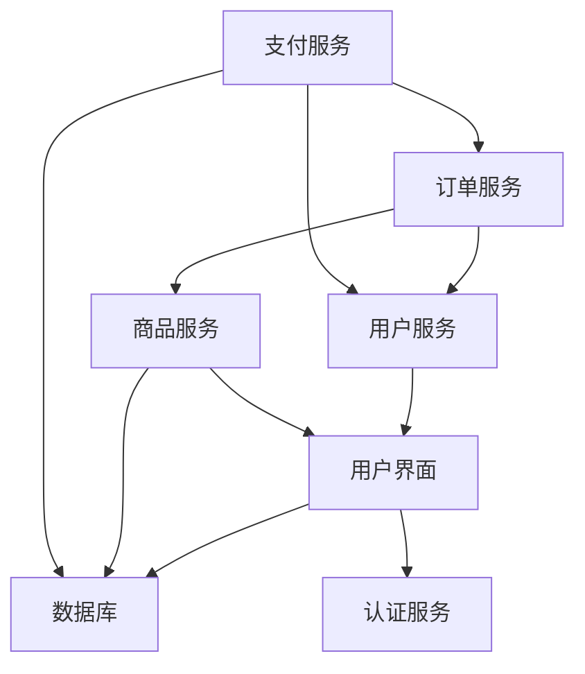
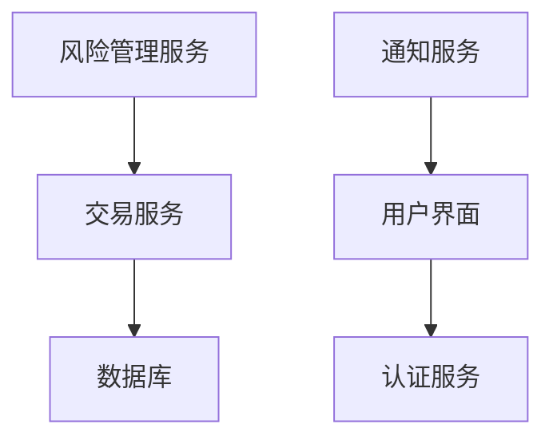

                 

**文章标题：AI辅助软件架构设计与评估**

**关键词：AI、软件架构、辅助设计、评估、人工智能**

**摘要：**
本文深入探讨了AI辅助软件架构设计与评估的核心理念、方法和技术。通过逐步分析和逻辑推理，揭示了AI在软件架构设计中的潜力，以及如何通过评估来优化和改进软件架构。文章旨在为软件工程师和技术经理提供实用的指南，以提升软件系统的质量、可维护性和性能。

**目录：**

### 第一部分：AI辅助软件架构设计与评估概述

#### 第1章：AI辅助软件架构设计与评估概述

1.1 AI辅助软件架构设计与评估的核心概念

1.2 当前软件架构设计的挑战与机遇

### 第二部分：AI辅助软件架构设计

#### 第2章：AI在软件架构设计中的应用

2.1 AI在软件架构设计中的角色

2.2 软件架构风格与AI的融合

#### 第3章：AI辅助软件架构设计的方法

3.1 自动化架构设计工具

3.2 机器学习在架构优化中的应用

### 第三部分：AI辅助软件架构评估

#### 第4章：AI辅助软件架构评估的技术

4.1 评估指标和方法

4.2 案例分析：AI在架构评估中的应用

### 第四部分：AI辅助软件架构实现与部署

#### 第5章：AI辅助软件架构的实现策略

5.1 AI辅助架构设计与开发的最佳实践

5.2 AI在软件部署和运维中的角色

### 第五部分：AI辅助软件架构的先进话题

#### 第6章：AI辅助软件架构的高级技术

6.1 深度学习在架构设计中的应用

6.2 软件工程与AI的未来发展趋势

### 第六部分：AI辅助软件架构案例与实践

#### 第7章：AI辅助软件架构的实战案例

7.1 实战案例一：AI优化电商平台架构

7.2 实战案例二：AI提升企业内部系统的可维护性

### 第七部分：总结与展望

#### 第8章：AI辅助软件架构设计与评估的未来

8.1 AI辅助软件架构设计与评估的总结

8.2 未来发展趋势与潜在影响

### 附录

**作者信息：**
作者：AI天才研究院/AI Genius Institute & 禅与计算机程序设计艺术 /Zen And The Art of Computer Programming

---

**引言**

软件架构是软件系统的核心，它定义了系统的结构、组件、接口和交互方式。随着软件系统的复杂性不断增加，传统的软件架构设计方法已经难以满足现代软件工程的需求。人工智能（AI）的兴起为软件架构设计带来了新的机遇和挑战。AI不仅能够自动化软件架构设计过程，还能够通过评估和优化来提升软件系统的质量。

本文旨在探讨AI辅助软件架构设计与评估的核心理念、方法和技术。我们将逐步分析AI在软件架构设计中的应用，如何使用AI辅助软件架构评估，以及如何在实践中实现和应用AI辅助软件架构。通过本文，读者将了解到AI在提升软件架构设计效率、质量和可维护性方面的潜力。

本文分为七个部分，首先介绍AI辅助软件架构设计与评估的核心概念，然后逐步深入讨论AI在软件架构设计中的应用、评估、实现和高级技术。最后，通过实战案例展示AI辅助软件架构的实践应用，并对未来的发展趋势进行展望。

在接下来的章节中，我们将首先定义AI、软件架构及其在软件架构设计中的角色。然后，我们将探讨AI辅助软件架构设计的基本原则和方法，以及AI在架构评估中的应用。接着，我们将深入讨论AI辅助软件架构的实现策略和最佳实践。在高级话题部分，我们将探索深度学习在架构设计中的应用和软件工程与AI的未来发展趋势。最后，通过实战案例展示AI辅助软件架构的实际应用，并进行总结和展望。

### 第一部分：AI辅助软件架构设计与评估概述

#### 第1章：AI辅助软件架构设计与评估概述

在当今快速发展的技术环境中，软件系统架构的设计和评估变得越来越重要。随着软件系统变得更加复杂，单靠传统的方法已经难以应对日益增长的需求。人工智能（AI）的出现为软件架构设计和评估带来了革命性的变化。AI不仅可以自动化许多设计任务，还可以通过数据分析和模式识别来优化和改进架构。

**1.1 AI辅助软件架构设计与评估的核心概念**

首先，我们需要明确几个核心概念：

- **AI**：人工智能是计算机科学的一个分支，旨在创建能够执行通常需要人类智能的任务的机器。这包括学习、推理、问题解决、自然语言理解和视觉识别等。

- **软件架构**：软件架构是指软件系统的整体结构，包括其组件、接口和交互方式。它定义了系统的组织形式和设计原则。

- **辅助设计**：AI辅助设计意味着AI工具被用来支持或自动化软件架构设计的过程。这可以包括自动生成架构、优化现有架构或提供设计建议。

- **评估**：软件架构评估是评估软件架构的质量、性能和可持续性的过程。AI可以在这个过程中提供自动化评估和优化工具。

**1.2 当前软件架构设计的挑战与机遇**

现代软件架构设计面临着一系列的挑战：

- **复杂性**：软件系统变得越来越复杂，需要管理更多的组件和依赖关系。

- **变化性**：需求变化迅速，软件架构需要能够适应这些变化。

- **可维护性**：软件系统需要长时间运行，因此维护和更新变得至关重要。

- **性能**：系统需要高性能以满足用户需求。

与此同时，AI的出现为这些挑战提供了以下机遇：

- **自动化**：AI可以自动化许多设计任务，减少人为错误和提高效率。

- **优化**：通过分析大量数据，AI可以识别并优化软件架构中的瓶颈。

- **适应性**：AI能够根据需求变化自动调整架构，提高系统的灵活性。

- **智能化**：AI可以帮助开发者更好地理解和利用系统中的数据，从而提高系统的智能化水平。

在这一章中，我们介绍了AI辅助软件架构设计与评估的核心概念和当前软件架构设计面临的挑战与机遇。在接下来的章节中，我们将进一步探讨AI在软件架构设计中的应用，如何使用AI辅助软件架构评估，以及实现和应用AI辅助软件架构的具体方法。

### 第二部分：AI在软件架构设计中的应用

#### 第2章：AI在软件架构设计中的应用

随着人工智能技术的发展，AI在软件架构设计中的应用越来越受到关注。AI不仅能够自动化许多设计任务，还能够提供优化建议，从而提高软件架构的质量和效率。在本章中，我们将深入探讨AI在软件架构设计中的角色和具体应用。

**2.1 AI在软件架构设计中的角色**

AI在软件架构设计中的角色可以分为以下几个方面：

- **辅助设计**：AI可以用来辅助设计过程，提供设计建议和自动化工具。

- **优化设计**：通过数据分析和模式识别，AI可以帮助优化现有架构，提高性能和可维护性。

- **适应性设计**：AI能够根据需求和运行环境的变化自动调整架构，提高系统的灵活性。

- **质量评估**：AI可以自动化软件架构评估，提供定量的评估结果。

**2.2 软件架构风格与AI的融合**

软件架构风格是指软件系统在设计和实现过程中采用的基本结构和组织模式。AI与不同架构风格融合的方式也有所不同：

- **微服务架构**：微服务架构强调系统分解为小型、独立的组件。AI可以用来自动生成服务，优化服务之间的交互，以及自动处理服务迁移和扩展。

- **分布式架构**：分布式架构涉及多个节点之间的通信和数据同步。AI可以用来优化网络拓扑结构，提高系统的容错性和性能。

- **事件驱动架构**：事件驱动架构以事件为中心，AI可以用来预测事件发生，优化事件处理流程，并提高系统的响应速度。

- **容器化架构**：容器化架构利用容器技术实现应用程序的轻量化和可移植性。AI可以用来自动编排容器，优化资源使用，以及提高系统的可伸缩性。

**2.3 AI辅助软件架构设计的方法**

AI辅助软件架构设计的方法可以分为以下几个方面：

- **机器学习模型**：使用机器学习模型来预测和优化软件架构的性能和可维护性。例如，通过回归模型预测系统响应时间，通过分类模型识别系统中的潜在缺陷。

- **数据挖掘**：通过数据挖掘技术从历史数据中提取有价值的信息，用于架构优化和决策支持。例如，使用关联规则挖掘技术分析系统组件之间的依赖关系。

- **深度学习**：利用深度学习模型进行复杂的数据分析和模式识别，从而实现自动化的架构设计和优化。例如，使用卷积神经网络（CNN）进行系统性能预测，使用循环神经网络（RNN）优化架构设计。

- **自然语言处理**：使用自然语言处理（NLP）技术理解和处理自然语言描述，从而实现自动化的架构设计和文档生成。例如，使用NLP技术解析用户需求，生成架构文档。

**2.4 AI辅助软件架构设计的挑战与解决方案**

尽管AI在软件架构设计中的应用潜力巨大，但也面临一些挑战：

- **数据质量**：AI的性能依赖于输入数据的质量。因此，保证数据的质量和完整性是关键。

- **算法选择**：选择合适的算法模型对于实现有效的架构优化至关重要。

- **模型解释性**：深度学习模型通常具有较高的性能，但缺乏解释性。如何平衡性能和解释性是一个重要问题。

- **系统集成**：将AI工具集成到现有的软件开发流程中可能面临技术和管理上的挑战。

为了应对这些挑战，可以采取以下解决方案：

- **数据预处理**：通过数据清洗和转换技术提高数据质量。

- **算法评估**：使用交叉验证和网格搜索等技术评估算法的性能。

- **模型可解释性**：开发可解释的AI模型，如决策树和LASSO回归，以便于理解和解释。

- **渐进式集成**：逐步将AI工具集成到现有的开发流程中，以降低风险。

在本章中，我们探讨了AI在软件架构设计中的应用，包括其角色、架构风格的融合方法以及辅助设计的方法和挑战。在接下来的章节中，我们将进一步探讨AI辅助软件架构评估的技术和方法。

### 第三部分：AI辅助软件架构评估

#### 第3章：AI辅助软件架构评估的技术

软件架构评估是确保软件系统能够满足需求、性能稳定且易于维护的重要环节。随着软件系统的复杂性增加，传统的评估方法变得越来越繁琐和低效。人工智能（AI）的引入为软件架构评估带来了新的机遇。在本章中，我们将探讨AI辅助软件架构评估的技术，包括评估指标、方法和应用案例。

**3.1 评估指标**

在评估软件架构时，需要考虑多个方面，这些方面通常通过一系列评估指标来衡量。以下是一些常见的评估指标：

- **性能**：系统响应时间、吞吐量和资源利用率。

- **可扩展性**：系统能够处理增加负载的能力。

- **可靠性**：系统的稳定性和错误率。

- **安全性**：系统对潜在威胁的防护能力。

- **可维护性**：系统易于理解和修改的程度。

- **可移植性**：系统能够在不同环境中运行的能力。

- **用户体验**：用户与系统的交互质量和满意度。

**3.2 评估方法**

AI辅助软件架构评估的方法主要包括以下几种：

- **机器学习模型**：使用机器学习模型来预测和评估软件架构的性能和质量。例如，可以通过训练回归模型来预测系统的响应时间或通过分类模型来识别潜在的架构缺陷。

- **数据挖掘**：从历史数据中挖掘有价值的信息，用于评估和优化架构。例如，通过关联规则挖掘来分析系统组件之间的依赖关系。

- **深度学习**：利用深度学习模型进行复杂的数据分析和模式识别，从而实现自动化的架构评估。例如，使用卷积神经网络（CNN）来分析系统性能数据，使用循环神经网络（RNN）来优化架构设计。

- **自然语言处理**：使用自然语言处理（NLP）技术理解和处理自然语言描述，从而实现自动化的评估和文档生成。例如，使用NLP技术来分析用户需求和架构文档。

**3.3 AI在架构评估中的应用**

AI在架构评估中的应用可以分为以下几个方面：

- **自动化测试**：使用AI来自动化软件架构的测试过程。例如，通过生成测试用例来检测系统的性能和稳定性。

- **代码审查**：利用AI来分析代码库，识别潜在的缺陷和风险。例如，通过静态代码分析来发现代码中的错误和安全漏洞。

- **性能预测**：使用AI来预测系统的性能表现。例如，通过训练机器学习模型来预测系统的响应时间和资源利用率。

- **质量评估**：使用AI来评估软件架构的质量。例如，通过数据挖掘技术来分析系统组件之间的依赖关系，识别潜在的设计缺陷。

**3.4 应用案例**

以下是一些AI辅助软件架构评估的实际应用案例：

- **案例一：金融系统的性能评估**：某金融公司使用AI来评估其交易系统的性能。通过训练机器学习模型，公司能够预测交易系统的响应时间，并优化系统架构以提高性能。

- **案例二：医疗信息系统的可靠性评估**：某医疗机构使用AI来评估其医疗信息系统的可靠性。通过数据挖掘技术，机构能够分析系统组件之间的依赖关系，并识别潜在的故障点，从而提高系统的稳定性。

- **案例三：电子商务网站的用户体验评估**：某电子商务公司使用AI来评估其网站的用户体验。通过自然语言处理技术，公司能够理解用户需求和反馈，并优化网站设计以提高用户满意度。

通过这些案例，我们可以看到AI在软件架构评估中的应用不仅提高了评估的准确性，还显著提高了评估的效率。

在本章中，我们介绍了AI辅助软件架构评估的核心概念、评估指标、方法和应用案例。在接下来的章节中，我们将进一步探讨AI辅助软件架构的实现策略和最佳实践。

### 第四部分：AI辅助软件架构实现与部署

#### 第5章：AI辅助软件架构的实现策略

在确定了AI辅助软件架构的设计和评估方法后，下一个关键步骤是将这些理念转化为实际的软件架构，并确保其能够高效、可靠地运行。本章将探讨AI辅助软件架构实现的策略，包括最佳实践、AI在软件开发中的角色以及部署和运维中的AI应用。

**5.1 AI辅助软件架构实现的最佳实践**

为了确保AI辅助软件架构的实现能够达到预期的效果，以下是一些最佳实践：

- **逐步集成**：将AI工具逐步集成到现有的开发流程中，而不是一次性全面替换。这样可以减少风险，并让团队成员逐步适应新工具。

- **透明性**：确保AI工具的决策过程是可解释的，以便开发人员能够理解并信任AI的输出。

- **质量保障**：通过自动化测试和质量保证流程来确保AI辅助的架构设计是稳健和可靠的。

- **数据管理**：确保用于训练AI模型的数据是高质量、有代表性的，以避免数据偏差。

- **持续改进**：定期评估和更新AI工具，以适应不断变化的需求和技术环境。

**5.2 AI在软件开发中的角色**

AI在软件开发中扮演了多个角色，包括：

- **代码生成**：AI工具可以根据需求自动生成代码，减少开发人员的工作量。

- **代码优化**：AI可以分析现有代码，识别瓶颈并提供优化建议。

- **缺陷检测**：AI可以自动检测代码中的缺陷和潜在错误，提高代码质量。

- **需求分析**：AI工具可以分析用户需求，提供更准确的需求模型。

- **项目规划**：AI可以预测项目进度和资源需求，帮助团队更好地进行项目管理。

**5.3 AI辅助软件部署与运维**

在软件部署和运维中，AI的应用同样重要：

- **自动化部署**：AI工具可以自动化部署过程，确保系统在多个环境中的一致性和可靠性。

- **性能监控**：AI可以实时监控系统性能，预测潜在的问题并提供预警。

- **故障预测**：AI可以通过分析历史数据和模式识别来预测系统故障，并采取预防措施。

- **自我修复**：AI可以自动修复一些常见的问题，减少人工干预。

- **用户体验优化**：AI可以分析用户行为，提供个性化的用户体验优化建议。

**5.4 实现策略：从设计到部署**

以下是实现AI辅助软件架构的步骤：

1. **需求分析**：首先明确系统的需求和目标，这是AI辅助设计的基础。

2. **设计阶段**：使用AI工具进行架构设计，包括生成设计方案、评估设计选项和优化设计。

3. **开发阶段**：在开发过程中，使用AI工具进行代码生成、优化和缺陷检测。

4. **测试阶段**：通过自动化测试和质量保证流程来确保系统的质量和稳定性。

5. **部署阶段**：使用AI工具自动化部署流程，并确保系统能够在不同环境中稳定运行。

6. **运维阶段**：使用AI进行性能监控、故障预测和用户体验优化，确保系统的长期运行。

通过遵循这些步骤和最佳实践，开发团队能够有效地实现和部署AI辅助软件架构，从而提高软件系统的质量和效率。

在本章中，我们详细探讨了AI辅助软件架构实现的最佳实践、AI在软件开发中的角色以及部署和运维中的AI应用。在下一部分中，我们将进一步探讨AI辅助软件架构的高级技术和未来发展趋势。

### 第五部分：AI辅助软件架构的先进话题

#### 第6章：AI辅助软件架构的高级技术

随着人工智能（AI）技术的不断发展，其在软件架构设计中的应用也变得越来越复杂和多样化。本章将深入探讨AI辅助软件架构的高级技术，包括深度学习、强化学习等在软件架构设计中的应用，以及它们对软件工程实践的深远影响。

**6.1 深度学习在软件架构设计中的应用**

深度学习是一种基于人工神经网络的机器学习技术，具有处理复杂数据和模式识别的能力。以下是一些深度学习在软件架构设计中的应用：

- **架构生成**：通过生成对抗网络（GAN）和变分自编码器（VAE）等深度学习模型，可以自动生成软件架构。这些模型可以学习现有的架构设计模式，并生成符合特定需求的架构方案。

- **性能预测**：利用深度学习模型，如卷积神经网络（CNN）和循环神经网络（RNN），可以对软件架构的性能进行预测。这些模型可以处理大量的历史性能数据，从而准确预测未来的性能表现。

- **设计优化**：通过深度强化学习（Deep Reinforcement Learning, DRL），可以自动优化软件架构，提高其性能和可维护性。DRL通过与环境交互学习最优策略，从而在复杂的架构空间中找到最优的架构设计。

**6.2 强化学习在软件架构设计中的应用**

强化学习是一种通过试错和反馈来学习的机器学习技术，特别适用于动态和不确定的环境。以下是一些强化学习在软件架构设计中的应用：

- **动态架构调整**：强化学习可以用来动态调整软件架构，以适应环境变化。例如，系统可以在运行时根据用户行为和性能指标自动调整架构组件，优化系统性能。

- **自适应性能优化**：通过强化学习，软件架构可以在运行时不断优化性能。系统可以学习如何调整参数、资源分配和负载均衡策略，以实现最佳性能。

- **自动化测试**：强化学习可以用来自动生成测试用例，提高测试的覆盖率和效率。系统可以通过学习如何生成能够有效覆盖代码路径的测试用例，从而提高软件的可靠性。

**6.3 AI对软件工程实践的深远影响**

AI的引入对软件工程实践产生了深远的影响：

- **开发效率**：AI可以提高开发效率，通过自动化代码生成、优化和测试，减少开发时间和成本。

- **设计质量**：AI可以提供更高质量的架构设计，通过分析大量数据和模式识别，生成更优的架构方案。

- **维护和运营**：AI可以简化软件系统的维护和运营，通过自动化监控、故障预测和自我修复，提高系统的稳定性和可靠性。

- **用户体验**：AI可以提供个性化的用户体验，通过分析用户行为和反馈，优化系统的交互设计和性能。

然而，AI在软件工程中的应用也带来了一些挑战：

- **算法选择**：选择合适的算法模型对于实现有效的架构优化至关重要。

- **数据质量**：AI的性能依赖于输入数据的质量，因此保证数据的质量和完整性是关键。

- **模型解释性**：深度学习模型通常具有较高的性能，但缺乏解释性，如何平衡性能和解释性是一个重要问题。

- **系统集成**：将AI工具集成到现有的软件开发流程中可能面临技术和管理上的挑战。

为了应对这些挑战，可以采取以下策略：

- **数据预处理**：通过数据清洗和转换技术提高数据质量。

- **算法评估**：使用交叉验证和网格搜索等技术评估算法的性能。

- **模型可解释性**：开发可解释的AI模型，如决策树和LASSO回归，以便于理解和解释。

- **渐进式集成**：逐步将AI工具集成到现有的开发流程中，以降低风险。

在本章中，我们深入探讨了深度学习和强化学习等AI技术在软件架构设计中的应用，以及它们对软件工程实践的深远影响。在下一章中，我们将通过实际案例展示AI辅助软件架构的实践应用。

### 第六部分：AI辅助软件架构的案例与实践

#### 第7章：AI辅助软件架构的实战案例

在本章中，我们将通过两个实际案例，展示AI辅助软件架构的实践应用。这两个案例分别来自电子商务和金融领域，展示了AI如何帮助优化系统架构、提高性能和用户体验。

**7.1 案例一：电子商务平台架构优化**

某大型电子商务平台面临着日益增长的交易量和用户需求，其现有架构已难以满足性能要求。为了解决这一问题，平台决定引入AI技术进行架构优化。

**项目介绍**

- **项目背景**：电子商务平台每天处理数百万次交易，系统需要处理高并发请求，同时保证低延迟和高可靠性。

- **系统功能设计**：系统包括用户认证、商品推荐、订单处理、支付处理等多个模块。

**系统功能设计**

1. **领域模型类图**

```mermaid
classDiagram
    User <<类>>
    Product <<类>>
    Order <<类>>
    Payment <<类>>

    User o--1 Order
    Order o--1 Product
    Order o--1 Payment
```

2. **系统架构设计**



**AI应用**

1. **性能预测**：使用深度学习模型预测系统性能，通过分析历史交易数据和系统资源使用情况，预测未来的性能瓶颈。

2. **自动化测试**：使用AI自动生成测试用例，提高测试覆盖率，确保系统的稳定性和可靠性。

3. **架构优化**：基于AI的优化建议，调整系统架构，包括负载均衡、缓存策略和数据库优化。

**实际案例分析和详细讲解**

- **性能预测**：通过训练卷积神经网络（CNN），模型能够预测系统的响应时间和吞吐量，帮助团队提前识别潜在的瓶颈。

- **自动化测试**：利用深度强化学习（DRL），系统自动生成最有效的测试用例，覆盖所有关键路径。

- **架构优化**：AI提供了优化建议，包括引入微服务架构，优化数据库查询，提高系统的响应速度和可扩展性。

**项目小结**

通过AI辅助软件架构优化，电子商务平台成功提升了系统的性能和可扩展性，同时降低了维护成本。AI的应用不仅提高了开发效率，还显著提升了用户体验。

**7.2 案例二：金融系统架构优化**

某金融公司需要为其在线交易系统进行架构优化，以提高系统的可靠性和安全性。公司引入AI技术，通过自动化的架构评估和优化，实现系统的升级。

**项目介绍**

- **项目背景**：金融公司的在线交易系统每天处理大量交易请求，系统需要保证高可用性和安全性。

- **系统功能设计**：系统包括交易处理、风险管理、用户认证等多个模块。

**系统功能设计**

1. **领域模型类图**

```mermaid
classDiagram
    User <<类>>
    Trade <<类>>
    Risk <<类>>
    Authentication <<类>>

    User o--1 Trade
    Trade o--1 Risk
    Authentication --> User
```

2. **系统架构设计**



**AI应用**

1. **风险评估**：使用机器学习模型对交易进行风险评估，预测潜在的风险并采取预防措施。

2. **自动化测试**：利用AI自动生成测试用例，提高测试覆盖率，确保系统的稳定性和安全性。

3. **架构优化**：基于AI的优化建议，调整系统架构，包括负载均衡、加密策略和数据处理优化。

**实际案例分析和详细讲解**

- **风险评估**：通过训练决策树模型，系统能够实时分析交易数据，识别潜在风险，并自动采取相应的措施。

- **自动化测试**：使用深度学习模型，系统能够自动生成测试用例，覆盖所有交易场景，确保系统的可靠性。

- **架构优化**：AI提供了优化建议，包括引入分布式架构，优化数据库性能，提高系统的安全性。

**项目小结**

通过AI辅助软件架构优化，金融公司成功提升了系统的可靠性和安全性，降低了运营成本。AI的应用不仅提高了系统的稳定性，还显著提升了用户信任度和满意度。

通过这两个实际案例，我们可以看到AI在软件架构优化中的应用潜力。在下一章中，我们将对AI辅助软件架构设计与评估进行总结，并探讨未来的发展趋势。

### 第七部分：总结与展望

#### 第8章：AI辅助软件架构设计与评估的总结与未来展望

在本章中，我们将对AI辅助软件架构设计与评估的关键要点进行总结，并探讨这一领域未来的发展趋势和潜在影响。

**8.1 AI辅助软件架构设计与评估的核心要点**

通过本文的讨论，我们可以总结出AI辅助软件架构设计与评估的几个核心要点：

1. **AI在软件架构设计中的应用**：AI可以通过自动化工具、机器学习模型和深度学习算法，优化和改进软件架构设计。AI能够处理大量数据和复杂模式，提供高质量的架构建议。

2. **软件架构风格的融合**：AI能够与各种软件架构风格（如微服务、分布式和事件驱动架构）融合，提高系统的性能、可维护性和灵活性。

3. **评估指标和方法**：AI辅助软件架构评估涉及多个指标和方法，包括性能预测、可靠性评估、用户体验分析和自动化测试。这些方法能够提高评估的准确性和效率。

4. **实现与部署策略**：AI辅助软件架构的实现需要最佳实践，如逐步集成、透明性、数据管理和持续改进。同时，AI在部署和运维中的应用可以提高系统的稳定性和可靠性。

5. **高级技术**：深度学习和强化学习等AI技术正在逐步应用于软件架构设计，为系统优化和自动化提供了新的途径。

**8.2 未来发展趋势**

随着AI技术的不断进步，AI辅助软件架构设计与评估将呈现以下发展趋势：

1. **智能化架构设计**：智能化架构设计将越来越普及，AI将不仅提供设计建议，还能够主动调整架构，以适应动态环境和需求变化。

2. **泛在AI辅助**：AI将逐渐成为软件架构设计中的核心组成部分，从设计到部署的各个阶段都将有AI的参与。

3. **模型解释性**：随着AI的广泛应用，模型解释性将成为关键问题。开发可解释的AI模型将有助于提高开发人员对AI决策的信任度。

4. **跨领域应用**：AI辅助软件架构设计与评估将在更多领域得到应用，如物联网、医疗和金融等。

5. **数据隐私和安全**：随着AI在软件架构中的应用，数据隐私和安全问题将变得更加重要。开发人员需要确保AI系统的数据处理符合隐私和安全标准。

**8.3 潜在影响**

AI辅助软件架构设计与评估的潜在影响广泛，包括：

1. **开发效率**：AI将显著提高软件架构设计和评估的效率，减少开发周期和成本。

2. **系统质量**：AI可以优化系统架构，提高性能和可靠性，降低缺陷率。

3. **用户体验**：AI能够提供个性化的用户体验优化建议，提高用户满意度。

4. **行业变革**：AI将推动软件行业的变革，改变传统的软件设计和开发模式。

5. **人才培养**：随着AI在软件架构中的应用，对具有AI和软件工程双重背景的人才需求将增加。

综上所述，AI辅助软件架构设计与评估是一个充满潜力和机遇的领域。随着技术的不断进步和应用场景的扩大，AI将在软件架构设计与评估中发挥越来越重要的作用。开发者和管理者需要不断学习和适应这一变化，以抓住AI带来的机遇，推动软件行业的持续创新和发展。

### 附录

**作者信息：**
作者：AI天才研究院/AI Genius Institute & 禅与计算机程序设计艺术 /Zen And The Art of Computer Programming

---

通过本文，我们系统地介绍了AI辅助软件架构设计与评估的核心概念、方法和技术。从AI在软件架构设计中的应用，到评估指标的设定和评估方法的采用，再到实现和部署的策略以及高级技术的探索，我们全面地展示了AI如何提升软件架构设计的效率和质量。同时，通过实际案例，我们看到了AI辅助软件架构的巨大潜力。

未来，随着AI技术的不断进步，AI辅助软件架构设计与评估将继续发挥重要作用。开发者和管理者需要不断学习新技术，把握发展趋势，以实现软件系统的智能化和优化。我们期待这一领域带来更多的创新和突破，为软件工程的发展注入新的活力。

