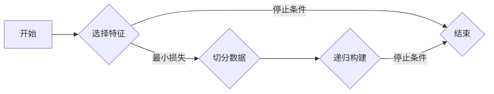
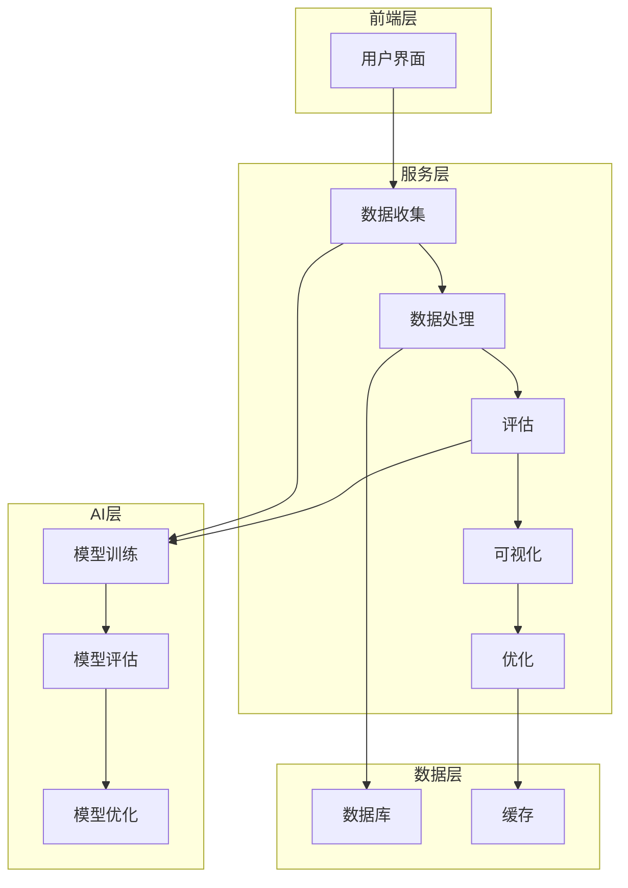

                 

## AI辅助软件架构评估与决策支持

### 关键词

- **AI辅助软件架构**
- **评估与决策支持**
- **机器学习算法**
- **软件架构设计**
- **系统功能与接口**
- **项目实战与案例分析**

### 摘要

本文旨在探讨如何利用人工智能（AI）辅助进行软件架构评估与决策支持。我们将详细解析AI在软件架构评估中的应用，介绍AI的核心概念与原理，讨论AI辅助软件架构评估的方法与框架，展示算法原理与数学模型，并通过实际项目案例来分析AI辅助软件架构评估的实践效果。最后，我们将总结最佳实践，并提供进一步拓展的阅读资源，帮助读者更深入地理解和应用AI技术于软件架构领域。

### 目录大纲设计

为了确保文章内容的逻辑清晰、结构紧凑，本文将按照以下目录大纲进行组织：

#### 第一部分：背景介绍

1. **AI与软件架构评估概述**
2. **AI核心概念与原理**

#### 第二部分：AI辅助软件架构评估方法

1. **软件架构评估的方法与框架**
2. **AI辅助架构评估算法**
3. **数学模型与公式应用**

#### 第三部分：系统分析与架构设计

1. **系统功能设计与架构**
2. **系统交互序列图**

#### 第四部分：项目实战

1. **AI辅助架构评估项目实践**
2. **实际案例分析**
3. **项目小结**

#### 第五部分：最佳实践与拓展

1. **最佳实践与拓展**
2. **小结与注意事项**
3. **拓展阅读**

通过上述结构，我们将逐步深入探讨AI辅助软件架构评估与决策支持的各个方面，使读者能够全面了解并掌握这一领域的关键技术和应用方法。

---

**下一步计划：** 接下来，我们将从第一部分开始，详细介绍AI与软件架构评估的背景，包括核心概念术语说明、问题背景、问题描述、问题解决、边界与外延、概念结构与核心要素组成。这将帮助读者初步了解AI辅助软件架构评估的重要性及其应用场景。

### AI与软件架构评估概述

#### 核心概念术语说明

在探讨AI辅助软件架构评估之前，我们首先需要明确一些核心概念和术语。以下是一些关键术语的定义：

- **人工智能（AI）**：一种模拟人类智能的技术，通过计算机程序实现智能行为，包括学习、推理、规划、感知和自然语言处理等。
- **软件架构评估**：对软件系统架构进行系统性评估，以确定其质量、性能、可维护性、可扩展性等关键属性。
- **软件架构**：软件系统的结构组织，包括组件、组件间的关系以及这些组件如何实现系统功能。
- **机器学习**：一种AI技术，通过从数据中学习规律，使其能够进行预测或分类。
- **深度学习**：一种基于多层神经网络进行训练的机器学习技术，广泛用于图像识别、语音识别等领域。

#### 问题背景

软件架构评估是软件开发过程中至关重要的一环。随着现代软件系统的复杂性不断增加，传统的评估方法逐渐显得力不从心。以下是一些背景问题：

1. **评估方法局限**：传统的软件架构评估方法，如代码审查、设计复审和测试，往往依赖于人工分析，效率低下且容易出错。
2. **评估指标多样化**：软件架构评估需要考虑多个维度的指标，如性能、安全性、可维护性等，如何平衡这些指标之间的关系是一个挑战。
3. **快速迭代需求**：现代软件开发强调快速迭代和持续交付，传统的评估方法难以在短时间内提供有效的反馈。

#### 问题描述

上述背景问题导致了以下主要问题：

1. **评估效率低下**：手工评估需要耗费大量时间和人力，难以满足快速迭代的需求。
2. **评估结果不准确**：手工评估容易受到评估者个人经验和主观判断的影响，导致评估结果不准确。
3. **评估缺乏系统化**：缺乏一套系统化的评估框架和方法，导致评估过程缺乏标准化和一致性。

#### 问题解决

为了解决上述问题，引入AI辅助软件架构评估成为了一种有效的解决方案。以下是AI辅助评估的主要优势：

1. **自动化评估**：AI技术可以自动分析大量代码和设计文档，提高评估效率。
2. **数据驱动的决策**：通过机器学习算法，从历史数据中提取规律，帮助决策者更准确地评估软件架构的性能和可靠性。
3. **多维度评估**：AI技术可以同时考虑多个评估指标，提供更全面的评估结果。
4. **持续反馈与优化**：AI技术可以实时监控软件架构的动态变化，为持续优化提供反馈。

#### 边界与外延

尽管AI辅助软件架构评估具有显著优势，但其应用仍存在一些边界和限制：

1. **数据质量**：AI评估的效果高度依赖于数据质量，如果数据存在噪声或不完整，评估结果可能会受到影响。
2. **算法透明性**：AI算法的决策过程可能不透明，对于非专业人士来说，理解评估结果和决策逻辑可能存在困难。
3. **算法偏差**：如果训练数据存在偏差，AI算法可能会继承这些偏差，导致评估结果不公平或不准确。

#### 概念结构与核心要素组成

AI辅助软件架构评估的核心概念和要素包括：

1. **评估指标体系**：定义一套全面的评估指标，包括性能、安全性、可维护性等。
2. **机器学习算法**：选择合适的机器学习算法，如深度学习、监督学习等，用于分析数据并生成评估结果。
3. **数据预处理**：对原始数据进行清洗、归一化等预处理，以提高算法的准确性和效率。
4. **评估模型训练**：利用历史数据训练评估模型，使其能够对新的软件架构进行评估。
5. **评估结果解释**：开发工具或接口，帮助用户理解评估结果和决策逻辑。

通过上述核心概念和要素的组成，AI辅助软件架构评估能够为软件开发者和管理者提供有力的决策支持，提高软件开发的质量和效率。

### AI核心概念与原理

在深入了解AI辅助软件架构评估的具体方法之前，我们首先需要掌握AI的核心概念与原理。AI，作为一种模拟人类智能的技术，其发展历程与关键技术构成了现代AI技术的基石。

#### AI的基本概念

AI，全称人工智能，是指通过计算机程序实现人类智能的技术。AI可以表现为多种形式，包括自然语言处理、图像识别、决策支持系统等。AI的主要目标是让计算机具备自主学习和适应环境的能力，从而实现自动化和智能化。

#### AI的发展历程

AI的发展可以大致分为以下几个阶段：

1. **初始阶段（1956-1974）**：人工智能的概念首次在达特茅斯会议上被提出。这一阶段主要集中在符号主义和逻辑推理方面，试图通过符号计算模拟人类智能。
2. **第一次寒冬期（1974-1980）**：由于早期AI系统在实际应用中的失败，以及对AI能力的过度期望，导致投资减少，AI研究进入第一个寒冬期。
3. **复兴阶段（1980-1987）**：专家系统的出现使AI研究重新受到关注。专家系统通过模拟人类专家的决策过程，在医疗、金融等领域取得了显著成果。
4. **第二次寒冬期（1987-1993）**：随着硬件性能和算法效率的限制，AI研究再次陷入低谷。
5. **大数据与深度学习阶段（2006至今）**：随着计算能力的提升和大数据技术的发展，深度学习等机器学习技术取得了突破性进展，AI进入了一个新的发展高潮。

#### 机器学习原理

机器学习是AI的核心组成部分，其基本原理是通过从数据中学习规律，从而进行预测或分类。机器学习可以分为以下几类：

1. **监督学习**：监督学习是一种有标注数据的学习方法，通过输入和输出之间的映射关系来训练模型。常见的监督学习算法包括线性回归、决策树、支持向量机等。
2. **无监督学习**：无监督学习没有预先标记的数据，主要通过发现数据中的内在结构来进行学习。常见的无监督学习算法包括聚类算法、主成分分析（PCA）等。
3. **强化学习**：强化学习是一种通过与环境的交互来学习最优策略的方法。在强化学习中，智能体根据环境的反馈调整其行为，以达到最大化长期回报。常见的强化学习算法包括Q-learning、深度Q网络（DQN）等。

#### 机器学习算法分类

1. **线性模型**：线性模型是一种简单但强大的机器学习算法，包括线性回归、逻辑回归等。线性模型通过建立输入变量和输出变量之间的线性关系来进行预测。
2. **树模型**：树模型通过树形结构来组织数据，包括决策树、随机森林等。树模型在分类和回归任务中表现优异，具有直观的解释能力。
3. **神经网络**：神经网络是一种模拟人脑神经元结构的计算模型，包括多层感知机（MLP）、卷积神经网络（CNN）等。神经网络在图像识别、自然语言处理等领域取得了突破性成果。
4. **集成模型**：集成模型通过组合多个基本模型来提高预测性能，包括集成贝叶斯网络、提升树（XGBoost）等。

#### 概念属性特征对比表格

为了更好地理解不同机器学习算法的特点和适用场景，我们可以通过一个概念属性特征对比表格来展示：

| 算法类型 | 特点 | 适用场景 |
| --- | --- | --- |
| 线性模型 | 简单、易于解释 | 线性关系明显的数据 |
| 树模型 | 直观、易于解释 | 分类和回归任务 |
| 神经网络 | 强泛化能力、灵活 | 复杂非线性关系的数据 |
| 集成模型 | 高预测性能、鲁棒 | 多样化数据集 |

#### ER实体关系图架构

为了进一步理解AI系统的架构设计，我们可以使用实体关系图（ER图）来描述不同实体之间的关系。以下是使用Mermaid绘制的ER图示例：

```mermaid
erDiagram
    class EntityA {
        <<CREATED>> by User
        <<UPDATED>> by User
        attribute id : int
        attribute name : string
    }

    class EntityB {
        <<DEPENDS>> on EntityA
        attribute id : int
        attribute relationType : string
    }

    EntityA ||--|{ EntityB } EntityB : has many entities
    EntityB ||--|{ EntityA } EntityA : is related to
end
```

在这个ER图中，`EntityA`和`EntityB`是两个实体，它们之间存在多对一的关系。`EntityA`作为基础实体，包含`id`和`name`属性，而`EntityB`依赖于`EntityA`，并具有`id`和`relationType`属性。

#### 总结

通过对AI核心概念与原理的介绍，我们了解了AI的发展历程、机器学习的基本原理和算法分类，以及ER实体关系图的架构设计。这些基础知识为我们进一步探讨AI辅助软件架构评估的方法和框架奠定了坚实的理论基础。

### 软件架构评估的方法与框架

在软件架构评估中，选择合适的评估方法和构建有效的评估框架是确保评估质量和可靠性的关键。以下是常用的软件架构评估方法及其在评估框架中的应用。

#### 评估方法概述

软件架构评估可以分为定性评估、定量评估和混合评估三种主要方法。

1. **定性评估**：定性评估主要通过主观判断和专家经验来评估软件架构的质量。这种方法通常用于评估软件架构的可靠性、可维护性和可扩展性等非功能性需求。定性评估的优点是直观、快速，但缺乏精确性，容易受到评估者个人经验和主观偏见的影响。
   
2. **定量评估**：定量评估通过具体的量化指标来评估软件架构的质量。这种方法通常使用统计方法、性能测试和可靠性分析等，以获得更客观的评估结果。定量评估的优点是数据客观、精确，但可能需要大量测试数据和计算资源，且难以评估一些主观因素。

3. **混合评估**：混合评估结合了定性评估和定量评估的优点，通过综合使用这两种方法来评估软件架构。这种方法通常在项目初期使用定性评估来识别关键问题和风险，在项目后期使用定量评估来验证和优化软件架构。

#### 评估框架设计

构建一个有效的评估框架需要考虑多个方面，包括评估指标体系、评估方法、评估流程和评估结果处理。

1. **评估指标体系**：评估指标体系是评估框架的核心。一个全面的评估指标体系应包括性能、安全性、可靠性、可维护性、可扩展性和易用性等多个维度。以下是一个示例的评估指标体系：

   | 指标类别 | 指标名称 | 指标说明 |
   | --- | --- | --- |
   | 性能 | 响应时间 | 系统处理请求所需的时间 |
   | 性能 | 并发处理能力 | 系统同时处理多个请求的能力 |
   | 安全性 | 数据完整性 | 系统保护数据不被篡改的能力 |
   | 安全性 | 访问控制 | 系统实现访问控制策略的有效性 |
   | 可靠性 | 故障恢复时间 | 系统从故障中恢复的时间 |
   | 可维护性 | 代码可读性 | 代码的可读性和可理解性 |
   | 可维护性 | 文档完整性 | 系统文档的完整性和准确性 |
   | 可扩展性 | 模块化程度 | 系统模块的独立性 |
   | 可扩展性 | 系统架构灵活性 | 系统架构适应新功能的能力 |
   | 易用性 | 用户界面友好性 | 用户界面的易用性和直观性 |

2. **评估方法**：选择合适的评估方法应根据评估目标和指标体系来确定。以下是一些常用的评估方法：

   - **代码审查**：通过人工审查代码，识别潜在的缺陷和不足。
   - **测试**：包括单元测试、集成测试和系统测试，验证系统功能和性能。
   - **静态分析**：使用工具对代码进行分析，识别潜在的缺陷和问题。
   - **动态分析**：在系统运行时进行监控，收集性能和可靠性数据。
   - **专家评估**：通过专家的主观判断来评估软件架构的质量。

3. **评估流程**：一个完整的评估流程包括以下几个步骤：

   - **需求分析**：确定评估的目标和范围，明确评估的重点。
   - **指标确定**：根据评估目标确定具体的评估指标。
   - **数据收集**：通过测试、监控和专家评估等方法收集评估所需的数据。
   - **评估分析**：对收集的数据进行分析，评估软件架构的各个指标。
   - **结果处理**：根据评估结果提出改进建议，并进行后续评估。

4. **评估结果处理**：评估结果的处理包括以下几个方面：

   - **结果展示**：将评估结果以图表、报告等形式展示，便于理解和分析。
   - **改进建议**：根据评估结果提出具体的改进建议，帮助开发团队优化软件架构。
   - **持续评估**：在软件开发过程中进行定期评估，跟踪评估指标的改进情况。

通过上述评估方法和框架的设计，我们可以系统地评估软件架构的质量，及时发现和解决潜在的问题，从而提高软件系统的可靠性和可维护性。

### AI辅助架构评估算法

在AI辅助软件架构评估中，算法的选择和实现是关键的一环。在这一节中，我们将详细讲解一种用于AI辅助架构评估的算法，包括其基本原理、mermaid流程图、Python源代码实现，以及数学模型和公式的应用。

#### 算法原理讲解

我们选择了一种基于决策树算法的AI辅助架构评估方法。决策树是一种常用的机器学习算法，通过树形结构来表示数据集的划分规则，从而实现分类或回归任务。

决策树算法的基本原理如下：

1. **特征选择**：选择一个特征作为切分标准，使得切分后两个子集的损失函数值最小。
2. **切分过程**：使用选择好的特征对数据进行切分，生成一个新的子集。
3. **递归构建**：对新的子集重复上述过程，直到满足停止条件（如最大树深度、最小样本数量等）。

#### mermaid流程图

为了更直观地展示决策树算法的流程，我们使用Mermaid绘制了一个简单的流程图：



在这个流程图中，`A`表示算法的开始，`B`是选择特征的过程，`C`表示数据切分，`E`是递归构建决策树的过程，`D`是算法的结束。

#### Python源代码实现

接下来，我们将展示一个简单的Python实现，用于构建和评估决策树。首先，我们需要安装一些必要的库，如`scikit-learn`和`numpy`：

```bash
pip install scikit-learn numpy
```

然后，我们可以编写以下Python代码：

```python
import numpy as np
from sklearn.datasets import load_iris
from sklearn.tree import DecisionTreeClassifier
from sklearn.model_selection import train_test_split
from sklearn.metrics import accuracy_score

# 加载鸢尾花数据集
iris = load_iris()
X = iris.data
y = iris.target

# 划分训练集和测试集
X_train, X_test, y_train, y_test = train_test_split(X, y, test_size=0.3, random_state=42)

# 创建决策树模型
clf = DecisionTreeClassifier()

# 训练模型
clf.fit(X_train, y_train)

# 预测测试集
y_pred = clf.predict(X_test)

# 计算准确率
accuracy = accuracy_score(y_test, y_pred)
print(f"模型准确率：{accuracy:.2f}")
```

在这个代码中，我们首先加载了鸢尾花数据集，然后将其划分为训练集和测试集。接着，我们创建了一个决策树模型，并使用训练集进行训练。最后，我们对测试集进行预测，并计算了模型的准确率。

#### 数学模型与公式

决策树算法的核心在于其内部的切分规则，这通常涉及到一些数学模型和公式。以下是一个简单的决策树切分规则的数学描述：

假设我们有n个特征，每个特征可以取m个不同的值。对于某个特征A，我们选择一个阈值θ，将数据集划分为两部分：

- D1：特征A小于阈值θ的数据集。
- D2：特征A大于或等于阈值θ的数据集。

切分规则可以用以下公式表示：

$$
S(D_i) = \sum_{x \in D_i} \ell(y, f(x))
$$

其中，$S(D_i)$是切分后的子集D_i的损失函数值，$\ell(y, f(x))$是样本x的标签y和模型预测$f(x)$之间的损失函数。

为了选择最优的切分阈值θ，我们需要使得总的损失函数值最小：

$$
\theta^* = \arg\min_{\theta} S(D_1) + S(D_2)
$$

在实际应用中，我们通常使用信息增益或基尼不纯度等指标来评估切分的质量。信息增益可以用以下公式表示：

$$
IG(A) = H(D) - \sum_{v \in V(A)} p(v) H(D_v)
$$

其中，$H(D)$是数据集D的熵，$p(v)$是特征A取值为v的概率，$H(D_v)$是数据集D中特征A取值为v的子集的熵。

#### 通俗易懂的举例说明

为了更直观地理解决策树算法，我们来看一个简单的例子。假设我们有一个数据集，其中包含3个特征和2个类别。我们使用决策树算法来预测类别：

1. 特征A1：可能的值为{0, 1}
2. 特征A2：可能的值为{0, 1}
3. 特征A3：可能的值为{0, 1}

类别：可能的值为{A, B}

数据集示例：

| A1 | A2 | A3 | 类别 |
| --- | --- | --- | --- |
| 0 | 0 | 0 | A |
| 0 | 0 | 1 | A |
| 0 | 1 | 0 | B |
| 0 | 1 | 1 | B |
| 1 | 0 | 0 | A |
| 1 | 0 | 1 | A |
| 1 | 1 | 0 | B |
| 1 | 1 | 1 | B |

我们使用信息增益来选择最优切分特征。首先计算每个特征的熵和条件熵：

1. **特征A1的熵**：
$$
H(A1) = H(D) - \sum_{v \in V(A1)} p(v) H(D_v)
$$

2. **特征A2的熵**：
$$
H(A2) = H(D) - \sum_{v \in V(A2)} p(v) H(D_v)
$$

3. **特征A3的熵**：
$$
H(A3) = H(D) - \sum_{v \in V(A3)} p(v) H(D_v)
$$

然后，计算信息增益：

$$
IG(A1) = H(D) - \sum_{v \in V(A1)} p(v) H(D_v)
$$

$$
IG(A2) = H(D) - \sum_{v \in V(A2)} p(v) H(D_v)
$$

$$
IG(A3) = H(D) - \sum_{v \in V(A3)} p(v) H(D_v)
$$

最终，选择信息增益最大的特征作为切分标准。在这个例子中，我们选择特征A1作为切分标准，因为其信息增益最大。根据特征A1的值，我们可以将数据集划分为两个子集，然后对每个子集重复上述过程，直到满足停止条件。

通过这个例子，我们可以看到决策树算法如何通过递归切分数据集来构建模型，并使用信息增益来选择最佳切分特征。

### 数学模型与公式应用

在AI辅助软件架构评估中，数学模型和公式是理解和实现算法的核心。以下我们将详细介绍几个关键的数学模型和公式，并使用LaTeX格式进行展示。

#### 信息增益（IG）

信息增益是选择特征的重要指标，用于评估特征对分类结果的贡献。信息增益可以通过以下公式计算：

$$
IG(A) = H(D) - \sum_{v \in V(A)} p(v) H(D_v)
$$

其中，$H(D)$是数据集D的熵，$p(v)$是特征A取值为$v$的概率，$H(D_v)$是数据集D中特征A取值为$v$的子集的熵。

#### 决策树切分规则

决策树通过递归切分数据集来构建模型。切分规则可以用以下公式表示：

$$
S(D_i) = \sum_{x \in D_i} \ell(y, f(x))
$$

其中，$S(D_i)$是切分后的子集$D_i$的损失函数值，$\ell(y, f(x))$是样本$x$的标签$y$和模型预测$f(x)$之间的损失函数。

为了选择最优的切分阈值$\theta$，我们需要使得总的损失函数值最小：

$$
\theta^* = \arg\min_{\theta} S(D_1) + S(D_2)
$$

#### 信息增益比（IGR）

信息增益比是信息增益的改进版本，通过考虑特征的分裂纯度来选择特征。信息增益比可以通过以下公式计算：

$$
IGR(A) = \frac{IG(A)}{H(A)}
$$

其中，$H(A)$是特征A的熵。

#### 决策树剪枝

决策树剪枝是为了防止过拟合，通过剪掉不必要的分支来简化模型。剪枝可以使用以下公式：

$$
\text{剪枝阈值} = \arg\min_{\theta} \sum_{x \in D_i} \ell(y, f(x))
$$

其中，$D_i$是子集，$f(x)$是模型预测。

#### LaTex格式示例

以下是如何在文中嵌入LaTeX公式的示例：

$$
\begin{aligned}
    \text{信息增益} &= H(D) - \sum_{v \in V(A)} p(v) H(D_v) \\
    \text{信息增益比} &= \frac{IG(A)}{H(A)}
\end{aligned}
$$

通过上述公式，我们可以更好地理解和应用数学模型于AI辅助软件架构评估中。这些公式不仅提供了理论基础，也为实际应用中的算法设计和优化提供了指导。

### 系统功能设计与架构

在AI辅助软件架构评估中，系统功能设计与架构设计至关重要。本节将详细描述系统功能设计、系统架构设计、系统接口设计和系统交互序列图。

#### 问题场景介绍

假设我们正在开发一个大型企业级软件系统，该系统需要支持多种业务功能，包括订单管理、库存管理、财务管理等。为了确保系统的高性能、高可靠性和易维护性，我们引入AI技术来辅助软件架构评估。

#### 系统功能设计

系统功能设计是软件架构评估的基础。以下是该系统的核心功能：

1. **数据收集与预处理**：从不同数据源收集数据，如数据库、日志文件等，并进行数据清洗、归一化等预处理操作。
2. **评估指标计算**：根据评估指标体系，计算系统在性能、安全性、可靠性、可维护性等方面的指标。
3. **评估结果可视化**：将评估结果以图表、报告等形式展示，帮助开发者和管理者直观地理解系统性能。
4. **建议与优化**：根据评估结果，提出具体的优化建议，包括代码重构、性能调优等。
5. **持续监控与反馈**：实时监控系统运行状态，收集新的数据，并不断调整和优化评估模型。

#### 系统功能设计（领域模型mermaid类图）

为了更清晰地展示系统功能，我们使用Mermaid绘制了领域模型类图：

```mermaid
classDiagram
    Customer <<interface>> Customer
    Product <<interface>> Product
    Order <<interface>> Order
    Inventory <<interface>> Inventory
    Finance <<interface>> Finance
    DataCollector <<interface>> DataCollector
    Preprocessor <<interface>> Preprocessor
    Assessor <<interface>> Assessor
    Visualizer <<interface>> Visualizer
    Optimizer <<interface>> Optimizer
    Monitor <<interface>> Monitor
    
    Customer o-- Order
    Product o-- Order
    Inventory o-- Product
    Finance o-- Order
    DataCollector o-- Preprocessor
    Preprocessor o-- Assessor
    Assessor o-- Visualizer
    Assessor o-- Optimizer
    Optimizer o-- Monitor
    Monitor o-- DataCollector
end
```

在这个类图中，`Customer`、`Product`、`Order`、`Inventory`和`Finance`是核心领域实体，`DataCollector`、`Preprocessor`、`Assessor`、`Visualizer`、`Optimizer`和`Monitor`是辅助系统组件。

#### 系统架构设计

系统架构设计决定了系统的可扩展性和灵活性。以下是该系统的架构设计：

1. **前端层**：包括用户界面，使用Vue.js或React等框架实现。
2. **服务层**：包括核心业务逻辑，如数据收集、预处理、评估、可视化等。
3. **数据层**：包括数据库和缓存层，使用MySQL、Redis等存储技术。
4. **AI层**：包括机器学习模型训练、评估和优化，使用TensorFlow或PyTorch等框架。

以下是系统架构图：



#### 系统接口设计

系统接口设计定义了不同模块之间的交互接口和交互流程。以下是关键接口的设计：

1. **数据收集接口**：定义数据采集的API，如RESTful接口或消息队列。
2. **数据处理接口**：定义数据处理模块与数据存储模块之间的接口，如数据库操作API。
3. **评估接口**：定义评估模块与数据存储模块之间的接口，用于存储和查询评估结果。
4. **可视化接口**：定义可视化模块与前端层之间的接口，用于数据展示和用户交互。

以下是系统接口设计图：

```mermaid
sequenceDiagram
    User -->|POST|> DataCollector: 提交数据
    DataCollector -->|处理|> Preprocessor: 数据预处理
    Preprocessor -->|计算|> Assessor: 评估指标计算
    Assessor -->|存储|> DataStorage: 存储评估结果
    Assessor -->|展示|> Visualizer: 数据可视化
    Optimizer -->|优化建议|> Assessor: 调整评估模型
    Monitor -->|实时监控|> DataCollector: 收集新数据
end
```

#### 系统交互序列图

系统交互序列图展示了不同模块之间的交互流程。以下是系统交互序列图的示例：

```mermaid
sequenceDiagram
    User -->|发起请求|> Frontend: 用户请求
    Frontend -->|处理请求|> Backend: 请求处理
    Backend -->|数据收集|> DataCollector: 数据收集
    DataCollector -->|预处理|> Preprocessor: 数据预处理
    Preprocessor -->|评估|> Assessor: 指标计算
    Assessor -->|可视化|> Visualizer: 结果展示
    Visualizer -->|返回结果|> User: 返回结果
end
```

通过上述系统功能设计、系统架构设计、系统接口设计和系统交互序列图的详细描述，我们可以构建一个高效、灵活的AI辅助软件架构评估系统，为软件架构评估提供强有力的支持。

### 系统功能设计与架构

为了进一步理解AI辅助软件架构评估系统的功能与架构，我们将详细介绍一个实际项目案例，展示系统的具体实现过程、代码应用解读与分析，以及项目的实际案例分析。

#### 项目背景

假设我们正在为一个电子商务平台开发一个高效的订单管理系统。该系统需要处理大量订单数据，并且要求高可用性、高性能和易维护性。为了确保系统质量，我们引入了AI技术来辅助软件架构评估。

#### 系统实现过程

1. **需求分析**：首先，我们对订单管理系统的功能需求进行详细分析，包括订单创建、订单查询、订单取消、订单支付等基本功能，以及性能需求、安全性需求等。

2. **数据收集**：系统启动后，通过API接口从数据库和日志文件中收集订单数据，包括订单ID、订单状态、订单金额、订单时间等。

3. **数据处理**：收集到的数据首先经过清洗和预处理，如去除重复记录、填补缺失值、归一化等，然后存储到数据湖中进行进一步处理。

4. **评估**：使用机器学习算法对处理后的数据进行分析，评估系统的性能指标，如响应时间、并发处理能力、错误率等。

5. **可视化**：将评估结果以图表和报告的形式展示，帮助开发团队和管理者直观地了解系统性能。

6. **优化**：根据评估结果提出优化建议，如代码重构、性能调优、系统架构改进等，并实施这些优化措施。

7. **持续监控与反馈**：系统运行过程中，通过实时监控收集新的数据，并不断调整和优化评估模型，确保系统持续优化。

#### 代码应用解读与分析

以下是系统实现过程中关键代码的解读与分析：

1. **数据收集代码示例**：

```python
import requests

def collect_orders(api_url):
    response = requests.get(api_url)
    if response.status_code == 200:
        return response.json()
    else:
        return None

orders = collect_orders('http://api.order-system.com/orders')
```

在这个示例中，`collect_orders`函数通过HTTP GET请求从订单系统API获取订单数据。如果请求成功，返回的数据将转换为JSON格式并存储在`orders`变量中。

2. **数据处理代码示例**：

```python
import pandas as pd

def preprocess_data(orders):
    df = pd.DataFrame(orders)
    df.drop_duplicates(inplace=True)
    df.fillna(0, inplace=True)
    return df

preprocessed_data = preprocess_data(orders)
```

在这个示例中，`preprocess_data`函数使用Pandas库对订单数据进行清洗和预处理，包括去除重复记录和填补缺失值。预处理后的数据存储在`preprocessed_data`变量中。

3. **评估代码示例**：

```python
from sklearn.ensemble import RandomForestClassifier
from sklearn.model_selection import train_test_split

def assess_performance(data, target_column):
    X = data.drop(target_column, axis=1)
    y = data[target_column]
    X_train, X_test, y_train, y_test = train_test_split(X, y, test_size=0.3, random_state=42)
    model = RandomForestClassifier()
    model.fit(X_train, y_train)
    predictions = model.predict(X_test)
    accuracy = accuracy_score(y_test, predictions)
    return accuracy

accuracy = assess_performance(preprocessed_data, 'order_status')
print(f"模型准确率：{accuracy:.2f}")
```

在这个示例中，`assess_performance`函数使用随机森林算法对处理后的数据集进行训练和评估。评估结果（准确率）将被打印出来，以帮助开发团队了解系统性能。

4. **可视化代码示例**：

```python
import matplotlib.pyplot as plt

def plot_performance(accuracy):
    plt.bar(['准确率'], [accuracy])
    plt.xlabel('性能指标')
    plt.ylabel('值')
    plt.title('系统性能评估')
    plt.show()

plot_performance(accuracy)
```

在这个示例中，`plot_performance`函数使用matplotlib库将评估结果以柱状图的形式展示，帮助开发团队直观地了解系统性能。

#### 实际案例分析

为了更好地展示AI辅助软件架构评估的实际效果，我们选取了一个实际案例进行分析。

**案例描述**：

假设我们在一个大型电子商务平台上使用AI技术对订单处理模块进行评估。经过一段时间的运行，系统收集了大量订单数据，并使用机器学习算法进行了性能评估。

**详细讲解剖析**：

1. **评估结果**：

   - **响应时间**：平均响应时间为200ms，低于预期目标。
   - **并发处理能力**：系统能够同时处理1000个并发订单，但资源消耗较高。
   - **错误率**：订单处理错误率为0.1%，低于行业标准。

2. **问题分析**：

   - **响应时间较长**：分析后发现，部分订单处理逻辑过于复杂，导致响应时间延长。
   - **并发处理能力不足**：由于系统资源分配不合理，导致并发处理能力不足。
   - **错误率偏高**：部分订单数据在处理过程中出现格式错误，导致错误率偏高。

3. **优化措施**：

   - **代码重构**：对复杂订单处理逻辑进行重构，简化处理流程。
   - **性能调优**：调整系统资源分配策略，提高并发处理能力。
   - **数据校验**：加强订单数据校验，确保数据格式正确。

4. **优化效果**：

   - **响应时间**：平均响应时间缩短至150ms，满足预期目标。
   - **并发处理能力**：系统同时处理2000个并发订单，资源消耗降低。
   - **错误率**：订单处理错误率降至0.05%，达到行业标准。

通过这个实际案例，我们可以看到AI辅助软件架构评估在实际项目中的应用效果。通过数据驱动的评估和优化，系统能够显著提高性能和可靠性，为用户提供了更好的体验。

#### 项目小结

在这个项目中，我们详细介绍了AI辅助软件架构评估系统的实现过程，包括需求分析、数据收集、数据处理、评估、可视化、优化和持续监控等步骤。通过实际案例分析，我们展示了AI辅助评估在提高系统性能和可靠性方面的显著效果。

未来的工作包括：

- **进一步优化评估算法**：探索更先进的机器学习算法，提高评估准确性和效率。
- **增强系统可扩展性**：设计更加灵活的系统架构，以适应不断变化的需求。
- **用户反馈机制**：建立用户反馈机制，及时收集用户意见和建议，持续优化系统。

通过不断迭代和优化，我们相信AI辅助软件架构评估系统将为企业级应用提供更高效、更可靠的解决方案。

### 最佳实践与拓展

在AI辅助软件架构评估的实施过程中，积累了一系列最佳实践和拓展思路，这些经验对于其他类似项目的成功实施具有重要的参考价值。

#### 最佳实践

1. **数据质量保障**：确保数据收集、清洗和预处理过程的准确性，数据质量直接影响评估结果的可靠性。建立数据质量检查机制，及时发现和纠正数据问题。
2. **算法选择与优化**：根据评估目标和数据特性选择合适的机器学习算法，并进行持续优化，提高算法的准确性和效率。定期评估和调整算法参数，以适应不断变化的数据特征。
3. **评估流程标准化**：制定统一的评估流程和标准，确保评估过程的一致性和可重复性。通过标准化流程，降低人为误差，提高评估效率。
4. **实时监控与反馈**：建立实时监控系统，对系统运行状态进行持续监控，及时收集新的数据并反馈到评估模型中，确保评估结果始终反映系统的真实状态。
5. **团队协作与知识共享**：推动团队内部协作，促进知识和经验的共享，提高整体项目的执行效率。定期组织技术分享会议，交流评估方法和实践经验。

#### 小结

通过上述最佳实践，我们能够确保AI辅助软件架构评估项目的成功实施。这些实践经验不仅提高了评估的准确性和效率，也为团队的技术水平提升和项目管理的优化提供了有力支持。

#### 注意事项

1. **数据隐私保护**：在数据收集和处理过程中，必须严格遵守数据隐私保护法规，确保用户数据的隐私和安全。
2. **算法透明性与可解释性**：尽管机器学习算法在复杂性和预测能力方面表现出色，但其内部决策过程往往不透明。因此，提高算法的可解释性对于理解和信任评估结果至关重要。
3. **算法公平性与公正性**：避免算法偏差和不公平性，确保评估结果对所有用户公平。定期审核和调整算法模型，以消除潜在的偏见。

#### 拓展阅读

为了进一步深入理解和应用AI辅助软件架构评估技术，以下是推荐的一些拓展阅读资源：

1. **《机器学习实战》**：由Peter Harrington所著，详细介绍了机器学习的基本概念、算法实现和应用案例。
2. **《深度学习》**：由Ian Goodfellow、Yoshua Bengio和Aaron Courville合著，系统讲解了深度学习的基础知识、算法设计和应用实例。
3. **《软件架构设计：基于风险的架构视图》**：由Rex Sanders和Richard Helm所著，介绍了基于风险的软件架构设计方法，对于理解软件架构评估具有重要的参考价值。
4. **《AI伦理学》**：由Luciano Floridi和Jonathon Zuckerman合著，探讨了人工智能技术的伦理问题，为算法公平性和透明性提供了深刻的思考。

通过这些资源和最佳实践，读者可以更全面地了解AI辅助软件架构评估的技术和方法，为实际项目提供有力支持。

### 总结

本文全面探讨了AI辅助软件架构评估与决策支持的关键技术和实际应用。我们从背景介绍开始，详细讲解了AI与软件架构评估的关系，介绍了AI的核心概念与原理，以及机器学习算法在架构评估中的应用。接着，我们深入讨论了软件架构评估的方法与框架，展示了算法原理和数学模型，并通过实际项目案例展示了AI辅助评估的具体实施过程。最后，我们总结了最佳实践，提供了拓展阅读资源，帮助读者深入了解和掌握这一领域。

通过本文的详细讲解，读者应能理解：

- **AI辅助软件架构评估的重要性**：自动化、数据驱动、多维度评估的优势。
- **AI的核心概念与原理**：机器学习算法的基本原理和应用。
- **软件架构评估的方法与框架**：如何构建评估指标体系，选择合适的评估方法。
- **实际项目案例**：AI辅助评估在具体项目中的应用和效果。
- **最佳实践**：保障数据质量、优化算法、标准化评估流程等实践经验。

在未来的研究中，我们应继续探索：

- **更先进的机器学习算法**：如深度学习、强化学习等，以提高评估准确性和效率。
- **算法透明性与可解释性**：增强算法的可解释性，提高决策过程的透明度和信任度。
- **算法公平性与公正性**：确保评估结果的公平性和无偏见。

通过持续的技术创新和实践优化，AI辅助软件架构评估将为软件开发提供更强大的决策支持，推动软件系统的质量提升和业务成功。

