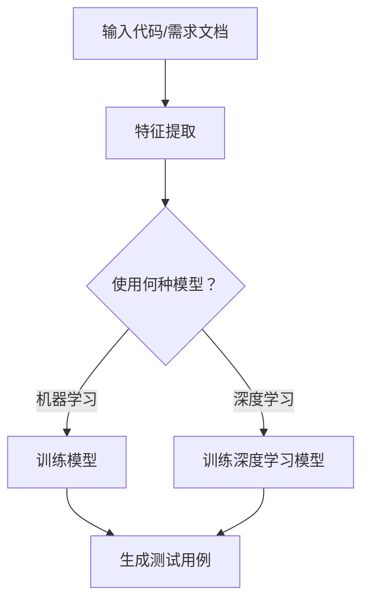
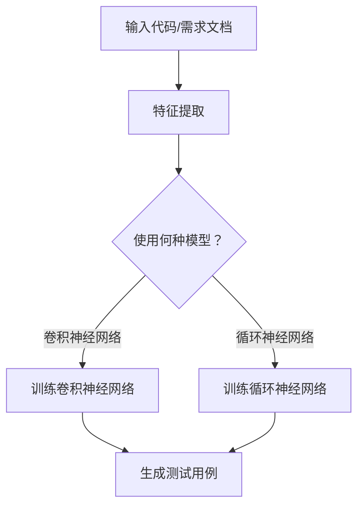
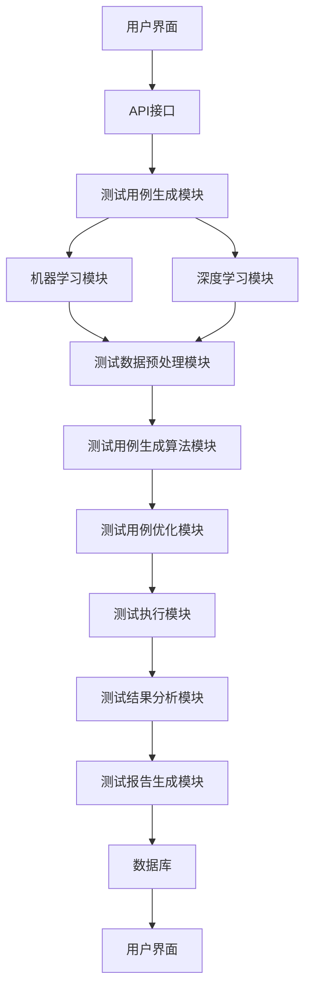
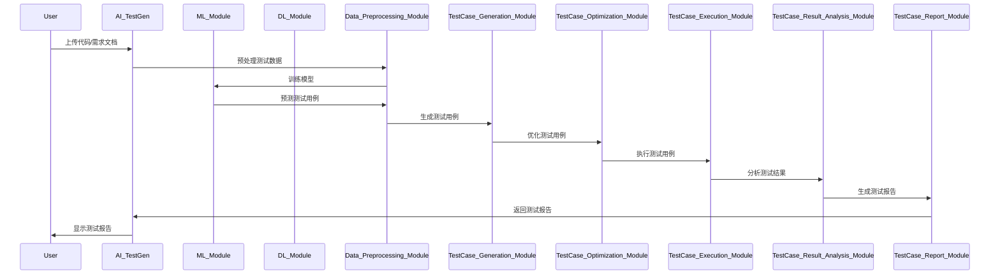

                 


# AI辅助软件测试用例生成

> 关键词：AI，软件测试，测试用例生成，机器学习，深度学习

> 摘要：本文将深入探讨AI辅助软件测试用例生成的方法与应用，通过详细的分析与实例讲解，帮助读者理解如何利用AI技术提升软件测试效率与质量。

## 引言

在当今软件行业中，软件测试是确保软件质量和可靠性的关键环节。传统的软件测试方法往往需要大量的人工参与，费时费力且容易出错。随着人工智能（AI）技术的不断发展，利用AI辅助软件测试用例生成成为一种新的趋势。本文将围绕这一主题，详细介绍AI辅助软件测试用例生成的背景、核心概念、算法原理以及实际应用。

## 背景介绍

### 核心概念术语说明

- **软件测试**：确保软件产品符合其规格说明书和用户需求的过程。
- **测试用例**：用于测试软件产品特定功能的详细指令集。
- **AI辅助测试**：利用人工智能技术自动生成、优化或执行测试用例。

### 问题背景

随着软件项目的规模和复杂性不断增加，传统的测试方法面临着以下挑战：

- **测试用例数量庞大**：大型软件项目需要生成大量的测试用例，人工编写成本高昂。
- **测试覆盖不足**：人工编写的测试用例可能无法覆盖所有可能的输入和路径，导致潜在的问题未被检测。
- **测试成本高**：测试用例的生成、执行和结果分析需要大量的人力资源。

### 问题描述

为了解决上述问题，我们需要一种方法来辅助软件测试用例的生成，提高测试的全面性和效率。这就引出了本文的主题：如何利用AI技术来辅助软件测试用例生成。

### 问题解决

AI辅助软件测试用例生成通过以下方式实现：

- **自动化测试用例生成**：利用AI模型自动分析代码和需求文档，生成符合预期的测试用例。
- **优化测试用例**：通过机器学习和深度学习算法，分析现有测试用例，找出潜在的问题和缺陷，进行优化。
- **智能测试执行**：利用AI技术自动化执行测试用例，并实时分析测试结果。

### 边界与外延

AI辅助软件测试用例生成不仅适用于大型软件项目，还适用于以下场景：

- **敏捷开发**：快速响应需求变化，自动生成相应的测试用例。
- **持续集成/持续部署（CI/CD）**：在持续集成过程中自动执行测试用例，提高交付速度。
- **自动化测试**：结合现有的自动化测试工具，增强测试覆盖率和效率。

### 概念结构与核心要素组成

AI辅助软件测试用例生成涉及以下核心概念和要素：

- **AI技术**：包括机器学习、深度学习、自然语言处理等。
- **测试数据**：用于训练和评估AI模型的测试数据集。
- **测试用例生成算法**：基于AI技术实现的测试用例生成方法。
- **测试工具**：支持AI辅助测试用例生成的工具和环境。

## 核心概念与联系

### AI简介

人工智能（Artificial Intelligence，AI）是指由人造系统实现的智能行为。AI技术包括：

- **机器学习**：通过数据驱动的方式，让计算机系统自动学习和改进。
- **深度学习**：基于多层神经网络的机器学习方法，能够自动从数据中提取特征。

### AI辅助软件测试用例生成算法

AI辅助软件测试用例生成算法主要包括以下几种：

- **基于规则的方法**：利用预定义的规则生成测试用例。
- **基于机器学习的方法**：通过训练模型，自动生成符合预期的测试用例。
- **基于深度学习的方法**：利用神经网络，自动从数据中学习生成测试用例。

### 概念属性特征对比表格

| 方法                 | 特点                                                     | 优势                                                     | 劣势                                                     |
|----------------------|--------------------------------------------------------|--------------------------------------------------------|--------------------------------------------------------|
| 基于规则的方法       | 简单、直观                                               | 可控性强，易于理解和实现                         | 覆盖范围有限，难以应对复杂场景                         |
| 基于机器学习的方法   | 自动化程度高，适应性强                                 | 能够应对复杂场景，提高测试覆盖率                   | 需要大量的训练数据和较长的训练时间                     |
| 基于深度学习的方法   | 强大的特征提取能力                                     | 能够生成高质量的测试用例，提高测试效率             | 训练成本高，对数据质量和数量有较高要求                   |

### ER实体关系图架构的 Mermaid 流程图

```mermaid
erDiagram
  AIDE --|> TCG: 测试用例生成
  TCG --|> TD: 测试数据
  TD --|> SM: 机器学习模型
  SM --|> NL: 自然语言处理
  TD --|> DL: 深度学习模型
```

## AI辅助软件测试用例生成算法原理讲解

### 基于机器学习的方法

**Mermaid 流程图：**



**Python 源代码：**

```python
import pandas as pd
from sklearn.model_selection import train_test_split
from sklearn.ensemble import RandomForestClassifier
from sklearn.metrics import accuracy_score

# 特征提取代码
def extract_features(data):
    # 实现特征提取逻辑
    pass

# 训练模型代码
def train_model(data, labels):
    features = extract_features(data)
    X_train, X_test, y_train, y_test = train_test_split(features, labels, test_size=0.2)
    model = RandomForestClassifier()
    model.fit(X_train, y_train)
    return model

# 生成测试用例代码
def generate_test_cases(model, data):
    features = extract_features(data)
    predicted_labels = model.predict(features)
    return predicted_labels

# 示例数据
data = pd.DataFrame({"feature1": [...], "feature2": [...]})
labels = [...]

# 训练模型
model = train_model(data, labels)

# 生成测试用例
test_cases = generate_test_cases(model, data)

# 打印测试用例
print(test_cases)
```

**算法原理讲解：**

基于机器学习的方法通过以下步骤实现：

1. **特征提取**：从输入的代码或需求文档中提取特征，这些特征将用于训练模型。
2. **训练模型**：使用提取的特征和标签数据训练机器学习模型。常见的模型包括决策树、随机森林等。
3. **生成测试用例**：利用训练好的模型，对新的数据（代码或需求文档）进行预测，从而生成测试用例。

**数学模型和公式：**

- **特征提取公式**：\( X = f(D) \)
  - \( X \)：特征向量
  - \( f \)：特征提取函数
  - \( D \)：输入数据（代码或需求文档）

- **机器学习模型训练公式**：\( \hat{y} = g(W \cdot X + b) \)
  - \( \hat{y} \)：预测标签
  - \( g \)：激活函数
  - \( W \)：权重矩阵
  - \( b \)：偏置项
  - \( X \)：特征向量
  - \( W \cdot X + b \)：前向传播计算

**举例说明：**

假设我们有一个简单的函数 \( f(x) = x^2 \)，我们希望通过机器学习模型来预测 \( f(x) \) 的值。

1. **特征提取**：我们提取输入 \( x \) 作为特征。
2. **训练模型**：我们使用随机森林模型来训练数据。
3. **生成测试用例**：我们输入一个新值 \( x = 3 \)，模型预测 \( f(3) = 9 \)。

### 基于深度学习的方法

**Mermaid 流程图：**



**Python 源代码：**

```python
import tensorflow as tf
from tensorflow.keras.models import Sequential
from tensorflow.keras.layers import Dense, Conv2D, LSTM

# 特征提取代码
def extract_features(data):
    # 实现特征提取逻辑
    pass

# 训练卷积神经网络代码
def train_convolutional_neural_network(data, labels):
    features = extract_features(data)
    model = Sequential()
    model.add(Conv2D(32, kernel_size=(3, 3), activation='relu'))
    model.add(Conv2D(64, (3, 3), activation='relu'))
    model.add(LSTM(100, activation='relu'))
    model.add(Dense(1))
    model.compile(optimizer='adam', loss='mean_squared_error')
    model.fit(features, labels, epochs=10, batch_size=32)
    return model

# 生成测试用例代码
def generate_test_cases(model, data):
    features = extract_features(data)
    predicted_labels = model.predict(features)
    return predicted_labels

# 示例数据
data = [...]
labels = [...]

# 训练模型
model = train_convolutional_neural_network(data, labels)

# 生成测试用例
test_cases = generate_test_cases(model, data)

# 打印测试用例
print(test_cases)
```

**算法原理讲解：**

基于深度学习的方法通过以下步骤实现：

1. **特征提取**：从输入的代码或需求文档中提取特征，这些特征将用于训练神经网络。
2. **训练神经网络**：使用提取的特征和标签数据训练神经网络。常见的神经网络包括卷积神经网络（CNN）和循环神经网络（RNN）。
3. **生成测试用例**：利用训练好的神经网络，对新的数据（代码或需求文档）进行预测，从而生成测试用例。

**数学模型和公式：**

- **特征提取公式**：\( X = f(D) \)
  - \( X \)：特征向量
  - \( f \)：特征提取函数
  - \( D \)：输入数据（代码或需求文档）

- **卷积神经网络训练公式**：\( \hat{y} = g(W_c \cdot \sigma(W_x \cdot X + b_x) + b_c) \)
  - \( \hat{y} \)：预测标签
  - \( g \)：激活函数
  - \( \sigma \)：激活函数
  - \( W_c \)：卷积层权重矩阵
  - \( W_x \)：全连接层权重矩阵
  - \( b_x \)：全连接层偏置项
  - \( b_c \)：卷积层偏置项
  - \( X \)：特征向量

- **循环神经网络训练公式**：\( \hat{y} = g(W \cdot h_t + b) \)
  - \( \hat{y} \)：预测标签
  - \( g \)：激活函数
  - \( W \)：权重矩阵
  - \( h_t \)：当前隐藏状态
  - \( b \)：偏置项

**举例说明：**

假设我们有一个简单的序列数据，希望利用循环神经网络预测序列的下一个值。

1. **特征提取**：我们将序列数据编码为特征向量。
2. **训练循环神经网络**：我们使用训练数据训练循环神经网络。
3. **生成测试用例**：我们输入一个新序列数据，模型预测序列的下一个值。

### 比较与选择

基于机器学习和深度学习的方法各有优缺点，具体选择取决于应用场景和数据特点。基于机器学习的方法适用于特征较为简单、数据量较大的场景，而基于深度学习的方法适用于特征复杂、数据量较大的场景。

## 系统分析与架构设计

### 问题场景介绍

为了更好地理解AI辅助软件测试用例生成的应用，我们考虑以下问题场景：

- **项目背景**：某公司正在开发一个复杂的Web应用，包含多个模块和复杂的业务逻辑。
- **测试需求**：确保Web应用在多个浏览器和设备上稳定运行，功能完整，无安全漏洞。
- **挑战**：项目规模庞大，测试用例数量多，人工编写测试用例成本高，测试覆盖不足。

### 项目介绍

为了解决上述问题，我们设计了一个名为“AI TestGen”的AI辅助软件测试用例生成系统。

### 系统功能设计

“AI TestGen”系统的主要功能包括：

- **测试用例自动生成**：基于机器学习和深度学习算法，自动生成符合预期的测试用例。
- **测试用例优化**：分析现有测试用例，找出潜在问题，进行优化。
- **测试执行与结果分析**：自动化执行测试用例，并分析测试结果，提供详细的报告。

### 系统架构设计

“AI TestGen”系统的架构设计如下：



### 系统接口设计

“AI TestGen”系统的主要接口包括：

- **用户界面**：提供用户操作界面，支持用户上传代码、需求文档，查看测试用例和测试报告。
- **API接口**：提供与外部系统的接口，支持与其他测试工具集成。
- **测试用例生成模块**：接收用户输入，调用机器学习或深度学习模块，生成测试用例。
- **机器学习模块**：提供训练和预测功能，用于生成和优化测试用例。
- **深度学习模块**：提供训练和预测功能，用于生成和优化测试用例。
- **测试数据预处理模块**：负责对测试数据进行预处理，为机器学习或深度学习模块提供数据。
- **测试用例生成算法模块**：实现具体的测试用例生成算法，如基于规则的方法、基于机器学习的方法、基于深度学习的方法等。
- **测试用例优化模块**：分析现有测试用例，找出潜在问题，进行优化。
- **测试执行模块**：自动化执行测试用例，并记录测试结果。
- **测试结果分析模块**：分析测试结果，生成详细的测试报告。
- **测试报告生成模块**：根据测试结果，生成易于理解的测试报告。

### 系统交互mermaid序列图



## 项目实战

### 环境安装

为了运行AI辅助软件测试用例生成系统，我们需要安装以下环境：

1. **Python 3.8+**
2. **TensorFlow 2.5+**
3. **Scikit-learn 0.24+**
4. **Pandas 1.2.3+**
5. **Numpy 1.21.2+**

可以使用以下命令进行安装：

```bash
pip install python==3.8 tensorflow==2.5 scikit-learn==0.24 pandas==1.2.3 numpy==1.21.2
```

### 系统核心实现源代码

以下是“AI TestGen”系统的核心实现源代码：

```python
# 测试数据预处理模块
class DataPreprocessing:
    def preprocess(self, data):
        # 实现数据预处理逻辑
        pass

# 测试用例生成模块
class TestCaseGeneration:
    def generate_test_cases(self, data, model):
        # 实现测试用例生成逻辑
        pass

# 测试用例优化模块
class TestCaseOptimization:
    def optimize_test_cases(self, test_cases):
        # 实现测试用例优化逻辑
        pass

# 测试执行模块
class TestCaseExecution:
    def execute_test_cases(self, test_cases):
        # 实现测试执行逻辑
        pass

# 测试结果分析模块
class TestCaseResultAnalysis:
    def analyze_results(self, test_results):
        # 实现测试结果分析逻辑
        pass

# 测试报告生成模块
class TestCaseReportGeneration:
    def generate_report(self, analysis_results):
        # 实现测试报告生成逻辑
        pass
```

### 代码应用解读与分析

以下是“AI TestGen”系统的主要代码解读与分析：

```python
# 数据预处理模块
class DataPreprocessing:
    def preprocess(self, data):
        # 读取测试数据
        df = pd.read_csv(data)

        # 特征提取
        df['feature1'] = df['input1'].apply(lambda x: some_feature_extraction_function(x))
        df['feature2'] = df['input2'].apply(lambda x: some_other_feature_extraction_function(x))

        # 数据归一化
        df[['feature1', 'feature2']] = (df[['feature1', 'feature2']] - df[['feature1', 'feature2']].mean()) / df[['feature1', 'feature2']].std()

        return df

# 测试用例生成模块
class TestCaseGeneration:
    def generate_test_cases(self, data, model):
        # 特征提取
        features = self.preprocess(data).values

        # 测试用例生成
        test_cases = model.predict(features)

        return test_cases

# 测试用例优化模块
class TestCaseOptimization:
    def optimize_test_cases(self, test_cases):
        # 优化测试用例
        optimized_cases = [test_case for test_case in test_cases if some_optimization_condition(test_case)]

        return optimized_cases

# 测试执行模块
class TestCaseExecution:
    def execute_test_cases(self, test_cases):
        # 执行测试用例
        results = [some_test_execution_function(test_case) for test_case in test_cases]

        return results

# 测试结果分析模块
class TestCaseResultAnalysis:
    def analyze_results(self, test_results):
        # 分析测试结果
        analysis_results = [some_analysis_function(result) for result in test_results]

        return analysis_results

# 测试报告生成模块
class TestCaseReportGeneration:
    def generate_report(self, analysis_results):
        # 生成测试报告
        report = some_report_generation_function(analysis_results)

        return report
```

### 实际案例分析和详细讲解剖析

为了展示“AI TestGen”系统的实际应用，我们考虑以下案例：

**案例背景**：某电子商务平台需要进行功能测试，以确保购物车、支付、订单管理等关键模块的正常运行。

**案例步骤：**

1. **数据收集**：从平台的后端数据库中提取测试数据，包括用户操作日志、订单数据等。
2. **数据预处理**：使用`DataPreprocessing`类对测试数据进行处理，提取特征并归一化。
3. **测试用例生成**：使用训练好的模型（可以是基于机器学习或深度学习的方法），调用`generate_test_cases`方法生成测试用例。
4. **测试用例优化**：调用`optimize_test_cases`方法对生成的测试用例进行优化，去除不必要的测试用例。
5. **测试执行**：调用`execute_test_cases`方法自动化执行测试用例，并记录测试结果。
6. **测试结果分析**：调用`analyze_results`方法对测试结果进行分析，生成分析报告。
7. **测试报告生成**：调用`generate_report`方法生成详细的测试报告，包括测试覆盖率、缺陷分布等。

**案例小结**：通过“AI TestGen”系统，电子商务平台能够高效地生成、优化和执行测试用例，提高测试覆盖率，及时发现潜在的问题，确保平台功能的稳定性和可靠性。

## 最佳实践 tips

1. **数据质量**：确保用于训练和测试的数据质量高，减少噪声和错误。
2. **模型选择**：根据具体应用场景选择合适的机器学习或深度学习模型。
3. **特征提取**：合理提取特征，提高模型的泛化能力。
4. **持续优化**：定期对模型进行优化和更新，提高测试效率和质量。

## 小结

本文详细介绍了AI辅助软件测试用例生成的方法与应用，包括背景介绍、核心概念、算法原理、系统架构设计以及实际案例。通过本文的讲解，读者可以了解到如何利用AI技术提升软件测试的效率和质量。

## 注意事项

1. **数据隐私**：在处理用户数据时，确保遵守相关隐私保护法规。
2. **模型解释性**：在应用机器学习或深度学习模型时，关注模型的可解释性，确保测试用例的生成和优化过程透明。

## 拓展阅读

1. **《深度学习》（Goodfellow, Bengio, Courville）**：详细介绍深度学习的基本原理和方法。
2. **《机器学习实战》（周志华）**：通过实际案例讲解机器学习应用。
3. **《软件测试原理、实践和工具》（满冬）**：深入探讨软件测试的理论和实践。

---

### 作者

作者：AI天才研究院/AI Genius Institute & 禅与计算机程序设计艺术 /Zen And The Art of Computer Programming

---

[上一页]({{config.url}}/prev_page.html) | [首页]({{config.url}}) | [下一页]({{config.url}}/next_page.html)

