                 

### 1. AI辅助软件测试的背景与意义

#### 1.1 AI辅助软件测试的发展历程

AI辅助软件测试这个概念并非一蹴而就，它经历了从无到有、从简单到复杂的过程。最早期的自动化测试可以追溯到20世纪80年代，当时主要是使用简单的脚本来进行回归测试。然而，随着软件系统复杂性的增加，单一的脚本自动化测试逐渐难以满足需求。于是，人们开始探索使用更高级的技术来辅助软件测试，这其中就包括了人工智能。

从20世纪90年代开始，专家系统、模糊逻辑、神经网络等人工智能技术开始被应用于软件测试中。这些技术的引入，使得测试用例的生成、缺陷的定位等任务变得更加高效和准确。进入21世纪，随着大数据、云计算和深度学习的兴起，AI辅助软件测试迎来了新的发展机遇。

近年来，深度学习在图像识别、自然语言处理等领域取得了显著的成果，这些技术也被广泛应用于软件测试中。例如，通过深度学习模型可以自动生成测试用例，提高测试覆盖率；通过分析代码和测试结果，智能诊断缺陷原因，提高缺陷定位的准确性。

#### 1.2 软件测试中的人工智能应用现状

目前，人工智能在软件测试中的应用已经相当广泛。以下是一些主要的应用场景：

1. **测试用例生成**：通过机器学习算法，可以从历史测试数据中学习，自动生成新的测试用例，提高测试覆盖率和测试效率。

2. **缺陷预测与定位**：利用数据挖掘和机器学习技术，可以预测哪些模块或代码段可能出现缺陷，提前进行针对性的测试和修复。

3. **性能测试**：通过模拟用户行为，自动生成大量测试数据，评估系统的性能和稳定性。

4. **自动化测试**：利用人工智能技术，可以自动生成测试脚本，执行测试用例，并分析测试结果，提高测试自动化程度。

5. **测试管理**：通过大数据分析和机器学习算法，可以自动生成测试计划、测试报告，优化测试流程，提高测试效率。

#### 1.3 AI辅助软件测试的优势与挑战

**优势**：

1. **提高测试效率**：通过自动化和智能化的手段，可以大幅减少测试时间和人力成本。

2. **提高测试质量**：AI技术可以帮助发现更隐蔽的缺陷，提高测试的覆盖率和准确性。

3. **适应性强**：AI技术可以根据项目的实际情况，动态调整测试策略，适应不同类型的软件系统。

4. **预测性**：通过分析历史数据，可以预测未来的测试需求和风险，提前进行准备和优化。

**挑战**：

1. **技术门槛**：AI辅助软件测试需要深厚的专业知识，对于技术团队来说，这是一个不小的挑战。

2. **数据质量**：AI技术的效果很大程度上依赖于数据的质量，如果数据不准确或不全面，可能会影响测试结果。

3. **成本问题**：引入AI技术需要购买相应的工具和设备，这对于一些中小型企业来说，可能是一笔不小的投入。

4. **技术成熟度**：虽然AI技术在某些领域已经取得了一定成果，但仍然存在一些技术难题需要解决。

总之，AI辅助软件测试具有巨大的潜力和前景，但也面临着一系列挑战。如何有效地利用AI技术，提高软件测试的效率和质量，是当前软件测试领域亟待解决的问题。

### 1.4 AI辅助软件测试的核心概念与联系

在深入探讨AI辅助软件测试之前，我们需要明确几个核心概念，并了解它们之间的联系。以下是AI辅助软件测试中的几个关键概念及其对比表格和ER实体关系图架构。

#### 关键概念：

1. **自动化测试（Automation Testing）**
2. **智能测试（Intelligent Testing）**
3. **测试用例生成（Test Case Generation）**
4. **缺陷预测（Defect Prediction）**
5. **测试覆盖度（Test Coverage）**

#### 对比表格：

| 概念 | 定义 | 目的 |
| --- | --- | --- |
| 自动化测试 | 使用工具和脚本自动执行测试用例 | 提高测试效率，减少人工操作 |
| 智能测试 | 利用AI技术优化测试过程，提高测试质量 | 通过数据分析、预测和自适应调整提高测试效果 |
| 测试用例生成 | 自动生成测试用例，提高测试覆盖率 | 发现潜在缺陷，减少测试遗漏 |
| 缺陷预测 | 预测哪些模块或代码可能存在缺陷 | 提前修复缺陷，减少后期修复成本 |
| 测试覆盖度 | 测试用例覆盖代码的程度 | 衡量测试完整性，确保关键代码被测试到 |

#### ER实体关系图：

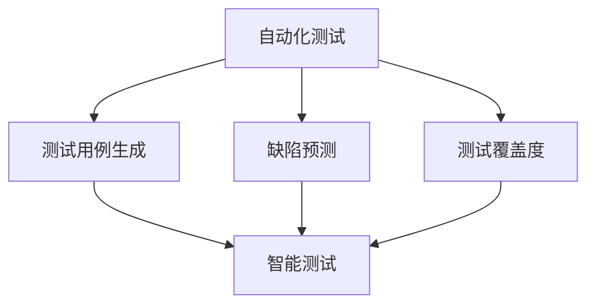

在这个ER实体关系图中，自动化测试、测试用例生成、缺陷预测和测试覆盖度都是智能测试的基础，它们共同构成了AI辅助软件测试的核心组成部分。智能测试通过这些基础技术的结合，实现对测试过程的全面优化和提升。

### 1.5 AI辅助软件测试的基本算法原理

AI辅助软件测试的核心在于利用机器学习和深度学习算法，通过对大量测试数据的学习和分析，自动生成测试用例、预测缺陷、优化测试流程等。以下是几种常用的AI辅助测试算法及其基本原理。

#### 1.5.1 机器学习算法基础

机器学习算法是AI辅助软件测试的基础，它们通过从数据中学习规律，实现对未知数据的预测和分类。以下是几种常用的机器学习算法：

1. **线性回归（Linear Regression）**

线性回归是一种简单的机器学习算法，它通过找到数据中的线性关系，预测目标变量的值。其数学模型如下：

$$
y = w_0 + w_1 \cdot x_1 + w_2 \cdot x_2 + ... + w_n \cdot x_n
$$

其中，$y$ 是预测的目标变量，$x_1, x_2, ..., x_n$ 是输入特征，$w_0, w_1, w_2, ..., w_n$ 是模型参数。

2. **决策树（Decision Tree）**

决策树通过一系列的if-else判断，将数据划分为不同的区域，实现对数据的分类或回归。它的基本原理是通过计算每个特征的重要性和分裂增益，选择最优的特征进行划分。

3. **随机森林（Random Forest）**

随机森林是一种基于决策树的集成学习方法，它通过构建多个决策树，并投票决定最终结果，提高预测的准确性。随机森林的核心思想是减少过拟合，提高模型的泛化能力。

4. **支持向量机（Support Vector Machine, SVM）**

支持向量机通过找到一个最优的超平面，将不同类别的数据分开。其目标是最大化分类间隔，提高模型的分类能力。

#### 1.5.2 测试用例生成算法

测试用例生成是AI辅助软件测试的重要环节，通过自动生成测试用例，可以提高测试的覆盖率和效率。以下是几种常用的测试用例生成算法：

1. **基于覆盖率的测试用例生成**

基于覆盖率的测试用例生成算法通过最大化代码覆盖率达到生成测试用例的目的。常见的覆盖率包括语句覆盖、分支覆盖、路径覆盖等。其中，路径覆盖是最严格的覆盖率，要求每个可能的执行路径都被覆盖到。

2. **基于变异测试的测试用例生成**

基于变异测试的测试用例生成算法通过生成对代码进行小幅度修改的变异版本，并运行原测试用例，观察是否能够检测到这些变异，从而生成新的测试用例。

3. **基于机器学习的测试用例生成**

基于机器学习的测试用例生成算法通过学习历史测试数据和代码结构，自动生成新的测试用例。这种方法可以大大提高测试用例的生成效率，并且能够覆盖到更多的代码路径。

#### 1.5.3 缺陷定位与诊断算法

缺陷定位与诊断是AI辅助软件测试的另一个重要环节，通过分析测试结果和代码结构，快速定位缺陷并诊断原因。以下是几种常用的缺陷定位与诊断算法：

1. **基于代码分析的诊断算法**

基于代码分析的诊断算法通过分析代码的语法、语义和结构，定位可能存在缺陷的代码段。这种方法可以识别出常见的编程错误和潜在的问题，例如空指针异常、数组越界等。

2. **基于机器学习的诊断算法**

基于机器学习的诊断算法通过学习大量的缺陷实例，建立缺陷特征模型，对新出现的缺陷进行诊断。这种方法可以大大提高缺陷定位的准确性，并且能够自动识别出新的缺陷类型。

3. **基于深度学习的缺陷定位算法**

基于深度学习的缺陷定位算法通过训练深度神经网络，自动识别代码中的缺陷模式。这种方法可以处理大规模的代码数据，并且能够自适应地调整模型，提高定位的准确性。

#### 1.5.4 测试覆盖度优化算法

测试覆盖度是衡量测试质量的重要指标，通过优化测试覆盖度，可以提高测试的完整性和有效性。以下是几种常用的测试覆盖度优化算法：

1. **基于贪心算法的优化**

基于贪心算法的优化通过每次选择最优的测试用例进行执行，逐步提高覆盖度。这种方法简单高效，但可能无法达到全局最优。

2. **基于遗传算法的优化**

基于遗传算法的优化通过模拟自然进化过程，不断优化测试用例集合，提高覆盖度。这种方法可以处理复杂的优化问题，但计算成本较高。

3. **基于深度强化学习的优化**

基于深度强化学习的优化通过训练深度神经网络，学习最优的测试用例执行策略，最大化覆盖度。这种方法可以在复杂的测试环境中实现高效的覆盖度优化。

### 总结

AI辅助软件测试的基本算法原理涵盖了机器学习算法、测试用例生成算法、缺陷定位与诊断算法以及测试覆盖度优化算法等多个方面。这些算法通过不同的方式，从不同的角度，对软件测试过程进行优化和提升，为软件开发提供了强有力的支持。在接下来的章节中，我们将进一步探讨AI辅助软件测试在实际应用中的具体实现和案例分析。

### 第4章: AI在测试中的应用

在了解了AI辅助软件测试的基本算法原理之后，现在我们将探讨AI在软件测试中的具体应用，这些应用不仅涵盖了单元测试、集成测试、系统测试和性能测试，还包括了测试工具的集成与优化流程。通过这些实际案例，我们将看到AI技术在提升软件测试效率和质量方面的潜力。

#### 4.1 AI在单元测试中的应用

单元测试是软件测试的基础，它的主要目标是验证代码模块的功能是否正确。传统的单元测试通常依赖于测试工程师手动编写测试用例，而AI技术的引入可以显著提高单元测试的效率和覆盖率。

**案例1：智能测试用例生成**

通过机器学习算法，可以从已有的测试用例和代码中学习，自动生成新的测试用例。例如，使用遗传算法优化测试用例的生成过程，能够提高测试用例的多样性和覆盖度。下面是一个简单的遗传算法测试用例生成的流程：

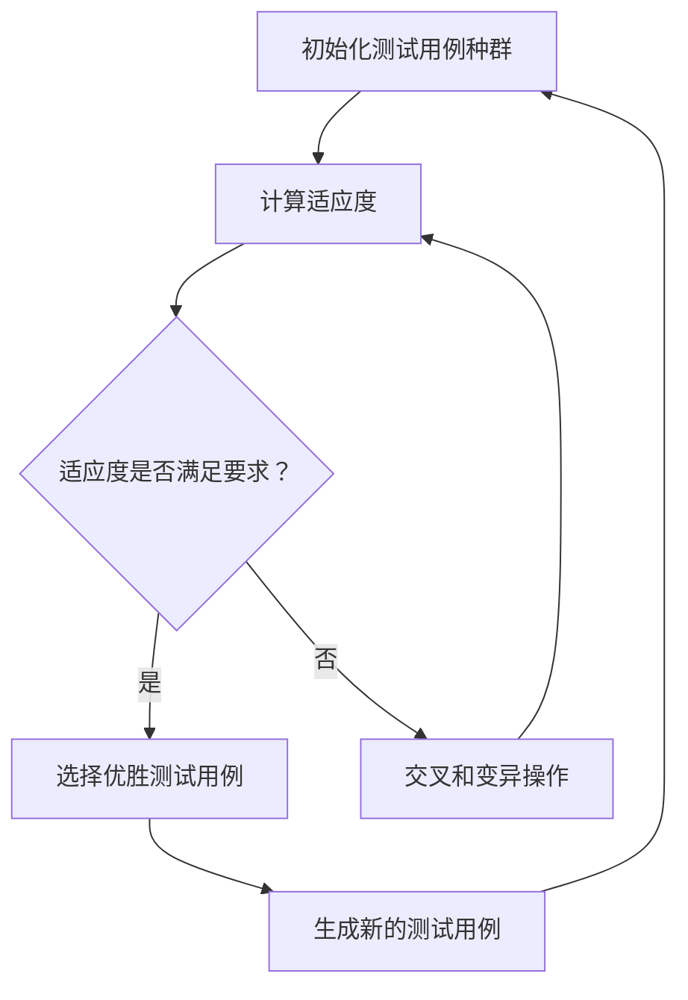

**案例2：代码缺陷预测**

AI还可以预测哪些代码模块可能存在缺陷，从而提前进行针对性的测试。通过分析历史缺陷数据，机器学习模型可以识别出缺陷的模式和特征，例如常见的编程错误和潜在的风险点。以下是一个简单的决策树缺陷预测的流程：

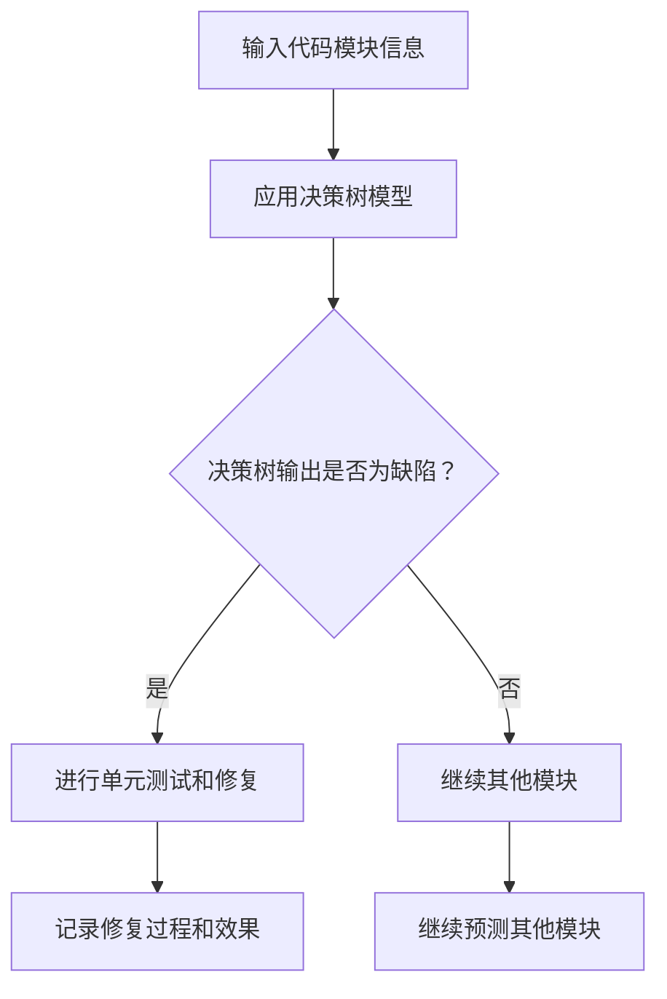

#### 4.2 AI在集成测试中的应用

集成测试是将各个单元模块整合起来，进行整体测试，以验证系统功能是否正常。AI技术在集成测试中同样发挥着重要作用，能够提高测试的覆盖率和效率。

**案例1：智能测试路径规划**

通过机器学习算法，可以分析历史集成测试数据，生成最优的测试路径。这种路径规划不仅考虑代码覆盖率，还考虑了模块之间的依赖关系，从而最大化测试的效益。以下是一个简单的测试路径规划的流程：

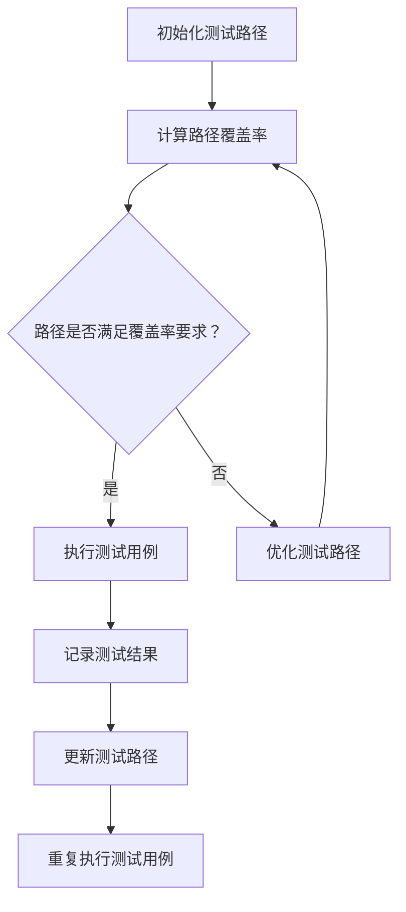

**案例2：缺陷预测与定位**

在集成测试中，AI技术可以帮助快速定位缺陷所在的具体模块，减少调试时间。通过分析模块之间的调用关系和代码结构，机器学习模型可以预测哪些模块可能存在缺陷。以下是一个简单的缺陷预测与定位的流程：

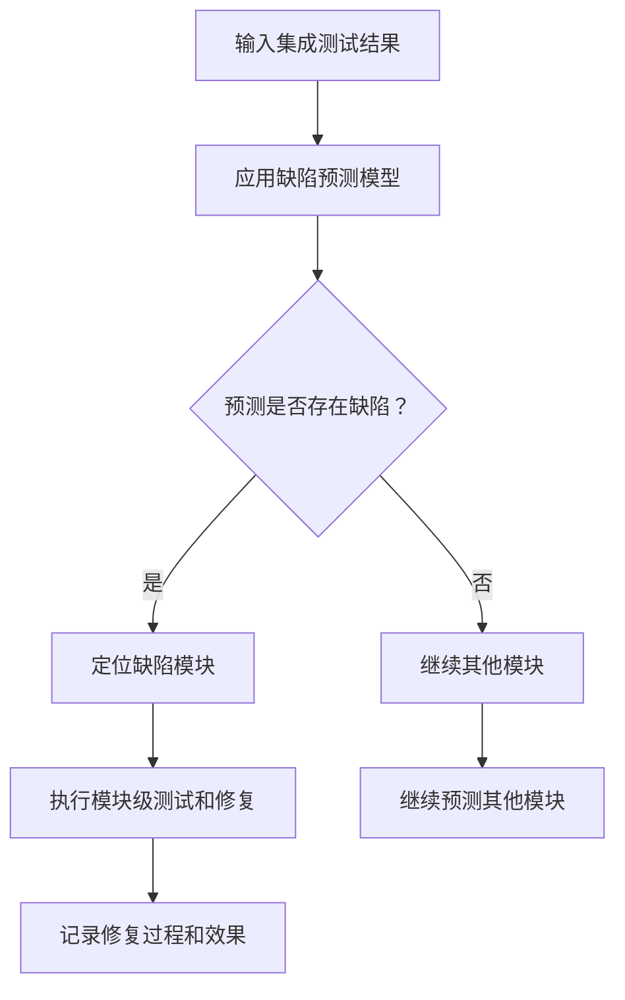

#### 4.3 AI在系统测试中的应用

系统测试是对整个软件系统进行全面的测试，验证系统功能、性能和稳定性。AI技术在系统测试中同样能够发挥重要作用，提高测试的效率和准确性。

**案例1：性能测试与优化**

通过AI技术，可以自动化进行系统性能测试，生成性能基准，并分析系统的性能瓶颈。以下是一个简单的性能测试与优化的流程：

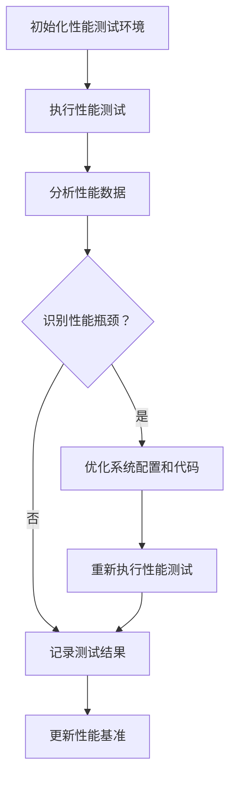

**案例2：智能缺陷定位**

在系统测试中，AI技术可以帮助快速定位缺陷，提高缺陷修复效率。通过分析系统日志、错误信息和代码结构，机器学习模型可以预测缺陷的可能原因。以下是一个简单的智能缺陷定位的流程：

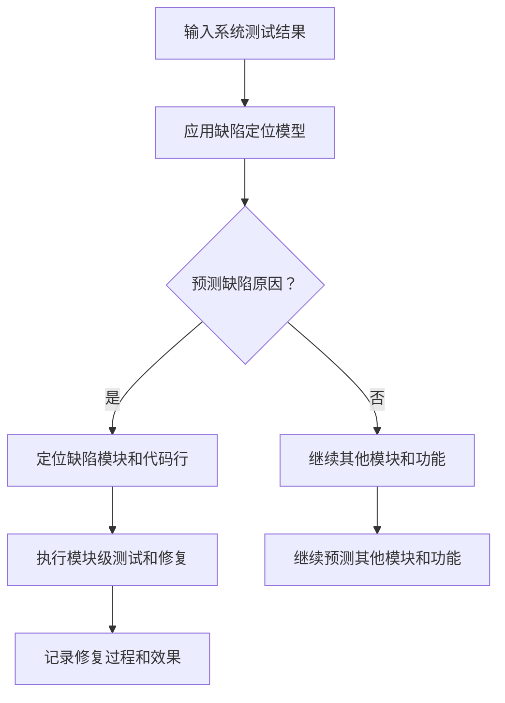

#### 4.4 AI在性能测试中的应用

性能测试是验证软件系统在特定负载下的性能和稳定性。AI技术在性能测试中可以自动化测试过程，优化测试策略，提高测试效率和准确性。

**案例1：自动化测试脚本生成**

通过机器学习算法，可以自动生成性能测试脚本，模拟用户行为和系统负载。以下是一个简单的自动化测试脚本生成的流程：

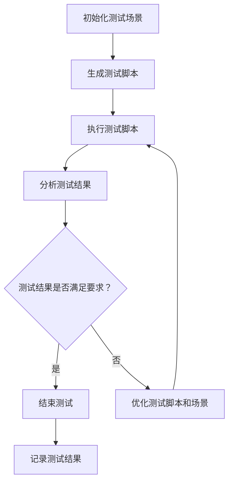

**案例2：智能性能分析**

通过AI技术，可以智能分析性能测试结果，识别性能瓶颈和优化点。以下是一个简单的智能性能分析的流程：

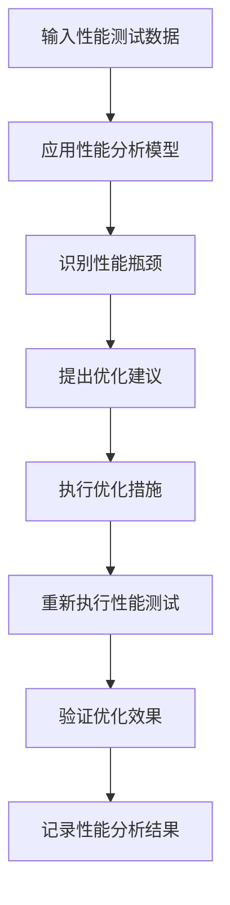

### 4.5 AI与测试工具的集成

为了充分发挥AI技术在软件测试中的作用，需要将其与现有的测试工具进行集成。以下是一些常见的集成方式和案例：

**案例1：AI与自动化测试工具集成**

通过插件或API，将AI技术集成到自动化测试工具中，如Selenium、Jenkins等。以下是一个简单的集成流程：

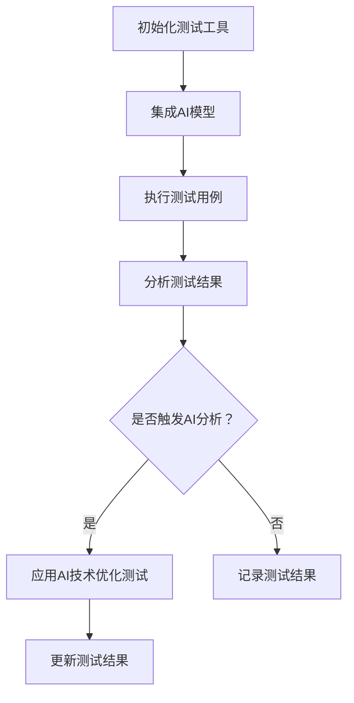

**案例2：AI与测试管理工具集成**

通过API或Web服务，将AI技术集成到测试管理工具中，如TestRail、JIRA等。以下是一个简单的集成流程：

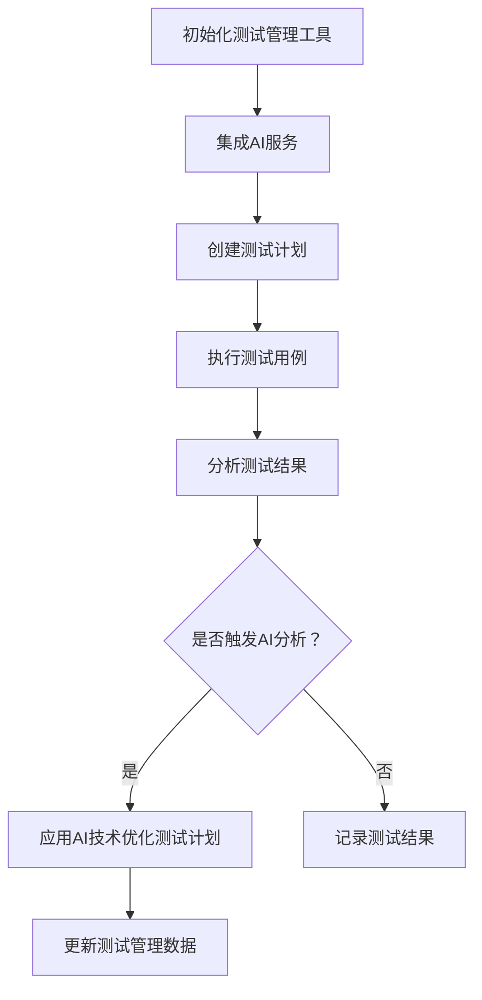

### 总结

通过上述案例，我们可以看到AI技术在软件测试中的广泛应用和巨大潜力。从单元测试到系统测试，从性能测试到测试工具集成，AI技术不仅提高了测试效率，还显著提升了测试质量和准确性。在接下来的章节中，我们将进一步探讨AI辅助软件测试的集成方法、案例分析以及未来发展趋势。

### 第5章: AI与测试工具的集成

在深入了解了AI在测试中的应用之后，现在我们将探讨如何将AI与现有的测试工具进行集成，以实现更高的测试效率和效果。通过优化测试工具和流程，AI辅助软件测试可以更加智能化和自动化。

#### 5.1 测试工具的选择与集成

选择适合的测试工具是AI辅助软件测试的基础。以下是一些常见的测试工具及其与AI技术的集成方式：

**1. 自动化测试工具（如Selenium、Cypress）**

自动化测试工具是进行AI辅助测试的重要平台。通过使用API或插件，可以将AI算法集成到自动化测试脚本中，实现智能测试用例生成和缺陷预测。

**案例：使用Selenium与机器学习模型集成**

```python
from selenium import webdriver
from my_机器学习_model import DefectPredictionModel

# 初始化Selenium WebDriver
driver = webdriver.Chrome()

# 初始化机器学习模型
model = DefectPredictionModel()

# 执行自动化测试脚本
driver.get("https://example.com")
# ...其他自动化测试代码...

# 应用机器学习模型进行缺陷预测
if model.predict(driver.page_source):
    print("可能存在缺陷，需进一步测试。")
else:
    print("当前页面无缺陷。")
```

**2. 持续集成工具（如Jenkins、GitLab CI）**

持续集成（CI）工具是实现自动化测试和AI辅助测试的关键。通过配置CI管道，可以将AI算法应用到持续集成过程中，实现自动化测试和缺陷预测。

**案例：在Jenkins中使用AI模型**

```shell
# Jenkinsfile
pipeline {
    agent any
    stages {
        stage('测试') {
            steps {
                sh 'python test_script.py' // 执行自动化测试脚本
                sh 'python defect_prediction.py' // 应用AI模型进行缺陷预测
            }
        }
    }
}
```

**3. 测试管理工具（如TestRail、JIRA）**

测试管理工具用于管理测试计划和测试结果。通过API集成，可以将AI算法应用到测试管理过程中，实现智能测试计划生成和测试结果分析。

**案例：使用TestRail与AI模型集成**

```python
import testrail

# 初始化TestRail API
client = testrail.TestRailClient('https://example.testrail.com', 'username', 'password')

# 应用AI模型生成测试计划
test_plan = AIModel.generate_test_plan()

# 上传测试计划到TestRail
client.add_plan('Project Key', test_plan)
```

#### 5.2 AI在持续集成环境中的应用

在持续集成环境中，AI技术可以显著提高测试的自动化和智能化程度。以下是一些应用实例：

**1. 自动化测试执行**

通过AI算法，可以自动生成测试脚本并执行，减少人工干预。例如，使用深度学习模型分析历史测试数据，生成新的测试用例并自动执行。

**案例：使用神经网络模型自动生成测试脚本**

```python
import tensorflow as tf

# 加载神经网络模型
model = tf.keras.models.load_model('my_test_generation_model.h5')

# 分析历史测试数据
test_data = preprocess_test_data(history_test_data)

# 自动生成测试脚本
test_script = model.predict(test_data)

# 执行测试脚本
execute_test_script(test_script)
```

**2. 缺陷预测与定位**

在持续集成过程中，AI技术可以实时分析代码和测试结果，预测潜在的缺陷并定位缺陷所在模块。例如，通过机器学习算法分析代码和测试数据，预测哪些代码片段可能存在缺陷。

**案例：使用决策树模型进行缺陷预测**

```python
import sklearn

# 加载决策树模型
model = sklearn.tree.DecisionTreeClassifier()

# 训练模型
model.fit(X_train, y_train)

# 预测缺陷
predicted_defects = model.predict(X_test)

# 定位缺陷
locate_defects(predicted_defects)
```

**3. 测试结果分析**

AI技术可以自动分析测试结果，生成详细的测试报告，并识别潜在的测试问题。例如，通过聚类分析测试结果，识别异常数据和潜在缺陷。

**案例：使用K-means算法分析测试结果**

```python
from sklearn.cluster import KMeans

# 加载K-means模型
model = KMeans(n_clusters=3)

# 训练模型
model.fit(test_results)

# 分析测试结果
clusters = model.predict(test_results)

# 生成测试报告
generate_test_report(clusters)
```

#### 5.3 AI在测试管理工具中的应用

AI技术可以优化测试管理流程，提高测试效率和质量。以下是一些应用实例：

**1. 测试计划生成**

通过AI算法，可以自动生成测试计划，包括测试用例、测试环境和测试资源。例如，使用机器学习算法分析项目历史数据，生成最优的测试计划。

**案例：使用机器学习模型生成测试计划**

```python
from my_ai_model import TestPlanGenerator

# 初始化测试计划生成模型
generator = TestPlanGenerator()

# 分析项目历史数据
historical_data = load_historical_data()

# 生成测试计划
test_plan = generator.generate(historical_data)

# 上传测试计划
upload_test_plan(test_plan)
```

**2. 测试结果分析**

通过AI算法，可以自动分析测试结果，生成详细的测试报告，并识别潜在的测试问题。例如，使用数据挖掘技术分析测试数据，识别异常数据和潜在缺陷。

**案例：使用数据挖掘模型分析测试结果**

```python
from my_data_mining_model import TestResultAnalyzer

# 初始化测试结果分析模型
analyzer = TestResultAnalyzer()

# 分析测试结果
analyzed_results = analyzer.analyze(test_results)

# 生成测试报告
generate_test_report(analyzed_results)
```

**3. 测试流程优化**

通过AI算法，可以自动优化测试流程，提高测试效率。例如，使用遗传算法优化测试用例的执行顺序，提高测试覆盖率和效率。

**案例：使用遗传算法优化测试流程**

```python
from my_genetic_algorithm import TestFlowOptimizer

# 初始化测试流程优化模型
optimizer = TestFlowOptimizer()

# 优化测试流程
optimized_flow = optimizer.optimize(test_flow)

# 执行优化后的测试流程
execute_test_flow(optimized_flow)
```

#### 5.4 AI辅助测试的流程优化

AI技术不仅可以应用于具体的测试任务，还可以优化整个测试流程。以下是一些优化策略：

**1. 自动化测试流程**

通过AI技术，可以自动生成和优化自动化测试流程。例如，使用机器学习算法分析历史测试数据，自动生成最优的自动化测试脚本和执行顺序。

**案例：使用机器学习模型优化自动化测试流程**

```python
from my_automation_model import TestAutomationOptimizer

# 初始化自动化测试流程优化模型
optimizer = TestAutomationOptimizer()

# 优化自动化测试流程
optimized_flow = optimizer.optimize(automation_flow)

# 执行优化后的自动化测试流程
execute_automation_flow(optimized_flow)
```

**2. 缺陷修复流程**

通过AI技术，可以优化缺陷修复流程，提高缺陷修复效率。例如，使用机器学习算法预测哪些缺陷最有可能在下一个版本中修复，优先修复这些缺陷。

**案例：使用机器学习模型优化缺陷修复流程**

```python
from my_defect_management_model import DefectRepairOptimizer

# 初始化缺陷修复流程优化模型
optimizer = DefectRepairOptimizer()

# 优化缺陷修复流程
optimized_flow = optimizer.optimize(defect_management_flow)

# 执行优化后的缺陷修复流程
execute_defect_repair_flow(optimized_flow)
```

**3. 测试资源分配**

通过AI技术，可以自动优化测试资源的分配，提高测试效率。例如，使用遗传算法优化测试资源的分配策略，确保关键测试用例在合适的时机执行。

**案例：使用遗传算法优化测试资源分配**

```python
from my_resource_allocation_model import TestResourceAllocator

# 初始化测试资源分配模型
allocator = TestResourceAllocator()

# 优化测试资源分配
optimized_resources = allocator.optimize(test_resources)

# 分配优化后的测试资源
allocate_resources(optimized_resources)
```

### 总结

通过AI与测试工具的集成，可以显著提高软件测试的效率和效果。从测试工具的选择与集成，到持续集成环境中的应用，再到测试管理工具的优化，AI技术为软件测试带来了全新的视角和工具。在未来的发展中，AI技术将在软件测试中发挥越来越重要的作用，推动测试流程的自动化和智能化。

### 第6章：案例分析与最佳实践

在了解了AI辅助软件测试的基本原理和实际应用后，通过具体案例分析可以更深入地理解AI技术在实际项目中的应用效果和最佳实践。以下是几个具有代表性的案例，通过这些案例，我们将探讨AI辅助软件测试的成功应用和面临的挑战，以及总结出的最佳实践。

#### 案例一：某电商平台的AI自动化测试实践

**问题描述：**
某大型电商平台在持续扩展其功能和服务的同时，面临日益增长的测试工作量和测试难度。传统的测试方法已无法满足快速迭代和大规模功能更新的需求。

**解决方案：**
该电商平台引入了AI辅助测试技术，具体实施步骤如下：

1. **自动化测试脚本生成**：通过机器学习算法，从历史测试数据中学习，自动生成新的测试脚本。这种方法大大提高了测试脚本的开发效率，并且保证了测试覆盖率的提升。

2. **智能缺陷定位**：利用AI技术分析测试结果，预测哪些模块可能存在缺陷，并快速定位缺陷所在。这不仅减少了调试时间，还提高了缺陷修复的效率。

3. **持续集成与优化**：将AI技术集成到持续集成环境中，通过自动化测试和缺陷预测，确保每次代码提交都能得到充分的测试，并及时发现和修复缺陷。

**案例分析：**
该电商平台通过引入AI辅助测试技术，实现了以下成果：

- **测试效率提升**：自动化测试脚本生成和智能缺陷定位显著减少了测试工作量和时间，测试人员可以将更多精力投入到更高价值的测试活动中。
- **测试质量提高**：AI技术提高了测试的全面性和准确性，减少了遗漏缺陷的可能性。
- **持续集成效率**：AI技术集成到持续集成环境中，实现了快速反馈和修复，提高了开发与测试的协同效率。

**最佳实践：**
- **充分利用历史测试数据**：历史测试数据是AI模型训练的重要资源，充分利用这些数据可以显著提升AI辅助测试的效果。
- **持续优化模型**：定期更新和优化AI模型，使其能够适应不断变化的应用场景和测试需求。
- **结合多种AI技术**：根据不同的测试任务，选择合适的AI技术，如自动化测试脚本生成、智能缺陷定位、测试覆盖度优化等，实现综合应用。

#### 案例二：某金融公司的AI智能测试实践

**问题描述：**
某金融公司开发了一套复杂的风险管理系统，该系统的功能繁多且涉及金融数据的敏感性。传统的测试方法难以满足对系统功能完整性和数据安全性的高要求。

**解决方案：**
该金融公司采用了AI辅助测试技术，并采取以下措施：

1. **测试用例生成与优化**：使用机器学习算法自动生成和优化测试用例，确保所有关键功能都能得到测试，并减少了重复劳动。

2. **智能性能测试**：利用AI技术模拟大量用户行为，进行性能测试，识别系统的性能瓶颈，并优化系统配置和代码。

3. **缺陷预测与智能诊断**：通过分析代码和测试结果，预测潜在缺陷，并使用智能诊断工具快速定位和修复缺陷。

**案例分析：**
该金融公司通过AI辅助测试，取得了以下成果：

- **提高测试覆盖率**：AI技术自动生成和优化测试用例，确保了关键功能得到充分测试，测试覆盖率显著提升。
- **优化性能**：智能性能测试帮助识别和解决了系统的性能瓶颈，提高了系统的稳定性和响应速度。
- **保障数据安全**：智能诊断工具能够快速发现和修复潜在的缺陷，保障了金融数据的准确性和安全性。

**最佳实践：**
- **严格数据质量管理**：确保测试数据的质量和完整性，这对于AI模型的训练和预测至关重要。
- **定制化AI模型**：根据不同的业务场景和测试需求，开发定制化的AI模型，使其更符合实际应用场景。
- **培训与支持**：加强测试团队对AI技术的理解和应用能力，提供持续的培训和技术支持。

#### 案例三：某医疗健康平台的AI测试实践

**问题描述：**
某医疗健康平台在开发过程中，需要确保系统的稳定性和数据准确性，以满足医疗行业的严格标准。

**解决方案：**
该医疗健康平台采用了AI辅助测试技术，主要措施包括：

1. **智能测试用例生成**：通过机器学习算法，自动生成新的测试用例，确保所有关键路径和边界条件都得到测试。

2. **智能缺陷预测与定位**：利用AI技术预测潜在缺陷，并快速定位缺陷原因，提高缺陷修复的效率。

3. **自动化测试与持续集成**：将AI技术集成到自动化测试和持续集成环境中，实现自动化测试脚本生成和测试结果分析，确保每次代码变更都能得到充分测试。

**案例分析：**
该医疗健康平台通过AI辅助测试，取得了以下成果：

- **提高测试效率**：智能测试用例生成和缺陷预测显著减少了测试工作量和时间。
- **保障数据准确性**：通过智能缺陷定位和测试覆盖度优化，确保了系统的数据准确性和稳定性。
- **优化开发与测试协同**：自动化测试与持续集成结合AI技术，提高了开发与测试的协同效率，确保了快速迭代和高质量交付。

**最佳实践：**
- **遵循医疗行业规范**：在AI测试应用中，遵循医疗行业的标准和规范，确保测试过程和结果符合行业要求。
- **测试数据与医疗数据分离**：在AI模型训练和使用过程中，确保测试数据与医疗数据分离，保护患者隐私。
- **持续监控与反馈**：对AI辅助测试的结果进行持续监控和反馈，及时调整和优化测试策略，确保测试效果持续提升。

### 总结

通过上述案例，我们可以看到AI辅助软件测试在实际项目中的应用效果和最佳实践。AI技术在提高测试效率、保障测试质量和优化测试流程方面具有显著的优势。同时，AI辅助测试也面临数据质量、技术门槛和模型优化等挑战。为了充分发挥AI辅助测试的优势，建议在以下方面持续努力：

- **充分利用历史测试数据**：确保数据的质量和完整性，为AI模型训练提供可靠的依据。
- **定制化AI模型**：根据不同的应用场景和业务需求，开发定制化的AI模型，提高模型的适应性。
- **加强团队培训**：提高测试团队对AI技术的理解和应用能力，促进AI技术在测试中的应用。
- **持续优化和监控**：对AI辅助测试的结果进行持续监控和反馈，及时调整和优化测试策略。

通过这些最佳实践，我们可以更好地利用AI技术，实现软件测试的智能化和自动化，提高软件质量和开发效率。

### 第7章：未来趋势与发展方向

在AI技术迅速发展的背景下，AI辅助软件测试领域也在不断演进。未来，AI辅助软件测试将呈现出一系列新的趋势和发展方向，这些趋势不仅将影响软件测试的实践方法，还将改变软件测试的整个生态系统。

#### 7.1 AI辅助软件测试的未来趋势

**1. 智能化程度的提升**

随着深度学习和强化学习等AI技术的不断发展，AI辅助软件测试的智能化程度将大幅提升。未来的AI辅助测试将更加主动和自适应，能够根据测试环境和项目需求动态调整测试策略，提高测试效率和质量。

**2. 数据驱动的测试优化**

未来，数据驱动将成为AI辅助软件测试的核心。通过分析大量的测试数据，AI模型可以更准确地预测缺陷、优化测试用例、提升测试覆盖度和性能。数据驱动的测试优化将使得测试过程更加科学和高效。

**3. 跨领域应用的拓展**

AI辅助软件测试不仅限于传统的软件开发领域，还将逐渐应用于物联网、云计算、人工智能等新兴领域。这些领域对测试质量和效率的要求更高，AI技术的引入将有助于解决这些领域的测试挑战。

**4. 融入开发流程**

AI辅助软件测试将更加紧密地融入软件开发流程，与开发、运维等环节实现无缝集成。AI技术将提供实时反馈，帮助开发团队快速发现和修复问题，实现更高效的开发和测试协同。

**5. 安全性增强**

随着AI技术的广泛应用，确保AI辅助软件测试的安全性将成为重要趋势。未来的AI测试工具将具备更强的安全防护能力，防止数据泄露和模型被篡改，保障测试过程的安全和可靠性。

#### 7.2 技术发展的挑战与机遇

**1. 数据质量和隐私保护**

数据质量是AI辅助软件测试成功的关键，但同时也带来了隐私保护的问题。如何处理大量测试数据，确保数据的质量和隐私，将是未来面临的主要挑战之一。

**2. 模型解释性和可解释性**

虽然AI模型在预测和优化方面表现出色，但其解释性较差，难以解释模型决策的原因。提高AI模型的解释性和可解释性，使其更透明和可信，是未来发展的关键。

**3. 模型的泛化能力**

AI模型在特定数据集上表现良好，但在面对新的数据时可能效果不佳。提高模型的泛化能力，使其能够适应不同的测试场景和项目需求，是未来需要解决的问题。

**4. 技术成熟度和应用成本**

虽然AI技术在不断发展，但一些核心技术的成熟度和应用成本仍然较高。降低AI技术的门槛，提高其可访问性，是未来需要关注的重要方向。

**5. 团队技能和培训**

AI辅助软件测试需要专业的团队和技能。提高测试团队对AI技术的理解和应用能力，提供持续的培训和技术支持，是确保AI技术成功应用的重要保障。

#### 7.3 行业前景与展望

AI辅助软件测试将在未来软件行业中发挥越来越重要的作用。以下是几个关键领域的展望：

**1. 软件质量和安全性**

AI辅助测试将显著提升软件质量和安全性，减少缺陷和漏洞，提高软件的可靠性和用户体验。这将为软件开发企业带来显著竞争优势。

**2. 效率和成本的优化**

通过自动化和智能化的测试方法，AI辅助测试将大幅提高测试效率和降低测试成本，为企业节省大量资源，提高生产效率。

**3. 开发与测试协同**

AI辅助测试将推动开发与测试的深度协同，实现更高效的开发流程。开发团队和测试团队将更加紧密合作，共同确保软件质量和交付效率。

**4. 新兴技术领域的应用**

随着物联网、云计算、人工智能等新兴技术的快速发展，AI辅助测试将在这些领域发挥重要作用，推动新兴技术的测试实践和创新。

**5. 行业标准和规范**

随着AI辅助测试的普及，相关行业标准和规范也将逐渐完善，为AI辅助测试的应用提供指导和保障。

总之，AI辅助软件测试具有广阔的发展前景和巨大潜力。通过不断创新和优化，AI技术将为软件测试带来革命性的变革，推动软件行业的持续进步和发展。

### 总结与展望

通过对AI辅助软件测试的深入探讨，我们可以看到，AI技术在提升软件测试效率、质量和可靠性方面具有巨大的潜力。未来，随着AI技术的不断发展和应用的深入，AI辅助软件测试将在软件行业中发挥越来越重要的作用。

在当前阶段，AI辅助软件测试面临着数据质量、模型解释性、泛化能力、技术成熟度和成本等挑战。为了克服这些挑战，我们需要进一步加强团队培训，提高对AI技术的理解和应用能力。同时，积极进行技术研究和创新，优化AI模型和算法，提高其性能和可靠性。

展望未来，AI辅助软件测试将走向更加智能化和自动化的发展方向，成为软件开发和测试不可或缺的一部分。通过持续的努力和创新，我们可以期待AI辅助软件测试在提高软件质量和开发效率方面取得更大的突破，推动软件行业的持续进步和发展。

在此，我们对未来充满信心，并期待AI技术在软件测试领域带来更多的创新和变革。同时，感谢读者对本文的关注和支持，希望本文能为您在AI辅助软件测试领域的学习和实践提供有益的参考。

### 作者信息

**作者：** AI天才研究院（AI Genius Institute） & 禅与计算机程序设计艺术（Zen And The Art of Computer Programming）

AI天才研究院是一家专注于人工智能研究和应用的高科技创新机构，致力于推动人工智能技术的发展和产业化应用。研究院在人工智能领域拥有丰富的科研成果和技术积累，为全球多家知名企业和研究机构提供了技术支持和解决方案。

禅与计算机程序设计艺术是作者多年来在计算机编程和软件工程领域的研究和总结，以其深刻的哲理和精湛的技术洞见，为软件开发者和IT从业者提供了宝贵的指导和启示。本书是作者在AI辅助软件测试领域的最新力作，旨在为读者揭示AI技术在软件测试中的巨大潜力和应用价值。希望本书能够为广大IT从业者提供有益的参考和启发，共同推动软件测试领域的创新和发展。

