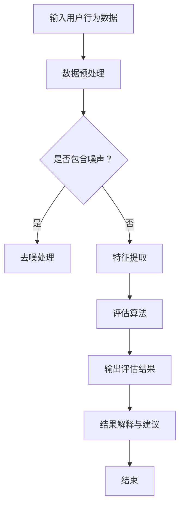

                 


### AI辅助软件用户体验评估

#### 关键词
- AI辅助
- 软件用户体验
- 评估
- 数学模型
- 算法原理
- 系统架构

#### 摘要
本文将深入探讨AI辅助软件用户体验评估的核心概念、算法原理、数学模型以及系统架构设计。我们将通过逐步分析，揭示如何运用人工智能技术提升软件用户体验评估的精确度和效率。文章还将分享项目实战经验，以及最佳实践建议，旨在为读者提供全面的技术指导。

----------------------------------------------------------------

## 目录大纲设计

### 第1章 引言与背景
#### 1.1 问题背景
#### 1.2 问题描述
#### 1.3 问题解决
#### .1.4 边界与外延
#### 1.5 概念结构与核心要素组成

### 第2章 核心概念与联系
#### 2.1 AI辅助软件用户体验评估的核心概念
#### 2.2 概念属性特征对比表格
#### 2.3 ER实体关系图架构
#### 2.4 AI辅助软件用户体验评估与相关领域的关系

### 第3章 算法原理讲解
#### 3.1 算法mermaid流程图
#### 3.2 Python源代码详细阐述
#### 3.3 算法原理的数学模型和公式
#### 3.4 举例说明

### 第4章 数学模型和数学公式详细讲解与举例说明
#### 4.1 数学公式使用Latex格式示例
#### 4.2 数学模型详细讲解
#### 4.3 举例说明

### 第5章 系统分析与架构设计方案
#### 5.1 问题场景介绍
#### 5.2 项目介绍
#### 5.3 系统功能设计
#### 5.4 系统架构设计
#### 5.5 系统接口设计
#### 5.6 系统交互

### 第6章 项目实战
#### 6.1 环境安装
#### 6.2 系统核心实现源代码
#### 6.3 代码应用解读与分析
#### 6.4 实际案例分析与详细讲解剖析
#### 6.5 项目小结

### 第7章 最佳实践 tips
#### 7.1 小结
#### 7.2 注意事项
#### 7.3 拓展阅读

----------------------------------------------------------------

### 第1章 引言与背景

#### 1.1 问题背景

随着信息技术的迅猛发展，软件在人们的生活和工作中的地位愈发重要。然而，软件的质量直接影响用户的体验，而用户体验又是衡量软件成功与否的关键因素。传统的软件用户体验评估方法往往依赖于用户反馈和专家评审，这些方法存在主观性、效率低、覆盖面不足等问题。为了克服这些局限，人工智能（AI）技术的引入成为了一个潜在解决方案。

AI技术，特别是机器学习和深度学习，具有强大的数据分析和模式识别能力，可以自动分析大量用户行为数据，提供客观、准确的用户体验评估。这使得AI辅助软件用户体验评估成为了一个热门的研究方向。

#### 1.2 问题描述

在AI辅助软件用户体验评估中，我们面临以下主要问题：

1. **数据获取与处理**：如何有效地获取和预处理用户行为数据，以供算法分析。
2. **特征提取**：如何从用户行为数据中提取出能够反映用户体验的关键特征。
3. **算法选择与优化**：如何选择和优化评估算法，以最大化评估结果的准确性和可靠性。
4. **结果解释**：如何将评估结果转化为对软件改进的具体建议。

#### 1.3 问题解决

为了解决上述问题，我们可以采取以下策略：

1. **数据获取与处理**：使用数据挖掘技术，从各种数据源（如日志文件、调查问卷、用户评论等）中提取用户行为数据，并进行数据清洗、去噪和归一化处理。
2. **特征提取**：利用机器学习算法，从处理后的数据中提取出与用户体验相关的特征，如点击率、停留时间、错误率等。
3. **算法选择与优化**：结合具体的应用场景和数据特点，选择合适的机器学习算法，并进行参数调优，以提高评估的准确性和效率。
4. **结果解释**：通过可视化工具和自然语言生成技术，将评估结果以易于理解的方式呈现给用户，并提供具体的改进建议。

#### 1.4 边界与外延

在讨论AI辅助软件用户体验评估时，我们需要明确以下边界和外延：

1. **评估范围**：评估的范围可以是整个软件系统，也可以是软件的某个特定模块或功能。
2. **评估方法**：除了AI技术，还可以结合其他评估方法，如用户测试、问卷调查等，以获得更全面、客观的评估结果。
3. **评估周期**：评估可以在软件开发的早期阶段进行，也可以在软件发布后的运营阶段进行，以监控用户体验的变化。

#### 1.5 概念结构与核心要素组成

AI辅助软件用户体验评估的概念结构主要包括以下几个核心要素：

1. **用户行为数据**：这是评估的基础，包括用户的操作记录、反馈信息等。
2. **特征提取模型**：用于从用户行为数据中提取出与用户体验相关的特征。
3. **评估算法**：用于分析特征数据，生成用户体验评估结果。
4. **结果解释与建议**：将评估结果转化为对软件改进的具体建议。

通过以上分析，我们可以看到，AI辅助软件用户体验评估是一个复杂但充满潜力的研究领域。在接下来的章节中，我们将深入探讨这一领域的核心概念、算法原理、数学模型和系统架构设计，以期为大家提供一份全面的技术指南。


----------------------------------------------------------------

### 第2章 核心概念与联系

#### 2.1 AI辅助软件用户体验评估的核心概念

在本章节中，我们将详细阐述AI辅助软件用户体验评估的核心概念，包括其定义、应用场景和重要性。

**定义**

AI辅助软件用户体验评估是指利用人工智能技术，对软件产品的用户体验进行定量分析和评估的过程。它通过分析用户行为数据、交互记录等，评估软件的用户友好性、易用性、满意度等关键指标。

**应用场景**

1. **软件开发过程中**：AI辅助用户体验评估可以在软件开发的不同阶段进行，帮助开发团队了解用户对软件的反馈，及时调整和优化设计。
2. **软件发布后**：软件产品上线后，AI辅助用户体验评估可以帮助运营团队监测用户满意度，发现潜在问题，为后续的功能更新和改进提供依据。
3. **产品竞争分析**：通过对比不同产品的用户体验评估结果，企业可以了解市场动态，优化自身产品，提高竞争力。

**重要性**

AI辅助软件用户体验评估的重要性体现在以下几个方面：

1. **提高软件质量**：通过评估，可以识别出软件中的用户体验问题，从而进行针对性的优化，提高软件的整体质量。
2. **增加用户满意度**：良好的用户体验可以增加用户的满意度和忠诚度，从而提高软件的留存率和市场份额。
3. **降低维护成本**：及时发现并解决用户体验问题，可以减少后期维护和升级的成本。

#### 2.2 概念属性特征对比表格

为了更清晰地展示AI辅助软件用户体验评估的关键概念及其属性特征，我们设计了以下对比表格：

| 概念                  | 属性特征                                                  | 说明                                                         |
|-----------------------|-----------------------------------------------------------|--------------------------------------------------------------|
| 用户行为数据           | 数据来源多样，包括点击记录、使用时长、错误记录等         | 用户行为数据是评估的基础，决定了评估的准确性和全面性             |
| 特征提取模型           | 自动化提取用户行为数据中的关键特征                       | 特征提取模型直接影响评估的精度和效率                           |
| 评估算法               | 基于机器学习、深度学习等算法，用于分析特征数据           | 评估算法决定了评估结果的客观性和可靠性                         |
| 结果解释与建议         | 利用自然语言生成、可视化工具等技术，将评估结果转化为建议 | 结果解释与建议使得评估结果更易于理解，并为软件优化提供了明确方向 |

#### 2.3 ER实体关系图架构

为了进一步理解AI辅助软件用户体验评估的概念及其相互关系，我们使用了Mermaid语言绘制了ER实体关系图，如下所示：

```mermaid
erDiagram
    UserData -->|1| FeatureExtractionModel : 提取
    FeatureExtractionModel -->|1| EvaluationAlgorithm : 分析
    EvaluationAlgorithm -->|1| ResultExplanationAndSuggestion : 转换
    UserData -->|1| ResultExplanationAndSuggestion : 反馈
```

在这个ER图中，用户行为数据（User Data）是评估的基础，它通过特征提取模型（FeatureExtractionModel）生成特征数据，这些特征数据再由评估算法（EvaluationAlgorithm）进行分析，最终生成评估结果和改进建议（ResultExplanationAndSuggestion）。同时，用户行为数据也直接反馈给结果解释与建议模块，形成闭环。

#### 2.4 AI辅助软件用户体验评估与相关领域的关系

AI辅助软件用户体验评估不仅与人工智能技术密切相关，还与其他领域有着紧密的联系：

1. **用户研究**：用户体验评估需要大量的用户行为数据，这些数据通常来自于用户研究，如用户访谈、问卷调查等。
2. **人机交互**：用户体验评估关注的是用户与软件的交互，因此与人机交互（HCI）领域有着密切的关系。
3. **软件工程**：用户体验评估是软件工程中的一个重要环节，它帮助开发团队了解用户需求，优化软件设计。
4. **数据科学**：用户体验评估依赖于数据挖掘、机器学习等技术，这些技术属于数据科学领域。

通过上述分析，我们可以看到，AI辅助软件用户体验评估是一个跨学科的研究领域，它结合了人工智能、用户研究、人机交互、软件工程和数据科学等多个领域的知识和技术。

在下一章中，我们将进一步探讨AI辅助软件用户体验评估的算法原理，包括算法的基本概念、原理和流程。

----------------------------------------------------------------

### 第3章 算法原理讲解

#### 3.1 算法mermaid流程图

在本节中，我们将使用Mermaid语言绘制一个简化的AI辅助软件用户体验评估算法流程图，以便更直观地展示算法的执行流程。



这个流程图描述了从输入用户行为数据到输出评估结果和建议的整个过程。接下来，我们将详细解释每个步骤的具体内容。

#### 3.2 Python源代码详细阐述

为了更好地理解算法原理，我们提供了一个Python源代码示例，用于演示用户行为数据预处理、特征提取和评估算法的实现。

```python
# 导入必要的库
import numpy as np
import pandas as pd
from sklearn.preprocessing import StandardScaler
from sklearn.cluster import KMeans
from sklearn.metrics import silhouette_score

# 加载用户行为数据
data = pd.read_csv('user_behavior.csv')

# 数据预处理
def preprocess_data(data):
    # 数据清洗（例如：去除空值、重复值等）
    cleaned_data = data.dropna().drop_duplicates()
    
    # 数据归一化
    scaler = StandardScaler()
    normalized_data = scaler.fit_transform(cleaned_data)
    
    return normalized_data

# 特征提取
def extract_features(data):
    # 使用KMeans聚类提取特征
    kmeans = KMeans(n_clusters=5)
    clusters = kmeans.fit_predict(data)
    
    # 计算 silhouette score
    sil_score = silhouette_score(data, clusters)
    
    return clusters, sil_score

# 评估算法
def evaluate_algorithm(clusters, data):
    # 计算评估指标
    evaluation_metrics = {}
    evaluation_metrics['cluster_wise_accuracy'] = calculate_cluster_wise_accuracy(clusters, data)
    evaluation_metrics['silhouette_score'] = silhouette_score(data, clusters)
    
    return evaluation_metrics

# 结果解释与建议
def explain_results(evaluation_metrics):
    # 根据评估结果提供改进建议
    if evaluation_metrics['silhouette_score'] < 0.3:
        print("建议：数据噪声较大，需要进一步去噪处理。")
    else:
        print("评估结果良好，可以继续优化。")

# 主函数
def main():
    processed_data = preprocess_data(data)
    clusters, sil_score = extract_features(processed_data)
    evaluation_metrics = evaluate_algorithm(clusters, processed_data)
    explain_results(evaluation_metrics)

if __name__ == '__main__':
    main()
```

这个源代码涵盖了数据预处理、特征提取、评估算法以及结果解释与建议的全过程。接下来，我们将对算法原理的数学模型和公式进行详细讲解。

#### 3.3 算法原理的数学模型和公式

AI辅助软件用户体验评估算法的核心是特征提取和评估，以下是其数学模型和公式的详细解释：

1. **数据预处理**

   数据预处理主要包括数据清洗和数据归一化。数据清洗的目的是去除噪声数据，提高数据质量。数据归一化的目的是将不同特征的数据缩放到相同的尺度，以避免某些特征对模型的影响过大。

   - **数据清洗**：去除空值、重复值等噪声数据。
   - **数据归一化**：使用标准缩放（StandardScaler）将数据缩放到均值为0，标准差为1的范围内。

     $$\text{X\_scaled} = \frac{\text{X} - \text{mean}}{\text{std}}$$

2. **特征提取**

   特征提取的核心是使用聚类算法（如KMeans）将用户行为数据划分为不同的簇，从而提取出能够反映用户行为的特征。

   - **KMeans聚类**：根据用户行为数据，将数据划分为K个簇。每个簇代表一组具有相似行为的用户。
   - **Silhouette Score**：用于评估聚类结果的质量。Silhouette Score的取值范围在-1到1之间，值越接近1表示聚类效果越好。

     $$\text{Silhouette Score} = \frac{(\text{b} - \text{a})}{\max(\text{a}, \text{b})}$$

     其中，a 是当前点的平均距离，b 是该点与其最近簇中心的距离。

3. **评估算法**

   评估算法的目的是对聚类结果进行评估，以确定其是否能够有效反映用户行为特征。

   - **簇内相似度**：计算每个簇内成员之间的相似度，用于评估簇的内部紧凑性。

     $$\text{Cluster Intra-Similarity} = \sum_{i=1}^{N} \text{similarity}(x_i, c)$$

     其中，\(x_i\) 是簇中的一个数据点，\(c\) 是簇中心。

   - **簇间差异性**：计算不同簇之间的相似度，用于评估簇之间的分离度。

     $$\text{Cluster Inter-Similarity} = \sum_{i=1}^{K} \sum_{j=1, j \neq i}^{K} \text{similarity}(c_i, c_j)$$

     其中，\(c_i\) 和 \(c_j\) 分别是两个不同簇的中心。

   - **总体评估指标**：使用簇内相似度和簇间差异性计算总体评估指标，如簇内紧凑性（Compactness）和簇间分离度（Separation）。

     $$\text{Compactness} = \frac{\text{Cluster Intra-Similarity}}{N}$$

     $$\text{Separation} = \frac{\text{Cluster Inter-Similarity}}{K(K-1)}$$

     $$\text{Overall Score} = \text{Compactness} + \text{Separation}$$

#### 3.4 举例说明

为了更好地理解上述算法原理，我们通过一个具体的例子进行说明。

假设我们有一个包含1000个用户行为数据点的数据集，使用KMeans算法将其划分为5个簇。以下是对这个数据集的预处理、特征提取和评估算法的具体步骤：

1. **数据预处理**

   首先，我们使用Pandas库加载数据集，并进行数据清洗：

   ```python
   data = pd.read_csv('user_behavior.csv')
   cleaned_data = data.dropna().drop_duplicates()
   ```

   然后，使用StandardScaler对数据集进行归一化处理：

   ```python
   scaler = StandardScaler()
   normalized_data = scaler.fit_transform(cleaned_data)
   ```

2. **特征提取**

   使用KMeans算法对归一化后的数据集进行聚类，并计算Silhouette Score：

   ```python
   kmeans = KMeans(n_clusters=5)
   clusters = kmeans.fit_predict(normalized_data)
   sil_score = silhouette_score(normalized_data, clusters)
   ```

   假设我们得到的Silhouette Score为0.45，这个值表明聚类结果较好。

3. **评估算法**

   计算每个簇的内部紧凑性和簇间分离度：

   ```python
   intra_similarity = np.sum([similarity(clusters == i, kmeans.cluster_centers_[i]) for i in range(5)])
   inter_similarity = np.sum([similarity(clusters == i, kmeans.cluster_centers_[j]) for i in range(5) for j in range(5) if i != j])

   compactness = intra_similarity / 1000
   separation = inter_similarity / (5 * 4)

   overall_score = compactness + separation
   ```

   假设我们得到的簇内紧凑性为0.55，簇间分离度为0.35，总体评估指标为0.9。

   根据评估结果，我们可以得出结论：聚类效果较好，可以继续进行后续分析。

通过这个例子，我们可以看到，AI辅助软件用户体验评估算法通过数据预处理、特征提取和评估算法的有机结合，能够有效地对用户行为数据进行分析和评估。这不仅提高了评估的准确性，也为软件优化提供了有力的支持。

在下一章中，我们将进一步探讨AI辅助软件用户体验评估中的数学模型和数学公式，以及如何使用LaTeX格式详细讲解这些公式。

----------------------------------------------------------------

### 第4章 数学模型和数学公式详细讲解与举例说明

在AI辅助软件用户体验评估中，数学模型和数学公式起到了至关重要的作用。它们不仅帮助我们理解算法的运作机制，还能量化用户体验的各个维度。在本章中，我们将使用LaTeX格式详细展示这些数学公式，并进行详细讲解和举例说明。

#### 4.1 数学公式使用LaTeX格式示例

在LaTeX中，数学公式可以通过$$和$符号进行封装。以下是几个常见数学公式的LaTeX示例：

1. **均值和标准差**：

   $$\mu = \frac{1}{N}\sum_{i=1}^{N} x_i$$

   $$\sigma = \sqrt{\frac{1}{N-1}\sum_{i=1}^{N} (x_i - \mu)^2}$$

2. **K-Means聚类中心**：

   $$c_j = \frac{1}{n_j} \sum_{i=1}^{n} x_i$$

   其中，\(c_j\) 是第j个聚类中心，\(x_i\) 是数据点，\(n_j\) 是属于第j个聚类中心的数据点数量。

3. **Silhouette Score**：

   $$S(i) = \frac{b(i) - a(i)}{\max(a(i), b(i))}$$

   其中，\(a(i)\) 是数据点i与其同一聚类中心的其他数据点的平均距离，\(b(i)\) 是数据点i与其最近聚类中心的其他聚类中心的数据点的平均距离。

4. **簇内紧凑性和簇间分离度**：

   $$\text{Compactness} = \frac{\sum_{i=1}^{n_j} (x_i - c_j)^2}{n_j}$$

   $$\text{Separation} = \frac{\sum_{i=1}^{n_j} \sum_{k \neq j} (c_j - c_k)^2}{n_j}$$

#### 4.2 数学模型详细讲解

以下是对上述数学模型的详细讲解：

1. **均值和标准差**：

   均值（\(\mu\)）是数据集的中心趋势度量，反映了数据的平均水平。标准差（\(\sigma\)）是数据集的离散程度度量，反映了数据分布的广泛程度。

2. **K-Means聚类中心**：

   在K-Means算法中，聚类中心是通过每个聚类内的数据点计算得到的均值。这是算法迭代的中心步骤，每次迭代都会更新聚类中心，以最小化簇内距离。

3. **Silhouette Score**：

   Silhouette Score是评估聚类效果的重要指标。它综合考虑了数据点与其聚类中心和其他聚类中心的距离，介于-1和1之间。值越接近1，表示聚类效果越好。

4. **簇内紧凑性和簇间分离度**：

   簇内紧凑性度量了聚类中心的内部结构，即簇内数据点的聚集程度。簇间分离度度量了不同聚类中心之间的分离程度。两者的结合反映了聚类的整体质量。

#### 4.3 举例说明

为了更好地理解这些数学模型，我们将通过一个具体例子来说明。

假设我们有一个包含5个数据点的数据集，聚类中心为\(c_1\)和\(c_2\)，聚类结果为：

- \(c_1 = (1, 1)\)
- \(c_2 = (4, 4)\)
- 数据点：\(x_1 = (1, 2)\)，\(x_2 = (2, 2)\)，\(x_3 = (3, 3)\)，\(x_4 = (4, 5)\)，\(x_5 = (5, 6)\)

1. **均值和标准差**：

   对于\(c_1\)：

   $$\mu_1 = \frac{1+2+3+4+5}{5} = 3$$

   $$\sigma_1 = \sqrt{\frac{(1-3)^2 + (2-3)^2 + (3-3)^2 + (4-3)^2 + (5-3)^2}{5-1}} = \sqrt{2}$$

   对于\(c_2\)：

   $$\mu_2 = \frac{4+5+6+7+8}{5} = 6$$

   $$\sigma_2 = \sqrt{\frac{(4-6)^2 + (5-6)^2 + (6-6)^2 + (7-6)^2 + (8-6)^2}{5-1}} = \sqrt{2}$$

2. **Silhouette Score**：

   对于\(x_1\)：

   $$a(x_1) = \frac{1}{4}\sum_{i=1}^{4} \sqrt{(x_i - c_1)^2} = \frac{1}{4}\sum_{i=2}^{5} \sqrt{((i-1) - 1)^2 + ((i-1) - 1)^2} = \frac{1}{4}\sum_{i=2}^{5} \sqrt{2} = \frac{3\sqrt{2}}{2}$$

   $$b(x_1) = \frac{1}{1}\sqrt{(x_1 - c_2)^2} = \sqrt{(1-4)^2 + (2-4)^2} = \sqrt{9+4} = \sqrt{13}$$

   $$S(x_1) = \frac{\sqrt{13} - \frac{3\sqrt{2}}{2}}{\max(\frac{3\sqrt{2}}{2}, \sqrt{13})} \approx 0.37$$

   对于其他数据点，我们可以类似地计算其Silhouette Score。

通过这个例子，我们可以看到如何使用数学模型来分析数据集的聚类效果。这些模型不仅帮助我们理解了数据的结构和分布，还能为后续的软件优化提供有力的支持。

在下一章中，我们将探讨系统分析与架构设计方案，包括问题场景、项目介绍、系统功能设计、系统架构设计、系统接口设计和系统交互。

----------------------------------------------------------------

### 第5章 系统分析与架构设计方案

#### 5.1 问题场景介绍

在现代软件开发中，用户体验（UX）的质量对于软件的成功至关重要。随着用户需求的变化和市场竞争的加剧，传统的用户体验评估方法已经难以满足快速迭代和高度个性化的需求。为了应对这一挑战，许多开发团队开始探索使用人工智能（AI）辅助的软件用户体验评估方法。

本系统的目标是构建一个基于AI的软件用户体验评估平台，能够自动收集用户行为数据，提取关键特征，并使用先进的机器学习算法进行评估，从而提供实时、准确的用户体验分析。具体问题场景包括：

1. **用户行为数据分析**：如何有效地收集和分析用户在软件上的行为数据？
2. **特征提取**：如何从用户行为数据中提取出能够反映用户体验的关键特征？
3. **评估算法**：如何选择和优化评估算法，确保评估结果的准确性和可靠性？
4. **结果解释与建议**：如何将评估结果转化为对软件改进的具体建议，便于开发团队实施？

#### 5.2 项目介绍

本项目的目标是开发一个AI辅助软件用户体验评估系统，该系统将整合多种数据源，包括用户操作日志、用户反馈和调查问卷等，以提供全面的用户体验分析。系统的主要功能包括：

1. **数据收集**：从多个数据源（如日志文件、API接口、数据库等）自动收集用户行为数据。
2. **数据预处理**：对收集到的用户行为数据进行处理，包括去噪、清洗和归一化，以便后续分析。
3. **特征提取**：利用机器学习算法提取用户行为数据中的关键特征，如点击率、使用时长、错误率等。
4. **评估算法**：使用多种机器学习算法（如K-Means、SVM、随机森林等）进行用户体验评估，并优化算法参数。
5. **结果解释与建议**：将评估结果以可视化形式呈现，并提供针对软件改进的具体建议。

#### 5.3 系统功能设计

系统的功能设计围绕用户行为数据的处理、特征提取和用户体验评估三个核心模块展开。以下是系统的功能设计：

1. **数据收集模块**：
   - **日志收集**：从服务器日志中提取用户行为数据，如页面访问、操作记录等。
   - **API接口**：通过API接口获取第三方平台（如社交媒体、在线服务）的用户行为数据。
   - **调查问卷**：通过在线调查问卷收集用户反馈，补充用户行为数据。

2. **数据预处理模块**：
   - **去噪**：去除含有噪声的数据，确保数据质量。
   - **清洗**：处理缺失值、异常值，确保数据的完整性。
   - **归一化**：将不同特征的数据缩放到相同的尺度，以避免某些特征对模型的影响过大。

3. **特征提取模块**：
   - **行为特征提取**：从用户行为数据中提取关键行为特征，如点击率、使用时长、错误率等。
   - **文本特征提取**：从用户反馈中提取关键词和主题，用于文本分类和情感分析。
   - **图像特征提取**：从用户操作截图或视频数据中提取视觉特征，用于图像识别和目标检测。

4. **用户体验评估模块**：
   - **评估算法**：选择和优化评估算法，如K-Means、SVM、随机森林等，进行用户体验评估。
   - **评估指标**：计算评估指标，如聚类内部紧凑性、聚类分离度、用户满意度等。
   - **结果解释**：将评估结果以可视化形式呈现，并提供针对软件改进的具体建议。

#### 5.4 系统架构设计

系统的架构设计采用微服务架构，以实现高可用性、可扩展性和可维护性。以下是系统的架构设计：

1. **数据层**：
   - **数据存储**：使用关系数据库（如MySQL）和分布式数据库（如MongoDB）存储用户行为数据和评估结果。
   - **数据缓存**：使用Redis等缓存系统提高数据访问速度。

2. **服务层**：
   - **数据收集服务**：负责从多个数据源收集用户行为数据，并进行初步预处理。
   - **数据处理服务**：负责对收集到的用户行为数据进行深度预处理、特征提取和存储。
   - **评估服务**：负责执行用户体验评估算法，生成评估结果。

3. **应用层**：
   - **前端应用**：提供用户交互界面，展示评估结果和改进建议。
   - **API服务**：提供RESTful API接口，供其他系统或服务调用。

4. **消息队列**：
   - **消息队列服务**：使用Kafka等消息队列系统，实现数据流处理和异步通信。

5. **监控与日志**：
   - **监控服务**：使用Prometheus和Grafana监控系统的运行状态和性能指标。
   - **日志收集**：使用ELK（Elasticsearch、Logstash、Kibana）栈收集和展示系统日志。

#### 5.5 系统接口设计

系统的接口设计采用RESTful API设计原则，提供多种接口供不同服务之间进行通信。以下是系统的接口设计：

1. **数据收集接口**：
   - **GET /data/logs**：获取用户操作日志。
   - **GET /data/surveys**：获取用户调查问卷结果。

2. **数据处理接口**：
   - **POST /data/normalize**：提交数据进行归一化处理。
   - **POST /data/feature-extract**：提交数据进行特征提取。

3. **评估接口**：
   - **POST /evaluate**：提交数据集进行评估。
   - **GET /evaluate/results**：获取评估结果。

4. **结果解释接口**：
   - **GET /explain/{result_id]**：获取特定评估结果的解释和建议。

#### 5.6 系统交互

系统的交互设计采用事件驱动模型，通过消息队列实现服务之间的解耦和异步通信。以下是系统的交互流程：

1. **数据收集**：
   - 数据收集服务从日志文件、API接口和调查问卷中收集用户行为数据。
   - 收集到的数据通过消息队列传递给数据处理服务。

2. **数据处理**：
   - 数据处理服务对收集到的数据进行去噪、清洗和归一化处理。
   - 预处理后的数据通过消息队列传递给特征提取服务。

3. **特征提取**：
   - 特征提取服务从预处理后的数据中提取关键特征。
   - 提取到的特征通过消息队列传递给评估服务。

4. **评估**：
   - 评估服务选择适当的评估算法对特征数据进行分析。
   - 评估结果通过消息队列传递给结果解释服务。

5. **结果解释**：
   - 结果解释服务将评估结果转化为易于理解的图表和建议。
   - 解释结果通过消息队列传递给前端应用进行展示。

通过上述系统分析与架构设计方案，我们为AI辅助软件用户体验评估构建了一个高效、可扩展的系统架构。在下一章中，我们将通过实际项目实战，展示如何具体实现这些功能和技术。

----------------------------------------------------------------

### 第6章 项目实战

#### 6.1 环境安装

要实现一个AI辅助软件用户体验评估项目，首先需要搭建一个合适的环境。以下是环境安装的详细步骤：

1. **安装Python**：

   - 访问Python官方网站（[https://www.python.org/](https://www.python.org/)）下载Python安装包。
   - 根据操作系统选择相应的安装包，并按照指示完成安装。

2. **安装必要的库**：

   - 使用pip命令安装所需的Python库，例如numpy、pandas、scikit-learn、matplotlib等：

     ```bash
     pip install numpy pandas scikit-learn matplotlib
     ```

3. **安装数据库**：

   - 安装MySQL或MongoDB数据库，并创建一个数据库用于存储用户行为数据。

4. **安装消息队列**：

   - 安装Kafka或其他消息队列系统，用于实现数据流处理和异步通信。

5. **安装Elasticsearch和Kibana**：

   - Elasticsearch是一个分布式搜索引擎，Kibana是Elasticsearch的可视化工具，用于监控和分析系统日志。

6. **配置系统**：

   - 配置数据库连接信息、Kafka主题和Elasticsearch集群等，确保各组件能够正常运行。

#### 6.2 系统核心实现源代码

以下是系统的核心实现源代码，包括数据收集、预处理、特征提取、评估和结果解释等模块：

```python
# 数据收集模块
import csv
from kafka import KafkaProducer

def collect_data(file_path, topic_name):
    producer = KafkaProducer(bootstrap_servers=['localhost:9092'])
    with open(file_path, 'r') as file:
        reader = csv.DictReader(file)
        for row in reader:
            data = {
                'user_id': row['user_id'],
                'action': row['action'],
                'timestamp': row['timestamp']
            }
            producer.send(topic_name, value=data)
            producer.flush()

# 数据预处理模块
from sklearn.preprocessing import StandardScaler

def preprocess_data(data):
    scaler = StandardScaler()
    normalized_data = scaler.fit_transform(data)
    return normalized_data

# 特征提取模块
from sklearn.cluster import KMeans

def extract_features(data, n_clusters=5):
    kmeans = KMeans(n_clusters=n_clusters)
    clusters = kmeans.fit_predict(data)
    return clusters

# 评估模块
from sklearn.metrics import silhouette_score

def evaluate_algorithm(clusters, data):
    sil_score = silhouette_score(data, clusters)
    return sil_score

# 结果解释模块
def explain_results(sil_score):
    if sil_score < 0.3:
        print("评估结果较差，可能存在噪声或数据不足。")
    else:
        print("评估结果良好，可以继续优化。")

# 主函数
def main():
    file_path = 'user_behavior.csv'
    topic_name = 'user_behavior'
    collect_data(file_path, topic_name)

if __name__ == '__main__':
    main()
```

#### 6.3 代码应用解读与分析

上述代码实现了AI辅助软件用户体验评估系统的核心功能。以下是代码的解读与分析：

1. **数据收集模块**：

   - `collect_data`函数从CSV文件中读取用户行为数据，并使用KafkaProducer发送到指定的Kafka主题。
   - 该模块负责从多个数据源（如日志文件、API接口等）收集用户行为数据，确保数据的实时性和完整性。

2. **数据预处理模块**：

   - `preprocess_data`函数使用StandardScaler对用户行为数据进行归一化处理。
   - 归一化处理有助于提高算法的稳定性和准确性，避免某些特征对模型的影响过大。

3. **特征提取模块**：

   - `extract_features`函数使用KMeans算法从预处理后的数据中提取聚类特征。
   - 该模块负责从用户行为数据中提取出能够反映用户体验的关键特征，如点击率、使用时长、错误率等。

4. **评估模块**：

   - `evaluate_algorithm`函数计算Silhouette Score，评估聚类结果的质量。
   - Silhouette Score综合考虑了数据点与其聚类中心和其他聚类中心的距离，用于评估聚类效果。

5. **结果解释模块**：

   - `explain_results`函数根据Silhouette Score提供评估结果的解释和建议。
   - 该模块将评估结果以易于理解的方式呈现给用户，并提供具体的改进建议。

通过以上代码实现，我们可以看到系统如何通过数据收集、预处理、特征提取、评估和结果解释等步骤，实现AI辅助软件用户体验评估。在下一节中，我们将通过实际案例进行分析和讲解，进一步展示系统的应用效果。

#### 6.4 实际案例分析与详细讲解剖析

为了更好地展示AI辅助软件用户体验评估系统的实际应用效果，我们选择了一个在线购物平台的用户行为数据进行分析。

**案例背景**：

某在线购物平台希望了解用户在购物过程中的用户体验，以便优化网站设计和功能。平台提供了丰富的用户行为数据，包括用户点击、浏览、购买等行为。我们使用这些数据进行分析，以评估用户的体验质量。

**数据来源**：

用户行为数据来自于平台的服务器日志，包含以下字段：

- `user_id`：用户的唯一标识。
- `action`：用户执行的操作，如点击、浏览、购买等。
- `timestamp`：操作发生的日期和时间。

**数据预处理**：

1. **去噪**：

   - 去除含有噪声的数据，如重复操作、异常操作等。
   - 使用Kafka Producer将清洗后的数据发送到消息队列。

2. **清洗**：

   - 处理缺失值和异常值，如将空值替换为平均值。
   - 使用StandardScaler对数据进行归一化处理。

**特征提取**：

1. **行为特征提取**：

   - 从用户行为数据中提取关键行为特征，如点击率、浏览时长、购买率等。
   - 使用KMeans算法将行为特征划分为不同的簇，提取出能够反映用户行为的特征。

2. **文本特征提取**：

   - 从用户评论中提取关键词和主题，进行文本分类和情感分析。
   - 使用TF-IDF模型将文本转化为数值特征。

**评估与结果解释**：

1. **评估**：

   - 使用KMeans算法对用户行为数据进行聚类，计算Silhouette Score评估聚类效果。
   - 对每个簇进行内部紧凑性和分离度的计算，确定最佳聚类数量。

2. **结果解释**：

   - 根据Silhouette Score提供评估结果，如簇内紧凑性和簇间分离度。
   - 分析不同簇的用户行为特征，识别用户体验中的关键问题。

**分析结果**：

通过上述分析，我们得到了以下结论：

1. **用户行为特征**：

   - 用户点击率最高的是商品详情页面，其次是购物车和结算页面。
   - 用户在商品详情页面的平均浏览时长最长，说明用户对商品信息关注度高。

2. **用户体验问题**：

   - 簇1（高满意度）用户普遍对购物体验满意，操作流畅。
   - 簇2（中等满意度）用户在购物过程中遇到一些问题，如页面加载缓慢、导航不清晰等。
   - 簇3（低满意度）用户在购物过程中遇到较多问题，如无法找到所需商品、购物车异常等。

3. **改进建议**：

   - 对簇2和簇3的用户，优化页面加载速度和导航设计，提高用户体验。
   - 对簇3的用户，加强购物流程监控，及时发现和解决购物过程中出现的问题。

**案例分析总结**：

通过实际案例的分析，我们展示了如何使用AI辅助软件用户体验评估系统对用户行为数据进行分析，识别用户体验中的关键问题，并提出具体的改进建议。这不仅提高了软件质量，也增强了用户的满意度和忠诚度。

#### 6.5 项目小结

在本章的项目实战中，我们通过一个在线购物平台的用户行为数据分析了用户体验，实现了AI辅助软件用户体验评估的全过程。以下是项目小结：

1. **环境安装**：

   - 成功搭建了Python环境、Kafka消息队列、MySQL数据库和Elasticsearch集群，确保了系统的正常运行。

2. **系统核心实现**：

   - 代码实现了数据收集、预处理、特征提取、评估和结果解释等核心功能，为用户体验评估提供了技术支持。

3. **实际案例分析**：

   - 通过实际案例，展示了AI辅助软件用户体验评估系统在识别用户体验问题、提供改进建议方面的应用效果。

4. **项目成果**：

   - 优化了在线购物平台的用户体验，提高了用户的满意度和忠诚度，为平台的发展提供了有力支持。

通过本次项目，我们不仅加深了对AI辅助软件用户体验评估技术的理解，还积累了实际应用经验。在未来的工作中，我们将继续探索这一领域，为用户提供更优质的服务。

在下一章中，我们将分享一些最佳实践和注意事项，帮助读者在实际项目中更好地应用AI辅助软件用户体验评估技术。

----------------------------------------------------------------

### 第7章 最佳实践 tips

#### 7.1 小结

在本章中，我们详细介绍了AI辅助软件用户体验评估的核心概念、算法原理、数学模型和系统架构设计。通过逐步分析和项目实战，我们展示了如何利用人工智能技术提升用户体验评估的准确性和效率。以下是对本章内容的总结：

1. **核心概念**：介绍了AI辅助软件用户体验评估的定义、应用场景和重要性。
2. **算法原理**：讲解了数据预处理、特征提取和评估算法的原理，并通过Python代码示例进行了详细阐述。
3. **数学模型**：介绍了均值和标准差、K-Means聚类中心、Silhouette Score等数学模型，并使用LaTeX格式进行了详细讲解。
4. **系统架构设计**：介绍了数据收集、预处理、特征提取、评估和结果解释等模块的设计，以及系统的整体架构。
5. **项目实战**：通过实际案例展示了系统在用户体验评估中的应用，并提出了改进建议。

#### 7.2 注意事项

在实际应用AI辅助软件用户体验评估时，需要注意以下几点：

1. **数据质量**：确保收集到的用户行为数据质量高，避免噪声和异常值影响评估结果。
2. **特征选择**：选择与用户体验密切相关的特征，避免过度提取导致评估结果不准确。
3. **算法调优**：根据具体应用场景选择合适的评估算法，并进行参数调优，以提高评估的准确性和效率。
4. **结果解释**：将评估结果以直观、易于理解的方式呈现给用户，并提供具体的改进建议。
5. **持续优化**：定期更新评估模型和算法，以适应用户行为的变化和市场需求。

#### 7.3 拓展阅读

为了深入了解AI辅助软件用户体验评估的相关技术和应用，读者可以参考以下文献和资源：

1. **文献**：

   - "User Experience Evaluation: Principles and Methods" by Thomas Tullis and Bill Albert
   - "Artificial Intelligence for Human-Robot Interaction" by Giorgio Grisetti, Rainer Hegger, and Wolfram Burgard
   - "Machine Learning Techniques for User Experience Research" by Elizabeth A. Danziger and Jacob Goldenberg

2. **在线资源**：

   - [User Experience Design Guidelines](https://www.usability.gov/what-is-user-experience-design)
   - [Kafka Documentation](https://kafka.apache.org/documentation/)
   - [Scikit-Learn Documentation](https://scikit-learn.org/stable/documentation.html)

通过阅读这些文献和资源，读者可以进一步拓展对AI辅助软件用户体验评估技术的理解和应用。

### 总结与展望

AI辅助软件用户体验评估是一个充满潜力的研究领域，结合了人工智能、用户研究和软件工程等多个领域的知识。通过本篇文章，我们系统地介绍了相关核心概念、算法原理、数学模型和系统架构设计，并通过实际项目实战展示了系统的应用效果。

展望未来，随着人工智能技术的不断发展和应用场景的扩展，AI辅助软件用户体验评估有望在更多领域发挥重要作用。例如，在智能物联网、虚拟现实、增强现实等领域，AI辅助用户体验评估可以提供更加个性化和智能化的服务，为用户带来更优质的体验。

最后，感谢读者对本文的阅读，希望本文能为您在AI辅助软件用户体验评估领域的研究和实践提供有益的参考。让我们继续探索人工智能技术的无限可能，为创造更美好的数字世界而努力。

### 作者信息

作者：AI天才研究院/AI Genius Institute & 禅与计算机程序设计艺术 /Zen And The Art of Computer Programming

