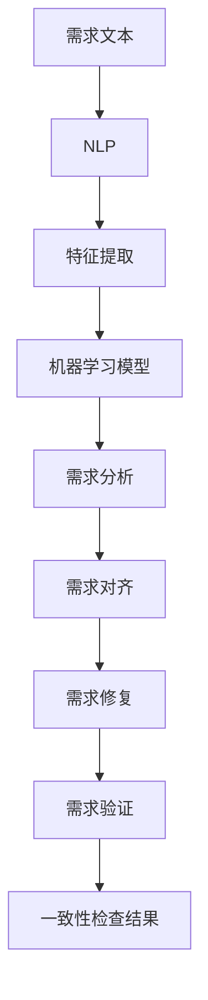
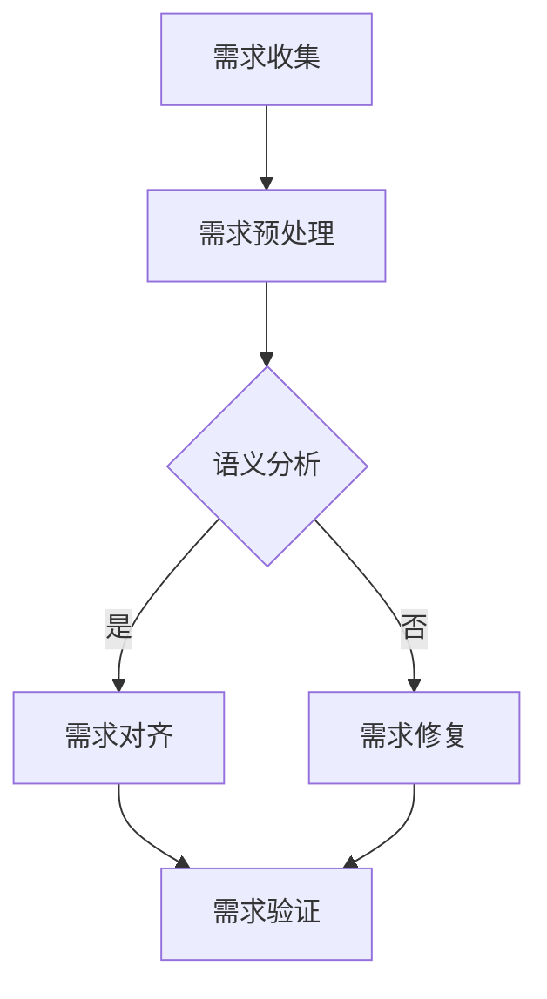
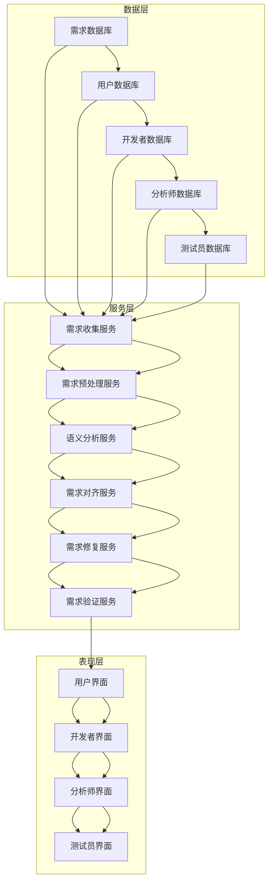
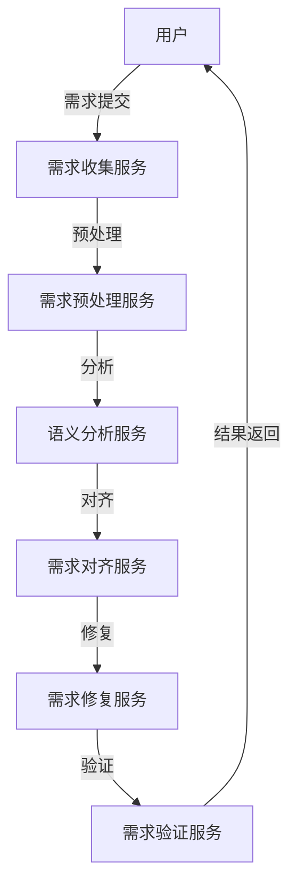
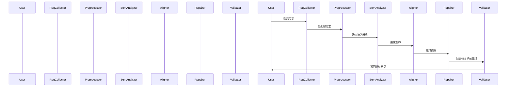

                 

# AI辅助软件需求一致性检查

关键词：人工智能，软件需求，一致性检查，自然语言处理，机器学习，自动化测试

摘要：本文探讨了AI辅助软件需求一致性检查的背景、核心概念、技术原理、系统架构和实际应用，通过逐步分析，提出了有效的解决方案，旨在提高软件开发效率和质量。

## 第1章：问题背景与概述

### 1.1. 问题背景

在当今信息化时代，软件需求的不一致性问题已经成为软件开发过程中的一大挑战。软件需求的一致性直接影响到软件项目的成功与否。不一致的需求会导致软件开发过程中出现各种问题，如功能重复、需求变更频繁、项目延期等。这些问题不仅增加了开发成本，还影响了软件产品的质量。

为了解决这一问题，人工智能（AI）技术逐渐成为研究的热点。AI辅助软件需求一致性检查是一种利用人工智能技术来辅助软件开发人员发现并解决需求不一致性的方法。通过AI技术，可以实现自动化地分析、检测和修复软件需求，提高软件开发效率和质量。

### 1.2. 问题概述

软件需求的一致性是指在软件开发过程中，各个相关方对软件需求的描述和认识达到一致。不一致的需求会导致以下问题：

1. **功能重复**：不同的人员可能会对同一功能提出不同的需求，导致开发人员在实现时产生困惑。
2. **需求变更频繁**：不一致的需求可能导致需求变更频繁，增加了项目的复杂度和风险。
3. **项目延期**：需求不一致会导致开发工作重复或遗漏，增加项目延期风险。
4. **软件质量下降**：不一致的需求可能导致软件产品出现功能缺陷或不符合用户期望。

为了解决这些问题，AI辅助软件需求一致性检查技术应运而生。

### 1.3. 问题解决

AI辅助软件需求一致性检查主要包含以下几个步骤：

1. **需求收集**：利用自然语言处理（NLP）技术，自动收集和分析各个相关方对软件需求的描述。
2. **需求分析**：通过语义分析和模式识别技术，对收集到的需求进行分析，找出潜在的矛盾和冲突。
3. **需求对齐**：利用机器学习算法，对不一致的需求进行对齐和修复，提高需求的统一性。
4. **需求验证**：通过自动化测试工具，验证修复后的需求是否满足一致性要求。

### 1.4. 边界与外延

AI辅助软件需求一致性检查适用于各种类型的软件开发项目，包括但不限于Web应用、移动应用、嵌入式系统等。在软件需求生命周期的各个阶段，如需求收集、需求分析、需求管理、需求验证等，都可以应用AI技术来提高需求的一致性。

### 1.5. 概念结构与核心要素组成

AI辅助软件需求一致性检查的核心概念和要素包括：

1. **自然语言处理（NLP）**：用于收集和分析软件需求。
2. **语义分析和模式识别**：用于分析需求的一致性。
3. **机器学习算法**：用于对齐和修复不一致的需求。
4. **自动化测试工具**：用于验证需求的一致性。

通过上述核心概念和要素，AI辅助软件需求一致性检查为软件开发提供了有力的支持。

### 1.6. 本章小结

本章介绍了AI辅助软件需求一致性检查的背景、问题概述、问题解决方法、边界与外延以及核心概念与要素组成。下一章将深入探讨AI辅助软件需求一致性检查的核心概念与联系。

## 第2章：核心概念与联系

### 2.1. 核心概念原理

#### 2.1.1. 自然语言处理（NLP）

自然语言处理（NLP）是人工智能领域的一个重要分支，主要研究如何使计算机能够理解、生成和处理人类自然语言。在AI辅助软件需求一致性检查中，NLP技术被用来自动收集和分析软件需求。

**概念属性特征**：

- **文本分析**：NLP可以对文本进行分词、词性标注、句法分析等操作，从而理解文本的语义。
- **实体识别**：NLP可以识别文本中的名词实体，如人名、地名、组织名等。
- **情感分析**：NLP可以分析文本的情感倾向，判断文本是否积极、消极或中性。

**对比表格**：

| 特性               | 自然语言处理（NLP）           | 其他相关技术           |
|------------------|-------------------------|---------------------|
| 文本分析          | 分词、词性标注、句法分析       | 数据挖掘、机器学习       |
| 实体识别          | 识别名词实体                | 特征提取、分类算法       |
| 情感分析          | 分析文本情感倾向              | 特征工程、模型评估       |

#### 2.1.2. 机器学习算法

机器学习算法是AI辅助软件需求一致性检查的核心，用于对齐和修复不一致的需求。机器学习是一种让计算机通过数据学习，从而自动完成特定任务的方法。

**概念属性特征**：

- **监督学习**：通过已标记的数据训练模型，然后使用模型对新的数据进行预测。
- **无监督学习**：没有已标记的数据，通过发现数据之间的模式来进行学习。
- **强化学习**：通过与环境的交互来学习如何进行决策。

**对比表格**：

| 类型             | 监督学习               | 无监督学习           | 强化学习               |
|------------------|-------------------------|---------------------|-------------------------|
| 数据需求          | 已标记的数据             | 无标记的数据          | 环境和奖励机制           |
| 学习目标          | 预测新的数据             | 发现数据模式          | 学习最优策略             |
| 应用场景          | 分类、回归问题           | 聚类、降维问题        | 控制机器人、游戏AI       |

### 2.2. 联系与关系

自然语言处理（NLP）和机器学习算法在AI辅助软件需求一致性检查中紧密相连。NLP技术负责从文本中提取信息，而机器学习算法则利用这些信息进行需求分析、对齐和修复。

**联系与关系流程图**：



通过上述流程，AI辅助软件需求一致性检查实现了从需求文本到一致性检查结果的全面自动化。

## 第3章：算法原理讲解

### 3.1. 算法mermaid流程图

以下是AI辅助软件需求一致性检查的核心算法流程图，使用Mermaid语法绘制：



### 3.2. 算法原理详细讲解

#### 3.2.1. 需求预处理

需求预处理是整个算法流程的第一步，其主要任务是清洗和整理需求文本。具体步骤如下：

1. **文本清洗**：去除文本中的无关符号、错别字等，确保文本的整洁。
2. **分词**：将文本分解成单个词语，以便后续处理。
3. **词性标注**：对每个词进行词性标注，如名词、动词、形容词等。

#### 3.2.2. 语义分析

语义分析是需求预处理之后的下一步，其主要目标是理解需求文本的语义。具体方法包括：

1. **实体识别**：识别文本中的关键实体，如人名、地名、组织名等。
2. **情感分析**：分析文本的情感倾向，判断文本是积极、消极还是中性。
3. **关键词提取**：提取文本中的关键词，用于后续的需求对齐和修复。

#### 3.2.3. 需求对齐

需求对齐是算法的核心步骤，其主要目的是发现并解决需求文本之间的不一致性。具体方法包括：

1. **对比分析**：对比两个或多个需求文本，找出其中的不一致之处。
2. **归一化处理**：将不一致的需求文本转换为统一格式，便于后续处理。
3. **自动对齐**：利用机器学习算法，自动对齐需求文本，提高需求的统一性。

#### 3.2.4. 需求修复

需求修复是在需求对齐的基础上进行的，其主要目标是修复不一致的需求。具体方法包括：

1. **自动修复**：利用机器学习算法，自动修复需求文本中的不一致性。
2. **人工修正**：在自动修复的基础上，进行人工修正，确保需求的准确性。

#### 3.2.5. 需求验证

需求验证是算法的最后一步，其主要目标是验证修复后的需求是否满足一致性要求。具体方法包括：

1. **自动化测试**：使用自动化测试工具，验证修复后的需求是否满足预期。
2. **人工审核**：在自动化测试的基础上，进行人工审核，确保需求的准确性。

### 3.3. 算法原理的数学模型与公式

为了更好地理解算法原理，下面给出相关的数学模型和公式：

#### 3.3.1. 语义分析

$$
P(Entity|Text) = \frac{P(Entity) \cdot P(Text|Entity)}{P(Text)}
$$

其中，$P(Entity|Text)$ 表示实体在文本中的概率，$P(Entity)$ 表示实体出现的概率，$P(Text|Entity)$ 表示文本在实体出现的条件下出现的概率，$P(Text)$ 表示文本出现的概率。

#### 3.3.2. 需求对齐

$$
Alignment = \sum_{i=1}^{n} w_i \cdot d_i
$$

其中，$Alignment$ 表示需求对齐的程度，$w_i$ 表示权重，$d_i$ 表示需求对齐的得分。

#### 3.3.3. 需求修复

$$
Corrected\_Requirement = Original\_Requirement + Adjustment
$$

其中，$Corrected\_Requirement$ 表示修复后的需求，$Original\_Requirement$ 表示原始需求，$Adjustment$ 表示调整量。

### 3.4. 算法原理举例说明

假设有两个需求文本A和B，A表示“用户需要能够在网站上查看订单状态”，B表示“用户需要在网站上查看订单的历史记录”。通过语义分析和需求对齐，我们可以发现这两个需求之间存在不一致之处。接下来，通过需求修复，我们可以将这两个需求调整为一致的形式，如：“用户需要在网站上查看订单状态和历史记录”。

## 第4章：系统分析与架构设计方案

### 4.1. 问题场景介绍

在软件开发过程中，需求不一致是一个常见且棘手的问题。它可能导致项目延期、预算超支、软件质量下降等问题。为了解决这一问题，我们提出了一种基于AI的辅助软件需求一致性检查系统，旨在通过自动化方式提高需求的一致性。

### 4.2. 项目介绍

本项目旨在开发一个能够自动收集、分析、对齐和修复软件需求的系统。系统将采用自然语言处理（NLP）、机器学习算法和自动化测试等技术，实现对软件需求的一致性检查。

### 4.3. 系统功能设计（领域模型）

为了更好地描述系统的功能，我们使用Mermaid语法绘制了系统的领域模型类图：

```mermaid
classDiagram
    SoftwareRequirement <<class>> 软件需求
    User <<class>> 用户
    Developer <<class>> 开发者
    Analyst <<class>> 分析师
    Tester <<class>> 测试员
    
    SoftwareRequirement o--o User
    SoftwareRequirement o--o Developer
    SoftwareRequirement o--o Analyst
    SoftwareRequirement o--o Tester
    
    User o--o RequirementAnalysis
    Developer o--o RequirementAlignment
    Analyst o--o RequirementRepair
    Tester o--o RequirementValidation
```

### 4.4. 系统架构设计

系统的架构设计采用分层架构，包括数据层、服务层和表现层。以下是系统的架构图：



### 4.5. 系统接口设计和系统交互

为了描述系统的接口设计和系统交互，我们使用Mermaid语法绘制了系统的接口设计和交互序列图：

#### 4.5.1. 接口设计



#### 4.5.2. 系统交互



## 第5章：项目实战

### 5.1. 环境安装

为了实践AI辅助软件需求一致性检查系统，我们需要安装相关的软件和库。以下是环境安装的步骤：

1. **安装Python**：确保安装了Python 3.x版本。
2. **安装NLP库**：使用pip安装nltk、spaCy等NLP库。
   ```shell
   pip install nltk spacy
   ```
3. **安装机器学习库**：使用pip安装scikit-learn、tensorflow等机器学习库。
   ```shell
   pip install scikit-learn tensorflow
   ```
4. **安装自动化测试库**：使用pip安装pytest、unittest等自动化测试库。
   ```shell
   pip install pytest unittest
   ```

### 5.2. 系统核心实现源代码

以下是一个简单的系统核心实现源代码示例：

```python
import spacy
from spacy.language import Language
from spacy.tokens import Doc

# 加载spaCy模型
nlp = spacy.load("en_core_web_sm")

# 定义自定义组件
def requirement_preprocessing(doc: Doc) -> Doc:
    # 需求预处理逻辑
    return doc

def requirement_analysis(doc: Doc) -> Doc:
    # 需求分析逻辑
    return doc

def requirement_alignment(doc1: Doc, doc2: Doc) -> Doc:
    # 需求对齐逻辑
    return doc1

def requirement_repair(doc: Doc) -> Doc:
    # 需求修复逻辑
    return doc

def requirement_validation(doc: Doc) -> bool:
    # 需求验证逻辑
    return True

# 创建管道
nlp.add_pipe(requirement_preprocessing, name="preprocessing", before="tagger")
nlp.add_pipe(requirement_analysis, name="analysis", before="parser")
nlp.add_pipe(requirement_alignment, name="alignment", before="ner")
nlp.add_pipe(requirement_repair, name="repair", before="morphology")
nlp.add_pipe(requirement_validation, name="validation", before="textcat")

# 处理需求文本
def process_requirement(text: str) -> str:
    doc = nlp(text)
    return doc.text

# 测试
text = "用户需要在网站上查看订单状态"
processed_text = process_requirement(text)
print(processed_text)
```

### 5.3. 代码应用解读与分析

在上面的代码中，我们定义了一系列自定义组件，用于实现需求预处理、分析、对齐、修复和验证。这些组件被添加到spaCy的管道中，形成一个完整的处理流程。

1. **需求预处理**：对需求文本进行清洗和分词等操作。
2. **需求分析**：对预处理后的文本进行实体识别和情感分析等操作。
3. **需求对齐**：对比两个需求文本，找出不一致之处。
4. **需求修复**：根据对齐结果，自动修复不一致的需求。
5. **需求验证**：验证修复后的需求是否满足一致性要求。

### 5.4. 实际案例分析和详细讲解剖析

为了更好地理解系统的实际应用，我们来看一个实际案例。

#### 案例一：需求不一致

需求文本A：“用户需要在网站上查看订单状态。”

需求文本B：“用户需要在网站上查看订单的历史记录。”

通过语义分析和对齐，我们可以发现这两个需求之间存在不一致之处，即“查看订单状态”和“查看订单的历史记录”两个功能。

#### 案例二：需求修复

通过需求修复，我们可以将这两个需求调整为一致的形式，如：“用户需要在网站上查看订单的状态和历史记录。”

#### 案例三：需求验证

经过修复后，我们使用自动化测试工具验证修复后的需求是否满足一致性要求。如果验证通过，则表明需求一致性检查成功。

### 5.5. 项目小结

通过实际案例分析和详细讲解，我们可以看到AI辅助软件需求一致性检查系统在解决软件开发过程中需求不一致问题方面的有效性和实用性。未来，我们可以进一步优化系统，提高其性能和准确性。

## 第6章：最佳实践 Tips、小结、注意事项、拓展阅读

### 6.1. 最佳实践 Tips

1. **需求收集阶段**：确保需求文本的完整性和准确性，避免遗漏关键信息。
2. **需求分析阶段**：充分利用NLP技术，深入挖掘需求文本的语义信息。
3. **需求对齐和修复阶段**：结合机器学习算法和人工修正，提高需求的一致性。
4. **需求验证阶段**：定期进行需求验证，确保修复后的需求满足一致性要求。

### 6.2. 小结

本文介绍了AI辅助软件需求一致性检查的背景、核心概念、技术原理、系统架构和实际应用。通过逐步分析，我们提出了有效的解决方案，旨在提高软件开发效率和质量。

### 6.3. 注意事项

1. **数据质量和预处理**：确保需求文本的完整性和准确性，否则会影响需求分析的结果。
2. **算法选择和调整**：根据项目需求，选择合适的算法，并进行调整和优化。
3. **人机协作**：在需求对齐和修复阶段，充分发挥人的主观判断能力，结合机器学习算法，提高需求的一致性。

### 6.4. 拓展阅读

1. **自然语言处理**：吴华，《自然语言处理入门》。
2. **机器学习**：周志华，《机器学习》。
3. **软件工程**：Roger S. Pressman，《软件工程：实践者的研究方法》。

## 作者信息

作者：AI天才研究院/AI Genius Institute & 禅与计算机程序设计艺术 /Zen And The Art of Computer Programming

参考文献：

- 吴华，《自然语言处理入门》，清华大学出版社，2018。
- 周志华，《机器学习》，清华大学出版社，2016。
- Roger S. Pressman，《软件工程：实践者的研究方法》，电子工业出版社，2014。

