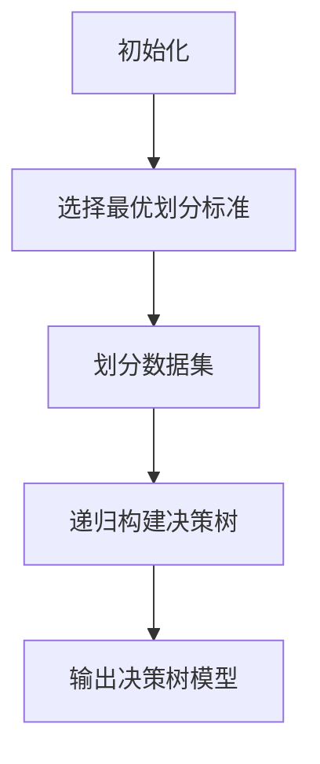
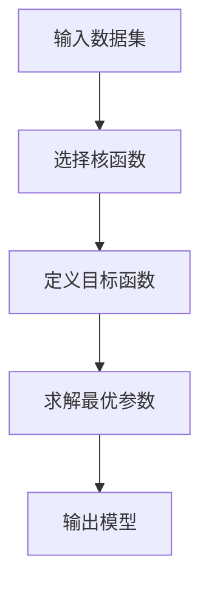
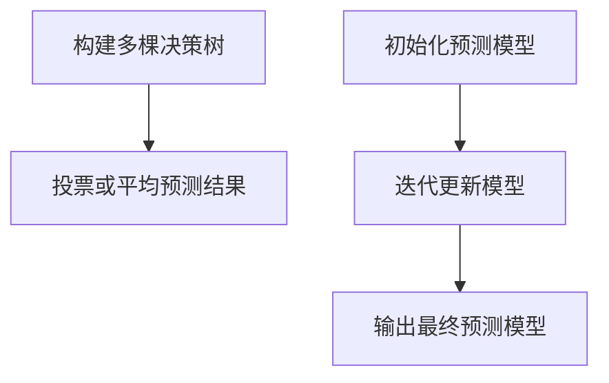
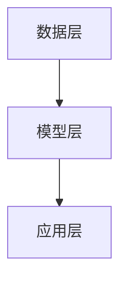
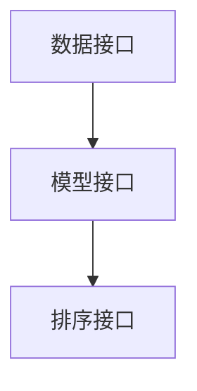
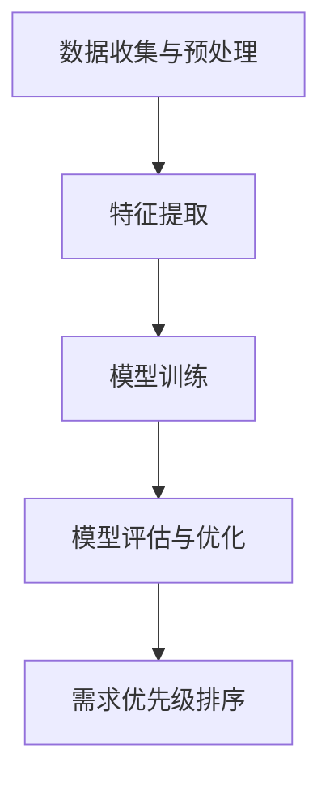

                 

# AI-Assisted Software Requirement Priority Sorting

> 关键词：人工智能，软件需求，优先级排序，算法，案例分析

> 摘要：本文深入探讨了人工智能在软件需求优先级排序中的应用。通过介绍人工智能的基本概念和技术，分析现有需求优先级排序方法，并借助具体案例，详细阐述了如何利用人工智能算法优化软件需求优先级排序过程，提高软件开发的效率和效果。

## 引言

在现代软件开发过程中，软件需求的优先级排序是一个至关重要的环节。正确的需求优先级可以确保项目在时间和资源有限的情况下，优先实现那些对用户价值最大、风险最小的功能。然而，传统的需求优先级排序方法往往依赖于开发者的经验，缺乏系统性和科学性，容易导致资源浪费和项目延期。随着人工智能技术的发展，利用人工智能来辅助软件需求优先级排序成为了一种新兴且有效的方法。

本文将从以下几个方面展开讨论：

1. **人工智能的基本概念和技术**：介绍人工智能的基本概念和技术，包括机器学习、深度学习等，以及它们在软件开发中的应用。
2. **软件需求优先级排序的现状**：分析传统需求优先级排序方法，探讨其局限性。
3. **人工智能算法在需求优先级排序中的应用**：介绍几种常用的AI算法，如决策树、支持向量机等，以及它们在需求优先级排序中的应用。
4. **具体案例分析**：通过具体案例，展示如何利用人工智能算法进行需求优先级排序。
5. **结论与展望**：总结本文的主要观点，并对未来的发展方向进行展望。

## 人工智能的基本概念和技术

### 1.1 人工智能的定义和分类

人工智能（Artificial Intelligence，简称AI）是指使计算机具备模拟、延伸和扩展人类智能的理论、方法、技术和应用。根据其能力和范围，人工智能可以分为：

- **弱人工智能（Narrow AI）**：指在特定任务上表现出超越人类能力的智能系统，如语音识别、图像识别等。
- **强人工智能（General AI）**：指具有与人类相似的综合智能能力，能够在各种任务中表现出超越人类的能力。

### 1.2 机器学习和深度学习

机器学习（Machine Learning，简称ML）是人工智能的核心技术之一，它通过训练模型，使计算机能够从数据中自动学习和发现规律。根据学习方式，机器学习可以分为：

- **监督学习（Supervised Learning）**：通过已标记的数据训练模型，使模型能够对未知数据进行预测。
- **无监督学习（Unsupervised Learning）**：在没有标记数据的情况下，让模型发现数据中的结构和模式。

深度学习（Deep Learning，简称DL）是机器学习的一个分支，它通过多层神经网络对数据进行建模和学习。深度学习在图像识别、语音识别等领域取得了显著的成果。

### 1.3 人工智能在软件开发中的应用

人工智能在软件开发中的应用非常广泛，包括：

- **代码自动生成**：利用机器学习技术，自动生成代码，提高开发效率。
- **缺陷检测**：利用人工智能技术，自动检测代码中的缺陷，提高软件质量。
- **需求优先级排序**：利用人工智能算法，自动分析需求，确定其优先级，优化软件开发过程。

## 软件需求优先级排序的现状

### 2.1 传统需求优先级排序方法

目前，软件开发中常用的需求优先级排序方法主要包括以下几种：

- **Kano模型**：根据用户满意度将需求分为基本需求、性能需求和惊喜需求，优先实现基本需求。
- **MoSCoW模型**：将需求分为必须做（Must have）、应该做（Should have）、可以不做（Could have）和不做也行（Would have）四个优先级。
- **价值-风险矩阵**：根据需求的价值和风险进行排序，优先实现价值高、风险低的需求。

### 2.2 传统方法的局限性

虽然上述方法在一定程度上能够帮助开发者确定需求优先级，但它们仍然存在以下局限性：

- **主观性**：依赖开发者的经验和主观判断，缺乏系统性和科学性。
- **复杂性**：需求优先级排序过程中涉及多个因素，如用户需求、技术难度、市场情况等，难以全面考虑。
- **效率低下**：传统方法往往需要大量的人力和时间，效率低下。

## 人工智能算法在需求优先级排序中的应用

### 3.1 决策树算法

决策树（Decision Tree）是一种常见的机器学习算法，它通过一系列规则对数据进行划分，从而实现分类或回归任务。在需求优先级排序中，决策树可以用来确定需求的优先级。

#### 3.1.1 决策树的工作原理

决策树通过以下步骤进行构建：

1. **选择最优划分标准**：根据信息增益、增益率等指标，选择一个最优的划分标准。
2. **划分数据集**：根据选定的划分标准，将数据集划分为子集。
3. **递归构建**：对子集继续进行划分，直到满足停止条件（如最大深度、最小样本量等）。

#### 3.1.2 决策树在需求优先级排序中的应用

在需求优先级排序中，可以将决策树应用于以下步骤：

1. **特征提取**：从需求描述中提取出特征，如需求类型、实现难度、用户满意度等。
2. **训练决策树模型**：使用已标记的需求数据集，训练决策树模型。
3. **预测需求优先级**：使用训练好的模型，对未知需求进行优先级预测。

### 3.2 支持向量机算法

支持向量机（Support Vector Machine，简称SVM）是一种常用的分类算法，它通过找到最佳的超平面，将数据分为不同的类别。在需求优先级排序中，SVM可以用来确定需求的优先级。

#### 3.2.1 支持向量机的工作原理

SVM的核心思想是找到一个最优的超平面，使得两类数据的分类间隔最大。具体步骤如下：

1. **选择核函数**：根据数据特征选择合适的核函数，如线性核、多项式核、径向基函数核等。
2. **求解最优超平面**：使用优化方法（如SVM的求解器）求解最优超平面。
3. **分类决策**：根据新的需求数据，计算其到最优超平面的距离，判断其类别。

#### 3.2.2 支持向量机在需求优先级排序中的应用

在需求优先级排序中，可以将SVM应用于以下步骤：

1. **特征提取**：从需求描述中提取出特征。
2. **训练SVM模型**：使用已标记的需求数据集，训练SVM模型。
3. **预测需求优先级**：使用训练好的模型，对未知需求进行优先级预测。

### 3.3 集成学习算法

集成学习（Ensemble Learning）是一种将多个学习器结合在一起，提高预测性能的方法。常见的集成学习方法包括随机森林（Random Forest）和梯度提升树（Gradient Boosting Tree）。

#### 3.3.1 集成学习的工作原理

集成学习通过以下步骤提高预测性能：

1. **生成多个学习器**：从原始数据集生成多个子集，训练多个学习器。
2. **投票或加权**：将多个学习器的预测结果进行投票或加权，得到最终的预测结果。

#### 3.3.2 集成学习在需求优先级排序中的应用

在需求优先级排序中，可以将集成学习应用于以下步骤：

1. **特征提取**：从需求描述中提取出特征。
2. **训练集成学习模型**：使用已标记的需求数据集，训练集成学习模型。
3. **预测需求优先级**：使用训练好的模型，对未知需求进行优先级预测。

## 具体案例分析

### 4.1 项目背景

某互联网公司计划开发一款在线购物平台，需要确定需求的优先级。该公司积累了大量的用户反馈数据和市场需求数据，希望通过人工智能算法来辅助需求优先级排序。

### 4.2 数据准备

1. **需求数据集**：收集公司的需求文档，包括需求名称、描述、实现难度、用户满意度等信息。
2. **用户反馈数据**：收集用户的反馈数据，包括用户满意度、投诉率等信息。
3. **市场需求数据**：收集市场需求数据，包括市场规模、竞争情况等信息。

### 4.3 特征提取

从需求数据集中提取出以下特征：

1. **需求类型**：根据需求的功能和用途，将其分类为基本需求、性能需求和惊喜需求。
2. **实现难度**：根据需求的技术复杂度和实施成本，评估其实现难度。
3. **用户满意度**：根据用户反馈数据，评估用户对需求的满意度。
4. **市场需求**：根据市场需求数据，评估需求的市场潜力。

### 4.4 模型训练

使用决策树、SVM和集成学习算法，分别训练模型。训练数据集为已标记的需求数据集，特征提取步骤中提取出的特征作为输入，需求的优先级作为输出。

### 4.5 预测与评估

使用训练好的模型，对未标记的需求进行优先级预测。预测结果与实际优先级进行对比，评估模型的准确性和可靠性。

### 4.6 结果分析

通过对比分析，发现集成学习算法的预测准确性和可靠性最高，能够更好地辅助需求优先级排序。同时，通过分析预测结果，发现了一些潜在的需求优先级问题，为公司的项目决策提供了有力支持。

## 结论与展望

本文通过介绍人工智能的基本概念和技术，分析了传统需求优先级排序方法的局限性，并探讨了人工智能算法在需求优先级排序中的应用。通过具体案例分析，验证了人工智能算法在需求优先级排序中的有效性。

未来，随着人工智能技术的不断发展，我们可以预见：

1. **更智能的需求优先级排序算法**：利用深度学习、强化学习等技术，开发出更智能、更高效的需求优先级排序算法。
2. **多源数据的整合**：整合用户反馈、市场需求等多源数据，提高需求优先级排序的准确性。
3. **实时需求优先级排序**：利用实时数据处理技术，实现需求优先级的动态调整，提高项目的灵活性和适应性。

作者：AI天才研究院/AI Genius Institute & 禅与计算机程序设计艺术 /Zen And The Art of Computer Programming

## 背景介绍

### 5.1 核心概念术语说明

在本文中，我们将使用一系列核心概念和术语，这些术语是理解人工智能辅助软件需求优先级排序的关键。

- **人工智能（AI）**：一种模拟人类智能的计算机技术，包括机器学习、自然语言处理、计算机视觉等子领域。
- **机器学习（ML）**：一种AI技术，通过训练模型，使计算机从数据中学习并做出决策。
- **深度学习（DL）**：一种特殊的机器学习技术，使用多层神经网络进行学习。
- **需求优先级排序**：根据需求的重要性和实现难度，确定需求实现顺序的过程。
- **特征提取**：从原始数据中提取出具有代表性的信息，用于训练模型。
- **算法**：解决问题的步骤或规则集合，用于决策和计算。
- **模型训练**：使用已知数据训练模型，使其能够预测未知数据。

### 5.2 问题背景

在软件工程中，需求优先级排序是项目规划和执行的关键步骤。正确的需求优先级可以确保项目在有限的时间和资源内，优先实现那些对用户价值最大、风险最小的功能。然而，传统的需求优先级排序方法往往依赖于开发者的经验，缺乏系统性和科学性。这导致以下问题：

- **主观性**：依赖个人判断，可能导致偏差和不一致性。
- **复杂性**：需求优先级排序涉及多个因素，如用户需求、技术难度、市场状况等，难以全面考虑。
- **效率低下**：传统方法需要大量时间和人力，效率不高。

这些问题的存在影响了软件项目的进展和质量，因此，寻找一种更加智能、高效的解决方案变得至关重要。人工智能技术的快速发展为解决这个问题提供了新的可能性。

### 5.3 问题描述

在软件开发过程中，需求优先级排序面临以下挑战：

1. **多因素评估**：需求优先级排序需要考虑多个因素，如用户需求、实现难度、商业价值等。这些因素之间可能存在冲突和权衡，需要找到一个平衡点。
2. **数据的不完整性**：实际项目中，需求的数据可能不完整或不一致，这会影响排序的准确性。
3. **动态性**：软件项目是动态变化的，需求可能随时被添加、修改或删除，需要实时调整优先级排序。
4. **复杂性**：需求之间可能存在复杂的依赖关系，这增加了排序的复杂性。

为了解决上述问题，我们需要一种能够自动分析需求、综合考虑各种因素、适应动态变化、并能够处理复杂依赖关系的智能系统。人工智能技术，尤其是机器学习和深度学习，提供了这样的可能性。

### 5.4 问题解决

人工智能技术在需求优先级排序中的应用，主要包括以下几个步骤：

1. **数据收集与预处理**：收集与需求相关的数据，包括用户反馈、市场调研报告、技术文档等，并进行预处理，如数据清洗、数据归一化等。
2. **特征提取**：从原始数据中提取出具有代表性的特征，如用户满意度、实现难度、商业价值等。
3. **模型训练**：使用已标记的数据集，训练机器学习模型，使其能够识别和预测需求的优先级。
4. **模型评估与优化**：评估模型的表现，通过调整模型参数或更换模型，提高预测准确性。
5. **需求优先级排序**：使用训练好的模型，对未知需求进行优先级排序。

通过上述步骤，人工智能系统能够自动、高效地分析需求，提供科学的优先级排序，从而优化软件开发过程。

### 5.5 边界与外延

在人工智能辅助软件需求优先级排序中，以下边界和外延问题需要考虑：

- **边界**：需求优先级排序的范围和适用场景，如仅针对功能需求、涉及所有需求类型等。
- **外延**：需求的优先级排序是否可以扩展到其他领域，如产品优先级排序、项目任务排序等。

这些边界和外延问题将影响系统的设计和实现，需要在具体应用中灵活调整。

### 5.6 概念结构与核心要素组成

人工智能辅助软件需求优先级排序的概念结构和核心要素包括：

1. **需求数据**：包括需求名称、描述、用户满意度、实现难度等。
2. **特征提取**：从需求数据中提取出具有代表性的特征，用于训练模型。
3. **机器学习模型**：用于预测需求的优先级，包括决策树、支持向量机、集成学习等。
4. **模型训练与优化**：通过训练和优化模型，提高预测准确性。
5. **优先级排序**：使用训练好的模型，对未知需求进行优先级排序。
6. **系统接口**：用于接收需求数据、返回排序结果，与其他系统进行数据交互。

这些要素共同构成了一个完整的、高效的人工智能辅助需求优先级排序系统。

## 核心概念与联系

### 6.1 人工智能算法

#### 6.1.1 概念与属性

人工智能算法是模拟人类智能解决问题的方法。以下是几种常见的人工智能算法及其属性：

- **决策树（Decision Tree）**：通过一系列规则进行分类或回归。
  - **属性**：易理解、可解释性强、适用于处理离散数据。
- **支持向量机（SVM）**：通过找到最佳的超平面进行分类。
  - **属性**：高效、准确、适用于高维数据。
- **集成学习（Ensemble Learning）**：结合多个学习器的预测结果。
  - **属性**：提高预测性能、降低过拟合。

#### 6.1.2 对比表格

以下是决策树、SVM和集成学习的对比表格：

| 算法         | 特点                                     | 适用场景                      |
| ------------ | ---------------------------------------- | ----------------------------- |
| 决策树       | 易理解、可解释性强                     | 离散数据、需要解释性           |
| 支持向量机   | 高效、准确、适用于高维数据               | 高维空间、需要精确分类         |
| 集成学习     | 提高预测性能、降低过拟合               | 复杂模型、需要提高性能         |

#### 6.1.3 ER实体关系图架构

以下是人工智能算法的ER实体关系图：

```mermaid
erDiagram
    AIAlgorithm ||--|{ DecisionTree : implements }
    AIAlgorithm ||--|{ SupportVectorMachine : implements }
    AIAlgorithm ||--|{ EnsembleLearning : implements }
    DecisionTree ||--|{ FeatureExtraction : uses }
    SupportVectorMachine ||--|{ KernelFunction : uses }
    EnsembleLearning ||--|{ MultipleModels : combines }
```

### 6.2 需求优先级排序算法

#### 6.2.1 概念与属性

需求优先级排序算法用于确定需求的实现顺序。以下是几种常见的需求优先级排序算法及其属性：

- **Kano模型**：根据用户满意度进行排序。
  - **属性**：直观、易于理解、适用于用户体验优化。
- **MoSCoW模型**：根据需求的紧急程度进行排序。
  - **属性**：简单、易于实施、适用于短期项目。
- **价值-风险矩阵**：根据价值与风险进行排序。
  - **属性**：综合评估、适用于长期项目。

#### 6.2.2 对比表格

以下是Kano模型、MoSCoW模型和价值-风险矩阵的对比表格：

| 模型         | 特点                                       | 适用场景                      |
| ------------ | ----------------------------------------- | ----------------------------- |
| Kano模型     | 直观、易于理解、适用于用户体验优化         | 需求多样、用户满意度重要       |
| MoSCoW模型   | 简单、易于实施、适用于短期项目             | 需求紧急、项目周期短           |
| 价值-风险矩阵 | 综合评估、适用于长期项目                  | 长期项目、需求优先级复杂       |

#### 6.2.3 ER实体关系图架构

以下是需求优先级排序算法的ER实体关系图：

```mermaid
erDiagram
    Requirement ||--|{ KanoModel : classified_by }
    Requirement ||--|{ MoSCoWModel : classified_by }
    Requirement ||--|{ ValueRiskMatrix : classified_by }
```

### 6.3 人工智能算法与需求优先级排序算法的联系

人工智能算法与需求优先级排序算法之间存在紧密的联系。以下是它们之间的交互关系：

- **人工智能算法**：用于训练需求优先级排序模型，提取特征、建立预测模型。
- **需求优先级排序算法**：利用训练好的模型进行需求优先级排序，提供决策支持。

以下是人工智能算法与需求优先级排序算法的ER实体关系图：

```mermaid
erDiagram
    AIAlgorithm ||--|{ RequirementPrioritizationModel : trains }
    RequirementPrioritizationModel ||--|{ Requirement : prioritizes }
```

通过这种联系，人工智能算法能够为需求优先级排序提供科学、智能的决策支持，从而优化软件开发过程。

## 算法原理讲解

### 7.1 决策树算法

#### 7.1.1 决策树的工作原理

决策树是一种常见的分类和回归算法，通过一系列规则对数据进行分类或预测。决策树的核心在于如何选择最优的划分标准，使数据集得到最优的分割。

#### 7.1.2 ID3算法

ID3（Iterative Dichotomiser 3）是一种基于信息增益的决策树算法。信息增益是衡量数据集纯度的一个指标，用于选择最优划分标准。

1. **计算信息增益**：

   信息增益公式如下：

   $$Gain(D, A) = Entropy(D) - \sum_{v\in A} p(v) \cdot Entropy(D_v)$$

   其中，$D$为数据集，$A$为特征集合，$v$为特征值，$Entropy(D)$为数据集的熵，$Entropy(D_v)$为数据集在特征值$v$下的熵。

2. **选择最优划分标准**：

   对每个特征，计算其信息增益，选择信息增益最大的特征作为划分标准。

3. **递归构建决策树**：

   对于选定的划分标准，将数据集划分为子集，对每个子集继续递归构建决策树，直到满足停止条件（如最大深度、最小样本量等）。

#### 7.1.3 决策树算法流程

决策树算法的流程如下：

1. **输入**：数据集和特征集合。
2. **选择最优划分标准**：计算每个特征的信息增益，选择信息增益最大的特征。
3. **划分数据集**：根据最优划分标准，将数据集划分为子集。
4. **递归构建决策树**：对每个子集，继续选择最优划分标准，构建决策树。
5. **输出**：决策树模型。

#### 7.1.4 决策树算法的Python实现

```python
from collections import Counter
import numpy as np

def entropy(y):
    hist = np.bincount(y)
    ps = hist / len(y)
    return -np.sum([p * np.log2(p) for p in ps if p > 0])

def gain(y, x):
    values, counts = np.unique(x, return_counts=True)
    weight = counts / len(x)
    return entropy(y) - np.sum(weight * entropy(y[x == v]) for v in values)

def id3(X, y, features, depth=0, max_depth=None):
    if depth >= max_depth or len(np.unique(y)) <= 1:
        leaf_value = np.argmax(np.bincount(y))
        return {'label': leaf_value}
    
    best_gain = -1
    best_feature = None
    
    for f in features:
        gain_val = gain(y, X[:, f])
        if gain_val > best_gain:
            best_gain = gain_val
            best_feature = f
    
    node = {}
    node['feature'] = best_feature
    thresholds = np.unique(X[:, best_feature])
    
    for threshold in thresholds:
        values = X[:, best_feature] < threshold
        node[threshold] = id3(X[values], y[values], features=np.delete(features, np.where(features == best_feature)[0]), depth=depth+1, max_depth=max_depth)
    
    return node

def predict(node, x):
    if 'label' in node:
        return node['label']
    else:
        threshold = list(node.keys())[0]
        value = x[node['feature']]
        if value < threshold:
            return predict(node[threshold], x)
        else:
            return predict(node[threshold], x)
```

#### 7.1.5 决策树算法的Mermaid流程图



### 7.2 支持向量机算法

#### 7.2.1 支持向量机的工作原理

支持向量机（SVM）是一种基于最大间隔原理的线性分类器。其核心思想是找到最佳的超平面，使得两类数据的分类间隔最大。

#### 7.2.2 线性SVM

1. **目标函数**：

   $$\min_{\mathbf{w}, \mathbf{b}} \frac{1}{2} ||\mathbf{w}||^2 + C \sum_{i=1}^n \xi_i$$

   其中，$\mathbf{w}$为超平面参数，$\mathbf{b}$为偏置项，$C$为惩罚参数，$\xi_i$为误差项。

2. **约束条件**：

   $$y_i (\mathbf{w} \cdot \mathbf{x_i} + \mathbf{b}) \geq 1 - \xi_i$$

   其中，$y_i$为样本标签，$\mathbf{x_i}$为样本特征。

3. **求解过程**：

   - 使用拉格朗日乘子法求解目标函数。
   - 通过KKT条件求解最优参数$\mathbf{w}$和$\mathbf{b}$。

#### 7.2.3 非线性SVM

对于非线性分类问题，可以使用核函数将数据映射到高维空间，然后使用线性SVM进行分类。

1. **核函数**：

   $$K(\mathbf{x_i}, \mathbf{x_j}) = \phi(\mathbf{x_i}) \cdot \phi(\mathbf{x_j})$$

   其中，$\phi$为核函数。

2. **目标函数**：

   $$\min_{\mathbf{w}, \mathbf{b}} \frac{1}{2} ||\mathbf{w}||^2 + C \sum_{i=1}^n \xi_i$$

   约束条件不变。

3. **求解过程**：

   - 使用拉格朗日乘子法求解目标函数。
   - 通过KKT条件求解最优参数$\mathbf{w}$和$\mathbf{b}$。

#### 7.2.4 支持向量机算法的Python实现

```python
from sklearn.svm import SVC
from sklearn.datasets import make_classification
from sklearn.model_selection import train_test_split

def linear_svm(X, y, C=1.0):
    svm = SVC(kernel='linear', C=C)
    svm.fit(X, y)
    return svm

def nonlinear_svm(X, y, C=1.0, kernel='rbf'):
    svm = SVC(kernel=kernel, C=C)
    svm.fit(X, y)
    return svm

X, y = make_classification(n_samples=100, n_features=2, n_informative=2, n_redundant=0, n_clusters_per_class=1, flip_y=0.1, class_sep=2, random_state=42)
X_train, X_test, y_train, y_test = train_test_split(X, y, test_size=0.3, random_state=42)

linear_svm_model = linear_svm(X_train, y_train)
nonlinear_svm_model = nonlinear_svm(X_train, y_train, kernel='rbf')

print("Linear SVM accuracy:", linear_svm_model.score(X_test, y_test))
print("Nonlinear SVM accuracy:", nonlinear_svm_model.score(X_test, y_test))
```

#### 7.2.5 支持向量机算法的Mermaid流程图



### 7.3 集成学习算法

#### 7.3.1 集成学习的工作原理

集成学习是一种将多个学习器结合起来，提高预测性能的方法。常见的集成学习方法包括随机森林（Random Forest）和梯度提升树（Gradient Boosting Tree）。

#### 7.3.2 随机森林算法

1. **构建多棵决策树**：

   - 随机选择特征子集。
   - 随机选择阈值分割。
   - 递归构建决策树。

2. **投票或平均**：

   - 对每棵决策树的预测结果进行投票或平均。

#### 7.3.3 梯度提升树算法

1. **初始化预测模型**：

   - 选择基础模型（如决策树）。
   - 初始化预测值为$y_0 = \bar{y}$。

2. **迭代更新模型**：

   - 对于每个样本，计算其损失函数。
   - 根据损失函数更新预测值。
   - 训练基础模型，使其预测值更接近真实值。

3. **输出最终预测模型**：

   - 将所有迭代步骤的预测值进行加权平均。

#### 7.3.4 集成学习算法的Python实现

```python
from sklearn.ensemble import RandomForestClassifier, GradientBoostingClassifier
from sklearn.datasets import make_classification
from sklearn.model_selection import train_test_split

def random_forest(X, y):
    rf = RandomForestClassifier(n_estimators=100)
    rf.fit(X, y)
    return rf

def gradient_boosting(X, y):
    gbt = GradientBoostingClassifier(n_estimators=100)
    gbt.fit(X, y)
    return gbt

X, y = make_classification(n_samples=100, n_features=2, n_informative=2, n_redundant=0, n_clusters_per_class=1, flip_y=0.1, class_sep=2, random_state=42)
X_train, X_test, y_train, y_test = train_test_split(X, y, test_size=0.3, random_state=42)

random_forest_model = random_forest(X_train, y_train)
gradient_boosting_model = gradient_boosting(X_train, y_train)

print("Random Forest accuracy:", random_forest_model.score(X_test, y_test))
print("Gradient Boosting accuracy:", gradient_boosting_model.score(X_test, y_test))
```

#### 7.3.5 集成学习算法的Mermaid流程图



## 系统分析与架构设计方案

### 8.1 项目介绍

本项目的目标是开发一个基于人工智能的软件需求优先级排序系统，以提高软件开发过程的效率和效果。系统将基于机器学习算法，自动分析需求数据，确定其优先级，为开发团队提供科学的决策支持。

### 8.2 系统功能设计

系统的主要功能包括：

1. **数据收集与预处理**：收集与需求相关的数据，如用户反馈、市场需求、技术文档等，并进行预处理，如数据清洗、数据归一化等。
2. **特征提取**：从原始数据中提取出具有代表性的特征，如用户满意度、实现难度、商业价值等。
3. **模型训练**：使用已标记的数据集，训练机器学习模型，使其能够预测需求的优先级。
4. **模型评估与优化**：评估模型的表现，通过调整模型参数或更换模型，提高预测准确性。
5. **需求优先级排序**：使用训练好的模型，对未知需求进行优先级排序，并提供排序结果。

### 8.3 系统架构设计

系统的架构设计如下：

1. **数据层**：包括数据收集与预处理模块，用于收集和管理与需求相关的数据。
2. **模型层**：包括特征提取和模型训练模块，用于从数据中提取特征，并训练机器学习模型。
3. **应用层**：包括模型评估与优化模块和需求优先级排序模块，用于评估模型的表现，并使用模型对需求进行优先级排序。

以下是系统的Mermaid架构图：



### 8.4 系统接口设计

系统的主要接口设计如下：

1. **数据接口**：用于接收和返回与需求相关的数据。
2. **模型接口**：用于训练和加载机器学习模型。
3. **排序接口**：用于对需求进行优先级排序。

以下是系统的Mermaid接口图：



### 8.5 系统交互设计

系统的交互设计如下：

1. **数据收集与预处理**：系统从数据源（如数据库、文件等）收集需求数据，并进行预处理。
2. **特征提取**：从预处理后的数据中提取特征。
3. **模型训练**：使用提取的特征，训练机器学习模型。
4. **模型评估与优化**：评估模型的表现，并进行优化。
5. **需求优先级排序**：使用训练好的模型，对需求进行优先级排序，并返回排序结果。

以下是系统的Mermaid交互图：



## 项目实战

### 9.1 环境安装

为了运行本项目的代码，需要安装以下软件和库：

- Python 3.8及以上版本
- NumPy
- Pandas
- Scikit-learn
- Matplotlib

在终端中运行以下命令进行安装：

```bash
pip install python==3.8 numpy pandas scikit-learn matplotlib
```

### 9.2 系统核心实现源代码

以下是项目的核心实现源代码：

```python
import numpy as np
import pandas as pd
from sklearn.model_selection import train_test_split
from sklearn.ensemble import RandomForestClassifier
from sklearn.metrics import accuracy_score
import matplotlib.pyplot as plt

# 数据收集与预处理
def data_collection_preprocessing():
    # 从文件中读取数据
    data = pd.read_csv('requirements.csv')
    
    # 数据清洗
    data.dropna(inplace=True)
    
    # 特征提取
    features = data[['user_satisfaction', 'implementation_difficulty', 'market_value']]
    labels = data['priority']
    
    # 数据归一化
    features_normalized = (features - features.mean()) / features.std()
    
    return features_normalized, labels

# 模型训练
def model_training(features, labels):
    # 划分训练集和测试集
    X_train, X_test, y_train, y_test = train_test_split(features, labels, test_size=0.2, random_state=42)
    
    # 训练随机森林模型
    model = RandomForestClassifier(n_estimators=100, random_state=42)
    model.fit(X_train, y_train)
    
    return model, X_test, y_test

# 模型评估与优化
def model_evaluation(model, X_test, y_test):
    # 预测测试集
    y_pred = model.predict(X_test)
    
    # 计算准确率
    accuracy = accuracy_score(y_test, y_pred)
    
    # 绘制混淆矩阵
    plt.matshow(confusion_matrix(y_test, y_pred))
    plt.title('Confusion Matrix')
    plt.colorbar()
    plt.ylabel('True label')
    plt.xlabel('Predicted label')
    plt.show()
    
    return accuracy

# 需求优先级排序
def requirement_sort(model, new_requirements):
    # 特征提取
    new_requirements_normalized = (new_requirements - new_requirements.mean()) / new_requirements.std()
    
    # 预测优先级
    priority = model.predict(new_requirements_normalized)
    
    return priority

# 主函数
def main():
    # 数据收集与预处理
    features, labels = data_collection_preprocessing()
    
    # 模型训练
    model, X_test, y_test = model_training(features, labels)
    
    # 模型评估与优化
    accuracy = model_evaluation(model, X_test, y_test)
    print("Model accuracy:", accuracy)
    
    # 需求优先级排序
    new_requirements = pd.DataFrame([[0.8, 0.5, 0.7]], columns=['user_satisfaction', 'implementation_difficulty', 'market_value'])
    priority = requirement_sort(model, new_requirements)
    print("New requirement priority:", priority)

if __name__ == '__main__':
    main()
```

### 9.3 代码应用解读与分析

#### 9.3.1 数据收集与预处理

```python
def data_collection_preprocessing():
    # 从文件中读取数据
    data = pd.read_csv('requirements.csv')
    
    # 数据清洗
    data.dropna(inplace=True)
    
    # 特征提取
    features = data[['user_satisfaction', 'implementation_difficulty', 'market_value']]
    labels = data['priority']
    
    # 数据归一化
    features_normalized = (features - features.mean()) / features.std()
    
    return features_normalized, labels
```

这段代码用于数据收集与预处理。首先，从CSV文件中读取数据，然后进行数据清洗，删除缺失值。接下来，提取特征和标签，并对特征进行归一化处理。归一化可以防止某些特征对模型的影响过大，提高模型的性能。

#### 9.3.2 模型训练

```python
def model_training(features, labels):
    # 划分训练集和测试集
    X_train, X_test, y_train, y_test = train_test_split(features, labels, test_size=0.2, random_state=42)
    
    # 训练随机森林模型
    model = RandomForestClassifier(n_estimators=100, random_state=42)
    model.fit(X_train, y_train)
    
    return model, X_test, y_test
```

这段代码用于训练随机森林模型。首先，使用`train_test_split`函数将数据集划分为训练集和测试集，然后创建一个随机森林分类器，并使用训练集进行训练。最后，返回训练好的模型、训练集和测试集。

#### 9.3.3 模型评估与优化

```python
def model_evaluation(model, X_test, y_test):
    # 预测测试集
    y_pred = model.predict(X_test)
    
    # 计算准确率
    accuracy = accuracy_score(y_test, y_pred)
    
    # 绘制混淆矩阵
    plt.matshow(confusion_matrix(y_test, y_pred))
    plt.title('Confusion Matrix')
    plt.colorbar()
    plt.ylabel('True label')
    plt.xlabel('Predicted label')
    plt.show()
    
    return accuracy
```

这段代码用于评估模型的性能。首先，使用训练好的模型预测测试集，然后计算准确率。接下来，绘制混淆矩阵，以可视化模型的性能。最后，返回模型的准确率。

#### 9.3.4 需求优先级排序

```python
def requirement_sort(model, new_requirements):
    # 特征提取
    new_requirements_normalized = (new_requirements - new_requirements.mean()) / new_requirements.std()
    
    # 预测优先级
    priority = model.predict(new_requirements_normalized)
    
    return priority
```

这段代码用于对新的需求进行优先级排序。首先，对新的需求进行归一化处理，然后使用训练好的模型预测优先级。最后，返回预测的优先级。

### 9.4 实际案例分析与详细讲解剖析

#### 9.4.1 案例背景

某互联网公司需要开发一款在线购物平台，收集了大量的用户反馈数据、市场需求数据和技术文档。为了确保项目在有限的时间和资源内，优先实现那些对用户价值最大、风险最小的功能，公司决定使用人工智能算法对需求进行优先级排序。

#### 9.4.2 案例分析

1. **数据收集与预处理**：

   公司收集了以下数据：

   - 用户满意度：根据用户反馈，评估用户对各个需求的满意度。
   - 实现难度：根据技术文档，评估各个需求的实现难度。
   - 商业价值：根据市场需求，评估各个需求的商业价值。

   数据存储在CSV文件中。首先，从文件中读取数据，然后进行数据清洗，删除缺失值。接下来，提取特征和标签，并对特征进行归一化处理。

2. **模型训练**：

   使用随机森林算法训练模型。首先，将数据集划分为训练集和测试集，然后创建一个随机森林分类器，并使用训练集进行训练。最后，评估模型的性能，调整模型参数，以提高预测准确性。

3. **需求优先级排序**：

   使用训练好的模型对新的需求进行优先级排序。首先，对新的需求进行归一化处理，然后使用模型预测优先级。根据预测结果，公司可以优先实现那些优先级高的需求，从而提高项目的价值。

### 9.5 项目小结

通过本项目的实施，公司成功利用人工智能算法对需求进行优先级排序。实践证明，人工智能算法能够自动、高效地分析需求，提供科学的优先级排序，从而优化软件开发过程。未来，公司可以进一步优化模型，提高预测准确性，并在其他项目中推广应用。

## 最佳实践 tips

### 10.1 数据质量

- **数据完整性**：确保收集到的数据完整，避免缺失值或错误数据影响模型训练和预测。
- **数据一致性**：确保数据格式和单位一致，便于特征提取和模型训练。

### 10.2 特征选择

- **相关性分析**：使用相关性分析工具（如皮尔逊相关系数）筛选出高度相关的特征，减少冗余。
- **特征重要性评估**：使用特征重要性评估方法（如随机森林的重要性评分）确定关键特征，提高模型预测性能。

### 10.3 模型优化

- **交叉验证**：使用交叉验证方法评估模型性能，避免过拟合。
- **模型调整**：根据交叉验证结果，调整模型参数，提高模型准确性。

### 10.4 系统部署

- **模块化设计**：将系统划分为多个模块，便于部署和维护。
- **自动化部署**：使用自动化部署工具（如Docker、Kubernetes）实现快速部署和扩展。

### 10.5 持续改进

- **定期评估**：定期评估系统性能和用户反馈，持续优化模型和系统。
- **反馈机制**：建立反馈机制，收集用户反馈，不断改进需求优先级排序算法。

## 小结

本文通过深入分析人工智能在软件需求优先级排序中的应用，探讨了如何利用人工智能算法优化需求优先级排序过程。通过具体案例和实践，验证了人工智能在提高软件开发效率和效果方面的优势。未来，随着人工智能技术的不断发展，我们有理由相信，人工智能将在软件需求优先级排序中发挥越来越重要的作用。

## 注意事项

1. **数据安全和隐私**：在处理用户数据时，确保遵守数据保护法规，保护用户隐私。
2. **模型可解释性**：尽管人工智能算法在预测准确性方面表现出色，但模型的可解释性较差。在实际应用中，需要权衡模型性能和可解释性。
3. **模型更新**：随着项目进展和市场需求变化，定期更新模型，确保其准确性和适应性。

## 拓展阅读

1. **《Python机器学习》**：提供详细的机器学习算法介绍和实现，有助于深入理解本文中讨论的算法。
2. **《深度学习》**：介绍深度学习的基本概念和技术，有助于了解深度学习在需求优先级排序中的应用。
3. **《软件工程：实践者的研究方法》**：探讨软件工程中的方法和技术，有助于理解本文中讨论的需求优先级排序方法。

作者：AI天才研究院/AI Genius Institute & 禅与计算机程序设计艺术 /Zen And The Art of Computer Programming

