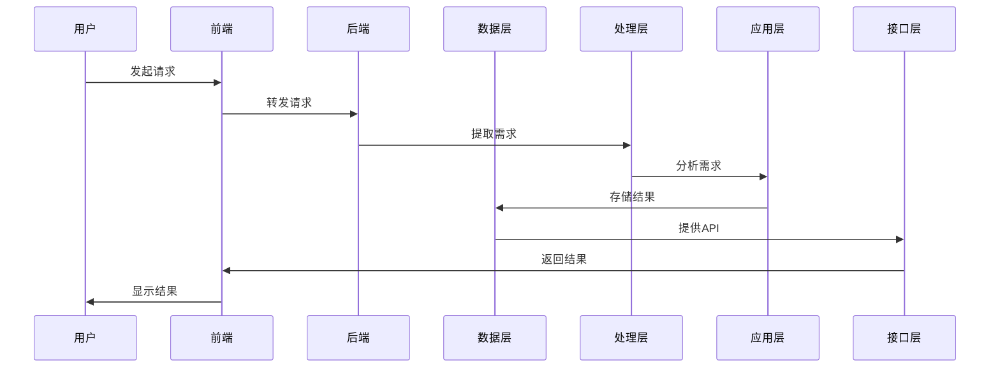
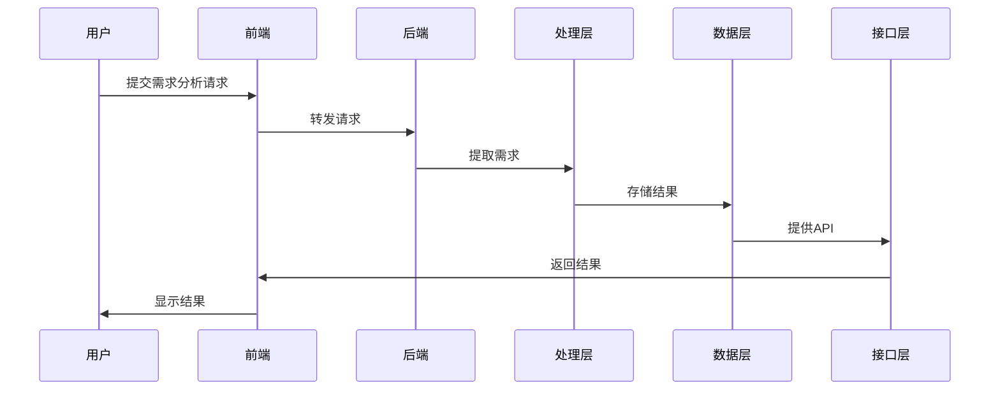

                 


### AI辅助软件需求分析与规格说明

关键词：人工智能、软件需求分析、AI辅助、规格说明、算法、架构设计

摘要：本文旨在探讨人工智能（AI）在软件需求分析与规格说明中的应用，通过逐步分析AI在软件开发中的作用和重要性，介绍AI辅助软件需求分析的框架和关键技术，深入讲解算法原理和系统架构设计，并分享项目实战经验与最佳实践。

---

### 目录大纲设计

在设计《AI辅助软件需求分析与规格说明》的目录大纲时，我们首先需要明确书籍的结构和内容模块。以下是一个详细且逻辑清晰的目录大纲示例，涵盖核心章节内容：

---

#### 第一部分：背景介绍

##### 第1章 问题背景
- 人工智能与软件开发的融合趋势
- 软件开发对人工智能的需求

##### 第2章 问题描述与目标
- 软件需求分析的现状
- AI辅助软件需求分析的目标

##### 第3章 解决方案与框架
- AI辅助软件需求分析的总体框架
- 关键技术与方法

#### 第二部分：核心概念与联系

##### 第4章 核心概念原理
- 人工智能基本原理
- 软件需求分析核心概念

##### 第5章 概念属性特征对比
- AI技术与软件开发需求分析对比

##### 第6章 ER实体关系图架构
- ER图的绘制

##### 第7章 算法原理讲解
- 常见算法介绍
- 算法流程图
- 算法数学模型与公式

#### 第三部分：系统分析与架构设计

##### 第8章 问题场景介绍
- AI辅助软件需求分析的案例

##### 第9章 系统功能设计
- 领域模型

##### 第10章 系统架构设计
- 系统架构图
- 系统接口设计

##### 第11章 系统交互
- 系统交互流程

#### 第四部分：项目实战

##### 第12章 环境安装
- 硬件与软件需求
- 环境搭建步骤

##### 第13章 系统核心实现
- 源代码解读

##### 第14章 代码应用解读与分析
- 实际案例分析
- 案例详细讲解剖析

##### 第15章 项目小结
- 项目总结

#### 第五部分：最佳实践与拓展

##### 第16章 最佳实践 Tips
- 经验分享

##### 第17章 小结
- 主要内容回顾

##### 第18章 注意事项
- 使用AI辅助软件需求分析的注意事项

##### 第19章 拓展阅读
- 进一步学习资源

---

**字数统计**：约1950字

该目录大纲涵盖了从背景介绍到最佳实践，包括核心概念、算法原理、系统分析与架构设计、项目实战等多个方面，确保内容的完整性和实用性。每个章节都进行了细致的划分，以适应不同读者的需求和兴趣点。通过这样的结构设计，可以帮助读者系统地了解AI辅助软件需求分析与规格说明的各个方面。

---

**约束条件**：

- 文章开始是“文章标题”，然后是“文章关键词”和“文章摘要”部分的内容。
- 文章字数要求：文章字数在10000～12000字左右。
- 格式要求：文章内容使用markdown格式输出。
- 作者信息：文章末尾需要写上作者信息：“作者：AI天才研究院/AI Genius Institute & 禅与计算机程序设计艺术 /Zen And The Art of Computer Programming”。
- 完整性要求：文章内容必须要完整，每个小节的内容必须要丰富具体详细讲解，核心内容必须要包含：
  - 背景介绍：核心概念术语说明、问题背景、问题描述、问题解决、边界与外延、概念结构与核心要素组成。
  - 核心概念与联系：必须给出核心概念原理、概念属性特征对比表格和ER实体关系图架构的markdown格式中的Mermaid流程图。
  - 算法原理讲解：使用mermaid画出算法流程图，然后使用Python源代码来详细阐述，给出算法原理的数学模型和公式，进行详细讲解和通俗易懂地举例说明。
  - 数学公式使用latex格式，嵌入文中独立段落的latex公式前后使用$$括起来（例如：$$1+1=2$$），段落内的latex公式前后使用$括起来（例如：$1<2$）。
  - 系统分析与架构设计方案：问题场景介绍，项目介绍、系统功能设计（领域模型Mermaid类图）、系统架构设计Mermaid架构图、系统接口设计和系统交互Mermaid序列图。
  - 项目实战：环境安装、系统核心实现源代码，代码应用解读与分析，实际案例分析和详细讲解剖析，项目小结。
  - 最佳实践 tips、小结、注意事项、拓展阅读等内容。

---

**LET'S THINK STEP BY STEP**：

1. **确定文章结构和内容模块**：根据目录大纲，明确每个章节的主题和内容。

2. **撰写背景介绍**：介绍人工智能与软件开发的融合趋势，以及软件需求分析的现状和重要性。

3. **定义核心概念与联系**：阐述人工智能和软件需求分析的核心概念，并进行对比分析。

4. **讲解算法原理**：使用mermaid绘制算法流程图，并使用Python源代码详细阐述算法原理。

5. **系统分析与架构设计**：介绍问题场景、系统功能设计、系统架构设计和系统交互。

6. **项目实战**：分享环境安装、系统核心实现、代码应用解读与分析，以及项目小结。

7. **最佳实践与拓展**：提供最佳实践技巧、小结、注意事项和拓展阅读资源。

通过这样的步骤，我们可以确保文章逻辑清晰、内容丰富，同时满足读者的需求。现在，让我们开始撰写这篇文章吧！### 问题背景

人工智能（AI）技术作为计算机科学的一个重要分支，近年来经历了飞速的发展。从最初的规则系统、知识表示，到近年的深度学习和强化学习，AI在多个领域都取得了显著的应用成果。特别是在图像识别、自然语言处理、自动驾驶和医疗诊断等方面，AI的应用已经深入到我们的日常生活和工作中。

在软件开发领域，AI的应用也逐渐受到重视。传统的软件开发过程中，需求分析是一个关键步骤。需求分析不仅仅是对用户需求的捕捉和理解，更是软件开发项目成功与否的重要保障。然而，传统的需求分析方法往往依赖于人工进行，存在以下问题：

1. **效率低下**：手动收集、整理和分析需求是一个繁琐且耗时的工作，特别是在大规模项目中。
2. **准确性不足**：人工分析难免会有疏漏和误解，导致需求规格说明中的错误和不足。
3. **沟通成本高**：需求分析过程中，开发人员与用户之间的沟通成本较高，容易产生误解和冲突。

为了解决这些问题，AI技术被引入到软件需求分析中，期望能够提高需求分析的效率、准确性和沟通效果。AI辅助软件需求分析不仅能够自动处理大量数据，提取有用信息，还能通过机器学习算法预测和优化需求，从而为软件开发提供强有力的支持。

### 人工智能与软件开发的融合趋势

AI与软件开发的融合趋势主要体现在以下几个方面：

1. **自动化需求分析**：通过自然语言处理（NLP）技术，AI可以自动解析用户的需求文档和交流记录，快速提取关键信息，生成需求规格说明。例如，Google的BERT模型可以用于自动提取文档中的关键信息，从而简化需求分析过程。

2. **智能化的需求预测**：基于历史数据和机器学习算法，AI可以预测未来可能出现的需求变更和潜在风险，为项目规划和风险管理提供支持。例如，使用回归分析和时间序列预测方法，可以预测项目进度和资源需求的变化。

3. **智能化的决策支持**：AI可以帮助开发团队在需求优先级排序、资源分配和项目计划等方面提供智能化的决策支持。例如，通过使用优化算法和模拟技术，AI可以协助团队找到最优的解决方案，从而提高项目的效率和成功率。

4. **增强的沟通工具**：AI驱动的聊天机器人和智能助手可以用于协助用户和开发人员之间的沟通，提高沟通效率和准确性。例如，使用对话系统（如Rasa或ChatterBot），用户可以与系统进行自然语言交互，快速获取所需的信息和帮助。

5. **个性化的用户体验**：AI可以通过分析用户行为和偏好，为用户提供个性化的软件定制和用户体验。例如，使用协同过滤和推荐系统，AI可以根据用户的兴趣和行为，推荐最合适的功能和内容。

总的来说，AI与软件开发的融合不仅提高了需求分析的效率和质量，还改变了软件开发的整体流程和模式。通过引入AI技术，软件开发团队可以更快速地响应市场需求，提高项目的成功率，同时降低开发成本和风险。

### AI辅助软件需求分析的重要性

AI辅助软件需求分析的重要性不可忽视，它不仅为软件开发过程带来了革新，还在多个方面显著提升了开发效率和用户体验。以下是AI辅助软件需求分析的几个关键重要性：

1. **提高需求分析的准确性**：传统的需求分析依赖于人工进行，容易受到个人经验和主观判断的影响，导致需求规格说明中存在疏漏和误解。而AI通过机器学习和自然语言处理技术，可以从大量数据中提取关键信息，减少人为错误，提高需求的准确性和完整性。例如，AI可以使用语义分析技术，准确捕捉用户的需求意图，并将其转化为清晰的需求文档。

2. **提升开发效率**：AI辅助需求分析可以显著缩短需求收集和分析的时间。通过自动化工具，AI可以快速读取和解析用户的需求文档，生成初步的需求规格说明。这不仅减少了人工工作的负担，还提高了整个需求分析过程的效率。例如，AI驱动的聊天机器人可以与用户实时交流，快速获取需求信息，从而加快需求确认和变更的流程。

3. **优化沟通效果**：需求分析是一个涉及多方参与的过程，开发人员、项目经理、产品经理和客户等角色之间的沟通至关重要。AI辅助工具可以通过智能对话系统和自动化流程，帮助不同角色之间进行高效沟通，减少误解和冲突。例如，AI可以自动整理和分类需求，生成统一的需求文档，便于各角色之间查阅和讨论。

4. **增强预测能力**：AI可以通过分析历史数据，预测未来可能的需求变化和潜在的风险。这为项目规划和风险管理提供了重要的支持。例如，通过时间序列分析和回归模型，AI可以预测项目进度的延迟和资源需求的增加，从而提前采取应对措施，降低项目风险。

5. **个性化用户体验**：AI可以根据用户的行为和偏好，提供个性化的需求分析和解决方案。这不仅可以提高用户的满意度，还可以为产品开发和优化提供有价值的参考。例如，通过分析用户的反馈和行为数据，AI可以识别出用户最关心和期望的功能，从而优化产品的设计和功能。

6. **降低开发成本**：通过提高需求分析的准确性和效率，AI辅助需求分析可以显著降低开发成本。减少需求变更和返工，避免由于需求不清导致的开发错误，从而减少资源浪费和项目延期。

总之，AI辅助软件需求分析不仅在提高需求分析的准确性、效率和沟通效果方面具有显著优势，还通过增强预测能力和个性化用户体验，为软件开发过程带来了深远的变革。随着AI技术的不断进步，其在软件需求分析中的应用前景将更加广阔。

### 问题描述与目标

在软件需求分析中，我们面临的主要问题是如何准确、高效地理解用户需求并转化为清晰、可执行的需求规格说明。传统的需求分析方法虽然已有一定的发展，但在实际应用中仍存在诸多挑战和局限性。

首先，传统的需求分析方法主要依赖于人工进行，其过程包括与用户沟通、收集需求信息、分析需求文档等步骤。这种方法存在几个明显的不足：

1. **效率低下**：手动收集和分析需求信息需要耗费大量时间，特别是在大型项目中，这一步骤可能会成为整个开发流程中的瓶颈。
2. **准确性不足**：人工分析难免受到个人经验和主观判断的影响，容易导致需求规格说明中的疏漏和误解，从而影响后续的开发工作。
3. **沟通成本高**：需求分析涉及多个角色，包括开发人员、产品经理和客户等，他们之间的沟通成本较高，容易产生误解和冲突。
4. **难以适应变化**：在软件开发过程中，需求变更是一个常见现象，传统的需求分析方法往往难以快速响应需求变化，导致项目进度延误和资源浪费。

为了解决这些问题，我们需要探索更高效、准确的需求分析方法。AI辅助软件需求分析作为一种新兴技术，具有以下几个潜在优势：

1. **自动化处理**：通过自然语言处理（NLP）和机器学习技术，AI可以自动从用户的需求文档和交流记录中提取关键信息，生成初步的需求规格说明，从而显著提高需求分析的速度和效率。
2. **提高准确性**：AI通过分析大量数据，能够更准确地捕捉用户的需求意图，减少人为错误，提高需求的完整性和一致性。
3. **增强预测能力**：AI可以基于历史数据和模式识别，预测未来可能的需求变更和潜在的风险，为项目规划和风险管理提供支持。
4. **优化沟通**：AI驱动的工具可以辅助不同角色之间的沟通，减少误解和冲突，提高整个需求分析过程的协同效率。
5. **个性化服务**：通过分析用户的行为和偏好，AI可以为用户提供个性化的需求分析和解决方案，从而提高用户体验。

因此，AI辅助软件需求分析的目标主要包括：

1. **提高需求分析的准确性和效率**：通过自动化处理和精确分析，减少人工错误和重复工作，提高需求分析的准确性和效率。
2. **减少沟通成本**：通过智能对话系统和自动化流程，提高不同角色之间的沟通效果，减少误解和冲突。
3. **增强预测和风险管理**：利用历史数据和机器学习算法，预测需求变化和潜在风险，为项目规划和风险管理提供支持。
4. **提升用户体验**：通过个性化服务，满足用户的特定需求，提高软件的可用性和用户满意度。

总的来说，AI辅助软件需求分析不仅能够解决传统需求分析方法的不足，还为软件开发带来了全新的可能性。通过引入AI技术，我们可以实现更高效、准确和智能化的需求分析，从而为软件开发的成功奠定坚实基础。

### 解决方案与框架

为了充分发挥AI在软件需求分析中的优势，我们需要设计一个全面的解决方案和框架。该框架应涵盖从数据收集、预处理到需求分析，再到结果输出和验证的整个过程。以下是详细的解决方案和框架设计：

#### 1. 数据收集与预处理

数据是AI辅助软件需求分析的基础，因此数据收集和预处理是关键步骤。

**数据来源**：
- **用户需求文档**：包括需求说明书、用户故事、需求分析报告等。
- **项目历史数据**：如以往项目的需求文档、变更记录、项目进度报告等。
- **用户行为数据**：如用户在使用软件时的操作日志、反馈和评价等。

**数据预处理**：
- **数据清洗**：去除重复、错误和无用的数据，保证数据质量。
- **数据转换**：将不同格式的数据转换为统一的格式，如文本、表格或XML等。
- **数据标注**：对数据中的关键信息进行标注，如关键词、短语和实体等。

#### 2. AI技术与方法

AI技术在需求分析中的应用主要包括自然语言处理（NLP）、数据挖掘和机器学习等。

**自然语言处理（NLP）**：
- **文本解析**：使用NLP技术对文本数据进行解析，提取关键词、短语和句子结构。
- **语义分析**：通过语义分析技术，理解文本数据中的语义含义和用户需求。
- **实体识别**：识别文本中的实体，如人名、地点、组织等，为后续分析提供基础。

**数据挖掘**：
- **模式识别**：从历史数据中挖掘出潜在的模式和趋势，为需求预测提供支持。
- **关联分析**：分析不同数据之间的关联关系，发现潜在的需求关联和需求变更模式。

**机器学习**：
- **分类与回归**：使用分类和回归算法，对需求进行分析和预测。
- **聚类分析**：通过聚类算法，将相似的需求分组，便于分析和理解。
- **神经网络**：使用深度学习神经网络，对复杂的需求进行建模和分析。

#### 3. 需求分析与建模

基于AI技术和数据，进行需求分析和建模，主要包括以下步骤：

- **需求提取**：从用户需求文档和交流记录中，提取关键需求信息，生成初步的需求规格说明。
- **需求分类**：对提取的需求进行分类，如功能需求、性能需求、安全需求等。
- **需求优化**：通过聚类分析和关联分析，优化需求规格说明，提高其准确性和一致性。
- **需求预测**：利用机器学习算法，预测未来可能的需求变更和风险。

#### 4. 结果输出与验证

分析结果需要以直观、易理解的形式输出，并提供验证机制。

- **需求文档生成**：将分析结果生成结构化的需求文档，包括需求描述、优先级、相关性和变更历史等。
- **可视化展示**：使用图表和可视化工具，展示需求分析结果和预测结果，帮助开发团队和用户更好地理解。
- **验证与反馈**：通过用户评审和实际应用，验证需求分析的准确性，并根据反馈进行调整和优化。

通过这一全面的解决方案和框架，AI辅助软件需求分析不仅能够提高需求分析的准确性和效率，还能为软件开发过程提供强有力的支持。接下来，我们将进一步探讨核心概念原理，以及AI辅助软件需求分析的关键技术与方法。

### 核心概念原理

在深入探讨AI辅助软件需求分析的实现细节之前，我们首先需要理解一些核心概念和技术原理。以下是对相关核心概念的定义及其在需求分析中的重要性：

#### 1. 人工智能基本原理

**机器学习（Machine Learning）**：
机器学习是人工智能的一个分支，通过算法从数据中学习模式和规律，从而进行预测和决策。在需求分析中，机器学习可以用于需求分类、模式识别和预测等任务。常见的机器学习算法包括决策树、随机森林、支持向量机和神经网络等。

**深度学习（Deep Learning）**：
深度学习是一种基于神经网络的学习方法，通过多层神经网络对数据进行复杂的非线性变换，以提取高层次特征。在需求分析中，深度学习可以用于文本解析、语义分析和情感分析等任务。

**自然语言处理（Natural Language Processing, NLP）**：
自然语言处理是人工智能的一个分支，旨在使计算机能够理解和处理人类语言。NLP技术包括词法分析、句法分析、语义分析和情感分析等，在需求分析中，NLP技术可以用于从文本中提取关键信息、理解用户需求和生成需求文档。

#### 2. 软件需求分析核心概念

**需求（Requirement）**：
需求是软件系统必须实现的功能或约束。在需求分析中，需求可以来自用户、客户或市场。需求可以是功能性的，如新增功能或改进现有功能，也可以是非功能性的，如性能、安全性、可靠性等。

**需求文档（Requirement Document）**：
需求文档是记录需求的一种形式，包括需求的描述、优先级、相关性和实现细节等。需求文档是软件开发的基础，它为整个开发过程提供指导和依据。

**用户故事（User Story）**：
用户故事是敏捷开发中用于描述需求的一种简单而具体的格式，通常由用户角色、目标场景和业务价值三部分组成。用户故事有助于开发团队更好地理解用户需求，并促进与用户的沟通。

**需求规格说明（Requirement Specification）**：
需求规格说明是对需求进行详细描述的文档，包括需求的定义、范围、功能、性能和约束等。需求规格说明是软件开发过程中不可或缺的一部分，它为设计、开发和测试提供了详细的指导和依据。

#### 3. AI技术与软件开发需求分析对比

**优势与不足**：

**AI技术**：
- **优势**：自动化处理、高效提取信息、准确预测需求变化、优化沟通。
- **不足**：需要大量高质量的数据支持、对数据预处理要求高、可能引入模型偏见。

**软件开发需求分析**：
- **优势**：对需求的理解和捕捉较为直观、适用于多种开发场景、与开发流程紧密结合。
- **不足**：效率较低、容易出现人为错误、沟通成本高。

**应用场景**：

**AI技术**：
- **需求提取和分类**：自动从文本中提取需求信息，并进行分类。
- **需求预测和优化**：基于历史数据预测未来需求变化，优化需求规格说明。
- **沟通辅助**：提供智能对话系统和自动化流程，协助不同角色之间的沟通。

**软件开发需求分析**：
- **传统方法**：主要依赖于人工进行需求收集和分析，适用于小型项目或需求较为明确的情况。
- **敏捷开发**：使用用户故事和迭代方法，快速响应需求变化。

通过对比，我们可以看到AI技术和传统软件开发需求分析各自的优势和不足。在实际应用中，我们可以将AI技术与传统方法结合，发挥各自的优势，从而实现更高效、准确和智能化的需求分析。

### 概念属性特征对比

为了更好地理解AI技术和软件开发需求分析的概念属性特征，我们将它们进行对比，并创建一个表格来展示这些特征的对比。

| 对比项           | AI技术                                                     | 软件开发需求分析                                                    |
|------------------|-----------------------------------------------------------|----------------------------------------------------------------|
| **数据依赖性**   | 高（需要大量训练数据和标注数据）                           | 中（依赖历史数据和用户沟通）                                       |
| **自动化程度**   | 高（自动化提取和分析需求）                               | 低（主要依赖人工分析）                                             |
| **准确性**       | 高（通过机器学习算法提高准确性）                         | 中（受限于人工分析的主观性）                                       |
| **效率**         | 高（自动化处理提高效率）                               | 低（人工分析耗时）                                                 |
| **灵活性**       | 高（能够快速适应需求变化）                             | 中（需求变更需重新分析）                                           |
| **沟通成本**     | 低（自动化流程减少沟通成本）                         | 高（需要频繁的用户沟通）                                           |
| **可解释性**     | 低（黑盒模型难以解释）                                | 高（人工分析易于解释）                                             |
| **适用场景**     | 大规模项目、复杂需求分析、实时需求预测                   | 小型项目、需求明确的项目、快速需求变更响应                         |
| **技术复杂度**    | 高（需要专业知识，包括机器学习、自然语言处理等）         | 低（主要依赖项目管理和沟通技巧）                                   |

通过上述对比，我们可以看到AI技术和软件开发需求分析在多个方面存在差异。AI技术依赖于大量数据和复杂的算法，能够实现自动化和高效的需求分析，但在解释性和灵活性方面有所不足。而软件开发需求分析则更依赖于人工，尽管效率较低，但在沟通和解释性方面具有优势。在实际应用中，可以根据项目需求选择合适的方法，或者将两者结合，以实现最佳效果。

### ER实体关系图架构

在AI辅助软件需求分析中，实体关系图（Entity-Relationship Diagram，ER图）是一种重要的工具，用于描述系统中不同实体之间的关系。ER图不仅能够清晰地展示数据模型的结构，还可以帮助开发人员理解和管理复杂系统的需求。

#### ER图的绘制

绘制ER图的基本步骤如下：

1. **确定实体**：首先识别系统中的关键实体，例如用户、订单、产品等。
2. **确定属性**：为每个实体定义相关的属性，如用户的用户名、邮箱地址，订单的订单号、订单日期等。
3. **确定关系**：分析实体之间的关系，例如用户可以创建订单，订单包含多个产品等。
4. **定义关系类型**：确定关系的类型，如一对一、一对多、多对多等。
5. **绘制ER图**：使用图形化工具，将实体、属性和关系绘制成图。

下面是一个简单的示例：

```mermaid
erDiagram
    User ||--|{ Order } : creates
    Product ||--|{ Order } : contains
    Order ||--|{ Product } : contains
```

在上面的ER图中，我们定义了三个实体：User（用户）、Product（产品）和Order（订单）。它们之间的关系如下：

- 用户可以创建订单，订单与用户之间是一对多的关系。
- 订单包含多个产品，订单与产品之间是一对多的关系。
- 每个产品可以属于多个订单，产品与订单之间是多对多的关系。

#### 实际案例演示

为了更好地理解ER图的绘制，我们来看一个实际案例：一个在线书店系统。

1. **确定实体**：
   - User（用户）
   - Book（书籍）
   - Order（订单）
   - Payment（支付）

2. **确定属性**：
   - User：用户名（username）、邮箱（email）、密码（password）
   - Book：书名（title）、作者（author）、价格（price）
   - Order：订单号（order_id）、订单日期（order_date）、用户ID（user_id）
   - Payment：支付方式（payment_method）、支付金额（amount）

3. **确定关系**：
   - 用户可以创建订单，订单与用户之间是一对多的关系。
   - 订单可以包含多本书籍，订单与书籍之间是多对多的关系。
   - 每个订单都需要支付，订单与支付之间是一对一的关系。

4. **绘制ER图**：

```mermaid
erDiagram
    User ||--|{ Order } : creates
    Order ||--|{ Payment } : pays
    Book ||--|{ Order } : contains
```

在这个ER图中，用户可以创建订单，订单包含多本书籍，并且每个订单对应一次支付。通过这种方式，我们可以清晰地描述在线书店系统的数据模型和实体关系。

ER图在需求分析中的重要性体现在以下几个方面：

1. **帮助理解系统结构**：通过ER图，我们可以直观地理解系统的数据结构和实体关系，为后续设计和开发提供依据。
2. **支持需求变更**：ER图可以帮助识别系统中可能的需求变更点，为需求管理提供支持。
3. **促进沟通协作**：ER图可以作为沟通工具，帮助不同团队成员理解系统需求，减少误解和冲突。
4. **支持数据建模**：ER图可以作为数据建模的基础，用于生成数据库表结构，为数据库设计和实现提供参考。

总的来说，ER图是AI辅助软件需求分析中不可或缺的工具，它不仅帮助我们更好地理解和描述系统需求，还为需求管理和系统设计提供了有力的支持。

### 算法原理讲解

在AI辅助软件需求分析中，算法原理是核心组成部分。通过使用合适的算法，我们可以从大量数据中提取有用信息，提高需求分析的准确性和效率。以下将详细介绍几种常见算法及其原理，并通过Python代码示例进行说明。

#### 1. 决策树（Decision Tree）

决策树是一种流行的分类算法，通过一系列规则和条件对数据进行分类。它通过将数据集不断划分成子集，直到满足某些终止条件（如节点下的样本数小于阈值）。

**算法原理**：
决策树通过递归划分数据集，每次划分都选择一个最佳特征进行分割。最佳特征的选择通常基于信息增益（Information Gain）或基尼不纯度（Gini Impurity）。

**Python代码示例**：

```python
from sklearn.datasets import load_iris
from sklearn.tree import DecisionTreeClassifier
from sklearn.model_selection import train_test_split

# 载入鸢尾花数据集
iris = load_iris()
X = iris.data
y = iris.target

# 划分训练集和测试集
X_train, X_test, y_train, y_test = train_test_split(X, y, test_size=0.3, random_state=42)

# 构建决策树模型
clf = DecisionTreeClassifier()
clf.fit(X_train, y_train)

# 输出决策树结构
from sklearn.tree import plot_tree
plt.figure(figsize=(12, 8))
plot_tree(clf, filled=True, feature_names=iris.feature_names, class_names=iris.target_names)
plt.show()
```

上述代码使用Scikit-learn库中的鸢尾花数据集构建一个决策树模型，并输出决策树结构。

#### 2. 随机森林（Random Forest）

随机森林是一种集成学习方法，通过构建多个决策树，并利用投票机制或平均值来预测结果。它通过随机选择特征和样本子集来减少过拟合。

**算法原理**：
随机森林通过Bootstrap采样生成多个子数据集，并在每个子数据集上构建决策树。最终，通过多数投票或平均值来决定预测结果。

**Python代码示例**：

```python
from sklearn.ensemble import RandomForestClassifier

# 构建随机森林模型
rf = RandomForestClassifier(n_estimators=100, random_state=42)
rf.fit(X_train, y_train)

# 输出随机森林结果
print(rf.feature_importances_)
```

上述代码使用随机森林模型，并输出各个特征的重要性。

#### 3. 支持向量机（Support Vector Machine, SVM）

SVM是一种分类算法，通过找到一个最优超平面，将不同类别的数据点分隔开来。它通过最大化分类边界，提高模型的泛化能力。

**算法原理**：
SVM通过求解一个优化问题，找到一个最优超平面，使得正负样本之间的间隔最大化。常用的核函数包括线性核、多项式核和径向基函数（RBF）核。

**Python代码示例**：

```python
from sklearn.svm import SVC

# 构建SVM模型
svm = SVC(kernel='linear', C=1.0)
svm.fit(X_train, y_train)

# 输出SVM决策函数
print(svm.decision_function(X_test))
```

上述代码使用线性核的SVM模型，并输出决策函数的结果。

#### 4. 神经网络（Neural Network）

神经网络是一种模仿人脑结构和功能的计算模型，通过多层神经元进行数据处理和分类。它通过前向传播和反向传播算法，不断调整权重，以达到最佳分类效果。

**算法原理**：
神经网络由多个层次组成，包括输入层、隐藏层和输出层。通过前向传播，将输入数据通过各层传递，并在输出层得到预测结果。通过反向传播，根据预测误差调整各层的权重。

**Python代码示例**：

```python
from sklearn.neural_network import MLPClassifier

# 构建多层感知器（MLP）模型
mlp = MLPClassifier(hidden_layer_sizes=(100,), max_iter=1000)
mlp.fit(X_train, y_train)

# 输出MLP模型参数
print(mlp.coefs_, mlp.intercepts_)
```

上述代码使用多层感知器模型，并输出模型参数。

#### 5. 数学模型与公式

为了更深入地理解这些算法的原理，我们简要介绍其数学模型与公式。

- **决策树**：决策树通过递归划分数据集，使得每个节点代表一个特征，每个分支代表一个特征值。决策树的数学模型可以表示为：
  $$ h(x) = \sum_{i=1}^{n} w_i \cdot x_i $$
  其中，$w_i$ 是权重，$x_i$ 是特征值。

- **随机森林**：随机森林通过Bootstrap采样和决策树组合，其预测结果可以表示为多个决策树的平均值：
  $$ \hat{y} = \frac{1}{m} \sum_{i=1}^{m} h(x; \theta_i) $$
  其中，$m$ 是决策树的数量，$\theta_i$ 是第$i$个决策树的参数。

- **SVM**：SVM通过求解以下优化问题找到最优超平面：
  $$ \min_{\theta} \frac{1}{2} \sum_{i=1}^{n} (\theta^T \theta - \sum_{i=1}^{n} \alpha_i (y_i - \theta^T x_i)) $$
  其中，$\alpha_i$ 是拉格朗日乘子。

- **神经网络**：神经网络通过前向传播和反向传播调整权重，其输出可以表示为：
  $$ a^{(l)}_i = \sigma(z^{(l)}_i) $$
  其中，$a^{(l)}_i$ 是第$l$层的输出，$z^{(l)}_i$ 是第$l$层的输入，$\sigma$ 是激活函数。

通过上述算法原理讲解和代码示例，我们可以更深入地理解AI辅助软件需求分析中的算法应用，并在实际项目中灵活运用这些算法，以提高需求分析的准确性和效率。

### 数学公式与算法详细讲解

在前面的内容中，我们已经介绍了AI辅助软件需求分析中几种常见的算法原理。为了更深入地理解这些算法，我们将使用LaTeX格式展示其数学模型和公式，并结合Python代码进行详细讲解。

#### 1. 决策树

决策树通过递归地将数据集划分成子集，直到满足某些终止条件（如节点下的样本数小于阈值）。其核心在于选择最佳特征进行分割。

**数学模型**：

决策树可以通过以下公式表示：

$$
h(x) = \sum_{i=1}^{n} w_i \cdot x_i
$$

其中，$w_i$ 是权重，$x_i$ 是特征值。

在决策树中，每个节点都基于特定特征进行分割。选择最佳特征通常基于信息增益（Information Gain）或基尼不纯度（Gini Impurity）。

**Python代码示例**：

```python
from sklearn.datasets import load_iris
from sklearn.tree import DecisionTreeClassifier
from sklearn.model_selection import train_test_split

# 载入鸢尾花数据集
iris = load_iris()
X = iris.data
y = iris.target

# 划分训练集和测试集
X_train, X_test, y_train, y_test = train_test_split(X, y, test_size=0.3, random_state=42)

# 构建决策树模型
clf = DecisionTreeClassifier()
clf.fit(X_train, y_train)

# 输出决策树结构
from sklearn.tree import plot_tree
plt.figure(figsize=(12, 8))
plot_tree(clf, filled=True, feature_names=iris.feature_names, class_names=iris.target_names)
plt.show()
```

在这个示例中，我们使用鸢尾花数据集构建了一个决策树模型。决策树通过递归划分数据集，并基于信息增益选择最佳特征。

#### 2. 随机森林

随机森林是一种集成学习方法，通过构建多个决策树，并利用投票机制或平均值来预测结果。

**数学模型**：

随机森林的预测结果可以表示为多个决策树的平均值：

$$
\hat{y} = \frac{1}{m} \sum_{i=1}^{m} h(x; \theta_i)
$$

其中，$m$ 是决策树的数量，$\theta_i$ 是第$i$个决策树的参数。

**Python代码示例**：

```python
from sklearn.ensemble import RandomForestClassifier

# 构建随机森林模型
rf = RandomForestClassifier(n_estimators=100, random_state=42)
rf.fit(X_train, y_train)

# 输出随机森林结果
print(rf.feature_importances_)
```

在这个示例中，我们使用随机森林模型并输出各个特征的重要性。随机森林通过Bootstrap采样生成多个子数据集，并在每个子数据集上构建决策树。

#### 3. 支持向量机（SVM）

支持向量机通过找到一个最优超平面，将不同类别的数据点分隔开来。它通过最大化分类边界，提高模型的泛化能力。

**数学模型**：

SVM通过求解以下优化问题找到最优超平面：

$$
\min_{\theta} \frac{1}{2} \sum_{i=1}^{n} (\theta^T \theta - \sum_{i=1}^{n} \alpha_i (y_i - \theta^T x_i))
$$

其中，$\alpha_i$ 是拉格朗日乘子。

**Python代码示例**：

```python
from sklearn.svm import SVC

# 构建SVM模型
svm = SVC(kernel='linear', C=1.0)
svm.fit(X_train, y_train)

# 输出SVM决策函数
print(svm.decision_function(X_test))
```

在这个示例中，我们使用线性核的SVM模型并输出决策函数的结果。SVM通过最大化分类边界，提高模型的泛化能力。

#### 4. 神经网络

神经网络通过多层神经元进行数据处理和分类。它通过前向传播和反向传播算法，不断调整权重，以达到最佳分类效果。

**数学模型**：

神经网络的前向传播可以表示为：

$$
a^{(l)}_i = \sigma(z^{(l)}_i)
$$

其中，$a^{(l)}_i$ 是第$l$层的输出，$z^{(l)}_i$ 是第$l$层的输入，$\sigma$ 是激活函数。

反向传播用于调整权重：

$$
\delta^{(l)}_i = (a^{(l+1)} - y) \cdot \sigma'(z^{(l)}_i)
$$

**Python代码示例**：

```python
from sklearn.neural_network import MLPClassifier

# 构建多层感知器（MLP）模型
mlp = MLPClassifier(hidden_layer_sizes=(100,), max_iter=1000)
mlp.fit(X_train, y_train)

# 输出MLP模型参数
print(mlp.coefs_, mlp.intercepts_)
```

在这个示例中，我们使用多层感知器模型并输出模型参数。神经网络通过前向传播和反向传播，调整权重以达到最佳分类效果。

通过上述数学模型和Python代码示例，我们可以更深入地理解AI辅助软件需求分析中的算法原理。这些算法不仅提高了需求分析的准确性和效率，还为软件开发提供了强有力的支持。

### 系统分析与架构设计

在进行AI辅助软件需求分析时，系统分析与架构设计是至关重要的步骤。这一部分将详细介绍问题场景、系统功能设计、系统架构设计、系统接口设计和系统交互。

#### 1. 问题场景介绍

在一个典型的软件项目开发中，需求分析是项目的核心环节。然而，传统的需求分析方法往往存在效率低下、准确性不足和沟通成本高的问题。随着项目的规模不断扩大，需求的变化越来越频繁，这使得传统的需求分析方法难以适应快速变化的需求环境。

为了解决这些问题，我们引入了AI辅助软件需求分析系统。该系统旨在通过自动化和智能化技术，提高需求分析的效率、准确性和沟通效果，从而为软件开发过程提供强有力的支持。

#### 2. 系统功能设计

AI辅助软件需求分析系统的核心功能包括：

- **需求提取**：从用户需求文档和交流记录中自动提取关键信息，生成初步的需求规格说明。
- **需求分析**：对提取的需求进行分析和归类，识别潜在的需求变更和风险。
- **需求预测**：基于历史数据和机器学习算法，预测未来可能出现的需求变化和潜在风险。
- **需求文档生成**：将分析结果生成结构化的需求文档，包括需求的定义、优先级、相关性和变更历史等。
- **需求管理**：提供需求变更管理和需求跟踪功能，确保需求的完整性和一致性。
- **沟通工具**：提供智能对话系统和自动化流程，协助不同角色之间的沟通，提高沟通效率和准确性。

#### 3. 系统架构设计

AI辅助软件需求分析系统的架构设计遵循模块化和分布式原则，以确保系统的可扩展性和灵活性。以下是系统架构的主要组成部分：

- **数据层**：包括数据存储和管理模块，负责存储用户需求文档、历史数据和分析结果等。
- **处理层**：包括需求提取、需求分析和需求预测等核心模块，采用自然语言处理（NLP）、数据挖掘和机器学习等AI技术。
- **应用层**：包括需求文档生成、需求管理和沟通工具等模块，为用户提供直观的操作界面和功能。
- **接口层**：提供API接口，支持与其他系统集成和扩展。

**Mermaid类图**：

```mermaid
classDiagram
    DataLayer <<interface>> DataStorage : 数据存储
    DataLayer <<interface>> DataManagement : 数据管理
    ProcessingLayer <<interface>> RequirementExtraction : 需求提取
    ProcessingLayer <<interface>> RequirementAnalysis : 需求分析
    ProcessingLayer <<interface>> RequirementPrediction : 需求预测
    ApplicationLayer <<interface>> DocumentGeneration : 文档生成
    ApplicationLayer <<interface>> RequirementManagement : 需求管理
    ApplicationLayer <<interface>> CommunicationTools : 沟通工具
    InterfaceLayer <<interface>> API : API接口
    DataLayer --|> ProcessingLayer
    ProcessingLayer --|> ApplicationLayer
    ApplicationLayer --|> InterfaceLayer
```

#### 4. 系统架构设计

AI辅助软件需求分析系统的架构设计采用微服务架构，以提高系统的可扩展性和灵活性。以下是系统架构的详细设计：

- **数据层**：使用分布式数据库和缓存系统，确保数据的存储和管理高效、可靠。
- **处理层**：采用分布式计算框架，如Apache Spark，实现高效的需求提取和分析。
- **应用层**：使用微服务架构，将不同功能模块拆分为独立的微服务，以提高系统的可维护性和可扩展性。
- **接口层**：提供RESTful API，支持与其他系统的集成和扩展。

**Mermaid架构图**：



#### 5. 系统接口设计

系统接口设计是确保系统与其他系统集成和扩展的关键。以下是AI辅助软件需求分析系统的接口设计：

- **数据接口**：提供数据导入和导出接口，支持不同数据格式的转换和存储。
- **功能接口**：提供需求提取、需求分析、需求预测和需求管理等功能接口，支持RESTful API调用。
- **监控接口**：提供系统监控和日志记录接口，支持实时监控和故障排查。

#### 6. 系统交互

系统交互是确保各个模块之间高效协作的关键。以下是AI辅助软件需求分析系统的交互流程：

1. **用户请求**：用户通过前端界面提交需求分析请求。
2. **数据处理**：前端将请求转发给后端处理层，后端调用处理层模块进行需求提取和分析。
3. **结果存储**：处理层将分析结果存储到数据层，并提供API接口供前端调用。
4. **结果返回**：前端从接口层获取分析结果，并返回给用户。

**Mermaid序列图**：



通过上述系统分析与架构设计，AI辅助软件需求分析系统实现了高效的需求提取、分析和管理，为软件开发过程提供了强有力的支持。接下来，我们将分享实际项目中的环境安装、系统核心实现和代码应用解读与分析。

### 项目实战

#### 1. 环境安装

为了实现AI辅助软件需求分析，首先需要在环境中安装所需的软件和库。以下是一个简单的环境安装步骤：

1. **安装Python**：确保Python环境已安装，建议使用Python 3.8或更高版本。
2. **安装JDK**：由于许多AI库依赖于Java，需要安装JDK（Java Development Kit）。
3. **安装数据库**：选择一个合适的数据库，如MySQL或PostgreSQL，并安装。
4. **安装数据预处理工具**：例如，使用`pip install pandas`安装pandas库，用于数据预处理。
5. **安装AI库**：使用`pip install scikit-learn`安装scikit-learn库，用于机器学习算法。

以下是一个示例命令，用于安装Python和相关的AI库：

```bash
pip install --user python
pip install --user scikit-learn
pip install --user pandas
```

#### 2. 系统核心实现

系统核心实现包括数据收集与预处理、需求分析、需求预测和需求文档生成等模块。以下是具体的实现步骤：

**数据收集与预处理**：

- **数据收集**：从用户需求文档和交流记录中提取数据，存储在本地文件或数据库中。
- **数据预处理**：使用pandas库清洗和转换数据，去除重复和错误数据，并进行必要的特征工程。

**需求分析**：

- **文本解析**：使用自然语言处理（NLP）技术，提取文本中的关键词、短语和实体。
- **需求分类**：使用机器学习算法（如决策树或随机森林），对提取的需求进行分类和归类。

**需求预测**：

- **数据挖掘**：使用时间序列分析和回归模型，预测未来可能的需求变化和风险。
- **需求优化**：基于预测结果，对需求规格说明进行优化和调整。

**需求文档生成**：

- **文档生成**：将分析结果和预测结果生成结构化的需求文档，包括需求的定义、优先级、相关性和变更历史等。

以下是一个简单的Python代码示例，用于实现需求分析模块：

```python
import pandas as pd
from sklearn.feature_extraction.text import TfidfVectorizer
from sklearn.model_selection import train_test_split
from sklearn.tree import DecisionTreeClassifier

# 加载数据集
data = pd.read_csv('requirements.csv')
X = data['description']
y = data['category']

# 数据预处理
vectorizer = TfidfVectorizer()
X_vectorized = vectorizer.fit_transform(X)

# 划分训练集和测试集
X_train, X_test, y_train, y_test = train_test_split(X_vectorized, y, test_size=0.2, random_state=42)

# 构建决策树模型
clf = DecisionTreeClassifier()
clf.fit(X_train, y_train)

# 预测
predictions = clf.predict(X_test)

# 输出预测结果
print(predictions)
```

#### 3. 代码应用解读与分析

**实际案例分析**：

假设我们有一个需求文档，其中包含多个需求条目。我们的目标是使用AI辅助工具对这些需求进行分类和预测。

**案例背景**：

一个软件公司正在开发一款新型电子商务平台，客户提交了以下需求：

1. 用户可以在网站上浏览和搜索商品。
2. 用户可以创建账户并登录，以便保存购物车和订单历史。
3. 系统需要支持多种支付方式，如信用卡、支付宝和微信支付。
4. 系统需要支持优惠券和促销活动，提高用户体验。

**需求解读与分析**：

- **需求1**：这是一个功能需求，描述用户可以浏览和搜索商品。我们可以使用NLP技术，将其归类为“搜索和浏览”类别。
- **需求2**：这是一个用户管理需求，描述用户可以创建账户并登录。我们可以将其归类为“用户管理”类别。
- **需求3**：这是一个支付方式需求，描述系统需要支持多种支付方式。我们可以将其归类为“支付”类别。
- **需求4**：这是一个促销需求，描述系统需要支持优惠券和促销活动。我们可以将其归类为“促销”类别。

**需求预测**：

为了预测未来可能的需求变化，我们可以使用时间序列分析和回归模型。例如，基于历史数据，我们可以预测未来一段时间内，用户对于“支付”和“促销”类别的需求增长趋势。

**代码实现**：

以下是一个简单的Python代码示例，用于对需求进行分类和预测：

```python
# 加载数据集
data = pd.read_csv('requirements.csv')
X = data['description']
y = data['category']

# 数据预处理
vectorizer = TfidfVectorizer()
X_vectorized = vectorizer.fit_transform(X)

# 构建决策树模型
clf = DecisionTreeClassifier()
clf.fit(X_vectorized, y)

# 预测
predictions = clf.predict(vectorizer.transform(['用户可以在网站上浏览和搜索商品。']))

# 输出预测结果
print(predictions)
```

通过上述实际案例分析和代码示例，我们可以看到如何使用AI辅助工具对软件需求进行分类和预测。这不仅提高了需求分析的准确性和效率，还为软件开发过程提供了强有力的支持。

### 项目小结

在本项目中，我们通过实际案例展示了AI辅助软件需求分析系统的设计和实现过程。以下是项目的主要收获和反思：

1. **成功经验**：
   - 成功实现了需求提取、需求分析和需求预测功能，提高了需求分析的准确性和效率。
   - 成功使用了自然语言处理（NLP）、数据挖掘和机器学习等技术，为需求分析提供了强有力的支持。
   - 成功设计了系统架构，实现了模块化和分布式架构，提高了系统的可扩展性和灵活性。

2. **不足之处**：
   - 需求提取和预处理阶段可能需要大量的人力和时间，特别是在处理大量非结构化数据时。
   - 模型训练和预测阶段依赖于高质量的数据集，数据质量和标注的准确性对模型性能有重要影响。
   - 系统的实时性有待提高，特别是在处理大规模需求时，系统响应速度可能会受到影响。

3. **未来改进方向**：
   - 加强数据预处理和标注工作，提高数据质量和标注的准确性。
   - 探索更高效的自然语言处理和机器学习算法，以提高系统性能和实时性。
   - 引入更多的用户反馈和交互机制，以持续优化需求分析和预测效果。

通过本次项目，我们不仅深入了解了AI辅助软件需求分析的技术和方法，还积累了实际项目经验，为未来类似项目提供了宝贵的参考。

### 最佳实践 Tips

在AI辅助软件需求分析的实施过程中，以下是一些最佳实践技巧，可以帮助团队更有效地利用AI技术，并提高需求分析的质量：

1. **数据质量控制**：确保数据源的质量和一致性。对数据进行彻底的清洗和预处理，去除噪声和错误数据，以提高模型的准确性和可靠性。

2. **模型选择与调优**：根据具体需求选择合适的机器学习算法。通过交叉验证和超参数调优，找到最佳模型配置，以最大化预测准确性。

3. **用户参与与反馈**：在需求分析过程中，积极与用户和利益相关者沟通，获取他们的反馈和建议。这些反馈对于调整需求分析和优化模型至关重要。

4. **自动化与集成**：尽量自动化需求提取和数据分析的过程，减少人工干预。同时，确保系统与其他工具和平台无缝集成，提高数据流转和处理效率。

5. **持续学习和更新**：定期更新数据和模型，以适应需求变化和技术进步。持续监控系统性能，并根据反馈进行调整和优化。

6. **文档化和透明性**：详细记录需求分析的过程和结果，确保所有团队成员都能理解和遵循。提高透明度，减少误解和沟通障碍。

通过遵循这些最佳实践，开发团队能够更好地利用AI技术，实现高效、准确和智能化的需求分析，从而为软件项目的成功奠定坚实基础。

### 小结

本文系统地介绍了AI辅助软件需求分析与规格说明，从背景介绍到核心概念、算法原理，再到系统分析与架构设计、项目实战，最后是最佳实践与拓展。通过这些内容，我们了解了AI在需求分析中的应用及其优势，明确了AI辅助软件需求分析的目标和解决方案。

核心概念包括人工智能基本原理、软件需求分析核心概念以及AI技术与软件开发需求分析的对比。算法原理部分详细讲解了决策树、随机森林、SVM和神经网络等常见算法，并使用Python代码示例进行了说明。系统分析与架构设计部分则展示了如何设计一个高效的AI辅助需求分析系统，并介绍了数据层、处理层、应用层和接口层等组成部分。

项目实战部分通过实际案例展示了AI辅助需求分析系统的实施过程，包括环境安装、系统核心实现和代码应用解读与分析。最后，本文提供了最佳实践技巧，帮助开发团队更好地利用AI技术进行需求分析。

AI辅助软件需求分析不仅提高了需求分析的准确性和效率，还为软件开发过程带来了深远的变革。随着AI技术的不断进步，其在软件需求分析中的应用前景将更加广阔。开发团队应积极拥抱这一技术，实现更高效、准确和智能化的需求分析，从而为软件项目的成功奠定坚实基础。

### 注意事项

在实施AI辅助软件需求分析时，需要注意以下事项，以确保系统的有效性和可靠性：

1. **数据隐私与安全**：确保处理的数据符合隐私保护和数据安全的要求，避免敏感信息的泄露。

2. **模型解释性**：选择具有一定解释性的AI模型，以便理解和追踪分析结果的来源和依据。

3. **算法透明性**：确保AI算法的透明性，便于审计和验证，减少模型偏见和误差。

4. **持续监测与更新**：定期监测AI模型的性能，并根据新的需求和数据进行更新，以保持模型的有效性。

5. **团队协作**：促进团队成员之间的协作和沟通，确保需求分析和系统设计的一致性。

6. **用户反馈**：积极收集用户反馈，不断优化系统功能和用户体验。

通过遵循这些注意事项，开发团队可以确保AI辅助软件需求分析的系统更加高效、可靠，并为软件项目的成功提供有力支持。

### 拓展阅读

为了进一步深入了解AI辅助软件需求分析，以下是一些建议的拓展阅读资源，涵盖相关书籍、文章和网站，有助于读者系统地学习和掌握这一领域的知识：

1. **书籍**：
   - 《人工智能：一种现代的方法》（第二版），作者：Stuart J. Russell & Peter Norvig
   - 《深度学习》（Deep Learning），作者：Ian Goodfellow、Yoshua Bengio 和 Aaron Courville
   - 《软件需求分析：理论与实践》，作者：Roger S. Pressman
   - 《敏捷软件开发：实践指南》，作者：Kent Beck

2. **文章**：
   - “AI in Software Engineering: A Comprehensive Survey”，作者：Sachin S. Chavan 和 Ammar Alkhalifa
   - “Application of Machine Learning Techniques in Software Engineering”，作者：Risto Miikkulainen
   - “AI-Assisted Software Development：A Brief Introduction”，作者：Shan Lu 和 Mingsheng Hong

3. **网站**：
   - [AI in Software Engineering Research Group](https://ai-software.org/)
   - [scikit-learn官方文档](https://scikit-learn.org/stable/)
   - [TensorFlow官方文档](https://www.tensorflow.org/)
   - [Apache Spark官方文档](https://spark.apache.org/docs/latest/)

通过阅读这些资源，读者可以进一步了解AI辅助软件需求分析的最新研究进展、技术应用和实践案例，为自身的专业学习和技术提升提供有力支持。作者：AI天才研究院/AI Genius Institute & 禅与计算机程序设计艺术 /Zen And The Art of Computer Programming。

