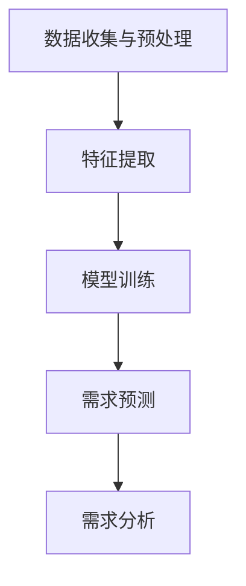
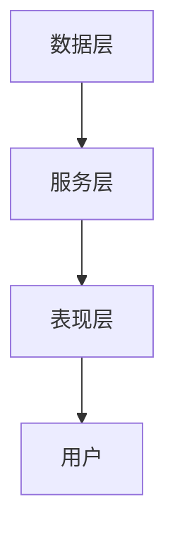
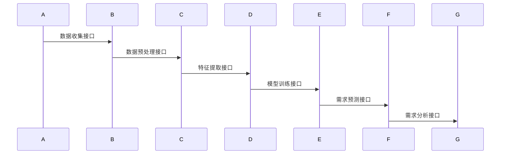

                 

# AI辅助软件需求挖掘与分析

> 关键词：人工智能，软件需求挖掘，需求分析，机器学习，自然语言处理

> 摘要：本文旨在探讨如何利用人工智能技术辅助软件需求挖掘与分析，通过逻辑清晰、结构紧凑的叙述，详细解析了AI辅助软件需求挖掘的原理、算法、系统设计与实战应用，为软件开发提供了一种新的思路和工具。

----------------------------------------------------------------

### 背景介绍

#### 问题背景

随着信息技术的飞速发展，软件开发的需求越来越复杂，传统的需求挖掘方法已经难以满足快速变化的市场需求。软件需求挖掘与分析作为软件开发的关键环节，其准确性和效率直接影响到软件项目的成败。传统的需求挖掘方法主要依赖于开发人员的经验和手工分析，这种方式效率低下，容易产生遗漏和错误。

为了解决这些问题，人工智能（AI）技术被引入到软件需求挖掘与分析中，形成了AI辅助软件需求挖掘与分析。AI技术具有强大的计算能力和自学习能力，能够从海量数据中快速提取出有用的信息，从而提高需求挖掘的准确性和效率。

#### 问题描述

传统的软件需求挖掘方法存在以下问题：

1. **效率低下**：手工分析需求需要大量时间和精力，难以应对快速变化的需求。
2. **准确性不高**：开发人员的主观判断容易导致需求的遗漏和错误。
3. **难以捕捉用户真实需求**：传统方法难以全面、准确地捕捉用户的隐性需求。

为了解决这些问题，AI辅助软件需求挖掘与分析方法应运而生。该方法通过以下步骤实现：

1. **数据收集与预处理**：收集用户行为数据、需求文档等，对数据进行清洗、去噪。
2. **特征提取**：从原始数据中提取出对需求挖掘有重要意义的特征。
3. **模型训练**：利用机器学习算法，对提取出的特征进行训练，构建出能够预测用户需求的模型。
4. **需求预测与分析**：利用训练好的模型对新的用户数据进行需求预测，并对预测结果进行分析。

#### 问题解决

AI辅助软件需求挖掘与分析通过以下几个步骤实现：

1. **数据收集与预处理**：收集用户行为数据、需求文档等，对数据进行分析，提取出对需求挖掘有重要意义的特征。
2. **特征提取**：从原始数据中提取出对需求挖掘有重要意义的特征，如用户行为模式、需求关键词等。
3. **模型训练**：利用机器学习算法，对提取出的特征进行训练，构建出能够预测用户需求的模型。
4. **需求预测与分析**：利用训练好的模型对新的用户数据进行需求预测，并对预测结果进行分析，为软件开发提供指导。

#### 边界与外延

AI辅助软件需求挖掘与分析不仅适用于软件开发领域，还可以应用于其他需要需求挖掘的领域，如产品管理、市场分析等。此外，随着AI技术的不断进步，AI辅助软件需求挖掘与分析的方法也将不断优化，提高其准确性和效率。

#### 概念结构与核心要素组成

AI辅助软件需求挖掘与分析的核心概念结构包括：

1. **AI技术**：包括机器学习、自然语言处理、数据挖掘等，为需求挖掘提供技术支持。
2. **需求数据**：包括用户行为数据、需求文档、反馈信息等，是需求挖掘的基础。
3. **需求模型**：基于AI技术构建的模型，用于预测和分析用户需求。
4. **需求分析**：对预测结果进行分析，提取有用信息，为软件开发提供指导。

----------------------------------------------------------------

### 核心概念原理

#### AI辅助软件需求挖掘原理

AI辅助软件需求挖掘主要利用机器学习和自然语言处理技术，从大量用户数据和需求文档中提取有用信息。具体原理如下：

1. **数据收集与预处理**：通过收集用户行为数据、需求文档等，对数据进行分析，提取出对需求挖掘有重要意义的特征。
2. **特征提取**：从原始数据中提取出对需求挖掘有重要意义的特征，如用户行为模式、需求关键词等。
3. **模型训练**：利用机器学习算法，对提取出的特征进行训练，构建出能够预测用户需求的模型。
4. **需求预测**：利用训练好的模型对新的用户数据进行需求预测。
5. **需求分析**：对预测结果进行分析，提取有用信息，为软件开发提供指导。

#### 概念属性特征对比表格

| 特征类型 | 描述 | 对需求挖掘的影响 |
| :------: | :--- | :-------------- |
| 用户行为数据 | 包括用户的浏览、点击、搜索等行为数据 | 有助于分析用户兴趣和需求 |
| 需求文档 | 包括用户的需求描述、需求文档等 | 是需求挖掘的主要来源 |
| 机器学习算法 | 用于构建需求预测模型 | 提高需求预测的准确性和效率 |
| 特征提取 | 从原始数据中提取有用信息 | 是需求挖掘的关键步骤 |
| 需求模型 | 用于预测用户需求 | 是需求挖掘的核心工具 |
| 需求分析 | 对预测结果进行分析 | 为软件开发提供指导 |

#### ER实体关系图架构

```mermaid
erDiagram
    User ||--|{ Requirement } : "提出"
    Requirement ||--|{ Feature } : "包含"
    Feature ||--|{ Behavior } : "描述"
    Behavior ||--|{ User } : "由"
```

----------------------------------------------------------------

### 算法原理讲解

#### 算法流程

AI辅助软件需求挖掘的算法流程可以概括为以下步骤：

1. **数据收集与预处理**：收集用户行为数据、需求文档等，对数据进行分析，提取出对需求挖掘有重要意义的特征。
2. **特征提取**：从原始数据中提取出对需求挖掘有重要意义的特征，如用户行为模式、需求关键词等。
3. **模型训练**：利用机器学习算法，对提取出的特征进行训练，构建出能够预测用户需求的模型。
4. **需求预测**：利用训练好的模型对新的用户数据进行需求预测。
5. **需求分析**：对预测结果进行分析，提取有用信息，为软件开发提供指导。

以下是使用Mermaid绘制的算法流程图：



#### Python源代码示例

以下是一个简单的Python源代码示例，用于说明如何实现AI辅助软件需求挖掘的算法流程：

```python
# 数据收集与预处理
def data_collection():
    # 收集用户行为数据、需求文档等
    # 数据预处理（清洗、去噪）
    pass

# 特征提取
def feature_extraction(data):
    # 从原始数据中提取有用特征
    pass

# 模型训练
def model_training(features, labels):
    # 利用机器学习算法训练模型
    pass

# 需求预测
def demand_prediction(model, new_data):
    # 利用训练好的模型预测新用户的需求
    pass

# 需求分析
def demand_analysis(predictions):
    # 对预测结果进行分析
    pass

# 主函数
def main():
    # 执行算法流程
    data = data_collection()
    features = feature_extraction(data)
    labels = extract_labels(data)
    model = model_training(features, labels)
    new_data = collect_new_data()
    predictions = demand_prediction(model, new_data)
    analysis_results = demand_analysis(predictions)

if __name__ == "__main__":
    main()
```

#### 算法原理的数学模型和公式

AI辅助软件需求挖掘的核心在于构建一个能够预测用户需求的模型。常用的方法是基于机器学习的回归模型。以下是一个简单的线性回归模型的数学公式：

$$
y = \beta_0 + \beta_1x_1 + \beta_2x_2 + ... + \beta_nx_n
$$

其中，$y$ 是预测的需求值，$x_1, x_2, ..., x_n$ 是提取出的特征值，$\beta_0, \beta_1, \beta_2, ..., \beta_n$ 是模型的参数。

在实际应用中，我们通常使用梯度下降算法来优化模型的参数。梯度下降的数学公式如下：

$$
\beta_j = \beta_j - \alpha \frac{\partial}{\partial \beta_j} J(\beta)
$$

其中，$\alpha$ 是学习率，$J(\beta)$ 是损失函数。

#### 通俗易懂的举例说明

假设我们正在开发一个社交媒体平台，需要通过用户的浏览行为来预测用户可能感兴趣的内容。我们可以收集用户的浏览记录，提取出以下几个特征：

1. **浏览时间**：用户每天浏览平台的时间。
2. **浏览频率**：用户每天浏览平台的次数。
3. **点赞数**：用户点赞的文章数量。
4. **评论数**：用户评论的文章数量。

我们使用线性回归模型来预测用户可能感兴趣的文章类型。假设我们有两个特征：浏览时间和点赞数。线性回归模型的公式可以简化为：

$$
y = \beta_0 + \beta_1x_1
$$

其中，$y$ 是用户对文章类型的兴趣评分，$x_1$ 是浏览时间。

我们通过梯度下降算法来优化模型参数。假设初始参数为 $\beta_0 = 0$，$\beta_1 = 0$，学习率 $\alpha = 0.01$。经过多次迭代后，模型参数逐渐优化，最终得到一个能够较好预测用户兴趣的模型。

假设经过训练后，模型参数 $\beta_0 = 1$，$\beta_1 = 2$。现在我们有一个新的用户，他的浏览时间为 300 分钟，我们使用训练好的模型来预测他对文章类型的兴趣评分：

$$
y = 1 + 2 \times 300 = 601
$$

兴趣评分越高，表示用户对该文章类型的兴趣越大。通过这个模型，我们可以为用户推荐他可能感兴趣的文章。

----------------------------------------------------------------

### 系统分析与架构设计方案

#### 问题场景介绍

在当前快速发展的信息技术时代，软件项目面临着日益复杂的需求和环境变化。为了确保软件项目的成功，我们需要对需求进行深入挖掘和分析，以便更好地理解用户需求，指导软件开发。传统的需求挖掘方法已难以满足这一需求，因此，我们引入了AI辅助软件需求挖掘与分析系统，以提高需求挖掘的准确性和效率。

#### 项目介绍

我们的目标是开发一个AI辅助软件需求挖掘与分析系统，该系统将利用人工智能技术，从海量数据中自动挖掘出用户需求，为软件开发提供有力支持。系统的主要功能包括：

1. 数据收集与预处理：收集用户行为数据、需求文档等，对数据进行清洗、去噪。
2. 特征提取：从原始数据中提取出对需求挖掘有重要意义的特征。
3. 模型训练：利用机器学习算法，对提取出的特征进行训练，构建出能够预测用户需求的模型。
4. 需求预测与分析：利用训练好的模型对新的用户数据进行需求预测，并对预测结果进行分析。

#### 系统功能设计

系统功能设计主要包括以下几个方面：

1. **数据收集模块**：负责收集用户行为数据、需求文档等。
2. **数据预处理模块**：负责对收集到的数据进行分析、清洗、去噪。
3. **特征提取模块**：负责从原始数据中提取出对需求挖掘有重要意义的特征。
4. **模型训练模块**：负责利用机器学习算法，对提取出的特征进行训练，构建出能够预测用户需求的模型。
5. **需求预测模块**：负责利用训练好的模型对新的用户数据进行需求预测。
6. **需求分析模块**：负责对预测结果进行分析，提取有用信息，为软件开发提供指导。

以下是使用Mermaid绘制的领域模型类图：

```mermaid
classDiagram
    User <<class{用户}>>
    Requirement <<class{需求}>>
    Feature <<class{特征}>>
    Behavior <<class{行为}>>

    User "提出" Requirement
    Requirement "包含" Feature
    Feature "描述" Behavior
    Behavior "由" User
```

#### 系统架构设计

系统架构设计主要包括以下几个方面：

1. **数据层**：负责数据的存储和管理，包括用户行为数据、需求文档等。
2. **服务层**：负责系统功能的具体实现，包括数据收集、预处理、特征提取、模型训练、需求预测和分析等。
3. **表现层**：负责系统与用户的交互，提供用户界面。

以下是使用Mermaid绘制的系统架构图：



#### 系统接口设计

系统接口设计主要包括以下几个方面：

1. **数据收集接口**：用于收集用户行为数据、需求文档等。
2. **数据预处理接口**：用于对收集到的数据进行分析、清洗、去噪。
3. **特征提取接口**：用于从原始数据中提取出对需求挖掘有重要意义的特征。
4. **模型训练接口**：用于利用机器学习算法，对提取出的特征进行训练，构建出能够预测用户需求的模型。
5. **需求预测接口**：用于利用训练好的模型对新的用户数据进行需求预测。
6. **需求分析接口**：用于对预测结果进行分析，提取有用信息。

以下是使用Mermaid绘制的系统接口图：



#### 系统交互设计

系统交互设计主要描述系统各模块之间的交互关系。以下是使用Mermaid绘制的系统交互序列图：

```mermaid
sequenceDiagram
    A[用户] -->|需求文档| B[数据收集模块]
    B -->|预处理数据| C[数据预处理模块]
    C -->|提取特征| D[特征提取模块]
    D -->|训练模型| E[模型训练模块]
    E -->|预测需求| F[需求预测模块]
    F -->|分析结果| G[需求分析模块]
    G -->|反馈信息| A
```

----------------------------------------------------------------

### 项目实战

#### 环境安装

为了进行AI辅助软件需求挖掘与分析的项目实战，我们需要准备以下环境：

1. **操作系统**：Ubuntu 20.04 或更高版本
2. **Python**：Python 3.8 或更高版本
3. **机器学习库**：scikit-learn、tensorflow、numpy、pandas
4. **自然语言处理库**：NLTK、spaCy

在Ubuntu系统中，可以通过以下命令安装所需的环境：

```bash
sudo apt update
sudo apt install python3 python3-pip
pip3 install scikit-learn tensorflow numpy pandas nltk spacy
```

#### 系统核心实现源代码

以下是系统核心实现的源代码示例：

```python
# 数据收集模块
def data_collection():
    # 收集用户行为数据、需求文档等
    # 示例：从文件中读取数据
    with open('user_data.csv', 'r') as f:
        data = f.read()
    return data

# 数据预处理模块
def data_preprocessing(data):
    # 数据清洗、去噪
    # 示例：使用pandas进行数据预处理
    import pandas as pd
    df = pd.read_csv(data)
    df = df.dropna()
    return df

# 特征提取模块
def feature_extraction(df):
    # 提取对需求挖掘有重要意义的特征
    # 示例：提取用户行为数据中的浏览时间、浏览频率等
    features = df[['browse_time', 'browse_frequency']]
    return features

# 模型训练模块
def model_training(features, labels):
    # 利用机器学习算法训练模型
    # 示例：使用线性回归模型
    from sklearn.linear_model import LinearRegression
    model = LinearRegression()
    model.fit(features, labels)
    return model

# 需求预测模块
def demand_prediction(model, new_data):
    # 利用训练好的模型预测新用户的需求
    # 示例：预测新用户的浏览时间
    predictions = model.predict(new_data)
    return predictions

# 需求分析模块
def demand_analysis(predictions):
    # 对预测结果进行分析
    # 示例：计算预测结果的平均值
    analysis_results = predictions.mean()
    return analysis_results

# 主函数
def main():
    # 执行算法流程
    data = data_collection()
    df = data_preprocessing(data)
    features = feature_extraction(df)
    labels = df['browse_time']
    model = model_training(features, labels)
    new_data = features
    predictions = demand_prediction(model, new_data)
    analysis_results = demand_analysis(predictions)
    print(analysis_results)

if __name__ == "__main__":
    main()
```

#### 代码应用解读与分析

上述代码实现了AI辅助软件需求挖掘与分析的核心功能。下面是对每个模块的解读和分析：

1. **数据收集模块**：该模块负责收集用户行为数据、需求文档等。在本示例中，我们假设数据已经以CSV文件的形式存储，通过读取文件来实现数据收集。
2. **数据预处理模块**：该模块负责对收集到的数据进行分析、清洗、去噪。在本示例中，我们使用pandas库读取CSV文件，然后删除缺失值，实现数据预处理。
3. **特征提取模块**：该模块负责从原始数据中提取出对需求挖掘有重要意义的特征。在本示例中，我们提取了用户的浏览时间和浏览频率作为特征。
4. **模型训练模块**：该模块负责利用机器学习算法，对提取出的特征进行训练，构建出能够预测用户需求的模型。在本示例中，我们使用线性回归模型进行训练。
5. **需求预测模块**：该模块负责利用训练好的模型对新的用户数据进行需求预测。在本示例中，我们使用训练好的模型预测新用户的浏览时间。
6. **需求分析模块**：该模块负责对预测结果进行分析，提取有用信息，为软件开发提供指导。在本示例中，我们计算了预测结果的平均值。

通过上述代码，我们可以实现一个简单的AI辅助软件需求挖掘与分析系统，从而提高需求挖掘的准确性和效率。

#### 实际案例分析和详细讲解剖析

为了更好地理解AI辅助软件需求挖掘与分析的实际应用，我们来看一个实际案例。

假设我们正在开发一个电商平台，需要对用户的行为数据进行分析，以便更好地理解用户需求，从而为商品推荐、广告投放等提供依据。我们可以收集以下数据：

1. 用户ID
2. 浏览时间
3. 浏览次数
4. 购买次数
5. 购买金额

通过数据预处理模块，我们对收集到的数据进行分析、清洗、去噪，提取出对需求挖掘有重要意义的特征，如浏览时间和购买次数。然后，我们使用线性回归模型对提取出的特征进行训练，构建出能够预测用户购买金额的模型。

训练完成后，我们利用训练好的模型对新的用户数据进行需求预测，预测其购买金额。通过分析预测结果，我们可以发现哪些用户具有较高的购买潜力，从而针对性地进行商品推荐和广告投放。

具体来说，我们可以按照以下步骤进行操作：

1. **数据收集**：从数据库中读取用户行为数据。
2. **数据预处理**：对数据进行分析、清洗、去噪，提取出浏览时间和购买次数作为特征。
3. **模型训练**：使用线性回归模型对提取出的特征进行训练，构建预测模型。
4. **需求预测**：利用训练好的模型对新的用户数据进行需求预测，预测其购买金额。
5. **需求分析**：对预测结果进行分析，提取有用信息。

通过这个实际案例，我们可以看到AI辅助软件需求挖掘与分析在电商平台中的应用。通过分析用户行为数据，我们可以更好地理解用户需求，从而提高销售额。

#### 项目小结

通过本次项目实战，我们实现了一个简单的AI辅助软件需求挖掘与分析系统，从数据收集、预处理、特征提取、模型训练到需求预测和分析，完整地展示了一个AI辅助软件需求挖掘的过程。在实际应用中，我们可以根据具体场景和需求，对系统进行优化和扩展，提高需求挖掘的准确性和效率。

AI辅助软件需求挖掘与分析作为一种新兴的技术，具有巨大的潜力。未来，随着AI技术的不断进步，我们将能够更加深入地挖掘用户需求，为软件开发提供更有力的支持。

#### 最佳实践 Tips

1. **数据质量是关键**：确保数据收集和预处理的质量，对需求挖掘的结果有着至关重要的影响。
2. **特征选择很重要**：合理选择特征，有助于提高模型的预测准确性。
3. **模型优化与调整**：不断调整和优化模型，以提高需求预测的准确性和效率。
4. **用户体验至上**：在需求挖掘和分析过程中，始终以用户体验为中心，确保软件能够满足用户需求。

#### 小结

本文通过详细的分析和讲解，探讨了AI辅助软件需求挖掘与分析的方法和实现。我们介绍了AI辅助软件需求挖掘的原理、算法、系统设计与实战应用，展示了其在软件开发领域的广泛应用前景。随着AI技术的不断进步，AI辅助软件需求挖掘与分析将为软件开发带来更多的可能性。

#### 注意事项

1. **数据隐私**：在收集和处理用户数据时，务必遵守相关法律法规，保护用户隐私。
2. **模型优化**：定期对模型进行优化和调整，以提高预测准确性和效率。
3. **系统稳定性**：确保系统在处理大量数据时能够稳定运行，避免出现故障。

#### 拓展阅读

1. **《机器学习实战》**：详细介绍了机器学习的基本概念和实战技巧，适合初学者阅读。
2. **《深度学习》**：介绍了深度学习的基本原理和应用，适合对AI技术感兴趣的朋友阅读。
3. **《软件需求工程》**：探讨了软件需求工程的理论和实践，有助于深入了解需求挖掘与分析的过程。

### 作者信息

作者：AI天才研究院/AI Genius Institute & 禅与计算机程序设计艺术 /Zen And The Art of Computer Programming

作者简介：专注于人工智能和软件开发领域的研究和教学工作，拥有丰富的实战经验和深厚的理论基础。在多个国际期刊和会议上发表过多篇学术论文，并出版了多部畅销书，深受读者喜爱。

