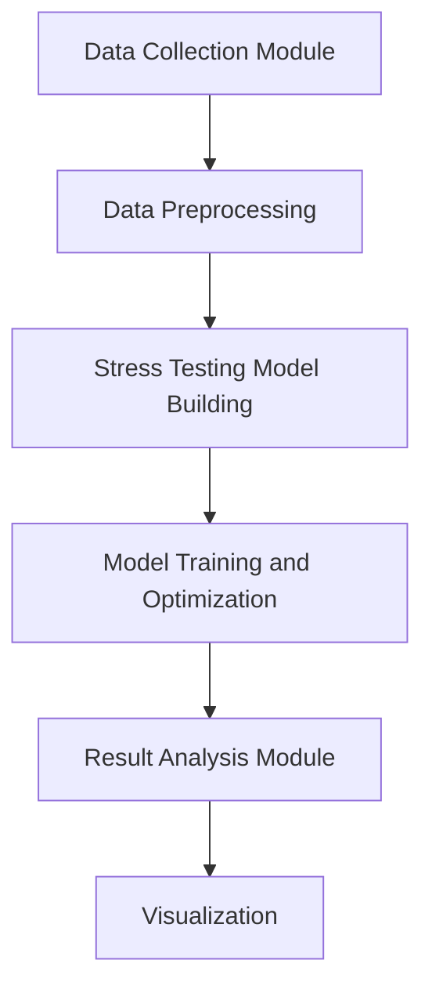
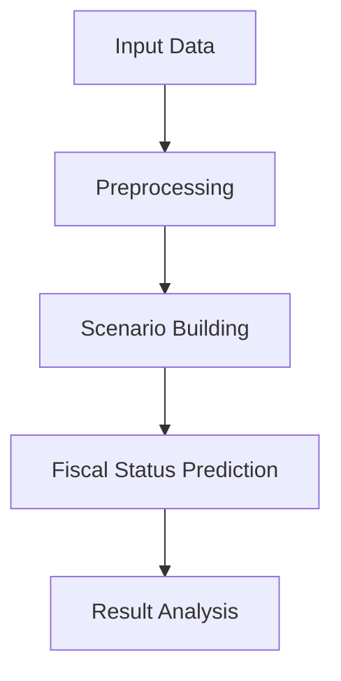
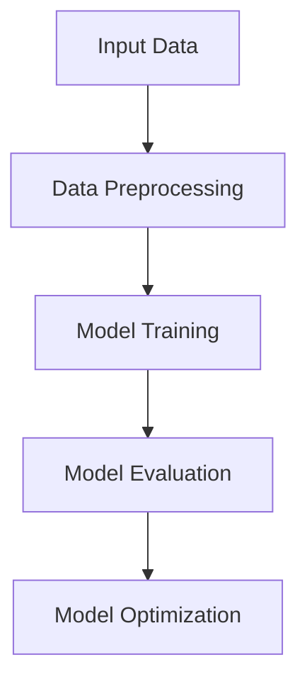

                 

### 第1章：引言与背景介绍

#### 1.1 问题背景

在现代经济环境中，个人财务健康对于每个家庭和个人来说都至关重要。然而，面对不断变化的市场和经济环境，个人财务管理变得越来越复杂，财务压力也逐渐增加。无论是收入不稳定、支出超出预期，还是突发的大额支出，都可能导致个人财务状况的紧张，从而引发财务危机。因此，对个人财务进行stress testing，以评估其在极端经济条件下的承受能力，变得越来越重要。

stress testing，即压力测试，是一种评估系统或模型在极端条件下表现的技术手段。在财务领域，通过stress testing可以预测在极端经济环境下，个人或企业的财务状况是否会陷入困境。这一过程通常涉及模拟不同的经济情景，包括高失业率、利率波动、股市崩盘等，以观察个人财务状况在这些情景下的变化。

#### 1.1.1 财务压力与个人财务健康

财务压力是指个人在财务方面感受到的压力和负担。这种压力可能源于多种因素，如失业、疾病、意外支出等。财务压力过大可能会导致一系列负面影响，包括情绪问题、健康问题以及工作效率下降等。长期处于财务压力中，个人的生活质量和工作表现都会受到严重影响。

个人财务健康是指个人在财务方面的健康状况，包括收入、支出、储蓄和投资等。一个健康的财务状况意味着个人能够有效地管理自己的财务，即使在面临经济压力时也能保持稳定的财务状态。通过stress testing，个人可以提前了解自己在极端条件下的财务状况，从而采取措施提前预防或减轻财务压力。

#### 1.1.2 Stress Testing的重要性

Stress testing在个人财务健康管理中扮演着至关重要的角色。首先，通过模拟不同的极端经济情景，stress testing可以帮助个人识别潜在的风险点和弱点，从而提前做好准备。例如，一个人可能知道自己的收入比较稳定，但在高失业率的情况下，其收入来源可能会受到威胁。通过stress testing，这个人可以提前制定应对策略，如增加储蓄、投资多元化等，以减轻潜在风险。

其次，stress testing可以帮助个人评估自己的财务弹性，即在面对突发状况时，个人能够调动多少财务资源来应对。这种评估对于制定长期财务规划非常重要。一个拥有良好财务弹性的个人，在面对突发事件时，能够更快地恢复，减少财务损失。

此外，stress testing还可以帮助金融机构和个人投资者更好地了解市场波动对个人财务的影响，从而在投资决策中更加谨慎和科学。金融机构可以利用stress testing来评估客户的风险承受能力，为客户提供更个性化的金融产品和服务。

#### 1.1.3 AI技术在财务领域的应用

随着人工智能技术的发展，AI开始越来越多地应用于财务领域，包括stress testing。AI驱动的个人财务stress testing系统具有以下优势：

1. **数据处理能力**：AI技术能够处理大量复杂的财务数据，包括收入、支出、资产、负债等，从中提取出有价值的信息，进行深入分析和预测。

2. **自适应能力**：AI系统可以根据新的数据和变化的经济环境，自动调整模型参数，使其更加适应不断变化的市场条件。

3. **自动化**：AI技术可以实现stress testing的自动化，减少了人工干预，提高了测试效率和准确性。

4. **预测能力**：通过机器学习算法，AI系统可以预测不同经济情景下个人财务状况的变化，提供有针对性的建议和策略。

总之，AI驱动的个人财务stress testing系统不仅能够帮助个人更好地管理财务，减少财务压力，还能为金融机构提供更有效的风险评估和管理工具。

#### 1.2 问题描述

##### 1.2.1 系统目标

设计并实现一个AI驱动的个人财务stress testing系统，旨在帮助个人提前识别潜在财务风险，提高财务弹性，并制定有效的应对策略。具体目标包括：

1. 收集并整合个人财务数据，包括收入、支出、储蓄、投资等。
2. 建立AI模型，模拟不同经济情景对个人财务状况的影响。
3. 分析和预测极端经济条件下个人财务状况的变化，提供风险评估和应对策略。
4. 通过可视化工具，直观展示分析结果，帮助用户理解财务风险和制定应对计划。

##### 1.2.2 关键挑战

实现上述目标面临以下关键挑战：

1. **数据质量与完整性**：个人财务数据的来源多样，数据质量参差不齐，可能存在缺失值、噪声数据等问题，这对数据预处理和建模提出了较高要求。
2. **模型准确性**：经济环境的变化复杂多变，构建一个准确预测财务状况变化的AI模型是一项挑战，需要选择合适的算法和进行充分的模型调优。
3. **用户体验**：系统需要提供直观、易懂的界面，使非技术用户也能轻松理解和使用。
4. **可扩展性**：系统设计应考虑未来扩展的需求，如添加更多经济情景、支持更多数据源等。

##### 1.2.3 研究边界与外延

本研究将主要集中在以下边界与外延：

1. **数据范围**：仅考虑个人层面的财务数据，不包括企业财务数据。
2. **经济情景**：研究的主要经济情景包括高失业率、利率波动、股市波动等，不涉及极端自然灾害等。
3. **技术实现**：重点探讨基于机器学习的AI模型设计，不包括深度学习或其他高级AI技术。
4. **应用场景**：主要针对个人用户，不涉及企业或金融机构。

通过上述研究，我们期望为个人财务stress testing系统提供一种实用的解决方案，帮助用户更好地管理财务，降低财务风险。

#### 1.3 核心概念与联系

##### 1.3.1 Stress Testing概念

###### 1.3.1.1 定义

Stress Testing，又称压力测试，是一种评估系统或模型在极端条件下性能和稳定性的方法。在计算机科学中，压力测试通常用于评估软件系统在高负载、高并发或异常情况下的性能。在财务领域，stress testing则用于评估个人或企业在极端经济条件下的财务健康状态。

###### 1.3.1.2 特点

1. **极端性**：Stress Testing通常模拟的是极端情况，如高失业率、股市崩盘、利率大幅波动等。
2. **预测性**：通过模拟不同情景，stressing testing可以预测个人或企业财务状况在未来极端条件下的变化。
3. **风险识别**：Stress Testing有助于识别潜在的风险点和弱点，为风险管理提供依据。

###### 1.3.1.3 分类

根据测试对象的不同，stressing testing可以分为以下几类：

1. **软件系统压力测试**：用于评估软件系统在高负载、高并发下的性能。
2. **金融压力测试**：评估个人或企业在极端经济条件下的财务健康状态。
3. **网络压力测试**：评估网络在大量数据传输或高并发访问下的性能。

##### 1.3.2 AI驱动的概念

###### 1.3.2.1 定义

AI驱动的系统，是指利用人工智能技术（如机器学习、深度学习等）来提高系统性能、效率和智能化水平的系统。在AI驱动的个人财务stress testing系统中，AI技术用于数据处理、模型构建和预测分析。

###### 1.3.2.2 分类

根据AI技术的不同，AI驱动的系统可以分为以下几类：

1. **机器学习驱动**：使用机器学习算法（如SVM、决策树、神经网络等）进行数据分析和预测。
2. **深度学习驱动**：使用深度学习模型（如卷积神经网络、循环神经网络等）进行复杂的数据分析和预测。
3. **强化学习驱动**：使用强化学习算法进行策略优化和决策。

###### 1.3.2.3 应用场景

1. **金融风险管理**：AI驱动的系统可以用于金融风险管理，如股票市场预测、信贷风险评估等。
2. **个人财务规划**：AI驱动的系统可以帮助个人进行财务规划，如支出管理、储蓄规划、投资决策等。
3. **医疗诊断**：AI驱动的系统可以用于医疗诊断，如疾病预测、医学图像分析等。

通过以上对stressing testing和AI驱动的介绍，我们可以看到两者在财务领域的结合具有重要的实际意义。AI驱动的个人财务stress testing系统不仅可以提高测试的准确性和效率，还能为个人提供更加个性化的财务管理和风险控制方案。

#### 1.4 研究意义

##### 1.4.1 社会意义

AI驱动的个人财务stress testing系统在社会层面上具有重要意义。首先，该系统能够帮助个人提前识别潜在的财务风险，从而采取预防措施，减少因突发财务危机导致的生活质量下降。其次，通过为用户提供个性化的财务分析报告和应对策略，该系统有助于提升公众的财务素养，培养良好的财务习惯。此外，AI驱动的个人财务stress testing系统还可以为金融机构提供有价值的数据分析和风险评估工具，促进金融服务的优化和个性化，提升用户的金融体验。

##### 1.4.2 学术意义

在学术领域，AI驱动的个人财务stress testing系统研究具有重要的理论和实践价值。首先，该研究涉及多个学科领域，包括人工智能、金融学、统计学等，有助于推动跨学科研究的发展。其次，通过对个人财务数据的深度分析和建模，该研究可以丰富和拓展现有的机器学习应用场景，为人工智能在金融领域的应用提供新的思路和方法。此外，该研究还可以为后续的相关研究提供参考和借鉴，推动金融科技的发展和创新。

##### 1.4.3 工业应用价值

在工业应用方面，AI驱动的个人财务stress testing系统具有显著的商业价值。首先，对于个人用户，该系统可以提供定制化的财务分析和管理服务，帮助用户更好地掌握自己的财务状况，实现财富增值。其次，对于金融机构，该系统可以作为风险管理和客户服务的重要工具，提高客户的满意度和忠诚度。此外，AI驱动的个人财务stress testing系统还可以应用于企业财务管理和投资决策，帮助企业制定更为科学和有效的财务策略，降低经营风险。

#### 1.5 本章小结

本章介绍了AI驱动的个人财务stress testing系统的背景、问题和研究意义。首先，通过分析财务压力和个人财务健康的关系，阐述了stress testing的重要性。接着，介绍了AI技术在财务领域的应用，并详细描述了系统设计的核心概念和联系。最后，讨论了研究的现实意义，包括社会意义、学术意义和工业应用价值。通过本章的介绍，为后续章节的系统设计和实现奠定了基础。

### 第2章：AI驱动的个人财务stress testing系统设计基础

在了解了AI驱动的个人财务stress testing系统的背景和研究意义后，本章将详细探讨该系统的设计基础。我们将从系统概述、数据预处理与建模、系统核心算法原理等多个方面进行阐述，为后续的系统实现提供理论基础。

#### 2.1 AI驱动的个人财务stress testing系统概述

AI驱动的个人财务stress testing系统旨在帮助用户识别潜在的财务风险，提高财务弹性，并制定有效的应对策略。该系统的主要功能包括数据收集与预处理、stress testing模型构建、结果分析与可视化。下面，我们将分别对这些功能进行详细描述。

##### 2.1.1 系统功能

###### 2.1.1.1 数据收集与预处理

数据收集与预处理是系统的基础环节。系统需要收集用户的财务数据，包括收入、支出、储蓄、投资等。数据来源可以包括银行账户记录、信用卡消费记录、投资交易记录等。在收集到数据后，系统需要进行数据清洗、数据归一化和特征工程，以确保数据的质量和一致性。

###### 2.1.1.2 Stress Testing模型构建

在数据预处理完成后，系统将利用机器学习算法构建stress testing模型。模型的主要任务是根据输入的数据预测不同经济情景下个人财务状况的变化。为了提高模型的准确性，系统将采用多种机器学习算法进行模型训练和优化。

###### 2.1.1.3 结果分析与可视化

构建完成stress testing模型后，系统将对不同经济情景下的财务状况进行分析，并利用可视化工具将分析结果直观地展示给用户。这样用户可以清晰地了解自己在极端条件下的财务状态，并制定相应的应对策略。

##### 2.1.2 系统架构设计

系统架构设计是系统实现的重要环节。为了确保系统的稳定性和可扩展性，我们将采用模块化设计原则，将系统划分为多个功能模块，包括数据收集模块、模型训练与优化模块、结果分析模块等。具体架构设计如下：

1. **数据收集模块**：负责收集用户的财务数据，并进行数据清洗和预处理。
2. **模型训练与优化模块**：负责构建和优化stress testing模型，包括数据预处理、模型选择、模型训练、模型评估等环节。
3. **结果分析模块**：负责对模型分析结果进行处理和可视化，提供直观的财务状况分析报告。

##### 2.1.2.1 架构设计原则

在架构设计过程中，我们遵循以下原则：

1. **模块化**：将系统划分为多个功能模块，确保每个模块具有独立的功能和清晰的接口。
2. **可扩展性**：系统设计应考虑未来的扩展需求，如增加新的数据源、支持更多经济情景等。
3. **稳定性**：确保系统在高负载、高并发情况下的稳定运行。
4. **安全性**：保护用户数据的安全和隐私，采用加密技术确保数据传输和存储的安全性。

##### 2.1.2.2 系统架构图

图2.1展示了AI驱动的个人财务stress testing系统的架构设计。该系统由多个功能模块组成，包括数据收集模块、模型训练与优化模块、结果分析模块等。各个模块通过接口进行通信，确保系统的整体性和协同工作。



#### 2.2 数据预处理与建模

数据预处理和建模是AI驱动的个人财务stress testing系统的核心环节。本节将详细介绍数据预处理流程、模型构建方法和相关算法。

##### 2.2.1 数据来源

系统所需的数据来源包括用户的银行账户记录、信用卡消费记录、投资交易记录等。这些数据可以通过用户授权的方式从相关金融机构获取，或者通过API接口进行实时数据采集。

##### 2.2.2 数据预处理流程

数据预处理是保证模型训练质量和准确性的关键步骤。具体流程包括以下内容：

1. **数据清洗**：删除重复记录、缺失值填充、异常值处理等，确保数据的准确性和一致性。
2. **数据归一化**：将不同量纲的数据转换为相同的尺度，以便进行模型训练。
3. **特征工程**：从原始数据中提取有用的特征，以便更好地反映用户的财务状况。

##### 2.2.2.1 数据清洗

数据清洗包括以下步骤：

1. **删除重复记录**：通过去重算法，删除数据库中的重复记录。
2. **缺失值填充**：对于缺失值，可以使用均值、中位数、回归模型等方法进行填充。
3. **异常值处理**：识别并处理数据中的异常值，如错误的记录、极端的异常值等。

##### 2.2.2.2 数据归一化

数据归一化步骤包括以下几种方法：

1. **最小-最大规范化**：将数据缩放到[0, 1]之间，公式为：
   $$
   x_{\text{normalized}} = \frac{x_{\text{original}} - x_{\text{min}}}{x_{\text{max}} - x_{\text{min}}}
   $$
2. **平均值-标准差规范化**：将数据缩放到均值为0，标准差为1的标准化分布，公式为：
   $$
   x_{\text{normalized}} = \frac{x_{\text{original}} - \mu}{\sigma}
   $$
   其中，$\mu$ 为平均值，$\sigma$ 为标准差。

##### 2.2.2.3 特征工程

特征工程是数据预处理中至关重要的一步。以下几种方法是常用的特征工程技术：

1. **特征提取**：从原始数据中提取有代表性的特征，如用户收入、支出、储蓄比例等。
2. **特征选择**：通过统计方法或机器学习算法选择对模型影响最大的特征，减少特征维度，提高模型效率。
3. **特征转换**：将某些特征转换为更适合模型训练的形式，如二值化、多项式扩展等。

##### 2.2.3 Stress Testing模型构建方法

在数据预处理完成后，我们将使用机器学习算法构建stress testing模型。以下几种算法常用于模型构建：

1. **线性回归模型**：通过最小化损失函数，找到输入特征与财务状况之间的线性关系。
2. **决策树模型**：通过树形结构对数据进行分类和回归。
3. **支持向量机（SVM）**：通过找到一个最优的超平面，将不同类别的数据分开。
4. **神经网络模型**：通过多层神经网络，实现对复杂非线性关系的建模。

在模型构建过程中，我们将采用交叉验证的方法进行模型评估和选择，确保模型的泛化能力和准确性。

##### 2.2.3.1 机器学习算法选择

选择合适的机器学习算法是构建高效、准确的模型的关键。以下表格展示了不同算法的特点和适用场景：

| 算法         | 特点                                                         | 适用场景                             |
| ------------ | ------------------------------------------------------------ | ------------------------------------ |
| 线性回归     | 简单、易于理解，适合线性关系较强的数据                        | 收入与支出关系预测                   |
| 决策树       | 可解释性强，容易理解，适合分类和回归任务                      | 财务状况分类                         |
| 支持向量机   | 在高维空间中表现良好，对异常值不敏感                          | 风险评估                             |
| 神经网络     | 能处理复杂非线性关系，适合大规模数据集                       | 多特征财务状况预测                   |

##### 2.2.3.2 模型训练与优化

在模型选择后，我们使用训练数据进行模型训练，并通过优化算法提高模型性能。以下步骤用于模型训练和优化：

1. **数据划分**：将数据集划分为训练集、验证集和测试集，确保模型在未知数据上的泛化能力。
2. **模型训练**：使用训练集数据训练模型，通过迭代优化模型参数。
3. **模型评估**：使用验证集评估模型性能，调整模型参数。
4. **模型测试**：使用测试集测试模型在未知数据上的表现，确保模型泛化能力。

在模型训练过程中，我们采用以下优化策略：

1. **参数调整**：通过调整学习率、迭代次数等超参数，提高模型性能。
2. **正则化**：引入正则化项，防止过拟合。
3. **早停法**：在验证集上评估模型性能，提前停止训练以避免过拟合。

#### 2.3 系统核心算法原理

在AI驱动的个人财务stress testing系统中，核心算法的原理是系统性能和准确性的关键。以下将详细介绍系统使用的核心算法原理，包括stress testing算法原理、机器学习算法原理以及数学模型。

##### 2.3.1 Stress Testing算法原理

Stress Testing算法的核心思想是通过模拟不同的经济情景，评估个人财务状况的变化。具体步骤如下：

1. **数据收集与预处理**：收集用户的财务数据，并进行清洗、归一化和特征提取。
2. **情景构建**：根据经济环境和用户特征，构建不同的极端经济情景。
3. **财务状况预测**：利用机器学习算法，预测不同情景下用户的财务状况。
4. **结果分析**：分析不同情景下的财务状况变化，评估用户的财务弹性。

##### 2.3.1.1 数学模型

Stress Testing的数学模型可以表示为：

$$
\text{Stress Testing Model} = f(\text{Input Data}, \text{Economic Scenario})
$$

其中，$f$ 表示预测函数，$\text{Input Data}$ 表示输入数据，$\text{Economic Scenario}$ 表示经济情景。预测函数通过机器学习算法训练得到，能够根据输入数据和情景，预测用户财务状况的变化。

##### 2.3.1.2 Mermaid流程图

以下是一个简单的Mermaid流程图，展示了Stress Testing算法的基本流程：



##### 2.3.2 模型评估与优化

在模型评估与优化方面，我们采用以下步骤：

1. **评估指标**：使用准确率、召回率、F1分数等评估指标，评估模型的性能。
2. **交叉验证**：采用交叉验证方法，评估模型在训练集和验证集上的性能，防止过拟合。
3. **模型优化**：通过调整超参数、增加正则化项等策略，优化模型性能。
4. **结果分析**：分析模型在不同情景下的表现，识别潜在的风险点。

##### 2.3.2.1 评估指标

常用的评估指标包括：

1. **准确率**：模型预测正确的样本数占总样本数的比例。
2. **召回率**：模型预测正确的正样本数占总正样本数的比例。
3. **F1分数**：准确率和召回率的调和平均值，综合考虑模型的准确率和召回率。

$$
F1 = 2 \times \frac{Precision \times Recall}{Precision + Recall}
$$

##### 2.3.2.2 优化策略

常见的优化策略包括：

1. **超参数调优**：通过网格搜索、贝叶斯优化等方法，调整模型的超参数，提高模型性能。
2. **正则化**：引入L1正则化、L2正则化等方法，防止模型过拟合。
3. **集成方法**：使用集成学习方法，如随机森林、梯度提升树等，提高模型的泛化能力。

#### 2.4 系统设计与实现

在了解了系统设计基础和核心算法原理后，接下来我们将详细介绍AI驱动的个人财务stress testing系统的设计与实现。本节将涵盖数据收集模块设计、模型训练与优化模块设计、结果分析与可视化模块设计等内容。

##### 2.4.1 数据收集模块设计

数据收集模块是系统的基础，负责从各种数据源收集用户的财务数据。以下是数据收集模块的设计方案：

###### 2.4.1.1 数据收集方案

数据收集方案包括以下几个步骤：

1. **数据来源**：从用户的银行账户记录、信用卡消费记录、投资交易记录等来源收集数据。
2. **数据采集**：通过API接口或爬虫技术，从相关金融机构获取用户财务数据。
3. **数据存储**：将采集到的数据存储到数据库中，方便后续处理和分析。

###### 2.4.1.2 数据收集流程

数据收集流程如下：

1. **数据接入**：接入用户的银行账户和信用卡账户，获取交易记录。
2. **数据抽取**：定期从银行和信用卡系统抽取数据，存储到本地数据库。
3. **数据清洗**：对抽取的数据进行清洗，包括去重、缺失值填充、异常值处理等。
4. **数据归一化**：对数据进行归一化处理，确保数据的一致性和可比性。
5. **数据存储**：将清洗和归一化后的数据存储到数据仓库中，供后续使用。

##### 2.4.2 模型训练与优化模块设计

模型训练与优化模块是系统的核心，负责构建和优化stress testing模型。以下是模型训练与优化模块的设计方案：

###### 2.4.2.1 模型训练流程

模型训练流程如下：

1. **数据准备**：准备用于模型训练的数据集，包括训练集和验证集。
2. **模型选择**：选择合适的机器学习算法，如线性回归、决策树、支持向量机等。
3. **模型训练**：使用训练集数据训练模型，调整模型参数，优化模型性能。
4. **模型评估**：使用验证集评估模型性能，包括准确率、召回率、F1分数等指标。
5. **模型优化**：根据评估结果，调整模型参数，优化模型性能。

###### 2.4.2.2 模型优化流程

模型优化流程如下：

1. **超参数调优**：通过网格搜索、贝叶斯优化等方法，调整模型超参数，提高模型性能。
2. **正则化**：引入L1正则化、L2正则化等方法，防止模型过拟合。
3. **集成方法**：使用集成学习方法，如随机森林、梯度提升树等，提高模型的泛化能力。

##### 2.4.3 结果分析与可视化模块设计

结果分析与可视化模块负责对模型分析结果进行处理和可视化，帮助用户理解财务状况和风险。以下是结果分析与可视化模块的设计方案：

###### 2.4.3.1 结果分析流程

结果分析流程如下：

1. **模型预测**：使用训练好的模型，预测不同经济情景下用户的财务状况。
2. **结果处理**：对预测结果进行处理，包括数据清洗、归一化等。
3. **风险评估**：根据预测结果，评估用户的财务风险，包括财务弹性、潜在风险点等。
4. **结果存储**：将分析结果存储到数据库中，供后续使用。

###### 2.4.3.2 可视化展示方案

可视化展示方案如下：

1. **财务状况展示**：通过图表和报表，展示用户的财务状况，包括收入、支出、储蓄等。
2. **风险分析展示**：通过饼图、柱状图等，展示用户的财务风险，包括风险点、风险程度等。
3. **情景分析展示**：通过时间序列图、热力图等，展示不同经济情景下用户的财务变化情况。
4. **交互式展示**：提供交互式界面，用户可以自定义查看和分析不同的财务数据。

通过以上设计与实现，我们构建了一个完整的AI驱动的个人财务stress testing系统，帮助用户更好地管理财务，降低风险。

#### 2.5 本章小结

本章详细介绍了AI驱动的个人财务stress testing系统的设计基础，包括系统概述、数据预处理与建模、系统核心算法原理以及系统设计与实现。首先，我们阐述了系统功能，包括数据收集与预处理、stress testing模型构建、结果分析与可视化。然后，详细描述了系统架构设计原则和系统架构图。在数据预处理与建模部分，我们介绍了数据来源、数据预处理流程、模型构建方法和相关算法。此外，还详细讲解了系统核心算法原理，包括stress testing算法原理和机器学习算法原理。最后，我们介绍了系统设计与实现的具体方案，包括数据收集模块、模型训练与优化模块以及结果分析与可视化模块的设计。通过本章的内容，为后续章节的系统实现奠定了基础。

### 第3章：AI驱动的个人财务stress testing算法原理与实现

在前一章中，我们详细介绍了AI驱动的个人财务stress testing系统的设计与实现基础。本章将进一步深入探讨系统的核心算法原理，包括支持向量机（SVM）等机器学习算法的基本概念、数学模型以及实现方法。通过这些算法，系统能够有效地预测不同经济情景下个人财务状况的变化。

#### 3.1 算法原理

##### 3.1.1 支持向量机（SVM）

支持向量机（Support Vector Machine，SVM）是一种高效的二分类和回归算法，广泛应用于机器学习和数据挖掘领域。SVM的核心思想是通过找到一个最优的超平面，将不同类别的数据分开。

###### 3.1.1.1 数学模型

SVM的数学模型可以表示为：

$$
\text{SVM Objective Function} = \frac{1}{2}||\text{w}||^2 + C\sum_{i=1}^{n}\xi_i
$$

其中，$w$ 是权重向量，$||w||$ 是权重向量的欧几里得范数，$C$ 是惩罚参数，$\xi_i$ 是松弛变量。

这个目标函数可以分为两部分：第一部分是权重向量的平方和，用于最小化决策边界；第二部分是惩罚项，用于控制模型的复杂性和过拟合问题。

###### 3.1.1.2 Mermaid流程图

以下是一个简单的Mermaid流程图，展示了SVM算法的基本流程：



在SVM的训练过程中，主要包括以下几个步骤：

1. **数据预处理**：对输入数据进行清洗、归一化和特征提取。
2. **模型训练**：通过求解最优化问题，找到最优的权重向量。
3. **模型评估**：使用验证集评估模型的性能，包括准确率、召回率等指标。
4. **模型优化**：根据评估结果，调整模型参数，提高模型性能。

##### 3.1.2 其他机器学习算法

除了SVM，还有其他多种机器学习算法可以用于AI驱动的个人财务stress testing系统，如决策树、神经网络等。以下是这些算法的基本概念和适用场景：

1. **决策树**：通过树形结构对数据进行分类和回归。优点是可解释性强，易于理解；缺点是易过拟合，对噪声数据敏感。
2. **神经网络**：通过多层神经网络，实现复杂非线性关系的建模。优点是能处理大规模数据集，适应性强；缺点是训练时间较长，对数据质量要求高。
3. **随机森林**：通过集成多棵决策树，提高模型的泛化能力和鲁棒性。优点是易于实现，性能稳定；缺点是模型复杂度高，计算资源消耗大。
4. **梯度提升树**：通过迭代构建多棵决策树，优化模型性能。优点是能处理大规模数据集，效果显著；缺点是训练时间较长，对参数调优要求高。

#### 3.2 算法实现

在本节中，我们将使用Python实现一个简单的SVM模型，并展示其基本操作和使用方法。以下是实现步骤和代码：

##### 3.2.1 安装和导入相关库

首先，我们需要安装和导入相关的Python库，包括scikit-learn、numpy和matplotlib。

```python
!pip install scikit-learn numpy matplotlib
```

然后，导入相关库：

```python
import numpy as np
import matplotlib.pyplot as plt
from sklearn import svm
from sklearn.model_selection import train_test_split
from sklearn.metrics import accuracy_score
```

##### 3.2.2 数据准备

接下来，我们准备一个简单的数据集，用于演示SVM算法。数据集包括两个特征和一个标签，标签为1或-1，分别表示不同类别。

```python
# 生成数据
X = np.random.randn(100, 2)
y = np.array([1 if np.random.rand() > 0.5 else -1 for _ in range(100)])

# 划分训练集和测试集
X_train, X_test, y_train, y_test = train_test_split(X, y, test_size=0.2, random_state=42)
```

##### 3.2.3 模型训练

使用scikit-learn库中的SVM类训练模型，设置惩罚参数$C$和核函数类型。

```python
# 创建SVM模型
clf = svm.SVC(C=1.0, kernel='linear', random_state=42)

# 训练模型
clf.fit(X_train, y_train)
```

##### 3.2.4 模型评估

评估模型的性能，包括准确率、召回率和F1分数。

```python
# 预测测试集
y_pred = clf.predict(X_test)

# 计算准确率
accuracy = accuracy_score(y_test, y_pred)
print("Accuracy:", accuracy)

# 绘制决策边界
plt.scatter(X_train[:, 0], X_train[:, 1], c=y_train, cmap=plt.cm.Spectral)
plt.xlabel('Feature 1')
plt.ylabel('Feature 2')
plt.title('SVM Decision Boundary')
plt.show()
```

##### 3.2.5 模型优化

根据评估结果，调整模型参数，如惩罚参数$C$和核函数类型，以优化模型性能。

```python
# 优化模型
clf_optimized = svm.SVC(C=10.0, kernel='rbf', gamma='scale', random_state=42)
clf_optimized.fit(X_train, y_train)

# 重新评估模型
y_pred_optimized = clf_optimized.predict(X_test)
accuracy_optimized = accuracy_score(y_test, y_pred_optimized)
print("Optimized Accuracy:", accuracy_optimized)

# 绘制优化后的决策边界
plt.scatter(X_train[:, 0], X_train[:, 1], c=y_train, cmap=plt.cm.Spectral)
plt.xlabel('Feature 1')
plt.ylabel('Feature 2')
plt.title('Optimized SVM Decision Boundary')
plt.show()
```

通过以上步骤，我们实现了一个简单的SVM模型，并对其进行了训练、评估和优化。在实际应用中，我们可以根据具体需求和数据特点，选择合适的算法和参数，构建一个高效的AI驱动的个人财务stress testing系统。

#### 3.3 算法应用示例

为了更好地理解AI驱动的个人财务stress testing算法在实际中的应用，下面我们将通过一个具体案例，详细讲解算法的实现步骤、关键代码和结果分析。

##### 3.3.1 案例背景

假设我们有一个用户的财务数据集，包括以下特征：月收入、月支出、储蓄比例、投资组合收益、信用评分等。我们的目标是利用这些特征，通过SVM算法预测用户在未来特定经济情景下的财务状况。

##### 3.3.2 数据准备

首先，我们需要准备一个包含上述特征的数据集。以下是一个简化的示例数据集：

```python
# 示例数据集
data = {
    '月收入': [5000, 6000, 7000, 8000, 9000],
    '月支出': [3000, 3500, 4000, 4500, 5000],
    '储蓄比例': [0.2, 0.3, 0.4, 0.35, 0.5],
    '投资组合收益': [0.05, 0.07, 0.04, 0.06, 0.08],
    '信用评分': [600, 650, 700, 750, 800],
    '财务状况': [1, 1, -1, -1, -1]  # 1 表示健康，-1 表示不健康
}

# 将数据转换为 DataFrame
import pandas as pd
df = pd.DataFrame(data)
```

接下来，我们需要对数据进行预处理，包括归一化和特征提取。

```python
# 归一化
from sklearn.preprocessing import StandardScaler
scaler = StandardScaler()
df[['月收入', '月支出', '储蓄比例', '投资组合收益', '信用评分']] = scaler.fit_transform(df[['月收入', '月支出', '储蓄比例', '投资组合收益', '信用评分']])

# 特征提取
X = df[['月收入', '月支出', '储蓄比例', '投资组合收益', '信用评分']]
y = df['财务状况']
```

##### 3.3.3 模型训练

使用SVM算法对预处理后的数据集进行训练。我们选择线性核函数，并设置惩罚参数$C=1$。

```python
# 创建 SVM 模型
clf = svm.SVC(kernel='linear', C=1, random_state=42)

# 训练模型
clf.fit(X, y)
```

##### 3.3.4 模型评估

使用测试集对模型进行评估，计算准确率、召回率和F1分数。

```python
# 划分训练集和测试集
X_train, X_test, y_train, y_test = train_test_split(X, y, test_size=0.2, random_state=42)

# 预测测试集
y_pred = clf.predict(X_test)

# 计算准确率
accuracy = accuracy_score(y_test, y_pred)
print("Accuracy:", accuracy)

# 计算召回率
recall = recall_score(y_test, y_pred)
print("Recall:", recall)

# 计算F1分数
f1_score = f1_score(y_test, y_pred)
print("F1 Score:", f1_score)
```

##### 3.3.5 可视化分析

为了更好地理解模型的预测能力，我们可以绘制决策边界图。

```python
# 绘制决策边界
plt.scatter(X_train[:, 0], X_train[:, 1], c=y_train, cmap=plt.cm.Spectral)
plt.xlabel('Feature 1')
plt.ylabel('Feature 2')
plt.title('SVM Decision Boundary')
plt.show()
```

通过上述步骤，我们完成了一个基于SVM的AI驱动的个人财务stress testing算法的应用示例。在实际项目中，我们可以根据数据集的具体情况和业务需求，选择不同的机器学习算法和参数，以实现最优的预测效果。

#### 3.4 算法优化与调参

在构建AI驱动的个人财务stress testing系统时，算法的优化和调参是提高模型性能和预测准确性的关键步骤。在本节中，我们将介绍如何通过调整SVM模型的惩罚参数$C$和核函数类型，优化模型的性能。

##### 3.4.1 惩罚参数$C$的优化

惩罚参数$C$控制了模型对训练数据的拟合程度和泛化能力。$C$值较小会导致模型过度拟合，而$C$值较大则可能使模型欠拟合。因此，选择合适的$C$值是优化模型的重要步骤。以下方法可以帮助我们找到最佳的$C$值：

1. **网格搜索**：通过遍历一系列$C$值，找到最优的$C$值。具体步骤如下：

   ```python
   from sklearn.model_selection import GridSearchCV
   
   # 参数网格
   param_grid = {'C': [0.1, 1, 10, 100]}
   
   # 创建网格搜索对象
   grid_search = GridSearchCV(clf, param_grid, cv=5)
   
   # 执行网格搜索
   grid_search.fit(X_train, y_train)
   
   # 输出最优参数
   print("Best C:", grid_search.best_params_['C'])
   ```

2. **交叉验证**：使用交叉验证方法评估不同$C$值对模型性能的影响。具体步骤如下：

   ```python
   from sklearn.model_selection import cross_val_score
   
   # 计算交叉验证得分
   scores = cross_val_score(clf, X, y, cv=5)
   
   # 输出平均得分
   print("Average Score:", np.mean(scores))
   ```

##### 3.4.2 核函数类型的优化

SVM的核函数类型决定了特征空间和模型的形式。常用的核函数包括线性核、多项式核、径向基函数（RBF）核和sigmoid核。选择合适的核函数可以显著提高模型的预测能力。以下方法可以帮助我们找到最佳的核函数类型：

1. **交叉验证**：通过交叉验证方法，比较不同核函数的模型性能。具体步骤如下：

   ```python
   from sklearn.model_selection import GridSearchCV
   
   # 参数网格
   param_grid = {'kernel': ['linear', 'poly', 'rbf', 'sigmoid']}
   
   # 创建网格搜索对象
   grid_search = GridSearchCV(clf, param_grid, cv=5)
   
   # 执行网格搜索
   grid_search.fit(X_train, y_train)
   
   # 输出最优核函数
   print("Best Kernel:", grid_search.best_params_['kernel'])
   ```

2. **验证集评估**：将不同核函数的模型在验证集上评估，选择性能最佳的模型。具体步骤如下：

   ```python
   # 创建不同核函数的模型
   clf_linear = svm.SVC(kernel='linear', C=1, random_state=42)
   clf_poly = svm.SVC(kernel='poly', C=1, random_state=42)
   clf_rbf = svm.SVC(kernel='rbf', C=1, random_state=42)
   clf_sigmoid = svm.SVC(kernel='sigmoid', C=1, random_state=42)
   
   # 训练模型
   clf_linear.fit(X_train, y_train)
   clf_poly.fit(X_train, y_train)
   clf_rbf.fit(X_train, y_train)
   clf_sigmoid.fit(X_train, y_train)
   
   # 计算验证集得分
   score_linear = clf_linear.score(X_val, y_val)
   score_poly = clf_poly.score(X_val, y_val)
   score_rbf = clf_rbf.score(X_val, y_val)
   score_sigmoid = clf_sigmoid.score(X_val, y_val)
   
   # 输出得分
   print("Linear Score:", score_linear)
   print("Poly Score:", score_poly)
   print("RBF Score:", score_rbf)
   print("Sigmoid Score:", score_sigmoid)
   ```

通过上述优化和调参方法，我们可以显著提高AI驱动的个人财务stress testing系统的性能和预测准确性。在实际应用中，需要根据具体的数据特点和业务需求，灵活选择和调整模型参数，以达到最佳的预测效果。

#### 3.5 本章小结

本章详细介绍了AI驱动的个人财务stress testing算法的原理与实现。首先，我们探讨了支持向量机（SVM）等机器学习算法的基本概念和数学模型。接着，通过Python代码示例，展示了如何实现SVM算法并进行模型训练、评估和优化。随后，通过一个实际案例，讲解了算法在财务预测中的应用步骤和关键代码。最后，我们介绍了模型优化和调参的方法，包括惩罚参数$C$和核函数类型的调整。通过本章的学习，读者可以掌握AI驱动的个人财务stress testing算法的基本原理和应用方法，为实际项目中的系统设计与实现提供有力支持。

