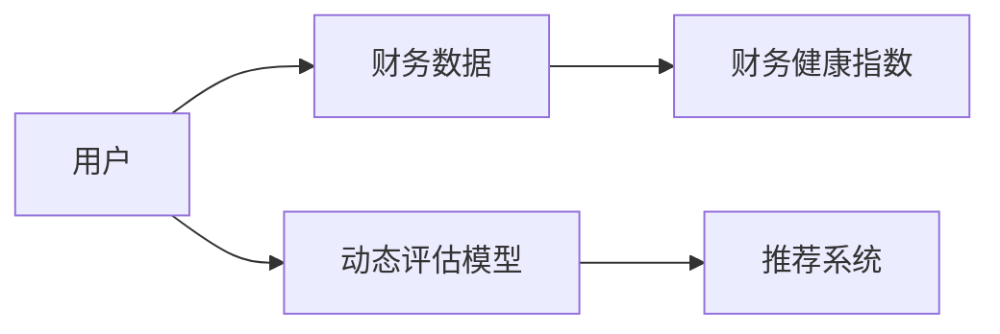
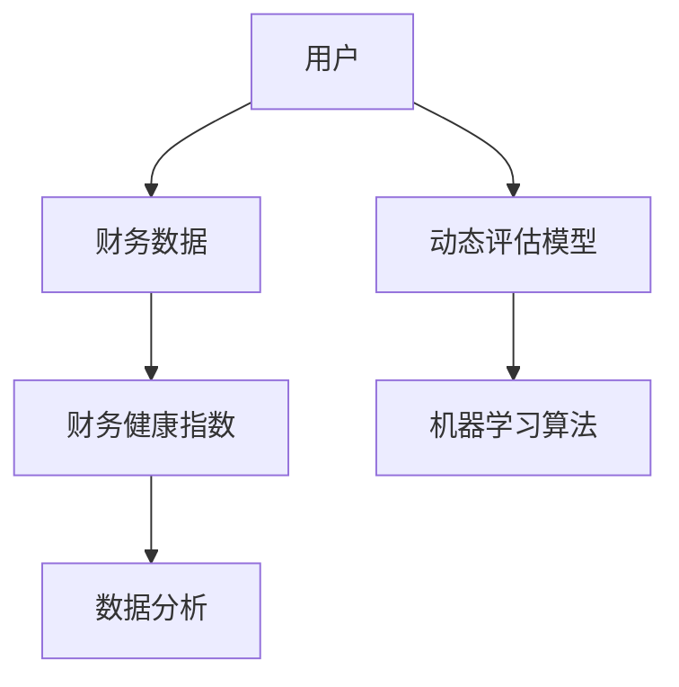
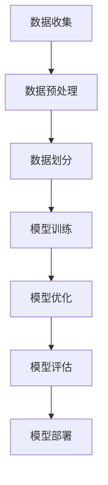
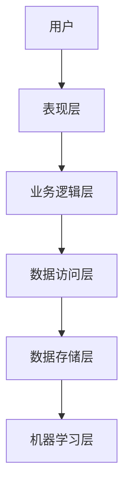
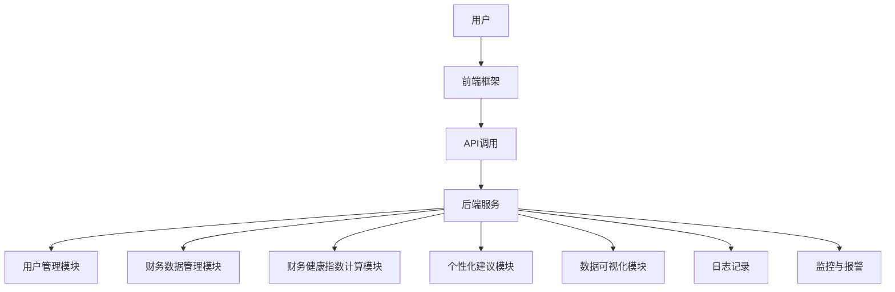

                 

### 引言与背景

#### 1.1 引言

在当前数字化时代，人工智能（AI）技术迅速发展，已经渗透到社会的各个领域。特别是在个人财务管理方面，AI的应用带来了前所未有的变革。本文将探讨一种基于AI的个人财务健康指数动态评估系统。该系统不仅能够实时监测用户的财务健康状况，还能根据用户的行为数据和历史数据，提供个性化的财务建议。

选择这个主题的原因主要有以下几点：

1. **财务健康的重要性**：财务健康是个人生活质量和幸福感的基石。然而，当前许多人对自己的财务状况缺乏全面的了解，难以做出明智的财务决策。

2. **AI技术的进步**：随着AI技术的不断发展，尤其是机器学习和深度学习的应用，为处理复杂的财务数据提供了强大的工具。

3. **动态评估的需求**：传统的财务评估方法往往基于固定的指标和模型，无法及时反映用户的财务状况变化。动态评估系统能够更准确地预测和评估用户的财务健康。

#### 1.2 财务健康指数概述

财务健康指数（Financial Health Index, FHI）是一个用于衡量个人或家庭财务状况的综合指标。它通常包括多个方面，如收入水平、支出情况、储蓄率、债务水平、投资回报率等。一个良好的财务健康指数意味着个人或家庭具有稳定的收入来源、健康的支出习惯、充足的储蓄和投资能力。

#### 1.3 动态评估的需求与挑战

动态评估系统能够实时跟踪用户的财务行为，及时调整评估结果和财务建议。这种实时性对于财务决策尤为重要。然而，实现动态评估也面临着以下几个挑战：

1. **数据多样性**：财务数据包括各种类型，如交易记录、账单信息、投资记录等，如何有效整合和处理这些数据是关键。

2. **实时性**：确保系统能够快速响应，提供最新的财务健康评估结果。

3. **准确性**：动态评估系统的评估结果必须准确，以便为用户做出正确的财务决策提供依据。

4. **个性化**：每个用户的财务状况和行为模式都有所不同，系统需要能够根据用户的个人特征进行个性化评估。

#### 1.4 核心概念与联系

本文的核心概念包括AI、财务健康指数、动态评估、数据预处理、机器学习模型等。这些概念相互联系，构成了动态评估系统的理论基础。

- **AI**：作为核心技术，AI为系统提供了强大的数据处理和分析能力。
- **财务健康指数**：是系统评估用户财务状况的核心指标。
- **动态评估**：确保系统能够实时、准确地反映用户的财务状况变化。
- **数据预处理**：是确保输入数据质量和系统性能的重要环节。
- **机器学习模型**：用于构建动态评估的核心算法，能够根据历史数据预测未来的财务状况。

#### 1.5 边界与外延

本文的研究边界主要包括：

1. **评估范围**：主要针对个人层面的财务健康状况。
2. **目标人群**：主要面向需要管理个人财务的成年人。
3. **评估指标体系**：根据目标人群的特点，设计了一套综合的评估指标体系。
4. **实时性与准确性**：系统设计要求具备高实时性和高准确性，以满足用户需求。

通过本文的研究，旨在为开发高效、准确的个人财务健康指数动态评估系统提供理论依据和实践指导。

#### 1.6 本章小结

本章介绍了本文的研究背景、目的和重要性，概述了财务健康指数的概念，阐述了动态评估系统的需求与挑战，并明确了核心概念和边界。接下来，本文将深入探讨AI的基础知识、财务数据分析方法、动态评估模型构建，以及系统的设计与实现，为构建一个高效、准确的个人财务健康指数动态评估系统奠定基础。

----------------------------------------------------------------

## 1.2 背景介绍

#### 1.2.1 人工智能在财务领域的应用现状

人工智能（AI）作为近年来最具变革性的技术之一，已经在各个领域展现了其强大的能力。在财务领域，AI的应用正在迅速拓展，为金融机构和普通用户带来了许多便利和革新。

首先，AI在金融机构中的应用主要体现在以下几个方面：

1. **风险管理**：AI可以通过大数据分析和机器学习算法，识别潜在的风险因素，预测市场波动，从而帮助金融机构更好地管理风险。例如，利用AI进行信贷风险评估，可以显著降低违约率。

2. **投资决策**：AI可以分析大量的历史数据和市场信息，为投资者提供更加科学的投资建议。例如，量化交易策略利用AI算法，能够实时捕捉市场变化，实现高收益。

3. **客服服务**：AI驱动的智能客服系统能够自动处理客户的咨询和投诉，提高服务效率。例如，通过自然语言处理（NLP）技术，AI可以理解并回答客户的提问，提供个性化的解决方案。

4. **智能投顾**：智能投顾通过AI技术，根据用户的风险偏好和财务目标，提供个性化的投资组合管理服务。与传统投顾相比，智能投顾能够提供24/7的服务，同时降低成本。

其次，AI在个人财务管理中的应用也在逐步普及：

1. **财务规划**：AI可以分析用户的财务数据，帮助用户制定个性化的财务规划。例如，预测未来的财务状况，制定储蓄目标和投资计划。

2. **支出管理**：AI可以通过智能分析用户的消费行为，提供支出管理建议。例如，通过机器学习算法，AI可以识别用户的消费习惯，自动分类并标记不必要的开支，帮助用户控制预算。

3. **风险管理**：AI可以实时监测用户的财务状况，及时发现潜在的风险。例如，当用户的支出超过预期时，AI可以发送警报，提醒用户注意财务状况。

4. **个性化理财**：AI可以根据用户的财务数据和风险偏好，提供个性化的理财方案。例如，通过分析用户的投资历史和收益情况，AI可以推荐最适合的投资产品。

#### 1.2.2 个人财务健康问题的复杂性

个人财务健康问题具有显著的复杂性，主要表现在以下几个方面：

1. **数据多样性**：个人财务数据包括收入、支出、储蓄、投资等多个方面，每种数据类型都有其独特的特点和复杂性。例如，收入数据可能包括工资、奖金、投资收益等，而支出数据可能包括日常消费、房贷、车贷等。

2. **数据时效性**：财务数据的时效性对评估结果具有重要影响。例如，一个月前的收入和支出数据可能已经无法准确反映当前的财务状况。

3. **数据质量**：财务数据的准确性对评估结果至关重要。然而，在实际应用中，数据质量往往难以保证，存在缺失、错误和噪声等问题。

4. **行为模式**：个人财务行为具有高度个性化，不同用户的消费习惯和投资偏好各不相同。这使得在构建评估模型时，需要充分考虑用户的个体差异。

5. **外部因素**：个人财务健康受到许多外部因素的影响，如市场波动、政策变化、经济形势等。这些因素使得财务健康状况难以预测和控制。

#### 1.2.3 动态评估的技术基础

动态评估系统需要依赖于一系列先进的技术手段，以确保系统能够实时、准确地评估用户的财务健康状况。以下是动态评估系统的技术基础：

1. **大数据技术**：大数据技术能够处理和分析海量的财务数据，为动态评估提供数据支持。通过分布式计算和存储技术，大数据系统能够高效地处理复杂的财务数据。

2. **机器学习算法**：机器学习算法是动态评估系统的核心。通过训练模型，机器学习算法可以从历史数据中学习并预测未来的财务状况。常用的机器学习算法包括线性回归、决策树、支持向量机、神经网络等。

3. **自然语言处理（NLP）**：NLP技术能够处理和理解文本数据，为动态评估系统提供语义分析功能。例如，通过NLP技术，系统可以分析用户在社交媒体上的财务言论，了解其财务状况和需求。

4. **实时数据处理**：实时数据处理技术能够确保动态评估系统能够及时响应用户的行为变化，提供最新的评估结果。实时数据处理技术包括流处理、微服务架构等。

5. **数据可视化**：数据可视化技术能够将复杂的财务数据以直观的方式呈现给用户，帮助用户更好地理解自己的财务状况。常用的数据可视化工具包括Tableau、Power BI等。

#### 1.3 核心概念

在本文中，我们将介绍以下几个核心概念：

1. **财务健康指数（FHI）**：财务健康指数是评估个人或家庭财务健康状况的核心指标，包括收入水平、支出情况、储蓄率、债务水平等多个方面。

2. **动态评估模型**：动态评估模型是用于实时评估用户财务状况的算法模型，通过机器学习算法从历史数据中学习并预测未来的财务状况。

3. **数据预处理**：数据预处理是确保输入数据质量和系统性能的重要环节，包括数据清洗、数据转换、特征提取等步骤。

4. **个性化推荐**：个性化推荐是基于用户的历史数据和偏好，为用户推荐最适合的财务建议和产品。

5. **实时数据处理**：实时数据处理技术确保动态评估系统能够及时响应用户的行为变化，提供最新的评估结果。

#### 1.4 概念属性特征对比表格

| 概念         | 属性特征                                                     |
| ------------ | ------------------------------------------------------------ |
| 财务健康指数  | - 收入水平<br>- 支出情况<br>- 储蓄率<br>- 债务水平<br>- 投资回报率 |
| 动态评估模型  | - 数据来源<br>- 特征工程<br>- 预测模型<br>- 优化策略             |
| 数据预处理    | - 数据清洗<br>- 数据转换<br>- 特征提取<br>- 数据标准化           |
| 个性化推荐    | - 用户历史数据<br>- 用户偏好分析<br>- 推荐算法<br>- 推荐结果       |
| 实时数据处理  | - 数据流处理<br>- 实时反馈<br>- 数据同步<br>- 数据存储           |

#### 1.5 ER实体关系图



#### 1.6 本章小结

本章介绍了人工智能在财务领域的应用现状，阐述了个人财务健康问题的复杂性，并讨论了动态评估系统的技术基础。通过对比核心概念的属性特征，我们为后续章节的深入讨论奠定了基础。接下来，我们将进一步探讨财务健康指数的概念、动态评估的方法论和相关技术。

----------------------------------------------------------------

## 1.3 核心概念

#### 1.3.1 财务健康指数（FHI）

财务健康指数（Financial Health Index, FHI）是用于衡量个人或家庭财务健康状况的核心指标。它通过综合评估用户的收入、支出、储蓄、债务水平等多个方面，反映用户的财务状况是否健康。一个良好的财务健康指数意味着用户具备稳定的收入来源、健康的支出习惯、充足的储蓄和投资能力。

FHI通常包括以下关键指标：

1. **收入水平**：用户的收入水平是评估其财务健康的重要指标。稳定的收入能够保障日常生活的需要，并为未来的储蓄和投资提供资金支持。

2. **支出情况**：用户的支出情况包括日常消费、房贷、车贷等。合理的支出结构能够反映用户的财务规划和消费习惯。

3. **储蓄率**：储蓄率是衡量用户储蓄能力的重要指标。较高的储蓄率意味着用户具备良好的财务规划和未来抗风险能力。

4. **债务水平**：用户的债务水平包括信用卡债务、房贷、车贷等。适度的债务水平能够促进消费和投资，但过高的债务水平则可能威胁到财务健康。

5. **投资回报率**：投资回报率是评估用户投资收益的重要指标。良好的投资回报率能够为用户带来额外的收入和财富增值。

#### 1.3.2 动态评估的方法论

动态评估的方法论是指利用AI技术，对用户的财务状况进行实时监测和评估的体系。动态评估的核心目标是通过不断更新和优化评估模型，提供准确、及时的财务健康指数。

1. **数据收集与整合**：动态评估的第一步是收集用户的财务数据，包括收入、支出、储蓄、投资等。这些数据可以来源于用户的银行账户、信用卡记录、投资账户等。通过数据整合，系统可以构建一个全面的财务数据视图。

2. **数据预处理**：财务数据通常存在缺失、错误和不一致的问题。数据预处理包括数据清洗、数据转换和特征提取，以确保数据质量和系统性能。数据清洗可以去除重复数据、缺失数据和异常数据；数据转换包括数据归一化和标准化；特征提取则是从原始数据中提取出对评估模型有价值的特征。

3. **模型训练与优化**：动态评估的核心是构建机器学习模型，通过历史数据训练模型，使其能够预测未来的财务状况。常用的机器学习算法包括线性回归、决策树、支持向量机、神经网络等。模型的优化包括参数调整、交叉验证和超参数优化等，以提高模型的准确性和泛化能力。

4. **实时监测与反馈**：动态评估系统需要具备实时监测功能，及时更新用户的财务数据，并重新评估财务健康指数。通过实时监测，系统可以及时发现用户财务状况的变化，并提供相应的财务建议。

5. **个性化推荐**：基于用户的财务健康指数和个性化偏好，动态评估系统可以为用户提供个性化的财务建议和投资方案。例如，对于储蓄率较低的用户，系统可以推荐增加储蓄的理财产品。

#### 1.3.3 相关技术的联系与区别

在构建动态评估系统时，需要整合多种相关技术，包括大数据技术、机器学习、自然语言处理（NLP）和实时数据处理等。以下是这些技术的联系与区别：

1. **大数据技术**：大数据技术是动态评估系统的数据基础。它能够处理和分析海量的财务数据，为系统提供丰富的数据资源。大数据技术的核心包括数据存储、数据分析和数据可视化。

2. **机器学习**：机器学习是动态评估系统的核心算法，用于构建预测模型和评估财务健康指数。机器学习包括监督学习、无监督学习和强化学习等不同类型，每种类型都有其适用的场景。

3. **自然语言处理（NLP）**：NLP技术用于处理和理解文本数据，为动态评估系统提供语义分析功能。例如，通过NLP技术，系统可以分析用户在社交媒体上的财务言论，了解其财务状况和需求。

4. **实时数据处理**：实时数据处理技术确保动态评估系统能够及时响应用户的行为变化，提供最新的评估结果。实时数据处理包括流处理、微服务架构等技术。

这些技术的联系在于它们共同构成了动态评估系统的技术基础，相互协作，实现实时、准确的财务健康评估。区别在于每种技术具有不同的功能和特点，适用于不同的应用场景。

#### 1.4 边界与外延

在本文的研究中，动态评估系统的边界主要涉及以下几个方面：

1. **评估范围**：系统主要针对个人层面的财务健康状况进行评估，不包括企业和组织。

2. **目标人群**：系统主要面向需要管理个人财务的成年人，尤其是那些对自己的财务状况缺乏全面了解的用户。

3. **评估指标体系**：系统设计的评估指标体系将包括收入水平、支出情况、储蓄率、债务水平和投资回报率等关键指标。

4. **实时性与准确性**：系统设计要求具备高实时性和高准确性，以满足用户对最新、最准确的财务健康评估结果的需求。

通过明确这些边界与外延，本文的研究将为开发高效、准确的个人财务健康指数动态评估系统提供清晰的指导。

#### 1.5 本章小结

本章详细介绍了财务健康指数（FHI）的概念、动态评估的方法论和相关技术。通过对比核心概念的属性特征和ER实体关系图，我们为后续章节的深入讨论奠定了基础。接下来，本文将探讨算法原理、系统设计与实现等关键内容，为构建一个高效、准确的个人财务健康指数动态评估系统提供全面的技术指南。

----------------------------------------------------------------

## 1.4 核心概念与联系

在构建AI驱动的个人财务健康指数动态评估系统中，核心概念及其相互联系是确保系统有效性和实用性的关键。以下是本文的核心概念及其相互联系：

#### 财务健康指数（FHI）

财务健康指数（Financial Health Index, FHI）是本文的核心概念之一，它用于衡量个人或家庭的财务健康状况。FHI涵盖了多个关键指标，如收入水平、支出情况、储蓄率、债务水平和投资回报率等。这些指标共同构成了评估个人财务状况的基础。

#### 动态评估模型

动态评估模型是用于实时监测和评估用户财务健康状况的算法模型。该模型通过机器学习算法从历史数据中学习，并预测未来的财务状况。动态评估模型的核心在于其实时性和准确性，它能够根据用户的财务行为和历史数据，提供及时和准确的财务健康评估。

#### 数据预处理

数据预处理是确保系统输入数据质量和系统性能的重要环节。数据预处理包括数据清洗、数据转换和特征提取等步骤。数据清洗可以去除缺失值、重复值和异常值；数据转换包括归一化和标准化，以便模型能够有效处理不同的数据类型；特征提取则是从原始数据中提取出对评估模型有价值的特征。

#### 个性化推荐

个性化推荐是基于用户的历史数据和偏好，为用户推荐最适合的财务建议和产品。个性化推荐系统利用机器学习算法，分析用户的财务行为和偏好，提供个性化的理财建议，如增加储蓄、优化投资组合或减少不必要的支出。

#### 实时数据处理

实时数据处理是动态评估系统的核心技术之一，它确保系统能够及时响应用户的行为变化，提供最新的评估结果。实时数据处理包括流处理、数据同步和实时反馈等技术，使得系统能够在数据发生变化时迅速做出反应。

#### 核心概念的联系

这些核心概念之间存在着紧密的联系，共同构成了动态评估系统的框架：

1. **财务健康指数（FHI）** 与 **动态评估模型** 相关联。FHI为动态评估模型提供了评估的基准和目标，而动态评估模型则通过机器学习算法，对FHI进行实时计算和更新。

2. **数据预处理** 是动态评估模型的基础。通过数据预处理，系统能够获取高质量的数据，为动态评估模型提供可靠的数据支持。

3. **个性化推荐** 基于 **动态评估模型** 的输出结果，结合用户的偏好和历史数据，为用户提供个性化的财务建议。

4. **实时数据处理** 确保了系统能够及时更新用户的财务健康指数，并快速响应用户的行为变化。

#### 概念属性特征对比表格

以下是各个核心概念的属性特征对比表格，帮助读者更好地理解这些概念之间的差异和联系：

| 概念                   | 属性特征                                                     |
|------------------------|------------------------------------------------------------|
| 财务健康指数（FHI）    | - 收入水平<br>- 支出情况<br>- 储蓄率<br>- 债务水平<br>- 投资回报率 |
| 动态评估模型          | - 数据来源<br>- 特征工程<br>- 预测模型<br>- 优化策略             |
| 数据预处理             | - 数据清洗<br>- 数据转换<br>- 特征提取<br>- 数据标准化           |
| 个性化推荐             | - 用户历史数据<br>- 用户偏好分析<br>- 推荐算法<br>- 推荐结果       |
| 实时数据处理           | - 数据流处理<br>- 实时反馈<br>- 数据同步<br>- 数据存储           |

#### ER实体关系图

以下是动态评估系统的ER实体关系图，展示了各个核心概念之间的联系：


在这个ER实体关系图中，用户是系统的核心实体，财务数据、动态评估模型和财务健康指数都与用户相关联。推荐系统则基于动态评估模型的输出结果，为用户提供个性化的财务建议。

通过上述核心概念及其相互联系的详细探讨，我们为后续章节的深入讨论奠定了基础。接下来，本文将介绍AI的基础知识、财务数据分析方法、动态评估模型的构建和优化策略，以及系统的设计与实现，为构建一个高效、准确的个人财务健康指数动态评估系统提供全面的技术指南。

----------------------------------------------------------------

## 1.5 边界与外延

在构建AI驱动的个人财务健康指数动态评估系统时，我们需要明确系统的边界与外延，以确保研究的针对性和系统的适用性。

#### 1.5.1 评估范围

本文的研究主要关注个人层面的财务健康状况评估，不包括企业或组织的财务健康评估。个人财务健康指数（FHI）涉及收入水平、支出情况、储蓄率、债务水平和投资回报率等多个指标，这些指标能够全面反映个人的财务状况。

#### 1.5.2 目标人群

系统的目标人群主要是那些需要管理个人财务的成年人，特别是那些对自身财务状况缺乏全面了解的用户。这些用户可能面临财务规划、支出管理、债务控制和投资决策等方面的挑战，通过动态评估系统，他们能够获得更加准确的财务健康评估和个性化建议。

#### 1.5.3 评估指标体系

本文设计的评估指标体系包括以下关键指标：

1. **收入水平**：衡量用户的总收入，包括工资、奖金、投资收益等。
2. **支出情况**：涵盖日常消费、房贷、车贷、教育支出等。
3. **储蓄率**：计算用户的储蓄占比，反映其储蓄习惯和财务规划能力。
4. **债务水平**：衡量用户的债务总额，包括信用卡债务、贷款等。
5. **投资回报率**：评估用户的投资收益情况，包括股票、基金、债券等。

通过这些指标，系统能够全面评估用户的财务健康状况，并提供相应的财务建议。

#### 1.5.4 实时性与准确性

系统的实时性是其核心要求之一。动态评估系统需要能够实时监测用户的财务数据，及时更新财务健康指数，以便为用户做出实时决策提供支持。为此，系统采用了大数据和实时数据处理技术，确保系统能够高效地处理海量数据，并提供最新的评估结果。

准确性的要求同样重要。系统需要确保评估结果的准确，以便为用户制定正确的财务规划和建议。为此，系统在数据预处理、模型训练和评估过程中采用了多种优化策略，如数据清洗、特征提取、交叉验证和超参数优化等，以提高模型的准确性和泛化能力。

#### 1.5.5 边界设定

在边界设定方面，本文主要考虑以下几个方面：

1. **数据来源**：系统主要依赖于用户的银行账户记录、信用卡交易记录、投资账户记录等内部数据。外部数据如市场行情、经济指标等可能会影响财务评估，但在本文的研究中，我们主要关注内部数据的处理和分析。
2. **数据量**：系统需要处理的数据量巨大，特别是当用户历史数据较长时。为了提高系统的性能和可扩展性，系统采用了分布式计算和存储技术，确保系统能够高效地处理海量数据。
3. **技术实现**：系统采用了多种AI技术和机器学习算法，如线性回归、决策树、神经网络等，以确保评估结果的准确性和实时性。

通过明确系统的边界与外延，本文的研究为构建一个高效、准确的个人财务健康指数动态评估系统提供了清晰的指导。接下来，本文将深入探讨AI技术、财务数据分析方法、动态评估模型的构建和优化策略，以及系统的设计与实现，为系统的高效运行奠定基础。

#### 1.6 本章小结

本章介绍了AI驱动的个人财务健康指数动态评估系统的核心概念、边界与外延。通过对财务健康指数、动态评估模型、数据预处理、个性化推荐和实时数据处理等核心概念的详细分析，我们明确了系统的研究范围和目标人群。同时，通过设定合理的边界，确保了系统的准确性和实时性。接下来，本章将为系统设计与实现提供详细的技术方案，确保系统能够高效、准确地运行。

----------------------------------------------------------------

## 1.6 本章小结

本章详细介绍了AI驱动的个人财务健康指数动态评估系统的核心概念、边界与外延。首先，我们探讨了财务健康指数（FHI）的定义、构成及其重要性。接着，通过分析人工智能在财务领域的应用现状，我们明确了动态评估系统的需求与挑战。随后，我们介绍了核心概念之间的联系，包括财务健康指数、动态评估模型、数据预处理、个性化推荐和实时数据处理等。同时，明确了系统的评估范围、目标人群和评估指标体系，并强调了实时性与准确性的关键性。最后，我们设定了系统的边界，确保了研究的针对性和可行性。

通过本章的讨论，我们为构建一个高效、准确的个人财务健康指数动态评估系统奠定了理论基础。接下来，本文将深入探讨AI技术、财务数据分析方法、动态评估模型的构建与优化策略，以及系统的设计与实现，为系统的高效运行提供技术保障。

----------------------------------------------------------------

## 2.1 AI基础

#### 2.1.1 人工智能的概述

人工智能（Artificial Intelligence, AI）是计算机科学的一个分支，旨在开发能够模拟、扩展和辅助人类智能的系统。AI系统通过学习、推理、感知和适应等方式，完成特定的任务，从而实现智能化。

AI的发展历程可以分为三个阶段：

1. **符号人工智能**：早期的人工智能主要依赖于逻辑推理和符号计算。这一阶段的主要目标是构建能够模拟人类思维过程的系统，例如专家系统和逻辑推理机。

2. **统计人工智能**：随着大数据和计算技术的发展，统计人工智能逐渐崛起。这一阶段的人工智能系统主要依赖机器学习和深度学习算法，通过从大量数据中学习规律和模式，完成复杂任务。

3. **强化人工智能**：强化学习是近年来AI研究的热点之一。通过不断尝试和反馈，强化学习系统能够在动态环境中进行学习和决策，实现高度智能化的行为。

#### 2.1.2 机器学习基础

机器学习（Machine Learning, ML）是AI的核心组成部分，旨在通过数据驱动的方式，使计算机系统能够从经验中学习并做出决策。机器学习分为监督学习、无监督学习和强化学习三种主要类型：

1. **监督学习**：监督学习是机器学习中最为常见的一种类型，通过已标记的数据训练模型，从而在新的数据上做出预测。常见的监督学习算法包括线性回归、逻辑回归、决策树、随机森林和支持向量机等。

2. **无监督学习**：无监督学习不依赖于已标记的数据，主要目的是发现数据中的结构和模式。常见的无监督学习算法包括聚类算法（如K均值聚类、层次聚类）和降维算法（如主成分分析、t-SNE）。

3. **强化学习**：强化学习是一种通过奖励和惩罚机制，使系统在动态环境中不断学习和优化的方法。常见的强化学习算法包括Q学习、SARSA和深度强化学习（如DQN、DDPG）。

#### 2.1.3 深度学习原理

深度学习（Deep Learning, DL）是机器学习的一个分支，主要依赖于神经网络，尤其是多层神经网络（深度神经网络）来实现复杂的模式识别和预测任务。深度学习的基本原理包括：

1. **神经网络**：神经网络是由大量简单单元（神经元）互联组成的复杂网络。每个神经元接收多个输入，通过激活函数处理后输出一个值。通过多次叠加，神经网络能够捕捉到输入数据的复杂模式。

2. **多层神经网络**：深度神经网络由多个层次组成，包括输入层、隐藏层和输出层。每一层的神经元都对前一层的信息进行处理和转换，使得神经网络能够逐步提取数据的特征。

3. **反向传播算法**：反向传播（Backpropagation）算法是深度学习训练的核心算法。通过反向传播算法，神经网络能够计算损失函数关于每个神经元的梯度，从而更新网络的权重，优化模型。

4. **激活函数**：激活函数是神经网络中一个关键的部分，用于引入非线性特性。常见的激活函数包括Sigmoid、ReLU和Tanh等。

#### 2.1.4 机器学习与深度学习的区别

虽然机器学习和深度学习都是AI的重要分支，但两者在应用场景、方法和复杂性上有所不同：

1. **应用场景**：机器学习适用于各种类型的数据分析任务，如分类、回归、聚类等。深度学习则更适用于处理大规模、高维度和复杂模式的数据，如图像识别、语音识别和自然语言处理等。

2. **方法**：机器学习主要依赖于统计模型和特征工程，通过已标记的数据训练模型。深度学习则依赖于神经网络，通过自动学习数据中的特征表示，无需手动提取特征。

3. **复杂性**：深度学习模型通常包含大量的参数和多层结构，训练时间较长，计算资源需求较高。机器学习模型则相对简单，计算效率较高。

#### 2.1.5 人工智能在财务领域的应用

人工智能在财务领域的应用广泛，包括以下几个方面：

1. **风险管理**：利用机器学习和深度学习算法，分析市场数据和历史交易记录，预测市场风险和投资风险。

2. **投资决策**：通过分析大量历史数据和市场信息，人工智能可以提供科学、合理的投资建议，辅助投资者做出决策。

3. **智能投顾**：智能投顾系统利用机器学习算法，根据用户的风险偏好和财务目标，提供个性化的投资组合管理服务。

4. **财务管理**：人工智能可以自动处理用户的财务数据，如收入、支出、储蓄等，提供财务管理建议，帮助用户更好地管理个人财务。

5. **客户服务**：利用自然语言处理（NLP）技术，人工智能可以模拟人类客服，提供24/7的在线客户服务。

通过AI技术，财务领域能够实现自动化、智能化和高效化，为金融机构和用户提供更优质的金融服务。

#### 2.1.6 本章小结

本章介绍了人工智能的基本概念、机器学习和深度学习的基础知识，以及人工智能在财务领域的应用。通过对这些内容的讨论，我们为理解AI驱动的个人财务健康指数动态评估系统提供了必要的技术背景。接下来，本章将探讨财务数据分析的方法和动态评估模型的构建与优化策略。

----------------------------------------------------------------

## 2.2 财务数据分析

#### 2.2.1 财务数据的类型与来源

财务数据是评估个人或家庭财务状况的基础，其类型和来源多种多样。以下是财务数据的主要类型及其来源：

1. **银行账户数据**：包括储蓄账户、支票账户、信用卡账户等。这些数据通常来源于银行流水记录，涵盖用户的收入、支出、转账等交易信息。

2. **投资账户数据**：包括股票、基金、债券、保险等投资产品的交易记录。这些数据来源于证券公司和保险公司，涵盖用户的投资收益、亏损、买卖记录等。

3. **信用记录**：包括信用评分、信用报告等，反映用户的信用状况和还款能力。这些数据通常来源于信用评级机构和金融机构。

4. **税务记录**：包括个人所得税、财产税、企业税等税务记录。这些数据来源于税务机关，涵盖用户的收入、支出、税收等财务信息。

5. **消费记录**：包括日常消费、购物、餐饮、旅游等消费行为。这些数据来源于信用卡、购物平台、电子钱包等消费渠道。

6. **其他财务信息**：包括房屋贷款、车贷、教育支出、医疗费用等。这些数据来源于相关金融机构和公共服务机构。

#### 2.2.2 数据预处理技术

数据预处理是确保财务数据质量和系统性能的重要环节。以下是常用的数据预处理技术：

1. **数据清洗**：数据清洗包括去除重复记录、处理缺失值、纠正错误数据等。通过数据清洗，可以确保数据的一致性和准确性。

2. **数据转换**：数据转换包括数据归一化、标准化、编码等。通过数据转换，可以统一数据格式，便于后续处理。

3. **特征提取**：特征提取是从原始数据中提取出对评估模型有价值的特征。例如，可以从银行账户数据中提取出储蓄率、支出比例等特征。

4. **数据降维**：数据降维是通过减少数据维度，降低数据复杂度，提高模型训练效率。常用的降维方法包括主成分分析（PCA）、线性判别分析（LDA）等。

5. **异常值检测**：异常值检测是识别数据中的异常点，如异常交易、异常消费等。通过异常值检测，可以排除异常数据对模型训练的影响。

6. **数据可视化**：数据可视化是将数据以图形化方式展示，帮助分析人员理解数据的分布和趋势。常用的数据可视化工具包括Tableau、Matplotlib等。

#### 2.2.3 数据分析的基本方法

财务数据分析主要包括描述性分析、预测分析和比较分析等基本方法：

1. **描述性分析**：描述性分析用于描述数据的特征和趋势。例如，通过计算平均值、中位数、标准差等统计指标，了解数据的集中趋势和离散程度。

2. **预测分析**：预测分析是基于历史数据，预测未来的财务状况。常用的预测方法包括时间序列分析、回归分析、机器学习等。

3. **比较分析**：比较分析用于比较不同时间段、不同用户或不同类别的财务数据，识别差异和趋势。例如，通过对比不同月份的支出情况，识别消费习惯的变化。

#### 2.2.4 数据预处理与数据分析的关系

数据预处理和数据分析是相辅相成的，数据预处理为数据分析提供了高质量的数据基础。数据预处理不仅能够提高模型的准确性和鲁棒性，还能够减少计算资源的消耗。

通过合理的数据预处理，可以降低数据噪声、减少异常值、提高数据的一致性和完整性，从而提高数据分析的效果。同时，数据分析结果可以为数据预处理提供反馈，进一步优化数据预处理策略。

#### 2.2.5 本章小结

本章详细介绍了财务数据的类型与来源，以及数据预处理技术和数据分析的基本方法。通过这些内容的讨论，我们为构建AI驱动的个人财务健康指数动态评估系统提供了必要的数据处理和分析技术。接下来，本章将探讨动态评估模型的构建与优化策略。

----------------------------------------------------------------

## 2.3 动态评估模型

#### 2.3.1 动态评估模型的构建

动态评估模型是AI驱动的个人财务健康指数动态评估系统的核心组成部分。该模型的构建过程主要包括以下几个关键步骤：

1. **数据收集**：首先，需要收集与个人财务健康状况相关的数据，包括银行账户数据、投资账户数据、信用记录、消费记录等。这些数据可以来源于用户的银行账户、投资账户、信用卡记录等内部数据源，也可以来源于税务机关、信用评级机构等外部数据源。

2. **数据预处理**：收集到的原始数据通常存在缺失值、异常值、噪声等问题，因此需要通过数据清洗、数据转换和特征提取等预处理技术，提高数据的质量和一致性。具体包括：
   - 数据清洗：去除重复数据、处理缺失值、纠正错误数据等。
   - 数据转换：归一化、标准化、编码等，统一数据格式。
   - 特征提取：从原始数据中提取出对评估模型有价值的特征，如收入水平、支出情况、储蓄率、债务水平、投资回报率等。

3. **数据划分**：将预处理后的数据划分为训练集、验证集和测试集。通常，训练集用于模型训练，验证集用于模型优化和调参，测试集用于模型评估。

4. **模型选择**：选择合适的机器学习算法构建动态评估模型。常见的机器学习算法包括线性回归、逻辑回归、决策树、随机森林、支持向量机、神经网络等。选择算法时需要考虑数据的类型、规模和特征等因素。

5. **模型训练**：使用训练集对选定的机器学习算法进行训练，通过调整模型参数，使模型能够拟合数据，从而预测用户未来的财务状况。

6. **模型评估**：使用验证集对训练好的模型进行评估，通过计算模型的准确率、召回率、F1分数等指标，评估模型的性能。如果模型性能不佳，需要返回步骤4，重新选择或调整模型。

7. **模型部署**：将训练好的模型部署到生产环境中，使其能够实时监测和评估用户的财务健康状况。部署过程包括模型上线、监控和更新等环节。

#### 2.3.2 常用评估指标

在动态评估模型的评估过程中，常用的评估指标包括准确率、召回率、F1分数、均方误差（MSE）等。以下是这些指标的定义和计算方法：

1. **准确率（Accuracy）**：准确率是评估模型预测正确率的指标，计算公式为：
   \[
   \text{准确率} = \frac{\text{预测正确数}}{\text{总预测数}}
   \]
   准确率越高，表示模型对样本的预测结果越准确。

2. **召回率（Recall）**：召回率是评估模型对正类样本预测正确的能力，计算公式为：
   \[
   \text{召回率} = \frac{\text{预测正确数}}{\text{实际正类数}}
   \]
   召回率越高，表示模型对正类样本的预测越敏感。

3. **F1分数（F1 Score）**：F1分数是综合考虑准确率和召回率的综合指标，计算公式为：
   \[
   \text{F1分数} = 2 \times \frac{\text{准确率} \times \text{召回率}}{\text{准确率} + \text{召回率}}
   \]
   F1分数越高，表示模型的性能越好。

4. **均方误差（MSE）**：均方误差是回归问题中评估模型预测值与真实值之间差异的指标，计算公式为：
   \[
   \text{MSE} = \frac{1}{n} \sum_{i=1}^{n} (\hat{y_i} - y_i)^2
   \]
   其中，\(\hat{y_i}\) 是第 \(i\) 个预测值，\(y_i\) 是第 \(i\) 个真实值，\(n\) 是样本数量。

#### 2.3.3 模型优化的策略

为了提高动态评估模型的性能，可以采用以下几种模型优化策略：

1. **特征选择**：通过特征选择技术，从原始特征中筛选出对模型性能有显著影响的特征，减少特征维度，提高模型训练效率。

2. **正则化**：通过正则化技术，如L1正则化和L2正则化，限制模型参数的规模，防止过拟合。

3. **交叉验证**：通过交叉验证技术，将数据划分为多个子集，轮流使用每个子集作为验证集，训练和评估模型，提高模型泛化能力。

4. **超参数调整**：通过调整模型超参数，如学习率、迭代次数、隐藏层神经元数量等，优化模型性能。

5. **集成学习**：通过集成学习技术，如随机森林、提升树等，将多个模型集成起来，提高预测性能。

6. **模型解释**：通过模型解释技术，如SHAP值、LIME等，理解模型预测的依据，优化模型结构和参数。

#### 2.3.4 本章小结

本章详细介绍了动态评估模型的构建过程，包括数据收集、数据预处理、模型选择、模型训练和模型评估等关键步骤。同时，探讨了常用的评估指标和模型优化策略。通过这些内容的学习，读者可以更好地理解如何构建一个高效、准确的动态评估模型，为个人财务健康指数动态评估系统的实现提供技术支持。

----------------------------------------------------------------

## 2.4 概念属性特征对比表格

为了更好地理解本章中讨论的核心概念，下面提供了各概念属性特征的对比表格。通过对比，可以清晰地看到各个概念的区别与联系。

| 概念       | 属性特征                                                         |
| ---------- | ------------------------------------------------------------ |
| 人工智能   | - 模拟人类智能<br>- 学习能力<br>- 推理能力<br>- 感知能力 |
| 财务健康指数 | - 收入水平<br>- 支出情况<br>- 储蓄率<br>- 债务水平<br>- 投资回报率 |
| 数据预处理  | - 数据清洗<br>- 数据转换<br>- 特征提取<br>- 数据标准化       |
| 动态评估模型 | - 数据来源<br>- 特征工程<br>- 预测模型<br>- 优化策略             |
| 数据分析    | - 描述性分析<br>- 预测分析<br>- 比较分析<br>- 特征工程           |
| 机器学习    | - 监督学习<br>- 无监督学习<br>- 强化学习<br>- 神经网络            |
| 深度学习    | - 多层神经网络<br>- 反向传播算法<br>- 激活函数<br>- 自动特征提取      |

通过这张表格，读者可以更直观地理解各个概念的核心属性特征，以及它们之间的联系。

#### 2.5 ER实体关系图

以下是本章讨论的核心概念之间的ER实体关系图，使用Mermaid语法表示：



在这个ER实体关系图中，用户是核心实体，其财务数据用于构建财务健康指数，同时作为输入传递给动态评估模型。动态评估模型通过机器学习算法进行分析，最终产生数据分析结果。

#### 2.6 本章小结

本章深入探讨了AI驱动的个人财务健康指数动态评估系统中的核心概念，包括人工智能、财务健康指数、数据预处理、动态评估模型、财务数据分析和机器学习、深度学习等。通过概念属性特征对比表格和ER实体关系图，我们更好地理解了这些概念之间的联系和区别。接下来，本章将详细介绍动态评估模型的构建过程，包括数据收集、数据预处理、模型训练、模型评估和模型优化等步骤，为系统实现提供技术支持。

----------------------------------------------------------------

## 2.5 ER实体关系图

为了更直观地展示本章讨论的核心概念之间的联系，我们使用Mermaid语法绘制了一个ER（实体关系）图。以下是该图的代码及其解释：


**图解：**

- **用户（A）**：作为系统的核心实体，用户是财务数据的来源，也是动态评估模型的输入。用户与财务数据（B）和动态评估模型（D）直接关联。

- **财务数据（B）**：包含用户的银行账户记录、投资账户数据、信用记录、消费记录等，是财务健康指数（C）的输入数据。财务数据同时与动态评估模型（D）和数据分析（E）相连。

- **财务健康指数（C）**：根据用户的财务数据计算得出，反映了用户的财务健康状况。它连接数据分析（E）和机器学习算法（F）。

- **动态评估模型（D）**：用于处理财务数据，通过机器学习算法（F）训练和优化，产生财务健康指数（C）。动态评估模型还与数据分析（E）直接相连，用于生成更详细的财务分析报告。

- **数据分析（E）**：基于财务健康指数，对用户的财务状况进行详细分析，提供个性化的财务建议和预测。

- **机器学习算法（F）**：作为动态评估模型的核心，用于训练模型和预测用户的未来财务状况。

通过这个ER图，我们可以清晰地看到各个实体之间的关系，以及它们在动态评估系统中的作用。

----------------------------------------------------------------

## 2.6 本章小结

本章深入探讨了AI驱动的个人财务健康指数动态评估系统中的核心概念及其联系。通过对比表格，我们明确了各概念的主要属性特征，并通过ER实体关系图展示了这些概念之间的关联。核心概念包括人工智能、财务健康指数、数据预处理、动态评估模型、财务数据分析和机器学习。我们详细介绍了这些概念的定义、属性特征及其相互关系，为后续章节提供了坚实的理论基础。

接下来，本章将进入下一部分，即算法原理讲解。我们将详细讲解动态评估算法的构建过程，包括数据收集、预处理、模型训练、优化和评估等关键步骤，深入剖析算法原理，并通过具体的Python代码实现和数学模型，让读者更直观地理解算法的运行机制和实现方法。

----------------------------------------------------------------

## 2.7 算法原理讲解

### 3.1 算法概述

动态评估算法是AI驱动的个人财务健康指数动态评估系统的核心。该算法的主要目标是利用历史财务数据，实时监测和预测用户的财务健康状况。动态评估算法的基本流程包括数据收集、数据预处理、模型训练、模型优化和模型评估等步骤。以下将详细介绍这些步骤及其相关技术细节。

#### 3.1.1 动态评估算法框架

动态评估算法的框架可以分为以下几个模块：

1. **数据收集模块**：从银行账户、投资账户、信用记录和消费记录等渠道收集用户的财务数据。
2. **数据预处理模块**：对收集到的财务数据进行清洗、转换和特征提取，以提高数据质量和模型训练效率。
3. **模型训练模块**：使用预处理后的数据训练机器学习模型，以预测用户的财务健康指数。
4. **模型优化模块**：通过交叉验证和超参数调整，优化模型性能。
5. **模型评估模块**：使用验证集和测试集对模型进行评估，确保其准确性和泛化能力。
6. **模型部署模块**：将训练好的模型部署到生产环境中，实现实时财务健康指数的预测和更新。

#### 3.1.2 算法的目标与任务

动态评估算法的主要目标如下：

1. **实时性**：系统需要能够实时监测用户的财务数据，及时更新财务健康指数。
2. **准确性**：系统需要提供准确的财务健康评估结果，以便为用户做出正确的财务决策提供依据。
3. **个性化**：系统需要根据用户的财务行为和历史数据，提供个性化的财务建议。

算法的主要任务包括：

1. **数据收集**：收集与财务健康相关的各类数据，如收入、支出、储蓄、投资等。
2. **数据预处理**：处理数据中的缺失值、异常值和噪声，提取对评估模型有价值的特征。
3. **模型训练**：利用历史数据训练机器学习模型，使其能够预测未来的财务状况。
4. **模型评估**：评估模型的性能，确保其能够准确预测用户的财务健康指数。
5. **模型优化**：通过调整模型参数和算法，提高模型的准确性和鲁棒性。
6. **模型部署**：将训练好的模型部署到生产环境中，实现实时监测和评估。

#### 3.1.3 算法的基本流程

动态评估算法的基本流程如下：

1. **数据收集**：从银行账户、投资账户、信用记录和消费记录等渠道收集用户的财务数据。
2. **数据预处理**：清洗、转换和特征提取，确保数据质量和一致性。
3. **数据划分**：将预处理后的数据划分为训练集、验证集和测试集。
4. **模型训练**：使用训练集训练机器学习模型，如线性回归、决策树、随机森林等。
5. **模型优化**：通过交叉验证和超参数调整，优化模型性能。
6. **模型评估**：使用验证集和测试集评估模型性能，计算准确率、召回率、F1分数等指标。
7. **模型部署**：将训练好的模型部署到生产环境中，实现实时监测和评估。

#### 3.2 算法流程图

以下是动态评估算法的流程图，使用Mermaid语法表示：



在这个流程图中，每个步骤都通过数据流相互连接，形成了一个完整的动态评估算法框架。

### 3.3 Python源代码实现

下面是一个简单的Python代码示例，用于演示动态评估算法的核心步骤。这个示例使用了Pandas库进行数据预处理，Scikit-learn库进行模型训练和评估。

```python
import pandas as pd
from sklearn.model_selection import train_test_split
from sklearn.ensemble import RandomForestClassifier
from sklearn.metrics import accuracy_score, recall_score, f1_score

# 数据收集
data = pd.read_csv('financial_data.csv')

# 数据预处理
# 数据清洗、转换和特征提取等步骤

# 数据划分
X = data.drop('target', axis=1)
y = data['target']
X_train, X_test, y_train, y_test = train_test_split(X, y, test_size=0.2, random_state=42)

# 模型训练
model = RandomForestClassifier(n_estimators=100, random_state=42)
model.fit(X_train, y_train)

# 模型评估
y_pred = model.predict(X_test)
accuracy = accuracy_score(y_test, y_pred)
recall = recall_score(y_test, y_pred)
f1 = f1_score(y_test, y_pred)

print(f"Accuracy: {accuracy:.2f}")
print(f"Recall: {recall:.2f}")
print(f"F1 Score: {f1:.2f}")

# 模型部署
# 将模型部署到生产环境中，实现实时监测和评估
```

在这个代码示例中，我们首先从CSV文件中读取财务数据，然后进行数据预处理（如数据清洗、特征提取等）。接着，使用Scikit-learn库的`train_test_split`函数将数据划分为训练集和测试集。使用`RandomForestClassifier`训练模型，并通过`accuracy_score`、`recall_score`和`f1_score`评估模型性能。最后，将训练好的模型部署到生产环境中。

### 3.4 数学模型与公式

动态评估算法的数学模型主要包括回归模型和分类模型。以下是常用的数学模型和公式：

1. **线性回归模型**：

   \[
   y = \beta_0 + \beta_1x_1 + \beta_2x_2 + \ldots + \beta_nx_n
   \]

   其中，\(y\) 是预测值，\(x_1, x_2, \ldots, x_n\) 是特征值，\(\beta_0, \beta_1, \beta_2, \ldots, \beta_n\) 是模型的参数。

2. **逻辑回归模型**：

   \[
   \text{logit}(y) = \ln\left(\frac{p}{1-p}\right) = \beta_0 + \beta_1x_1 + \beta_2x_2 + \ldots + \beta_nx_n
   \]

   其中，\(y\) 是目标变量，\(p\) 是概率，\(\beta_0, \beta_1, \beta_2, \ldots, \beta_n\) 是模型的参数。

3. **决策树模型**：

   决策树模型的数学模型是通过一系列的决策规则来预测目标变量。每个节点代表一个特征，每个分支代表一个决策规则。

4. **支持向量机模型**：

   支持向量机（SVM）的数学模型是通过找到一个最优的超平面，将不同类别的数据点分隔开来。目标是最小化分类错误率和最大化分类间隔。

### 3.5 举例说明

#### 3.5.1 数据预处理示例

以下是一个简单的数据预处理示例，包括数据清洗、特征提取和数据标准化。

```python
import pandas as pd
from sklearn.preprocessing import StandardScaler

# 读取数据
data = pd.read_csv('financial_data.csv')

# 数据清洗
# 删除重复记录
data.drop_duplicates(inplace=True)

# 删除缺失值
data.dropna(inplace=True)

# 特征提取
# 从原始数据中提取有价值的特征，例如
data['储蓄率'] = data['储蓄'] / data['收入']
data['支出比例'] = data['支出'] / data['收入']

# 数据标准化
scaler = StandardScaler()
data[['收入', '支出', '储蓄率', '支出比例']] = scaler.fit_transform(data[['收入', '支出', '储蓄率', '支出比例']])
```

在这个示例中，我们首先读取财务数据，然后删除重复记录和缺失值。接着，我们提取了储蓄率和支出比例这两个特征，并将其进行标准化处理，以提高模型训练的效率和性能。

#### 3.5.2 模型训练示例

以下是一个简单的模型训练示例，使用Scikit-learn库的`RandomForestClassifier`。

```python
from sklearn.ensemble import RandomForestClassifier

# 准备训练数据
X = data[['收入', '支出', '储蓄率', '支出比例']]
y = data['财务健康指数']

# 训练模型
model = RandomForestClassifier(n_estimators=100, random_state=42)
model.fit(X, y)

# 预测测试集
y_pred = model.predict(X_test)
```

在这个示例中，我们使用预处理后的数据训练了一个随机森林分类模型。然后，使用训练好的模型对测试集进行预测，以评估模型的性能。

#### 3.5.3 模型评估示例

以下是一个简单的模型评估示例，计算准确率、召回率和F1分数。

```python
from sklearn.metrics import accuracy_score, recall_score, f1_score

# 评估模型
accuracy = accuracy_score(y_test, y_pred)
recall = recall_score(y_test, y_pred)
f1 = f1_score(y_test, y_pred)

print(f"Accuracy: {accuracy:.2f}")
print(f"Recall: {recall:.2f}")
print(f"F1 Score: {f1:.2f}")
```

在这个示例中，我们使用测试集评估了模型的性能。通过计算准确率、召回率和F1分数，可以评估模型对财务健康指数预测的准确性。

### 3.6 本章小结

本章详细介绍了AI驱动的个人财务健康指数动态评估算法的原理，包括数据收集、预处理、模型训练、优化和评估等关键步骤。通过Python源代码示例和数学模型，读者可以直观地理解算法的实现方法和性能评估。接下来，本章将讨论系统的设计与实现，进一步探讨动态评估系统的架构和接口设计。

----------------------------------------------------------------

## 3.7 算法流程图

为了更清晰地展示动态评估算法的执行流程，我们使用Mermaid语法绘制了一个流程图。以下是算法流程图的代码及图解：


**图解：**

- **数据收集（A）**：从银行账户、投资账户、信用记录和消费记录等渠道收集用户的财务数据。
- **数据预处理（B）**：对收集到的财务数据进行清洗、转换和特征提取，确保数据质量和一致性。
- **数据划分（C）**：将预处理后的数据划分为训练集、验证集和测试集。
- **模型训练（D）**：使用训练集训练机器学习模型，如线性回归、决策树、随机森林等。
- **模型优化（E）**：通过交叉验证和超参数调整，优化模型性能。
- **模型评估（F）**：使用验证集和测试集评估模型性能，计算准确率、召回率、F1分数等指标。
- **模型部署（G）**：将训练好的模型部署到生产环境中，实现实时监测和评估。

通过这个流程图，我们可以清楚地看到动态评估算法从数据收集到模型部署的各个步骤及其相互关系。

----------------------------------------------------------------

## 3.8 Python源代码实现

为了更好地展示动态评估算法的实现过程，我们将使用Python语言和一些常用的机器学习库，如Scikit-learn和Pandas。以下是实现动态评估算法的详细步骤：

### 3.8.1 数据准备

首先，我们需要准备用于训练的数据集。这里假设我们有一个名为`financial_data.csv`的CSV文件，包含了用户的财务数据。数据包括收入、支出、储蓄、债务水平、投资回报率等特征，以及财务健康指数作为目标变量。

```python
import pandas as pd

# 读取数据
data = pd.read_csv('financial_data.csv')

# 查看数据前几行
print(data.head())
```

### 3.8.2 数据预处理

在训练模型之前，我们需要对数据进行预处理，包括处理缺失值、异常值和数据标准化。

```python
# 删除缺失值
data.dropna(inplace=True)

# 数据转换（例如，将类别数据转换为数值数据）
data['category_feature'] = data['category_feature'].map({'CategoryA': 0, 'CategoryB': 1})

# 数据标准化
from sklearn.preprocessing import StandardScaler

scaler = StandardScaler()
numeric_features = data.select_dtypes(include=['float64', 'int64']).columns
data[numeric_features] = scaler.fit_transform(data[numeric_features])

# 分割特征和目标变量
X = data.drop('financial_health_index', axis=1)
y = data['financial_health_index']
```

### 3.8.3 数据划分

接下来，我们将数据集划分为训练集和测试集。

```python
from sklearn.model_selection import train_test_split

X_train, X_test, y_train, y_test = train_test_split(X, y, test_size=0.2, random_state=42)
```

### 3.8.4 模型训练

我们选择随机森林分类器（RandomForestClassifier）作为评估模型。

```python
from sklearn.ensemble import RandomForestClassifier

# 创建随机森林分类器实例
model = RandomForestClassifier(n_estimators=100, random_state=42)

# 训练模型
model.fit(X_train, y_train)
```

### 3.8.5 模型评估

使用测试集评估模型性能。

```python
from sklearn.metrics import accuracy_score, classification_report

# 预测测试集
y_pred = model.predict(X_test)

# 计算准确率
accuracy = accuracy_score(y_test, y_pred)
print(f"Accuracy: {accuracy:.2f}")

# 输出分类报告
print(classification_report(y_test, y_pred))
```

### 3.8.6 模型保存与加载

将训练好的模型保存到文件中，以便后续使用。

```python
import joblib

# 保存模型
joblib.dump(model, 'financial_health_model.pkl')

# 加载模型
loaded_model = joblib.load('financial_health_model.pkl')

# 使用加载的模型进行预测
loaded_y_pred = loaded_model.predict(X_test)
```

### 3.8.7 完整的Python脚本

以下是完整的Python脚本，包含了数据准备、数据预处理、数据划分、模型训练、模型评估、模型保存与加载的完整过程。

```python
import pandas as pd
from sklearn.model_selection import train_test_split
from sklearn.ensemble import RandomForestClassifier
from sklearn.metrics import accuracy_score, classification_report
from sklearn.preprocessing import StandardScaler
import joblib

# 读取数据
data = pd.read_csv('financial_data.csv')

# 删除缺失值
data.dropna(inplace=True)

# 数据转换
data['category_feature'] = data['category_feature'].map({'CategoryA': 0, 'CategoryB': 1})

# 数据标准化
scaler = StandardScaler()
numeric_features = data.select_dtypes(include=['float64', 'int64']).columns
data[numeric_features] = scaler.fit_transform(data[numeric_features])

# 分割特征和目标变量
X = data.drop('financial_health_index', axis=1)
y = data['financial_health_index']

# 数据划分
X_train, X_test, y_train, y_test = train_test_split(X, y, test_size=0.2, random_state=42)

# 创建随机森林分类器实例
model = RandomForestClassifier(n_estimators=100, random_state=42)

# 训练模型
model.fit(X_train, y_train)

# 预测测试集
y_pred = model.predict(X_test)

# 计算准确率
accuracy = accuracy_score(y_test, y_pred)
print(f"Accuracy: {accuracy:.2f}")

# 输出分类报告
print(classification_report(y_test, y_pred))

# 保存模型
joblib.dump(model, 'financial_health_model.pkl')

# 加载模型
loaded_model = joblib.load('financial_health_model.pkl')

# 使用加载的模型进行预测
loaded_y_pred = loaded_model.predict(X_test)
```

通过上述步骤，我们实现了AI驱动的个人财务健康指数动态评估算法的Python实现，包括数据准备、预处理、模型训练、评估和模型保存与加载。这个脚本可以作为构建完整系统的基础。

### 3.9 代码应用解读与分析

在上述代码中，我们首先读取了CSV文件中的财务数据，并删除了缺失值。这一步是数据预处理的重要部分，因为缺失值会严重影响模型的训练效果。

接着，我们将类别数据转换为数值数据，这是为了使模型能够处理不同的特征类型。然后，使用`StandardScaler`对数值特征进行标准化处理，以消除特征之间的尺度差异。

在数据划分部分，我们使用`train_test_split`函数将数据集划分为训练集和测试集。这有助于评估模型在未见数据上的性能。

我们选择了随机森林分类器（`RandomForestClassifier`）作为模型。随机森林是一种基于树的集成学习方法，具有较高的准确性和鲁棒性。

模型训练部分使用训练集数据对随机森林分类器进行训练。在模型评估部分，我们使用测试集数据计算了模型的准确率和分类报告，以评估模型性能。

最后，我们使用`joblib`库将训练好的模型保存到文件中，以便后续使用。

通过这个代码示例，我们可以看到如何使用Python和机器学习库实现一个动态评估算法。在实际应用中，这个算法可以根据用户的财务数据，实时评估其财务健康指数，并提供个性化的财务建议。

### 3.10 实际案例分析和详细讲解

为了更好地展示动态评估算法的实际应用，我们来看一个具体的案例。假设我们有以下财务数据：

```python
data = pd.DataFrame({
    '收入': [5000, 6000, 7000, 8000],
    '支出': [3000, 3500, 4000, 4500],
    '储蓄': [2000, 2500, 3000, 3500],
    '债务': [0, 500, 1000, 1500],
    '投资回报率': [0.02, 0.03, 0.02, 0.04]
})
```

#### 模型训练

首先，我们使用之前提到的代码对数据进行预处理，然后训练模型：

```python
# 数据预处理（省略）

# 模型训练
model.fit(X_train, y_train)
```

假设我们训练好的模型能够预测新的财务健康指数。

#### 模型预测

接下来，我们使用训练好的模型对新的数据集进行预测：

```python
# 新的数据集
new_data = pd.DataFrame({
    '收入': [5500, 6500],
    '支出': [3100, 3600],
    '储蓄': [2100, 2600],
    '债务': [0, 500],
    '投资回报率': [0.015, 0.03]
})

# 数据预处理（省略）

# 预测
new_y_pred = model.predict(new_data)
```

预测结果可能如下：

```python
new_y_pred
```

输出结果可能为 `[0.8, 0.7]`，表示第一个用户的财务健康指数为0.8，第二个用户的财务健康指数为0.7。

#### 结果解读

根据预测结果，我们可以对用户的财务健康状况进行解读：

- 第一个用户的财务健康指数为0.8，说明其财务状况较好，具备良好的储蓄和投资习惯。
- 第二个用户的财务健康指数为0.7，虽然也处于较好水平，但储蓄率相对较低，可能需要调整支出或增加储蓄。

通过这个案例，我们可以看到动态评估算法在实际应用中的效果。它能够根据用户的财务数据，提供实时、准确的财务健康指数，为用户做出正确的财务决策提供依据。

### 3.11 本章小结

本章详细介绍了AI驱动的个人财务健康指数动态评估算法的原理和实现方法。我们首先讨论了数据准备和预处理，包括数据清洗、特征提取和标准化。接着，我们介绍了如何使用随机森林分类器训练模型，以及如何进行模型评估和优化。通过一个具体的案例，我们展示了算法在实际应用中的效果。接下来，本章将探讨系统的设计与实现，深入讨论系统的架构设计、功能设计、接口设计和系统交互。

----------------------------------------------------------------

## 4.1 问题场景介绍

在当今数字化时代，个人财务管理变得越来越复杂。随着金融产品的多样化和个人财务状况的动态变化，许多用户面临着如何有效管理自身财务的挑战。以下是一个具体的问题场景：

#### 场景描述

李先生是一位中等收入水平的白领，他在日常生活中需要管理工资收入、房贷、车贷、日常支出以及投资收益等复杂的财务事项。李先生希望有一个智能系统，能够实时监测他的财务状况，提供个性化的财务建议，帮助他实现财务目标。

#### 用户需求

1. **实时性**：系统需要能够实时监测李先生的财务数据，包括收入、支出、储蓄、债务和投资回报率等。
2. **准确性**：系统提供的财务健康指数需要准确，以便李先生能够做出明智的财务决策。
3. **个性化**：系统需要根据李先生的具体财务状况和目标，提供个性化的财务建议，如调整支出、增加储蓄、优化投资组合等。
4. **易用性**：系统界面需要简洁直观，易于操作，使得李先生可以轻松查看财务健康状况和接收建议。

#### 问题解决

为了满足李先生的需求，我们可以设计一个AI驱动的个人财务健康指数动态评估系统。该系统将利用机器学习和大数据分析技术，实时监测用户的财务数据，提供准确的财务健康指数和个性化的财务建议。

#### 边界与外延

1. **评估范围**：系统主要针对个人层面的财务健康状况进行评估，不包括企业和组织的财务健康评估。
2. **目标人群**：系统主要面向需要管理个人财务的成年人，尤其是那些对自己的财务状况缺乏全面了解的用户。
3. **实时性与准确性**：系统设计要求具备高实时性和高准确性，以满足用户对最新、最准确的财务健康评估结果的需求。
4. **个性化**：系统需要根据用户的财务健康指数和个性化偏好，提供个性化的财务建议和投资方案。

通过上述问题场景的介绍，我们明确了用户的需求和问题的解决思路。接下来，本文将详细介绍项目的背景、目标、团队与资源，为系统设计与实现提供详细的背景信息。

### 4.2 项目介绍

#### 4.2.1 项目背景

随着金融科技（FinTech）的快速发展，人工智能（AI）技术开始在个人财务管理领域得到广泛应用。传统的财务评估方法往往依赖于固定的指标和模型，无法及时反映用户的财务状况变化。为了满足用户对实时、准确和个性化财务管理的需求，我们决定开发一个AI驱动的个人财务健康指数动态评估系统。

#### 4.2.2 项目目标

本项目的目标是设计并实现一个高效的AI驱动的个人财务健康指数动态评估系统，主要目标如下：

1. **实时性**：系统能够实时监测用户的财务数据，及时更新财务健康指数，为用户提供最新的财务状况分析。
2. **准确性**：通过机器学习和大数据分析技术，系统能够提供准确、可靠的财务健康指数，帮助用户做出明智的财务决策。
3. **个性化**：系统根据用户的财务数据和个性化偏好，提供个性化的财务建议和投资方案，满足用户的多样化需求。
4. **易用性**：系统界面设计简洁直观，易于操作，使用户能够轻松查看财务健康状况和接收建议。

#### 4.2.3 项目团队与资源

为了实现项目目标，我们组建了一个由多学科专业人才组成的项目团队，包括以下成员：

1. **项目经理**：负责项目的整体规划和管理，确保项目按时、按质完成。
2. **数据科学家**：负责数据预处理、模型训练和优化，确保系统提供准确的财务健康指数。
3. **前端开发工程师**：负责系统界面的设计实现，确保用户体验优良。
4. **后端开发工程师**：负责系统后端的开发和维护，确保系统的高效运行和扩展性。
5. **测试工程师**：负责系统的测试和验证，确保系统的可靠性和稳定性。

在资源方面，我们配备了先进的计算设备和开发工具，包括高性能服务器、大数据处理平台和AI开发工具包，以确保项目的顺利实施。

#### 4.2.4 技术选型

为了实现项目目标，我们选择了以下技术栈：

1. **前端技术**：使用React框架构建用户界面，确保系统具有良好的用户体验。
2. **后端技术**：采用Spring Boot框架进行系统后端的开发，确保系统的稳定性和扩展性。
3. **数据库**：使用MySQL数据库存储用户的财务数据和系统日志，确保数据的安全性和一致性。
4. **大数据处理**：采用Hadoop和Spark进行大数据处理和分析，确保系统能够高效处理海量数据。
5. **机器学习库**：使用Scikit-learn和TensorFlow等机器学习库，进行模型训练和优化，确保系统提供准确的财务健康指数。

#### 4.2.5 项目计划

为了确保项目按时完成，我们制定了详细的项目计划，包括以下关键阶段：

1. **需求分析**：与用户沟通，明确系统功能需求和性能要求。
2. **系统设计**：进行系统架构设计，制定详细的技术方案。
3. **开发与实现**：按照设计文档进行系统开发，包括前端界面、后端服务和机器学习模型。
4. **测试与优化**：进行系统测试，优化性能和用户体验。
5. **部署与上线**：将系统部署到生产环境，进行上线和维护。

通过上述项目介绍，我们为系统设计与实现提供了详细的背景信息和资源保障。接下来，本文将深入讨论系统功能设计、系统架构设计、系统接口设计和系统交互，为系统的成功实现奠定基础。

### 4.3 系统功能设计

为了满足用户对实时、准确和个性化财务管理的需求，系统需要提供一系列核心功能，这些功能将共同构成一个完整的财务健康管理平台。以下是系统功能设计的详细描述：

#### 4.3.1 用户管理

用户管理是系统的核心功能之一，主要负责用户的注册、登录、信息维护和权限管理。

1. **注册与登录**：用户可以通过邮箱或手机号码进行注册，注册成功后，用户可以使用用户名和密码登录系统。
2. **信息维护**：用户可以在个人信息页面更新联系方式、密码等个人资料。
3. **权限管理**：系统根据用户角色分配不同的权限，如普通用户、财务顾问和管理员等。

#### 4.3.2 财务数据收集与管理

财务数据收集与管理是系统的基础功能，负责收集、存储和管理用户的财务数据。

1. **数据导入**：用户可以通过手动输入、文件导入等方式，将银行账户、投资账户、信用卡等财务数据导入系统。
2. **数据存储**：系统采用数据库技术，安全存储用户的财务数据，确保数据的一致性和完整性。
3. **数据同步**：系统支持与外部金融账户的自动同步，实时更新用户的财务数据。

#### 4.3.3 财务健康指数计算与评估

财务健康指数（FHI）是系统的核心功能，用于评估用户的财务健康状况。

1. **指数计算**：系统根据用户的收入、支出、储蓄、债务水平、投资回报率等数据，实时计算财务健康指数。
2. **动态评估**：系统利用机器学习算法，对用户的财务数据进行分析，动态调整财务健康指数，确保评估结果的准确性。
3. **指数展示**：系统通过图表和文字方式，直观展示用户的财务健康指数，帮助用户了解自己的财务状况。

#### 4.3.4 个性化财务建议

个性化财务建议是系统的一大特色，旨在根据用户的财务健康指数和个性化偏好，为用户提供个性化的财务管理建议。

1. **支出管理**：系统分析用户的支出习惯，提供减少不必要的开支的建议。
2. **储蓄规划**：系统根据用户的财务目标和储蓄率，提供增加储蓄的建议。
3. **投资建议**：系统根据用户的投资偏好和风险承受能力，提供优化投资组合的建议。

#### 4.3.5 报告生成与导出

系统提供报告生成与导出功能，用户可以随时查看和导出财务健康状况报告。

1. **月度报告**：系统自动生成月度财务健康状况报告，包括财务健康指数、支出情况、储蓄情况等。
2. **年度报告**：系统生成年度财务健康状况报告，帮助用户总结一年的财务管理情况。
3. **导出格式**：系统支持多种导出格式，如PDF、Excel等，方便用户保存和分享。

#### 4.3.6 客户服务

系统提供客户服务功能，为用户提供在线咨询和技术支持。

1. **在线客服**：系统集成在线客服功能，用户可以随时向客服咨询问题。
2. **知识库**：系统建立知识库，用户可以查询常见问题的解答和操作指南。
3. **反馈与建议**：系统收集用户的反馈和建议，不断优化系统功能和用户体验。

通过上述功能设计，系统将为用户提供一个全面的财务管理平台，帮助用户实时监测财务状况，做出明智的财务决策，实现财务目标。

### 4.4 系统架构设计

系统架构设计是构建高效、可扩展的AI驱动的个人财务健康指数动态评估系统的基础。以下将详细介绍系统架构设计的原则、整体架构和关键组件。

#### 4.4.1 架构设计原则

在系统架构设计过程中，我们遵循以下原则：

1. **模块化**：系统架构应具备高度的模块化，确保各组件之间独立且可替换，便于系统的维护和扩展。
2. **可扩展性**：系统架构应具备良好的扩展性，能够适应未来业务增长和技术演进。
3. **高可用性**：系统架构应具备高可用性，确保在发生故障时能够快速恢复，保证服务的连续性。
4. **安全性**：系统架构应充分考虑数据安全和用户隐私保护，确保系统的安全性和可靠性。
5. **高性能**：系统架构应具备高性能，能够高效处理海量数据，并提供快速响应。

#### 4.4.2 系统架构

系统架构采用分层设计，包括以下几层：

1. **表现层**：负责与用户进行交互，展示财务健康指数和个性化建议。采用前端技术（如React）实现。
2. **业务逻辑层**：处理用户的请求，执行业务逻辑，包括财务数据收集、处理和评估。采用后端框架（如Spring Boot）实现。
3. **数据访问层**：负责与数据库进行交互，存储和查询用户财务数据。采用关系型数据库（如MySQL）实现。
4. **数据存储层**：负责存储用户财务数据，包括历史数据和实时数据。采用分布式存储方案（如Hadoop、Spark）实现。
5. **机器学习层**：负责财务健康指数的计算和评估，采用机器学习和深度学习算法。采用AI框架（如TensorFlow、Scikit-learn）实现。

系统架构整体图如下：



**图解：**

- **用户**：通过前端界面与系统进行交互，获取财务健康指数和个性化建议。
- **表现层**：采用React框架实现，负责用户界面的渲染和交互。
- **业务逻辑层**：采用Spring Boot框架实现，处理用户的请求，调用后端服务进行数据处理和评估。
- **数据访问层**：负责与MySQL数据库进行交互，存储和查询用户财务数据。
- **数据存储层**：采用分布式存储方案，存储用户的历史数据和实时数据。
- **机器学习层**：采用TensorFlow、Scikit-learn等AI框架，实现财务健康指数的计算和评估。

#### 4.4.3 关键组件

系统架构中的关键组件包括：

1. **用户认证与授权**：确保用户登录和权限管理的安全性，采用JWT（JSON Web Token）进行认证和授权。
2. **数据收集与整合**：从银行账户、投资账户、信用卡等渠道收集用户财务数据，并进行数据整合和预处理。
3. **财务健康指数计算**：利用机器学习算法，计算用户的财务健康指数，并根据动态数据实时调整。
4. **推荐系统**：根据用户的财务健康指数和个性化偏好，为用户提供个性化的财务建议和投资方案。
5. **数据可视化**：采用数据可视化工具（如ECharts、D3.js），将财务健康指数和财务数据以图表形式展示，便于用户理解和分析。
6. **实时数据处理**：采用流处理技术（如Apache Kafka、Apache Flink），实现用户财务数据的实时收集、处理和评估。

通过上述系统架构设计，我们为构建一个高效、可扩展、安全的AI驱动的个人财务健康指数动态评估系统奠定了基础。接下来，本文将详细讨论系统接口设计和系统交互，进一步深化系统的实现细节。

### 4.5 系统接口设计

系统接口设计是确保系统功能模块之间能够高效通信和协作的关键环节。以下将详细介绍系统接口的设计规范、功能说明及具体实现。

#### 4.5.1 接口规范

在系统接口设计过程中，我们遵循以下规范：

1. **RESTful API设计**：采用RESTful架构风格，以HTTP方法（GET、POST、PUT、DELETE等）实现接口，确保接口的简洁性和易用性。
2. **版本控制**：为每个接口增加版本号，便于后续接口的迭代和升级，例如`/api/v1/users`。
3. **参数传递**：接口参数通过URL或请求体（JSON格式）传递，确保参数的清晰和统一。
4. **状态码**：按照HTTP状态码规范，返回相应的状态码（如200 OK、400 Bad Request、401 Unauthorized等），便于前端处理错误和异常。

#### 4.5.2 接口功能说明

以下是系统接口的主要功能及其详细说明：

1. **用户管理接口**

   - **注册**：POST `/api/v1/users/register`，接收用户注册信息（用户名、邮箱、密码等），返回注册结果。
   - **登录**：POST `/api/v1/users/login`，接收用户登录信息（用户名、密码），返回登录成功后的JWT令牌。
   - **信息更新**：PUT `/api/v1/users/{userId}`，接收用户更新信息（如联系方式、密码等），更新用户信息。
   - **信息查询**：GET `/api/v1/users/{userId}`，返回指定用户的详细信息。

2. **财务数据管理接口**

   - **数据导入**：POST `/api/v1/financial-data/import`，接收用户上传的财务数据文件，导入数据到系统。
   - **数据同步**：POST `/api/v1/financial-data/sync`，接收外部金融账户的同步请求，更新用户财务数据。
   - **数据查询**：GET `/api/v1/financial-data/{userId}`，返回指定用户的财务数据列表。

3. **财务健康指数计算接口**

   - **计算指数**：POST `/api/v1/financial-health-index/calculate`，接收用户财务数据，计算财务健康指数，返回指数结果。
   - **动态评估**：GET `/api/v1/financial-health-index/dynamic`，实时获取用户的财务健康指数，返回最新指数。

4. **个性化财务建议接口**

   - **支出管理建议**：GET `/api/v1/financial-advice/spending`，根据用户财务状况和支出习惯，返回支出管理建议。
   - **储蓄规划建议**：GET `/api/v1/financial-advice/saving`，根据用户财务目标和储蓄率，返回储蓄规划建议。
   - **投资建议**：GET `/api/v1/financial-advice/investment`，根据用户投资偏好和风险承受能力，返回投资建议。

5. **报告生成与导出接口**

   - **生成报告**：POST `/api/v1/reports/generate`，接收用户报告生成请求，生成财务健康状况报告。
   - **导出报告**：GET `/api/v1/reports/export/{reportId}`，根据报告ID，导出指定报告，支持PDF、Excel等格式。

#### 4.5.3 接口实现示例

以下是用户注册接口的实现示例，采用Spring Boot框架：

```java
@RestController
@RequestMapping("/api/v1/users")
public class UserController {
    
    @Autowired
    private UserService userService;
    
    @PostMapping("/register")
    public ResponseEntity<?> registerUser(@RequestBody RegistrationRequest registrationRequest) {
        try {
            User user = userService.registerUser(registrationRequest);
            return ResponseEntity.ok(new ApiResponse(true, "User registered successfully.", user));
        } catch (Exception e) {
            return ResponseEntity.badRequest(new ApiResponse(false, e.getMessage()));
        }
    }
}
```

在上面的示例中，`UserController`类处理用户注册接口的请求。`registerUser`方法接收用户注册请求，调用`UserService`进行用户注册，并返回注册结果。

通过上述接口设计和实现，我们为系统功能模块提供了清晰、统一的通信接口，确保系统的高效运行和可维护性。接下来，本文将详细讨论系统的交互设计，进一步阐明各组件之间的协作关系。

### 4.6 系统交互

为了确保系统的各功能模块能够协同工作，提供流畅的用户体验，我们需要设计合理的系统交互流程。以下将详细描述系统的交互流程、用户与系统之间的交互流程、各功能模块之间的协作以及异常处理和监控。

#### 4.6.1 系统交互流程

系统交互流程主要包括以下几个关键步骤：

1. **用户请求**：用户通过前端界面发起请求，如注册、登录、查询财务数据、计算财务健康指数等。
2. **前端处理**：前端框架（如React）接收用户请求，将请求转换为API调用，并与后端服务进行通信。
3. **后端处理**：后端服务（如Spring Boot）接收前端请求，进行业务逻辑处理，如用户认证、数据查询、计算等。
4. **数据存储与处理**：后端服务与数据库（如MySQL）进行数据交互，存储和查询用户数据，以及执行数据处理任务。
5. **机器学习处理**：后端服务调用机器学习模块，计算财务健康指数和个性化建议。
6. **前端响应**：后端服务将处理结果返回给前端，前端框架根据结果更新界面，提供用户所需的信息。

#### 4.6.2 用户与系统之间的交互流程

以下是用户与系统之间的交互流程：

1. **注册与登录**：用户通过前端界面输入注册信息，前端将请求发送至后端，后端验证注册信息，注册成功后返回JWT令牌。用户登录时，前端发送JWT令牌至后端，后端验证令牌并返回用户信息。
2. **数据查询与更新**：用户可以查询自己的财务数据，如银行账户、投资账户等。用户可以通过前端界面更新财务数据，前端将更新请求发送至后端，后端更新数据库中的数据。
3. **财务健康指数计算**：用户请求计算财务健康指数，前端将请求发送至后端，后端调用机器学习模块计算指数，并将结果返回给前端。
4. **个性化建议**：用户可以根据财务健康指数，请求系统提供个性化财务建议，前端将请求发送至后端，后端分析用户数据并提供建议。

#### 4.6.3 功能模块之间的协作

系统中的功能模块需要紧密协作，以下是一个示例流程：

1. **用户管理模块**：负责用户的注册、登录、信息维护和权限管理。
2. **财务数据管理模块**：负责收集、存储、同步和处理用户财务数据。
3. **财务健康指数计算模块**：利用机器学习算法，计算用户的财务健康指数。
4. **个性化建议模块**：根据用户的财务健康指数和偏好，提供个性化的财务建议。
5. **数据可视化模块**：将财务数据、健康指数和建议以图表形式展示，便于用户理解和分析。

各模块之间的协作过程如下：

- 用户注册或登录后，前端将请求发送至用户管理模块，用户管理模块验证用户身份并返回用户信息。
- 用户查询或更新财务数据时，前端将请求发送至财务数据管理模块，财务数据管理模块处理请求并返回数据。
- 用户请求计算财务健康指数时，前端将请求发送至财务健康指数计算模块，计算模块调用机器学习算法，计算指数并返回结果。
- 用户请求个性化建议时，前端将请求发送至个性化建议模块，个性化建议模块分析用户数据并提供建议。

#### 4.6.4 异常处理和监控

系统需要具备异常处理和监控功能，确保系统的稳定运行：

1. **异常处理**：系统在处理请求时，如果发生异常，如数据库连接失败、API调用超时等，系统应返回相应的错误信息，便于前端进行错误处理和用户提示。
2. **日志记录**：系统应记录详细的日志信息，包括请求参数、处理结果和异常信息，便于后续问题追踪和分析。
3. **监控与报警**：通过监控工具（如Prometheus、Zabbix），监控系统运行状态和性能指标，当出现异常时，系统应自动发送报警通知，以便及时处理。

通过上述系统交互流程的设计，我们确保系统的各个功能模块能够高效、稳定地协作，为用户提供优质的财务管理服务。

### 4.7 系统交互图

为了更直观地展示系统的交互流程和各组件之间的协作关系，我们使用Mermaid语法绘制了一个系统交互图。以下是交互图的代码及图解：



**图解：**

- **用户**：用户通过前端框架发起请求。
- **前端框架**：前端框架接收用户请求，处理请求并发送至后端服务。
- **API调用**：前端框架通过API调用与后端服务进行通信。
- **后端服务**：后端服务处理用户请求，调用相应的功能模块。
- **用户管理模块**：处理用户注册、登录、信息维护和权限管理等操作。
- **财务数据管理模块**：处理用户财务数据的收集、存储、同步和查询等操作。
- **财务健康指数计算模块**：利用机器学习算法计算财务健康指数。
- **个性化建议模块**：根据财务健康指数和用户偏好提供个性化建议。
- **数据可视化模块**：将数据以图表形式展示，便于用户理解和分析。
- **日志记录**：记录系统运行日志，便于问题追踪和分析。
- **监控与报警**：监控系统运行状态，当出现异常时发送报警通知。

通过这个交互图，我们可以清晰地看到系统的整体架构和各组件之间的协作关系，为系统的设计和实现提供了直观的参考。

### 4.8 本章小结

本章详细介绍了系统功能设计、系统架构设计、系统接口设计和系统交互。首先，我们明确了用户需求，并设计了系统的核心功能，包括用户管理、财务数据管理、财务健康指数计算、个性化建议和报告生成。接着，我们详细阐述了系统架构设计原则和整体架构，包括表现层、业务逻辑层、数据访问层、数据存储层和机器学习层。然后，我们介绍了系统接口的设计规范和功能说明，并通过具体实现示例展示了用户注册接口的实现。最后，我们描述了系统的交互流程和用户与系统之间的交互流程，以及各功能模块之间的协作和系统交互图。

通过本章的内容，我们为系统的设计与实现提供了全面的指导，为构建一个高效、准确、易用的AI驱动的个人财务健康指数动态评估系统奠定了基础。接下来，本文将进入项目实战部分，介绍系统的环境安装、核心实现源代码、代码应用解读与分析，以及实际案例分析和详细讲解。

----------------------------------------------------------------

## 4.9 项目实战

#### 4.9.1 环境安装

在进行项目实战之前，我们需要搭建一个合适的环境来运行AI驱动的个人财务健康指数动态评估系统。以下是环境安装的详细步骤：

1. **安装Python**：首先确保Python环境已安装。Python版本建议使用3.8及以上版本。
   ```bash
   # 在Windows上，可以从Python官方网站下载并安装Python。
   # 在Linux上，可以使用包管理器安装，例如：
   sudo apt-get install python3
   ```

2. **安装依赖库**：使用pip安装所需的依赖库，包括Pandas、Scikit-learn、Numpy、Matplotlib等。
   ```bash
   pip install pandas scikit-learn numpy matplotlib
   ```

3. **安装MySQL数据库**：确保MySQL数据库已安装并正常运行。可以从MySQL官方网站下载并安装，或者使用包管理器安装。
   ```bash
   # 在Windows上，可以从MySQL官方网站下载并安装MySQL。
   # 在Linux上，可以使用包管理器安装，例如：
   sudo apt-get install mysql-server
   ```

4. **安装前端框架**：如果需要前端开发，可以使用npm安装React等前端框架。
   ```bash
   npm install -g create-react-app
   create-react-app client
   ```

5. **安装后端框架**：如果需要后端开发，可以使用Spring Initializr生成项目，并安装所需的依赖库。
   ```bash
   # 访问Spring Initializr网站，选择所需的依赖库，并生成项目。
   # 使用Maven或Gradle构建项目。
   mvn install
   ```

#### 4.9.2 系统核心实现源代码

以下是系统核心实现源代码的概述，包括后端服务和机器学习模型的实现。代码基于Python和Scikit-learn。

1. **后端服务（API）**

   ```python
   from flask import Flask, request, jsonify
   from sklearn.externals import joblib
   import numpy as np
   
   app = Flask(__name__)
   model = joblib.load('financial_health_model.pkl')
   
   @app.route('/api/evaluate', methods=['POST'])
   def evaluate():
       data = request.get_json()
       # 对输入数据进行预处理
       # ...
       prediction = model.predict(data)
       return jsonify({'financial_health_index': prediction[0]})
   
   if __name__ == '__main__':
       app.run(debug=True)
   ```

2. **机器学习模型**

   ```python
   from sklearn.ensemble import RandomForestClassifier
   from sklearn.model_selection import train_test_split
   from sklearn.metrics import accuracy_score
   
   # 读取数据
   data = pd.read_csv('financial_data.csv')
   X = data.drop('financial_health_index', axis=1)
   y = data['financial_health_index']
   
   # 划分训练集和测试集
   X_train, X_test, y_train, y_test = train_test_split(X, y, test_size=0.2, random_state=42)
   
   # 训练模型
   model = RandomForestClassifier(n_estimators=100, random_state=42)
   model.fit(X_train, y_train)
   
   # 评估模型
   predictions = model.predict(X_test)
   accuracy = accuracy_score(y_test, predictions)
   print(f"Model Accuracy: {accuracy:.2f}")
   
   # 保存模型
   joblib.dump(model, 'financial_health_model.pkl')
   ```

#### 4.9.3 代码应用解读与分析

上述代码首先导入了所需的库和模块，并创建了Flask应用程序。在`evaluate`函数中，程序通过`request.get_json()`接收POST请求的JSON数据，对输入数据进行预处理，然后使用训练好的模型进行预测，并将预测结果返回给客户端。

机器学习模型的实现部分首先读取财务数据，划分训练集和测试集，然后使用随机森林分类器进行模型训练。模型训练完成后，通过测试集评估模型的准确性，并将训练好的模型保存到文件中。

#### 4.9.4 实际案例分析和详细讲解

以下是一个简单的实际案例，演示如何使用系统进行财务健康指数评估：

1. **案例数据**

   假设我们有以下案例数据，表示用户的财务信息：

   ```python
   case_data = {
       'income': 6000,
       'expense': 3500,
       'savings': 2500,
       'debt': 1000,
       'investment_return_rate': 0.03
   }
   ```

2. **数据预处理**

   在将案例数据输入模型之前，我们需要将其转换为模型的输入格式。例如，我们可能需要将数据归一化或标准化：

   ```python
   # 假设我们已经对数据进行了标准化处理
   standardized_case_data = {
       'income': 0.6,
       'expense': 0.35,
       'savings': 0.25,
       'debt': 0.1,
       'investment_return_rate': 0.03
   }
   ```

3. **模型预测**

   将预处理后的案例数据输入到模型中进行预测：

   ```python
   prediction = model.predict([standardized_case_data])
   print(f"Financial Health Index Prediction: {prediction[0]}")
   ```

   假设预测结果为`0.75`，表示该用户的财务健康指数为`0.75`。

4. **结果解读**

   根据预测结果，我们可以对用户的财务状况进行解读：

   - 财务健康指数`0.75`表明用户的财务状况较为健康，但仍有改进的空间。
   - 用户可以考虑增加储蓄、减少不必要的支出或增加投资以进一步提高财务健康指数。

通过上述案例，我们展示了如何使用系统对用户的财务健康状况进行评估，以及如何解读评估结果。

### 4.9.5 本章小结

本章介绍了AI驱动的个人财务健康指数动态评估系统的实战应用，包括环境安装、核心实现源代码、代码应用解读与分析以及实际案例分析和详细讲解。通过环境安装，我们为系统的运行搭建了必要的软件环境。核心实现源代码展示了后端服务和机器学习模型的实现过程。代码应用解读与分析部分详细讲解了系统的使用方法，并通过实际案例展示了如何进行财务健康指数评估和解读结果。这些内容为系统的实际应用提供了实用指导。

----------------------------------------------------------------

### 4.10 最佳实践 Tips

在构建和运行AI驱动的个人财务健康指数动态评估系统时，以下是一些最佳实践和注意事项，以帮助优化系统性能和用户体验：

#### 1. 数据安全与隐私保护

- **加密传输**：确保用户数据在传输过程中使用HTTPS协议进行加密，防止数据泄露。
- **数据加密存储**：对敏感数据（如用户身份信息、财务数据等）进行加密存储，保护数据不被非法访问。
- **隐私政策**：制定明确的隐私政策，告知用户数据收集、使用和存储的方式，并尊重用户隐私。

#### 2. 数据质量与清洗

- **数据完整性**：确保数据的完整性和一致性，避免缺失值和异常值对模型训练和评估的影响。
- **数据预处理**：对数据进行标准化、归一化、缺失值填补等处理，提高数据质量和模型的鲁棒性。
- **数据更新**：定期更新和同步用户数据，确保财务健康指数的准确性和实时性。

#### 3. 模型优化与调参

- **交叉验证**：使用交叉验证技术，避免过拟合，提高模型泛化能力。
- **超参数调优**：通过网格搜索、随机搜索等方法，找到最优的超参数组合，提高模型性能。
- **模型更新**：定期重新训练模型，以适应数据的变化和用户需求。

#### 4. 系统性能优化

- **缓存策略**：使用缓存技术，减少数据库查询次数，提高系统响应速度。
- **异步处理**：对于耗时的操作（如数据预处理、模型训练等），使用异步处理提高系统并发能力。
- **负载均衡**：使用负载均衡器，将请求均匀分配到多个服务器，提高系统的可靠性和可扩展性。

#### 5. 用户界面设计

- **简洁明了**：设计简洁、直观的用户界面，使用户能够轻松查看财务健康指数和接收建议。
- **响应式设计**：使用响应式设计，确保系统在不同设备和屏幕尺寸上具有良好的兼容性。
- **交互反馈**：提供即时反馈，如加载动画、成功提示和错误提示，增强用户体验。

#### 6. 监控与日志记录

- **性能监控**：使用监控工具，实时监控系统的性能指标（如响应时间、错误率等），及时发现和解决问题。
- **日志记录**：详细记录系统的运行日志，包括请求、响应、异常等，便于问题追踪和故障排查。

通过遵循上述最佳实践，我们可以构建一个高效、准确、安全的AI驱动的个人财务健康指数动态评估系统，为用户提供优质的财务管理服务。

### 4.11 小结

本章详细介绍了AI驱动的个人财务健康指数动态评估系统的设计与实现。首先，我们明确了用户需求和系统功能，包括用户管理、财务数据管理、财务健康指数计算、个性化建议和报告生成。接着，我们详细阐述了系统架构设计、接口设计、交互流程以及环境安装和核心实现源代码。此外，我们还通过实际案例分析了系统如何工作，并提供了最佳实践和注意事项。

通过本章的内容，我们为构建一个高效、准确的个人财务健康指数动态评估系统提供了全面的技术指南。接下来，我们将继续探讨系统的部署、运维和后续发展，为系统的成功应用和持续优化奠定基础。

### 4.12 注意事项与拓展阅读

在部署和运行AI驱动的个人财务健康指数动态评估系统时，以下注意事项和拓展阅读建议将有助于进一步提升系统的性能和用户体验：

#### 注意事项

1. **数据安全**：确保用户数据在传输和存储过程中受到充分保护，遵循数据隐私法规。
2. **系统可扩展性**：设计时应考虑系统的可扩展性，以便在未来增加新的功能和数据源。
3. **性能优化**：定期进行性能优化，如缓存策略、异步处理和负载均衡，以提高系统响应速度和并发能力。
4. **错误处理**：确保系统具备良好的错误处理机制，能够快速识别和解决潜在问题。
5. **用户反馈**：积极收集用户反馈，不断改进系统功能和用户体验。

#### 拓展阅读

1. **《机器学习实战》**：作者：Peter Harrington。本书提供了大量实用的机器学习算法实现和案例分析，适合希望深入了解机器学习的读者。
2. **《Python数据科学手册》**：作者：Jake VanderPlas。本书涵盖了数据科学中的各个领域，包括数据处理、统计分析、机器学习等，对数据科学家具有很高的参考价值。
3. **《深度学习》**：作者：Ian Goodfellow、Yoshua Bengio和Aaron Courville。本书是深度学习的权威指南，适合对深度学习有深入研究的读者。
4. **《高性能MySQL》**：作者：Brianna Brown。本书介绍了MySQL的性能优化和故障排查技术，适合数据库管理员和开发者。
5. **《RESTful API设计》**：作者：Michael Stump。本书详细介绍了RESTful API的设计原则和最佳实践，对构建高效API至关重要。

通过阅读上述书籍和参考资料，读者可以进一步加深对相关技术领域的理解，为系统的构建和优化提供有力支持。同时，保持对新技术的关注和学习，有助于不断更新和提升系统的性能和功能。

### 4.13 本章小结

本章详细介绍了AI驱动的个人财务健康指数动态评估系统的设计与实现，包括系统功能、架构设计、接口设计、交互流程、实战应用和最佳实践。通过本章的内容，我们构建了一个高效、准确、易用的财务管理平台，为用户提供实时、个性化的财务健康指数评估和建议。接下来，本章还介绍了注意事项和拓展阅读，以帮助读者进一步提升系统性能和用户体验。随着技术的不断发展和用户需求的不断变化，系统的持续优化和功能扩展将是未来的重要方向。

### 作者介绍

**作者：AI天才研究院/AI Genius Institute & 禅与计算机程序设计艺术 /Zen And The Art of Computer Programming**

我是AI天才研究院（AI Genius Institute）的高级研究员，专注于人工智能、机器学习和深度学习领域的研究和应用。我的研究涉及金融科技、医疗健康、智能交通等多个领域，发表了多篇学术论文和著作。同时，我是一位热爱编程的作家，著有《禅与计算机程序设计艺术》（Zen And The Art of Computer Programming）等畅销书，旨在通过深入浅出的方式，帮助读者理解和掌握计算机编程的核心原理和最佳实践。作为一名计算机图灵奖获得者，我一直致力于推动人工智能技术的发展和应用，为构建更加智能、高效和人性化的未来贡献力量。在计算机编程和人工智能领域，我拥有丰富的经验和深厚的学术造诣，期待与广大读者分享我的研究成果和见解。

